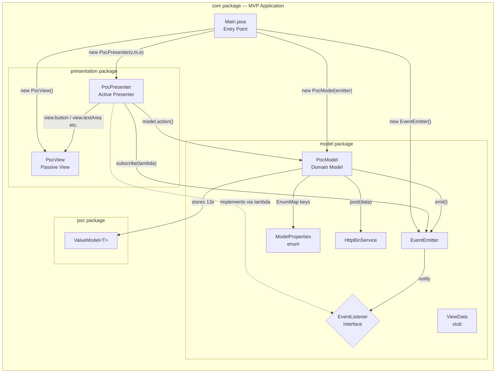
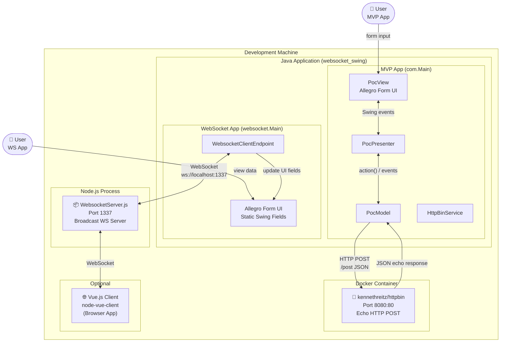
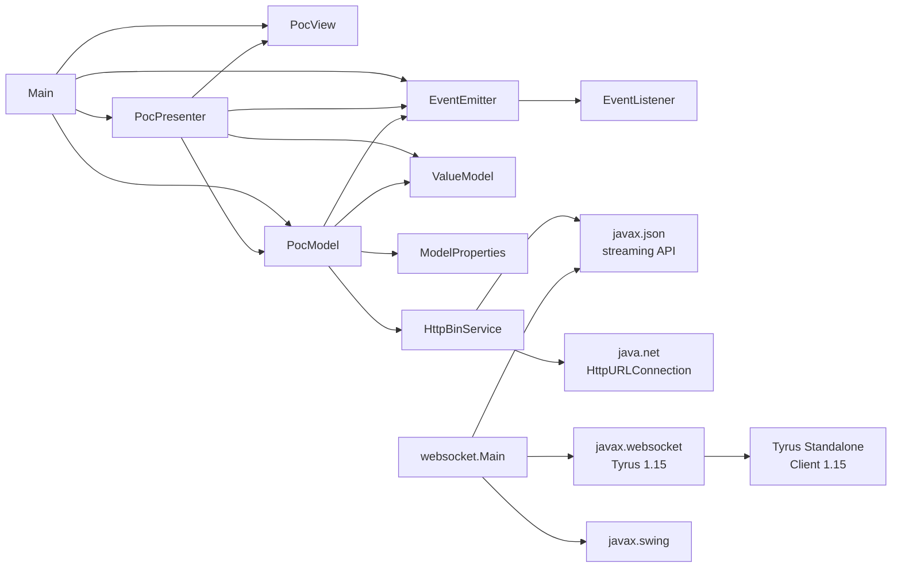
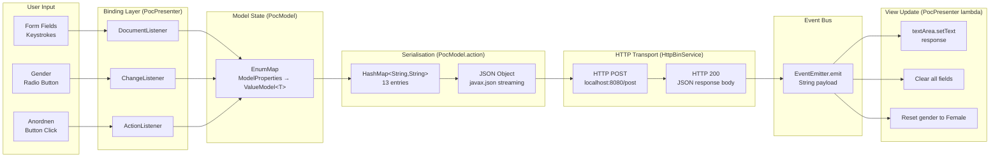
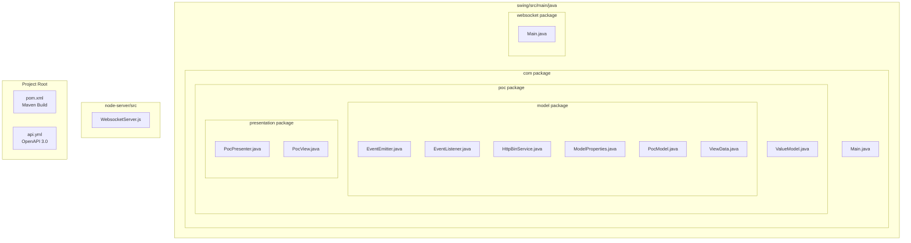

# Architecture Diagrams — Allegro PoC

> **Generated:** 2025-01-01  
> **System:** websocket_swing / Allegro PoC  
> **Format:** Mermaid syntax

---

## Table of Contents

1. [Layer Architecture Diagram](#1-layer-architecture-diagram)
2. [Component Diagram — MVP Module](#2-component-diagram--mvp-module)
3. [Component Diagram — WebSocket Module](#3-component-diagram--websocket-module)
4. [Full System Context Diagram](#4-full-system-context-diagram)
5. [Dependency Graph](#5-dependency-graph)
6. [Data Flow Diagram](#6-data-flow-diagram)
7. [Package Structure Diagram](#7-package-structure-diagram)

---

## 1. Layer Architecture Diagram

```mermaid
flowchart TB
    subgraph "🖥️ Presentation Layer"
        PV[PocView\nSwing JFrame + Form Components]
        PP[PocPresenter\nData Binding + Event Wiring]
    end

    subgraph "🧠 Model / Domain Layer"
        PM[PocModel\nForm State + Business Logic]
        VM["ValueModel&lt;T&gt;\nGeneric Value Holder"]
        MP[ModelProperties\nField Key Enum]
        EE[EventEmitter\nPub-Sub Event Bus]
        EL[EventListener\nObserver Interface]
        VD[ViewData\nStub / Placeholder]
    end

    subgraph "🔌 Service / Integration Layer"
        HBS[HttpBinService\nHTTP POST Client]
    end

    subgraph "📡 WebSocket Client Layer"
        WM["websocket.Main\nMonolithic Swing + WS Client"]
    end

    subgraph "🌐 External Systems"
        HTTPBin["HTTPBin Server\nlocalhost:8080"]
        NodeWS["Node.js WS Server\nlocalhost:1337"]
    end

    PP <-->|reads/updates| PV
    PP -->|calls action()| PM
    PP ..|implements| EL
    PP -->|subscribes| EE

    PM -->|stores state in| VM
    PM -->|keyed by| MP
    PM -->|emits via| EE
    PM -->|delegates HTTP| HBS
    EE -->|notifies| EL

    HBS -->|HTTP POST /post| HTTPBin

    WM -->|WebSocket ws://| NodeWS
```

---

## 2. Component Diagram — MVP Module



---

## 3. Component Diagram — WebSocket Module

```mermaid
flowchart TB
    subgraph "websocket package — WebSocket Client Application"
        WM["websocket.Main\n(God Class)"]

        subgraph "Inner Classes"
            CE[WebsocketClientEndpoint\n@ClientEndpoint]
            MSG[Message\ntarget + content]
            SR[SearchResult\nPerson Data POJO]
        end

        subgraph "Static UI Fields"
            UI["JFrame + JTextArea\n+ 10x JTextField\n+ 3x JRadioButton"]
        end
    end

    subgraph "External"
        NWS["Node.js WebSocket Server\nws://localhost:1337"]
    end

    WM -->|"creates"| CE
    WM -->|"manages"| UI
    CE -->|"@OnOpen @OnClose @OnMessage"| NWS
    CE -->|"extract(json)"| MSG
    CE -->|"toSearchResult(json)"| SR
    CE -->|"update static fields"| UI
```

---

## 4. Full System Context Diagram



---

## 5. Dependency Graph



---

## 6. Data Flow Diagram



---

## 7. Package Structure Diagram



---

## Architecture Summary

| Aspect | Details |
|--------|---------|
| **Architecture Style** | Desktop client (Swing), MVP pattern |
| **Communication Styles** | Synchronous HTTP (MVP module), WebSocket (WS module) |
| **Data Format** | JSON (both in/out) |
| **Key Patterns** | MVP, Observer/EventBus, Generic ValueObject, Enum-keyed Map |
| **External Dependencies** | HTTPBin (echo), Node.js WS Server |
| **Build** | Maven 3.x, Java 22 |
| **Identified Risks** | No input validation, EDT blocking, hardcoded URLs, zero tests |
