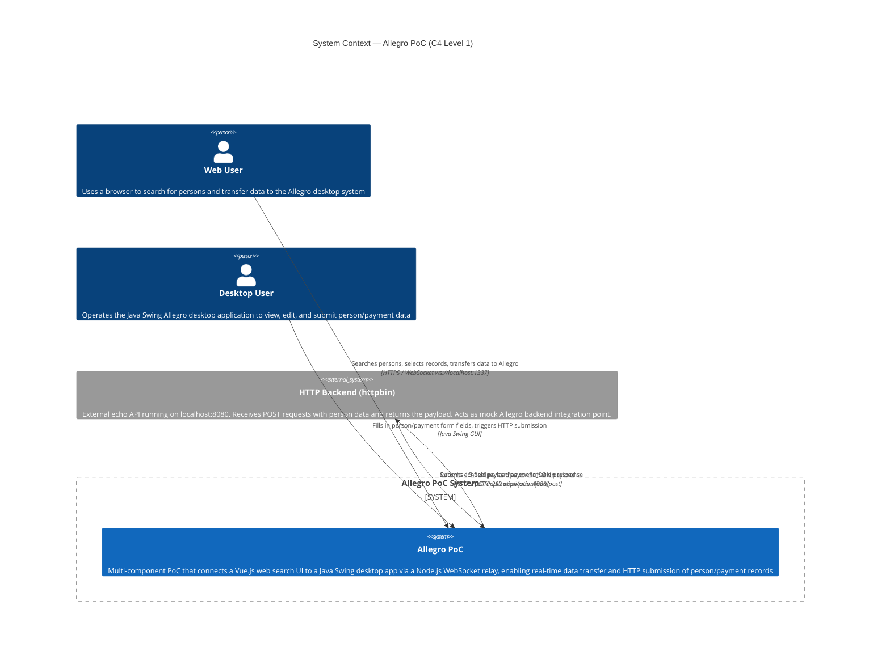
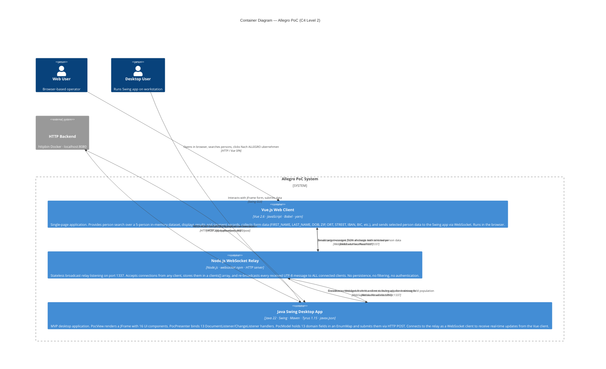
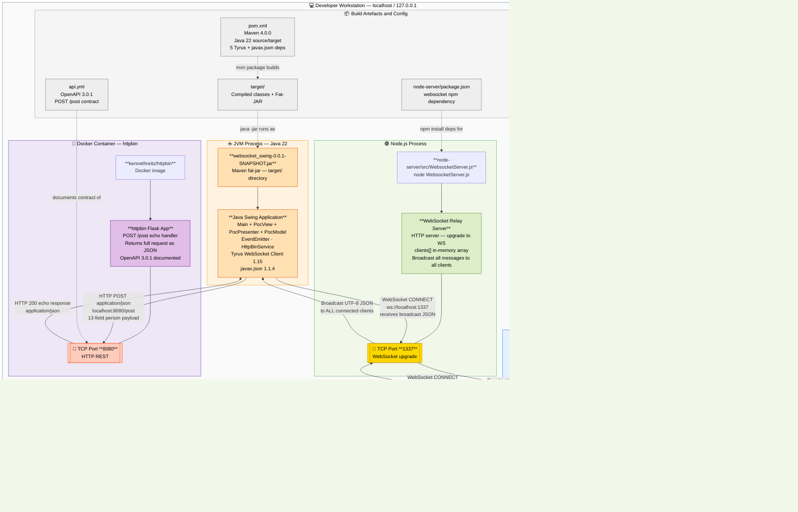

# Allegro PoC — Comprehensive Architecture Diagrams

> **Generated by**: architecture-analyzer agent  
> **Repository**: Chris-Capgemini/test-custom-agents-2  
> **Date**: 2025-01-27  
> **Requested output paths**: `output/architecture-diagrams.md` and `analysis_output/architecture-analyzer/architecture-diagrams.md` *(saved here because neither `output/` nor `analysis_output/architecture-analyzer/` directories exist — same fallback pattern as prior agents)*  
> **Source inputs**: `analysis_results.json` · `ast-*.json` · `bpmn-diagrams.md` · `uml-diagrams.md` · `ddl-schema-documentation.md` · direct source reads of all 14 source files + `api.yml`  
> **Format**: Mermaid only — all diagrams are native Mermaid code blocks

---

## Table of Contents

1. [System Context Diagram (C4 Level 1)](#1-system-context-diagram-c4-level-1)
2. [Container Diagram (C4 Level 2)](#2-container-diagram-c4-level-2)
3. [Component Diagram (C4 Level 3) — Java Swing Application](#3-component-diagram-c4-level-3--java-swing-application)
4. [Deployment Diagram — Localhost Process Map](#4-deployment-diagram--localhost-process-map)
5. [Technology Stack Diagram](#5-technology-stack-diagram)
6. [Data Flow Diagram — Messages Through the System](#6-data-flow-diagram--messages-through-the-system)
7. [Architecture Summary](#architecture-summary)
8. [Migration Recommendations](#migration-recommendations)

---

## 1. System Context Diagram (C4 Level 1)

**Purpose**: Shows the overall system boundary of the Allegro PoC, the two human actors who interact with it, and the single external backend system it depends on.

The system bridges a **legacy Allegro desktop experience** (Java Swing) with a **modern web search UI** (Vue.js). The Node.js relay is the glue — it receives WebSocket messages from the browser and broadcasts them to all connected clients including the Swing app. The HTTP backend is an external echo service used for round-trip validation.

---

## 2. Container Diagram (C4 Level 2)

**Purpose**: Zooms in to show the four distinct runtime containers that make up the Allegro PoC system — their technology, responsibilities, and how they communicate.

| Container | Technology | Port | Role |
|---|---|---|---|
| Vue.js Web Client | Vue 2.6, Babel, yarn | browser | Person search + data entry UI |
| Node.js WebSocket Relay | Node.js, `websocket` npm | 1337 | Stateless broadcast relay |
| Java Swing Desktop App | Java 22, Swing, Tyrus 1.15 | — (client) | MVP desktop form + HTTP submitter |
| HTTP Backend (httpbin) | External Docker container | 8080 | Echo POST endpoint |

---

## 3. Component Diagram (C4 Level 3) — Java Swing Application

**Purpose**: Drills into the Java Swing container to expose every class, its responsibilities, and the internal wiring of the MVP architecture plus the supporting infrastructure classes.

The Swing app follows a strict **Model-View-Presenter** pattern with an **Observer (EventEmitter/EventListener)** overlay for asynchronous result propagation:

- **PocView** — passive view, creates all UI widgets, delegates all events to PocPresenter  
- **PocPresenter** — all interaction logic: 13 listener bindings, WebSocket message handling, action dispatch  
- **PocModel** — single source of truth for 13 domain fields, owns the HTTP submission lifecycle  
- **EventEmitter/EventListener** — lightweight observer bus between Model and View  
- **HttpBinService** — isolated HTTP POST adapter  
- **ValueModel\<T\>** — typed wrapper for each domain field  
- **ModelProperties** — canonical enum of the 13 field names  

```mermaid
graph TB
    subgraph entryPoint["⚙️ Entry Point — com"]
        direction TB
        MAIN["**Main.java**\nComposition root\nInstantiates and wires MVP triad\nCountDownLatch keep-alive\nInjects shared EventEmitter"]
    end

    subgraph presentationLayer["🖼️ Presentation Layer — com.poc.presentation"]
        direction LR
        VIEW["**PocView**\nJFrame — 16 UI components\n─────────────────────────\njtfFirstName · jtfLastName\njtfDob · jtfZip · jtfOrt\njtfStreet · jtfIban · jtfBic\njtfValidFrom · textArea\nrbMale · rbFemale · rbDiverse\nbtnAction · btnWebsocket\nButtonGroup — gender mutex"]

        PRESENTER["**PocPresenter**\n13 DocumentListener bindings\n3 ChangeListener bindings\n─────────────────────────\nbindView() — wires all listeners\nhandleWsMessage() — parses JSON\nhandleAction() — delegates to model\n@OnMessage WebSocket handler"]
    end

    subgraph modelLayer["🗃️ Model Layer — com.poc.model"]
        direction TB

        MODEL["**PocModel**\nEnumMap of ModelProperties to ValueModel\n13 domain fields — all null at init\n─────────────────────────\ngetValue() / setValue()\naction() — serialise + HTTP submit\nemit success or error via EventEmitter"]

        ENUM["**ModelProperties** *(enum)*\nTEXT_AREA · FIRST_NAME · LAST_NAME\nDATE_OF_BIRTH · ZIP · ORT · STREET\nIBAN · BIC · VALID_FROM\nMALE · FEMALE · DIVERSE"]

        VALUEMODEL["**ValueModel&lt;T&gt;**\nGeneric typed field wrapper\n─────────────────────────\ngetField() · setField(field)"]

        EMITTER["**EventEmitter**\nList of EventListener subscribers\n─────────────────────────\nsubscribe(listener)\nemit(eventData: String)"]

        LISTENER["**EventListener** *(interface)*\nonEvent(eventData: String)"]

        HTTP_SVC["**HttpBinService**\nHTTP POST adapter\n─────────────────────────\npost(Map data)\nPOST localhost:8080/post\nReturns response body string"]

        VIEWDATA["**ViewData**\nDTO for WebSocket messages\nEncapsulates target + content\nParsed from incoming JSON frames"]
    end

    subgraph externalWS["🔌 External WebSocket Client — javax.websocket / Tyrus 1.15"]
        WS_CLIENT["**WebSocket Client Endpoint**\n@ClientEndpoint annotation\n─────────────────────────\n@OnOpen — connection established\n@OnMessage — delegates to Presenter\n@OnClose — connection closed\nURI: ws://localhost:1337"]
    end

    subgraph externalHTTP["🌐 External HTTP Backend"]
        HTTPBIN["**httpbin :8080/post**\nPOST application/json\nEcho backend — returns payload"]
    end

    subgraph wsRelay["📡 Node.js WebSocket Relay"]
        RELAY["**ws://localhost:1337**\nStateless broadcast relay\nBroadcasts to all clients"]
    end

    %% ── Main wiring ──────────────────────────────────────────────────────
    MAIN -->|"new PocView()"| VIEW
    MAIN -->|"new PocModel(eventEmitter)"| MODEL
    MAIN -->|"new PocPresenter(view, model)"| PRESENTER
    MAIN -->|"new EventEmitter()"| EMITTER

    %% ── Presenter wiring ─────────────────────────────────────────────────
    PRESENTER -->|"reads UI component state"| VIEW
    VIEW -.->|"implements EventListener\nonEvent() updates result label"| LISTENER

    %% ── Presenter to Model ───────────────────────────────────────────────
    PRESENTER -->|"setValue(property, value) x 13"| MODEL
    PRESENTER -->|"handleAction() triggers model.action()"| MODEL
    PRESENTER -->|"@OnMessage delegates parsed JSON"| WS_CLIENT

    %% ── Model internals ──────────────────────────────────────────────────
    MODEL -->|"stores 13 entries of"| VALUEMODEL
    MODEL -->|"keyed by"| ENUM
    MODEL -->|"emit(result)"| EMITTER
    MODEL -->|"post(dataMap)"| HTTP_SVC
    EMITTER -->|"notify all subscribers"| LISTENER

    %% ── External ─────────────────────────────────────────────────────────
    HTTP_SVC -->|"HTTP POST JSON 13 fields"| HTTPBIN
    WS_CLIENT -->|"WebSocket CONNECT"| RELAY

    %% ── Styles ───────────────────────────────────────────────────────────
    style MAIN fill:#E8F4FD,stroke:#2196F3,color:#000
    style VIEW fill:#F3E5F5,stroke:#9C27B0,color:#000
    style PRESENTER fill:#EDE7F6,stroke:#673AB7,color:#000
    style MODEL fill:#E8F5E9,stroke:#4CAF50,color:#000
    style ENUM fill:#F1F8E9,stroke:#8BC34A,color:#000
    style VALUEMODEL fill:#F1F8E9,stroke:#8BC34A,color:#000
    style EMITTER fill:#FFF8E1,stroke:#FFC107,color:#000
    style LISTENER fill:#FFF8E1,stroke:#FFC107,color:#000
    style HTTP_SVC fill:#FCE4EC,stroke:#E91E63,color:#000
    style VIEWDATA fill:#E0F2F1,stroke:#009688,color:#000
    style WS_CLIENT fill:#E3F2FD,stroke:#1976D2,color:#000
    style HTTPBIN fill:#FFF3E0,stroke:#FF9800,color:#000
    style RELAY fill:#FFFDE7,stroke:#F9A825,color:#000

    style entryPoint fill:#F5F5F5,stroke:#9E9E9E,color:#000
    style presentationLayer fill:#F9F0FF,stroke:#9C27B0,color:#000
    style modelLayer fill:#F0F9F0,stroke:#4CAF50,color:#000
    style externalWS fill:#EBF5FB,stroke:#1976D2,color:#000
    style externalHTTP fill:#FFF8F0,stroke:#FF9800,color:#000
    style wsRelay fill:#FFFDE7,stroke:#F9A825,color:#000
```

---

## 4. Deployment Diagram — Localhost Process Map

**Purpose**: Shows all runtime processes executing on the developer's localhost, the OS ports they bind, the file-system artefacts they consume, and the network channels between them.

All four processes run on the **same machine** — there is no network hop between them. Communication is entirely via loopback (`127.0.0.1`). The Swing app and Node server run as native processes; httpbin uses Docker.

---

## 5. Technology Stack Diagram

**Purpose**: Maps all technologies across horizontal layers — from runtime environments down to protocols and build tooling — making it easy to see the full stack at a glance and identify modernisation opportunities.

```mermaid
graph TB
    subgraph uiLayer["👤 User Interface Layer"]
        direction LR
        UI_SWING["☕ **Java Swing JFrame**\n16 UI components\nJTextFields · JRadioButtons\nJTextArea · JButtons\nButtonGroup gender mutex"]
        UI_VUE["🌐 **Vue.js 2.6 SPA**\nSearch.vue Single File Component\nApp.vue root component\nHTML5 form inputs\nv-model reactive data binding\nNative WebSocket API"]
    end

    subgraph logicLayer["⚙️ Application Logic Layer"]
        direction LR
        LOGIC_SWING["**MVP — PocPresenter**\n13 DocumentListener bindings\n3 ChangeListener bindings\nbindView · handleWsMessage\nhandleAction"]
        LOGIC_VUE["**Vue Component Methods**\nsearchPerson — in-memory filter\nsendMessage — WS dispatch\nzahlungsempfaengerSelected\nconnect / disconnect"]
        LOGIC_NODE["**Node.js Relay Logic**\nwebSocketServer request handler\nconnection.on message broadcast\nclients array lifecycle management"]
    end

    subgraph domainLayer["🗃️ Domain Model Layer"]
        direction LR
        MODEL_JAVA["**PocModel — Java**\nEnumMap 13 typed fields\nValueModel generic wrapper\nModelProperties enum\nEventEmitter Observer bus\nHttpBinService adapter"]
        MODEL_VUE["**Vue data() object**\nsearch_space[5] mock dataset\nformdata bound fields\nselected_result\nzahlungsempfaenger_selected"]
    end

    subgraph commLayer["📡 Communication Layer"]
        direction LR
        WS_PROTO["**WebSocket — RFC 6455**\nws://localhost:1337\nUTF-8 JSON frames\nF1: person transfer payload\nF3: textarea sync payload\nBidirectional full-duplex"]
        HTTP_PROTO["**HTTP/REST — OpenAPI 3.0.1**\nPOST localhost:8080/post\napplication/json\n13-field PostObject schema\nEcho response PostResponseObject"]
    end

    subgraph relayLayer["🔄 Relay Layer"]
        NODE_RELAY["**Node.js WebSocket Relay**\nwebsocket npm package\nStateless broadcast — no filtering\nclients[] in-memory array\nNo auth · No TLS · No persistence\nPort 1337"]
    end

    subgraph runtimeLayer["🖥️ Runtime Layer"]
        direction LR
        RT_JVM["**JVM — Java 22**\nTyrus Standalone Client 1.15\ntyrus-websocket-core 1.2.1\ntyrus-spi 1.15\njavax.json-api 1.1.4\nGlassFish javax.json 1.0.4\nwebsocket-api 0.2"]
        RT_NODE["**Node.js Runtime**\nHTTP module built-in\nwebsocket npm 1.x\nCommonJS modules require"]
        RT_BROWSER["**Browser Runtime**\nHTML5 + ES6+\nNative WebSocket API\nVue.js 2.6 runtime\nBabel transpilation"]
        RT_DOCKER["**Docker Runtime**\nkennethreitz/httpbin image\nFlask + Python\nPort 8080"]
    end

    subgraph buildLayer["🔧 Build and Package Layer"]
        direction LR
        BUILD_MAVEN["**Maven 4.0.0**\npom.xml\nmaven-compiler-plugin\nJava 22 source + target\nFat-JAR output"]
        BUILD_NPM["**npm**\nnode-server/package.json\nwebsocket server deps\nnode WebsocketServer.js"]
        BUILD_YARN["**Vue CLI 4 + yarn**\nbabel.config.js\nnode-vue-client/package.json\nyarn.lock locked deps\nyarn run serve"]
    end

    subgraph dataLayer["💾 Data and Schema Layer"]
        direction LR
        SCHEMA_API["**OpenAPI 3.0.1**\napi.yml\nPostObject 13 string fields\nPostResponseObject\nPOST /post endpoint spec"]
        SCHEMA_ENUM["**ModelProperties Enum**\nTEXT_AREA · FIRST_NAME · LAST_NAME\nDATE_OF_BIRTH · ZIP · ORT · STREET\nIBAN · BIC · VALID_FROM\nMALE · FEMALE · DIVERSE"]
        SCHEMA_DB["**Logical DB Schema**\nPostgreSQL migration target\npersons · zahlungsempfaenger\nwebsocket_messages\nswing_form_submissions\nv_person_with_primary_iban"]
    end

    %% Layer stacking
    uiLayer --> logicLayer
    logicLayer --> domainLayer
    domainLayer --> commLayer
    commLayer --> relayLayer
    relayLayer --> runtimeLayer
    runtimeLayer --> buildLayer
    domainLayer -.->|"field definitions"| dataLayer
    commLayer -.->|"payload schema"| dataLayer

    %% Styles — layers
    style uiLayer fill:#E3F2FD,stroke:#1565C0,color:#000
    style logicLayer fill:#F3E5F5,stroke:#6A1B9A,color:#000
    style domainLayer fill:#E8F5E9,stroke:#2E7D32,color:#000
    style commLayer fill:#FFF8E1,stroke:#F9A825,color:#000
    style relayLayer fill:#FFF3E0,stroke:#E65100,color:#000
    style runtimeLayer fill:#FCE4EC,stroke:#880E4F,color:#000
    style buildLayer fill:#F1F8E9,stroke:#558B2F,color:#000
    style dataLayer fill:#E0F7FA,stroke:#00695C,color:#000

    %% Styles — cells
    style UI_SWING fill:#BBDEFB,stroke:#1565C0,color:#000
    style UI_VUE fill:#BBDEFB,stroke:#1565C0,color:#000
    style LOGIC_SWING fill:#E1BEE7,stroke:#6A1B9A,color:#000
    style LOGIC_VUE fill:#E1BEE7,stroke:#6A1B9A,color:#000
    style LOGIC_NODE fill:#F8BBD9,stroke:#880E4F,color:#000
    style MODEL_JAVA fill:#C8E6C9,stroke:#2E7D32,color:#000
    style MODEL_VUE fill:#C8E6C9,stroke:#2E7D32,color:#000
    style WS_PROTO fill:#FFF9C4,stroke:#F9A825,color:#000
    style HTTP_PROTO fill:#FFF9C4,stroke:#F9A825,color:#000
    style NODE_RELAY fill:#FFCCBC,stroke:#BF360C,color:#000
    style RT_JVM fill:#F8BBD9,stroke:#880E4F,color:#000
    style RT_NODE fill:#F8BBD9,stroke:#880E4F,color:#000
    style RT_BROWSER fill:#F8BBD9,stroke:#880E4F,color:#000
    style RT_DOCKER fill:#F8BBD9,stroke:#880E4F,color:#000
    style BUILD_MAVEN fill:#DCEDC8,stroke:#558B2F,color:#000
    style BUILD_NPM fill:#DCEDC8,stroke:#558B2F,color:#000
    style BUILD_YARN fill:#DCEDC8,stroke:#558B2F,color:#000
    style SCHEMA_API fill:#B2EBF2,stroke:#00695C,color:#000
    style SCHEMA_ENUM fill:#B2EBF2,stroke:#00695C,color:#000
    style SCHEMA_DB fill:#B2EBF2,stroke:#00695C,color:#000
```

---

## 6. Data Flow Diagram — Messages Through the System

**Purpose**: Traces every data payload as it flows through the system — from user action, through each processing component, to its final destination — showing payload transformations, protocol switches, and broadcast semantics.

Three distinct flows are modelled:

| Flow | Trigger | Path | Protocol |
|---|---|---|---|
| **F1 — Vue to Swing Person Transfer** | User clicks "Nach ALLEGRO übernehmen" | Vue SPA → WS Relay → Swing App | WebSocket ws:// |
| **F2 — Swing HTTP Submit** | User clicks action button in Swing | Swing Model → HttpBinService → httpbin | HTTP POST application/json |
| **F3 — Textarea Real-time Sync** | User types in Vue textarea | Vue SPA → WS Relay → All clients | WebSocket ws:// |

```mermaid
flowchart LR
    %% ─── ACTORS ───────────────────────────────────────────────────────────────
    WEB_USER(["🌐 Web User\n(Browser)"])
    DESKTOP_USER(["🖥️ Desktop User\n(Swing)"])

    %% ─── VUE CLIENT ───────────────────────────────────────────────────────────
    subgraph vueApp["Vue.js SPA — browser"]
        direction TB
        SEARCH_FORM["Search Form\nformdata.last · first · zip\nort · street · hausnr"]
        SEARCH_ENGINE["searchPerson()\nIn-memory filter over\nsearch_space 5 persons"]
        RESULT_TABLE["Results Table\nknr · name · first · dob\nzip · street · ort"]
        ZAHL_TABLE["Zahlungsempfanger Table\niban · bic · valid_from"]
        SELECT_BTN["Nach ALLEGRO ubernehmen\nbtn click — sendMessage()"]
        TEXTAREA_VUE["Textarea\nv-model: internal_content_textarea"]
        WS_CLIENT_VUE["WebSocket Client\nws://localhost:1337\nconnect() on mount"]
        SEND_MSG["sendMessage(selected, textfield)\nJSON.stringify payload\ndelete zahlungsempfaenger array"]
    end

    %% ─── NODE RELAY ───────────────────────────────────────────────────────────
    subgraph nodeRelay["Node.js WebSocket Relay — :1337"]
        direction TB
        WS_ACCEPT["wsServer.on request\nrequest.accept\nclients.push(connection)"]
        MSG_RECV["connection.on message\ntype === utf8\njson = message.utf8Data"]
        BROADCAST["for i in clients\nclients[i].sendUTF(json)\nBroadcast to ALL — no filtering"]
        CONN_CLOSE["connection.on close\nclients.splice(index,1)"]
    end

    %% ─── SWING APP ───────────────────────────────────────────────────────────
    subgraph swingApp["Java Swing App — JVM"]
        direction TB
        WS_CLIENT_SWING["Tyrus WebSocket Client\n@ClientEndpoint\nws://localhost:1337"]
        WS_HANDLER["@OnMessage handler\nhandleWsMessage()\nparses JSON via javax.json"]
        VIEWDATA_PARSE["ViewData.target\n== textfield check"]
        PRESENTER["PocPresenter\nsetValue(property, value)\nfor each mapped field"]
        MODEL_FIELDS["PocModel EnumMap\n13 ValueModel fields\nString: firstName lastName dob\nzip ort street iban bic validFrom\nBoolean: male female diverse"]
        ACTION_BTN["Action Button Click\nbtnAction — handleAction()"]
        SERIALISE["model.action()\nserialise all 13 fields\nto Map of String to String"]
        HTTP_SVC["HttpBinService\nHTTP POST\nlocalhost:8080/post\napplication/json body"]
        RESULT_EVENT["EventEmitter.emit(responseBody)\nonEvent() callback\nPocView label update"]
    end

    %% ─── HTTP BACKEND ────────────────────────────────────────────────────────
    subgraph httpBackend["HTTP Backend httpbin — :8080"]
        HTTP_POST_EP["POST /post\naccepts application/json\nOpenAPI 3.0.1 contract"]
        ECHO["Echo handler\nreturns json + data\nheaders + origin + url"]
    end

    %% ─── PAYLOAD SHAPES ──────────────────────────────────────────────────────
    subgraph payloads["📦 Payload Reference"]
        direction TB
        P1["**F1 — Person Transfer WS**\ntarget: textfield\ncontent:\n  first · name · dob\n  zip · ort · street\n  hausnr · knr\n  iban · bic · valid_from"]
        P2["**F2 — HTTP Submit REST**\nFIRST_NAME · LAST_NAME\nDATE_OF_BIRTH · ZIP · ORT\nSTREET · IBAN · BIC\nVALID_FROM · TEXT_AREA\nMALE · FEMALE · DIVERSE"]
        P3["**F3 — Textarea Sync WS**\ntarget: textarea\ncontent: typed text string"]
    end

    %% ─── FLOW F1 — Vue to Swing Person Transfer ───────────────────────────────
    WEB_USER -->|"1 enters search criteria"| SEARCH_FORM
    SEARCH_FORM -->|"2 searchPerson() triggered"| SEARCH_ENGINE
    SEARCH_ENGINE -->|"3 filtered match list"| RESULT_TABLE
    RESULT_TABLE -->|"4 click row selectResult"| ZAHL_TABLE
    ZAHL_TABLE -->|"5 click IBAN row\nzahlungsempfaengerSelected"| SELECT_BTN
    SELECT_BTN -->|"6 sendMessage()"| SEND_MSG
    SEND_MSG -->|"7 JSON frame UTF-8"| WS_CLIENT_VUE
    WS_CLIENT_VUE -->|"8 WebSocket frame\nws://localhost:1337"| WS_ACCEPT

    WS_ACCEPT -->|"9 push to clients[]"| MSG_RECV
    MSG_RECV -->|"10 extract utf8Data"| BROADCAST
    BROADCAST -->|"11a echo back to browser"| WS_CLIENT_VUE
    BROADCAST -->|"11b forward to Swing"| WS_CLIENT_SWING

    WS_CLIENT_SWING -->|"12 @OnMessage fired"| WS_HANDLER
    WS_HANDLER -->|"13 parse JSON ViewData"| VIEWDATA_PARSE
    VIEWDATA_PARSE -->|"14 target==textfield\nmap to ModelProperties"| PRESENTER
    PRESENTER -->|"15 setValue x 13 fields"| MODEL_FIELDS

    %% ─── FLOW F2 — Swing HTTP Submit ─────────────────────────────────────────
    DESKTOP_USER -->|"A fills form or receives via WS"| MODEL_FIELDS
    MODEL_FIELDS -->|"B user clicks action button"| ACTION_BTN
    ACTION_BTN -->|"C model.action()"| SERIALISE
    SERIALISE -->|"D Map of 13 string fields"| HTTP_SVC
    HTTP_SVC -->|"E POST application/json"| HTTP_POST_EP
    HTTP_POST_EP -->|"F route to echo handler"| ECHO
    ECHO -->|"G HTTP 200 plus JSON body"| HTTP_SVC
    HTTP_SVC -->|"H response body string"| RESULT_EVENT
    RESULT_EVENT -->|"I onEvent updates UI label"| DESKTOP_USER

    %% ─── FLOW F3 — Textarea Sync ─────────────────────────────────────────────
    WEB_USER -->|"alpha types in textarea"| TEXTAREA_VUE
    TEXTAREA_VUE -->|"beta v-model change\nsendMessage on change"| WS_CLIENT_VUE

    %% Payload reference
    P1 -. "F1 shape" .-> SEND_MSG
    P2 -. "F2 shape" .-> HTTP_SVC
    P3 -. "F3 shape" .-> TEXTAREA_VUE

    CONN_CLOSE -.->|"client gone\nremoved from clients[]"| BROADCAST

    %% ─── STYLES ──────────────────────────────────────────────────────────────
    style vueApp fill:#E3F2FD,stroke:#1565C0,color:#000
    style nodeRelay fill:#FFFDE7,stroke:#F9A825,color:#000
    style swingApp fill:#FFF3E0,stroke:#E65100,color:#000
    style httpBackend fill:#F3E5F5,stroke:#6A1B9A,color:#000
    style payloads fill:#F1F8E9,stroke:#33691E,color:#000
    style WEB_USER fill:#E3F2FD,stroke:#1565C0,color:#000
    style DESKTOP_USER fill:#FFF3E0,stroke:#E65100,color:#000
    style SEND_MSG fill:#FFD54F,stroke:#FF8F00,color:#000
    style BROADCAST fill:#FFD54F,stroke:#FF8F00,color:#000
    style PRESENTER fill:#A5D6A7,stroke:#2E7D32,color:#000
    style MODEL_FIELDS fill:#C8E6C9,stroke:#2E7D32,color:#000
    style HTTP_SVC fill:#CE93D8,stroke:#6A1B9A,color:#000
    style ECHO fill:#CE93D8,stroke:#6A1B9A,color:#000
    style SERIALISE fill:#FFCCBC,stroke:#E65100,color:#000
    style RESULT_EVENT fill:#FFF9C4,stroke:#F9A825,color:#000
    style P1 fill:#E8F5E9,stroke:#388E3C,color:#000
    style P2 fill:#FCE4EC,stroke:#C62828,color:#000
    style P3 fill:#E0F7FA,stroke:#00838F,color:#000
    style WS_ACCEPT fill:#FFF9C4,stroke:#F9A825,color:#000
    style MSG_RECV fill:#FFF9C4,stroke:#F9A825,color:#000
```

---

## Architecture Summary

### System Characteristics

| Dimension | Value |
|---|---|
| **Architectural pattern** | MVP (Swing) + Component SPA (Vue) + Stateless Relay (Node.js) |
| **System type** | Proof-of-Concept — modernisation bridge |
| **Runtime topology** | All 4 processes on single localhost machine |
| **Communication styles** | Synchronous HTTP (Swing→backend); Async broadcast WebSocket (Vue↔Swing via relay) |
| **State management** | EnumMap in PocModel (JVM); Vue reactive `data()` (browser); None in relay |
| **Persistence** | None — no database, no file I/O, all in-memory |
| **Search dataset** | 5 hard-coded persons in Vue `search_space[]` |
| **Security** | None — no auth, no CORS policy, no TLS, all localhost |
| **Scalability** | Single-user, single-machine — PoC only |
| **Observability** | `console.log` (Node); EventEmitter UI feedback (Swing); None (Vue) |
| **Containerisation** | None (Swing + Node native); Docker only for httpbin mock |
| **Build automation** | Maven (Java); npm (Node server); Vue CLI + yarn (Vue client) |

### Key Architectural Decisions

| # | Decision | Rationale |
|---|---|---|
| 1 | **Node.js as dumb relay** | Zero business logic — accepts, appends to array, re-broadcasts every frame. Entirely stateless and replaceable without affecting Vue or Swing. |
| 2 | **Tyrus standalone client** | Swing app uses a standalone Tyrus JAR to establish a WebSocket *client* connection without requiring a full Jakarta EE application server. |
| 3 | **EnumMap field store** | 13 domain fields stored as `ValueModel<?>` entries keyed by `ModelProperties` enum — gives compile-time safety over field names and type-safe generic access. |
| 4 | **EventEmitter for result propagation** | Observer bus decouples PocModel from PocView. PocView implements `EventListener` and subscribes at startup — Model never directly references View. |
| 5 | **In-memory mock dataset** | Vue `search_space` is 5 hard-coded persons. No REST call for search — the PoC runs with zero backend dependencies for the search path. |
| 6 | **Broadcast-all relay semantics** | Node relay sends every message to *all* connected clients including the sender. The Vue client receives its own sent messages back — acceptable for PoC, problematic for production. |

---

## Migration Recommendations

Based on the architecture analysis, the following cloud migration path is recommended (AWS-first, adaptable to Azure/GCP):

| # | Category | Recommendation | Cloud Service | Effort | Benefit |
|---|---|---|---|---|---|
| 1 | **WebSocket Relay** | Replace Node.js relay with a managed WebSocket service | AWS API Gateway WebSocket API / Azure Web PubSub / GCP Firebase Realtime | Low | Managed scaling, built-in auth, zero ops |
| 2 | **Swing to Web** | Migrate Java Swing MVP to a Vue 3 / React SPA using the same 13-field schema | AWS Amplify / Azure Static Web Apps / GCP Firebase Hosting | High | Cross-platform, no desktop install, same WS protocol |
| 3 | **HTTP Backend** | Replace httpbin echo mock with a real Spring Boot REST API | AWS Elastic Beanstalk / Azure App Service / GCP App Engine | Medium | Real business logic, DB persistence, input validation |
| 4 | **Persistence** | Add PostgreSQL database with the persons, zahlungsempfaenger, swing_form_submissions schema from ddl-schema.sql | AWS RDS PostgreSQL / Azure Database for PostgreSQL / GCP Cloud SQL | Medium | Durable data, audit trail, multi-user support |
| 5 | **Search** | Move in-memory search_space filter to server-side PostgreSQL full-text search | AWS RDS / Azure Cognitive Search / GCP Cloud SQL | Medium | Real data at scale, configurable ranking |
| 6 | **Security** | Add authentication and enforce WSS (TLS) on all WebSocket connections | AWS Cognito / Azure AD B2C / GCP Identity Platform | Medium | Production-grade security, role-based access |
| 7 | **Observability** | Integrate centralised logging and metrics for WS message tracing and HTTP latency | AWS CloudWatch / Azure Monitor / GCP Cloud Logging | Low | Operational visibility, alerting, debugging |
| 8 | **Containerisation** | Wrap Node.js relay and Spring Boot API in Docker images; deploy via container orchestration | AWS ECS Fargate / Azure AKS / GCP Cloud Run | Medium | Reproducible builds, horizontal scale, CI/CD integration |

---

*Architecture diagrams generated by the **architecture-analyzer** agent. All diagrams use Mermaid syntax rendered inline by GitHub, GitLab, arc42 documentation tools, and compatible Markdown viewers. No PlantUML or ASCII art used.*
