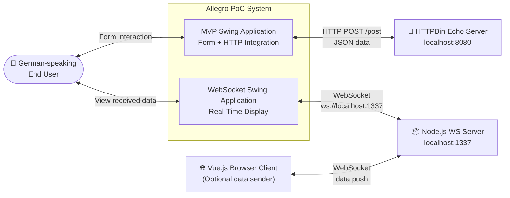
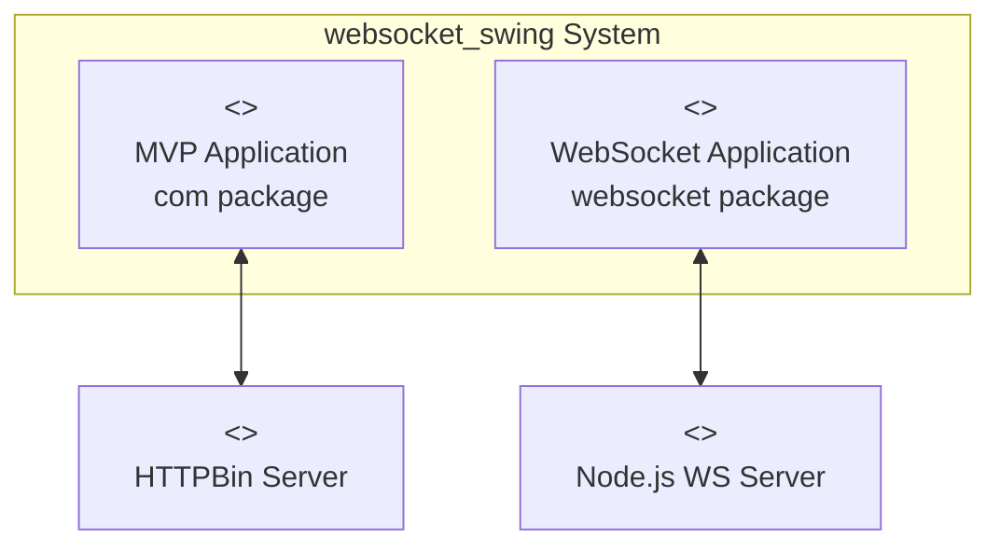
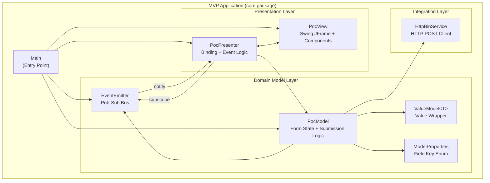
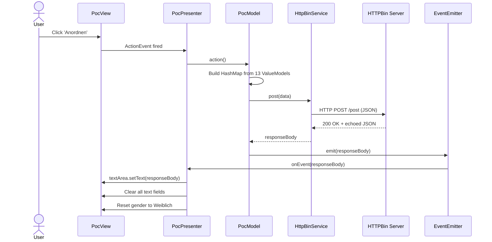
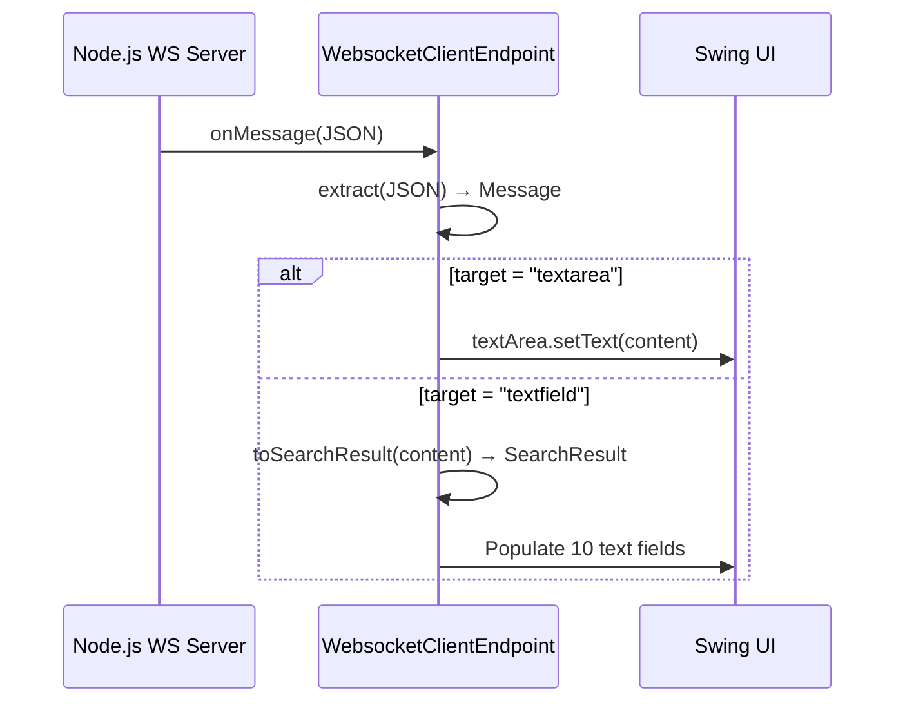
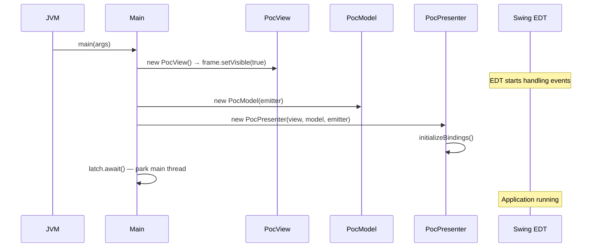
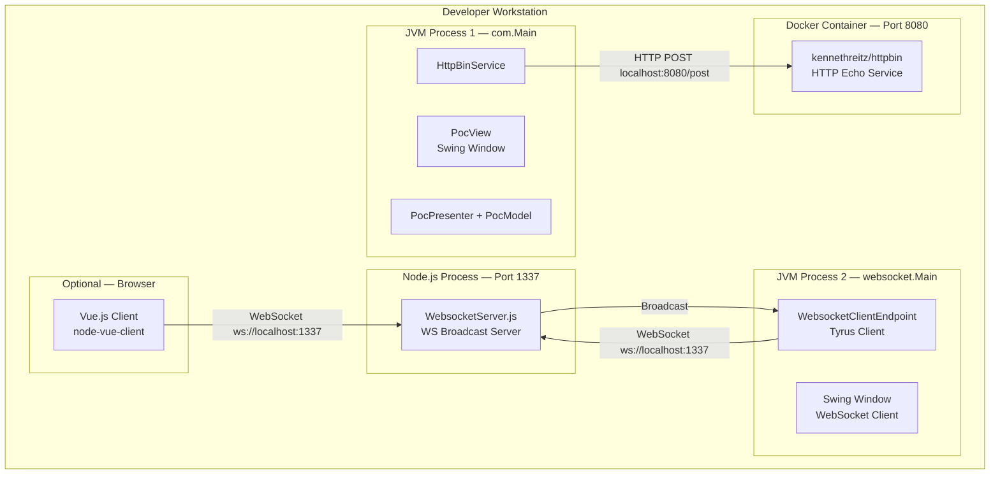
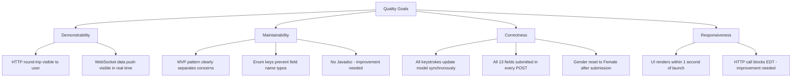

# Architecture Documentation — Allegro PoC
## Arc42 Template

> **System:** websocket_swing / Allegro PoC  
> **Version:** 1.0  
> **Date:** 2025-01-01  
> **Author:** GenInsights All-in-One Agent  
> **Status:** Initial documentation (auto-generated)

---

## Table of Contents

1. [Introduction and Goals](#1-introduction-and-goals)
2. [Architecture Constraints](#2-architecture-constraints)
3. [System Scope and Context](#3-system-scope-and-context)
4. [Solution Strategy](#4-solution-strategy)
5. [Building Block View](#5-building-block-view)
6. [Runtime View](#6-runtime-view)
7. [Deployment View](#7-deployment-view)
8. [Cross-Cutting Concepts](#8-cross-cutting-concepts)
9. [Architecture Decisions](#9-architecture-decisions)
10. [Quality Requirements](#10-quality-requirements)
11. [Risks and Technical Debt](#11-risks-and-technical-debt)
12. [Glossary](#12-glossary)

---

## 1. Introduction and Goals

### 1.1 Requirements Overview

The **Allegro PoC (Proof of Concept)** is a Java Swing desktop application that demonstrates two approaches to integrating a customer data entry form with backend services:

1. **MVP HTTP Integration** — A form-based UI following the Model-View-Presenter pattern, where user-entered data is submitted via HTTP POST to a backend echo service, and the response is displayed back in the form.

2. **WebSocket Real-Time Integration** — A standalone Swing client that connects to a Node.js WebSocket server and renders server-pushed JSON data into the form fields in real time.

The application captures the following customer data domains:

| Domain | Fields |
|--------|--------|
| Personal Identity | First Name, Last Name, Date of Birth, Gender |
| Address | Street, Postal Code (PLZ), City (Ort) |
| Banking | IBAN, BIC, Valid From Date |

The name "Allegro" suggests a connection to a Polish e-commerce or enterprise platform modernisation effort. The German-language UI labels indicate the target users are German-speaking.

### 1.2 Quality Goals

| Priority | Quality Goal | Motivation |
|----------|-------------|------------|
| 1 | **Demonstrability** | As a PoC, the system must clearly illustrate both HTTP and WebSocket integration patterns. |
| 2 | **Maintainability** | The MVP structure should allow future contributors to extend without deep knowledge of Swing internals. |
| 3 | **Correctness** | The binding between UI and model must be accurate — every keystroke must be reflected in the model before submission. |
| 4 | **Responsiveness** | The UI should remain responsive during backend calls (currently not achieved — see risks). |

### 1.3 Stakeholders

| Role | Name/Description | Expectation |
|------|-----------------|-------------|
| Developer | PoC implementer | Clean, understandable MVP code to learn from or extend |
| Architect | Reviewer | Assessment of patterns; basis for production design |
| Business Analyst | Requirements holder | Correct capture of all form fields as defined in OpenAPI spec |
| End User | German-speaking user | Fast, intuitive data entry form |

---

## 2. Architecture Constraints

### 2.1 Technical Constraints

| Constraint | Description |
|-----------|-------------|
| **Java 22** | Target JDK version; uses Java 22-specific unnamed variable (`var _`) syntax |
| **Java Swing** | UI framework (no migration to JavaFX, web, or Electron) |
| **HTTPBin Docker** | PoC backend is `kennethreitz/httpbin` Docker container on port 8080 |
| **Node.js WS Server** | WebSocket server is a Node.js process on port 1337 |
| **Maven** | Build system; all dependencies managed via `pom.xml` |
| **javax.websocket / Tyrus 1.15** | JSR-356 WebSocket client via Tyrus standalone client |
| **javax.json 1.1.4** | JSON serialisation/deserialisation via streaming API |
| **No external DI framework** | Manual wiring in `Main.java` |

### 2.2 Organisational Constraints

| Constraint | Description |
|-----------|-------------|
| **PoC scope** | This is explicitly a proof of concept; production-grade concerns (security, persistence, testing) are out of scope |
| **IntelliJ IDEA** | Primary IDE; project configured as described in README |
| **Local network only** | All URLs target `localhost`; no remote deployment |

### 2.3 Conventions

| Convention | Description |
|-----------|-------------|
| **Package naming** | `com.poc.model` for model, `com.poc.presentation` for view/presenter, `websocket` for WS module |
| **German labels** | All UI labels use German (Vorname, Nachname, Geburtsdatum, etc.) |
| **Enum as model keys** | `ModelProperties` enum keys all form fields; no stringly-typed lookups |

---

## 3. System Scope and Context

### 3.1 Business Context



### 3.2 Technical Context

| Interface | Type | Protocol | Description |
|-----------|------|----------|-------------|
| MVP → HTTPBin | Outbound | HTTP/1.1 POST | Form data submitted as JSON |
| HTTPBin → MVP | Inbound | HTTP/1.1 200 | Echo response (same JSON back) |
| WS Client → Node.js | Outbound | WebSocket | Connection establishment |
| Node.js → WS Client | Inbound | WebSocket | Server-pushed JSON messages |
| Vue.js → Node.js | Outbound | WebSocket | Optional: browser sends data to server |

---

## 4. Solution Strategy

### 4.1 Technology Decisions

| Decision | Technology Chosen | Rationale |
|----------|------------------|-----------|
| UI Framework | Java Swing | Existing skills, PoC requirement for desktop app |
| Architecture Pattern | MVP (Model-View-Presenter) | Better testability vs MVC in Swing; clear separation |
| Data Model | EnumMap + Generic ValueModel | Type-safe, compile-time field enumeration |
| Event Notification | Custom EventEmitter (pub-sub) | Decouples model outcomes from presenter; JavaScript-inspired |
| HTTP Client | java.net.HttpURLConnection | Built-in Java; sufficient for PoC (migration to HttpClient recommended) |
| JSON | javax.json (streaming API) | Low-level but avoids heavy Jackson dependency for PoC |
| WebSocket Client | Tyrus 1.15 (JSR-356) | Standard Java EE WebSocket implementation for SE clients |
| WS Server | Node.js 'websocket' module | Lightweight, rapidly set up broadcast server |

### 4.2 Top-Level Decomposition

The system is decomposed into two independent applications sharing visual design:

```
websocket_swing
├── com module (MVP)         — Clean MVP: PocView ↔ PocPresenter ↔ PocModel → HttpBinService
└── websocket module         — Monolithic: websocket.Main (UI + WS + JSON parsing)
```

The **com module** represents the architecturally preferred design. The **websocket module** is a prototype that should be refactored to follow the same MVP pattern in future iterations.

---

## 5. Building Block View

### 5.1 Level 1 — Whitebox: Overall System



| Component | Responsibility |
|-----------|---------------|
| **MVP Application** | Form-driven customer data entry with HTTP backend integration |
| **WebSocket Application** | Real-time display of server-pushed customer data |

### 5.2 Level 2 — Whitebox: MVP Application



**Contained Building Blocks:**

| Block | Type | Description |
|-------|------|-------------|
| `Main` | Class | Bootstrap; creates and wires all components |
| `PocView` | Class | Passive view; pure Swing rendering |
| `PocPresenter` | Class | Active presenter; binds UI ↔ model, handles actions |
| `PocModel` | Class | Domain model; state storage and submission logic |
| `EventEmitter` | Class | Synchronous pub-sub event bus |
| `EventListener` | Interface | Observer contract |
| `ValueModel<T>` | Generic Class | Typed value holder for form fields |
| `ModelProperties` | Enum | Compile-safe field key definitions |
| `HttpBinService` | Class | HTTP POST integration to HTTPBin |
| `ViewData` | Class | Empty stub (not yet implemented) |

### 5.3 Level 2 — Whitebox: WebSocket Application

```mermaid
flowchart TB
    subgraph "WebSocket Application (websocket package)"
        WMain["Main\n(Monolithic God Class)"]
        WCE["WebsocketClientEndpoint\n@ClientEndpoint (inner)"]
        Msg["Message\n(target + content, inner)"]
        SR["SearchResult\n(person data POJO, inner)"]
        StaticUI["Static Swing UI Fields\n(JFrame, JTextArea, JTextFields, JRadioButtons)"]
    end

    WMain -->|creates| WCE
    WMain -->|manages| StaticUI
    WCE -->|extract()| Msg
    WCE -->|toSearchResult()| SR
    WCE -->|updates| StaticUI
```

---

## 6. Runtime View

### 6.1 Scenario 1 — Form Submission (Happy Path)



### 6.2 Scenario 2 — WebSocket Data Push



### 6.3 Scenario 3 — Application Bootstrap



---

## 7. Deployment View

### 7.1 Infrastructure



### 7.2 Deployment Prerequisites

| Component | Requirement |
|-----------|------------|
| JDK | Java >= 22.0.1 |
| Maven | 3.x |
| Docker | Docker Desktop or Rancher Desktop |
| Node.js | v14+ (for WebSocket server) |
| IDE | IntelliJ IDEA (recommended) |

### 7.3 Startup Sequence

```
1. docker run -p 8080:80 kennethreitz/httpbin         # Start HTTP backend
2. cd node-server && npm install && node src/WebsocketServer.js   # Start WS server
3. Run com.Main (via IntelliJ or java -cp ...)         # Start MVP app
4. Run websocket.Main (optional)                       # Start WS client app
```

---

## 8. Cross-Cutting Concepts

### 8.1 Data Binding

The MVP module implements a **two-way synchronous data binding** pattern:

- **View → Model** (input): `DocumentListener` for text fields, `ChangeListener` for radio buttons
- **Model → View** (output): `EventEmitter` → `PocPresenter` lambda → direct View field updates

This is a manual implementation that could be replaced by a data binding library (e.g., JGoodies Binding) in production.

### 8.2 Event-Driven Communication

The custom `EventEmitter` / `EventListener` pair implements a **synchronous Observer pattern**. Events are:
- **Fired** by `PocModel` after HTTP submission
- **Consumed** by `PocPresenter` to update the View
- **Single-threaded** (all on EDT unless explicitly offloaded)

### 8.3 Error Handling

| Location | Current Behaviour | Recommended Behaviour |
|----------|------------------|----------------------|
| `PocPresenter` button click | `IOException` → `RuntimeException` (crashes EDT) | Show error dialog, log to SLF4J |
| `PocModel.action()` | NullPointerException risk on null fields | Null-safe serialisation |
| `HttpBinService.post()` | No connection cleanup on exception | Try-with-resources or finally block |
| `websocket.Main` startup | `DeploymentException` → `RuntimeException` | Show error dialog, retry logic |

### 8.4 Logging

Currently: `System.out.println()` scattered across `PocPresenter`, `PocModel`, `HttpBinService`, and `websocket.Main`.

**Recommendation:** Replace with SLF4J + Logback:
```xml
<dependency>
    <groupId>org.slf4j</groupId>
    <artifactId>slf4j-api</artifactId>
    <version>2.0.9</version>
</dependency>
```

### 8.5 Internationalisation (i18n)

All UI labels are hardcoded German strings in `PocView.java` and `websocket/Main.java`. No resource bundles or locale support exist.

**Recommendation:** Extract to `messages_de.properties` using `ResourceBundle`.

### 8.6 Thread Safety

| Concern | Status |
|---------|--------|
| Swing EDT — all UI updates | ✅ UI updates happen on EDT via event listeners |
| HTTP call on EDT | ❌ Blocks EDT; must use `SwingWorker` |
| EventEmitter thread safety | ❌ `ArrayList` not thread-safe for concurrent subscribe/emit |
| WebSocket onMessage thread | ❌ Tyrus may call onMessage from non-EDT thread; UI updates should use `SwingUtilities.invokeLater()` |

### 8.7 Testability

The MVP architecture improves testability by separating `PocPresenter` from the Swing framework. However:
- `HttpBinService` is directly instantiated (no interface for mocking)
- `PocModel.model` is public (bypasses encapsulation in tests)
- No test runner or test files exist

---

## 9. Architecture Decisions

### ADR-001 — Model-View-Presenter over MVC

| Attribute | Value |
|-----------|-------|
| **Status** | Accepted |
| **Date** | Initial development |

**Context:** Java Swing supports various UI architecture patterns.

**Decision:** Use MVP (Passive View variant) where PocPresenter coordinates all logic.

**Rationale:** MVP allows the Presenter to be unit-tested without the actual Swing View. The Passive View pattern keeps `PocView` as a dumb rendering container.

**Consequences:** 
- (+) Testable presenter logic
- (+) Clear responsibility separation
- (-) More boilerplate than direct Swing event handling
- (-) Presenter must manually wire all bindings

---

### ADR-002 — Custom EventEmitter over Java PropertyChangeSupport

| Attribute | Value |
|-----------|-------|
| **Status** | Accepted |

**Context:** The presenter needs to be notified when the model completes a backend operation.

**Decision:** Implement a custom `EventEmitter` with `String`-payload events.

**Rationale:** Simpler API, JavaScript-familiar pattern, avoids the verbosity of `PropertyChangeEvent` / `PropertyChangeListener`.

**Consequences:**
- (+) Simple, intuitive API
- (-) Not thread-safe (unlike `PropertyChangeSupport`)
- (-) String payload requires runtime casting/parsing

---

### ADR-003 — EnumMap + Generic ValueModel for State

| Attribute | Value |
|-----------|-------|
| **Status** | Accepted |

**Context:** Need to store form field values in a structured, type-safe way.

**Decision:** Use `ModelProperties` enum as map keys and `ValueModel<T>` as typed value wrappers.

**Rationale:** Compile-time safety for field names; avoids stringly-typed maps; generic `ValueModel<T>` provides type-safe access per field.

**Consequences:**
- (+) No typos in field names
- (+) Type safety for Boolean vs String fields
- (-) All fields must be pre-declared in the enum

---

### ADR-004 — HTTPBin as PoC Backend

| Attribute | Value |
|-----------|-------|
| **Status** | Accepted (PoC only) |

**Context:** A real backend service is not available for the PoC.

**Decision:** Use `kennethreitz/httpbin` Docker image which echoes back any JSON POST.

**Rationale:** No custom backend code needed; demonstrates the full HTTP round-trip.

**Consequences:**
- (+) Zero backend development effort
- (-) Cannot be used in production
- (-) URL is hardcoded to localhost:8080

---

### ADR-005 — Websocket Module as Separate Monolithic Application

| Attribute | Value |
|-----------|-------|
| **Status** | Accepted (PoC only) — should be revised |

**Context:** WebSocket integration was prototyped separately from the MVP module.

**Decision:** Keep `websocket.Main` as a separate standalone application.

**Rationale:** Faster prototyping; demonstrates WebSocket connectivity independently.

**Consequences:**
- (-) Significant UI code duplication with `PocView`
- (-) No MVP structure; not testable
- (-) Separate deployment; no integration with MVP module

---

## 10. Quality Requirements

### 10.1 Quality Tree



### 10.2 Quality Scenarios

| ID | Quality | Scenario | Measure | Current Status |
|----|---------|----------|---------|---------------|
| QS-001 | Correctness | User types in firstName, clicks Anordnen | firstName appears in HTTP POST JSON | ✅ Achieved |
| QS-002 | Correctness | Form submitted with empty fields | All 13 keys present in POST (with null/empty values) | ⚠️ Risk: NullPointerException |
| QS-003 | Responsiveness | HTTPBin takes 5 seconds to respond | UI remains interactive during call | ❌ EDT blocked |
| QS-004 | Demonstrability | HTTPBin responds with echoed JSON | Response displayed in textArea | ✅ Achieved |
| QS-005 | Maintainability | Add a new form field | Add 1 enum value, 1 binding, 1 UI component | ✅ Pattern supports this |
| QS-006 | Correctness | WebSocket server sends textfield message | All 10 Swing fields populated | ✅ Achieved |

---

## 11. Risks and Technical Debt

### 11.1 Risks

| ID | Risk | Probability | Impact | Mitigation |
|----|------|-------------|--------|------------|
| RISK-001 | EDT blocking during HTTP call freezes UI | HIGH | HIGH | Use `SwingWorker` for HTTP calls |
| RISK-002 | NullPointerException when null fields submitted | HIGH | HIGH | Null-safe serialisation in `PocModel.action()` |
| RISK-003 | `RuntimeException` crashes EDT silently | MEDIUM | HIGH | Proper error dialogs + logging |
| RISK-004 | Duplicate textArea add causes layout issues | HIGH | MEDIUM | Remove duplicate `panel.add(textArea)` |
| RISK-005 | WebSocket `onMessage` updating UI from non-EDT thread | MEDIUM | MEDIUM | Wrap in `SwingUtilities.invokeLater()` |

### 11.2 Technical Debt

| ID | Type | Description | Impact | Effort |
|----|------|-------------|--------|--------|
| TD-001 | Code | ~95% duplicate UI code between PocView and websocket/Main | HIGH | Medium |
| TD-002 | Design | websocket/Main is a monolithic God-class | HIGH | Large |
| TD-003 | Test | Zero test coverage across all 11 files | HIGH | Large |
| TD-004 | Documentation | No Javadoc on any class or method | MEDIUM | Small |
| TD-005 | Design | EventEmitter not thread-safe | MEDIUM | Small |
| TD-006 | Code | Debug System.out.println (no logging framework) | LOW | Small |

### 11.3 Known Bugs

| ID | Severity | Description | Fix |
|----|----------|-------------|-----|
| BUG-001 | Medium | `textArea` added to panel twice in `PocView.java` (lines 188-189) | Remove line 188 |
| BUG-002 | Medium | Same duplicate add bug in `websocket/Main.java` (lines 221-222) | Remove line 221 |
| BUG-003 | High | `model.get(val).getField().toString()` throws NPE when field is null | Add null-safe toString |
| BUG-004 | High | `InterruptedException` caught and re-thrown without restoring interrupt flag | Add `Thread.currentThread().interrupt()` |

---

## 12. Glossary

| Term | Definition |
|------|-----------|
| **Allegro** | Name of the Swing application and its main window title; likely references a Polish e-commerce platform modernisation |
| **Anordnen** | German for "Arrange/Submit" — the action button label |
| **BIC** | Bank Identifier Code — identifies the bank in international wire transfers |
| **EDT** | Event Dispatch Thread — Swing's dedicated thread for UI updates and event processing |
| **EventEmitter** | Custom pub-sub class broadcasting String events to registered `EventListener` instances |
| **Geburtsdatum** | German for "Date of Birth" |
| **HTTPBin** | Open-source HTTP echo server (`kennethreitz/httpbin`); returns any data POSTed to it |
| **IBAN** | International Bank Account Number — international standard for bank account identification |
| **ModelProperties** | Enum defining all 13 form field keys used as map keys in PocModel |
| **MVP** | Model-View-Presenter — architectural pattern separating UI rendering (View), business logic (Model), and coordination (Presenter) |
| **Ort** | German for "City/Location" — address field |
| **PLZ** | Postleitzahl — German for Postal Code / ZIP Code |
| **PoC** | Proof of Concept — a working prototype demonstrating technical feasibility |
| **Strasse** | German for "Street" — address field |
| **Tyrus** | Reference implementation of JSR-356 (Java WebSocket API); used as standalone client |
| **ValueModel&lt;T&gt;** | Generic wrapper holding a single typed value for a form field |
| **Vorname** | German for "First Name" |
| **WebSocket** | RFC 6455 bidirectional communication protocol over a single TCP connection |
| **Weiblich / Männlich / Divers** | German for Female / Male / Diverse — gender radio button options |

---

*Documentation generated by GenInsights All-in-One Agent. Based on automated static analysis of source code only. Manual review recommended before use as authoritative architecture specification.*
