# AST Analysis — Allegro PoC Repository

> **Generated by**: ast-analyzer agent  
> **Repository**: Chris-Capgemini/test-custom-agents-2  
> **Date**: 2025-01-01  
> **AST Version**: 1.0  
> **Note**: Output saved to `analysis_output/` (the `output/` directory did not exist and was created here instead)

---

## Table of Contents

1. [Repository Overview](#repository-overview)
2. [Architecture Summary](#architecture-summary)
3. [Java Swing Application AST](#java-swing-application-ast)
   - [Main.java](#mainjava)
   - [ValueModel.java](#valuemodeljava)
   - [ModelProperties.java](#modelpropertiesjava)
   - [EventEmitter.java](#eventemitterjava)
   - [EventListener.java](#eventlistenerjava)
   - [HttpBinService.java](#httpbinservicejava)
   - [ViewData.java](#viewdatajava)
   - [PocView.java](#pocviewjava)
   - [PocPresenter.java](#pocpresenterjava)
   - [PocModel.java](#pocmodeljava)
4. [Node.js Server AST](#nodejs-server-ast)
   - [WebsocketServer.js](#websocketserverjs)
5. [Vue.js Client AST](#vuejs-client-ast)
   - [main.js](#mainjs)
   - [App.vue](#appvue)
   - [Search.vue](#searchvue)
6. [Cross-Cutting Analysis](#cross-cutting-analysis)
   - [Class Hierarchy & Inheritance](#class-hierarchy--inheritance)
   - [Dependency Graph](#dependency-graph)
   - [Data Flow Patterns](#data-flow-patterns)
   - [Event Handling Structures](#event-handling-structures)
   - [Method Signatures Summary](#method-signatures-summary)
7. [Complexity Metrics](#complexity-metrics)

---

## Repository Overview

The Allegro PoC is a multi-tier, polyglot application composed of three distinct layers:

| Layer | Technology | Role |
|---|---|---|
| **Swing Desktop Client** | Java 21 (Swing) | Form-based GUI with MVP pattern |
| **WebSocket Relay Server** | Node.js | Broadcast relay between clients |
| **Web Search Client** | Vue.js 2 | Browser-based person-search UI |

**Communication Flow**:
```
[Java Swing GUI] ──HTTP POST──▶ [Node.js HTTP Server :8080]
                                        │
                             WebSocket broadcast
                                        │
                                        ▼
                              [Vue.js Web Client]
                       (ws://localhost:1337 WebSocket)
```

---

## Architecture Summary

### Pattern: Model-View-Presenter (MVP) — Java Swing Side

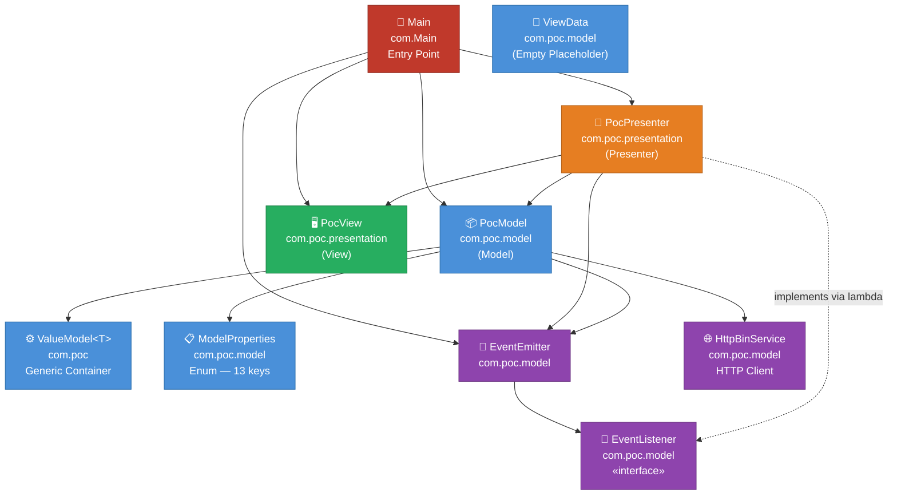

---

## Java Swing Application AST

### Main.java

**Package**: `com`  
**Role**: Application entry point — wires all MVP components together and blocks indefinitely.

#### Class: `Main`
| Attribute | Value |
|---|---|
| Modifiers | `public` |
| Extends | `Object` (implicit) |
| Implements | — |
| Fields | 0 |
| Methods | 1 |

#### Method: `main(String[] args)`
| Attribute | Value |
|---|---|
| Modifiers | `public static` |
| Return Type | `void` |
| Throws | `InterruptedException` |
| Cyclomatic Complexity | 1 |

**Body — AST Statement Sequence**:

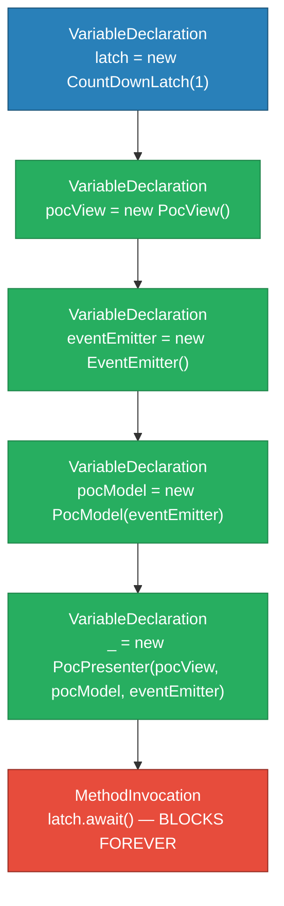

**Key Observations**:
- Uses Java 21 `var` type inference for all local variables
- Unnamed variable `_` (Java 21 feature) discards the `PocPresenter` reference — it self-registers via constructor side effects
- `CountDownLatch(1)` never counted down — keeps the JVM alive

---

### ValueModel.java

**Package**: `com.poc`  
**Role**: Generic single-value container used for all model fields.

#### Class: `ValueModel<T>`
| Attribute | Value |
|---|---|
| Modifiers | `public` |
| Type Parameters | `T` (unbounded) |
| Extends | `Object` (implicit) |
| Implements | — |
| Fields | 1 |
| Methods | 2 |
| Constructors | 1 |

#### Fields
| Name | Type | Modifiers | Initial Value |
|---|---|---|---|
| `field` | `T` | `private` | `null` (set via constructor) |

#### Constructor: `ValueModel(T field)`
```json
{
  "type": "Assignment",
  "target": "this.field",
  "value": { "type": "VariableReference", "name": "field" }
}
```

#### Methods
| Name | Modifiers | Return Type | Parameters | Body Summary |
|---|---|---|---|---|
| `getField()` | `public` | `T` | — | `return field` |
| `setField(T field)` | `public` | `void` | `field: T` | `this.field = field` |

**Generic Usage in PocModel**:
- `ValueModel<String>` — for all text fields (10 instances)
- `ValueModel<Boolean>` — for radio button state (3 instances: MALE, FEMALE, DIVERSE)

---

### ModelProperties.java

**Package**: `com.poc.model`  
**Role**: Enum defining the 13 keys used to index the model map.

#### Enum: `ModelProperties`
| Attribute | Value |
|---|---|
| Modifiers | `public` |
| Implements | — |
| Constants | 13 |
| Methods | 0 (uses inherited `values()`, `toString()`, `ordinal()`) |

#### Constants
| Ordinal | Name | Mapped UI Component |
|---|---|---|
| 0 | `TEXT_AREA` | `JTextArea` / `<textarea>` |
| 1 | `FIRST_NAME` | `JTextField firstName` |
| 2 | `LAST_NAME` | `JTextField name` |
| 3 | `DATE_OF_BIRTH` | `JTextField dateOfBirth` |
| 4 | `ZIP` | `JTextField zip` |
| 5 | `ORT` | `JTextField ort` |
| 6 | `STREET` | `JTextField street` |
| 7 | `IBAN` | `JTextField iban` |
| 8 | `BIC` | `JTextField bic` |
| 9 | `VALID_FROM` | `JTextField validFrom` |
| 10 | `FEMALE` | `JRadioButton female` |
| 11 | `MALE` | `JRadioButton male` |
| 12 | `DIVERSE` | `JRadioButton diverse` |

---

### EventEmitter.java

**Package**: `com.poc.model`  
**Role**: Custom publish/subscribe event bus — decouples model response from presenter.

#### Class: `EventEmitter`
| Attribute | Value |
|---|---|
| Modifiers | `public` |
| Extends | `Object` |
| Implements | — |
| Fields | 1 |
| Methods | 2 |

#### Fields
| Name | Type | Modifiers | Initial Value |
|---|---|---|---|
| `listeners` | `List<EventListener>` | `private final` | `new ArrayList<>()` |

#### Methods

**`subscribe(EventListener listener) : void`**
```json
{
  "type": "MethodInvocation",
  "target": "listeners",
  "methodName": "add",
  "arguments": [{ "name": "listener" }]
}
```

**`emit(String eventData) : void`**
```json
{
  "type": "ForEachStatement",
  "variable": "listener : EventListener",
  "iterable": "listeners",
  "body": [{
    "type": "MethodInvocation",
    "target": "listener",
    "methodName": "onEvent",
    "arguments": ["eventData"]
  }]
}
```

**Event flow**:
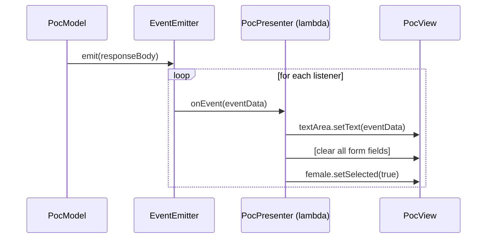

---

### EventListener.java

**Package**: `com.poc.model`  
**Role**: Functional interface — single abstract method `onEvent`.

#### Interface: `EventListener`
| Attribute | Value |
|---|---|
| Modifiers | `public` |
| Extends | — |
| Functional Interface | ✅ Yes (one SAM) |
| Lambda Target | ✅ Used as lambda in `PocPresenter` |

#### Methods
| Name | Modifiers | Return Type | Parameters |
|---|---|---|---|
| `onEvent(String eventData)` | abstract | `void` | `eventData: String` |

> **Note**: This interface shadows `java.util.EventListener` — the package-local declaration takes precedence in `com.poc.model`.

---

### HttpBinService.java

**Package**: `com.poc.model`  
**Role**: HTTP client — serializes the model map to JSON and POSTs it to the Node.js server.

#### Class: `HttpBinService`
| Attribute | Value |
|---|---|
| Modifiers | `public` |
| Extends | `Object` |
| Implements | — |
| Fields | 3 (constants) |
| Methods | 1 |

#### Fields (Constants)
| Name | Type | Modifiers | Value |
|---|---|---|---|
| `URL` | `String` | `public static final` | `"http://localhost:8080"` |
| `PATH` | `String` | `public static final` | `"/post"` |
| `CONTENT_TYPE` | `String` | `public static final` | `"application/json"` |

#### Method: `post(Map<String, String> data) : String`
| Attribute | Value |
|---|---|
| Modifiers | `public` |
| Throws | `IOException`, `InterruptedException` |
| Cyclomatic Complexity | 2 |

**Body — AST Statement Flow**:

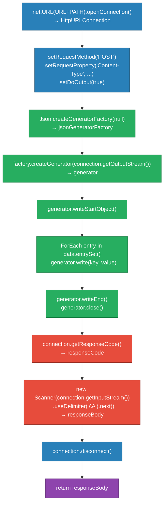

---

### ViewData.java

**Package**: `com.poc.model`  
**Role**: Empty placeholder class — defined but not used in current codebase.

#### Class: `ViewData`
| Attribute | Value |
|---|---|
| Modifiers | `public` |
| Fields | 0 |
| Methods | 0 |
| Status | ⚠️ Unused stub |

---

### PocView.java

**Package**: `com.poc.presentation`  
**Role**: Swing UI component — declares all visual widgets. Contains no logic.

#### Class: `PocView`
| Attribute | Value |
|---|---|
| Modifiers | `public` |
| Extends | `Object` |
| Implements | — |
| Fields | 16 |
| Methods | 1 (`initUI`) |
| Constructors | 1 |

#### Fields (All `protected` — accessible to Presenter)
| Name | Type | Label (DE) | Initial Value |
|---|---|---|---|
| `frame` | `JFrame` | — | `new JFrame("Allegro")` |
| `textArea` | `JTextArea` | RT | `new JTextArea()` |
| `name` | `JTextField` | Name | `new JTextField()` |
| `firstName` | `JTextField` | Vorname | `new JTextField()` |
| `dateOfBirth` | `JTextField` | Geburtsdatum | `new JTextField()` |
| `zip` | `JTextField` | PLZ | `new JTextField()` |
| `ort` | `JTextField` | Ort | `new JTextField()` |
| `street` | `JTextField` | Strasse | `new JTextField()` |
| `iban` | `JTextField` | IBAN | `new JTextField()` |
| `bic` | `JTextField` | BIC | `new JTextField()` |
| `validFrom` | `JTextField` | Gültig ab | `new JTextField()` |
| `female` | `JRadioButton` | Weiblich | `new JRadioButton("Weiblich")` |
| `male` | `JRadioButton` | Männlich | `new JRadioButton("Männlich")` |
| `diverse` | `JRadioButton` | Divers | `new JRadioButton("Divers")` |
| `gender` | `ButtonGroup` | Geschlecht | `new ButtonGroup()` |
| `button` | `JButton` | — | `new JButton("Anordnen")` |

#### Constructor: `PocView()`
Immediately delegates to `initUI()`.

#### Method: `initUI() : void` (private)
Builds a `GridBagLayout` panel (6 columns × 6 rows):


---

### PocModel.java

**Package**: `com.poc.model`  
**Role**: Data model — holds all form state in an `EnumMap` and triggers HTTP submission.

#### Class: `PocModel`
| Attribute | Value |
|---|---|
| Modifiers | `public` |
| Extends | `Object` |
| Implements | — |
| Fields | 3 |
| Methods | 1 |
| Constructors | 1 |

#### Fields
| Name | Type | Modifiers | Initial Value |
|---|---|---|---|
| `model` | `Map<ModelProperties, ValueModel<?>>` | `public` | `new EnumMap<>(ModelProperties.class)` |
| `httpBinService` | `HttpBinService` | `private` | `new HttpBinService()` |
| `eventEmitter` | `EventEmitter` | `private` | injected via constructor |

#### Constructor: `PocModel(EventEmitter eventEmitter)`
Initialises the `EnumMap` with 13 `ValueModel` entries:
- 10 × `ValueModel<String>(null)` — text fields
- 3 × `ValueModel<Boolean>(null)` — gender radio buttons

#### Method: `action() : void`
| Attribute | Value |
|---|---|
| Modifiers | `public` |
| Throws | `IOException`, `InterruptedException` |
| Cyclomatic Complexity | 4 (2 loops + 1 if/else) |

**Body AST Flow**:
```mermaid
flowchart TD
    classDef loop fill:#8e44ad,color:#fff,stroke:#6c3483
    classDef cond fill:#e67e22,color:#fff,stroke:#b8641c
    classDef call fill:#2980b9,color:#fff,stroke:#1a5276
    classDef decl fill:#27ae60,color:#fff,stroke:#1e8449

    L1["ForEach val in ModelProperties.values()\n  println(val + ': ' + model.get(val).getField())"]:::loop
    D1["VariableDeclaration\ndata = new HashMap&lt;String,String&gt;()"]:::decl
    L2["ForEach val in ModelProperties.values()\n  data.put(val.toString(), model.get(val).getField().toString())"]:::loop
    C1["VariableDeclaration\nresponseBody = httpBinService.post(data)"]:::call
    IF["IfStatement\n!responseBody.isEmpty()"]:::cond
    THEN["eventEmitter.emit(responseBody)"]:::call
    ELSE["eventEmitter.emit('Failed operation')"]:::call

    L1 --> D1 --> L2 --> C1 --> IF
    IF -- "true" --> THEN
    IF -- "false" --> ELSE
```

---

### PocPresenter.java

**Package**: `com.poc.presentation`  
**Role**: Wires `PocView` ↔ `PocModel` — registers event handlers, document listeners, and change listeners.

#### Class: `PocPresenter`
| Attribute | Value |
|---|---|
| Modifiers | `public` |
| Extends | `Object` |
| Implements | — |
| Fields | 2 |
| Methods | 3 |
| Constructors | 1 |
| Cyclomatic Complexity | 7 |

#### Fields
| Name | Type | Modifiers |
|---|---|---|
| `view` | `PocView` | `private` |
| `model` | `PocModel` | `private` |

#### Constructor: `PocPresenter(PocView, PocModel, EventEmitter)`
Registers three wiring operations:

**1. EventEmitter subscription (lambda → EventListener)**
```json
{
  "type": "LambdaExpression",
  "target": "EventListener.onEvent",
  "capturedVariables": ["view"],
  "sideEffects": [
    "view.textArea.setText(eventData)",
    "view.firstName.setText('')",
    "view.name.setText('')",
    "view.dateOfBirth.setText('')",
    "view.zip.setText('')",
    "view.ort.setText('')",
    "view.street.setText('')",
    "view.iban.setText('')",
    "view.bic.setText('')",
    "view.validFrom.setText('')",
    "view.female.setSelected(true)",
    "view.male.setSelected(false)",
    "view.diverse.setSelected(false)"
  ]
}
```

**2. Button ActionListener (lambda → ActionListener)**
```json
{
  "type": "LambdaExpression",
  "target": "view.button.addActionListener",
  "capturedVariables": ["model"],
  "body": "model.action()",
  "exceptionWrapping": ["IOException → RuntimeException", "InterruptedException → RuntimeException"]
}
```

**3. `initializeBindings()`**  
Calls `bind()` for all 13 `ModelProperties` keys.

#### Method: `bind(JTextComponent, ModelProperties) : void`
Overloaded variant for text components:
- Gets `ValueModel<String>` from `PocModel.model`
- Sets initial field value
- Registers anonymous `DocumentListener`:
  - `insertUpdate` → `model.setField(documentContent)`
  - `removeUpdate` → `model.setField(documentContent)`
  - `changedUpdate` → no-op

#### Method: `bind(JRadioButton, ModelProperties) : void`
Overloaded variant for radio buttons:
- Gets `ValueModel<Boolean>` from `PocModel.model`
- Sets initial field value
- Registers lambda `ChangeListener` → `model.setField(source.isSelected())`

#### Method: `initializeBindings() : void`

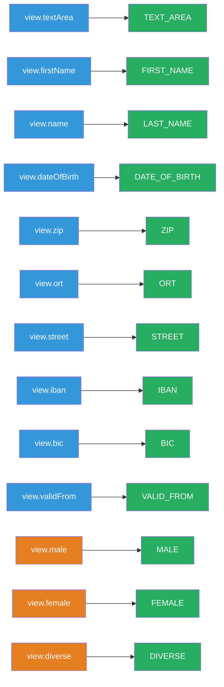

---

## Node.js Server AST

### WebsocketServer.js

**Path**: `node-server/src/WebsocketServer.js`  
**Language**: JavaScript (CommonJS)  
**Role**: WebSocket broadcast relay — accepts connections and mirrors messages to all connected clients.

#### Module-Level Declarations
| Kind | Name | Type | Value |
|---|---|---|---|
| `require` | `webSocketServer` | `websocket.server` | `require('websocket').server` |
| `require` | `http` | `http.Server` | `require('http')` |
| `var` | `webSocketsServerPort` | `number` | `1337` |
| `var` | `messages` | `Array` | `[]` |
| `var` | `clients` | `Array` | `[]` *(stores active connections)* |

#### HTTP Server
```json
{
  "type": "VariableDeclaration",
  "name": "server",
  "value": {
    "type": "MethodInvocation",
    "target": "http",
    "methodName": "createServer",
    "arguments": [{ "type": "FunctionExpression", "body": [] }]
  }
}
```
Listens on port `1337` — serves only as WebSocket upgrade host (no HTTP routes).

#### WebSocket Server Instantiation
```json
{
  "type": "ObjectCreation",
  "className": "webSocketServer",
  "arguments": [{ "httpServer": "server" }]
}
```

#### Event Handler: `wsServer.on('request', ...)`

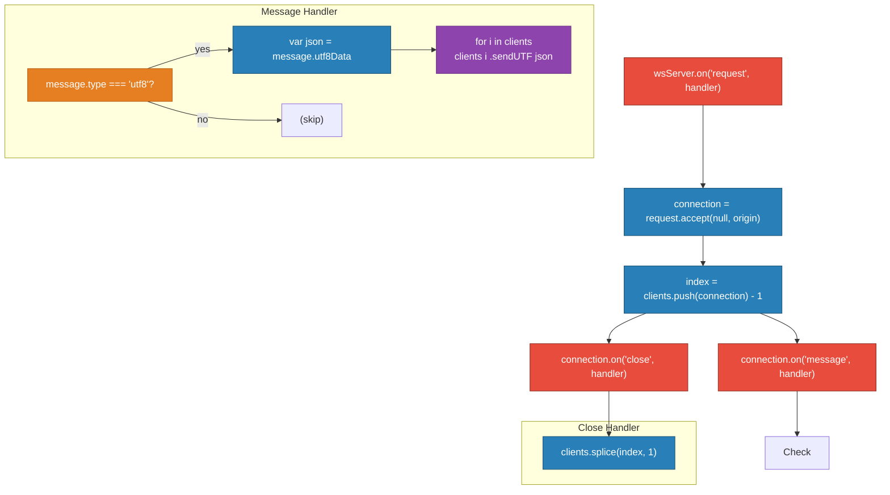

#### Methods / Functions Summary
| Scope | Name | Kind | Parameters | Purpose |
|---|---|---|---|---|
| Global | HTTP handler | `FunctionExpression` | `request, response` | Empty HTTP handler |
| Global | listen callback | `ArrowFunction` | — | Logs port |
| `wsServer.on` | request handler | `FunctionExpression` | `request` | Accepts WS connection |
| `connection.on` | message handler | `FunctionExpression` | `message` | Broadcasts UTF-8 messages |
| `connection.on` | close handler | `FunctionExpression` | `connection` | Removes from clients array |

---

## Vue.js Client AST

### main.js

**Path**: `node-vue-client/src/main.js`  
**Language**: JavaScript (ES Modules)  
**Role**: Vue application bootstrap — creates root instance and mounts to DOM.

#### Imports
| Name | Source | Type |
|---|---|---|
| `Vue` | `vue` | Default |
| `App` | `./App.vue` | Default |

#### Statements
```json
[
  { "type": "Assignment", "target": "Vue.config.productionTip", "value": false },
  {
    "type": "MethodChain",
    "chain": [
      { "type": "ObjectCreation", "className": "Vue", "args": [{ "render": "h => h(App)" }] },
      { "methodName": "$mount", "args": ["#app"] }
    ]
  }
]
```

---

### App.vue

**Path**: `node-vue-client/src/App.vue`  
**Language**: Vue SFC (Single File Component)  
**Role**: Root application shell — renders header and embeds `Search` component.

#### Template AST
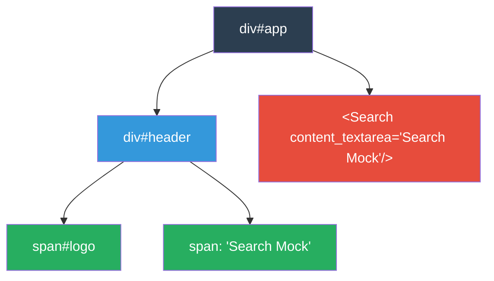

#### Script AST
| Property | Value |
|---|---|
| Component name | `app` |
| Registered components | `Search` |
| Props | — |
| Data | — |
| Methods | — |

---

### Search.vue

**Path**: `node-vue-client/src/components/Search.vue`  
**Language**: Vue SFC  
**Role**: Core search UI — person search form, results table, Zahlungsempfänger table, WebSocket integration.

#### Template Structure
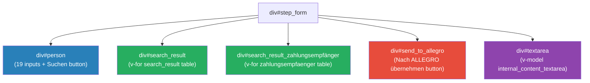

#### Component Options

##### Props
| Name | Type | Usage |
|---|---|---|
| `result_selected` | `String` | (declared, not used in current template) |
| `content_textarea` | `String` | Initialises `internal_content_textarea` |

##### Data Fields
| Name | Type | Initial Value | Purpose |
|---|---|---|---|
| `internal_content_textarea` | `String` | `this.content_textarea` | Two-way bound to `<textarea>` |
| `formdata` | `Object` | `{}` | Collects search form inputs |
| `search_result` | `Array` | `[]` | Holds persons matching search |
| `selected_result` | `Object` | `{}` | Currently highlighted person row |
| `zahlungsempfaenger_selected` | `String/Object` | `""` | Selected payment record |
| `search_space` | `Array<Person>` | Static 5-person dataset | In-memory "database" |

##### `search_space` Data Model
Each entry in `search_space`:
```json
{
  "first": "string",
  "name": "string",
  "dob": "YYYY-MM-DD",
  "zip": "string",
  "ort": "string",
  "street": "string",
  "hausnr": "string",
  "knr": "string",
  "zahlungsempfaenger": [
    { "iban": "string", "bic": "string", "valid_from": "YYYY-MM-DD", "valid_until": "", "type": "" }
  ]
}
```

##### Lifecycle Hook: `mounted`
```json
{ "hook": "mounted", "body": [{ "type": "MethodInvocation", "target": "this", "methodName": "connect" }] }
```

##### Methods
| Name | Return | Parameters | Cyclomatic Complexity | Purpose |
|---|---|---|---|---|
| `connect()` | void | — | 1 | Creates `WebSocket("ws://localhost:1337/")`, sets `onopen` handler |
| `disconnect()` | void | — | 1 | Closes socket, clears status and logs |
| `searchPerson()` | void | — | 7 | Filters `search_space` against `formdata` (6-field OR match) |
| `sendMessage(e, target)` | void | `e: Object, target: string` | 2 | Deep-copies object, optionally injects `zahlungsempfaenger`, sends via WebSocket |
| `selectResult(item)` | void | `item: Object` | 1 | Sets `selected_result` |
| `zahlungsempfaengerSelected(z)` | void | `zahlungsempfaenger: Object` | 1 | Sets `zahlungsempfaenger_selected` |

##### `searchPerson()` — Detailed AST
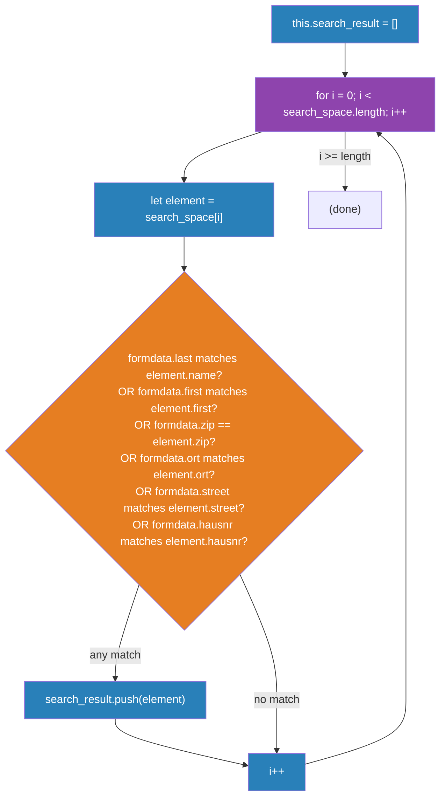

##### `sendMessage(e, target)` — Detailed AST
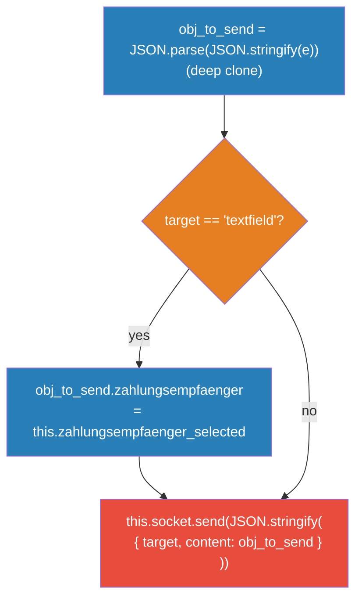

##### Watcher: `internal_content_textarea`
```json
{
  "watchedProperty": "internal_content_textarea",
  "handler": {
    "parameters": ["val"],
    "body": [{ "type": "MethodInvocation", "target": "this", "methodName": "sendMessage", "arguments": ["val", "\"textarea\""] }]
  }
}
```
**Effect**: Every keystroke in the textarea triggers a WebSocket broadcast with `target: "textarea"`.

---

## Cross-Cutting Analysis

### Class Hierarchy & Inheritance

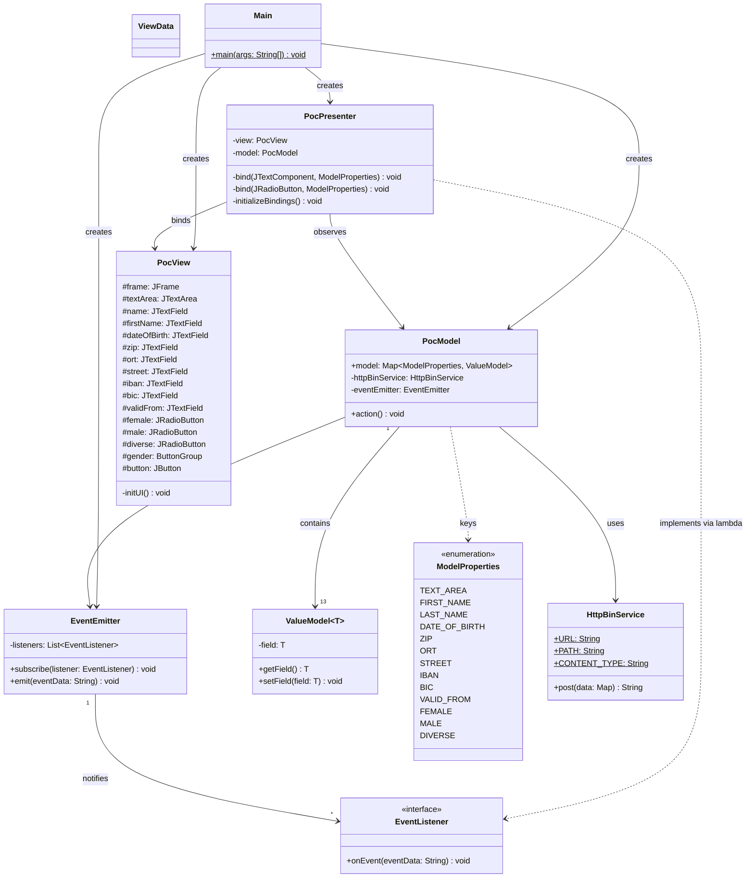

---

### Dependency Graph

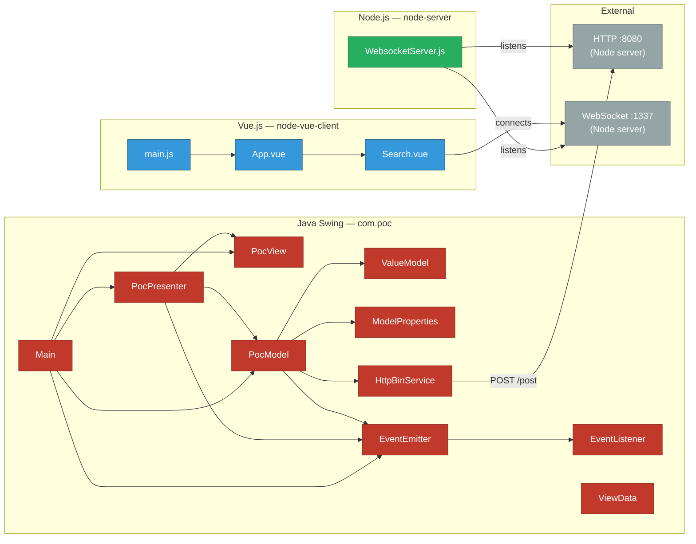

---

### Data Flow Patterns

#### Pattern 1: Form Field → Model (Two-Way Binding)

```mermaid
sequenceDiagram
    participant U as User
    participant V as PocView (JTextField)
    participant D as DocumentListener (anonymous)
    participant VM as ValueModel&lt;String&gt;
    participant M as PocModel.model EnumMap

    U->>V: Types text
    V->>D: insertUpdate(DocumentEvent)
    D->>VM: setField(documentContent)
    Note over VM,M: ValueModel is a reference stored in the EnumMap
    VM-->>M: (same reference, field updated)
```

#### Pattern 2: Button Click → HTTP POST → Event Emission → View Reset

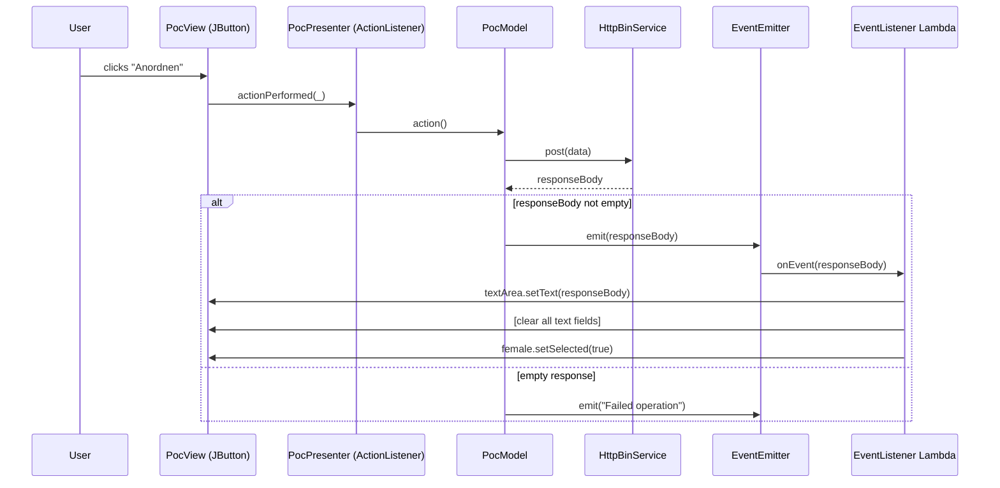

#### Pattern 3: Vue Textarea → WebSocket Broadcast → All Clients

```mermaid
sequenceDiagram
    participant U as User
    participant T as &lt;textarea&gt; (v-model)
    participant W as Watcher: internal_content_textarea
    participant S as this.socket (WebSocket)
    participant N as WebsocketServer.js
    participant C as All Other Clients

    U->>T: types text
    T->>W: val changed (Vue reactive)
    W->>S: sendMessage(val, "textarea")
    S->>N: send(JSON.stringify({target:"textarea", content:val}))
    N->>C: clients[i].sendUTF(json) for each client
```

#### Pattern 4: Search & Select → Send to Allegro

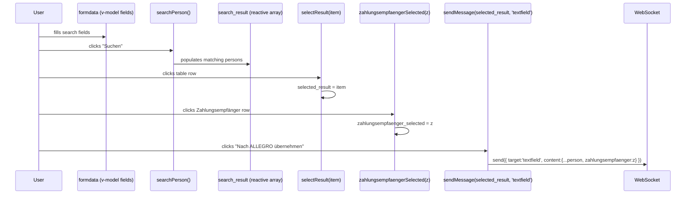

---

### Event Handling Structures

#### Java Swing — Complete Event Map

| Source | Event Type | Listener Type | Handler | Effect |
|---|---|---|---|---|
| `view.button` | `ActionEvent` | `ActionListener` (lambda) | `model.action()` | HTTP POST + emit |
| `view.textArea.document` | `DocumentEvent` | `DocumentListener` (anon) | `setField(content)` | Updates `TEXT_AREA` model |
| `view.firstName.document` | `DocumentEvent` | `DocumentListener` (anon) | `setField(content)` | Updates `FIRST_NAME` model |
| `view.name.document` | `DocumentEvent` | `DocumentListener` (anon) | `setField(content)` | Updates `LAST_NAME` model |
| `view.dateOfBirth.document` | `DocumentEvent` | `DocumentListener` (anon) | `setField(content)` | Updates `DATE_OF_BIRTH` model |
| `view.zip.document` | `DocumentEvent` | `DocumentListener` (anon) | `setField(content)` | Updates `ZIP` model |
| `view.ort.document` | `DocumentEvent` | `DocumentListener` (anon) | `setField(content)` | Updates `ORT` model |
| `view.street.document` | `DocumentEvent` | `DocumentListener` (anon) | `setField(content)` | Updates `STREET` model |
| `view.iban.document` | `DocumentEvent` | `DocumentListener` (anon) | `setField(content)` | Updates `IBAN` model |
| `view.bic.document` | `DocumentEvent` | `DocumentListener` (anon) | `setField(content)` | Updates `BIC` model |
| `view.validFrom.document` | `DocumentEvent` | `DocumentListener` (anon) | `setField(content)` | Updates `VALID_FROM` model |
| `view.male` | `ChangeEvent` | `ChangeListener` (lambda) | `setField(isSelected)` | Updates `MALE` model |
| `view.female` | `ChangeEvent` | `ChangeListener` (lambda) | `setField(isSelected)` | Updates `FEMALE` model |
| `view.diverse` | `ChangeEvent` | `ChangeListener` (lambda) | `setField(isSelected)` | Updates `DIVERSE` model |
| `eventEmitter` | Custom `EventEmitter` | `EventListener` (lambda) | Reset view | Clears form, shows response |

#### Vue.js — Complete Event Map

| Element | Event | Handler | Effect |
|---|---|---|---|
| `<button>Suchen` | `v-on:click` | `searchPerson()` | Filters `search_space` into `search_result` |
| `<tr> in #search_result` | `@click` | `selectResult(item)` | Sets `selected_result` |
| `<tr> in #search_result_zahlungsempfänger` | `@click` | `zahlungsempfaengerSelected(item)` | Sets `zahlungsempfaenger_selected` |
| `<button>Nach ALLEGRO` | `v-on:click` | `sendMessage(selected_result, 'textfield')` | Sends via WebSocket |
| `<textarea>` | `v-model` (watch) | `sendMessage(val, 'textarea')` | Broadcasts every keystroke |
| `WebSocket` | `onopen` | sets `this.status = 'connected'` | Connection lifecycle |

#### Node.js — WebSocket Event Map

| Emitter | Event | Handler | Effect |
|---|---|---|---|
| `wsServer` | `request` | Accept + store connection | Adds to `clients[]` |
| `connection` | `message` | Parse UTF-8, broadcast | Sends to all `clients[i]` |
| `connection` | `close` | `clients.splice(index,1)` | Removes disconnected client |

---

### Method Signatures Summary

#### Java — Complete Method Index

| Class | Method | Modifiers | Return | Parameters | Throws |
|---|---|---|---|---|---|
| `Main` | `main` | `public static` | `void` | `String[] args` | `InterruptedException` |
| `ValueModel<T>` | `getField` | `public` | `T` | — | — |
| `ValueModel<T>` | `setField` | `public` | `void` | `T field` | — |
| `PocModel` | `action` | `public` | `void` | — | `IOException`, `InterruptedException` |
| `EventEmitter` | `subscribe` | `public` | `void` | `EventListener listener` | — |
| `EventEmitter` | `emit` | `public` | `void` | `String eventData` | — |
| `EventListener` | `onEvent` | `abstract` | `void` | `String eventData` | — |
| `HttpBinService` | `post` | `public` | `String` | `Map<String,String> data` | `IOException`, `InterruptedException` |
| `PocView` | `initUI` | `private` | `void` | — | — |
| `PocPresenter` | `bind` *(overload 1)* | `private` | `void` | `JTextComponent, ModelProperties` | — |
| `PocPresenter` | `bind` *(overload 2)* | `private` | `void` | `JRadioButton, ModelProperties` | — |
| `PocPresenter` | `initializeBindings` | `private` | `void` | — | — |

#### JavaScript / Vue — Complete Method Index

| Module | Method | Parameters | Return | Purpose |
|---|---|---|---|---|
| `WebsocketServer.js` | HTTP handler | `request, response` | — | Empty HTTP handler |
| `WebsocketServer.js` | `wsServer.on('request')` | `request` | — | Accept WS connection |
| `WebsocketServer.js` | `connection.on('message')` | `message` | — | Broadcast UTF-8 |
| `WebsocketServer.js` | `connection.on('close')` | `connection` | — | Remove client |
| `Search.vue` | `connect` | — | void | Open WebSocket |
| `Search.vue` | `disconnect` | — | void | Close WebSocket |
| `Search.vue` | `searchPerson` | — | void | Filter persons |
| `Search.vue` | `sendMessage` | `e, target` | void | WS send |
| `Search.vue` | `selectResult` | `item` | void | Set selection |
| `Search.vue` | `zahlungsempfaengerSelected` | `zahlungsempfaenger` | void | Set payment selection |

---

## Complexity Metrics

| File | Language | LOC | Classes/Components | Methods | Cyclomatic Complexity | Notable |
|---|---|---|---|---|---|---|
| `Main.java` | Java | 23 | 1 class | 1 | 1 | Entry point |
| `ValueModel.java` | Java | 18 | 1 generic class | 2 | 1 | Generic T container |
| `ModelProperties.java` | Java | 18 | 1 enum | 0 | 1 | 13 enum constants |
| `EventEmitter.java` | Java | 21 | 1 class | 2 | 2 | Pub/Sub bus |
| `EventListener.java` | Java | 5 | 1 interface | 1 | 1 | Functional interface |
| `HttpBinService.java` | Java | 38 | 1 class | 1 | 2 | HTTP + JSON I/O |
| `ViewData.java` | Java | 5 | 1 class (empty) | 0 | 1 | Unused stub |
| `PocView.java` | Java | 203 | 1 class | 1 | 1 | 16 UI fields |
| `PocModel.java` | Java | 49 | 1 class | 1 | 4 | EnumMap with 13 entries |
| `PocPresenter.java` | Java | 113 | 1 class | 3 | 7 | 14 event listeners |
| `WebsocketServer.js` | Node.js | 68 | — | 4 callbacks | 3 | Broadcast relay |
| `main.js` | Vue/JS | 8 | — | 1 | 1 | Bootstrap |
| `App.vue` | Vue SFC | 47 | 1 component | 0 | 1 | Root shell |
| `Search.vue` | Vue SFC | 178 | 1 component | 6 | 12 | Core UI + WS client |
| **TOTAL** | — | **794** | **12** | **23** | **38** | |

### Complexity Breakdown

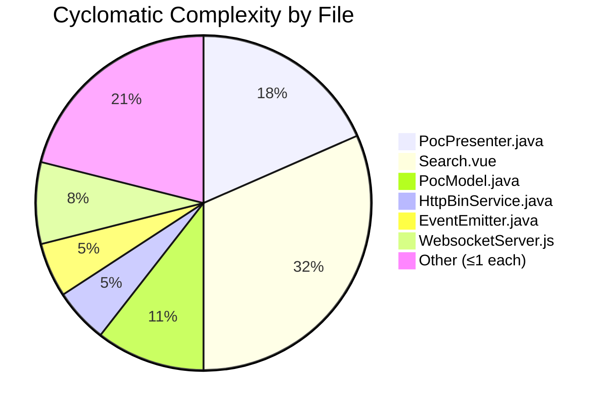

---

## Output Files

All individual AST JSON files are saved in `analysis_output/`:

| File | Description |
|---|---|
| `ast-Main.json` | Main.java AST |
| `ast-ValueModel.json` | ValueModel.java AST |
| `ast-PocModel.json` | PocModel.java AST |
| `ast-ModelProperties.json` | ModelProperties.java AST |
| `ast-EventEmitter.json` | EventEmitter.java AST |
| `ast-EventListener.json` | EventListener.java AST |
| `ast-HttpBinService.json` | HttpBinService.java AST |
| `ast-ViewData.json` | ViewData.java AST |
| `ast-PocView.json` | PocView.java AST |
| `ast-PocPresenter.json` | PocPresenter.java AST |
| `ast-WebsocketServer.json` | WebsocketServer.js AST |
| `ast-main.json` | main.js AST |
| `ast-App.json` | App.vue AST |
| `ast-Search.json` | Search.vue AST |
| `ast-analysis.md` | **This file** |
