# 🌳 Abstract Syntax Tree (AST) Analysis Report

**Repository**: `test-custom-agents-2`
**Generated**: 2025-01-01T00:10:00Z
**AST Analyzer Version**: 1.0
**Languages Detected**: Java 22, JavaScript (CommonJS + ES Modules), Vue.js 2 SFC

---

## 📋 Table of Contents

1. [Executive Summary](#executive-summary)
2. [Repository Structure Overview](#repository-structure-overview)
3. [Class Hierarchy & Inheritance Trees](#class-hierarchy--inheritance-trees)
4. [Import / Dependency Graph](#import--dependency-graph)
5. [Interface Implementations](#interface-implementations)
6. [Control Flow Analysis](#control-flow-analysis)
7. [Field Declarations & Type Map](#field-declarations--type-map)
8. [Constructor Patterns](#constructor-patterns)
9. [Method Signatures & Visibility](#method-signatures--visibility)
10. [File-by-File AST Summaries](#file-by-file-ast-summaries)
    - [com/Main.java](#commainjavaapt)
    - [websocket/Main.java](#websocketmainjava)
    - [ValueModel.java](#valuemodeljavagenerics)
    - [EventEmitter.java](#eventemitterjava)
    - [EventListener.java](#eventlistenerjava-interface)
    - [HttpBinService.java](#httpbinservicejava)
    - [ModelProperties.java](#modelpropertiesjava-enum)
    - [PocModel.java](#pocmodeljava)
    - [ViewData.java](#viewdatajava)
    - [PocPresenter.java](#pocpresenterjava)
    - [PocView.java](#pocviewjava)
    - [WebsocketServer.js](#websocketserverjs)
    - [App.vue](#appvue)
    - [main.js](#mainjs)
    - [Search.vue](#searchvue)
11. [Cross-Cutting Concerns](#cross-cutting-concerns)
12. [Complexity Metrics Summary](#complexity-metrics-summary)

---

## Executive Summary

The repository implements a **three-tier WebSocket-based Swing desktop application** following MVP (Model-View-Presenter) architectural pattern, integrated with a Vue.js web front-end and a Node.js WebSocket relay server.

| Metric | Value |
|--------|-------|
| Total Source Files Analyzed | 15 |
| Java Classes | 12 (incl. 3 nested) |
| Java Interfaces | 1 |
| Java Enums | 1 |
| Generic Classes | 1 |
| Node.js Modules | 2 |
| Vue.js SFCs | 2 |
| Total Methods (Java) | ~30 |
| Total Fields (Java) | ~55 |
| Max Cyclomatic Complexity | 18 (websocket/Main.java) |

---

## Repository Structure Overview

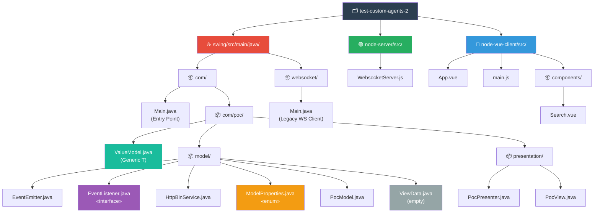
```mermaid
graph TD
    ROOT["🗂 test-custom-agents-2"] --> SWING["☕ swing/src/main/java/"]
    ROOT --> NODE["🟢 node-server/src/"]
    ROOT --> VUE["💚 node-vue-client/src/"]

    SWING --> PKG_COM["📦 com/"]
    SWING --> PKG_WS["📦 websocket/"]
    PKG_COM --> COM_MAIN["Main.java\n(Entry Point)"]
    PKG_COM --> PKG_POC["📦 com/poc/"]
    PKG_WS --> WS_MAIN["Main.java\n(Legacy WS Client)"]
    PKG_POC --> VM["ValueModel.java\n(Generic T)"]
    PKG_POC --> PKG_MODEL["📦 model/"]
    PKG_POC --> PKG_PRES["📦 presentation/"]

    PKG_MODEL --> EE["EventEmitter.java"]
    PKG_MODEL --> EL["EventListener.java\n«interface»"]
    PKG_MODEL --> HBS["HttpBinService.java"]
    PKG_MODEL --> MP["ModelProperties.java\n«enum»"]
    PKG_MODEL --> PM["PocModel.java"]
    PKG_MODEL --> VD["ViewData.java\n(empty)"]

    PKG_PRES --> PP["PocPresenter.java"]
    PKG_PRES --> PV["PocView.java"]

    NODE --> WSS["WebsocketServer.js"]
    VUE --> APPVUE["App.vue"]
    VUE --> MAINJS["main.js"]
    VUE --> COMP["📦 components/"]
    COMP --> SEARCH["Search.vue"]

    style ROOT fill:#2c3e50,color:#fff
    style SWING fill:#e74c3c,color:#fff
    style NODE fill:#27ae60,color:#fff
    style VUE fill:#3498db,color:#fff
    style EL fill:#9b59b6,color:#fff
    style MP fill:#f39c12,color:#fff
    style VM fill:#1abc9c,color:#fff
    style VD fill:#95a5a6,color:#fff
```

---

## Class Hierarchy & Inheritance Trees

### Java Class Hierarchy

```mermaid
classDiagram
    direction TB

    class ValueModel~T~ {
        <<Generic>>
        -T field
        +ValueModel(T field)
        +T getField()
        +void setField(T field)
    }

    class EventListener {
        <<interface>>
        +void onEvent(String eventData)
    }

    class EventEmitter {
        -List~EventListener~ listeners
        +void subscribe(EventListener listener)
        +void emit(String eventData)
    }

    class ModelProperties {
        <<enumeration>>
        TEXT_AREA
        FIRST_NAME
        LAST_NAME
        DATE_OF_BIRTH
        ZIP
        ORT
        STREET
        IBAN
        BIC
        VALID_FROM
        FEMALE
        MALE
        DIVERSE
    }

    class PocModel {
        +Map~ModelProperties ValueModel~ model
        -HttpBinService httpBinService
        -EventEmitter eventEmitter
        +PocModel(EventEmitter eventEmitter)
        +void action()
    }

    class HttpBinService {
        +String URL$
        +String PATH$
        +String CONTENT_TYPE$
        +String post(Map data)
    }

    class ViewData {
        <<empty placeholder>>
    }

    class PocView {
        #JFrame frame
        #JTextArea textArea
        #JTextField name
        #JTextField firstName
        #JTextField dateOfBirth
        #JTextField zip
        #JTextField ort
        #JTextField street
        #JTextField iban
        #JTextField bic
        #JTextField validFrom
        #JRadioButton female
        #JRadioButton male
        #JRadioButton diverse
        #ButtonGroup gender
        #JButton button
        +PocView()
        -void initUI()
    }

    class PocPresenter {
        -PocView view
        -PocModel model
        +PocPresenter(PocView, PocModel, EventEmitter)
        -void bind(JTextComponent, ModelProperties)
        -void bind(JRadioButton, ModelProperties)
        -void initializeBindings()
    }

    class Main_com {
        <<entry point>>
        +void main(String[] args)$
    }

    class Main_websocket {
        <<legacy WS client>>
        -CountDownLatch latch$
        -JFrame frame$
        +void main(String[] args)$
        -void initUI()$
        +SearchResult toSearchResult(String json)$
    }

    class WebsocketClientEndpoint {
        <<ClientEndpoint>>
        ~Session userSession
        +WebsocketClientEndpoint(URI)
        +void onOpen(Session)
        +void onClose(Session, CloseReason)
        +void onMessage(String json)
        +void sendMessage(String)
        +Message extract(String json)$
    }

    class Message_inner {
        <<inner class - final>>
        +String target
        +String content
        +Message(String target, String message)
    }

    class SearchResult_inner {
        <<inner class - final>>
        +String name
        +String first
        +String dob
        +String zip
        +String ort
        +String street
        +String hausnr
        +String ze_iban
        +String ze_bic
        +String ze_valid_from
    }

    %% Relationships
    PocModel --> ValueModel : uses Map of
    PocModel --> ModelProperties : keyed by
    PocModel --> HttpBinService : delegates HTTP to
    PocModel --> EventEmitter : fires events via
    PocPresenter --> PocView : renders
    PocPresenter --> PocModel : updates
    PocPresenter ..> EventEmitter : subscribes to
    PocPresenter ..> ValueModel : casts and binds
    EventEmitter --> EventListener : notifies
    Main_com ..> PocView : creates
    Main_com ..> PocModel : creates
    Main_com ..> EventEmitter : creates
    Main_com ..> PocPresenter : wires up
    Main_websocket +-- WebsocketClientEndpoint : inner class
    Main_websocket +-- Message_inner : inner class
    Main_websocket +-- SearchResult_inner : inner class

    style EventListener fill:#9b59b6,color:#fff
    style ModelProperties fill:#f39c12,color:#fff
    style ValueModel fill:#1abc9c,color:#fff
    style ViewData fill:#95a5a6,color:#fff
    style WebsocketClientEndpoint fill:#e74c3c,color:#fff
    style Message_inner fill:#7f8c8d,color:#fff
    style SearchResult_inner fill:#7f8c8d,color:#fff
```

### Vue.js Component Tree

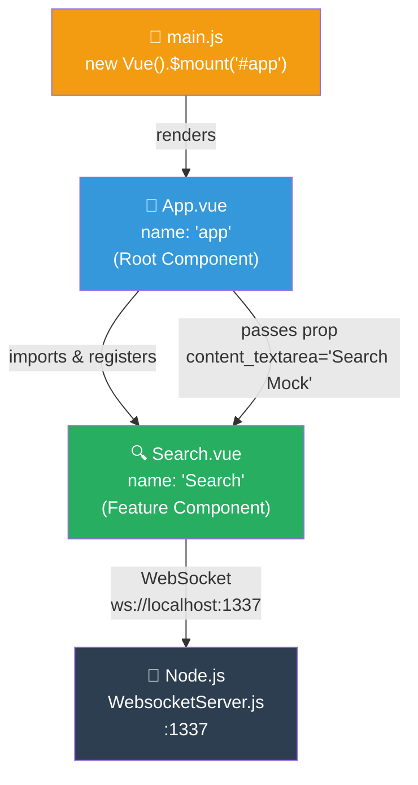
```mermaid
graph TD
    MOUNT["🔧 main.js\nnew Vue().$mount('#app')"]
    APPVUE["📱 App.vue\nname: 'app'\n(Root Component)"]
    SEARCH["🔍 Search.vue\nname: 'Search'\n(Feature Component)"]

    MOUNT -->|"renders"| APPVUE
    APPVUE -->|"imports & registers"| SEARCH
    APPVUE -->|"passes prop\ncontent_textarea='Search Mock'"| SEARCH

    SEARCH -->|"WebSocket\nws://localhost:1337"| WS["🔌 Node.js\nWebsocketServer.js\n:1337"]

    style MOUNT fill:#f39c12,color:#fff
    style APPVUE fill:#3498db,color:#fff
    style SEARCH fill:#27ae60,color:#fff
    style WS fill:#2c3e50,color:#fff
```

---

## Import / Dependency Graph

### Java Package Dependency Graph

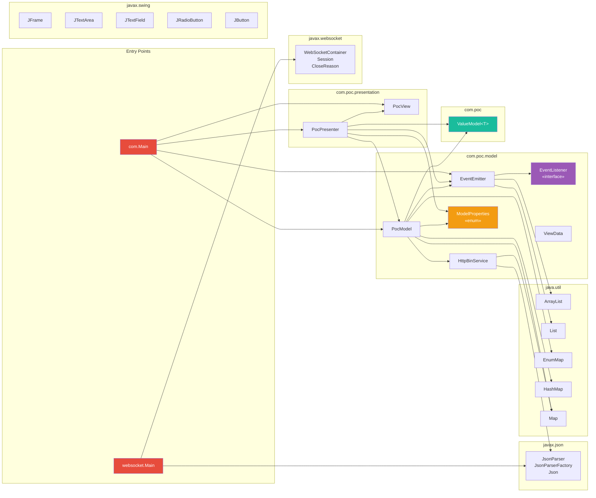
```mermaid
graph LR
    subgraph "Entry Points"
        CM["com.Main"]
        WM["websocket.Main"]
    end

    subgraph "com.poc.presentation"
        PP["PocPresenter"]
        PV["PocView"]
    end

    subgraph "com.poc.model"
        EE["EventEmitter"]
        EL["EventListener\n«interface»"]
        HBS["HttpBinService"]
        MP["ModelProperties\n«enum»"]
        PM["PocModel"]
        VD["ViewData"]
    end

    subgraph "com.poc"
        VM["ValueModel&lt;T&gt;"]
    end

    subgraph "java.util"
        AL["ArrayList"]
        LIST["List"]
        EMAP["EnumMap"]
        HMAP["HashMap"]
        MAP["Map"]
    end

    subgraph "javax.swing"
        JFRAME["JFrame"]
        JTEXTAREA["JTextArea"]
        JTEXTFIELD["JTextField"]
        JRADIO["JRadioButton"]
        JBUTTON["JButton"]
    end

    subgraph "javax.websocket"
        WSAPI["WebSocketContainer\nSession\nCloseReason"]
    end

    subgraph "javax.json"
        JSONAPI["JsonParser\nJsonParserFactory\nJson"]
    end

    CM --> PP
    CM --> PV
    CM --> EE
    CM --> PM

    PP --> PV
    PP --> PM
    PP --> EE
    PP --> VM
    PP --> MP

    PM --> VM
    PM --> EE
    PM --> HBS
    PM --> MP
    PM --> EMAP
    PM --> HMAP
    PM --> MAP

    EE --> EL
    EE --> AL
    EE --> LIST

    WM --> WSAPI
    WM --> JSONAPI

    HBS --> JSONAPI
    HBS --> MAP

    style CM fill:#e74c3c,color:#fff
    style WM fill:#e74c3c,color:#fff
    style EL fill:#9b59b6,color:#fff
    style MP fill:#f39c12,color:#fff
    style VM fill:#1abc9c,color:#fff
```

### Node.js / Vue.js Dependency Graph

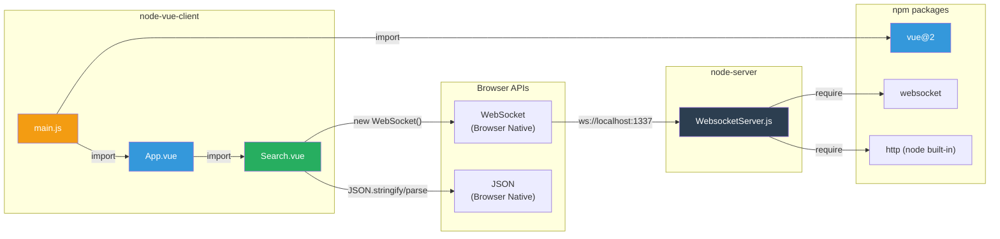
```mermaid
graph LR
    subgraph "node-vue-client"
        MJS["main.js"]
        APPVUE["App.vue"]
        SEARCH["Search.vue"]
    end

    subgraph "node-server"
        WSS["WebsocketServer.js"]
    end

    subgraph "npm packages"
        VUE["vue@2"]
        WSMOD["websocket"]
        HTTP["http (node built-in)"]
    end

    subgraph "Browser APIs"
        WSBROWSER["WebSocket\n(Browser Native)"]
        JSONAPI["JSON\n(Browser Native)"]
    end

    MJS -->|"import"| VUE
    MJS -->|"import"| APPVUE
    APPVUE -->|"import"| SEARCH
    SEARCH -->|"new WebSocket()"| WSBROWSER
    SEARCH -->|"JSON.stringify/parse"| JSONAPI
    WSBROWSER -->|"ws://localhost:1337"| WSS
    WSS -->|"require"| WSMOD
    WSS -->|"require"| HTTP

    style MJS fill:#f39c12,color:#fff
    style APPVUE fill:#3498db,color:#fff
    style SEARCH fill:#27ae60,color:#fff
    style WSS fill:#2c3e50,color:#fff
    style VUE fill:#3498db,color:#fff
```

---

## Interface Implementations

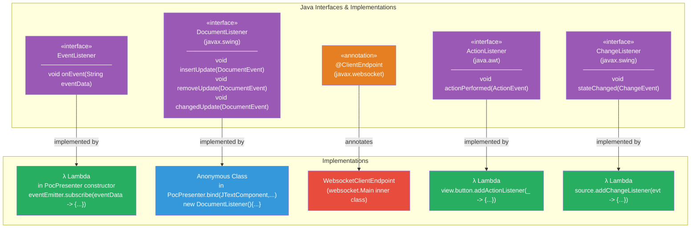
```mermaid
graph TD
    subgraph "Java Interfaces & Implementations"
        EL["«interface»\nEventListener\n────────────────\nvoid onEvent(String eventData)"]
        DL["«interface»\nDocumentListener\n(javax.swing)\n────────────────\nvoid insertUpdate(DocumentEvent)\nvoid removeUpdate(DocumentEvent)\nvoid changedUpdate(DocumentEvent)"]
        CE["«annotation»\n@ClientEndpoint\n(javax.websocket)"]
        AL_IFACE["«interface»\nActionListener\n(java.awt)\n────────────────\nvoid actionPerformed(ActionEvent)"]
        CL_IFACE["«interface»\nChangeListener\n(javax.swing)\n────────────────\nvoid stateChanged(ChangeEvent)"]
    end

    subgraph "Implementations"
        LAMBDA1["λ Lambda\nin PocPresenter constructor\neventEmitter.subscribe(eventData -> {...})"]
        ANON1["Anonymous Class\nin PocPresenter.bind(JTextComponent,...)\nnew DocumentListener(){...}"]
        WCE["WebsocketClientEndpoint\n(websocket.Main inner class)"]
        LAMBDA2["λ Lambda\nview.button.addActionListener(_ -> {...})"]
        LAMBDA3["λ Lambda\nsource.addChangeListener(evt -> {...})"]
    end

    EL -->|"implemented by"| LAMBDA1
    DL -->|"implemented by"| ANON1
    CE -->|"annotates"| WCE
    AL_IFACE -->|"implemented by"| LAMBDA2
    CL_IFACE -->|"implemented by"| LAMBDA3

    style EL fill:#9b59b6,color:#fff
    style DL fill:#9b59b6,color:#fff
    style CE fill:#e67e22,color:#fff
    style AL_IFACE fill:#9b59b6,color:#fff
    style CL_IFACE fill:#9b59b6,color:#fff
    style LAMBDA1 fill:#27ae60,color:#fff
    style LAMBDA2 fill:#27ae60,color:#fff
    style LAMBDA3 fill:#27ae60,color:#fff
    style ANON1 fill:#3498db,color:#fff
    style WCE fill:#e74c3c,color:#fff
```

---

## Control Flow Analysis

### PocModel.action() — Primary Business Logic Flow

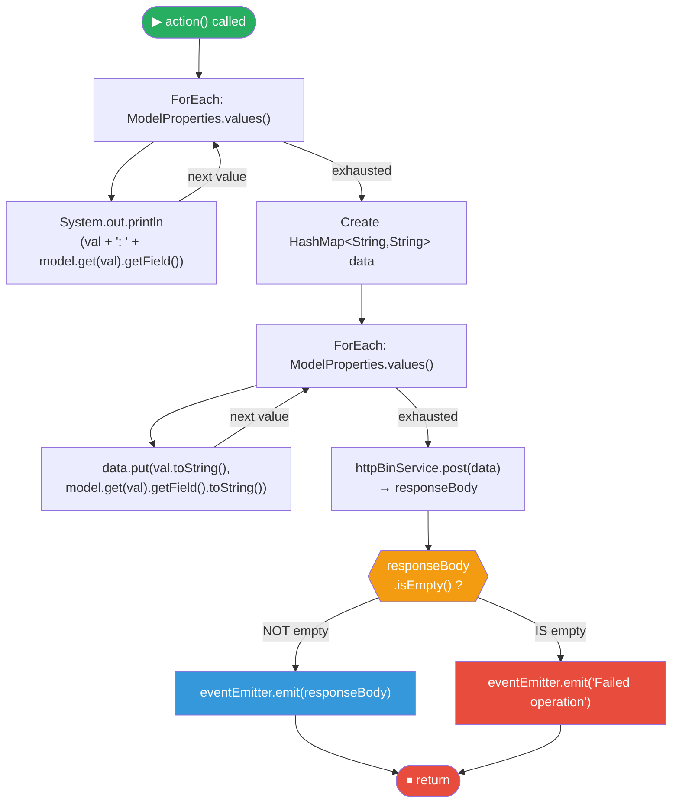
```mermaid
flowchart TD
    START(["▶ action() called"])
    LOOP1["ForEach: ModelProperties.values()"]
    PRINT["System.out.println\n(val + ': ' + model.get(val).getField())"]
    NEWMAP["Create HashMap&lt;String,String&gt; data"]
    LOOP2["ForEach: ModelProperties.values()"]
    PUT["data.put(val.toString(),\nmodel.get(val).getField().toString())"]
    POST["httpBinService.post(data)\n→ responseBody"]
    CHECK{{"responseBody\n.isEmpty() ?"}}
    EMITSUCCESS["eventEmitter.emit(responseBody)"]
    EMITFAIL["eventEmitter.emit('Failed operation')"]
    END(["⏹ return"])

    START --> LOOP1
    LOOP1 --> PRINT
    PRINT -->|"next value"| LOOP1
    LOOP1 -->|"exhausted"| NEWMAP
    NEWMAP --> LOOP2
    LOOP2 --> PUT
    PUT -->|"next value"| LOOP2
    LOOP2 -->|"exhausted"| POST
    POST --> CHECK
    CHECK -->|"NOT empty"| EMITSUCCESS
    CHECK -->|"IS empty"| EMITFAIL
    EMITSUCCESS --> END
    EMITFAIL --> END

    style START fill:#27ae60,color:#fff
    style END fill:#e74c3c,color:#fff
    style CHECK fill:#f39c12,color:#fff
    style EMITSUCCESS fill:#3498db,color:#fff
    style EMITFAIL fill:#e74c3c,color:#fff
```

### websocket/Main — WebSocket Message Dispatch Flow

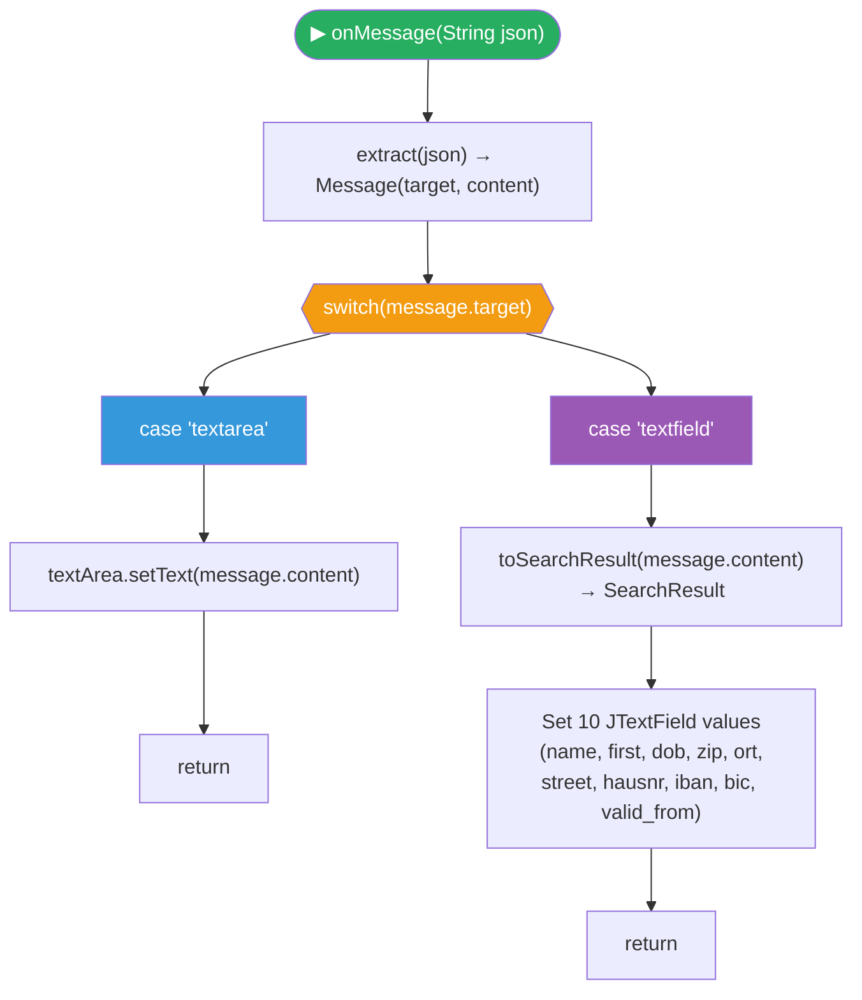
```mermaid
flowchart TD
    MSG(["▶ onMessage(String json)"])
    EXTRACT["extract(json) → Message(target, content)"]
    SWITCH{{"switch(message.target)"}}
    
    CASE_TEXTAREA["case 'textarea'"]
    SET_TEXTAREA["textArea.setText(message.content)"]
    RET1["return"]
    
    CASE_TEXTFIELD["case 'textfield'"]
    PARSE["toSearchResult(message.content)\n→ SearchResult"]
    SET_FIELDS["Set 10 JTextField values\n(name, first, dob, zip, ort,\nstreet, hausnr, iban, bic, valid_from)"]
    RET2["return"]

    MSG --> EXTRACT
    EXTRACT --> SWITCH
    SWITCH --> CASE_TEXTAREA
    SWITCH --> CASE_TEXTFIELD
    CASE_TEXTAREA --> SET_TEXTAREA --> RET1
    CASE_TEXTFIELD --> PARSE --> SET_FIELDS --> RET2

    style MSG fill:#27ae60,color:#fff
    style SWITCH fill:#f39c12,color:#fff
    style CASE_TEXTAREA fill:#3498db,color:#fff
    style CASE_TEXTFIELD fill:#9b59b6,color:#fff
```

### WebsocketServer.js — Connection & Message Broadcast Flow

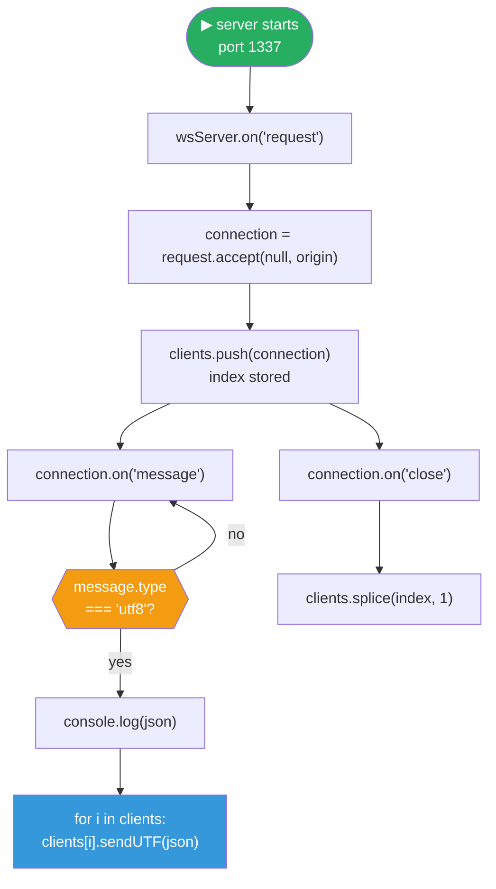
```mermaid
flowchart TD
    INIT(["▶ server starts\nport 1337"])
    REQ["wsServer.on('request')"]
    ACCEPT["connection = request.accept(null, origin)"]
    PUSH["clients.push(connection)\nindex stored"]
    
    MSGEV["connection.on('message')"]
    TYPECHECK{{"message.type\n=== 'utf8'?"}}
    LOG["console.log(json)"]
    BROADCAST["for i in clients:\n  clients[i].sendUTF(json)"]
    
    CLOSEEV["connection.on('close')"]
    SPLICE["clients.splice(index, 1)"]

    INIT --> REQ --> ACCEPT --> PUSH
    PUSH --> MSGEV
    PUSH --> CLOSEEV
    MSGEV --> TYPECHECK
    TYPECHECK -->|"yes"| LOG --> BROADCAST
    TYPECHECK -->|"no"| MSGEV
    CLOSEEV --> SPLICE

    style INIT fill:#27ae60,color:#fff
    style TYPECHECK fill:#f39c12,color:#fff
    style BROADCAST fill:#3498db,color:#fff
```

### Search.vue — searchPerson() Filter Flow

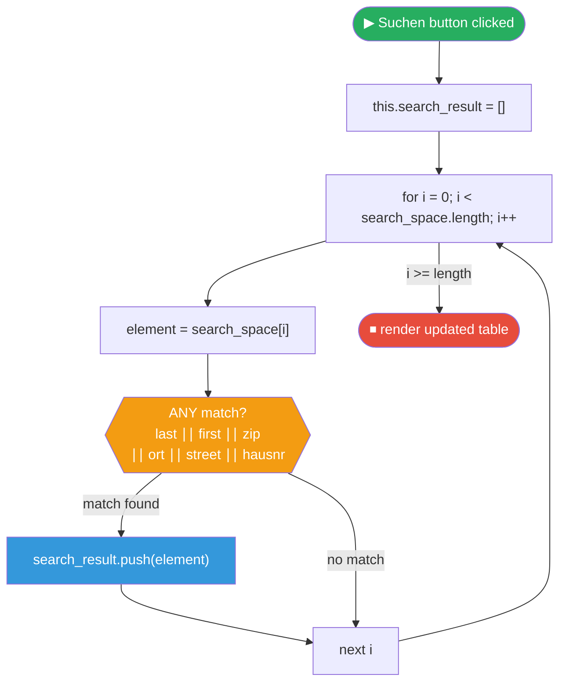
```mermaid
flowchart TD
    CLICK(["▶ Suchen button clicked"])
    RESET["this.search_result = []"]
    LOOP["for i = 0; i < search_space.length; i++"]
    ELEMENT["element = search_space[i]"]
    
    COND{{"ANY match?\nlast ∣∣ first ∣∣ zip\n∣∣ ort ∣∣ street ∣∣ hausnr"}}
    
    PUSH["search_result.push(element)"]
    CONTINUE["next i"]
    DONE(["⏹ render updated table"])

    CLICK --> RESET --> LOOP --> ELEMENT --> COND
    COND -->|"match found"| PUSH --> CONTINUE --> LOOP
    COND -->|"no match"| CONTINUE
    LOOP -->|"i >= length"| DONE

    style CLICK fill:#27ae60,color:#fff
    style COND fill:#f39c12,color:#fff
    style PUSH fill:#3498db,color:#fff
    style DONE fill:#e74c3c,color:#fff
```

### PocPresenter — Data Binding Flow

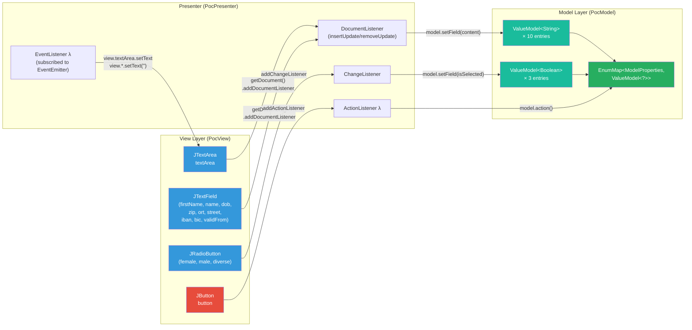
```mermaid
flowchart LR
    subgraph "View Layer (PocView)"
        TEXTAREA["JTextArea\ntextArea"]
        TEXTFIELDS["JTextField\n(firstName, name, dob,\nzip, ort, street,\niban, bic, validFrom)"]
        RADIOBTNS["JRadioButton\n(female, male, diverse)"]
        BTN["JButton\nbutton"]
    end

    subgraph "Presenter (PocPresenter)"
        DOCLISTENER["DocumentListener\n(insertUpdate/removeUpdate)"]
        CHANGELISTENER["ChangeListener"]
        ACTIONLISTENER["ActionListener λ"]
        EVENTSUBSCRIBER["EventListener λ\n(subscribed to EventEmitter)"]
    end

    subgraph "Model Layer (PocModel)"
        VM_STRING["ValueModel&lt;String&gt;\n× 10 entries"]
        VM_BOOL["ValueModel&lt;Boolean&gt;\n× 3 entries"]
        ENUMMAP["EnumMap&lt;ModelProperties,\nValueModel&lt;?&gt;&gt;"]
    end

    TEXTAREA -->|"getDocument()\n.addDocumentListener"| DOCLISTENER
    TEXTFIELDS -->|"getDocument()\n.addDocumentListener"| DOCLISTENER
    RADIOBTNS -->|"addChangeListener"| CHANGELISTENER
    BTN -->|"addActionListener"| ACTIONLISTENER

    DOCLISTENER -->|"model.setField(content)"| VM_STRING
    CHANGELISTENER -->|"model.setField(isSelected)"| VM_BOOL
    VM_STRING --> ENUMMAP
    VM_BOOL --> ENUMMAP

    ACTIONLISTENER -->|"model.action()"| ENUMMAP
    EVENTSUBSCRIBER -->|"view.textArea.setText\nview.*.setText('')"| TEXTAREA

    style TEXTAREA fill:#3498db,color:#fff
    style TEXTFIELDS fill:#3498db,color:#fff
    style RADIOBTNS fill:#3498db,color:#fff
    style BTN fill:#e74c3c,color:#fff
    style VM_STRING fill:#1abc9c,color:#fff
    style VM_BOOL fill:#1abc9c,color:#fff
    style ENUMMAP fill:#27ae60,color:#fff
```

---

## Field Declarations & Type Map

### PocView — UI Component Fields

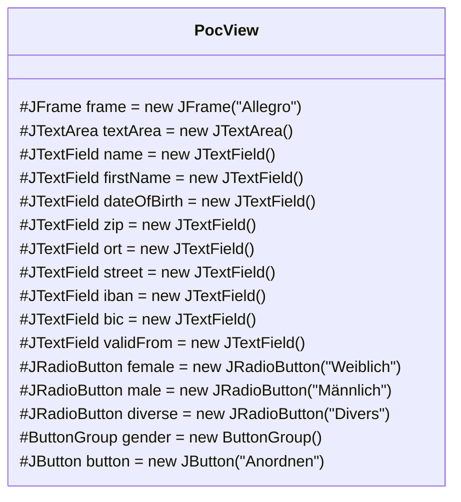
```mermaid
classDiagram
    class PocView {
        #JFrame frame = new JFrame("Allegro")
        #JTextArea textArea = new JTextArea()
        #JTextField name = new JTextField()
        #JTextField firstName = new JTextField()
        #JTextField dateOfBirth = new JTextField()
        #JTextField zip = new JTextField()
        #JTextField ort = new JTextField()
        #JTextField street = new JTextField()
        #JTextField iban = new JTextField()
        #JTextField bic = new JTextField()
        #JTextField validFrom = new JTextField()
        #JRadioButton female = new JRadioButton("Weiblich")
        #JRadioButton male = new JRadioButton("Männlich")
        #JRadioButton diverse = new JRadioButton("Divers")
        #ButtonGroup gender = new ButtonGroup()
        #JButton button = new JButton("Anordnen")
    }
```

### ModelProperties Enum → ValueModel Type Mapping

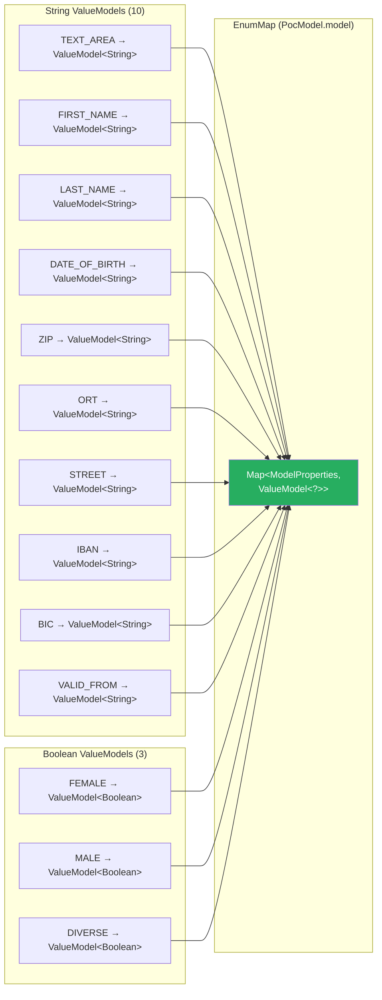
```mermaid
graph LR
    subgraph "String ValueModels (10)"
        TA["TEXT_AREA → ValueModel&lt;String&gt;"]
        FN["FIRST_NAME → ValueModel&lt;String&gt;"]
        LN["LAST_NAME → ValueModel&lt;String&gt;"]
        DOB["DATE_OF_BIRTH → ValueModel&lt;String&gt;"]
        ZP["ZIP → ValueModel&lt;String&gt;"]
        ORT["ORT → ValueModel&lt;String&gt;"]
        ST["STREET → ValueModel&lt;String&gt;"]
        IB["IBAN → ValueModel&lt;String&gt;"]
        BC["BIC → ValueModel&lt;String&gt;"]
        VF["VALID_FROM → ValueModel&lt;String&gt;"]
    end

    subgraph "Boolean ValueModels (3)"
        FE["FEMALE → ValueModel&lt;Boolean&gt;"]
        MA["MALE → ValueModel&lt;Boolean&gt;"]
        DI["DIVERSE → ValueModel&lt;Boolean&gt;"]
    end

    subgraph "EnumMap (PocModel.model)"
        EM["Map&lt;ModelProperties,\nValueModel&lt;?&gt;&gt;"]
    end

    TA & FN & LN & DOB & ZP & ORT & ST & IB & BC & VF --> EM
    FE & MA & DI --> EM

    style EM fill:#27ae60,color:#fff
```

---

## Constructor Patterns

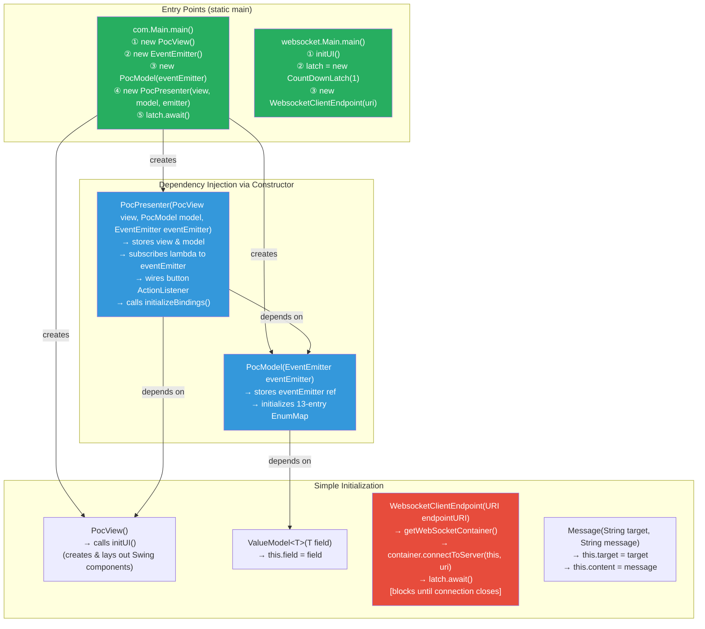
```mermaid
graph TD
    subgraph "Dependency Injection via Constructor"
        PM_CTOR["PocModel(EventEmitter eventEmitter)\n→ stores eventEmitter ref\n→ initializes 13-entry EnumMap"]
        PP_CTOR["PocPresenter(PocView view, PocModel model, EventEmitter eventEmitter)\n→ stores view & model\n→ subscribes lambda to eventEmitter\n→ wires button ActionListener\n→ calls initializeBindings()"]
    end

    subgraph "Simple Initialization"
        PV_CTOR["PocView()\n→ calls initUI()\n(creates & lays out Swing components)"]
        VM_CTOR["ValueModel&lt;T&gt;(T field)\n→ this.field = field"]
        WCE_CTOR["WebsocketClientEndpoint(URI endpointURI)\n→ getWebSocketContainer()\n→ container.connectToServer(this, uri)\n→ latch.await()\n[blocks until connection closes]"]
        MSG_CTOR["Message(String target, String message)\n→ this.target = target\n→ this.content = message"]
    end

    subgraph "Entry Points (static main)"
        MAIN_COM["com.Main.main()\n① new PocView()\n② new EventEmitter()\n③ new PocModel(eventEmitter)\n④ new PocPresenter(view, model, emitter)\n⑤ latch.await()"]
        MAIN_WS["websocket.Main.main()\n① initUI()\n② latch = new CountDownLatch(1)\n③ new WebsocketClientEndpoint(uri)"]
    end

    MAIN_COM -->|"creates"| PV_CTOR
    MAIN_COM -->|"creates"| PM_CTOR
    MAIN_COM -->|"creates"| PP_CTOR
    PP_CTOR -->|"depends on"| PV_CTOR
    PP_CTOR -->|"depends on"| PM_CTOR
    PM_CTOR -->|"depends on"| VM_CTOR

    style PP_CTOR fill:#3498db,color:#fff
    style PM_CTOR fill:#3498db,color:#fff
    style WCE_CTOR fill:#e74c3c,color:#fff
    style MAIN_COM fill:#27ae60,color:#fff
    style MAIN_WS fill:#27ae60,color:#fff
```

---

## Method Signatures & Visibility

### Java Methods — Visibility & Return Types

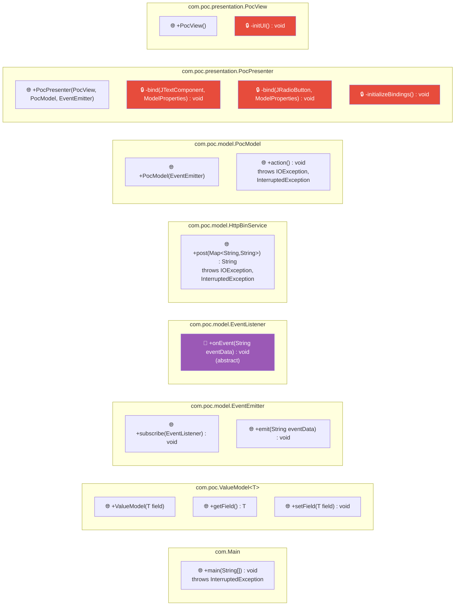
```mermaid
graph LR
    subgraph "com.Main"
        M1["🌐 +main(String[]) : void\n throws InterruptedException"]
    end

    subgraph "com.poc.ValueModel&lt;T&gt;"
        M2["🌐 +ValueModel(T field)"]
        M3["🌐 +getField() : T"]
        M4["🌐 +setField(T field) : void"]
    end

    subgraph "com.poc.model.EventEmitter"
        M5["🌐 +subscribe(EventListener) : void"]
        M6["🌐 +emit(String eventData) : void"]
    end

    subgraph "com.poc.model.EventListener"
        M7["📐 +onEvent(String eventData) : void\n(abstract)"]
    end

    subgraph "com.poc.model.HttpBinService"
        M8["🌐 +post(Map&lt;String,String&gt;) : String\n throws IOException, InterruptedException"]
    end

    subgraph "com.poc.model.PocModel"
        M9["🌐 +PocModel(EventEmitter)"]
        M10["🌐 +action() : void\n throws IOException, InterruptedException"]
    end

    subgraph "com.poc.presentation.PocPresenter"
        M11["🌐 +PocPresenter(PocView, PocModel, EventEmitter)"]
        M12["🔒 -bind(JTextComponent, ModelProperties) : void"]
        M13["🔒 -bind(JRadioButton, ModelProperties) : void"]
        M14["🔒 -initializeBindings() : void"]
    end

    subgraph "com.poc.presentation.PocView"
        M15["🌐 +PocView()"]
        M16["🔒 -initUI() : void"]
    end

    style M7 fill:#9b59b6,color:#fff
    style M12 fill:#e74c3c,color:#fff
    style M13 fill:#e74c3c,color:#fff
    style M14 fill:#e74c3c,color:#fff
    style M16 fill:#e74c3c,color:#fff
```

### websocket/Main — Inner Class Method Visibility

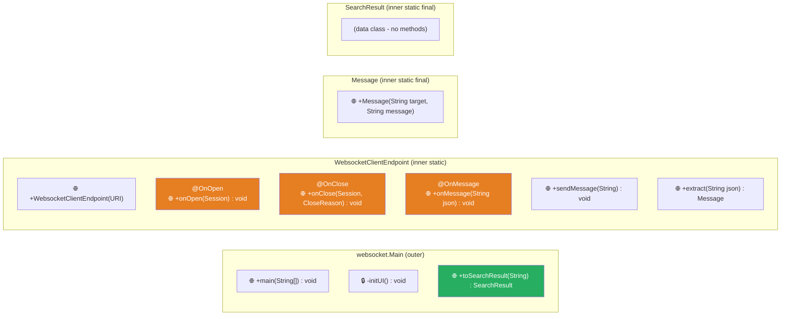
```mermaid
graph LR
    subgraph "websocket.Main (outer)"
        OM1["🌐 +main(String[]) : void"]
        OM2["🔒 -initUI() : void"]
        OM3["🌐 +toSearchResult(String) : SearchResult"]
    end

    subgraph "WebsocketClientEndpoint (inner static)"
        WM1["🌐 +WebsocketClientEndpoint(URI)"]
        WM2["@OnOpen\n🌐 +onOpen(Session) : void"]
        WM3["@OnClose\n🌐 +onClose(Session, CloseReason) : void"]
        WM4["@OnMessage\n🌐 +onMessage(String json) : void"]
        WM5["🌐 +sendMessage(String) : void"]
        WM6["🌐 +extract(String json) : Message"]
    end

    subgraph "Message (inner static final)"
        MM1["🌐 +Message(String target, String message)"]
    end

    subgraph "SearchResult (inner static final)"
        SR["(data class - no methods)"]
    end

    style WM2 fill:#e67e22,color:#fff
    style WM3 fill:#e67e22,color:#fff
    style WM4 fill:#e67e22,color:#fff
    style OM3 fill:#27ae60,color:#fff
```

### Vue.js / JavaScript Functions

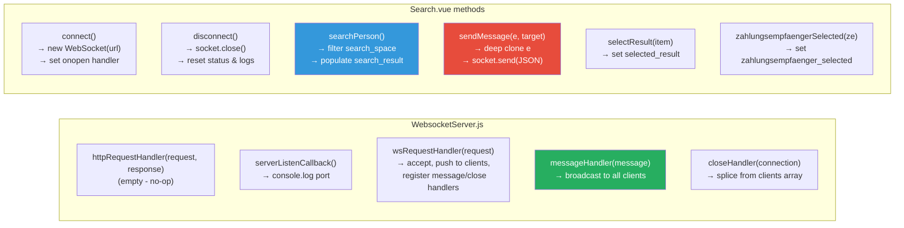
```mermaid
graph LR
    subgraph "WebsocketServer.js"
        JS1["httpRequestHandler(request, response)\n(empty - no-op)"]
        JS2["serverListenCallback()\n→ console.log port"]
        JS3["wsRequestHandler(request)\n→ accept, push to clients,\n  register message/close handlers"]
        JS4["messageHandler(message)\n→ broadcast to all clients"]
        JS5["closeHandler(connection)\n→ splice from clients array"]
    end

    subgraph "Search.vue methods"
        VUE1["connect()\n→ new WebSocket(url)\n→ set onopen handler"]
        VUE2["disconnect()\n→ socket.close()\n→ reset status & logs"]
        VUE3["searchPerson()\n→ filter search_space\n→ populate search_result"]
        VUE4["sendMessage(e, target)\n→ deep clone e\n→ socket.send(JSON)"]
        VUE5["selectResult(item)\n→ set selected_result"]
        VUE6["zahlungsempfaengerSelected(ze)\n→ set zahlungsempfaenger_selected"]
    end

    style VUE3 fill:#3498db,color:#fff
    style VUE4 fill:#e74c3c,color:#fff
    style JS4 fill:#27ae60,color:#fff
```

---

## File-by-File AST Summaries

### com/Main.java
**Package**: `com` | **Role**: Application entry point (MVP assembly)

```
ClassDeclaration: Main [public]
└── method: main(String[] args) [public static] throws InterruptedException
    ├── VarDecl: latch = new CountDownLatch(1)          // blocks main thread
    ├── VarDecl: pocView = new PocView()                 // instantiate view
    ├── VarDecl: eventEmitter = new EventEmitter()       // instantiate event bus
    ├── VarDecl: pocModel = new PocModel(eventEmitter)  // inject emitter into model
    ├── VarDecl: _ = new PocPresenter(pocView, pocModel, eventEmitter)  // wire MVP
    └── MethodCall: latch.await()                        // block forever
```

> **Pattern**: Manual Dependency Injection. Uses Java 22 unnamed variable (`_`) to deliberately discard the presenter reference while still triggering its constructor side-effects (event subscription, UI binding).

---

### websocket/Main.java
**Package**: `websocket` | **Role**: Legacy standalone WebSocket client with Swing UI

```
ClassDeclaration: Main [public]
├── Fields (18): [private static] latch, frame, textArea, tf_*, rb_*, bg_gender, jsonParserFactory
├── method: main(String[]) [public static] throws IOException, DeploymentException
│   ├── MethodCall: initUI()
│   ├── Assignment: latch = new CountDownLatch(1)
│   ├── VarDecl: uri = "ws://localhost:1337/"
│   └── VarDecl: clientEndPoint = new WebsocketClientEndpoint(URI.create(uri))
├── method: initUI() [private static]
│   ├── GridBagLayout form construction (6 rows)
│   └── Button ActionListener λ → System.out.println("Button clicked!")
├── method: toSearchResult(String json) [public static] : SearchResult
│   ├── VarDecl: searchResult = new SearchResult()
│   ├── WhileLoop: jsonParser.hasNext()
│   │   └── 10x: KEY_NAME check → flag=true → VALUE_STRING → assign to searchResult field
│   └── Return: searchResult
│
├── InnerClass: WebsocketClientEndpoint [@ClientEndpoint, public static]
│   ├── Field: userSession = null
│   ├── Constructor: (URI) → connectToServer() → latch.await()
│   ├── method: onOpen(@OnOpen) → stores userSession
│   ├── method: onClose(@OnClose) → nulls userSession, latch.countDown()
│   ├── method: onMessage(@OnMessage) → extract(json) → switch(target)
│   │   ├── case "textarea" → textArea.setText(content)
│   │   └── case "textfield" → toSearchResult(content) → populate 10 fields
│   ├── method: sendMessage() → userSession.getAsyncRemote().sendText()
│   └── method: extract(String json) [static] : Message
│       └── WhileLoop: jsonParser events → extract target & content → new Message(...)
│
├── InnerClass: Message [private static final]
│   ├── Fields: target (String, final), content (String, final)
│   └── Constructor: (String target, String message)
│
└── InnerClass: SearchResult [private static final]
    └── Fields (10): name, first, dob, zip, ort, street, hausnr, ze_iban, ze_bic, ze_valid_from
```

---

### ValueModel.java (Generics)
**Package**: `com.poc` | **Role**: Generic container / observable value holder

```
ClassDeclaration: ValueModel<T> [public]
├── Field: field : T [private]
├── Constructor: ValueModel(T field) → this.field = field
├── method: getField() : T [public] → return field
└── method: setField(T field) : void [public] → this.field = field
```

> **Design Note**: Simple POJO-style generic box. Used as `ValueModel<String>` (text fields) and `ValueModel<Boolean>` (radio buttons) stored in `PocModel.model` EnumMap.

---

### EventEmitter.java
**Package**: `com.poc.model` | **Role**: Publish/Subscribe event bus

```
ClassDeclaration: EventEmitter [public]
├── Field: listeners : List<EventListener> [private final] = new ArrayList<>()
├── method: subscribe(EventListener listener) : void [public]
│   └── MethodCall: listeners.add(listener)
└── method: emit(String eventData) : void [public]
    └── ForEach: listener in listeners
        └── MethodCall: listener.onEvent(eventData)
```

---

### EventListener.java (Interface)
**Package**: `com.poc.model` | **Role**: Observer callback contract

```
InterfaceDeclaration: EventListener [public]
└── abstract method: onEvent(String eventData) : void
```

> **Implementations**: Single lambda `eventData -> { view.textArea.setText(eventData); ... }` registered in `PocPresenter` constructor.

---

### HttpBinService.java
**Package**: `com.poc.model` | **Role**: HTTP POST client for form submission

```
ClassDeclaration: HttpBinService [public]
├── Field: URL = "http://localhost:8080" [public static final]
├── Field: PATH = "/post" [public static final]
├── Field: CONTENT_TYPE = "application/json" [public static final]
└── method: post(Map<String,String> data) : String [public]
    throws IOException, InterruptedException
    ├── Open HttpURLConnection (POST, Content-Type: application/json)
    ├── JsonGenerator → writeStartObject()
    ├── ForEach: entry in data.entrySet() → generator.write(key, value)
    ├── generator.writeEnd() + close()
    ├── Read responseCode + responseBody (Scanner)
    ├── connection.disconnect()
    └── Return: responseBody
```

---

### ModelProperties.java (Enum)
**Package**: `com.poc.model` | **Role**: Typed keys for the model's EnumMap

```
EnumDeclaration: ModelProperties [public]
├── TEXT_AREA      → maps to JTextArea
├── FIRST_NAME     → maps to JTextField firstName
├── LAST_NAME      → maps to JTextField name
├── DATE_OF_BIRTH  → maps to JTextField dateOfBirth
├── ZIP            → maps to JTextField zip
├── ORT            → maps to JTextField ort
├── STREET         → maps to JTextField street
├── IBAN           → maps to JTextField iban
├── BIC            → maps to JTextField bic
├── VALID_FROM     → maps to JTextField validFrom
├── FEMALE         → maps to JRadioButton female
├── MALE           → maps to JRadioButton male
└── DIVERSE        → maps to JRadioButton diverse
```

---

### PocModel.java
**Package**: `com.poc.model` | **Role**: Model layer — state container + HTTP action

```
ClassDeclaration: PocModel [public]
├── Field: model : Map<ModelProperties, ValueModel<?>> [public] = new EnumMap<>(...)
├── Field: httpBinService : HttpBinService [private] = new HttpBinService()
├── Field: eventEmitter : EventEmitter [private]
├── Constructor: PocModel(EventEmitter eventEmitter)
│   ├── 13 × model.put(ModelProperties.X, new ValueModel<String|Boolean>(null))
│   └── this.eventEmitter = eventEmitter
└── method: action() : void [public] throws IOException, InterruptedException
    ├── ForEach: val in ModelProperties.values() → System.out.println(val + model value)
    ├── new HashMap<String,String> data
    ├── ForEach: val in ModelProperties.values() → data.put(val.toString(), field.toString())
    ├── responseBody = httpBinService.post(data)
    ├── if !responseBody.isEmpty()
    │   └── eventEmitter.emit(responseBody)
    └── else
        └── eventEmitter.emit("Failed operation")
```

---

### ViewData.java
**Package**: `com.poc.model` | **Role**: Empty placeholder class

```
ClassDeclaration: ViewData [public]
└── (no fields, no methods, no constructors)
```

> **Note**: Appears to be scaffolding for a DTO or view-data transfer object that was never implemented.

---

### PocPresenter.java
**Package**: `com.poc.presentation` | **Role**: Presenter layer — bidirectional MVP wiring

```
ClassDeclaration: PocPresenter [public]
├── Field: view : PocView [private]
├── Field: model : PocModel [private]
│
├── Constructor: PocPresenter(PocView, PocModel, EventEmitter)
│   ├── this.view = view; this.model = model
│   ├── eventEmitter.subscribe(λ: eventData → {
│   │     view.textArea.setText(eventData)
│   │     view.[all text fields].setText("")    // clear on response
│   │     view.female.setSelected(true)
│   │     view.[male, diverse].setSelected(false)
│   │   })
│   ├── view.button.addActionListener(λ: _ → {
│   │     try { model.action() }
│   │     catch IOException|InterruptedException → wrap in RuntimeException
│   │   })
│   └── initializeBindings()
│
├── method: bind(JTextComponent source, ModelProperties prop) [private]
│   ├── model = (ValueModel<String>) model.model.get(prop)
│   ├── model.setField(source.getText())           // initial sync
│   └── source.getDocument().addDocumentListener(new DocumentListener {
│         insertUpdate → model.setField(doc.getText(...))
│         removeUpdate → model.setField(doc.getText(...))
│         changedUpdate → (no-op)
│       })
│
├── method: bind(JRadioButton source, ModelProperties prop) [private]
│   ├── model = (ValueModel<Boolean>) model.model.get(prop)
│   ├── model.setField(source.isSelected())        // initial sync
│   └── source.addChangeListener(λ: evt → model.setField(source.isSelected()))
│
└── method: initializeBindings() [private]
    ├── bind(view.textArea, TEXT_AREA)
    ├── bind(view.firstName, FIRST_NAME)
    ├── bind(view.name, LAST_NAME)
    ├── bind(view.dateOfBirth, DATE_OF_BIRTH)
    ├── bind(view.zip, ZIP)
    ├── bind(view.ort, ORT)
    ├── bind(view.street, STREET)
    ├── bind(view.iban, IBAN)
    ├── bind(view.bic, BIC)
    ├── bind(view.validFrom, VALID_FROM)
    ├── bind(view.male, MALE)
    ├── bind(view.female, FEMALE)
    └── bind(view.diverse, DIVERSE)
```

---

### PocView.java
**Package**: `com.poc.presentation` | **Role**: View layer — Swing UI declaration

```
ClassDeclaration: PocView [public]
├── Fields (16) [protected]:
│   ├── JFrame frame = new JFrame("Allegro")
│   ├── JTextArea textArea
│   ├── JTextField: name, firstName, dateOfBirth, zip, ort, street, iban, bic, validFrom
│   ├── JRadioButton: female("Weiblich"), male("Männlich"), diverse("Divers")
│   ├── ButtonGroup gender
│   └── JButton button("Anordnen")
├── Constructor: PocView() → initUI()
└── method: initUI() [private]
    ├── JPanel with GridBagLayout (6 rows × 6 cols)
    ├── Row 0: [Vorname|firstName] [Name|name] [Geburtsdatum|dateOfBirth]
    ├── Row 1: [Geschlecht | female+male+diverse (FlowLayout)]
    ├── Row 2: [Strasse|street] [PLZ|zip] [Ort|ort]
    ├── Row 3: [IBAN|iban] [BIC|bic] [Gültig ab|validFrom]
    ├── Row 4: [RT | textArea (span 6 cols, 200×400)]
    ├── Row 5: [button "Anordnen"]
    └── frame: 800×650, EXIT_ON_CLOSE, setVisible(true)
```

---

### WebsocketServer.js
**Module System**: CommonJS | **Role**: WebSocket relay server (Node.js)

```
Module-level Variables:
├── webSocketsServerPort = 1337
├── messages = []
├── clients = []
├── server = http.createServer(handler)  // empty handler
└── wsServer = new webSocketServer({ httpServer: server })

server.listen(1337, () => console.log("listening on 1337"))

wsServer.on('request', (request) => {
  connection = request.accept(null, origin)
  index = clients.push(connection) - 1

  connection.on('message', (message) => {
    if message.type === 'utf8':
      json = message.utf8Data
      for i in clients: clients[i].sendUTF(json)   // broadcast
  })

  connection.on('close', (connection) => {
    clients.splice(index, 1)                         // remove from pool
  })
})
```

---

### App.vue
**Framework**: Vue.js 2 | **Role**: Root application component

```
SFC: App.vue
├── <template>
│   └── div#app
│       ├── div#header: logo + "Search Mock" title
│       └── <Search content_textarea="Search Mock" />
├── <script> (Options API)
│   ├── name: 'app'
│   ├── imports: Search from './components/Search.vue'
│   └── components: { Search }
└── <style>
    ├── #app: Avenir font, antialiased, centered, margin-top 60px
    ├── #header: white text, #ff2b06 bg, 40pt, 80px height
    └── #logo: absolute, 80px bg, 120×80px
```

---

### main.js
**Module System**: ES Modules | **Role**: Vue application bootstrap

```
import Vue from 'vue'
import App from './App.vue'

Vue.config.productionTip = false

new Vue({
  render: h => h(App)
}).$mount('#app')
```

---

### Search.vue
**Framework**: Vue.js 2 | **Role**: Person search, result selection, WebSocket bridge

```
SFC: Search.vue
├── <template>: div#step_form
│   ├── div#person: 19 inputs (v-model: formdata.*) + Suchen button
│   ├── div#search_result: table v-for search_result → click→selectResult
│   ├── div#search_result_zahlungsempfänger: table v-for ze → click→zahlungsempfaengerSelected
│   ├── div#send_to_allegro: button → sendMessage(selected_result, 'textfield')
│   └── div#textarea: textarea v-model: internal_content_textarea
│
├── <script> (Options API)
│   ├── props: [result_selected: String, content_textarea: String]
│   ├── data():
│   │   ├── internal_content_textarea: this.content_textarea
│   │   ├── formdata: {}
│   │   ├── search_result: []
│   │   ├── selected_result: {}
│   │   ├── zahlungsempfaenger_selected: ""
│   │   └── search_space: [5 mock persons with IBAN/BIC data]
│   ├── mounted(): this.connect()
│   ├── methods:
│   │   ├── connect() → new WebSocket("ws://localhost:1337/")
│   │   ├── disconnect() → socket.close(), reset state
│   │   ├── searchPerson() → filter search_space by form fields
│   │   ├── sendMessage(e, target) → JSON deep-clone → socket.send({target, content})
│   │   ├── selectResult(item) → this.selected_result = item
│   │   └── zahlungsempfaengerSelected(ze) → this.zahlungsempfaenger_selected = ze
│   └── watch:
│       └── internal_content_textarea(val) → sendMessage(val, "textarea")
└── <style scoped>: form layout, highlight classes, responsive table styles
```

---

## Cross-Cutting Concerns

### Event-Driven Communication Architecture

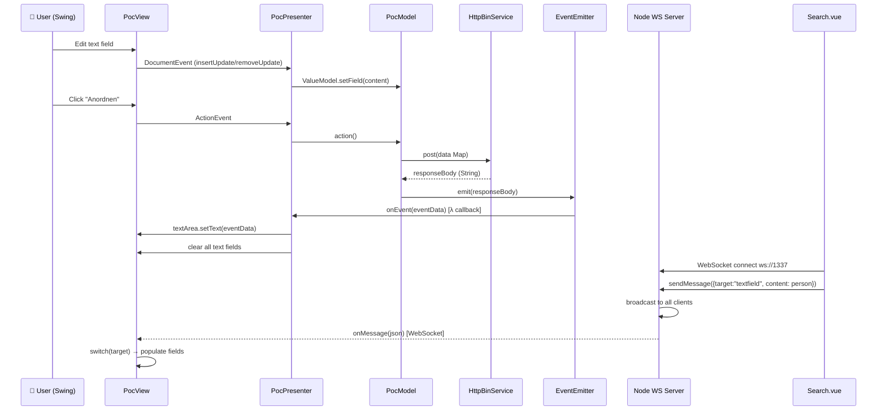
```mermaid
sequenceDiagram
    participant USER as 👤 User (Swing)
    participant VIEW as PocView
    participant PRES as PocPresenter
    participant MODEL as PocModel
    participant HTTP as HttpBinService
    participant EMITTER as EventEmitter
    participant SERVER as Node WS Server
    participant VUECLIENT as Search.vue

    USER->>VIEW: Edit text field
    VIEW->>PRES: DocumentEvent (insertUpdate/removeUpdate)
    PRES->>MODEL: ValueModel.setField(content)

    USER->>VIEW: Click "Anordnen"
    VIEW->>PRES: ActionEvent
    PRES->>MODEL: action()
    MODEL->>HTTP: post(data Map)
    HTTP-->>MODEL: responseBody (String)
    MODEL->>EMITTER: emit(responseBody)
    EMITTER->>PRES: onEvent(eventData) [λ callback]
    PRES->>VIEW: textArea.setText(eventData)
    PRES->>VIEW: clear all text fields

    VUECLIENT->>SERVER: WebSocket connect ws://1337
    VUECLIENT->>SERVER: sendMessage({target:"textfield", content: person})
    SERVER->>SERVER: broadcast to all clients
    SERVER-->>VIEW: onMessage(json) [WebSocket]
    VIEW->>VIEW: switch(target) → populate fields
```

### Error Handling Patterns

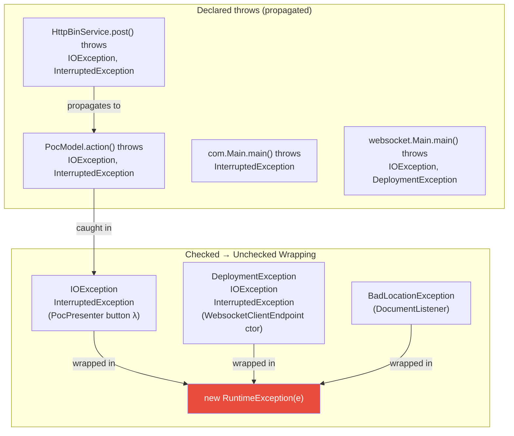
```mermaid
graph TD
    subgraph "Checked → Unchecked Wrapping"
        E1["IOException\nInterruptedException\n(PocPresenter button λ)"]
        E2["DeploymentException\nIOException\nInterruptedException\n(WebsocketClientEndpoint ctor)"]
        E3["BadLocationException\n(DocumentListener)"]
        RE["new RuntimeException(e)"]
    end

    subgraph "Declared throws (propagated)"
        T1["PocModel.action() throws\nIOException, InterruptedException"]
        T2["HttpBinService.post() throws\nIOException, InterruptedException"]
        T3["com.Main.main() throws\nInterruptedException"]
        T4["websocket.Main.main() throws\nIOException, DeploymentException"]
    end

    E1 -->|"wrapped in"| RE
    E2 -->|"wrapped in"| RE
    E3 -->|"wrapped in"| RE
    T2 -->|"propagates to"| T1
    T1 -->|"caught in"| E1

    style RE fill:#e74c3c,color:#fff
```

---

## Complexity Metrics Summary

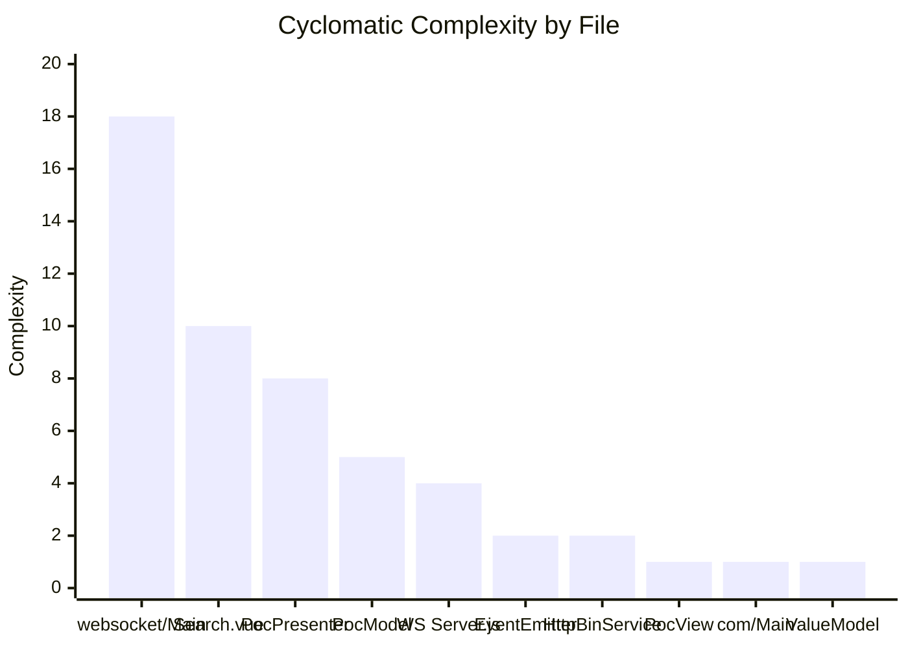
```mermaid
xychart-beta
    title "Cyclomatic Complexity by File"
    x-axis ["websocket/Main", "Search.vue", "PocPresenter", "PocModel", "WS Server.js", "EventEmitter", "HttpBinService", "PocView", "com/Main", "ValueModel"]
    y-axis "Complexity" 0 --> 20
    bar [18, 10, 8, 5, 4, 2, 2, 1, 1, 1]
```

| File | Classes | Methods | Fields | Cyclomatic Complexity | LOC |
|------|---------|---------|--------|-----------------------|-----|
| `websocket/Main.java` | 4 (1+3 nested) | 8 | 21 | **18** | 457 |
| `Search.vue` | — | 6 | 6 data | 10 | 177 |
| `PocPresenter.java` | 1 | 4 | 2 | 8 | 113 |
| `PocModel.java` | 1 | 1 | 3 | 5 | 49 |
| `WebsocketServer.js` | — | 5 | 3 module vars | 4 | 68 |
| `PocView.java` | 1 | 1 | 16 | 1 | 203 |
| `HttpBinService.java` | 1 | 1 | 3 | 2 | 38 |
| `EventEmitter.java` | 1 | 2 | 1 | 2 | 21 |
| `ValueModel.java` | 1 | 2 | 1 | 1 | 18 |
| `com/Main.java` | 1 | 1 | 0 | 1 | 23 |
| `EventListener.java` | 0 (interface) | 1 | 0 | 1 | 5 |
| `ModelProperties.java` | 0 (enum) | 0 | 13 | 1 | 18 |
| `App.vue` | — | 0 | 0 | 1 | 47 |
| `main.js` | — | 0 | 0 | 1 | 8 |
| `ViewData.java` | 1 | 0 | 0 | 1 | 5 |
| **TOTAL** | **12** | **32** | **~69** | **~58** | **~1249** |

---

## Architectural Patterns Identified

```mermaid
mindmap
    root((Architecture\nPatterns))
        MVP
            Model: PocModel
            View: PocView
            Presenter: PocPresenter
        Observer/PubSub
            EventEmitter bus
            EventListener interface
            Lambda implementations
        Generic Value Container
            ValueModel~T~
            EnumMap keying
            Type-safe casts
        WebSocket Bridge
            Node.js relay server
            Browser WebSocket API
            Java WebSocket client
        Anonymous Inner Classes
            DocumentListener
            Swing event listeners
        Dependency Injection
            Constructor injection
            Manual wiring in Main
        Data Binding
            Two-way: Swing ↔ Model
            One-way: v-model in Vue
        Command Pattern
            button.addActionListener
            model.action() call
```

---

*AST Analysis generated by ast-analyzer agent | Machine-readable JSON: `analysis_output/ast_combined.json`*
