# Abstract Syntax Tree (AST) Analysis
## Java Swing MVP Application — Allegro

> **Analysis Date**: 2025  
> **Language**: Java 21  
> **Source Root**: `swing/src/main/java/com/poc`  
> **AST Version**: 1.0  
> **Total Source Files**: 9  
> **Total LOC**: ~445

---

## Table of Contents

1. [Project Structure Overview](#1-project-structure-overview)
2. [Package & Compilation Unit Map](#2-package--compilation-unit-map)
3. [Class Hierarchy Diagram](#3-class-hierarchy-diagram)
4. [File-by-File AST Analysis](#4-file-by-file-ast-analysis)
   - 4.1 [ValueModel.java](#41-valuemodeljavacomplexity-1)
   - 4.2 [EventListener.java](#42-eventlistenerjava--interface)
   - 4.3 [EventEmitter.java](#43-eventemitterjava)
   - 4.4 [ModelProperties.java](#44-modelpropertiesjava--enum)
   - 4.5 [ViewData.java](#45-viewdatajava)
   - 4.6 [HttpBinService.java](#46-httpbinservicejava)
   - 4.7 [PocModel.java](#47-pocmodeljava)
   - 4.8 [PocView.java](#48-pocviewjava)
   - 4.9 [PocPresenter.java](#49-pocpresenterjava)
5. [Design Patterns Identified](#5-design-patterns-identified)
6. [Observer / EventEmitter Pattern AST](#6-observer--eventemitter-pattern-ast)
7. [MVP Pattern Structure AST](#7-mvp-pattern-structure-ast)
8. [Control Flow Diagrams](#8-control-flow-diagrams)
9. [Dependency Graph](#9-dependency-graph)
10. [Complexity Metrics Summary](#10-complexity-metrics-summary)

---

## 1. Project Structure Overview

```
com.poc
│
├── ValueModel.java              ← Generic property container (T)
│
└── model/
│   ├── EventListener.java       ← Observer callback interface
│   ├── EventEmitter.java        ← Observer subject / event bus
│   ├── ModelProperties.java     ← Enum: 13 model field keys
│   ├── ViewData.java            ← Placeholder class (empty)
│   ├── HttpBinService.java      ← HTTP POST service wrapper
│   └── PocModel.java            ← MVP Model layer
│
└── presentation/
    ├── PocView.java             ← MVP View layer (Swing UI)
    └── PocPresenter.java        ← MVP Presenter layer (bindings + logic)
```

---

## 2. Package & Compilation Unit Map

| File | Package | Type | Key Role |
|---|---|---|---|
| `ValueModel.java` | `com.poc` | Class (Generic) | Property value holder `<T>` |
| `EventListener.java` | `com.poc.model` | Interface | Observer callback contract |
| `EventEmitter.java` | `com.poc.model` | Class | Observer subject / event bus |
| `ModelProperties.java` | `com.poc.model` | Enum | Type-safe key registry (13 constants) |
| `ViewData.java` | `com.poc.model` | Class | Marker/placeholder (unused) |
| `HttpBinService.java` | `com.poc.model` | Class | HTTP POST service |
| `PocModel.java` | `com.poc.model` | Class | MVP Model |
| `PocView.java` | `com.poc.presentation` | Class | MVP View (Swing) |
| `PocPresenter.java` | `com.poc.presentation` | Class | MVP Presenter |

---

## 3. Class Hierarchy Diagram

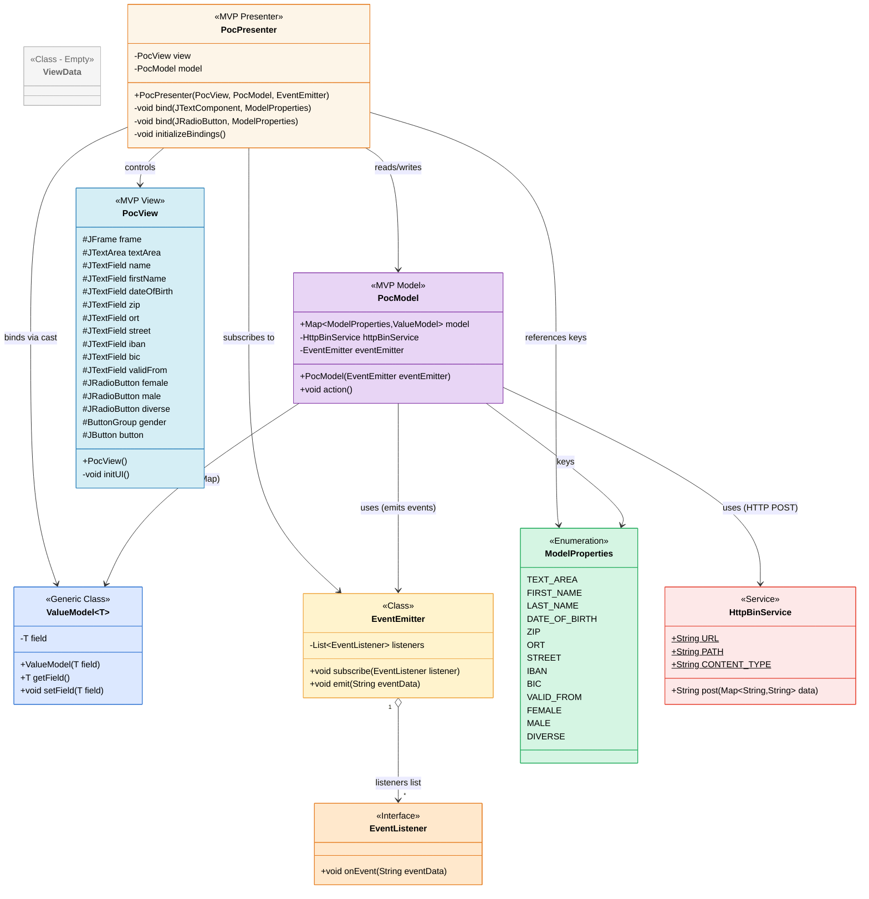

---

## 4. File-by-File AST Analysis

---

### 4.1 `ValueModel.java` — Complexity: 1

**Package**: `com.poc`  
**Type**: Generic Class  
**Lines of Code**: 18  
**JSON AST**: `analysis_output/ast_ValueModel.json`

#### Type Declaration Node
```
ClassDeclaration
├── name: "ValueModel"
├── modifiers: [PUBLIC]
├── typeParameters: [T (unbounded)]
├── extends: null
└── implements: []
```

#### Fields
| Name | Type | Modifiers | Initial Value |
|---|---|---|---|
| `field` | `T` | `private` | `null` |

#### Constructors
```
ConstructorDeclaration
├── name: "ValueModel"
├── modifiers: [PUBLIC]
├── parameters: [(T field)]
└── body:
    └── Assignment
        ├── target: FieldAccess(this.field)
        └── value: VariableReference(field, T)
```

#### Methods
```
MethodDeclaration: getField()
├── modifiers: [PUBLIC]
├── returnType: T
├── parameters: []
└── body:
    └── ReturnStatement
        └── VariableReference(field, T)

MethodDeclaration: setField(T field)
├── modifiers: [PUBLIC]
├── returnType: void
├── parameters: [(T field)]
└── body:
    └── Assignment
        ├── target: FieldAccess(this.field)
        └── value: VariableReference(field, T)
```

#### AST Summary
- **Generic type parameter**: `T` (unbounded — accepts `String`, `Boolean`, etc.)
- **Pattern**: Classic Value Object / JavaBeans property holder
- **Usage in system**: `ValueModel<String>` for text fields, `ValueModel<Boolean>` for radio buttons

---

### 4.2 `EventListener.java` — Interface

**Package**: `com.poc.model`  
**Type**: Interface  
**Lines of Code**: 5  
**JSON AST**: `analysis_output/ast_EventListener.json`

#### Type Declaration Node
```
InterfaceDeclaration
├── name: "EventListener"
├── modifiers: [PUBLIC]
├── typeParameters: []
└── extends: []
```

#### Abstract Methods
```
MethodDeclaration: onEvent(String eventData)
├── modifiers: [PUBLIC, ABSTRACT]
├── returnType: void
├── parameters: [(String eventData)]
├── throws: []
└── body: null  ← abstract, no implementation
```

#### AST Summary
- **Role**: Defines the Observer callback contract
- **Implemented by**: `PocPresenter` (as a Lambda expression)
- **Pattern**: Observer Pattern — Listener/Callback interface

---

### 4.3 `EventEmitter.java`

**Package**: `com.poc.model`  
**Type**: Class  
**Lines of Code**: 21  
**Cyclomatic Complexity**: 2  
**JSON AST**: `analysis_output/ast_EventEmitter.json`

#### Type Declaration Node
```
ClassDeclaration
├── name: "EventEmitter"
├── modifiers: [PUBLIC]
├── typeParameters: []
├── extends: null
└── implements: []
```

#### Fields
| Name | Type | Modifiers | Initial Value |
|---|---|---|---|
| `listeners` | `List<EventListener>` | `private final` | `new ArrayList<>()` |

#### Methods
```
MethodDeclaration: subscribe(EventListener listener)
├── modifiers: [PUBLIC]
├── returnType: void
├── parameters: [(EventListener listener)]
└── body:
    └── MethodInvocation
        ├── target: listeners
        ├── method: add
        └── arguments: [VariableReference(listener)]

MethodDeclaration: emit(String eventData)
├── modifiers: [PUBLIC]
├── returnType: void
├── parameters: [(String eventData)]
└── body:
    └── ForEachStatement
        ├── variable: (EventListener listener)
        ├── iterable: VariableReference(listeners)
        └── body:
            └── MethodInvocation
                ├── target: listener
                ├── method: onEvent
                └── arguments: [VariableReference(eventData)]
```

#### AST Summary
- **Pattern**: Observer Pattern — Concrete Subject/Event Bus
- **State**: holds `listeners` list (final, initialized inline)
- **Broadcast**: `emit()` iterates all listeners and calls `onEvent()`

---

### 4.4 `ModelProperties.java` — Enum

**Package**: `com.poc.model`  
**Type**: Enum  
**Lines of Code**: 18  
**JSON AST**: `analysis_output/ast_ModelProperties.json`

#### Type Declaration Node
```
EnumDeclaration
├── name: "ModelProperties"
├── modifiers: [PUBLIC]
└── constants:
    ├── [0]  TEXT_AREA
    ├── [1]  FIRST_NAME
    ├── [2]  LAST_NAME
    ├── [3]  DATE_OF_BIRTH
    ├── [4]  ZIP
    ├── [5]  ORT
    ├── [6]  STREET
    ├── [7]  IBAN
    ├── [8]  BIC
    ├── [9]  VALID_FROM
    ├── [10] FEMALE
    ├── [11] MALE
    └── [12] DIVERSE
```

#### Semantic Groupings (inferred from domain)

| Group | Constants | Data Type |
|---|---|---|
| Personal Info | `FIRST_NAME`, `LAST_NAME`, `DATE_OF_BIRTH` | `String` |
| Address | `ZIP`, `ORT`, `STREET` | `String` |
| Financial | `IBAN`, `BIC`, `VALID_FROM` | `String` |
| Gender | `FEMALE`, `MALE`, `DIVERSE` | `Boolean` |
| UI | `TEXT_AREA` | `String` |

#### AST Summary
- **Role**: Type-safe key registry for the `EnumMap` in `PocModel`
- **Count**: 13 constants (10 String-typed, 3 Boolean-typed)
- **Used as**: Map keys in `PocModel.model`, binding targets in `PocPresenter`

---

### 4.5 `ViewData.java`

**Package**: `com.poc.model`  
**Type**: Class (empty)  
**Lines of Code**: 4  
**JSON AST**: `analysis_output/ast_ViewData.json`

#### Type Declaration Node
```
ClassDeclaration
├── name: "ViewData"
├── modifiers: [PUBLIC]
├── fields: []
├── constructors: []
└── methods: []
```

#### AST Summary
- **Status**: Empty marker/placeholder class
- **Note**: Not currently used in the application — likely reserved for future DTO/transfer object expansion

---

### 4.6 `HttpBinService.java`

**Package**: `com.poc.model`  
**Type**: Class  
**Lines of Code**: 38  
**Cyclomatic Complexity**: 2  
**JSON AST**: `analysis_output/ast_HttpBinService.json`

#### Type Declaration Node
```
ClassDeclaration
├── name: "HttpBinService"
├── modifiers: [PUBLIC]
├── extends: null
└── implements: []
```

#### Fields (Constants)
| Name | Type | Modifiers | Value |
|---|---|---|---|
| `URL` | `String` | `public static final` | `"http://localhost:8080"` |
| `PATH` | `String` | `public static final` | `"/post"` |
| `CONTENT_TYPE` | `String` | `public static final` | `"application/json"` |

#### Method: `post(Map<String, String> data)`
```
MethodDeclaration: post
├── modifiers: [PUBLIC]
├── returnType: String
├── parameters: [(Map<String, String> data)]
├── throws: [IOException, InterruptedException]
└── body:
    ├── VariableDeclaration(connection: HttpURLConnection)
    │   └── CastExpression(HttpURLConnection)
    │       └── MethodInvocation(new URL(URL+PATH).openConnection())
    ├── MethodInvocation(connection.setRequestMethod("POST"))
    ├── MethodInvocation(connection.setRequestProperty("Content-Type", CONTENT_TYPE))
    ├── MethodInvocation(connection.setDoOutput(true))
    ├── VariableDeclaration(jsonGeneratorFactory)
    │   └── MethodInvocation(Json.createGeneratorFactory(null))
    ├── VariableDeclaration(generator)
    │   └── MethodInvocation(jsonGeneratorFactory.createGenerator(connection.getOutputStream()))
    ├── MethodInvocation(generator.writeStartObject())
    ├── ForEachStatement [iterate data.entrySet()]
    │   └── body:
    │       └── MethodInvocation(generator.write(entry.getKey(), entry.getValue()))
    ├── MethodInvocation(generator.writeEnd())
    ├── MethodInvocation(generator.close())
    ├── VariableDeclaration(responseCode)
    │   └── MethodInvocation(connection.getResponseCode())
    ├── VariableDeclaration(responseBody)
    │   └── MethodChain(new Scanner(connection.getInputStream()).useDelimiter("\\A").next())
    ├── MethodInvocation(System.out.println("Response code: " + responseCode))
    ├── MethodInvocation(System.out.println("Response body: " + responseBody))
    ├── MethodInvocation(connection.disconnect())
    └── ReturnStatement
        └── VariableReference(responseBody)
```

#### AST Summary
- **Pattern**: Service Layer, HTTP Client Wrapper
- **Protocol**: HTTP POST with JSON body (javax.json streaming writer)
- **Endpoint**: `http://localhost:8080/post`
- **Note**: `InterruptedException` in throws clause is declared but not actually thrown internally — compatibility artifact

---

### 4.7 `PocModel.java`

**Package**: `com.poc.model`  
**Type**: Class  
**Lines of Code**: 49  
**Cyclomatic Complexity**: 4  
**JSON AST**: `analysis_output/ast_PocModel.json`

#### Type Declaration Node
```
ClassDeclaration
├── name: "PocModel"
├── modifiers: [PUBLIC]
├── extends: null
└── implements: []
```

#### Fields
| Name | Type | Modifiers | Initial Value |
|---|---|---|---|
| `model` | `Map<ModelProperties, ValueModel<?>>` | `public` | `new EnumMap<>(ModelProperties.class)` |
| `httpBinService` | `HttpBinService` | `private` | `new HttpBinService()` |
| `eventEmitter` | `EventEmitter` | `private` | `null` (set in constructor) |

#### Constructor: `PocModel(EventEmitter eventEmitter)`
```
ConstructorDeclaration
├── modifiers: [PUBLIC]
├── parameters: [(EventEmitter eventEmitter)]
└── body:
    ├── model.put(TEXT_AREA,     new ValueModel<String>(null))
    ├── model.put(FIRST_NAME,    new ValueModel<String>(null))
    ├── model.put(LAST_NAME,     new ValueModel<String>(null))
    ├── model.put(DATE_OF_BIRTH, new ValueModel<String>(null))
    ├── model.put(ZIP,           new ValueModel<String>(null))
    ├── model.put(ORT,           new ValueModel<String>(null))
    ├── model.put(STREET,        new ValueModel<String>(null))
    ├── model.put(IBAN,          new ValueModel<String>(null))
    ├── model.put(BIC,           new ValueModel<String>(null))
    ├── model.put(VALID_FROM,    new ValueModel<String>(null))
    ├── model.put(MALE,          new ValueModel<Boolean>(null))
    ├── model.put(FEMALE,        new ValueModel<Boolean>(null))
    ├── model.put(DIVERSE,       new ValueModel<Boolean>(null))
    └── Assignment(this.eventEmitter = eventEmitter)
```

#### Method: `action()`
```
MethodDeclaration: action
├── modifiers: [PUBLIC]
├── returnType: void
├── parameters: []
├── throws: [IOException, InterruptedException]
└── body:
    ├── ForEachStatement [DEBUG: print all values]
    │   ├── iterable: ModelProperties.values()
    │   └── body:
    │       └── System.out.println(val + ": " + model.get(val).getField())
    ├── VariableDeclaration(data: HashMap<String,String>)
    ├── ForEachStatement [collect model → data map]
    │   ├── iterable: ModelProperties.values()
    │   └── body:
    │       └── data.put(val.toString(), model.get(val).getField().toString())
    ├── VariableDeclaration(responseBody)
    │   └── httpBinService.post(data)
    └── IfStatement
        ├── condition: !responseBody.isEmpty()
        ├── thenBlock:
        │   └── eventEmitter.emit(responseBody)
        └── elseBlock:
            └── eventEmitter.emit("Failed operation")
```

#### AST Summary
- **Pattern**: MVP Model Layer, Observer (emits events), EnumMap property bag
- **Responsibility**: Holds application data; triggers HTTP POST; emits result events
- **Access modifier concern**: `model` field is `public` — presenter accesses it directly

---

### 4.8 `PocView.java`

**Package**: `com.poc.presentation`  
**Type**: Class  
**Lines of Code**: 203  
**Cyclomatic Complexity**: 1  
**JSON AST**: `analysis_output/ast_PocView.json`

#### Type Declaration Node
```
ClassDeclaration
├── name: "PocView"
├── modifiers: [PUBLIC]
├── extends: null
└── implements: []
```

#### Fields (16 total — all `protected`)

| Field Name | Type | Initial Value | UI Role |
|---|---|---|---|
| `frame` | `JFrame` | `new JFrame("Allegro")` | Window |
| `textArea` | `JTextArea` | `new JTextArea()` | Response area |
| `name` | `JTextField` | `new JTextField()` | Last name |
| `firstName` | `JTextField` | `new JTextField()` | First name |
| `dateOfBirth` | `JTextField` | `new JTextField()` | Date of birth |
| `zip` | `JTextField` | `new JTextField()` | Postal code |
| `ort` | `JTextField` | `new JTextField()` | City |
| `street` | `JTextField` | `new JTextField()` | Street |
| `iban` | `JTextField` | `new JTextField()` | IBAN |
| `bic` | `JTextField` | `new JTextField()` | BIC |
| `validFrom` | `JTextField` | `new JTextField()` | Valid from date |
| `female` | `JRadioButton` | `new JRadioButton("Weiblich")` | Gender: Female |
| `male` | `JRadioButton` | `new JRadioButton("Männlich")` | Gender: Male |
| `diverse` | `JRadioButton` | `new JRadioButton("Divers")` | Gender: Diverse |
| `gender` | `ButtonGroup` | `new ButtonGroup()` | Gender group |
| `button` | `JButton` | `new JButton("Anordnen")` | Submit |

#### Constructor
```
ConstructorDeclaration: PocView()
├── modifiers: [PUBLIC]
└── body:
    └── MethodInvocation(this.initUI())
```

#### Method: `initUI()`
```
MethodDeclaration: initUI
├── modifiers: [PRIVATE]
├── returnType: void
└── body: [GridBagLayout form setup]
    ├── Create JPanel with GridBagLayout
    ├── GridBagConstraints setup (ipady=4, insets=4, anchor=FIRST_LINE_END)
    ├── Row 0: Vorname[0,0] | firstName[1,0] | Name[2,0] | name[3,0] | Geburtsdatum[4,0] | dateOfBirth[5,0]
    ├── gender.add(female), gender.add(male), gender.add(diverse)
    ├── female.setSelected(true)
    ├── Row 1: Geschlecht[0,1] | genderPanel(female+male+diverse)[1,1 gridwidth=5]
    ├── Row 2: Strasse[0,2] | street[1,2] | PLZ[2,2] | zip[3,2] | Ort[4,2] | ort[5,2]
    ├── Row 3: IBAN[0,3] | iban[1,3] | BIC[2,3] | bic[3,3] | Gültig ab[4,3] | validFrom[5,3]
    ├── Row 4: RT[0,4] | textArea[1,4 gridwidth=6] (200×400 px, EtchedBorder)
    ├── Row 5: button[1,5]
    ├── frame.getContentPane().add(panel)
    ├── frame.setDefaultCloseOperation(EXIT_ON_CLOSE)
    ├── frame.setSize(800, 650)
    └── frame.setVisible(true)
```

#### UI Layout Map
```mermaid
graph TD
    subgraph Frame["JFrame: Allegro (800×650)"]
        subgraph Panel["JPanel: GridBagLayout"]
            subgraph Row0["Row 0"]
                L1["JLabel: Vorname"] --> TF1["JTextField: firstName"]
                L2["JLabel: Name"] --> TF2["JTextField: name"]
                L3["JLabel: Geburtsdatum"] --> TF3["JTextField: dateOfBirth"]
            end
            subgraph Row1["Row 1"]
                L4["JLabel: Geschlecht"] --> GP["JPanel: FlowLayout
                (female | male | diverse)"]
            end
            subgraph Row2["Row 2"]
                L5["JLabel: Strasse"] --> TF5["JTextField: street"]
                L6["JLabel: PLZ"] --> TF6["JTextField: zip"]
                L7["JLabel: Ort"] --> TF7["JTextField: ort"]
            end
            subgraph Row3["Row 3"]
                L8["JLabel: IBAN"] --> TF8["JTextField: iban"]
                L9["JLabel: BIC"] --> TF9["JTextField: bic"]
                L10["JLabel: Gültig ab"] --> TF10["JTextField: validFrom"]
            end
            subgraph Row4["Row 4"]
                L11["JLabel: RT"] --> TA["JTextArea: textArea (200×400)"]
            end
            subgraph Row5["Row 5"]
                BTN["JButton: Anordnen (Submit)"]
            end
        end
    end
    style Frame fill:#e8f4fd,stroke:#2980b9
    style Panel fill:#f8f9fa,stroke:#aaa
    style Row0 fill:#fff3cd,stroke:#f0ad4e
    style Row1 fill:#d5f5e3,stroke:#27ae60
    style Row2 fill:#fde8e8,stroke:#e74c3c
    style Row3 fill:#e8d5f5,stroke:#8e44ad
    style Row4 fill:#d5eef5,stroke:#2980b9
    style Row5 fill:#fdf5e8,stroke:#e67e22
```

---

### 4.9 `PocPresenter.java`

**Package**: `com.poc.presentation`  
**Type**: Class  
**Lines of Code**: 113  
**Cyclomatic Complexity**: 6  
**JSON AST**: `analysis_output/ast_PocPresenter.json`

#### Type Declaration Node
```
ClassDeclaration
├── name: "PocPresenter"
├── modifiers: [PUBLIC]
├── extends: null
└── implements: []
```

#### Fields
| Name | Type | Modifiers |
|---|---|---|
| `view` | `PocView` | `private` |
| `model` | `PocModel` | `private` |

#### Constructor: `PocPresenter(PocView, PocModel, EventEmitter)`
```
ConstructorDeclaration
├── parameters: [(PocView view), (PocModel model), (EventEmitter eventEmitter)]
└── body:
    ├── Assignment(this.view = view)
    ├── Assignment(this.model = model)
    │
    ├── eventEmitter.subscribe(λ eventData → {     ← EventListener Lambda
    │       System.out.println("Event data is: " + eventData)
    │       view.textArea.setText(eventData)
    │       view.firstName.setText("")
    │       view.name.setText("")
    │       view.dateOfBirth.setText("")
    │       view.zip.setText("")
    │       view.ort.setText("")
    │       view.street.setText("")
    │       view.iban.setText("")
    │       view.bic.setText("")
    │       view.validFrom.setText("")
    │       view.female.setSelected(true)
    │       view.male.setSelected(false)
    │       view.diverse.setSelected(false)
    │   })
    │
    ├── view.button.addActionListener(λ _ → {       ← ActionListener Lambda (unnamed param)
    │       TryCatch {
    │           model.action()
    │       } catch (IOException e) {
    │           throw new RuntimeException(e)
    │       } catch (InterruptedException e) {
    │           throw new RuntimeException(e)
    │       }
    │   })
    │
    └── this.initializeBindings()
```

#### Method: `bind(JTextComponent source, ModelProperties prop)` [overload 1]
```
MethodDeclaration: bind (JTextComponent overload)
├── modifiers: [PRIVATE]
├── returnType: void
├── parameters: [(JTextComponent source), (ModelProperties prop)]
└── body:
    ├── VariableDeclaration(model: ValueModel<String>)
    │   └── CastExpression(PocPresenter.this.model.model.get(prop))
    ├── model.setField(source.getText())      ← initial sync
    └── source.getDocument().addDocumentListener(new DocumentListener() {
            ├── insertUpdate(DocumentEvent e):
            │     TryCatch {
            │         content = e.getDocument().getText(0, length)
            │         model.setField(content)
            │     } catch BadLocationException → RuntimeException
            ├── removeUpdate(DocumentEvent e):
            │     TryCatch {
            │         content = e.getDocument().getText(0, length)
            │         model = (ValueModel<String>) PocPresenter.this.model.model.get(prop)
            │         model.setField(content)
            │     } catch BadLocationException → RuntimeException
            └── changedUpdate(DocumentEvent e): [empty body]
        })
```

#### Method: `bind(JRadioButton source, ModelProperties prop)` [overload 2]
```
MethodDeclaration: bind (JRadioButton overload)
├── modifiers: [PRIVATE]
├── returnType: void
├── parameters: [(JRadioButton source), (ModelProperties prop)]
└── body:
    ├── VariableDeclaration(model: ValueModel<Boolean>)
    │   └── CastExpression(PocPresenter.this.model.model.get(prop))
    ├── model.setField(source.isSelected())   ← initial sync
    └── source.addChangeListener(λ evt → {
            model.setField(source.isSelected())
            System.out.println(source.isSelected())
        })
```

#### Method: `initializeBindings()` — 13 bindings
```
MethodDeclaration: initializeBindings
├── modifiers: [PRIVATE]
├── returnType: void
└── body:
    ├── bind(view.textArea,    TEXT_AREA)     ← JTextComponent
    ├── bind(view.firstName,   FIRST_NAME)    ← JTextComponent
    ├── bind(view.name,        LAST_NAME)     ← JTextComponent
    ├── bind(view.dateOfBirth, DATE_OF_BIRTH) ← JTextComponent
    ├── bind(view.zip,         ZIP)           ← JTextComponent
    ├── bind(view.ort,         ORT)           ← JTextComponent
    ├── bind(view.street,      STREET)        ← JTextComponent
    ├── bind(view.iban,        IBAN)          ← JTextComponent
    ├── bind(view.bic,         BIC)           ← JTextComponent
    ├── bind(view.validFrom,   VALID_FROM)    ← JTextComponent
    ├── bind(view.male,        MALE)          ← JRadioButton
    ├── bind(view.female,      FEMALE)        ← JRadioButton
    └── bind(view.diverse,     DIVERSE)       ← JRadioButton
```

#### Inner / Anonymous Classes
```
AnonymousClassCreation: DocumentListener
├── declaredIn: bind(JTextComponent, ModelProperties)
├── interface: javax.swing.event.DocumentListener
└── methods:
    ├── insertUpdate(DocumentEvent e) → updates model on text insert
    ├── removeUpdate(DocumentEvent e) → updates model on text delete
    └── changedUpdate(DocumentEvent e) → empty (style-only changes)
```

---

## 5. Design Patterns Identified

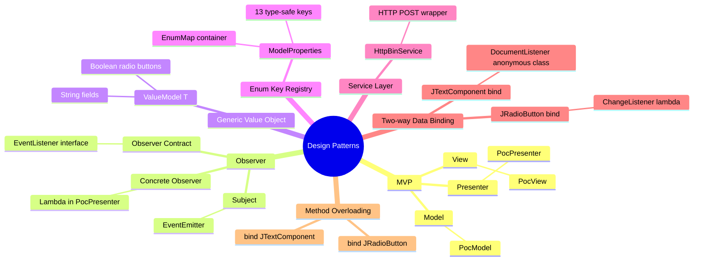

### Pattern Detail Table

| Pattern | Classes Involved | Implementation |
|---|---|---|
| **MVP (Model-View-Presenter)** | `PocModel`, `PocView`, `PocPresenter` | Classic MVP; Presenter wires View events to Model actions |
| **Observer / Event Bus** | `EventListener`, `EventEmitter`, `PocPresenter` | Pub/sub: model emits, presenter subscribes via lambda |
| **Generic Value Object** | `ValueModel<T>` | Parameterized property holder, type-erased at runtime |
| **Enum as Key Registry** | `ModelProperties`, `PocModel` | Type-safe `EnumMap<ModelProperties, ValueModel<?>>` |
| **Service Layer** | `HttpBinService` | Encapsulates HTTP POST; injectable into `PocModel` |
| **Two-way Data Binding** | `PocPresenter`, `ValueModel`, Swing components | View→Model via `DocumentListener`; Model→View via event lambda |
| **Anonymous Inner Class** | `PocPresenter.bind()` | `DocumentListener` anonymous impl |
| **Lambda as Functional Interface** | `PocPresenter` | `EventListener` as lambda, `ActionListener` as lambda |
| **Method Overloading** | `PocPresenter.bind()` | Two `bind()` methods: `JTextComponent` and `JRadioButton` |

---

## 6. Observer / EventEmitter Pattern AST

### Structural Nodes

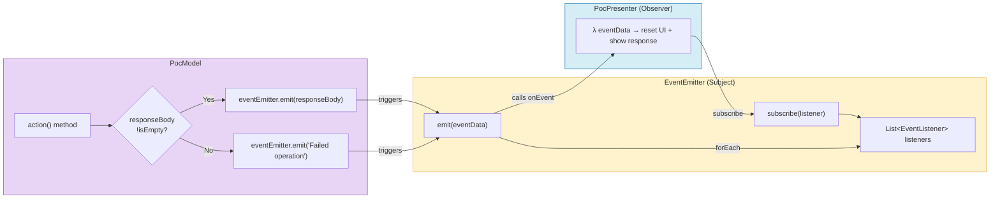

### AST Node Trace: Event Flow

```
[PocPresenter constructor]
  └── eventEmitter.subscribe(λ eventData → ...)
        └── MethodInvocation {
              target: "eventEmitter",
              method: "subscribe",
              arguments: [
                LambdaExpression {
                  parameter: (String eventData),
                  body: [
                    MethodInvocation(view.textArea.setText(eventData)),
                    MethodInvocation(view.firstName.setText("")),
                    ... [9 more setText calls],
                    MethodInvocation(view.female.setSelected(true)),
                    MethodInvocation(view.male.setSelected(false)),
                    MethodInvocation(view.diverse.setSelected(false))
                  ]
                }
              ]
            }

[PocModel.action()]
  └── eventEmitter.emit(responseBody)  OR  eventEmitter.emit("Failed operation")
        └── MethodInvocation {
              target: "eventEmitter",
              method: "emit",
              arguments: [VariableReference(responseBody) | Literal("Failed operation")]
            }

[EventEmitter.emit()]
  └── ForEachStatement {
        variable: (EventListener listener),
        iterable: listeners,
        body: [
          MethodInvocation {
            target: "listener",
            method: "onEvent",
            arguments: [VariableReference(eventData)]
          }
        ]
      }
```

---

## 7. MVP Pattern Structure AST

### Layer Interaction Diagram

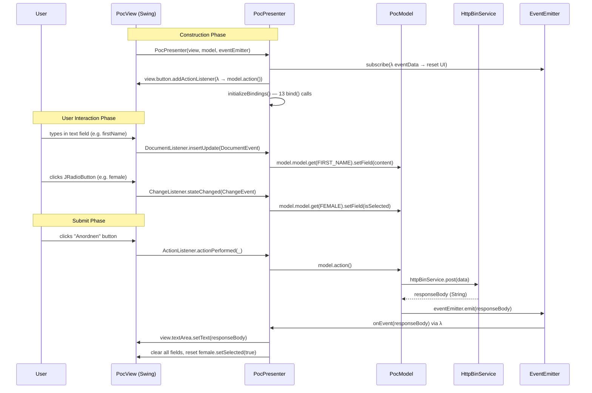

### MVP Node Mapping

```
MVP Architecture AST Nodes:
─────────────────────────────────────────────────────
MODEL Layer (com.poc.model)
  ClassDeclaration: PocModel
    ├── Fields:
    │   ├── model: EnumMap<ModelProperties, ValueModel<?>>
    │   ├── httpBinService: HttpBinService
    │   └── eventEmitter: EventEmitter
    └── Methods:
        └── action(): [collect data] → [POST] → [emit result]

VIEW Layer (com.poc.presentation)
  ClassDeclaration: PocView
    ├── Fields: 16 protected Swing components
    └── Methods:
        └── initUI(): [GridBagLayout form] → [frame.setVisible(true)]

PRESENTER Layer (com.poc.presentation)
  ClassDeclaration: PocPresenter
    ├── Fields:
    │   ├── view: PocView
    │   └── model: PocModel
    └── Methods:
        ├── PocPresenter(..): [wires events, subscriptions, bindings]
        ├── bind(JTextComponent, ModelProperties): [DocumentListener]
        ├── bind(JRadioButton, ModelProperties): [ChangeListener]
        └── initializeBindings(): [13 bind() calls]
─────────────────────────────────────────────────────
```

---

## 8. Control Flow Diagrams

### 8.1 `PocModel.action()` Control Flow

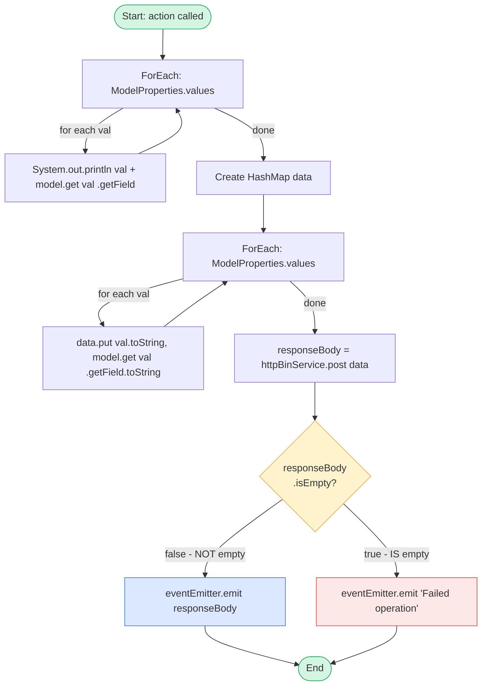

### 8.2 `HttpBinService.post()` Control Flow

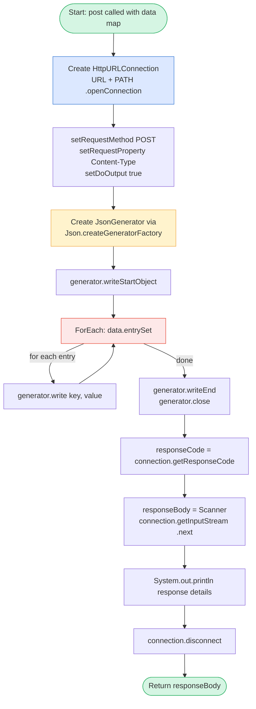

### 8.3 `PocPresenter.bind(JTextComponent)` Control Flow

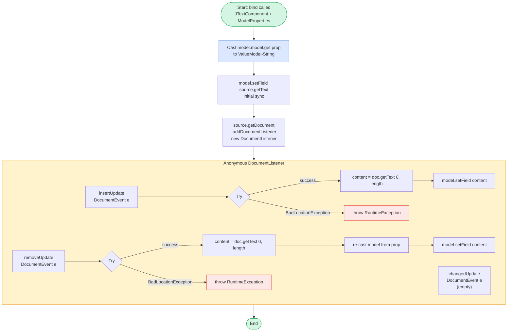

---

## 9. Dependency Graph

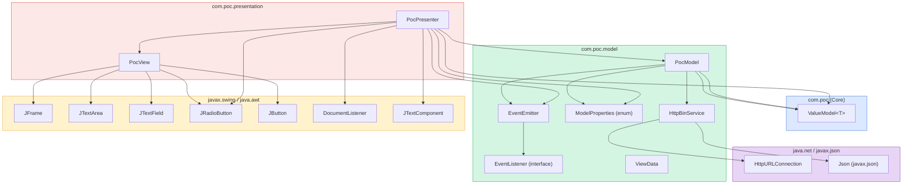

---

## 10. Complexity Metrics Summary

| File | Type | LOC | Methods | Fields | Constructors | Cyclomatic Complexity | Patterns |
|---|---|---|---|---|---|---|---|
| `ValueModel.java` | Generic Class | 18 | 2 | 1 | 1 | **1** | Generic Value Object |
| `EventListener.java` | Interface | 5 | 1 | 0 | 0 | **1** | Observer Contract |
| `EventEmitter.java` | Class | 21 | 2 | 1 | 0 | **2** | Observer Subject |
| `ModelProperties.java` | Enum | 18 | 0 | 0 | 0 | **1** | Enum Key Registry |
| `ViewData.java` | Class (empty) | 4 | 0 | 0 | 0 | **1** | Placeholder |
| `HttpBinService.java` | Class | 38 | 1 | 3 | 0 | **2** | Service Layer |
| `PocModel.java` | Class | 49 | 1 | 3 | 1 | **4** | MVP Model |
| `PocView.java` | Class | 203 | 1 | 16 | 1 | **1** | MVP View |
| `PocPresenter.java` | Class | 113 | 4 | 2 | 1 | **6** | MVP Presenter |
| **TOTAL** | — | **~469** | **12** | **26** | **4** | **~19** | **9 patterns** |

### Complexity Visualization

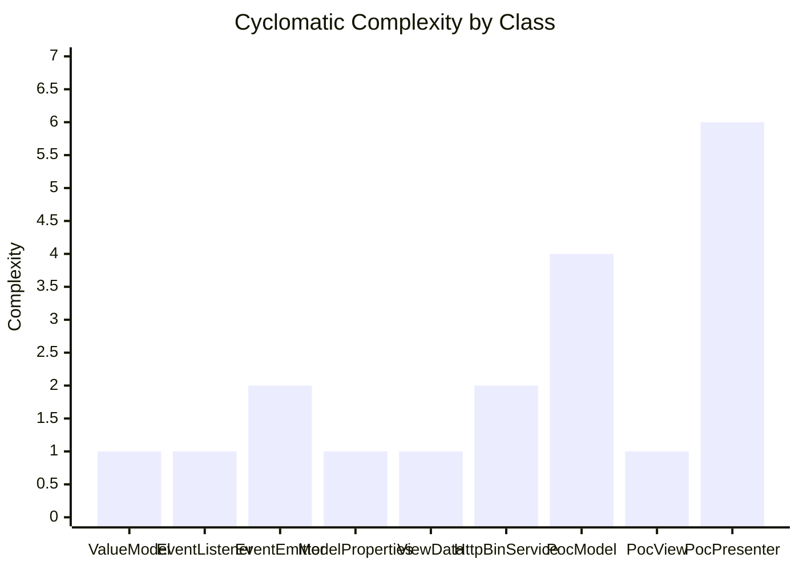

### AST Node Type Distribution

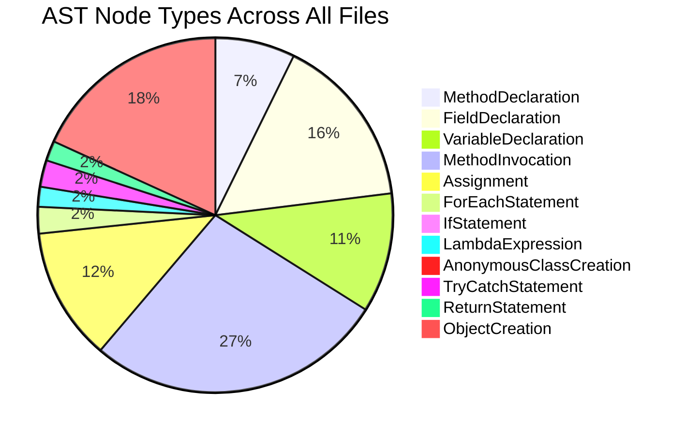

---

## AST Files Index

All AST JSON files are located in `analysis_output/`:

| File | Class | Size |
|---|---|---|
| `ast_ValueModel.json` | `ValueModel<T>` | ~2.4 KB |
| `ast_EventListener.json` | `EventListener` interface | ~1.0 KB |
| `ast_EventEmitter.json` | `EventEmitter` | ~2.7 KB |
| `ast_ModelProperties.json` | `ModelProperties` enum | ~1.6 KB |
| `ast_ViewData.json` | `ViewData` | ~0.7 KB |
| `ast_HttpBinService.json` | `HttpBinService` | ~8.8 KB |
| `ast_PocModel.json` | `PocModel` | ~12.6 KB |
| `ast_PocView.json` | `PocView` | ~12.7 KB |
| `ast_PocPresenter.json` | `PocPresenter` | ~26.0 KB |

---

*Generated by AST Analyzer Agent | Java Swing MVP Application — Allegro*
