# Allegro PoC — BPMN Business Process Diagrams

> **Generated by**: bpmn-generator agent  
> **Repository**: Chris-Capgemini/test-custom-agents-2  
> **Date**: 2025-01-01  
> **Note**: Requested output path `output/bpmn-diagrams.md` — directory did not exist; saved to `analysis_output/bpmn-diagrams.md` instead (same fallback as ast-analyzer agent).  
> **Source inputs**: `business_rules_extractor_analysis.json` · `ast-*.json` · direct source reads of `Search.vue`, `PocPresenter.java`, `PocModel.java`, `PocView.java`, `HttpBinService.java`, `WebsocketServer.js`

---

## Table of Contents

1. [System Context Overview](#0-system-context-overview)
2. [Process 1 — Person Search and Allegro Data Transfer](#process-1--person-search-and-allegro-data-transfer-vue-client)
3. [Process 2 — Swing Form Data Entry and HTTP Submission](#process-2--swing-form-data-entry-and-http-submission)
4. [Process 3 — Real-Time Textarea Synchronisation](#process-3--real-time-textarea-synchronisation)
5. [Cross-Process Message Flow](#cross-process-message-flow)
6. [Process Element Summary](#process-element-summary)

---

## 0. System Context Overview

High-level map showing all three runtime components and the communication channels between them.

```mermaid
graph LR
    subgraph Browser["🌐 Browser — Vue.js Client"]
        VUE["Search.vue\n(Search + Transfer UI)"]
    end

    subgraph NodeRelay["⚙️ Node.js :1337 — WebSocket Relay"]
        WS["WebsocketServer.js\n(Broadcast Relay)"]
    end

    subgraph SwingApp["🖥️ Desktop — Java Swing (Allegro)"]
        SWING["PocView / PocPresenter\n(Form + MVP Logic)"]
        MODEL["PocModel\n(Domain Model + Submission)"]
        HTTP_OUT["HttpBinService\n(HTTP POST Client)"]
    end

    subgraph Backend["🔧 Backend API :8080"]
        API["/post endpoint\n(localhost:8080/post)"]
    end

    VUE -- "WebSocket ws://localhost:1337\n{target, content} JSON" --> WS
    WS -- "Broadcast to all\nconnected clients" --> VUE
    WS -- "Broadcast to all\nconnected clients" --> SWING
    SWING -- "Populates domain model\nvia real-time binding" --> MODEL
    MODEL -- "HTTP POST JSON\n13 fields" --> HTTP_OUT
    HTTP_OUT -- "POST application/json" --> API
    API -- "HTTP Response body" --> HTTP_OUT

    style VUE fill:#87CEEB,stroke:#4682B4,color:#000
    style WS fill:#FFD700,stroke:#B8860B,color:#000
    style SWING fill:#DDA0DD,stroke:#9932CC,color:#000
    style MODEL fill:#DDA0DD,stroke:#9932CC,color:#000
    style HTTP_OUT fill:#DDA0DD,stroke:#9932CC,color:#000
    style API fill:#F0E68C,stroke:#DAA520,color:#000
```

---

## Process 1 — Person Search and Allegro Data Transfer (Vue Client)

**Component**: `node-vue-client/src/components/Search.vue`  
**Business Domain**: Person Search · Payment & IBAN Management · Legacy System Integration  
**Key Business Rules**: SRC-001 → SRC-007, PAY-002 → PAY-005, LSI-001 → LSI-005

### Overview

The operator uses the Vue.js browser client to find a person in the in-memory mock dataset, select one of their Zahlungsempfänger (payment recipient) records, and transfer the combined payload to the legacy Allegro Swing application through the Node.js WebSocket relay.

### 1a. Full Swimlane Diagram

```mermaid
graph TD
    subgraph Operator["👤 Operator — Browser"]
        P1_START(["🟢 Open Vue Search Form"])
        P1_ENTER["Enter Search Criteria\nVorname · Name · PLZ · Ort\nStrasse · Hausnummer"]
        P1_CLICK_SEARCH["Click 'Suchen' Button"]
        P1_SELECT_PERSON["Click Person Row\nto Highlight"]
        P1_SELECT_ZE["Click Zahlungsempfänger Row\nto Highlight"]
        P1_CLICK_SEND["Click\n'Nach ALLEGRO übernehmen'"]
    end

    subgraph VueLogic["⚙️ Vue.js — Search Logic (Search.vue)"]
        P1_RESET_RESULTS["Reset search_result = &#91;&#93;"]
        P1_LOOP_START{"Iterate mock\ndataset\n(5 persons)"}
        P1_OR_MATCH{"Any criterion\nmatches?\nOR logic"}
        P1_ADD_RESULT["Push person\nto search_result"]
        P1_DISPLAY["Render results\nin table"]
        P1_SHOW_ZE["Show zahlungsempfaenger\nfor selected person\nin second table"]
        P1_SET_ZE_STATE["Store zahlungsempfaenger_selected\nin component state"]
        P1_DEEP_CLONE["Deep-clone selected\nperson object\nJSON.parse(JSON.stringify)"]
        P1_REPLACE_ZE["Replace zahlungsempfaenger array\nwith single selected entry"]
        P1_BUILD_MSG["Build message envelope\n{ target: 'textfield',\ncontent: cloned_person }"]
        P1_WS_SEND["socket.send(JSON.stringify(msg))"]
    end

    subgraph MatchDetail["🔍 Matching Rules"]
        P1_ZIP_CHECK{"PLZ entered?\n(exact ==)"}
        P1_TEXT_CHECK{"Name/Vorname/Ort/\nStrasse/Hausnr entered?\n(case-insensitive\nsubstring indexOf)"}
    end

    subgraph NodeServer["⚙️ Node.js Relay — WebsocketServer.js"]
        P1_WS_RECV["Receive UTF-8\nmessage"]
        P1_BROADCAST["Broadcast to ALL\nconnected clients\n(for loop)"]
    end

    subgraph SwingClient["🖥️ Swing — Allegro (Receiver)"]
        P1_WS_MSG_RECV["WebSocket message\nreceived in Swing client"]
        P1_POPULATE["Populate form fields\nfrom JSON content"]
        P1_END_SWING(["🔵 Continue in Process 2"])
    end

    subgraph EndStates["End States"]
        P1_END_NO_RESULTS(["🔴 No results found\n(empty table)"])
        P1_END_SENT(["🟢 Transfer Complete\nAllegro populated"])
    end

    %% Main happy path
    P1_START --> P1_ENTER
    P1_ENTER --> P1_CLICK_SEARCH
    P1_CLICK_SEARCH --> P1_RESET_RESULTS
    P1_RESET_RESULTS --> P1_LOOP_START

    %% OR matching logic
    P1_LOOP_START --> P1_ZIP_CHECK
    P1_ZIP_CHECK -->|"PLZ entered"| P1_OR_MATCH
    P1_ZIP_CHECK -->|"PLZ empty,\ncheck text fields"| P1_TEXT_CHECK
    P1_TEXT_CHECK --> P1_OR_MATCH
    P1_OR_MATCH -->|"Match (OR)"| P1_ADD_RESULT
    P1_OR_MATCH -->|"No match"| P1_LOOP_START
    P1_ADD_RESULT --> P1_LOOP_START

    %% After loop
    P1_LOOP_START -->|"All 5 persons\nchecked"| P1_DISPLAY
    P1_DISPLAY -->|"Results empty"| P1_END_NO_RESULTS
    P1_DISPLAY -->|"Results shown"| P1_SELECT_PERSON
    P1_SELECT_PERSON --> P1_SHOW_ZE

    %% Payment selection
    P1_SHOW_ZE --> P1_SELECT_ZE
    P1_SELECT_ZE --> P1_SET_ZE_STATE
    P1_SET_ZE_STATE --> P1_CLICK_SEND

    %% Data transformation and send
    P1_CLICK_SEND --> P1_DEEP_CLONE
    P1_DEEP_CLONE --> P1_REPLACE_ZE
    P1_REPLACE_ZE --> P1_BUILD_MSG
    P1_BUILD_MSG --> P1_WS_SEND

    %% Relay
    P1_WS_SEND --> P1_WS_RECV
    P1_WS_RECV --> P1_BROADCAST
    P1_BROADCAST --> P1_WS_MSG_RECV
    P1_WS_MSG_RECV --> P1_POPULATE
    P1_POPULATE --> P1_END_SWING
    P1_END_SWING --> P1_END_SENT

    %% Styling
    style P1_START fill:#90EE90,stroke:#228B22,color:#000
    style P1_END_NO_RESULTS fill:#FFB6C1,stroke:#DC143C,color:#000
    style P1_END_SENT fill:#90EE90,stroke:#228B22,color:#000
    style P1_END_SWING fill:#87CEEB,stroke:#4682B4,color:#000
    style P1_OR_MATCH fill:#FFD700,stroke:#B8860B,color:#000
    style P1_ZIP_CHECK fill:#FFD700,stroke:#B8860B,color:#000
    style P1_TEXT_CHECK fill:#FFD700,stroke:#B8860B,color:#000
    style P1_LOOP_START fill:#FFD700,stroke:#B8860B,color:#000
    style P1_ENTER fill:#DDA0DD,stroke:#9932CC,color:#000
    style P1_CLICK_SEARCH fill:#DDA0DD,stroke:#9932CC,color:#000
    style P1_SELECT_PERSON fill:#DDA0DD,stroke:#9932CC,color:#000
    style P1_SELECT_ZE fill:#DDA0DD,stroke:#9932CC,color:#000
    style P1_CLICK_SEND fill:#DDA0DD,stroke:#9932CC,color:#000
    style P1_RESET_RESULTS fill:#87CEEB,stroke:#4682B4,color:#000
    style P1_ADD_RESULT fill:#87CEEB,stroke:#4682B4,color:#000
    style P1_DISPLAY fill:#87CEEB,stroke:#4682B4,color:#000
    style P1_SHOW_ZE fill:#87CEEB,stroke:#4682B4,color:#000
    style P1_SET_ZE_STATE fill:#87CEEB,stroke:#4682B4,color:#000
    style P1_DEEP_CLONE fill:#87CEEB,stroke:#4682B4,color:#000
    style P1_REPLACE_ZE fill:#87CEEB,stroke:#4682B4,color:#000
    style P1_BUILD_MSG fill:#87CEEB,stroke:#4682B4,color:#000
    style P1_WS_SEND fill:#87CEEB,stroke:#4682B4,color:#000
    style P1_WS_RECV fill:#F0E68C,stroke:#DAA520,color:#000
    style P1_BROADCAST fill:#F0E68C,stroke:#DAA520,color:#000
    style P1_WS_MSG_RECV fill:#DDA0DD,stroke:#9932CC,color:#000
    style P1_POPULATE fill:#DDA0DD,stroke:#9932CC,color:#000
```

### 1b. Search Matching Detail

Close-up of the OR-logic matching algorithm applied per dataset record (SRC-002 → SRC-005).

```mermaid
graph TD
    SM_START(["📥 searchPerson() called\n— search_result reset to &#91;&#93;"])
    SM_LOOP{"For each person\nin search_space\n(5 records)"}
    SM_LAST{"formdata.last\nnon-empty?"}
    SM_LAST_MATCH{"element.name\n.toLowerCase()\n.indexOf(last) ≥ 0?"}
    SM_FIRST{"formdata.first\nnon-empty?"}
    SM_FIRST_MATCH{"element.first\n.toLowerCase()\n.indexOf(first) ≥ 0?"}
    SM_ZIP{"formdata.zip\nnon-empty?"}
    SM_ZIP_MATCH{"element.zip\n== formdata.zip\n(exact equality)"}
    SM_ORT{"formdata.ort\nnon-empty?"}
    SM_ORT_MATCH{"element.ort\n.toLowerCase()\n.indexOf(ort) ≥ 0?"}
    SM_STR{"formdata.street\nnon-empty?"}
    SM_STR_MATCH{"element.street\n.toLowerCase()\n.indexOf(street) ≥ 0?"}
    SM_HNR{"formdata.hausnr\nnon-empty?"}
    SM_HNR_MATCH{"element.hausnr\n.toLowerCase()\n.indexOf(hausnr) ≥ 0?"}
    SM_INCLUDE["✅ push(element)\nto search_result"]
    SM_SKIP["⏭️ Skip person"]
    SM_NEXT{"More persons?"}
    SM_END_RESULTS(["📋 Render search_result table"])

    SM_START --> SM_LOOP
    SM_LOOP --> SM_LAST
    SM_LAST -->|"Yes"| SM_LAST_MATCH
    SM_LAST -->|"No (skip)"| SM_FIRST
    SM_LAST_MATCH -->|"Match ✓"| SM_INCLUDE
    SM_LAST_MATCH -->|"No match"| SM_FIRST
    SM_FIRST -->|"Yes"| SM_FIRST_MATCH
    SM_FIRST -->|"No (skip)"| SM_ZIP
    SM_FIRST_MATCH -->|"Match ✓"| SM_INCLUDE
    SM_FIRST_MATCH -->|"No match"| SM_ZIP
    SM_ZIP -->|"Yes"| SM_ZIP_MATCH
    SM_ZIP -->|"No (skip)"| SM_ORT
    SM_ZIP_MATCH -->|"Match ✓"| SM_INCLUDE
    SM_ZIP_MATCH -->|"No match"| SM_ORT
    SM_ORT -->|"Yes"| SM_ORT_MATCH
    SM_ORT -->|"No (skip)"| SM_STR
    SM_ORT_MATCH -->|"Match ✓"| SM_INCLUDE
    SM_ORT_MATCH -->|"No match"| SM_STR
    SM_STR -->|"Yes"| SM_STR_MATCH
    SM_STR -->|"No (skip)"| SM_HNR
    SM_STR_MATCH -->|"Match ✓"| SM_INCLUDE
    SM_STR_MATCH -->|"No match"| SM_HNR
    SM_HNR -->|"Yes"| SM_HNR_MATCH
    SM_HNR -->|"No (skip)"| SM_SKIP
    SM_HNR_MATCH -->|"Match ✓"| SM_INCLUDE
    SM_HNR_MATCH -->|"No match"| SM_SKIP
    SM_INCLUDE --> SM_NEXT
    SM_SKIP --> SM_NEXT
    SM_NEXT -->|"Yes"| SM_LOOP
    SM_NEXT -->|"No"| SM_END_RESULTS

    style SM_START fill:#90EE90,stroke:#228B22,color:#000
    style SM_END_RESULTS fill:#90EE90,stroke:#228B22,color:#000
    style SM_INCLUDE fill:#90EE90,stroke:#228B22,color:#000
    style SM_SKIP fill:#FFB6C1,stroke:#DC143C,color:#000
    style SM_LOOP fill:#FFD700,stroke:#B8860B,color:#000
    style SM_NEXT fill:#FFD700,stroke:#B8860B,color:#000
    style SM_LAST fill:#FFD700,stroke:#B8860B,color:#000
    style SM_LAST_MATCH fill:#FFD700,stroke:#B8860B,color:#000
    style SM_FIRST fill:#FFD700,stroke:#B8860B,color:#000
    style SM_FIRST_MATCH fill:#FFD700,stroke:#B8860B,color:#000
    style SM_ZIP fill:#FFD700,stroke:#B8860B,color:#000
    style SM_ZIP_MATCH fill:#FFA07A,stroke:#FF4500,color:#000
    style SM_ORT fill:#FFD700,stroke:#B8860B,color:#000
    style SM_ORT_MATCH fill:#FFD700,stroke:#B8860B,color:#000
    style SM_STR fill:#FFD700,stroke:#B8860B,color:#000
    style SM_STR_MATCH fill:#FFD700,stroke:#B8860B,color:#000
    style SM_HNR fill:#FFD700,stroke:#B8860B,color:#000
    style SM_HNR_MATCH fill:#FFD700,stroke:#B8860B,color:#000
```

> **Legend note**: The orange `ZIP exact match` gateway uses strict `==` equality (rule SRC-004), unlike all other fields which use case-insensitive `indexOf` substring matching (rule SRC-003).

### 1c. Data Transformation Before WebSocket Send

```mermaid
graph LR
    DT_IN[/"selected_result\n{ knr, first, name, dob,\n  zip, ort, street, hausnr,\n  zahlungsempfaenger: &#91;\n    {iban, bic, valid_from},\n    {iban, bic, valid_from},\n    ...\n  &#93; }"/]

    DT_CLONE["1️⃣ Deep-Clone\nJSON.parse(JSON.stringify(e))"]

    DT_REPLACE["2️⃣ Replace Array\nobj_to_send.zahlungsempfaenger =\nzahlungsempfaenger_selected\n(single object, not array)"]

    DT_WRAP["3️⃣ Wrap in Envelope\n{\n  target: 'textfield',\n  content: obj_to_send\n}"]

    DT_OUT[/"WebSocket payload\n{ target: 'textfield',\n  content: {\n    knr, first, name, ...,\n    zahlungsempfaenger: {\n      iban, bic, valid_from\n    }\n  }\n}"/]

    DT_IN --> DT_CLONE
    DT_CLONE --> DT_REPLACE
    DT_REPLACE --> DT_WRAP
    DT_WRAP --> DT_OUT

    style DT_IN fill:#E0E0E0,stroke:#999,color:#000
    style DT_CLONE fill:#87CEEB,stroke:#4682B4,color:#000
    style DT_REPLACE fill:#87CEEB,stroke:#4682B4,color:#000
    style DT_WRAP fill:#87CEEB,stroke:#4682B4,color:#000
    style DT_OUT fill:#90EE90,stroke:#228B22,color:#000
```

### Process 1 — Element Summary

| Element | Count | Details |
|---------|-------|---------|
| Start Events | 1 | Open Vue Search Form |
| End Events | 3 | No results · Transfer complete · (Swing continues) |
| User Tasks | 5 | Enter criteria · Click Suchen · Select person · Select Zahlungsempfänger · Click transfer button |
| Service Tasks | 6 | Reset results · Loop+match · Display results · Show ZE · Deep-clone · Replace ZE · Build msg · WS send · WS broadcast |
| Gateways | 5 | Loop over 5 persons · OR match · ZIP exact check · Text field check · More persons? |
| Sequence Flows | 18 | — |
| Participants | 3 | Operator Browser · Node.js Relay · Swing Allegro |
| Business Rules Applied | 10 | SRC-001..007, PAY-003, PAY-005, LSI-001..004 |

---

## Process 2 — Swing Form Data Entry and HTTP Submission

**Component**: `swing/src/main/java/com/poc/presentation/PocPresenter.java` (orchestrator)  
**Supporting**: `PocView.java` · `PocModel.java` · `HttpBinService.java`  
**Business Domain**: Person Data Management · Gender Selection · Address Management · Payment Management · Form Submission  
**Key Business Rules**: GND-001→007, PDM-001→004, ADR-001→005, PAY-001, FSH-001→008

### Overview

The operator works in the Java Swing "Allegro" desktop window. The form supports two entry modes — automatic population via an incoming WebSocket message from Process 1, or fully manual data entry. After filling all fields (Vorname, Name, Geburtsdatum, Geschlecht, Strasse, PLZ, Ort, IBAN, BIC, Gültig ab) the operator clicks **Anordnen** to submit the collected 13-property payload via HTTP POST to `localhost:8080/post`. On success the form is fully reset; on failure a literal error is displayed.

### 2a. Full Swimlane Diagram

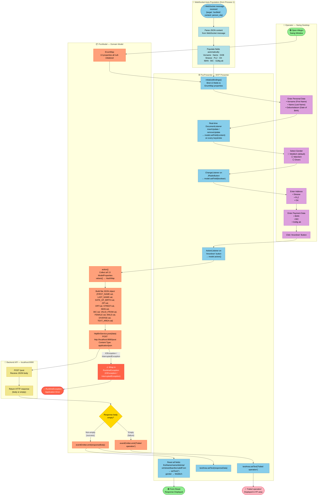

### 2b. Real-Time Field Binding Detail (MVP Pattern)

Illustrates how every user keystroke propagates through the MVP layers to the domain model (rule PDM-003).

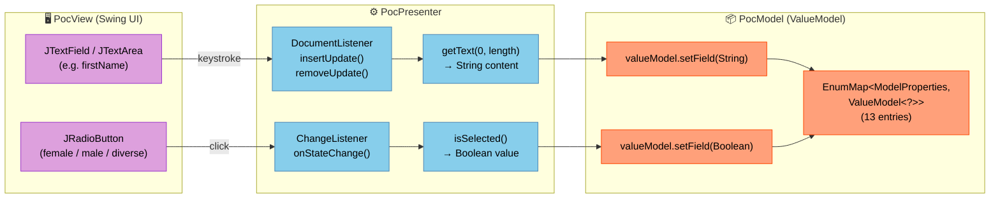

### 2c. Gender Selection Constraint

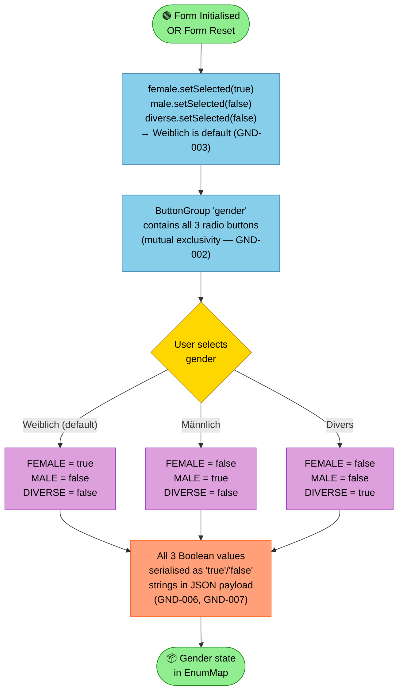

### 2d. HTTP Submission and Response Handling Detail

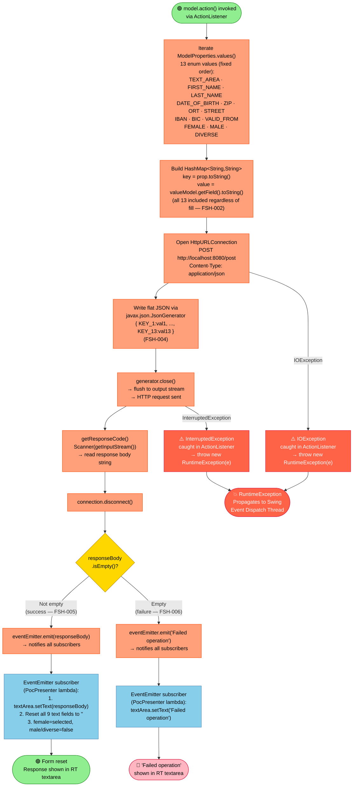

### Process 2 — Element Summary

| Element | Count | Details |
|---------|-------|---------|
| Start Events | 2 | Manual open · WebSocket auto-population |
| End Events | 3 | Form reset success · "Failed operation" displayed · RuntimeException crash |
| User Tasks | 5 | Enter personal data · Select gender · Enter address · Enter payment · Click Anordnen |
| Service Tasks | 11 | Init bindings · Real-time listeners (text + radio) · Action trigger · HTTP connect · JSON write · Send · Read response · Emit success/fail · Reset form · Display response |
| Gateways | 3 | Entry mode (WS vs manual) · Gender selection (3-way) · Response empty? |
| Sequence Flows | 20 | — |
| Participants | 4 | Operator Desktop · PocPresenter · PocModel · HttpBinService · Backend API |
| Fields Submitted | 13 | FIRST_NAME · LAST_NAME · DATE_OF_BIRTH · ZIP · ORT · STREET · IBAN · BIC · VALID_FROM · FEMALE · MALE · DIVERSE · TEXT_AREA |
| Business Rules Applied | 12 | PDM-001..004, GND-001..007, ADR-001, FSH-001..008 |

---

## Process 3 — Real-Time Textarea Synchronisation

**Component**: `Search.vue` `watch` block + `WebsocketServer.js`  
**Business Domain**: Legacy System Integration (Allegro Transfer)  
**Key Business Rules**: LSI-003, LSI-004, LSI-006, LSI-007

### Overview

Any keystroke in the Vue client's textarea is instantly broadcast to **all** connected WebSocket clients (including back to the sender). This is an automatic, low-latency synchronisation mechanism: no button click is required. The Node.js relay server acts as a dumb broadcast bus with no message filtering or routing.

### 3a. Full Flow Diagram

```mermaid
graph TD
    subgraph VueSender["🌐 Vue Client — Sender (Search.vue)"]
        RT_START(["🟢 User types in\n&lt;textarea&gt; element\nv-model='internal_content_textarea'"])
        RT_WATCHER["Vue Watcher fires\nwatch.internal_content_textarea(val)\n→ triggered on EVERY keystroke\n(LSI-006)"]
        RT_SEND_CALL["sendMessage(val, 'textarea')\ncalled automatically"]
        RT_DEEP_CLONE["Deep-clone value\nJSON.parse(JSON.stringify(val))"]
        RT_BUILD_ENV["Build message envelope\n{\n  target: 'textarea',\n  content: text_string\n}"]
        RT_WS_SEND["socket.send(\n  JSON.stringify(envelope)\n)"]
    end

    subgraph NodeRelay["⚙️ Node.js Relay — WebsocketServer.js"]
        RT_RECV["connection.on('message')\nReceive UTF-8 message"]
        RT_TYPE_CHECK{"message.type\n=== 'utf8'?"}
        RT_LOG["console.log(json)\n(logging only)"]
        RT_BROADCAST_LOOP{"for i = 0 to\nclients.length - 1\n(broadcast loop — LSI-004)"}
        RT_SEND_CLIENT["clients&#91;i&#93;.sendUTF(json)\n(sends to ALL clients,\nincluding original sender)"]
    end

    subgraph AllClients["📡 All Connected Clients (Receivers)"]
        RT_VUE_RECV["Vue Client receives\nown broadcast back"]
        RT_SWING_RECV["Swing Client receives\nbroadcast message\n(if connected)"]
        RT_OTHER_RECV["Any other connected\nclient receives message"]
        RT_CHECK_TARGET{"Parse JSON\nCheck target field:\n'textarea'?"}
        RT_PROCESS["Process textarea\ncontent update\n(display or sync)"]
        RT_IGNORE["Ignore / handle\nas other message type"]
    end

    subgraph EndState["End States"]
        RT_END_OK(["🟢 All clients\nsynchronised with\nlatest textarea content"])
        RT_END_NOOP(["⚪ Non-UTF8 message\ndiscarded silently"])
    end

    %% Main flow
    RT_START --> RT_WATCHER
    RT_WATCHER --> RT_SEND_CALL
    RT_SEND_CALL --> RT_DEEP_CLONE
    RT_DEEP_CLONE --> RT_BUILD_ENV
    RT_BUILD_ENV --> RT_WS_SEND

    %% Relay
    RT_WS_SEND --> RT_RECV
    RT_RECV --> RT_TYPE_CHECK
    RT_TYPE_CHECK -->|"utf8 (normal)"| RT_LOG
    RT_TYPE_CHECK -->|"binary / other"| RT_END_NOOP
    RT_LOG --> RT_BROADCAST_LOOP
    RT_BROADCAST_LOOP -->|"Send to client i"| RT_SEND_CLIENT
    RT_SEND_CLIENT --> RT_BROADCAST_LOOP
    RT_BROADCAST_LOOP -->|"All clients\nnotified"| RT_VUE_RECV
    RT_BROADCAST_LOOP -->|"All clients\nnotified"| RT_SWING_RECV
    RT_BROADCAST_LOOP -->|"All clients\nnotified"| RT_OTHER_RECV

    %% Receiver processing
    RT_VUE_RECV --> RT_CHECK_TARGET
    RT_SWING_RECV --> RT_CHECK_TARGET
    RT_OTHER_RECV --> RT_CHECK_TARGET
    RT_CHECK_TARGET -->|"target == 'textarea'"| RT_PROCESS
    RT_CHECK_TARGET -->|"target == other\n(e.g. 'textfield')"| RT_IGNORE
    RT_PROCESS --> RT_END_OK

    %% Styling
    style RT_START fill:#90EE90,stroke:#228B22,color:#000
    style RT_END_OK fill:#90EE90,stroke:#228B22,color:#000
    style RT_END_NOOP fill:#D3D3D3,stroke:#999,color:#000
    style RT_TYPE_CHECK fill:#FFD700,stroke:#B8860B,color:#000
    style RT_BROADCAST_LOOP fill:#FFD700,stroke:#B8860B,color:#000
    style RT_CHECK_TARGET fill:#FFD700,stroke:#B8860B,color:#000
    style RT_WATCHER fill:#87CEEB,stroke:#4682B4,color:#000
    style RT_SEND_CALL fill:#87CEEB,stroke:#4682B4,color:#000
    style RT_DEEP_CLONE fill:#87CEEB,stroke:#4682B4,color:#000
    style RT_BUILD_ENV fill:#87CEEB,stroke:#4682B4,color:#000
    style RT_WS_SEND fill:#87CEEB,stroke:#4682B4,color:#000
    style RT_RECV fill:#F0E68C,stroke:#DAA520,color:#000
    style RT_LOG fill:#F0E68C,stroke:#DAA520,color:#000
    style RT_SEND_CLIENT fill:#F0E68C,stroke:#DAA520,color:#000
    style RT_VUE_RECV fill:#87CEEB,stroke:#4682B4,color:#000
    style RT_SWING_RECV fill:#DDA0DD,stroke:#9932CC,color:#000
    style RT_OTHER_RECV fill:#B0E0E6,stroke:#4682B4,color:#000
    style RT_PROCESS fill:#90EE90,stroke:#228B22,color:#000
    style RT_IGNORE fill:#D3D3D3,stroke:#999,color:#000
```

### 3b. WebSocket Message Lifecycle

Sequence showing every stage from keystroke to screen for all receiver categories.

```mermaid
graph LR
    subgraph Keystroke["⌨️ User Action"]
        K_TYPE["Keystroke in\n&lt;textarea&gt;"]
    end

    subgraph VueReactive["🔄 Vue Reactivity"]
        K_VMODEL["v-model updates\ninternal_content_textarea"]
        K_WATCH["watch() fires\n(synchronous, every char)"]
    end

    subgraph MessageBuilding["📦 Message Building"]
        K_CLONE["Deep clone string\nvalue"]
        K_ENVELOPE["Wrap:\n{target:'textarea',\ncontent: string}"]
        K_STRINGIFY["JSON.stringify()\n→ UTF-8 string"]
    end

    subgraph Transport["🔌 WebSocket Transport"]
        K_WS_CLIENT["ws://localhost:1337\nBrowser WebSocket"]
        K_TCP["TCP frame\nover localhost"]
        K_WS_SERVER["Node.js ws-server\nport 1337"]
    end

    subgraph Broadcast["📡 Broadcast Engine"]
        K_CLIENTS_ARRAY["clients&#91;&#93; array\n(all open connections)"]
        K_FOREACH["sendUTF(json)\nfor each client"]
    end

    subgraph Delivery["📬 Delivery"]
        K_BACK_TO_SENDER["Back to\noriginal sender"]
        K_TO_SWING["To Swing\nclient(s)"]
    end

    K_TYPE --> K_VMODEL
    K_VMODEL --> K_WATCH
    K_WATCH --> K_CLONE
    K_CLONE --> K_ENVELOPE
    K_ENVELOPE --> K_STRINGIFY
    K_STRINGIFY --> K_WS_CLIENT
    K_WS_CLIENT --> K_TCP
    K_TCP --> K_WS_SERVER
    K_WS_SERVER --> K_CLIENTS_ARRAY
    K_CLIENTS_ARRAY --> K_FOREACH
    K_FOREACH --> K_BACK_TO_SENDER
    K_FOREACH --> K_TO_SWING

    style K_TYPE fill:#DDA0DD,stroke:#9932CC,color:#000
    style K_VMODEL fill:#87CEEB,stroke:#4682B4,color:#000
    style K_WATCH fill:#87CEEB,stroke:#4682B4,color:#000
    style K_CLONE fill:#87CEEB,stroke:#4682B4,color:#000
    style K_ENVELOPE fill:#87CEEB,stroke:#4682B4,color:#000
    style K_STRINGIFY fill:#87CEEB,stroke:#4682B4,color:#000
    style K_WS_CLIENT fill:#F0E68C,stroke:#DAA520,color:#000
    style K_TCP fill:#E0E0E0,stroke:#999,color:#000
    style K_WS_SERVER fill:#F0E68C,stroke:#DAA520,color:#000
    style K_CLIENTS_ARRAY fill:#F0E68C,stroke:#DAA520,color:#000
    style K_FOREACH fill:#FFD700,stroke:#B8860B,color:#000
    style K_BACK_TO_SENDER fill:#90EE90,stroke:#228B22,color:#000
    style K_TO_SWING fill:#90EE90,stroke:#228B22,color:#000
```

### Process 3 — Element Summary

| Element | Count | Details |
|---------|-------|---------|
| Start Events | 1 | User keystroke in textarea |
| End Events | 2 | All clients synchronised · Non-UTF8 message discarded |
| Service Tasks | 6 | Vue watcher · sendMessage() · Deep-clone · Build envelope · WS send · Server log · Broadcast loop · sendUTF per client · Target check |
| Gateways | 2 | message.type === 'utf8'? · target field check |
| Sequence Flows | 12 | — |
| Participants | 3 | Vue Client (sender) · Node.js Relay · All Receivers (Vue + Swing + others) |
| Business Rules Applied | 4 | LSI-006, LSI-003, LSI-004, LSI-007 |

---

## Cross-Process Message Flow

End-to-end view showing how all three processes interconnect via the WebSocket relay.

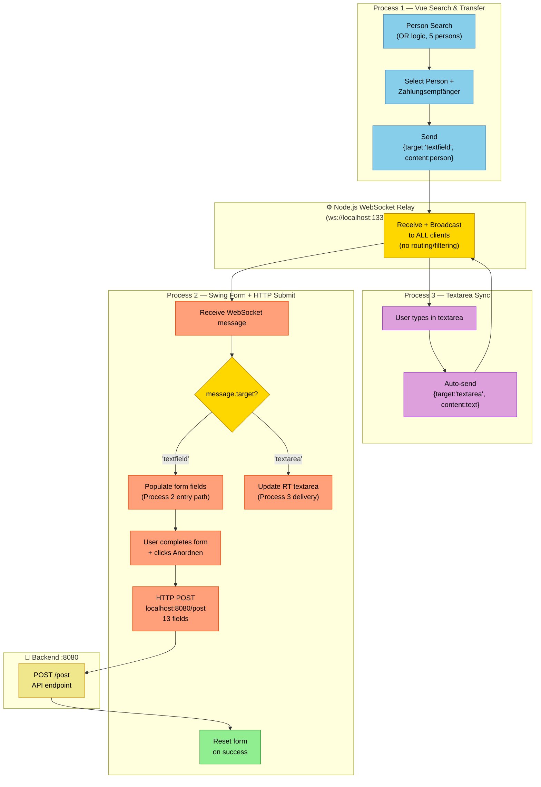

---

## Process Element Summary

Complete count of all BPMN-style elements across the three modelled processes.

| Process | Start | End | User Tasks | Service Tasks | Gateways | Flows | Participants |
|---------|-------|-----|-----------|---------------|----------|-------|-------------|
| **P1** — Person Search & Transfer | 1 | 3 | 5 | 8 | 5 | 18 | 3 |
| **P2** — Swing Form & HTTP Submit | 2 | 3 | 5 | 11 | 4 | 20 | 5 |
| **P3** — Textarea Synchronisation | 1 | 2 | 0 | 6 | 2 | 12 | 3 |
| **Total** | **4** | **8** | **10** | **25** | **11** | **50** | **11** |

### Colour Legend

| Colour | Meaning |
|--------|---------|
| 🟩 `#90EE90` Light Green | Start / success end events |
| 🟥 `#FFB6C1` Pink | Failure end events |
| 🟧 `#FF6347` Tomato Red | Exception / crash states |
| 🟨 `#FFD700` Gold | Decision gateways |
| 🟦 `#87CEEB` Sky Blue | Vue.js / Presenter service tasks |
| 🟪 `#DDA0DD` Plum | User tasks (manual actions) |
| 🟠 `#FFA07A` Light Salmon | Domain model / backend service tasks |
| 🟡 `#F0E68C` Khaki | Node.js WebSocket relay tasks |
| ⬜ `#D3D3D3` Light Grey | Silent discard / no-op states |

### Business Rules Cross-Reference

| Business Rule ID | Rule Summary | Appears In |
|-----------------|-------------|-----------|
| SRC-001 | 6 search criteria supported | P1 |
| SRC-002 | OR logic — any criterion triggers match | P1 |
| SRC-003 | Case-insensitive substring match | P1 |
| SRC-004 | ZIP uses exact equality `==` | P1 |
| SRC-005 | Empty criteria not evaluated | P1 |
| SRC-006 | Results reset before each search | P1 |
| PAY-002 | Person has 1..N Zahlungsempfänger | P1 |
| PAY-003 | Only one Zahlungsempfänger selected at a time | P1 |
| PAY-004 | IBAN/BIC read-only in Vue form | P1 |
| PAY-005 | Array replaced with single entry on send | P1 |
| LSI-001 | Transfer triggered by "Nach ALLEGRO" button | P1 |
| LSI-002 | Data transformed before transmission | P1 |
| LSI-003 | Message envelope `{target, content}` | P1, P3 |
| LSI-004 | Relay broadcasts to ALL clients | P1, P3 |
| LSI-005 | WebSocket connected on component mount | P1 |
| LSI-006 | Textarea watcher fires on every keystroke | P3 |
| LSI-007 | Null origin accepted (PoC only — security risk) | P1, P3 |
| PDM-002 | All fields null-initialized | P2 |
| PDM-003 | Real-time binding on every keystroke | P2 |
| PDM-004 | Fields cleared to `""` on success | P2 |
| GND-001 | 3 gender options: Weiblich/Männlich/Divers | P2 |
| GND-002 | Mutual exclusivity via ButtonGroup | P2 |
| GND-003 | Weiblich is default gender | P2 |
| GND-004 | Gender reset to Weiblich on form reset | P2 |
| GND-005 | Gender stored as 3 independent Booleans | P2 |
| GND-006 | Gender Booleans serialised as strings | P2 |
| FSH-001 | Anordnen button triggers submission | P2 |
| FSH-002 | All 13 fields submitted regardless of fill | P2 |
| FSH-003 | Endpoint: POST `http://localhost:8080/post` | P2 |
| FSH-004 | Flat JSON request body | P2 |
| FSH-005 | Non-empty response = success | P2 |
| FSH-006 | Empty response = "Failed operation" | P2 |
| FSH-007 | Full form reset on success | P2 |
| FSH-008 | IOException/InterruptedException → RuntimeException | P2 |

---

*BPMN diagrams generated from direct source analysis of `Search.vue`, `PocPresenter.java`, `PocModel.java`, `PocView.java`, `HttpBinService.java`, `ModelProperties.java`, and `WebsocketServer.js` — cross-validated against `business_rules_extractor_analysis.json` (46 rules, 8 domains).*
