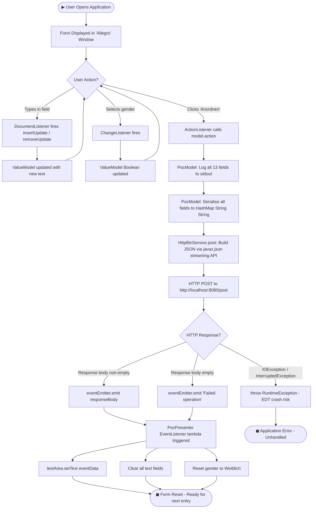
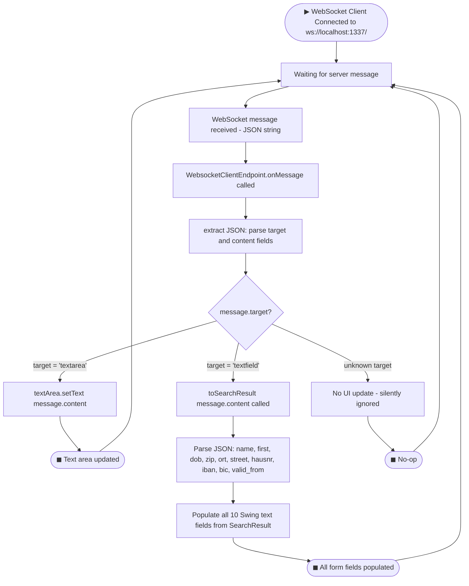
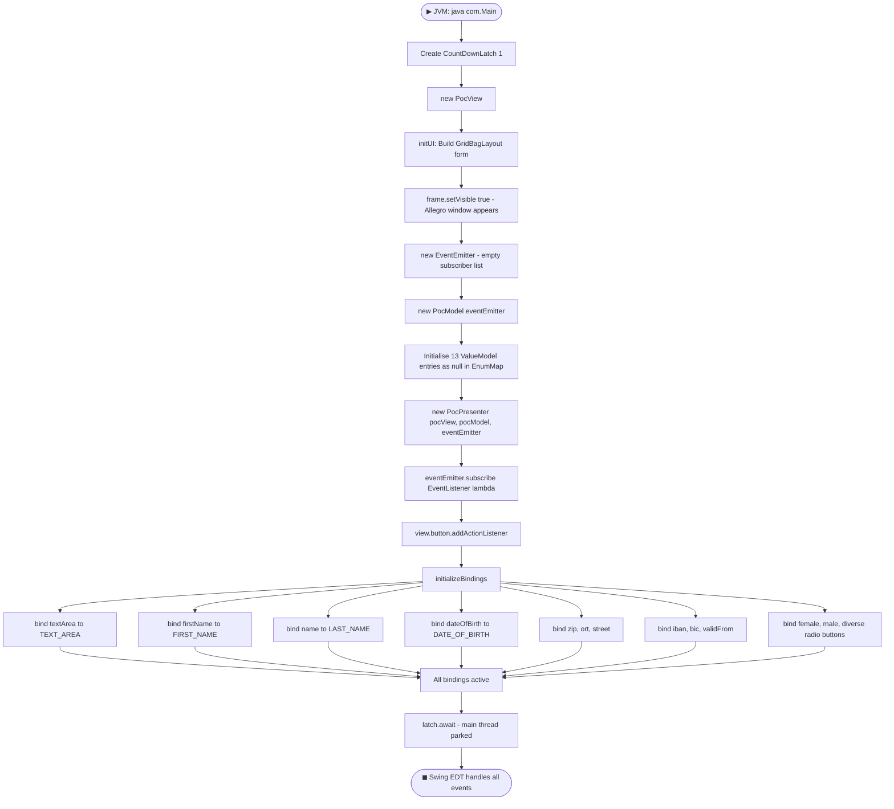
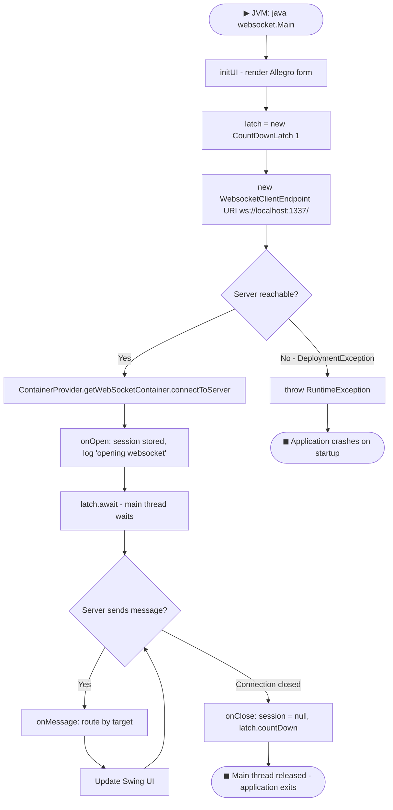

# BPMN Workflows — Allegro PoC

> **Generated:** 2025-01-01  
> **System:** websocket_swing / Allegro PoC

---

## Table of Contents

1. [WF-001 — MVP Form Submission Workflow](#wf-001--mvp-form-submission-workflow)
2. [WF-002 — WebSocket Data Receive Workflow](#wf-002--websocket-data-receive-workflow)
3. [WF-003 — Application Bootstrap Workflow](#wf-003--application-bootstrap-workflow)
4. [WF-004 — WebSocket Connection Lifecycle](#wf-004--websocket-connection-lifecycle)

---

## WF-001 — MVP Form Submission Workflow

**Description:** End-to-end flow from user data entry to server response display in the MVP (PocPresenter / PocModel / PocView) application.

**Actors:** User, Swing EDT, PocPresenter, PocModel, HttpBinService, HTTPBin Server, EventEmitter

---

## WF-002 — WebSocket Data Receive Workflow

**Description:** Flow for receiving and rendering server-pushed data in the standalone WebSocket Swing client (`websocket.Main`).

**Actors:** Node.js WebSocket Server, WebsocketClientEndpoint, Swing EDT

---

## WF-003 — Application Bootstrap Workflow

**Description:** Startup sequence for the MVP Swing application from JVM invocation to UI ready.

**Actors:** JVM, Main, PocView, EventEmitter, PocModel, PocPresenter, Swing EDT

---

## WF-004 — WebSocket Connection Lifecycle

**Description:** Full lifecycle of the WebSocket connection in `websocket.Main`, from startup to shutdown.

**Actors:** Main, WebsocketClientEndpoint, Node.js Server, CountDownLatch

---

## Workflow Summary

| Workflow | Trigger | Key Components | Outcome |
|----------|---------|---------------|---------|
| WF-001 MVP Form Submit | Click 'Anordnen' | PocPresenter → PocModel → HttpBinService → EventEmitter | Form reset + response displayed |
| WF-002 WebSocket Receive | Server pushes JSON | WebsocketClientEndpoint → Swing UI | Form fields or textarea updated |
| WF-003 App Bootstrap | JVM start | Main → PocView → PocModel → PocPresenter | Window displayed, bindings active |
| WF-004 WS Lifecycle | JVM start (websocket module) | WebsocketClientEndpoint → Node.js Server | Connection maintained until server disconnect |
