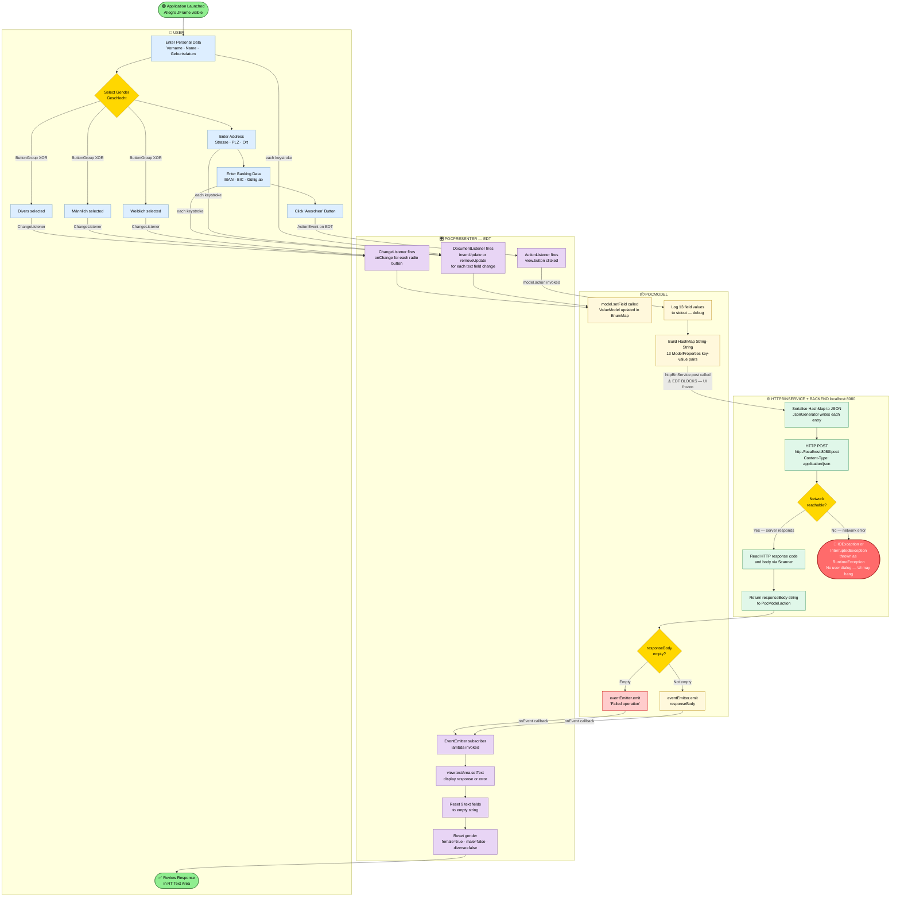
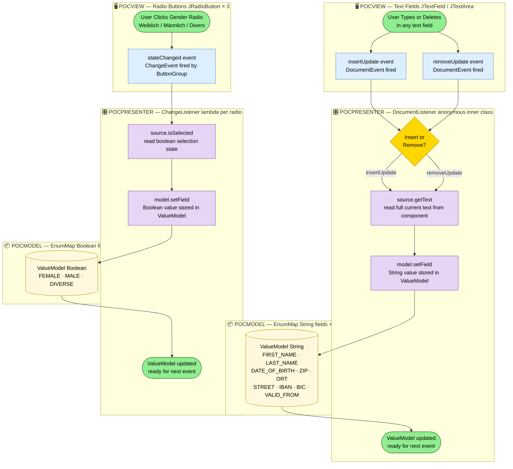
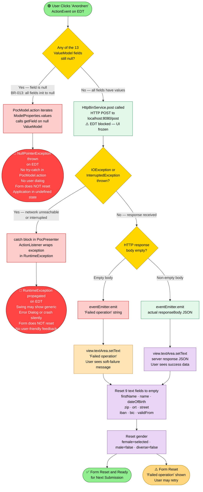

# BPMN Process Workflow Diagrams — Allegro Swing Application

> **Application:** Allegro — Java Swing Desktop Form (MVP Pattern)  
> **Language:** Java 22  
> **Pattern:** Model-View-Presenter (MVP) + Observer (EventEmitter)  
> **Generated by:** bpmn-generator agent  
> **Source inputs:** `business_rules_extractor_analysis.json`, `ast_PocModel.json`, `ast_PocPresenter.json`, `ast_HttpBinService.json`, `ast_EventEmitter.json`, `ast_PocView.json`

---

## ⚠️ Critical Architectural Risk

> **EDT Blocking**: The HTTP POST call (`HttpBinService.post()`) executes **synchronously on the Event Dispatch Thread (EDT)** — the same thread that handles all Swing rendering and user input. There is no `SwingWorker`, no `ExecutorService`, and no background thread. While the network call is in flight the **entire UI freezes**. This is flagged throughout the diagrams below.

---

## Table of Contents

| # | Diagram | Scope |
|---|---------|-------|
| 1 | [Main Form Submission Process](#1-main-form-submission-process-end-to-end) | End-to-end, four-lane swimlane |
| 2 | [Data Entry & Real-time Binding Process](#2-data-entry--real-time-binding-process) | Keystroke → ValueModel pipeline |
| 3 | [HTTP Communication Process](#3-http-communication-process) | JSON serialisation → POST → response |
| 4 | [Error Handling Process](#4-error-handling-process) | All failure and exception paths |

---

## 1. Main Form Submission Process (End-to-End)

**Description:** The complete business workflow from application launch through form data entry, submission, HTTP communication, response handling, and UI reset. Modelled as a four-lane swimlane diagram covering all participants.

**Participants / Lanes:**
- **User** — human actor interacting with the Allegro form
- **PocPresenter (EDT)** — Swing event listeners; orchestrates model updates and view resets; runs on the Event Dispatch Thread
- **PocModel** — holds all 13 `ValueModel` fields; builds HTTP payload; owns `EventEmitter`
- **HttpBinService / Backend** — HTTP client wrapper + the `localhost:8080` backend

**Process Elements:**
| Element Type | Count |
|---|---|
| Start Events | 1 |
| End Events | 4 (Normal ×1, Reset ×1, Error ×2) |
| Tasks | 16 |
| Decision Gateways | 4 |
| Sequence Flows | 26 |
| Swimlane Participants | 4 |

### Key Observations — Main Process

| # | Observation | Severity |
|---|-------------|----------|
| ⚠️ | `HttpBinService.post()` is called directly on the **EDT** (no `SwingWorker`). The UI is completely unresponsive until the HTTP call returns or throws. | 🔴 High |
| ⚠️ | If the backend is unreachable, `IOException` is wrapped as `RuntimeException` — no user-facing error dialog is shown and the form does not reset. | 🔴 High |
| ℹ️ | Gender uses a `ButtonGroup` (XOR mutual exclusion enforced by Swing), but is stored as three independent `ValueModel<Boolean>` entries. | 🟡 Medium |
| ℹ️ | All 13 `ValueModel` fields start as `null`; clicking "Anordnen" before typing in any field causes `NullPointerException`. | 🔴 High |

---

## 2. Data Entry & Real-time Binding Process

**Description:** Zooms into the live two-way binding pipeline. Every keystroke in a text field and every radio-button click is synchronously propagated to the `PocModel`'s `EnumMap<ModelProperties, ValueModel<?>>` before the next user action. No debounce or batching is applied.

**Participants / Lanes:**
- **PocView (Swing EDT)** — raw Swing components generating events
- **PocPresenter (EDT)** — anonymous `DocumentListener` / `ChangeListener` implementations
- **PocModel (EnumMap)** — `ValueModel<String>` and `ValueModel<Boolean>` stores

**Process Elements:**
| Element Type | Count |
|---|---|
| Start Events | 2 (text input, radio click) |
| End Events | 2 |
| Tasks | 9 |
| Decision Gateways | 2 |
| Sequence Flows | 13 |

### Bound Fields Reference

| View Field | Java Name | ModelProperties Key | ValueModel Type |
|---|---|---|---|
| Vorname | `view.firstName` | `FIRST_NAME` | `ValueModel<String>` |
| Name | `view.name` | `LAST_NAME` | `ValueModel<String>` |
| Geburtsdatum | `view.dateOfBirth` | `DATE_OF_BIRTH` | `ValueModel<String>` |
| Strasse | `view.street` | `STREET` | `ValueModel<String>` |
| PLZ | `view.zip` | `ZIP` | `ValueModel<String>` |
| Ort | `view.ort` | `ORT` | `ValueModel<String>` |
| IBAN | `view.iban` | `IBAN` | `ValueModel<String>` |
| BIC | `view.bic` | `BIC` | `ValueModel<String>` |
| Gültig ab | `view.validFrom` | `VALID_FROM` | `ValueModel<String>` |
| Weiblich | `view.female` | `FEMALE` | `ValueModel<Boolean>` |
| Männlich | `view.male` | `MALE` | `ValueModel<Boolean>` |
| Divers | `view.diverse` | `DIVERSE` | `ValueModel<Boolean>` |
| — (response) | `view.textArea` | `TEXT_AREA` | `ValueModel<String>` |

> **Note:** `TEXT_AREA` is not bound by a `DocumentListener`; its value is written by the response-handling lambda after submission.

---

## 3. HTTP Communication Process

**Description:** The internal workflow of `HttpBinService.post(Map<String,String>)` — from receiving the data map from `PocModel.action()`, through JSON serialisation, HTTP POST to `localhost:8080/post`, reading the response, and returning the body string. Annotated with the EDT-blocking risk.

**Participants / Lanes:**
- **PocModel** — caller, receives return value
- **HttpBinService (EDT ⚠️)** — synchronous HTTP client, blocks the EDT
- **Backend Server** — `localhost:8080/post` endpoint

**Process Elements:**
| Element Type | Count |
|---|---|
| Start Events | 1 |
| End Events | 3 (Success ×1, Empty Body ×1, Network Error ×1) |
| Tasks | 11 |
| Decision Gateways | 2 |
| Sequence Flows | 15 |

```mermaid
graph TD
    %% ── ENTRY ───────────────────────────────────────────────────────────────
    START([📥 PocModel.action calls\nhttpBinService.post\nHashMap String-String with 13 entries\n⚠️ Running on EDT — UI now frozen])

    %% ── POCMODEL LANE ───────────────────────────────────────────────────────
    subgraph CALLER["📦  POCMODEL — Caller"]
        C_RECEIVE[Receive responseBody\nString from HttpBinService]
        C_CHECK{responseBody\nempty?}
        C_EMIT_OK[eventEmitter.emit\nresponseBody — server JSON]
        C_EMIT_FAIL[eventEmitter.emit\n'Failed operation']
        C_END_OK([✅ Subscribers notified\nwith response data])
        C_END_FAIL([⚠️ Subscribers notified\nwith failure message])
    end

    %% ── HTTPBINSERVICE LANE ─────────────────────────────────────────────────
    subgraph HTTP_SVC["🌐  HTTPBINSERVICE  — java.net.HttpURLConnection  ⚠️ EDT"]
        H_OPEN[new URL + PATH\nopenConnection as HttpURLConnection]
        H_METHOD[setRequestMethod POST]
        H_HEADER[setRequestProperty\nContent-Type: application/json]
        H_OUTPUT[setDoOutput true]

        subgraph JSON_SER["🔧 JSON Serialisation — javax.json.JsonGenerator"]
            J_FACTORY[Json.createGeneratorFactory\nnull config]
            J_GEN[createGenerator\nfrom connection.getOutputStream]
            J_START[generator.writeStartObject]
            J_LOOP{For each entry\nin HashMap entrySet}
            J_WRITE[generator.write\nkey, value as String]
            J_END[generator.writeEnd]
            J_CLOSE[generator.close\nflush and close stream]
        end

        H_CODE[getResponseCode\nread HTTP status — logged to stdout]
        H_SCAN[new Scanner getInputStream\nuseDelimiter backslash-A\nread full body]
        H_LOG[System.out.println\nResponse code + body]
        H_DISC[connection.disconnect]
        H_RETURN[Return responseBody String\nto PocModel.action]

        H_IO_ERR([🔴 IOException or\nInterruptedException\nthrown as RuntimeException\nEDT stack unwinds — no dialog])
    end

    %% ── BACKEND LANE ────────────────────────────────────────────────────────
    subgraph BACKEND["🖥️  BACKEND SERVER  localhost:8080"]
        B_RECV([POST /post\nreceives JSON body])
        B_RESP([Returns HTTP response\nwith body or empty])
    end

    %% ── WIRING ──────────────────────────────────────────────────────────────
    START --> H_OPEN
    H_OPEN --> H_METHOD
    H_METHOD --> H_HEADER
    H_HEADER --> H_OUTPUT
    H_OUTPUT --> J_FACTORY
    J_FACTORY --> J_GEN
    J_GEN --> J_START
    J_START --> J_LOOP
    J_LOOP -->|next entry| J_WRITE
    J_WRITE --> J_LOOP
    J_LOOP -->|all 13 entries written| J_END
    J_END --> J_CLOSE
    J_CLOSE -->|HTTP bytes sent| B_RECV
    B_RECV --> B_RESP
    B_RESP -->|response arrives| H_CODE
    B_RESP -->|network error| H_IO_ERR
    H_CODE --> H_SCAN
    H_SCAN --> H_LOG
    H_LOG --> H_DISC
    H_DISC --> H_RETURN
    H_RETURN --> C_RECEIVE
    C_RECEIVE --> C_CHECK
    C_CHECK -->|Not empty| C_EMIT_OK
    C_CHECK -->|Empty| C_EMIT_FAIL
    C_EMIT_OK --> C_END_OK
    C_EMIT_FAIL --> C_END_FAIL

    %% ── STYLES ──────────────────────────────────────────────────────────────
    style START    fill:#FFD700,stroke:#B8860B,color:#000
    style C_END_OK   fill:#90EE90,stroke:#2d6a2d,color:#000
    style C_END_FAIL fill:#FFCCCC,stroke:#CC0000,color:#000
    style H_IO_ERR   fill:#FF6B6B,stroke:#8B0000,color:#fff
    style B_RECV     fill:#90EE90,stroke:#2d6a2d,color:#000
    style B_RESP     fill:#90EE90,stroke:#2d6a2d,color:#000

    style H_OPEN   fill:#E0F7E9,stroke:#2E8B57,color:#000
    style H_METHOD fill:#E0F7E9,stroke:#2E8B57,color:#000
    style H_HEADER fill:#E0F7E9,stroke:#2E8B57,color:#000
    style H_OUTPUT fill:#E0F7E9,stroke:#2E8B57,color:#000
    style H_CODE   fill:#E0F7E9,stroke:#2E8B57,color:#000
    style H_SCAN   fill:#E0F7E9,stroke:#2E8B57,color:#000
    style H_LOG    fill:#E8E8E8,stroke:#888,color:#000
    style H_DISC   fill:#E0F7E9,stroke:#2E8B57,color:#000
    style H_RETURN fill:#E0F7E9,stroke:#2E8B57,color:#000

    style J_FACTORY fill:#FFF3CD,stroke:#997700,color:#000
    style J_GEN     fill:#FFF3CD,stroke:#997700,color:#000
    style J_START   fill:#FFF3CD,stroke:#997700,color:#000
    style J_LOOP    fill:#FFD700,stroke:#B8860B,color:#000
    style J_WRITE   fill:#FFF3CD,stroke:#997700,color:#000
    style J_END     fill:#FFF3CD,stroke:#997700,color:#000
    style J_CLOSE   fill:#FFF3CD,stroke:#997700,color:#000

    style C_RECEIVE    fill:#FFF8DC,stroke:#B8860B,color:#000
    style C_CHECK      fill:#FFD700,stroke:#B8860B,color:#000
    style C_EMIT_OK    fill:#FFF8DC,stroke:#B8860B,color:#000
    style C_EMIT_FAIL  fill:#FFCCCC,stroke:#CC0000,color:#000
```

### HTTP Configuration (Hardcoded — No Runtime Override)

| Parameter | Value | Source Constant |
|---|---|---|
| Base URL | `http://localhost:8080` | `HttpBinService.URL` |
| Path | `/post` | `HttpBinService.PATH` |
| Full Endpoint | `http://localhost:8080/post` | `URL + PATH` |
| Method | `POST` | Hardcoded string |
| Content-Type | `application/json` | `HttpBinService.CONTENT_TYPE` |
| JSON keys | Enum name strings | `ModelProperties.toString()` e.g. `"FIRST_NAME"` |

---

## 4. Error Handling Process

**Description:** All failure and exception paths in the application. Three distinct error scenarios are modelled: (A) a `NullPointerException` from uninitialised `ValueModel` fields, (B) `IOException`/`InterruptedException` from network failure, and (C) the "soft failure" path where the server returns an empty body. Only path C produces a visible UI response.

**Process Elements:**
| Element Type | Count |
|---|---|
| Start Events | 1 |
| Terminal Error States | 2 (hard crash — no recovery) |
| Graceful Failure Paths | 1 (soft — "Failed operation" displayed) |
| Decision Gateways | 3 |
| Tasks | 10 |
| Sequence Flows | 16 |

### Error Taxonomy

| ID | Error Type | Trigger Condition | Visibility to User | Form Resets? | Business Rule |
|---|---|---|---|---|---|
| **ERR-A** | `NullPointerException` | Any of 13 fields never typed into (init value is `null`) | ❌ None — silent on EDT | ❌ No | BR-013, GAP-001 |
| **ERR-B** | `RuntimeException` (wraps `IOException` / `InterruptedException`) | Backend unreachable, connection refused, or thread interrupted | ❌ None — no dialog shown | ❌ No | BR-016, GAP-003 |
| **ERR-C** | Soft failure — empty HTTP response body | Server returns HTTP 200 but empty body | ✅ "Failed operation" in text area | ✅ Yes | BR-005 |

### Missing Error Handling (Gaps)

| Gap | Description | Recommended Fix |
|---|---|---|
| GAP-001 | No null-check before `getField().toString()` | Add `Objects.requireNonNullElse(vm.getField(), "")` or validate before submit |
| GAP-003 | `IOException` / `InterruptedException` not surfaced | Catch in `ActionListener`, show `JOptionPane.showErrorDialog` |
| N/A | No EDT offloading | Wrap `model.action()` in `SwingWorker.doInBackground()` |
| GAP-005 | Hardcoded `localhost:8080` | Externalise to properties file or environment variable |

---

## Colour Legend

| Colour | Meaning |
|---|---|
| 🟩 Green `#90EE90` | Start / End events (happy path) |
| 🟦 Blue `#DDEEFF` | User actions / View components |
| 🟪 Purple `#E8D5F5` | PocPresenter logic / Listener callbacks |
| 🟨 Yellow `#FFF8DC` | PocModel operations |
| 🟩 Mint `#E0F7E9` | HttpBinService / Network tasks |
| 🟨 Gold `#FFD700` | Decision gateways |
| 🟧 Orange `#FFCCCC` | Soft warnings / error emit paths |
| 🟥 Red `#FF4444` | Hard error terminal states (crash, no recovery) |

---

## Process Metrics Summary

| Process | Tasks | Gateways | Start Events | End Events | Participants |
|---|---|---|---|---|---|
| 1 — Main Submission (E2E) | 16 | 4 | 1 | 4 | 4 |
| 2 — Data Entry & Binding | 9 | 2 | 2 | 2 | 3 |
| 3 — HTTP Communication | 11 | 2 | 1 | 3 | 3 |
| 4 — Error Handling | 10 | 3 | 1 | 5 | — |
| **Total** | **46** | **11** | **5** | **14** | — |

---

*Generated by bpmn-generator agent — source: Allegro Java Swing MVP POC*
