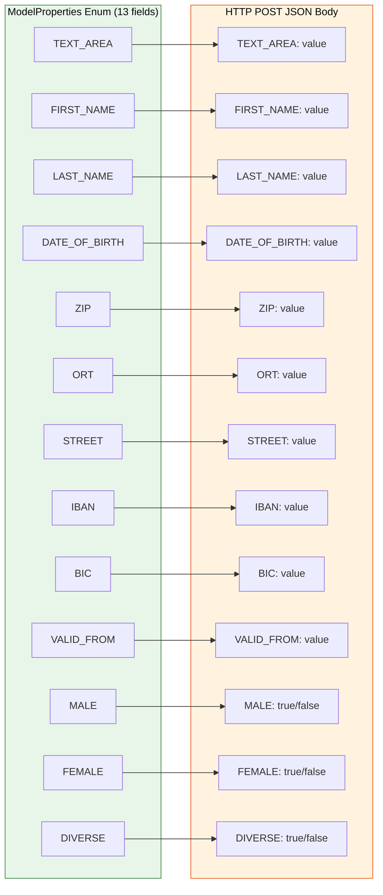
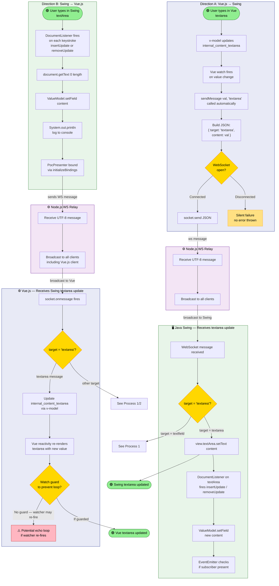
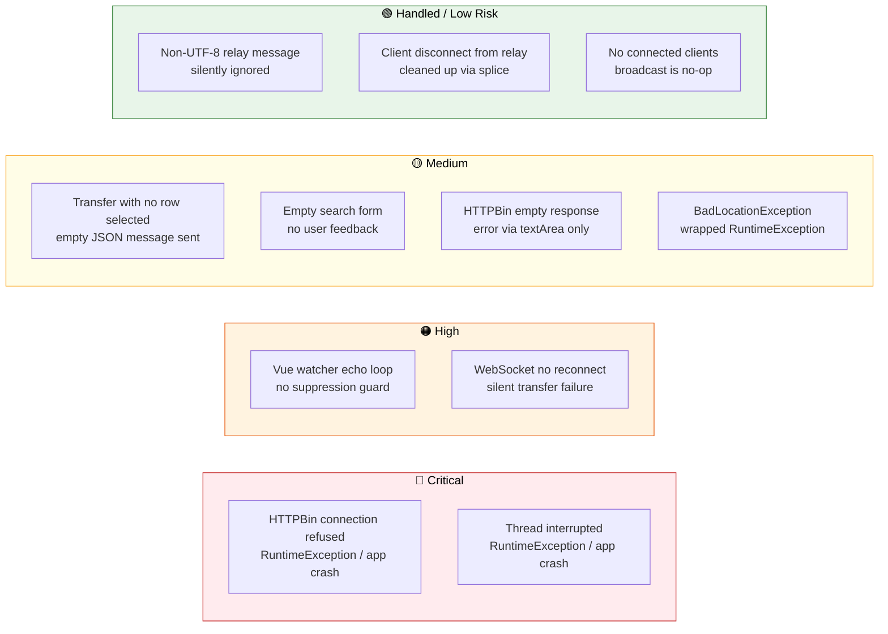
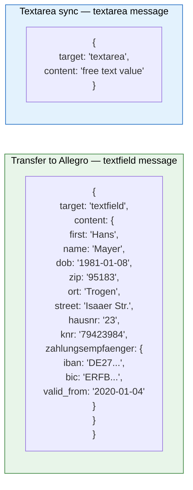

# BPMN Business Process Diagrams — Allegro Modernisation PoC

> **System:** Vue.js Browser Client → Node.js WS Relay (:1337) → Java Swing Desktop Client → HTTPBin Backend (:8080)
> **Notation:** All diagrams use Mermaid flowchart syntax (BPMN-style).

---

## Table of Contents

1. [Overall System Workflow](#1-overall-system-workflow)
2. [Process 1 – Person Search & Transfer to Allegro](#2-process-1--person-search--transfer-to-allegro)
3. [Process 2 – Swing Form Submission to HTTPBin](#3-process-2--swing-form-submission-to-httpbin)
4. [Process 3 – Textarea Real-time Synchronisation](#4-process-3--textarea-real-time-synchronisation)
5. [Error Handling Flows](#5-error-handling-flows)
6. [Process Element Summary](#6-process-element-summary)

---

## 1. Overall System Workflow

This master diagram shows all three business processes in context, the participant swimlanes, and the data/message flows that connect them.

```mermaid
flowchart TD
    subgraph Browser["🌐 Browser — Vue.js Client"]
        P1_Start([User opens application])
        P1_Search[Enter search criteria]
        P1_Results[View search results table]
        P1_Select[Select person row]
        P1_SelectZE[Select Zahlungsempfänger row]
        P1_Transfer[Click 'Nach ALLEGRO übernehmen']
        P1_BuildMsg[Build JSON transfer message]
        P1_SendWS[Send via WebSocket]
        P3_TextInput[User types in textarea]
        P3_Watch[Vue watcher fires]
        P3_SendTA[Send textarea message via WebSocket]
        P3_Receive[Receive textarea update from Swing]
    end

    subgraph Relay["⚙️ Node.js WS Relay — Port 1337"]
        R_Accept[Accept WebSocket connection]
        R_Receive[Receive UTF-8 message]
        R_Broadcast[Broadcast to ALL connected clients]
        R_Log[Log message to console]
    end

    subgraph Swing["🖥️ Java Swing — Allegro Desktop"]
        S_Receive[Receive WebSocket message]
        S_Dispatch{Dispatch by 'target' field}
        S_FillFields[Populate text fields]
        S_FillTA[Populate text area]
        S_DocListener[DocumentListener fires on keystroke]
        S_ValueModel[ValueModel notifies EventEmitter]
        S_SendWS[Presenter sends WS message back]
        S_Submit[User clicks 'Anordnen' button]
        S_Collect[Collect all 13 model fields]
        S_Serialize[Serialize to Map String String]
        S_HTTP[HTTP POST to /post]
        S_ParseResp[Parse HTTP response]
        S_EmitEvent{EventEmitter fires event}
        S_Success[Update UI — success feedback]
        S_Error[Update UI — error feedback]
    end

    subgraph HTTPBin["🔌 HTTPBin Backend — Port 8080"]
        H_POST[Receive POST /post]
        H_Response[Return JSON response]
    end

    %% Process 1 flow
    P1_Start --> P1_Search
    P1_Search --> P1_Results
    P1_Results --> P1_Select
    P1_Select --> P1_SelectZE
    P1_SelectZE --> P1_Transfer
    P1_Transfer --> P1_BuildMsg
    P1_BuildMsg --> P1_SendWS

    %% Relay
    P1_SendWS -->|WebSocket message| R_Accept
    R_Accept --> R_Receive
    R_Receive --> R_Log
    R_Log --> R_Broadcast

    %% Swing receives transfer
    R_Broadcast -->|WebSocket broadcast| S_Receive
    S_Receive --> S_Dispatch
    S_Dispatch -->|target = textfield| S_FillFields
    S_Dispatch -->|target = textarea| S_FillTA

    %% Process 3 — Swing → Vue
    S_FillTA --> S_DocListener
    S_DocListener --> S_ValueModel
    S_ValueModel --> S_SendWS
    S_SendWS -->|WebSocket message| R_Broadcast
    R_Broadcast -->|broadcast back| P3_Receive

    %% Process 3 — Vue → Swing
    P3_TextInput --> P3_Watch
    P3_Watch --> P3_SendTA
    P3_SendTA -->|WebSocket message| R_Broadcast

    %% Process 2 — Form submission
    S_FillFields --> S_Submit
    S_Submit --> S_Collect
    S_Collect --> S_Serialize
    S_Serialize --> S_HTTP
    S_HTTP -->|HTTP POST| H_POST
    H_POST --> H_Response
    H_Response -->|HTTP response body| S_ParseResp
    S_ParseResp --> S_EmitEvent
    S_EmitEvent -->|response not empty| S_Success
    S_EmitEvent -->|response empty| S_Error

    %% Styling
    style Browser fill:#E3F2FD,stroke:#1565C0,color:#000
    style Relay fill:#F3E5F5,stroke:#6A1B9A,color:#000
    style Swing fill:#E8F5E9,stroke:#2E7D32,color:#000
    style HTTPBin fill:#FFF3E0,stroke:#E65100,color:#000

    style P1_Start fill:#90EE90,stroke:#2E7D32,color:#000
    style S_Success fill:#90EE90,stroke:#2E7D32,color:#000
    style S_Error fill:#FFB6C1,stroke:#C62828,color:#000
    style S_Dispatch fill:#FFD700,stroke:#F57F17,color:#000
    style S_EmitEvent fill:#FFD700,stroke:#F57F17,color:#000
    style R_Broadcast fill:#CE93D8,stroke:#6A1B9A,color:#000
```

---

## 2. Process 1 – Person Search & Transfer to Allegro

**Participants:** User, Vue.js Browser Client, Node.js WS Relay, Java Swing (Allegro)
**Trigger:** User initiates a person search
**End States:** Form fields populated in Allegro ✅ | No results found (search continues) ⚠️

```mermaid
flowchart TD
    subgraph User["👤 User"]
        U_Enter[Enter search term\nin one or more fields]
        U_ClickSearch[Click 'Suchen' button]
        U_ReviewResults[Review results table]
        U_SelectRow[Click person row\nto highlight it]
        U_SelectZE[Click Zahlungsempfänger row\nto select payment details]
        U_ClickTransfer[Click 'Nach ALLEGRO übernehmen']
        U_ReviewForm[Review populated\nAllegro form]
    end

    subgraph VueClient["🌐 Vue.js Browser Client — Search.vue"]
        V_FilterLoop[Iterate over search_space\nfor each person]
        V_ORMatch{Partial match found?\nOR across all fields\ncase-insensitive}
        V_AddResult[Add person to\nsearch_result array]
        V_SkipResult[Skip person]
        V_DisplayTable[Render results table\nv-for loop]
        V_NoResults{Any results?}
        V_EmptyMsg[Display empty table\nno error thrown]
        V_HighlightRow[selected_result = item\nRow highlighted in blue]
        V_HighlightZE[zahlungsempfaenger_selected = item\nRow highlighted in green]
        V_CheckSelected{Row selected?}
        V_BlockTransfer[Transfer button\nnot actionable]
        V_DeepCopy[Deep copy selected_result\nJSON.parse / JSON.stringify]
        V_AttachZE[Replace zahlungsempfaenger\nwith selected ZE entry]
        V_BuildJSON["Build JSON message:\n{ target: 'textfield',\n  content: { first, name, dob,\n  zip, ort, street, hausnr,\n  zahlungsempfaenger } }"]
        V_WSOpen{WebSocket\nconnected?}
        V_WSError[Log connection error]
        V_SendWS[socket.send JSON string]
    end

    subgraph Relay["⚙️ Node.js WS Relay"]
        R_Receive[Receive UTF-8 message]
        R_Log[Log to console with timestamp]
        R_BroadcastAll[Broadcast to all\nconnected clients]
    end

    subgraph AllegroSwing["🖥️ Java Swing — Allegro"]
        S_Receive[WebSocket onMessage\nreceives JSON string]
        S_ParseTarget{Parse 'target' field}
        S_RouteFields["Route to text fields:\nvorname → firstName\nnachname → name\nstrasse → street\nhausnummer → hausnr\nplz → zip\nort → ort\niban → iban\nbic → bic\nvalid_from → validFrom\ngeschlecht → gender radio"]
        S_GenderCheck{geschlecht\nprovided?}
        S_SetGender[Set matching\ngender radio button]
        S_DefaultGender[Default to\n'Männlich' radio]
        S_FormReady([Form populated\nand ready for review])
    end

    %% Start
    Start([🟢 User opens Vue.js app\nWebSocket connects to :1337]) --> U_Enter

    U_Enter --> U_ClickSearch
    U_ClickSearch --> V_FilterLoop
    V_FilterLoop --> V_ORMatch
    V_ORMatch -->|Match| V_AddResult
    V_ORMatch -->|No match| V_SkipResult
    V_AddResult --> V_FilterLoop
    V_SkipResult --> V_FilterLoop
    V_FilterLoop -->|All persons checked| V_DisplayTable
    V_DisplayTable --> V_NoResults
    V_NoResults -->|No results| V_EmptyMsg
    V_EmptyMsg --> U_ReviewResults
    V_NoResults -->|Results found| U_ReviewResults

    U_ReviewResults --> U_SelectRow
    U_SelectRow --> V_HighlightRow
    V_HighlightRow --> U_SelectZE
    U_SelectZE --> V_HighlightZE
    V_HighlightZE --> U_ClickTransfer

    U_ClickTransfer --> V_CheckSelected
    V_CheckSelected -->|No row selected\nselected_result is empty| V_BlockTransfer
    V_BlockTransfer --> U_SelectRow
    V_CheckSelected -->|Row selected| V_DeepCopy
    V_DeepCopy --> V_AttachZE
    V_AttachZE --> V_BuildJSON
    V_BuildJSON --> V_WSOpen
    V_WSOpen -->|Not connected| V_WSError
    V_WSError --> WSErrEnd([🔴 Transfer failed\nWebSocket not available])
    V_WSOpen -->|Connected| V_SendWS

    V_SendWS -->|ws://localhost:1337| R_Receive
    R_Receive --> R_Log
    R_Log --> R_BroadcastAll

    R_BroadcastAll -->|WebSocket broadcast| S_Receive
    S_Receive --> S_ParseTarget
    S_ParseTarget -->|target = textfield| S_RouteFields
    S_ParseTarget -->|target = textarea| OtherProcess[See Process 3]

    S_RouteFields --> S_GenderCheck
    S_GenderCheck -->|geschlecht present| S_SetGender
    S_GenderCheck -->|geschlecht absent| S_DefaultGender
    S_SetGender --> U_ReviewForm
    S_DefaultGender --> U_ReviewForm
    U_ReviewForm --> S_FormReady

    %% Styling
    style Start fill:#90EE90,stroke:#2E7D32,color:#000
    style S_FormReady fill:#90EE90,stroke:#2E7D32,color:#000
    style WSErrEnd fill:#FFB6C1,stroke:#C62828,color:#000
    style V_BlockTransfer fill:#FFE082,stroke:#F9A825,color:#000
    style V_EmptyMsg fill:#FFE082,stroke:#F9A825,color:#000
    style V_CheckSelected fill:#FFD700,stroke:#F57F17,color:#000
    style V_NoResults fill:#FFD700,stroke:#F57F17,color:#000
    style V_ORMatch fill:#FFD700,stroke:#F57F17,color:#000
    style S_ParseTarget fill:#FFD700,stroke:#F57F17,color:#000
    style S_GenderCheck fill:#FFD700,stroke:#F57F17,color:#000
    style V_WSOpen fill:#FFD700,stroke:#F57F17,color:#000
    style R_BroadcastAll fill:#CE93D8,stroke:#6A1B9A,color:#000

    style User fill:#E3F2FD,stroke:#1565C0,color:#000
    style VueClient fill:#E8EAF6,stroke:#283593,color:#000
    style Relay fill:#F3E5F5,stroke:#6A1B9A,color:#000
    style AllegroSwing fill:#E8F5E9,stroke:#2E7D32,color:#000
```

### Business Rules Applied in This Process

| Rule | Location | Logic |
|------|----------|-------|
| Case-insensitive partial match | `Search.vue → searchPerson()` | `.toLowerCase().indexOf(term.toLowerCase()) >= 0` |
| OR across ALL fields | `Search.vue → searchPerson()` | Conditions joined with `\|\|` |
| Empty search returns no error | `Search.vue` | Empty array rendered silently |
| Transfer requires row selection | `Search.vue → sendMessage()` | `selected_result` must be non-empty |
| Zahlungsempfänger replaces array | `Search.vue → sendMessage()` | `obj_to_send.zahlungsempfaenger = zahlungsempfaenger_selected` |
| Gender default | `PocPresenter.java` | `female.setSelected(true)` on init |

---

## 3. Process 2 – Swing Form Submission to HTTPBin

**Participants:** User, Java Swing (Allegro), HTTPBin Backend
**Trigger:** User clicks "Anordnen" (Submit) button in Allegro form
**End States:** UI updated with success feedback ✅ | UI updated with error feedback ❌

```mermaid
flowchart TD
    subgraph User["👤 User"]
        U_Click[Click 'Anordnen' button]
        U_SeeSuccess[Review success feedback\nForm fields cleared]
        U_SeeError[Review error message\nForm not cleared]
    end

    subgraph Presenter["🎛️ PocPresenter — ActionListener"]
        P_Trigger[ActionListener triggered\nby button click]
        P_CallAction[Call model.action]
        P_CatchIO{IOException\nthrown?}
        P_CatchInterrupt{InterruptedException\nthrown?}
        P_RuntimeIO[Wrap in RuntimeException\nand rethrow]
        P_RuntimeInt[Wrap in RuntimeException\nand rethrow]
    end

    subgraph Model["📦 PocModel — action method"]
        M_LogAll[Print all 13 ModelProperties\nvalues to console]
        M_BuildMap[Create HashMap\nString to String]
        M_IterateProps[Iterate ModelProperties enum\n13 fields]
        M_PutMap[Put key=prop.toString\nvalue=model.get.getField.toString]
        M_CallHTTP[Call httpBinService.post map]
    end

    subgraph HTTPBin["🔌 HttpBinService → HTTPBin :8080"]
        H_OpenConn[Open HttpURLConnection\nPOST http://localhost:8080/post]
        H_SetHeaders[Set Content-Type: application/json]
        H_WriteJSON[Write JSON body\nusing javax.json generator\n13 key-value pairs]
        H_Send[Send HTTP request]
        H_GetCode[Read response code]
        H_GetBody[Read response body\nusing Scanner]
        H_Disconnect[Disconnect]
        H_Return[Return response body string]
    end

    subgraph EventSystem["📡 EventEmitter → EventListener"]
        E_Check{Response body\nnot empty?}
        E_EmitSuccess[eventEmitter.emit responseBody]
        E_EmitError[eventEmitter.emit 'Failed operation']
        E_Subscriber[EventEmitter notifies\nall subscribers]
    end

    subgraph PresenterCallback["🎛️ PocPresenter — EventEmitter subscriber"]
        PC_TextArea[Set textArea text\nto response data]
        PC_ClearFirst[Clear firstName field]
        PC_ClearName[Clear name field]
        PC_ClearDOB[Clear dateOfBirth field]
        PC_ClearZIP[Clear zip field]
        PC_ClearOrt[Clear ort field]
        PC_ClearStreet[Clear street field]
        PC_ClearIBAN[Clear iban field]
        PC_ClearBIC[Clear bic field]
        PC_ClearValidFrom[Clear validFrom field]
        PC_SetGender[Set female selected = true\nmale = false, diverse = false]
    end

    %% Flow
    Start([🟢 Form populated\nUser reviews data]) --> U_Click
    U_Click --> P_Trigger
    P_Trigger --> P_CallAction
    P_CallAction --> M_LogAll
    M_LogAll --> M_BuildMap
    M_BuildMap --> M_IterateProps
    M_IterateProps --> M_PutMap
    M_PutMap --> M_IterateProps
    M_IterateProps -->|All 13 fields mapped| M_CallHTTP

    M_CallHTTP --> H_OpenConn
    H_OpenConn --> H_SetHeaders
    H_SetHeaders --> H_WriteJSON
    H_WriteJSON --> H_Send
    H_Send --> H_GetCode
    H_GetCode --> H_GetBody
    H_GetBody --> H_Disconnect
    H_Disconnect --> H_Return

    H_Return -->|responseBody returned| E_Check
    E_Check -->|Not empty — HTTP success| E_EmitSuccess
    E_Check -->|Empty — HTTP failure| E_EmitError
    E_EmitSuccess --> E_Subscriber
    E_EmitError --> E_Subscriber
    E_Subscriber --> PC_TextArea

    PC_TextArea --> PC_ClearFirst
    PC_ClearFirst --> PC_ClearName
    PC_ClearName --> PC_ClearDOB
    PC_ClearDOB --> PC_ClearZIP
    PC_ClearZIP --> PC_ClearOrt
    PC_ClearOrt --> PC_ClearStreet
    PC_ClearStreet --> PC_ClearIBAN
    PC_ClearIBAN --> PC_ClearBIC
    PC_ClearBIC --> PC_ClearValidFrom
    PC_ClearValidFrom --> PC_SetGender

    PC_SetGender -->|Success path| U_SeeSuccess
    PC_SetGender -->|Error path| U_SeeError

    P_CatchIO --> P_RuntimeIO
    P_CatchInterrupt --> P_RuntimeInt
    P_CallAction -->|IOException| P_CatchIO
    P_CallAction -->|InterruptedException| P_CatchInterrupt
    P_RuntimeIO --> ExceptionEnd([🔴 RuntimeException propagated\nApplication may crash])
    P_RuntimeInt --> ExceptionEnd

    U_SeeSuccess --> SuccessEnd([🟢 Submission complete\nForm reset to defaults])
    U_SeeError --> ErrorEnd([🟡 Submission failed\nUser notified via textArea])

    %% Styling
    style Start fill:#90EE90,stroke:#2E7D32,color:#000
    style SuccessEnd fill:#90EE90,stroke:#2E7D32,color:#000
    style ErrorEnd fill:#FFE082,stroke:#F9A825,color:#000
    style ExceptionEnd fill:#FFB6C1,stroke:#C62828,color:#000
    style E_Check fill:#FFD700,stroke:#F57F17,color:#000
    style P_CatchIO fill:#FFD700,stroke:#F57F17,color:#000
    style P_CatchInterrupt fill:#FFD700,stroke:#F57F17,color:#000

    style User fill:#E3F2FD,stroke:#1565C0,color:#000
    style Presenter fill:#E8EAF6,stroke:#283593,color:#000
    style Model fill:#E8F5E9,stroke:#2E7D32,color:#000
    style HTTPBin fill:#FFF3E0,stroke:#E65100,color:#000
    style EventSystem fill:#FCE4EC,stroke:#880E4F,color:#000
    style PresenterCallback fill:#E8EAF6,stroke:#283593,color:#000
```

### Data Mapping: ModelProperties → HTTP POST Body

---

## 4. Process 3 – Textarea Real-time Synchronisation

This process describes the **bidirectional** real-time sync of the textarea between the Vue.js client and the Java Swing form.

---

## 5. Error Handling Flows

This diagram consolidates all identified error, exception, and edge-case paths across the entire system.

```mermaid
flowchart TD
    subgraph SearchErrors["Process 1 — Search & Transfer Errors"]
        E1_NoInput([User submits\nempty search form])
        E1_NoResults[search_result = empty array]
        E1_EmptyTable[Empty table rendered\nno alert or message]
        E1_NoSelection([User clicks transfer\nwith no row selected])
        E1_EmptyObj[selected_result = empty object]
        E1_EmptyMsg[JSON message sent\nwith empty content]
        E1_WSDisconn([WebSocket not connected\non page load or after drop])
        E1_ConnFail[socket.send throws\nor silently fails]
        E1_NoRetry[No reconnect logic\nin current implementation]
    end

    subgraph RelayErrors["Relay Errors"]
        E2_NonUTF8([Client sends\nnon-UTF-8 message])
        E2_Ignored[Message type check\nmessage.type !== utf8 → ignored]
        E2_NoClients([No clients connected\nwhen broadcast runs])
        E2_EmptyBroadcast[for loop executes 0 iterations\nsilent no-op]
        E2_ClientDrop([Client disconnects\nduring broadcast])
        E2_SpliceIndex[clients.splice index 1\nremoves stale client]
    end

    subgraph SwingErrors["Process 2 — Submission Errors"]
        E3_ConnRefused([HTTPBin not running\non :8080])
        E3_IOException[IOException thrown\nfrom HttpURLConnection]
        E3_WrappedIO[Wrapped in RuntimeException\nby PocPresenter]
        E3_AppCrash[Application may crash\nor freeze]
        E3_EmptyResp([HTTPBin returns\nempty response body])
        E3_EmitFail[eventEmitter.emit\n'Failed operation']
        E3_TextAreaFail[textArea.setText\n'Failed operation']
        E3_Interrupted([Thread interrupted\nduring HTTP call])
        E3_InterruptExc[InterruptedException\ncaught by Presenter]
        E3_WrappedInt[Wrapped in RuntimeException\nand rethrown]
    end

    subgraph TextareaErrors["Process 3 — Textarea Sync Errors"]
        E4_EchoLoop([No echo-suppression\nguard in Vue watcher])
        E4_Watch[watch internal_content_textarea\nfires on every change]
        E4_WatchSend[Sends WS message\nfor programmatic updates too]
        E4_RelayEcho[Relay broadcasts back\nto all clients including sender]
        E4_PotentialLoop[Potential infinite\necho loop between\nVue watcher and Swing listener]
        E4_BadLocation([BadLocationException\nin DocumentListener])
        E4_DocRuntime[Wrapped in RuntimeException\nand rethrown]
    end

    %% Search error flows
    E1_NoInput --> E1_NoResults --> E1_EmptyTable
    E1_NoSelection --> E1_EmptyObj --> E1_EmptyMsg
    E1_WSDisconn --> E1_ConnFail --> E1_NoRetry

    %% Relay error flows
    E2_NonUTF8 --> E2_Ignored
    E2_NoClients --> E2_EmptyBroadcast
    E2_ClientDrop --> E2_SpliceIndex

    %% Swing submission errors
    E3_ConnRefused --> E3_IOException --> E3_WrappedIO --> E3_AppCrash
    E3_EmptyResp --> E3_EmitFail --> E3_TextAreaFail
    E3_Interrupted --> E3_InterruptExc --> E3_WrappedInt --> E3_AppCrash

    %% Textarea errors
    E4_EchoLoop --> E4_Watch --> E4_WatchSend --> E4_RelayEcho --> E4_PotentialLoop
    E4_BadLocation --> E4_DocRuntime

    %% Severity styling
    style E3_AppCrash fill:#FF4444,stroke:#B71C1C,color:#fff
    style E4_PotentialLoop fill:#FF8C00,stroke:#E65100,color:#fff
    style E1_NoRetry fill:#FFB6C1,stroke:#C62828,color:#000
    style E1_EmptyMsg fill:#FFE082,stroke:#F9A825,color:#000
    style E1_EmptyTable fill:#FFE082,stroke:#F9A825,color:#000
    style E3_TextAreaFail fill:#FFE082,stroke:#F9A825,color:#000
    style E2_Ignored fill:#C8E6C9,stroke:#2E7D32,color:#000
    style E2_EmptyBroadcast fill:#C8E6C9,stroke:#2E7D32,color:#000
    style E2_SpliceIndex fill:#C8E6C9,stroke:#2E7D32,color:#000
    style E4_DocRuntime fill:#FFB6C1,stroke:#C62828,color:#000

    style SearchErrors fill:#FFF8E1,stroke:#F57F17,color:#000
    style RelayErrors fill:#F3E5F5,stroke:#6A1B9A,color:#000
    style SwingErrors fill:#FFEBEE,stroke:#C62828,color:#000
    style TextareaErrors fill:#FFF3E0,stroke:#E65100,color:#000
```

### Error Severity Summary

---

## 6. Process Element Summary

| Diagram | Start Events | End Events | Tasks | Gateways | Swimlanes |
|---------|-------------|------------|-------|----------|-----------|
| Overall System Workflow | 1 | 0 (inline) | 24 | 2 | 4 |
| Process 1 – Person Search & Transfer | 1 | 3 | 18 | 7 | 4 |
| Process 2 – Form Submission | 1 | 3 | 17 | 3 | 5 |
| Process 2 – Data Mapping | 0 | 0 | 26 | 0 | 2 |
| Process 3 – Textarea Sync | 2 | 3 | 18 | 5 | 6 |
| Error Handling | 11 | 0 | 16 | 0 | 4 |

### WebSocket Message Format Reference

---

*Generated by bpmn-generator agent. All diagrams use Mermaid flowchart syntax.*
*Source analysis: Vue.js `Search.vue`, Node.js `WebsocketServer.js`, Java `PocPresenter.java`, `PocModel.java`, `HttpBinService.java`, `PocView.java`, `ValueModel.java`.*
