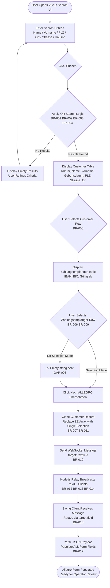
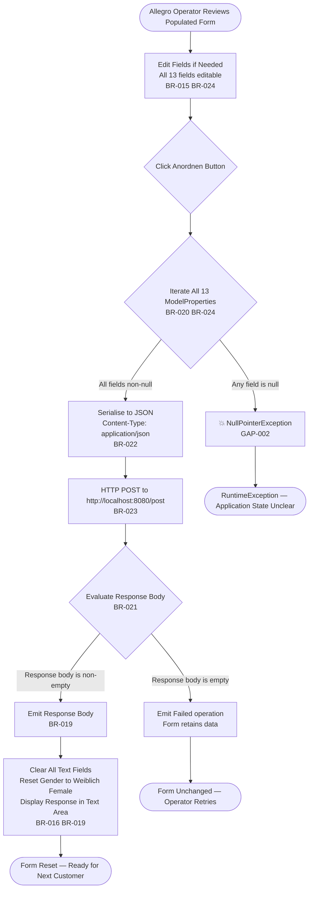
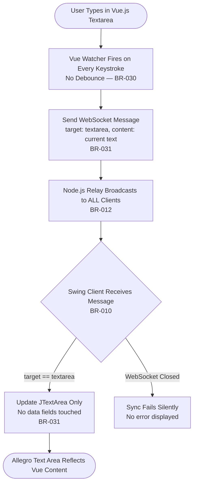

# Business Rules Documentation
## Allegro Modernisation PoC — Java Swing WebSocket Bridge

> **Extracted by:** GenInsights Business Rules Agent  
> **Timestamp:** 2026-02-05T16:00:00Z  
> **Repository:** Chris-Capgemini/test-custom-agents-2  
> **Source:** Full static analysis of Java, JavaScript, and Vue.js source files  

---

## Executive Summary

This application is a **Proof-of-Concept data transfer bridge** between a modern Vue.js web search interface and the **Allegro** legacy Java Swing desktop application. The primary business scenario is:

1. A user searches for a German customer record in the browser
2. Selects the customer and their Zahlungsempfänger (payment recipient / IBAN + BIC)
3. Clicks **"Nach ALLEGRO übernehmen"** to push the data over WebSocket into the Allegro form
4. The Allegro operator reviews and submits via **"Anordnen"** (HTTP POST)

**31 business rules** were extracted across **7 business domains**.  
**3 business workflows** were identified.  
**7 critical or high-severity gaps** were found — most notably the complete absence of input validation and a NullPointerException risk on form submission.

---

## Business Domains

| Domain | Rules | Priority |
|--------|-------|----------|
| Customer Search | BR-001 to BR-005 | High |
| Payment Recipient Selection (Zahlungsempfänger) | BR-006 to BR-009 | Critical |
| WebSocket Message Routing | BR-010 to BR-014 | Critical |
| Allegro Swing Desktop Form | BR-015 to BR-019 | High |
| HTTP Submission (Anordnen) | BR-020 to BR-023 | Critical |
| Domain Data Model | BR-024 to BR-029 | High |
| Real-Time Text Synchronisation | BR-030 to BR-031 | Medium |

---

## Rules by Domain

---

### 🔍 Customer Search

#### BR-001: Multi-Field OR Search Logic
- **Type:** Decision  
- **Priority:** Critical  
- **Description:** A customer record is included in search results if **ANY** of the provided search fields matches. The search uses **OR logic**, not AND. A user entering both a surname and a ZIP will retrieve records matching either.  
- **Implementation:** `Search.vue → searchPerson()`  
- **Conditions:** Triggered when the user clicks "Suchen"  
- **Code Example:**
  ```javascript
  if (this.formdata.last && element.name.toLowerCase().indexOf(this.formdata.last.toLowerCase()) >= 0
    || this.formdata.first && element.first.toLowerCase().indexOf(this.formdata.first.toLowerCase()) >= 0
    || this.formdata.zip && element.zip == this.formdata.zip
    || ...)
  ```

#### BR-002: ZIP Code Exact Match Constraint
- **Type:** Validation  
- **Priority:** High  
- **Description:** The PLZ (Postleitzahl) field uses strict equality (`==`) rather than substring matching. Users must enter the **complete, exact ZIP code** to get a match on that field.  
- **Implementation:** `Search.vue → searchPerson()`  
- **Code Example:**
  ```javascript
  this.formdata.zip && element.zip == this.formdata.zip
  ```

#### BR-003: Case-Insensitive Substring Matching for Text Fields
- **Type:** Decision  
- **Priority:** High  
- **Description:** All text search fields — Name, Vorname, Ort, Strasse, Hausnummer — use **case-insensitive substring matching**. A search for "may" matches "Mayer". ZIP is the only exception (exact match — see BR-002).  
- **Implementation:** `Search.vue → searchPerson()`  
- **Code Example:**
  ```javascript
  element.name.toLowerCase().indexOf(this.formdata.last.toLowerCase()) >= 0
  ```

#### BR-004: Empty Search Fields Are Excluded from Matching
- **Type:** Decision  
- **Priority:** High  
- **Description:** Only form fields that contain a value participate in the search. An empty field does not match all records. JavaScript truthy evaluation (`this.formdata.last &&`) gates each field comparison.  
- **Implementation:** `Search.vue → searchPerson()`  
- **Code Example:**
  ```javascript
  // formdata.last being empty/undefined → short-circuits the OR clause
  this.formdata.last && element.name.toLowerCase()...
  ```

#### BR-005: Fixed In-Memory Customer Dataset (Mock Data)
- **Type:** Process  
- **Priority:** Critical  
- **Description:** The application operates on a **hardcoded array of exactly 5 German customer records** embedded in `Search.vue`. No external API or database is queried. This is a PoC mock and must be replaced for production.  
- **Implementation:** `Search.vue → data() → search_space`  
- **Mock Customers:** Hans Mayer (95183 Trogen), Linda Reitmayr (92148 Hof), Karl May (10124 Berlin), Jens Mueller (14489 Potsdam), Steffi Ruckmueller (14432 Templin)

---

### 💳 Payment Recipient Selection (Zahlungsempfänger)

#### BR-006: Zahlungsempfänger Must Be Selected Before Allegro Transfer
- **Type:** Validation  
- **Priority:** Critical  
- **Description:** Before transferring data to Allegro, the user must select one Zahlungsempfänger from the secondary results table. If no selection is made, `zahlungsempfaenger_selected` defaults to an empty string, which is sent without error.  
- **Implementation:** `Search.vue → zahlungsempfaengerSelected()`, `sendMessage()`  
- **Gap:** ⚠️ No enforcement — button is not disabled when no selection has been made. See **GAP-005**.  
- **Code Example:**
  ```javascript
  zahlungsempfaenger_selected: "",       // default — no selection
  zahlungsempfaengerSelected(ze) {
    this.zahlungsempfaenger_selected = ze;  // set on row click
  }
  ```

#### BR-007: Zahlungsempfänger Array Replaced with Single Selection on Transfer
- **Type:** Process  
- **Priority:** High  
- **Description:** When preparing the JSON payload for Allegro, the full array of Zahlungsempfänger records in the customer object is **replaced with only the single selected entry**. The WebSocket message carries exactly one payment record.  
- **Implementation:** `Search.vue → sendMessage()`  
- **Code Example:**
  ```javascript
  let obj_to_send = JSON.parse(JSON.stringify(e));  // deep clone
  if (target == "textfield") {
    obj_to_send.zahlungsempfaenger = this.zahlungsempfaenger_selected;
  }
  ```

#### BR-008: Each Customer May Have One to Three Zahlungsempfänger
- **Type:** Data Constraint  
- **Priority:** Medium  
- **Description:** The data model supports any number of payment recipients per customer. In the mock dataset, customers have 1–3 entries. The UI renders all entries and allows the user to select one.  
- **Implementation:** `Search.vue → data() → search_space`

#### BR-009: Zahlungsempfänger Record Structure — IBAN, BIC, Valid-From
- **Type:** Data Constraint  
- **Priority:** High  
- **Description:** Each Zahlungsempfänger must contain three core fields: `iban`, `bic`, and `valid_from`. The fields `valid_until` and `type` exist in mock data but are always empty and not transmitted to Allegro.  
- **Implementation:** `Search.vue → data()`, `api.yml`  
- **Code Example:**
  ```javascript
  { iban: 'DE27100777770209299700', bic: 'ERFBDE8E759', valid_from: '2020-01-04',
    valid_until: '', type: '' }
  ```

---

### 📡 WebSocket Message Routing

#### BR-010: Message Target Routing — `textfield` vs `textarea`
- **Type:** Decision  
- **Priority:** Critical  
- **Description:** Every WebSocket message carries a `target` field. `"textfield"` triggers full customer data population in the Swing form; `"textarea"` updates only the freeform text area. Unknown target values are silently ignored.  
- **Implementation:** `websocket/Main.java → onMessage()`, `Search.vue → sendMessage()`  
- **Code Example:**
  ```java
  switch (message.target) {
    case "textarea":  textArea.setText(message.content); return;
    case "textfield": SearchResult sr = toSearchResult(message.content); ...; return;
    // no default — unknown targets dropped silently
  }
  ```

#### BR-011: Complete Customer Record Transferred as Single Atomic Bundle
- **Type:** Process  
- **Priority:** High  
- **Description:** The entire customer record (all personal data + the selected Zahlungsempfänger) is serialised into a single JSON WebSocket message. There is no partial or incremental field transfer.  
- **Implementation:** `Search.vue → sendMessage()`

#### BR-012: Unconditional Broadcast to All Connected Clients
- **Type:** Process  
- **Priority:** High  
- **Description:** The Node.js relay broadcasts **every received message to ALL connected clients** without filtering, targeting, or authentication. The originating Vue client also receives its own message back.  
- **Implementation:** `WebsocketServer.js → connection.on('message', ...)`  
- **Code Example:**
  ```javascript
  for (var i = 0; i < clients.length; i++) {
    clients[i].sendUTF(json);
  }
  ```

#### BR-013: Origin-Agnostic WebSocket Connection Acceptance
- **Type:** Authorization  
- **Priority:** Critical  
- **Description:** The Node.js server accepts WebSocket connections from **any origin** by passing `null` as the accepted origin. No authentication, origin validation, or access control is applied.  
- **Implementation:** `WebsocketServer.js → wsServer.on('request', ...)`  
- **Security Gap:** ⚠️ Must implement origin whitelisting for production. See **GAP-005**.  
- **Code Example:**
  ```javascript
  var connection = request.accept(null, request.origin);
  ```

#### BR-014: Only UTF-8 Text Messages Are Relayed
- **Type:** Validation  
- **Priority:** Medium  
- **Description:** The relay server processes only messages of type `'utf8'`. Binary frames or other message types are silently discarded.  
- **Implementation:** `WebsocketServer.js`  
- **Code Example:**
  ```javascript
  if (message.type === 'utf8') { /* relay */ }
  ```

---

### 🖥️ Allegro Swing Desktop Form

#### BR-015: Gender Is a Mutually Exclusive Single Selection
- **Type:** Validation  
- **Priority:** High  
- **Description:** The three gender options — **Weiblich** (Female), **Männlich** (Male), **Divers** (Diverse) — are grouped in a `ButtonGroup`. Selecting one automatically deselects the others. Only one gender can be active at a time in the UI.  
- **Implementation:** `PocView.java → initUI()`, `websocket/Main.java → initUI()`  
- **Note:** The underlying model stores gender as three independent Booleans — see BR-026.  
- **Code Example:**
  ```java
  gender.add(female);
  gender.add(male);
  gender.add(diverse);
  female.setSelected(true);  // default
  ```

#### BR-016: Default Gender is Female (Weiblich) at Form Initialisation and After Reset
- **Type:** Process  
- **Priority:** Medium  
- **Description:** The gender selection defaults to **Weiblich (Female)** on initial form load and after every successful HTTP submission. Male and Diverse are set to unselected.  
- **Implementation:** `PocView.java → initUI()`, `PocPresenter.java → eventEmitter.subscribe(...)`  
- **Code Example:**
  ```java
  view.female.setSelected(true);
  view.male.setSelected(false);
  view.diverse.setSelected(false);
  ```

#### BR-017: Full Form Population from Incoming WebSocket Data
- **Type:** Process  
- **Priority:** Critical  
- **Description:** On receipt of a `"textfield"` WebSocket message, **all** matching form fields are overwritten with values from the JSON payload. The entire form is repopulated atomically.  
- **Implementation:** `websocket/Main.java → onMessage()`, `toSearchResult()`  
- **Fields Populated:** name, first, dob, zip, ort, street, hausnr, ze_iban, ze_bic, ze_valid_from  
- **Code Example:**
  ```java
  tf_name.setText(searchResult.name);
  tf_first.setText(searchResult.first);
  tf_dob.setText(searchResult.dob);
  // ... all 10 fields
  ```

#### BR-018: Hausnummer Field Gap Between Legacy and MVP Implementations
- **Type:** Data Constraint  
- **Priority:** High  
- **Description:** The legacy Swing client (`websocket/Main.java`) has a dedicated `tf_hausnr` field that receives `hausnr` from the WebSocket. However, the MVP `ModelProperties` enum and the `api.yml` OpenAPI spec **do not include a house number field**. The Hausnummer is **lost** during HTTP submission via the MVP path.  
- **Implementation Gap:** `websocket/Main.java` ↔ `ModelProperties.java` ↔ `api.yml`  
- **Resolution Needed:** Add `HAUS_NR` to `ModelProperties` and to the `PostObject` schema in `api.yml`.

#### BR-019: Post-Submission Form Reset to Default State
- **Type:** Process  
- **Priority:** High  
- **Description:** After a successful HTTP POST (non-empty response body), all text fields are cleared and gender is reset to Female. The HTTP response body is displayed in the text area as confirmation. On failure, the form retains its data.  
- **Implementation:** `PocPresenter.java → eventEmitter.subscribe(...)`  
- **Fields Reset:** firstName, name, dateOfBirth, zip, ort, street, iban, bic, validFrom  
- **Code Example:**
  ```java
  eventEmitter.subscribe(eventData -> {
    view.textArea.setText(eventData);   // show response
    view.firstName.setText("");
    view.name.setText("");
    // ... all fields cleared
    view.female.setSelected(true);      // reset gender to default
  });
  ```

---

### 📮 HTTP Submission (Anordnen)

#### BR-020: All 13 Fields Submitted Atomically in HTTP POST
- **Type:** Process  
- **Priority:** Critical  
- **Description:** Clicking "Anordnen" submits all 13 `ModelProperties` fields together in a single HTTP POST. There is no partial submission. Fields with null values cause a **NullPointerException** (see GAP-002).  
- **Implementation:** `PocModel.java → action()`, `HttpBinService.java → post()`  
- **Code Example:**
  ```java
  for (var val : ModelProperties.values()) {
    data.put(val.toString(), model.get(val).getField().toString()); // NPE if field is null!
  }
  ```

#### BR-021: Non-Empty HTTP Response Body Indicates Success
- **Type:** Decision  
- **Priority:** High  
- **Description:** Success is determined by whether the response body string is **non-empty**. HTTP status codes are **not evaluated**. A 500 error with a non-empty body would be treated as success.  
- **Implementation:** `PocModel.java → action()`  
- **Code Example:**
  ```java
  if (!responseBody.isEmpty()) {
    eventEmitter.emit(responseBody);    // success
  } else {
    eventEmitter.emit("Failed operation");  // failure
  }
  ```

#### BR-022: HTTP POST Uses Fixed JSON Content-Type
- **Type:** Validation  
- **Priority:** Medium  
- **Description:** All HTTP POST submissions use `Content-Type: application/json`. The request body is a flat JSON object with all 13 field names as string keys.  
- **Implementation:** `HttpBinService.java → post()`

#### BR-023: HTTP Endpoint is Hardcoded to Localhost HTTPBin
- **Type:** Process  
- **Priority:** Critical  
- **Description:** The submission URL `http://localhost:8080/post` is hardcoded pointing to a local HTTPBin Docker container. No configuration mechanism exists.  
- **Implementation:** `HttpBinService.java — static constants`  
- **Code Example:**
  ```java
  public static final String URL  = "http://localhost:8080";
  public static final String PATH = "/post";
  ```

---

### 📦 Domain Data Model

#### BR-024: 13 Canonical Domain Fields Define the Customer Record
- **Type:** Data Constraint  
- **Priority:** Critical  
- **Description:** The authoritative field set is defined in `ModelProperties` enum and mirrored in `api.yml`. The 13 fields are:

| Field | Enum Key | Type | Description |
|-------|----------|------|-------------|
| Text Area | `TEXT_AREA` | String | Freeform notes / RT field |
| First Name | `FIRST_NAME` | String | Vorname |
| Last Name | `LAST_NAME` | String | Nachname |
| Date of Birth | `DATE_OF_BIRTH` | String | Geburtsdatum (ISO 8601) |
| ZIP Code | `ZIP` | String | Postleitzahl |
| City | `ORT` | String | Ort |
| Street | `STREET` | String | Strasse |
| IBAN | `IBAN` | String | Bank account identifier |
| BIC | `BIC` | String | Bank identifier code |
| Valid From | `VALID_FROM` | String | Payment validity date |
| Female | `FEMALE` | Boolean | Weiblich gender flag |
| Male | `MALE` | Boolean | Männlich gender flag |
| Diverse | `DIVERSE` | Boolean | Divers gender flag |

> ⚠️ **Missing fields:** Hausnummer (BR-018) and Kundennummer (BR-028) are present in Vue/WebSocket data but absent here.

#### BR-025: All Fields Initialised to Null — No Default Values
- **Type:** Data Constraint  
- **Priority:** High  
- **Description:** Every model field is initialised with `null`. Fields remain null until typed, received via WebSocket, or reset. Combined with BR-020, this creates a crash risk on submission.  
- **Implementation:** `PocModel.java → constructor`

#### BR-026: Gender Stored as Three Independent Booleans (Inconsistency Risk)
- **Type:** Data Constraint  
- **Priority:** Medium  
- **Description:** Gender is represented as three independent Boolean model properties (FEMALE, MALE, DIVERSE), not a single enum. The model can theoretically hold invalid multi-gender states, though the Swing `ButtonGroup` prevents this at the UI level.  
- **Recommendation:** Replace with a single `GenderEnum { FEMALE, MALE, DIVERSE }` field.

#### BR-027: Date Fields Use ISO 8601 Format (YYYY-MM-DD)
- **Type:** Temporal  
- **Priority:** Medium  
- **Description:** All date values — `DATE_OF_BIRTH` and `VALID_FROM` — are ISO 8601 strings (`YYYY-MM-DD`). No format validation or parsing is applied; non-conforming strings would pass through silently.  
- **Examples:** `dob: '1981-01-08'`, `valid_from: '2020-01-04'`

#### BR-028: Kundennummer Transmitted via WebSocket but Lost During HTTP Submission
- **Type:** Data Constraint  
- **Priority:** High  
- **Description:** Customer number (`knr`) is present in the mock dataset, displayed in search results, and included in the WebSocket JSON payload. However, it is absent from `ModelProperties` and `api.yml`, meaning it is silently lost during the HTTP POST step.  
- **Resolution Needed:** Add `KNR` to `ModelProperties` and `api.yml` if the business requires it in the Allegro submission.

#### BR-029: No Input Validation Exists Anywhere in the Pipeline
- **Type:** Validation  
- **Priority:** Critical  
- **Description:** No validation of any kind — format checks, required-field enforcement, IBAN checksum, date format — is applied at any layer (Vue.js, Node.js relay, or Java Swing). Invalid data passes through silently end-to-end.  
- **Gap:** This is a systemic gap affecting all domains. See **GAP-001**.

---

### 🔄 Real-Time Text Synchronisation

#### BR-030: Live Textarea Content Synchronised to Allegro on Every Keystroke
- **Type:** Process  
- **Priority:** Medium  
- **Description:** A Vue reactive watcher triggers `sendMessage(val, 'textarea')` on every change to the textarea. The full current textarea content is sent to all WebSocket subscribers in real time with no debouncing or throttling.  
- **Implementation:** `Search.vue → watch.internal_content_textarea`  
- **Code Example:**
  ```javascript
  watch: {
    internal_content_textarea: function(val) {
      this.sendMessage(val, "textarea");
    }
  }
  ```

#### BR-031: Textarea Sync Routed Separately from Customer Data Transfer
- **Type:** Decision  
- **Priority:** Low  
- **Description:** Textarea messages (`target: 'textarea'`) only update the Swing `JTextArea` component. No customer or payment data fields are affected. The routing is enforced by the switch statement in the Java WebSocket client.

---

## Business Workflows

---

### WF-001: Customer Search and Allegro Data Transfer

**The primary business workflow** — searches for a customer in the web UI and transfers their data to Allegro.



**Business Rules Applied:** BR-001, BR-002, BR-003, BR-004, BR-005, BR-006, BR-007, BR-008, BR-009, BR-010, BR-011, BR-012, BR-013, BR-014, BR-017

**End States:**
- ✅ Allegro form fully populated with customer and payment data
- ⚠️ Empty Zahlungsempfänger sent if user skips selection step
- ❌ No results — user refines search criteria
- ❌ WebSocket unavailable — data not transferred, no error shown

---

### WF-002: Allegro Form Submission (Anordnen)

**The submission workflow** — Allegro operator reviews the form and submits data to the backend.



**Business Rules Applied:** BR-015, BR-016, BR-019, BR-020, BR-021, BR-022, BR-023, BR-024, BR-025, BR-029

**End States:**
- ✅ Success — form cleared, response body displayed, ready for next customer
- ⚠️ Failure — "Failed operation" shown, form data retained for retry
- ❌ NullPointerException — if any field is null at submission time (BR-025)

---

### WF-003: Real-Time Freeform Text Synchronisation

**A continuously active background workflow** that mirrors Vue.js textarea content to Allegro in real time.



**Business Rules Applied:** BR-010, BR-012, BR-013, BR-014, BR-030, BR-031

**End States:**
- ✅ Allegro text area mirrors Vue textarea in real time
- ❌ Sync fails silently if WebSocket connection is lost

---

## Rule Dependencies

```
BR-001 (OR Search)
  └─ depends on ──▶ BR-002 (ZIP Exact)
  └─ depends on ──▶ BR-003 (Case-Insensitive Text)
  └─ depends on ──▶ BR-004 (Empty Field Exclusion)
  └─ operates on ─▶ BR-005 (Mock Dataset)

BR-006 (ZE Selection Required)
  └─ triggers ────▶ BR-007 (ZE Array Replacement)
  └─ reads from ──▶ BR-008 (Multiple ZE per Customer)
  └─ constrains ──▶ BR-009 (ZE Data Structure)

BR-010 (Target Routing)
  └─ governs ─────▶ BR-011 (Bundle Transfer → textfield)
  └─ governs ─────▶ BR-031 (Textarea Sync → textarea)

BR-020 (All 13 Fields Submitted)
  └─ depends on ──▶ BR-024 (13 Canonical Fields)
  └─ risk from ───▶ BR-025 (All Fields Start Null)
  └─ mitigated by ▶ BR-029 [MISSING — no validation exists]

BR-019 (Post-Submit Form Reset)
  └─ triggered by ▶ BR-021 (Non-Empty Response = Success)
  └─ resets to ───▶ BR-016 (Default Gender = Female)
```

---

## Identified Gaps and Recommendations

| Gap ID | Severity | Title | Recommendation |
|--------|----------|-------|----------------|
| **GAP-001** | 🔴 Critical | No Input Validation Anywhere | Add IBAN checksum validation, ISO date format checks, required field enforcement at Vue and Java layers |
| **GAP-002** | 🔴 Critical | NullPointerException Risk on Submission | Replace `.toString()` with `String.valueOf(field)` or add null guards in `PocModel.action()` |
| **GAP-003** | 🟡 High | Hausnummer Missing from MVP Model | Add `HAUS_NR` to `ModelProperties` enum and `api.yml` `PostObject` schema |
| **GAP-004** | 🟡 High | Kundennummer Lost at HTTP Submission | Add `KNR` to `ModelProperties` and `api.yml` if business requires it in submissions |
| **GAP-005** | 🟡 High | No Zahlungsempfänger Selection Enforcement | Disable "Nach ALLEGRO übernehmen" button until a Zahlungsempfänger is selected |
| **GAP-006** | 🟠 Medium | No WebSocket Reconnection Logic | Implement exponential back-off reconnection in both Vue and Java clients |
| **GAP-007** | 🟠 Medium | HTTP Status Code Not Evaluated | Check `getResponseCode()` before evaluating body; treat only 2xx as success |

---

## WebSocket Message Protocol Reference

All WebSocket messages follow a shared JSON envelope:

```json
{
  "target": "textfield | textarea",
  "content": "<object or string>"
}
```

### Customer Data Transfer (`target: "textfield"`)

```json
{
  "target": "textfield",
  "content": {
    "first": "Hans",
    "name": "Mayer",
    "dob": "1981-01-08",
    "zip": "95183",
    "ort": "Trogen",
    "street": "Isaaer Str.",
    "hausnr": "23",
    "knr": "79423984",
    "zahlungsempfaenger": {
      "iban": "DE27100777770209299700",
      "bic": "ERFBDE8E759",
      "valid_from": "2020-01-04"
    }
  }
}
```

### Freeform Text Sync (`target: "textarea"`)

```json
{
  "target": "textarea",
  "content": "Some freeform text typed by the user"
}
```

---

## HTTP POST Payload Reference

All 13 canonical fields submitted by `PocModel.action()` via `HttpBinService.post()`:

```json
{
  "TEXT_AREA":      "...",
  "FIRST_NAME":     "Hans",
  "LAST_NAME":      "Mayer",
  "DATE_OF_BIRTH":  "1981-01-08",
  "ZIP":            "95183",
  "ORT":            "Trogen",
  "STREET":         "Isaaer Str.",
  "IBAN":           "DE27100777770209299700",
  "BIC":            "ERFBDE8E759",
  "VALID_FROM":     "2020-01-04",
  "FEMALE":         "true",
  "MALE":           "false",
  "DIVERSE":        "false"
}
```

> ⚠️ Note: `HAUS_NR` and `KNR` are absent from this payload — see GAP-003 and GAP-004.

---

*Documentation generated by GenInsights Business Rules Agent | Repository: Chris-Capgemini/test-custom-agents-2*
