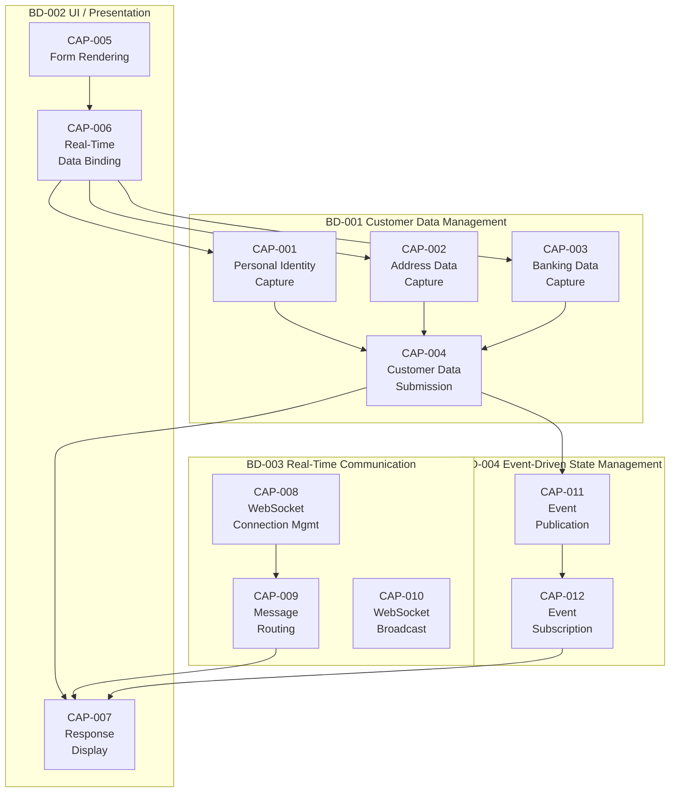

# Capability Mapping — Allegro PoC

> **Generated:** 2025-01-01  
> **System:** websocket_swing / Allegro PoC

---

## Table of Contents

1. [Business Domain Overview](#business-domain-overview)
2. [Capability Map Diagram](#capability-map-diagram)
3. [BD-001: Customer Data Management](#bd-001-customer-data-management)
4. [BD-002: UI / Presentation](#bd-002-ui--presentation)
5. [BD-003: Real-Time Communication](#bd-003-real-time-communication)
6. [BD-004: Event-Driven State Management](#bd-004-event-driven-state-management)
7. [Capability Coverage Matrix](#capability-coverage-matrix)
8. [Identified Capability Gaps](#identified-capability-gaps)

---

## Business Domain Overview

The Allegro PoC addresses four primary business domains:

| Domain | ID | Description |
|--------|-----|-------------|
| Customer Data Management | BD-001 | Capture, hold, and submit customer personal/address/banking data |
| UI / Presentation | BD-002 | Render forms, gather input, and display results |
| Real-Time Communication | BD-003 | Receive server-pushed data via WebSocket |
| Event-Driven State Management | BD-004 | Notify UI of model state changes via event bus |

---

## Capability Map Diagram

---

## BD-001: Customer Data Management

### CAP-001 — Personal Identity Capture

**Coverage:** ✅ FULL

| Field | UI Label | Model Key | Type |
|-------|----------|-----------|------|
| First Name | Vorname | `FIRST_NAME` | `ValueModel<String>` |
| Last Name | Name | `LAST_NAME` | `ValueModel<String>` |
| Date of Birth | Geburtsdatum | `DATE_OF_BIRTH` | `ValueModel<String>` |
| Gender Female | Weiblich | `FEMALE` | `ValueModel<Boolean>` |
| Gender Male | Männlich | `MALE` | `ValueModel<Boolean>` |
| Gender Diverse | Divers | `DIVERSE` | `ValueModel<Boolean>` |

**Mapped Files:**
- `ModelProperties.java` — defines enum keys
- `PocView.java` — renders UI fields
- `PocPresenter.java` — binds to model
- `PocModel.java` — stores and submits values

---

### CAP-002 — Address Data Capture

**Coverage:** ✅ FULL

| Field | UI Label | Model Key | Type |
|-------|----------|-----------|------|
| Street | Strasse | `STREET` | `ValueModel<String>` |
| Postal Code | PLZ | `ZIP` | `ValueModel<String>` |
| City | Ort | `ORT` | `ValueModel<String>` |

**Mapped Files:** `ModelProperties.java`, `PocView.java`, `PocPresenter.java`

---

### CAP-003 — Banking Data Capture

**Coverage:** ✅ FULL

| Field | UI Label | Model Key | Type |
|-------|----------|-----------|------|
| IBAN | IBAN | `IBAN` | `ValueModel<String>` |
| BIC | BIC | `BIC` | `ValueModel<String>` |
| Valid From | Gültig ab | `VALID_FROM` | `ValueModel<String>` |

**Mapped Files:** `ModelProperties.java`, `PocView.java`, `PocPresenter.java`

---

### CAP-004 — Customer Data Submission

**Coverage:** ⚠️ PARTIAL

The capability exists but only submits to the HTTPBin echo service (not a real backend).

| Step | Component | Description |
|------|-----------|-------------|
| Trigger | `PocPresenter.ActionListener` | Button click |
| Serialise | `PocModel.action()` | Build HashMap from all 13 fields |
| Transport | `HttpBinService.post()` | HTTP POST to localhost:8080/post |
| Response | `EventEmitter.emit()` | Fire event with response body |

**Limitation:** Target URL hardcoded; no real backend integration.

---

## BD-002: UI / Presentation

### CAP-005 — Form Rendering

**Coverage:** ✅ FULL (with known bug)

Both `PocView.java` and `websocket/Main.java` render an identical Allegro form with:
- 6-column GridBagLayout
- German-locale labels
- 10 text fields, 3 radio buttons (gender group), 1 text area, 1 action button

> ⚠️ **Bug:** `textArea` added to panel twice in both files.

---

### CAP-006 — Real-Time Data Binding

**Coverage:** ✅ FULL (MVP module only)

`PocPresenter` provides two-way binding:
- `DocumentListener` for all `JTextComponent` fields → `ValueModel<String>`
- `ChangeListener` for all `JRadioButton` fields → `ValueModel<Boolean>`

> ⚠️ **Gap:** The `websocket/Main.java` module has **no** data binding — fields are only written, never read back.

---

### CAP-007 — Response Display

**Coverage:** ✅ FULL

After form submission (MVP) or WebSocket message receipt (WS module), the server response is displayed in the `textArea` component.

---

## BD-003: Real-Time Communication

### CAP-008 — WebSocket Connection Management

**Coverage:** ✅ FULL

`WebsocketClientEndpoint` implements complete lifecycle:

| Lifecycle Event | Handler | Action |
|-----------------|---------|--------|
| Connect | Constructor | `container.connectToServer()` |
| Open | `@OnOpen` | Store session, log |
| Close | `@OnClose` | Clear session, release latch |
| Error | Constructor catch | Throw `RuntimeException` |

---

### CAP-009 — Server-Pushed Message Routing

**Coverage:** ✅ FULL

Messages routed by `target` field:

| Target Value | Action |
|-------------|--------|
| `"textarea"` | `textArea.setText(content)` |
| `"textfield"` | Parse full JSON → populate 10 fields |
| Other | Silently ignored |

---

### CAP-010 — WebSocket Broadcast

**Coverage:** ✅ FULL (Node.js server)

`WebsocketServer.js` broadcasts every received message to all connected clients, enabling multi-client scenarios.

---

## BD-004: Event-Driven State Management

### CAP-011 — Event Publication

**Coverage:** ✅ FULL

`PocModel` fires events via `EventEmitter.emit(String)` after HTTP submission with either the response body or `"Failed operation"`.

### CAP-012 — Event Subscription

**Coverage:** ✅ FULL

`PocPresenter` subscribes via `eventEmitter.subscribe(eventData -> { ... })` lambda and updates the View on each event.

---

## Capability Coverage Matrix

| Capability | ID | Coverage | Files |
|------------|-----|----------|-------|
| Personal Identity Capture | CAP-001 | ✅ Full | ModelProperties, PocView, PocPresenter, PocModel |
| Address Data Capture | CAP-002 | ✅ Full | ModelProperties, PocView, PocPresenter |
| Banking Data Capture | CAP-003 | ✅ Full | ModelProperties, PocView, PocPresenter |
| Customer Data Submission | CAP-004 | ⚠️ Partial | PocModel, HttpBinService |
| Form Rendering | CAP-005 | ✅ Full (bug) | PocView, websocket/Main |
| Real-Time Data Binding | CAP-006 | ✅ Full | PocPresenter |
| Response Display | CAP-007 | ✅ Full | PocPresenter, PocView |
| WebSocket Connection Mgmt | CAP-008 | ✅ Full | websocket/Main |
| Message Routing | CAP-009 | ✅ Full | websocket/Main |
| WebSocket Broadcast | CAP-010 | ✅ Full | WebsocketServer.js |
| Event Publication | CAP-011 | ✅ Full | EventEmitter, PocModel |
| Event Subscription | CAP-012 | ✅ Full | EventListener, PocPresenter |

**Summary:** 11 of 12 capabilities fully covered, 1 partial (real backend not implemented).

---

## Identified Capability Gaps

| Gap | ID | Priority | Description |
|-----|-----|----------|-------------|
| Input Validation | GAP-001 | High | No format validation for IBAN, BIC, date, ZIP, or any field |
| Error Handling UI | GAP-002 | High | No capability to display error messages when HTTP fails |
| Security / Auth | GAP-003 | Medium | No authentication, authorisation, or TLS/encryption |
| Local Persistence | GAP-004 | Low | No offline storage; all state is in-memory only |
| Audit / Logging | GAP-005 | Low | Debug println only; no structured audit logging |
