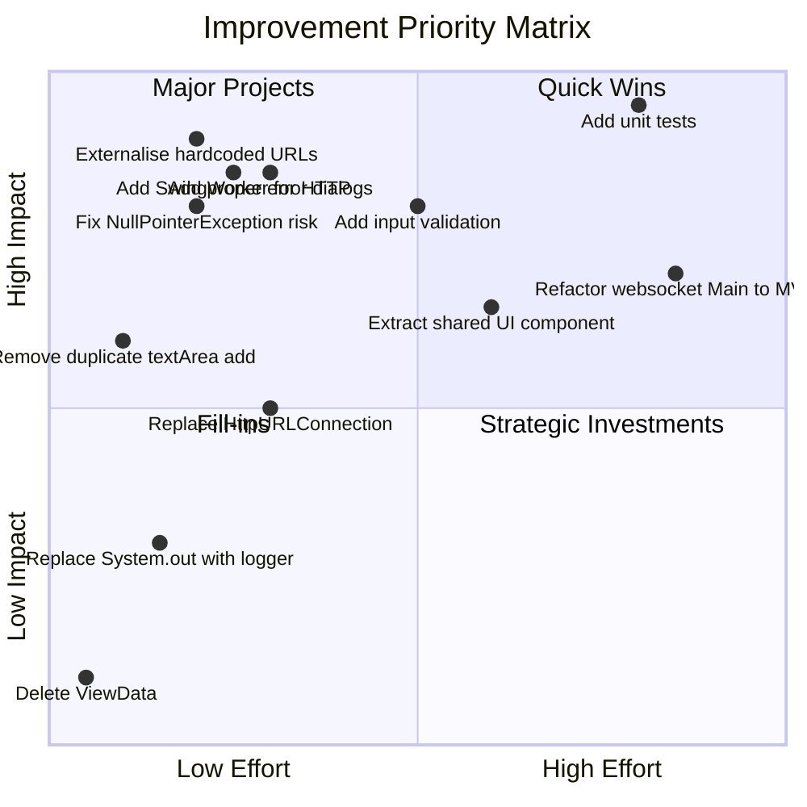

# Code Assessment Report — Allegro PoC

> **Generated:** 2025-01-01  
> **System:** websocket_swing / Allegro PoC  
> **Overall Health Score:** 62 / 100 (Grade: C+)

---

## Executive Summary

The Allegro PoC is a well-structured demonstration of the **MVP (Model-View-Presenter)** pattern in Java Swing. For a proof-of-concept, the code achieves its goal clearly: collect form data, submit it to an echo server, and display the response. The MVP module (`com/` package) demonstrates clean separation of concerns.

However, the codebase carries several issues that must be resolved before any production use:
- **Hardcoded URLs** prevent environment portability
- **No input validation** on any form field
- **Synchronous HTTP on the EDT** blocks the UI during network calls
- **Zero test coverage** makes refactoring risky
- **Significant code duplication** between the two Swing applications

The `websocket/Main.java` is a separate concern — a monolithic prototype that has not been refactored to match the clean MVP structure of the main module.

---

## Health Score Breakdown

| Category | Score | Notes |
|----------|-------|-------|
| Code Structure & Design | 70/100 | MVP pattern well-applied in com/ package; websocket module is monolithic |
| Error Handling | 40/100 | Exceptions swallowed as RuntimeException; no user feedback |
| Security | 50/100 | No auth, no validation, hardcoded localhost URLs |
| Maintainability | 55/100 | Duplicate UI code, no DI, debug println statements |
| Test Coverage | 0/100 | Zero tests |
| Documentation | 35/100 | No Javadoc; minimal inline comments |
| Performance | 70/100 | EDT blocking during HTTP is the main concern |
| **Overall** | **62/100** | |

---

## Issues by Criticality

### 🔴 Criticality 5 — Critical

#### ISS-001 — Hardcoded HTTP URL

| Attribute | Value |
|-----------|-------|
| **File** | `HttpBinService.java:11` |
| **Type** | Configuration |

The HTTP service target is hardcoded to `http://localhost:8080`. Switching to a different environment (staging, production) requires source code modification and recompilation.

**Fix:** Externalise to `application.properties` or environment variable. Inject via constructor.

```java
// Before:
public static final String URL = "http://localhost:8080";

// After:
private final String baseUrl;
public HttpBinService(String baseUrl) {
    this.baseUrl = baseUrl;
}
```

---

#### ISS-002 — Hardcoded WebSocket URI

| Attribute | Value |
|-----------|-------|
| **File** | `websocket/Main.java:55` |
| **Type** | Configuration |

WebSocket URI `ws://localhost:1337/` is hardcoded.

**Fix:** Read from command-line argument or config file:
```java
String uri = System.getProperty("websocket.uri", "ws://localhost:1337/");
```

---

### 🟠 Criticality 4 — High

#### ISS-003 — View Components Exposed as Protected Fields

| Attribute | Value |
|-----------|-------|
| **File** | `PocView.java:9–26` |
| **Type** | Encapsulation |

All 12 Swing component fields are `protected`, directly accessed by `PocPresenter`. This breaks View encapsulation and couples the Presenter to View internals.

**Fix:** Declare fields `private`, expose via getter methods or a ViewModel:
```java
public JTextArea getTextArea() { return textArea; }
public JTextField getFirstName() { return firstName; }
```

---

#### ISS-004 — PocModel.model is a Public Field

| Attribute | Value |
|-----------|-------|
| **File** | `PocModel.java:12` |
| **Type** | Encapsulation |

`public Map<ModelProperties, ValueModel<?>> model` can be freely mutated by any class.

**Fix:**
```java
private final Map<ModelProperties, ValueModel<?>> model = new EnumMap<>(ModelProperties.class);

public <T> void set(ModelProperties prop, T value) { ... }
public <T> T get(ModelProperties prop) { ... }
```

---

#### ISS-005 — Exceptions Swallowed as RuntimeException on EDT

| Attribute | Value |
|-----------|-------|
| **File** | `PocPresenter.java:43–47` |
| **Type** | Error Handling |

```java
} catch (IOException e) {
    throw new RuntimeException(e);  // Crashes EDT silently
} catch (InterruptedException e) {
    throw new RuntimeException(e);  // Also loses interrupted status
}
```

**Fix:**
```java
} catch (IOException e) {
    JOptionPane.showMessageDialog(view.getFrame(),
        "Network error: " + e.getMessage(), "Error", JOptionPane.ERROR_MESSAGE);
    log.error("HTTP submission failed", e);
} catch (InterruptedException e) {
    Thread.currentThread().interrupt();
    log.warn("Submission interrupted", e);
}
```

---

#### ISS-006 — NullPointerException Risk in PocModel.action()

| Attribute | Value |
|-----------|-------|
| **File** | `PocModel.java:39` |
| **Type** | Null Safety |

`model.get(val).getField().toString()` — if any `ValueModel` field is `null`, this throws `NullPointerException` at runtime.

**Fix:** Use a null-safe helper:
```java
String safeValue = Optional.ofNullable(model.get(val).getField())
    .map(Object::toString).orElse("");
```

---

### 🟡 Criticality 3 — Medium

#### ISS-007 — HttpURLConnection Not Closed on Exception Path

| Attribute | Value |
|-----------|-------|
| **File** | `HttpBinService.java:29` |
| **Type** | Resource Management |

If an exception occurs after connection opens but before `disconnect()`, the connection leaks.

**Fix:** Use try-finally or migrate to `java.net.http.HttpClient`:
```java
HttpClient client = HttpClient.newHttpClient();
HttpRequest request = HttpRequest.newBuilder()
    .uri(URI.create(URL + PATH))
    .header("Content-Type", CONTENT_TYPE)
    .POST(HttpRequest.BodyPublishers.ofString(jsonBody))
    .build();
HttpResponse<String> response = client.send(request, HttpResponse.BodyHandlers.ofString());
```

---

#### ISS-008 — Legacy HttpURLConnection API

| Attribute | Value |
|-----------|-------|
| **File** | `HttpBinService.java:16` |
| **Type** | Modernisation |

Java 11+ provides `java.net.http.HttpClient` with async support and proper resource management.

---

#### ISS-009 — HTTP Call Blocks the Swing EDT

| Attribute | Value |
|-----------|-------|
| **File** | `PocPresenter.java:40–48` |
| **Type** | Thread Safety |

`model.action()` is called synchronously on the EDT when the button is clicked. The synchronous HTTP call freezes the UI until the server responds.

**Fix:** Use `SwingWorker`:
```java
this.view.button.addActionListener(_ -> {
    new SwingWorker<Void, Void>() {
        @Override protected Void doInBackground() throws Exception {
            model.action();
            return null;
        }
    }.execute();
});
```

---

#### ISS-012 — textArea Added to Panel Twice (PocView)

| Attribute | Value |
|-----------|-------|
| **File** | `PocView.java:188–189` |
| **Type** | Bug |

```java
panel.add(textArea);           // Line 188 — no constraints (duplicate)
panel.add(textArea, c);        // Line 189 — with GridBagConstraints
```

In Swing, adding a component twice removes it from the first position. The result is unpredictable layout.

**Fix:** Remove line 188.

---

#### ISS-013 — textArea Added to Panel Twice (websocket.Main)

Same duplicate add bug in `websocket/Main.java:221–222`.

---

#### ISS-014 — HttpBinService Tightly Coupled in PocModel

| Attribute | Value |
|-----------|-------|
| **File** | `PocModel.java:13` |
| **Type** | Design |

`private HttpBinService httpBinService = new HttpBinService();` — hardcoded dependency makes testing impossible without the real HTTP service.

**Fix:** Inject via constructor with an interface:
```java
interface SubmissionService {
    String post(Map<String, String> data) throws IOException, InterruptedException;
}
public PocModel(EventEmitter eventEmitter, SubmissionService service) { ... }
```

---

### ⚪ Criticality 2 — Low

#### ISS-010 — ViewData is Dead Code

`ViewData.java` is a completely empty class, unreferenced anywhere. **Fix:** Delete or implement.

#### ISS-011 — Manual JSON Parsing with Boolean Flags

`websocket/Main.extract()` and `toSearchResult()` use verbose boolean flag variables for state tracking in a while loop, making the code fragile and hard to maintain. **Fix:** Use `javax.json.JsonObject` or Jackson `ObjectMapper`.

---

## Technical Debt Summary

| ID | Type | Impact | Effort | Description |
|----|------|--------|--------|-------------|
| TD-001 | Code | HIGH | Medium | ~95% duplicate UI code between PocView and websocket/Main |
| TD-002 | Design | HIGH | Large | websocket/Main is a God-class — no MVP separation |
| TD-003 | Test | HIGH | Large | Zero test coverage across all 11 files |
| TD-004 | Documentation | MEDIUM | Small | No Javadoc on any class or method |
| TD-005 | Design | MEDIUM | Small | EventEmitter not thread-safe (ArrayList vs CopyOnWriteArrayList) |
| TD-006 | Code | LOW | Small | Debug System.out.println scattered throughout (no logging framework) |

---

## Recommendations Priority Matrix



---

## Top 5 Immediate Actions

1. 🔴 **Fix NullPointerException** in `PocModel.action()` — add null-safe toString (30 minutes)
2. 🔴 **Remove duplicate `panel.add(textArea)`** in `PocView.java` line 188 (5 minutes)
3. 🟠 **Add `SwingWorker`** to prevent EDT blocking on HTTP call (2 hours)
4. 🟠 **Add error dialog** in `PocPresenter` catch blocks (1 hour)
5. 🟠 **Externalise hardcoded URLs** to configuration (2 hours)
