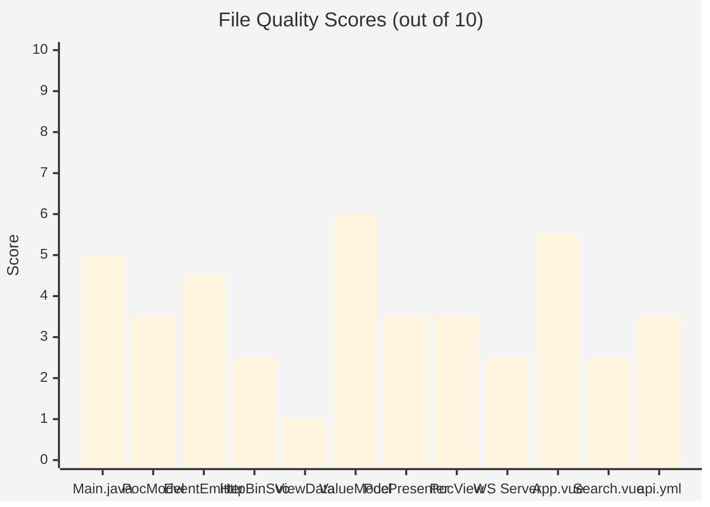
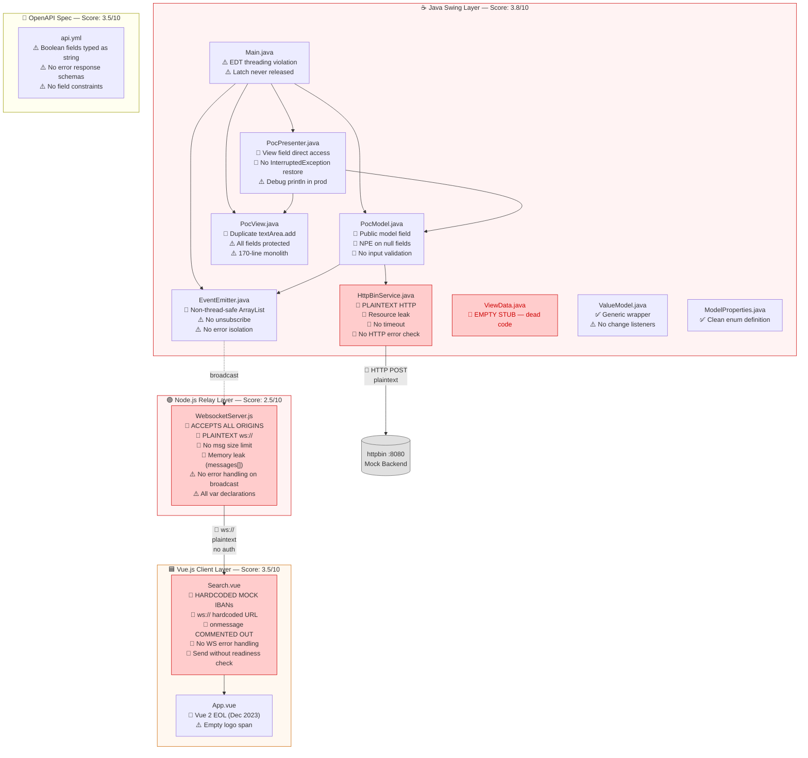
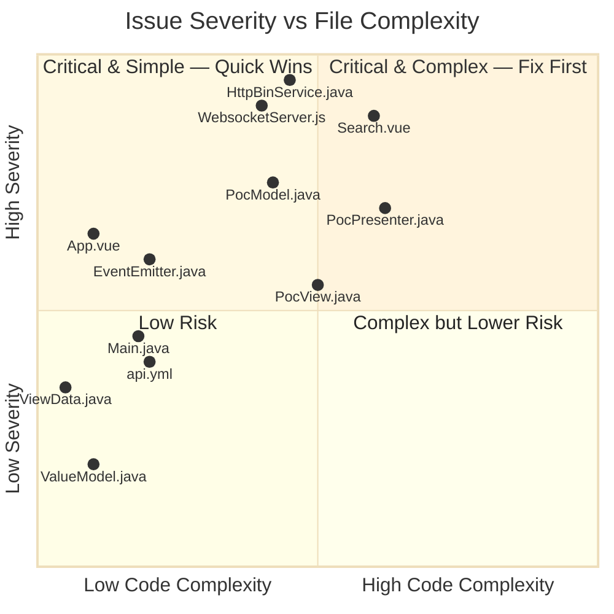
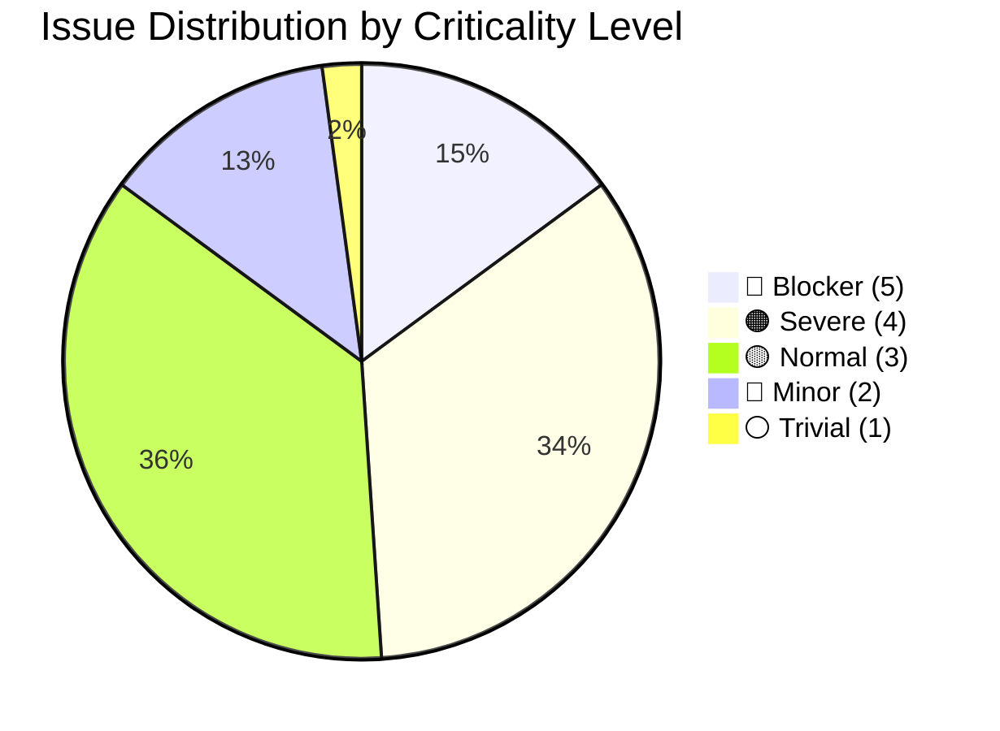
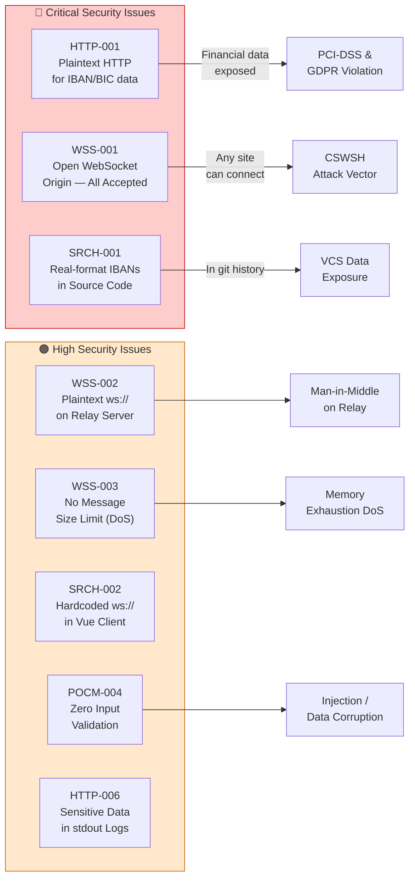
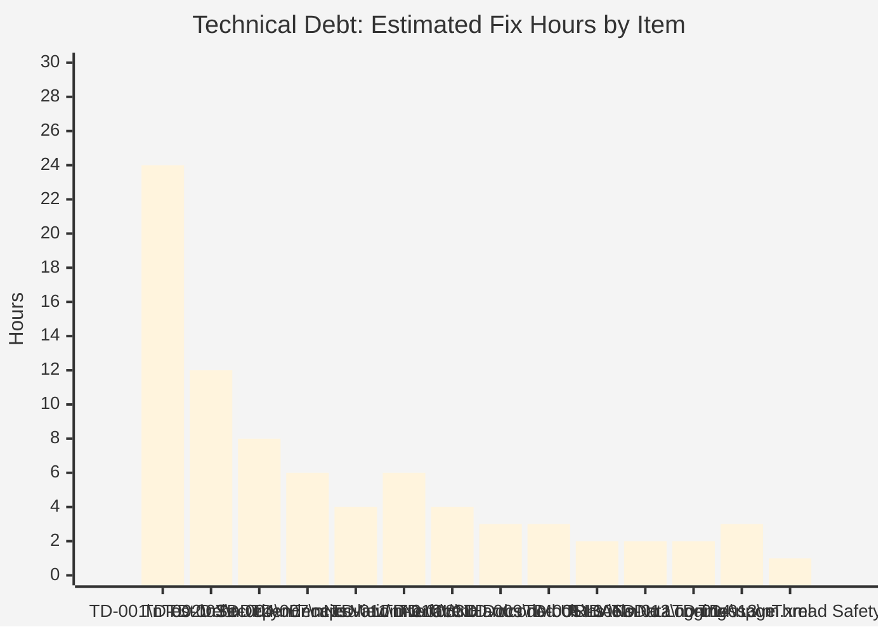
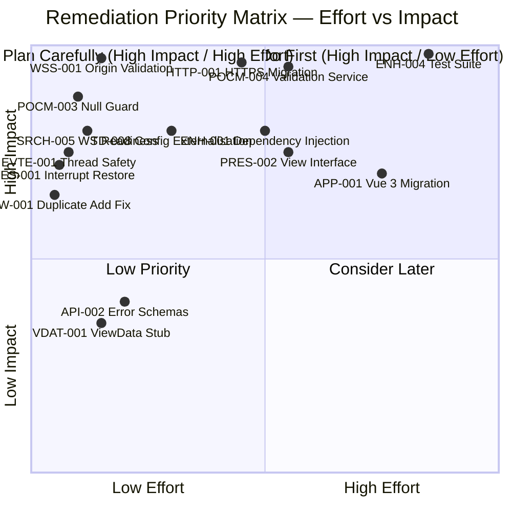

# Code Quality Assessment — Allegro PoC

> **Generated by**: code-assessor agent  
> **Repository**: Chris-Capgemini/test-custom-agents-2  
> **Assessment Date**: 2025-01-01  
> **Input Sources**: analysis_results.json · business_rules_extractor_analysis.json · ast-analysis.md  
> **Note**: Output saved to `analysis_output/` — the requested `output/` directory did not exist at assessment time.

---

## Table of Contents

1. [Executive Summary](#1-executive-summary)
2. [Overall Quality Scores](#2-overall-quality-scores)
3. [Architecture Quality Overview](#3-architecture-quality-overview)
4. [Issue Heat Map](#4-issue-heat-map)
5. [File-by-File Assessments](#5-file-by-file-assessments)
   - 5.1 [Main.java](#51-mainjava)
   - 5.2 [PocModel.java](#52-pocmodeljava)
   - 5.3 [EventEmitter.java](#53-eventemitterjava)
   - 5.4 [HttpBinService.java](#54-httpbinservicejava)
   - 5.5 [ViewData.java](#55-viewdatajava)
   - 5.6 [ValueModel.java](#56-valuemodeljava)
   - 5.7 [PocPresenter.java](#57-pocpresenterjava)
   - 5.8 [PocView.java](#58-pocviewjava)
   - 5.9 [WebsocketServer.js](#59-websocketserverjs)
   - 5.10 [App.vue](#510-appvue)
   - 5.11 [Search.vue](#511-searchvue)
   - 5.12 [api.yml](#512-apiyml)
6. [Security Vulnerability Summary](#6-security-vulnerability-summary)
7. [Enhancement Recommendations](#7-enhancement-recommendations)
8. [Technical Debt Register](#8-technical-debt-register)
9. [Remediation Roadmap](#9-remediation-roadmap)

---

## 1. Executive Summary

The Allegro PoC demonstrates a structurally coherent three-layer MVP architecture — Java Swing desktop client, Node.js WebSocket relay, and Vue.js web frontend — connected over WebSocket for real-time data synchronisation. The composition root wiring is clean, the EnumMap-based model is a sound design choice, and the custom EventEmitter implementation shows awareness of the Observer pattern.

However, as a proof-of-concept being evaluated for a production modernisation path, the codebase has **critical gaps** that must be addressed before any production progression:

| Category | Status |
|---|---|
| 🔴 **Security** | 8 vulnerabilities across all three layers (plaintext transport, open origins, no validation) |
| 🔴 **Test Coverage** | **0%** — not a single automated test exists in any component |
| 🔴 **Input Validation** | Absent at every layer — IBAN/BIC/dates/ZIPs all unvalidated |
| 🔴 **Mock Data in Production Code** | Real-format IBAN numbers hardcoded in Search.vue |
| 🟠 **Encapsulation** | MVP pattern structurally present but not enforced |
| 🟠 **Configuration** | All URLs, ports, and endpoints hardcoded |
| 🟡 **Dead Code** | ViewData.java is an empty stub; onmessage handler commented out |
| 🟡 **Vue 2 EOL** | Frontend framework reached End-of-Life December 2023 |

**Total Issues Found**: 47 across 12 files  
**Total Estimated Remediation**: ~62.5 hours (issues) + ~80 hours (technical debt) = **~142 hours**

---

## 2. Overall Quality Scores

### Project-Level Scores

| Dimension | Score | Rating |
|---|---|---|
| **Overall** | 3.8 / 10 | 🔴 Poor |
| **Code Complexity** | 4 / 10 | 🟠 Moderate |
| **Logic Complexity** | 5 / 10 | 🟡 Acceptable |
| **Maintainability** | 3 / 10 | 🔴 Poor |
| **Testability** | 1 / 10 | 🔴 Critical |
| **Security** | 2 / 10 | 🔴 Critical |
| **Readability** | 5 / 10 | 🟡 Acceptable |

### Per-File Quality Scores



---

## 3. Architecture Quality Overview



---

## 4. Issue Heat Map

### Issue Distribution by Severity and File



### Issue Count by Criticality



---

## 5. File-by-File Assessments

---

### 5.1 Main.java

**Score**: 5.0/10 | **Lines**: 23 | **Complexity**: 2/10 | **Logic**: 1/10

#### Issues

##### ⚠️ MAIN-001 — CountDownLatch as Permanent Keep-Alive (Criticality: 3/5)
- **Line**: 14
- **Type**: Code Structure
- **Message**: `CountDownLatch(1)` used as a permanent JVM keep-alive that never counts down, blocking the main thread indefinitely.
- **Solution**: Remove the latch entirely. `JFrame.setDefaultCloseOperation(JFrame.EXIT_ON_CLOSE)` (already set in PocView) keeps the JVM alive as long as a frame is visible — the latch is redundant and actively misleading. If explicit lifecycle management is required, use `Runtime.getRuntime().addShutdownHook(new Thread(() -> cleanup()))` instead.
- **Estimated Effort**: 0.5 hours

##### ⚠️ MAIN-002 — Unnamed Variable for PocPresenter (Criticality: 2/5)
- **Line**: 18
- **Type**: Code Structure
- **Message**: `var _ = new PocPresenter(...)` — presenter reference discarded using Java 22's unnamed variable syntax.
- **Solution**: Use a named variable: `var presenter = new PocPresenter(pocView, pocModel, eventEmitter)`. While syntactically valid, discarding the presenter reference is semantically misleading and prevents lifecycle management. If the presenter is truly fire-and-forget, document this explicitly with a comment.
- **Estimated Effort**: 0.5 hours

##### ⚠️ MAIN-003 — Swing Components Created Off EDT (Criticality: 3/5)
- **Line**: 12
- **Type**: Code Structure
- **Message**: MVP components instantiated on the main thread, not the Swing Event Dispatch Thread — violates Swing thread safety rules.
- **Solution**: Wrap all component instantiation in `SwingUtilities.invokeLater(() -> { var pocView = new PocView(); var eventEmitter = new EventEmitter(); var pocModel = new PocModel(eventEmitter); new PocPresenter(pocView, pocModel, eventEmitter); })`. This ensures all Swing objects are constructed and rendered on the EDT.
- **Estimated Effort**: 0.5 hours

---

### 5.2 PocModel.java

**Score**: 3.5/10 | **Lines**: 49 | **Complexity**: 4/10 | **Logic**: 5/10

#### Issues

##### 🔴 POCM-001 — Public Model Field (Criticality: 4/5)
- **Line**: 12
- **Type**: Maintainability
- **Message**: `public Map<ModelProperties, ValueModel<?>> model` fully exposes the internal EnumMap to any class in the codebase.
- **Solution**: Change to `private` and expose typed accessors:
  ```java
  public ValueModel<?> get(ModelProperties key) { return model.get(key); }
  public <T> void set(ModelProperties key, T value) {
      ((ValueModel<T>) model.get(key)).setField(value);
  }
  ```
  Update PocPresenter to use `model.get(prop)` and `model.set(prop, value)` instead of direct field access.
- **Estimated Effort**: 2 hours

##### 🔴 POCM-002 — Hard-Coded Service Dependency (Criticality: 3/5)
- **Line**: 13
- **Type**: Maintainability
- **Message**: `private HttpBinService httpBinService = new HttpBinService()` — untestable hardcoded instantiation.
- **Solution**: Define `DataSubmissionService` interface and inject via constructor. See ENH-001.
- **Estimated Effort**: 1 hour

##### 🔴 POCM-003 — NullPointerException on Empty Fields (Criticality: 5/5) 🚨
- **Line**: 39
- **Type**: Performance / Reliability
- **Message**: `model.get(val).getField().toString()` — all 13 fields initialise to `null`. Any empty field causes `NullPointerException` at runtime, crashing the submission silently.
- **Solution**:
  ```java
  data.put(val.toString(),
      Optional.ofNullable(model.get(val).getField())
              .map(Object::toString)
              .orElse(""));
  ```
  Additionally, validate required fields before reaching this line.
- **Estimated Effort**: 1 hour

##### 🔴 POCM-004 — Zero Input Validation (Criticality: 4/5)
- **Line**: 33
- **Type**: Business Logic
- **Message**: IBAN, BIC, DATE_OF_BIRTH, ZIP, and VALID_FROM fields accepted and submitted without any format validation.
- **Solution**: Introduce a `ValidationService` (see ENH-002) called in `action()` before data serialisation. Return a `ValidationResult` with per-field errors for display in the UI.
- **Estimated Effort**: 4 hours

##### ⚠️ POCM-005 — Single Responsibility Violation (Criticality: 3/5)
- **Line**: 33
- **Type**: Code Structure
- **Message**: PocModel is both a domain data store and an HTTP submission orchestrator — violates SRP.
- **Solution**: Extract HTTP submission into a dedicated `SubmissionService` class. PocModel holds domain state only.
- **Estimated Effort**: 2 hours

---

### 5.3 EventEmitter.java

**Score**: 4.5/10 | **Lines**: 21 | **Complexity**: 2/10 | **Logic**: 2/10

#### Issues

##### 🔴 EVTE-001 — Non-Thread-Safe Listener List (Criticality: 4/5)
- **Line**: 8
- **Type**: Performance
- **Message**: `new ArrayList<>()` is not thread-safe — EventEmitter is subscribed on the EDT and emitted from a background HTTP thread.
- **Solution**:
  ```java
  private final List<EventListener> listeners = new CopyOnWriteArrayList<>();
  ```
  `CopyOnWriteArrayList` provides thread-safe iteration without locking for this read-heavy pattern.
- **Estimated Effort**: 0.5 hours

##### ⚠️ EVTE-002 — No Unsubscribe (Criticality: 2/5)
- **Line**: 11
- **Type**: Maintainability
- **Message**: Listeners can never be detached — potential memory leak if presenters are created/destroyed.
- **Solution**: Add `public void unsubscribe(EventListener listener) { listeners.remove(listener); }` and call it in presenter cleanup.
- **Estimated Effort**: 0.5 hours

##### ⚠️ EVTE-003 — Interface Naming Collision (Criticality: 2/5)
- **Line**: 1
- **Type**: Naming Conventions
- **Message**: `EventListener` shadows `java.awt.event.EventListener` — common import in Swing code.
- **Solution**: Rename to `ModelEventListener` or `SubmissionResultHandler`.
- **Estimated Effort**: 0.5 hours

##### ⚠️ EVTE-004 — No Error Isolation in emit() (Criticality: 3/5)
- **Line**: 16
- **Type**: Error Handling
- **Message**: If any listener throws, subsequent listeners are skipped.
- **Solution**:
  ```java
  for (EventListener listener : listeners) {
      try { listener.onEvent(eventData); }
      catch (Exception e) { LOGGER.log(Level.SEVERE, "Listener exception", e); }
  }
  ```
- **Estimated Effort**: 0.5 hours

---

### 5.4 HttpBinService.java

**Score**: 2.5/10 | **Lines**: 38 | **Complexity**: 4/10 | **Logic**: 3/10

> ⚠️ **Highest Priority File** — Contains 2 blocker-level and 4 severe/normal issues

#### Issues

##### 🔴 HTTP-001 — Plaintext HTTP Transmits Financial Data (Criticality: 5/5) 🚨
- **Line**: 11
- **Type**: Security
- **Message**: `http://localhost:8080` — IBAN, BIC, and personal identity data transmitted in cleartext. Violates GDPR and PCI-DSS requirements.
- **Solution**: Switch to `https://` and migrate to Java 11 `HttpClient` (TLS by default). In development, configure a local HTTPS proxy or use mkcert for self-signed certificates.
- **Estimated Effort**: 2 hours

##### 🔴 HTTP-002 — Hardcoded Backend URL (Criticality: 4/5)
- **Line**: 11
- **Type**: Maintainability
- **Message**: `URL = "http://localhost:8080"` — cannot deploy to any environment without source modification.
- **Solution**: `System.getenv("ALLEGRO_BACKEND_URL")` with fallback. Inject into constructor.
- **Estimated Effort**: 1 hour

##### 🔴 HTTP-003 — Resource Leak on Exception (Criticality: 5/5) 🚨
- **Line**: 29
- **Type**: Error Handling
- **Message**: `Scanner` and `HttpURLConnection` not closed when an exception occurs. `disconnect()` only reachable on success path.
- **Solution**: Migrate to Java 11 `HttpClient` which handles resource management automatically, or wrap in try-with-resources:
  ```java
  try (var scanner = new Scanner(connection.getInputStream()).useDelimiter("\\A")) {
      return scanner.hasNext() ? scanner.next() : "";
  } finally {
      connection.disconnect();
  }
  ```
- **Estimated Effort**: 2 hours

##### 🔴 HTTP-004 — HTTP Error Responses Not Handled (Criticality: 4/5)
- **Line**: 28
- **Type**: Error Handling
- **Message**: `getInputStream()` on a 4xx/5xx response throws `IOException` — HTTP errors are silently turned into NPE cascades in callers.
- **Solution**:
  ```java
  var responseCode = connection.getResponseCode();
  var stream = responseCode >= 400 ? connection.getErrorStream()
                                   : connection.getInputStream();
  return new Scanner(stream).useDelimiter("\\A").next();
  ```
- **Estimated Effort**: 1 hour

##### ⚠️ HTTP-005 — No Connection Timeout (Criticality: 3/5)
- **Line**: 15
- **Type**: Performance
- **Message**: No timeout set — if the backend is unreachable, the HTTP call blocks the Swing EDT indefinitely, freezing the UI.
- **Solution**: `connection.setConnectTimeout(5000); connection.setReadTimeout(10000);` and execute on a `SwingWorker` background thread.
- **Estimated Effort**: 1 hour

##### ⚠️ HTTP-006 — Debug println for Sensitive Data (Criticality: 2/5)
- **Line**: 30
- **Type**: Maintainability
- **Message**: `System.out.println("Response body: " + responseBody)` — full HTTP response body (containing IBAN/BIC) printed to stdout.
- **Solution**: Replace with `LOGGER.fine("Response received: " + responseCode)`. Never log response body at INFO or higher in production.
- **Estimated Effort**: 0.5 hours

---

### 5.5 ViewData.java

**Score**: 1.0/10 | **Lines**: 5 | **Complexity**: 1/10 | **Logic**: 1/10

#### Issues

##### ⚠️ VDAT-001 — Empty Stub Class (Criticality: 3/5)
- **Line**: 3
- **Type**: Code Structure
- **Message**: Completely empty class body — zero fields, methods, or implemented purpose. Dead code.
- **Solution**: Either implement as a typed DTO record:
  ```java
  public record ViewData(
      String firstName, String lastName, String iban,
      String bic, String dateOfBirth, String zip,
      String ort, String street, String validFrom, String gender
  ) {}
  ```
  Or delete entirely. The ViewData class was presumably intended as the typed payload for WebSocket transmission, replacing the raw JSON string approach.
- **Estimated Effort**: 1 hour

---

### 5.6 ValueModel.java

**Score**: 6.0/10 | **Lines**: 18 | **Complexity**: 1/10 | **Logic**: 1/10

#### Issues

##### 🔵 VALM-001 — No Change Notification (Criticality: 2/5)
- **Line**: 1
- **Type**: Maintainability
- **Message**: Generic wrapper with no observer support — misses the opportunity for bidirectional binding in the MVP architecture.
- **Solution**: Add `PropertyChangeSupport` to enable reactive binding:
  ```java
  private final PropertyChangeSupport pcs = new PropertyChangeSupport(this);
  public void addPropertyChangeListener(PropertyChangeListener l) { pcs.addPropertyChangeListener(l); }
  public void setField(T field) {
      T old = this.field; this.field = field; pcs.firePropertyChange("field", old, field);
  }
  ```
- **Estimated Effort**: 1 hour

---

### 5.7 PocPresenter.java

**Score**: 3.5/10 | **Lines**: 113 | **Complexity**: 6/10 | **Logic**: 5/10

#### Issues

##### 🔴 PRES-001 — InterruptedException Swallowed Without Restore (Criticality: 4/5)
- **Line**: 45
- **Type**: Error Handling
- **Message**: `catch (InterruptedException e) { throw new RuntimeException(e); }` — destroys the thread's interrupt status. Standard Java concurrency anti-pattern.
- **Solution**:
  ```java
  } catch (InterruptedException e) {
      Thread.currentThread().interrupt();  // ← REQUIRED
      throw new RuntimeException("Form submission was interrupted", e);
  }
  ```
  Better: use `SwingWorker<String, Void>` to execute `model.action()` on a background thread.
- **Estimated Effort**: 0.5 hours

##### ⚠️ PRES-002 — Direct View Field Access Breaks MVP (Criticality: 3/5)
- **Line**: 25
- **Type**: Code Structure
- **Message**: `view.textArea.setText(...)`, `view.firstName.setText(...)` etc. — presenter accesses protected Swing fields directly, bypassing any view abstraction.
- **Solution**: Define a `PocViewInterface`:
  ```java
  public interface PocViewInterface {
      void setResponseText(String text);
      void clearPersonFields();
      void addSubmitListener(ActionListener l);
      void addFieldListener(ModelProperties prop, DocumentListener l);
  }
  ```
  PocView implements it; PocPresenter holds `PocViewInterface` reference.
- **Estimated Effort**: 3 hours

##### ⚠️ PRES-003 — Double-Indirection Model Access (Criticality: 3/5)
- **Line**: 54
- **Type**: Maintainability
- **Message**: `PocPresenter.this.model.model.get(prop)` — double field access chain violates encapsulation of PocModel.
- **Solution**: After implementing POCM-001, replace with `model.get(prop)`.
- **Estimated Effort**: 1 hour

##### ⚠️ PRES-004 — Debug Println With Sensitive Data (Criticality: 2/5)
- **Line**: 62
- **Type**: Maintainability
- **Message**: `System.out.println("I am in insert update. " + content)` — entire field content (including IBAN) logged to stdout.
- **Solution**: Replace with `LOGGER.fine("Field " + prop + " updated")` — never log field values at INFO+ level.
- **Estimated Effort**: 0.5 hours

##### ⚠️ PRES-005 — DRY Violation in DocumentListener (Criticality: 3/5)
- **Line**: 57
- **Type**: Maintainability
- **Message**: `insertUpdate` and `removeUpdate` contain identical logic — fetch full document text, update model, log.
- **Solution**: Extract to shared helper:
  ```java
  private void syncFieldToModel(DocumentEvent e, ValueModel<String> target) {
      try { target.setField(e.getDocument().getText(0, e.getDocument().getLength())); }
      catch (BadLocationException ex) { LOGGER.log(Level.WARNING, "Document sync failed", ex); }
  }
  ```
- **Estimated Effort**: 0.5 hours

##### ⚠️ PRES-006 — Hardcoded Gender Default After Reset (Criticality: 3/5)
- **Line**: 36
- **Type**: Business Logic
- **Message**: `view.female.setSelected(true)` unconditionally hardcoded in the post-submission reset — undocumented business rule.
- **Solution**: Extract into a named constant `DEFAULT_GENDER = ModelProperties.FEMALE` and document the business rule. If the server echoes back submitted values, use those to drive the reset state.
- **Estimated Effort**: 0.5 hours

---

### 5.8 PocView.java

**Score**: 3.5/10 | **Lines**: 203 | **Complexity**: 5/10 | **Logic**: 2/10

#### Issues

##### 🔴 VIEW-001 — Duplicate Component Add (Bug) (Criticality: 4/5)
- **Line**: 188–189
- **Type**: Code Structure
- **Message**: `panel.add(textArea)` on line 188 followed by `panel.add(textArea, c)` on line 189 — textArea added twice. In Swing, the first unconstrained add is silently undone by the second, but the orphaned call is a confirmed bug.
- **Solution**: Remove line 188 (`panel.add(textArea)`) and keep only the constrained add on line 189.
- **Estimated Effort**: 0.5 hours

##### ⚠️ VIEW-002 — All Fields Protected (Criticality: 3/5)
- **Line**: 9–25
- **Type**: Maintainability
- **Message**: All 12 Swing component fields are `protected`, fully exposing the component tree to any class in the `presentation` package.
- **Solution**: Change all to `private` and expose behaviour through `PocViewInterface` (see PRES-002).
- **Estimated Effort**: 2 hours

##### 🔵 VIEW-003 — Cryptic 'RT' Label (Criticality: 2/5)
- **Line**: 179
- **Type**: Readability
- **Message**: `JLabel("RT")` — unexplained abbreviation with no comment. Label is visible to end users.
- **Solution**: Replace with `new JLabel("Rückmeldung")` or add `/* Rückmeldungstext */` comment.
- **Estimated Effort**: 0.5 hours

##### 🔵 VIEW-004 — Wrong GridBagConstraints Constant (Criticality: 2/5)
- **Line**: 83
- **Type**: Code Structure
- **Message**: `c.fill = GridBagConstraints.CENTER` — `CENTER` is not a valid `fill` value. By coincidence `CENTER==0==NONE` today, but this documents an incorrect understanding of the API.
- **Solution**: Replace with `c.fill = GridBagConstraints.NONE`.
- **Estimated Effort**: 0.5 hours

##### ⚠️ VIEW-005 — 170-Line initUI() Monolith (Criticality: 3/5)
- **Line**: 31
- **Type**: Maintainability
- **Message**: Entire form built imperatively in one method. Difficult to navigate, extend, or test any part of the layout in isolation.
- **Solution**: Decompose into: `buildPersonRow(GridBagConstraints c)`, `buildGenderRow(GridBagConstraints c)`, `buildAddressRow(GridBagConstraints c)`, `buildPaymentRow(GridBagConstraints c)`, `buildResultPanel(GridBagConstraints c)`. Each method is ~20-30 lines and self-contained.
- **Estimated Effort**: 2 hours

---

### 5.9 WebsocketServer.js

**Score**: 2.5/10 | **Lines**: 67 | **Complexity**: 4/10 | **Logic**: 3/10

> ⚠️ **Highest Priority File** — 4 security vulnerabilities, 2 severe issues

#### Issues

##### 🔴 WSS-001 — Open WebSocket Origin (Criticality: 5/5) 🚨
- **Line**: 32
- **Type**: Security
- **Message**: `request.accept(null, request.origin)` — accepts WebSocket connections from **any origin**. Any website can establish a connection and receive all IBAN/BIC data broadcast to all clients.
- **Solution**:
  ```javascript
  const ALLOWED = (process.env.ALLOWED_ORIGINS || '').split(',');
  if (!ALLOWED.includes(request.origin)) {
      request.reject(403, 'Origin not allowed');
      console.warn(`Rejected: ${request.origin}`);
      return;
  }
  ```
- **Estimated Effort**: 1 hour

##### 🔴 WSS-002 — Plaintext WebSocket (Criticality: 4/5)
- **Line**: 10
- **Type**: Security
- **Message**: `ws://` (plaintext) used — IBAN, BIC, and personal data transmitted unencrypted over the WebSocket relay.
- **Solution**: Replace `http.createServer()` with `https.createServer({ cert, key }, handler)` to enable `wss://`. Update Vue client URL to `wss://`.
- **Estimated Effort**: 2 hours

##### 🔴 WSS-003 — No Message Size Validation (Criticality: 4/5)
- **Line**: 48
- **Type**: Security
- **Message**: Any connected client can send an arbitrarily large payload, enabling memory exhaustion DoS attacks.
- **Solution**:
  ```javascript
  if (Buffer.byteLength(message.utf8Data) > 65536) {
      console.warn('Oversized message rejected');
      connection.close();
      return;
  }
  try { JSON.parse(message.utf8Data); } catch { return; }
  ```
- **Estimated Effort**: 1 hour

##### 🔴 WSS-004 — Broadcast to Stale Connections (Criticality: 4/5)
- **Line**: 55
- **Type**: Error Handling
- **Message**: Broadcast iterates all clients without checking connection state — sending to a closed connection throws and crashes the message handler for that message cycle.
- **Solution**:
  ```javascript
  clients.filter(c => c.connected).forEach(client => {
      try { client.sendUTF(json); }
      catch (err) { console.error('Send failed:', err.message); }
  });
  ```
- **Estimated Effort**: 1 hour

##### ⚠️ WSS-005 — Memory Leak: messages Array Never Consumed (Criticality: 3/5)
- **Line**: 6
- **Type**: Performance
- **Message**: `var messages = []` grows indefinitely — never read, never pruned.
- **Solution**: Remove the `messages` array. It serves no purpose in a pure relay server.
- **Estimated Effort**: 0.5 hours

##### ⚠️ WSS-006 — Legacy var and Flat Structure (Criticality: 3/5)
- **Line**: 1
- **Type**: Code Structure
- **Message**: Entire server as a flat script using `var` throughout — no modules, no error boundaries, no configuration separation.
- **Solution**: Refactor to use `const`/`let` throughout and extract into a class with `start()`, `stop()`, `broadcast()` methods. Load all configuration from environment variables.
- **Estimated Effort**: 2 hours

---

### 5.10 App.vue

**Score**: 5.5/10 | **Lines**: 47 | **Complexity**: 1/10 | **Logic**: 1/10

#### Issues

##### 🔴 APP-001 — Vue 2 End-of-Life (Criticality: 4/5)
- **Line**: N/A (package.json `vue: ^2.6.10`)
- **Type**: Maintainability
- **Message**: Vue 2 reached EOL on **31 December 2023**. No security patches will be released for any future vulnerabilities.
- **Solution**: Migrate to Vue 3.x + Vite. See ENH-006 for the migration approach. Estimated effort: 2-4 developer days for this project size.
- **Estimated Effort**: 8 hours

##### ⚪ APP-002 — Empty Logo Span (Criticality: 1/5)
- **Line**: 4
- **Type**: Readability
- **Message**: `<span id="logo">` has no content or background image — renders as invisible empty space.
- **Solution**: Add logo asset reference or remove the span. Document with a TODO comment if the asset is pending.
- **Estimated Effort**: 0.5 hours

---

### 5.11 Search.vue

**Score**: 2.5/10 | **Lines**: 177 | **Complexity**: 6/10 | **Logic**: 6/10

> ⚠️ **Highest Priority File** — hardcoded financial data, broken WebSocket receive, no error handling

#### Issues

##### 🔴 SRCH-001 — Hardcoded Mock IBAN Data in Production Source (Criticality: 5/5) 🚨
- **Line**: 104
- **Type**: Business Logic / Security
- **Message**: `search_space` array with 5 persons and 12 IBAN/BIC values hardcoded directly in the production component. System cannot function with real data; financial identifiers committed to version control.
- **Solution**: Replace with API call to `process.env.VUE_APP_API_BASE_URL + '/persons/search'`. Move mock data to `src/__mocks__/search_space.json` for test use only. Remove real-format IBANs from VCS.
- **Estimated Effort**: 3 hours

##### 🔴 SRCH-002 — Hardcoded Plaintext WebSocket URL (Criticality: 4/5)
- **Line**: 132
- **Type**: Security
- **Message**: `new WebSocket("ws://localhost:1337/")` — plaintext protocol, hardcoded localhost, not configurable.
- **Solution**: `const wsUrl = process.env.VUE_APP_WS_URL || 'ws://localhost:1337/'; this.socket = new WebSocket(wsUrl);`. In production, `VUE_APP_WS_URL` must use `wss://`.
- **Estimated Effort**: 0.5 hours

##### 🔴 SRCH-003 — No WebSocket Error Handling (Criticality: 4/5)
- **Line**: 131
- **Type**: Error Handling
- **Message**: WebSocket `onerror` and `onclose` are not handled — network failures are silently ignored, leaving the user with a broken UI and no feedback.
- **Solution**:
  ```javascript
  this.socket.onerror = () => { this.status = 'error'; };
  this.socket.onclose = (e) => {
      this.status = 'disconnected';
      if (!e.wasClean) setTimeout(() => this.connect(), 3000);
  };
  ```
- **Estimated Effort**: 2 hours

##### ⚠️ SRCH-004 — onmessage Handler Commented Out (Criticality: 3/5)
- **Line**: 135
- **Type**: Error Handling
- **Message**: `//this.socket.onmessage = ({data}) => {}` — the Vue client cannot receive **any** data from the server. The inbound communication channel is completely broken.
- **Solution**: Implement the handler:
  ```javascript
  this.socket.onmessage = ({ data }) => {
      try {
          const payload = JSON.parse(data);
          if (payload.target === 'textfield') this.handleFormData(payload.content);
      } catch (e) { console.error('Parse error:', e); }
  };
  ```
- **Estimated Effort**: 2 hours

##### 🔴 SRCH-005 — sendMessage Without Readiness Check (Criticality: 4/5)
- **Line**: 158
- **Type**: Error Handling
- **Message**: `sendMessage()` called in the watcher and on button click without checking `socket.readyState` — throws an unhandled exception if the WebSocket is not yet open or has closed.
- **Solution**:
  ```javascript
  sendMessage(e, target) {
      if (!this.socket || this.socket.readyState !== WebSocket.OPEN) {
          console.warn('WebSocket not connected — message dropped');
          return;
      }
      this.socket.send(JSON.stringify({ target, content: e }));
  }
  ```
- **Estimated Effort**: 1 hour

##### 🔵 SRCH-006 — Type Mismatch on zahlungsempfaenger_selected (Criticality: 2/5)
- **Line**: 103
- **Type**: Code Structure
- **Message**: `zahlungsempfaenger_selected: ""` initialised as empty string but compared and used as an object — type mismatch causes unexpected falsy comparisons.
- **Solution**: Initialise as `null`. Guard usages with `zahlungsempfaenger_selected?.iban` optional chaining.
- **Estimated Effort**: 0.5 hours

##### 🔵 SRCH-007 — Linear Search Over Static Array (Criticality: 2/5)
- **Line**: 145
- **Type**: Performance
- **Message**: `searchPerson()` uses a manual for-loop — will not scale to production dataset sizes.
- **Solution**: Replace with `Array.filter()` + extracted `matchesCriteria()` method. When backed by an API, implement server-side search with 300ms input debounce.
- **Estimated Effort**: 1 hour

##### ⚪ SRCH-008 — Deprecated HTML `cellpadding` Attribute (Criticality: 1/5)
- **Line**: 33
- **Type**: Readability
- **Message**: `<table cellpadding=4>` — deprecated HTML4 attribute, invalid in HTML5.
- **Solution**: Remove attribute; add `td { padding: 4px; }` to scoped styles.
- **Estimated Effort**: 0.5 hours

---

### 5.12 api.yml

**Score**: 3.5/10 | **Lines**: 97 | **Complexity**: 2/10 | **Logic**: 2/10

#### Issues

##### ⚠️ API-001 — Boolean Fields Typed as String (Criticality: 3/5)
- **Line**: 45
- **Type**: Business Logic
- **Message**: `MALE`, `FEMALE`, `DIVERSE` declared as `type: string` — contradicts the Java model's `Boolean` ValueModel.
- **Solution**: Prefer a single `gender` field with `type: string, enum: [MALE, FEMALE, DIVERSE]` over three boolean flags. This is semantically correct and prevents invalid multi-gender states.
- **Estimated Effort**: 1 hour

##### ⚠️ API-002 — No Error Response Schemas (Criticality: 3/5)
- **Line**: 76
- **Type**: Documentation
- **Message**: No `400`, `422`, or `500` responses defined — incomplete API contract.
- **Solution**: Add error response schemas with `code`, `message`, and `fieldErrors` properties for 400/422/500 status codes.
- **Estimated Effort**: 1 hour

##### 🔵 API-003 — No Field Validation Constraints (Criticality: 2/5)
- **Line**: 28
- **Type**: Documentation
- **Message**: No `format`, `pattern`, `minLength`, or `maxLength` constraints on any field — business validation rules undocumented in spec.
- **Solution**: Add `format: date` to date fields; IBAN/BIC/ZIP patterns as regex constraints. Enables code generation of validators from the spec.
- **Estimated Effort**: 2 hours

---

## 6. Security Vulnerability Summary



| ID | File | Issue | Criticality | GDPR | PCI-DSS |
|---|---|---|---|---|---|
| HTTP-001 | HttpBinService.java | Plaintext HTTP for financial data | 5 🔴 | ⚠️ | ⚠️ |
| WSS-001 | WebsocketServer.js | All origins accepted | 5 🔴 | — | ⚠️ |
| SRCH-001 | Search.vue | IBAN numbers in source code | 5 🔴 | ⚠️ | ⚠️ |
| WSS-002 | WebsocketServer.js | Plaintext ws:// relay | 4 🟠 | ⚠️ | ⚠️ |
| WSS-003 | WebsocketServer.js | No message size limit (DoS) | 4 🟠 | — | — |
| SRCH-002 | Search.vue | Hardcoded ws:// URL | 4 🟠 | ⚠️ | — |
| POCM-004 | PocModel.java | Zero input validation | 4 🟠 | ⚠️ | ⚠️ |
| HTTP-006 | HttpBinService.java | Financial data in stdout | 2 🔵 | ⚠️ | — |

---

## 7. Enhancement Recommendations

### ENH-001 — Introduce Dependency Injection Throughout Java Layer
**Priority**: 5/5 — Critical | **Estimated Effort**: 4 hours

Refactor the Java layer to use constructor-based dependency injection. Currently `HttpBinService` is hardcoded inside `PocModel`, making the application impossible to unit test and configuration-inflexible. Define a `DataSubmissionService` interface and wire the dependency graph in `Main.java`.

```java
// Define interface
public interface DataSubmissionService {
    String post(Map<String, String> data) throws IOException, InterruptedException;
}

// HttpBinService implements it with injected URL
public class HttpBinService implements DataSubmissionService {
    private final String backendUrl;
    public HttpBinService(String backendUrl) { this.backendUrl = backendUrl; }
    @Override public String post(Map<String, String> data) throws IOException { ... }
}

// PocModel accepts interface
public PocModel(EventEmitter emitter, DataSubmissionService service) { ... }

// Main.java wires the graph
var service = new HttpBinService(System.getenv("BACKEND_URL"));
var pocModel = new PocModel(eventEmitter, service);
```

---

### ENH-002 — Implement Comprehensive Input Validation Layer
**Priority**: 5/5 — Critical | **Estimated Effort**: 6 hours

Add a `ValidationService` enforcing field-level business rules: IBAN checksum (ISO 13616), BIC format (ISO 9362), date patterns, ZIP validation, and required field presence. Returns structured `ValidationResult` with per-field errors.

```java
public class ValidationService {
    private static final Pattern IBAN = Pattern.compile("^[A-Z]{2}[0-9]{2}[A-Z0-9]{1,30}$");
    private static final Pattern BIC  = Pattern.compile("^[A-Z]{6}[A-Z0-9]{2}([A-Z0-9]{3})?$");
    private static final Pattern ZIP  = Pattern.compile("^[0-9]{5}$");
    private static final Pattern DATE = Pattern.compile("^[0-9]{4}-[0-9]{2}-[0-9]{2}$");

    public ValidationResult validate(Map<ModelProperties, ValueModel<?>> model) {
        var errors = new ArrayList<ValidationError>();
        checkRequired(model, FIRST_NAME, "Vorname", errors);
        checkRequired(model, LAST_NAME, "Name", errors);
        checkPattern(model, IBAN_PROP, "IBAN", IBAN, errors);
        checkPattern(model, BIC_PROP, "BIC", BIC, errors);
        checkPattern(model, ZIP_PROP, "PLZ", ZIP, errors);
        return new ValidationResult(errors);
    }
}
```

---

### ENH-003 — Migrate to Java 11+ HttpClient with Async EDT-Safe Execution
**Priority**: 4/5 — High | **Estimated Effort**: 4 hours

Replace `HttpURLConnection` with Java 11 `HttpClient` + `CompletableFuture` + `SwingWorker`. Resolves HTTP-001 through HTTP-005 in a single refactoring. Prevents EDT freezes, provides TLS by default, and eliminates resource leaks.

```java
public CompletableFuture<String> postAsync(Map<String, String> data) {
    var request = HttpRequest.newBuilder()
        .uri(URI.create(baseUrl + "/post"))
        .header("Content-Type", "application/json")
        .timeout(Duration.ofSeconds(10))
        .POST(HttpRequest.BodyPublishers.ofString(buildJson(data)))
        .build();
    return client.sendAsync(request, HttpResponse.BodyHandlers.ofString())
        .thenApply(r -> {
            if (r.statusCode() >= 400) throw new BackendException(r.statusCode(), r.body());
            return r.body();
        });
}
```

---

### ENH-004 — Add Automated Testing Suite Across All Three Layers
**Priority**: 5/5 — Critical | **Estimated Effort**: 24 hours

Zero tests currently exist. Introduce JUnit 5 + Mockito (Java), Jest + Vue Test Utils (Vue), Mocha/Jest (Node.js). Target ≥70% line coverage on all business logic classes. Add maven-surefire-plugin and JaCoCo to pom.xml.

```java
// Java — PocModel unit test
@ExtendWith(MockitoExtension.class)
class PocModelTest {
    @Mock DataSubmissionService mockService;
    @Mock EventEmitter mockEmitter;
    PocModel model;

    @BeforeEach void setup() { model = new PocModel(mockEmitter, mockService); }

    @Test void action_emitsResponse_whenServiceSucceeds() throws Exception {
        model.set(FIRST_NAME, "Hans"); model.set(LAST_NAME, "Mayer");
        when(mockService.post(any())).thenReturn("{\"status\":\"ok\"}");
        model.action();
        verify(mockEmitter).emit("{\"status\":\"ok\"}");
    }
}
```

```javascript
// Vue — Search component test
describe('searchPerson()', () => {
    it('filters by last name case-insensitively', async () => {
        const wrapper = mount(Search);
        await wrapper.setData({ formdata: { last: 'may' } });
        wrapper.vm.searchPerson();
        expect(wrapper.vm.search_result.length).toBe(1);
        expect(wrapper.vm.search_result[0].name).toBe('May');
    });
});
```

---

### ENH-005 — Harden WebSocket Relay with Origin Validation, Size Limits, and WSS
**Priority**: 5/5 — Critical | **Estimated Effort**: 5 hours

Address all six security issues in WebsocketServer.js in a single hardening pass: origin allowlisting, message size limits, JSON validation, WSS/TLS, and `const`/`let` modernisation.

```javascript
const ALLOWED_ORIGINS = process.env.ALLOWED_ORIGINS.split(',');
const MAX_BYTES = 64 * 1024;

wsServer.on('request', request => {
    if (!ALLOWED_ORIGINS.includes(request.origin)) {
        request.reject(403, 'Origin not permitted');
        return;
    }
    const conn = request.accept(null, request.origin);
    clients.push(conn);

    conn.on('message', msg => {
        if (msg.type !== 'utf8') return;
        if (Buffer.byteLength(msg.utf8Data) > MAX_BYTES) { conn.close(); return; }
        try { JSON.parse(msg.utf8Data); } catch { return; }
        clients.filter(c => c.connected)
               .forEach(c => { try { c.sendUTF(msg.utf8Data); } catch {} });
    });
});
```

---

### ENH-006 — Migrate Vue Frontend to Vue 3 + Vite + TypeScript
**Priority**: 4/5 — High | **Estimated Effort**: 8 hours

Vue 2 is EOL. Migrate to Vue 3.x + Vite + TypeScript Composition API. Adds type safety for form data, WebSocket payloads, and search results. Eliminates EOL risk.

```typescript
// Search.vue — Vue 3 Composition API
<script setup lang="ts">
import { ref, onMounted, onUnmounted, computed } from 'vue'

interface Person {
    knr: string; first: string; name: string; dob: string;
    zip: string; ort: string; street: string; hausnr: string;
    zahlungsempfaenger: Zahlungsempfaenger[];
}

const socket = ref<WebSocket | null>(null)
const connectionReady = computed(() =>
    socket.value?.readyState === WebSocket.OPEN
)

onMounted(() => {
    socket.value = new WebSocket(import.meta.env.VITE_WS_URL)
    socket.value.onopen = () => { status.value = 'connected' }
    socket.value.onerror = scheduleReconnect
    socket.value.onmessage = ({ data }) => handleMessage(JSON.parse(data))
})
onUnmounted(() => socket.value?.close())
</script>
```

---

## 8. Technical Debt Register



| ID | Type | Description | Impact | Hours |
|---|---|---|---|---|
| **TD-001** | Test Debt | Zero automated tests across all components | 🔴 HIGH | 24h |
| **TD-002** | Security Debt | Compound security failures (HTTP, WS, validation) | 🔴 HIGH | 12h |
| **TD-003** | Infrastructure Debt | Outdated dependencies (Tyrus 1.15, javax.json, Vue 2 EOL) | 🔴 HIGH | 8h |
| **TD-004** | Code Debt | Pervasive encapsulation violations in MVP layers | 🔴 HIGH | 6h |
| **TD-005** | Code Debt | ViewData.java is an empty unimplemented stub | 🟡 MEDIUM | 2h |
| **TD-006** | Code Debt | System.out.println for logging including sensitive data | 🟡 MEDIUM | 2h |
| **TD-007** | Design Debt | No view interface — presenter coupled to concrete view | 🔴 HIGH | 4h |
| **TD-008** | Design Debt | All URLs and ports hardcoded — zero configuration externalisation | 🔴 HIGH | 3h |
| **TD-009** | Code Debt | Mock IBAN data embedded in production Search.vue | 🔴 HIGH | 3h |
| **TD-010** | Documentation Debt | No Javadoc, JSDoc, or inline documentation anywhere | 🟡 MEDIUM | 4h |
| **TD-011** | Infrastructure Debt | No CI/CD, no Docker, no quality gate enforcement | 🟡 MEDIUM | 6h |
| **TD-012** | Test Debt | WebSocket onmessage handler commented out — broken receive | 🔴 HIGH | 2h |
| **TD-013** | Design Debt | EventEmitter uses non-thread-safe ArrayList across threads | 🟡 MEDIUM | 1h |
| **TD-014** | Infrastructure Debt | pom.xml missing test, coverage, and static analysis plugins | 🟡 MEDIUM | 3h |
| | | **TOTAL** | | **80h** |

---

## 9. Remediation Roadmap

```mermaid
gantt
    title Allegro PoC Remediation Roadmap
    dateFormat  YYYY-MM-DD
    axisFormat  Week %W

    section 🔴 Sprint 1 — Security Blockers (Week 1-2)
    HTTP-001: Fix plaintext HTTP → HTTPS          :crit, s1a, 2025-01-06, 2d
    WSS-001: WebSocket origin allowlisting          :crit, s1b, 2025-01-06, 1d
    WSS-002: Enable wss:// on relay server          :crit, s1c, 2025-01-07, 2d
    WSS-003: Message size limits + JSON validation  :crit, s1d, 2025-01-08, 1d
    SRCH-001: Remove hardcoded IBAN data            :crit, s1e, 2025-01-09, 1d
    HTTP-003: Fix resource leaks (migrate HttpClient):crit, s1f, 2025-01-10, 2d

    section 🟠 Sprint 2 — Critical Reliability (Week 3-4)
    POCM-003: Fix NPE on null fields                :active, s2a, 2025-01-13, 1d
    POCM-004: Implement ValidationService           :active, s2b, 2025-01-13, 4d
    PRES-001: Fix InterruptedException handling     :active, s2c, 2025-01-14, 0.5d
    WSS-004: Fix broadcast to stale connections     :active, s2d, 2025-01-14, 1d
    SRCH-003: Add WebSocket error handling          :active, s2e, 2025-01-15, 2d
    SRCH-004: Implement onmessage handler           :active, s2f, 2025-01-16, 2d
    SRCH-005: Add sendMessage readiness check       :active, s2g, 2025-01-17, 1d

    section 🟡 Sprint 3 — Architecture Improvements (Week 5-6)
    ENH-001: Constructor-based dependency injection :s3a, 2025-01-20, 2d
    POCM-001: Encapsulate model map                 :s3b, 2025-01-21, 1d
    PRES-002: Introduce PocViewInterface            :s3c, 2025-01-22, 3d
    VIEW-001: Fix duplicate textArea.add bug        :s3d, 2025-01-22, 0.5d
    EVTE-001: Thread-safe CopyOnWriteArrayList      :s3e, 2025-01-23, 0.5d
    MAIN-003: Swing EDT initialisation              :s3f, 2025-01-24, 0.5d

    section 🟢 Sprint 4 — Testing and Modernisation (Week 7-8)
    ENH-004: Unit test suite (JUnit 5 + Jest)       :s4a, 2025-01-27, 5d
    APP-001: Migrate to Vue 3 + Vite                :s4b, 2025-01-27, 4d
    TD-008: Externalise all configuration           :s4c, 2025-01-30, 1d
    TD-011: CI/CD pipeline configuration            :s4d, 2025-01-31, 2d

    section ⚪ Sprint 5 — Polish (Week 9)
    TD-010: Add Javadoc and JSDoc                   :s5a, 2025-02-03, 2d
    API-002: Add error response schemas             :s5b, 2025-02-03, 1d
    API-003: Add field validation constraints       :s5c, 2025-02-04, 2d
    VDAT-001: Implement ViewData as record or delete:s5d, 2025-02-05, 1d
```

### Priority Matrix



---

### Summary of All Issues

| ID | File | Issue | Criticality | Effort |
|---|---|---|---|---|
| POCM-003 | PocModel.java | NPE on null field values | 5 🔴 | 1h |
| HTTP-001 | HttpBinService.java | Plaintext HTTP for IBAN/BIC | 5 🔴 | 2h |
| HTTP-003 | HttpBinService.java | Resource leak on exception | 5 🔴 | 2h |
| WSS-001 | WebsocketServer.js | All origins accepted | 5 🔴 | 1h |
| SRCH-001 | Search.vue | Hardcoded IBAN mock data | 5 🔴 | 3h |
| MAIN-003 | Main.java | Swing EDT thread violation | 3 🟡 | 0.5h |
| POCM-001 | PocModel.java | Public model field | 4 🟠 | 2h |
| POCM-004 | PocModel.java | Zero input validation | 4 🟠 | 4h |
| EVTE-001 | EventEmitter.java | Non-thread-safe ArrayList | 4 🟠 | 0.5h |
| HTTP-002 | HttpBinService.java | Hardcoded backend URL | 4 🟠 | 1h |
| HTTP-004 | HttpBinService.java | HTTP errors not handled | 4 🟠 | 1h |
| PRES-001 | PocPresenter.java | InterruptedException swallowed | 4 🟠 | 0.5h |
| WSS-002 | WebsocketServer.js | Plaintext ws:// relay | 4 🟠 | 2h |
| WSS-003 | WebsocketServer.js | No message size limit | 4 🟠 | 1h |
| WSS-004 | WebsocketServer.js | Broadcast to stale connections | 4 🟠 | 1h |
| APP-001 | App.vue | Vue 2 EOL | 4 🟠 | 8h |
| SRCH-002 | Search.vue | Hardcoded ws:// URL | 4 🟠 | 0.5h |
| SRCH-003 | Search.vue | No WebSocket error handling | 4 🟠 | 2h |
| SRCH-005 | Search.vue | sendMessage without readiness check | 4 🟠 | 1h |
| VIEW-001 | PocView.java | Duplicate textArea.add (bug) | 4 🟠 | 0.5h |
| POCM-005 | PocModel.java | SRP violation | 3 🟡 | 2h |
| POCM-002 | PocModel.java | Hardcoded service dependency | 3 🟡 | 1h |
| EVTE-004 | EventEmitter.java | No error isolation in emit() | 3 🟡 | 0.5h |
| HTTP-005 | HttpBinService.java | No connection timeout | 3 🟡 | 1h |
| VDAT-001 | ViewData.java | Empty stub class | 3 🟡 | 1h |
| PRES-002 | PocPresenter.java | Direct view field access | 3 🟡 | 3h |
| PRES-003 | PocPresenter.java | Double-indirection model access | 3 🟡 | 1h |
| PRES-005 | PocPresenter.java | DRY violation in DocumentListener | 3 🟡 | 0.5h |
| PRES-006 | PocPresenter.java | Hardcoded gender default | 3 🟡 | 0.5h |
| VIEW-002 | PocView.java | All fields protected | 3 🟡 | 2h |
| VIEW-005 | PocView.java | 170-line monolith method | 3 🟡 | 2h |
| SRCH-004 | Search.vue | onmessage commented out | 3 🟡 | 2h |
| WSS-005 | WebsocketServer.js | messages[] memory leak | 3 🟡 | 0.5h |
| WSS-006 | WebsocketServer.js | Flat script, var declarations | 3 🟡 | 2h |
| API-001 | api.yml | Boolean fields typed as string | 3 🟡 | 1h |
| API-002 | api.yml | No error response schemas | 3 🟡 | 1h |
| MAIN-001 | Main.java | CountDownLatch never released | 3 🟡 | 0.5h |
| EVTE-002 | EventEmitter.java | No unsubscribe capability | 2 🔵 | 0.5h |
| EVTE-003 | EventEmitter.java | Interface naming collision | 2 🔵 | 0.5h |
| HTTP-006 | HttpBinService.java | Sensitive data in stdout | 2 🔵 | 0.5h |
| VALM-001 | ValueModel.java | No change notifications | 2 🔵 | 1h |
| PRES-004 | PocPresenter.java | Debug println with field values | 2 🔵 | 0.5h |
| VIEW-003 | PocView.java | Cryptic 'RT' label | 2 🔵 | 0.5h |
| VIEW-004 | PocView.java | Wrong GridBagConstraints constant | 2 🔵 | 0.5h |
| API-003 | api.yml | No field validation constraints | 2 🔵 | 2h |
| MAIN-002 | Main.java | Unnamed presenter variable | 2 🔵 | 0.5h |
| SRCH-006 | Search.vue | zahlungsempfaenger type mismatch | 2 🔵 | 0.5h |
| SRCH-007 | Search.vue | Linear search, no debounce | 2 🔵 | 1h |
| APP-002 | App.vue | Empty logo span | 1 ⚪ | 0.5h |
| SRCH-008 | Search.vue | Deprecated cellpadding attribute | 1 ⚪ | 0.5h |
| | | **TOTAL ESTIMATED EFFORT** | | **62.5h** |

---

*Assessment produced by code-assessor agent — Allegro PoC · 2025-01-01*  
*Machine-readable data: `analysis_output/code-assessor-assessment.json`*
