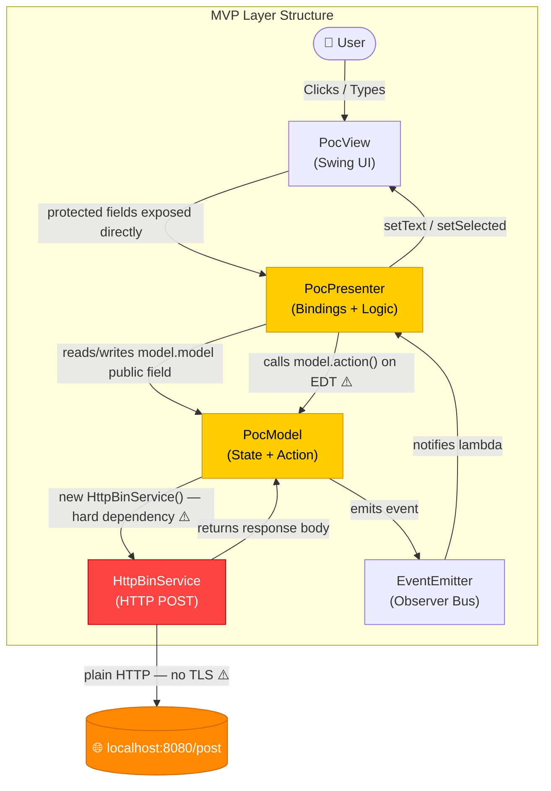
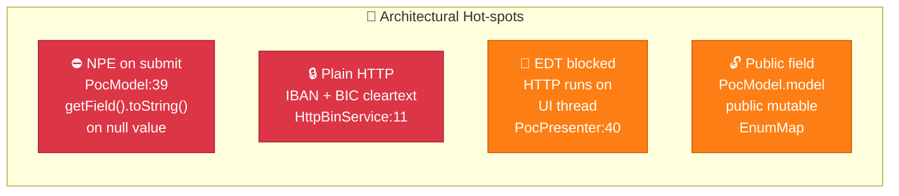
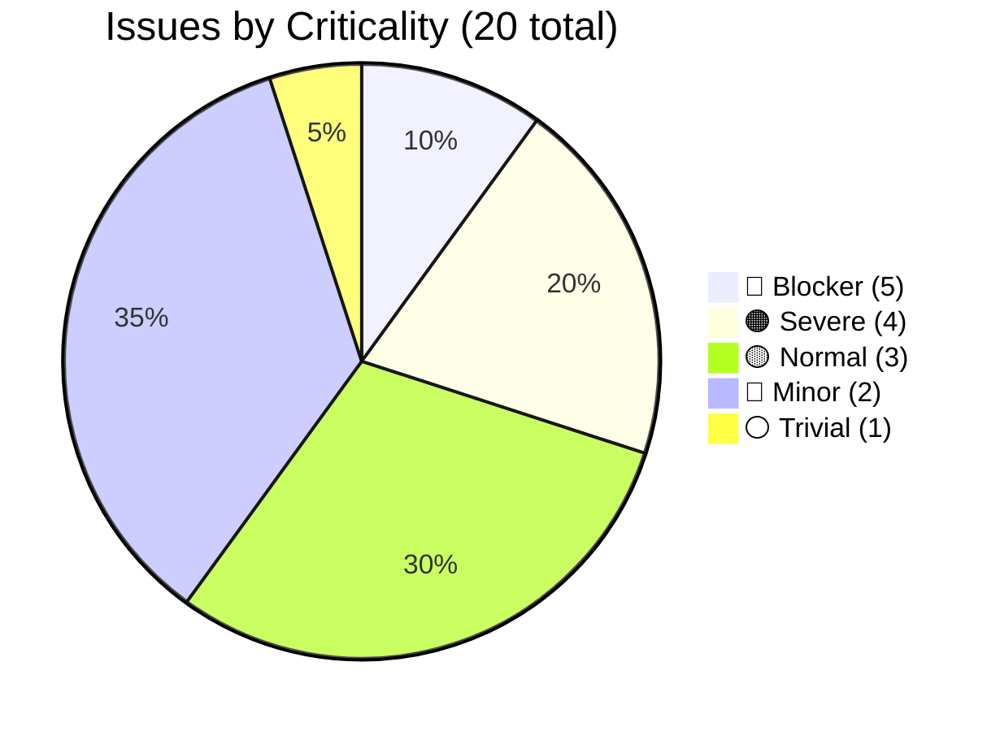
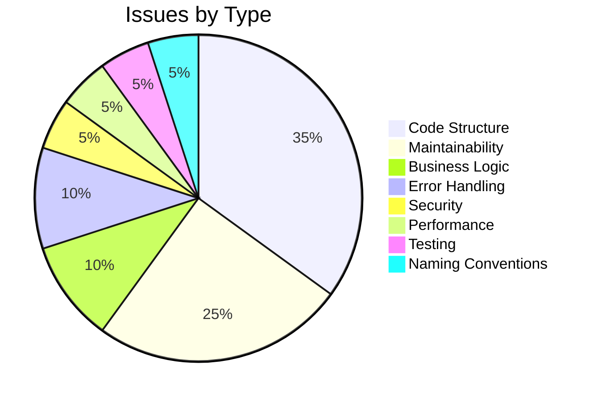
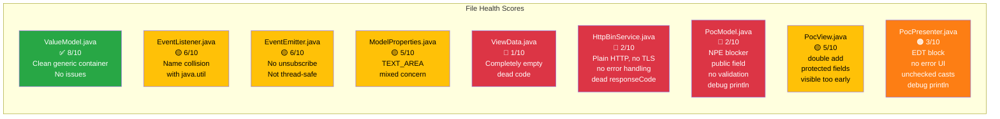

# Code Quality Assessment — Allegro Java Swing MVP

> **Assessment Date**: 2025-07-14  
> **Assessor**: code-assessor  
> **Language**: Java 22  
> **Pattern**: Model-View-Presenter (MVP)  
> **Source Root**: `swing/src/main/java/com/poc`  
> **Total Files**: 9 &nbsp;|&nbsp; **Total LOC**: ~445  
> **Prior Inputs Used**: `analysis_results.json` · `business_rules_extractor_analysis.json` · `ast_analysis.md`

---

## Table of Contents

1. [Executive Summary](#1-executive-summary)
2. [Overall Quality Scores](#2-overall-quality-scores)
3. [Architecture Overview](#3-architecture-overview)
4. [Issue Distribution](#4-issue-distribution)
5. [Blocker Issues (Criticality 5)](#5-blocker-issues-criticality-5)
6. [Severe Issues (Criticality 4)](#6-severe-issues-criticality-4)
7. [Normal Issues (Criticality 3)](#7-normal-issues-criticality-3)
8. [Minor Issues (Criticality 2)](#8-minor-issues-criticality-2)
9. [Trivial Issues (Criticality 1)](#9-trivial-issues-criticality-1)
10. [Enhancement Recommendations](#10-enhancement-recommendations)
11. [Technical Debt Register](#11-technical-debt-register)
12. [File-by-File Summary](#12-file-by-file-summary)
13. [Remediation Roadmap](#13-remediation-roadmap)

---

## 1. Executive Summary

The **Allegro** application is a proof-of-concept Java Swing MVP form that collects personal and banking data and POSTs it as JSON to a local HTTP endpoint. While the MVP pattern is recognisable and the code is compact (~445 LOC), the codebase has **two blocker-level defects** that make it unsuitable for any real-world use:

1. **Guaranteed `NullPointerException` on first form submission** — every model field is initialised to `null` and `getField().toString()` is called unconditionally.
2. **Sensitive financial data (IBAN, BIC) transmitted over plain HTTP** — interceptable by any local network observer.

Beyond the blockers, there are **4 severe issues** (UI freeze from EDT blocking, unrecovered thread interruption, HTTP error-stream mishandling, duplicate widget add), **13 normal/minor issues** (missing encapsulation, no validation, dead code, debug log leakage), and a **complete absence of automated tests**.

> **The codebase requires immediate remediation before any production, demonstration, or shared-network use.**

---

## 2. Overall Quality Scores

| Dimension | Score | Rating |
|---|---|---|
| **Overall** | **3.5 / 10** | 🔴 Critical |
| Code Complexity | 5 / 10 | 🟡 Moderate |
| Logic Complexity | 4 / 10 | 🟢 Simple–Moderate |
| Maintainability | 3 / 10 | 🔴 Poor |
| Testability | 2 / 10 | 🔴 Very Poor |
| Security | 2 / 10 | 🔴 Very Poor |

```mermaid
radar
  title Quality Dimension Scores (0–10)
  "Code Complexity"    : 5
  "Logic Complexity"   : 4
  "Maintainability"    : 3
  "Testability"        : 2
  "Security"           : 2
```

### Score Rationale

- **Code Complexity 5/10** — The codebase is small and the MVP split is clear, but anonymous inner classes, unchecked casts, direct public-field access, and `GridBagLayout` verbosity raise the cognitive load.
- **Logic Complexity 4/10** — Business logic is minimal (collect, serialize, POST, reset). The complexity is hidden in bugs rather than algorithmic intricacy.
- **Maintainability 3/10** — Public mutable field on the model, hardcoded URL, no logging framework, nine `System.out.println` calls, and mixed display/input concerns in the enum.
- **Testability 2/10** — `HttpBinService` is instantiated with `new` inside `PocModel`; all view components are accessed by direct field reference; no interfaces exist for mocking; no test dependencies in `pom.xml`.
- **Security 2/10** — Plain HTTP for financial data, sensitive response bodies printed to stdout, no input sanitisation, no CSRF-equivalent protection for desktop form submissions.

---

## 3. Architecture Overview



### Critical Architectural Problems



---

## 4. Issue Distribution





---

## 5. Blocker Issues (Criticality 5)

> These defects cause guaranteed runtime failures or data-security breaches. Fix **immediately** before any use.

---

### 🔴 NPE-001 — NullPointerException Guaranteed on First Submit

| Property | Value |
|---|---|
| **File** | `PocModel.java` |
| **Line** | 39 |
| **Type** | Business Logic |
| **Criticality** | 5 / 5 — Blocker |
| **Estimated Fix** | 1 hour |

**Description**  
Every `ValueModel` in the model map is initialised to `null` (e.g., `new ValueModel<String>(null)`). In `action()`, line 39 calls `model.get(val).getField().toString()` unconditionally for all 13 properties. Since `getField()` returns `null` for every uninitialised field, calling `.toString()` on the result throws a `NullPointerException` before a single HTTP request is ever made. The application will crash on every first submit without the presenter having set a value for every single field.

```java
// PocModel.java — CRASH HERE on any unset field:
for (var val : ModelProperties.values()) {
    data.put(val.toString(), model.get(val).getField().toString()); // ← NPE
}
```

**Solution**  
Add a `private static String safeString(ValueModel<?> vm)` helper that returns an empty string when the field is null. Apply it in the loop:

```java
// Safe approach:
private static String safeString(ValueModel<?> vm) {
    return (vm != null && vm.getField() != null)
        ? vm.getField().toString()
        : "";
}

// In action():
for (var val : ModelProperties.values()) {
    data.put(val.toString(), safeString(model.get(val)));
}
```

Additionally, add a pre-flight validation step (see VAL-001 and Enhancement ENH-003) that rejects empty required fields with a user-visible error dialog before the HTTP call is attempted. This converts a silent crash into actionable user feedback.

---

### 🔴 SEC-001 — Sensitive Financial Data Transmitted Over Plain HTTP

| Property | Value |
|---|---|
| **File** | `HttpBinService.java` |
| **Line** | 11 |
| **Type** | Security |
| **Criticality** | 5 / 5 — Blocker |
| **Estimated Fix** | 3 hours |

**Description**  
The endpoint is hardcoded as `http://localhost:8080`. Every form submission transmits IBAN and BIC values — regulated financial data under GDPR and PSD2 — over an unencrypted channel. Even on a local network, this is interceptable via ARP spoofing, packet capture, or proxy tooling. The full JSON payload (including all personal data: name, date of birth, address, IBAN, BIC) is also printed to `stdout` via `System.out.println("Response body: " + responseBody)`, leaking server responses to the console.

```java
// HttpBinService.java
public static final String URL = "http://localhost:8080"; // ← plain HTTP with PII/financial data
// ...
System.out.println("Response body: " + responseBody); // ← PII leakage to stdout
```

**Solution**  
1. Change the base URL to `https://` and use `HttpsURLConnection` with proper TLS validation.
2. For local development, provision a self-signed certificate and configure a custom `TrustStore` — never disable certificate verification (no all-trusting `TrustManager`).
3. Remove the response body `System.out.println` and replace with a `log.debug(...)` call that is suppressed at `INFO` level in production (see ENH-005).
4. Document TLS requirements in the project README.

---

## 6. Severe Issues (Criticality 4)

---

### 🟠 EDT-001 — HTTP POST Blocks the Event Dispatch Thread

| Property | Value |
|---|---|
| **File** | `PocPresenter.java` |
| **Line** | 40–48 |
| **Type** | Performance |
| **Criticality** | 4 / 5 — Severe |
| **Estimated Fix** | 2 hours |

**Description**  
The button's `ActionListener` calls `model.action()` directly. `model.action()` performs an HTTP POST over `HttpURLConnection` — a blocking network call. Since `ActionListener` callbacks always execute on the Swing Event Dispatch Thread (EDT), the entire UI freezes for the full duration of the network round-trip. The window becomes unresponsive, the OS may show "Not Responding", and no user feedback (spinner, disabled button) is possible. This violates Swing's fundamental single-threaded model rule: _never perform long-running tasks on the EDT_.

```java
// PocPresenter.java — blocks the EDT:
this.view.button.addActionListener(_ -> {
    try {
        model.action(); // ← HTTP call on the EDT — UI freezes here
    } catch (IOException e) {
        throw new RuntimeException(e);
    } catch (InterruptedException e) {
        throw new RuntimeException(e);
    }
});
```

**Solution**  
Use `SwingWorker` to dispatch the HTTP call to a background thread (see ENH-001 for the full code example). The worker's `done()` method runs back on the EDT and can safely update UI state. Disable the submit button before the call starts, re-enable it in `done()`.

---

### 🟠 ERR-001 — InterruptedException Swallowed; IOException Gives No User Feedback

| Property | Value |
|---|---|
| **File** | `PocPresenter.java` |
| **Line** | 43–47 |
| **Type** | Error Handling |
| **Criticality** | 4 / 5 — Severe |
| **Estimated Fix** | 1 hour |

**Description**  
Two error handling problems exist in the same `catch` block:

1. `InterruptedException` is caught and re-thrown as `RuntimeException` without calling `Thread.currentThread().interrupt()`. This **clears the interrupt flag permanently**, breaking any cooperative cancellation mechanism in the thread pool that manages the EDT.
2. `IOException` (network failures, timeouts, connection refused) is also wrapped as `RuntimeException`. The `RuntimeException` is thrown from an `ActionListener` callback where Swing silently swallows unchecked exceptions — the user sees **no error dialog whatsoever** while the operation silently fails.

```java
// Both cases are silent failures:
} catch (IOException e) {
    throw new RuntimeException(e); // ← Swing swallows this; no user dialog
} catch (InterruptedException e) {
    throw new RuntimeException(e); // ← interrupt flag cleared; Thread policy violated
}
```

**Solution**  

```java
} catch (InterruptedException e) {
    Thread.currentThread().interrupt(); // restore interrupt status
    JOptionPane.showMessageDialog(view.frame,
        "Operation interrupted.", "Warning", JOptionPane.WARNING_MESSAGE);
} catch (IOException e) {
    JOptionPane.showMessageDialog(view.frame,
        "Network error: " + e.getMessage(), "Error", JOptionPane.ERROR_MESSAGE);
}
```

---

### 🟠 HTTP-001 — HTTP Error Responses (4xx/5xx) Crash with NPE Instead of Informative Error

| Property | Value |
|---|---|
| **File** | `HttpBinService.java` |
| **Line** | 28–29 |
| **Type** | Error Handling |
| **Criticality** | 4 / 5 — Severe |
| **Estimated Fix** | 1 hour |

**Description**  
`connection.getResponseCode()` is called and its value is stored in `responseCode`, but it is **never used in any conditional branch**. Worse, `connection.getInputStream()` on line 29 throws an `IOException` for any HTTP error status (4xx, 5xx) — there is no fallback to `connection.getErrorStream()`. This means any server-side error (validation failure, 500 Internal Server Error, 404) produces a confusing `IOException` from `getInputStream()` with no indication of the actual HTTP status code. The `responseCode` variable is effectively unused dead code.

```java
var responseCode = connection.getResponseCode(); // ← read but never used in a branch
var responseBody = new Scanner(connection.getInputStream()) // ← throws on 4xx/5xx
    .useDelimiter("\\A").next();
```

**Solution**  

```java
int responseCode = connection.getResponseCode();
InputStream stream = (responseCode >= 200 && responseCode < 300)
    ? connection.getInputStream()
    : connection.getErrorStream(); // getErrorStream() may return null
if (stream == null) {
    throw new IOException("HTTP " + responseCode + " with no response body");
}
String responseBody = new Scanner(stream).useDelimiter("\\A").next();
if (responseCode < 200 || responseCode >= 300) {
    throw new IOException("HTTP " + responseCode + ": " + responseBody);
}
```

---

### 🟠 UI-001 — JTextArea Added to Panel Twice

| Property | Value |
|---|---|
| **File** | `PocView.java` |
| **Line** | 188–189 |
| **Type** | Code Structure |
| **Criticality** | 4 / 5 — Severe |
| **Estimated Fix** | 0.5 hours |

**Description**  
`textArea` is added to `panel` twice in consecutive lines. In Swing, a component can only belong to one parent container. The second `panel.add(textArea, c)` call (with `GridBagConstraints`) silently removes the component from its first parent and re-adds it. The first call `panel.add(textArea)` (without constraints) is wasted and produces non-deterministic layout behaviour.

```java
// PocView.java lines 188–189:
panel.add(textArea);      // ← duplicate, no constraints, wasted call
panel.add(textArea, c);   // ← this is the intended call
```

**Solution**  
Remove line 188. Keep only `panel.add(textArea, c)`.

---

## 7. Normal Issues (Criticality 3)

---

### 🟡 ENC-001 — `PocModel.model` is a Public Mutable Field

| File | Line | Type | Fix Time |
|---|---|---|---|
| `PocModel.java` | 12 | Code Structure | 1 hour |

The `model` map is declared `public`, allowing any class to call `model.model.put(...)`, `model.model.clear()`, or even `model.model = null` directly. The presenter already exploits this via `PocPresenter.this.model.model.get(prop)` — a double-indirection that breaks encapsulation.

**Fix**: Declare `private final Map<ModelProperties, ValueModel<?>> model`. Add typed accessors: `public ValueModel<?> getValue(ModelProperties key)` and controlled `setValue` methods. Update `PocPresenter` to use these accessors.

---

### 🟡 DES-001 — `TEXT_AREA` Included in HTTP POST Payload as a Model Property

| File | Line | Type | Fix Time |
|---|---|---|---|
| `ModelProperties.java` / `PocModel.java` | 1 / 17 | Code Structure | 1 hour |

`TEXT_AREA` is an output display field (the server response is shown there), not an input collected from the user. By including it in `ModelProperties` it is: (a) bound as a listener target receiving the *server response* text, (b) included in the JSON POST payload sent *back* to the server on the next submit — a circular feedback loop. The backend receives a stale `TEXT_AREA` field with the previous server response on every second call.

**Fix**: Remove `TEXT_AREA` from `ModelProperties`. Create a separate `DisplayProperties` enum or manage text area content through a dedicated presenter method.

---

### 🟡 CFG-001 — Hardcoded Endpoint URL

| File | Line | Type | Fix Time |
|---|---|---|---|
| `HttpBinService.java` | 11 | Maintainability | 2 hours |

`http://localhost:8080/post` is a compile-time constant. Changing the target environment requires recompilation. The class name `HttpBinService` is also a prototype artefact (httpbin.org is a request-echo testing service, not a production endpoint name).

**Fix**: Load base URL from `System.getProperty("allegro.endpoint.url", "http://localhost:8080")` or a `config.properties` file. Inject via constructor. Rename to `FormSubmissionService` or `PersonalDataApiService`.

---

### 🟡 VAL-001 — No Input Validation Before HTTP Submission

| File | Line | Type | Fix Time |
|---|---|---|---|
| `PocModel.java` | 33 | Business Logic | 3 hours |

Empty strings, invalid IBANs, malformed dates, and invalid ZIP codes are silently serialised and sent. Business rules BR-017, BR-018, BR-019 (from `business_rules_extractor_analysis.json`) all identify this as a gap.

**Fix**: Implement `FormValidator` class (see ENH-003 for full example). Throw `ValidationException` on failure and display a `JOptionPane` with the error list.

---

### 🟡 OBS-001 — No Unsubscribe Mechanism in `EventEmitter`

| File | Line | Type | Fix Time |
|---|---|---|---|
| `EventEmitter.java` | 7 | Maintainability | 1 hour |

Calling `subscribe()` multiple times adds duplicate listeners. There is no way to remove a listener. The `ArrayList` backing is not thread-safe.

**Fix**: Add `unsubscribe(EventListener)`. Change backing to `CopyOnWriteArrayList`. Store and expose the listener reference from `PocPresenter`.

---

### 🟡 CAST-001 — Unchecked Casts From Wildcard `Map`

| File | Line | Type | Fix Time |
|---|---|---|---|
| `PocPresenter.java` | 54, 89 | Maintainability | 2 hours |

`(ValueModel<String>)` and `(ValueModel<Boolean>)` casts from `Map<ModelProperties, ValueModel<?>>` suppress compiler type safety. A `ClassCastException` will occur silently at runtime if any type assignment is wrong.

**Fix**: Add `getStringValue(ModelProperties)` and `getBooleanValue(ModelProperties)` typed accessors to `PocModel`.

---

### 🟡 TEST-001 — Zero Test Infrastructure in `pom.xml`

| File | Line | Type | Fix Time |
|---|---|---|---|
| `pom.xml` | 1 | Testing | 4 hours |

No JUnit, Mockito, or Surefire plugin declared. No test classes exist. The two blocker defects (NPE-001, SEC-001) have zero regression protection.

**Fix**: Add JUnit 5, Mockito, and Surefire plugin. Write minimum regression tests for NPE-001 fix and HTTP mock tests for `PocModel.action()`.

---

## 8. Minor Issues (Criticality 2)

| ID | File | Line | Type | Message | Fix Time |
|---|---|---|---|---|---|
| **DEAD-001** | `ViewData.java` | 1 | Code Structure | Completely empty class — dead code. Implement as a form-reset DTO or delete. | 1 h |
| **LOG-001** | Multiple | 35 | Maintainability | 9× `System.out.println` across 3 files; sensitive HTTP response body printed to stdout | 2 h |
| **ENC-002** | `PocView.java` | 8 | Code Structure | All 16 UI component fields are `protected` — violates encapsulation and MVP boundary | 2 h |
| **VIS-001** | `PocView.java` | 201 | Code Structure | `frame.setVisible(true)` in constructor — window visible before presenter wires listeners | 0.5 h |
| **NAME-001** | `EventListener.java` | 1 | Naming | `EventListener` shadows `java.util.EventListener` — confusing name collision | 0.5 h |
| **DUP-001** | `PocPresenter.java` | 72 | Maintainability | `removeUpdate` re-fetches `ValueModel` from map — inconsistent with `insertUpdate` which uses the closure variable | 0.5 h |
| **INFRA-001** | `pom.xml` | 10–32 | Infrastructure | Unused WebSocket/Tyrus dependencies declared; project artifactId is `websocket_swing` (prototype leftover) | 1 h |

### LOG-001 Detail — Sensitive Data in Stdout

The following `System.out.println` calls expose personal or potentially sensitive data in production console output:

```java
// HttpBinService.java line 30-31 — FULL RESPONSE BODY PRINTED (may contain PII):
System.out.println("Response code: " + responseCode);
System.out.println("Response body: " + responseBody); // ← PII leak risk

// PocPresenter.java line 62 — EVERY KEYSTROKE LOGGED:
System.out.println("I am in insert update. " + e.getDocument().getText(0, ...));

// PocPresenter.java line 74 — EVERY DELETION LOGGED:
System.out.println("I am in remove update. " + e.getDocument().getText(0, ...));
```

> **All debug `System.out.println` calls must be replaced with SLF4J `log.debug()` and suppressed at `INFO` level in production (see ENH-005).**

---

## 9. Trivial Issues (Criticality 1)

| ID | File | Line | Type | Message | Fix Time |
|---|---|---|---|---|---|
| **DEAD-002** | `HttpBinService.java` | 28 | Code Structure | `responseCode` declared and printed but never used for conditional logic — misleading dead variable | 0.5 h |

---

## 10. Enhancement Recommendations

### ENH-001 — 🔥 Introduce `SwingWorker` for Asynchronous HTTP (Priority 5 — Critical)

**Problem Solved**: EDT-001, ERR-001  
**Benefit**: Non-blocking UI, proper error surfacing, thread interrupt safety

Refactor the button `ActionListener` to dispatch the HTTP call via `SwingWorker`. This is the standard Swing pattern for background work and resolves the UI freeze and error handling issues simultaneously.

```java
// PocPresenter.java — BEFORE (blocks EDT):
this.view.button.addActionListener(_ -> {
    try { model.action(); }
    catch (IOException e) { throw new RuntimeException(e); }
    catch (InterruptedException e) { throw new RuntimeException(e); }
});

// AFTER (async, user-friendly):
this.view.getSubmitButton().addActionListener(_ -> {
    view.getSubmitButton().setEnabled(false);
    new SwingWorker<Void, Void>() {
        @Override
        protected Void doInBackground() throws Exception {
            model.action();
            return null;
        }
        @Override
        protected void done() {
            view.getSubmitButton().setEnabled(true);
            try {
                get(); // rethrows ExecutionException wrapping the original cause
            } catch (ExecutionException ex) {
                Throwable cause = ex.getCause();
                if (cause instanceof InterruptedException) {
                    Thread.currentThread().interrupt(); // restore interrupt flag
                }
                JOptionPane.showMessageDialog(
                    view.getFrame(),
                    "Einreichung fehlgeschlagen: " + cause.getMessage(),
                    "Fehler",
                    JOptionPane.ERROR_MESSAGE);
            } catch (InterruptedException ex) {
                Thread.currentThread().interrupt();
            }
        }
    }.execute();
});
```

---

### ENH-002 — Extract `IHttpService` Interface for DI and Testability (Priority 4 — High)

**Problem Solved**: CFG-001, CAST-001 (partial), TEST-001 (enabler)  
**Benefit**: Mockable in tests, configurable endpoint, decoupled from HTTP implementation

```java
// New interface (com.poc.model.IHttpService):
public interface IHttpService {
    String post(Map<String, String> data) throws IOException;
}

// HttpBinService becomes an implementation:
public class HttpBinService implements IHttpService {
    private final String baseUrl;
    public HttpBinService(String baseUrl) {
        this.baseUrl = Objects.requireNonNull(baseUrl);
    }
    @Override
    public String post(Map<String, String> data) throws IOException { ... }
}

// PocModel receives it via constructor:
public PocModel(EventEmitter eventEmitter, IHttpService httpService) {
    this.httpService = Objects.requireNonNull(httpService);
    ...
}

// Unit test — no network needed:
@Test
void action_emitsResponseBody_onSuccess() throws Exception {
    IHttpService mockHttp = Mockito.mock(IHttpService.class);
    Mockito.when(mockHttp.post(Mockito.anyMap())).thenReturn("{\"status\":\"ok\"}");
    EventEmitter emitter = new EventEmitter();
    PocModel model = new PocModel(emitter, mockHttp);
    // set required fields ...
    model.action();
    Mockito.verify(mockHttp).post(Mockito.anyMap());
}
```

---

### ENH-003 — Implement `FormValidator` with Per-Field Rules (Priority 4 — High)

**Problem Solved**: NPE-001 (partial), VAL-001  
**Benefit**: User feedback on invalid input, prevents bad data reaching the backend

```java
public class FormValidator {
    public static List<ValidationError> validate(
            Map<ModelProperties, ValueModel<?>> model) {
        var errors = new ArrayList<ValidationError>();
        requireNonEmpty(model, ModelProperties.FIRST_NAME, "Vorname", errors);
        requireNonEmpty(model, ModelProperties.LAST_NAME,  "Name",    errors);
        requireNonEmpty(model, ModelProperties.IBAN,       "IBAN",    errors);
        requireNonEmpty(model, ModelProperties.BIC,        "BIC",     errors);
        validateIban(model, errors);
        validateBic(model, errors);
        validateDate(model, ModelProperties.DATE_OF_BIRTH, "Geburtsdatum", errors);
        validateDate(model, ModelProperties.VALID_FROM,    "Gültig ab",    errors);
        validateGenderExclusive(model, errors);
        return errors;
    }

    private static void requireNonEmpty(
            Map<ModelProperties, ValueModel<?>> model,
            ModelProperties key, String label,
            List<ValidationError> errors) {
        var vm = model.get(key);
        if (vm == null || vm.getField() == null
                || vm.getField().toString().isBlank()) {
            errors.add(new ValidationError(key, label + " ist erforderlich."));
        }
    }

    private static void validateIban(
            Map<ModelProperties, ValueModel<?>> model,
            List<ValidationError> errors) {
        // Apply MOD-97 IBAN checksum validation
        String iban = getString(model, ModelProperties.IBAN);
        if (iban != null && !iban.isBlank() && !IbanValidator.isValid(iban)) {
            errors.add(new ValidationError(ModelProperties.IBAN,
                "IBAN-Format ist ungültig."));
        }
    }

    private static void validateGenderExclusive(
            Map<ModelProperties, ValueModel<?>> model,
            List<ValidationError> errors) {
        long selected = Stream.of(ModelProperties.MALE, ModelProperties.FEMALE,
                ModelProperties.DIVERSE)
            .filter(k -> Boolean.TRUE.equals(getBoolean(model, k)))
            .count();
        if (selected != 1) {
            errors.add(new ValidationError(null, "Bitte Geschlecht auswählen."));
        }
    }
}
```

---

### ENH-004 — Extract `IFormView` Interface to Enforce MVP Boundary (Priority 3 — Medium)

**Benefit**: Testable presenter, passive view, clean contract, reusable presenter logic

```java
public interface IFormView {
    void setResponseText(String text);
    void clearAllFields();
    void resetGenderToFemale();
    void setSubmitEnabled(boolean enabled);
    void addSubmitListener(ActionListener listener);
    void addFieldChangeListener(ModelProperties field, Consumer<String> onChange);
    void showError(String title, String message);
    JFrame getFrame(); // needed for JOptionPane parent
    void show();
}

// PocView implements IFormView:
// All fields become private; access only through these methods.

// PocPresenter constructor:
public PocPresenter(IFormView view, PocModel model, EventEmitter eventEmitter) { ... }

// Test:
@Test
void presenter_clearsForm_onSuccessEvent() {
    IFormView mockView = Mockito.mock(IFormView.class);
    EventEmitter emitter = new EventEmitter();
    IHttpService mockHttp = Mockito.mock(IHttpService.class);
    PocModel model = new PocModel(emitter, mockHttp);
    new PocPresenter(mockView, model, emitter);
    emitter.emit("{\"result\":\"ok\"}");
    Mockito.verify(mockView).clearAllFields();
    Mockito.verify(mockView).setResponseText("{\"result\":\"ok\"}");
}
```

---

### ENH-005 — Adopt SLF4J + Logback, Remove All Debug `System.out.println` (Priority 3 — Medium)

**Benefit**: Configurable log levels, suppressed PII in production, structured logging

```xml
<!-- pom.xml: -->
<dependency>
    <groupId>org.slf4j</groupId>
    <artifactId>slf4j-api</artifactId>
    <version>2.0.13</version>
</dependency>
<dependency>
    <groupId>ch.qos.logback</groupId>
    <artifactId>logback-classic</artifactId>
    <version>1.5.6</version>
    <scope>runtime</scope>
</dependency>
```

```java
// HttpBinService.java — BEFORE (PII leak):
System.out.println("Response code: " + responseCode);
System.out.println("Response body: " + responseBody);

// AFTER (safe for production):
private static final Logger log = LoggerFactory.getLogger(HttpBinService.class);
log.info("POST {} → HTTP {}", baseUrl + PATH, responseCode);
log.debug("Response body: {} chars", responseBody.length());
// ⚠️ Never log actual response body content — it may contain IBAN/BIC/PII
```

```xml
<!-- src/main/resources/logback.xml — suppress DEBUG in production: -->
<configuration>
    <appender name="STDOUT" class="ch.qos.logback.core.ConsoleAppender">
        <encoder><pattern>%d{HH:mm:ss} %-5level %logger{36} — %msg%n</pattern></encoder>
    </appender>
    <root level="INFO"><appender-ref ref="STDOUT"/></root>
</configuration>
```

---

## 11. Technical Debt Register

```mermaid
quadrantChart
    title Technical Debt — Impact vs Effort
    x-axis Low Effort --> High Effort
    y-axis Low Impact --> High Impact
    quadrant-1 Address First
    quadrant-2 Plan Soon
    quadrant-3 Monitor
    quadrant-4 Quick Wins
    Test Debt: [0.75, 0.95]
    Code Debt (public field): [0.25, 0.75]
    Design Debt (TEXT_AREA): [0.2, 0.55]
    Observer Lifecycle: [0.2, 0.5]
    HttpBinService coupling: [0.3, 0.65]
    Documentation Debt: [0.5, 0.45]
    Infrastructure Debt: [0.1, 0.25]
```

| # | Debt Type | Description | Impact | Est. Fix |
|---|---|---|---|---|
| **TD-01** | **Test Debt** | Zero tests, no JUnit/Mockito in pom.xml, no regression protection for blockers | 🔴 HIGH | 12 h |
| **TD-02** | **Code Debt** | `PocModel.model` is a public field accessed via `model.model` double-indirection | 🔴 HIGH | 2 h |
| **TD-03** | **Design Debt** | `TEXT_AREA` mixed with input properties; pollutes HTTP payload | 🟡 MEDIUM | 1 h |
| **TD-04** | **Design Debt** | Observer pattern has no lifecycle (no unsubscribe, no thread safety) | 🟡 MEDIUM | 1 h |
| **TD-05** | **Design Debt** | `HttpBinService` hardwired with `new` in `PocModel` — untestable without byte-code manipulation | 🟡 MEDIUM | 2 h |
| **TD-06** | **Documentation Debt** | No Javadoc on any public class/method; German enum names without English explanation | 🟡 MEDIUM | 3 h |
| **TD-07** | **Infrastructure Debt** | Unused WebSocket/Tyrus dependencies; misnamed `websocket_swing` artifact | 🟢 LOW | 1 h |

**Total estimated debt remediation: ~22 hours**

---

## 12. File-by-File Summary



| File | Score | Key Issues |
|---|---|---|
| `ValueModel.java` | ✅ 8/10 | Clean generic container. Minor: no null-guard in getter. |
| `EventListener.java` | 🟡 6/10 | NAME-001: shadows `java.util.EventListener` |
| `EventEmitter.java` | 🟡 6/10 | OBS-001: no unsubscribe, ArrayList not thread-safe |
| `ModelProperties.java` | 🟡 5/10 | DES-001: TEXT_AREA in input enum |
| `ViewData.java` | 🔴 1/10 | DEAD-001: entirely empty class |
| `HttpBinService.java` | 🔴 2/10 | SEC-001 (blocker), HTTP-001, DEAD-002, LOG-001 |
| `PocModel.java` | 🔴 2/10 | NPE-001 (blocker), ENC-001, VAL-001, LOG-001 |
| `PocView.java` | 🟡 5/10 | UI-001, ENC-002, VIS-001 |
| `PocPresenter.java` | 🟠 3/10 | EDT-001, ERR-001, CAST-001, DUP-001, LOG-001 |
| `pom.xml` | 🔴 2/10 | TEST-001, INFRA-001 (unused WebSocket deps) |

---

## 13. Remediation Roadmap

```mermaid
gantt
    title Recommended Remediation Roadmap
    dateFormat  X
    axisFormat  Day %s

    section 🔴 Blockers (Day 1)
    NPE-001 — null-safe safeString helper + validation preflight : crit, 0, 1
    SEC-001 — switch to HTTPS + remove response body println      : crit, 0, 1

    section 🟠 Severe (Day 1–2)
    UI-001 — remove duplicate panel.add(textArea)                 : active, 1, 2
    EDT-001 + ERR-001 — SwingWorker + user error dialogs          : active, 1, 2
    HTTP-001 — error stream branching on responseCode             : active, 1, 2

    section 🟡 Normal (Day 2–4)
    ENC-001 — make PocModel.model private + add accessors          : 2, 3
    DES-001 — remove TEXT_AREA from ModelProperties                : 2, 3
    TEST-001 — add JUnit 5 + Mockito + write regression tests      : 2, 4
    ENH-002 — extract IHttpService interface                       : 3, 4
    VAL-001 + ENH-003 — FormValidator class                        : 3, 4
    CFG-001 — externalise endpoint URL to config.properties        : 3, 4

    section 🔵 Minor / Enhancements (Day 4–6)
    ENC-002 + VIS-001 + ENH-004 — IFormView interface + private fields : 4, 5
    LOG-001 + ENH-005 — SLF4J + Logback                           : 4, 5
    OBS-001 — unsubscribe + CopyOnWriteArrayList                   : 5, 6
    DEAD-001 — implement or delete ViewData                        : 5, 6
    NAME-001 — rename EventListener                                : 5, 6
    INFRA-001 — remove unused WebSocket deps from pom.xml          : 5, 6
```



### Priority Summary Table

| Priority | Issues | Actions | Est. Total |
|---|---|---|---|
| **🔴 Do Today** | NPE-001, SEC-001 | Null-safe helper, HTTPS | 4 h |
| **🟠 Do This Week** | EDT-001, ERR-001, HTTP-001, UI-001 | SwingWorker, error stream, remove dup add | 4.5 h |
| **🟡 Do This Sprint** | ENC-001, DES-001, CFG-001, VAL-001, TEST-001 | Encapsulation, validation, tests | 12 h |
| **🔵 Backlog** | All minor + enhancements | IFormView, SLF4J, observer cleanup | 12 h |

---

## Appendix A — Issue Cross-Reference to Business Rules

| Business Rule | Related Issue(s) |
|---|---|
| BR-001 (all 13 fields captured) | NPE-001 — null fields crash before any capture |
| BR-003 (hardcoded endpoint) | CFG-001 — URL not configurable |
| BR-004/BR-005 (response handling) | HTTP-001 — error response crashes instead of triggering BR-005 |
| BR-016 (IOException not handled) | ERR-001 — confirmed: no user dialog on HTTP failure |
| BR-017/BR-018/BR-019 (no validation) | VAL-001 — confirmed: zero validation implemented |
| GAP-001 (NPE risk) | NPE-001 — confirmed blocker |
| GAP-003 (RuntimeException wrap) | ERR-001 — confirmed |
| GAP-005 (hardcoded URL) | CFG-001 — confirmed |
| GAP-006 (HttpBinService not injectable) | ENH-002 — addresses this gap |

---

*Assessment produced by **code-assessor** · `analysis_output/code_assessment.md`*
