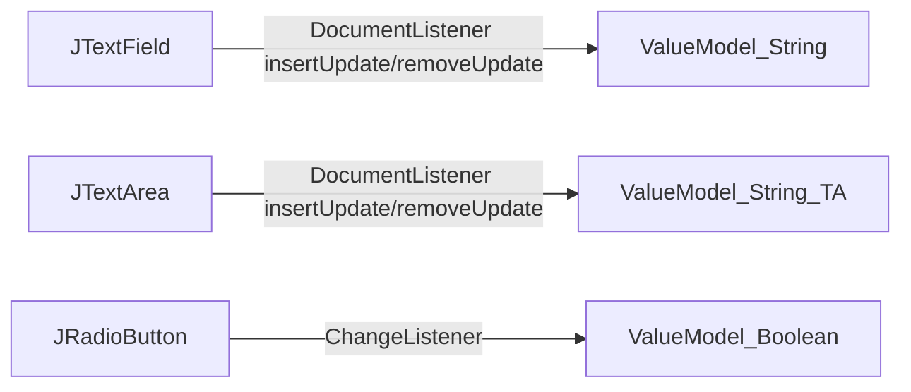
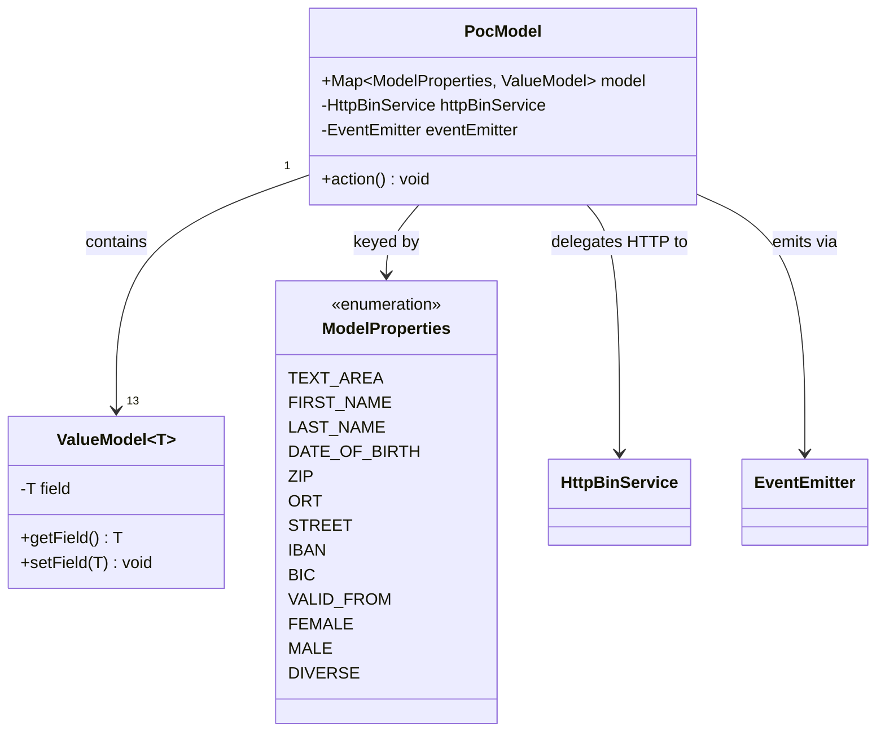
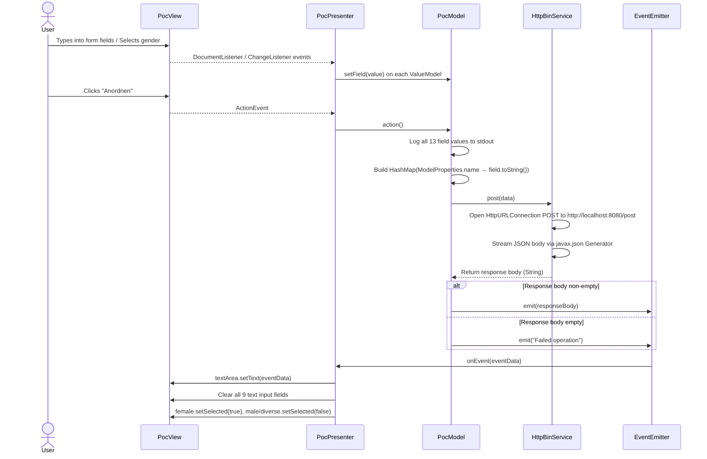

# Allegro — Java Swing MVP Application: Comprehensive Documentation

---

## Table of Contents

1. [Application Overview](#1-application-overview)
2. [Architecture — MVP Pattern](#2-architecture--mvp-pattern)
3. [Package Structure](#3-package-structure)
4. [File-by-File Analysis](#4-file-by-file-analysis)
   - [ValueModel.java](#41-valuemodeljavacombpocvaluemodeljavacombpoc)
   - [EventListener.java](#42-eventlistenerjava)
   - [EventEmitter.java](#43-eventemitterjava)
   - [ModelProperties.java](#44-modelpropertiesjava)
   - [ViewData.java](#45-viewdatajava)
   - [HttpBinService.java](#46-httpbinservicejava)
   - [PocModel.java](#47-pocmodeljava)
   - [PocView.java](#48-pocviewjava)
   - [PocPresenter.java](#49-pocpresenterjava)
5. [Business Rules](#5-business-rules)
6. [Data Model](#6-data-model)
7. [Form Fields Reference (German ↔ English)](#7-form-fields-reference-german--english)
8. [Submission Workflow](#8-submission-workflow)
9. [Configuration](#9-configuration)
10. [Gaps and Risks](#10-gaps-and-risks)

---

## 1. Application Overview

| Property | Value |
|---|---|
| **Application Name** | Allegro |
| **Type** | Java Swing Desktop Application |
| **Language** | Java 22 |
| **Pattern** | Model-View-Presenter (MVP) |
| **Build Tool** | Apache Maven |
| **Window Size** | 800 × 650 px |
| **Submit Button** | Anordnen (German: Arrange / Order) |

**Purpose:**
Allegro is a proof-of-concept desktop application that demonstrates the MVP architectural pattern in Java Swing. It presents a personal data entry form with German-language labels, collects 13 form fields (personal identity, address, banking information, gender, and validity date), serialises the values to JSON, and POSTs them to a local REST endpoint. The server response is displayed in the form's text area and all input fields are then cleared.

---

## 2. Architecture — MVP Pattern

The application is cleanly split into three layers following the MVP pattern:

```mermaid
graph TD
    User -->|Interacts with| PocView
    PocView -->|Component references exposed to| PocPresenter
    PocPresenter -->|Reads/writes via DocumentListener & ChangeListener| PocModel
    PocPresenter -->|Calls model.action()| PocModel
    PocModel -->|HTTP POST| HttpBinService
    HttpBinService -->|Returns response body| PocModel
    PocModel -->|Emits event via| EventEmitter
    EventEmitter -->|Notifies| PocPresenter
    PocPresenter -->|Updates UI| PocView
```

| Layer | Class | Responsibility |
|---|---|---|
| **Model** | `PocModel` | Owns all 13 `ValueModel` entries; orchestrates submit workflow |
| **View** | `PocView` | Declares all Swing components; layout only, no logic |
| **Presenter** | `PocPresenter` | Binds view ↔ model; handles submit action; reacts to events |
| **Event Bus** | `EventEmitter` / `EventListener` | Decouples Model from Presenter for post-submission notification |
| **HTTP Client** | `HttpBinService` | Serialises form data to JSON and POSTs to REST endpoint |
| **Value Container** | `ValueModel<T>` | Generic typed wrapper for each model property |

---

## 3. Package Structure

```
com.poc
├── ValueModel.java              ← Generic value container (shared utility)
└── model/
│   ├── EventListener.java       ← Functional interface for event callbacks
│   ├── EventEmitter.java        ← Observer-pattern event bus
│   ├── ModelProperties.java     ← Enum of all 13 domain field keys
│   ├── ViewData.java            ← Placeholder DTO (not yet implemented)
│   ├── HttpBinService.java      ← HTTP POST client (JSON serialisation)
│   └── PocModel.java            ← Business model & submission orchestrator
└── presentation/
    ├── PocView.java             ← Swing UI components & layout
    └── PocPresenter.java        ← MVP coordinator & data bindings
```

---

## 4. File-by-File Analysis

---

### 4.1 `ValueModel.java` — `com.poc`

**Category:** Technical  
**Business Capability:** Data Binding → Model Value Container

#### Summary
Generic single-field wrapper class (`ValueModel<T>`) that serves as the atomic data-holding unit for every form field in the model map.

#### Description
Every one of the 13 model properties is stored as a `ValueModel` instance inside `PocModel`'s `EnumMap`. The generic type `T` is either `String` (for text fields) or `Boolean` (for gender radio buttons). The Presenter's `bind()` methods retrieve each `ValueModel` instance from the map and update it in real time; `PocModel.action()` reads all values before submission.

#### Business Rules Implemented
- Each form field is represented by exactly one `ValueModel` instance.
- `ValueModel<String>` is used for all text-based fields; `ValueModel<Boolean>` for gender properties.
- All instances are initialised with `null` at model construction time.

#### Method Reference

| Method | Parameters | Returns | Significance |
|---|---|---|---|
| `ValueModel(T field)` | `field: T` — initial value (null at startup) | `ValueModel<T>` | Called 13 times by `PocModel` constructor |
| `getField()` | — | `T` current value | Used by `PocModel.action()` to collect submission data |
| `setField(T field)` | `field: T` — new value | `void` | Called by `PocPresenter` bindings on every UI event |

---

### 4.2 `EventListener.java` — `com.poc.model`

**Category:** Technical  
**Business Capability:** Event-Driven Communication → Event Subscription Contract

#### Summary
Functional interface defining the `onEvent(String eventData)` callback that any event consumer must implement.

#### Description
Decouples the Model layer (which produces HTTP results) from the Presentation layer (which reacts to them). Because it is a single-abstract-method interface, `PocPresenter` implements it as a lambda expression. The `eventData` string carries either the raw HTTP response body or the literal `"Failed operation"` message.

#### Method Reference

| Method | Parameters | Returns | Significance |
|---|---|---|---|
| `onEvent(String eventData)` | `eventData: String` — server response or failure message | `void` | Implemented as a lambda in `PocPresenter`; drives UI update |

---

### 4.3 `EventEmitter.java` — `com.poc.model`

**Category:** Technical  
**Business Capability:** Event-Driven Communication → Event Broadcasting (Observer Pattern)

#### Summary
Observable event bus maintaining a list of `EventListener` subscribers and broadcasting events to all of them.

#### Description
Implements the Observer pattern. `PocPresenter` calls `subscribe()` at startup to register the view-reset callback. `PocModel.action()` calls `emit()` after receiving the HTTP response. All registered listeners are notified in registration order.

#### Business Rules Implemented
- Multiple listeners can subscribe simultaneously; all receive every emitted event.
- Non-empty HTTP response body → emit response body.
- Empty HTTP response body → emit `"Failed operation"`.

#### Method Reference

| Method | Parameters | Returns | Significance |
|---|---|---|---|
| `subscribe(EventListener listener)` | `listener: EventListener` | `void` | Called by `PocPresenter` constructor to register view-reset callback |
| `emit(String eventData)` | `eventData: String` | `void` | Called by `PocModel.action()` after HTTP response received |

---

### 4.4 `ModelProperties.java` — `com.poc.model`

**Category:** Business  
**Business Capability:** Personal Data Management → Domain Field Definition

#### Summary
Enum defining all 13 domain data fields of the Allegro form, used as type-safe keys in `PocModel`'s `EnumMap`.

#### Enum Constants

| Constant | German Label | Field Type | Domain |
|---|---|---|---|
| `TEXT_AREA` | — (response display) | String | UI / Response |
| `FIRST_NAME` | Vorname | String | Personal Identity |
| `LAST_NAME` | Name / Nachname | String | Personal Identity |
| `DATE_OF_BIRTH` | Geburtsdatum | String | Personal Identity |
| `ZIP` | PLZ (Postleitzahl) | String | Address |
| `ORT` | Ort (Stadt) | String | Address |
| `STREET` | Strasse | String | Address |
| `IBAN` | IBAN | String | Banking |
| `BIC` | BIC | String | Banking |
| `VALID_FROM` | Gültig ab | String | Validity |
| `FEMALE` | Weiblich | Boolean | Gender |
| `MALE` | Männlich | Boolean | Gender |
| `DIVERSE` | Divers | Boolean | Gender |

#### Business Rules Implemented
- All 13 constants must have a corresponding `ValueModel` entry in `PocModel`.
- Gender is represented by three Boolean flags; exactly one should be `true` at submission.
- Enum constant names (via `toString()`) become JSON field keys in the HTTP payload.

---

### 4.5 `ViewData.java` — `com.poc.model`

**Category:** Technical  
**Business Capability:** Data Transfer → View State DTO (Not Yet Implemented)

#### Summary
Empty placeholder class. No fields, no methods. Intended as a view-state DTO based on naming convention and package placement but has not been developed.

---

### 4.6 `HttpBinService.java` — `com.poc.model`

**Category:** Technical  
**Business Capability:** Form Submission → HTTP REST Integration

#### Summary
HTTP client that serialises a `Map<String, String>` of form field name-value pairs to a JSON object body and POSTs it to the configured REST endpoint, returning the raw response body.

#### Constants

| Constant | Value |
|---|---|
| `URL` | `http://localhost:8080` |
| `PATH` | `/post` |
| `CONTENT_TYPE` | `application/json` |

#### Business Rules Implemented
- All 13 field values are submitted in a single atomic POST request.
- Target endpoint and Content-Type are hard-coded.
- Raw response body is returned as a `String`.
- Response code and body are always printed to stdout.

#### Method Reference

| Method | Parameters | Returns | Significance |
|---|---|---|---|
| `post(Map<String,String> data)` | `data`: map of 13 ModelProperties names to string values | `String` response body | Sole backend integration point; all form data flows here |

#### JSON Payload Structure

```json
{
  "TEXT_AREA": "<current text area content>",
  "FIRST_NAME": "John",
  "LAST_NAME": "Doe",
  "DATE_OF_BIRTH": "01.01.1990",
  "ZIP": "10115",
  "ORT": "Berlin",
  "STREET": "Hauptstrasse 1",
  "IBAN": "DE89370400440532013000",
  "BIC": "COBADEFFXXX",
  "VALID_FROM": "01.01.2025",
  "MALE": "true",
  "FEMALE": "false",
  "DIVERSE": "false"
}
```

---

### 4.7 `PocModel.java` — `com.poc.model`

**Category:** Business  
**Business Capability:** Personal Data Management → Form Submission Orchestration

#### Summary
Central model class holding all 13 `ValueModel` field containers and orchestrating the complete submission workflow (data collection → HTTP POST → event notification).

#### Description
`PocModel` owns the data layer. Its constructor creates an `EnumMap` with 13 null-initialised `ValueModel` entries. When `action()` is called, it: logs all values to stdout, builds a `HashMap<String,String>` of all fields, delegates to `HttpBinService`, and emits the result via `EventEmitter`.

#### Business Rules Implemented
- 13 fields initialised to `null`; no default values at startup.
- All values logged to stdout before submission.
- `getField().toString()` called on all 13 fields → NullPointerException if any field is null at submission.
- Non-empty response → emit response body.
- Empty response → emit `"Failed operation"`.

#### Method Reference

| Method | Parameters | Returns | Throws | Significance |
|---|---|---|---|---|
| `PocModel(EventEmitter)` | `eventEmitter: EventEmitter` | Instance | — | Initialises all 13 model slots |
| `action()` | — | `void` | `IOException`, `InterruptedException` | Core submission workflow entry point |

---

### 4.8 `PocView.java` — `com.poc.presentation`

**Category:** Technical  
**Business Capability:** Personal Data Management → Form UI Rendering

#### Summary
Java Swing view declaring all 14 UI components for the personal data form, arranged in a `GridBagLayout` within an 800×650 `JFrame` titled "Allegro".

#### Component Inventory

| Field Name | Type | Label | Model Property |
|---|---|---|---|
| `textArea` | `JTextArea` | (response display) | `TEXT_AREA` |
| `firstName` | `JTextField` | Vorname | `FIRST_NAME` |
| `name` | `JTextField` | Name | `LAST_NAME` |
| `dateOfBirth` | `JTextField` | Geburtsdatum | `DATE_OF_BIRTH` |
| `zip` | `JTextField` | PLZ | `ZIP` |
| `ort` | `JTextField` | Ort | `ORT` |
| `street` | `JTextField` | Strasse | `STREET` |
| `iban` | `JTextField` | IBAN | `IBAN` |
| `bic` | `JTextField` | BIC | `BIC` |
| `validFrom` | `JTextField` | Gültig ab | `VALID_FROM` |
| `female` | `JRadioButton` | Weiblich | `FEMALE` |
| `male` | `JRadioButton` | Männlich | `MALE` |
| `diverse` | `JRadioButton` | Divers | `DIVERSE` |
| `button` | `JButton` | Anordnen | — |
| `gender` | `ButtonGroup` | — | enforces mutual exclusivity |

#### Business Rules Implemented
- Window title: `"Allegro"`; size: 800×650; close operation: `EXIT_ON_CLOSE`.
- Gender radio buttons grouped in `ButtonGroup` → mutual exclusivity at UI level.
- All component fields are `protected` to allow direct Presenter access.

---

### 4.9 `PocPresenter.java` — `com.poc.presentation`

**Category:** Mixed  
**Business Capability:** Personal Data Management → MVP Data Binding and Action Coordination

#### Summary
MVP Presenter that wires real-time two-way bindings for all 13 form fields, handles the submit button action, and reacts to model events by updating the view.

#### Description
`PocPresenter` completes the MVP triangle:
1. Subscribes a lambda to `EventEmitter` → on event: display response in text area, clear all inputs, reset gender to Female.
2. Attaches `ActionListener` to `button` → on click: call `model.action()`.
3. Calls `initializeBindings()` → wires all 13 components to their model slots.

#### Binding Mechanism



#### Business Rules Implemented
- All 13 fields bound before any user interaction.
- Text fields: model updated on every `insertUpdate` and `removeUpdate` (real-time).
- Radio buttons: model updated on every `changeListener` event.
- On event received: 9 text fields cleared, gender reset to Female selected.
- `IOException`/`InterruptedException` wrapped as `RuntimeException` — no user dialog.

#### Method Reference

| Method | Parameters | Returns | Significance |
|---|---|---|---|
| `PocPresenter(PocView, PocModel, EventEmitter)` | view, model, eventEmitter | Instance | Full MVP assembly point |
| `bind(JTextComponent, ModelProperties)` | source, prop | `void` | Real-time String binding for 10 text fields |
| `bind(JRadioButton, ModelProperties)` | source, prop | `void` | Real-time Boolean binding for 3 gender buttons |
| `initializeBindings()` | — | `void` | Wires all 13 component-to-model bindings |

---

## 5. Business Rules

| ID | Rule | Category | Priority |
|---|---|---|---|
| BR-001 | All 13 fields must be non-null at submission or NullPointerException is thrown | Data Completeness | High |
| BR-002 | All field values are submitted atomically in one JSON POST — no partial submissions | Submission Workflow | High |
| BR-003 | Endpoint is `http://localhost:8080/post` with `Content-Type: application/json` | Integration | High |
| BR-004 | Non-empty response body is broadcast to all event listeners and displayed in text area | Response Handling | High |
| BR-005 | Empty response body emits the literal string `"Failed operation"` | Error Handling | High |
| BR-006 | After server event, all 9 text input fields are cleared to empty string | Post-Submission Reset | High |
| BR-007 | After server event, gender resets to Female=selected, Male=deselected, Diverse=deselected | Post-Submission Reset | Medium |
| BR-008 | Gender selection is mutually exclusive: only one of Female/Male/Diverse active at a time | Gender Classification | High |
| BR-009 | Gender is stored internally as three independent Boolean model properties | Gender Classification | Medium |
| BR-010 | Model is synchronised in real time — text fields on every keystroke, radio buttons on every change | Data Binding | High |
| BR-011 | Boolean gender values are serialised as `"true"` or `"false"` strings in JSON | Submission Workflow | Medium |
| BR-012 | JSON field keys are the exact ModelProperties enum constant names (e.g. `FIRST_NAME`) | Submission Workflow | Medium |
| BR-013 | All 13 model fields start as `null`; text field bindings initialise them to `""` at startup | Initialisation | Low |
| BR-014 | Server response body is displayed in the `TEXT_AREA` (JTextArea) component | Response Handling | Medium |
| BR-015 | Submit is triggered only by clicking "Anordnen" — no auto-submit or keyboard shortcut | Submission Workflow | Medium |
| BR-016 | HTTP exceptions are wrapped as `RuntimeException` without user-visible error notification | Error Handling | High |
| BR-017 | DATE_OF_BIRTH and VALID_FROM are plain strings — no date format validation | Data Validation | Medium |
| BR-018 | IBAN and BIC are plain strings — no IBAN checksum or BIC structure validation | Data Validation | Medium |
| BR-019 | ZIP (Postleitzahl) is a plain string — no numeric or length validation | Data Validation | Low |
| BR-020 | All field values are printed to stdout before HTTP submission (debug logging) | Observability | Low |

---

## 6. Data Model



---

## 7. Form Fields Reference (German ↔ English)

| German Label | English Meaning | ModelProperties Key | Type | Domain |
|---|---|---|---|---|
| Vorname | First Name | `FIRST_NAME` | String | Personal Identity |
| Name / Nachname | Last Name | `LAST_NAME` | String | Personal Identity |
| Geburtsdatum | Date of Birth | `DATE_OF_BIRTH` | String | Personal Identity |
| PLZ | Postal Code (ZIP) | `ZIP` | String | Address |
| Ort | City | `ORT` | String | Address |
| Strasse | Street | `STREET` | String | Address |
| IBAN | IBAN | `IBAN` | String | Banking |
| BIC | BIC | `BIC` | String | Banking |
| Gültig ab | Valid From | `VALID_FROM` | String | Validity |
| Weiblich | Female | `FEMALE` | Boolean | Gender |
| Männlich | Male | `MALE` | Boolean | Gender |
| Divers | Diverse / Non-binary | `DIVERSE` | Boolean | Gender |
| — (text area) | Response Display | `TEXT_AREA` | String | UI |

---

## 8. Submission Workflow



---

## 9. Configuration

### Maven Dependencies (`pom.xml`)

| Dependency | Group ID | Artifact ID | Version | Purpose |
|---|---|---|---|---|
| JSON API | `javax.json` | `javax.json-api` | 1.1.4 | JSON processing API |
| JSON Impl | `org.glassfish` | `javax.json` | 1.0.4 | JSON processing implementation |
| WebSocket API | `org.glassfish.websocket` | `websocket-api` | 0.2 | WebSocket API (included but not used in analyzed code) |
| Tyrus Client | `org.glassfish.tyrus.bundles` | `tyrus-standalone-client` | 1.15 | WebSocket client (included but not used in analyzed code) |
| Tyrus Core | `org.glassfish.tyrus` | `tyrus-websocket-core` | 1.2.1 | WebSocket core |
| Tyrus SPI | `org.glassfish.tyrus` | `tyrus-spi` | 1.15 | WebSocket SPI |

> **Note:** WebSocket dependencies are present in `pom.xml` but no WebSocket usage is found in the analyzed source files. The current form submission uses plain `HttpURLConnection`.

### Compiler Configuration

| Property | Value |
|---|---|
| Source compatibility | Java 22 |
| Target compatibility | Java 22 |

### Hardcoded Application Configuration

| Setting | Value | Location |
|---|---|---|
| REST endpoint URL | `http://localhost:8080` | `HttpBinService.URL` |
| REST endpoint path | `/post` | `HttpBinService.PATH` |
| Content-Type | `application/json` | `HttpBinService.CONTENT_TYPE` |
| Window title | `Allegro` | `PocView` JFrame constructor |
| Window size | 800 × 650 | `PocView.initUI()` |
| Submit button label | `Anordnen` | `PocView.button` |

---

## 10. Gaps and Risks

| ID | Severity | Type | Description | Recommendation |
|---|---|---|---|---|
| GAP-001 | 🔴 High | Defect | `getField().toString()` in `PocModel.action()` — any null field at submission causes `NullPointerException` | Add null checks or require all fields before enabling "Anordnen" button |
| GAP-002 | 🟡 Medium | Missing Validation | No format validation for IBAN, BIC, DATE_OF_BIRTH, VALID_FROM, ZIP | Implement field-level validators; show inline error messages |
| GAP-003 | 🔴 High | Error Handling | `IOException`/`InterruptedException` wrapped as `RuntimeException` — no user-facing error dialog | Catch in ActionListener; show `JOptionPane` error dialog |
| GAP-004 | 🟢 Low | Incomplete Implementation | `ViewData` class is empty — view state DTO not implemented | Implement or remove if unnecessary |
| GAP-005 | 🟡 Medium | Configuration | Endpoint URL hardcoded to `http://localhost:8080/post` — not configurable | Externalise to a properties file or environment variable |
| GAP-006 | 🟡 Medium | Testability | `HttpBinService` instantiated directly via `new` in `PocModel` — cannot be mocked in unit tests | Inject via constructor; introduce an interface |
| GAP-007 | 🟡 Medium | Incomplete | WebSocket dependencies (`tyrus-standalone-client` etc.) present in `pom.xml` but unused — possibly planned feature | Remove unused dependencies or document planned integration |
