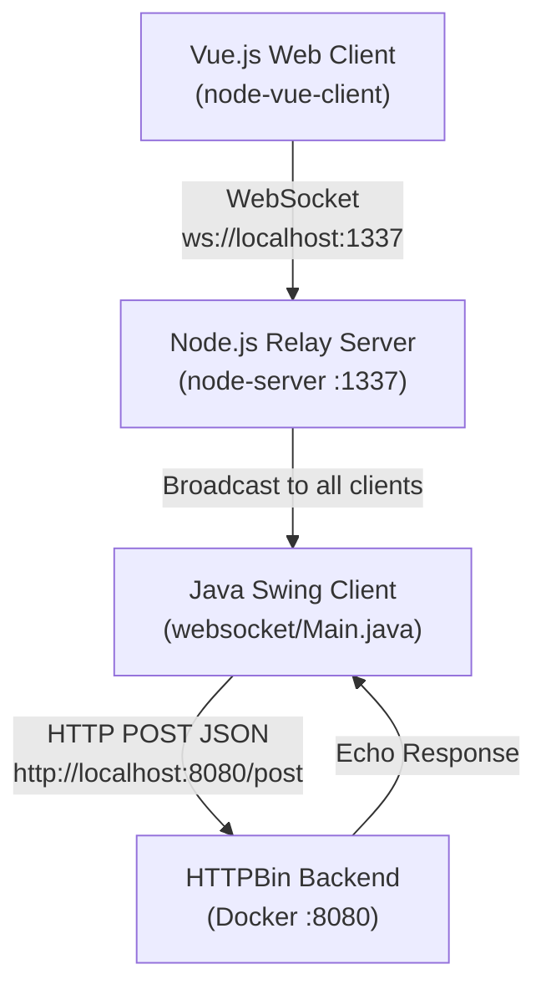
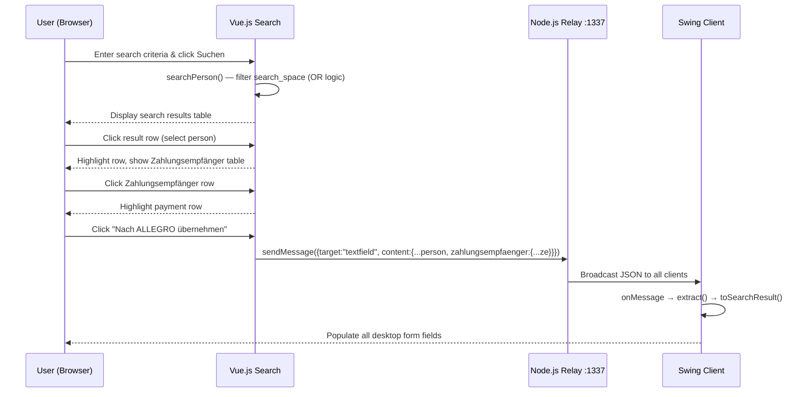
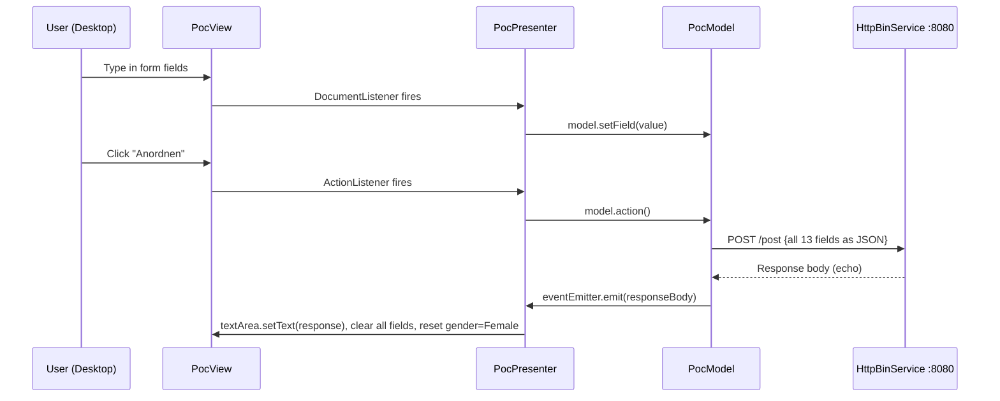

# Allegro PoC – Code Documentation & Business Logic Analysis

## Table of Contents
1. [Application Overview](#application-overview)
2. [Architecture](#architecture)
3. [Component Documentation](#component-documentation)
   - [Java Swing Client (MVP)](#java-swing-client-mvp)
   - [WebSocket Swing Client](#websocket-swing-client)
   - [Node.js WebSocket Relay Server](#nodejs-websocket-relay-server)
   - [Vue.js Web Client](#vuejs-web-client)
4. [Business Rules Summary](#business-rules-summary)
5. [Workflows](#workflows)
6. [Data Entities & API Contract](#data-entities--api-contract)
7. [Technology Stack & Build Configuration](#technology-stack--build-configuration)

---

## Application Overview

**Name:** Allegro PoC – WebSocket Swing Client  
**Purpose:** A proof-of-concept demonstrating the modernisation of the **Allegro** legacy system by integrating a Java Swing desktop client with a Vue.js browser client via a Node.js WebSocket relay server.

### Key Capabilities
| Capability | Description |
|---|---|
| Person Search | Browser-based search over an in-memory customer dataset |
| Payment Data Selection | Select one Zahlungsempfänger (IBAN/BIC) per customer |
| Cross-platform Data Transfer | Push selected data from browser to the Swing desktop form in real time |
| Form Submission | Submit Swing form data to a backend HTTP service (HTTPBin mock) |
| Event-driven Binding | Reactive two-way binding between Swing UI and domain model |

---

## Architecture



### Architecture Patterns
- **Model-View-Presenter (MVP)** – Swing desktop client (`com.poc.*`)
- **Observer / EventEmitter** – Decoupled model-to-presenter communication
- **WebSocket Relay** – Stateless broadcast bridge between web and desktop
- **Component-based** – Vue.js single-file components

### Communication Flow
1. Vue.js client searches for a person in the browser
2. User selects a person + Zahlungsempfänger and clicks **"Nach ALLEGRO übernehmen"**
3. Vue.js sends `{ target: "textfield", content: {...personData} }` via WebSocket
4. Node.js relay broadcasts to all connected clients
5. Java Swing client receives the message, parses it, and populates the desktop form
6. User reviews the form and clicks **"Anordnen"** to submit to the HTTPBin backend
7. HTTPBin echoes the payload back; the response is displayed in the text area

---

## Component Documentation

### Java Swing Client (MVP)

#### `com/Main.java`
**Category:** Technical | **Capability:** Application Lifecycle Management

Entry point for the Allegro Swing MVP application. Wires together `PocView`, `PocModel`, and `PocPresenter` following the MVP pattern. Uses `CountDownLatch(1)` to keep the main thread alive indefinitely.

```
main()
  └─ new PocView()           → constructs and displays the Swing form
  └─ new EventEmitter()      → creates the event bus
  └─ new PocModel(emitter)   → initialises the domain model
  └─ new PocPresenter(view, model, emitter) → wires MVP + bindings
  └─ latch.await()           → blocks main thread forever
```

---

#### `com/poc/ValueModel.java`
**Category:** Technical | **Capability:** Data Binding Infrastructure

Generic wrapper around a single typed value. Used as the atomic unit of the domain model — each form field corresponds to one `ValueModel<T>` instance.

| Method | Description |
|---|---|
| `ValueModel(T field)` | Constructor: stores initial value |
| `getField()` | Returns the current wrapped value |
| `setField(T field)` | Updates the wrapped value |

---

#### `com/poc/model/ModelProperties.java`
**Category:** Business | **Capability:** Customer Data Management

Enum listing all 13 domain properties managed by the model:

| Property | Type | Description |
|---|---|---|
| `TEXT_AREA` | String | Response / free-text area |
| `FIRST_NAME` | String | Customer first name (Vorname) |
| `LAST_NAME` | String | Customer last name (Name) |
| `DATE_OF_BIRTH` | String | Date of birth (Geburtsdatum) |
| `ZIP` | String | Postal code (PLZ) |
| `ORT` | String | City (Ort) |
| `STREET` | String | Street (Strasse) |
| `IBAN` | String | Bank account IBAN |
| `BIC` | String | Bank BIC code |
| `VALID_FROM` | String | Payment validity start date |
| `FEMALE` | Boolean | Gender: female selected |
| `MALE` | Boolean | Gender: male selected |
| `DIVERSE` | Boolean | Gender: diverse selected |

---

#### `com/poc/model/EventEmitter.java` + `EventListener.java`
**Category:** Technical | **Capability:** Event-Driven Communication

Implements a simple synchronous publish-subscribe pattern.

```
EventEmitter
  ├─ subscribe(EventListener) → registers a listener
  └─ emit(String eventData)   → broadcasts to all listeners

EventListener (interface)
  └─ onEvent(String eventData) → callback method
```

**Business Rule:** All registered listeners receive every emitted event synchronously in registration order.

---

#### `com/poc/model/HttpBinService.java`
**Category:** Mixed | **Capability:** Backend Integration

HTTP client that serialises a `Map<String, String>` to JSON and POSTs it to `http://localhost:8080/post`.

| Constant | Value |
|---|---|
| `URL` | `http://localhost:8080` |
| `PATH` | `/post` |
| `CONTENT_TYPE` | `application/json` |

**Method: `post(Map<String, String> data) → String`**  
Iterates the map, generates a JSON object using `javax.json.JsonGenerator`, executes the HTTP POST, reads the response body, disconnects, and returns the body string.

---

#### `com/poc/model/PocModel.java`
**Category:** Business | **Capability:** Customer Data Management / Form State

Central domain model. Holds 13 `ValueModel` instances in an `EnumMap<ModelProperties, ValueModel<?>>`.

**Method: `action()`**
1. Iterates all `ModelProperties` and builds a `HashMap<String, String>` with `.toString()` on each value
2. Calls `httpBinService.post(data)`
3. If response is non-empty → `eventEmitter.emit(responseBody)`
4. If response is empty → `eventEmitter.emit("Failed operation")`

---

#### `com/poc/presentation/PocPresenter.java`
**Category:** Business | **Capability:** Form Interaction and Data Binding

MVP Presenter — mediates between `PocView` and `PocModel`.

**Constructor responsibilities:**
- Subscribes to `EventEmitter`; on event: populates `textArea` with data, clears all fields, resets gender to **Female**
- Wires `button.addActionListener` → `model.action()`
- Calls `initializeBindings()`

**`bind(JTextComponent, ModelProperties)`**  
Attaches a `DocumentListener` that updates `ValueModel<String>` on every `insertUpdate` and `removeUpdate`.

**`bind(JRadioButton, ModelProperties)`**  
Attaches a `ChangeListener` that updates `ValueModel<Boolean>` on every selection change.

**`initializeBindings()`**  
Establishes bindings for all 13 properties (10 text fields + 3 radio buttons).

---

#### `com/poc/presentation/PocView.java`
**Category:** Technical | **Capability:** Desktop Form Rendering

Constructs a `JFrame` (800×650) with a `GridBagLayout` panel containing:
- Row 0: Vorname, Name, Geburtsdatum fields
- Row 1: Geschlecht radio buttons (Weiblich [default], Männlich, Divers)
- Row 2: Strasse, PLZ, Ort fields
- Row 3: IBAN, BIC, Gültig ab fields
- Row 4: RT text area
- Row 5: "Anordnen" submit button

All UI components are `protected` fields accessible to the presenter.

---

### WebSocket Swing Client

#### `websocket/Main.java`
**Category:** Mixed | **Capability:** Customer Data Display via WebSocket

Alternative Swing client that connects to the WebSocket relay and populates its form from incoming JSON messages. Contains inner classes:

**`WebsocketClientEndpoint`** (inner `@ClientEndpoint`)
| Method | Trigger | Action |
|---|---|---|
| `onOpen(Session)` | WS connection opened | Stores session reference |
| `onClose(Session, CloseReason)` | WS connection closed | Nullifies session, `latch.countDown()` |
| `onMessage(String json)` | Message received | Calls `extract()`, routes to `textArea` or calls `toSearchResult()` + populates fields |
| `sendMessage(String)` | Programmatic | Sends text via `session.getAsyncRemote()` |

**`extract(String json) → Message`**  
Streaming JSON parser that extracts `target` and `content` fields. Special rule: for `textarea` target, `content` is the inner string value; for `textfield` target, `content` is the full raw JSON string.

**`toSearchResult(String json) → SearchResult`**  
Streaming JSON parser that maps `name`, `first`, `dob`, `zip`, `ort`, `street`, `hausnr`, `iban`, `bic`, `valid_from` to `SearchResult` fields.

---

### Node.js WebSocket Relay Server

#### `node-server/src/WebsocketServer.js`
**Category:** Technical | **Capability:** Real-time Communication / WebSocket Message Relay

Simple stateless broadcast server.

| Aspect | Detail |
|---|---|
| Port | 1337 |
| Protocol | WebSocket over HTTP |
| Origin validation | None (all origins accepted) |
| Message types | UTF-8 text only |
| Broadcast policy | All messages sent to ALL connected clients |

**Event Handlers:**
- `wsServer.on('request')` – Accepts connection, registers handlers, tracks index in `clients[]`
- `connection.on('message')` – Validates `type === 'utf8'`, broadcasts `json` to every client in `clients[]`
- `connection.on('close')` – Removes the disconnected client with `clients.splice(index, 1)`

---

### Vue.js Web Client

#### `node-vue-client/src/main.js`
**Category:** Technical | **Capability:** Web Application Bootstrap

Standard Vue 2 entry point. Mounts `<App>` to `#app` element.

---

#### `node-vue-client/src/App.vue`
**Category:** Technical | **Capability:** Application Shell

Root component. Renders branded header (red `#ff2b06` background, "Search Mock" title) and embeds `<Search>`.

---

#### `node-vue-client/src/components/Search.vue`
**Category:** Business | **Capability:** Customer Search and Selection

Core business component — the complete search, select, and transfer workflow.

**Data properties:**
| Property | Type | Description |
|---|---|---|
| `formdata` | Object | User-entered search form values |
| `search_result` | Array | Filtered results from search |
| `selected_result` | Object | Currently selected person |
| `zahlungsempfaenger_selected` | Object/String | Currently selected payment recipient |
| `search_space` | Array | In-memory dataset of 5 mock persons |
| `internal_content_textarea` | String | Synced textarea content |

**Methods:**
| Method | Description |
|---|---|
| `connect()` | Opens WebSocket to `ws://localhost:1337/` on mount |
| `disconnect()` | Closes WebSocket, clears logs |
| `searchPerson()` | Filters `search_space` with OR/partial-match logic |
| `sendMessage(e, target)` | Serialises data to JSON + sends via WebSocket |
| `selectResult(item)` | Sets `selected_result` |
| `zahlungsempfaengerSelected(ze)` | Sets `zahlungsempfaenger_selected` |

**Watchers:**
- `internal_content_textarea` → calls `sendMessage(val, "textarea")` on every change

**Mock Dataset (search_space):**
| Kdn.-nr | Name | Vorname | Geburtsdatum | PLZ | Ort | Zahlungsempfänger |
|---|---|---|---|---|---|---|
| 79423984 | Mayer | Hans | 1981-01-08 | 95183 | Trogen | 2 entries |
| 67485246 | Reitmayr | Linda | 1979-05-12 | 92148 | Hof | 1 entry |
| 13725246 | May | Karl | 1964-11-02 | 10124 | Berlin | 3 entries |
| 41125291 | Mueller | Jens | 1999-04-21 | 14489 | Potsdam | 2 entries |
| 31228193 | Ruckmueller | Steffi | 1961-11-05 | 14432 | Templin | 2 entries |

---

## Business Rules Summary

### Search Rules
| ID | Rule |
|---|---|
| BR-021 | Search performed against in-memory dataset of 5 persons |
| BR-022 | Search uses OR logic across: last name, first name, ZIP, city, street, house number |
| BR-023 | ZIP matching is **exact**; all other fields use **partial, case-insensitive** matching |
| BR-024 | Empty form fields are skipped (not applied as criteria) |

### Data Transfer Rules
| ID | Rule |
|---|---|
| BR-002 | WebSocket messages must have a `target` field: `'textarea'` or `'textfield'` |
| BR-028 | "Nach ALLEGRO übernehmen" sends selected person + payment recipient with `target: 'textfield'` |
| BR-029 | The `zahlungsempfaenger` array is replaced with the single selected entry before sending |
| BR-030 | Textarea changes are sent automatically in real time with `target: 'textarea'` |
| BR-036 | Message envelope format: `{ target: string, content: object }` |

### Form & Model Rules
| ID | Rule |
|---|---|
| BR-006 | Default gender selection is Female (Weiblich) |
| BR-007 | All 13 fields must be initialised on model creation |
| BR-008 | On submit, all 13 fields are sent together as a single JSON payload |
| BR-013 | After HTTP response, all fields cleared and response shown in text area |
| BR-014 | After HTTP response, gender reset to Female |
| BR-015 | Every text field keystroke immediately updates the model |

### Backend / Infrastructure Rules
| ID | Rule |
|---|---|
| BR-012 | HTTP POST to `http://localhost:8080/post` with `Content-Type: application/json` |
| BR-009 | Non-empty response → emit response data |
| BR-010 | Empty response → emit `"Failed operation"` |
| BR-017 | WebSocket relay server runs on port 1337 |
| BR-018 | All WebSocket origins are accepted (no validation) |
| BR-020 | Messages broadcast to ALL clients including sender |
| BR-038 | HTTPBin Docker container must be running on port 8080 before starting |
| BR-039 | Java SDK >= 22.0.1 required |

---

## Workflows

### Workflow 1: Person Search and Transfer to Allegro



### Workflow 2: Swing Form Submission



---

## Data Entities & API Contract

### Person Record
```json
{
  "knr": "79423984",
  "name": "Mayer",
  "first": "Hans",
  "dob": "1981-01-08",
  "zip": "95183",
  "ort": "Trogen",
  "street": "Isaaer Str.",
  "hausnr": "23",
  "zahlungsempfaenger": [
    {
      "iban": "DE27100777770209299700",
      "bic": "ERFBDE8E759",
      "valid_from": "2020-01-04",
      "valid_until": "",
      "type": ""
    }
  ]
}
```

### WebSocket Message Envelope
```json
{
  "target": "textfield",
  "content": { "...personFields": "...", "zahlungsempfaenger": { "...singleZE": "..." } }
}
```

### API Schema (api.yml – POST /post)
| Field | Type | Description |
|---|---|---|
| `FIRST_NAME` | string | Customer first name |
| `LAST_NAME` | string | Customer last name |
| `DATE_OF_BIRTH` | string | Date of birth |
| `STREET` | string | Street address |
| `BIC` | string | Bank Identifier Code |
| `ORT` | string | City |
| `ZIP` | string | Postal code |
| `FEMALE` | string | Female gender flag |
| `MALE` | string | Male gender flag |
| `DIVERSE` | string | Diverse gender flag |
| `IBAN` | string | International Bank Account Number |
| `VALID_FROM` | string | Payment validity start |
| `TEXT_AREA` | string | Free-text/response area |

Server: `http://localhost:8080`

---

## Technology Stack & Build Configuration

### Java (Maven – `pom.xml`)
| Artifact | Version | Purpose |
|---|---|---|
| `tyrus-standalone-client` | 1.15 | WebSocket client implementation |
| `websocket-api` | 0.2 | WebSocket API |
| `tyrus-websocket-core` | 1.2.1 | WebSocket core |
| `tyrus-spi` | 1.15 | WebSocket SPI |
| `javax.json-api` | 1.1.4 | JSON API |
| `javax.json` (GlassFish) | 1.0.4 | JSON implementation |
| Java source/target | 22 | Language level |

### Node.js Server (`node-server/package.json`)
| Package | Version | Purpose |
|---|---|---|
| `websocket` | ^1.0.35 | WebSocket server library |

### Vue.js Client (`node-vue-client/package.json`)
| Package | Version | Purpose |
|---|---|---|
| `vue` | ^2.6.10 | Frontend framework |
| `core-js` | ^3.1.2 | ES polyfills |
| `@vue/cli-service` | ^4.0.0 | Build tooling |
| `eslint-plugin-vue` | ^5.0.0 | Vue linting |

### Prerequisites
1. **Java SDK >= 22.0.1** (IntelliJ IDEA recommended)
2. **Docker** running the HTTPBin container: `docker run -p 8080:80 kennethreitz/httpbin`
3. **Node.js** for the WebSocket relay server and Vue.js client
