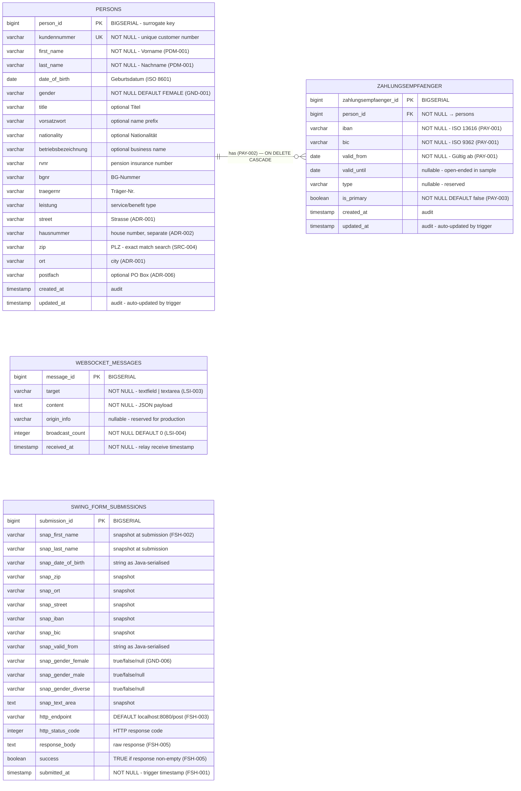

# Allegro PoC — Database Schema Documentation

> **Generated by**: `ddl-generator` agent  
> **Dialect**: PostgreSQL 14+  
> **Source files analysed**:
> - `swing/src/main/java/com/poc/model/ModelProperties.java` — 13-field canonical enum  
> - `node-vue-client/src/components/Search.vue` — extended Vue form fields + sample data  
> - `api.yml` — OpenAPI PostObject schema  
> - `analysis_output/analysis_results.json` — code-documentor field analysis  
> - `analysis_output/business_rules_extractor_analysis.json` — 46 business rules across 8 domains  
> **DDL file**: [`ddl-schema.sql`](ddl-schema.sql)

---

## Table of Contents

1. [Schema Overview](#schema-overview)
2. [Entity-Relationship Diagram](#entity-relationship-diagram)
3. [Data Flow Context](#data-flow-context)
4. [Table: `persons`](#table-persons)
5. [Table: `zahlungsempfaenger`](#table-zahlungsempfaenger)
6. [Table: `websocket_messages`](#table-websocket_messages)
7. [Table: `swing_form_submissions`](#table-swing_form_submissions)
8. [View: `v_person_with_primary_iban`](#view-v_person_with_primary_iban)
9. [View: `v_person_payment_summary`](#view-v_person_payment_summary)
10. [Indexes Reference](#indexes-reference)
11. [Constraints Reference](#constraints-reference)
12. [Seed Data](#seed-data)
13. [Business Rules Traceability](#business-rules-traceability)
14. [Design Decisions](#design-decisions)

---

## Schema Overview

| Metric | Value |
|---|---|
| **Database dialect** | PostgreSQL 14+ |
| **Total tables** | 4 |
| **Total views** | 2 |
| **Total columns** | 53 |
| **Total indexes** | 16 |
| **Total FK constraints** | 1 |
| **Total CHECK constraints** | 15 |
| **Total UNIQUE constraints** | 3 |
| **Triggers** | 2 |
| **Functions** | 1 |
| **Seed rows** | 5 persons + 10 zahlungsempfaenger |

### Tables at a Glance

| Table | Purpose | Rows (seed) | Key Source |
|---|---|---|---|
| `persons` | Person identity, demographics, address | 5 | ModelProperties enum + Search.vue |
| `zahlungsempfaenger` | Payment recipient banking details (1:N) | 10 | Search.vue zahlungsempfaenger[] |
| `websocket_messages` | WS relay audit trail | — | WebsocketServer.js + LSI rules |
| `swing_form_submissions` | Swing form HTTP POST audit trail | — | PocModel.action() + FSH rules |

---

## Entity-Relationship Diagram



---

## Data Flow Context

The following diagram shows how the four tables map to the three application tiers:

```mermaid
flowchart TD
    classDef vuestyle  fill:#42b883,color:#fff,stroke:#33a06f
    classDef javaStyle fill:#f89820,color:#fff,stroke:#c07010
    classDef nodeStyle fill:#68a063,color:#fff,stroke:#4a7a45
    classDef dbStyle   fill:#336791,color:#fff,stroke:#1a4f70
    classDef viewStyle fill:#7b68ee,color:#fff,stroke:#5a4db8

    Vue["🌐 Vue.js Search UI\n(Search.vue)"]:::vuestyle
    Java["☕ Java Swing Form\n(PocPresenter / PocModel)"]:::javaStyle
    Node["⚡ Node.js WS Relay\n(WebsocketServer.js)"]:::nodeStyle

    P["📋 persons\n(identity + address)"]:::dbStyle
    Z["💳 zahlungsempfaenger\n(IBAN / BIC / dates)"]:::dbStyle
    WS["📡 websocket_messages\n(WS audit trail)"]:::dbStyle
    SFS["📝 swing_form_submissions\n(HTTP POST audit trail)"]:::dbStyle

    VP["👁 v_person_with_primary_iban"]:::viewStyle
    VPS["👁 v_person_payment_summary"]:::viewStyle

    Vue -->|"SELECT person + primary IBAN"| VP
    VP --> P
    VP --> Z
    Vue -->|"'Nach ALLEGRO übernehmen' (LSI-001)"| Node
    Node -->|"INSERT message audit"| WS
    Java -->|"INSERT snapshot"| SFS
    Java -->|"SELECT for display"| VP

    P ||--|{ Z : "1:N (PAY-002)"
    P --> VPS
    Z --> VPS
```

---

## Table: `persons`

**Purpose**: Core person master record combining identity (name, DOB, gender), extended demographic attributes, and embedded residential address.

**Key business rules**: PDM-001, PDM-006, GND-001 – GND-003, ADR-001 – ADR-006

| Column | Type | Nullable | Default | Constraint | Source |
|---|---|---|---|---|---|
| `person_id` | `BIGSERIAL` | NO | auto | PK | surrogate |
| `kundennummer` | `VARCHAR(20)` | NO | — | UNIQUE | `Search.vue .knr` |
| `first_name` | `VARCHAR(100)` | NO | — | CHECK length≥1 | `ModelProperties.FIRST_NAME` |
| `last_name` | `VARCHAR(100)` | NO | — | CHECK length≥1 | `ModelProperties.LAST_NAME` |
| `date_of_birth` | `DATE` | YES | — | CHECK ≤ today | `ModelProperties.DATE_OF_BIRTH` |
| `gender` | `VARCHAR(10)` | NO | `'FEMALE'` | CHECK IN (FEMALE,MALE,DIVERSE) | `ModelProperties.FEMALE/MALE/DIVERSE` |
| `title` | `VARCHAR(50)` | YES | — | — | `formdata.title` |
| `vorsatzwort` | `VARCHAR(50)` | YES | — | — | `formdata.vorsatzwort` |
| `nationality` | `VARCHAR(100)` | YES | — | — | `formdata.nationality` |
| `betriebsbezeichnung` | `VARCHAR(255)` | YES | — | — | `formdata.betriebsbez` |
| `rvnr` | `VARCHAR(20)` | YES | — | — | `formdata.rvnr` |
| `bgnr` | `VARCHAR(20)` | YES | — | — | `formdata.bgnr` |
| `traegernr` | `VARCHAR(20)` | YES | — | — | `formdata.traegernr` |
| `leistung` | `VARCHAR(255)` | YES | — | — | `formdata.leistung` |
| `street` | `VARCHAR(255)` | YES | — | — | `ModelProperties.STREET` |
| `hausnummer` | `VARCHAR(20)` | YES | — | — | `search_space.hausnr` |
| `zip` | `VARCHAR(10)` | YES | — | CHECK `\d{4,10}` | `ModelProperties.ZIP` |
| `ort` | `VARCHAR(100)` | YES | — | — | `ModelProperties.ORT` |
| `postfach` | `VARCHAR(50)` | YES | — | — | `formdata.postfach` |
| `created_at` | `TIMESTAMP` | NO | `NOW()` | — | audit |
| `updated_at` | `TIMESTAMP` | NO | `NOW()` | trigger | audit |

```sql
CREATE TABLE persons (
    person_id               BIGSERIAL       PRIMARY KEY,
    kundennummer            VARCHAR(20)     NOT NULL,
    first_name              VARCHAR(100)    NOT NULL,
    last_name               VARCHAR(100)    NOT NULL,
    date_of_birth           DATE,
    gender                  VARCHAR(10)     NOT NULL DEFAULT 'FEMALE',
    title                   VARCHAR(50),
    vorsatzwort             VARCHAR(50),
    nationality             VARCHAR(100),
    betriebsbezeichnung     VARCHAR(255),
    rvnr                    VARCHAR(20),
    bgnr                    VARCHAR(20),
    traegernr               VARCHAR(20),
    leistung                VARCHAR(255),
    street                  VARCHAR(255),
    hausnummer              VARCHAR(20),
    zip                     VARCHAR(10),
    ort                     VARCHAR(100),
    postfach                VARCHAR(50),
    created_at              TIMESTAMP       NOT NULL DEFAULT CURRENT_TIMESTAMP,
    updated_at              TIMESTAMP       NOT NULL DEFAULT CURRENT_TIMESTAMP,
    CONSTRAINT uq_persons_kundennummer      UNIQUE (kundennummer),
    CONSTRAINT chk_persons_gender           CHECK (gender IN ('FEMALE', 'MALE', 'DIVERSE')),
    CONSTRAINT chk_persons_dob_past         CHECK (date_of_birth IS NULL OR date_of_birth <= CURRENT_DATE),
    CONSTRAINT chk_persons_first_name_length CHECK (LENGTH(TRIM(first_name)) >= 1),
    CONSTRAINT chk_persons_last_name_length  CHECK (LENGTH(TRIM(last_name))  >= 1),
    CONSTRAINT chk_persons_zip_format        CHECK (zip IS NULL OR zip ~ '^\d{4,10}$')
);
```

> **Design note — gender normalisation**: The Java model stores gender as three independent `ValueModel<Boolean>` properties (FEMALE, MALE, DIVERSE). The database normalises these into a single `VARCHAR(10)` discriminator column with a CHECK constraint enforcing mutual exclusivity. The default value `'FEMALE'` mirrors the `female.setSelected(true)` initialisation in `PocView.initUI()` (rule GND-003).

---

## Table: `zahlungsempfaenger`

**Purpose**: Payment recipient (Zahlungsempfänger) banking details. One-to-many child of `persons`.

**Key business rules**: PAY-001 – PAY-009

| Column | Type | Nullable | Default | Constraint | Source |
|---|---|---|---|---|---|
| `zahlungsempfaenger_id` | `BIGSERIAL` | NO | auto | PK | surrogate |
| `person_id` | `BIGINT` | NO | — | FK → `persons` CASCADE | PAY-002 |
| `iban` | `VARCHAR(34)` | NO | — | format + length | `ModelProperties.IBAN` |
| `bic` | `VARCHAR(11)` | NO | — | length IN (8,11) + format | `ModelProperties.BIC` |
| `valid_from` | `DATE` | NO | — | — | `ModelProperties.VALID_FROM` |
| `valid_until` | `DATE` | YES | NULL | `> valid_from` if set | `zahlungsempfaenger.valid_until` |
| `type` | `VARCHAR(50)` | YES | NULL | — | `zahlungsempfaenger.type` |
| `is_primary` | `BOOLEAN` | NO | `FALSE` | — | PAY-003 |
| `created_at` | `TIMESTAMP` | NO | `NOW()` | — | audit |
| `updated_at` | `TIMESTAMP` | NO | `NOW()` | trigger | audit |

```sql
CREATE TABLE zahlungsempfaenger (
    zahlungsempfaenger_id   BIGSERIAL       PRIMARY KEY,
    person_id               BIGINT          NOT NULL,
    iban                    VARCHAR(34)     NOT NULL,
    bic                     VARCHAR(11)     NOT NULL,
    valid_from              DATE            NOT NULL,
    valid_until             DATE,
    type                    VARCHAR(50),
    is_primary              BOOLEAN         NOT NULL DEFAULT FALSE,
    created_at              TIMESTAMP       NOT NULL DEFAULT CURRENT_TIMESTAMP,
    updated_at              TIMESTAMP       NOT NULL DEFAULT CURRENT_TIMESTAMP,
    CONSTRAINT fk_zahlungsempfaenger_person
        FOREIGN KEY (person_id) REFERENCES persons(person_id)
        ON DELETE CASCADE ON UPDATE CASCADE,
    CONSTRAINT chk_iban_format      CHECK (iban ~ '^[A-Z]{2}[0-9]{2}[A-Z0-9]{11,30}$'),
    CONSTRAINT chk_iban_length      CHECK (LENGTH(iban) BETWEEN 15 AND 34),
    CONSTRAINT chk_bic_length       CHECK (LENGTH(bic) IN (8, 11)),
    CONSTRAINT chk_bic_format       CHECK (bic ~ '^[A-Z]{4}[A-Z]{2}[A-Z0-9]{2}([A-Z0-9]{3})?$'),
    CONSTRAINT chk_valid_dates_order CHECK (valid_until IS NULL OR valid_until > valid_from),
    CONSTRAINT uq_zahlungsempfaenger_person_iban UNIQUE (person_id, iban)
);
```

**IBAN constraint detail** (rule PAY-009):

| Standard | Format | Length |
|---|---|---|
| German (DE) | `DE` + 2 check digits + 18-char BBAN | 22 chars |
| International max | 2-letter CC + 2 check + up to 30 BBAN | 34 chars |
| CHECK regex | `^[A-Z]{2}[0-9]{2}[A-Z0-9]{11,30}$` | 15–34 |

---

## Table: `websocket_messages`

**Purpose**: Append-only audit log of every message received by the Node.js WebSocket relay server and broadcast to connected clients.

**Key business rules**: LSI-003, LSI-004, LSI-006

| Column | Type | Nullable | Default | Constraint | Source |
|---|---|---|---|---|---|
| `message_id` | `BIGSERIAL` | NO | auto | PK | surrogate |
| `target` | `VARCHAR(20)` | NO | — | CHECK IN (textfield,textarea) | `LSI-003` |
| `content` | `TEXT` | NO | — | CHECK non-empty | `socket.send({target,content})` |
| `origin_info` | `VARCHAR(255)` | YES | NULL | — | reserved (LSI-007) |
| `broadcast_count` | `INTEGER` | NO | `0` | CHECK ≥ 0 | `clients.length` (LSI-004) |
| `received_at` | `TIMESTAMP` | NO | `NOW()` | — | relay receive time |

```sql
CREATE TABLE websocket_messages (
    message_id       BIGSERIAL    PRIMARY KEY,
    target           VARCHAR(20)  NOT NULL,
    content          TEXT         NOT NULL,
    origin_info      VARCHAR(255),
    broadcast_count  INTEGER      NOT NULL DEFAULT 0,
    received_at      TIMESTAMP    NOT NULL DEFAULT CURRENT_TIMESTAMP,
    CONSTRAINT chk_ws_target              CHECK (target IN ('textfield', 'textarea')),
    CONSTRAINT chk_ws_content_nonempty    CHECK (LENGTH(TRIM(content)) > 0),
    CONSTRAINT chk_ws_broadcast_count_nonneg CHECK (broadcast_count >= 0)
);
```

**Target routing**:

| `target` | Payload in `content` | Triggered by |
|---|---|---|
| `'textfield'` | Full person JSON + single zahlungsempfaenger entry | 'Nach ALLEGRO übernehmen' button (LSI-001) |
| `'textarea'` | Raw string value of textarea | Vue watcher on `internal_content_textarea` (LSI-006) |

---

## Table: `swing_form_submissions`

**Purpose**: Immutable audit trail capturing the complete state of all 13 `ModelProperties` fields at the moment each Swing form 'Anordnen' submission is triggered, together with the HTTP outcome.

**Key business rules**: FSH-001 – FSH-008

| Column | Type | Nullable | Notes |
|---|---|---|---|
| `submission_id` | `BIGSERIAL` | NO | PK |
| `snap_first_name` | `VARCHAR(100)` | YES | Snapshot of `ModelProperties.FIRST_NAME` |
| `snap_last_name` | `VARCHAR(100)` | YES | Snapshot of `ModelProperties.LAST_NAME` |
| `snap_date_of_birth` | `VARCHAR(20)` | YES | String as Java-serialised |
| `snap_zip` | `VARCHAR(10)` | YES | Snapshot of `ModelProperties.ZIP` |
| `snap_ort` | `VARCHAR(100)` | YES | Snapshot of `ModelProperties.ORT` |
| `snap_street` | `VARCHAR(255)` | YES | Snapshot of `ModelProperties.STREET` |
| `snap_iban` | `VARCHAR(34)` | YES | Snapshot of `ModelProperties.IBAN` |
| `snap_bic` | `VARCHAR(11)` | YES | Snapshot of `ModelProperties.BIC` |
| `snap_valid_from` | `VARCHAR(20)` | YES | String as Java-serialised |
| `snap_gender_female` | `VARCHAR(5)` | YES | `'true'`/`'false'`/`'null'` (GND-006) |
| `snap_gender_male` | `VARCHAR(5)` | YES | `'true'`/`'false'`/`'null'` |
| `snap_gender_diverse` | `VARCHAR(5)` | YES | `'true'`/`'false'`/`'null'` |
| `snap_text_area` | `TEXT` | YES | Snapshot of `ModelProperties.TEXT_AREA` |
| `http_endpoint` | `VARCHAR(255)` | NO | Default `'http://localhost:8080/post'` |
| `http_status_code` | `INTEGER` | YES | CHECK 100–599 |
| `response_body` | `TEXT` | YES | Raw HTTP response from httpbin |
| `success` | `BOOLEAN` | YES | TRUE = non-empty response (FSH-005) |
| `submitted_at` | `TIMESTAMP` | NO | NOT NULL DEFAULT NOW() |

> **Design note — snapshot fields are VARCHAR**: The Java `PocModel.action()` method serialises all model values as `Object.toString()`, coercing Strings and Booleans uniformly into string form (rule GND-006, FSH-004). The snapshot columns mirror this serialisation exactly rather than imposing SQL types, preserving a true audit record of what was sent over the wire.

---

## View: `v_person_with_primary_iban`

Returns **one row per person** joined with their primary Zahlungsempfänger entry via a `LATERAL` subquery.

**Primary resolution order**:
1. `is_primary = TRUE` (explicit application flag — PAY-003)
2. Fallback: `MAX(valid_from)` (most recently valid entry)

```sql
SELECT p.*, z.*
FROM persons p
LEFT JOIN LATERAL (
    SELECT * FROM zahlungsempfaenger ze
    WHERE ze.person_id = p.person_id
    ORDER BY ze.is_primary DESC, ze.valid_from DESC
    LIMIT 1
) z ON TRUE;
```

**Use case**: Populates the 'Nach ALLEGRO übernehmen' payload (LSI-002, PAY-005):
```json
{
  "first": "Hans", "name": "Mayer", "knr": "79423984", "...",
  "zahlungsempfaenger": { "iban": "DE27100...", "bic": "ERFBDE8E", "valid_from": "2020-01-04" }
}
```

---

## View: `v_person_payment_summary`

Returns **one row per person** with aggregated payment statistics.

| Output Column | Description |
|---|---|
| `total_payment_entries` | Total zahlungsempfaenger count |
| `earliest_payment_date` | MIN(valid_from) |
| `latest_payment_date` | MAX(valid_from) |
| `explicit_primary_count` | COUNT WHERE is_primary = TRUE |
| `open_ended_entry_count` | COUNT WHERE valid_until IS NULL |
| `expired_entry_count` | COUNT WHERE valid_until < CURRENT_DATE |

---

## Indexes Reference

| Index Name | Table | Columns | Type | Purpose |
|---|---|---|---|---|
| `idx_persons_last_name` | `persons` | `last_name` | B-tree | Substring search on surname (SRC-003) |
| `idx_persons_first_name` | `persons` | `first_name` | B-tree | Substring search on given name (SRC-003) |
| `idx_persons_last_first` | `persons` | `(last_name, first_name)` | B-tree composite | Common multi-field search (SRC-001) |
| `idx_persons_zip` | `persons` | `zip` | B-tree | Exact-equality ZIP search (SRC-004) |
| `idx_persons_ort` | `persons` | `ort` | B-tree | Substring city search (SRC-003) |
| `idx_ze_person_id` | `zahlungsempfaenger` | `person_id` | B-tree | FK join path |
| `idx_ze_person_primary` | `zahlungsempfaenger` | `(person_id, is_primary)` | B-tree composite | Primary payment resolution (PAY-003) |
| `idx_ze_valid_from` | `zahlungsempfaenger` | `valid_from` | B-tree | Date-range validity queries |
| `idx_ze_valid_until` | `zahlungsempfaenger` | `valid_until` WHERE NOT NULL | Partial B-tree | Expired entry queries |
| `idx_ze_iban` | `zahlungsempfaenger` | `iban` | B-tree | IBAN deduplication lookups |
| `idx_ws_messages_target` | `websocket_messages` | `target` | B-tree | Message type filtering |
| `idx_ws_messages_received_at` | `websocket_messages` | `received_at DESC` | B-tree | Chronological audit queries |
| `idx_ws_messages_target_received` | `websocket_messages` | `(target, received_at DESC)` | B-tree composite | Typed time-window queries |
| `idx_sfs_submitted_at` | `swing_form_submissions` | `submitted_at DESC` | B-tree | Time-series reporting |
| `idx_sfs_success` | `swing_form_submissions` | `success` | B-tree | Outcome filtering (FSH-005/006) |
| `idx_sfs_last_first` | `swing_form_submissions` | `(snap_last_name, snap_first_name)` | B-tree composite | Person-submission correlation |

---

## Constraints Reference

### CHECK Constraints

| Constraint | Table | Expression | Business Rule |
|---|---|---|---|
| `chk_persons_gender` | `persons` | `gender IN ('FEMALE','MALE','DIVERSE')` | GND-001 |
| `chk_persons_dob_past` | `persons` | `date_of_birth <= CURRENT_DATE` | data quality |
| `chk_persons_first_name_length` | `persons` | `LENGTH(TRIM(first_name)) >= 1` | PDM-001 |
| `chk_persons_last_name_length` | `persons` | `LENGTH(TRIM(last_name)) >= 1` | PDM-001 |
| `chk_persons_zip_format` | `persons` | `zip ~ '^\d{4,10}$'` | ADR-004 |
| `chk_iban_format` | `zahlungsempfaenger` | `iban ~ '^[A-Z]{2}[0-9]{2}[A-Z0-9]{11,30}$'` | PAY-009, ISO 13616 |
| `chk_iban_length` | `zahlungsempfaenger` | `LENGTH(iban) BETWEEN 15 AND 34` | PAY-009 |
| `chk_bic_length` | `zahlungsempfaenger` | `LENGTH(bic) IN (8, 11)` | ISO 9362 |
| `chk_bic_format` | `zahlungsempfaenger` | `bic ~ '^[A-Z]{4}[A-Z]{2}[A-Z0-9]{2}([A-Z0-9]{3})?$'` | ISO 9362 |
| `chk_valid_dates_order` | `zahlungsempfaenger` | `valid_until IS NULL OR valid_until > valid_from` | PAY-002 |
| `chk_ws_target` | `websocket_messages` | `target IN ('textfield','textarea')` | LSI-003 |
| `chk_ws_content_nonempty` | `websocket_messages` | `LENGTH(TRIM(content)) > 0` | LSI-003 |
| `chk_ws_broadcast_count_nonneg` | `websocket_messages` | `broadcast_count >= 0` | LSI-004 |
| `chk_snap_gender_*` (×3) | `swing_form_submissions` | `IN ('true','false','null')` | GND-006 |
| `chk_http_status_range` | `swing_form_submissions` | `http_status_code BETWEEN 100 AND 599` | FSH-003 |

### UNIQUE Constraints

| Constraint | Table | Columns | Business Rule |
|---|---|---|---|
| `uq_persons_kundennummer` | `persons` | `kundennummer` | PDM-006 |
| `uq_zahlungsempfaenger_person_iban` | `zahlungsempfaenger` | `(person_id, iban)` | PAY-002 data quality |

### Foreign Keys

| Constraint | Child Table | Parent Table | Columns | On Delete |
|---|---|---|---|---|
| `fk_zahlungsempfaenger_person` | `zahlungsempfaenger` | `persons` | `person_id → person_id` | CASCADE |

---

## Seed Data

The 5 persons and 10 Zahlungsempfänger entries from `Search.vue` `search_space` (rule PDM-005):

| Kundennummer | Name | DOB | ZIP | City | # Payment entries |
|---|---|---|---|---|---|
| `79423984` | Hans Mayer | 1981-01-08 | 95183 | Trogen | 2 |
| `67485246` | Linda Reitmayr | 1979-05-12 | 92148 | Hof | 1 |
| `13725246` | Karl May | 1964-11-02 | 10124 | Berlin | 3 |
| `41125291` | Jens Mueller | 1999-04-21 | 14489 | Potsdam | 2 |
| `31228193` | Steffi Ruckmueller | 1961-11-05 | 14432 | Templin | 2 |

All IBAN values follow the German DE format (22 characters) — rule PAY-009.

---

## Business Rules Traceability

| Rule ID | Rule | Schema Element |
|---|---|---|
| PDM-001 | first_name, last_name, date_of_birth are required | `persons.first_name NOT NULL`, `persons.last_name NOT NULL` |
| PDM-002 | Fields initialise to null | Snapshot columns in `swing_form_submissions` are nullable |
| PDM-006 | kundennummer is unique | `CONSTRAINT uq_persons_kundennummer UNIQUE (kundennummer)` |
| GND-001 | Gender is FEMALE, MALE, or DIVERSE | `CONSTRAINT chk_persons_gender CHECK (gender IN (...))` |
| GND-002 | Only one gender selected at a time | Single `gender` column (normalised from three Booleans) |
| GND-003 | Default gender is FEMALE | `gender VARCHAR(10) NOT NULL DEFAULT 'FEMALE'` |
| GND-006 | Gender serialised as 'true'/'false' for API | `snap_gender_*` columns are `VARCHAR(5)` |
| ADR-002 | House number stored separately from street | Separate `hausnummer` column |
| ADR-006 | Postfach is optional | `postfach VARCHAR(50)` nullable |
| PAY-001 | IBAN, BIC, VALID_FROM are required | `iban NOT NULL`, `bic NOT NULL`, `valid_from NOT NULL` |
| PAY-002 | One-to-many person → zahlungsempfaenger | `fk_zahlungsempfaenger_person` FK, `UNIQUE(person_id, iban)` |
| PAY-003 | Only one selection active at a time | `is_primary BOOLEAN NOT NULL DEFAULT FALSE` |
| PAY-005 | Transfer sends only selected entry | `v_person_with_primary_iban` (LATERAL LIMIT 1) |
| PAY-009 | German IBANs: DE + 2 + 18 = 22 chars | `chk_iban_format`, `chk_iban_length` |
| SRC-003 | Substring matching for names, city, street | `idx_persons_last_name`, `idx_persons_first_name`, `idx_persons_ort` |
| SRC-004 | Exact equality for ZIP | `idx_persons_zip` |
| LSI-003 | WS envelope: { target, content } | `websocket_messages.target`, `websocket_messages.content` |
| LSI-004 | Relay broadcasts to all clients | `websocket_messages.broadcast_count` |
| LSI-006 | Textarea auto-sends on change | `websocket_messages` target = 'textarea' rows |
| FSH-002 | All 13 properties in every submission | 13 `snap_*` columns in `swing_form_submissions` |
| FSH-005 | Non-empty response = success | `swing_form_submissions.success`, `response_body` |

---

## Design Decisions

### 1. Gender as single discriminator, not three Booleans
The Java `PocModel` uses three `ValueModel<Boolean>` properties (FEMALE, MALE, DIVERSE) because the Swing `ButtonGroup` enforces mutual exclusivity at runtime. Storing three nullable booleans in a database would create data consistency problems (two could both be `true`). The schema normalises this into a single `VARCHAR(10)` column with a CHECK constraint, making the mutual exclusivity a database-enforced invariant rather than just an application concern.

### 2. Address embedded in `persons` (not a separate table)
The sample data shows a strict 1:1 relationship between a person and their address. No address reuse pattern exists in the codebase. Embedding address columns avoids a JOIN on every person retrieval and keeps the schema as flat as the application's data model.

### 3. `zahlungsempfaenger.is_primary` flag + LATERAL view
Rule PAY-003 requires that only one payment recipient is "selected" at a time. Rather than enforcing this via a partial unique index (only one TRUE per person), the schema uses the `is_primary` column as a soft flag and delegates primary resolution to `v_person_with_primary_iban` using `ORDER BY is_primary DESC, valid_from DESC LIMIT 1`. This supports the PoC's runtime selection pattern without requiring a complex trigger or deferred constraint.

### 4. Snapshot columns in `swing_form_submissions` are `VARCHAR`, not typed
`PocModel.action()` serialises all model values via `Object.toString()` before HTTP transmission — including Booleans (GND-006). The audit table preserves this exact serialisation, not a re-parsed form. This is intentional: the audit record must faithfully represent what was sent over the wire, independent of any future type mapping changes.

### 5. `websocket_messages` has no FK to `persons`
WebSocket messages carry a person payload but the relay server (`WebsocketServer.js`) has no knowledge of the database. Messages arrive as opaque JSON strings. Linking them to a `persons` row would require parsing and matching the JSON content at insert time, which is outside the relay's responsibility. The `content` column stores the raw JSON string; correlation with `persons` is a query-time concern via JSON operators if needed.

---

## Complete DDL Script

The complete SQL DDL (tables, indexes, triggers, views, seed data) is in:

**[`ddl-schema.sql`](ddl-schema.sql)**

To apply to a fresh PostgreSQL database:
```bash
psql -U postgres -d allegro_poc -f analysis_output/ddl-schema.sql
```
