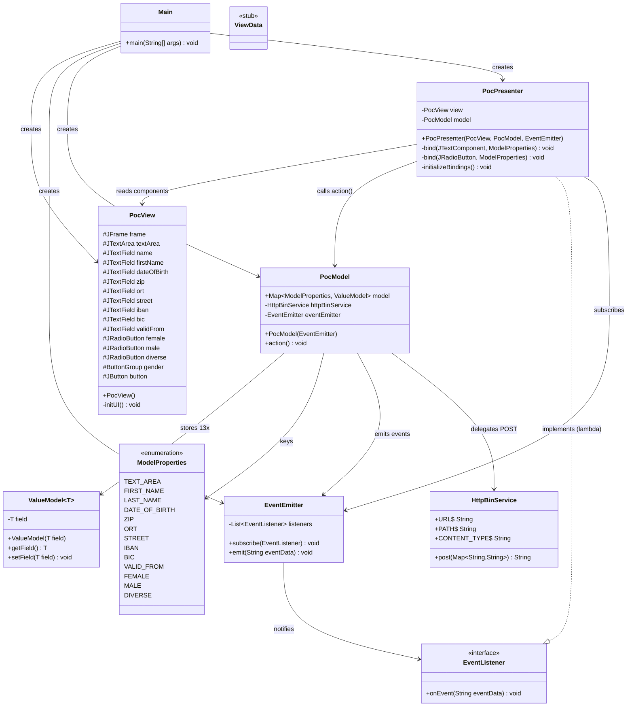
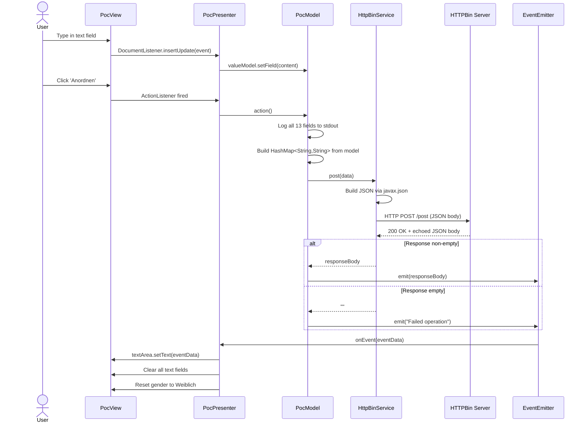
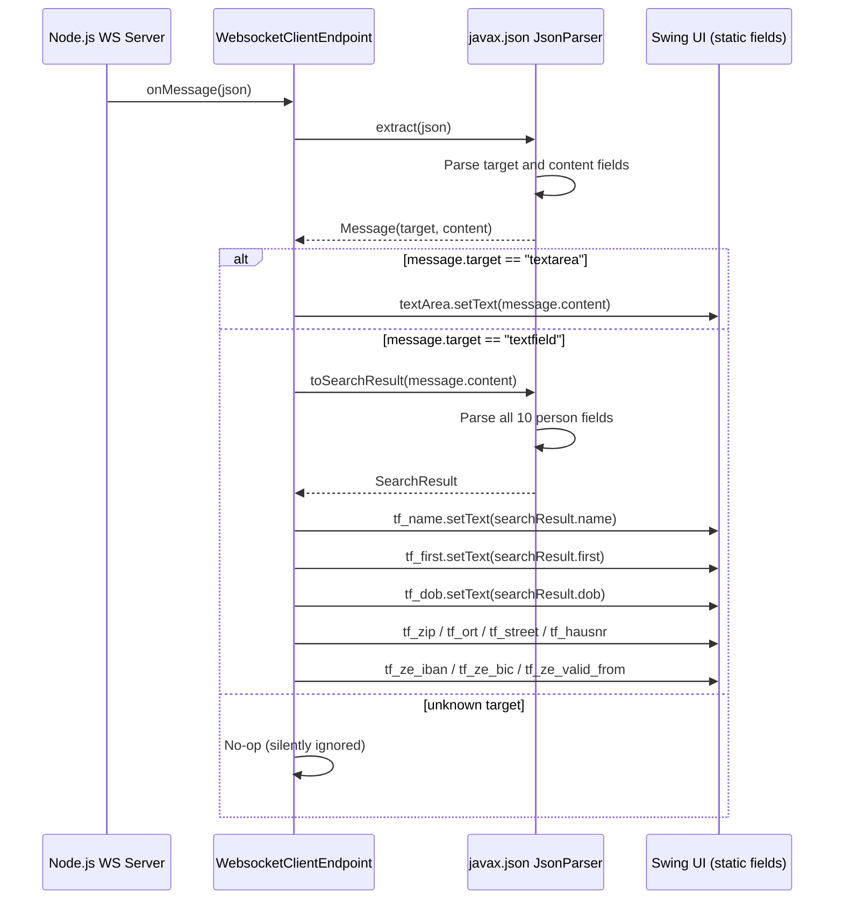
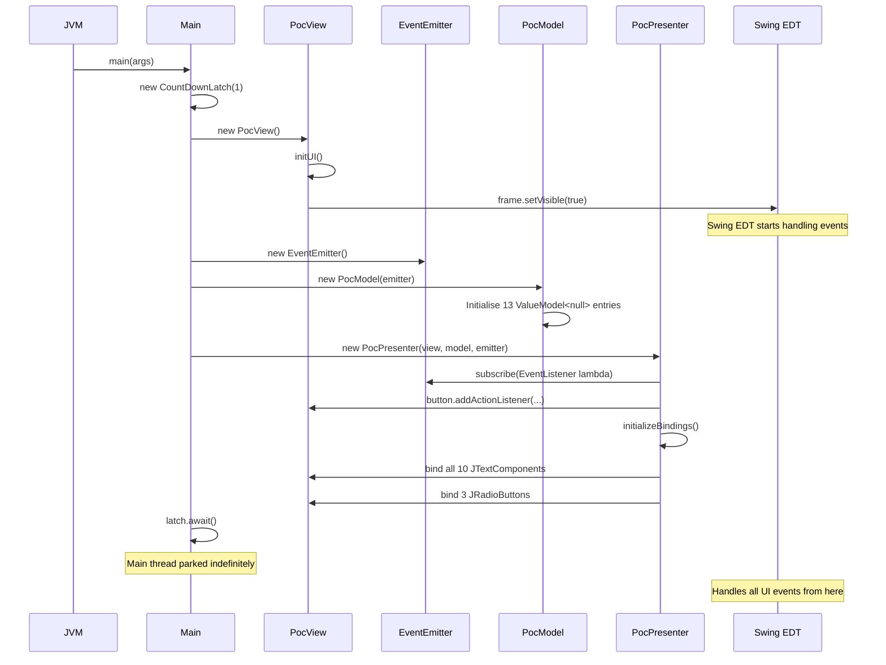
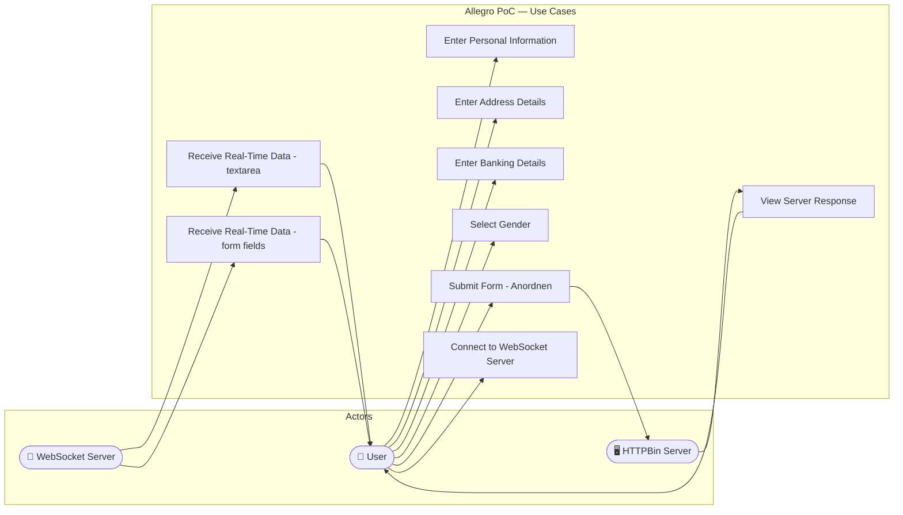

# UML Diagrams — Allegro PoC

> **Generated:** 2025-01-01  
> **System:** websocket_swing / Allegro PoC  
> **Format:** Mermaid syntax

---

## Table of Contents

1. [Class Diagram — MVP Module](#1-class-diagram--mvp-module)
2. [Class Diagram — WebSocket Client](#2-class-diagram--websocket-client)
3. [Class Diagram — Full System Overview](#3-class-diagram--full-system-overview)
4. [Sequence Diagram — Form Submission](#4-sequence-diagram--form-submission)
5. [Sequence Diagram — WebSocket Message Receive](#5-sequence-diagram--websocket-message-receive)
6. [Sequence Diagram — Application Bootstrap](#6-sequence-diagram--application-bootstrap)
7. [Use Case Diagram](#7-use-case-diagram)

---

## 1. Class Diagram — MVP Module



---

## 2. Class Diagram — WebSocket Client

```mermaid
classDiagram
    direction TB

    class WebsocketMain {
        <<class websocket.Main>>
        -CountDownLatch latch$
        -JFrame frame$
        -JTextArea textArea$
        -JTextField tf_name$
        -JTextField tf_first$
        -JTextField tf_dob$
        -JTextField tf_zip$
        -JTextField tf_ort$
        -JTextField tf_street$
        -JTextField tf_hausnr$
        -JTextField tf_ze_iban$
        -JTextField tf_ze_bic$
        -JTextField tf_ze_valid_from$
        -JRadioButton rb_female$
        -JRadioButton rb_male$
        -JRadioButton rb_diverse$
        -JsonParserFactory jsonParserFactory$
        +main(String[]) void$
        -initUI() void$
        +toSearchResult(String json) SearchResult$
    }

    class WebsocketClientEndpoint {
        <<ClientEndpoint>>
        +Session userSession
        +WebsocketClientEndpoint(URI)
        +onOpen(Session) void
        +onClose(Session, CloseReason) void
        +onMessage(String json) void
        +sendMessage(String) void
        +extract(String json) Message$
    }

    class Message {
        <<record-like>>
        +String target
        +String content
        +Message(String target, String message)
    }

    class SearchResult {
        <<record-like>>
        +String name
        +String first
        +String dob
        +String zip
        +String ort
        +String street
        +String hausnr
        +String ze_iban
        +String ze_bic
        +String ze_valid_from
    }

    WebsocketMain +-- WebsocketClientEndpoint : inner class
    WebsocketMain +-- Message : inner class
    WebsocketMain +-- SearchResult : inner class

    WebsocketClientEndpoint --> Message : creates via extract()
    WebsocketClientEndpoint --> SearchResult : creates via toSearchResult()
    WebsocketClientEndpoint --> WebsocketMain : updates static UI fields
```

---

## 3. Class Diagram — Full System Overview

```mermaid
classDiagram
    direction TB

    namespace MVPModule {
        class PocView
        class PocPresenter
        class PocModel
        class EventEmitter
        class EventListener
        class HttpBinService
        class ValueModel
        class ModelProperties
    }

    namespace WebSocketModule {
        class WsMain["websocket.Main"]
        class WsClientEndpoint["WebsocketClientEndpoint"]
        class Message
        class SearchResult
    }

    PocPresenter --> PocView
    PocPresenter --> PocModel
    PocPresenter ..|> EventListener
    PocPresenter --> EventEmitter

    PocModel --> ValueModel
    PocModel --> ModelProperties
    PocModel --> HttpBinService
    PocModel --> EventEmitter

    EventEmitter --> EventListener

    WsMain +-- WsClientEndpoint
    WsMain +-- Message
    WsMain +-- SearchResult

    WsClientEndpoint --> Message
    WsClientEndpoint --> SearchResult

    HttpBinService ..> ExternalHTTPBin["HTTPBin\n(localhost:8080)"] : HTTP POST
    WsClientEndpoint ..> NodeJsServer["Node.js WS Server\n(localhost:1337)"] : WebSocket
```

---

## 4. Sequence Diagram — Form Submission



---

## 5. Sequence Diagram — WebSocket Message Receive



---

## 6. Sequence Diagram — Application Bootstrap



---

## 7. Use Case Diagram


