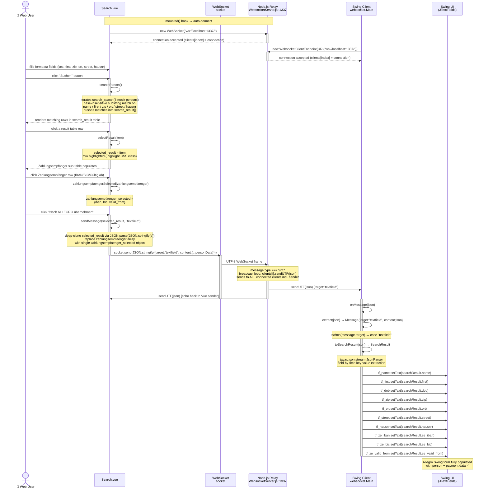
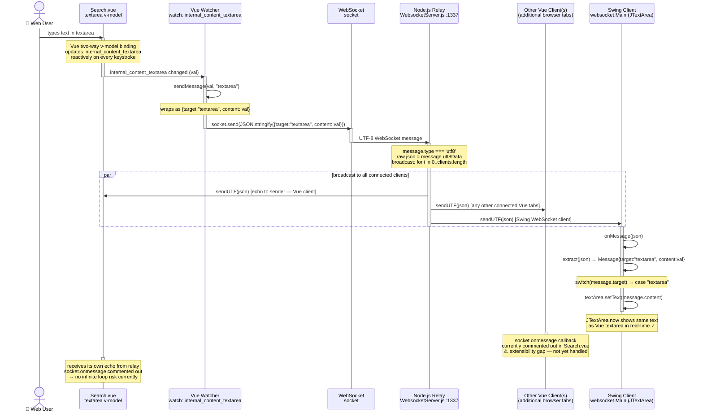
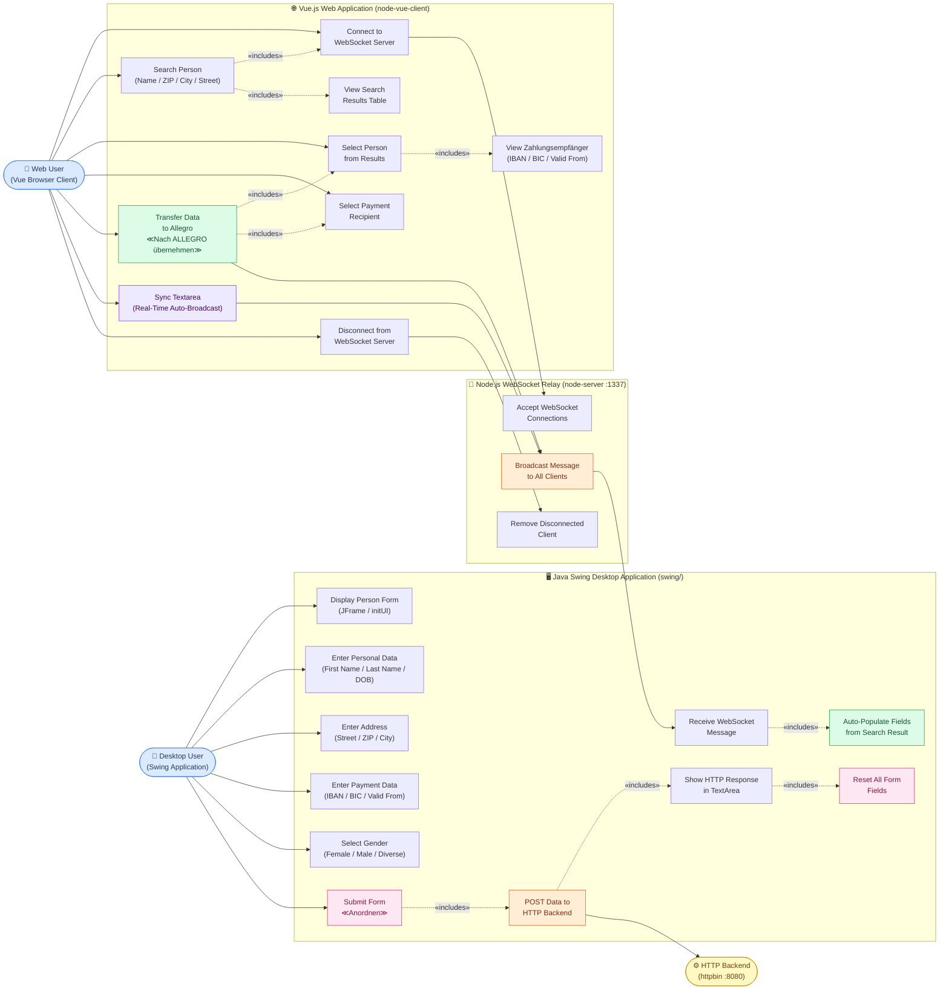

# Allegro PoC — Comprehensive UML Diagrams

> **Repository**: `Chris-Capgemini/test-custom-agents-2`  
> **Format**: Mermaid (all diagrams)  
> **Generated by**: uml-generator agent  
> **Target path requested**: `output/uml-diagrams.md` *(saved here because `output/` dir did not exist)*

---

## Table of Contents

1. [Class Diagram — Full Java MVP + WebSocket Hierarchy](#1-class-diagram--full-java-mvp--websocket-hierarchy)
2. [Sequence Diagram 1 — Form Submission Flow](#2-sequence-diagram-1--form-submission-flow)
3. [Sequence Diagram 2 — Vue Person Search & Allegro Transfer](#3-sequence-diagram-2--vue-person-search--allegro-transfer)
4. [Sequence Diagram 3 — Real-Time Textarea Sync](#4-sequence-diagram-3--real-time-textarea-sync)
5. [Use Case Diagram — System Actors & Capabilities](#5-use-case-diagram--system-actors--capabilities)
6. [Component Diagram — System Architecture Overview](#6-component-diagram--system-architecture-overview)

---

## 1. Class Diagram — Full Java MVP + WebSocket Hierarchy

Shows every Java class, interface, enum and their relationships across the `com.poc` MVP layer and the `websocket` WebSocket client layer, including package groupings, visibility modifiers, and dependency arrows.

```mermaid
classDiagram
    direction TB

    %% ── Package: com ────────────────────────────────────────────────
    namespace com {
        class Main {
            +main(args : String[]) void
        }
    }

    %% ── Package: com.poc ────────────────────────────────────────────
    namespace com_poc {
        class ValueModel~T~ {
            -field : T
            +ValueModel(field : T)
            +getField() T
            +setField(field : T) void
        }
    }

    %% ── Package: com.poc.model ──────────────────────────────────────
    namespace com_poc_model {
        class EventListener {
            <<interface>>
            +onEvent(eventData : String) void
        }

        class EventEmitter {
            -listeners : List~EventListener~
            +subscribe(listener : EventListener) void
            +emit(eventData : String) void
        }

        class ModelProperties {
            <<enumeration>>
            TEXT_AREA
            FIRST_NAME
            LAST_NAME
            DATE_OF_BIRTH
            ZIP
            ORT
            STREET
            IBAN
            BIC
            VALID_FROM
            FEMALE
            MALE
            DIVERSE
        }

        class HttpBinService {
            +URL : String$
            +PATH : String$
            +CONTENT_TYPE : String$
            +post(data : Map~String_String~) String
        }

        class ViewData {
            %% stub — intentionally empty
        }

        class PocModel {
            +model : Map~ModelProperties_ValueModel~
            -httpBinService : HttpBinService
            -eventEmitter : EventEmitter
            +PocModel(eventEmitter : EventEmitter)
            +action() void
        }
    }

    %% ── Package: com.poc.presentation ──────────────────────────────
    namespace com_poc_presentation {
        class PocView {
            #frame : JFrame
            #textArea : JTextArea
            #name : JTextField
            #firstName : JTextField
            #dateOfBirth : JTextField
            #zip : JTextField
            #ort : JTextField
            #street : JTextField
            #iban : JTextField
            #bic : JTextField
            #validFrom : JTextField
            #female : JRadioButton
            #male : JRadioButton
            #diverse : JRadioButton
            #gender : ButtonGroup
            #button : JButton
            +PocView()
            -initUI() void
        }

        class PocPresenter {
            -view : PocView
            -model : PocModel
            +PocPresenter(view : PocView, model : PocModel, emitter : EventEmitter)
            -bind(source : JTextComponent, prop : ModelProperties) void
            -bind(source : JRadioButton, prop : ModelProperties) void
            -initializeBindings() void
        }
    }

    %% ── Package: websocket ──────────────────────────────────────────
    namespace websocket {
        class WsMain {
            -latch : CountDownLatch$
            -frame : JFrame$
            -textArea : JTextArea$
            -tf_name : JTextField$
            -tf_first : JTextField$
            -tf_dob : JTextField$
            -tf_zip : JTextField$
            -tf_ort : JTextField$
            -tf_street : JTextField$
            -tf_hausnr : JTextField$
            -tf_ze_iban : JTextField$
            -tf_ze_bic : JTextField$
            -tf_ze_valid_from : JTextField$
            -rb_female : JRadioButton$
            -rb_male : JRadioButton$
            -rb_diverse : JRadioButton$
            -bg_gender : ButtonGroup$
            +main(args : String[]) void
            -initUI() void
            +toSearchResult(json : String) SearchResult$
        }

        class WebsocketClientEndpoint {
            <<ClientEndpoint>>
            ~userSession : Session
            +WebsocketClientEndpoint(endpointURI : URI)
            +onOpen(session : Session) void
            +onClose(session : Session, reason : CloseReason) void
            +onMessage(json : String) void
            +sendMessage(message : String) void
            +extract(json : String) Message$
        }

        class WsMessage {
            <<record>>
            +target : String
            +content : String
            +WsMessage(target : String, content : String)
        }

        class SearchResult {
            +name : String
            +first : String
            +dob : String
            +zip : String
            +ort : String
            +street : String
            +hausnr : String
            +ze_iban : String
            +ze_bic : String
            +ze_valid_from : String
        }
    }

    %% ── Relationships ───────────────────────────────────────────────

    %% Main wires the MVP triad
    Main ..> PocView           : creates
    Main ..> PocModel          : creates
    Main ..> PocPresenter      : creates
    Main ..> EventEmitter      : creates

    %% MVP internal wiring
    PocPresenter --> PocView        : references
    PocPresenter --> PocModel       : references
    PocPresenter ..> EventEmitter   : subscribes to

    %% PocModel dependencies
    PocModel --> EventEmitter       : emits via
    PocModel --> HttpBinService     : delegates HTTP POST
    PocModel "1" *-- "13" ValueModel~T~ : contains (EnumMap)
    PocModel ..> ModelProperties    : keyed by

    %% EventEmitter aggregates listeners
    EventEmitter "1" o-- "*" EventListener : notifies
    PocPresenter ..|> EventListener : implements (lambda)

    %% WebSocket client inner classes
    WsMain *-- WebsocketClientEndpoint : contains (inner class)
    WsMain *-- WsMessage               : contains (inner class)
    WsMain *-- SearchResult            : contains (inner class)
    WebsocketClientEndpoint ..> WsMessage      : produces
    WebsocketClientEndpoint ..> SearchResult   : uses

    %% Styling
    style EventListener fill:#dbeafe,stroke:#3b82f6,color:#1e3a5f
    style EventEmitter  fill:#dbeafe,stroke:#3b82f6,color:#1e3a5f
    style ModelProperties fill:#fef9c3,stroke:#ca8a04,color:#713f12
    style PocModel      fill:#dcfce7,stroke:#16a34a,color:#14532d
    style PocView       fill:#fce7f3,stroke:#db2777,color:#831843
    style PocPresenter  fill:#ede9fe,stroke:#7c3aed,color:#3b0764
    style HttpBinService fill:#ffedd5,stroke:#ea580c,color:#7c2d12
    style ViewData      fill:#f1f5f9,stroke:#94a3b8,color:#475569
    style WsMain        fill:#fce7f3,stroke:#db2777,color:#831843
    style WebsocketClientEndpoint fill:#ede9fe,stroke:#7c3aed,color:#3b0764
    style SearchResult  fill:#dcfce7,stroke:#16a34a,color:#14532d
    style WsMessage     fill:#f0fdf4,stroke:#4ade80,color:#14532d
```



### Entities
| Class | Package | Role |
|---|---|---|
| `Main` | `com` | Application entry point, composition root |
| `ValueModel<T>` | `com.poc` | Generic typed value container |
| `EventListener` | `com.poc.model` | Observer interface |
| `EventEmitter` | `com.poc.model` | Observable broadcaster |
| `ModelProperties` | `com.poc.model` | Enum of 13 domain field keys |
| `HttpBinService` | `com.poc.model` | HTTP POST client to backend |
| `ViewData` | `com.poc.model` | Empty stub (reserved) |
| `PocModel` | `com.poc.model` | Domain model / data store (EnumMap) |
| `PocView` | `com.poc.presentation` | Swing JFrame UI |
| `PocPresenter` | `com.poc.presentation` | Binds view ↔ model |
| `WsMain` | `websocket` | WebSocket-connected standalone Swing UI |
| `WebsocketClientEndpoint` | `websocket` | JSR-356 WebSocket client (Tyrus) |
| `WsMessage` | `websocket` | Parsed WebSocket message DTO |
| `SearchResult` | `websocket` | Parsed person data from Vue |

### Key Relationships
- `PocPresenter` implements `EventListener` (via lambda) and subscribes to `EventEmitter`
- `PocModel` owns 13 `ValueModel<?>` entries in an `EnumMap` keyed by `ModelProperties`
- `EventEmitter` aggregates `List<EventListener>` and fans-out to all subscribers
- `WebsocketClientEndpoint` is an inner `@ClientEndpoint` class contained inside `WsMain`

---

## 2. Sequence Diagram 1 — Form Submission Flow

Shows the complete lifecycle of the user clicking **"Anordnen"** (Submit): from UI interaction through the MVP stack to HTTP POST and back via event emission resetting the form.

```mermaid
sequenceDiagram
    actor User as 👤 Desktop User
    participant PV  as PocView
    participant PP  as PocPresenter
    participant PM  as PocModel
    participant HBS as HttpBinService
    participant BE  as HTTP Backend<br/>(httpbin :8080)
    participant EE  as EventEmitter

    %% ── Step 1: User types into a field ──────────────────────────────
    User->>PV: types in JTextField / JTextArea / selects JRadioButton
    activate PV
    PV->>PP: DocumentListener.insertUpdate(DocumentEvent)
    activate PP
    PP->>PM: model.get(ModelProperties.X).setField(content)
    note over PM: ValueModel<?> updated<br/>for the changed property
    PP-->>PV: (listener registered — no return value)
    deactivate PP
    deactivate PV

    %% ── Step 2: User clicks "Anordnen" ──────────────────────────────
    User->>PV: click JButton "Anordnen"
    activate PV
    PV->>PP: ActionListener.actionPerformed(ActionEvent)
    activate PP
    PP->>PM: action()
    activate PM

    %% ── Step 3: Model logs all 13 properties ─────────────────────────
    note over PM: iterates ModelProperties.values()<br/>println each of 13 fields to stdout

    %% ── Step 4: Serialise to String map ──────────────────────────────
    PM->>PM: build HashMap&lt;String,String&gt;<br/>(all 13 ValueModel fields → toString())
    note over PM: Boolean gender values coerced<br/>to String via Object.toString()

    %% ── Step 5: HTTP POST ────────────────────────────────────────────
    PM->>HBS: post(data: Map&lt;String,String&gt;)
    activate HBS
    HBS->>BE: POST /post  Content-Type: application/json<br/>{ "FIRST_NAME":"...", "LAST_NAME":"...", ... }
    activate BE
    BE-->>HBS: 200 OK  { "json": {...}, "url": "...", ... }
    deactivate BE
    HBS-->>PM: responseBody (String)
    deactivate HBS

    %% ── Step 6: Decide success / failure ─────────────────────────────
    alt responseBody is non-empty (success path)
        PM->>EE: emit(responseBody)
    else responseBody is empty (failure path)
        PM->>EE: emit("Failed operation")
    end
    deactivate PM

    %% ── Step 7: EventEmitter fans out ────────────────────────────────
    activate EE
    note over EE: iterates List&lt;EventListener&gt;<br/>calls onEvent on each subscriber
    EE->>PP: onEvent(eventData)   [lambda subscriber]
    deactivate EE
    activate PP

    %% ── Step 8: Presenter resets the view ────────────────────────────
    PP->>PV: textArea.setText(eventData)
    PP->>PV: firstName.setText("")
    PP->>PV: name.setText("")
    PP->>PV: dateOfBirth.setText("")
    PP->>PV: zip.setText("")
    PP->>PV: ort.setText("")
    PP->>PV: street.setText("")
    PP->>PV: iban.setText("")
    PP->>PV: bic.setText("")
    PP->>PV: validFrom.setText("")
    PP->>PV: female.setSelected(true)
    PP->>PV: male.setSelected(false)
    PP->>PV: diverse.setSelected(false)
    note over PV: Form cleared ✓<br/>HTTP response shown in textArea
    deactivate PP
    deactivate PV
```

### Flow Summary
| Step | Component | Action |
|---|---|---|
| 1 | User → PocView | Types in JTextField / selects radio; `DocumentListener` fires |
| 2 | PocPresenter | Updates matching `ValueModel<?>` inside `PocModel.model` EnumMap |
| 3 | User → PocView | Clicks **Anordnen** button |
| 4 | PocPresenter | Calls `model.action()` via `ActionListener` |
| 5 | PocModel | Serialises 13 properties to `HashMap<String,String>` |
| 6 | HttpBinService | HTTP POST `application/json` to `localhost:8080/post` |
| 7 | PocModel | Receives response; calls `EventEmitter.emit(responseBody)` |
| 8 | PocPresenter | Receives `onEvent`; resets all 13 view fields + radio buttons |

---

## 3. Sequence Diagram 2 — Vue Person Search & Allegro Transfer

Shows the full search-and-transfer flow: user searches for a person in the Vue web client, selects a Zahlungsempfänger (payment recipient), then sends the data over WebSocket through the Node.js relay into the Java Swing desktop client.



### Flow Summary
| Phase | Component | Detail |
|---|---|---|
| 1 | `Search.vue` `mounted()` | Auto-connects WebSocket; Swing client also connects independently |
| 2 | `searchPerson()` | Client-side filter over 5 mock persons in `search_space` array |
| 3 | `selectResult(item)` | Highlights row; populates Zahlungsempfänger sub-table |
| 4 | `zahlungsempfaengerSelected()` | Captures IBAN/BIC/valid_from into `zahlungsempfaenger_selected` |
| 5 | `sendMessage(..., "textfield")` | JSON payload `{target:"textfield", content:{...}}` sent over WS |
| 6 | Node.js relay | Fan-out broadcast to **all** entries in `clients[]` |
| 7 | `onMessage(json)` in `WsMain` | Parses JSON, populates all 10 JTextField fields |

---

## 4. Sequence Diagram 3 — Real-Time Textarea Sync

Shows the Vue watcher-triggered broadcast: any keystroke in the `internal_content_textarea` of the Vue client is automatically transmitted over WebSocket and reflected live in every connected client's textarea — including the Java Swing JTextArea.



### Flow Summary
| Step | Trigger | Detail |
|---|---|---|
| 1 | User keystroke | `v-model` reactive binding updates `internal_content_textarea` on every change |
| 2 | Vue `watch` | `watch.internal_content_textarea(val)` fires synchronously |
| 3 | `sendMessage(val, "textarea")` | Wraps text in `{target:"textarea", content:val}` JSON |
| 4 | Node.js relay | Raw `utf8Data` broadcast to **all** `clients[]` — no filtering |
| 5 | Swing `onMessage` | `switch("textarea")` → `textArea.setText(content)` |
| 6 | Echo to sender | Vue sender also receives its own message; `onmessage` is commented out so no loop |

> ⚠️ **Identified Gap**: `socket.onmessage` in `Search.vue` is commented out — other Vue clients cannot react to received messages. This is an extensibility point for future multi-user sync.

---

## 5. Use Case Diagram — System Actors & Capabilities

Documents all system capabilities from the perspective of each actor in the Allegro PoC ecosystem, with include/extend relationships.



### Actors
| Actor | Type | Description |
|---|---|---|
| **Web User** | Human | Operates the Vue.js search interface in a browser |
| **Desktop User** | Human | Operates the Java Swing Allegro desktop application |
| **HTTP Backend** | External System | `httpbin` mock on `:8080` — accepts and echoes JSON POST requests |

### Core Use Cases
| Use Case | Primary Actor | System |
|---|---|---|
| Search Person | Web User | Vue SPA (client-side filter) |
| Transfer to Allegro | Web User | Vue → Node.js relay → Swing |
| Sync Textarea | Web User (auto-watch) | Vue → Node.js → all clients |
| Submit Form (Anordnen) | Desktop User | Swing MVP → HTTP Backend |
| Auto-Populate Fields | Swing Client | WebSocket receive → JTextField.setText |

---

## 6. Component Diagram — System Architecture Overview

Shows all runtime components, technology stack, communication protocols, ports, and data flows across the entire Allegro PoC multi-component system.

```mermaid
graph TB
    %% ── External actors ──────────────────────────────────────────────
    WebBrowser(["🌍 Web Browser\n(Web User)"])
    DesktopOS(["🖥️ Desktop JVM\n(Desktop User)"])

    %% ── Vue.js SPA ───────────────────────────────────────────────────
    subgraph VueSPA ["📦 Vue.js SPA  ·  node-vue-client/  ·  Vue 2.6"]
        direction TB
        AppVue["App.vue\n(Root Shell component)"]
        SearchVue["Search.vue\n(Search + Transfer UI)\n─────────────────\ndata: formdata, search_result\nselected_result, search_space[5]\nzahlungsempfaenger_selected"]
        VueWatcher["Vue Watcher\nwatch: internal_content_textarea\n→ auto sendMessage on change"]
        VueWS["WebSocket Client\nnative browser WebSocket API\nws://localhost:1337"]

        AppVue --> SearchVue
        SearchVue --> VueWatcher
        SearchVue --> VueWS
    end

    %% ── Node.js Relay ────────────────────────────────────────────────
    subgraph NodeServer ["📦 Node.js Relay  ·  node-server/src/WebsocketServer.js  ·  :1337"]
        direction TB
        HttpSrv["http.createServer()\n(HTTP upgrade handler)"]
        WSServer["WebSocketServer\n(websocket npm package)\n─────────────────\nwsServer.on('request', ...)"]
        ClientsList["clients[]\nconnected client array\n(push on connect, splice on close)"]
        BroadcastLoop["broadcast loop\nfor i in 0..clients.length\nclients[i].sendUTF(json)"]

        HttpSrv --> WSServer
        WSServer --> ClientsList
        ClientsList --> BroadcastLoop
    end

    %% ── Java Swing MVP Application ───────────────────────────────────
    subgraph SwingMVP ["📦 Java Swing MVP  ·  swing/src/main/java/com/poc  ·  Java 22"]
        direction TB
        PocMain["Main.java\n(Composition Root)\n─────────────────\nnew PocView()\nnew EventEmitter()\nnew PocModel(emitter)\nnew PocPresenter(view, model, emitter)\nlatch.await()"]
        PocView2["PocView\nJFrame + Swing widgets\n─────────────────\n10 x JTextField\n1 x JTextArea\n3 x JRadioButton (gender)\n1 x JButton Anordnen"]
        PocPresenter2["PocPresenter\n(Mediator)\n─────────────────\nbind(JTextComponent, prop)\nbind(JRadioButton, prop)\ninitializeBindings()"]
        PocModel2["PocModel\n(Domain Model)\n─────────────────\nEnumMap&lt;ModelProperties, ValueModel&lt;?&gt;&gt;\n13 typed field slots\naction(): POST + emit"]
        EventEmitter2["EventEmitter\n(Observer Hub)\n─────────────────\nList&lt;EventListener&gt; listeners\nsubscribe() / emit()"]
        HttpBinSvc["HttpBinService\n(HTTP Client)\n─────────────────\nPOST application/json\nto localhost:8080/post"]
        VMContainer["ValueModel&lt;T&gt; × 13\nTyped field containers\n(String / Boolean)"]

        PocMain --> PocView2
        PocMain --> PocModel2
        PocMain --> PocPresenter2
        PocMain --> EventEmitter2
        PocPresenter2 -->|binds| PocView2
        PocPresenter2 -->|updates| PocModel2
        PocPresenter2 -->|subscribes| EventEmitter2
        PocModel2 -->|emits| EventEmitter2
        PocModel2 --> HttpBinSvc
        PocModel2 --> VMContainer
    end

    %% ── Java Swing WebSocket Client ──────────────────────────────────
    subgraph SwingWS ["📦 Java WebSocket Client  ·  swing/src/main/java/websocket  ·  Tyrus JSR-356"]
        direction TB
        WsMain2["websocket.Main\n(Entry Point + Swing UI)\n─────────────────\n10 x JTextField\n1 x JTextArea\n3 x JRadioButton (gender)"]
        WsEndpoint["WebsocketClientEndpoint\n(@ClientEndpoint)\n─────────────────\nonOpen / onClose / onMessage\nextract(json) → Message\ntoSearchResult(json) → SearchResult"]
        MsgRouter["Message Router\nswitch(message.target)\n─────────────────\n'textarea' → textArea.setText()\n'textfield' → populate 10 fields"]

        WsMain2 --> WsEndpoint
        WsEndpoint --> MsgRouter
        MsgRouter --> WsMain2
    end

    %% ── External HTTP Backend ────────────────────────────────────────
    subgraph Backend ["☁️ HTTP Backend  ·  :8080"]
        HttpBin["kennethreitz/httpbin\n(Docker container)\n─────────────────\nPOST /post\nEchoes JSON body in response"]
    end

    %% ── Inter-component connections ──────────────────────────────────
    WebBrowser -->|"renders / runs"| VueSPA

    VueWS      -->|"WebSocket\nws://localhost:1337/\n{target, content} JSON"| NodeServer
    WsEndpoint -->|"WebSocket\nws://localhost:1337/\nTyrus JSR-356 client"| NodeServer

    NodeServer -->|"broadcast UTF-8\n{target:'textfield'|'textarea', content:...}"| VueWS
    NodeServer -->|"broadcast UTF-8\n{target:'textfield'|'textarea', content:...}"| WsEndpoint

    HttpBinSvc -->|"HTTP POST /post\napplication/json\n13-field body"| Backend

    DesktopOS  -->|"runs (JVM)"| SwingMVP
    DesktopOS  -->|"runs (JVM)"| SwingWS

    %% ── Styling ──────────────────────────────────────────────────────
    style VueSPA         fill:#dbeafe,stroke:#3b82f6,color:#1e3a5f
    style NodeServer     fill:#dcfce7,stroke:#16a34a,color:#14532d
    style SwingMVP       fill:#fce7f3,stroke:#db2777,color:#831843
    style SwingWS        fill:#ede9fe,stroke:#7c3aed,color:#3b0764
    style Backend        fill:#fef9c3,stroke:#ca8a04,color:#713f12
    style AppVue         fill:#bfdbfe,stroke:#2563eb,color:#1e3a5f
    style SearchVue      fill:#93c5fd,stroke:#1d4ed8,color:#1e3a5f
    style VueWatcher     fill:#a5b4fc,stroke:#4f46e5,color:#1e1b4b
    style WSServer       fill:#86efac,stroke:#15803d,color:#14532d
    style BroadcastLoop  fill:#6ee7b7,stroke:#059669,color:#064e3b
    style PocModel2      fill:#fda4af,stroke:#be123c,color:#881337
    style PocPresenter2  fill:#f9a8d4,stroke:#be185d,color:#831843
    style PocView2       fill:#fbcfe8,stroke:#db2777,color:#831843
    style EventEmitter2  fill:#c7d2fe,stroke:#4f46e5,color:#1e1b4b
    style WsEndpoint     fill:#c4b5fd,stroke:#6d28d9,color:#3b0764
    style MsgRouter      fill:#ddd6fe,stroke:#7c3aed,color:#3b0764
    style HttpBin        fill:#fde68a,stroke:#b45309,color:#78350f
```



### Component Inventory
| Component | Technology | Port | Description |
|---|---|---|---|
| **Vue SPA** (`node-vue-client/`) | Vue.js 2.6 + Vue CLI 4 | browser | Search UI + WebSocket client |
| **Search.vue** | Vue component | — | Person search, result selection, transfer |
| **Node.js Relay** (`node-server/`) | Node.js + `websocket` npm | **1337** | HTTP upgrade → WS broadcast relay |
| **Swing MVP** (`swing/com.poc`) | Java 22 + Swing | — | MVP form app with HTTP POST |
| **Swing WS Client** (`swing/websocket`) | Java 22 + Tyrus (JSR-356) | — | WebSocket client, populates Swing form |
| **HTTP Backend** | `httpbin` Docker | **8080** | Mock POST echo service |

### Protocol Reference
| Link | Protocol | Payload Format |
|---|---|---|
| Vue `Search.vue` ↔ Node.js relay | **WebSocket** `ws://localhost:1337` | `JSON { target: string, content: object\|string }` |
| Swing `WebsocketClientEndpoint` ↔ Node.js relay | **WebSocket** `ws://localhost:1337` | same JSON envelope |
| Node.js → all clients | **WebSocket broadcast** | raw UTF-8 JSON frame (no transformation) |
| Swing `HttpBinService` → Backend | **HTTP POST** `localhost:8080/post` | `application/json` — 13-field string map |

### Message Routing (target field)
| `target` | Sender | Swing Receiver Action |
|---|---|---|
| `"textfield"` | Vue — **Nach ALLEGRO übernehmen** click | Populates 10 JTextFields with person + payment data |
| `"textarea"` | Vue — automatic watcher on every keystroke | Sets `textArea.setText(content)` |

---

*Diagrams generated by **uml-generator** agent · Mermaid format · All source files read-only · No source code was modified*
