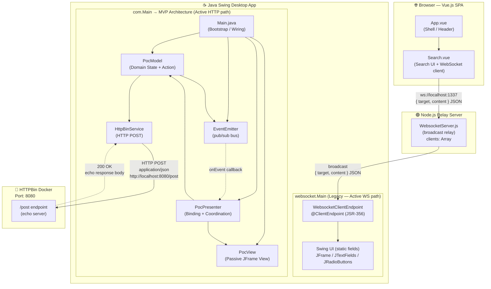
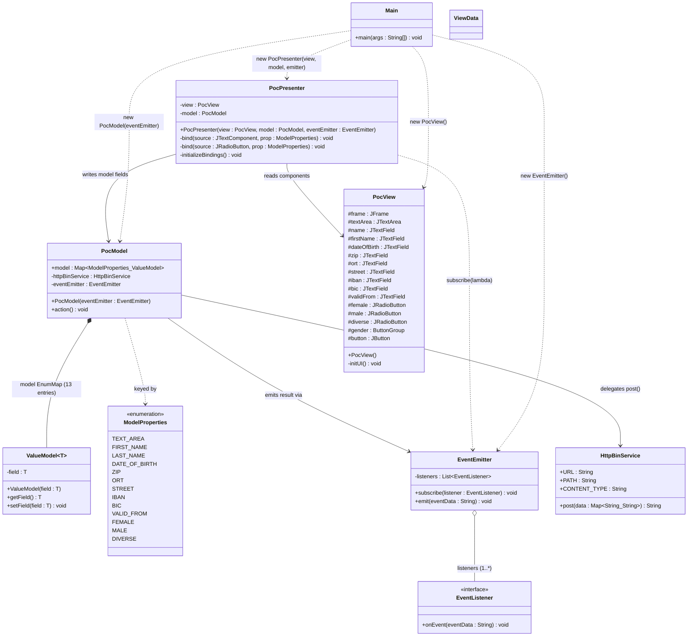
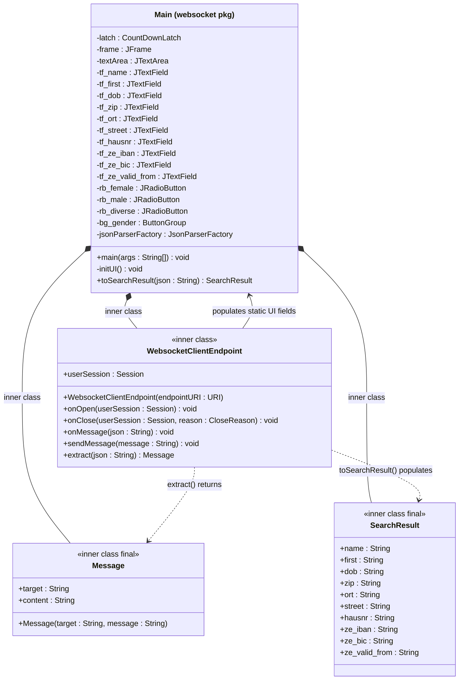
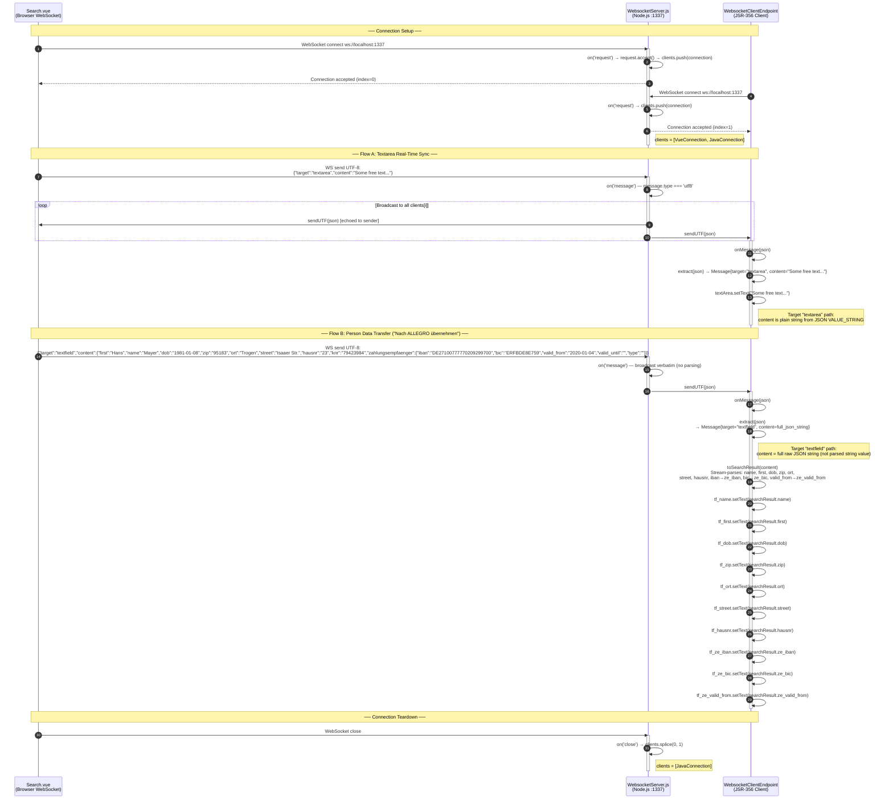
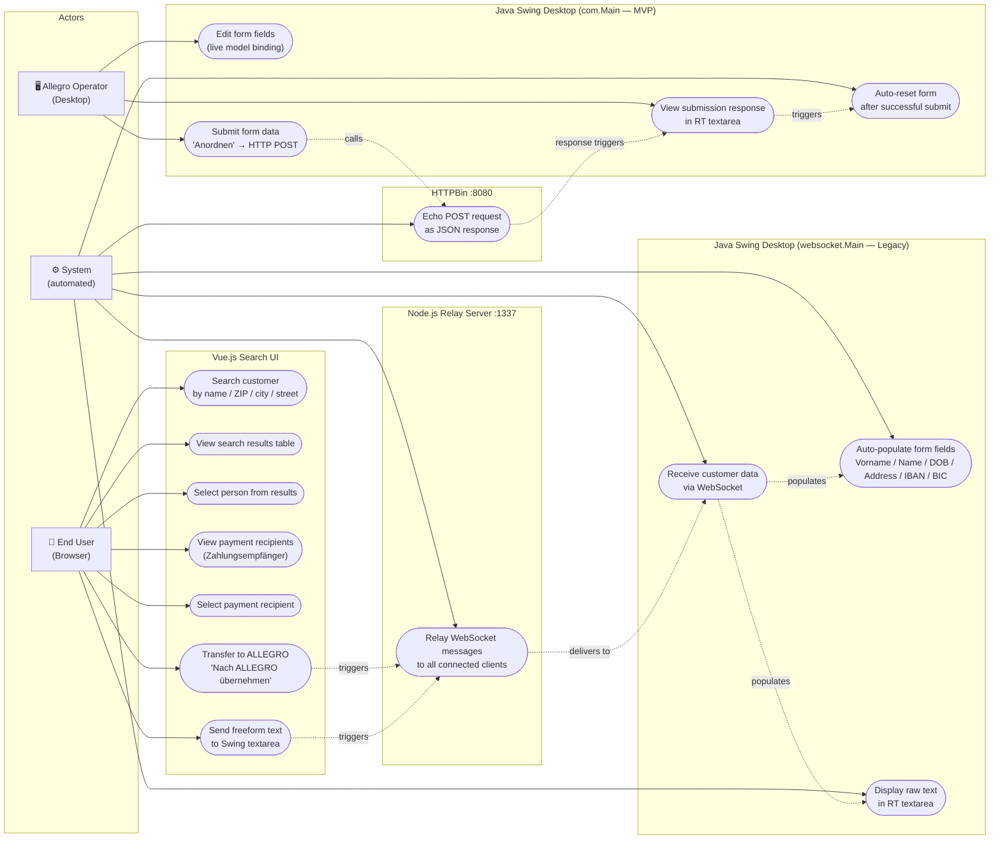

# UML Diagrams — Java Swing WebSocket PoC (Allegro)

> Generated by **uml-agent** | Source: `analysis_output/analysis_results.json` + direct source file inspection  
> Architecture: **Vue.js Search UI → ws://localhost:1337 → Node.js Relay → Java Swing (MVP) → HTTP POST → HTTPBin**

---

## Table of Contents

| # | Type | Title |
|---|------|-------|
| 1 | Architecture | [System Architecture Overview](#1-system-architecture-overview) |
| 2 | Class Diagram | [Java MVP Architecture — Full Detail](#2-java-mvp-architecture--full-detail) |
| 3 | Class Diagram | [Legacy WebSocket Module (`websocket.Main`)](#3-legacy-websocket-module) |
| 4 | Class Diagram | [Node.js Server & Vue.js Frontend Components](#4-nodejs-server--vuejs-frontend-components) |
| 5 | Sequence | [Main Business Flow: Search → Select → Transfer → Submit](#5-main-business-flow-sequence) |
| 6 | Sequence | [MVP Internal Flow: Form Binding & HTTP Submission](#6-mvp-internal-flow-sequence) |
| 7 | Sequence | [WebSocket Message Routing (Node.js Relay)](#7-websocket-message-routing-sequence) |
| 8 | Use Case | [System Use Cases — All Actors](#8-system-use-case-diagram) |

**Diagram counts:** 3 Class Diagrams · 3 Sequence Diagrams · 1 Use Case Diagram · 1 Architecture Overview

---

## 1. System Architecture Overview

High-level view of the three-tier PoC architecture showing all components, their technology stacks, communication protocols, and port assignments.

> ⚠️ **Known architectural gap:** `com.Main` (the MVP entry point) wires `PocView`, `PocModel`, and `PocPresenter` but does **not** include a WebSocket client. The end-to-end flow therefore runs via the **legacy** `websocket.Main` (receives WebSocket data + populates Swing UI) rather than the MVP path. The MVP provides the HTTP POST submission. These two halves are not connected in the current codebase.



---

## 2. Java MVP Architecture — Full Detail

Complete class diagram for all Java classes in the `com.*` package hierarchy. Shows attributes, methods, visibility, and all inter-class relationships.



### Package Layout Reference

```
com/
├── Main.java                         ← Bootstrap / MVP wiring
└── poc/
    ├── ValueModel.java               ← Generic typed value holder (T)
    └── model/
    │   ├── EventEmitter.java         ← Publish-subscribe event bus
    │   ├── EventListener.java        ← @FunctionalInterface for events
    │   ├── HttpBinService.java       ← HTTP POST to HTTPBin :8080
    │   ├── ModelProperties.java      ← Enum: 13 domain field constants
    │   ├── PocModel.java             ← Domain model + action() submit
    │   └── ViewData.java             ← Empty placeholder (future DTO)
    └── presentation/
        ├── PocPresenter.java         ← MVP Presenter: binds View ↔ Model
        └── PocView.java              ← Passive JFrame View (no logic)
```

---

## 3. Legacy WebSocket Module

Class diagram for `websocket.Main` and its three inner classes. This is the **pre-MVP monolith** that combines Swing UI construction, WebSocket lifecycle, and JSON parsing in a single file. It is the active path for receiving WebSocket data from the Node.js relay and populating the Swing form.



### Message Routing Logic in `onMessage()`

```
onMessage(json)
    │
    ├─ extract(json) → Message { target, content }
    │
    ├─ target == "textarea"  → textArea.setText(message.content)
    │
    └─ target == "textfield" → toSearchResult(message.content) → SearchResult
                                 → tf_name, tf_first, tf_dob, tf_zip,
                                   tf_ort, tf_street, tf_hausnr,
                                   tf_ze_iban, tf_ze_bic, tf_ze_valid_from
                                   all populated via setText()
```

---

## 4. Node.js Server & Vue.js Frontend Components

Structural overview of the Node.js WebSocket relay server and the Vue.js SPA frontend components.

```mermaid
classDiagram
    direction LR

    class WebsocketServer {
        <<Node.js module>>
        -port : Number = 1337
        -clients : Array~WebSocketConnection~
        -messages : Array
        +on_request(request : WebSocketRequest) void
        +on_message(message : IMessage) void
        +on_close(connection : WebSocketConnection) void
        -broadcast(json : String) void
    }

    class AppVue {
        <<Vue Component>>
        +name : String = App
        %% No business logic — shell only
        +render() void
    }

    class SearchVue {
        <<Vue Component>>
        +name : String = Search
        %% Props
        +result_selected : String
        +content_textarea : String
        %% Data
        -socket : WebSocket
        -internal_content_textarea : String
        -formdata : Object
        -search_result : Array~Person~
        -selected_result : Person
        -zahlungsempfaenger_selected : Zahlungsempfaenger
        -search_space : Array~Person~
        %% Methods
        +connect() void
        +disconnect() void
        +searchPerson() void
        +sendMessage(e : Object, target : String) void
        +selectResult(item : Person) void
        +zahlungsempfaengerSelected(ze : Zahlungsempfaenger) void
    }

    class Person {
        <<data model>>
        +first : String
        +name : String
        +dob : String
        +zip : String
        +ort : String
        +street : String
        +hausnr : String
        +knr : String
        +zahlungsempfaenger : Array~Zahlungsempfaenger~
    }

    class Zahlungsempfaenger {
        <<data model>>
        +iban : String
        +bic : String
        +valid_from : String
        +valid_until : String
        +type : String
    }

    class WebSocketMessage {
        <<wire protocol>>
        +target : String
        +content : Object
        %% target = "textfield" → content is Person with single ZE
        %% target = "textarea"  → content is plain String
    }

    %% Vue component tree
    AppVue *-- SearchVue : embeds

    %% Search component uses data models
    SearchVue *-- Person : search_space (5 mock persons)
    Person *-- Zahlungsempfaenger : zahlungsempfaenger (1..3 per person)
    SearchVue --> Zahlungsempfaenger : zahlungsempfaenger_selected

    %% WebSocket communication
    SearchVue ..> WebSocketMessage : sends via socket.send()
    SearchVue --> WebsocketServer : ws://localhost:1337
    WebsocketServer ..> WebSocketMessage : broadcasts to all clients
```

### Mock Dataset Summary (hardcoded `search_space` in Search.vue)

| # | Name | Vorname | DOB | ZIP | City | ZE Count |
|---|------|---------|-----|-----|------|----------|
| 1 | Mayer | Hans | 1981-01-08 | 95183 | Trogen | 2 |
| 2 | Reitmayr | Linda | 1979-05-12 | 92148 | Hof | 1 |
| 3 | May | Karl | 1964-11-02 | 10124 | Berlin | 3 |
| 4 | Mueller | Jens | 1999-04-21 | 14489 | Potsdam | 2 |
| 5 | Ruckmueller | Steffi | 1961-11-05 | 14432 | Templin | 2 |

---

## 5. Main Business Flow Sequence

The complete end-to-end user journey: from entering search criteria in the Vue.js browser UI, through the Node.js relay, to populating the Java Swing form, and finally submitting via HTTP POST to HTTPBin.

> **Note on active paths:** Step 1–12 run via `websocket.Main` (legacy). Steps 13–18 run via `com.Main` (MVP). The two modules run as separate JVM processes; in the PoC they share the same Swing screen layout but are **not** connected in code.

```mermaid
sequenceDiagram
    autonumber
    actor User as 👤 User (Browser)
    participant Search as Search.vue
    participant Node as Node.js Relay<br/>:1337
    participant WsEndpoint as WebsocketClientEndpoint<br/>(websocket.Main)
    participant SwingUI as Swing UI Fields<br/>(websocket.Main static)
    participant MVP_Presenter as PocPresenter<br/>(com.Main MVP)
    participant MVP_Model as PocModel<br/>(com.Main MVP)
    participant HTTPBin as HTTPBin<br/>:8080/post

    Note over User, Search: ── Phase 1: Person Search ──

    User->>Search: Fill search fields (Name / Vorname / PLZ / Ort / Strasse)
    User->>Search: Click "Suchen"
    activate Search
    Search->>Search: searchPerson() — OR-filter over search_space[5]
    Note right of Search: Case-insensitive substring match<br/>for text fields; exact match for ZIP
    Search-->>User: Display matching rows in results table
    deactivate Search

    Note over User, Search: ── Phase 2: Selection ──

    User->>Search: Click person row
    activate Search
    Search->>Search: selectResult(item) → selected_result = item
    Search-->>User: Highlight row; show Zahlungsempfänger table
    deactivate Search

    User->>Search: Click Zahlungsempfänger row
    activate Search
    Search->>Search: zahlungsempfaengerSelected(ze)<br/>→ zahlungsempfaenger_selected = ze
    Search-->>User: Highlight payment row
    deactivate Search

    Note over User, Node: ── Phase 3: Transfer to Allegro Swing ──

    User->>Search: Click "Nach ALLEGRO übernehmen"
    activate Search
    Search->>Search: sendMessage(selected_result, 'textfield')<br/>Replace ZE array with single selected ZE
    Note right of Search: obj = deep-clone(selected_result)<br/>obj.zahlungsempfaenger = zahlungsempfaenger_selected<br/>socket.send(JSON.stringify({target:'textfield', content:obj}))
    Search->>Node: WS send: {target:"textfield", content:{first,name,dob,zip,ort,street,hausnr,knr,zahlungsempfaenger:{iban,bic,valid_from}}}
    deactivate Search

    activate Node
    Node->>Node: on('message') — broadcast to all connected clients
    Node->>WsEndpoint: WS send (broadcast same JSON)
    deactivate Node

    activate WsEndpoint
    WsEndpoint->>WsEndpoint: onMessage(json)
    WsEndpoint->>WsEndpoint: extract(json) → Message{target="textfield", content=...}
    WsEndpoint->>WsEndpoint: toSearchResult(content)<br/>→ SearchResult{name,first,dob,zip,ort,street,hausnr,ze_iban,ze_bic,ze_valid_from}
    WsEndpoint->>SwingUI: setText() on all 10 JTextFields
    deactivate WsEndpoint
    SwingUI-->>User: Swing form populated with person + payment data

    Note over User, HTTPBin: ── Phase 4: Allegro Submission (MVP path) ──

    User->>MVP_Presenter: Review form fields; click "Anordnen"
    activate MVP_Presenter
    MVP_Presenter->>MVP_Presenter: button ActionListener fires
    MVP_Presenter->>MVP_Model: model.action()
    activate MVP_Model
    MVP_Model->>MVP_Model: Collect all 13 ValueModel fields → Map~String,String~
    MVP_Model->>HTTPBin: HttpBinService.post(data)<br/>HTTP POST application/json to localhost:8080/post
    activate HTTPBin
    HTTPBin-->>MVP_Model: 200 OK — echo response body (JSON)
    deactivate HTTPBin
    MVP_Model->>MVP_Model: eventEmitter.emit(responseBody)
    deactivate MVP_Model
    MVP_Presenter->>MVP_Presenter: onEvent(responseBody) callback fires<br/>view.textArea.setText(responseBody)<br/>Clear all input fields; set female=selected
    deactivate MVP_Presenter
    MVP_Presenter-->>User: Response displayed in RT textarea; form reset
```

---

## 6. MVP Internal Flow Sequence

Focused view of the MVP architecture: how `PocPresenter` binds `PocView` components to `PocModel` state, and how the form submission round-trip works through `EventEmitter`.

```mermaid
sequenceDiagram
    autonumber
    participant Main as Main.java<br/>(Bootstrap)
    participant View as PocView<br/>(JFrame)
    participant Emitter as EventEmitter
    participant Model as PocModel
    participant Presenter as PocPresenter
    participant Http as HttpBinService

    Note over Main, Presenter: ── Startup: Dependency Wiring ──

    Main->>View: new PocView() → initUI() → JFrame visible
    activate View
    View-->>Main: pocView
    deactivate View

    Main->>Emitter: new EventEmitter()
    activate Emitter
    Emitter-->>Main: eventEmitter (empty listeners list)
    deactivate Emitter

    Main->>Model: new PocModel(eventEmitter)<br/>Initialises 13 ValueModel entries (all null)
    activate Model
    Model-->>Main: pocModel
    deactivate Model

    Main->>Presenter: new PocPresenter(pocView, pocModel, eventEmitter)
    activate Presenter

    Note over Presenter, Emitter: ── Constructor: Subscribe to Events ──
    Presenter->>Emitter: subscribe(lambda: onEvent → reset view)
    Note right of Presenter: Lambda: setText(eventData) on textArea,<br/>clear all fields, set female.selected=true

    Note over Presenter, View: ── Constructor: Wire Button Listener ──
    Presenter->>View: button.addActionListener(→ model.action())

    Note over Presenter, Model: ── Constructor: initializeBindings() ──
    loop For each of 13 ModelProperties
        Presenter->>View: read component reference (textField or radioButton)
        Presenter->>Model: model.model.get(prop) → ValueModel
        Presenter->>View: component.addDocumentListener / addChangeListener
        Note right of Presenter: DocumentListener: every keystroke calls<br/>valueModel.setField(component.getText())<br/>ChangeListener: radioButton state → Boolean valueModel
    end
    Presenter-->>Main: pocPresenter (fully wired)
    deactivate Presenter

    Note over View, Http: ── Runtime: User Edits & Submits ──

    actor User
    User->>View: Type in text field (e.g. IBAN)
    activate View
    View->>Presenter: DocumentListener.insertUpdate(event)
    activate Presenter
    Presenter->>Model: valueModel.setField("DE27100...")
    Note right of Model: In-memory state updated<br/>no validation performed
    deactivate Presenter
    deactivate View

    User->>View: Click "Anordnen" button
    activate View
    View->>Presenter: ActionListener fires
    activate Presenter
    Presenter->>Model: model.action()
    activate Model

    Model->>Model: Build HashMap from all 13 ModelProperties values
    Model->>Http: httpBinService.post(data)
    activate Http
    Note right of Http: HTTP POST to http://localhost:8080/post<br/>Content-Type: application/json<br/>Body: flat JSON object of all 13 fields
    Http-->>Model: responseBody: String
    deactivate Http

    alt responseBody is non-empty
        Model->>Emitter: eventEmitter.emit(responseBody)
        activate Emitter
        Emitter->>Presenter: listener.onEvent(responseBody)
        deactivate Emitter
        Presenter->>View: textArea.setText(responseBody)
        Presenter->>View: Clear all 9 text fields
        Presenter->>View: female.setSelected(true)
        View-->>User: Response shown; form reset to defaults
    else responseBody is empty
        Model->>Emitter: eventEmitter.emit("Failed operation")
        activate Emitter
        Emitter->>Presenter: listener.onEvent("Failed operation")
        deactivate Emitter
        Presenter->>View: textArea.setText("Failed operation")
        View-->>User: Error indicator in RT textarea
    end

    deactivate Model
    deactivate Presenter
    deactivate View
```

---

## 7. WebSocket Message Routing Sequence

Detailed view of the Node.js relay server's broadcast behaviour, covering both message types: `"textfield"` (person data transfer) and `"textarea"` (real-time text sync).



---

## 8. System Use Case Diagram

All actors and their interactions with the system's functional capabilities.



### Actor Responsibilities

| Actor | Description | Primary Use Cases |
|-------|-------------|-------------------|
| **End User (Browser)** | Caseworker using the Vue.js web UI to look up and transfer customer data | UC1–UC7 |
| **Allegro Operator (Desktop)** | Caseworker using the Java Swing Allegro desktop application | UC12–UC14 |
| **System (automated)** | Background processes: Node.js relay, WebSocket listeners, event handlers, HTTP client | UC8–UC11, UC15–UC16 |

---

## Appendix A: OpenAPI Contract (`api.yml`)

The HTTP POST endpoint between `HttpBinService` and HTTPBin is formally documented in `api.yml`:

| Field | OpenAPI Path | Type | Notes |
|-------|-------------|------|-------|
| `FIRST_NAME` | `PostObject.FIRST_NAME` | string | Maps `ModelProperties.FIRST_NAME` |
| `LAST_NAME` | `PostObject.LAST_NAME` | string | Maps `ModelProperties.LAST_NAME` |
| `DATE_OF_BIRTH` | `PostObject.DATE_OF_BIRTH` | string | Maps `ModelProperties.DATE_OF_BIRTH` |
| `STREET` | `PostObject.STREET` | string | Maps `ModelProperties.STREET` |
| `ZIP` | `PostObject.ZIP` | string | Maps `ModelProperties.ZIP` |
| `ORT` | `PostObject.ORT` | string | Maps `ModelProperties.ORT` |
| `IBAN` | `PostObject.IBAN` | string | Maps `ModelProperties.IBAN` |
| `BIC` | `PostObject.BIC` | string | Maps `ModelProperties.BIC` |
| `VALID_FROM` | `PostObject.VALID_FROM` | string | Maps `ModelProperties.VALID_FROM` |
| `FEMALE` | `PostObject.FEMALE` | string | Boolean flag — sent as string |
| `MALE` | `PostObject.MALE` | string | Boolean flag — sent as string |
| `DIVERSE` | `PostObject.DIVERSE` | string | Boolean flag — sent as string |
| `TEXT_AREA` | `PostObject.TEXT_AREA` | string | Maps `ModelProperties.TEXT_AREA` |

**Endpoint:** `POST http://localhost:8080/post`  
**Content-Type:** `application/json`  
**Response:** `200 OK` — `PostResponseObject` (HTTPBin echo: args, data, form, headers, json, origin, url)

---

## Appendix B: Key Architectural Findings

| Finding | Impact | Location |
|---------|--------|----------|
| MVP entry point (`com.Main`) has **no WebSocket client** | The primary business flow (search → populate Swing) only works via `websocket.Main` (legacy), not via MVP | `com/Main.java` |
| `PocModel.action()` calls `.toString()` on all 13 ValueModels — all initialised to `null` | **NullPointerException** on every first click of "Anordnen" before fields are populated | `PocModel.java:39` |
| `HttpBinService.post()` runs on the **Event Dispatch Thread** | Swing UI freezes for the duration of every HTTP call | `PocPresenter.java:40-48` |
| Node.js server broadcasts to **all clients including sender** | Vue.js browser also receives its own messages back | `WebsocketServer.js:55-57` |
| `websocket.Main` "Anordnen" button only logs `"Button clicked!"` | No HTTP submission in the legacy path; legacy + MVP are disconnected | `websocket/Main.java:229-231` |
