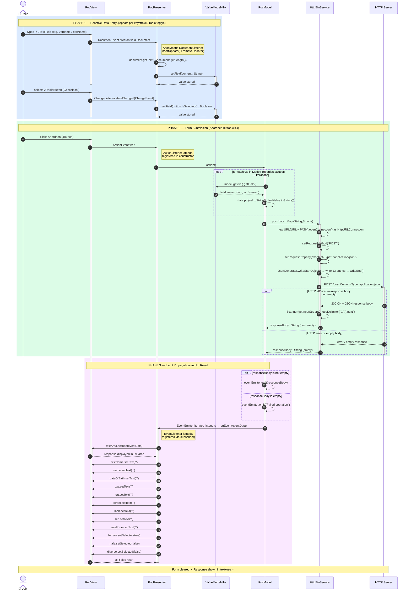
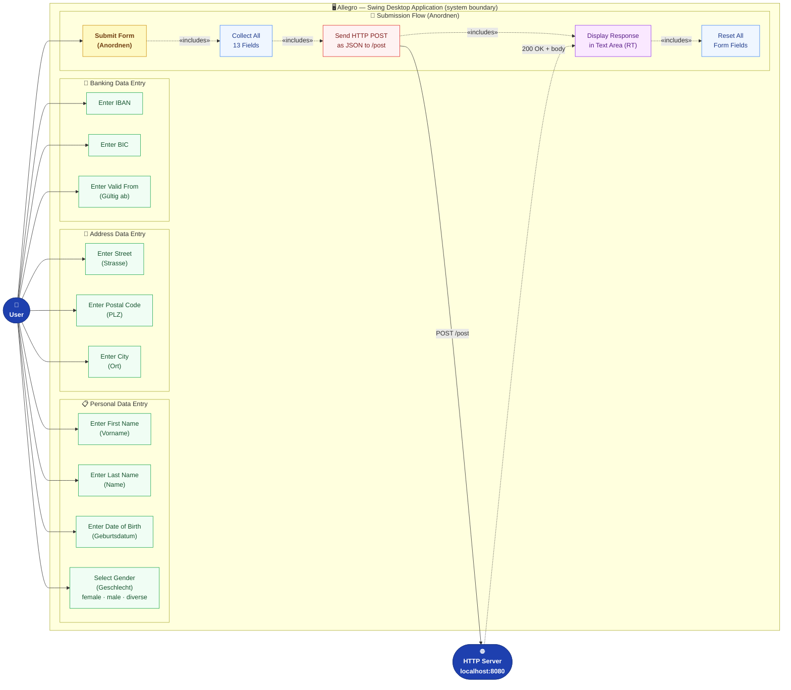
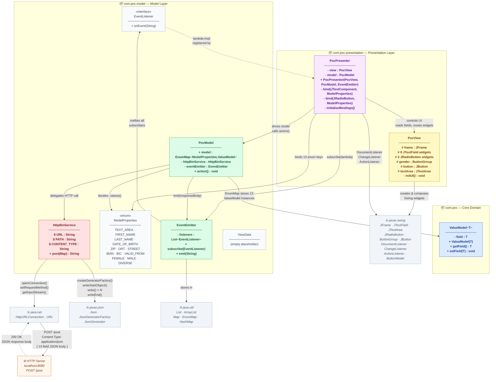

# Allegro – Comprehensive UML Diagrams
> **Application**: Allegro — Java 22 Swing MVP desktop application  
> **Purpose**: Collects personal and banking data via a form and submits it via HTTP POST  
> **Pattern**: Model-View-Presenter (MVP) + Observer (Event Bus)  
> **Generated by**: uml-generator agent  
> **Source data**: AST JSONs + analysis_results.json from code-documentor & ast-analyzer agents

---

## Table of Contents
1. [Class Diagram](#1-class-diagram) — Full class hierarchy, fields, methods, cardinalities
2. [Sequence Diagram](#2-sequence-diagram) — Form submission flow: user click → HTTP POST → view reset
3. [Use Case Diagram](#3-use-case-diagram) — User interactions with the system
4. [Component Diagram](#4-component-diagram) — Package structure and inter-package dependencies

---

## 1. Class Diagram

### Overview

The class diagram captures all nine classes and interfaces across the three packages of the Allegro application. Key architectural observations:

- **`ValueModel<T>`** is the universal property container. Every field in the form — whether a `String` (text input) or `Boolean` (radio button) — is wrapped in a `ValueModel` instance and stored in `PocModel`'s `EnumMap`.
- **`ModelProperties`** (enum) acts as a typed key set. The 13 enum constants map one-to-one to form fields and serve as keys in the `EnumMap<ModelProperties, ValueModel<?>>`.
- **`EventEmitter` / `EventListener`** implement the Observer pattern, decoupling `PocModel` (event source) from `PocPresenter` (event sink) with no direct back-reference.
- **`PocPresenter`** is the MVP coordinator: it holds references to both `PocView` and `PocModel`, wires 13 `DocumentListener` / `ChangeListener` bindings, and registers an `EventListener` lambda for response handling.
- **`HttpBinService`** is a thin HTTP client wrapper that serialises the form data to JSON via `javax.json.JsonGenerator` and POSTs it to `localhost:8080/post`.
- **`ViewData`** is a placeholder class — empty at the time of analysis, reserved for future typed view data transfer objects.

### Diagram

```mermaid
classDiagram
    direction TB

    %% ── Colour palette ──────────────────────────────────────────────────────────
    classDef coreStyle      fill:#dbeafe,stroke:#2563eb,color:#1e3a8a,font-weight:bold
    classDef modelStyle     fill:#dcfce7,stroke:#16a34a,color:#14532d,font-weight:bold
    classDef viewStyle      fill:#fef9c3,stroke:#ca8a04,color:#713f12,font-weight:bold
    classDef presenterStyle fill:#fae8ff,stroke:#9333ea,color:#581c87,font-weight:bold
    classDef serviceStyle   fill:#fee2e2,stroke:#dc2626,color:#7f1d1d,font-weight:bold
    classDef enumStyle      fill:#f1f5f9,stroke:#64748b,color:#1e293b
    classDef ifaceStyle     fill:#e0f2fe,stroke:#0284c7,color:#0c4a6e,font-style:italic
    classDef placeholderStyle fill:#f8fafc,stroke:#cbd5e1,color:#94a3b8,font-style:italic

    %% ════════════════════════════════════════════════════════════════════════════
    %% PACKAGE: com.poc
    %% ════════════════════════════════════════════════════════════════════════════

    class ValueModel~T~ {
        -T field
        +ValueModel(field : T)
        +getField() T
        +setField(field : T) void
    }

    %% ════════════════════════════════════════════════════════════════════════════
    %% PACKAGE: com.poc.model
    %% ════════════════════════════════════════════════════════════════════════════

    class EventListener {
        <<interface>>
        +onEvent(eventData : String) void
    }

    class EventEmitter {
        -List~EventListener~ listeners
        +subscribe(listener : EventListener) void
        +emit(eventData : String) void
    }

    class ModelProperties {
        <<enumeration>>
        TEXT_AREA
        FIRST_NAME
        LAST_NAME
        DATE_OF_BIRTH
        ZIP
        ORT
        STREET
        IBAN
        BIC
        VALID_FROM
        FEMALE
        MALE
        DIVERSE
    }

    class ViewData {
        %% Placeholder — reserved for future use
    }

    class HttpBinService {
        +URL$ : String
        +PATH$ : String
        +CONTENT_TYPE$ : String
        +post(data : Map~String,String~) String
    }

    class PocModel {
        +model : Map~ModelProperties,ValueModel~
        -httpBinService : HttpBinService
        -eventEmitter : EventEmitter
        +PocModel(eventEmitter : EventEmitter)
        +action() void
    }

    %% ════════════════════════════════════════════════════════════════════════════
    %% PACKAGE: com.poc.presentation
    %% ════════════════════════════════════════════════════════════════════════════

    class PocView {
        #frame : JFrame
        #textArea : JTextArea
        #firstName : JTextField
        #name : JTextField
        #dateOfBirth : JTextField
        #zip : JTextField
        #ort : JTextField
        #street : JTextField
        #iban : JTextField
        #bic : JTextField
        #validFrom : JTextField
        #female : JRadioButton
        #male : JRadioButton
        #diverse : JRadioButton
        #gender : ButtonGroup
        #button : JButton
        +PocView()
        -initUI() void
    }

    class PocPresenter {
        -view : PocView
        -model : PocModel
        +PocPresenter(view : PocView, model : PocModel, emitter : EventEmitter)
        -bind(source : JTextComponent, prop : ModelProperties) void
        -bind(source : JRadioButton, prop : ModelProperties) void
        -initializeBindings() void
    }

    %% ════════════════════════════════════════════════════════════════════════════
    %% RELATIONSHIPS
    %% ════════════════════════════════════════════════════════════════════════════

    %% Observer pattern: EventEmitter aggregates an EventListener list
    EventEmitter "1" o-- "*" EventListener : notifies via listeners

    %% PocPresenter registers a lambda that satisfies EventListener
    EventListener <|.. PocPresenter : lambda registered via subscribe()

    %% MVP: Presenter owns references to both View and Model
    PocPresenter "1" --> "1" PocView     : controls — reads fields, resets UI
    PocPresenter "1" --> "1" PocModel    : drives — triggers action()
    PocPresenter       ..>   EventEmitter : subscribes lambda to
    PocPresenter       ..>   ModelProperties : binds 13 properties

    %% Model stores 13 ValueModel instances in an EnumMap
    PocModel "1" *-- "13" ValueModel~T~ : EnumMap composition
    PocModel "1"  --> "1" HttpBinService : uses for HTTP POST
    PocModel "1"  --> "1" EventEmitter   : emits response event via
    PocModel        ..>   ModelProperties : iterates enum values

    %% ── Apply styles ──────────────────────────────────────────────────────────
    class ValueModel~T~   coreStyle
    class EventListener   ifaceStyle
    class EventEmitter    modelStyle
    class ModelProperties enumStyle
    class HttpBinService  serviceStyle
    class PocModel        modelStyle
    class PocView         viewStyle
    class PocPresenter    presenterStyle
    class ViewData        placeholderStyle
```

### Key Relationships Summary

| From | Relationship | To | Multiplicity | Notes |
|------|-------------|-----|-------------|-------|
| `EventEmitter` | aggregates | `EventListener` | 1 : * | Observer subject holds subscriber list |
| `PocPresenter` | implements (lambda) | `EventListener` | — | Lambda registered in constructor via `subscribe()` |
| `PocPresenter` | controls | `PocView` | 1 : 1 | Reads widget text, resets fields after response |
| `PocPresenter` | drives | `PocModel` | 1 : 1 | Triggers `action()` on button click |
| `PocModel` | composes | `ValueModel<T>` | 1 : 13 | EnumMap with one `ValueModel` per `ModelProperties` constant |
| `PocModel` | uses | `HttpBinService` | 1 : 1 | Delegates HTTP serialisation and network call |
| `PocModel` | emits via | `EventEmitter` | 1 : 1 | Notifies presenter of HTTP result (success or failure string) |

---

## 2. Sequence Diagram

### Overview

The sequence diagram traces the **complete lifecycle of a single form submission** — from the first keystroke in a field through to the display of the HTTP response and the subsequent UI reset. The flow is divided into three phases:

**Phase 1 – Reactive Data Binding (live as user types)**  
When the user types in any `JTextField`, the Swing document model fires a `DocumentEvent`. An anonymous `DocumentListener` registered by `PocPresenter.bind(JTextComponent, ModelProperties)` intercepts the event, reads the full document text with `document.getText(0, document.getLength())`, and calls `ValueModel.setField()` to keep the in-memory model in sync in real time. For `JRadioButton` widgets the analogous `ChangeListener` calls `ValueModel<Boolean>.setField(button.isSelected())`.

**Phase 2 – Form Submission (button click)**  
Clicking "Anordnen" fires an `ActionListener` lambda registered in the `PocPresenter` constructor via `view.button.addActionListener(...)`. This calls `PocModel.action()`, which iterates all 13 `ModelProperties` enum values, collects their current `ValueModel` values into a `HashMap<String, String>`, and delegates to `HttpBinService.post()`. The service serialises the map to JSON using `javax.json.JsonGenerator`, sends it via `HttpURLConnection.POST` to `http://localhost:8080/post`, and reads the response with `new Scanner(connection.getInputStream()).useDelimiter("\\A")`.

**Phase 3 – Event Propagation & UI Reset**  
`PocModel` checks whether the response body is non-empty. Regardless (success or failure), it calls `EventEmitter.emit()` with either the real response body or the string `"Failed operation"`. The emitter iterates its listener list and calls `onEvent()` on each registered `EventListener`. The lambda registered by `PocPresenter` executes: it calls `textArea.setText(responseBody)` to display the result, then resets all 9 text fields to `""` and radio buttons back to `female = true`.

### Diagram



### Sequence Flow Summary

| Step | Actor | Target | Call | Purpose |
|------|-------|--------|------|---------|
| 1 | User | PocView | (types) | Enters data in form fields |
| 2 | PocView | PocPresenter | `DocumentListener.insertUpdate()` | Swing document event |
| 3 | PocPresenter | ValueModel | `setField(content)` | Sync in-memory model with UI |
| 4 | User | PocView | (selects radio) | Chooses gender option |
| 5 | PocView | PocPresenter | `ChangeListener.stateChanged()` | Radio button state change |
| 6 | PocPresenter | ValueModel | `setField(boolean)` | Sync Boolean gender flag |
| 7 | User | PocView | (clicks Anordnen) | Initiates submission |
| 8 | PocPresenter | PocModel | `action()` | Trigger data collection + HTTP |
| 9 | PocModel | ValueModel × 13 | `getField()` | Collect all property values |
| 10 | PocModel | HttpBinService | `post(data)` | Serialise & send HTTP POST |
| 11 | HttpBinService | HTTP Server | `POST /post` (JSON) | Network call |
| 12 | PocModel | EventEmitter | `emit(responseBody)` | Notify observers |
| 13 | EventEmitter | PocPresenter lambda | `onEvent(eventData)` | Deliver response to presenter |
| 14 | PocPresenter | PocView | `textArea.setText()` | Display server response |
| 15 | PocPresenter | PocView | `field.setText("") × 9` | Reset all text fields |
| 16 | PocPresenter | PocView | `radio.setSelected() × 3` | Reset gender radio group |

---

## 3. Use Case Diagram

### Overview

The use case diagram documents the system from the **end-user's perspective**, showing all interactions available through the Allegro desktop form. There are two actors:

- **User** — the human operator who fills in the form and triggers the submission. All 10 form fields and the submit button are direct user interactions.
- **HTTP Server** — the external backend at `localhost:8080` that receives the POST request and returns a JSON response.

Use cases are grouped into four functional areas:
1. **Personal Data Entry** — Vorname, Name, Geburtsdatum, and Geschlecht (gender radio group with three exclusive options)
2. **Address Data Entry** — Strasse, PLZ, Ort
3. **Banking Data Entry** — IBAN, BIC, Gültig ab
4. **Submission Flow** — "Anordnen" click, which `«includes»` field collection, HTTP POST, response display, and form reset as mandatory sub-steps

### Diagram



### Use Case Descriptions

| ID | Use Case | Actor | Binding | Description |
|----|----------|-------|---------|-------------|
| UC1 | Enter First Name *(Vorname)* | User | `firstName` ↔ `FIRST_NAME` | Types given name; `DocumentListener` syncs `ValueModel<String>` live |
| UC2 | Enter Last Name *(Name)* | User | `name` ↔ `LAST_NAME` | Types surname; live-synced via `DocumentListener` |
| UC3 | Enter Date of Birth *(Geburtsdatum)* | User | `dateOfBirth` ↔ `DATE_OF_BIRTH` | Types birth date string; live-synced |
| UC4 | Select Gender *(Geschlecht)* | User | `female/male/diverse` ↔ `FEMALE/MALE/DIVERSE` | Mutually exclusive radio group; `ChangeListener` syncs `ValueModel<Boolean>` per option |
| UC5 | Enter Street *(Strasse)* | User | `street` ↔ `STREET` | Types street address; live-synced |
| UC6 | Enter Postal Code *(PLZ)* | User | `zip` ↔ `ZIP` | Types postal code; live-synced |
| UC7 | Enter City *(Ort)* | User | `ort` ↔ `ORT` | Types city/town name; live-synced |
| UC8 | Enter IBAN | User | `iban` ↔ `IBAN` | Types bank IBAN; live-synced |
| UC9 | Enter BIC | User | `bic` ↔ `BIC` | Types bank BIC/SWIFT code; live-synced |
| UC10 | Enter Valid From *(Gültig ab)* | User | `validFrom` ↔ `VALID_FROM` | Types SEPA mandate start date; live-synced |
| UC11 | Submit Form *(Anordnen)* | User | `button` ActionListener | Clicks submit button; triggers full submission chain |
| UC12 | Collect 13 Fields | System | `PocModel.action()` | Iterates `ModelProperties.values()` → builds `HashMap<String,String>` |
| UC13 | Send HTTP POST | System → Server | `HttpBinService.post()` | Serialises map to JSON, POSTs to `localhost:8080/post` |
| UC14 | Display Response | System | EventListener lambda | `textArea.setText(responseBody)` shows JSON response |
| UC15 | Reset Form Fields | System | EventListener lambda | Resets all 9 text fields to `""`, radio back to `female=true` |

---

## 4. Component Diagram

### Overview

The component diagram shows the **package-level architecture** of the Allegro application, illustrating how the three internal packages form a layered MVP structure and how they depend on external Java framework libraries.

**Layering rules**:
- `com.poc.presentation` depends on `com.poc.model` and `com.poc` — **top layer**
- `com.poc.model` depends on `com.poc` — **middle layer**
- `com.poc` has no internal imports — **leaf/core layer**

**External dependencies**:
- `javax.swing` — all Swing widgets and event listener interfaces used by `PocView` and `PocPresenter`
- `java.net.HttpURLConnection` — raw HTTP connectivity used by `HttpBinService`
- `javax.json` — JSON streaming API used by `HttpBinService` for request body serialisation
- **HTTP Server** at `localhost:8080/post` — external process, not part of the Java application

### Diagram



### Package Dependency Matrix

| Consumer Package | Depends On | What Is Used |
|-----------------|-----------|-------------|
| `com.poc.presentation` | `com.poc.model` | `EventEmitter`, `ModelProperties`, `PocModel` |
| `com.poc.presentation` | `com.poc` | `ValueModel<T>` (indirectly via cast in bind methods) |
| `com.poc.presentation` | `javax.swing.*` | All Swing widgets + `DocumentListener`, `ChangeListener`, `ActionListener` |
| `com.poc.model` | `com.poc` | `ValueModel<T>` (EnumMap value type) |
| `com.poc.model` | `javax.json` | `Json`, `JsonGeneratorFactory`, `JsonGenerator` |
| `com.poc.model` | `java.net` | `HttpURLConnection`, `URL` |
| `com.poc.model` | `java.util` | `List`, `ArrayList`, `Map`, `EnumMap`, `HashMap` |
| External | HTTP Server | `localhost:8080/post` — receives JSON POST |

### Architectural Observations

> ✅ **No circular dependencies** — `com.poc.model` never imports from `com.poc.presentation`.  
> ✅ **`com.poc`** is a pure leaf package with zero internal imports — safe to share across layers.  
> ✅ **Observer decoupling** — `PocModel` never holds a direct reference to `PocPresenter`; communication is via `EventEmitter`.  
> ⚠️ **Protected field coupling** — `PocView` fields are `protected`, giving `PocPresenter` direct field access. Using accessor methods would improve encapsulation.  
> ⚠️ **`ViewData` is unused** — the placeholder class is present but never referenced, suggesting incomplete future development.  
> ⚠️ **No input validation** — `ModelProperties.TEXT_AREA` is included in the HTTP payload (it maps to the response `JTextArea`, not a user input field), which pollutes the POST body.

---

## Design Pattern Reference

The following patterns are structurally present in the codebase and are reflected across the four diagrams above:

| Pattern | Participants | Where Visible |
|---------|-------------|---------------|
| **MVP (Model-View-Presenter)** | `PocModel`, `PocView`, `PocPresenter` | Class Diagram, Component Diagram |
| **Observer / Event Bus** | `EventEmitter` (subject), `EventListener` (observer interface), `PocPresenter` lambda (concrete observer) | Class Diagram, Sequence Diagram |
| **Generic Value Object** | `ValueModel<T>` — universal property holder for both `String` and `Boolean` field types | Class Diagram |
| **Enum as Typed Key** | `ModelProperties` + `EnumMap<ModelProperties, ValueModel<?>>` in `PocModel` | Class Diagram, Component Diagram |
| **Service Layer** | `HttpBinService` — isolated HTTP client with JSON serialisation, separate from business logic | Class Diagram, Sequence Diagram, Component Diagram |
| **Data Binding** | `DocumentListener` (text fields) and `ChangeListener` (radio buttons) wired by `PocPresenter.bind()` overloads | Sequence Diagram |
| **Lambda as Functional Interface** | `PocPresenter` registers `EventListener` and `ActionListener` as Java lambdas | Sequence Diagram |

---

*Generated by `uml-generator` agent — all diagrams in Mermaid format, renderable in GitHub, GitLab, Docusaurus, MkDocs, and any standard Markdown viewer.*
