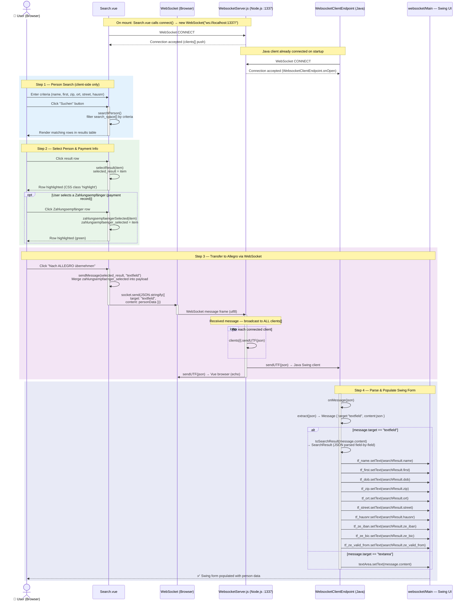
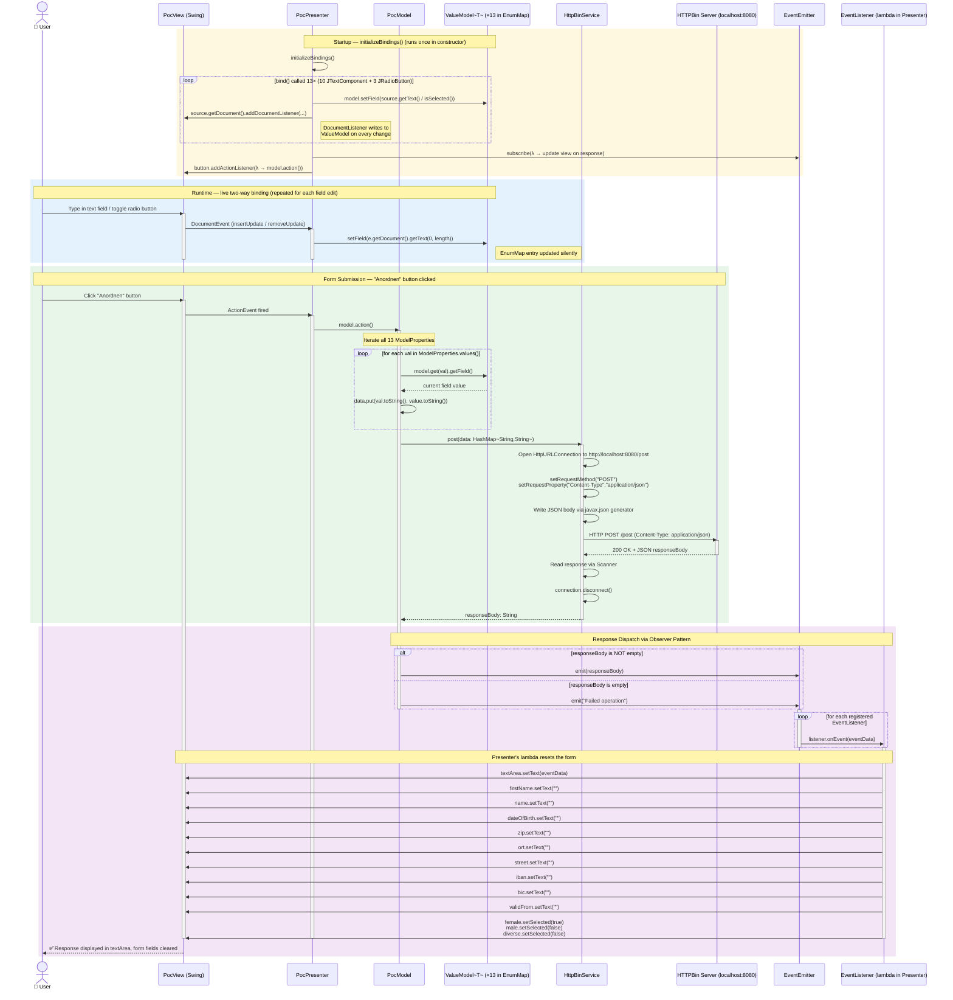
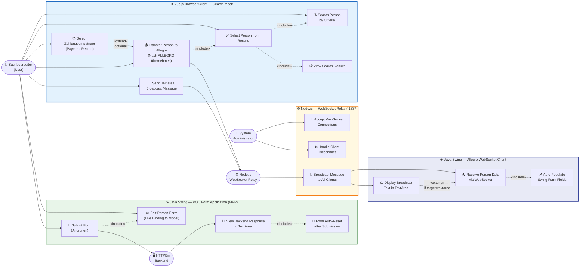
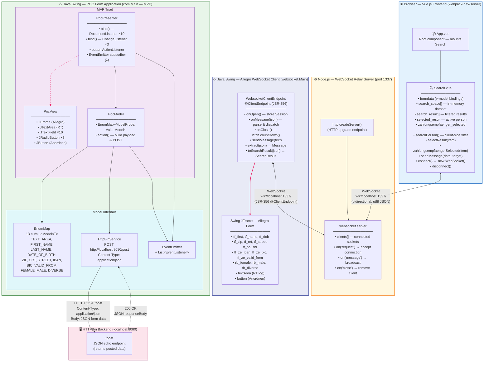

# UML Diagrams — WebSocket Allegro POC System

> **Generated by**: `uml-generator` agent  
> **Source**: Java Swing (MVP), Node.js WebSocket relay, Vue.js browser client  
> **Format**: Mermaid (all diagrams)  
> **Notation standard**: UML 2.5

---

## Table of Contents

1. [Class Diagram — Full Java Application Structure](#1-class-diagram--full-java-application-structure)
2. [Sequence Diagram — Person Search & WebSocket Transfer to Swing](#2-sequence-diagram--person-search--websocket-transfer-to-swing)
3. [Sequence Diagram — Form Submission to HTTPBin Backend](#3-sequence-diagram--form-submission-to-httpbin-backend)
4. [Use Case Diagram — User Interactions & System Actors](#4-use-case-diagram--user-interactions--system-actors)
5. [Component Diagram — Full System Architecture](#5-component-diagram--full-system-architecture)

---

## 1. Class Diagram — Full Java Application Structure

### Description

Visualises every Java class, interface, and enum across the two Swing applications:

| Colour | Meaning |
|--------|---------|
| 🔵 Blue | Entry-point / bootstrap classes (`com.Main`, `websocket.Main`) |
| 🟢 Green | Model layer (`PocModel`, `ValueModel<T>`, `ModelProperties`) |
| 🟠 Orange | View layer (`PocView`) |
| 🟣 Purple | Presenter layer (`PocPresenter`) |
| 🔴 Pink | HTTP service (`HttpBinService`) |
| 🩵 Cyan | Observer pattern (`EventEmitter`, `EventListener`) |
| 🔷 Indigo | WebSocket client inner classes (`WebsocketClientEndpoint`, `Message`, `SearchResult`) |
| 🟡 Yellow | Data/placeholder classes (`ValueModel`, `ViewData`) |

Key architectural patterns:
- **MVP** — `PocPresenter` mediates between `PocView` and `PocModel`
- **Observer** — `EventEmitter` notifies `EventListener` lambda subscribers
- **Generic Value Wrapper** — `ValueModel<T>` stored in `EnumMap<ModelProperties, ValueModel<?>>`
- **Inner classes** — `WebsocketClientEndpoint`, `Message`, `SearchResult` are static nested classes of `websocket.Main`

```mermaid
classDiagram
    direction TB

    %% ─────────────────────────────────────────
    %% ENTRY POINTS
    %% ─────────────────────────────────────────
    class ComMain {
        +main(args: String[])$
    }

    class WsMain {
        -latch: CountDownLatch$
        -frame: JFrame$
        -textArea: JTextArea$
        -tf_name: JTextField$
        -tf_first: JTextField$
        -tf_dob: JTextField$
        -tf_zip: JTextField$
        -tf_ort: JTextField$
        -tf_street: JTextField$
        -tf_hausnr: JTextField$
        -tf_ze_iban: JTextField$
        -tf_ze_bic: JTextField$
        -tf_ze_valid_from: JTextField$
        -jsonParserFactory: JsonParserFactory$
        +main(args: String[])$
        -initUI()$
        +toSearchResult(json: String) SearchResult$
    }

    %% ─────────────────────────────────────────
    %% OBSERVER PATTERN
    %% ─────────────────────────────────────────
    class EventListener {
        <<interface>>
        +onEvent(eventData: String) void
    }

    class EventEmitter {
        -listeners: List~EventListener~
        +subscribe(listener: EventListener) void
        +emit(eventData: String) void
    }

    %% ─────────────────────────────────────────
    %% GENERIC VALUE WRAPPER
    %% ─────────────────────────────────────────
    class ValueModel~T~ {
        -field: T
        +ValueModel(field: T)
        +getField() T
        +setField(field: T) void
    }

    %% ─────────────────────────────────────────
    %% DOMAIN ENUMERATION
    %% ─────────────────────────────────────────
    class ModelProperties {
        <<enumeration>>
        TEXT_AREA
        FIRST_NAME
        LAST_NAME
        DATE_OF_BIRTH
        ZIP
        ORT
        STREET
        IBAN
        BIC
        VALID_FROM
        FEMALE
        MALE
        DIVERSE
    }

    %% ─────────────────────────────────────────
    %% HTTP SERVICE
    %% ─────────────────────────────────────────
    class HttpBinService {
        +URL: String$
        +PATH: String$
        +CONTENT_TYPE: String$
        +post(data: Map~String,String~) String
    }

    %% ─────────────────────────────────────────
    %% MODEL
    %% ─────────────────────────────────────────
    class PocModel {
        +model: EnumMap~ModelProperties,ValueModel~
        -httpBinService: HttpBinService
        -eventEmitter: EventEmitter
        +PocModel(eventEmitter: EventEmitter)
        +action() void
    }

    %% ─────────────────────────────────────────
    %% PLACEHOLDER
    %% ─────────────────────────────────────────
    class ViewData {
        <<placeholder>>
    }

    %% ─────────────────────────────────────────
    %% VIEW
    %% ─────────────────────────────────────────
    class PocView {
        #frame: JFrame
        #textArea: JTextArea
        #name: JTextField
        #firstName: JTextField
        #dateOfBirth: JTextField
        #zip: JTextField
        #ort: JTextField
        #street: JTextField
        #iban: JTextField
        #bic: JTextField
        #validFrom: JTextField
        #female: JRadioButton
        #male: JRadioButton
        #diverse: JRadioButton
        #gender: ButtonGroup
        #button: JButton
        +PocView()
        -initUI() void
    }

    %% ─────────────────────────────────────────
    %% PRESENTER
    %% ─────────────────────────────────────────
    class PocPresenter {
        -view: PocView
        -model: PocModel
        +PocPresenter(view: PocView, model: PocModel, emitter: EventEmitter)
        -bind(source: JTextComponent, prop: ModelProperties) void
        -bind(source: JRadioButton, prop: ModelProperties) void
        -initializeBindings() void
    }

    %% ─────────────────────────────────────────
    %% WEBSOCKET INNER CLASSES
    %% ─────────────────────────────────────────
    class WebsocketClientEndpoint {
        <<ClientEndpoint>>
        +userSession: Session
        +WebsocketClientEndpoint(endpointURI: URI)
        +onOpen(userSession: Session) void
        +onClose(userSession: Session, reason: CloseReason) void
        +onMessage(json: String) void
        +sendMessage(message: String) void
        +extract(json: String) Message$
    }

    class Message {
        +target: String
        +content: String
        +Message(target: String, message: String)
    }

    class SearchResult {
        +name: String
        +first: String
        +dob: String
        +zip: String
        +ort: String
        +street: String
        +hausnr: String
        +ze_iban: String
        +ze_bic: String
        +ze_valid_from: String
    }

    %% ══════════════════════════════════════════
    %% RELATIONSHIPS
    %% ══════════════════════════════════════════

    %% com.Main bootstraps the MVP triad
    ComMain ..> PocView           : creates
    ComMain ..> EventEmitter      : creates
    ComMain ..> PocModel          : creates
    ComMain ..> PocPresenter      : creates

    %% MVP composition
    PocPresenter *-- PocView      : owns (composition)
    PocPresenter *-- PocModel     : owns (composition)
    PocPresenter ..> EventEmitter : subscribes lambda to

    %% Model internals
    PocModel *-- HttpBinService             : owns (composition)
    PocModel ..> EventEmitter               : emits response via
    PocModel "1" *-- "13" ValueModel~T~     : stores in EnumMap
    PocModel ..> ModelProperties            : uses as map key

    %% Observer pattern
    EventEmitter "1" o-- "*" EventListener  : notifies registered

    %% websocket.Main inner class containment
    WsMain *-- WebsocketClientEndpoint      : static inner class
    WsMain *-- Message                      : static inner class
    WsMain *-- SearchResult                 : static inner class
    WebsocketClientEndpoint ..> Message     : creates via extract()
    WebsocketClientEndpoint ..> SearchResult: creates via toSearchResult()

    %% ══════════════════════════════════════════
    %% STYLING
    %% ══════════════════════════════════════════
    classDef entryPoint  fill:#e3f2fd,stroke:#1565C0,stroke-width:2px,color:#000
    classDef modelClass  fill:#e8f5e9,stroke:#2E7D32,stroke-width:2px,color:#000
    classDef viewClass   fill:#fff3e0,stroke:#E65100,stroke-width:2px,color:#000
    classDef presClass   fill:#f3e5f5,stroke:#6A1B9A,stroke-width:2px,color:#000
    classDef svcClass    fill:#fce4ec,stroke:#880E4F,stroke-width:2px,color:#000
    classDef obsClass    fill:#e0f7fa,stroke:#006064,stroke-width:2px,color:#000
    classDef wsClass     fill:#e8eaf6,stroke:#283593,stroke-width:2px,color:#000
    classDef dataClass   fill:#f9fbe7,stroke:#827717,stroke-width:2px,color:#000
    classDef enumClass   fill:#fff8e1,stroke:#F57F17,stroke-width:2px,color:#000

    class ComMain        entryPoint
    class WsMain         entryPoint
    class PocModel       modelClass
    class ModelProperties enumClass
    class PocView        viewClass
    class PocPresenter   presClass
    class HttpBinService svcClass
    class EventEmitter   obsClass
    class EventListener  obsClass
    class WebsocketClientEndpoint wsClass
    class Message        wsClass
    class SearchResult   wsClass
    class ValueModel~T~  dataClass
    class ViewData       dataClass
```

### Key Relationships Summary

| From | Relationship | To | Notes |
|------|-------------|-----|-------|
| `ComMain` | creates (dependency) | `PocView`, `PocModel`, `PocPresenter`, `EventEmitter` | Manual DI wiring in `main()` |
| `PocPresenter` | composition | `PocView` + `PocModel` | Owns both; mediates all interactions |
| `PocPresenter` | subscribes to | `EventEmitter` | Lambda clears form on response |
| `PocModel` | composition | `HttpBinService` | Delegates HTTP to service |
| `PocModel` | stores | `ValueModel<T>` ×13 | One per `ModelProperties` enum constant |
| `EventEmitter` | aggregation | `EventListener` ×* | Observer list |
| `WsMain` | contains | `WebsocketClientEndpoint`, `Message`, `SearchResult` | Static nested classes |

---

## 2. Sequence Diagram — Person Search & WebSocket Transfer to Swing

### Description

Shows the complete flow when a user searches for a person in the **Vue.js browser client**, selects a result, and transfers the person's data to the **Java Swing Allegro form** via the **Node.js WebSocket relay server**.

Key steps:
1. Client-side search against in-memory `search_space[]` (no server roundtrip for search)
2. User selects person row + optional `Zahlungsempfänger` (payment info) row
3. `sendMessage()` wraps the payload as `{ target: "textfield", content: personData }` and sends over WebSocket
4. Node.js relay broadcasts to **all** connected clients
5. `WebsocketClientEndpoint.onMessage()` parses the JSON and dispatches field-by-field updates to the Swing `JTextField` components



### Notes

- **No server-side search**: `searchPerson()` filters the hardcoded `search_space[]` array entirely in-browser
- **Broadcast model**: Node.js relays every message to **all** connected clients; both the browser tab and the Java Swing window receive the same JSON
- **JSON parsing**: `extract()` uses `javax.json` streaming API (not Jackson/Gson) to walk the JSON token stream
- **Textarea path**: If `target == "textarea"`, the content goes directly to `JTextArea.setText()` without `SearchResult` mapping

---

## 3. Sequence Diagram — Form Submission to HTTPBin Backend

### Description

Shows the MVP binding lifecycle and the full form-submission flow when the user clicks the **"Anordnen"** (Submit/Arrange) button in the `PocView` Swing form.

Key steps:
1. **Binding phase** (at startup): `PocPresenter.initializeBindings()` attaches `DocumentListener` to every `JTextComponent` and `ChangeListener` to every `JRadioButton` — each listener writes directly into the matching `ValueModel<T>` in `PocModel.model`
2. **Runtime**: Every keystroke or radio-button change silently updates the `EnumMap` entry
3. **Submission**: Button click triggers `model.action()` → iterates all 13 `ModelProperties` → builds `HashMap<String,String>` → HTTP POST via `HttpBinService`
4. **Response**: `EventEmitter.emit(responseBody)` fires; the registered lambda in `PocPresenter` clears the form and displays the response



### Notes

- **Binding is synchronous**: `initializeBindings()` runs inside the `PocPresenter` constructor; the form is live-bound before the user can interact
- **No validation**: `model.action()` submits all 13 fields as-is; calling `.toString()` on a `null` field causes a `NullPointerException` at runtime (known technical debt)
- **EventEmitter as integration bus**: Both success and error paths go through `EventEmitter`, keeping the Presenter decoupled from the HTTP layer
- **Thread safety**: The EventEmitter callback runs on the EDT if called from the button's ActionListener; HTTPBin call is blocking on the EDT (potential freeze — tech debt)

---

## 4. Use Case Diagram — User Interactions & System Actors

### Description

Documents all **user-facing capabilities** of the system from the perspective of:
- **Sachbearbeiter** (office worker / end user) — primary actor using both UIs
- **Node.js WebSocket Server** — system relay actor
- **HTTPBin Backend** — external integration actor
- **System Administrator** — manages the server infrastructure



### Actor Summary

| Actor | Type | Role |
|-------|------|------|
| **Sachbearbeiter (User)** | Human, Primary | Searches for persons, transfers data to Allegro, submits forms |
| **System Administrator** | Human, Secondary | Manages Node.js server lifecycle |
| **Node.js WebSocket Relay** | System | Accepts connections, broadcasts messages to all clients |
| **HTTPBin Backend** | External System | Receives HTTP POST, echoes back JSON response |

### Use Case Catalogue

| ID | Name | Actor | System |
|----|------|-------|--------|
| UC1 | Search Person by Criteria | User | Vue.js |
| UC2 | View Search Results | User | Vue.js |
| UC3 | Select Person from Results | User | Vue.js |
| UC4 | Select Zahlungsempfänger | User | Vue.js |
| UC5 | Transfer to Allegro | User + Node.js | Vue.js + WebSocket |
| UC6 | Send Textarea Broadcast | User | Vue.js + WebSocket |
| UC7 | Accept WebSocket Connections | Admin | Node.js |
| UC8 | Broadcast Message to All Clients | Node.js | Node.js |
| UC9 | Handle Client Disconnect | Admin | Node.js |
| UC10 | Receive Person Data via WebSocket | Java | Java Swing WS |
| UC11 | Auto-Populate Swing Form | Java | Java Swing WS |
| UC12 | Display Broadcast Text | Java | Java Swing WS |
| UC13 | Edit Person Form Fields | User | Java Swing POC |
| UC14 | Submit Form (Anordnen) | User | Java Swing POC |
| UC15 | View Backend Response | System | Java Swing POC |
| UC16 | Form Auto-Reset after Submission | System | Java Swing POC |

---

## 5. Component Diagram — Full System Architecture

### Description

Shows the **runtime components**, their **deployment boundaries**, and all **communication channels** between:
- **Browser tier**: Vue.js SPA (App.vue → Search.vue)
- **Relay tier**: Node.js WebSocket server (port 1337)
- **Desktop tier**: Two independent Java Swing applications
  - `websocket.Main` — Allegro-style form populated via WebSocket
  - `com.Main` — MVP POC form that submits to HTTPBin
- **Backend tier**: HTTPBin server (port 8080)



### Communication Channel Summary

| Channel | Protocol | From | To | Message Format |
|---------|----------|------|----|---------------|
| **Browser → Node.js** | WebSocket (ws://) | Search.vue | WebsocketServer.js | `{ target: "textfield"\|"textarea", content: {...} }` |
| **Node.js → Java Swing** | WebSocket (ws://) | WebsocketServer.js | WebsocketClientEndpoint | Same JSON broadcast |
| **Node.js → Browser** | WebSocket (ws://) | WebsocketServer.js | Search.vue | Same JSON echo |
| **Java POC → HTTPBin** | HTTP/1.1 POST | HttpBinService | HTTPBin `/post` | `application/json` — all 13 form fields |
| **HTTPBin → Java POC** | HTTP/1.1 200 OK | HTTPBin | HttpBinService | JSON echo of posted data |

### Port & Endpoint Reference

| Component | Address | Protocol |
|-----------|---------|----------|
| Node.js WebSocket Relay | `ws://localhost:1337/` | WebSocket (RFC 6455) |
| HTTPBin Backend | `http://localhost:8080/post` | HTTP/1.1 |
| Vue.js Dev Server | `http://localhost:8080` (default) | HTTP |
| Java WebSocket Client (JSR-356) | connects to `ws://localhost:1337/` | WebSocket |

---

## Appendix — Diagram Metadata

| # | Diagram | Type | Entities | Relationships |
|---|---------|------|----------|--------------|
| 1 | Full Java Class Structure | `classDiagram` | 15 classes/interfaces/enums | 19 |
| 2 | Person Search → WebSocket → Swing | `sequenceDiagram` | 6 participants | ~25 messages |
| 3 | Form Submission → HTTPBin | `sequenceDiagram` | 8 participants | ~30 messages |
| 4 | User Interactions | `flowchart LR` | 4 actors, 16 use cases | 22 |
| 5 | Full System Architecture | `graph TD` | 5 subsystems, 12 components | 8 channels |

### Pattern Index

| Pattern | Classes Involved | Diagram(s) |
|---------|-----------------|------------|
| **MVP** | `PocPresenter`, `PocView`, `PocModel` | 1, 3, 4, 5 |
| **Observer** | `EventEmitter`, `EventListener` | 1, 3 |
| **Generic Value Wrapper** | `ValueModel<T>` + `ModelProperties` enum | 1, 3 |
| **WebSocket Client (JSR-356)** | `WebsocketClientEndpoint` | 1, 2, 5 |
| **Manual Dependency Injection** | `com.Main` | 1, 3 |
| **Relay/Broadcast** | `WebsocketServer.js` | 2, 4, 5 |
| **Static Inner Classes** | `Message`, `SearchResult` inside `websocket.Main` | 1, 2 |
