# Allegro PoC — WebSocket Integration Architecture Documentation

**Template:** arc42  
**Version:** 1.0  
**Date:** 2025-06-10  
**Status:** Generated from source code analysis  
**Project:** `websocket_swing` — Allegro Modernization Proof of Concept

---

## Table of Contents

1. [Introduction and Goals](#1-introduction-and-goals)
2. [Constraints](#2-constraints)
3. [System Scope and Context](#3-system-scope-and-context)
4. [Solution Strategy](#4-solution-strategy)
5. [Building Block View](#5-building-block-view)
6. [Runtime View](#6-runtime-view)
7. [Deployment View](#7-deployment-view)
8. [Cross-cutting Concepts](#8-cross-cutting-concepts)
9. [Architecture Decisions](#9-architecture-decisions)
10. [Quality Requirements](#10-quality-requirements)
11. [Risks and Technical Debt](#11-risks-and-technical-debt)
12. [Glossary](#12-glossary)

---

## 1. Introduction and Goals

### 1.1 Purpose and Requirements Overview

This project is a **Proof of Concept (PoC)** for modernizing **Allegro**, a legacy Java Swing-based administrative system used in a German social-insurance/benefits context. The PoC demonstrates how a modern browser-based web frontend can coexist with the existing Swing desktop application and communicate in real-time via WebSockets.

The system solves a concrete modernization problem: a legacy Swing application receives data that users select in a modern web UI, without requiring a full rewrite of the Swing client. Communication is brokered through a central Node.js WebSocket server.

#### Key Capabilities

| Capability | Description |
|---|---|
| Person Search | Web UI allows users to search for insured persons by name, address, ZIP code, or city |
| Payment Recipient Selection | Users can select a Zahlungsempfänger (payment recipient / payee) including IBAN, BIC, and validity dates |
| Data Transfer to Allegro | Selected person and payment data can be pushed from the Vue.js web client to the legacy Swing client via WebSocket broadcast |
| Real-time Bidirectional Messaging | The Node.js server broadcasts all messages to all connected clients (textarea synchronisation and form-fill target modes) |
| HTTP Backend Integration (PoC) | The refactored Swing MVP application can submit form data to an HTTPBin-compatible REST endpoint |

### 1.2 Quality Goals

| Priority | Quality Goal | Motivation |
|---|---|---|
| 1 | **Interoperability** | Core goal of the PoC: modern web UI and legacy Swing app must exchange data seamlessly |
| 2 | **Simplicity** | PoC scope requires the simplest possible integration approach; no frameworks, no databases |
| 3 | **Maintainability** | The refactored MVP Swing application demonstrates a clean architecture suitable for future evolution |
| 4 | **Responsiveness** | WebSocket communication must be near-real-time so users perceive data transfer as instantaneous |
| 5 | **Evolvability** | Architecture should allow each component to be replaced independently (e.g., Vue.js replaced by React, Node.js replaced by a JVM server) |

### 1.3 Stakeholders

| Role | Description | Key Expectations |
|---|---|---|
| Business Analyst / Product Owner | Validates feasibility of Allegro modernization | Demonstrates real-time data flow from modern web UI to legacy Swing app |
| Java Developer | Maintains and extends the Swing client | Clean MVP architecture, clear separation of concerns, documented WebSocket integration |
| Frontend Developer | Maintains and extends the Vue.js client | Simple WebSocket API, clear message schema |
| DevOps / Infrastructure | Deploys and operates the system | Minimal infrastructure requirements; currently: Docker, Node.js, JVM |
| Architect | Reviews and validates the modernization approach | Demonstration of integration pattern, extensibility, and migration path |

---

## 2. Constraints

### 2.1 Technical Constraints

| Constraint | Value / Description |
|---|---|
| Java Version | **Java 22+** (source/target level 22, uses unnamed variable `_` pattern from JEP 443) |
| Java UI Framework | **Java Swing** (legacy constraint — purpose is to integrate with, not replace, the existing Swing application) |
| WebSocket Client Library (Java) | **Glassfish Tyrus 1.15** standalone client (`tyrus-standalone-client`) |
| JSON Library (Java) | **javax.json 1.1.4** (reference implementation via `org.glassfish:javax.json:1.0.4`) |
| Build System (Java) | **Apache Maven** |
| Node.js WebSocket Library | **websocket ^1.0.35** (npm package) |
| Frontend Framework | **Vue.js 2.6** |
| Frontend Tooling | **Vue CLI 4**, Babel, ESLint |
| Frontend Package Manager | **yarn** |
| WebSocket Protocol | **RFC 6455** (plain `ws://`, no TLS in PoC) |
| Network | All components communicate on **localhost** (single-machine PoC) |
| Container Runtime | **Docker** is required to run the HTTPBin backend (`kennethreitz/httpbin` on port 8080) |

### 2.2 Organizational Constraints

| Constraint | Description |
|---|---|
| PoC Scope | This is a proof of concept, not a production system. Some shortcuts are acceptable (e.g., hardcoded ports, in-memory mock data, no authentication) |
| IDE | IntelliJ IDEA is the recommended IDE for the Java components |
| No Database | All data is held in-memory; the Vue.js client uses a hardcoded `search_space` dataset |
| No Authentication | No user authentication or authorization mechanism is implemented |

### 2.3 Conventions

| Convention | Description |
|---|---|
| Port Assignment | WebSocket server: **1337**, HTTPBin backend: **8080** (both hardcoded) |
| Message Format | All WebSocket messages are JSON-encoded strings with `target` and `content` fields |
| Package Naming | Java MVP code uses `com.poc.*`; legacy WebSocket client uses `websocket.*` |
| German UI Labels | All form field labels and button texts are in German, reflecting the target domain (German social insurance administration) |
| MVP Pattern | The refactored Swing application strictly separates Model (`PocModel`), View (`PocView`), and Presenter (`PocPresenter`) |

---

## 3. System Scope and Context

### 3.1 Business Context

The system serves as an integration bridge between a **modern web-based search interface** and a **legacy desktop application** used by caseworkers in a German social insurance context. The user persona is a caseworker who uses the legacy Allegro Swing application daily but benefits from a modern browser-based search UI that can look up insured persons and transfer selected data directly into Allegro's form fields.

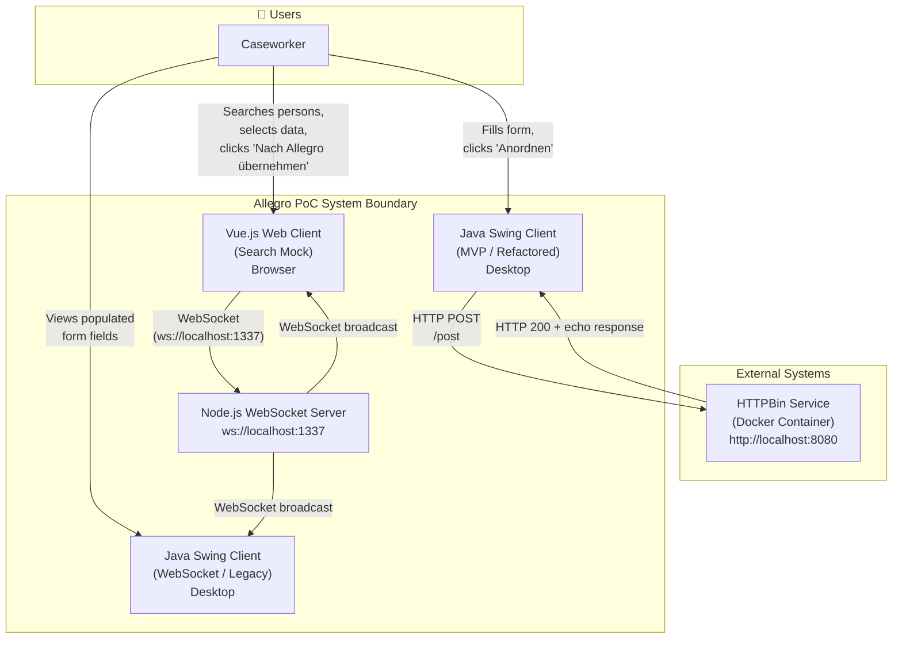

**External Interfaces:**

| Partner / System | Interface Type | Description |
|---|---|---|
| Caseworker (Browser) | HTTPS / Vue.js served UI | Uses the Vue.js search client to search persons and initiate data transfer |
| Caseworker (Desktop) | Java Swing GUI | Views data that was transferred from the web UI; can also edit and submit via HTTP |
| HTTPBin (Docker) | HTTP REST POST `/post` | Echo service used by the Swing MVP PoC to simulate a backend data submission |

### 3.2 Technical Context

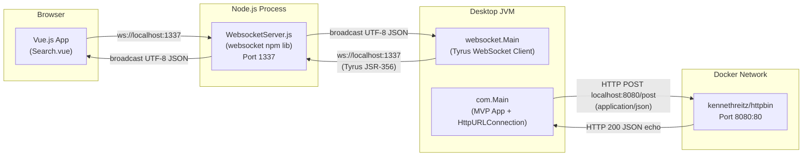

**Technical Interfaces Summary:**

| Interface | Protocol | Format | Notes |
|---|---|---|---|
| Vue.js ↔ WebSocket Server | WebSocket (`ws://`) | UTF-8 JSON | Native browser WebSocket API |
| Swing Client ↔ WebSocket Server | WebSocket (`ws://`) via Tyrus JSR-356 | UTF-8 JSON | `javax.websocket` API with Tyrus runtime |
| Swing MVP ↔ HTTPBin | HTTP 1.1 POST | `application/json` | `java.net.HttpURLConnection`; no HTTP client library |
| Vue.js dev server | HTTP | - | `vue-cli-service serve` (dev only) |

---

## 4. Solution Strategy

### 4.1 Core Architectural Approach

The architecture is intentionally **minimal and pragmatic** for a PoC context. The central insight is the **WebSocket message broker pattern**: a single Node.js process acts as a lightweight publish/subscribe hub. Any connected client can send a message; the server broadcasts it to all other clients. This allows the Vue.js web frontend and the Swing desktop application to communicate without any direct coupling.

| Architectural Decision | Choice Made | Rationale |
|---|---|---|
| Integration pattern | **WebSocket broadcast hub** | Zero coupling between clients; no shared state server-side; trivial to add new client types |
| Server technology | **Node.js + `websocket` npm package** | Minimal code, fast startup, well-understood WebSocket support |
| Java client technology | **Glassfish Tyrus (JSR-356)** | Standards-based Java WebSocket API; integrates with existing Java/Maven project |
| Frontend technology | **Vue.js 2** | Component-based SPA framework; reactive data binding simplifies form state management |
| Java UI pattern | **MVP (Model-View-Presenter)** | Applied to the refactored Swing app to demonstrate clean separation and testability |
| Data transfer format | **JSON over WebSocket** | Human-readable, schemaless, universally supported |
| HTTP backend | **HTTPBin Docker container** | Zero-effort echo service to validate JSON serialization without building a real backend |

### 4.2 Top-Level Decomposition

The system decomposes into **three independently deployable processes**:

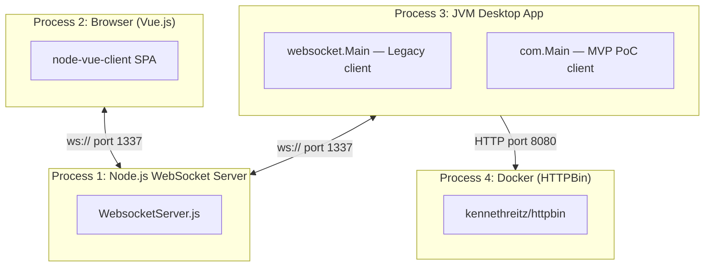

### 4.3 Quality Approach

| Quality Goal | Architectural Approach |
|---|---|
| Interoperability | Standard WebSocket protocol (RFC 6455) ensures all clients can participate regardless of technology stack |
| Simplicity | No framework on the server side, no database, no authentication layer |
| Maintainability | MVP pattern in Java Swing clearly separates UI, business logic, and data; Vue.js component model separates view from behaviour |
| Responsiveness | WebSocket push eliminates polling; message delivery is sub-millisecond on localhost |
| Evolvability | Each process is independently replaceable; message schema is the only shared contract |

---

## 5. Building Block View

### 5.1 Level 1 — System Overview

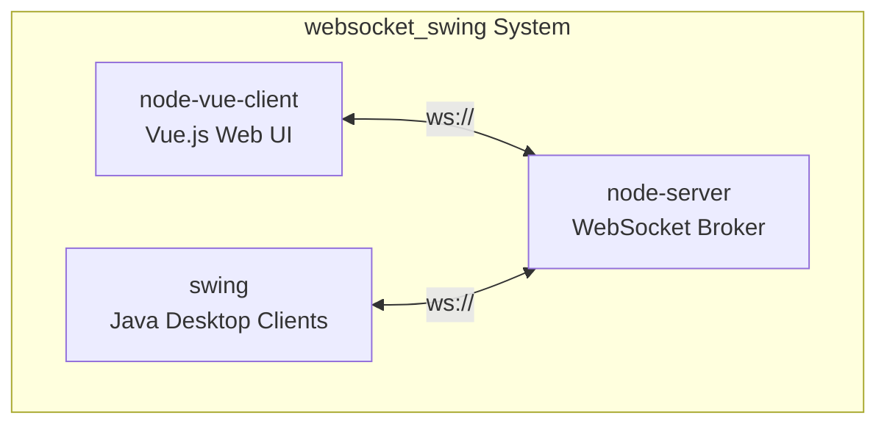

### 5.2 Level 2 — Container View

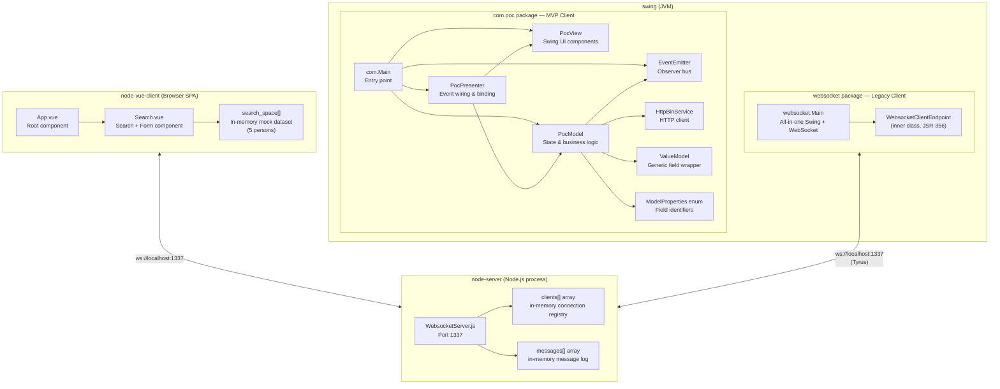

### 5.3 Level 3 — Component Details

#### 5.3.1 Node.js WebSocket Server (`node-server/src/WebsocketServer.js`)

**Purpose:** Acts as a central message broker. Every UTF-8 JSON message received from any client is broadcast to **all** currently connected clients (including the sender).

**Responsibilities:**
- Accepts WebSocket upgrade requests (any origin)
- Maintains the active connection registry (`clients[]`)
- Broadcasts all incoming UTF-8 messages to all registered connections
- Logs connection/disconnection and message events to stdout

**Key Design Notes:**
- No message routing logic — target field in messages is interpreted client-side
- No message persistence (the `messages[]` array is declared but unused beyond logging)
- No authentication or origin validation (`request.accept(null, request.origin)`)

**Internal Structure:**

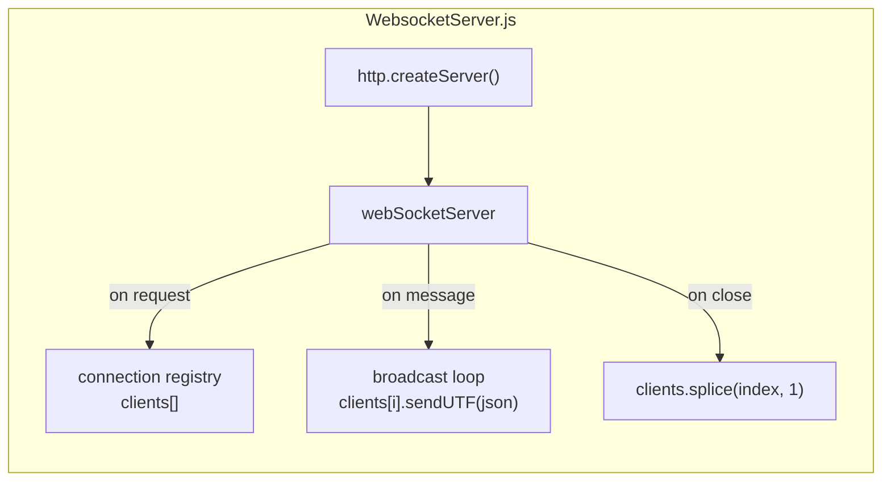

#### 5.3.2 Vue.js Web Client (`node-vue-client/`)

**Purpose:** Provides a browser-based search UI for caseworkers to find insured persons and transfer their data to the Allegro Swing desktop application.

**Component Hierarchy:**

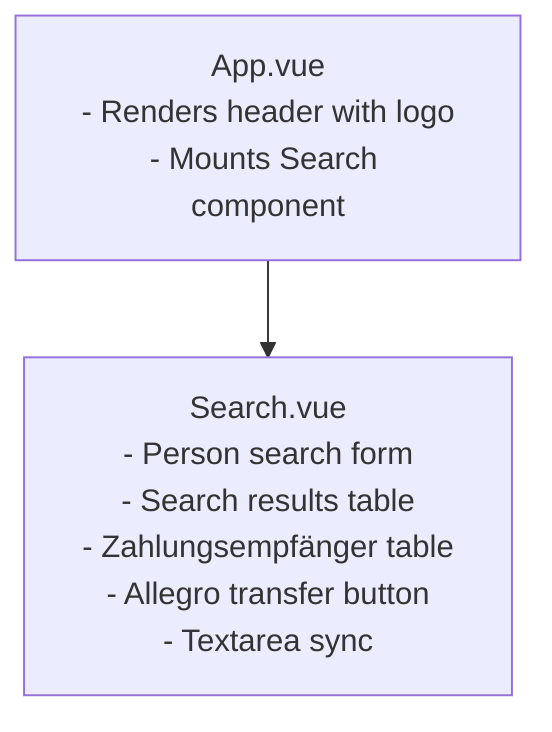

**Key Behaviour in `Search.vue`:**
- On mount: opens WebSocket connection to `ws://localhost:1337/`
- `searchPerson()`: filters in-memory `search_space[]` by name, address, ZIP or city (client-side, partial match, case-insensitive)
- `selectResult(item)`: stores selected person in `selected_result`
- `zahlungsempfaengerSelected(item)`: stores selected payment recipient
- `sendMessage(e, target)`: serialises the payload as JSON with `{ target, content }` and sends via WebSocket
- `watch.internal_content_textarea`: auto-sends textarea content changes to all clients (target: `"textarea"`)

**Mock Dataset:** The `search_space[]` contains 5 hardcoded German persons with IBAN/BIC payment data, covering a representative set of address formats and bank identifiers.

#### 5.3.3 Java Swing — Legacy WebSocket Client (`swing/src/main/java/websocket/Main.java`)

**Purpose:** Simulates the existing legacy Allegro Swing application. Receives JSON messages from the WebSocket server and populates its form fields accordingly.

**Key Classes:**

| Class | Type | Responsibility |
|---|---|---|
| `websocket.Main` | Entry point + UI | Builds Swing UI, initiates WebSocket connection |
| `WebsocketClientEndpoint` | Inner static class (JSR-356 `@ClientEndpoint`) | Manages WebSocket lifecycle; parses incoming messages and updates UI fields |
| `Message` | Inner final record-style class | DTO holding `target` and `content` strings |
| `SearchResult` | Inner final class | DTO holding all person + payment fields parsed from JSON |

**Message Handling Logic:**

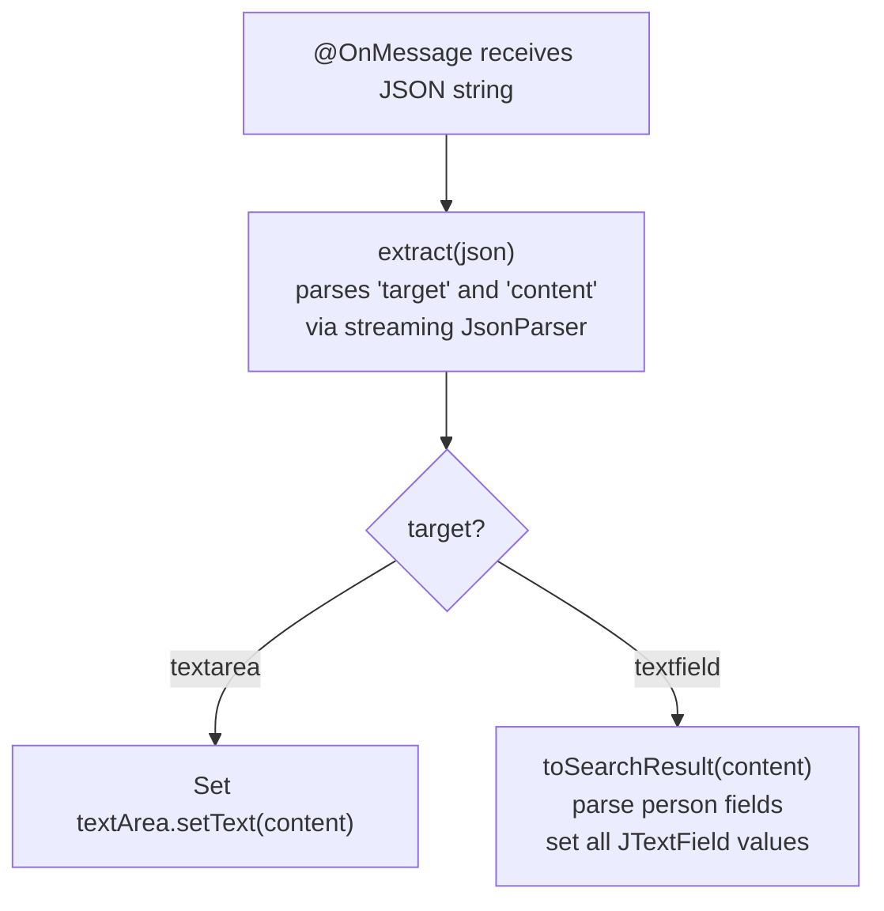

**JSON Parsing Note:** Uses a low-level streaming `javax.json.stream.JsonParser` (no POJO mapping). The parser uses boolean flag variables (`name`, `first`, `dob`, etc.) to track which field is currently being read — a verbose but dependency-free approach.

#### 5.3.4 Java Swing — MVP Refactored Client (`swing/src/main/java/com/`)

**Purpose:** Demonstrates a clean MVP-structured Swing application that can submit form data to an HTTP backend. Represents the target architecture for a modernized Allegro desktop client.

**MVP Structure:**

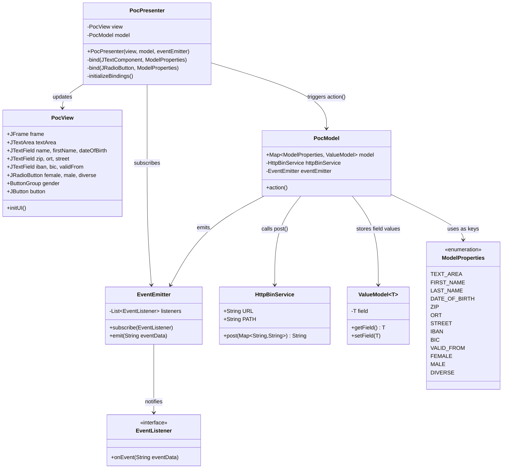

---

## 6. Runtime View

### 6.1 Scenario 1 — Person Search and Data Transfer to Allegro

This is the primary use case: a caseworker searches for an insured person in the Vue.js web client and transfers the selected data into the Allegro Swing application.

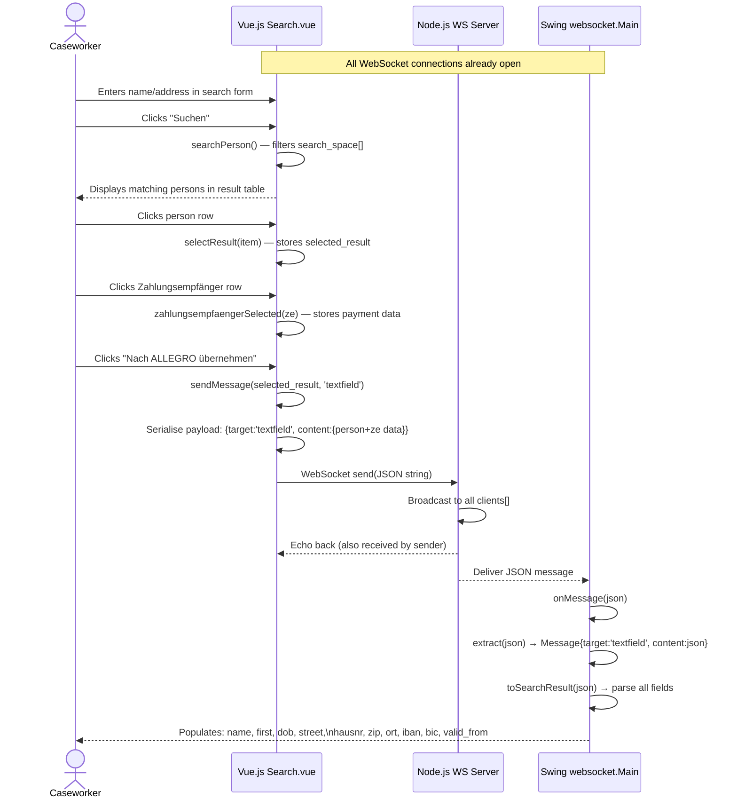

### 6.2 Scenario 2 — Textarea Synchronisation

The textarea in the Vue.js client is automatically synchronised in real-time with the `textArea` in the Swing application.

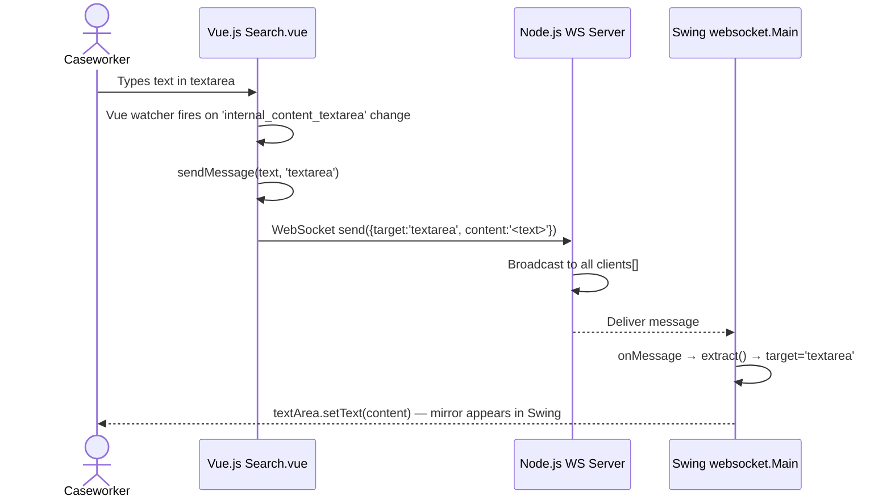

### 6.3 Scenario 3 — MVP Swing App HTTP Submission

The refactored MVP Swing client submits form data to the HTTPBin backend after the user fills in fields and clicks "Anordnen".

```mermaid
sequenceDiagram
    actor CW as Caseworker
    participant VIEW as PocView
    participant PRES as PocPresenter
    participant MODEL as PocModel
    participant EE as EventEmitter
    participant HTTP as HttpBinService
    participant BIN as HTTPBin :8080

    CW->>VIEW: Fills in form fields (name, first, DOB, etc.)
    VIEW->>PRES: DocumentListener fires for each field change
    PRES->>MODEL: ValueModel.setField(value) for each ModelProperties key

    CW->>VIEW: Clicks "Anordnen" button
    VIEW->>PRES: ActionListener fires
    PRES->>MODEL: action()
    MODEL->>MODEL: Collect all ValueModel values into Map<String,String>
    MODEL->>HTTP: post(data)
    HTTP->>BIN: HTTP POST /post  Content-Type: application/json\n{FIRST_NAME:..., LAST_NAME:..., etc.}
    BIN-->>HTTP: 200 OK JSON echo of request body
    HTTP-->>MODEL: Returns response body string
    MODEL->>EE: emit(responseBody)
    EE->>PRES: onEvent(eventData) callback
    PRES->>VIEW: textArea.setText(eventData)\n+ clear all input fields
    VIEW-->>CW: Shows response in textarea; form reset
```

### 6.4 WebSocket Connection Lifecycle

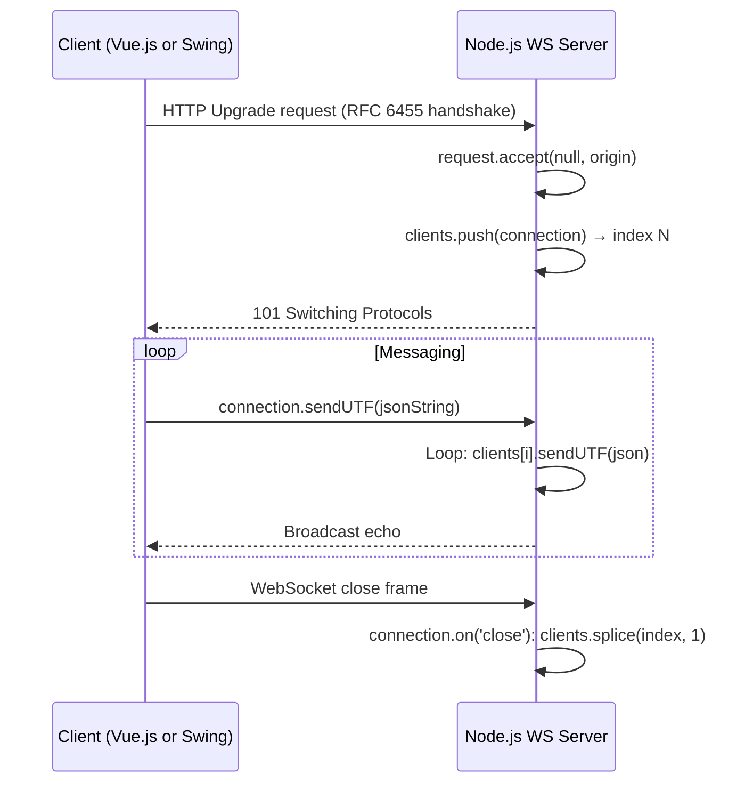

---

## 7. Deployment View

### 7.1 Infrastructure Overview

The PoC runs entirely on a **single developer workstation**. All four processes communicate over `localhost`.

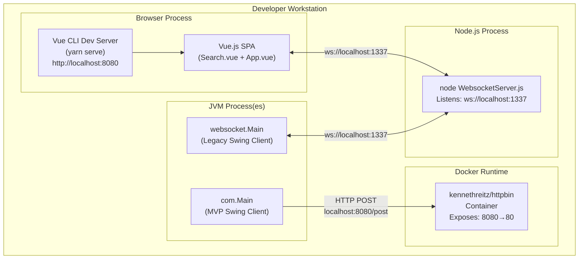

### 7.2 Process Startup Sequence

The components must be started in the following order:

| Step | Component | Command | Prerequisite |
|---|---|---|---|
| 1 | Docker / HTTPBin | `docker run -p 8080:80 kennethreitz/httpbin` | Docker Desktop running |
| 2 | Node.js WS Server | `node node-server/src/WebsocketServer.js` | `npm install websocket` or `NODE_PATH` configured |
| 3 | Vue.js Web Client | `cd node-vue-client && yarn serve` | Node.js, yarn installed |
| 4 | Java Swing Client | Run `websocket.Main` or `com.Main` via IDE or Maven | Java 22+, Maven, IntelliJ project configured |

### 7.3 Port Assignments

| Port | Service | Protocol |
|---|---|---|
| 1337 | Node.js WebSocket Server | WebSocket (`ws://`) |
| 8080 | HTTPBin Docker container | HTTP |
| 8081+ | Vue.js Dev Server | HTTP (default Vue CLI port may vary) |

### 7.4 Deployment Considerations

| Consideration | Current State | Production Recommendation |
|---|---|---|
| Security (TLS) | None — plain `ws://` and `http://` | Use `wss://` and `https://` with proper certificates |
| Authentication | None | Add token-based auth to WebSocket handshake |
| Origin validation | None (any origin accepted) | Whitelist allowed origins in WS server |
| Scalability | Single Node.js process, in-memory client list | Use Redis pub/sub or a proper message broker for multi-instance |
| Configuration | All ports and URLs hardcoded | Externalise to environment variables or config files |
| Vue.js build | Dev server (`yarn serve`) | Build with `yarn build` and serve via Nginx/CDN |

---

## 8. Cross-cutting Concepts

### 8.1 Domain Data Model

The following entities are central to the domain. All are currently implemented as plain JSON objects (in Vue.js) or flat Java classes/POJOs (in Swing).

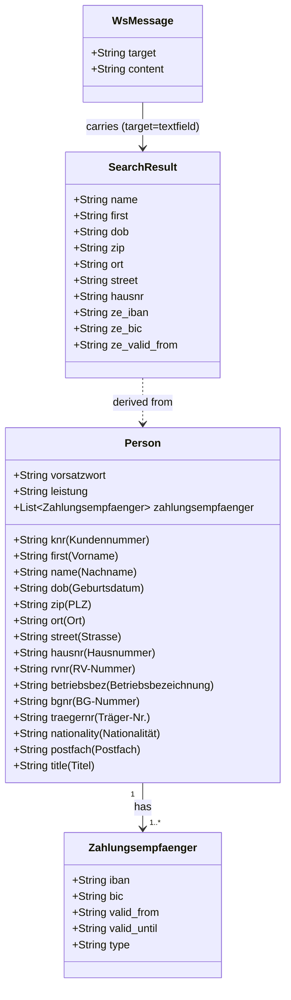

### 8.2 WebSocket Message Schema

All messages exchanged over the WebSocket channel conform to the following JSON schema:

```json
{
  "target": "<string>",
  "content": "<string or JSON object>"
}
```

| `target` value | `content` type | Description |
|---|---|---|
| `"textfield"` | JSON object (Person + Zahlungsempfaenger) | Transfer person data to Swing form fields |
| `"textarea"` | Plain string | Synchronise textarea content between clients |

**Example — textfield message:**
```json
{
  "target": "textfield",
  "content": {
    "first": "Hans",
    "name": "Mayer",
    "dob": "1981-01-08",
    "zip": "95183",
    "ort": "Trogen",
    "street": "Isaaer Str.",
    "hausnr": "23",
    "knr": "79423984",
    "zahlungsempfaenger": {
      "iban": "DE27100777770209299700",
      "bic": "ERFBDE8E759",
      "valid_from": "2020-01-04"
    }
  }
}
```

**Example — textarea message:**
```json
{
  "target": "textarea",
  "content": "Some free-form text entered by the user"
}
```

### 8.3 OpenAPI / REST Contract

The `api.yml` file defines an OpenAPI 3.0.1 contract for the HTTP backend (`/post` endpoint at `http://localhost:8080`). The Swing MVP client posts to this endpoint with the full form data.

**Request body schema (`PostObject`):**

| Field | Type | Description |
|---|---|---|
| `FIRST_NAME` | string | First name |
| `LAST_NAME` | string | Last name |
| `DATE_OF_BIRTH` | string | Date of birth |
| `STREET` | string | Street address |
| `BIC` | string | Bank identifier code |
| `ORT` | string | City / Ort |
| `ZIP` | string | Postal code |
| `FEMALE` | string | Gender flag |
| `MALE` | string | Gender flag |
| `DIVERSE` | string | Gender flag |
| `IBAN` | string | International bank account number |
| `VALID_FROM` | string | Payment record validity start |
| `TEXT_AREA` | string | Free-text area content |

### 8.4 Error Handling

| Layer | Current Handling | Quality Assessment |
|---|---|---|
| Node.js WS Server | No explicit error handling; uncaught errors will crash the process | ⚠️ PoC-level only |
| Vue.js WebSocket | Basic `onopen` event; no `onerror` or `onclose` reconnect logic | ⚠️ No reconnection strategy |
| Swing WebSocket (Legacy) | Exceptions in constructor wrapped in `RuntimeException` | ⚠️ Will crash the JVM if connection fails |
| Swing MVP HTTP | Exceptions rethrown as `RuntimeException` from ActionListener | ⚠️ Will display unhandled error dialog |
| `toSearchResult()` | No null checks; `message.content` may be empty for non-`textarea` targets | ⚠️ Potential NPE |

### 8.5 Logging

All components use **console/stdout logging only**:

| Component | Logged Events |
|---|---|
| Node.js server | Client connection (with origin), connection accepted, message received (with content), peer disconnected |
| Swing (legacy) | `opening websocket`, `closing websocket`, button clicks, raw JSON parsing steps |
| Swing (MVP) | Field change events (insert/remove document events), HTTP response code and body, emitted event data |

No structured logging, no log levels, no log files.

### 8.6 Security Concepts

| Security Aspect | Current State |
|---|---|
| Transport security | None — all traffic is plain `ws://` and `http://` |
| Authentication | None |
| Authorization | None |
| Input validation | None — all user inputs are passed directly to WebSocket and HTTP |
| Origin validation | None — WS server accepts from any origin |
| Sensitive data in transit | IBAN and BIC are transmitted in plain text without encryption |

> ⚠️ **Important:** The current PoC implementation handles real-looking financial data (IBAN, BIC) without any security controls. A production version must implement TLS, authentication, and input sanitisation before handling real data.

### 8.7 Persistence

There is **no persistence layer** in this PoC:

- The Node.js server holds connections in an in-memory array (`clients[]`)
- The Vue.js client holds the mock dataset in a hardcoded `search_space[]` array within the component
- The Swing applications hold UI state in Swing component references and `ValueModel` objects
- All state is lost when processes restart

### 8.8 Internationalisation

The application's UI labels are in **German** throughout, reflecting the German social insurance domain:

| German Term | Context |
|---|---|
| Vorname / Name | First name / Last name |
| Geburtsdatum / Geschlecht | Date of birth / Gender |
| Weiblich / Männlich / Divers | Female / Male / Diverse |
| PLZ / Ort / Strasse | Postal code / City / Street |
| Gültig ab | Valid from |
| Nach ALLEGRO übernehmen | Transfer to ALLEGRO |
| Suchen / Anordnen | Search / Arrange/Submit |
| Zahlungsempfänger | Payment recipient / Payee |

---

## 9. Architecture Decisions

### ADR-001: WebSocket Broadcast Hub as Integration Pattern

**Status:** Implemented (observed in code)

**Context:** The goal is to allow a modern Vue.js web UI to push data into a legacy Swing application in real-time, without modifying the Swing application's internal architecture significantly.

**Decision:** Use a central Node.js WebSocket server that broadcasts every received message to all connected clients. The routing logic (`target` field) is handled client-side.

**Consequences:**
- ✅ Zero coupling between Vue.js and Swing; they never communicate directly
- ✅ New clients (e.g., a second Swing instance, a React app) can be added without changing the server
- ✅ Very simple server implementation (~68 lines of JavaScript)
- ⚠️ All messages are broadcast to all clients — no server-side routing or filtering
- ⚠️ The sender receives its own message back (echo effect; currently ignored)
- ❌ Not scalable beyond a single Node.js process without external state management

---

### ADR-002: javax.json Streaming Parser for JSON Parsing in Java

**Status:** Implemented (observed in `websocket.Main.extract()` and `toSearchResult()`)

**Context:** The Swing WebSocket client needs to parse incoming JSON messages into Java objects.

**Decision:** Use the low-level `javax.json.stream.JsonParser` API with boolean flag variables rather than a data-binding library (e.g., Jackson, Gson).

**Consequences:**
- ✅ No additional dependency beyond the already-included `javax.json`
- ✅ Works on Java 22 without reflection-based frameworks
- ❌ Extremely verbose (10+ boolean flag variables in `toSearchResult()`)
- ❌ Fragile — does not handle nested JSON objects properly; the `content` field in `textfield` messages is handled by passing the full raw JSON string rather than the actual nested value
- ❌ No validation of required fields; missing keys will result in null field values

---

### ADR-003: MVP Pattern for Refactored Swing Application

**Status:** Implemented (observed in `com.poc.*` packages)

**Context:** The PoC should demonstrate a modernized architecture for the Allegro Swing application that would be more maintainable and testable than the legacy monolithic `websocket.Main` approach.

**Decision:** Apply the Model-View-Presenter (MVP) pattern with `PocView`, `PocModel`, and `PocPresenter`, connected by an `EventEmitter`/`EventListener` observer bus.

**Consequences:**
- ✅ Clear separation of concerns: View only contains Swing UI; Model only contains business data and HTTP logic; Presenter wires them together
- ✅ `EventEmitter` decouples the asynchronous HTTP response from the synchronous UI update
- ✅ `ValueModel<T>` provides a generic, type-safe field wrapper that can be extended
- ✅ `ModelProperties` enum provides a compile-time-safe way to reference model fields
- ⚠️ `PocPresenter` directly accesses `model.model` map, breaking encapsulation slightly
- ⚠️ `ViewData` class is empty — placeholder for future expansion

---

### ADR-004: HttpURLConnection for HTTP calls (No HTTP Client Library)

**Status:** Implemented (observed in `HttpBinService.java`)

**Context:** The MVP Swing app needs to make an HTTP POST request to the backend.

**Decision:** Use `java.net.HttpURLConnection` directly rather than a library such as Apache HttpClient or `java.net.http.HttpClient` (Java 11+).

**Consequences:**
- ✅ No additional dependency required
- ⚠️ Verbose boilerplate compared to modern alternatives
- ❌ Uses the older `HttpURLConnection` API rather than the modern `java.net.http.HttpClient` which is available in Java 11+ and would be more appropriate for Java 22

---

### ADR-005: In-Memory Mock Data in Vue.js Client

**Status:** Implemented (observed in `Search.vue`)

**Context:** A PoC does not need a real database. Person search data must be available without a backend.

**Decision:** Hardcode a `search_space[]` array of 5 persons with associated Zahlungsempfänger data directly in the Vue.js component's `data()` function.

**Consequences:**
- ✅ Zero backend infrastructure required for the web UI
- ✅ Realistic enough data to demonstrate the search and transfer workflow
- ❌ Data is lost on page refresh
- ❌ All users see the same dataset
- ❌ Not extensible without code changes

---

## 10. Quality Requirements

### 10.1 Quality Tree

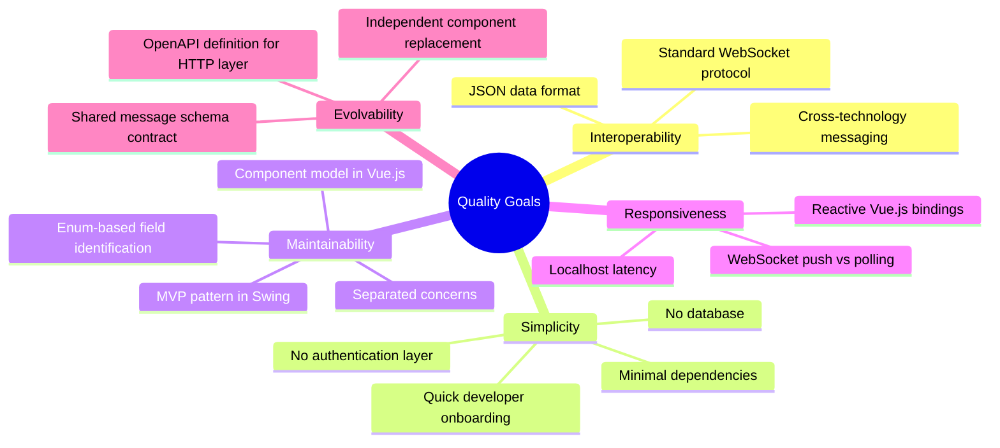

### 10.2 Quality Scenarios

| ID | Quality Attribute | Stimulus | Expected Response | Current Status |
|---|---|---|---|---|
| QS-1 | Interoperability | Caseworker selects a person in Vue.js and clicks transfer | Swing form fields are populated within 100ms | ✅ Achieved via WebSocket broadcast |
| QS-2 | Responsiveness | User types in textarea | Mirror update appears in Swing textarea in <100ms | ✅ Achieved via Vue watcher + WebSocket |
| QS-3 | Simplicity | New developer joins the project | Can run the full stack locally within 30 minutes | ✅ README covers all steps |
| QS-4 | Maintainability | Developer adds a new form field to the Swing MVP app | Change requires: 1 enum value + 1 field in View + 1 bind() call | ✅ MVP structure supports this |
| QS-5 | Evolvability | Node.js server is replaced by a JVM-based broker | Vue.js and Swing clients require zero code changes | ✅ All clients use standard WebSocket API |
| QS-6 | Security | IBAN data is transferred | Data is encrypted in transit | ❌ Not implemented — PoC only |
| QS-7 | Reliability | Node.js server crashes | Clients detect disconnection and reconnect | ❌ No reconnection logic implemented |
| QS-8 | Testability | Unit tests for PocPresenter | Presenter can be tested without UI | ⚠️ Structurally possible but no tests written |

---

## 11. Risks and Technical Debt

### 11.1 Technical Risks

| ID | Risk | Probability | Impact | Mitigation |
|---|---|---|---|---|
| R-001 | **No TLS/encryption** — IBAN, BIC, personal data transmitted as plain text | High (if used beyond localhost) | High | Implement `wss://` and `https://` before any network exposure |
| R-002 | **No reconnection logic** — if WS server restarts, all clients silently lose connectivity | Medium | Medium | Add `onclose`/`onerror` handlers with exponential backoff retry |
| R-003 | **Node.js process crash** — no error handling, one unhandled exception terminates the broker | Medium | High | Add `process.on('uncaughtException')`, use PM2 or systemd for process management |
| R-004 | **JSON parsing fragility** — `toSearchResult()` uses flag-based streaming parser that may misread nested objects | High | Medium | Replace with a proper JSON binding library (Jackson or Gson) |
| R-005 | **Hardcoded ports** — port 8080 conflict likely when both Vue.js dev server and HTTPBin are running | High | Low | Externalise ports to environment variables; use distinct default ports |
| R-006 | **Broadcast to all clients** — sender receives its own message; other unrelated clients receive all messages | High | Medium | Add client IDs and server-side message routing, or topic-based subscriptions |

### 11.2 Technical Debt

| ID | Type | Component | Description | Priority | Estimated Effort |
|---|---|---|---|---|---|
| TD-001 | Design Debt | `websocket/Main.java` | Monolithic class: UI construction, WebSocket client, JSON parsing, and data model all in one file | High | 4h refactor to MVP pattern |
| TD-002 | Code Debt | `websocket/Main.java` | `toSearchResult()` uses 10 boolean flag variables for JSON field tracking — verbose, fragile, error-prone | High | 2h — replace with Jackson/Gson |
| TD-003 | Code Debt | `com.poc.presentation.PocPresenter` | Directly accesses `model.model` public map, bypassing encapsulation | Medium | 1h — add getter methods to PocModel |
| TD-004 | Code Debt | `com.poc.model.HttpBinService` | Uses deprecated `HttpURLConnection` instead of `java.net.http.HttpClient` (available since Java 11) | Medium | 1h — migrate to HttpClient API |
| TD-005 | Code Debt | `node-server/src/WebsocketServer.js` | `messages[]` array is declared but never meaningfully used | Low | 30min — remove unused variable |
| TD-006 | Design Debt | `com.poc.model.ViewData` | Empty class — placeholder that was never implemented | Low | 30min — implement or remove |
| TD-007 | Test Debt | All components | No automated tests (unit or integration) across the entire PoC | High | 8h — add JUnit 5 for Java; Jest for Vue.js |
| TD-008 | Configuration Debt | All components | All ports, URLs, and endpoints are hardcoded | Medium | 2h — externalise to `.env` files |
| TD-009 | Security Debt | All components | No TLS, no authentication, no input validation | Critical (for production) | 16h+ — full security hardening |
| TD-010 | Data Debt | `Search.vue` | Hardcoded `search_space[]` — not connected to a real data source | High (for real use) | Requires backend API design |

### 11.3 Improvement Recommendations

**Short-term (PoC hardening, 1–2 days):**
1. Add `process.on('uncaughtException')` and connection heartbeat to Node.js server
2. Add `onerror`/`onclose` reconnection logic to Vue.js client
3. Replace `javax.json` streaming parser with Jackson `ObjectMapper` in `websocket.Main`
4. Add client ID to messages to suppress echo effect

**Medium-term (Architecture evolution, 1–2 weeks):**
1. Extract `websocket.Main` into MVP architecture matching `com.poc.*`
2. Migrate `HttpBinService` to `java.net.http.HttpClient`
3. Externalise all configuration to environment variables
4. Add basic JWT authentication to WebSocket handshake
5. Write unit tests for `PocPresenter`, `PocModel`, `HttpBinService`, and `Search.vue`

**Long-term (Production readiness, 1+ month):**
1. Replace Node.js broadcast hub with a proper message broker (e.g., RabbitMQ, Kafka, or a topic-based WS server)
2. Replace in-memory mock data with a real database and REST API
3. Implement full TLS (`wss://`, `https://`)
4. Build the Vue.js client for production and serve via a proper web server
5. Containerise all components with Docker Compose

---

## 12. Glossary

### 12.1 Domain Terms (German Social Insurance Context)

| Term | German | Definition |
|---|---|---|
| Allegro | Allegro | The legacy Java Swing desktop application used for social insurance administration; the modernization target of this PoC |
| Insured Person | Versicherte(r) | A person enrolled in the social insurance system |
| Customer Number | Kundennummer (KNR) | Unique identifier for a customer/insured person in the Allegro system |
| Pension Insurance Number | RV-Nummer | Rentenversicherungsnummer — German statutory pension insurance number |
| Employers' Liability Insurance Number | BG-Nummer | Berufsgenossenschaftsnummer — accident insurance association identifier |
| Carrier Number | Träger-Nr. | Trägernummer der gemeinsamen Einrichtungen — joint body carrier number |
| Payment Recipient | Zahlungsempfänger | A bank account (IBAN + BIC) associated with a person for payment purposes |
| Validity Period | Gültigkeitszeitraum | The time period during which a Zahlungsempfänger record is valid |
| Place | Ort | City or municipality in a German address |
| Postal Code | PLZ (Postleitzahl) | German 5-digit postal code |
| Street | Strasse | Street name in a German address |
| House Number | Hausnummer | Building number in a German address |
| Gender | Geschlecht | Legal gender: Weiblich (female), Männlich (male), Divers (diverse) |
| Date of Birth | Geburtsdatum (DOB) | Person's birth date |
| Transfer to Allegro | Nach Allegro übernehmen | The action of pushing selected data from the web UI into the Allegro Swing form |
| Arrange / Submit | Anordnen | Button label in the Swing MVP form; triggers HTTP submission to the backend |

### 12.2 Technical Terms

| Term | Definition |
|---|---|
| WebSocket | A full-duplex communication protocol over a single TCP connection, standardised as RFC 6455. Enables real-time bidirectional messaging between browser and server |
| WSS | WebSocket Secure — WebSocket over TLS, analogous to HTTPS over HTTP |
| Tyrus | GlassFish Tyrus — the reference implementation of JSR-356 (Java API for WebSocket) |
| JSR-356 | Java Specification Request 356 — the Java EE/Jakarta EE standard API for WebSocket clients and servers |
| MVP | Model-View-Presenter — a UI architectural pattern that separates state (Model), presentation (View), and interaction logic (Presenter) |
| EventEmitter | A subject/observable implementation that allows decoupled publish-subscribe messaging within a single process |
| ValueModel | A generic wrapper class (`ValueModel<T>`) used in the MVP model to hold individual field values |
| ModelProperties | A Java enum defining the canonical names of all data fields in the MVP model, used as keys in the model map |
| HTTPBin | `kennethreitz/httpbin` — a public HTTP request/response service (available as Docker image) that echoes back whatever is sent to it; used here as a zero-effort backend mock |
| OpenAPI | A specification format (formerly Swagger) for describing REST APIs in YAML or JSON |
| IBAN | International Bank Account Number — standardised format for identifying bank accounts internationally |
| BIC | Bank Identifier Code (also known as SWIFT code) — identifies the bank associated with an IBAN |
| SPA | Single-Page Application — a web application that loads once and dynamically updates the page via JavaScript |
| Vue.js | A progressive JavaScript framework for building user interfaces; used here in version 2.6 |
| Vue CLI | Vue Command Line Interface — tooling for Vue.js project scaffolding, development server, and builds |
| Broadcast | In the context of this server: sending a received message to all connected WebSocket clients |
| CountDownLatch | A Java concurrency primitive used here to keep the main thread alive while the WebSocket connection is open |
| DocumentListener | A Swing interface for listening to text changes in `JTextComponent` fields; used in the MVP Presenter for two-way data binding |

---

## Appendix

### A. File Inventory

| File | Component | Language | Purpose |
|---|---|---|---|
| `pom.xml` | Root | XML | Maven project descriptor for Java components |
| `api.yml` | Root | YAML (OpenAPI 3.0.1) | REST API contract for the `/post` endpoint |
| `README.md` | Root | Markdown | Project setup guide (Java Swing focus) |
| `WebsocketSwingClient.launch` | Root | XML | IntelliJ run configuration |
| `websocket_swing.iml` | Root | XML | IntelliJ module file |
| `node-server/src/WebsocketServer.js` | node-server | JavaScript | WebSocket broadcast server |
| `node-server/package.json` | node-server | JSON | Node.js dependency manifest |
| `node-server/doc/Readme.txt` | node-server | Text | Setup instructions for Node.js server |
| `node-vue-client/src/App.vue` | node-vue-client | Vue SFC | Root Vue.js component |
| `node-vue-client/src/components/Search.vue` | node-vue-client | Vue SFC | Main search + transfer component |
| `node-vue-client/src/main.js` | node-vue-client | JavaScript | Vue.js app entry point |
| `node-vue-client/package.json` | node-vue-client | JSON | npm/yarn dependency manifest |
| `node-vue-client/babel.config.js` | node-vue-client | JavaScript | Babel transpiler configuration |
| `node-vue-client/README.md` | node-vue-client | Markdown | Vue CLI project setup guide |
| `swing/src/main/java/com/Main.java` | swing | Java | MVP application entry point |
| `swing/src/main/java/com/poc/ValueModel.java` | swing | Java | Generic field value wrapper |
| `swing/src/main/java/com/poc/model/PocModel.java` | swing | Java | MVP Model — application state |
| `swing/src/main/java/com/poc/model/ModelProperties.java` | swing | Java | Enum of all model field keys |
| `swing/src/main/java/com/poc/model/EventEmitter.java` | swing | Java | Observer/event bus implementation |
| `swing/src/main/java/com/poc/model/EventListener.java` | swing | Java | Observer interface |
| `swing/src/main/java/com/poc/model/HttpBinService.java` | swing | Java | HTTP client for /post endpoint |
| `swing/src/main/java/com/poc/model/ViewData.java` | swing | Java | Placeholder DTO (empty) |
| `swing/src/main/java/com/poc/presentation/PocView.java` | swing | Java | MVP View — Swing UI construction |
| `swing/src/main/java/com/poc/presentation/PocPresenter.java` | swing | Java | MVP Presenter — wires View and Model |
| `swing/src/main/java/websocket/Main.java` | swing | Java | Legacy monolithic WebSocket Swing client |
| `swing/src/main/java/com/README.md` | swing | Markdown | Docker prerequisite note |
| `swing/bin/pom.xml` | swing | XML | Minimal Maven descriptor in bin output |

### B. Technology Stack Summary

| Layer | Technology | Version | Notes |
|---|---|---|---|
| Message Broker | Node.js + `websocket` npm | Node.js LTS, websocket ^1.0.35 | Single-file server |
| Web Frontend | Vue.js | 2.6.10 | Options API, no Vuex, no Vue Router |
| Web Frontend Build | Vue CLI | 4.x | Babel + ESLint configuration |
| Desktop UI | Java Swing | Java 22 | Legacy UI toolkit; JDK bundled |
| Java WebSocket | Glassfish Tyrus | 1.15 (standalone client) | JSR-356 reference implementation |
| Java JSON | javax.json | 1.1.4 API, 1.0.4 impl | Streaming parser used; no POJO binding |
| Java HTTP | java.net.HttpURLConnection | Java 22 (built-in) | Legacy API; Java 11+ HttpClient preferred |
| Build | Apache Maven | — | Root POM for Java modules |
| Backend Mock | kennethreitz/httpbin | Docker | Echo service for POST validation |
| API Contract | OpenAPI | 3.0.1 | `api.yml` at project root |

### C. Analysis Notes

This arc42 document was generated through direct source code analysis of the `websocket_swing` repository. The following observations informed the documentation:

1. **Two parallel Swing implementations exist**: `websocket.Main` (legacy monolithic approach) and `com.Main` (MVP refactored approach). Both are functionally different demonstrations in the same Maven project.

2. **The `websocket.Main` also builds a Swing UI** independently of the MVP version, with overlapping form fields, but it connects to the WebSocket server rather than to HTTPBin.

3. **The `messages[]` array in `WebsocketServer.js` is declared but never meaningfully populated** — messages are only broadcast, not stored. This is a minor inconsistency.

4. **Vue.js `disconnect()` method is defined but never called** from the UI — there is no explicit disconnect button. The WebSocket is only closed when the browser tab is closed.

5. **The `zahlungsempfaenger` field handling in JSON parsing** is incomplete in `websocket.Main.toSearchResult()` — the nested `zahlungsempfaenger` object is not recursively parsed; only the top-level IBAN/BIC/valid_from fields are extracted if they appear at the root level of the content JSON, which may lead to incorrect field population depending on message structure.

6. **The PoC uses IBAN numbers that appear to be real German IBAN format** (`DE27...`, `DE11...`, etc.) in the mock dataset. These should be replaced with clearly synthetic test IBANs before any public distribution.

---

*This document was automatically generated from source code analysis of the `websocket_swing` repository.*  
*Generated by: arc42-agent*  
*Template: arc42 (arc42.org)*
