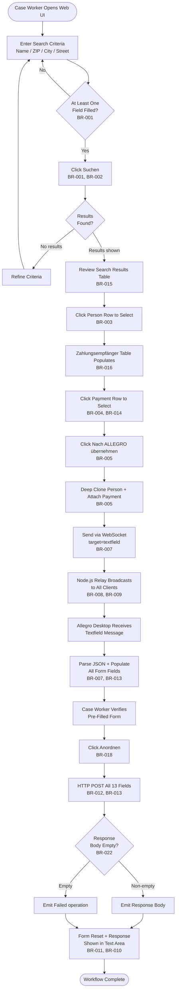
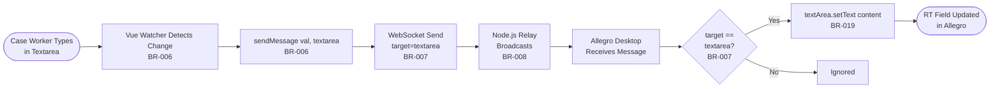
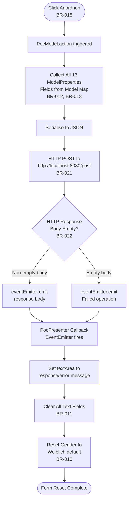

# Business Rules Documentation
# Allegro Modernization PoC — German Social Insurance Platform

> **Generated by:** business-rules-agent  
> **Date:** 2025-01-30  
> **Skills Used:** discover-files, geninsights-logging, json-output-schemas  
> **Repository:** websocket_swing (Allegro Modernization Proof of Concept)  
> **Source Analysis:** analysis_results.json (documentor-agent, 2025-01-30)  
> **Canonical Path:** `.geninsights/docs/business-rules.md`  
> **Note:** Saved to repository root — `.geninsights/` directory requires manual creation. See `agent-work-log.md` for details.

---

## 📋 Table of Contents

1. [Executive Summary](#1-executive-summary)
2. [Business Domains](#2-business-domains)
3. [Domain Model & Entities](#3-domain-model--entities)
4. [German Insurance Terminology Glossary](#4-german-insurance-terminology-glossary)
5. [Business Rules by Domain](#5-business-rules-by-domain)
   - [Person Management](#51-person-management)
   - [Payment Management](#52-payment-management)
   - [Data Transfer & Allegro Integration](#53-data-transfer--allegro-integration)
   - [Infrastructure & System Rules](#54-infrastructure--system-rules)
   - [Application Lifecycle](#55-application-lifecycle)
6. [Business Workflows](#6-business-workflows)
   - [WF-001: Person Search and Transfer to Allegro](#wf-001-person-search-and-transfer-to-allegro)
   - [WF-002: Real-Time Text Note Synchronisation](#wf-002-real-time-text-note-synchronisation)
   - [WF-003: Allegro Form Data Submission (MVP)](#wf-003-allegro-form-data-submission-mvp)
7. [Rule Summary Table](#7-rule-summary-table)
8. [Rule Dependencies & Relationships](#8-rule-dependencies--relationships)
9. [Data Schema Reference](#9-data-schema-reference)
10. [Identified Gaps & Recommendations](#10-identified-gaps--recommendations)

---

## 1. Executive Summary

This document captures all business rules, domain logic, validations, and workflows extracted from the **ALLEGRO Modernisation Proof of Concept (PoC)**. ALLEGRO is a German social insurance / benefits management desktop application. This PoC demonstrates how the legacy Java Swing desktop client can interoperate with modern web technologies via a WebSocket relay.

**22 business rules** were identified across **5 business domains**, with **3 end-to-end workflows** documented.

### Key Findings

| Category | Count |
|---|---|
| Total Business Rules | 22 |
| Business Workflows | 3 |
| Business Domains | 5 |
| Critical Priority Rules | 5 |
| High Priority Rules | 11 |
| Medium Priority Rules | 5 |
| Low Priority Rules | 1 |

### Core Business Capability

> A case worker uses a modern web UI (Vue.js) to search for an insured person, selects the person and their active bank account (Zahlungsempfänger), and clicks **"Nach ALLEGRO übernehmen"** — automatically pre-filling the legacy Allegro desktop form with all relevant person and payment data via WebSocket relay.

---

## 2. Business Domains

| Domain | Description | Rules |
|---|---|---|
| **Person Management** | Search, selection, and identity of insured persons | BR-001, BR-002, BR-003, BR-015, BR-020 |
| **Payment Management** | Bank account (IBAN/BIC) selection and temporal validity | BR-004, BR-014, BR-016 |
| **Data Transfer / Allegro Integration** | WebSocket messaging, data routing, field population | BR-005, BR-006, BR-007, BR-012, BR-013 |
| **Infrastructure / System Rules** | Relay server, connection management, security | BR-008, BR-009, BR-021, BR-022 |
| **Application Lifecycle** | Form lifecycle, UI state, action processing | BR-010, BR-011, BR-017, BR-018, BR-019 |

---

## 3. Domain Model & Entities

### 3.1 Person (Versicherter / Insured Person)

```
Person {
  knr          : String   -- Kundennummer (Customer/Client Number) — unique identifier
  first        : String   -- Vorname (First Name)
  name         : String   -- Nachname (Last Name / Surname)
  dob          : String   -- Geburtsdatum (Date of Birth) — format: YYYY-MM-DD
  zip          : String   -- PLZ / Postleitzahl (Postal Code / ZIP)
  ort          : String   -- Ort (City/Town)
  street       : String   -- Strasse (Street Name)
  hausnr       : String   -- Hausnummer (House Number)
  gender       : Enum     -- Geschlecht: FEMALE (Weiblich) | MALE (Männlich) | DIVERSE (Divers)
  zahlungsempfaenger : [Zahlungsempfänger]  -- 1..N payment methods
}
```

### 3.2 Zahlungsempfänger (Payment Recipient / Bank Account)

```
Zahlungsempfänger {
  iban         : String   -- International Bank Account Number (e.g. DE27100777770209299700)
  bic          : String   -- Bank Identifier Code (e.g. ERFBDE8E759)
  valid_from   : String   -- Gültig ab (Valid From Date) — format: YYYY-MM-DD
  valid_until  : String   -- Gültig bis (Valid Until Date) — currently always empty
  type         : String   -- Zahlungsart (Payment Type) — currently always empty
}
```

### 3.3 Allegro Form Model (MVP — ModelProperties Enum)

```
AllegroFormModel {
  TEXT_AREA    : String   -- RT / Rechnungstext (free-text billing notes)
  FIRST_NAME   : String   -- Vorname
  LAST_NAME    : String   -- Nachname
  DATE_OF_BIRTH: String   -- Geburtsdatum
  ZIP          : String   -- PLZ
  ORT          : String   -- Ort
  STREET       : String   -- Strasse
  IBAN         : String   -- IBAN (from selected Zahlungsempfänger)
  BIC          : String   -- BIC (from selected Zahlungsempfänger)
  VALID_FROM   : String   -- Gültig ab (from selected Zahlungsempfänger)
  FEMALE       : Boolean  -- Geschlecht Weiblich
  MALE         : Boolean  -- Geschlecht Männlich
  DIVERSE      : Boolean  -- Geschlecht Divers
}
```

### 3.4 WebSocket Message Envelope

```
WebSocketMessage {
  target   : String   -- "textarea" | "textfield"
  content  : Any      -- String (for textarea) | Object (for textfield)
}
```

### 3.5 Entity Relationships

```
Insured Person (1) ─────── (N) Zahlungsempfänger
                                    │
                                    ▼
                         One selected per transfer
                                    │
                                    ▼
                         AllegroFormModel (populated)
```

---

## 4. German Insurance Terminology Glossary

| German Term | English Translation | Domain |
|---|---|---|
| Allegro | Legacy benefit management system name | System |
| Anordnen | Arrange / Commit / Issue (benefit payment order) | Business Action |
| BG-Nummer | Berufsgenossenschaft-Nummer (Occupational Accident Insurance Number) | Reference ID |
| BIC | Bank Identifier Code (SWIFT code) | Payment |
| Betriebsbez. | Betriebsbezeichnung (Business/Employer Name) | Organisation |
| Divers | Diverse / Non-Binary (3rd gender option) | Demographics |
| Geburtsdatum | Date of Birth | Demographics |
| Geschlecht | Gender | Demographics |
| Gültig ab | Valid From (date) | Temporal |
| Gültig bis | Valid Until (date) | Temporal |
| Hausnummer | House Number | Address |
| IBAN | International Bank Account Number | Payment |
| Kundennummer (knr) | Customer / Client Number | Identity |
| Männlich | Male | Demographics |
| Nach ALLEGRO übernehmen | Transfer to ALLEGRO | Business Action |
| Nationalität | Nationality | Demographics |
| Ort | City / Town | Address |
| PLZ (Postleitzahl) | Postal Code / ZIP Code | Address |
| Postfach | P.O. Box | Address |
| RT / Rechnungstext | Billing Text / Invoice Text (free-text notes) | Notes |
| RV-Nummer | Rentenversicherungsnummer (Pension Insurance Number) | Reference ID |
| Strasse | Street | Address |
| Suchen | Search | UI Action |
| Träger-Nr. der gE. | Carrier Number of the joint enterprise | Reference ID |
| Versicherter | Insured Person | Domain Entity |
| Vorname | First Name | Demographics |
| Weiblich | Female | Demographics |
| Zahlungsempfänger | Payment Recipient (bank account holder/entry) | Payment |

---

## 5. Business Rules by Domain

---

### 5.1 Person Management

---

#### BR-001: Person Search Criteria — At Least One Field Required

- **Type:** Validation
- **Priority:** 🔴 High
- **Business Domain:** Person Management / Search

**Description:**  
A person search is only executed when at least one search criterion is provided. The search evaluates fields using **OR logic**: last name (partial match), first name (partial match), ZIP code (exact match), city (partial match), street (partial match), or house number (partial match). An empty form returns no results.

**When it applies:** User clicks the "Suchen" button  
**What happens:** The search iterates the person dataset and returns only records matching at least one criterion  
**Exceptions:** None — all six search fields are individually optional, but at least one must be filled to match any record

**Implementation:** `Search.vue → searchPerson()`

```javascript
if (this.formdata.last && element.name.toLowerCase().indexOf(this.formdata.last.toLowerCase()) >= 0
  || this.formdata.first && element.first.toLowerCase().indexOf(this.formdata.first.toLowerCase()) >= 0
  || this.formdata.zip && element.zip == this.formdata.zip
  || this.formdata.ort && element.ort.toLowerCase().indexOf(this.formdata.ort.toLowerCase()) >= 0
  || this.formdata.street && element.street.toLowerCase().indexOf(this.formdata.street.toLowerCase()) >= 0
  || this.formdata.hausnr && element.hausnr.toLowerCase().indexOf(this.formdata.hausnr.toLowerCase()) >= 0
)
```

---

#### BR-002: Person Search — Case-Insensitive Partial String Matching

- **Type:** Decision
- **Priority:** 🟡 Medium
- **Business Domain:** Person Management / Search

**Description:**  
Text-based search fields (last name, first name, city, street, house number) use **case-insensitive substring matching**. A search for "may" matches "May" and "Mayer". **ZIP code uses exact string equality** — no prefix or substring matching is supported for postal codes.

**When it applies:** For every non-empty text field in the search form  
**What happens:** `toLowerCase().indexOf() >= 0` for names/addresses; `==` for ZIP  
**Exceptions:** ZIP uses exact equality only; partial ZIP searches are not supported

**Implementation:** `Search.vue → searchPerson()`

```javascript
element.name.toLowerCase().indexOf(this.formdata.last.toLowerCase()) >= 0  // partial match
element.zip == this.formdata.zip  // exact match for ZIP
```

---

#### BR-003: Person Selection — Single Active Selection at a Time

- **Type:** Process
- **Priority:** 🔴 High
- **Business Domain:** Person Management / Selection

**Description:**  
Only **one person** from the search result table can be active at a time. Clicking a row replaces any previous selection. The selected row is highlighted in blue. The Zahlungsempfänger table always shows payment methods for the currently selected person.

**When it applies:** User clicks any row in the search results table  
**What happens:** `selected_result = item`; Zahlungsempfänger table re-renders  
**Exceptions:** None

**Implementation:** `Search.vue → selectResult(item)`

```javascript
selectResult(item) {
  this.selected_result = item;
}
```

---

#### BR-015: Person Record — Mandatory Identity Fields

- **Type:** Domain Model
- **Priority:** 🔴 Critical
- **Business Domain:** Person Management / Identity

**Description:**  
Every person record must carry: first name (Vorname), last name (Name), date of birth (Geburtsdatum), and a unique customer number (Kundennummer). Address fields (PLZ, Ort, Strasse, Hausnummer) are present in all records, indicating they are de-facto required for social insurance purposes.

**Extended fields** visible in the search UI but **disabled** (read-only): RV-Nummer, BG-Nummer, Kundennummer, Träger-Nr., Betriebsbez., Postfach — these are populated from external systems.

**Implementation:** `Search.vue → search_space dataset`

```javascript
{first:'Hans', name:'Mayer', dob:'1981-01-08', zip:'95183', ort:'Trogen', 
 street:'Isaaer Str.', hausnr:'23', knr:'79423984', zahlungsempfaenger:[...]}
```

---

#### BR-020: Disabled UI Fields — Read-Only Reference Data

- **Type:** Validation
- **Priority:** 🟡 Medium
- **Business Domain:** Data Integrity / Reference Data

**Description:**  
Several fields in the Vue.js search form are explicitly **disabled** (read-only): Kundennummer, IBAN (search form), BIC (search form), Betriebsbez., RV-Nummer, BG-Nummer, Träger-Nr. der gE. These reference fields cannot be manually edited — they are populated from backend/authoritative systems.

**When it applies:** Always — permanently read-only in the search form  
**Exceptions:** IBAN and BIC appear as disabled in the search filter section but ARE editable in the Allegro desktop form

**Implementation:** `Search.vue → template`

```html
<input v-model="formdata.knr" placeholder="Kundennummer" disabled>
<input v-model="formdata.iban" placeholder="IBAN" disabled>
<input v-model="formdata.bic" placeholder="BIC" disabled>
```

---

### 5.2 Payment Management

---

#### BR-004: Payment Method Selection — Single Active Selection

- **Type:** Process
- **Priority:** 🔴 High
- **Business Domain:** Payment Management / Selection

**Description:**  
Only **one Zahlungsempfänger** (payment recipient / bank account) can be selected at a time. Clicking a payment row sets it as the active payment, highlighted in green. This single selection determines which IBAN, BIC, and Gültig-ab date will be transferred to Allegro.

**When it applies:** User clicks a row in the Zahlungsempfänger table  
**What happens:** `zahlungsempfaenger_selected = zahlungsempfaenger`  
**Exceptions:** If no payment row is selected, `zahlungsempfaenger_selected` remains an empty string — sending without a payment selection will include empty payment data

**Implementation:** `Search.vue → zahlungsempfaengerSelected()`

```javascript
zahlungsempfaengerSelected(zahlungsempfaenger) {
  this.zahlungsempfaenger_selected = zahlungsempfaenger;
}
```

---

#### BR-014: Payment Validity Date — Gültig ab (Valid From)

- **Type:** Temporal
- **Priority:** 🔴 High
- **Business Domain:** Payment Management / Temporal Validity

**Description:**  
Each Zahlungsempfänger carries a **"Gültig ab"** (valid from) date indicating when that bank account became active for the insured person. Dates are stored in **ISO 8601 format (YYYY-MM-DD)**. Each payment method also has a `valid_until` field (currently always empty in the dataset) and a `type` field (also empty), indicating a planned lifecycle model with start and end validity dates.

**When it applies:** All payment method records  
**Exceptions:** `valid_until` validation is not yet implemented — expired payment methods are not filtered out

**Mock dataset example:**
```javascript
{iban:'DE27100777770209299700', bic:'ERFBDE8E759', valid_from:'2020-01-04', 
 valid_until:'', type:''}
```

---

#### BR-016: Person May Have Multiple Payment Methods

- **Type:** Domain Model
- **Priority:** 🔴 High
- **Business Domain:** Payment Management / Person-Payment Relationship

**Description:**  
A single insured person can have **one or more** Zahlungsempfänger entries (1..N). The mock dataset shows 1–3 payment methods per person, modelling the real-world scenario where an insured person may have changed bank accounts over time. All payment methods for the selected person are displayed simultaneously for the case worker to choose from.

**Mock dataset payment counts:**

| Person | Payment Methods |
|---|---|
| Hans Mayer | 2 |
| Linda Reitmayr | 1 |
| Karl May | 3 |
| Jens Mueller | 2 |
| Steffi Ruckmueller | 2 |

**Implementation:** `Search.vue → selected_result.zahlungsempfaenger` array drives payment table

---

### 5.3 Data Transfer & Allegro Integration

---

#### BR-005: Transfer to Allegro — Person and Payment Data Combined

- **Type:** Process
- **Priority:** 🔴 Critical
- **Business Domain:** Data Transfer / Allegro Integration

**Description:**  
Clicking **"Nach ALLEGRO übernehmen"** triggers a single combined transfer: the selected person record is **deep-cloned**, the separately selected Zahlungsempfänger is **attached** (replacing the full array with the single selected entry), and the combined object is sent via WebSocket with `target='textfield'`.

**When it applies:** User clicks "Nach ALLEGRO übernehmen" button  
**What happens:** Deep clone person → attach selected payment → send as `{ target: 'textfield', content: combinedObject }`  
**Exceptions:**
- No person selected → empty object `{}` sent
- No payment selected → empty string `""` sent as payment data

**Implementation:** `Search.vue → sendMessage(selected_result, 'textfield')`

```javascript
let obj_to_send = JSON.parse(JSON.stringify(e));  // deep clone
if (target == "textfield") {
  obj_to_send.zahlungsempfaenger = this.zahlungsempfaenger_selected;
}
this.socket.send(JSON.stringify({ target: target, content: obj_to_send }));
```

---

#### BR-006: Textarea Content — Real-Time Broadcast on Change

- **Type:** Process
- **Priority:** 🟡 Medium
- **Business Domain:** Data Transfer / Real-Time Sync

**Description:**  
Any change to the textarea (RT / Rechnungstext) in the Vue.js web client is **immediately broadcast** to all connected Allegro clients via WebSocket with `target='textarea'`. This operates independently of the person transfer action — no user button press is required.

**When it applies:** Vue watcher detects any change to `internal_content_textarea`  
**What happens:** Sends `{ target: 'textarea', content: <text> }` via WebSocket  
**Exceptions:** No acknowledgement from Allegro desktop

**Implementation:** `Search.vue → watch.internal_content_textarea`

```javascript
watch: {
  internal_content_textarea: function(val) {
    this.sendMessage(val, 'textarea');
  }
}
```

---

#### BR-007: WebSocket Message Routing — Target-Based Dispatch

- **Type:** Decision
- **Priority:** 🔴 Critical
- **Business Domain:** Data Transfer / Message Routing

**Description:**  
All WebSocket messages use a **JSON envelope with a `target` field** to indicate how the message should be handled on the receiving end:

| Target Value | Action |
|---|---|
| `"textarea"` | Populate the RT text area with the `content` string |
| `"textfield"` | Parse `content` as JSON and populate all person/payment form fields |
| Any other | Silently ignored (fall-through in switch statement) |

**Implementation:** `websocket/Main.java → onMessage()` and `extract()`

```java
switch (message.target) {
  case "textarea":
    textArea.setText(message.content);
    return;
  case "textfield":
    SearchResult searchResult = toSearchResult(message.content);
    tf_name.setText(searchResult.name);
    tf_first.setText(searchResult.first);
    // ... all fields
    return;
}
```

---

#### BR-012: HTTP POST Action — All Model Fields Submitted Together

- **Type:** Process
- **Priority:** 🔴 Critical
- **Business Domain:** Data Submission / Allegro Integration

**Description:**  
When "Anordnen" is clicked in the MVP Swing client, **ALL 13 ModelProperties fields** are serialised into a single JSON POST request. No selective/partial submission is supported. Fields with null values are stringified as the string `"null"`.

**When it applies:** User clicks "Anordnen" button  
**What happens:** Build key-value map from all 13 enum values → HTTP POST to `http://localhost:8080/post` with `Content-Type: application/json`  
**Exceptions:** No retry logic; empty response triggers "Failed operation" signal

**Implementation:** `PocModel.java → action()` + `HttpBinService.java → post()`

```java
for (var val : ModelProperties.values()) {
  data.put(val.toString(), model.get(val).getField().toString());
}
var responseBody = httpBinService.post(data);
```

---

#### BR-013: Data Transfer Schema — 13 Standard Insurance Fields

- **Type:** Domain Model
- **Priority:** 🔴 Critical
- **Business Domain:** Data Schema / Domain Model

**Description:**  
The **canonical data transfer schema** for the Allegro PoC consists of exactly **13 fields** as defined in the `ModelProperties` enum and the OpenAPI `PostObject` schema:

| Field | Type | German Label |
|---|---|---|
| TEXT_AREA | String | RT / Rechnungstext |
| FIRST_NAME | String | Vorname |
| LAST_NAME | String | Name / Nachname |
| DATE_OF_BIRTH | String | Geburtsdatum |
| ZIP | String | PLZ |
| ORT | String | Ort |
| STREET | String | Strasse |
| IBAN | String | IBAN |
| BIC | String | BIC |
| VALID_FROM | String | Gültig ab |
| FEMALE | Boolean | Weiblich |
| MALE | Boolean | Männlich |
| DIVERSE | Boolean | Divers |

> ⚠️ **Gap identified:** The legacy `SearchResult` class includes `hausnr` (Hausnummer) which is **absent** from the MVP `ModelProperties` enum and the OpenAPI spec. House number data is captured in the legacy path but dropped in the refactored path.

**Implementation:** `ModelProperties.java` + `api.yml → PostObject schema`

---

### 5.4 Infrastructure & System Rules

---

#### BR-008: WebSocket Relay — Broadcast to ALL Connected Clients

- **Type:** Process
- **Priority:** 🔴 High
- **Business Domain:** Infrastructure / Message Relay

**Description:**  
The Node.js relay server **broadcasts every received UTF-8 message to ALL connected clients**, including the original sender. This is a pure broadcast model — no filtering, routing, or point-to-point addressing. Any client connected to port 1337 receives all messages from all other clients.

**When it applies:** Any UTF-8 WebSocket message arrives at the relay  
**What happens:** Iterate `clients[]` array and call `sendUTF(json)` for each  
**Exceptions:** Binary-type messages are silently ignored

**Implementation:** `WebsocketServer.js → connection.on('message', ...)`

```javascript
for (var i = 0; i < clients.length; i++) {
  clients[i].sendUTF(json);
}
```

---

#### BR-009: WebSocket Connection — No Origin Restriction (PoC Limitation)

- **Type:** Authorization
- **Priority:** 🔴 High
- **Business Domain:** Security / Access Control

**Description:**  
The Node.js relay server **accepts WebSocket connections from any origin** without restriction. `request.accept(null, request.origin)` with a `null` origin whitelist means no cross-origin filtering is applied. A code comment explicitly acknowledges this: *"later we maybe allow cross-origin requests"* — however, as written, ALL origins are currently permitted.

> ⚠️ **Security Risk:** This is a known PoC limitation. In production, origin validation and authentication must be implemented.

**Implementation:** `WebsocketServer.js → wsServer.on('request', ...)`

```javascript
// later we maybe allow cross-origin requests
var connection = request.accept(null, request.origin);
```

---

#### BR-021: Fixed Hardcoded Endpoint Configuration

- **Type:** Validation
- **Priority:** 🟡 Medium
- **Business Domain:** System Integration / Configuration

**Description:**  
All service endpoints are **hardcoded** — there is no external configuration mechanism:

| Component | Hardcoded Value |
|---|---|
| Node.js relay port | `1337` |
| Java Swing WebSocket URL | `ws://localhost:1337/` |
| Vue.js WebSocket URL | `ws://localhost:1337/` |
| HTTPBin service URL | `http://localhost:8080/post` |

> ⚠️ **PoC Limitation:** Production deployment requires externalised configuration (environment variables, config files).

---

#### BR-022: Empty Response Fallback — "Failed operation" Error Signal

- **Type:** Decision
- **Priority:** 🟡 Medium
- **Business Domain:** Error Handling / Business Process

**Description:**  
If the HTTP response body from HTTPBin is empty after `PocModel.action()`, the system emits the string **"Failed operation"** via `EventEmitter` instead of the response body. The Presenter/View still executes a full form reset — the error is displayed in the text area but fields are cleared regardless.

**When it applies:** When `httpBinService.post(data)` returns an empty string  
**What happens:** `eventEmitter.emit("Failed operation")` → text area shows error, all fields reset  
**Exceptions:** No distinction between network errors and genuinely empty server responses

**Implementation:** `PocModel.java → action()`

```java
if (!responseBody.isEmpty()) {
  eventEmitter.emit(responseBody);
} else {
  eventEmitter.emit("Failed operation");
}
```

---

### 5.5 Application Lifecycle

---

#### BR-010: Gender Field — Mandatory with Three Legal Options

- **Type:** Domain Model
- **Priority:** 🔴 High
- **Business Domain:** Person Management / Demographics

**Description:**  
Gender (Geschlecht) is a **mandatory field** with exactly **three legally recognised options** under German social insurance law: **Weiblich** (female), **Männlich** (male), and **Divers** (diverse/non-binary, introduced by the German Personal Status Act 2018). Gender is represented as a mutually exclusive radio button group. **"Weiblich" is the default** on form load and after every action reset.

**When it applies:** Always — one option is always selected  
**What happens:** `ButtonGroup` enforces mutual exclusion; default = `rb_female.setSelected(true)`  
**Exceptions:** No "unspecified" or "unknown" option is available

**Implementation:** `websocket/Main.java → initUI()` + `PocView.java → initUI()`

```java
bg_gender.add(rb_female);
bg_gender.add(rb_male);
bg_gender.add(rb_diverse);
rb_female.setSelected(true);  // default
```

---

#### BR-011: Post-Action Form Reset — Clear Fields After Submission

- **Type:** Process
- **Priority:** 🔴 High
- **Business Domain:** Data Management / Form Lifecycle

**Description:**  
After any action result is received (success or failure) via `EventEmitter`, the MVP presenter **clears all form fields** and **resets gender to Weiblich (default)**. The response body (or "Failed operation" error string) is displayed in the text area as feedback. This prevents stale data from being accidentally re-submitted.

**Reset behaviour:**
- `textArea` ← set to response body / error message
- `firstName`, `name`, `dateOfBirth`, `zip`, `ort`, `street`, `iban`, `bic`, `validFrom` ← cleared to `""`
- `female` ← `selected = true`; `male`, `diverse` ← `selected = false`

**Implementation:** `PocPresenter.java → constructor (eventEmitter.subscribe callback)`

```java
eventEmitter.subscribe(eventData -> {
  view.textArea.setText(eventData);
  view.firstName.setText("");
  view.name.setText("");
  // ... all fields cleared
  view.female.setSelected(true);
  view.male.setSelected(false);
  view.diverse.setSelected(false);
});
```

---

#### BR-017: Allegro Window — Fixed Title and Dimensions

- **Type:** Process
- **Priority:** 🟢 Low
- **Business Domain:** Application Lifecycle / UI Presentation

**Description:**  
The Allegro desktop window is always titled **"Allegro"** and has a fixed initial size of **800×650 pixels**. The frame exits the JVM on close (`EXIT_ON_CLOSE`). This mimics the branding and windowing constraints of the legacy Allegro desktop application.

**Implementation:** `websocket/Main.java → initUI()` + `PocView.java → initUI()`

```java
private static JFrame frame = new JFrame("Allegro");
frame.setSize(800, 650);
frame.setDefaultCloseOperation(JFrame.EXIT_ON_CLOSE);
```

---

#### BR-018: Primary Action Button — "Anordnen" (Arrange/Commit)

- **Type:** Process
- **Priority:** 🔴 Critical
- **Business Domain:** Benefit Payment Processing

**Description:**  
The primary action button is labelled **"Anordnen"** (Arrange / Commit). This represents the business action of **committing a benefit payment arrangement** in the Allegro system.

| Implementation | Behaviour |
|---|---|
| **Legacy** (`websocket/Main.java`) | No-op placeholder — only prints "Button clicked!" to console |
| **MVP** (`PocPresenter.java`) | Triggers `model.action()` → HTTP POST → EventEmitter → form reset |

**Implementation:** `PocPresenter.java → button.addActionListener`

```java
this.view.button.addActionListener(_ -> {
  model.action();
});
```

---

#### BR-019: RT Field — Free-Text Rechnungstext Area

- **Type:** Domain Model
- **Priority:** 🟡 Medium
- **Business Domain:** Benefit Payment Processing / Notes

**Description:**  
The **RT field** (labelled "RT" in the Allegro form, stored as `ModelProperties.TEXT_AREA`) is a **multi-line free-text area** for Rechnungstext (billing text / invoice notes). It can be updated:
1. Via incoming WebSocket messages with `target='textarea'` (from the Vue.js web client textarea watcher)
2. Directly by the Allegro desktop user
3. As part of the HTTP POST submission via `TEXT_AREA` key

**Implementation:** All three: `Search.vue`, `websocket/Main.java`, `PocView.java`, `ModelProperties.java`

---

## 6. Business Workflows

---

### WF-001: Person Search and Transfer to Allegro

**Description:** The primary end-to-end workflow — a case worker finds an insured person in the modern web UI, selects their active payment method, and pre-fills the legacy Allegro desktop form with one click.

**Trigger:** Case worker opens the Vue.js web client and enters search criteria  
**Participants:** Insurance Case Worker · Vue.js Web UI · Node.js Relay Server · Java Swing Allegro Desktop · HTTPBin Service



**End States:**
- ✅ Data transferred and committed — form reset with server response
- ⚠️ HTTP POST returns empty — "Failed operation" shown, form still reset
- ⚠️ No person selected — empty object sent to Allegro
- ⚠️ No payment selected — empty payment data sent to Allegro

---

### WF-002: Real-Time Text Note Synchronisation

**Description:** Case workers can type free-text RT (Rechnungstext) notes that are broadcast in real-time to all connected Allegro desktops — no manual send required.

**Trigger:** Case worker types in the textarea of the Vue.js web client  
**Participants:** Insurance Case Worker · Vue.js Web UI · Node.js Relay Server · Java Swing Allegro Desktop



**End States:**
- ✅ Allegro RT text area updated with latest note content
- ℹ️ No acknowledgement returned from Allegro to web client

---

### WF-003: Allegro Form Data Submission (MVP)

**Description:** After form fields are populated (via WebSocket or manual entry), the case worker commits the data via "Anordnen", triggering an HTTP POST and a form reset.

**Trigger:** Case worker clicks "Anordnen" in the MVP Allegro desktop  
**Participants:** Insurance Case Worker · Java Swing Allegro Desktop (MVP) · HTTPBin Service (localhost:8080)



**End States:**
- ✅ Form reset with server response shown in text area (success)
- ⚠️ Form reset with "Failed operation" shown in text area (empty HTTP response)

---

## 7. Rule Summary Table

| Rule ID | Name | Type | Priority | Domain |
|---|---|---|---|---|
| BR-001 | Person Search Criteria — At Least One Field Required | Validation | High | Person Management |
| BR-002 | Person Search — Case-Insensitive Partial Matching | Decision | Medium | Person Management |
| BR-003 | Person Selection — Single Active Selection | Process | High | Person Management |
| BR-004 | Payment Method Selection — Single Active Selection | Process | High | Payment Management |
| BR-005 | Transfer to Allegro — Person and Payment Combined | Process | **Critical** | Data Transfer |
| BR-006 | Textarea — Real-Time Broadcast on Change | Process | Medium | Data Transfer |
| BR-007 | WebSocket Message Routing — Target-Based Dispatch | Decision | **Critical** | Data Transfer |
| BR-008 | WebSocket Relay — Broadcast to All Clients | Process | High | Infrastructure |
| BR-009 | WebSocket Connection — No Origin Restriction | Authorization | High | Security |
| BR-010 | Gender Field — Three Legal Options, Default Female | Domain Model | High | Application Lifecycle |
| BR-011 | Post-Action Form Reset | Process | High | Application Lifecycle |
| BR-012 | HTTP POST — All 13 Fields Submitted Together | Process | **Critical** | Data Transfer |
| BR-013 | Data Transfer Schema — 13 Standard Fields | Domain Model | **Critical** | Data Schema |
| BR-014 | Payment Validity Date — Gültig ab | Temporal | High | Payment Management |
| BR-015 | Person Record — Mandatory Identity Fields | Domain Model | **Critical** | Person Management |
| BR-016 | Person May Have Multiple Payment Methods | Domain Model | High | Payment Management |
| BR-017 | Allegro Window — Fixed Title and Dimensions | Process | Low | Application Lifecycle |
| BR-018 | "Anordnen" Action Button | Process | **Critical** | Application Lifecycle |
| BR-019 | RT / Rechnungstext Free-Text Field | Domain Model | Medium | Application Lifecycle |
| BR-020 | Disabled Fields — Read-Only Reference Data | Validation | Medium | Data Integrity |
| BR-021 | Fixed Hardcoded Endpoint Configuration | Validation | Medium | Infrastructure |
| BR-022 | Empty Response Fallback — "Failed operation" | Decision | Medium | Error Handling |

---

## 8. Rule Dependencies & Relationships

```
BR-001 (Search Criteria) ──► BR-002 (Matching Algorithm) ──► BR-003 (Person Selection)
                                                                        │
                                                                        ▼
                                                              BR-016 (Multiple Payments)
                                                                        │
                                                                        ▼
                                                              BR-004 (Payment Selection)
                                                                        │
                                                               BR-014 (Valid From Date)
                                                                        │
                                                                        ▼
BR-015 (Person Identity) ──────────────────────────────────► BR-005 (Transfer to Allegro)
                                                                        │
                                                                        ▼
                                                              BR-007 (Message Routing)
                                                                     │      │
                                                             target=textarea  target=textfield
                                                                     │              │
                                                             BR-019 (RT Field)  BR-013 (13 Fields)
                                                                                    │
                                                                                    ▼
                                                                          BR-008 (Relay Broadcast)
                                                                                    │
                                                                                    ▼
                                                                          BR-009 (No Auth — PoC)
                                                                          
BR-018 (Anordnen) ──► BR-012 (HTTP POST) ──► BR-013 (13 Fields) ──► BR-022 (Error Handling)
                                                                              │
                                                                              ▼
                                                                     BR-011 (Form Reset)
                                                                              │
                                                                     BR-010 (Gender Default)
```

---

## 9. Data Schema Reference

### OpenAPI Schema: PostObject (`api.yml`)

```yaml
PostObject:
  type: object
  properties:
    FIRST_NAME:    { type: string }   # Vorname
    LAST_NAME:     { type: string }   # Nachname  
    DATE_OF_BIRTH: { type: string }   # Geburtsdatum
    STREET:        { type: string }   # Strasse
    BIC:           { type: string }   # BIC
    ORT:           { type: string }   # Ort
    ZIP:           { type: string }   # PLZ
    FEMALE:        { type: string }   # Weiblich (serialised as string, not boolean)
    MALE:          { type: string }   # Männlich (serialised as string)
    DIVERSE:       { type: string }   # Divers (serialised as string)
    IBAN:          { type: string }   # IBAN
    VALID_FROM:    { type: string }   # Gültig ab
    TEXT_AREA:     { type: string }   # RT / Rechnungstext
```

> ⚠️ **Type inconsistency:** OpenAPI spec declares `FEMALE`, `MALE`, `DIVERSE` as `string` while the MVP `ModelProperties` / `ValueModel<Boolean>` treats them as `Boolean`. Serialisation in `HttpBinService` calls `.toString()` which converts `true`/`false` to strings, resolving at runtime but indicating schema divergence.

### WebSocket Message Payload: textfield target

```json
{
  "target": "textfield",
  "content": {
    "first": "Hans",
    "name": "Mayer",
    "dob": "1981-01-08",
    "zip": "95183",
    "ort": "Trogen",
    "street": "Isaaer Str.",
    "hausnr": "23",
    "knr": "79423984",
    "zahlungsempfaenger": {
      "iban": "DE27100777770209299700",
      "bic": "ERFBDE8E759",
      "valid_from": "2020-01-04",
      "valid_until": "",
      "type": ""
    }
  }
}
```

### WebSocket Message Payload: textarea target

```json
{
  "target": "textarea",
  "content": "Free text billing notes here..."
}
```

---

## 10. Identified Gaps & Recommendations

### 🔴 Critical Gaps

| ID | Issue | Recommendation |
|---|---|---|
| GAP-001 | **No input validation before transfer** — sending to Allegro with no person or payment selected sends empty objects | Add pre-send validation: require both a person and a payment to be selected before enabling "Nach ALLEGRO übernehmen" |
| GAP-002 | **No authentication or authorisation** on WebSocket relay (BR-009) | Implement token-based WebSocket authentication and origin whitelisting for production |
| GAP-003 | **Hausnummer (house number) lost in MVP path** — present in legacy `SearchResult` but absent from `ModelProperties` enum and OpenAPI spec | Add `HOUSE_NUMBER` to `ModelProperties` enum and update OpenAPI spec |

### 🟡 High Gaps

| ID | Issue | Recommendation |
|---|---|---|
| GAP-004 | **Payment validity not enforced** — `valid_until` field exists in data model but is always empty and never checked | Implement validity date range filtering to hide expired payment methods |
| GAP-005 | **Gender not set from incoming WebSocket data** — the `textfield` message parser sets personal data but not gender | Extend `toSearchResult()` / JSON parsing to include gender field from incoming data |
| GAP-006 | **Type inconsistency: Boolean vs. String for gender** in OpenAPI spec vs. Java model | Standardise gender representation — either 3 booleans or a single enum string |
| GAP-007 | **Mock/static dataset** — person search operates against hardcoded in-memory data in Vue.js | Replace static `search_space` array with real backend API calls |
| GAP-008 | **No error feedback to user** when WebSocket connection fails | Add connection status indicator and reconnect logic in Vue.js client |

### 🟢 Improvement Suggestions

| ID | Suggestion |
|---|---|
| GAP-009 | Externalise endpoint configuration (BR-021) to environment variables or a config file |
| GAP-010 | Add `type` field support to Zahlungsempfänger — specify payment types (Überweisung, Lastschrift, etc.) |
| GAP-011 | "Anordnen" button in legacy `websocket/Main.java` is a no-op — implement or remove |
| GAP-012 | Add confirmation dialog before "Nach ALLEGRO übernehmen" to prevent accidental transfers |
| GAP-013 | The broadcast-to-all relay means every connected Allegro instance receives every message — implement targeted routing for multi-user scenarios |
| GAP-014 | `valid_until` field is always empty — define and implement payment method expiry logic |

---

*Document generated by business-rules-agent · 2025-01-30 · Skills: discover-files, geninsights-logging, json-output-schemas*
