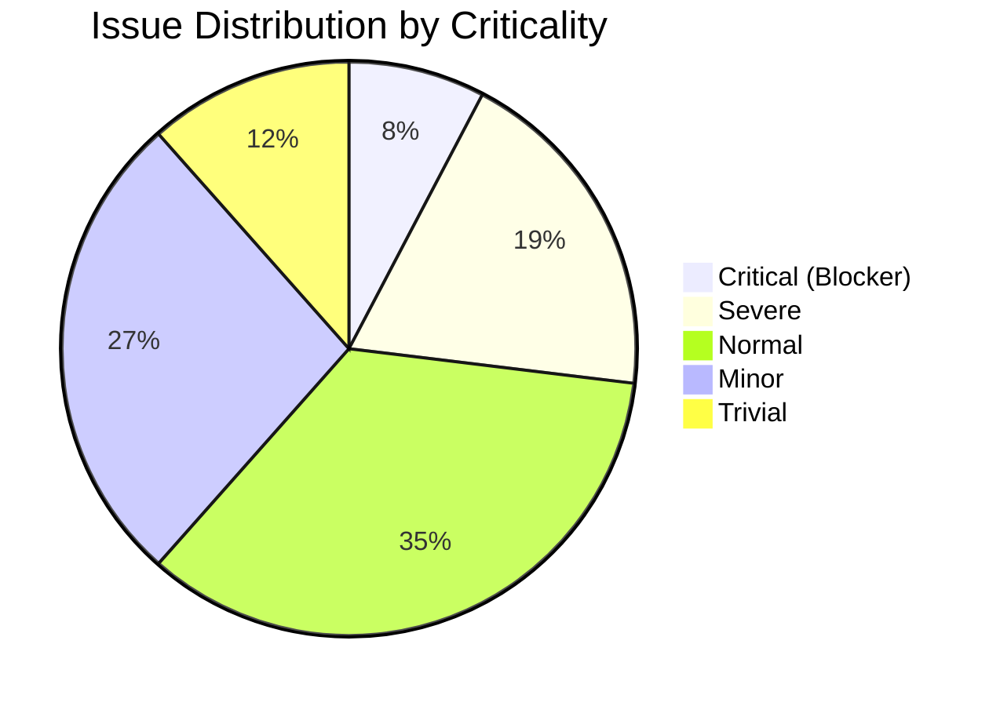
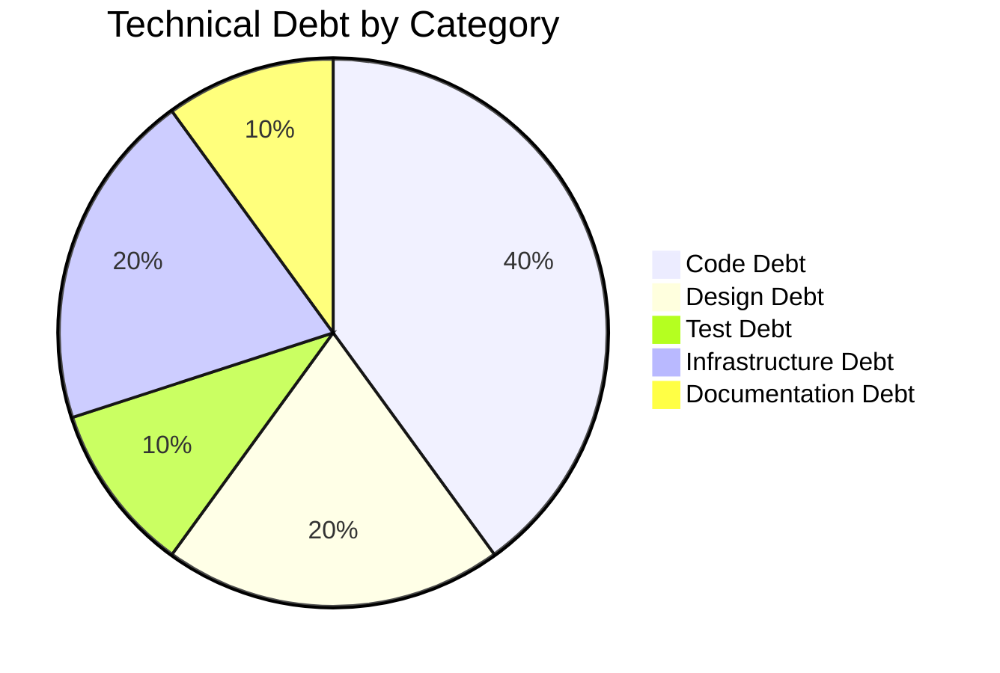

# Code Assessment Report — ALLEGRO Modernization PoC

> **Repository:** `websocket_swing` (Allegro PoC)  
> **Assessment Date:** 2025-01-30  
> **Agent:** code-assessment-agent  
> **Files Reviewed:** 13 source files + 4 config/build files = **17 total**  
> **Stack:** Java 22 (Swing + WebSocket) · Node.js WebSocket Relay · Vue.js 2
> **Canonical Output Path:** `.geninsights/docs/code-assessment.md` *(saved to root — parent directory does not exist)*

---

## Executive Summary

**Overall Health Score: 32 / 100**

This is an **early-stage PoC** demonstrating the ALLEGRO modernization concept for German social insurance claim processing. The score reflects that the codebase is **not production-ready** — it contains critical bugs, security gaps, zero test coverage, hardcoded infrastructure, and significant architectural gaps between the two Java implementations. However, the architectural direction of the MVP refactoring (Model-View-Presenter, EventEmitter pub/sub, separation of concerns) is sound and provides a good foundation to build on.

| Metric | Value |
|--------|-------|
| Files Reviewed | 17 |
| Total Issues Found | 26 |
| Critical Issues (Blocker) | 2 |
| Severe Issues | 5 |
| Normal Issues | 9 |
| Minor Issues | 7 |
| Trivial Issues | 3 |
| Technical Debt Items | 10 |
| Enhancement Suggestions | 8 |
| Avg. Code Complexity | 3.8 / 10 |
| Avg. Logic Complexity | 2.8 / 10 |

---

## Health Score Breakdown



**Score Calculation:**

| Deduction Type | Count | Per Item | Total |
|----------------|-------|----------|-------|
| Critical issues (×10) | 2 | -10 | -20 |
| Severe issues (×5) | 5 | -5 | -25 |
| Normal issues (×2) | 9 | -2 | -18 |
| Minor issues (×1) | 7 | -1 | -7 |
| High complexity file >7 (×3) | 1 | -3 | -3 |
| **Total Deductions** | | | **-73** |
| **Final Score** | | | **32 / 100** |

---

## Files by Complexity

| File | Code Complexity | Logic Complexity | Issues | Debt Items |
|------|:-:|:-:|:-:|:-:|
| `swing/src/main/java/websocket/Main.java` | **8** | 5 | 8 | 4 |
| `node-vue-client/src/components/Search.vue` | 5 | **6** | 7 | 3 |
| `swing/src/main/java/com/poc/presentation/PocPresenter.java` | 5 | 4 | 3 | 2 |
| `swing/src/main/java/com/poc/presentation/PocView.java` | 5 | 1 | 2 | 0 |
| `swing/src/main/java/com/poc/model/PocModel.java` | 4 | 4 | 2 | 1 |
| `node-server/src/WebsocketServer.js` | 3 | 3 | 4 | 3 |
| `swing/src/main/java/com/poc/model/HttpBinService.java` | 3 | 2 | 2 | 1 |
| `swing/src/main/java/com/poc/model/EventEmitter.java` | 2 | 2 | 0 | 1 |
| `pom.xml` | 1 | 1 | 2 | 1 |
| `swing/src/main/java/com/poc/ValueModel.java` | 1 | 1 | 0 | 0 |
| `swing/src/main/java/com/poc/model/ModelProperties.java` | 1 | 1 | 0 | 0 |
| `swing/src/main/java/com/poc/model/ViewData.java` | 1 | 1 | 1 | 0 |
| `swing/src/main/java/com/Main.java` | 1 | 1 | 1 | 0 |
| `node-vue-client/src/App.vue` | 1 | 1 | 0 | 0 |
| `node-vue-client/src/main.js` | 1 | 1 | 0 | 0 |
| `node-vue-client/package.json` | 1 | 1 | 1 | 1 |
| `api.yml` | 1 | 1 | 0 | 0 |

---

## Critical Issues — Must Fix Immediately

### ISS-001 · NullPointerException in `PocModel.action()` — Production Crash
- **File:** `swing/src/main/java/com/poc/model/PocModel.java` (Line 39)
- **Type:** `error_handling`
- **Criticality:** 🔴 5 — Blocker
- **Estimated Fix Time:** 1 hour

**Description:**  
`PocModel.action()` iterates over all `ModelProperties` keys and calls `model.get(val).getField().toString()` unconditionally. Every field in the model is initialized to `null` in the constructor (e.g., `new ValueModel<String>(null)`). If the user clicks the "Anordnen" button without filling in all fields, a `NullPointerException` is thrown at `.getField().toString()` on the very first null field, wraps as a `RuntimeException` in the presenter's action listener, and crashes the button handler silently.

**Solution:**  
Add null-safety before calling `.toString()`. Replace the raw `.getField().toString()` call with a null check: `model.get(val).getField() != null ? model.get(val).getField().toString() : ""`. Additionally, consider using `Optional` on `ValueModel.getField()` to make null-safety explicit at the type level. For robustness, also validate required fields before calling `httpBinService.post()` and surface a user-visible error message (dialog or status label) rather than throwing a `RuntimeException` in a Swing listener. The presenter should catch exceptions at its boundary and present meaningful feedback via the view — not propagate RuntimeExceptions that silently disappear into the EDT.

---

### ISS-002 · Blocking Constructor Anti-Pattern in `WebsocketClientEndpoint`
- **File:** `swing/src/main/java/websocket/Main.java` (Line 249)
- **Type:** `maintainability`
- **Criticality:** 🔴 5 — Blocker
- **Estimated Fix Time:** 2 hours

**Description:**  
The `WebsocketClientEndpoint` constructor calls `latch.await()` directly, blocking the calling thread indefinitely until the WebSocket session closes. Constructors should initialize an object — never block. This means the object is not fully constructed while blocking, making it impossible to reference, test, or cancel externally. Furthermore, `main()` sets up the latch at line 53 but never calls `latch.await()` itself — the constructor blocks first, making the intent completely unclear. This anti-pattern makes reconnection, timeout, or graceful shutdown impossible without killing the JVM.

**Solution:**  
Move `latch.await()` out of the constructor and back into `main()` — or into a `connect()` method with a configurable timeout (`latch.await(30, TimeUnit.SECONDS)`). The constructor should only call `connectToServer()` and return immediately. For production, replace the latch mechanism entirely with a dedicated lifecycle manager or `CompletableFuture` that handles reconnection logic independently of the main thread.

---

## Severe Issues — Fix Soon

### ISS-003 · No WebSocket Authentication — Any Client Can Connect and Broadcast
- **File:** `node-server/src/WebsocketServer.js` (Line 32)
- **Type:** `security`
- **Criticality:** 🟠 4 — Severe
- **Estimated Fix Time:** 4 hours

**Description:**  
The Node.js relay server calls `request.accept(null, request.origin)` — passing `null` as the subprotocol and blindly reflecting the origin — accepting every inbound WebSocket connection with zero validation. There is no authentication token, no IP allowlist, no origin check (the comment even says "later we maybe allow cross-origin requests"), and no rate limiting. Any process on the local network (or beyond, if the port is exposed) can connect and broadcast arbitrary JSON payloads to all Swing clients, potentially populating claim fields with fraudulent data. Given the sensitive domain (German social insurance — IBAN, personal data, RV-Nummer), this is a significant security risk even in a PoC context.

**Solution:**  
At minimum, validate `request.origin` against a strict allowlist before accepting the connection. Implement token-based authentication: require clients to send a pre-shared or JWT token in the WebSocket subprotocol header or as a first-message handshake. On the Node.js server, verify the token before adding the connection to the `clients` array. For a PoC, even a simple environment-variable-driven shared secret would significantly reduce the attack surface. Additionally, bind the HTTP server to `127.0.0.1` so the port is not exposed beyond localhost.

---

### ISS-004 · Hardcoded Endpoints Across All Three Layers
- **Files:** `websocket/Main.java:55`, `Search.vue:132`, `HttpBinService.java:11`, `api.yml:9`
- **Type:** `maintainability`
- **Criticality:** 🟠 4 — Severe
- **Estimated Fix Time:** 3 hours

**Description:**  
Infrastructure endpoints are hardcoded as string literals in three separate files: `"ws://localhost:1337/"` in both the legacy Java client and the Vue component; `"http://localhost:8080"` in `HttpBinService`; and `"http://localhost:8080"` in `api.yml`. There is no configuration layer, no environment variable support, and no externalized properties file. Every environment change (dev → staging → production) requires source code modifications, recompilation, and redeployment.

**Solution:**  
For Java, read the WebSocket URI and HTTP base URL from a `config.properties` file on the classpath or accept them as JVM system properties (`-Dwebsocket.url=ws://...`). For the Vue layer, use a `.env` file with `process.env.VUE_APP_WS_URL` (Vue CLI supports `.env` natively). Update `HttpBinService` to accept its URL as a constructor parameter for easy testing. Store all environment-specific values in a single configuration point — never scattered as string literals across source files.

---

### ISS-005 · Stale Index Closure Bug in Node.js Disconnect Handler
- **File:** `node-server/src/WebsocketServer.js` (Line 62–66)
- **Type:** `business_logic`
- **Criticality:** 🟠 4 — Severe
- **Estimated Fix Time:** 1 hour

**Description:**  
The disconnect handler captures `index` via closure at connection time: `var index = clients.push(connection) - 1`. When `clients.splice(index, 1)` is called on disconnect, this index is correct only if no earlier-connected clients have disconnected first. Once any client with a lower index disconnects and is spliced out, all subsequent clients shift down by one position — but their captured `index` values remain stale. The result is that disconnecting a non-last client removes the **wrong** client from the array, leaving a dead connection object in `clients` and eventually causing `sendUTF()` errors when broadcasting.

**Solution:**  
Replace the index-based removal with identity-based removal: `clients = clients.filter(c => c !== connection)`. This always finds and removes the correct connection regardless of prior splices. Also use `const`/`let` instead of `var`, and consider using a `Map` keyed by a unique connection ID. This is a latent production bug that will manifest reliably under moderate concurrent load.

---

### ISS-006 · `textArea` Component Added to Panel Twice (Duplicate Widget Add)
- **Files:** `swing/src/main/java/websocket/Main.java` (Lines 221–222), `PocView.java` (Lines 188–189)
- **Type:** `maintainability`
- **Criticality:** 🟠 4 — Severe
- **Estimated Fix Time:** 0.5 hours

**Description:**  
In both `Main.java` (lines 221–222) and `PocView.java` (lines 188–189), `textArea` is added to `panel` twice in succession — once without constraints (`panel.add(textArea)`) and once with GridBag constraints (`panel.add(textArea, c)`). In Swing, a component can only have one parent; the second `add()` call silently removes it from its previous position. The first `panel.add(textArea)` without constraints is therefore a silent no-op at best and can produce unpredictable layout behavior depending on the layout manager state at the time of the first call. The bug was copied verbatim from legacy code into the MVP view, indicating it was not reviewed during the refactoring.

**Solution:**  
Remove the unconstrained `panel.add(textArea)` call (the line immediately before `panel.add(textArea, c)`) in both files. Only the constrained version with `GridBagConstraints` should remain. After removal, verify the text area renders at the correct size and position in the `gridy=4` row.

---

### ISS-007 · `PocModel.model` Field is `public` — Encapsulation Broken
- **File:** `swing/src/main/java/com/poc/model/PocModel.java` (Line 12)
- **Type:** `maintainability`
- **Criticality:** 🟠 4 — Severe
- **Estimated Fix Time:** 1 hour

**Description:**  
`public Map<ModelProperties, ValueModel<?>> model = new EnumMap<>(ModelProperties.class)` exposes the entire internal state map directly. `PocPresenter` accesses it via the double-dereference `PocPresenter.this.model.model.get(prop)` — a code smell that clearly indicates the field should not be public. Any class with a reference to `PocModel` can freely mutate the map (add/remove keys, replace values), bypassing any future validation logic. The map also uses raw wildcard types `ValueModel<?>`, requiring unchecked casts throughout the presenter.

**Solution:**  
Make `model` private and provide typed accessor methods: `public ValueModel<String> getStringField(ModelProperties prop)` and `public ValueModel<Boolean> getBooleanField(ModelProperties prop)`. This eliminates unchecked cast boilerplate in `PocPresenter`, makes intent explicit, and allows future validation or change-notification hooks to be added inside `PocModel` without modifying callers.

---

## Normal Issues — Should Fix

### ISS-008 · Search Logic Operator Precedence Risk in `searchPerson()`
- **File:** `node-vue-client/src/components/Search.vue` (Lines 147–153)
- **Type:** `business_logic`
- **Criticality:** 🟡 3 — Normal
- **Estimated Fix Time:** 1 hour

The `searchPerson()` method uses `&&` and `||` chains without explicit parentheses across 6 criteria. JavaScript evaluates `&&` before `||`, so the intent is partially met — but the lack of grouping makes the logic fragile, hard to audit, and easily broken when adding new criteria. The `indexOf()` calls should also be replaced with `includes()`.

**Solution:** Wrap each criterion in explicit parentheses: `(field && element.field.toLowerCase().includes(value.toLowerCase()))`. Extract a `matchesField(searchValue, dataValue)` helper. Add a guard to return empty results when no criteria are entered (currently returns all records when all form fields are empty).

---

### ISS-009 · `messages` Array Declared but Never Used
- **File:** `node-server/src/WebsocketServer.js` (Line 6)
- **Type:** `maintainability`
- **Criticality:** 🟡 3 — Normal
- **Estimated Fix Time:** 0.25 hours

`var messages = []` is declared globally but never read or written anywhere. It is dead code representing an unimplemented feature. **Solution:** Remove it entirely, or replace with a TODO comment documenting the planned feature (message history persistence).

---

### ISS-010 · `ViewData.java` is an Empty Dead Class
- **File:** `swing/src/main/java/com/poc/model/ViewData.java`
- **Type:** `maintainability`
- **Criticality:** 🟡 3 — Normal
- **Estimated Fix Time:** 0.25 hours

The file contains only a package declaration and an empty class body. It is never referenced anywhere. It misleads maintainers into thinking a data-transfer layer exists between view and model. **Solution:** Delete immediately, or implement as a Java record: `public record ViewData(String firstName, String lastName, ...)` to serve as a type-safe view-to-model data transfer object.

---

### ISS-011 · No Error Handling on WebSocket Message Parsing
- **File:** `swing/src/main/java/websocket/Main.java` (Line 286)
- **Type:** `error_handling`
- **Criticality:** 🟡 3 — Normal
- **Estimated Fix Time:** 1 hour

`onMessage()` calls `extract(json)` and `toSearchResult()` with no try-catch. Malformed JSON will throw `JsonParsingException`. The switch has no `default` branch, silently discarding unknown message types. If `toSearchResult()` returns null fields, `setText(null)` is called on JTextFields which renders as blank but is technically undefined behavior.

**Solution:** Wrap `onMessage()` in broad try-catch (WebSocket callbacks must not throw — uncaught exceptions close the session). Add a `default` case. Initialize all `SearchResult` fields to `""` rather than `null`.

---

### ISS-012 · `zahlungsempfaenger_selected` Type Mismatch (String vs Object)
- **File:** `node-vue-client/src/components/Search.vue` (Line 103)
- **Type:** `business_logic`
- **Criticality:** 🟡 3 — Normal
- **Estimated Fix Time:** 0.5 hours

Initialized as `""` (empty string) but assigned an object `{ iban, bic, valid_from }` on selection. If the user clicks "Nach ALLEGRO übernehmen" without selecting a payment record, the payload contains `zahlungsempfaenger: ""` — a string where the Java receiver expects a JSON object. The Java parser will find no matching keys and leave IBAN/BIC/ValidFrom fields empty silently.

**Solution:** Initialize as `null`. Disable the send button until both a person and payment are selected: `:disabled="!zahlungsempfaenger_selected || !selected_result.knr"`. Add guard check with user-visible alert before send.

---

### ISS-013 · `toSearchResult()` — 90-Line Boolean-Flag JSON Parser
- **File:** `swing/src/main/java/websocket/Main.java` (Lines 355–443)
- **Type:** `readability`
- **Criticality:** 🟡 3 — Normal
- **Estimated Fix Time:** 2 hours

Ten boolean "flag" variables (`name`, `first`, `dob`, ... `ze_Valid_from`) track which key was last seen in the stream, requiring 20 `if` blocks for 10 fields. The pattern is fragile for nested JSON, error-prone when adding fields, and contains a naming inconsistency (`ze_Valid_from` with capital V vs all other lowercase). This is the most complex method in the codebase measured by cyclomatic complexity.

**Solution:** Replace with Jackson `ObjectMapper`: `mapper.treeToValue(root.path("content"), SearchResult.class)`. Annotate `SearchResult` with `@JsonIgnoreProperties(ignoreUnknown = true)`. Reduces 90 lines to ~5 and handles missing fields gracefully via `@JsonProperty` defaults.

---

### ISS-014 · Debug `System.out.println` Statements Left in Presenter
- **File:** `swing/src/main/java/com/poc/presentation/PocPresenter.java` (Lines 62, 74, 93)
- **Type:** `maintainability`
- **Criticality:** 🟡 3 — Normal
- **Estimated Fix Time:** 0.5 hours

`"I am in insert update. "`, `"I am in remove update. "`, and `System.out.println(source.isSelected())` fire on every keystroke and radio button change, flooding stdout during normal operation. Similar debug output exists in `PocModel`, `HttpBinService`, and the legacy `Main.java`.

**Solution:** Remove all debug printlns or replace with SLF4J + Logback at `LOG.debug(...)` level. This allows suppression in production without code changes.

---

### ISS-015 · No Error Handling in Node.js Broadcast Loop
- **File:** `node-server/src/WebsocketServer.js` (Lines 55–57)
- **Type:** `error_handling`
- **Criticality:** 🟡 3 — Normal
- **Estimated Fix Time:** 1 hour

`clients[i].sendUTF(json)` is called with no error handling in a bare loop. If any client is in a broken/closing state, `sendUTF()` throws and can prevent all remaining clients from receiving the message or, in some configurations, crash the Node.js process.

**Solution:** Wrap each send in try-catch: `try { clients[i].sendUTF(json); } catch (err) { console.error('Client send failed:', err.message); clients.splice(i--, 1); }`. Or check `clients[i].connected` before sending.

---

### ISS-016 · MVP Architecture Missing WebSocket Connectivity — Core Feature Absent
- **File:** `swing/src/main/java/com/poc/presentation/PocPresenter.java`
- **Type:** `business_logic`
- **Criticality:** 🟡 3 — Normal
- **Estimated Fix Time:** 4 hours

The refactored MVP (`com/poc/`) has no WebSocket client. The legacy `websocket/Main.java` implements WebSocket reception and field population, but the MVP only implements the `action()` → HTTP POST flow. The MVP is **not functionally equivalent** to the legacy code — it loses the entire PoC's core feature: receiving person/payment data broadcast from the Vue client via the Node relay.

**Solution:** Add a `WebSocketService` class to `com.poc.model` that wraps the Tyrus WebSocket client endpoint. Inject it into `PocModel` via constructor. When a message arrives, the model updates the appropriate `ValueModel` fields and emits a change notification that the presenter handles to refresh the view.

---

### ISS-017 · Scanner Resource Not Closed in `HttpBinService.post()`
- **File:** `swing/src/main/java/com/poc/model/HttpBinService.java` (Line 29)
- **Type:** `error_handling`
- **Criticality:** 🟡 3 — Normal
- **Estimated Fix Time:** 0.5 hours

`new Scanner(connection.getInputStream())` is created but never closed. The Scanner and underlying InputStream are held open until GC finalizes the object, constituting a resource leak.

**Solution:** Use try-with-resources: `try (var scanner = new Scanner(connection.getInputStream()).useDelimiter("\\A")) { return scanner.hasNext() ? scanner.next() : ""; }`. Better yet, replace `HttpURLConnection` with Java 11+ `java.net.http.HttpClient` which provides proper resource management and a modern API.

---

## Minor Issues

### ISS-018 · Swing Components Updated Off EDT — Threading Violation
- **File:** `swing/src/main/java/websocket/Main.java` (Lines 290–303)
- **Type:** `maintainability`
- **Criticality:** 🔵 2 — Minor

`onMessage()` calls `textArea.setText(...)` and `tf_name.setText(...)` directly from the Tyrus I/O thread, not the Swing Event Dispatch Thread. All Swing component mutations must go through `SwingUtilities.invokeLater(() -> tf_name.setText(...))` to be thread-safe.

---

### ISS-019 · Tyrus Version Mismatch in `pom.xml`
- **File:** `pom.xml` (Line 29)
- **Type:** `maintainability`
- **Criticality:** 🔵 2 — Minor

`tyrus-websocket-core:1.2.1` (2013) is declared alongside `tyrus-standalone-client:1.15` (2018) and `tyrus-spi:1.15`. The standalone bundle already includes all Tyrus components — the ancient core artifact is redundant and risks classpath conflicts. `websocket-api:0.2` is also a very early pre-standard artifact.

---

### ISS-020 · `onmessage` Handler Commented Out in `Search.vue`
- **File:** `node-vue-client/src/components/Search.vue` (Line 135)
- **Type:** `maintainability`
- **Criticality:** 🔵 2 — Minor

`//this.socket.onmessage = ({data}) => {};` is commented out, making the Vue client send-only. It cannot receive any responses, status confirmations, or error messages from the relay. This limits future bidirectional communication and leaves a confusing stub in the code.

---

### ISS-021 · Java 22 Target with Legacy `javax.*` Namespace
- **File:** `pom.xml`, all Java WebSocket source files
- **Type:** `maintainability`
- **Criticality:** 🔵 2 — Minor

Targeting Java 22 but using `javax.websocket.*` (pre-Jakarta namespace). Jakarta EE 9+ uses `jakarta.*` exclusively. Tyrus 2.x supports the new namespace and requires migrating all imports — a mechanical but necessary step for long-term Java compatibility.

---

### ISS-022 · `PocPresenter` Accesses View Fields Directly — No View Interface
- **File:** `swing/src/main/java/com/poc/presentation/PocPresenter.java` (Lines 25–36, 99–111)
- **Type:** `maintainability`
- **Criticality:** 🔵 2 — Minor

`PocPresenter` directly accesses concrete `JTextComponent` fields on `PocView` (`view.textArea`, `view.firstName`, etc.). There is no `AllegroView` interface, preventing unit testing the Presenter without instantiating a real Swing UI.

---

### ISS-023 · `var _ = new PocPresenter(...)` — Side-Effect Construction
- **File:** `swing/src/main/java/com/Main.java` (Line 18)
- **Type:** `readability`
- **Criticality:** 🔵 2 — Minor

Using Java 21+ unnamed variable syntax (`_`) for a side-effect-only construction is confusing and relies on an advanced language feature to paper over a design smell. Constructors should not perform all wiring — a dedicated `initialize()` or `wire()` method is clearer.

---

### ISS-024 · Vue 2 End-of-Life Framework
- **File:** `node-vue-client/package.json`
- **Type:** `maintainability`
- **Criticality:** 🔵 2 — Minor

Vue 2.6.10 reached end-of-life December 2023 and no longer receives security patches. `eslint:^5.16.0` and `babel-eslint:^10.0.1` are also severely outdated. Any production path requires migration to Vue 3 + Vite.

---

## Trivial Issues

### ISS-025 · Invalid CSS Property `align: left`
- **File:** `node-vue-client/src/components/Search.vue` (Line 243)
- **Criticality:** ⚪ 1 — Trivial

`align: left` is not valid CSS (correct: `text-align: left`). Browsers silently ignore it.

---

### ISS-026 · Naming Inconsistency: `ze_Valid_from` (Capital V)
- **File:** `swing/src/main/java/websocket/Main.java` (Line 368)
- **Criticality:** ⚪ 1 — Trivial

`ze_Valid_from` uses capital `V` inconsistently with `ze_iban`, `ze_bic` (lowercase). Rename to `ze_valid_from`.

---

### ISS-027 · HTTP Server in Node.js Has Empty Request Handler
- **File:** `node-server/src/WebsocketServer.js` (Lines 10–11)
- **Criticality:** ⚪ 1 — Trivial

`http.createServer(function(request, response) {})` creates an HTTP server that silently drops all HTTP requests with no response. This will cause browser health-check requests to hang. Add a minimal `response.end('WebSocket server')` response.

---

## Technical Debt Overview



### TD-001 · Zero Test Coverage (Test Debt) — Priority 5 — HIGH Impact
**Estimated Fix Time:** 20 hours (initial coverage)

No unit, integration, or UI tests exist anywhere in the repository. The `PocModel` NPE (ISS-001) would have been caught by a basic unit test. The boolean-flag JSON parser (ISS-013) cannot be safely refactored without a regression net. Zero tests is the single highest-impact debt item — every refactoring is a risk.

**Suggested Fix:** Add JUnit 5 + Mockito to `pom.xml`. Write unit tests for: `Main.toSearchResult()` (edge cases); `PocModel.action()` with null/non-null fields; `EventEmitter.emit()` with multiple subscribers; `HttpBinService.post()` with a WireMock server. Add Vue Test Utils + Jest for `Search.vue`: test `searchPerson()` with multiple criteria combinations, test `sendMessage()` output.

---

### TD-002 · Zero Configuration Management (Infrastructure Debt) — Priority 5 — HIGH Impact
**Estimated Fix Time:** 4 hours

Every infrastructure endpoint and port is a hardcoded string literal (see ISS-004). No `application.properties`, no `.env`, no Docker Compose variable injection. The PoC cannot be deployed beyond one developer's laptop without modifying source code.

**Suggested Fix:** `src/main/resources/application.properties` for Java; `.env.local` with `VUE_APP_*` vars for Vue CLI; a `docker-compose.yml` wiring all three components via environment variables.

---

### TD-003 · No Logging Framework — `System.out.println` Throughout (Code Debt) — Priority 4 — HIGH Impact
**Estimated Fix Time:** 3 hours

All diagnostic output uses `System.out.println` (Java) or `console.log` (Node.js). No log level control, no structured format, no timestamps from Java, no way to suppress debug messages in production.

**Suggested Fix:** Add SLF4J + Logback to Maven POM. Replace all printlns with `Logger LOG = LoggerFactory.getLogger(...)`. For Node.js, replace `console.log` with `winston` or `pino`. Purely mechanical change with immediate production diagnostics payoff.

---

### TD-004 · Legacy `websocket/Main.java` Coexists with MVP (Code Debt) — Priority 3 — MEDIUM Impact
**Estimated Fix Time:** 2 hours (after MVP is feature-complete)

The legacy God class coexists with the MVP refactoring, creating ambiguity about which is authoritative. Neither is a complete, correct implementation. The legacy has WebSocket client; the MVP has better architecture.

**Suggested Fix:** After completing MVP WebSocket integration (ISS-016), move `websocket/Main.java` to a `legacy/` archive directory or delete it. Add `MIGRATION.md` documenting the architectural evolution.

---

### TD-005 · No View Interface in MVP Pattern (Design Debt) — Priority 4 — MEDIUM Impact
**Estimated Fix Time:** 3 hours

`PocPresenter` depends on the concrete `PocView` class. No `AllegroView` interface exists, making the Presenter untestable without a Swing display environment.

**Suggested Fix:** Define `interface AllegroView` with typed setter methods for each field. Have `PocView` implement it. `PocPresenter` depends only on `AllegroView`. Write `MockAllegroView` for unit tests.

---

### TD-006 · Legacy `javax.*` WebSocket Namespace on Java 22 (Infrastructure Debt) — Priority 3 — MEDIUM Impact
**Estimated Fix Time:** 4 hours

All WebSocket imports use the pre-Jakarta `javax.*` namespace, which is incompatible with Tyrus 2.x and modern Jakarta EE. Delaying migration increases future upgrade cost.

**Suggested Fix:** Migrate to `tyrus-standalone-client:2.1.x`. Update all `import javax.websocket.*` → `import jakarta.websocket.*` and `import javax.json.*` → `import jakarta.json.*`. Largely mechanical but should be a dedicated PR.

---

### TD-007 · Vue 2 + End-of-Life Dependency Stack (Infrastructure Debt) — Priority 3 — MEDIUM Impact
**Estimated Fix Time:** 8 hours

Vue 2 EOL December 2023. `@vue/cli-service:^4`, `eslint:^5`, `babel-eslint:^10` all severely outdated. No security patches forthcoming.

**Suggested Fix:** Migrate to Vue 3 + Vite. `Search.vue` is simple enough that migration is straightforward — `data()` → `reactive()`, `methods` → functions in `<script setup>`. Update ESLint to v8+ with `eslint-plugin-vue:^9`.

---

### TD-008 · WebSocket Message Protocol Undocumented (Documentation Debt) — Priority 2 — MEDIUM Impact
**Estimated Fix Time:** 2 hours

The JSON envelope protocol (`{ target, content }`) is not documented anywhere outside the code. `api.yml` covers the HTTP endpoint but not WebSocket. New developers must read three files across three technologies to understand the message contract.

**Suggested Fix:** Add `PROTOCOL.md` documenting both message types with example payloads. Alternatively extend `api.yml` with AsyncAPI 2.x channels for WebSocket event documentation.

---

### TD-009 · Mixed German/English Naming (Code Debt) — Priority 2 — LOW Impact
**Estimated Fix Time:** 4 hours

Field names, variable names, and CSS IDs mix German and English with no consistent convention: `tf_ort`, `ze_iban`, `formdata.betriebsbez`, `#search_result_zahlungsempfänger` (with special character). This makes the codebase harder to navigate for non-German-speaking developers.

**Suggested Fix:** Establish a convention: English code names with German UI labels (recommended). `city` in code, `"Ort"` in the UI. Apply consistently across all files. Document in `CONTRIBUTING.md`.

---

### TD-010 · `HttpBinService` Uses Legacy `HttpURLConnection` (Code Debt) — Priority 2 — LOW Impact
**Estimated Fix Time:** 2 hours

`java.net.HttpURLConnection` (Java 1.1 API) is used instead of the modern Java 11+ `java.net.http.HttpClient`. Does not handle non-200 HTTP responses, uses blocking I/O, requires manual stream management (including the unclosed Scanner in ISS-017).

**Suggested Fix:** Replace with `HttpClient.newHttpClient().sendAsync(request, BodyHandlers.ofString())`. Return `CompletableFuture<String>` from `post()` for non-blocking execution on the Swing EDT.

---

## Recommended Enhancements

### ENH-001 · Replace Streaming JSON Parser with Jackson Object Mapping
- **Category:** Refactoring — **Priority:** 5

Replace the 90-line boolean-flag `toSearchResult()` method with Jackson `ObjectMapper`. Add `jackson-databind:2.17.0` to `pom.xml`. Annotate `SearchResult` with `@JsonIgnoreProperties(ignoreUnknown = true)`. Reduces parsing code from 90 lines to 3 lines, handles missing fields gracefully, is trivially testable, and supports nested objects without custom logic.

```java
private static final ObjectMapper MAPPER = new ObjectMapper();

public static SearchResult toSearchResult(String json) {
    try {
        return MAPPER.treeToValue(MAPPER.readTree(json).path("content"), SearchResult.class);
    } catch (JsonProcessingException e) {
        LOG.error("Failed to parse SearchResult", e);
        return new SearchResult(); // safe empty default
    }
}
```

---

### ENH-002 · Implement WebSocket Token Authentication
- **Category:** Module Standardization — **Priority:** 5

Add shared-secret token validation to the Node.js WebSocket handshake. Send token as WebSocket subprotocol header from both Java and Vue clients. Configurable via `WS_AUTH_TOKEN` environment variable.

```js
// node-server
const ALLOWED_TOKEN = process.env.WS_AUTH_TOKEN || 'allegro-dev-token';
wsServer.on('request', function(request) {
    if (request.requestedProtocols[0] !== ALLOWED_TOKEN) {
        request.reject(401, 'Unauthorized');
        return;
    }
    var connection = request.accept(ALLOWED_TOKEN, request.origin);
    // ...
});
```

---

### ENH-003 · Define `AllegroView` Interface for MVP Testability
- **Category:** Refactoring — **Priority:** 4

Extract `interface AllegroView` with typed setter methods. Have `PocView` implement it. Write `MockAllegroView` for tests. Update `PocPresenter` to depend only on the interface.

```java
public interface AllegroView {
    void setFirstName(String value);
    void setLastName(String value);
    void setIban(String value);
    void setBic(String value);
    void setValidFrom(String value);
    void setTextArea(String value);
    void setGender(Gender gender);
    void addActionListener(Runnable onAction);
}
```

---

### ENH-004 · Add WebSocket Reconnection Logic to Both Clients
- **Category:** Module Standardization — **Priority:** 4

Neither client handles disconnection. If the relay server restarts, all clients lose their connections with no recovery.

```js
// Vue Search.vue
this.socket.onclose = () => {
    this.status = "disconnected";
    setTimeout(() => this.connect(), 3000); // retry after 3s
};
this.socket.onerror = (err) => {
    console.error("WebSocket error:", err);
    this.socket.close(); // triggers onclose → retry
};
```

---

### ENH-005 · Add SLF4J + Logback Structured Logging
- **Category:** Code Standardization — **Priority:** 4

Replace all `System.out.println` with SLF4J at appropriate log levels. Add `slf4j-api:2.0.9` and `logback-classic:1.4.14` to `pom.xml`. Enables runtime log-level control, structured output, and production log aggregation without code changes.

---

### ENH-006 · Externalize All Configuration
- **Category:** Project Configuration — **Priority:** 4

`src/main/resources/application.properties` for Java; `.env.local` for Vue. Inject values at startup — never in source code.

```properties
# application.properties
websocket.url=ws://localhost:1337/
http.base.url=http://localhost:8080
```
```
# .env.local (Vue)
VUE_APP_WS_URL=ws://localhost:1337/
```

---

### ENH-007 · Replace Mock Data with API-Driven Person Search
- **Category:** Module Standardization — **Priority:** 3

The 5-person `search_space` array is hardcoded in `Search.vue` with real-format German IBANs and BIC codes. Extract to a `personService.js` module that can be backed by a real or mock API, keeping the UI component data-source agnostic.

---

### ENH-008 · Add Input Validation (IBAN, BIC, PLZ, Geburtsdatum)
- **Category:** Module Standardization — **Priority:** 3

No validation exists in any layer. IBAN format (DE + 20 digits), BIC (8–11 alpha-numeric), German PLZ (5 digits), and ISO date format should be validated before transmission. Critical for a social insurance domain where data quality errors cause real downstream processing failures.

---

## Architectural Assessment

### What Works Well ✅

| Strength | Detail |
|----------|--------|
| **MVP Pattern Direction** | The split of `PocView` (UI), `PocPresenter` (binding + wiring), and `PocModel` (state + actions) is architecturally sound |
| **EventEmitter / Observer Pattern** | Clean, simple pub/sub implementation decoupling model from presenter |
| **`ModelProperties` Enum** | Type-safe key for model map — makes refactoring safe and documents all fields in one place |
| **`ValueModel<T>` Generic Wrapper** | Reasonable pattern for two-way binding; extensible to support change notifications |
| **OpenAPI Spec** | `api.yml` documents the HTTP contract |
| **Node.js Relay Architecture** | Stateless broadcast relay cleanly decouples web client from desktop client |

### What Needs Work ❌

| Gap | Impact |
|-----|--------|
| **MVP missing WebSocket** | Core PoC feature broken in the "improved" version |
| **Zero tests** | No refactoring can be safely verified; every change is a risk |
| **No security at all** | Sensitive IBAN/personal data broadcast on an unauthenticated channel |
| **Legacy code not retired** | Creates ambiguity about which implementation is authoritative |
| **All infrastructure hardwired** | PoC cannot be demonstrated beyond one laptop |

---

## Action Plan

### 🚨 Immediate — Before Any Further Development (Days 1–3)
- [ ] **ISS-001** Fix NPE in `PocModel.action()` — null check before `.toString()`
- [ ] **ISS-002** Remove blocking call from `WebsocketClientEndpoint` constructor
- [ ] **ISS-006** Remove duplicate `panel.add(textArea)` in `Main.java` and `PocView.java`
- [ ] **ISS-016** Add WebSocket client to MVP (`WebSocketService` in `com.poc.model`)
- [ ] **TD-001** Add JUnit 5 + minimum smoke tests for `toSearchResult()` and `PocModel.action()`

### 🟠 Short Term — PoC Stabilization (Week 1–2)
- [ ] **ISS-003** Add origin + token auth to Node.js WebSocket server
- [ ] **ISS-005** Fix stale index closure bug in Node.js disconnect handler
- [ ] **ISS-004** Externalize all hardcoded URLs to configuration
- [ ] **ISS-007** Make `PocModel.model` private with typed accessors
- [ ] **ISS-012** Fix `zahlungsempfaenger_selected` type mismatch; add send guards
- [ ] **ISS-014** Remove all debug `System.out.println` statements
- [ ] **TD-003** Add SLF4J + Logback to Maven POM
- [ ] **TD-008** Add `PROTOCOL.md` documenting WebSocket message envelope

### 🟡 Medium Term — Architecture Hardening (Weeks 3–4)
- [ ] **ENH-001** Replace streaming JSON parser with Jackson `ObjectMapper`
- [ ] **ENH-003** Extract `AllegroView` interface; write `MockAllegroView` for tests
- [ ] **TD-004** Archive or delete `websocket/Main.java` once MVP is feature-complete
- [ ] **ISS-008** Fix operator precedence in `searchPerson()`; extract helper method
- [ ] **ISS-017** Fix Scanner resource leak with try-with-resources
- [ ] **ENH-004** Add WebSocket reconnection logic to both clients
- [ ] **ISS-018** Wrap all Swing updates in `SwingUtilities.invokeLater()`

### 🔵 Long Term — Production Readiness (Next Quarter)
- [ ] **TD-006** Migrate `javax.*` → `jakarta.*` namespace (Tyrus 2.x)
- [ ] **TD-007** Migrate Vue 2 → Vue 3 + Vite
- [ ] **ENH-007** Replace hardcoded mock data with API-driven person search
- [ ] **ENH-008** Add IBAN, BIC, PLZ, and date format validation
- [ ] **ISS-019** Resolve `pom.xml` Tyrus version conflicts
- [ ] **TD-009** Standardize on English code names with German UI labels + i18n

---

## Summary

The ALLEGRO modernization PoC demonstrates a clear architectural vision — moving from a monolithic Java Swing God class to a structured MVP implementation — but the execution leaves significant gaps that must be addressed before this architecture can serve as a trusted reference implementation.

The two most urgent concerns are the **NullPointerException in `PocModel.action()`** (which crashes on every button click with any unfilled field) and the **complete absence of WebSocket connectivity in the MVP** (the intended PoC flow — web client → relay → desktop — is broken in the "improved" version). These must be fixed before any stakeholder demonstration.

The architecture has genuine strengths: the `EventEmitter` pub/sub pattern, `ModelProperties` enum, `ValueModel<T>` wrapper, and the MVP layer separation are all solid building blocks. With the critical bugs resolved, a proper test suite added, the security gaps closed, and configuration externalized, this PoC would serve as a credible foundation for the full ALLEGRO modernization program.

---

*Assessment generated by code-assessment-agent · 2025-01-30*  
*Skills applied: discover-files, geninsights-logging, json-output-schemas*  
*Canonical path: `.geninsights/docs/code-assessment.md` — saved to repo root as fallback (parent directory does not exist)*
