# Allegro Modernization PoC — Architecture Documentation

> **Arc42 Architecture Documentation**  
> **Version:** 1.0  
> **Date:** 2025-01-30  
> **Status:** Generated from source code analysis  
> **Project:** websocket_swing / Allegro Modernization Proof-of-Concept

---

## Table of Contents

1. [Introduction and Goals](#1-introduction-and-goals)
2. [Constraints](#2-constraints)
3. [Context and Scope](#3-context-and-scope)
4. [Solution Strategy](#4-solution-strategy)
5. [Building Block View](#5-building-block-view)
6. [Runtime View](#6-runtime-view)
7. [Deployment View](#7-deployment-view)
8. [Crosscutting Concepts](#8-crosscutting-concepts)
9. [Architecture Decisions](#9-architecture-decisions)
10. [Quality Requirements](#10-quality-requirements)
11. [Risks and Technical Debt](#11-risks-and-technical-debt)
12. [Glossary](#12-glossary)

---

## 1. Introduction and Goals

### 1.1 Purpose and Background

This system is a **Proof-of-Concept (PoC)** for the modernization of a legacy CRM/insurance back-office application called **Allegro**. The project demonstrates how a Java Swing desktop application — traditionally used by agents to look up customer records and initiate business transactions — can be progressively modernized by introducing a modern web-based search front-end, while keeping the existing Swing client as the target data-entry surface.

The key innovation is the use of a **WebSocket message bus** as a decoupling layer. The new Vue.js browser client performs customer searches and, when an agent selects a record, broadcasts the data via WebSocket to any connected Swing client. This allows the legacy Swing UI to be pre-populated from a modern search interface without requiring full re-implementation of the desktop client.

The project also contains a second, refactored variant of the Swing client (`com.poc.*`) that uses a clean MVP (Model-View-Presenter) architecture and integrates with an **HTTPBin** mock backend via a REST API, demonstrating clean architecture patterns for the Swing layer.

### 1.2 Key Capabilities

| # | Capability | Description |
|---|------------|-------------|
| 1 | Customer Search | Search for persons/customers by name, first name, postal code, city, or street |
| 2 | Payment Recipient Selection | View and select IBAN/BIC Zahlungsempfänger (payment recipients) associated with a customer |
| 3 | Cross-Client Data Transfer | Transfer selected customer data from Vue.js browser client to Allegro Swing client via WebSocket |
| 4 | Real-Time Messaging | Broadcast messages (customer records, free-text) to all connected clients over WebSocket |
| 5 | REST API Integration | Submit structured customer/transaction form data to a backend REST endpoint |
| 6 | Legacy UI Population | Auto-populate Swing form fields (name, DOB, address, IBAN, BIC, gender) from incoming WebSocket messages |

### 1.3 Quality Goals

| Priority | Quality Goal | Motivation |
|----------|--------------|------------|
| 1 | **Interoperability** | Swing and Vue.js clients must exchange data seamlessly over WebSocket |
| 2 | **Maintainability** | The Swing MVP refactoring (`com.poc.*`) must be structured for long-term evolution |
| 3 | **Simplicity** | As a PoC, the system avoids over-engineering; the architecture must be easy to understand |
| 4 | **Extensibility** | New clients (browser or desktop) should be connectable to the same WebSocket hub |
| 5 | **Correctness** | Customer data (names, addresses, IBAN, BIC) must be faithfully transmitted without corruption |

### 1.4 Stakeholders

| Role | Description | Primary Expectations |
|------|-------------|----------------------|
| **Allegro Back-Office Agent** | Day-to-day user of the Swing desktop UI | Correct auto-population of form fields; no disruption to existing workflow |
| **Web User / Modern Agent** | Uses the Vue.js browser UI | Fast customer search, intuitive results table, one-click data transfer |
| **Java Developer** | Maintains and extends the Swing client and MVP refactoring | Clean code structure, clear MVP separation, documented patterns |
| **Frontend Developer** | Maintains the Vue.js client | Clear component structure, documented WebSocket protocol |
| **Solution Architect** | Evaluates modernization approaches | Evidence that progressive modernization via WebSocket bridge is viable |
| **Operations** | Deploys and monitors the system | Minimal infrastructure (Node.js server + Docker), easy startup |

---

## 2. Constraints

### 2.1 Technical Constraints

| Constraint | Description |
|------------|-------------|
| **Java Version** | Java SDK ≥ 22.0.1 required (uses `_` as unnamed variable, Java 22 language features) |
| **WebSocket Library (Java)** | GlassFish Tyrus Standalone Client 1.15 (`tyrus-standalone-client`) for JSR-356 WebSocket |
| **WebSocket Library (Node.js)** | `websocket` npm package v1.0.35 |
| **Frontend Framework** | Vue.js 2.x (`^2.6.10`); not Vue 3 |
| **Build Tool (Java)** | Apache Maven; compiler plugin targets Java 22 source/target |
| **Build Tool (Frontend)** | Vue CLI Service (`@vue/cli-service ^4.0.0`); package managed by npm/yarn |
| **JSON Processing (Java)** | `javax.json-api` 1.1.4 / GlassFish `javax.json` 1.0.4 (streaming parser) |
| **Mock Backend** | HTTPBin Docker image (`kennethreitz/httpbin`) running on port 8080; no real database |
| **IDE** | IntelliJ IDEA recommended; Eclipse launch config (`WebsocketSwingClient.launch`) also present |
| **Operating System** | Development on Windows (paths in doc files reference Windows paths); deployable on any OS with JDK 22+ and Node.js |

### 2.2 Organizational / PoC Constraints

| Constraint | Description |
|------------|-------------|
| **Scope** | This is a Proof-of-Concept; production hardening (auth, persistence, error recovery) is explicitly out of scope |
| **No Persistent Storage** | Customer data is hardcoded in-memory in the Vue.js `Search.vue` component (`search_space` array); no database |
| **No Authentication** | The WebSocket server accepts all connections regardless of origin; CORS is commented out |
| **Single-Node Deployment** | All components run on localhost; no clustering or load-balancing |
| **No Automated Tests** | No unit or integration test files are present in any module |

### 2.3 Conventions

| Convention | Description |
|------------|-------------|
| **Language (UI labels)** | German throughout — field labels use German terms (Vorname, Name, Geburtsdatum, PLZ, Ort, Strasse, etc.) |
| **Data Exchange Format** | JSON over WebSocket; message envelope uses `{ target, content }` structure |
| **API Field Names** | Uppercase snake_case for API schema fields (`FIRST_NAME`, `LAST_NAME`, `DATE_OF_BIRTH`, etc.) |
| **Java Naming** | Standard Java conventions; enum `ModelProperties` mirrors API field names |
| **Vue Component Style** | Single-File Components (`.vue`) with `<template>`, `<script>`, `<style scoped>` sections |

---

## 3. Context and Scope

### 3.1 Business Context

The system sits at the intersection of a **legacy Allegro CRM desktop application** and a new **web-based modernization layer**. The WebSocket message bus acts as the integration backbone.

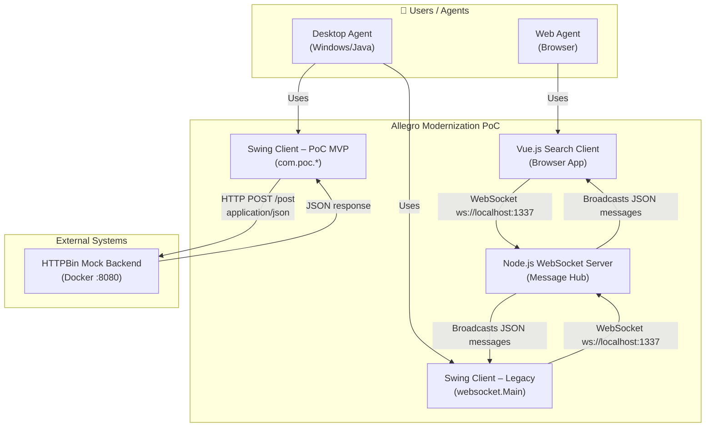

**External Interfaces:**

| Partner / System | Protocol | Direction | Description |
|------------------|----------|-----------|-------------|
| **Browser (Vue.js)** | WebSocket (ws://) | Bidirectional | Customer search results, data transfer to Allegro |
| **Swing Legacy Client** | WebSocket (ws://) | Bidirectional | Receives populated form data from Vue client |
| **HTTPBin Mock Backend** | HTTP/REST (POST) | Outbound | Receives form submission payload; returns echo response |
| **Web Agent (human)** | HTTP/HTTPS (browser) | Inbound | Accesses Vue.js SPA served by Vue CLI Dev Server |

### 3.2 Technical Context

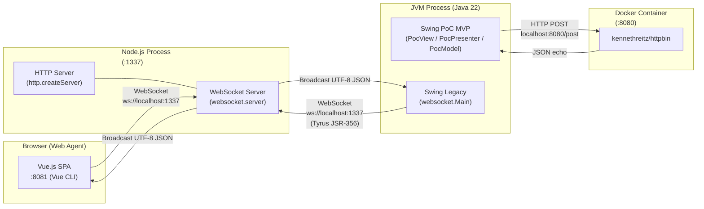

---

## 4. Solution Strategy

### 4.1 Modernization Strategy: Progressive WebSocket Bridge

The core strategic decision is to use a **WebSocket message bus** as a non-invasive bridge between the new web UI and the legacy Swing client. This avoids a big-bang rewrite by:

1. Keeping the Swing client for data entry and business action execution.
2. Building a new web frontend only for the search/lookup functionality.
3. Routing data selected in the browser to the Swing form via WebSocket broadcast.

### 4.2 Technology Decisions

| Decision Area | Choice | Rationale |
|---------------|--------|-----------|
| **Message Bus** | Node.js WebSocket Server (`websocket` npm) | Lightweight, fast to prototype, minimal infrastructure; Node.js excels at real-time messaging |
| **Web Frontend** | Vue.js 2 SPA | Component-based, reactive data binding, rapid development for PoC |
| **Desktop Client** | Java Swing (existing) | Retaining legacy investment; Java Swing for "Allegro" desktop application |
| **WebSocket Client (Java)** | GlassFish Tyrus (JSR-356) | Standard Java EE WebSocket API; vendor-neutral, compliant with RFC 6455 |
| **JSON Processing (Java)** | `javax.json` Streaming API | Low-overhead streaming parser; no heavyweight library dependency |
| **Mock Backend** | HTTPBin Docker | Zero-setup REST endpoint for PoC form submission testing |
| **MVP Pattern (Swing PoC)** | Model-View-Presenter | Clean separation of concerns; testable presenter logic; view is passive |
| **Build System** | Maven (Java) + Vue CLI (frontend) | Industry-standard toolchains for respective ecosystems |

### 4.3 Architectural Approach

The system follows a **multi-tier, event-driven hub-and-spoke** architecture:

- **Hub:** Node.js WebSocket server (dumb message broker — all received messages are broadcast to all connected clients).
- **Spokes:** Vue.js browser client and Java Swing desktop client.
- **Independence:** Each spoke is independently deployable and independently initiates its WebSocket connection.
- **Swing PoC Layer:** Refactored using MVP pattern with an `EventEmitter`/`EventListener` observer pattern for decoupling presenter from asynchronous backend responses.

---

## 5. Building Block View

### 5.1 Level 1: System Overview

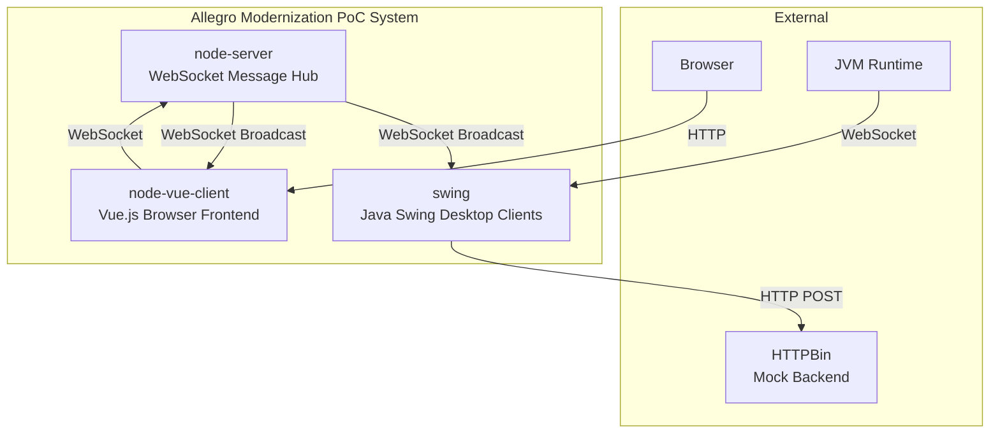

### 5.2 Level 2: Module Decomposition

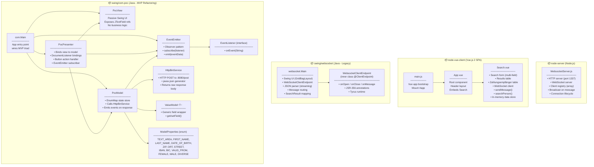

### 5.3 Level 3: Component Detail

#### 5.3.1 WebsocketServer.js (node-server)

**Purpose:** Acts as a dumb message broker / fan-out hub. Every UTF-8 message received from any client is immediately broadcast to **all** connected clients (including the sender).

**Key Responsibilities:**
- Listen on HTTP port 1337 (WebSocket upgrade endpoint)
- Maintain an in-memory list of active WebSocket connections (`clients[]`)
- On `message` event: broadcast raw JSON string to all connected clients
- On `close` event: remove client from registry

**Interfaces:**

| Interface | Type | Description |
|-----------|------|-------------|
| `ws://localhost:1337/` | WebSocket (inbound) | Accepts connections from Vue.js and Swing clients |
| Broadcast (outbound) | WebSocket | Re-sends every received message to all connected clients |

#### 5.3.2 Search.vue (node-vue-client)

**Purpose:** The primary user interface for customer search and data transfer.

**Key Responsibilities:**
- Render a multi-field search form (last name, first name, DOB, ZIP, city, street, house number, and additional disabled CRM-specific fields)
- Execute client-side fuzzy search against an in-memory `search_space` dataset
- Display search results in a tabular format; allow row selection
- Display Zahlungsempfänger (payment recipient) records for a selected customer
- Maintain a WebSocket connection to `ws://localhost:1337/`
- On "Nach ALLEGRO übernehmen" button click: send selected customer + payment recipient data via WebSocket
- Watch `internal_content_textarea`: send textarea content changes via WebSocket in real time

**Outbound Message Format (target = "textfield"):**
```json
{
  "target": "textfield",
  "content": {
    "knr": "79423984",
    "name": "Mayer",
    "first": "Hans",
    "dob": "1981-01-08",
    "zip": "95183",
    "ort": "Trogen",
    "street": "Isaaer Str.",
    "hausnr": "23",
    "zahlungsempfaenger": {
      "iban": "DE27100777770209299700",
      "bic": "ERFBDE8E759",
      "valid_from": "2020-01-04"
    }
  }
}
```

**Outbound Message Format (target = "textarea"):**
```json
{
  "target": "textarea",
  "content": "<free text string>"
}
```

#### 5.3.3 websocket.Main (swing – Legacy Client)

**Purpose:** Legacy Swing client that receives WebSocket messages from the server and populates a read-only form display.

**Key Responsibilities:**
- Initialize a Swing UI with GridBagLayout (fields: Vorname, Name, Geburtsdatum, Geschlecht, Strasse, PLZ, Ort, IBAN, BIC, Gültig ab, text area, Anordnen button)
- Connect to WebSocket server at `ws://localhost:1337/` using Tyrus JSR-356 client
- On message receipt: parse JSON using `javax.json` streaming parser; route to `textarea` or `textfield` handler
- Populate Swing text fields from parsed `SearchResult`

**Class Diagram:**

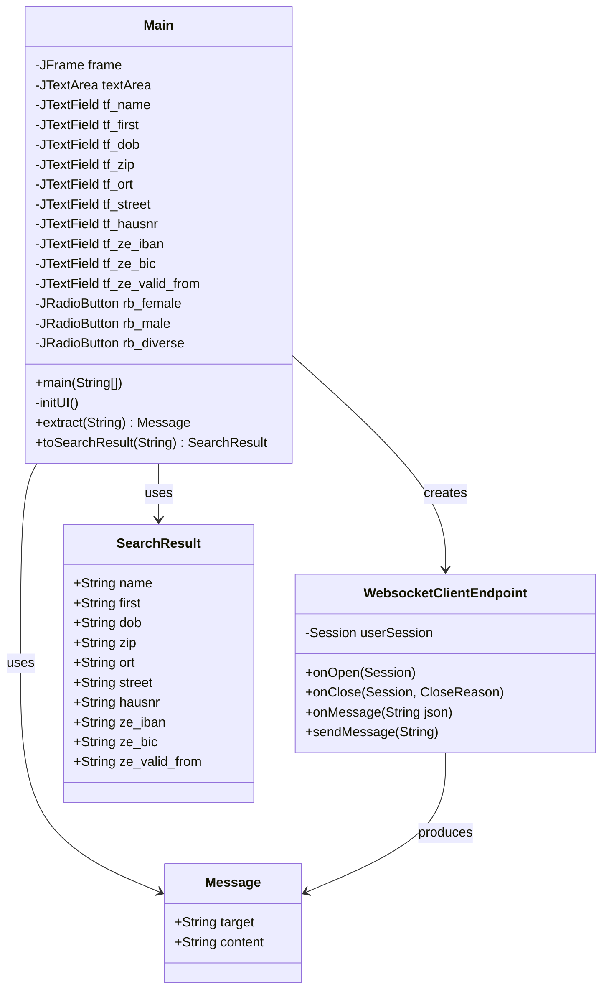

#### 5.3.4 com.poc MVP Triad (swing – PoC Refactoring)

**Purpose:** Demonstrates a clean Model-View-Presenter architecture for the Swing client with REST backend integration.

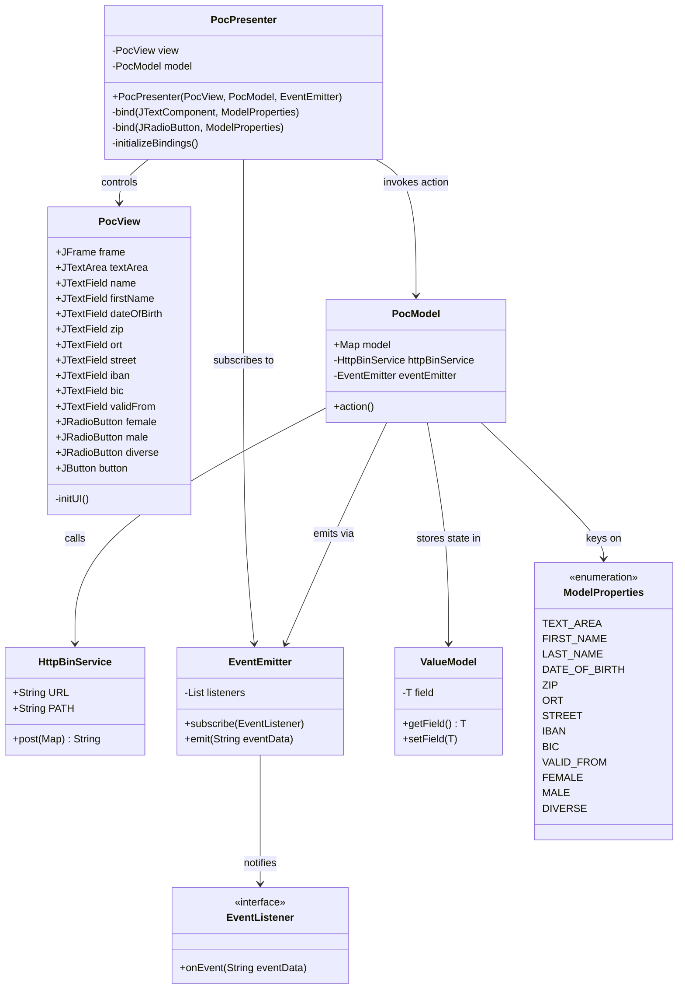

---

## 6. Runtime View

### 6.1 Scenario 1: System Startup and WebSocket Connection Establishment

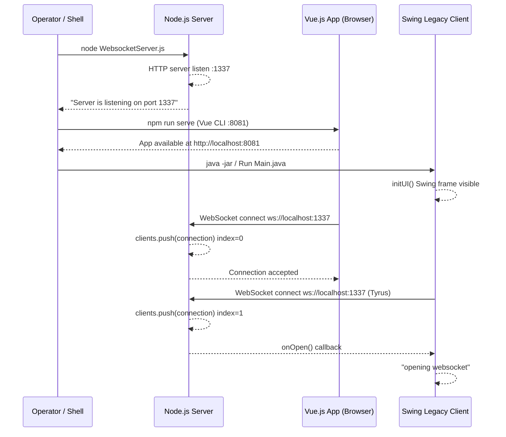

### 6.2 Scenario 2: Customer Search and Data Transfer to Allegro

This is the primary happy-path workflow — the core use case of the PoC.

```mermaid
sequenceDiagram
    actor Agent as Web Agent
    participant VUE as Vue.js Search.vue
    participant NS as Node.js WebSocket Server
    participant SW as Swing Legacy Client

    Agent->>VUE: Enter "Mayer" in Name field
    Agent->>VUE: Click "Suchen" button
    VUE-->>VUE: searchPerson() filters search_space[]
    VUE-->>Agent: Display row: Hans Mayer, 79423984

    Agent->>VUE: Click row (selectResult)
    VUE-->>Agent: Highlight row; show Zahlungsempfänger table

    Agent->>VUE: Click IBAN row (zahlungsempfaengerSelected)
    VUE-->>Agent: Highlight IBAN DE27100777770209299700

    Agent->>VUE: Click "Nach ALLEGRO übernehmen"
    VUE-->>VUE: sendMessage(selected_result, "textfield")
    Note over VUE: Serialize JSON envelope with target + content

    VUE->>NS: socket.send(JSON string)
    NS-->>NS: Receive message; loop clients[]
    NS->>VUE: sendUTF(json) echo back to Vue
    NS->>SW: sendUTF(json) deliver to Swing

    SW-->>SW: onMessage(json)
    SW-->>SW: extract(json) produces Message{target="textfield"}
    SW-->>SW: toSearchResult(content) produces SearchResult
    SW-->>SW: tf_name.setText("Mayer")
    SW-->>SW: tf_first.setText("Hans")
    SW-->>SW: tf_dob.setText("1981-01-08")
    SW-->>SW: tf_zip.setText("95183")
    SW-->>SW: tf_ze_iban.setText("DE27100777770209299700")
    SW-->>SW: tf_ze_bic.setText("ERFBDE8E759")
    SW-->>Agent: Swing form fields populated
```

### 6.3 Scenario 3: Free-Text Broadcast via Textarea

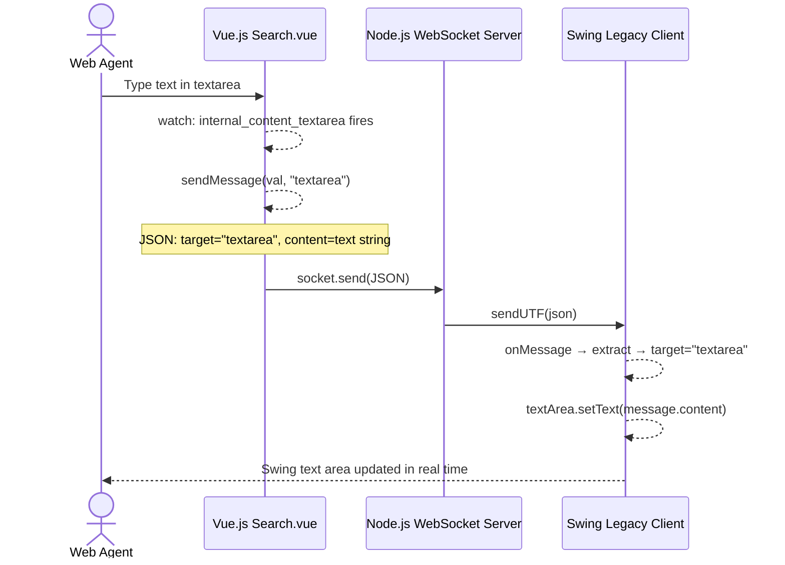

### 6.4 Scenario 4: Swing PoC MVP Form Submission to HTTPBin

```mermaid
sequenceDiagram
    actor Agent as Desktop Agent
    participant PV as PocView (Swing UI)
    participant PP as PocPresenter
    participant PM as PocModel
    participant HS as HttpBinService
    participant HB as HTTPBin :8080

    Agent->>PV: Type into form fields (Vorname, Name, DOB, etc.)
    PV-->>PP: DocumentListener.insertUpdate / removeUpdate
    PP-->>PM: model.get(prop).setField(content)

    Agent->>PV: Click "Anordnen" button
    PV-->>PP: ActionListener callback
    PP->>PM: model.action()

    PM-->>PM: Build HashMap from EnumMap values
    PM->>HS: httpBinService.post(data)
    HS-->>HS: Build JSON payload via javax.json generator
    HS->>HB: HTTP POST /post (application/json)
    HB-->>HS: 200 OK + JSON echo response body
    HS-->>PM: return responseBody (String)

    PM-->>PM: responseBody not empty
    PM->>PM: eventEmitter.emit(responseBody)
    PM-->>PP: EventListener.onEvent(responseBody) (lambda)
    PP-->>PV: view.textArea.setText(responseBody)
    PP-->>PV: Clear all form fields
    PP-->>PV: view.female.setSelected(true) (reset gender)
    PV-->>Agent: TextArea shows server response; fields cleared
```

### 6.5 WebSocket Message Envelope Schema

All messages exchanged over the WebSocket bus conform to the following envelope structure:

```
Message Envelope
├── target: String  ("textfield" | "textarea")
└── content: String | Object
    ├── [if target="textfield"] PersonRecord object
    │   ├── knr: String          (Kundennummer / customer number)
    │   ├── name: String         (last name / Nachname)
    │   ├── first: String        (first name / Vorname)
    │   ├── dob: String          (date of birth YYYY-MM-DD)
    │   ├── zip: String          (postal code / PLZ)
    │   ├── ort: String          (city / Ort)
    │   ├── street: String       (street / Strasse)
    │   ├── hausnr: String       (house number / Hausnummer)
    │   └── zahlungsempfaenger   (payment recipient — object or array)
    │       ├── iban: String
    │       ├── bic: String
    │       └── valid_from: String
    └── [if target="textarea"] plain String value
```

---

## 7. Deployment View

### 7.1 Local Development Deployment

All components run on a single developer workstation. This is the only deployment topology documented and used by the project.

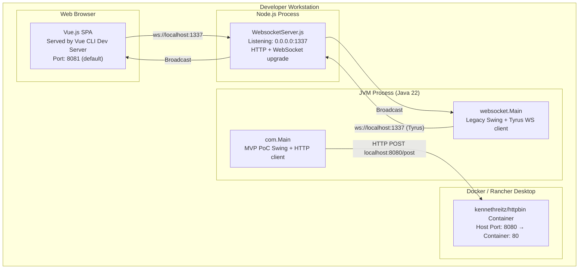

### 7.2 Required Startup Sequence

Components must be started in this order to avoid connection failures:

| Step | Component | Command | Port |
|------|-----------|---------|------|
| 1 | HTTPBin (Docker) | `docker run -p 8080:80 kennethreitz/httpbin` | 8080 |
| 2 | Node.js WebSocket Server | `node node-server/src/WebsocketServer.js` | 1337 |
| 3 | Vue.js Frontend | `cd node-vue-client && npm run serve` | 8081 |
| 4 | Java Swing Client(s) | Run `websocket.Main` or `com.Main` via IntelliJ | — |

### 7.3 Port Summary

| Port | Service | Protocol | Notes |
|------|---------|----------|-------|
| 1337 | Node.js WebSocket Server | HTTP + WebSocket (ws://) | Central message hub; all clients connect here |
| 8080 | HTTPBin Mock Backend | HTTP/REST | Inside Docker; mapped from container port 80 |
| 8081 | Vue CLI Dev Server | HTTP | Serves the Vue.js SPA (default Vue CLI port) |

### 7.4 Production Deployment Considerations

> **Note:** This is a PoC. The following table compares the current state with production recommendations.

| Concern | Current State | Production Recommendation |
|---------|---------------|---------------------------|
| **Security** | No auth; any origin accepted | WSS (TLS); origin whitelist; JWT or API key |
| **Scalability** | Single Node.js process, in-memory client list | Redis pub/sub for multi-instance WS broadcasting |
| **Data Persistence** | In-memory array in browser | Replace with real backend API + database |
| **Frontend Serving** | Vue CLI dev server | Build with `npm run build`; serve via nginx or CDN |
| **Containerization** | Only HTTPBin is containerized | Dockerize Node.js server and Vue.js app |
| **Process Supervision** | Bare Node.js process | PM2, systemd, or Docker restart policy |
| **Health Monitoring** | None | Add `/health` endpoint to Node.js server |

---

## 8. Crosscutting Concepts

### 8.1 Domain Model

The central data entity is a **Customer/Person record** with associated **Zahlungsempfänger** (payment recipients / bank accounts). This domain is consistent across all three clients and the API schema.

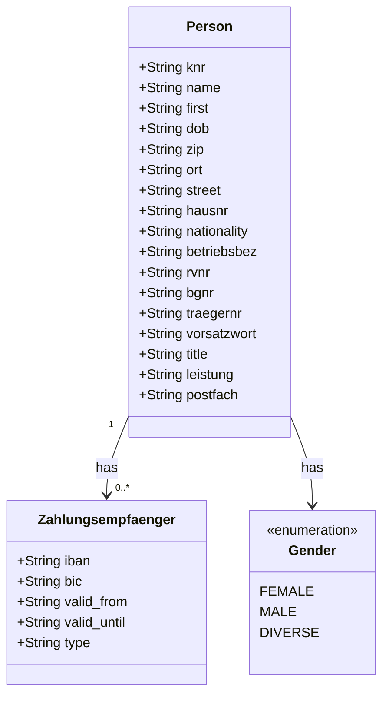

**OpenAPI Schema Fields (api.yml — PostObject):**

| Field | Type | German Mapping |
|-------|------|----------------|
| `FIRST_NAME` | string | Vorname |
| `LAST_NAME` | string | Nachname |
| `DATE_OF_BIRTH` | string | Geburtsdatum |
| `STREET` | string | Strasse |
| `BIC` | string | Bank Identifier Code |
| `ORT` | string | Ort (city) |
| `ZIP` | string | Postleitzahl |
| `FEMALE` | string | Gender indicator |
| `MALE` | string | Gender indicator |
| `DIVERSE` | string | Gender indicator |
| `IBAN` | string | International Bank Account Number |
| `VALID_FROM` | string | Payment account validity start date |
| `TEXT_AREA` | string | Free-text remarks (RT field) |

### 8.2 Event-Driven Communication Patterns

Two distinct event-driven patterns are used in this system:

#### 8.2.1 WebSocket Fan-Out (node-server)

The Node.js server implements a simple **broadcast / fan-out** pattern. There is no message routing based on recipient identity — every message goes to every connected client including the sender. The Vue.js client is the primary **publisher** and the Swing legacy client is the primary **subscriber** for `textfield` messages.

#### 8.2.2 Observer / EventEmitter (swing com.poc)

The `EventEmitter` / `EventListener` pattern decouples `PocModel` from `PocPresenter`. After a successful HTTP call, the model emits the response body as a string event. The presenter's lambda subscription updates the text area and clears form fields.

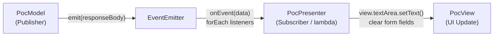

### 8.3 Data Binding Pattern (Swing MVP)

The `PocPresenter` implements **bidirectional data binding** between Swing UI components and `PocModel` using:

- `bind(JTextComponent, ModelProperties)` — registers a `DocumentListener` that updates `ValueModel<String>` on every insert/remove operation
- `bind(JRadioButton, ModelProperties)` — registers a `ChangeListener` that updates `ValueModel<Boolean>` on selection change

All 13 model properties are bound in `initializeBindings()`.

### 8.4 JSON Processing Strategy

| Context | Approach | Rationale |
|---------|----------|-----------|
| **Vue.js** | Native `JSON.stringify()` / `JSON.parse()` | Browser-native; zero dependencies |
| **Node.js Server** | Raw string pass-through; no parsing | Broker does not need to interpret content |
| **Java Legacy** (`websocket.Main`) | `javax.json` Streaming API — manual boolean flag state machine | Low memory; no extra dependencies |
| **Java PoC** (`HttpBinService`) | `javax.json` Generator API | Write-only; streams JSON to HTTP output |

> **Technical Debt Note:** The streaming parser in `websocket.Main` uses 10+ boolean flags to track parser state. This does not correctly handle the nested `zahlungsempfaenger` object structure. See Section 11 for details.

### 8.5 Error Handling

| Component | Current Error Handling | Known Gap |
|-----------|----------------------|-----------|
| **WebsocketServer.js** | None | No `request.on('error')` or process-level handlers; crashes on unhandled exceptions |
| **Search.vue** | None | No UI feedback when WebSocket is unavailable or disconnects |
| **websocket.Main** | `RuntimeException` rethrow wrapping constructor | No reconnection; app hangs if WS connection fails |
| **PocPresenter** | `RuntimeException` rethrow from checked exceptions | No user-facing error dialog in the UI |
| **HttpBinService** | Returns raw response; throws `IOException` | HTTP 4xx/5xx not checked; error response treated as success |

### 8.6 Logging

All logging uses `System.out.println()` / `console.log()` — no structured logging framework is present in any component.

| Component | Logged Events |
|-----------|---------------|
| `WebsocketServer.js` | Server start, connection origin, connection accept, message receipt (JSON), peer disconnect |
| `websocket.Main` | Connecting URI, WebSocket open, WebSocket close |
| `PocPresenter` | DocumentListener updates (insert/remove), EventEmitter data received |
| `PocModel` | All ModelProperty values on action(), HTTP response code and body |

### 8.7 Threading Model

| Component | Threading Behaviour | Known Risk |
|-----------|---------------------|------------|
| **Node.js Server** | Single-threaded event loop; no concurrency issues | None for single-node PoC |
| **Swing Legacy** | `CountDownLatch` keeps main alive; Tyrus uses its own receive thread; Swing UI on EDT | `onMessage()` calls `setText()` directly from Tyrus thread — **EDT violation** |
| **Swing PoC MVP** | `CountDownLatch.await()` in main; Swing EDT for UI and button clicks | `model.action()` called on EDT; HTTP call **blocks the EDT** |

---

## 9. Architecture Decisions

### ADR-001: WebSocket as Integration Bridge between Web and Desktop Clients

**Status:** ✅ Implemented (PoC)

**Context:**  
The Allegro Swing desktop client cannot easily consume modern REST/HTTP APIs for real-time data push. The Vue.js web client needs a way to transfer selected search results to the open Swing instance running on the same workstation, without modifying the core Swing business logic.

**Decision:**  
Use a lightweight Node.js WebSocket server as a local message bus. Both clients connect to it. The web client pushes data; the Swing client receives it. No direct peer-to-peer communication is needed.

**Consequences:**  
- ✅ No changes needed to Swing client's core business logic  
- ✅ Web client decoupled from Swing; can evolve independently  
- ✅ Additional clients can join the bus trivially  
- ⚠️ All messages broadcast to all clients — no targeted delivery  
- ⚠️ Local-only; not suitable for remote agent scenarios without tunneling  
- ⚠️ No message persistence; if Swing is not connected when data is sent, messages are lost

---

### ADR-002: In-Memory Customer Data in Vue.js Frontend

**Status:** ✅ Implemented (PoC deliberate choice)

**Context:**  
The PoC needs representative customer data to demonstrate the search and transfer workflow without setting up a real database or backend service.

**Decision:**  
Hardcode a `search_space` array of 5 customer records directly in `Search.vue`. Each record includes realistic German personal and banking data including multiple IBAN/BIC entries per customer.

**Consequences:**  
- ✅ Zero backend dependency for the search feature  
- ✅ Instantly runnable without database setup  
- ⚠️ Not scalable; must be replaced with a real search API for production  
- ⚠️ Data changes require code modification  
- ⚠️ All customer data (including IBANs) visible in browser source

---

### ADR-003: MVP Architecture for Swing PoC Refactoring

**Status:** ✅ Implemented (`com.poc.*` module)

**Context:**  
The legacy Swing client (`websocket.Main`) mixes UI initialization, WebSocket communication, and data parsing in a single monolithic class with static fields. For the PoC, a cleaner architecture is demonstrated alongside the legacy code to show the target modernization direction.

**Decision:**  
Implement a clean Model-View-Presenter (MVP) pattern:
- `PocView` — passive Swing form; exposes public/protected field references; no logic
- `PocModel` — state as `EnumMap<ModelProperties, ValueModel<?>>` plus HTTP action
- `PocPresenter` — binds view to model via listeners; orchestrates the action flow
- `EventEmitter` — observer pattern for async response notification

**Consequences:**  
- ✅ Clear separation of concerns; each class has a single responsibility  
- ✅ Presenter is unit-testable without Swing (view can be mocked)  
- ✅ `ValueModel<T>` provides type-safe field state wrapping  
- ⚠️ Boilerplate binding code in `PocPresenter.initializeBindings()`  
- ⚠️ `PocView` exposes protected field references rather than encapsulated accessors

---

### ADR-004: Streaming JSON Parser for Java WebSocket Message Handling

**Status:** ✅ Implemented — ⚠️ Technically fragile

**Context:**  
The Java Swing legacy client receives JSON messages and must extract specific fields to populate UI components. The team opted to avoid adding a heavyweight JSON library such as Jackson or Gson.

**Decision:**  
Use `javax.json` Streaming API (`JsonParser`) with a manually coded boolean flag state machine to extract field values by key name.

**Consequences:**  
- ✅ No external JSON library beyond `javax.json`  
- ✅ Low memory overhead — streaming, not object-mapping  
- ⚠️ Fragile: nested `zahlungsempfaenger` object is not correctly parsed (state machine does not handle nested key scope)  
- ⚠️ Verbose: 10+ boolean flags for 10 fields  
- ⚠️ Should be replaced with Jackson `ObjectMapper` for production

---

### ADR-005: HTTPBin as Mock REST Backend

**Status:** ✅ Implemented (PoC)

**Context:**  
The PoC needs to demonstrate REST API integration from the Swing MVP client without building a real backend service.

**Decision:**  
Use the `kennethreitz/httpbin` Docker image, which echoes back any JSON POST request. This simulates a real backend response and validates the JSON serialization pipeline end-to-end.

**Consequences:**  
- ✅ Zero backend development effort  
- ✅ Validates JSON generation and HTTP client code  
- ⚠️ No real business logic in response; must be replaced for production  
- ⚠️ Requires Docker Desktop or Rancher Desktop to be running

---

## 10. Quality Requirements

### 10.1 Quality Tree

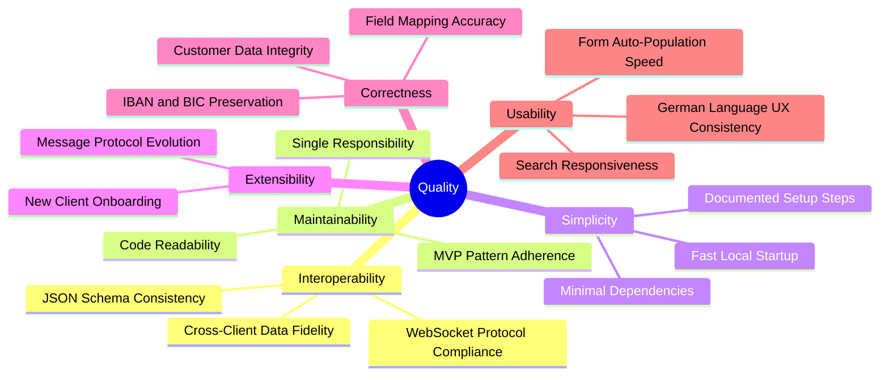

### 10.2 Quality Scenarios

| ID | Quality Attribute | Stimulus | Response | Measure |
|----|-------------------|----------|----------|---------|
| QS-01 | **Interoperability** | Agent clicks "Nach ALLEGRO übernehmen" in browser | All Swing client form fields populated correctly | 100% field mapping accuracy; < 200ms end-to-end on localhost |
| QS-02 | **Correctness** | IBAN `DE27100777770209299700` selected and transferred | Exact string appears in Swing `tf_ze_iban` field | Zero character mutation; strict string equality |
| QS-03 | **Extensibility** | New desktop client connects to WS server | Client receives all broadcast messages | No server code changes required; connect and receive in < 2 minutes |
| QS-04 | **Usability** | Agent types partial name "May" into search form | Matching results displayed immediately | Client-side filter with no page reload; < 50ms |
| QS-05 | **Maintainability** | Developer adds new form field to MVP client | Field added in ModelProperties, PocView, PocPresenter binding | 3 well-isolated code changes; < 30 minutes total effort |
| QS-06 | **Simplicity** | New developer clones repository | System running end-to-end | Runnable following 4 documented steps; < 15 minutes to first demo |
| QS-07 | **Availability (PoC)** | Node.js server crashes | Swing and Vue clients handle disconnection | Graceful close callbacks invoked; no data corruption |

---

## 11. Risks and Technical Debt

### 11.1 Technical Risks

| ID | Risk | Probability | Impact | Recommended Mitigation |
|----|------|-------------|--------|------------------------|
| R-01 | **EDT Thread Safety Violation** — `websocket.Main.onMessage()` calls Swing `setText()` directly from Tyrus WebSocket receive thread, not the Event Dispatch Thread | High | Medium | Wrap all Swing updates in `SwingUtilities.invokeLater()` |
| R-02 | **EDT-Blocking HTTP Call** — `PocPresenter` invokes `model.action()` on EDT; `HttpBinService.post()` is synchronous and blocks the EDT, freezing the entire UI | High | High | Execute HTTP call on a background thread using `SwingWorker` or `CompletableFuture` |
| R-03 | **No WebSocket Reconnection** — If the Node.js server restarts, neither Vue.js nor Swing clients reconnect automatically | Medium | Medium | Implement exponential backoff reconnection in both clients |
| R-04 | **Fragile Nested JSON Parsing** — Boolean flag state machine in `toSearchResult()` fails silently for nested objects; `zahlungsempfaenger` sub-fields not correctly extracted | High | Medium | Replace `javax.json` streaming parser with Jackson `ObjectMapper` |
| R-05 | **No Origin Validation** — WebSocket server accepts connections from any origin with `request.accept(null, request.origin)` | High | High (Production) | Implement origin whitelist; add authentication tokens |
| R-06 | **Unchecked HTTP Status Codes** — `HttpBinService` does not verify `connection.getResponseCode()`; a 4xx/5xx body is emitted as a success event | Medium | Medium | Check response code before processing; throw on error status |
| R-07 | **No Process Supervision** — Node.js server runs bare; an unhandled exception crashes the process permanently | Medium | High | Use PM2, systemd, or Docker `--restart=always` policy |

### 11.2 Technical Debt

| ID | Type | Component | Description | Priority | Estimated Effort |
|----|------|-----------|-------------|----------|-----------------|
| TD-01 | **Design Debt** | `websocket.Main` | Monolithic class mixing UI initialization, WebSocket lifecycle, and JSON parsing in a single class with only static methods/fields | High | 4–8h refactor to MVP pattern |
| TD-02 | **Code Debt** | `websocket.Main` | Hand-coded boolean flag JSON state machine (10+ flags for 10 fields); does not handle nested JSON objects correctly | High | 2h — replace with Jackson |
| TD-03 | **Thread Safety Debt** | `websocket.Main` | Swing UI updated directly from Tyrus WebSocket thread violating EDT safety | High | 1h — add `SwingUtilities.invokeLater()` |
| TD-04 | **Thread Safety Debt** | `PocPresenter` | Synchronous HTTP call on the Event Dispatch Thread blocks the UI | High | 2h — implement `SwingWorker` |
| TD-05 | **Data Debt** | `Search.vue` | Customer search data hardcoded as a 5-element array; no real backend integration | High | Requires backend API development |
| TD-06 | **Error Handling Debt** | All components | No user-visible error feedback; all errors silently swallowed or rethrown as `RuntimeException` | Medium | 4h — add error states and user dialogs |
| TD-07 | **Security Debt** | `WebsocketServer.js` | No authentication, authorization, or origin validation; any client can broadcast to all connected parties | High (Production) | Requires architectural redesign for production |
| TD-08 | **Testing Debt** | All | Zero unit tests, integration tests, or test infrastructure anywhere in the project | Medium | Ongoing: framework setup ~4h, then incremental |
| TD-09 | **API Consistency Debt** | `api.yml` vs `Search.vue` | OpenAPI schema uses `FIRST_NAME` (uppercase snake_case) while Vue.js uses `first` (lowercase camelCase) — inconsistent naming convention | Low | 2h — harmonize field naming across spec and code |
| TD-10 | **Dependency Debt** | `pom.xml` | Mixed Tyrus versions: `tyrus-websocket-core` 1.2.1 alongside `tyrus-spi` 1.15 and `tyrus-standalone-client` 1.15 — potential version conflict | Medium | 1h — audit and align to single Tyrus version |
| TD-11 | **Encapsulation Debt** | `PocView` | Form fields exposed as `protected` instance variables rather than through accessor methods; breaks encapsulation | Low | 2h — add getter methods |
| TD-12 | **Broadcast Debt** | `WebsocketServer.js` | Sender receives echo of its own messages; Vue.js client receives back the message it just sent | Low | 30min — exclude sender from broadcast loop |

### 11.3 Prioritized Improvement Recommendations

1. **🔴 Fix EDT violations** in `websocket.Main.onMessage()` — wrap Swing updates in `SwingUtilities.invokeLater()` (R-01, TD-03)
2. **🔴 Fix EDT blocking** in `PocPresenter` — implement `SwingWorker` for HTTP calls (R-02, TD-04)
3. **🔴 Replace JSON streaming parser** in `websocket.Main` — use Jackson `ObjectMapper` for correct nested parsing (R-04, TD-02)
4. **🟡 Add WebSocket reconnection** — implement exponential backoff in both Vue.js and Swing clients (R-03)
5. **🟡 Add error handling UX** — show `JOptionPane` or browser alerts on connection failure or HTTP error (TD-06)
6. **🟡 Exclude sender from broadcast** — prevent Vue.js from processing its own messages (TD-12)
7. **🟡 Check HTTP status codes** in `HttpBinService` before treating response as success (R-06)
8. **🟢 Introduce test framework** — JUnit 5 for Java, Vue Test Utils for frontend (TD-08)
9. **🟢 Harmonize field naming** — align OpenAPI, Vue.js, and Java enum conventions (TD-09)
10. **🟢 Resolve dependency version conflicts** in `pom.xml` Tyrus dependencies (TD-10)

---

## 12. Glossary

### 12.1 Domain Terms

| Term | Language | Definition |
|------|----------|------------|
| **Allegro** | — | Name of the legacy CRM / back-office desktop application being modernized |
| **Vorname** | German | First name |
| **Name / Nachname** | German | Last name / surname |
| **Geburtsdatum** | German | Date of birth |
| **Geschlecht** | German | Gender |
| **Weiblich** | German | Female |
| **Männlich** | German | Male |
| **Divers** | German | Diverse / non-binary |
| **Strasse** | German | Street name |
| **Hausnummer** | German | House number |
| **PLZ (Postleitzahl)** | German | Postal code / ZIP code |
| **Ort** | German | City / locality |
| **Kundennummer (Knr)** | German | Customer number — unique CRM identifier |
| **Zahlungsempfänger** | German | Payment recipient — a bank account (IBAN + BIC) linked to a customer |
| **IBAN** | International | International Bank Account Number — standardized bank account identifier (e.g., DE27100777770209299700) |
| **BIC** | International | Bank Identifier Code (SWIFT code) — identifies the financial institution |
| **Gültig ab** | German | Valid from — start date of a bank account's validity period |
| **Betriebsbezeichnung** | German | Business / company designation |
| **Postfach** | German | PO Box (Post Office Box) |
| **RV-Nummer** | German | Rentenversicherungsnummer — pension insurance number |
| **BG-Nummer** | German | Berufsgenossenschaftsnummer — occupational accident insurance number |
| **Träger-Nummer** | German | Carrier/provider number |
| **Vorsatzwort** | German | Name prefix (e.g., "von", "van", "de") |
| **Leistung** | German | Benefit type or service |
| **Nach ALLEGRO übernehmen** | German | "Transfer to ALLEGRO" — UI label for the data transfer button |
| **Anordnen** | German | "Arrange / Submit" — button label for the PoC form submission |
| **Suchen** | German | "Search" — search button label |
| **RT** | — | Field label abbreviation in the Swing UI for the remarks/text area |

### 12.2 Technical Terms

| Term | Definition |
|------|------------|
| **WebSocket** | Full-duplex communication protocol over a single TCP connection (RFC 6455); enables real-time bidirectional messaging between browser and server |
| **JSR-356** | Java API for WebSocket (`javax.websocket`) — standard Java EE specification for WebSocket communication |
| **Tyrus** | GlassFish project providing the reference implementation of JSR-356; used here as a standalone client library |
| **Vue.js SPA** | Single-Page Application built with Vue.js; runs entirely in the browser, no page reloads |
| **Single-File Component (SFC)** | Vue.js file format (`.vue`) combining `<template>`, `<script>`, and `<style>` in one file |
| **MVP** | Model-View-Presenter — architectural pattern separating UI (View), state/logic (Model), and coordination (Presenter) |
| **Event Dispatch Thread (EDT)** | The single thread in Java Swing responsible for all UI rendering and event processing; must never be blocked by long-running operations |
| **EventEmitter** | Observer / publish-subscribe pattern implementation; allows decoupled event broadcasting between components |
| **Fan-out / Broadcast** | A messaging pattern where one incoming message is forwarded to all registered receivers |
| **HTTPBin** | A simple HTTP request echo service (`kennethreitz/httpbin`); returns the received request body as the response — used as a mock backend |
| **GridBagLayout** | Java Swing layout manager for precise grid-based component positioning with cell spanning, weighting, and anchor constraints |
| **`javax.json` Streaming API** | Low-level JSON API providing sequential event-based parsing (`JsonParser`) and generation (`JsonGenerator`) without object mapping |
| **`ValueModel<T>`** | Generic wrapper class in the MVP model holding a typed field value with getter/setter; enables type-safe state management |
| **`ModelProperties`** | Java enum defining the canonical set of model field identifiers; used as keys in the `EnumMap`-backed model state |
| **`CountDownLatch`** | Java concurrency utility that blocks a thread until a countdown reaches zero; used to keep the main thread alive until WebSocket session closes |
| **PoC** | Proof of Concept — a demonstration implementation validating a technical or architectural approach |
| **OpenAPI** | Specification format (formerly Swagger) for describing RESTful APIs in YAML/JSON; `api.yml` documents the `PostObject` schema |
| **Vue CLI** | Command-line toolchain for scaffolding, developing (`npm run serve`) and building (`npm run build`) Vue.js applications |
| **DocumentListener** | Java Swing interface (`javax.swing.event.DocumentListener`) for receiving callbacks when a text component's document content changes |
| **`SwingWorker`** | Java Swing utility class for executing background tasks off the EDT and publishing results back to the EDT safely |
| **`SwingUtilities.invokeLater()`** | Java Swing method to schedule a `Runnable` for execution on the EDT — the correct way to update UI components from non-EDT threads |

---

## Appendix

### A. Project File Inventory

| Module | Path | Language | Purpose |
|--------|------|----------|---------|
| **Node.js Server** | `node-server/src/WebsocketServer.js` | JavaScript (Node.js) | WebSocket message broker / fan-out hub |
| **Vue App Entry** | `node-vue-client/src/main.js` | JavaScript (Vue.js) | Application bootstrap |
| **Vue Root Component** | `node-vue-client/src/App.vue` | Vue SFC | Root layout and header |
| **Vue Search Component** | `node-vue-client/src/components/Search.vue` | Vue SFC | Customer search UI + WS client |
| **Swing Legacy Main** | `swing/src/main/java/websocket/Main.java` | Java 22 | Legacy Swing UI + WS client + JSON parser |
| **Swing PoC Entry** | `swing/src/main/java/com/Main.java` | Java 22 | MVP application entry point; wires MVP triad |
| **PocView** | `swing/src/main/java/com/poc/presentation/PocView.java` | Java 22 | Passive Swing form view |
| **PocPresenter** | `swing/src/main/java/com/poc/presentation/PocPresenter.java` | Java 22 | MVP presenter + data binding |
| **PocModel** | `swing/src/main/java/com/poc/model/PocModel.java` | Java 22 | Form state store + HTTP action |
| **HttpBinService** | `swing/src/main/java/com/poc/model/HttpBinService.java` | Java 22 | REST HTTP POST client |
| **EventEmitter** | `swing/src/main/java/com/poc/model/EventEmitter.java` | Java 22 | Observer event bus |
| **EventListener** | `swing/src/main/java/com/poc/model/EventListener.java` | Java 22 | Event callback interface |
| **ModelProperties** | `swing/src/main/java/com/poc/model/ModelProperties.java` | Java 22 | Form field enum (13 values) |
| **ValueModel** | `swing/src/main/java/com/poc/ValueModel.java` | Java 22 | Generic typed field wrapper |
| **OpenAPI Spec** | `api.yml` | YAML | REST API schema definition (PostObject) |
| **Maven POM** | `pom.xml` | XML | Java build configuration + dependencies |
| **Node Dependencies** | `node-server/package.json` | JSON | Node.js runtime dependency (`websocket`) |
| **Vue Dependencies** | `node-vue-client/package.json` | JSON | Vue.js + Vue CLI dependencies |

### B. Key Dependency Versions

| Dependency | Version | Used By |
|------------|---------|---------|
| `websocket` (npm) | ^1.0.35 | node-server |
| `vue` | ^2.6.10 | node-vue-client |
| `@vue/cli-service` | ^4.0.0 | node-vue-client (dev) |
| `core-js` | ^3.1.2 | node-vue-client |
| `tyrus-standalone-client` | 1.15 | swing (Java) |
| `websocket-api` (GlassFish) | 0.2 | swing (Java) |
| `tyrus-websocket-core` | 1.2.1 | swing (Java) |
| `tyrus-spi` | 1.15 | swing (Java) |
| `javax.json-api` | 1.1.4 | swing (Java) |
| `javax.json` (GlassFish) | 1.0.4 | swing (Java) |
| Java SDK | ≥ 22.0.1 | swing (Java) |
| Node.js | any current LTS | node-server |

### C. Architecture Decisions Summary

| ID | Title | Status |
|----|-------|--------|
| ADR-001 | WebSocket as Integration Bridge between Web and Desktop | ✅ Implemented |
| ADR-002 | In-Memory Customer Data in Vue.js | ✅ Implemented (PoC) |
| ADR-003 | MVP Architecture for Swing PoC | ✅ Implemented |
| ADR-004 | Streaming JSON Parser for Java WS Client | ✅ Implemented (⚠️ fragile) |
| ADR-005 | HTTPBin as Mock REST Backend | ✅ Implemented (PoC) |

### D. Sample Customer Data (search_space in Search.vue)

The following 5 customer records are hardcoded in `Search.vue` for PoC demonstration:

| Kundennummer | Name | Vorname | Geburtsdatum | PLZ | Ort | IBAN count |
|--------------|------|---------|-------------|-----|-----|------------|
| 79423984 | Mayer | Hans | 1981-01-08 | 95183 | Trogen | 2 |
| 67485246 | Reitmayr | Linda | 1979-05-12 | 92148 | Hof | 1 |
| 13725246 | May | Karl | 1964-11-02 | 10124 | Berlin | 3 |
| 41125291 | Mueller | Jens | 1999-04-21 | 14489 | Potsdam | 2 |
| 31228193 | Ruckmueller | Steffi | 1961-11-05 | 14432 | Templin | 2 |

---

*This document was generated from direct source code analysis of all files in the `websocket_swing` / Allegro Modernization PoC repository.*  
*All section content is derived from actual source code, configuration files, and inline comments. No assumptions were made beyond what the source code explicitly demonstrates.*
