# Arc42 Architecture Documentation — Allegro WebSocket PoC

**Version:** 1.0  
**Date:** 2025-01-31  
**Status:** Generated from source code analysis  
**Project:** websocket_swing — Allegro Modernization Proof of Concept

---

## Table of Contents

1. [Introduction and Goals](#1-introduction-and-goals)
2. [Constraints](#2-constraints)
3. [Context and Scope](#3-context-and-scope)
4. [Solution Strategy](#4-solution-strategy)
5. [Building Block View](#5-building-block-view)
6. [Runtime View](#6-runtime-view)
7. [Deployment View](#7-deployment-view)
8. [Cross-cutting Concepts](#8-cross-cutting-concepts)
9. [Architecture Decisions](#9-architecture-decisions)
10. [Quality Requirements](#10-quality-requirements)
11. [Risks and Technical Debt](#11-risks-and-technical-debt)
12. [Glossary](#12-glossary)

---

## 1. Introduction and Goals

### 1.1 Requirements Overview

The **Allegro WebSocket PoC** (Proof of Concept) is a modernization prototype demonstrating how a legacy Java Swing desktop application ("ALLEGRO") used in a German social insurance / welfare management context can be integrated with a modern web-based user interface through a real-time, bidirectional WebSocket communication channel.

The primary motivation is to explore an incremental modernization path that allows the existing Swing client to remain operational while a new browser-based UI takes over data entry and search tasks — without requiring an immediate, high-risk "big bang" replacement of the legacy system.

#### Key Capabilities

| # | Capability | Description |
|---|------------|-------------|
| C-01 | Person Search | The Vue.js web client allows case workers to search for insured persons by name, date of birth, postal code, city, or street address using an in-memory dataset. |
| C-02 | Search Result Selection | The operator can browse tabular results and select a specific person record including their associated payment recipients (Zahlungsempfänger). |
| C-03 | Data Transfer to ALLEGRO | After selecting a person and optionally a payment recipient, the operator clicks "Nach ALLEGRO übernehmen" to push the complete record to the legacy Swing application via WebSocket. |
| C-04 | Real-time WebSocket Broadcast | The Node.js server acts as a message broker: any message sent by a connected client is immediately broadcast to all other connected clients. |
| C-05 | Legacy Swing Form Population | The Swing desktop application receives the broadcasted JSON payload and auto-populates its form fields (first name, last name, date of birth, address, IBAN, BIC, valid-from date). |
| C-06 | Free-text Area Synchronisation | A textarea on the web client is watched for changes and its contents are continuously mirrored to the Swing application's text area via the WebSocket channel. |
| C-07 | HTTP Back-end Integration (PoC) | The refactored Swing MVP implementation posts form data to a local HTTPBin mock service (`http://localhost:8080/post`) to simulate downstream system integration. |

### 1.2 Quality Goals

The following quality goals are prioritised for this PoC. Because this is explicitly a prototype, the emphasis is on demonstrating feasibility rather than production hardening.

| Priority | Quality Goal | Motivation |
|----------|--------------|------------|
| 1 | **Functional Correctness** | The PoC must correctly transmit person and payment data from the web UI into the Swing form without data loss or corruption. |
| 2 | **Simplicity / Understandability** | The architecture must be transparent enough to serve as a blueprint for decision-makers evaluating the modernisation approach. |
| 3 | **Loose Coupling** | The WebSocket broker must decouple the web client and the legacy Swing client so that neither has direct knowledge of the other's internals. |
| 4 | **Maintainability** | The refactored Swing MVP package (`com.poc`) introduces clear separation of concerns (Model, View, Presenter) to improve long-term maintainability of the Swing side. |
| 5 | **Portability** | Running the Node.js broker and Vue.js client with standard tooling keeps the environment reproducible across developer machines. |

### 1.3 Stakeholders

| Role | Concern / Expectation |
|------|-----------------------|
| **Product Owner / Business Sponsor** | Wants evidence that ALLEGRO can be incrementally replaced without disrupting daily operations. |
| **UX / Frontend Engineer** | Needs a clear Vue.js component model and well-defined WebSocket message contracts. |
| **Java / Legacy Engineer** | Needs the Swing integration points (MVP wiring, WebSocket client, JSON parsing) to be clearly documented. |
| **Software Architect** | Needs the overall topology and communication patterns documented in arc42 format. |
| **DevOps / Infrastructure** | Needs reproducible start-up instructions (Docker, npm, Maven). |
| **Case Workers (End Users)** | Expect the search-and-transfer workflow to be fast, reliable, and intuitive. |

---

## 2. Constraints

### 2.1 Technical Constraints

| Constraint | Value / Source |
|------------|----------------|
| **Java Version** | ≥ 22.0.1 — configured in `pom.xml` compiler plugin; unnamed variable syntax `var _ = ...` is used (Java 21+ feature) |
| **Node.js Runtime** | Any LTS version compatible with `websocket ^1.0.35` npm package |
| **Vue.js Framework** | Vue 2.x (version `^2.6.10` declared in `package.json`) |
| **WebSocket Protocol** | RFC 6455 — both Node.js and Java Tyrus implement this standard |
| **Java WebSocket Implementation** | GlassFish Tyrus standalone client (`tyrus-standalone-client 1.15`) via the JSR-356 `javax.websocket` API |
| **JSON Processing (Java)** | `javax.json-api 1.1.4` + GlassFish `javax.json 1.0.4` (streaming parser + generator) |
| **Build Tool (Java)** | Apache Maven — artifact `websocket_swing:websocket_swing:0.0.1-SNAPSHOT` |
| **Build Tool (Vue)** | Vue CLI 4 / Yarn or npm |
| **WebSocket Port** | Fixed at **1337** — hardcoded in server and both clients |
| **HTTP Mock Port** | Fixed at **8080** — hardcoded in `HttpBinService.java` and `api.yml` |
| **Mock HTTP Backend** | `kennethreitz/httpbin` Docker image — must be started before the Swing MVP client |
| **IDE Recommendation** | IntelliJ IDEA (referenced in `README.md` and `WebsocketSwingClient.launch`) |

### 2.2 Organisational / Project Constraints

| Constraint | Description |
|------------|-------------|
| **PoC Scope** | Explicitly a Proof of Concept; production-grade concerns (authentication, persistence, scalability) are intentionally out of scope. |
| **No External Data Source** | Person records are hardcoded in the Vue.js component (`search_space` array); no database or external API is used for search. |
| **Single-Machine Topology** | All three components run on the same developer machine (`localhost`). No distributed deployment is contemplated. |
| **Language** | All UI labels and domain terminology are in **German**, reflecting the target domain (German social insurance administration). |

### 2.3 Conventions

| Convention | Description |
|------------|-------------|
| **German Field Labels** | All form field labels use German terminology: Vorname, Name, Geburtsdatum, PLZ, Ort, Straße, IBAN, BIC, Gültig ab, Geschlecht. |
| **JSON Message Envelope** | All WebSocket messages use `{ "target": "<target>", "content": <payload> }` where `target` is either `"textfield"` or `"textarea"`. |
| **MVP Pattern (Swing PoC)** | The `com.poc` package strictly separates `PocView` (UI), `PocModel` (data/logic), and `PocPresenter` (binding/coordination). |
| **OpenAPI 3.0.1** | `api.yml` documents the HTTP back-end contract in OpenAPI format. |

---

## 3. Context and Scope

### 3.1 Business Context

The system sits in a **case management / social insurance administration** workflow. A case worker uses the modern web UI to look up an insured person and transfers the selected record to the legacy ALLEGRO system to initiate a downstream business process.

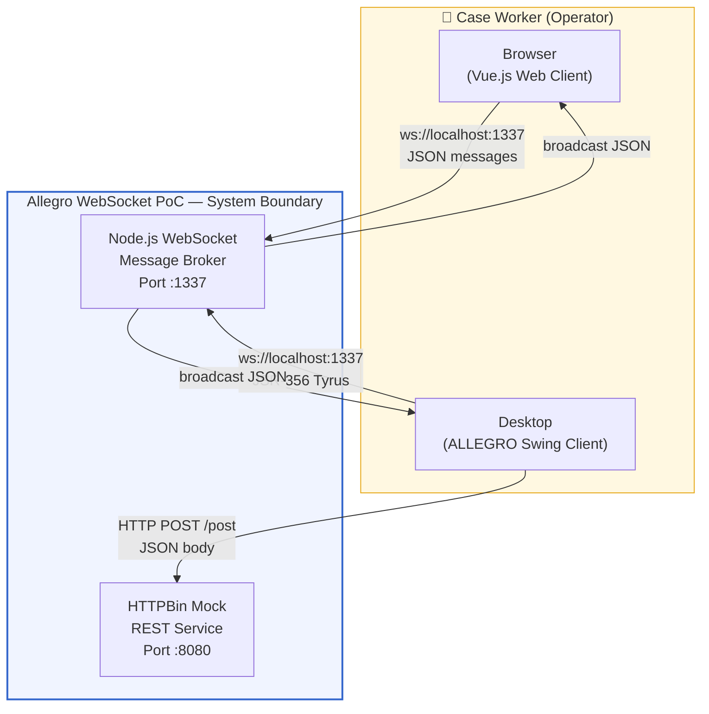

**External Interfaces:**

| Partner | Protocol | Description |
|---------|----------|-------------|
| **Web Browser** | HTTP + WebSocket (`ws://`) | Serves the Vue.js SPA; browser maintains a persistent WebSocket connection to the broker. |
| **ALLEGRO Swing Client** | WebSocket (`ws://`) via Tyrus | Legacy desktop application receiving populated person data from the web client. |
| **HTTPBin Mock Service** | HTTP/1.1 REST (`application/json`) | Echoes back form data; simulates a downstream business system for the Swing MVP. |

### 3.2 Technical Context

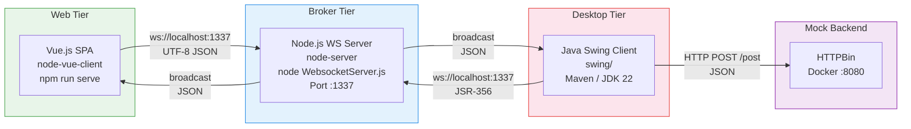

**Technical Channel Summary:**

| Channel | Technology | Format | Direction |
|---------|------------|--------|-----------|
| Web Client ↔ Broker | WebSocket RFC 6455 | UTF-8 JSON | Bidirectional |
| Swing Client ↔ Broker | WebSocket JSR-356 Tyrus | UTF-8 JSON | Bidirectional |
| Broker → All Clients | WebSocket broadcast | UTF-8 JSON | Server push |
| Swing Client → HTTPBin | HTTP/1.1 POST | `application/json` | Unidirectional |

---

## 4. Solution Strategy

### 4.1 Core Technology Decisions

| Decision | Technology | Rationale |
|----------|------------|-----------|
| **Message Transport** | WebSocket RFC 6455 | Full-duplex, low-latency, persistent — ideal for real-time UI synchronisation between browser and desktop. |
| **Broker Runtime** | Node.js + `websocket` npm | Single-file implementation, < 70 lines — minimal overhead perfect for a PoC relay. |
| **Web UI Framework** | Vue.js 2.x + Vue CLI 4 | Progressive, component-based SPA framework; demonstrable as a modern replacement for Swing forms. |
| **Desktop Client** | Java Swing (existing ALLEGRO) | The PoC integrates with the existing system rather than replacing it. |
| **Java WebSocket Client** | GlassFish Tyrus (JSR-356) | Reference implementation; works as a standalone client without an application server. |
| **Mock HTTP Backend** | HTTPBin (Docker) | Zero-config echo service for HTTP integration testing without a real backend. |
| **Java Build** | Apache Maven | Standard dependency management for Tyrus and `javax.json` libraries. |

### 4.2 Architectural Strategy — Hub-and-Spoke Broadcast

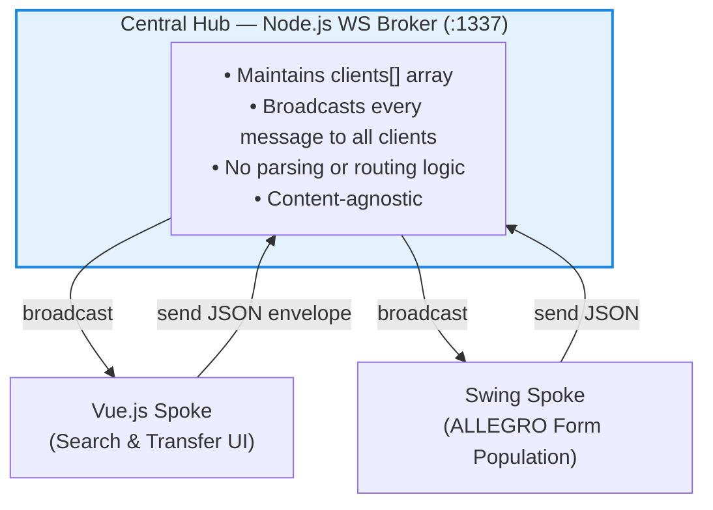

**Key Strategic Choices:**

1. **Content-agnostic broker** — The Node.js server broadcasts without any message inspection. Client-side interpretation is the sole responsibility of each client.
2. **`{ target, content }` envelope** — All messages carry a discriminator field (`"textfield"` or `"textarea"`) enabling clients to route payloads to the correct UI element.
3. **MVP refactoring of Swing** — The `com.poc` package introduces Model-View-Presenter separation in the legacy Swing application, proving the code can be incrementally modernized without rewriting the entire UI toolkit.
4. **Static data for search** — Hardcoded `search_space[]` in Vue.js keeps the PoC self-contained; no database required.

### 4.3 Addressing Quality Goals

| Quality Goal | Approach |
|--------------|----------|
| Functional Correctness | JSON envelope clearly identifies target UI element; Swing only parses fields it uses. |
| Simplicity | Single-file broker; minimal Vue component hierarchy (App → Search); clean MVP in Swing. |
| Loose Coupling | Neither client has any knowledge of the other; all communication is mediated through the broker. |
| Maintainability | MVP separates `PocView`, `PocModel`, `PocPresenter`; `EventEmitter` further decouples model from presenter. |
| Portability | Docker / npm / Maven provide consistent, reproducible build environments. |

---

## 5. Building Block View

### 5.1 Level 1 — System Overview

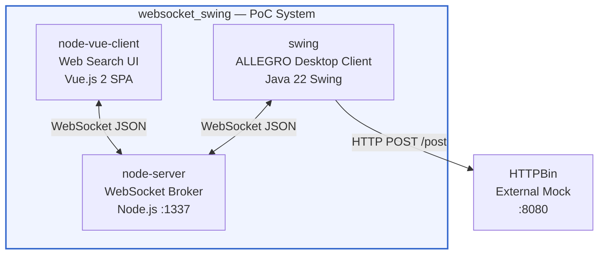

| Component | Technology | Core Responsibility |
|-----------|------------|---------------------|
| `node-server` | Node.js, `websocket@1.0.35` | Accept connections; maintain client registry; broadcast all UTF-8 JSON messages to all clients. |
| `node-vue-client` | Vue.js 2, HTML/CSS | Render person search form; perform client-side search; send selected data to broker; mirror textarea. |
| `swing` | Java 22, Swing, JSR-356 Tyrus | Connect to broker; receive JSON payloads; populate ALLEGRO form fields; post data to HTTP backend. |

### 5.2 Level 2 — Container Decomposition

#### 5.2.1 `node-server` — WebSocket Broker

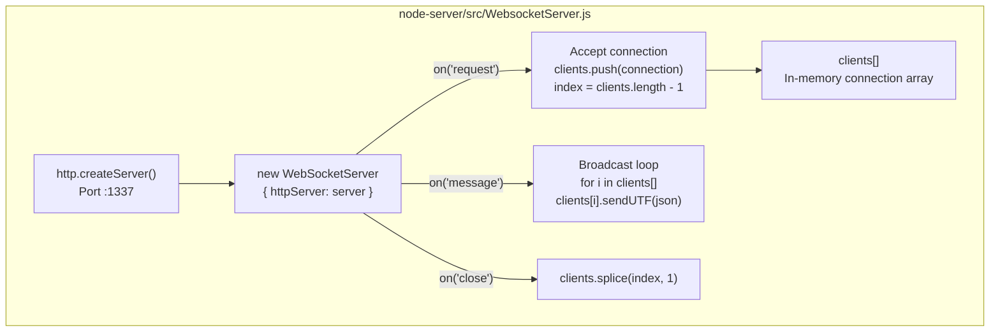

| Element | Description |
|---------|-------------|
| `http.Server` | Underlying HTTP server required for WebSocket upgrade handshake (RFC 6455). |
| `WebSocketServer` | Wraps the HTTP server; manages WebSocket protocol lifecycle. |
| `clients[]` | Global in-memory array of all active `WebSocketConnection` objects. |
| Broadcast loop | On every received `utf8` message, iterates all clients and calls `sendUTF(json)`. |
| Disconnect handler | `close` event removes the connection via its captured array index using `clients.splice()`. |

#### 5.2.2 `node-vue-client` — Web Search UI

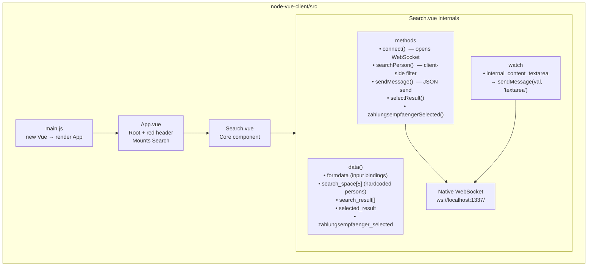

| Element | Description |
|---------|-------------|
| `App.vue` | Root component; page header (red banner "Search Mock"). Mounts `Search`. |
| `Search.vue` | All-in-one: form rendering, client-side search logic, result display, WebSocket communication. |
| `search_space[]` | Hardcoded array of 5 insured persons with nested Zahlungsempfänger arrays. |
| `searchPerson()` | Client-side fuzzy filter: last name, first name, ZIP, city, street, house number. |
| `sendMessage()` | Serialises `{ target, content }` JSON and calls `socket.send()`. |

#### 5.2.3 `swing` — ALLEGRO Desktop Client (Two Parallel Implementations)

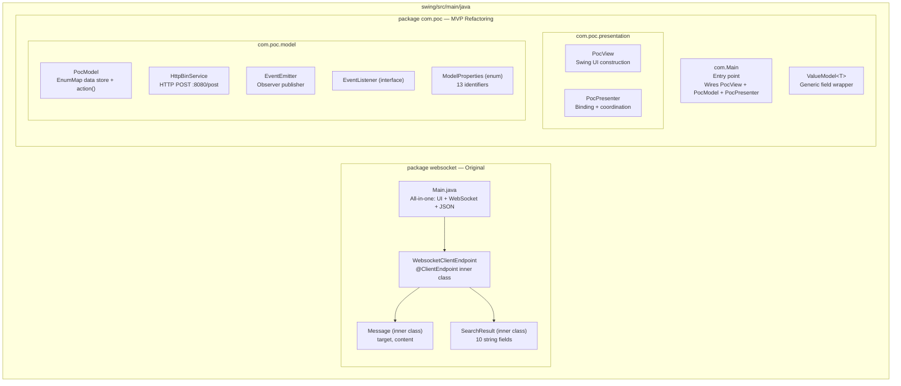

### 5.3 Class Diagram — `com.poc` MVP Package

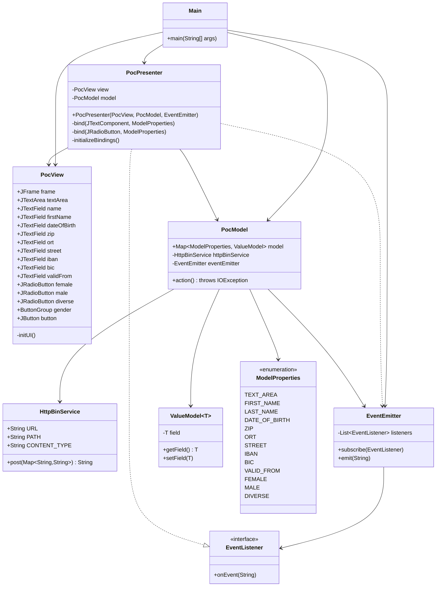

---

## 6. Runtime View

### 6.1 Scenario 1 — System Startup

```mermaid
sequenceDiagram
    participant Dev as Developer
    participant Docker as Docker Engine
    participant NS as Node.js WS Server
    participant VueCLI as Vue CLI Dev Server
    participant Browser as Web Browser
    participant JVM as Swing Client (JVM)

    Dev->>Docker: docker run -p 8080:80 kennethreitz/httpbin
    Docker-->>Dev: HTTPBin listening on host :8080

    Dev->>NS: node WebsocketServer.js
    NS-->>Dev: "Server is listening on port 1337"

    Dev->>VueCLI: npm run serve
    VueCLI-->>Dev: App compiled, serving on :8080 or :8081

    Dev->>Browser: Open http://localhost:&lt;vue-port&gt;
    Browser->>NS: HTTP Upgrade GET ws://localhost:1337/
    NS-->>Browser: 101 Switching Protocols
    NS->>NS: clients.push(browserConn) [index=0]

    Dev->>JVM: Run com.Main or websocket.Main
    JVM->>NS: HTTP Upgrade (Tyrus WebSocketContainer)
    NS-->>JVM: 101 Switching Protocols
    NS->>NS: clients.push(swingConn) [index=1]
    JVM->>JVM: @OnOpen → "opening websocket"
```

### 6.2 Scenario 2 — Person Search and Data Transfer to ALLEGRO *(Primary Scenario)*

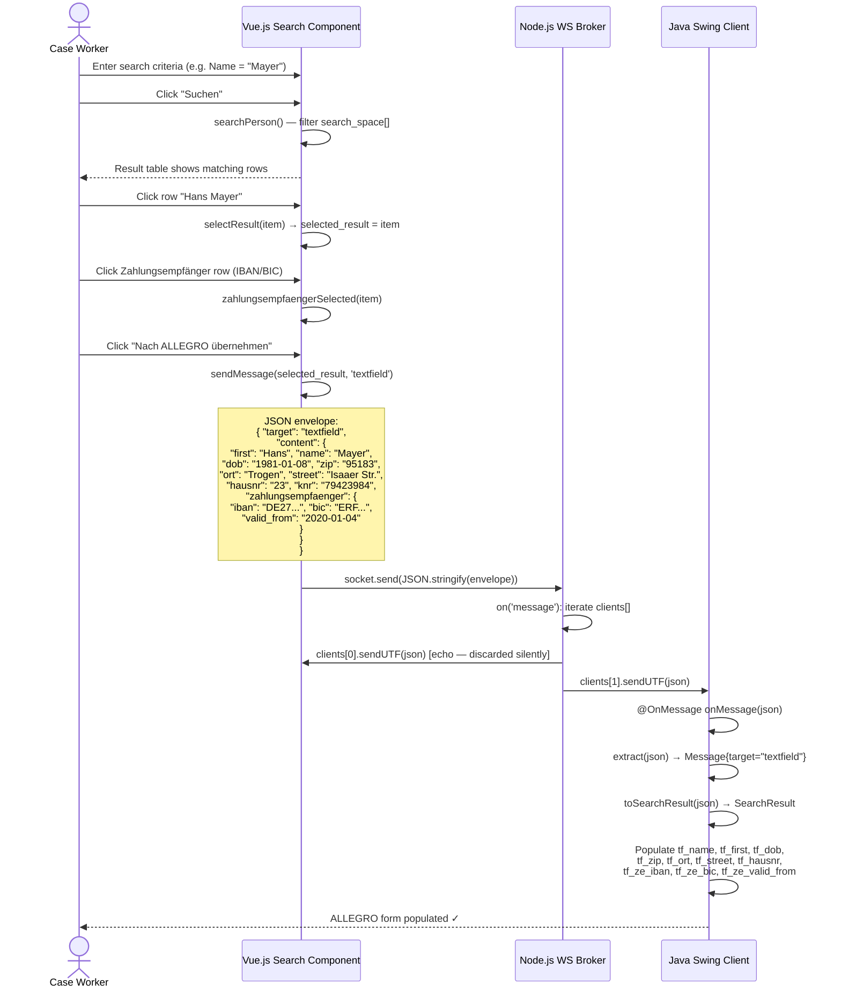

### 6.3 Scenario 3 — Real-time Textarea Synchronisation

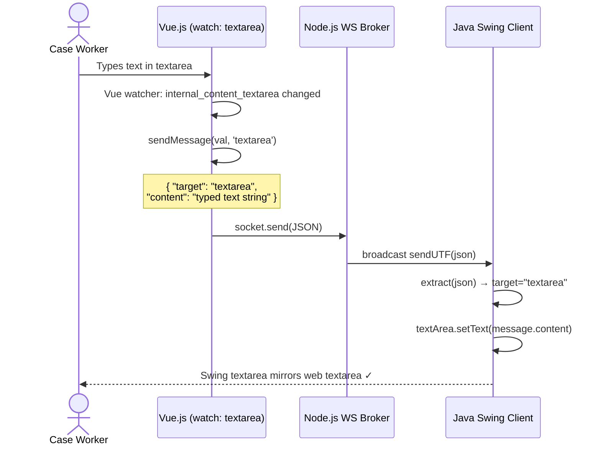

### 6.4 Scenario 4 — MVP Form Submission (com.poc Swing Client)

```mermaid
sequenceDiagram
    actor Op as Case Worker
    participant VIEW as PocView
    participant PRESENTER as PocPresenter
    participant MODEL as PocModel
    participant HTTPBIN as HTTPBin :8080

    Op->>VIEW: Fills text fields (name, IBAN, etc.)
    VIEW->>PRESENTER: DocumentListener.insertUpdate() per keystroke
    PRESENTER->>MODEL: ValueModel.setField(content)

    Op->>VIEW: Clicks "Anordnen" button
    VIEW->>PRESENTER: ActionListener fires
    PRESENTER->>MODEL: model.action()
    MODEL->>MODEL: Collect all ModelProperties values into Map
    MODEL->>HTTPBIN: HTTP POST /post  { FIRST_NAME:..., LAST_NAME:... }
    HTTPBIN-->>MODEL: 200 OK — JSON echo response
    MODEL->>MODEL: eventEmitter.emit(responseBody)
    MODEL->>PRESENTER: EventListener.onEvent(responseBody)
    PRESENTER->>VIEW: textArea.setText(eventData)
    PRESENTER->>VIEW: Clear all text fields + reset gender radio
    VIEW-->>Op: Response visible in textarea; form cleared ✓
```

### 6.5 WebSocket Connection Lifecycle

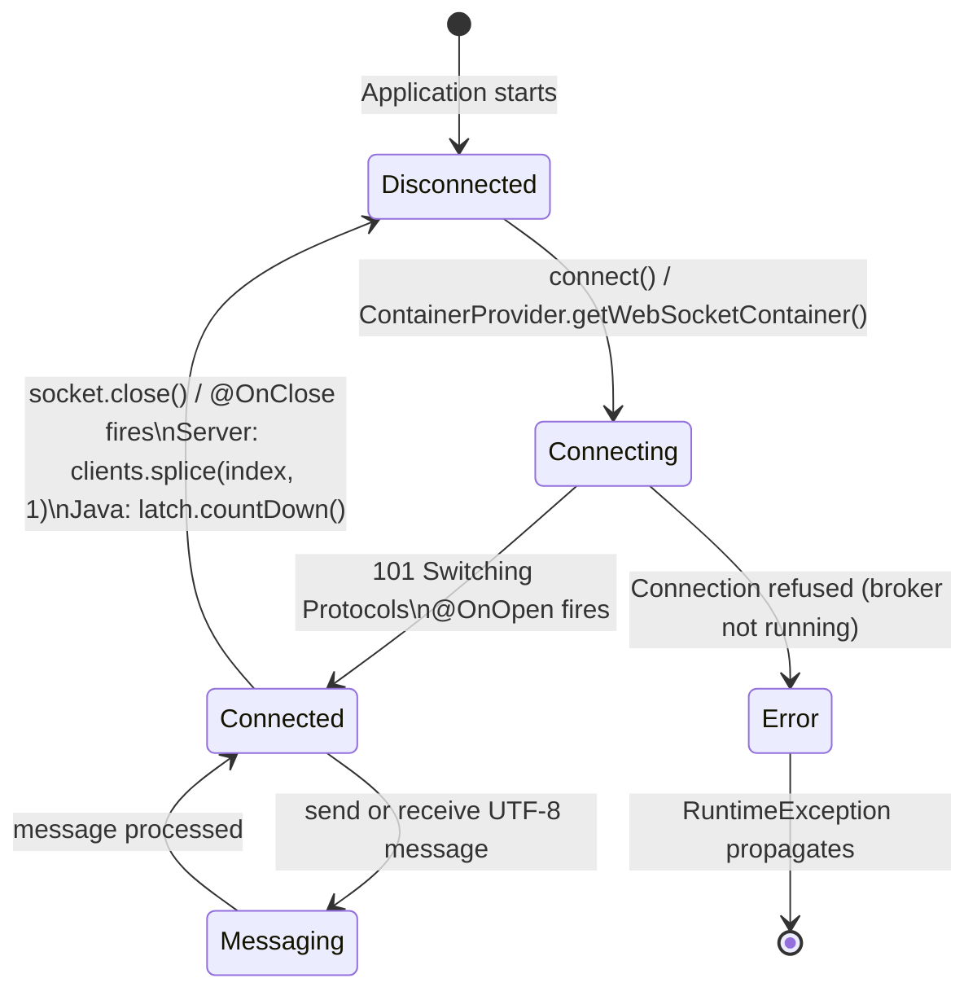

---

## 7. Deployment View

### 7.1 Local Developer Deployment (Single Machine)

All components run on `localhost`. This is the only supported topology for the PoC.

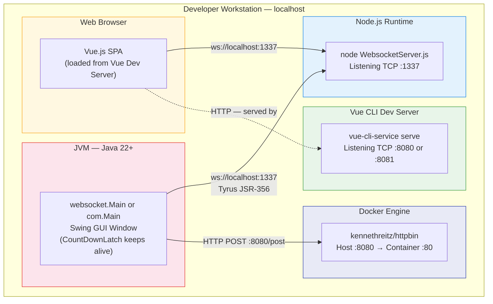

### 7.2 Required Start-up Sequence

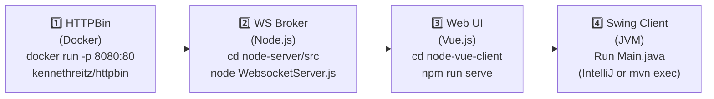

> Steps 1 and 2 are prerequisites. The Swing MVP (`com.Main`) requires HTTPBin when the "Anordnen" button is pressed. Both clients require the WebSocket broker to be reachable at startup.

### 7.3 Port Allocation

| Port | Service | Protocol | Notes |
|------|---------|----------|-------|
| **1337** | Node.js WebSocket Broker | TCP / WebSocket | Hardcoded in all three components. |
| **8080** | HTTPBin (Docker) | HTTP/1.1 | Docker maps host :8080 → container :80. |
| **8080** or **8081** | Vue.js Dev Server | HTTP | Vue CLI auto-increments if :8080 is occupied by Docker. |

> ⚠️ **Port Conflict:** HTTPBin and the Vue CLI dev server both default to port 8080 on the host. Vue CLI will auto-select 8081 if 8080 is occupied, but this can be confusing. Recommend mapping HTTPBin to `:9090` or configuring `VUE_APP_PORT=3000`.

### 7.4 Build Artefacts

| Component | Build | Run |
|-----------|-------|-----|
| `node-server` | `npm install` (no compile step) | `node src/WebsocketServer.js` |
| `node-vue-client` (dev) | `npm run serve` | Served by Vue CLI dev server |
| `node-vue-client` (prod) | `npm run build` → `dist/` | Serve `dist/` via any static HTTP server |
| `swing` | `mvn package` | `java -jar target/websocket_swing-0.0.1-SNAPSHOT.jar` or run via IntelliJ |

---

## 8. Cross-cutting Concepts

### 8.1 Domain Model

The application manages **insured persons** (Versicherte) and their **payment recipients** (Zahlungsempfänger). The domain model is implicit — defined through the Vue.js `search_space[]` array and the Java `ModelProperties` enum.

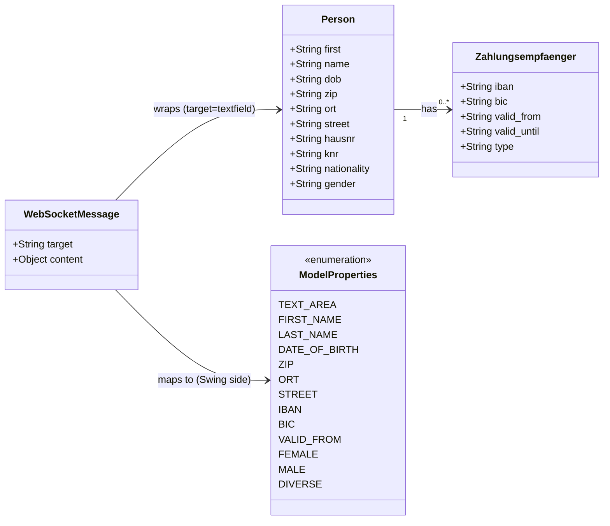

**Data Field Mapping Across All Layers:**

| Vue.js binding | JSON key | `websocket.Main` field | `com.poc` View field | ModelProperties |
|---|---|---|---|---|
| `formdata.first` | `first` | `tf_first` | `firstName` | `FIRST_NAME` |
| `formdata.last` | `name` | `tf_name` | `name` | `LAST_NAME` |
| `formdata.dob` | `dob` | `tf_dob` | `dateOfBirth` | `DATE_OF_BIRTH` |
| `formdata.zip` | `zip` | `tf_zip` | `zip` | `ZIP` |
| `formdata.ort` | `ort` | `tf_ort` | `ort` | `ORT` |
| `formdata.street` | `street` | `tf_street` | `street` | `STREET` |
| `formdata.hausnr` | `hausnr` | `tf_hausnr` | *(not in MVP)* | *(not in enum)* |
| `zahlungsempfaenger.iban` | `iban` | `tf_ze_iban` | `iban` | `IBAN` |
| `zahlungsempfaenger.bic` | `bic` | `tf_ze_bic` | `bic` | `BIC` |
| `zahlungsempfaenger.valid_from` | `valid_from` | `tf_ze_valid_from` | `validFrom` | `VALID_FROM` |
| *textarea (watch)* | `content` (string) | `textArea` | `textArea` | `TEXT_AREA` |

### 8.2 WebSocket Message Protocol

**Envelope format (all messages):**

```json
{
  "target": "<target-ui-element>",
  "content": <payload>
}
```

| `target` | Content type | Consumer action |
|----------|-------------|-----------------|
| `"textfield"` | JSON object (Person + Zahlungsempfänger) | Swing parses via streaming JSON and populates 10 individual text fields |
| `"textarea"` | Plain string | Swing calls `textArea.setText(message.content)` |

> **Echo behaviour:** The broker broadcasts to all clients including the sender. Vue.js has a commented-out, no-op `onmessage` handler and silently discards echoed messages. Only the Swing client actively consumes incoming messages.

### 8.3 JSON Processing Strategy

| Component | Approach | Library |
|-----------|---------|---------|
| Vue.js | Native `JSON.stringify()` / `JSON.parse()` | ECMAScript built-in |
| Java `websocket.Main` — parsing | Streaming parser with boolean-flag state machine | `javax.json.stream.JsonParser` |
| Java `HttpBinService` — serialisation | Streaming generator | `javax.json.JsonGeneratorFactory` |

The Java streaming parser uses one boolean flag per expected field (e.g., `boolean name = false;`). Once a matching `KEY_NAME` event is seen, the flag is set; the next `VALUE_STRING` event captures the value. While memory-efficient, this approach is verbose and hard to maintain.

### 8.4 Observer / Event-Emitter Pattern

Within `com.poc`, the **Observer pattern** decouples `PocModel` from `PocPresenter`:

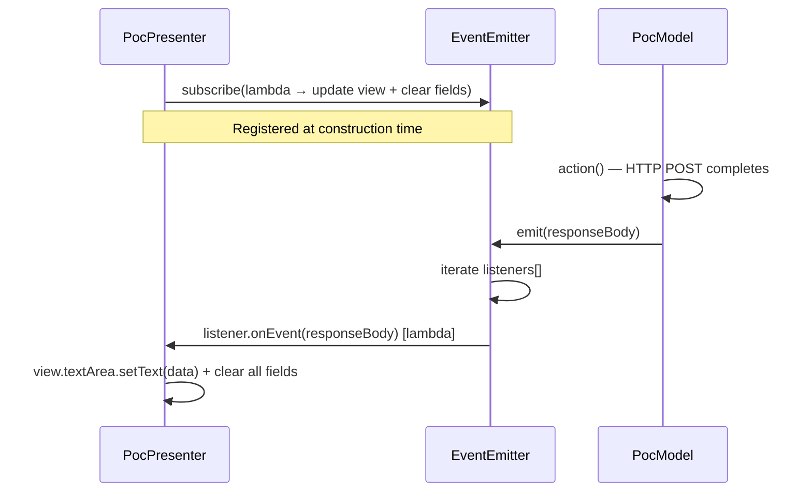

### 8.5 Two-Way Data Binding (MVP Presenter)

`PocPresenter.initializeBindings()` uses Swing listener APIs to keep each view component in sync with its corresponding `ValueModel`:

| Source | Listener | Direction | Destination |
|--------|----------|-----------|-------------|
| `JTextField` / `JTextArea` | `DocumentListener.insertUpdate()` + `removeUpdate()` | View → Model | `ValueModel<String>.setField()` |
| `JRadioButton` | `ChangeListener` | View → Model | `ValueModel<Boolean>.setField()` |
| `EventEmitter` callback | `EventListener` lambda | Model → View | `JTextField.setText("")` + `JTextArea.setText()` |

### 8.6 Error Handling

| Layer | Current Approach | Assessment |
|-------|-----------------|------------|
| Node.js Server | No explicit error handling; `close` event handles cleanup | Acceptable for PoC |
| Vue.js Client | WebSocket failures not handled or surfaced to user | Poor UX on disconnect |
| Java `websocket.Main` | All checked exceptions wrapped in `RuntimeException` | Crashes JVM on any error |
| Java `PocPresenter` | `RuntimeException` wraps `IOException` / `InterruptedException` | Same crash-on-failure behaviour |
| Java `HttpBinService` | No catch block; empty string returned on scanner failure | Silent failure possible |

### 8.7 Logging

All components use simple `stdout` logging (no log levels, no structured format):

| Component | Method | Content |
|-----------|--------|---------|
| Node.js Server | `console.log` with `new Date()` prefix | Connection accepted/closed, messages received with payload |
| `websocket.Main` | `System.out.println` | WebSocket open/close lifecycle events |
| `PocPresenter` | `System.out.println` | Insert/remove update per keystroke (very verbose) |
| `PocModel` | `System.out.println` | All field values at action time; HTTP response code and body |

### 8.8 Security Considerations

| Aspect | Current State | Required for Production |
|--------|--------------|------------------------|
| Authentication | None — any client can connect | JWT / session token validation |
| Authorisation | None | Role-based access control |
| Transport Security | `ws://` — plaintext | `wss://` (TLS) for all non-local use |
| Input Validation | None on server side | JSON Schema validation before broadcast |
| CORS / Origin Control | All origins accepted | Whitelist of trusted origins only |

> ⛔ **Critical:** This system must **not** be deployed outside a controlled local development environment without implementing all security controls listed above.

### 8.9 Internationalisation

The entire UI is in **German** with no i18n framework. All labels, button text, placeholder text, and domain terminology are German social-insurance-domain-specific strings hardcoded directly in source files.

---

## 9. Architecture Decisions

### ADR-001: WebSocket as the Integration Protocol

| Attribute | Value |
|-----------|-------|
| **Status** | Implemented |
| **Context** | Real-time, bidirectional communication is needed between a browser SPA and a legacy Java Swing desktop application. REST polling would add latency; a direct browser-to-Swing API call is not feasible. |
| **Decision** | Use WebSocket (RFC 6455) with a lightweight Node.js relay as the communication backbone. |
| **Pros** | Full-duplex, low-latency; both browser and JVM have mature WebSocket support; broker cleanly decouples clients. |
| **Cons** | Broker is a single point of failure; no message persistence; messages lost if Swing is offline. |

---

### ADR-002: Node.js as the Content-Agnostic Message Broker

| Attribute | Value |
|-----------|-------|
| **Status** | Implemented |
| **Context** | A relay process is needed. Complexity and required expertise should be minimised. |
| **Decision** | Use Node.js + `websocket` npm package as a single-file broadcast relay. |
| **Pros** | < 70 lines of code; no framework; cross-platform; trivially readable. |
| **Cons** | Broadcast-all (every message goes to every client, including sender echo); in-memory only; not multi-tenant. |

---

### ADR-003: Vue.js 2.x for the Modern Web UI

| Attribute | Value |
|-----------|-------|
| **Status** | Implemented |
| **Context** | A component-based SPA framework is needed to demonstrate a modern UI replacement for the Swing form. |
| **Decision** | Vue.js 2.x with Vue CLI 4. |
| **Pros** | Reactive binding simplifies form state; `App → Search` hierarchy enforces separation; broad developer familiarity. |
| **Cons** | Vue 2 reached EOL December 2023 — no active security patches; no state management library (acceptable at PoC scale). |

---

### ADR-004: MVP Pattern for Swing Refactoring

| Attribute | Value |
|-----------|-------|
| **Status** | Implemented (`com.poc` package) |
| **Context** | `websocket.Main` mixes UI, WebSocket, and JSON in one class. Testability and long-term maintainability are poor. |
| **Decision** | Introduce Model-View-Presenter separation: `PocView` (UI), `PocModel` (data + HTTP), `PocPresenter` (binding). |
| **Pros** | Clear separation of concerns; `PocModel` is independently testable; `EventEmitter` further decouples model notification. |
| **Cons** | Both `websocket.Main` and `com.Main` coexist — duplication; `hausnr` is missing from the MVP's `ModelProperties` enum. |

---

### ADR-005: Hardcoded In-memory Person Dataset

| Attribute | Value |
|-----------|-------|
| **Status** | Implemented |
| **Context** | The PoC must work without a database or external service. |
| **Decision** | Embed 5 person records as a static JavaScript array (`search_space[]`) in `Search.vue`. |
| **Pros** | Zero infrastructure; instantly runnable. |
| **Cons** | Not scalable; data changes require code changes; no pagination; no server-side search. |

---

### ADR-006: `javax.json` Streaming Parser for Java JSON

| Attribute | Value |
|-----------|-------|
| **Status** | Implemented |
| **Context** | The Swing client needs to parse incoming JSON without adding new Maven dependencies. |
| **Decision** | Use `javax.json.stream.JsonParser` (already in `pom.xml`) with manual boolean-flag state tracking. |
| **Pros** | No additional dependencies; memory-efficient streaming. |
| **Cons** | ~100 lines of verbose, fragile boolean-flag code for a trivial JSON structure; adding fields requires manual code changes. Recommend Jackson `ObjectMapper` for production. |

---

## 10. Quality Requirements

### 10.1 Quality Tree

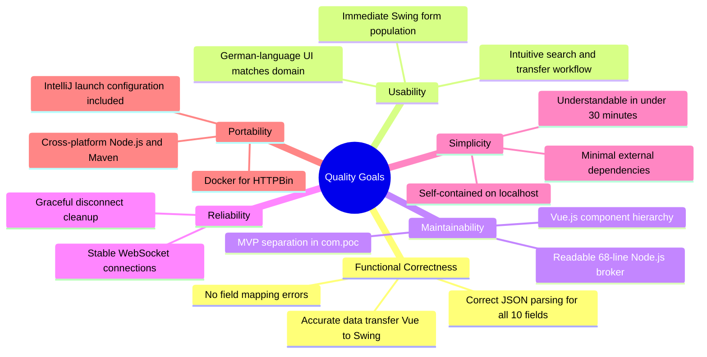

### 10.2 Quality Scenarios

| ID | Attribute | Scenario | Expected Response | Measure |
|----|-----------|----------|-------------------|---------|
| QS-01 | Functional Correctness | Select "Hans Mayer" + IBAN, click "Nach ALLEGRO übernehmen" | All 10 Swing text fields populated correctly | 0 field errors across all 5 sample persons |
| QS-02 | Functional Correctness | Type in Vue.js textarea | Swing textarea updates within one message cycle | Content matches at all times |
| QS-03 | Usability | Case worker opens app for first time | Form and result tables immediately operable | No training needed for basic workflow |
| QS-04 | Reliability | Swing client disconnects | Server removes entry; continues serving remaining clients | No crash; disconnect logged |
| QS-05 | Maintainability | Developer adds a new field | Change localised to enum, model, view binding, presenter | Max 4 files to touch |
| QS-06 | Simplicity | New developer reads codebase | Full message flow understood within 30 minutes | This doc + < 200 lines core code per component |
| QS-07 | Portability | Clone repo on Windows / macOS / Linux | All 4 components start per README | No OS-specific modifications |

---

## 11. Risks and Technical Debt

### 11.1 Technical Risks

| ID | Risk | Prob. | Impact | Mitigation |
|----|------|-------|--------|------------|
| R-01 | HTTPBin and Vue CLI both target host port 8080 | High | Medium | Map HTTPBin to `:9090` or set `VUE_APP_PORT=3000`. |
| R-02 | No reconnection logic — both clients fail permanently if broker restarts | Medium | High | Add exponential-backoff reconnect in `Search.vue connect()` and Java `WebsocketClientEndpoint`. |
| R-03 | Broker echoes messages back to sender — Vue.js discards silently | Low | Low | Add sender-exclusion broadcast once sessions are introduced. |
| R-04 | Parallel Swing implementations (`websocket.Main` + `com.Main`) risk divergence | Medium | Medium | Remove `websocket/Main.java` once `com.poc` reaches full feature parity. |
| R-05 | Hardcoded `localhost` endpoints in 4 source files — not deployable elsewhere | High | High | Externalise via environment variables or a config file. |
| R-06 | No security at all — unauthenticated, plaintext, no input validation | Certain | Critical | Block non-local deployment until TLS, auth, and validation are added. |

### 11.2 Technical Debt Backlog

| ID | Type | Description | Priority | Est. Effort |
|----|------|-------------|----------|-------------|
| TD-01 | Code | `websocket/Main.java` duplicates (poorly) the MVP work in `com.poc`; both entry points exist in the same Maven module. | High | 2 h |
| TD-02 | Design | `search_space[]` hardcoded in Vue — real deployment needs a Person Search REST API and a database. | High | 2–4 days |
| TD-03 | Design | Hardcoded `ws://localhost:1337` and `http://localhost:8080` scattered across 4 files. | High | 2 h |
| TD-04 | Code | Verbose `javax.json` streaming boolean-flag parser (~100 lines for a simple JSON object). | Medium | 4 h — replace with Jackson `ObjectMapper`. |
| TD-05 | Design | No WebSocket reconnection in either client. | Medium | 4 h |
| TD-06 | Test | Zero automated tests in all three components. | High | 1–2 days |
| TD-07 | Design | Vue.js 2 is EOL — no security patches after December 2023. | Medium | 3–5 days — migrate to Vue 3. |
| TD-08 | Code | `ViewData.java` is an empty, unused placeholder class. | Low | 15 min |
| TD-09 | Design | Broadcast-all semantics in broker — multi-user scenarios cause data leakage between sessions. | High (multi-user) | 1–2 days — add session/room routing. |
| TD-10 | Security | No TLS (`ws://`), no authentication, no input validation, all origins accepted. | Critical | 3–5 days |

### 11.3 Recommended Improvement Path

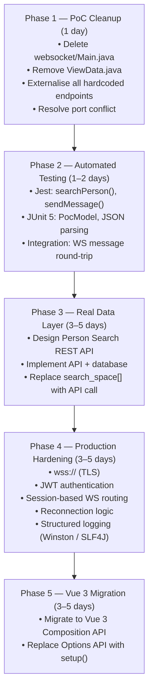

---

## 12. Glossary

### 12.1 Domain Terms (German Social Insurance Context)

| Term | Definition |
|------|------------|
| **ALLEGRO** | The legacy Java Swing desktop application used by case workers in the target organisation. The PoC demonstrates real-time integration with this system via WebSocket. |
| **Versicherter / Versicherte** | Insured person — the individual whose administrative record is managed in the system. |
| **Zahlungsempfänger** | Payment recipient — the bank account details (IBAN, BIC, valid-from date) associated with an insured person for benefit disbursements. |
| **Kundennummer (Kdn.-nr / knr)** | Customer/client number — unique identifier for an insured person. |
| **RV-Nummer (rvnr)** | Social insurance number (*Rentenversicherungsnummer*) — the German national social security identifier. |
| **BG-Nummer (bgnr)** | Employers' liability insurance association number (*Berufsgenossenschaft*). |
| **PLZ** | Postal code (*Postleitzahl*). |
| **Ort** | City / municipality. |
| **Strasse / Hausnummer** | Street name / house number. |
| **Vorname / Name** | First name / last name. |
| **Geburtsdatum (dob)** | Date of birth. |
| **Nationalität** | Nationality. |
| **Geschlecht** | Gender. Options: Weiblich (Female), Männlich (Male), Divers (Non-binary / Other). |
| **IBAN** | International Bank Account Number — standardised bank account identifier. |
| **BIC** | Bank Identifier Code (SWIFT code) — identifies the bank in international transactions. |
| **Gültig ab (valid_from)** | Valid from — start date of a payment account's validity period. |
| **Betriebsbez.** | Business/company designation (*Betriebsbezeichnung*). |
| **Träger-Nr. der gE.** | Carrier number of the joint employment agency (*gemeinsame Einrichtung*). |
| **Leistung** | Benefit / service type. |
| **Vorsatzwort** | Surname nobiliary particle / prefix (e.g., "von", "de"). |
| **Postfach** | P.O. Box. |
| **Nach ALLEGRO übernehmen** | "Transfer to ALLEGRO" — the primary action button; pushes selected person data from the web UI to the Swing application. |
| **Suchen** | "Search" — button label for initiating person lookup. |
| **Anordnen** | "Arrange / Order" — button in the Swing MVP form that submits all form data to the HTTP back-end. |
| **RT** | Label for the Swing text area field (context: likely *Rückschein-Text* or a similar administrative free-text field). |

### 12.2 Technical Terms

| Term | Definition |
|------|------------|
| **WebSocket** | A communication protocol (RFC 6455) providing full-duplex channels over a single TCP connection, initiated via an HTTP upgrade handshake. |
| **ws://** | Non-encrypted WebSocket URI scheme. Contrast: `wss://` for TLS-encrypted connections. |
| **Node.js** | Asynchronous JavaScript runtime built on Chrome's V8 engine; used here as the single-process WebSocket message broker. |
| **Vue.js** | Progressive JavaScript framework for building reactive, component-based web user interfaces. |
| **SFC** | Single File Component — Vue.js component combining `<template>`, `<script>`, and `<style>` in one `.vue` file. |
| **SPA** | Single-Page Application — loads a single HTML shell; all subsequent content updates happen without full page reloads. |
| **Java Swing** | Java's built-in GUI toolkit for desktop applications (part of the JDK since Java 1.2). |
| **JSR-356** | Java Specification Request 356 — the Java WebSocket API standard (`javax.websocket`). |
| **Tyrus** | GlassFish Tyrus — the reference implementation of JSR-356. Used here as a standalone WebSocket client (no application server required). |
| **MVP** | Model-View-Presenter — a GUI architectural pattern separating View (UI components), Model (data + business logic), and Presenter (coordination + binding). |
| **EventEmitter** | Observer-pattern publisher; maintains a list of `EventListener` instances and invokes each on `emit()`. |
| **ValueModel\<T\>** | Generic wrapper holding a single typed field with `getField()` / `setField()` methods; used as the observable property unit in `PocModel`. |
| **ModelProperties** | Java enum with 13 identifiers serving as keys in `PocModel`'s `EnumMap`. |
| **HTTPBin** | Open-source HTTP request/response echo service. The Docker image `kennethreitz/httpbin` acts as a zero-config mock backend. |
| **Maven** | Apache Maven — Java build automation and dependency management tool. Project described in `pom.xml`. |
| **OpenAPI 3.0** | Standard YAML/JSON format for describing RESTful APIs. `api.yml` describes the HTTP back-end interface. |
| **DocumentListener** | Swing event listener interface (`javax.swing.event.DocumentListener`) notified on changes to a `JTextComponent`'s document. |
| **GridBagLayout** | Flexible Swing layout manager that places components in a grid with configurable sizes, weights, and spans. |
| **CountDownLatch** | Java concurrency utility (`java.util.concurrent.CountDownLatch`) blocking a thread until a countdown reaches zero; used here to keep the JVM alive during an active WebSocket session. |
| **Hub-and-Spoke** | Network topology where all communication flows through a central hub (Node.js broker) rather than directly between spoke nodes (clients). |
| **PoC** | Proof of Concept — a minimal prototype built to validate technical feasibility; not intended for production use. |

---

## Appendix

### A. Source File Inventory

| File | Language | Role |
|------|----------|------|
| `node-server/src/WebsocketServer.js` | JavaScript (Node.js) | WebSocket broker — 68-line central relay |
| `node-vue-client/src/main.js` | JavaScript (Vue.js) | Vue application bootstrap |
| `node-vue-client/src/App.vue` | Vue SFC | Root component; red header layout |
| `node-vue-client/src/components/Search.vue` | Vue SFC | Core search, display, and WebSocket send UI |
| `swing/src/main/java/com/Main.java` | Java | MVP entry point — wires View / Model / Presenter |
| `swing/src/main/java/com/poc/ValueModel.java` | Java | Generic field wrapper |
| `swing/src/main/java/com/poc/model/PocModel.java` | Java | MVP Model — EnumMap store + HTTP action |
| `swing/src/main/java/com/poc/model/ModelProperties.java` | Java | 13-value field identifier enum |
| `swing/src/main/java/com/poc/model/HttpBinService.java` | Java | HTTP POST client for localhost:8080/post |
| `swing/src/main/java/com/poc/model/EventEmitter.java` | Java | Observer publisher |
| `swing/src/main/java/com/poc/model/EventListener.java` | Java | Observer subscriber interface |
| `swing/src/main/java/com/poc/model/ViewData.java` | Java | Empty placeholder — not implemented |
| `swing/src/main/java/com/poc/presentation/PocView.java` | Java | MVP View — Swing UI construction |
| `swing/src/main/java/com/poc/presentation/PocPresenter.java` | Java | MVP Presenter — binding and event coordination |
| `swing/src/main/java/websocket/Main.java` | Java | Original (pre-MVP) all-in-one Swing WebSocket client |
| `pom.xml` | XML (Maven) | Build config; Tyrus + javax.json dependencies |
| `api.yml` | YAML (OpenAPI 3.0.1) | REST API specification for HTTP mock backend |
| `README.md` | Markdown | Project setup and run instructions |
| `WebsocketSwingClient.launch` | XML (IntelliJ) | IntelliJ run configuration |

### B. Maven Dependency Summary

| Dependency | Version | Purpose |
|------------|---------|---------|
| `org.glassfish.websocket:websocket-api` | 0.2 | Early WebSocket API draft |
| `org.glassfish.tyrus.bundles:tyrus-standalone-client` | 1.15 | JSR-356 standalone WebSocket client runtime |
| `org.glassfish.tyrus:tyrus-websocket-core` | 1.2.1 | Tyrus core (superseded by standalone bundle) |
| `org.glassfish.tyrus:tyrus-spi` | 1.15 | Tyrus SPI layer |
| `javax.json:javax.json-api` | 1.1.4 | Java JSON Processing API (JSR-374) |
| `org.glassfish:javax.json` | 1.0.4 | JSON API reference implementation |

### C. Analysis Metadata

- **Analysis Date:** 2025-01-31
- **Repository:** `websocket_swing` — Allegro Modernisation Proof of Concept
- **Files Analysed:** 19 source/configuration files
- **Languages Detected:** JavaScript (Node.js, Vue.js 2), Java 22 (Swing, JSR-356), YAML (OpenAPI 3.0.1), XML (Maven POM)
- **Architecture Pattern:** Hub-and-Spoke WebSocket Broadcast + Model-View-Presenter (Swing layer)
- **Domain:** German Social Insurance / Welfare Case Management Administration
- **Diagrams:** 18 Mermaid diagrams (flowchart, sequenceDiagram, classDiagram, stateDiagram, mindmap)
- **Agent:** GenInsights Arc42 Agent

---

*This document was automatically generated from direct source code analysis of the repository.*  
*All content is grounded in actual code inspection — no assumptions were made without supporting evidence in the source files.*
