# Allegro PoC — Architecture Documentation

> **arc42 Template** | Version 1.0 | Date: 2025-01-01 | Status: Generated from source-code analysis

---

## Table of Contents

1. [Introduction and Goals](#1-introduction-and-goals)
2. [Constraints](#2-constraints)
3. [Context and Scope](#3-context-and-scope)
4. [Solution Strategy](#4-solution-strategy)
5. [Building Block View](#5-building-block-view)
6. [Runtime View](#6-runtime-view)
7. [Deployment View](#7-deployment-view)
8. [Crosscutting Concepts](#8-crosscutting-concepts)
9. [Architectural Decisions](#9-architectural-decisions)
10. [Quality Requirements](#10-quality-requirements)
11. [Risks and Technical Debt](#11-risks-and-technical-debt)
12. [Glossary](#12-glossary)

---

## 1. Introduction and Goals

### 1.1 Requirements Overview

The **Allegro PoC** (Proof of Concept) is a VendorApp modernization initiative. The legacy *Allegro* application is a German-language desktop system used for managing person/customer records and associated payment (Zahlungsempfänger) information. The PoC demonstrates how the user-facing search workflow can be progressively modernized by replacing legacy desktop UI interactions with a modern web-based front-end while keeping the existing Swing application as the downstream transaction system.

| # | Requirement | Description |
|---|-------------|-------------|
| R-01 | Person search | A modern web UI enables users to search for persons by name, first name, ZIP code, city (Ort), street, and house number. |
| R-02 | Search result selection | Users select one search result to view associated payment-recipient (Zahlungsempfänger) data (IBAN, BIC, valid-from date). |
| R-03 | Data transfer to Allegro | The selected person and payment data are pushed in real-time to the running Swing client to pre-fill its form fields. |
| R-04 | Textarea broadcast | Free-text messages can be broadcast to the Swing client's text area via the same channel. |
| R-05 | Form submission | From the Swing client, a completed form is submitted via HTTP POST to a configurable backend endpoint. |
| R-06 | Echo / confirmation | The backend response is displayed back in the Swing text area to confirm receipt. |

### 1.2 Quality Goals

| Priority | Quality Goal | Motivation |
|----------|--------------|------------|
| 1 | **Interoperability** | The web front-end and the Swing client must communicate in real time using a technology-neutral protocol (WebSocket + JSON). |
| 2 | **Modifiability** | The PoC is intended to evolve; the Swing side is structured with the MVP pattern to make future UI replacements straightforward. |
| 3 | **Simplicity / Demonstrability** | As a PoC, the system must be easy to start locally and demonstrate the modernization concept with minimal infrastructure. |
| 4 | **Correctness** | Form data round-trips must preserve all field values without loss or corruption. |

### 1.3 Stakeholders

| Role | Name / Group | Expectations |
|------|--------------|--------------|
| Product Owner | Allegro Modernization Team | Proof that a modern web UI can feed data into the legacy Swing application without rewriting it. |
| Developer | Java / Node.js full-stack developer | Clean separation between UI, presentation logic, and data layer; runnable on a developer workstation. |
| End User (Demo) | Operations staff | Intuitive search, one-click data transfer to Allegro, immediate visual confirmation. |
| Architect | Solutions architect | Clear architecture diagram, documented decisions, identifiable migration path. |

---

## 2. Constraints

### 2.1 Technical Constraints

| Constraint | Description | Source |
|------------|-------------|--------|
| Java 22 | The Swing client and MVP core require Java SDK ≥ 22.0.1. | `pom.xml` compiler target = 22 |
| Maven build | Java components are built with Apache Maven 3.x. | `pom.xml` |
| Node.js runtime | The WebSocket relay server and Vue CLI tooling require Node.js (LTS). | `package.json` (node-server, node-vue-client) |
| Vue.js 2.x | The web client uses Vue 2.6.x; not Vue 3. | `package.json` → `"vue": "^2.6.10"` |
| Tyrus WebSocket | Java WebSocket client uses GlassFish Tyrus Standalone Client 1.15 / javax.websocket API. | `pom.xml` |
| javax.json | JSON parsing in Java uses the `javax.json` streaming API (JSR-374). | `pom.xml` |
| HTTPBin Docker | The HTTP POST target during the PoC is a locally running `kennethreitz/httpbin` container on port 8080. | `README.md`, `HttpBinService.java` |
| Single-host deployment | All components run on `localhost`; no TLS, no DNS, no reverse proxy. | Hard-coded URIs throughout the code |

### 2.2 Organizational Constraints

| Constraint | Description |
|------------|-------------|
| Proof of Concept scope | This is **not** a production system. No persistence layer, no authentication, no authorisation. |
| No automated tests | No unit or integration tests are present in the repository. |
| Local developer tooling | IntelliJ IDEA is the recommended IDE; an Eclipse launch configuration (`WebsocketSwingClient.launch`) is also provided. |
| Hard-coded sample data | The Vue search space contains five hard-coded persons; no database or API call is made. |

### 2.3 Conventions

| Convention | Value |
|------------|-------|
| Java package root | `com.poc.*` (MVP client), `websocket.*` (legacy WebSocket client) |
| JSON field naming | UPPER_SNAKE_CASE for API fields (`FIRST_NAME`, `LAST_NAME`, …); lower_snake_case for internal WebSocket messages |
| UI language | German-language labels (Vorname, Name, Geburtsdatum, Strasse, PLZ, Ort, Geschlecht, IBAN, BIC, Gültig ab) |
| Port assignments | WebSocket server → 1337; HTTP backend → 8080; Vue dev server → 8081 (Vue CLI default) |

---

## 3. Context and Scope

### 3.1 Business Context

The Allegro PoC sits between the end user (working in a browser) and the legacy Allegro Swing desktop application. The system connects those two environments through a lightweight WebSocket relay server.

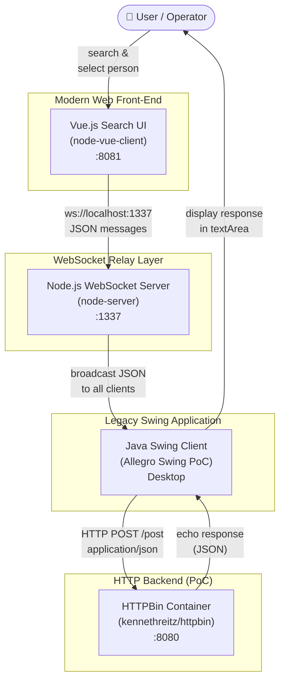

**External Interfaces Summary:**

| Partner | Protocol | Address | Direction | Description |
|---------|----------|---------|-----------|-------------|
| User Browser | HTTP | `:8081` | Inbound | Serves Vue.js SPA |
| Java Swing Client | WebSocket | `ws://localhost:1337/` | Bidirectional | Data relay between Vue UI and Swing |
| HTTPBin Container | HTTP POST | `http://localhost:8080/post` | Outbound from Swing | Receives form data; echoes it back as JSON |

### 3.2 Technical Context

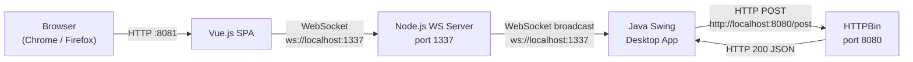

**WebSocket message envelope (Vue → Node → Swing):**

```json
{
  "target":  "textfield",
  "content": {
    "first":  "Hans",  "name": "Mayer",  "dob": "1981-01-08",
    "zip":    "95183", "ort":  "Trogen", "street": "Isaaer Str.",
    "hausnr": "23",    "knr":  "79423984",
    "zahlungsempfaenger": {
      "iban": "DE27100777770209299700",
      "bic":  "ERFBDE8E759",
      "valid_from": "2020-01-04"
    }
  }
}
```

`target` can be `"textfield"` (populate Swing form fields) or `"textarea"` (set the Swing text area free-text).

---

## 4. Solution Strategy

### 4.1 Core Architectural Decisions

| Decision | Choice | Rationale |
|----------|--------|-----------|
| Integration protocol | **WebSocket** | Enables real-time, bidirectional push from the web UI to the running Swing process without polling. |
| Relay topology | **Broadcast hub** (Node.js) | A single relay process decouples Vue client from Swing process; both only need to know the server address. |
| Swing-side architecture | **Model-View-Presenter (MVP)** | Separates UI construction (`PocView`), business logic (`PocModel`), and coordination (`PocPresenter`). |
| Data binding | **Observer / EventEmitter** | `EventEmitter` + `EventListener` provides a lightweight pub/sub mechanism for propagating model responses back to the view. |
| HTTP submission | **Direct HTTP from Swing** | The existing workflow for form submission (Anordnen action) is preserved via `HttpBinService`. |
| JSON processing | **javax.json streaming API** | Low-overhead, dependency-free JSON parsing within the existing Java EE ecosystem. |
| Frontend framework | **Vue 2 SPA** | Rapid UI prototyping for the search/select workflow; lightweight component model. |

### 4.2 Top-Level Architecture Style

The overall system follows a **three-tier messaging architecture**:

```
[Web Tier]      Vue.js SPA         →  WebSocket JSON messages
[Relay Tier]    Node.js WS Server  →  broadcast to all subscribers
[Desktop Tier]  Java Swing (MVP)   →  HTTP POST to backend
```

This demonstrates the **Strangler Fig** modernization pattern: the new web front-end gradually takes over the entry-point for users, while the legacy Swing application continues to handle transaction submission.

### 4.3 Quality Approach

| Quality Goal | Approach |
|--------------|----------|
| Interoperability | Shared WebSocket channel with documented JSON envelope (`target` + `content`). |
| Modifiability | MVP pattern in Swing; `ModelProperties` enum as single source of truth for all form fields. |
| Simplicity | Minimal infrastructure — three local processes + one Docker container; fixed port constants. |
| Correctness | Two-phase message handling: `extract()` determines target, then `toSearchResult()` maps all fields via streaming JSON parser. |

---

## 5. Building Block View

### 5.1 Level 1 — System Overview

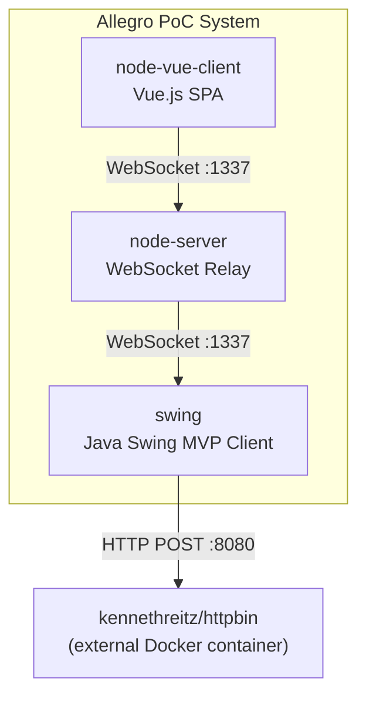

### 5.2 Level 2 — Container View

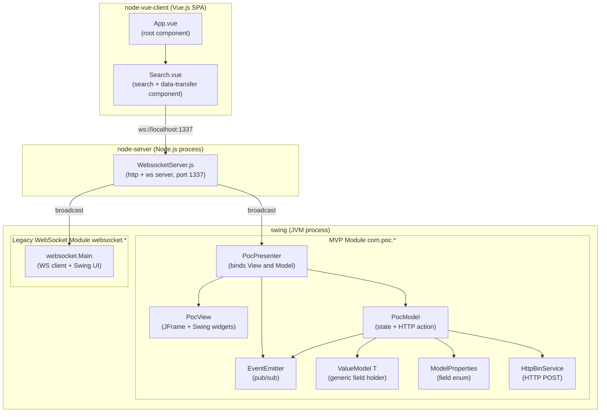

### 5.3 Level 3 — Component Detail

#### 5.3.1 `node-vue-client` — Vue.js SPA

**Purpose:** Provides the modern web-based person search UI. Allows operators to search, select, and transfer person + payment data to the running Swing client via WebSocket.

**Key component: `Search.vue`**

| Responsibility | Detail |
|----------------|--------|
| Person search form | Input fields: last, first, dob, zip, ort, street, hausnr, knr (read-only), IBAN/BIC (read-only) |
| In-memory search | `searchPerson()` filters `search_space[]` (5 hard-coded persons) by name, ZIP, city, street |
| Result display | `<table>` renders matching persons; row click calls `selectResult(item)` |
| Zahlungsempfänger table | Shows IBAN / BIC / valid-from for selected person; row click calls `zahlungsempfaengerSelected()` |
| Data transfer | "Nach ALLEGRO übernehmen" button calls `sendMessage(selected_result, 'textfield')` → WebSocket JSON |
| Textarea sync | `watch` on `internal_content_textarea` calls `sendMessage(val, 'textarea')` for every keystroke |
| WebSocket lifecycle | `connect()` opens `ws://localhost:1337/`; `disconnect()` closes it |

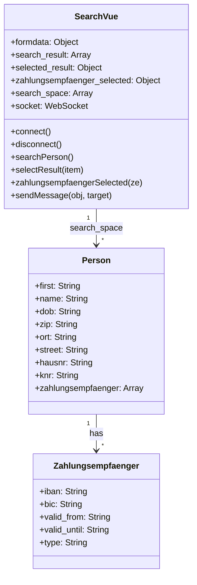

#### 5.3.2 `node-server` — WebSocket Relay

**Purpose:** Simple Node.js broadcast hub. Any UTF-8 message received from one connected client is forwarded to **all** connected clients (including the sender).

**Key characteristics:**
- Built on the `websocket` npm package (RFC 6455 compliant).
- Maintains a `clients[]` array; entries added on `request`, removed on `close`.
- Accepts connections from any origin (`request.accept(null, request.origin)`).
- No message filtering, routing, or persistence.

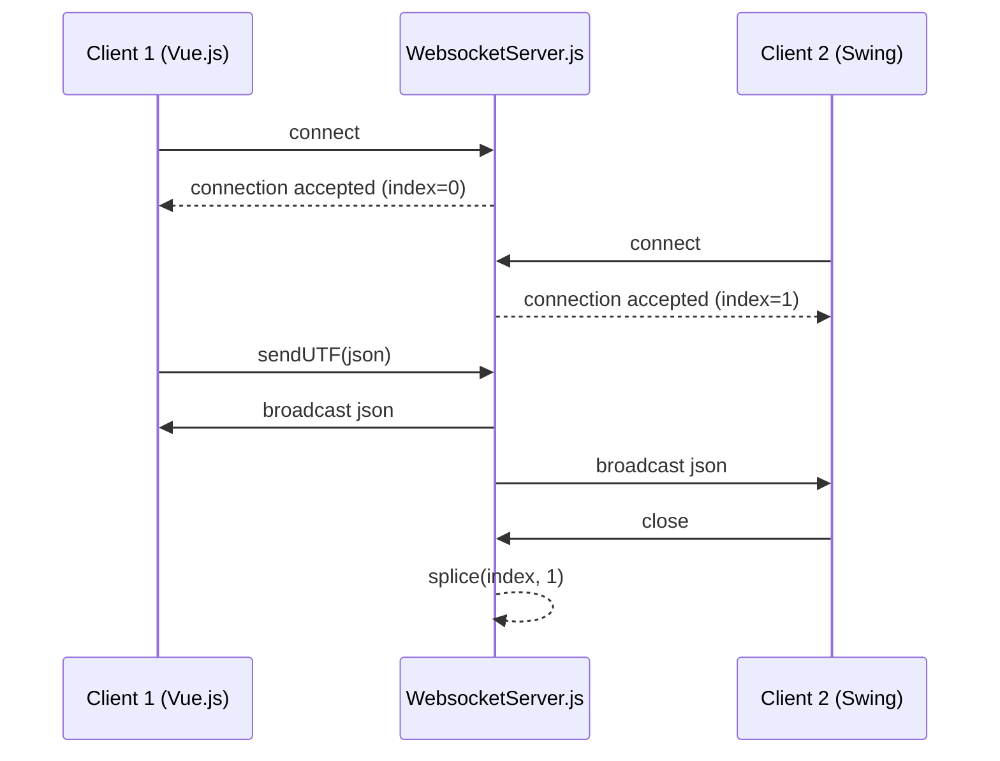

#### 5.3.3 `swing` — Java Swing MVP Client (`com.poc.*`)

**Purpose:** The modernized Java Swing application that receives person data from the Vue UI via WebSocket and submits it to the backend via HTTP POST.

**MVP triad:**

| Component | Class | Role |
|-----------|-------|------|
| View | `PocView` | Constructs and owns all Swing widgets; no logic. |
| Presenter | `PocPresenter` | Binds widget document events to `ValueModel` entries; handles button action; subscribes to `EventEmitter` to reset the view after a response. |
| Model | `PocModel` | Holds current form state in `EnumMap<ModelProperties, ValueModel<?>>` and delegates HTTP POST to `HttpBinService`. |

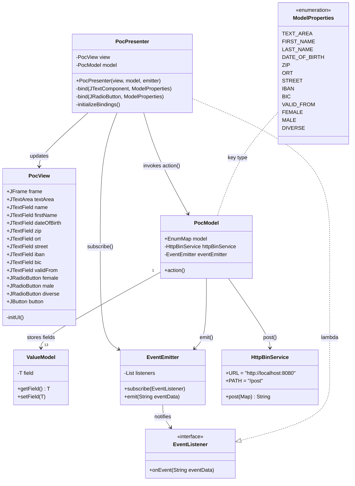

#### 5.3.4 `swing` — Legacy WebSocket Client (`websocket.Main`)

**Purpose:** The first iteration of the Swing WebSocket client — a self-contained monolithic class that combines Swing UI initialization and WebSocket endpoint logic in ~457 lines. Retained for reference / comparison.

**Key features:**
- Connects to `ws://localhost:1337/` using Tyrus `WebSocketContainer`.
- Routes received JSON messages by `target` field (`"textarea"` or `"textfield"`).
- `extract(json)` parses the routing envelope; `toSearchResult(json)` maps individual fields via streaming JSON parser.
- `SearchResult` inner class mirrors the JSON structure from Vue.js.
- `CountDownLatch` keeps the JVM alive until the WebSocket session closes.

---

## 6. Runtime View

### 6.1 Scenario 1 — Startup Sequence

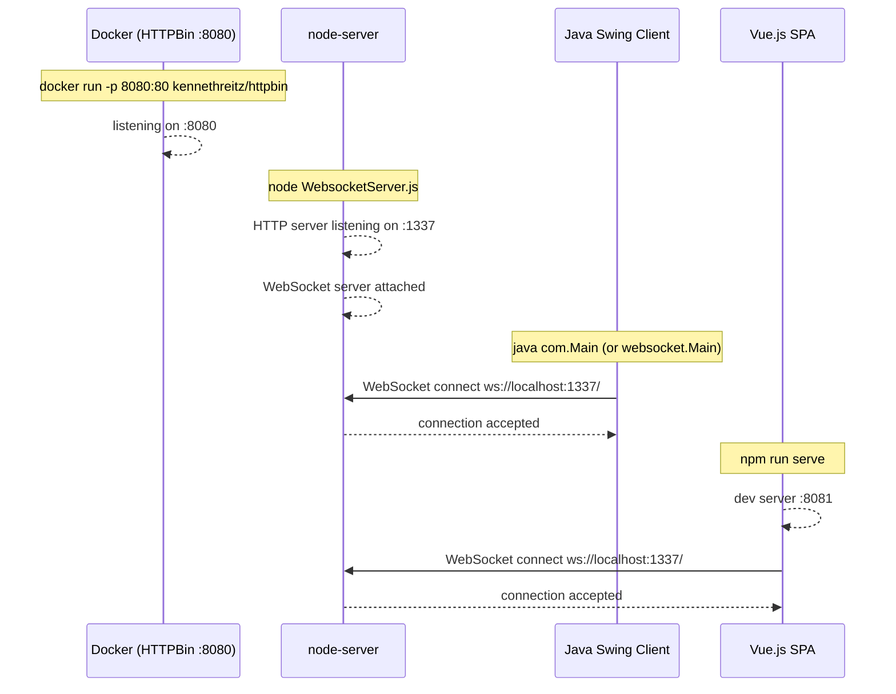

### 6.2 Scenario 2 — Person Search and Transfer to Allegro

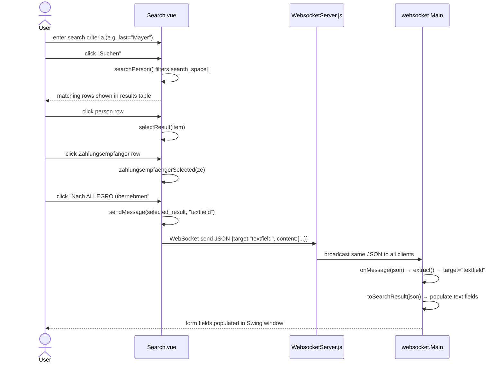

### 6.3 Scenario 3 — Form Submission (Anordnen)

```mermaid
sequenceDiagram
    actor User
    participant PV as PocView (Swing)
    participant PP as PocPresenter
    participant PM as PocModel
    participant HB as HttpBinService
    participant HTTPBin as HTTPBin :8080
    participant EE as EventEmitter

    User->>PV: click "Anordnen"
    PV->>PP: ActionListener fires
    PP->>PM: model.action()
    PM->>PM: collect all ValueModel fields into Map
    PM->>HB: post(data)
    HB->>HTTPBin: HTTP POST /post\nContent-Type: application/json\n{FIRST_NAME:"...", ...}
    HTTPBin-->>HB: HTTP 200 JSON echo response
    HB-->>PM: responseBody (String)
    PM->>EE: emit(responseBody)
    EE->>PP: onEvent(responseBody) via lambda
    PP->>PV: textArea.setText(responseBody)
    PP->>PV: clear all text fields; set female radio
    PV-->>User: Swing UI updated with server response
```

### 6.4 Scenario 4 — Textarea Broadcast

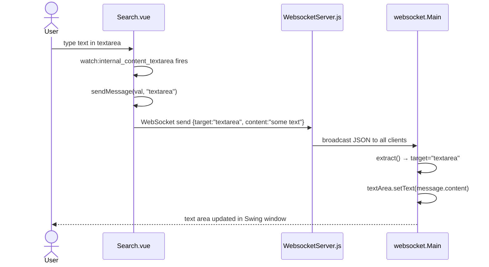

### 6.5 Business Workflow — Complete Modernized Operator Flow

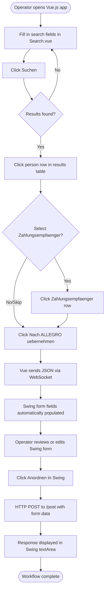

---

## 7. Deployment View

### 7.1 Local Developer Workstation (Single-Host PoC)

All components run on a single developer machine. There is no cloud infrastructure, no container orchestration, and no TLS in the PoC scope.

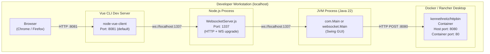

### 7.2 Startup Order

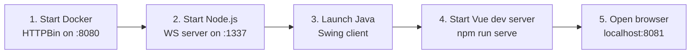

### 7.3 Port Map

| Component | Port | Protocol | Notes |
|-----------|------|----------|-------|
| HTTPBin (Docker) | 8080 | HTTP | Maps container port 80 to host 8080 |
| Node.js WebSocket Server | 1337 | HTTP/WS | WebSocket upgrade on same port |
| Vue CLI Dev Server | 8081 | HTTP | Default Vue CLI dev port |
| Java Swing Client | — | Outbound only | Initiates outbound WS and HTTP; no inbound port |

---

## 8. Crosscutting Concepts

### 8.1 Domain Model

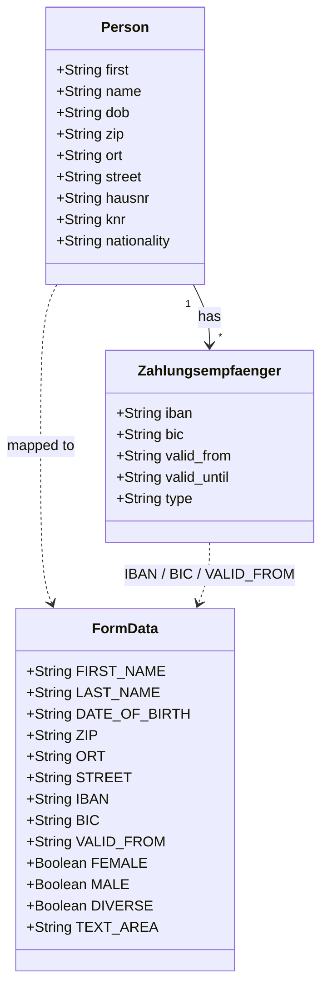

The `ModelProperties` enum in `com.poc.model` is the **authoritative definition** of all 13 form fields processed by the Swing MVP client, matching exactly the field names in the OpenAPI `PostObject` schema.

### 8.2 JSON Message Protocol

All inter-component communication uses UTF-8 JSON over WebSocket. Two message schemas exist:

**Routing envelope (Vue → Node → Swing):**
```json
{ "target": "textfield | textarea",  "content": "<String | PersonObject>" }
```

**HTTP POST payload (Swing → HTTPBin, as defined in `api.yml`):**
```json
{
  "FIRST_NAME": "...", "LAST_NAME": "...", "DATE_OF_BIRTH": "...",
  "STREET": "...",     "BIC": "...",       "ORT": "...",
  "ZIP": "...",        "FEMALE": "...",    "MALE": "...",
  "DIVERSE": "...",    "IBAN": "...",      "VALID_FROM": "...",
  "TEXT_AREA": "..."
}
```

### 8.3 Error Handling

| Component | Error Scenario | Current Handling |
|-----------|---------------|-----------------|
| `websocket.Main` | WebSocket connection failure | `RuntimeException` wraps `DeploymentException` / `IOException` |
| `PocModel.action()` | HTTP POST failure | `IOException` / `InterruptedException` re-thrown; wrapped in `RuntimeException` in presenter |
| `PocPresenter` | Button click exception | Wrapped in `RuntimeException` — no user-visible error dialog |
| `WebsocketServer.js` | Peer disconnection | `clients.splice(index, 1)` — graceful removal from broadcast list |
| `Search.vue` | WebSocket not connected | No explicit guard; browser WebSocket would throw on `send()` |

> **Note:** Error handling is intentionally minimal for a PoC. Production readiness would require proper error dialogs, retry logic, and user notifications.

### 8.4 Data Binding Pattern (Swing MVP)

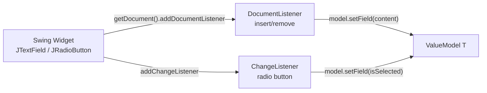

All 13 `ModelProperties` values are bound in `PocPresenter.initializeBindings()` using two overloaded `bind()` methods.

### 8.5 Observer / Event Pattern

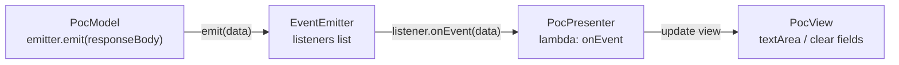

### 8.6 Logging

All logging uses `System.out.println()` to standard output. No logging framework (Log4j, SLF4J) is present. Logged events include: WebSocket open/close/message events, field change events from `DocumentListener`, HTTP response code and body from `HttpBinService`, and button click confirmations.

### 8.7 Internationalisation

The UI is entirely in **German**: field labels, gender options (Weiblich / Männlich / Divers), and action buttons (Anordnen, Suchen, Nach ALLEGRO übernehmen). No i18n framework or locale switching is implemented.

---

## 9. Architectural Decisions

### ADR-001: WebSocket as Integration Protocol

**Status:** Implemented (observed in all three components)

**Context:** The Vue.js front-end and the Java Swing desktop application run as separate processes. A mechanism is needed to push data from the web UI into the running Swing process in real-time when the user clicks "Nach ALLEGRO übernehmen".

**Decision:** Use WebSocket (RFC 6455) as the integration channel, mediated by a Node.js relay server.

**Alternatives considered:** REST polling from Swing (requires embedded HTTP server); file-based IPC (fragile, platform-specific); Java RMI (not web-friendly).

**Consequences:**
- ✅ Real-time push without polling
- ✅ Both ends only need a WebSocket client
- ⚠️ The relay server is a single point of failure
- ⚠️ No message acknowledgement — fire-and-forget delivery

---

### ADR-002: Model-View-Presenter for Swing Client

**Status:** Implemented (in `com.poc.*`)

**Context:** The legacy `websocket.Main` class mixes UI construction, WebSocket lifecycle, JSON parsing, and UI update logic in a single 457-line class, making it untestable and hard to extend.

**Decision:** Introduce an MVP triad (`PocView`, `PocPresenter`, `PocModel`) with `ValueModel<T>` for data binding and `EventEmitter` for decoupled model-to-view notification.

**Consequences:**
- ✅ View (`PocView`) is a pure UI class with no logic
- ✅ Presenter wires bindings programmatically via `ModelProperties` enum
- ✅ Model (`PocModel`) is independently testable
- ⚠️ Two entry-point classes coexist (`com.Main` and `websocket.Main`) — could confuse new developers

---

### ADR-003: Node.js Broadcast Hub

**Status:** Implemented

**Context:** A relay is needed that accepts connections from both the Vue.js browser client and the Java Swing client and routes messages between them.

**Decision:** Implement a stateless broadcast hub: every incoming UTF-8 message is forwarded to all connected clients.

**Consequences:**
- ✅ Extremely simple (~68 lines of JavaScript)
- ✅ Supports multiple Swing clients simultaneously
- ⚠️ No routing by recipient — Vue receives its own sent messages
- ⚠️ No persistence — messages sent before a client connects are lost

---

### ADR-004: HTTPBin as PoC Backend

**Status:** Implemented

**Context:** The PoC needs a backend endpoint to demonstrate HTTP POST submission and display the echoed result. Building a real backend was out of scope.

**Decision:** Use the `kennethreitz/httpbin` Docker image, which echoes any POST body back as JSON.

**Consequences:**
- ✅ Zero backend development effort
- ✅ Echo response allows visual verification of all submitted fields
- ⚠️ Cannot be used in production — no persistence, business logic, or security
- ⚠️ The `kennethreitz/httpbin` image is archived; consider `mccutchen/go-httpbin` as replacement

---

### ADR-005: Hard-coded In-Memory Search Space

**Status:** Implemented (in `Search.vue`)

**Context:** The PoC needs realistic-looking search data without requiring a database or search API.

**Decision:** Embed 5 hard-coded person records (with Zahlungsempfänger sub-arrays) directly in Vue component `data()`.

**Consequences:**
- ✅ No additional infrastructure required; deterministic demo results
- ⚠️ Cannot scale; data changes require code edits
- ⚠️ Contains fictitious but realistic-looking IBAN/BIC values — must not be confused with real banking data

---

## 10. Quality Requirements

### 10.1 Quality Tree

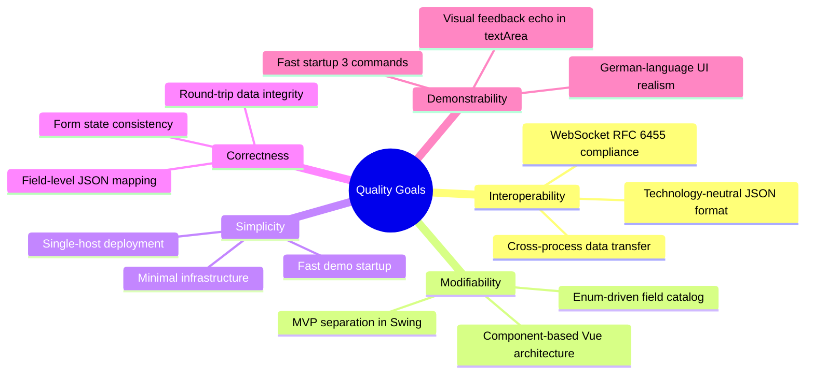

### 10.2 Quality Scenarios

| ID | Quality Attribute | Scenario | Expected Measure |
|----|-------------------|----------|-----------------|
| QS-01 | Interoperability | User clicks "Nach ALLEGRO übernehmen"; all 10 person/payment fields appear in Swing | < 1 s end-to-end on localhost |
| QS-02 | Interoperability | Vue.js and Swing start in any order after the relay server | Both connect successfully; no startup-order dependency between clients |
| QS-03 | Modifiability | Developer adds a new form field (e.g. `EMAIL`) to the Swing MVP client | One enum entry + two `bind()` calls + one widget ≤ 30 min effort |
| QS-04 | Correctness | All 13 `ModelProperties` values are serialised and sent in the HTTP POST | 100% field coverage confirmed by HTTPBin echo |
| QS-05 | Correctness | Textarea content with German umlauts is displayed correctly in Swing | UTF-8 encoding preserved end-to-end |
| QS-06 | Simplicity | New developer runs the PoC for the first time following the README | < 15 minutes to first successful demo |
| QS-07 | Demonstrability | HTTPBin response visible in Swing textArea after clicking "Anordnen" | Echo visible < 2 seconds |

---

## 11. Risks and Technical Debt

### 11.1 Technical Risks

| ID | Risk | Probability | Impact | Mitigation |
|----|------|-------------|--------|------------|
| R-01 | WebSocket relay is a single point of failure | High | High | Replace with a robust message broker (NATS, RabbitMQ) with persistence and ACK for production. |
| R-02 | Broadcast hub echoes messages back to sender | Medium | Low | Vue ignores received messages (no `onmessage` handler); Swing does not send, so no loop risk in current PoC. |
| R-03 | Java 22 unnamed variable (`var _`) breaks on older JVMs | Medium | Medium | Pin JDK version in CI; document minimum SDK requirement prominently. |
| R-04 | `kennethreitz/httpbin` Docker image is archived | Low | Medium | Switch to `mccutchen/go-httpbin` as a maintained drop-in replacement. |
| R-05 | No error dialog in Swing on HTTP failure | High | Medium | Add `JOptionPane` error handling in `PocPresenter` to surface failures to the user. |
| R-06 | Vue WebSocket connection is never retried on drop | High | Medium | Add `socket.onclose` handler with exponential-backoff reconnect logic. |

### 11.2 Technical Debt

| ID | Type | Description | Priority | Effort |
|----|------|-------------|----------|--------|
| TD-01 | Design Debt | Two entry-point classes (`com.Main` and `websocket.Main`) with overlapping functionality. `websocket.Main` is the legacy prototype and should be retired. | High | 2 h |
| TD-02 | Code Debt | `websocket.Main` uses stateful boolean flags for JSON streaming parsing — fragile and verbose. Should use Jackson or Gson. | High | 4 h |
| TD-03 | Code Debt | `HttpBinService.post()` manually iterates map fields via `javax.json.stream.JsonGenerator`. Error-prone for complex or nested types. | Medium | 3 h |
| TD-04 | Test Debt | Zero automated tests across all three components. Minimum viable set: unit tests for `PocModel.action()`, `extract()`, `toSearchResult()`; WS round-trip integration test. | High | 16 h |
| TD-05 | Infrastructure Debt | All connection URIs and ports are hard-coded strings. Should be externalised to environment variables or config files. | Medium | 2 h |
| TD-06 | Security Debt | WebSocket server accepts connections from any origin. Origin validation is required for any multi-host or production scenario. | Medium | 1 h |
| TD-07 | Architecture Debt | `PocModel.model` field is `public` — breaks encapsulation. Should be private with typed accessor methods. | Low | 1 h |
| TD-08 | UX Debt | Search.vue has no loading indicator, no "no results" message, and no input validation feedback. | Low | 4 h |
| TD-09 | Code Debt | `ViewData.java` is an empty placeholder class — dead code. Should be removed or implemented. | Low | 0.5 h |

### 11.3 Improvement Recommendations

1. **Retire `websocket.Main`** — Consolidate to the MVP-based `com.Main`. Add WebSocket receive capability to `PocPresenter` so the MVP client can also receive Vue search results.
2. **Introduce Jackson or Gson** — Replace manual `javax.json` streaming parsing to reduce boilerplate and improve type-safety.
3. **Replace HTTPBin with a real stub** — Implement a minimal Spring Boot or Express.js endpoint for a production-like integration test.
4. **Add reconnect logic** — Both the Java WebSocket client and Vue `connect()` should handle disconnects with exponential-backoff retry.
5. **Extract configuration** — Move all hard-coded hosts, ports, and paths to `.env` (Vue) and `application.properties` or environment variables (Java).
6. **Add basic CI** — At minimum, Maven `verify` and `npm run lint` in a GitHub Actions workflow.

---

## 12. Glossary

### 12.1 Domain Terms

| Term | Definition |
|------|------------|
| Allegro | The legacy VendorApp desktop system being modernized; appears as the JFrame title in the Swing client. |
| Anordnen | German: "to order / arrange". The Swing button that triggers form submission (HTTP POST). |
| BIC | Bank Identifier Code — international code identifying a bank in financial transactions. |
| DATE_OF_BIRTH (Geburtsdatum) | Date of birth of the person in the form (string; no validated format in PoC). |
| Gültig ab (VALID_FROM) | German: "valid from". The effective start date of a Zahlungsempfänger record. |
| Geschlecht | German: "gender". Represented as mutually exclusive radio buttons: Weiblich (female), Männlich (male), Divers (diverse). |
| IBAN | International Bank Account Number — uniquely identifies a bank account across borders. |
| Knr (Kundennummer) | Customer number — unique identifier for a person record; read-only in the Vue UI. |
| Nach ALLEGRO übernehmen | German: "Transfer to Allegro". Vue button that sends selected person data via WebSocket to the Swing client. |
| Ort | German: "city / place". Address field for the person's city of residence. |
| PLZ (ZIP) | Postleitzahl — German postal code (5 digits). |
| RT | Label on the Swing text area (likely abbreviates "Rückmeldung" — response / feedback area). |
| Strasse | German: "street". Address field. |
| Suchen | German: "search". Button in Vue UI to trigger in-memory person search. |
| Vorname (FIRST_NAME) | German: "first name". |
| Zahlungsempfänger | German: "payment recipient". A bank account record (IBAN + BIC + validity period) associated with a person. |

### 12.2 Technical Terms

| Term | Definition |
|------|------------|
| Broadcast Hub | A WebSocket server topology where every message received is forwarded to all connected clients. |
| CountDownLatch | A Java concurrency utility used to block the main thread until a condition (here: WebSocket session close) is met. |
| DocumentListener | Swing interface (`javax.swing.event.DocumentListener`) that notifies of text changes in a `JTextComponent`. |
| EnumMap | A Java `Map` implementation optimised for enum keys; used in `PocModel` to hold `ModelProperties → ValueModel<?>` pairs. |
| EventEmitter | Lightweight pub/sub implementation in `com.poc.model`; holds a list of `EventListener` callbacks. |
| GridBagLayout | Flexible Swing layout manager used in `PocView` and `websocket.Main` to position form widgets. |
| HTTPBin | Open-source HTTP request/response service that echoes incoming requests; used as a mock backend. |
| javax.json streaming API | The JSR-374 streaming JSON parser used in the Java client for low-overhead JSON reading. |
| ModelProperties | Enum in `com.poc.model` enumerating all 13 logical form fields; the single source of truth for field identity. |
| MVP (Model-View-Presenter) | UI design pattern separating data (Model), rendering (View), and coordination (Presenter). |
| OpenAPI 3.0.1 | Specification standard for describing REST APIs; used in `api.yml` to document the `/post` endpoint. |
| RFC 6455 | The WebSocket protocol standard, implemented by both the `websocket` npm package and GlassFish Tyrus. |
| SPA (Single-Page Application) | Web app architecture where the entire application is a single HTML page with dynamic content updates. |
| Strangler Fig Pattern | Architectural migration pattern where new functionality gradually replaces legacy functionality while both coexist. |
| Tyrus | GlassFish reference implementation of the Java WebSocket API (JSR-356); used as the WebSocket client library. |
| ValueModel\<T\> | Generic wrapper class holding a single typed field value; used for two-way data binding between Swing widgets and the model. |
| Vue CLI | Vue.js command-line tool (`@vue/cli-service`) for project scaffolding, development server, and production builds. |
| WebSocket | Full-duplex communication protocol over a single TCP connection (RFC 6455); provides real-time bidirectional messaging. |

---

## Appendix

### A. Source File Inventory

| Component | File | Language | Purpose |
|-----------|------|----------|---------|
| Root | `README.md` | Markdown | Project setup guide |
| Root | `api.yml` | YAML/OpenAPI 3.0.1 | REST endpoint definition |
| Root | `pom.xml` | XML/Maven | Java project build (Java 22) |
| Root | `WebsocketSwingClient.launch` | XML/Eclipse | Eclipse run configuration |
| node-server | `src/WebsocketServer.js` | JavaScript | WebSocket broadcast relay |
| node-server | `package.json` | JSON | Node.js deps (`websocket ^1.0.35`) |
| node-server | `doc/Readme.txt` | Text | Start instructions |
| node-vue-client | `src/main.js` | JavaScript | Vue app bootstrap |
| node-vue-client | `src/App.vue` | Vue SFC | App shell with header |
| node-vue-client | `src/components/Search.vue` | Vue SFC | Search + WebSocket + transfer logic |
| node-vue-client | `public/index.html` | HTML | SPA mount point |
| node-vue-client | `package.json` | JSON | Vue 2, ESLint, Babel config |
| node-vue-client | `babel.config.js` | JavaScript | Babel preset for Vue CLI |
| node-vue-client | `doc/Readme.txt` | Text | Vue CLI install + start instructions |
| swing | `src/main/java/websocket/Main.java` | Java | Monolithic WS client + Swing UI (legacy) |
| swing | `src/main/java/com/Main.java` | Java | MVP wiring entry point |
| swing | `src/main/java/com/poc/ValueModel.java` | Java | Generic typed field holder |
| swing | `src/main/java/com/poc/model/ModelProperties.java` | Java | Enum of all 13 form field keys |
| swing | `src/main/java/com/poc/model/PocModel.java` | Java | Form state + HTTP POST action |
| swing | `src/main/java/com/poc/model/HttpBinService.java` | Java | HTTP POST client |
| swing | `src/main/java/com/poc/model/EventEmitter.java` | Java | Pub/sub event dispatcher |
| swing | `src/main/java/com/poc/model/EventListener.java` | Java | Callback interface |
| swing | `src/main/java/com/poc/model/ViewData.java` | Java | Empty placeholder class |
| swing | `src/main/java/com/poc/presentation/PocView.java` | Java | Swing UI construction |
| swing | `src/main/java/com/poc/presentation/PocPresenter.java` | Java | MVP coordinator + data bindings |
| swing | `src/main/java/com/README.md` | Markdown | Docker prerequisite note |

### B. Dependency Summary

| Component | Dependency | Version | Purpose |
|-----------|------------|---------|---------|
| swing | `tyrus-standalone-client` | 1.15 | WebSocket client runtime |
| swing | `websocket-api` (GlassFish) | 0.2 | WebSocket API interfaces |
| swing | `tyrus-websocket-core` | 1.2.1 | Tyrus core |
| swing | `tyrus-spi` | 1.15 | Tyrus SPI |
| swing | `javax.json-api` | 1.1.4 | JSON API (JSR-374) |
| swing | `javax.json` (GlassFish) | 1.0.4 | JSON implementation |
| node-server | `websocket` | ^1.0.35 | RFC 6455 WebSocket server |
| node-vue-client | `vue` | ^2.6.10 | UI framework |
| node-vue-client | `core-js` | ^3.1.2 | ES polyfills |
| node-vue-client | `@vue/cli-service` | ^4.0.0 | Build tooling |
| node-vue-client | `babel-eslint` | ^10.0.1 | JavaScript linting |
| External | `kennethreitz/httpbin` | latest | Mock HTTP echo backend (Docker) |

### C. Architecture Evolution Path

The PoC demonstrates **Stage 1** of a multi-step modernization journey:

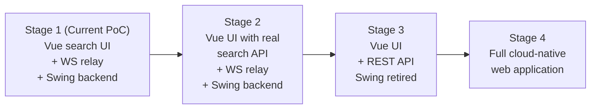

---

*This document was generated from source code analysis of the `websocket_swing` (Allegro PoC) repository.
All diagrams use [Mermaid](https://mermaid.js.org/) syntax and render natively in GitHub, GitLab, and most modern Markdown viewers.*
