# Allegro Modernization PoC — Architecture Documentation

**Version:** 1.0  
**Date:** 2025-01-30  
**Status:** Generated from code analysis  
**Template:** arc42 (https://arc42.org)

> **Note:** This file lives in the repository root. To move it to `docs/`:
> ```bash
> mkdir -p docs && mv arc42-architecture.md docs/
> ```

---

## Table of Contents

1. [Introduction and Goals](#1-introduction-and-goals)
2. [Constraints](#2-constraints)
3. [Context and Scope](#3-context-and-scope)
4. [Solution Strategy](#4-solution-strategy)
5. [Building Block View](#5-building-block-view)
6. [Runtime View](#6-runtime-view)
7. [Deployment View](#7-deployment-view)
8. [Crosscutting Concepts](#8-crosscutting-concepts)
9. [Architecture Decisions](#9-architecture-decisions)
10. [Quality Requirements](#10-quality-requirements)
11. [Risks and Technical Debt](#11-risks-and-technical-debt)
12. [Glossary](#12-glossary)

---

## 1. Introduction and Goals

### 1.1 Requirements Overview

This system is a **Proof of Concept (PoC)** for modernizing the *Allegro* application — a German
social-insurance / benefits-administration desktop system. The PoC demonstrates how a legacy Java
Swing desktop client can be progressively replaced by a modern browser-based Vue.js front end,
while **both clients coexist and share data in real time** through a WebSocket message relay.

The system delivers the following key capabilities:

| # | Capability | Description |
|---|---|---|
| 1 | **Person Search** | Search insured persons by name, first name, ZIP code, city, or street address |
| 2 | **Person Data Display** | Show master data (name, date of birth, address, gender) and associated payment-recipient records (IBAN, BIC, valid-from date) |
| 3 | **Transfer to Allegro** | Push a selected person record from the web client into the legacy Allegro Swing form fields in real time via WebSocket |
| 4 | **Free-text Relay** | Relay arbitrary text typed in the web client textarea to the Allegro desktop RT (rich-text) field |
| 5 | **HTTP POST Submission** | Submit form data from the Swing client to an HTTP backend service as JSON |
| 6 | **Real-time Broadcast** | Broadcast any WebSocket message to all currently connected clients simultaneously |

### 1.2 Quality Goals

The following quality goals were derived from the architecture and code:

| Priority | Quality Goal | Motivation |
|---|---|---|
| 1 | **Evolvability / Modernizability** | Core purpose: prove that an incremental web-UI replacement is feasible without disrupting existing Allegro workflows. |
| 2 | **Interoperability** | Swing client and Vue.js client must interoperate seamlessly through a technology-agnostic JSON/WebSocket protocol. |
| 3 | **Maintainability** | The refactored Swing module uses the MVP pattern to separate concerns, reducing change-risk for ongoing development. |
| 4 | **Simplicity** | As a PoC, minimal complexity is preferred — only well-known, off-the-shelf components. |
| 5 | **Testability** | The MVP decomposition and `EventEmitter`/`EventListener` decoupling enable unit-testing of model and presenter in isolation. |

### 1.3 Stakeholders

| Role | Expectations |
|---|---|
| **Product Owner / Allegro Team** | Validated proof that a modern web UI can replace or supplement the Swing client with minimal disruption |
| **Developers** | Clear architectural structure, runnable local setup, understandable message protocol |
| **Software Architect** | Demonstrable separation of concerns, clean MVP structure, documented integration points |
| **Operations / DevOps** | Simple Docker-based local startup, no complex infrastructure needed for the PoC |
| **End Users (Insurance Clerks)** | Familiar Allegro form fields populated automatically from the web search — minimal learning curve |

---

## 2. Constraints

### 2.1 Technical Constraints

| Constraint | Detail |
|---|---|
| **Java ≥ 22.0.1** | Swing client requires Java 22; configured in `pom.xml` via `<source>22</source>` / `<target>22</target>` |
| **Apache Maven** | Java project is managed with Maven (`pom.xml`) |
| **Node.js runtime** | WebSocket relay server (`node-server`) and Vue CLI toolchain require a Node.js installation |
| **Vue.js 2.x** | Web client is built with Vue 2.6; cannot trivially use Vue 3 APIs without migration |
| **WebSocket protocol (RFC 6455)** | All real-time communication relies on WebSocket at `ws://localhost:1337/` |
| **HTTPBin on port 8080** | `kennethreitz/httpbin` Docker image serves as mock HTTP backend; must be running before the MVP Swing client starts |
| **Local network only** | All endpoints (`localhost:1337`, `localhost:8080`) are configured for local development only — no TLS, no authentication |
| **`websocket` npm package v1.0.35** | Node.js WebSocket server depends on this community library |
| **GlassFish Tyrus 1.15** | Java WebSocket client uses the Tyrus standalone client implementation (JSR-356) |
| **`javax.json` 1.1.4** | JSON-P streaming API used for both JSON generation (model → HTTP) and parsing (WebSocket messages) |

### 2.2 Organizational Constraints

| Constraint | Detail |
|---|---|
| **PoC scope** | Explicitly a proof-of-concept; not production-ready. Security hardening, scalability, and full test coverage are out of scope. |
| **IDE** | IntelliJ IDEA is recommended for the Java module; Eclipse launch configuration (`WebsocketSwingClient.launch`) is also provided |
| **Docker requirement** | Docker Desktop or Rancher Desktop must be running to start the HTTPBin mock backend |
| **German domain language** | Business labels (form fields, UI text, button labels) are in German, reflecting the target user base |

### 2.3 Conventions

| Convention | Detail |
|---|---|
| **Package structure** | Java packages follow `com.poc.{layer}` for the MVP module; the legacy WebSocket experiment lives in the `websocket` package |
| **MVP naming** | Presenter, View, and Model classes are explicitly suffixed: `PocPresenter`, `PocView`, `PocModel` |
| **WebSocket message envelope** | `{ "target": "<identifier>", "content": <payload> }` |
| **API field naming** | Fields use `UPPER_SNAKE_CASE` (e.g., `FIRST_NAME`, `DATE_OF_BIRTH`) matching the `ModelProperties` enum |
| **Vue data binding** | Components use `v-model` for two-way binding; `v-on:click` / `watch` for event handling |

---

## 3. Context and Scope

### 3.1 Business Context

The Allegro PoC bridges a legacy desktop environment with a modern web stack. The web client gives
insurance clerks a browser-based search interface. When a clerk selects a person and clicks
**"Nach ALLEGRO übernehmen"** (Transfer to Allegro), the data is relayed in real time to the
legacy Allegro Swing application running on the same workstation.

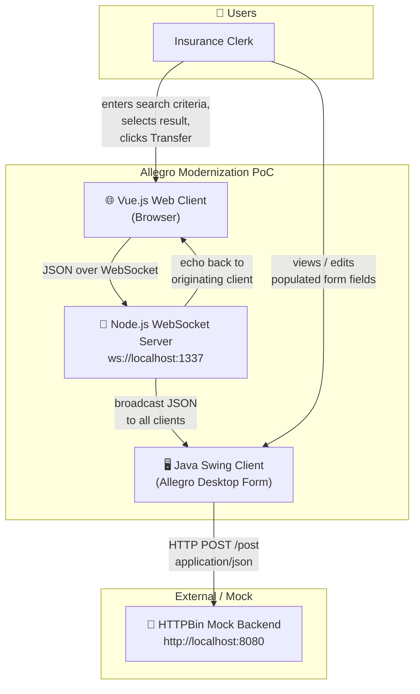

**External Interfaces:**

| Partner | Protocol / Interface | Direction | Description |
|---|---|---|---|
| **Insurance Clerk (web)** | Browser UI (Vue.js SPA) | User → System | Search persons, select result, transfer to Allegro |
| **Insurance Clerk (desktop)** | Swing Desktop UI | System → User | Receive and display person data pushed from web search |
| **HTTPBin Mock Backend** | REST `POST /post` — `application/json` | System → External | Swing client submits form data; HTTPBin echoes it back (mock of real Allegro backend) |

### 3.2 Technical Context

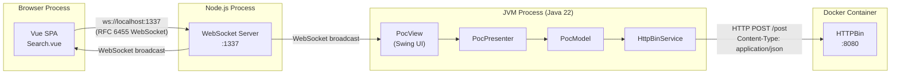

---

## 4. Solution Strategy

### 4.1 Key Technology Decisions

| Decision | Technology | Rationale |
|---|---|---|
| **Real-time bridge protocol** | WebSocket (RFC 6455) | Bidirectional, low-latency; natively supported by browsers and Java (JSR-356 / Tyrus) |
| **WebSocket relay** | Node.js + `websocket` npm | Lightweight, fast to set up; acts as a pure message broker without domain logic |
| **Legacy UI preservation** | Java Swing + Maven | Retains Allegro look-and-feel; no migration risk in PoC phase |
| **Modern web UI** | Vue.js 2 SPA | Productive component model; independent of legacy code |
| **Mock backend** | HTTPBin (Docker) | Zero-effort HTTP echo service; validates JSON serialization end-to-end |
| **API contract** | OpenAPI 3.0.1 (`api.yml`) | Formalizes the POST data schema; enables future code generation |
| **Swing architecture pattern** | MVP (Model-View-Presenter) | Separates Swing widget code from domain logic; improves testability |
| **Java build** | Apache Maven | Standard enterprise Java build tool with dependency management |

### 4.2 Architectural Approach — Strangler Fig / Progressive Replacement

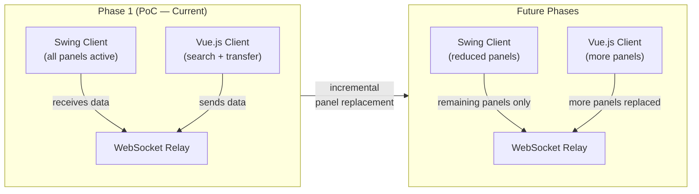

The strategy: the legacy Swing client continues running. A thin WebSocket relay is introduced as a
hub. A modern Vue.js client connects to the same relay. Data flows from the new client to the
legacy client in real time, removing re-keying. Over time, more Swing panels are replaced by web
views while the relay keeps them in sync.

### 4.3 How the Strategy Addresses Quality Goals

| Quality Goal | Approach |
|---|---|
| **Evolvability** | WebSocket relay decouples clients — either can be replaced independently; OpenAPI contract stabilizes the backend interface |
| **Interoperability** | JSON-over-WebSocket is technology-neutral; any future client (React, Angular, mobile) plugs into the same relay |
| **Maintainability** | MVP isolates Swing widget code (`PocView`) from business logic (`PocModel`) and coordination (`PocPresenter`) |
| **Simplicity** | No framework magic: plain Node.js, plain Vue 2, plain `java.net.HttpURLConnection` |
| **Testability** | `EventEmitter`/`EventListener` decouples model actions from UI callbacks; `PocModel` and `PocPresenter` testable without a running Swing frame |

---

## 5. Building Block View

### 5.1 Level 1 — System Overview

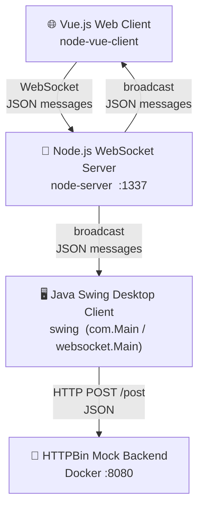

| Building Block | Technology | Primary Responsibility |
|---|---|---|
| **Vue.js Web Client** | Vue 2, Vue CLI, browser WebSocket API | Person search UI; sends selected person + payment-recipient data to relay |
| **Node.js WebSocket Server** | Node.js, `websocket` npm | Stateless message relay; broadcasts every received message to all connected clients |
| **Java Swing Desktop Client** | Java 22, Swing, Tyrus, javax.json | Receives person data from relay; renders Allegro form; submits form data to HTTP backend |
| **HTTPBin Mock Backend** | Docker `kennethreitz/httpbin` | Echoes HTTP POST payloads; simulates Allegro backend for PoC validation |

---

### 5.2 Level 2 — Vue.js Web Client (node-vue-client)

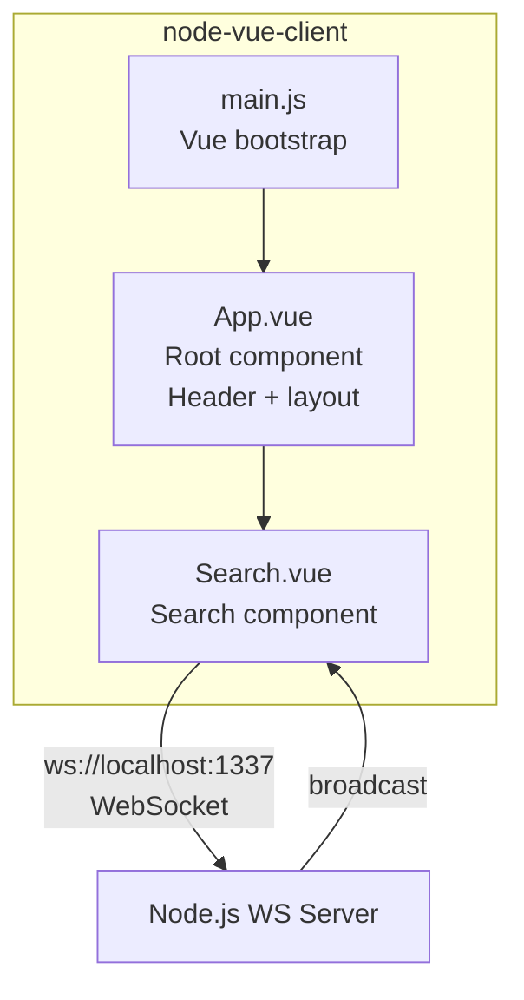

| Component | File | Responsibility |
|---|---|---|
| **main.js** | `src/main.js` | Bootstrap Vue 2 instance; mount into `#app` DOM element |
| **App.vue** | `src/App.vue` | Root layout: branded header (red, "Search Mock"), renders `<Search>` component |
| **Search.vue** | `src/components/Search.vue` | Full person-search form; result tables; Zahlungsempfänger selection; WebSocket send/receive |

#### Search.vue — Detailed Responsibilities

| Concern | Implementation |
|---|---|
| **In-memory search dataset** | Hardcoded `search_space[]` of 5 persons with German names, addresses, IBANs |
| **Multi-field search** | Filters on: last name, first name, ZIP, city, street, house number (case-insensitive `indexOf`) |
| **Person selection** | `selectResult(item)` → sets `selected_result`; row highlighted blue |
| **Payment-recipient selection** | `zahlungsempfaengerSelected(item)` → sets `zahlungsempfaenger_selected`; row highlighted green |
| **Transfer to Allegro** | `sendMessage(selected_result, "textfield")` → sends JSON envelope via WebSocket |
| **Textarea relay** | `watch: internal_content_textarea` → sends `{target:"textarea", content:<text>}` on every keystroke |
| **WebSocket lifecycle** | `connect()` on `mounted()`; `disconnect()` available manually |

---

### 5.3 Level 2 — Node.js WebSocket Server (node-server)

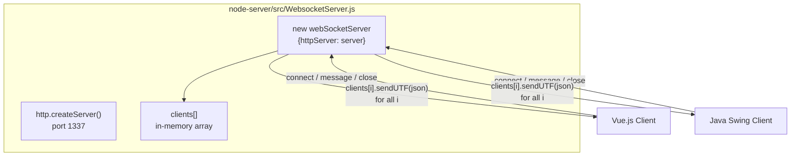

| Element | Description |
|---|---|
| **http.Server (port 1337)** | Plain Node.js HTTP server; serves as the WebSocket protocol upgrade target |
| **WebSocketServer** | `websocket.server` wrapping the HTTP server; handles `request`, `message`, and `close` events |
| **`clients[]`** | In-memory array of active WebSocket connection objects; used for fan-out broadcast |

**Broadcast rule:** every UTF-8 message received on any connection is immediately forwarded
as-is to *all* currently connected clients, including the original sender.

---

### 5.4 Level 2 — Java Swing Desktop Client, MVP Module (com.poc)

This is the **canonical** Swing implementation following the Model-View-Presenter pattern.

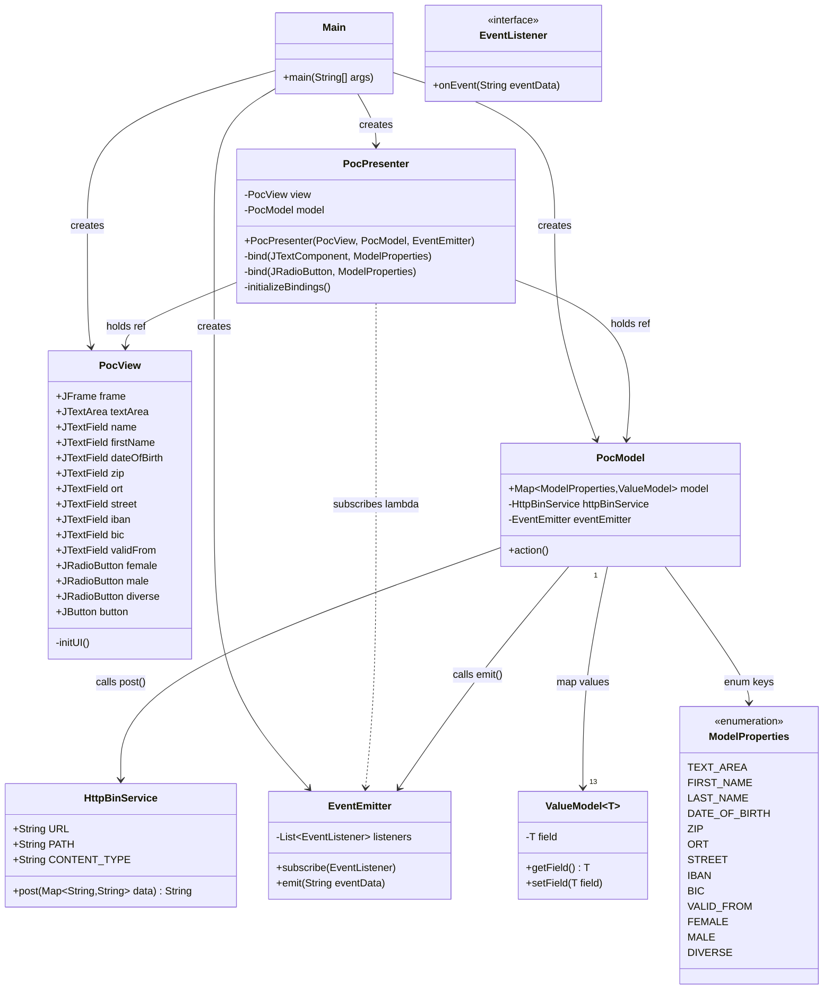

| Class | Package | Responsibility |
|---|---|---|
| `Main` | `com` | Entry point; wires View, Model, Presenter, EventEmitter; blocks with `CountDownLatch` |
| `PocView` | `com.poc.presentation` | All Swing widget construction and layout; zero business logic |
| `PocPresenter` | `com.poc.presentation` | Two-way data binding View ↔ Model; handles "Anordnen" button action |
| `PocModel` | `com.poc.model` | Holds domain state as `Map<ModelProperties, ValueModel<?>>`; triggers HTTP POST on `action()` |
| `EventEmitter` | `com.poc.model` | Simple observable: notifies all registered `EventListener`s with a string payload |
| `EventListener` | `com.poc.model` | Callback interface; implemented by `PocPresenter` (lambda) to update View on HTTP response |
| `HttpBinService` | `com.poc.model` | Sends all model field values as JSON to `http://localhost:8080/post`; returns response body |
| `ModelProperties` | `com.poc.model` | Enum of all 13 bindable form fields; acts as typed keys for the model map |
| `ValueModel<T>` | `com.poc` | Generic mutable wrapper for a single observable field value |

---

### 5.5 Level 2 — Java Swing Desktop Client, Legacy Module (websocket package)

A second, monolithic Swing implementation exists at `swing/src/main/java/websocket/Main.java`.
This is the **earlier prototype** written before the MVP refactoring. It is retained in the
codebase as a reference but is superseded by `com.Main`.

```mermaid
classDiagram
    class Main {
        -JFrame frame
        -JTextArea textArea
        -JTextField tf_name, tf_first, tf_dob
        -JTextField tf_zip, tf_ort, tf_street, tf_hausnr
        -JTextField tf_ze_iban, tf_ze_bic, tf_ze_valid_from
        -JRadioButton rb_female, rb_male, rb_diverse
        -JsonParserFactory jsonParserFactory
        +main(String[] args)
        -initUI()
        +static extract(String json) Message
        +static toSearchResult(String json) SearchResult
    }

    class WebsocketClientEndpoint {
        <<ClientEndpoint>>
        -Session userSession
        +onOpen(Session)
        +onClose(Session, CloseReason)
        +onMessage(String json)
        +sendMessage(String)
    }

    class Message {
        +String target
        +String content
    }

    class SearchResult {
        +String name, first, dob
        +String zip, ort, street, hausnr
        +String ze_iban, ze_bic, ze_valid_from
    }

    Main +-- WebsocketClientEndpoint
    Main +-- Message
    Main +-- SearchResult
    Main --> WebsocketClientEndpoint : creates
```

This class connects to `ws://localhost:1337/` using Tyrus JSR-356 and populates static Swing text
fields based on the `target` field in received JSON messages. There is no HTTP POST in this module
— it is exclusively a WebSocket receiver.

---

## 6. Runtime View

### 6.1 Primary Scenario: Person Search and Transfer to Allegro

The core use case — the insurance clerk finds a person in the web client and pushes the data
into the Allegro desktop form.

```mermaid
sequenceDiagram
    actor Clerk
    participant Vue as Vue.js Web Client<br/>(Search.vue)
    participant WS  as Node.js WebSocket Server<br/>(:1337)
    participant Swing as Java Swing Client<br/>(Allegro Desktop)

    Note over Vue,WS: Application startup
    Vue  ->> WS  : WebSocket connect  ws://localhost:1337/
    WS   -->> Vue  : Connection accepted (index pushed to clients[])
    Swing ->> WS  : WebSocket connect  ws://localhost:1337/
    WS   -->> Swing : Connection accepted (index pushed to clients[])

    Note over Clerk,Vue: Person search
    Clerk ->> Vue  : Enter search criteria
    Vue   ->> Vue  : searchPerson() — iterate search_space[], apply filters
    Vue   -->> Clerk : Render matching rows in #search_result table

    Note over Clerk,Vue: Select person and payment recipient
    Clerk ->> Vue  : Click person row
    Vue   ->> Vue  : selectResult(item) → selected_result = item
    Vue   -->> Clerk : Highlight row blue; populate #search_result_zahlungsempfänger table
    Clerk ->> Vue  : Click Zahlungsempfänger row
    Vue   ->> Vue  : zahlungsempfaengerSelected(item) → zahlungsempfaenger_selected = item
    Vue   -->> Clerk : Highlight payment-recipient row green

    Note over Clerk,Swing: Transfer to Allegro
    Clerk ->> Vue  : Click "Nach ALLEGRO übernehmen"
    Vue   ->> Vue  : sendMessage(selected_result, "textfield")<br/>Deep-clone object, attach zahlungsempfaenger_selected
    Vue   ->> WS   : ws.send( JSON.stringify({target:"textfield", content:{...}} ) )
    WS    ->> WS   : for i in clients[]: clients[i].sendUTF(json)
    WS    ->> Swing : Deliver JSON message
    WS    ->> Vue  : Echo back to sender
    Swing ->> Swing : onMessage(json)<br/>→ extract() reads target="textfield"<br/>→ toSearchResult(content)
    Swing ->> Swing : Populate tf_name, tf_first, tf_dob<br/>tf_zip, tf_ort, tf_street, tf_hausnr<br/>tf_ze_iban, tf_ze_bic, tf_ze_valid_from
    Swing -->> Clerk : Allegro form fields populated ✓
```

---

### 6.2 Scenario: Free-text Textarea Relay

The clerk types in the Vue.js textarea; text appears in the Allegro RT field.

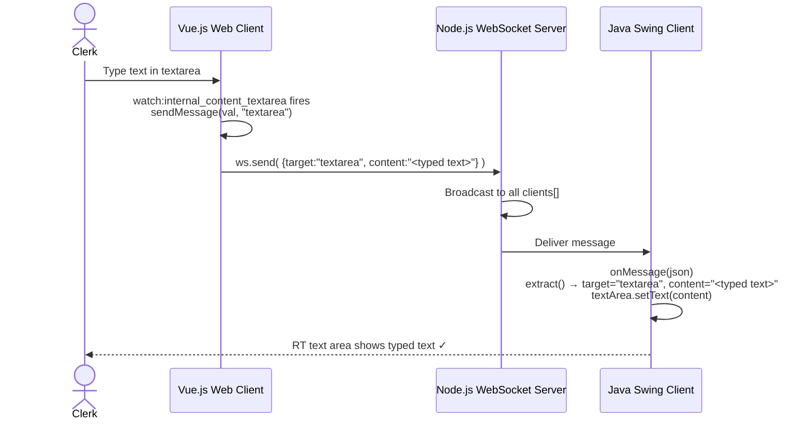

---

### 6.3 Scenario: Swing MVP Form Submission to HTTPBin

This scenario uses the newer MVP-based Swing client (`com.poc.*`).

```mermaid
sequenceDiagram
    actor Clerk
    participant View      as PocView<br/>(Swing widgets)
    participant Presenter as PocPresenter
    participant Model     as PocModel
    participant Emitter   as EventEmitter
    participant Service   as HttpBinService
    participant HTTP      as HTTPBin :8080/post

    Clerk     ->> View      : Edit text field (e.g. type first name)
    View      ->> Presenter : DocumentListener.insertUpdate fires
    Presenter ->> Model     : model.get(FIRST_NAME).setField("Hans")

    Clerk     ->> View      : Click "Anordnen"
    View      ->> Presenter : ActionListener fires
    Presenter ->> Model     : model.action()
    Model     ->> Model     : Iterate ModelProperties → build Map<String,String>
    Model     ->> Service   : post(data)
    Service   ->> HTTP      : HTTP POST /post  Content-Type:application/json<br/>{ "FIRST_NAME":"Hans", "LAST_NAME":"…", … }
    HTTP      -->> Service  : 200 OK  { "json": { …echoed fields… }, … }
    Service   -->> Model    : responseBody (String)
    Model     ->> Emitter   : emit(responseBody)
    Emitter   ->> Presenter : onEvent(eventData)  [lambda subscriber]
    Presenter ->> View      : view.textArea.setText(eventData)
    Presenter ->> View      : Clear all input fields; reset radio to female
    View      -->> Clerk    : Response JSON in RT area; form reset ✓
```

---

### 6.4 Scenario: WebSocket Client Connect and Disconnect

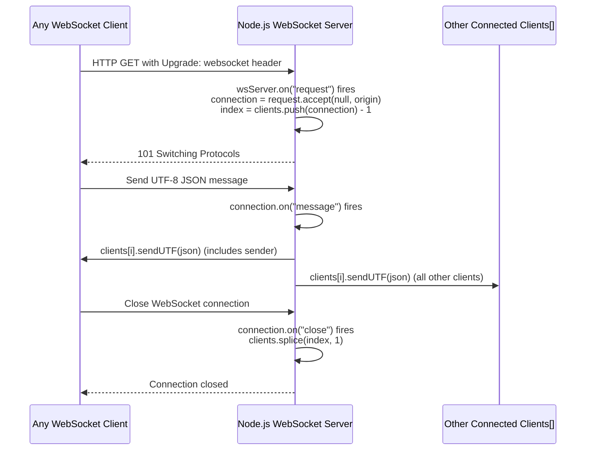

---

## 7. Deployment View

### 7.1 Local Development Environment (PoC)

All components run on a single developer workstation. There is no production deployment at this stage.

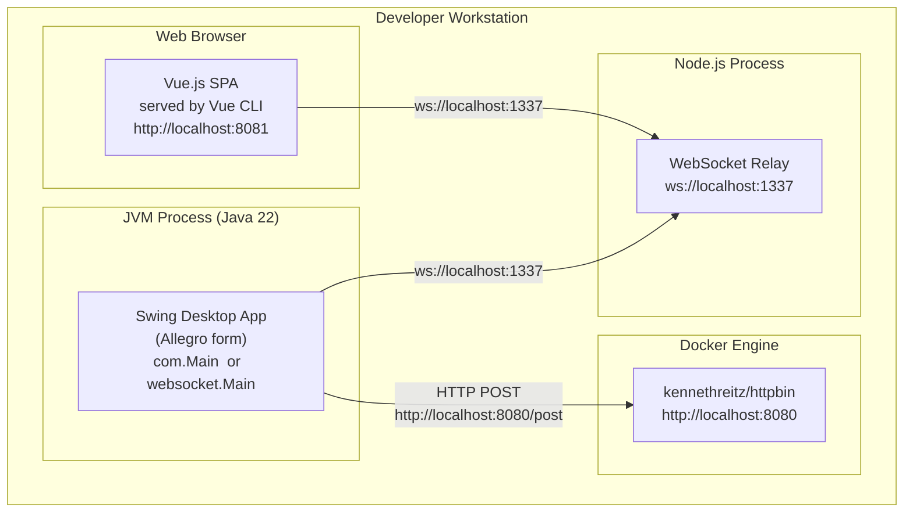

### 7.2 Required Startup Sequence

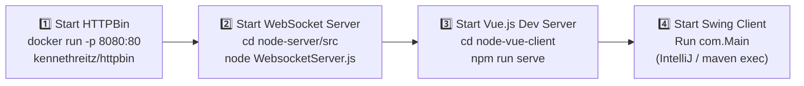

> **Note:** Steps 2, 3, and 4 can be started in any order relative to each other, but HTTPBin
> (step 1) must be up before the Swing MVP client attempts to submit form data.

### 7.3 Port Allocation

| Port | Protocol | Component | Configuration point |
|---|---|---|---|
| `1337` | WebSocket | Node.js WebSocket Server | `webSocketsServerPort` in `WebsocketServer.js` |
| `8080` | HTTP | HTTPBin Docker container | `-p 8080:80` in docker run command |
| `8080` / `8081` | HTTP | Vue CLI development server | Assigned automatically by Vue CLI; may vary |

### 7.4 Prerequisites

| Prerequisite | Min. Version | Purpose |
|---|---|---|
| Java JDK | ≥ 22.0.1 | Compile and run Swing application |
| Apache Maven | 3.x current | Build Java project, manage dependencies |
| Node.js | LTS | Run WebSocket server and Vue CLI |
| npm / yarn | current | Install Node.js dependencies |
| Docker Desktop / Rancher Desktop | current | Run HTTPBin mock container |
| Web browser (Chrome / Firefox / Edge) | modern | Run Vue.js SPA |

---

## 8. Crosscutting Concepts

### 8.1 Domain Model

The central domain entity is a **Person** (insured individual) with zero or more associated
**Zahlungsempfänger** (payment recipients / bank account records).

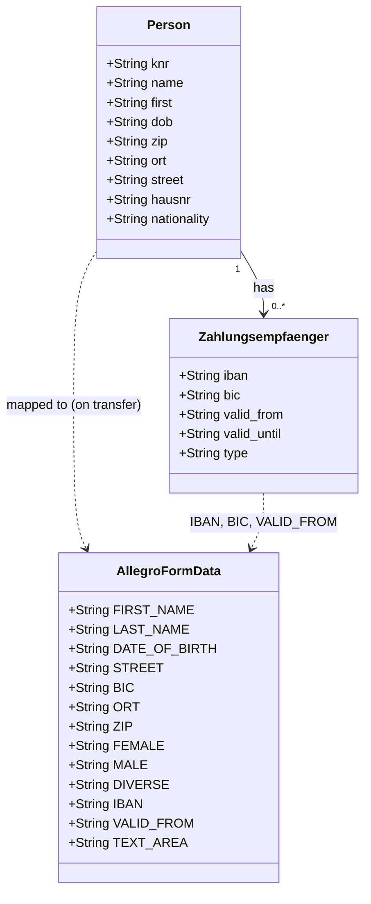

`AllegroFormData` is the canonical field set, defined both in the OpenAPI spec (`api.yml` →
`PostObject`) and in the Java `ModelProperties` enum.

---

### 8.2 WebSocket Message Protocol

All real-time communication uses a simple JSON envelope:

```json
{
  "target": "<target-identifier>",
  "content": <payload>
}
```

| `target` | `content` type | Typical flow | Receiver action |
|---|---|---|---|
| `"textfield"` | JSON object (Person + Zahlungsempfänger) | Vue.js → WS Server → Swing | Parse fields; populate text fields in Allegro form |
| `"textarea"` | Plain string | Vue.js → WS Server → Swing | Set Swing `JTextArea` text |

The protocol carries no versioning, no schema identifier, no error codes, and no acknowledgement.

---

### 8.3 Error Handling

| Layer | Strategy | Note |
|---|---|---|
| **Node.js Server** | None | No `try/catch`; origin check deferred (`accept(null, origin)`); any exception crashes the process |
| **Vue.js Client** | None | `onerror` and `onclose` handlers not implemented; failed connections are silent |
| **Java Swing Legacy** | `throw new RuntimeException(wrapped)` | `DeploymentException`, `IOException`, `InterruptedException` wrapped and re-thrown |
| **Java Swing MVP — Presenter** | `throw new RuntimeException(wrapped)` | Same wrapping pattern in button `ActionListener` |
| **HttpBinService** | Propagates `IOException` | No retry, no timeout, no circuit-breaker |

> All error handling is PoC-grade. Must be replaced with proper strategies before production use.

---

### 8.4 Data Binding Pattern (MVP)

`PocPresenter` implements two-way binding between Swing widgets and `PocModel` using
`javax.swing.event.DocumentListener` (text) and `javax.swing.event.ChangeListener` (radio buttons).

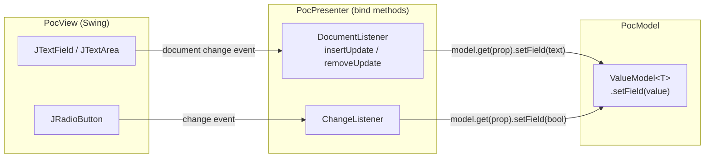

On "Anordnen" click: `PocPresenter` calls `model.action()` which reads all `ValueModel` fields,
serializes them to JSON, and POSTs to HTTPBin.

---

### 8.5 Observer Pattern (EventEmitter)

A lightweight `EventEmitter` / `EventListener` pair decouples the HTTP response handling from
the View layer:

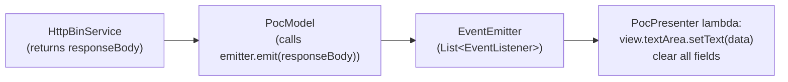

`PocModel` emits a string event after the HTTP response arrives. The presenter subscribes a
lambda that updates the view. Neither the model nor the service references the View.

---

### 8.6 JSON Processing (Java)

| Use | API | Location |
|---|---|---|
| **Produce JSON** for HTTP POST | `javax.json.stream.JsonGenerator` | `HttpBinService.post()` |
| **Parse JSON** from WebSocket message | `javax.json.stream.JsonParser` (streaming, event-driven) | `websocket.Main.extract()` and `toSearchResult()` |

The streaming `JsonParser` approach is verbose (manual flag-based state machine) but avoids
introducing a data-binding library (Jackson / Gson) as a dependency.

---

### 8.7 In-Memory Mock Data (Vue.js)

The `search_space` array in `Search.vue` contains five hardcoded persons with realistic German
names, addresses, and valid German IBAN/BIC values. All filtering is client-side in JavaScript.
No network request is made during person search.

---

### 8.8 Logging

| Component | Mechanism |
|---|---|
| Node.js Server | `console.log` with `new Date()` timestamps for connect, message, disconnect |
| Java Swing (legacy) | `System.out.println` for WebSocket open/close and field updates |
| Java Swing (MVP) | `System.out.println` in `DocumentListener` callbacks (`"I am in insert update"`, etc.) |
| Vue.js Client | No application-level logging; browser DevTools console sufficient |

No structured logging framework (SLF4J, Winston, Pino) is used anywhere in the PoC.

---

## 9. Architecture Decisions

### ADR-001: WebSocket as the Integration Protocol

| | |
|---|---|
| **Status** | Implemented |
| **Context** | The PoC must bridge a browser-based Vue.js SPA with a native Java Swing application on the same machine. HTTP polling adds latency and complexity; file-based IPC is not portable. |
| **Decision** | Use WebSocket (RFC 6455) as the transport layer. A minimal Node.js server acts as relay. |
| **Consequences (+)** | Real-time, bidirectional, standards-based. Natively supported in browsers and Java (JSR-356 / Tyrus). Technology-agnostic message format (JSON). |
| **Consequences (−)** | Requires a running Node.js relay process. The server broadcasts all messages to all clients — no routing by recipient. |

---

### ADR-002: Node.js as Standalone WebSocket Relay

| | |
|---|---|
| **Status** | Implemented |
| **Context** | The relay could have been embedded inside the Java process using Tyrus server or Jetty WebSocket. |
| **Decision** | Use a standalone Node.js process with the `websocket` npm package. |
| **Consequences (+)** | No impact on Java dependencies or startup; web developers can own and modify it independently; trivially scriptable. |
| **Consequences (−)** | Adds Node.js as a runtime dependency. Developers must start three separate processes. |

---

### ADR-003: MVP Pattern for the Swing Module

| | |
|---|---|
| **Status** | Implemented in `com/poc/`; supersedes `websocket/Main.java` |
| **Context** | The original `websocket.Main` class mixes UI construction, WebSocket lifecycle, JSON parsing, and field population in a single ~450-line monolith — a recognised maintainability problem. |
| **Decision** | Refactor into `PocModel`, `PocView`, `PocPresenter` with `EventEmitter`/`EventListener`. |
| **Consequences (+)** | Clear separation of concerns; model and presenter are independently testable; view is a pure Swing widget container. |
| **Consequences (−)** | More files for a small PoC. `websocket.Main` remains in the codebase as a reference, creating potential confusion about which entry point is canonical. |

---

### ADR-004: HTTPBin Docker Container as Mock Backend

| | |
|---|---|
| **Status** | Implemented |
| **Context** | The PoC must demonstrate HTTP POST submission without building a real Allegro backend. |
| **Decision** | Use `kennethreitz/httpbin` Docker image, which echoes any POST body in its response. |
| **Consequences (+)** | Zero backend development; realistic HTTP round-trip; validates JSON serialization end-to-end. |
| **Consequences (−)** | Requires Docker. The echo response structure (`PostResponseObject` wrapping echoed JSON) differs from a real Allegro backend response format. |

---

### ADR-005: OpenAPI 3.0.1 Specification for the POST Endpoint

| | |
|---|---|
| **Status** | Defined; not yet used for code generation |
| **Context** | The POST endpoint's request/response schemas need to be documented and potentially used for client/server code generation. |
| **Decision** | Author an OpenAPI 3.0.1 YAML file (`api.yml`) describing the `/post` endpoint and all field schemas. |
| **Consequences (+)** | Single source of truth for the data contract; enables future code generation and mock-server tooling. |
| **Consequences (−)** | The spec is hand-authored and not validated against running code; semantic drift is possible. |

---

### ADR-006: Hardcoded In-Memory Person Data in Vue.js

| | |
|---|---|
| **Status** | Implemented |
| **Context** | Building a real search API backend is out of scope for the PoC. |
| **Decision** | Embed a static `search_space[]` array of 5 persons directly in `Search.vue`. |
| **Consequences (+)** | No backend needed; instant demonstration of search UI and data transfer. |
| **Consequences (−)** | Not representative of production data volume, real search semantics, or network latency. Must be replaced before production use. |

---

## 10. Quality Requirements

### 10.1 Quality Tree

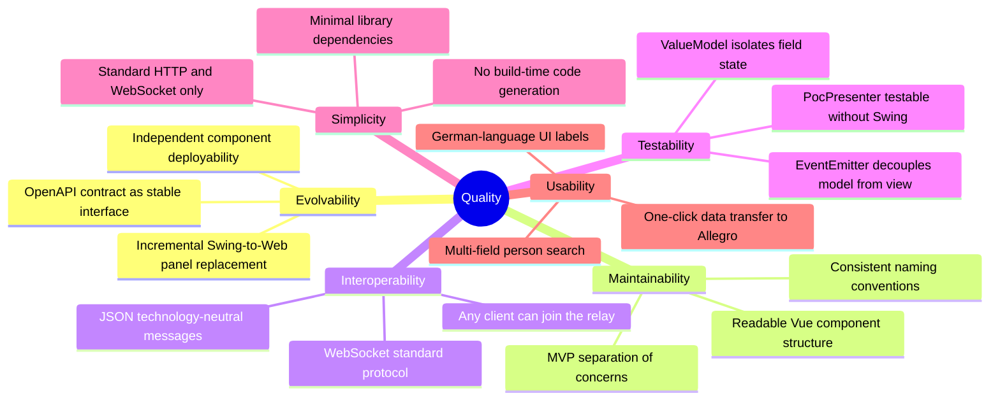

### 10.2 Quality Scenarios

| ID | Attribute | Scenario | Stimulus | Expected Response |
|---|---|---|---|---|
| QS-01 | **Evolvability** | Replace one Swing panel with a web panel | Developer adds a new Vue.js component | Only the WebSocket message protocol needs extending; existing Swing presenter is untouched |
| QS-02 | **Interoperability** | Add a third client (mobile app) | Developer connects new WebSocket client | Messages broadcast to all clients including new one; no server changes |
| QS-03 | **Maintainability** | Fix form validation bug | Developer modifies `PocPresenter` | Change isolated to one class; `PocView` and `PocModel` unchanged |
| QS-04 | **Testability** | Unit-test `PocModel.action()` | Test calls `action()` with mock `HttpBinService` | Model executes without Swing UI; `EventEmitter` delivers result to test listener |
| QS-05 | **Interoperability** | Transfer person data end-to-end | Clerk clicks "Nach ALLEGRO übernehmen" | Swing form fields populated within < 100 ms on localhost |
| QS-06 | **Simplicity** | New developer onboards | Developer reads README.md | HTTPBin + Node.js server + Vue client + Swing app running within 10 minutes |
| QS-07 | **Usability** | Search returns no results | Clerk enters a name absent from dataset | Result table is empty; no crash, no error dialog |

---

## 11. Risks and Technical Debt

### 11.1 Technical Risks

| ID | Risk | Probability | Impact | Mitigation |
|---|---|---|---|---|
| R-01 | **No authentication or authorisation** | Certain (PoC) | Critical for production | Add token-based auth (JWT) to WebSocket handshake and HTTP headers before any production deployment |
| R-02 | **No TLS / no WSS** | Certain (PoC) | High | Switch to `wss://` and `https://` for any non-localhost deployment |
| R-03 | **WebSocket relay broadcasts to all clients** | High | Medium | Any connected client receives all messages. Add session scoping, rooms, or target filtering in the relay before multi-user production use |
| R-04 | **Node.js relay is a single point of failure** | Medium | High | For production: replace with a durable broker (Redis Pub/Sub, NATS, RabbitMQ) or embed relay in a resilient service |
| R-05 | **All endpoints hardcoded to `localhost`** | High | Medium | Externalise all URLs/ports to `.env` files (Vue) and Java properties files |
| R-06 | **HTTPBin response format diverges from real Allegro backend** | High | Medium | Replace HTTPBin with a proper Allegro API stub or the real Allegro integration endpoint |
| R-07 | **Two conflicting Swing entry points** | High | Low | `websocket.Main` and `com.Main` coexist; developers may be confused. Deprecate and remove `websocket.Main`. |

### 11.2 Technical Debt

| ID | Type | Description | Priority | Est. Effort |
|---|---|---|---|---|
| TD-01 | **Design debt** | `websocket.Main` (450 lines, monolithic) superseded by MVP module but not removed | Medium | 1 h — delete file, update Eclipse `.launch` config |
| TD-02 | **Code debt** | No `onerror` or `onclose` handling in `Search.vue` WebSocket client | High | 2 h |
| TD-03 | **Code debt** | `RuntimeException` wrapping in `PocPresenter` silently swallows checked exceptions | Medium | 2 h — add proper error dialog or logging |
| TD-04 | **Design debt** | `ViewData.java` is an empty placeholder class | Low | 30 min — remove or implement |
| TD-05 | **Test debt** | No automated tests anywhere (no JUnit, no Jest / Vue Test Utils) | High | 8–16 h for meaningful coverage |
| TD-06 | **Code debt** | Hardcoded port `1337` and URL `http://localhost:8080` scattered across multiple files | Medium | 1 h — extract to config / environment variables |
| TD-07 | **Design debt** | `api.yml` is hand-authored and not validated against running code | Medium | 2 h — add contract testing (Dredd, Spectral) or codegen |
| TD-08 | **Security debt** | `request.accept(null, request.origin)` accepts connections from any origin | High | 1 h — restrict allowed origins in WebSocket server |
| TD-09 | **Code debt** | `PocPresenter.bind()` duplicates `model.get(prop)` lookup; inner `var model` shadows outer field | Low | 1 h refactor |
| TD-10 | **Design debt** | In-memory `search_space` is not realistic for production data volume or search semantics | High | 4–8 h — integrate real search API |

### 11.3 Improvement Recommendations

1. **Extract all configuration** — Move hardcoded ports/URLs to `.env` (Vue) and `application.properties` (Java).
2. **Add WebSocket error handling** — Implement `onerror`, `onclose`, and reconnection with exponential back-off in `Search.vue`.
3. **Implement message targeting** — Add client IDs and selective delivery to the Node.js relay; prevent broadcasting sensitive person data to unintended recipients.
4. **Consolidate Swing implementations** — Retire `websocket.Main`; make `com.Main` the single, documented entry point.
5. **Introduce automated tests** — At minimum: a WebSocket message round-trip integration test and MVP binding unit tests.
6. **Replace HTTPBin** — Integrate a realistic mock or the actual Allegro backend API.
7. **Use OpenAPI code generation** — Generate request/response DTOs from `api.yml` for both Java client and Node.js server validation.
8. **Introduce structured logging** — Replace `System.out.println` with SLF4J/Logback (Java) and Winston/Pino (Node.js).

---

## 12. Glossary

### 12.1 Domain Terms

| Term | Definition |
|---|---|
| **Allegro** | The legacy German social-insurance / benefits-administration desktop application targeted for modernization in this PoC |
| **Kundennummer (KNR)** | Customer / client number — unique identifier for an insured person |
| **Zahlungsempfänger** | "Payment recipient" — a bank account record (IBAN + BIC + validity period) associated with a person |
| **IBAN** | International Bank Account Number — standardized bank account identifier (ISO 13616) |
| **BIC** | Bank Identifier Code / SWIFT code — identifies a bank for international transfers |
| **Gültig ab / valid_from** | The date from which a payment-recipient record is effective |
| **Vorname** | First name (German) |
| **Name** | Last name / family name (German) |
| **Geburtsdatum** | Date of birth (German) |
| **PLZ** | Postleitzahl — German postal code (ZIP code) |
| **Ort** | City / locality (German) |
| **Strasse** | Street name (German) |
| **Hausnummer** | House number (German) |
| **Geschlecht** | Gender (German): Weiblich = Female, Männlich = Male, Divers = Diverse |
| **Anordnen** | "Arrange / submit" — label of the form-submission button in the Swing UI |
| **Nach ALLEGRO übernehmen** | "Transfer to Allegro" — button that pushes web-client data into the Swing form |
| **RT** | Rich Text — label of the multi-line text area field in the Allegro Swing form |
| **RV-Nummer** | Rentenversicherungsnummer — German pension-insurance number (shown in Vue form; not transferred in current PoC) |
| **BG-Nummer** | Berufsgenossenschafts-Nummer — German occupational accident insurance number |
| **Betriebsbez.** | Betriebsbezeichnung — business / employer designation |
| **Träger-Nr. der gE.** | Trägernummer der gemeinsamen Einrichtung — number of the joint institution (Jobcenter) |

### 12.2 Technical Terms

| Term | Definition |
|---|---|
| **PoC** | Proof of Concept — implementation demonstrating feasibility; not production-grade |
| **MVP (pattern)** | Model-View-Presenter — architectural pattern separating UI (View), domain state (Model), and coordination logic (Presenter) |
| **WebSocket** | Bidirectional, full-duplex communication protocol over a single TCP connection (RFC 6455) |
| **WSS** | WebSocket Secure — WebSocket over TLS (not used in this PoC) |
| **OpenAPI / OAS** | OpenAPI Specification — language-agnostic interface description for HTTP APIs (formerly Swagger) |
| **HTTPBin** | Open-source HTTP echo/inspection service; used here as a Dockerized mock backend |
| **Tyrus** | GlassFish Tyrus — the reference implementation of JSR-356 (Java API for WebSocket) |
| **JSR-356** | Java Specification Request 356 — defines the standard Java API for WebSocket clients and servers |
| **javax.json (JSON-P)** | Java API for JSON Processing — provides `JsonParser` (streaming read) and `JsonGenerator` (streaming write) |
| **Vue CLI** | Vue.js command-line toolchain for scaffolding and serving Vue.js projects (`@vue/cli-service`) |
| **SPA** | Single-Page Application — a web app that loads one HTML page and updates content dynamically via JavaScript |
| **v-model** | Vue.js directive for declarative two-way data binding between form inputs and component `data` |
| **EventEmitter** | Custom observable in this codebase; allows `PocModel` to notify listeners (Presenter) without a View dependency |
| **ValueModel\<T\>** | Generic mutable value wrapper; typed property container for each field in `PocModel` |
| **broadcast** | Delivering a message to all currently connected WebSocket clients simultaneously |
| **GridBagLayout** | Java Swing layout manager placing components in a grid with flexible row/column sizing and constraints |
| **DocumentListener** | Swing listener interface called when text in a `JTextComponent` is inserted, removed, or changed |
| **strangler-fig pattern** | Migration strategy where a new system gradually replaces parts of a legacy system while both run in parallel |
| **CountDownLatch** | Java concurrency utility; used here to prevent the main thread from exiting before the WebSocket session closes |

---

## Appendix

### A. Complete File Inventory

| Module | Path | Language | Role |
|---|---|---|---|
| `swing` | `src/main/java/com/Main.java` | Java 22 | Entry point — MVP Swing client |
| `swing` | `src/main/java/com/poc/ValueModel.java` | Java 22 | Generic property wrapper |
| `swing` | `src/main/java/com/poc/model/PocModel.java` | Java 22 | Domain model + HTTP trigger |
| `swing` | `src/main/java/com/poc/model/EventEmitter.java` | Java 22 | Observable event bus |
| `swing` | `src/main/java/com/poc/model/EventListener.java` | Java 22 | Observer callback interface |
| `swing` | `src/main/java/com/poc/model/HttpBinService.java` | Java 22 | HTTP POST to mock backend |
| `swing` | `src/main/java/com/poc/model/ModelProperties.java` | Java 22 | Enum of 13 form field keys |
| `swing` | `src/main/java/com/poc/model/ViewData.java` | Java 22 | Empty placeholder |
| `swing` | `src/main/java/com/poc/presentation/PocView.java` | Java 22 | Swing widget container |
| `swing` | `src/main/java/com/poc/presentation/PocPresenter.java` | Java 22 | Data binding + action wiring |
| `swing` | `src/main/java/websocket/Main.java` | Java 22 | Legacy monolithic Swing + WS client |
| `node-server` | `src/WebsocketServer.js` | JavaScript (Node.js) | WebSocket relay / broadcast hub |
| `node-vue-client` | `src/main.js` | JavaScript (Vue 2) | Vue.js app bootstrap |
| `node-vue-client` | `src/App.vue` | Vue SFC | Root component / layout |
| `node-vue-client` | `src/components/Search.vue` | Vue SFC | Person search + transfer component |
| root | `api.yml` | YAML (OpenAPI 3.0.1) | REST API contract for `/post` endpoint |
| root | `pom.xml` | XML (Maven) | Java build config + dependencies |
| root | `WebsocketSwingClient.launch` | XML (Eclipse) | Eclipse run config for legacy Swing client |
| root | `README.md` | Markdown | Java Swing project setup guide |

### B. OpenAPI Schema Reference (`api.yml`)

The `PostObject` schema defines the canonical field set for person data:

| Field | Type | Corresponds To |
|---|---|---|
| `FIRST_NAME` | string | `ModelProperties.FIRST_NAME` / `tf_first` |
| `LAST_NAME` | string | `ModelProperties.LAST_NAME` / `tf_name` |
| `DATE_OF_BIRTH` | string | `ModelProperties.DATE_OF_BIRTH` / `tf_dob` |
| `STREET` | string | `ModelProperties.STREET` / `tf_street` |
| `BIC` | string | `ModelProperties.BIC` / `tf_ze_bic` |
| `ORT` | string | `ModelProperties.ORT` / `tf_ort` |
| `ZIP` | string | `ModelProperties.ZIP` / `tf_zip` |
| `FEMALE` | string | `ModelProperties.FEMALE` / `rb_female` |
| `MALE` | string | `ModelProperties.MALE` / `rb_male` |
| `DIVERSE` | string | `ModelProperties.DIVERSE` / `rb_diverse` |
| `IBAN` | string | `ModelProperties.IBAN` / `tf_ze_iban` |
| `VALID_FROM` | string | `ModelProperties.VALID_FROM` / `tf_ze_valid_from` |
| `TEXT_AREA` | string | `ModelProperties.TEXT_AREA` / `textArea` |

### C. Component Interaction Summary

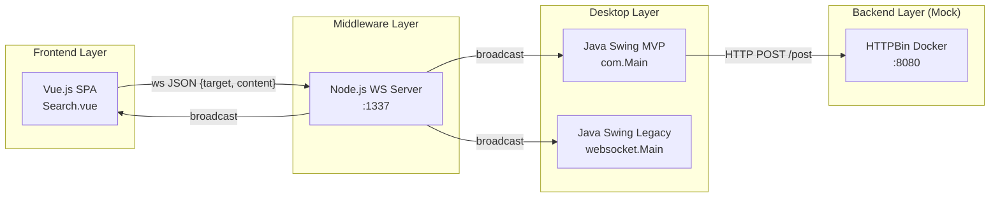

---

*This architecture document was produced by thorough manual code analysis of all source files in
the repository. All diagrams are written in Mermaid syntax and render in GitHub, GitLab, and any
compatible Markdown viewer.*
