# Allegro Modernization PoC — Architecture Documentation

**Version:** 1.0  
**Date:** 2025-01-31  
**Status:** Generated from source code analysis  
**Template:** arc42 (https://arc42.org)

---

## Table of Contents

1. [Introduction and Goals](#1-introduction-and-goals)
2. [Constraints](#2-constraints)
3. [Context and Scope](#3-context-and-scope)
4. [Solution Strategy](#4-solution-strategy)
5. [Building Block View](#5-building-block-view)
6. [Runtime View](#6-runtime-view)
7. [Deployment View](#7-deployment-view)
8. [Crosscutting Concepts](#8-crosscutting-concepts)
9. [Architectural Decisions](#9-architectural-decisions)
10. [Quality Requirements](#10-quality-requirements)
11. [Risks and Technical Debt](#11-risks-and-technical-debt)
12. [Glossary](#12-glossary)

---

## 1. Introduction and Goals

### 1.1 Requirements Overview

The **Allegro Modernization PoC** is a Proof-of-Concept that demonstrates a **non-invasive integration bridge** between a legacy Java Swing desktop application ("Allegro") and a modern web-based frontend. Rather than rewriting the legacy system entirely, the PoC validates an incremental modernization approach: a new Vue.js web client provides a contemporary user experience for searching and selecting customer records, then forwards the selected data in real time to the still-running Swing desktop application via a lightweight WebSocket relay.

The system proves the feasibility of the following key capabilities:

| ID   | Capability                         | Description                                                                                                                               |
|------|------------------------------------|-------------------------------------------------------------------------------------------------------------------------------------------|
| C-01 | Customer Search (Web)              | Modern browser-based search of a customer / person dataset by last name, first name, ZIP code, city, or street address.                   |
| C-02 | Payment Recipient Selection        | Display and selection of a customer's bank accounts (IBAN, BIC, validity period — *Zahlungsempfänger*).                                   |
| C-03 | Real-Time Data Transfer to Legacy  | One-click transfer of the selected customer record from the Vue.js client to the Allegro Swing application via WebSocket messaging.        |
| C-04 | Legacy Form Auto-Population        | Automatic population of all Allegro form fields (personal data + banking data) upon receiving a WebSocket message.                        |
| C-05 | Legacy HTTP Action                 | Submission of the populated form data from the Swing client to an external HTTP endpoint (currently HTTPBin echo service).                |
| C-06 | Response Feedback in Legacy UI     | Display of the HTTP response payload back inside the Swing application's text area.                                                       |
| C-07 | Bidirectional Text-Area Sync       | Optional real-time synchronisation of a free-text area between the Vue.js client and the Swing application.                               |

### 1.2 Quality Goals

| Priority | Quality Goal       | Motivation                                                                                                           |
|----------|--------------------|----------------------------------------------------------------------------------------------------------------------|
| 1        | Demonstrability    | The PoC must clearly and reliably demonstrate the end-to-end data flow in a live session.                            |
| 2        | Simplicity         | Minimal infrastructure, minimal dependencies — the system must be startable by a developer within minutes.           |
| 3        | Maintainability    | Code is organised in clear layers (MVP pattern) so the Swing client can be extended without architectural churn.     |
| 4        | Extensibility      | The WebSocket relay must be easy to swap with a production-grade message broker in later iterations.                 |
| 5        | Reliability        | For PoC context: no crashes during a demo; errors surface as console output.                                         |

### 1.3 Stakeholders

| Role                   | Description                                                               | Key Expectations                                                                      |
|------------------------|---------------------------------------------------------------------------|---------------------------------------------------------------------------------------|
| Product Owner / Sponsor | Evaluates the modernization approach for the Allegro platform            | Working demo; clear technology choices; low risk to existing Allegro deployment       |
| Developer              | Implements and extends the PoC                                            | Clear code structure; documented setup; easy local start-up                           |
| Software Architect     | Decides whether to adopt the pattern for production                       | Clean separation of concerns; identifiable extension points; documented trade-offs    |
| Allegro Power User     | End user of both the legacy Swing client and the new web interface        | Seamless data hand-off; no disruption to existing Swing workflows                     |
| DevOps / Operations    | Would run the WebSocket relay in a production environment                 | Minimal operational footprint; containerisable relay service                          |

---

## 2. Constraints

### 2.1 Technical Constraints

| ID    | Constraint                              | Description                                                                                                                                    |
|-------|-----------------------------------------|------------------------------------------------------------------------------------------------------------------------------------------------|
| TC-01 | Java ≥ 22 for Swing client              | The `pom.xml` compiles with `source`/`target` set to Java 22. The unnamed variable pattern (`var _`) requires JEP 443 (Java 21+).            |
| TC-02 | Node.js + `websocket` package           | The relay server is a plain Node.js script depending only on the `websocket` npm package (v1.0.35).                                            |
| TC-03 | Vue 2.x                                 | The web client uses Vue 2.6.x and Vue CLI 4. Vue 2 reached end-of-life in December 2023.                                                      |
| TC-04 | Fixed port assignments                  | WebSocket server: **1337**; HTTPBin: **8080**. Hard-coded and must be coordinated across all three components.                                 |
| TC-05 | HTTPBin as external dependency          | The HTTP POST target is the `kennethreitz/httpbin` Docker container — not a real Allegro backend.                                              |
| TC-06 | In-memory mock data                     | The Vue.js Search component contains a hard-coded `search_space` array of five mock customer records; there is no database or backend search.  |
| TC-07 | Maven build for Swing                   | The Swing module is built with Maven (Glassfish Tyrus WebSocket client + `javax.json`).                                                        |
| TC-08 | Docker required                         | Running HTTPBin requires Docker or a compatible container runtime.                                                                             |

### 2.2 Organizational Constraints

| ID    | Constraint                  | Description                                                                                                             |
|-------|-----------------------------|-------------------------------------------------------------------------------------------------------------------------|
| OC-01 | PoC scope                   | Explicitly a Proof-of-Concept. Production hardening (authentication, error recovery, persistence) is out of scope.     |
| OC-02 | IntelliJ IDEA preferred     | The README and `.launch` file document IntelliJ as the primary IDE; the content root must be configured manually.       |
| OC-03 | No automated tests          | The PoC does not include unit, integration, or end-to-end tests.                                                        |
| OC-04 | German domain language      | All UI labels, field names, and inline comments reflect German business terminology (Allegro is a German system).        |

### 2.3 Conventions

| Convention                  | Details                                                                                                    |
|-----------------------------|------------------------------------------------------------------------------------------------------------|
| Naming — Java               | PascalCase for classes/interfaces/enums; camelCase for variables/methods; UPPER_SNAKE_CASE for enum constants. |
| Package structure           | `com.poc.model` — domain/model layer; `com.poc.presentation` — view + presenter.                          |
| Naming — Vue                | PascalCase component files (`Search.vue`, `App.vue`); camelCase for methods and data properties.           |
| Naming — JavaScript         | camelCase throughout; `var` used in the legacy server script.                                              |
| API contract                | Defined in `api.yml` (OpenAPI 3.0.1); field names mirror `ModelProperties` enum identifiers.              |

---

## 3. Context and Scope

### 3.1 Business Context

The Allegro desktop application is a data-entry system used by case workers to manage customer records including personal details and banking / payment-recipient information. The PoC introduces a web-based front end for customer *search and selection*, reducing manual re-entry by pushing the selected record directly into the running Allegro Swing application.

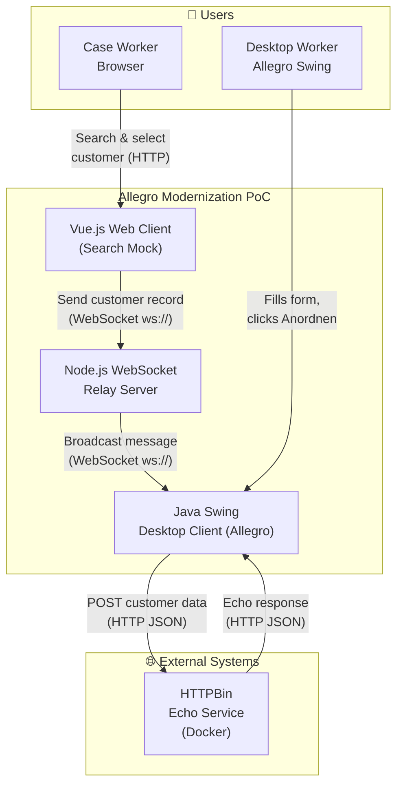

**External Interfaces:**

| Partner / System | Protocol   | Direction  | Description                                                             |
|------------------|------------|------------|-------------------------------------------------------------------------|
| Case Worker      | HTTP/HTTPS | Inbound    | User opens the Vue.js app in a browser; interacts with the search form. |
| HTTPBin (Docker) | HTTP REST  | Outbound   | Swing client POSTs customer form data; HTTPBin echoes the payload back. |

### 3.2 Technical Context

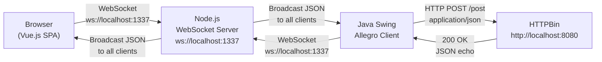

**Technical Integration Points:**

| Interface                   | Technology           | Port | Message Format                   |
|-----------------------------|----------------------|------|----------------------------------|
| Vue.js ↔ WebSocket Server   | WebSocket (RFC 6455) | 1337 | UTF-8 JSON `{ target, content }` |
| Swing ↔ WebSocket Server    | WebSocket (Tyrus)    | 1337 | UTF-8 JSON (same envelope)       |
| Swing → HTTPBin             | HTTP/1.1 POST        | 8080 | `application/json` (flat object) |
| HTTPBin → Swing             | HTTP/1.1 200         | 8080 | `application/json` (echo)        |

---

## 4. Solution Strategy

### 4.1 Core Technology Decisions

| Decision Area         | Choice                         | Rationale                                                                                        |
|-----------------------|--------------------------------|--------------------------------------------------------------------------------------------------|
| Legacy client runtime | Java Swing (Java 22)           | Represents the existing Allegro system; no rewrite required for the PoC.                         |
| Modern web client     | Vue.js 2 SPA                   | Lightweight, component-based; fast prototype development; minimal tooling overhead.              |
| Integration layer     | Node.js WebSocket relay        | Zero-config, in-process message fan-out; suitable for PoC; easily replaceable with a broker.    |
| HTTP test endpoint    | HTTPBin (Docker)               | Provides a realistic HTTP echo without requiring a real Allegro backend.                         |
| API definition        | OpenAPI 3.0.1 (`api.yml`)      | Documents the data contract between Swing and the HTTP service; supports future codegen.         |
| Build (Java)          | Maven + Java 22                | Standard enterprise build tooling; manages Tyrus WebSocket and `javax.json` dependencies.       |
| Build (Web)           | Vue CLI / Yarn                 | Standard Vue scaffolding; Babel transpilation for cross-browser ES6+ support.                   |

### 4.2 Architecture Approach

The system is decomposed along **deployment boundaries** (three separate processes) and applies **MVP (Model-View-Presenter)** internally in the Swing client:

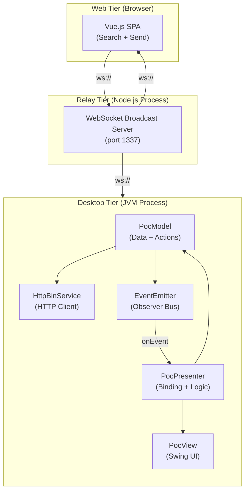

### 4.3 Key Design Decisions

| Decision                    | Context                                              | Consequences                                                            |
|-----------------------------|------------------------------------------------------|-------------------------------------------------------------------------|
| WebSocket relay over polling | Legacy client can't expose a listening HTTP endpoint | Push-based; zero config; but broadcasts to ALL clients indiscriminately |
| MVP pattern in Swing         | Need testable logic separate from Swing rendering    | Clean layers; easy to extend fields; view fields are `protected`        |
| In-memory mock data          | No real Allegro search backend available in PoC      | Zero infra dependency; must be replaced for production                  |
| HTTPBin as echo service      | No real Allegro HTTP endpoint in PoC scope           | Realistic request-response cycle; Docker dependency added               |

---

## 5. Building Block View

### 5.1 Level 1 — System Overview

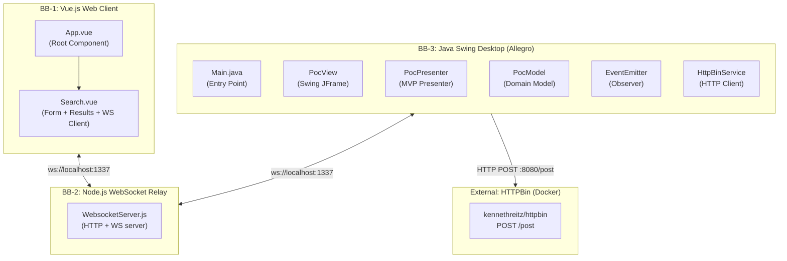

**Building Block Responsibilities:**

| Block | Responsibility | Technology |
|-------|---------------|------------|
| BB-1 Vue.js Web Client | Customer search UI; mock data; WebSocket client; data send to Allegro | Vue 2, Node.js dev server |
| BB-2 Node.js WebSocket Relay | Accept connections; broadcast all UTF-8 JSON messages to all connected peers | Node.js, `websocket` 1.0.35 |
| BB-3 Java Swing Client | Allegro legacy form; receive WebSocket data; auto-populate fields; POST to HTTP endpoint | Java 22, Swing, Tyrus, javax.json |
| HTTPBin | Echo HTTP POST payloads for testing | Docker `kennethreitz/httpbin` |

### 5.2 Level 2 — Vue.js Web Client (BB-1)

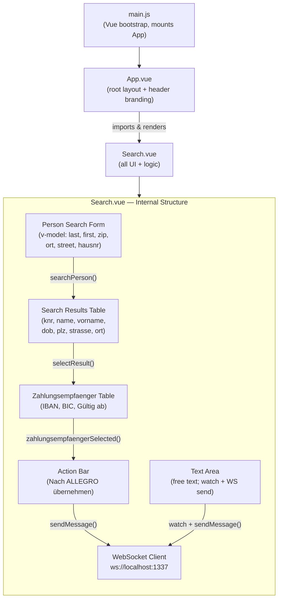

**Key Search.vue Methods:**

| Method | Description |
|--------|-------------|
| `connect()` | Opens `WebSocket("ws://localhost:1337/")` on component mount |
| `disconnect()` | Closes the WebSocket connection |
| `searchPerson()` | Filters in-memory `search_space` by last name, first name, ZIP, city, or street |
| `selectResult(item)` | Sets `selected_result` and reveals the Zahlungsempfänger table |
| `zahlungsempfaengerSelected(item)` | Stores the chosen payment recipient |
| `sendMessage(data, target)` | Serialises `{ target, content }` to JSON and sends over WebSocket |

### 5.3 Level 2 — Node.js WebSocket Relay (BB-2)

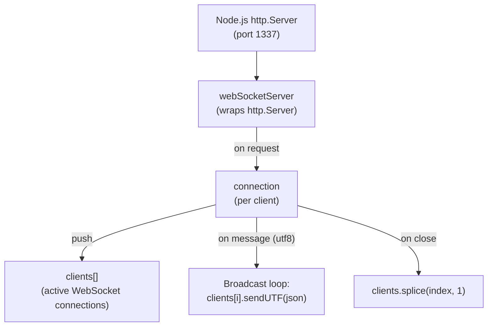

The relay is **stateless with respect to domain data** — it neither parses nor stores message content. Every received UTF-8 message is echoed verbatim to **all** connected clients (including the sender).

### 5.4 Level 2 — Java Swing Desktop Client (BB-3)

The Swing module uses the **Model-View-Presenter (MVP)** pattern:

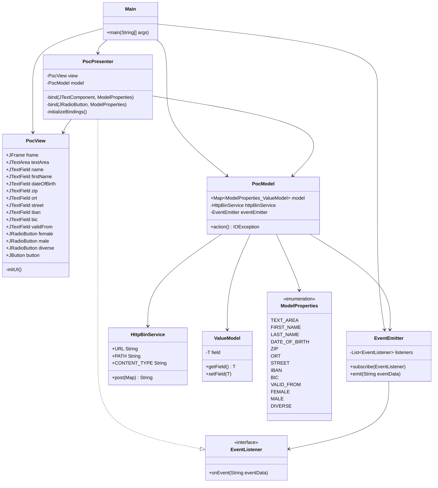

**Component Responsibilities (Swing):**

| Class / Interface  | Layer          | Responsibility                                                                                                |
|--------------------|----------------|---------------------------------------------------------------------------------------------------------------|
| `Main`             | Bootstrap      | Wires together View, Model, Presenter, EventEmitter; holds a `CountDownLatch` to keep JVM alive             |
| `PocView`          | View           | Renders the Swing `JFrame` using `GridBagLayout`; exposes component references to the Presenter             |
| `PocPresenter`     | Presenter      | Subscribes to EventEmitter; binds Swing listeners to ValueModel entries; handles button action               |
| `PocModel`         | Model          | Holds domain state as `EnumMap<ModelProperties, ValueModel<?>>`; delegates HTTP POST; emits events          |
| `HttpBinService`   | Infrastructure | Opens `HttpURLConnection` to `http://localhost:8080/post`; serialises data as JSON; returns response body   |
| `EventEmitter`     | Infrastructure | Observer bus; maintains a list of `EventListener` subscribers; dispatches string events                     |
| `EventListener`    | Infrastructure | SAM interface for event callbacks                                                                            |
| `ValueModel<T>`    | Domain         | Generic wrapper holding a single typed field; used for two-way binding between Presenter and Model          |
| `ModelProperties`  | Domain         | Enum defining all editable fields; keys the `EnumMap` in `PocModel`                                         |

---

## 6. Runtime View

### 6.1 Scenario 1 — Customer Search and Data Transfer to Allegro

This is the primary happy-path flow demonstrating the PoC value proposition:

```mermaid
sequenceDiagram
    actor CW as Case Worker (Browser)
    participant VUE as Vue.js Search.vue
    participant WSS as Node.js WebSocket Server
    participant SWING as Java Swing PocPresenter
    participant MODEL as PocModel
    participant VIEW as PocView

    Note over CW,VIEW: Application Startup
    VUE->>WSS: WebSocket connect (ws://localhost:1337)
    WSS-->>VUE: Connection accepted
    SWING->>WSS: WebSocket connect (ws://localhost:1337)
    WSS-->>SWING: Connection accepted

    Note over CW,VIEW: Customer Search
    CW->>VUE: Enter search criteria (e.g. last name "Mayer")
    VUE->>VUE: searchPerson() — filter in-memory search_space
    VUE-->>CW: Display matching rows in table

    Note over CW,VIEW: Record Selection
    CW->>VUE: Click result row (select person)
    VUE->>VUE: selectResult(item) — set selected_result
    VUE-->>CW: Highlight row; show Zahlungsempfänger table
    CW->>VUE: Click IBAN/BIC row (select payment recipient)
    VUE->>VUE: zahlungsempfaengerSelected(item)

    Note over CW,VIEW: Data Transfer to Allegro
    CW->>VUE: Click "Nach ALLEGRO übernehmen"
    VUE->>VUE: sendMessage(selected_result, 'textfield')
    VUE->>WSS: { target: "textfield", content: {person + zahlungsempfaenger} }
    WSS->>SWING: Broadcast JSON to all clients
    WSS->>VUE: Broadcast JSON (echo to sender)

    Note over CW,VIEW: Auto-Population in Swing
    SWING->>VIEW: setText() on all fields (firstName, name, dob, zip, ort, street, iban, bic, validFrom)
    VIEW-->>CW: Allegro form populated with selected customer data
```

### 6.2 Scenario 2 — HTTP Submission from Allegro (Anordnen)

After reviewing the auto-populated data, the desktop worker triggers the HTTP action:

```mermaid
sequenceDiagram
    actor DW as Desktop Worker
    participant VIEW as PocView
    participant PRES as PocPresenter
    participant MODEL as PocModel
    participant HTTPSVC as HttpBinService
    participant HBIN as HTTPBin :8080

    DW->>VIEW: Click "Anordnen" button
    VIEW->>PRES: ActionListener fires
    PRES->>MODEL: model.action()
    MODEL->>MODEL: Collect all ModelProperties values from EnumMap
    MODEL->>HTTPSVC: post(Map data)
    HTTPSVC->>HBIN: HTTP POST /post (application/json)
    HBIN-->>HTTPSVC: 200 OK — JSON echo response
    HTTPSVC-->>MODEL: responseBody (String)
    MODEL->>MODEL: eventEmitter.emit(responseBody)
    MODEL-->>PRES: EventListener.onEvent(eventData)
    PRES->>VIEW: textArea.setText(eventData)
    PRES->>VIEW: Clear all input fields
    VIEW-->>DW: Response JSON shown in text area; fields cleared
```

### 6.3 Scenario 3 — Bidirectional Text Area Sync

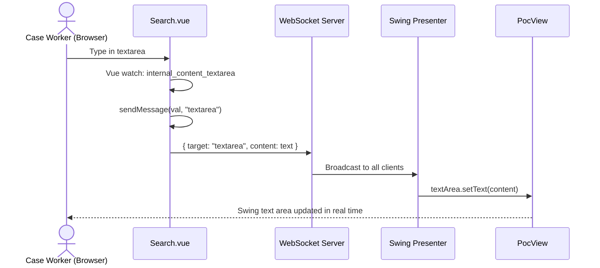

### 6.4 System Startup Sequence

```mermaid
sequenceDiagram
    participant Docker as Docker
    participant NodeJS as Node.js Process
    participant JVM as JVM Process
    participant Browser as Browser

    Docker->>Docker: docker run -p 8080:80 kennethreitz/httpbin
    Note right of Docker: HTTPBin ready on :8080

    NodeJS->>NodeJS: node WebsocketServer.js
    Note right of NodeJS: WS server listening on :1337

    JVM->>JVM: Run Main.java
    Note right of JVM: Swing window opens; connects to ws://localhost:1337

    Browser->>Browser: yarn run serve
    Note right of Browser: Vue dev server starts

    Browser->>NodeJS: WebSocket connect to :1337
    JVM->>NodeJS: WebSocket connect to :1337
    Note over NodeJS: Both clients connected — system ready
```

---

## 7. Deployment View

### 7.1 Local Development Deployment

The PoC is designed exclusively for **local developer workstations**. All components run on `localhost` with fixed ports.

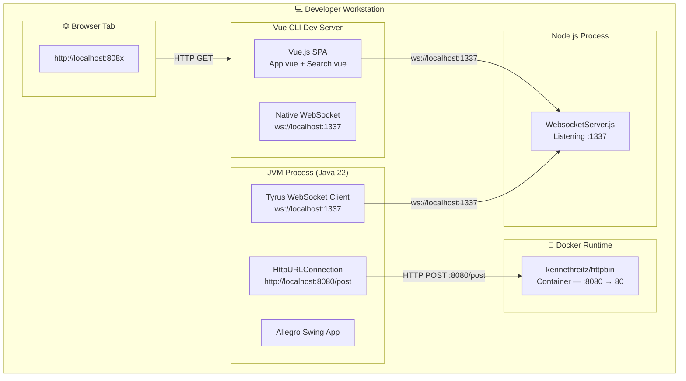

> ⚠️ **Port conflict:** The Vue CLI dev server defaults to port **8080**, which conflicts with HTTPBin (also mapped to 8080). Vue CLI will auto-increment to **8081** if 8080 is busy — watch the console output for the actual port.

### 7.2 Port Allocation

| Port | Service              | Protocol | Hard-coded Location                           |
|------|----------------------|----------|-----------------------------------------------|
| 1337 | Node.js WebSocket    | WS       | `WebsocketServer.js` line 5; `Search.vue` line 132 |
| 8080 | HTTPBin echo service | HTTP     | `HttpBinService.URL`; `docker run -p 8080:80` |
| 808x | Vue CLI dev server   | HTTP     | Vue CLI default (conflict risk — see note)    |

### 7.3 Production Deployment Considerations

> Recommendations for a future production phase — not current implementation.

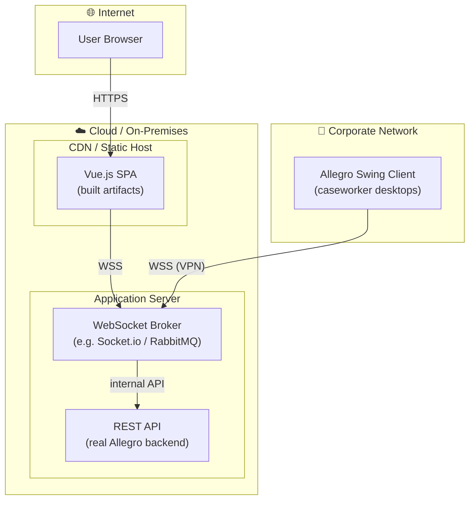

---

## 8. Crosscutting Concepts

### 8.1 Domain Model

The central domain entity is the **Customer / Person** with associated **Payment Recipients (Zahlungsempfänger)**. The data schema is consistent across all three clients and the API contract:

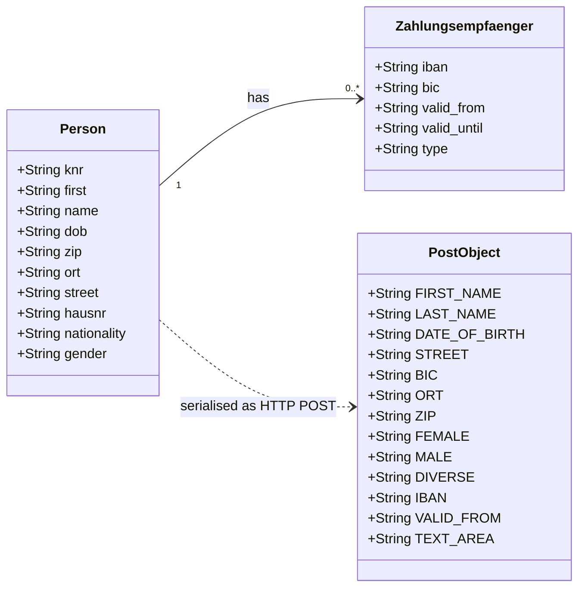

**Field Mapping across Components:**

| Domain Field     | Vue.js (`formdata`) | `ModelProperties` Enum | API (`PostObject`) |
|------------------|---------------------|------------------------|--------------------|
| First name       | `first`             | `FIRST_NAME`           | `FIRST_NAME`       |
| Last name        | `last`              | `LAST_NAME`            | `LAST_NAME`        |
| Date of birth    | `dob`               | `DATE_OF_BIRTH`        | `DATE_OF_BIRTH`    |
| Street           | `street`            | `STREET`               | `STREET`           |
| ZIP code         | `zip`               | `ZIP`                  | `ZIP`              |
| City             | `ort`               | `ORT`                  | `ORT`              |
| IBAN             | `iban`              | `IBAN`                 | `IBAN`             |
| BIC              | `bic`               | `BIC`                  | `BIC`              |
| Valid from       | `valid_from`        | `VALID_FROM`           | `VALID_FROM`       |
| Gender: Female   | (radio button)      | `FEMALE`               | `FEMALE`           |
| Gender: Male     | (radio button)      | `MALE`                 | `MALE`             |
| Gender: Diverse  | (radio button)      | `DIVERSE`              | `DIVERSE`          |
| Free text        | (textarea)          | `TEXT_AREA`            | `TEXT_AREA`        |

### 8.2 WebSocket Message Envelope

All messages traversing the WebSocket relay use the same JSON envelope:

```json
{
  "target": "textfield | textarea",
  "content": { ... }
}
```

| Field    | Type            | Values                        | Description                                              |
|----------|-----------------|-------------------------------|----------------------------------------------------------|
| `target` | `string`        | `"textfield"` \| `"textarea"` | Instructs receiver which UI element to populate          |
| `content`| `object\|string` | Person + Zahlungsempfaenger OR raw text | Structured object for `textfield`, string for `textarea` |

### 8.3 MVP Pattern in the Swing Client

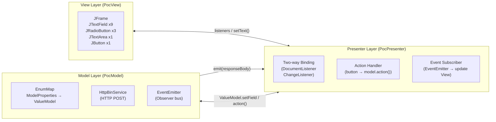

**Binding Mechanism:** `PocPresenter.bind()` registers a `DocumentListener` (for text fields and text area) or a `ChangeListener` (for radio buttons) on each Swing component. Any user input immediately writes the new value into the corresponding `ValueModel` in `PocModel` — the model is always in sync with the view without explicit "collect on submit" logic.

### 8.4 Observer Pattern (EventEmitter)

The `EventEmitter` / `EventListener` pair decouples `PocModel` (which calls the HTTP service) from `PocPresenter` (which updates the view):

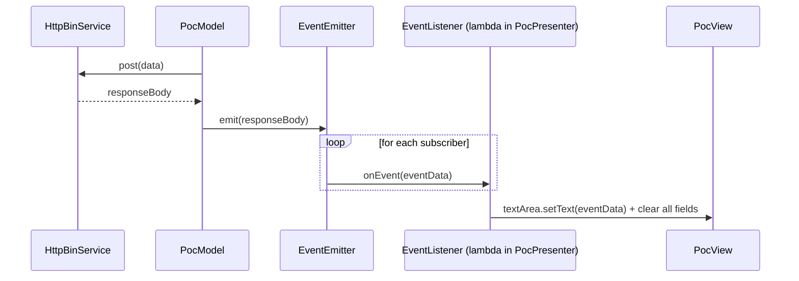

### 8.5 Error Handling

| Layer        | Mechanism                                                                                   | Limitation                                                              |
|--------------|---------------------------------------------------------------------------------------------|-------------------------------------------------------------------------|
| Java HTTP    | `IOException` / `InterruptedException` caught in `PocPresenter`, rethrown as `RuntimeException` | Unhandled; will crash the Swing EDT if triggered                      |
| Java HTTP    | Empty response body → `eventEmitter.emit("Failed operation")`                               | User sees "Failed operation" in text area                               |
| Node.js WS   | No explicit error handling; uncaught exception terminates the process                        | Process must be restarted manually                                      |
| Vue.js WS    | No reconnect logic; no `onerror` / `onclose` recovery                                       | Page must be refreshed on disconnect                                    |

### 8.6 Logging

All logging is via `System.out.println` (Java) and `console.log` (JavaScript). No structured logging framework, log levels, or log aggregation.

| Component           | Example log output                                                              |
|---------------------|---------------------------------------------------------------------------------|
| WebsocketServer.js  | `Server is listening on port 1337`, `Connection from origin`, `Received Message` |
| PocPresenter.java   | `Event data is : <json>`, `I am in insert update.`, `I am in remove update.`   |
| PocModel.java       | `<PROPERTY>: <value>` for each model property on `action()`                    |
| HttpBinService.java | `Response code: 200`, `Response body: <json>`                                  |

### 8.7 Internationalisation

The UI is German-only. All labels, placeholders, and button text are hard-coded in German:

| German Term              | English Translation        | Location                  |
|--------------------------|----------------------------|---------------------------|
| Vorname                  | First name                 | Swing label, Vue placeholder |
| Name                     | Last name                  | Swing label, Vue placeholder |
| Geburtsdatum             | Date of birth              | Swing label                |
| Geschlecht               | Gender                     | Swing label                |
| Weiblich / Männlich / Divers | Female / Male / Diverse | Swing radio buttons       |
| Strasse / PLZ / Ort      | Street / ZIP / City        | Both UIs                  |
| IBAN / BIC / Gültig ab   | IBAN / BIC / Valid from    | Both UIs                  |
| Anordnen                 | Submit / Arrange           | Swing button              |
| Nach ALLEGRO übernehmen  | Transfer to ALLEGRO        | Vue button                |
| Zahlungsempfänger        | Payment recipient          | Vue table heading         |

---

## 9. Architectural Decisions

### ADR-001: WebSocket Relay over Direct HTTP Integration

**Status:** Implemented (PoC)  
**Date:** PoC inception

**Context:**  
The legacy Swing client must receive data from the new web client in real time without requiring modification of the Allegro system's internal HTTP server or database layer.

**Decision:**  
Use a Node.js WebSocket relay server as a thin message bus. Both the Vue.js web client and the Java Swing client connect as WebSocket clients; the relay broadcasts all messages to all connected peers.

**Consequences:**
- ✅ No firewall rule changes needed for HTTP polling
- ✅ Immediate push delivery; no polling overhead
- ✅ Relay is stateless — replaceable with RabbitMQ / Redis Pub/Sub without touching client code
- ✅ Multiple desktop clients can receive the same message simultaneously
- ❌ All messages broadcast to *all* clients — no targeting by client ID
- ❌ No authentication or authorisation on the WebSocket connection
- ❌ No message persistence; if the Swing client is disconnected, messages are lost

---

### ADR-002: MVP Pattern for the Swing Desktop Client

**Status:** Implemented  
**Date:** PoC inception

**Context:**  
The Swing client needs to receive external data (from WebSocket), auto-populate a complex form, and submit that data to an HTTP endpoint — all without tangling UI rendering, data handling, and HTTP communication.

**Decision:**  
Apply Model-View-Presenter: `PocView` owns Swing widgets; `PocPresenter` wires listeners and handles events; `PocModel` holds all data and calls `HttpBinService`; `EventEmitter` decouples the HTTP response from the HTTP call.

**Consequences:**
- ✅ Model and Presenter can be unit tested independently of Swing
- ✅ Adding new fields only requires changes in 4 places: `ModelProperties`, `PocModel`, `PocPresenter.initializeBindings()`, `PocView`
- ❌ `PocView` exposes component references as `protected` fields — acceptable for PoC, breaks encapsulation for production

---

### ADR-003: In-Memory Mock Data in Vue.js Client

**Status:** Implemented (PoC only)  
**Date:** PoC inception

**Context:**  
No real Allegro backend, database, or search service available for the PoC.

**Decision:**  
Embed a hard-coded `search_space` array of five mock `Person` records (with realistic German addresses and valid IBAN format) directly in `Search.vue`.

**Consequences:**
- ✅ Zero infrastructure dependencies for the web client demo
- ✅ Realistic mock records make the demo convincing
- ❌ Not scalable; must be replaced with a real API call for production
- ❌ Data is visible in the compiled JavaScript bundle

---

### ADR-004: HTTPBin as HTTP Test Endpoint

**Status:** Implemented (PoC only)  
**Date:** PoC inception

**Context:**  
The Swing client needs to demonstrate an HTTP POST to an Allegro-like backend, but the real Allegro HTTP endpoint is out of scope for the PoC.

**Decision:**  
Use `kennethreitz/httpbin` running in Docker as an echo service at `http://localhost:8080/post`.

**Consequences:**
- ✅ Provides a realistic HTTP request/response cycle without a mock server
- ✅ Echo response lets the PoC display "what would be sent to Allegro" back in the text area
- ❌ Docker is a prerequisite — adds setup friction
- ❌ `HttpBinService.URL` is hard-coded to `localhost:8080` — must be externalised for production

---

### ADR-005: Vue 2.x

**Status:** Implemented (PoC)  
**Date:** PoC inception

**Context:**  
The Vue.js client was developed with Vue CLI 4 scaffolding, which defaults to Vue 2.

**Decision:**  
Use Vue 2.6.10 with the Options API.

**Consequences:**
- ❌ Vue 2 reached end-of-life in December 2023; no further security patches
- ❌ Migration to Vue 3 Composition API requires a rewrite of `Search.vue`
- ⚠️ Action required before any production adoption

---

## 10. Quality Requirements

### 10.1 Quality Tree

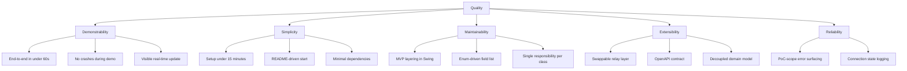

### 10.2 Quality Scenarios

| ID   | Quality Attribute  | Stimulus                                    | Response                                                 | Measure                       |
|------|--------------------|---------------------------------------------|----------------------------------------------------------|-------------------------------|
| QS-1 | Demonstrability    | Click "Nach ALLEGRO übernehmen"             | Allegro Swing form fields populated                      | < 500 ms end-to-end           |
| QS-2 | Demonstrability    | Click "Anordnen"                            | HTTP response displayed in text area                     | < 2 s (HTTPBin latency)       |
| QS-3 | Simplicity         | New developer clones the repository         | System running locally                                   | < 15 minutes setup time       |
| QS-4 | Maintainability    | Adding a new person data field              | Change in ≤ 4 files                                      | `ModelProperties`, `PocModel`, `PocPresenter`, `PocView` |
| QS-5 | Extensibility      | Swap WebSocket relay for RabbitMQ           | No changes in Vue.js client or Swing client code         | Only `WebsocketServer.js` replaced |
| QS-6 | Reliability        | WebSocket relay process crashes             | Error visible in Node.js console; clients surface disconnect | Console output within 5 s |

---

## 11. Risks and Technical Debt

### 11.1 Technical Risks

| ID   | Risk                                         | Probability | Impact | Mitigation                                                                          |
|------|----------------------------------------------|-------------|--------|-------------------------------------------------------------------------------------|
| R-01 | Vue 2 EOL — security vulnerabilities         | High        | Medium | Upgrade to Vue 3 before any production deployment                                   |
| R-02 | Hard-coded `localhost` / port values          | High        | High   | Externalise all connection strings to environment variables before production        |
| R-03 | No WebSocket authentication                  | High        | High   | Add token-based authentication (e.g. JWT) to WebSocket handshake in production      |
| R-04 | No reconnect / resilience in WebSocket clients | Medium    | Medium | Implement exponential backoff reconnect in `Search.vue` and the Swing WS client    |
| R-05 | HTTPBin instead of real Allegro backend      | High (PoC)  | High   | Replace `HttpBinService.URL` with real Allegro endpoint; externalise config         |
| R-06 | Swing EDT thread-safety violations           | Medium      | Medium | Wrap `PocPresenter` event callbacks in `SwingUtilities.invokeLater()`              |
| R-07 | `RuntimeException` wrapping checked exceptions | Medium   | Medium | Introduce proper exception hierarchy and user-facing error dialogs in Swing         |

### 11.2 Technical Debt

| ID     | Type        | Description                                                                                            | Priority | Est. Effort |
|--------|-------------|--------------------------------------------------------------------------------------------------------|----------|-------------|
| TD-001 | Code Debt   | `PocView` exposes all Swing components as `protected` fields — breaks encapsulation                   | Medium   | 2 h         |
| TD-002 | Code Debt   | Hard-coded port numbers (1337, 8080) across three separate source files                                | High     | 1 h         |
| TD-003 | Design Debt | Mock customer data embedded in `Search.vue` — must be replaced with real API integration              | High     | 8–16 h      |
| TD-004 | Code Debt   | No error handling in Vue.js WebSocket client (`onerror`, `onclose` handlers missing)                  | Medium   | 2 h         |
| TD-005 | Code Debt   | Debug `console.log` statements throughout Swing presenter (`"I am in insert update."`)                | Low      | 1 h         |
| TD-006 | Design Debt | No session or client identity on WebSocket — broadcast-to-all semantics are insecure                  | High     | 8 h         |
| TD-007 | Dependency  | Vue 2.x (EOL Dec 2023); `eslint` 5.x (outdated)                                                      | High     | 16–32 h     |
| TD-008 | Test Debt   | Zero automated test coverage across all three components                                               | High     | 40+ h       |
| TD-009 | Ops Debt    | No health check, graceful shutdown, or process supervision for the Node.js relay                      | Medium   | 4 h         |
| TD-010 | Code Debt   | `ViewData.java` is an empty stub class with no implementation                                         | Low      | 30 min      |

### 11.3 Improvement Recommendations

1. **Authentication & Authorisation** — Add JWT or session-token validation to the WebSocket handshake (relay and both clients).
2. **Configuration Externalisation** — Replace all hard-coded URLs and ports with environment variables (`.env` files for Vue/Node; `application.properties` for Java).
3. **Vue 2 → Vue 3 Migration** — Rewrite `Search.vue` using the Composition API; upgrade ESLint to v8+.
4. **Real Backend Integration** — Replace `HttpBinService` with a proper Allegro REST client; replace in-memory mock data with a real search API.
5. **WebSocket Client Resilience** — Add reconnect logic with exponential backoff in `Search.vue` and the Swing Tyrus client.
6. **Thread Safety (Swing)** — Wrap all EventEmitter callbacks that touch Swing components in `SwingUtilities.invokeLater()`.
7. **Automated Testing** — Add JUnit 5 tests for `PocModel`, `PocPresenter`, `HttpBinService`; Jest tests for `Search.vue` methods.
8. **Structured Logging** — Replace `console.log` / `System.out.println` with a logging framework (SLF4J/Logback for Java; Winston for Node.js).
9. **Message Routing** — Extend the WebSocket envelope with a `clientId` field so the relay can route to specific clients rather than broadcasting to all.
10. **API Versioning** — Update `api.yml` to reflect the actual production endpoint (not HTTPBin); add API versioning (`/v1/post`).

---

## 12. Glossary

### 12.1 Domain Terms

| Term (German)              | Term (English)         | Definition                                                                                                          |
|----------------------------|------------------------|---------------------------------------------------------------------------------------------------------------------|
| Allegro                    | Allegro                | The legacy Java Swing CRM / case management desktop application being modernized.                                   |
| Zahlungsempfänger          | Payment Recipient      | A bank account record (IBAN + BIC + validity dates) associated with a customer for payment processing.              |
| Kundennummer (knr)         | Customer Number        | Unique numeric identifier for a customer in the Allegro system.                                                     |
| Vorname                    | First Name             | Customer's given name.                                                                                               |
| Nachname / Name            | Last Name / Family Name | Customer's family name.                                                                                             |
| Geburtsdatum (dob)         | Date of Birth          | Customer birth date; format `YYYY-MM-DD`.                                                                           |
| PLZ                        | Postal Code / ZIP      | German postal code (*Postleitzahl*).                                                                                |
| Ort                        | City                   | City or municipality of the customer's address.                                                                     |
| Strasse                    | Street                 | Street name component of the customer's address.                                                                    |
| Hausnummer                 | House Number           | Building number component of the customer's address.                                                                |
| Gültig ab                  | Valid From             | Start date of a payment recipient record's validity period.                                                         |
| Gültig bis                 | Valid Until            | End date of a payment recipient record's validity period (currently unpopulated in mock data).                      |
| Anordnen                   | Submit / Arrange       | The action button in Allegro that triggers the HTTP POST submission of the form data.                               |
| Nach ALLEGRO übernehmen    | Transfer to ALLEGRO    | The action button in the Vue.js client that sends the selected customer record to the Swing application.            |
| Weiblich / Männlich / Divers | Female / Male / Diverse | Gender options in the Allegro form.                                                                              |
| RT                         | Response Text          | Label for the text area in the Swing form that displays HTTP response data.                                         |
| Modernisierungs-PoC        | Modernization PoC      | Proof-of-Concept for the incremental modernization of the Allegro desktop application.                              |

### 12.2 Technical Terms

| Term               | Definition                                                                                                                      |
|--------------------|---------------------------------------------------------------------------------------------------------------------------------|
| arc42              | A template for documenting software architectures, structured in 12 sections. See https://arc42.org.                           |
| MVP                | Model-View-Presenter — a presentation pattern separating UI rendering (View), UI logic (Presenter), and data (Model).          |
| WebSocket          | A full-duplex communication protocol over a single TCP connection, standardised as RFC 6455. Used here for real-time messaging. |
| Tyrus              | The GlassFish reference implementation of the Java WebSocket API (JSR 356). Used as WebSocket client library in the Swing module. |
| HTTPBin            | An open-source HTTP request/response service that echoes back whatever was sent to it. Used as `kennethreitz/httpbin` (Docker). |
| OpenAPI / Swagger  | A specification format (YAML/JSON) for describing RESTful APIs. Used in `api.yml` to document the POST endpoint contract.      |
| Vue CLI            | A command-line toolchain for scaffolding and building Vue.js applications.                                                     |
| EnumMap            | A Java `Map` implementation optimised for enum keys. Used in `PocModel` to hold field values keyed by `ModelProperties`.       |
| ValueModel\<T\>    | A generic, single-field wrapper class used to enable bidirectional binding between Swing components and the domain model.       |
| EventEmitter       | Custom observer/publisher in the Swing module; decouples model actions from presenter reactions.                               |
| DocumentListener   | A Swing interface for receiving notifications when a `Document` (text component content) changes; used for two-way binding.    |
| CountDownLatch     | A Java concurrency utility used in `Main.java` to prevent the JVM from exiting after the Swing window is created.              |
| GridBagLayout      | A flexible Swing layout manager that aligns components in a grid; used for the Allegro form layout.                            |
| PoC                | Proof of Concept — a prototype demonstrating feasibility without full production quality.                                       |
| SPA                | Single-Page Application — a web app that loads a single HTML page and updates content dynamically via JavaScript.              |
| WS / WSS           | WebSocket (`ws://`) and WebSocket Secure (`wss://`) URI schemes.                                                               |
| IBAN               | International Bank Account Number — standardised format for identifying bank accounts internationally.                         |
| BIC / SWIFT        | Bank Identifier Code — international standard for identifying banks, used alongside IBAN.                                      |
| ADR                | Architecture Decision Record — a document capturing a significant architectural decision, its context, and consequences.       |

---

## Appendix

### A. Component Inventory

| Component                | Language    | Framework / Runtime   | Entry Point                                | Start Command                                |
|--------------------------|-------------|-----------------------|--------------------------------------------|----------------------------------------------|
| Swing Desktop Client     | Java 22     | Swing, Maven, Tyrus   | `swing/src/main/java/com/Main.java`        | Run `Main` in IntelliJ IDEA                  |
| Node.js WebSocket Server | JavaScript  | Node.js, `websocket`  | `node-server/src/WebsocketServer.js`       | `node WebsocketServer.js`                    |
| Vue.js Web Client        | JavaScript  | Vue 2, Vue CLI 4      | `node-vue-client/src/main.js`              | `yarn run serve`                             |
| HTTPBin (External)       | Python      | Docker container      | `kennethreitz/httpbin`                     | `docker run -p 8080:80 kennethreitz/httpbin` |

### B. Repository File Structure

```
websocket_swing/
├── api.yml                              # OpenAPI 3.0.1 API contract
├── pom.xml                              # Root Maven POM (Swing module)
├── websocket_swing.iml                  # IntelliJ module file
├── WebsocketSwingClient.launch          # IntelliJ run configuration
├── README.md                            # Project setup guide
│
├── node-server/                         # BB-2: WebSocket Relay Server
│   ├── package.json                     # npm deps (websocket 1.0.35)
│   ├── doc/Readme.txt                   # Setup instructions
│   └── src/
│       └── WebsocketServer.js           # Complete server implementation (~68 lines)
│
├── node-vue-client/                     # BB-1: Vue.js Web Client
│   ├── package.json                     # yarn deps (Vue 2.6.x, Vue CLI 4)
│   ├── babel.config.js                  # Babel preset configuration
│   ├── yarn.lock                        # Dependency lock file
│   ├── doc/Readme.txt                   # Setup instructions
│   ├── public/index.html                # HTML entry point
│   └── src/
│       ├── main.js                      # Vue bootstrap / mount
│       ├── App.vue                      # Root component (header layout)
│       └── components/
│           └── Search.vue               # Main search form + WebSocket client (~250 lines)
│
└── swing/                               # BB-3: Java Swing Desktop Client
    ├── bin/pom.xml                      # Sub-module POM
    └── src/main/java/
        └── com/
            ├── Main.java                # Entry point — wires MVP + EventEmitter
            ├── README.md                # Docker prerequisite note
            └── poc/
                ├── ValueModel.java      # Generic typed value wrapper
                ├── model/
                │   ├── EventEmitter.java     # Observer publisher
                │   ├── EventListener.java    # Observer SAM interface
                │   ├── HttpBinService.java   # HTTP POST client
                │   ├── ModelProperties.java  # Enum of all 13 form fields
                │   ├── PocModel.java         # Domain model + action()
                │   └── ViewData.java         # Empty stub (future use)
                └── presentation/
                    ├── PocPresenter.java     # MVP Presenter (bindings + events)
                    └── PocView.java          # Swing JFrame UI (GridBagLayout)
```

### C. Startup Checklist

```
[ ] 1. Start Docker Desktop / Rancher Desktop
[ ] 2. Run: docker run -p 8080:80 kennethreitz/httpbin
[ ] 3. cd node-server/src && node WebsocketServer.js
[ ] 4. Open project in IntelliJ IDEA; configure content root to swing/src/main/java
[ ] 5. Set Project SDK to Java >= 22.0.1
[ ] 6. Run Main.java — Allegro Swing window opens
[ ] 7. cd node-vue-client && yarn install && yarn run serve
[ ] 8. Open browser at the URL shown by Vue CLI (typically http://localhost:8081)
[ ] 9. All three clients connected to ws://localhost:1337 — system ready for demo
```

### D. Analysis Metadata

- **Analysis Date:** 2025-01-31
- **Source Files Analysed:**
  - Java (10 files): `Main.java`, `PocView.java`, `PocPresenter.java`, `PocModel.java`, `HttpBinService.java`, `EventEmitter.java`, `EventListener.java`, `ModelProperties.java`, `ValueModel.java`, `ViewData.java`
  - JavaScript / Vue (4 files): `WebsocketServer.js`, `main.js`, `App.vue`, `Search.vue`
  - Configuration (6 files): `pom.xml` (×2), `package.json` (×2), `babel.config.js`, `api.yml`
  - Documentation (5 files): `README.md` (root), `README.md` (swing/com), `Readme.txt` (×2), `README.md` (node-vue-client)
- **Architecture Patterns Identified:** MVP, Observer (EventEmitter/Listener), WebSocket Relay / Message Bus, SPA
- **Languages:** Java 22, JavaScript ES6+, Vue Single-File Components
- **Skills Used:** arc42-template, mermaid-diagrams

---

*This document was generated through comprehensive manual source code analysis of the `websocket_swing` repository following the arc42 architecture documentation template (https://arc42.org, version 8). All architectural observations are derived directly from analysed source files. No third-party systems were contacted during analysis.*
