# Allegro PoC — Arc42 Architecture Documentation

**Version:** 1.0  
**Date:** 2025-01-31  
**Status:** Generated from source code analysis  
**Project:** Allegro Modernization Proof of Concept  

---

## Table of Contents

1. [Introduction and Goals](#1-introduction-and-goals)
2. [Constraints](#2-constraints)
3. [Context and Scope](#3-context-and-scope)
4. [Solution Strategy](#4-solution-strategy)
5. [Building Block View](#5-building-block-view)
6. [Runtime View](#6-runtime-view)
7. [Deployment View](#7-deployment-view)
8. [Cross-cutting Concepts](#8-cross-cutting-concepts)
9. [Architecture Decisions](#9-architecture-decisions)
10. [Quality Requirements](#10-quality-requirements)
11. [Risks and Technical Debt](#11-risks-and-technical-debt)
12. [Glossary](#12-glossary)

---

## 1. Introduction and Goals

### 1.1 Requirements Overview

The **Allegro PoC** is a proof-of-concept system demonstrating the modernisation of a legacy Java Swing desktop
application named "Allegro". It establishes a real-time integration bridge between a modern web-based search UI,
a central message relay, and an existing thick-client desktop application.

The primary use-case is a **person-search and data-transfer workflow** common in German-language administrative and
social-insurance contexts: an operator searches for a person (Versicherter/Kunde), selects their banking/payment
details (Zahlungsempfänger), and transfers the selection directly into the Allegro desktop form — entirely without
manual copy-pasting.

| # | Capability | Description |
|---|-----------|-------------|
| C-01 | **Person Search** | Full-text / field-by-field search for persons by name, first name, ZIP code, city, street, or house number |
| C-02 | **Payment Recipient Selection** | Display and select IBAN/BIC records (Zahlungsempfänger) associated with a found person |
| C-03 | **WebSocket Data Transfer** | One-click transfer of the selected person + payment details to all connected Allegro desktop clients |
| C-04 | **Allegro Form Population** | Java Swing form that receives WebSocket messages and auto-populates its structured input fields |
| C-05 | **REST Form Submission** | Modern Swing MVP client submits form data as JSON to a backend REST endpoint (HTTPBin) |
| C-06 | **Textarea Synchronisation** | Free-text note area kept in sync across web and desktop clients via WebSocket broadcast |

### 1.2 Quality Goals

The following quality goals are ordered by priority as inferred from the PoC design goals:

| Priority | Quality Goal | Rationale |
|----------|-------------|-----------|
| 1 | **Demonstrability** | The primary purpose is to prove the integration concept to stakeholders; the system must work end-to-end in a demo context |
| 2 | **Evolvability / Maintainability** | The modern Swing client deliberately refactors the legacy flat-class design into a clean MVP architecture to show the migration path |
| 3 | **Interoperability** | Two fundamentally different technology stacks (Java Swing + Vue.js) must collaborate via a neutral message broker |
| 4 | **Simplicity** | PoC scope is intentionally minimal; avoiding over-engineering keeps the concept clear |
| 5 | **Correctness** | The transferred person/payment data must arrive intact and be displayed in the right form fields |

### 1.3 Stakeholders

| Role | Concern | Expectation |
|------|---------|-------------|
| **Product Owner / Sponsor** | Business value of modernisation | End-to-end demo of web UI → legacy desktop integration |
| **Legacy Allegro Developers** | How the existing desktop app is modified | Minimal invasive change; WebSocket listener as a bolt-on |
| **Modern Frontend Developers** | Vue.js search UI | Clean component structure, easy to extend |
| **Architects** | Migration strategy | Clear separation of concerns, documented patterns |
| **Operations / DevOps** | Deployment simplicity | Minimal infrastructure; Docker for mock backend |
| **End Users (Clerks / Sachbearbeiter)** | Workflow efficiency | Fast person-search, one-click data transfer to Allegro |

---

## 2. Constraints

### 2.1 Technical Constraints

| ID | Constraint | Details |
|----|-----------|---------|
| TC-01 | **Java SDK ≥ 22.0.1** | Required by Maven compiler plugin (`<source>22</source>`); uses Java 22 language features (unnamed variable patterns `_`) |
| TC-02 | **Node.js runtime** | WebSocket relay server requires Node.js; `websocket ^1.0.35` npm package must be resolvable |
| TC-03 | **Vue.js 2.x** | The web client uses Vue 2.6.x; Vue 3 migration is out of scope for the PoC |
| TC-04 | **WebSocket Protocol (RFC 6455)** | All real-time communication uses the WebSocket protocol on port **1337** |
| TC-05 | **HTTP / REST on port 8080** | The REST backend (HTTPBin) must be reachable at `localhost:8080`; provided via Docker |
| TC-06 | **Localhost networking only** | All three components are designed for local execution; no TLS, no authentication, no CORS enforcement |
| TC-07 | **Maven build system** | Java Swing module uses Maven (`pom.xml`); IntelliJ IDEA is the recommended IDE |
| TC-08 | **JSON as the universal message format** | All WebSocket messages and REST payloads are JSON; no binary framing |

### 2.2 Organisational Constraints

| ID | Constraint | Details |
|----|-----------|---------|
| OC-01 | **PoC Scope** | Functionality is deliberately limited; no production hardening (no auth, no persistence, mock data only) |
| OC-02 | **Docker Dependency** | Demo environment requires Docker Desktop or Rancher Desktop to run the HTTPBin mock service |
| OC-03 | **German Domain Language** | All field names, UI labels, and embedded test data are in German (Vorname, Nachname, Ort, PLZ, etc.) |
| OC-04 | **Dual Client Coexistence** | Two generations of the Swing client coexist: the original (`websocket/Main.java`) and the refactored MVP (`com/poc/`) |

### 2.3 Conventions

| Convention | Details |
|-----------|---------|
| **Java package naming** | `com.poc.*` for the refactored MVP module; `websocket.*` for the legacy monolithic module |
| **WebSocket message envelope** | `{ "target": "<textarea\|textfield>", "content": <string\|object> }` |
| **REST payload** | JSON body containing a flat object with UPPER_SNAKE_CASE property names matching `ModelProperties` enum values |
| **Vue component naming** | PascalCase single-file components (`.vue`) |
| **Node.js module style** | CommonJS `require()`; no ES module syntax |

---

## 3. Context and Scope

### 3.1 Business Context

The system replaces a manual, clipboard-based workflow where an operator would look up a person in a separate system
and then retype the data into the Allegro desktop application. The PoC introduces a **Search Mock** web application
that provides the lookup UI and an automated transfer channel.

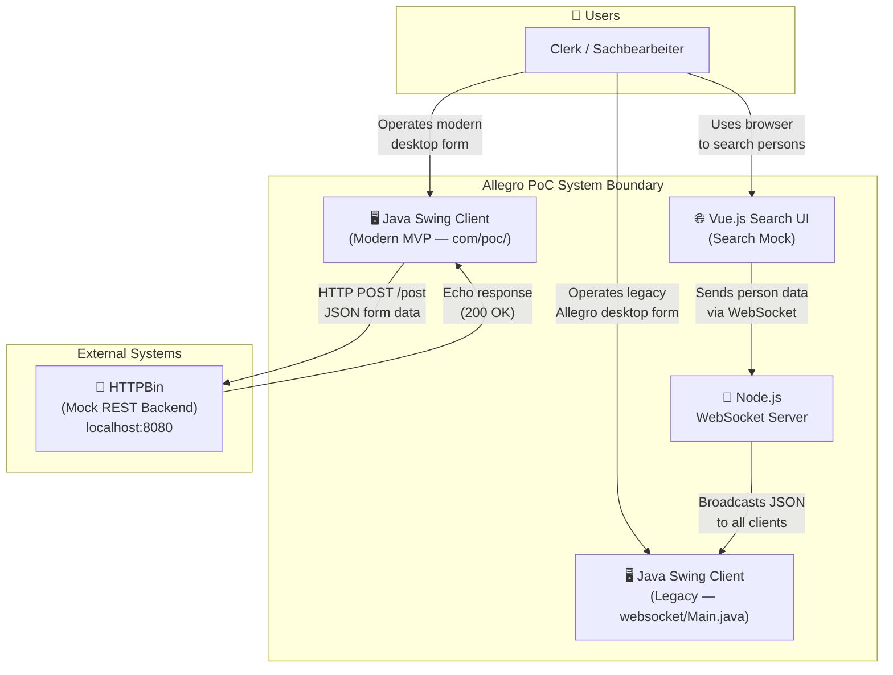

**External Interface Summary:**

| Partner | Protocol | Port | Direction | Description |
|---------|---------|------|-----------|-------------|
| Browser (Vue.js) | WebSocket (`ws://`) | 1337 | Client → Server | Person + payment data sent on button click / textarea change |
| Java Swing Legacy | WebSocket (`ws://`) | 1337 | Server → Client | JSON broadcast to all connected desktop clients |
| HTTPBin (Docker) | HTTP REST | 8080 | Client → Server | Form submission (JSON POST) + echo response |

### 3.2 Technical Context

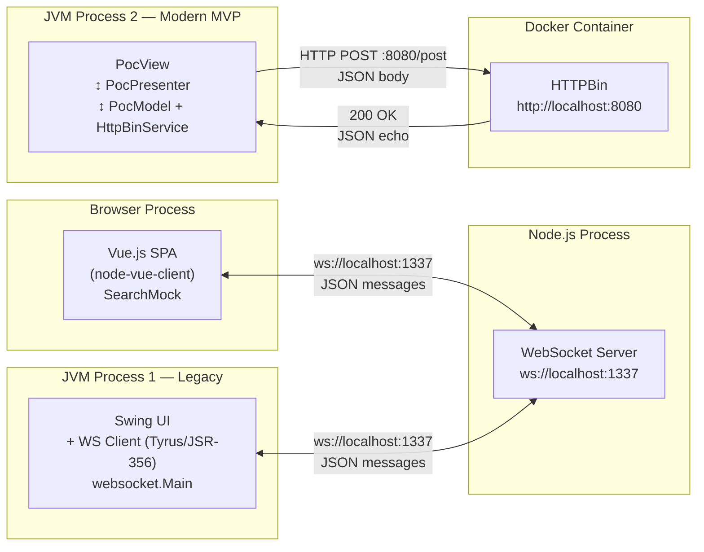

---

## 4. Solution Strategy

### 4.1 Technology Decisions

| Decision | Technology | Rationale |
|---------|-----------|-----------|
| **Message broker** | Node.js + `websocket` npm package | Lightweight, zero-config WebSocket relay; acts as a neutral intermediary between Java and browser clients |
| **Web frontend** | Vue.js 2.6 (SPA) | Low-overhead progressive framework; single-file components for clarity in a PoC context |
| **Legacy desktop client** | Java Swing + JSR-356 (Tyrus) | Minimal modification to the existing Allegro thick-client approach |
| **Modern desktop client** | Java Swing + MVP pattern | Demonstrates clean architectural separation of concerns as the target migration state |
| **REST backend (mock)** | HTTPBin (Docker `kennethreitz/httpbin`) | Provides a real HTTP endpoint without backend development; echoes payloads for verification |
| **Data format** | JSON (over WebSocket and HTTP) | Universal, human-readable; natively supported by all three technology stacks |
| **Java build tool** | Maven (Java 22) | Reproducible builds; modern Java features demonstrate language evolution path |
| **Vue build tool** | Vue CLI (`@vue/cli-service`) | Standard toolchain for Vue 2; handles Babel transpilation and dev server |

### 4.2 Architectural Approach

The PoC deliberately uses a **two-track architecture** to contrast the legacy and modernised Swing approaches
side-by-side:

```
Track A (Legacy)   — websocket/Main.java   — Monolithic class: UI + WS client + JSON parsing all in one
Track B (Modern)   — com/poc/**            — MVP pattern: PocView + PocPresenter + PocModel, cleanly separated
```

The **Node.js WebSocket Server** acts as the **integration hub** — a simple publish-subscribe relay that decouples
the Vue.js producer from the Java Swing consumer(s). Neither side needs to know about the other's technology stack.

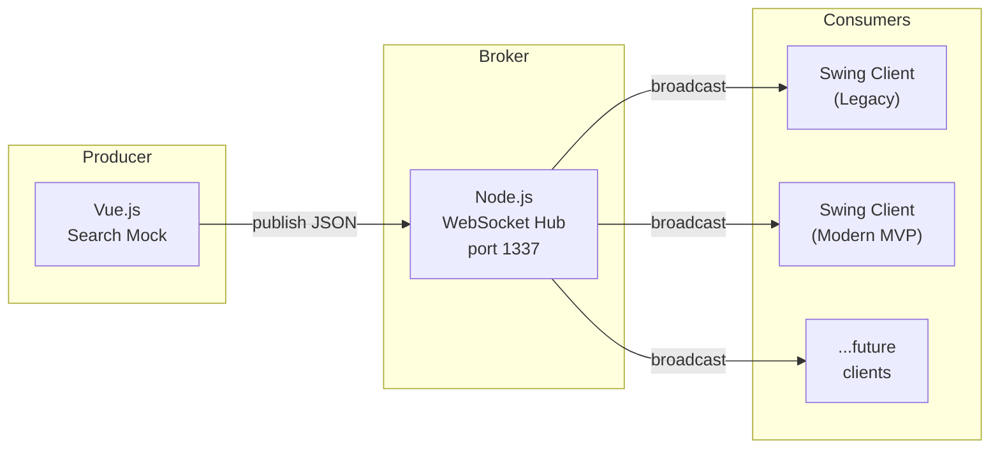

### 4.3 Quality Approach

| Quality Goal | Architectural Measure |
|-------------|----------------------|
| **Demonstrability** | In-memory mock data in Vue.js; HTTPBin echo for REST; all services start with single commands |
| **Evolvability** | MVP separation in modern Swing client; `EventEmitter` decouples model from view reactions |
| **Interoperability** | Technology-neutral JSON over WebSocket as the integration protocol |
| **Simplicity** | No database, no auth, no state persistence; pure in-memory PoC components |
| **Correctness** | Strongly typed model (`ModelProperties` enum, `ValueModel<T>`) prevents field identity mix-ups |

---

## 5. Building Block View

### 5.1 Level 1 — System Overview

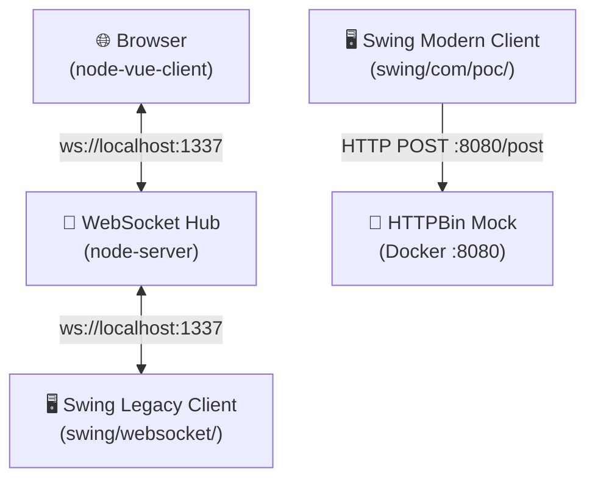

### 5.2 Level 2 — Container View

#### 5.2.1 `node-server` — WebSocket Relay

| Element | Description |
|---------|-------------|
| `WebsocketServer.js` | Single-file Node.js application; creates HTTP + WebSocket servers on the same port |
| In-memory `clients[]` | Array tracking all active WebSocket connections; no persistence |
| Message routing | All inbound UTF-8 messages are broadcast verbatim to every connected client |

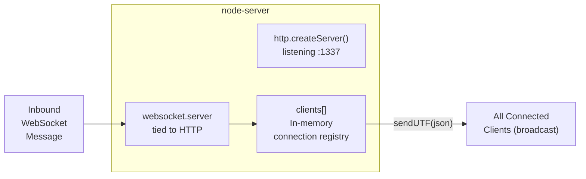

#### 5.2.2 `node-vue-client` — Vue.js SPA

| Component | Responsibility |
|-----------|---------------|
| `main.js` | Vue 2 application bootstrap; mounts `App` component into `#app` DOM element |
| `App.vue` | Root shell component; renders the branded header and hosts `<Search>` |
| `Search.vue` | All application logic: person search form, result display tables, WebSocket connection management, data send |

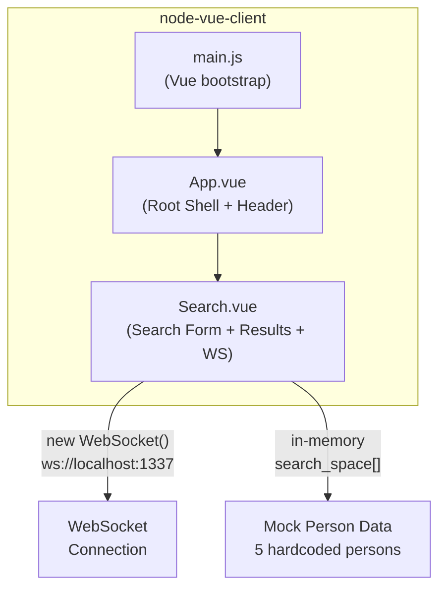

#### 5.2.3 `swing/websocket/` — Legacy Swing Client (Monolithic)

| Element | Responsibility |
|---------|---------------|
| `Main` (outer class) | `initUI()` — all Swing component definition; `main()` entry point; static field storage |
| `WebsocketClientEndpoint` (inner class) | JSR-356 annotated WS endpoint; connects to `ws://localhost:1337`; `@OnOpen`, `@OnClose`, `@OnMessage` handlers |
| `extract(String json)` | Manual streaming JSON parser that extracts the `{target, content}` envelope |
| `toSearchResult(String json)` | Manual streaming JSON parser for the person/payment payload |
| `Message` (inner record-like class) | Immutable value container for `(target, content)` |
| `SearchResult` (inner class) | Mutable value container for all 10 form field values |

#### 5.2.4 `swing/com/poc/` — Modern MVP Swing Client

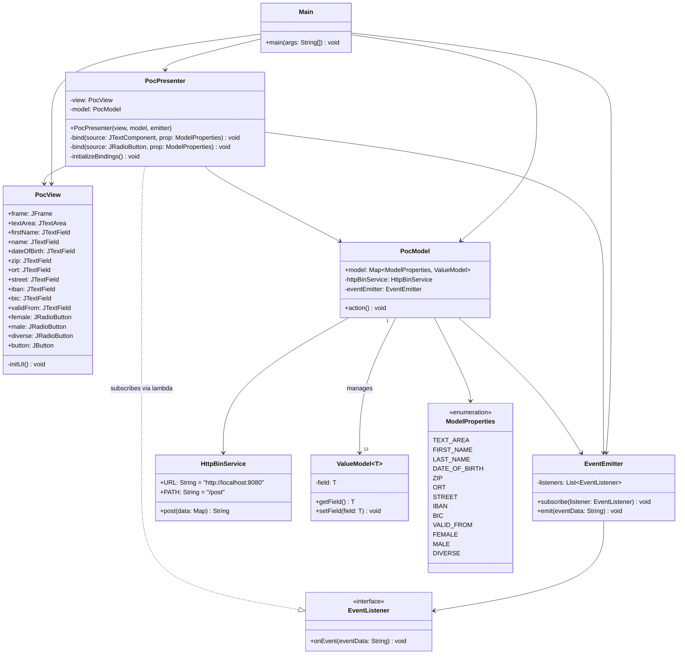

### 5.3 Key Interfaces

| Interface | Protocol | Message Format | Description |
|-----------|---------|----------------|-------------|
| Vue.js → Node WS Server | WebSocket | JSON `{target, content}` | Person/payment data sent on button click; text on textarea change |
| Node WS Server → Swing Legacy | WebSocket | JSON `{target, content}` | Verbatim broadcast to all desktop clients |
| Swing Modern → HTTPBin | HTTP POST `/post` | JSON flat object (UPPER_SNAKE_CASE keys) | Form field values submitted as key-value map |
| HTTPBin → Swing Modern | HTTP 200 | JSON echo + metadata | Full echo of submitted data returned in response body |

---

## 6. Runtime View

### 6.1 Scenario 1 — Person Search and Transfer to Allegro (Primary Use Case)

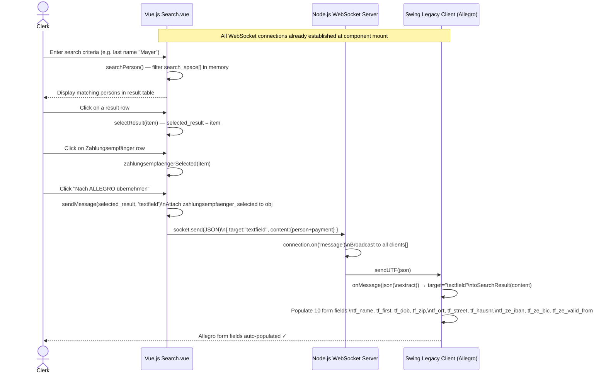

### 6.2 Scenario 2 — Textarea Synchronisation

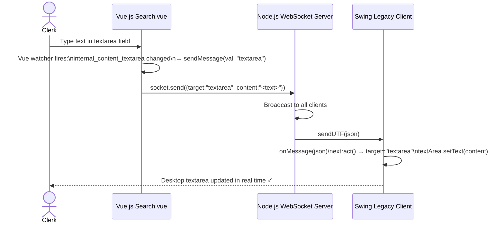

### 6.3 Scenario 3 — Modern Swing Client Form Submission (REST Track)

```mermaid
sequenceDiagram
    actor Clerk
    participant VIEW as PocView (Swing UI)
    participant PRESENTER as PocPresenter
    participant MODEL as PocModel
    participant HTTPBIN as HTTPBin localhost:8080

    Note over VIEW,MODEL: DocumentListeners bound at startup via initializeBindings()

    Clerk->>VIEW: Type values in text fields (Vorname, Name, PLZ...)
    VIEW->>PRESENTER: DocumentListener.insertUpdate / removeUpdate fires
    PRESENTER->>MODEL: valueModel.setField(content) for each field

    Clerk->>VIEW: Click "Anordnen" button
    VIEW->>PRESENTER: ActionListener triggered
    PRESENTER->>MODEL: model.action()

    MODEL->>MODEL: Collect all ModelProperties\ninto HashMap<String,String>
    MODEL->>HTTPBIN: HttpBinService.post(data)\nHTTP POST /post\nContent-Type: application/json
    HTTPBIN-->>MODEL: 200 OK + JSON echo body

    MODEL->>MODEL: eventEmitter.emit(responseBody)
    MODEL->>PRESENTER: EventListener.onEvent(responseBody)
    PRESENTER->>VIEW: view.textArea.setText(responseBody)\nClear all text fields\nReset gender selection to "female"
    VIEW-->>Clerk: Response shown in textarea; form cleared ✓
```

### 6.4 Scenario 4 — WebSocket Connection Lifecycle

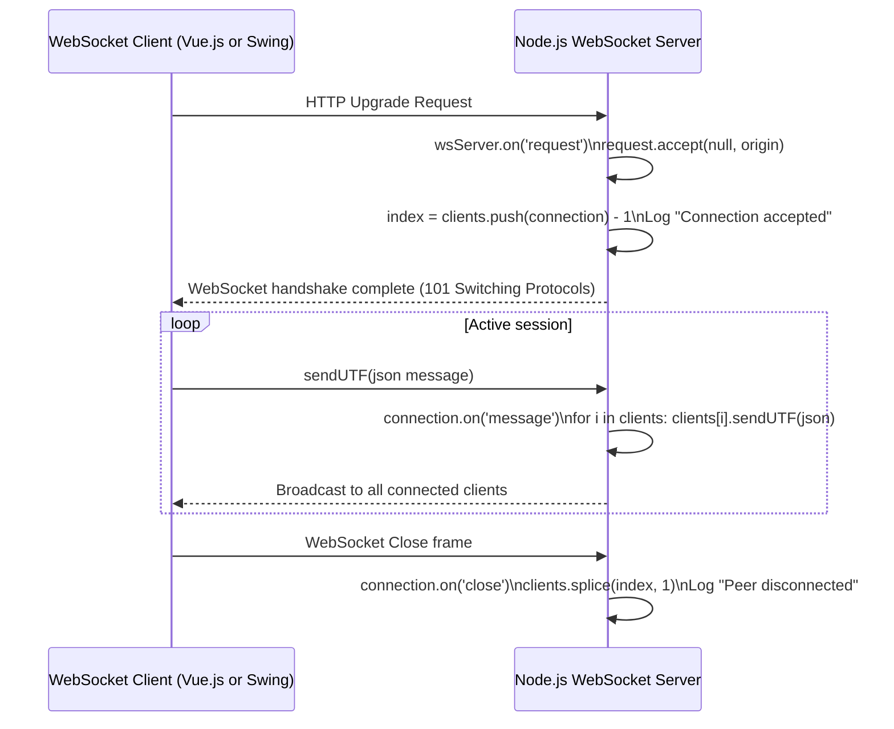

---

## 7. Deployment View

### 7.1 Local Development / Demo Environment

The PoC is designed exclusively for single-machine execution. All components run on `localhost`.

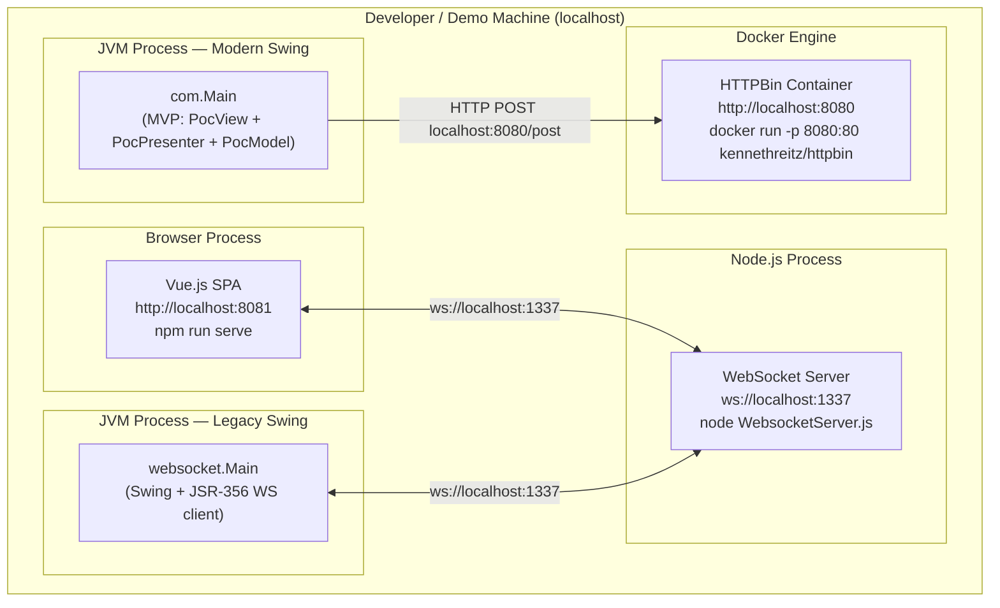

### 7.2 Component Startup Order

| Step | Command | Component Started | Port |
|------|---------|------------------|------|
| 1 | `docker run -p 8080:80 kennethreitz/httpbin` | HTTPBin mock backend | 8080 |
| 2 | `cd node-server/src && node WebsocketServer.js` | Node.js WebSocket relay | 1337 |
| 3 | `cd node-vue-client && npm run serve` | Vue.js web client | 8081 (Vue CLI default) |
| 4 | Run `websocket.Main` in IntelliJ | Legacy Swing client | — (WS client only) |
| 5 | Run `com.Main` in IntelliJ | Modern MVP Swing client | — (HTTP client only) |

> **Note:** Steps 4 and 5 represent two alternative / parallel Swing client generations; both can run
> simultaneously since they use different communication paths (WebSocket vs. REST).

### 7.3 Build Artefacts

| Module | Build Tool | Command | Output |
|--------|-----------|---------|--------|
| Java Swing (`swing/`) | Maven | `mvn package` | `target/websocket_swing-0.0.1-SNAPSHOT.jar` |
| Vue.js (`node-vue-client/`) | Vue CLI | `npm run build` | `node-vue-client/dist/` |
| Node server | None (script) | Run directly | `node-server/src/WebsocketServer.js` |

### 7.4 Infrastructure Requirements

| Requirement | Version / Minimum |
|------------|------------------|
| Java JDK | 22.0.1 or higher |
| Node.js | LTS 18.x or 20.x (not pinned) |
| npm | 6+ |
| Docker | Docker Desktop or Rancher Desktop |
| RAM per JVM process | ~256–512 MB |
| OS | Windows, macOS, or Linux |

---

## 8. Cross-cutting Concepts

### 8.1 Domain Model

The core domain objects shared across all components are **Person** and **Zahlungsempfänger** (payment recipient).
The REST submission maps these to the flat `PostObject` schema defined in `api.yml`.

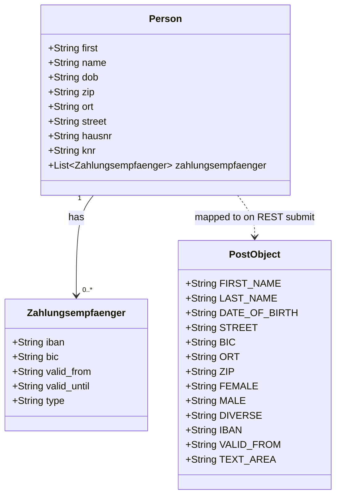

### 8.2 WebSocket Message Envelope

All messages exchanged over the WebSocket channel use a consistent two-field JSON envelope:

```json
{
  "target": "<textarea | textfield>",
  "content": "<string | object>"
}
```

| Field | Values | Semantics |
|-------|--------|-----------|
| `target = "textarea"` | String | Route the content string to the multi-line text area |
| `target = "textfield"` | String | Route the content object to structured input fields |
| `content` | String / Object | Free text (textarea) or person + payment JSON (textfield) |

### 8.3 Observer / Event Pattern

The modern Swing MVP client uses a custom **Observer pattern** to decouple `PocModel` (event source) from
`PocPresenter` (event consumer):

```mermaid
flowchart LR
    subgraph model["com.poc.model"]
        EE["EventEmitter\n+subscribe(EventListener)\n+emit(String)"]
        EL["<<interface>>\nEventListener\n+onEvent(String)"]
    end

    subgraph presentation["com.poc.presentation"]
        PP["PocPresenter\nsubscribes via lambda\nin constructor"]
    end

    EE -->|"notifies all"| EL
    EL <|..| PP
    PP -->|"subscribe()"| EE
```

- `EventEmitter.subscribe(listener)` — registers a listener (called once in `PocPresenter` constructor)
- `EventEmitter.emit(eventData)` — called by `PocModel.action()` after receiving the HTTP response body
- The lambda in the presenter clears all view fields and populates the textarea with the response

### 8.4 Two-Way Data Binding (MVP Pattern)

`PocPresenter` implements bidirectional binding between Swing components and the `PocModel`:

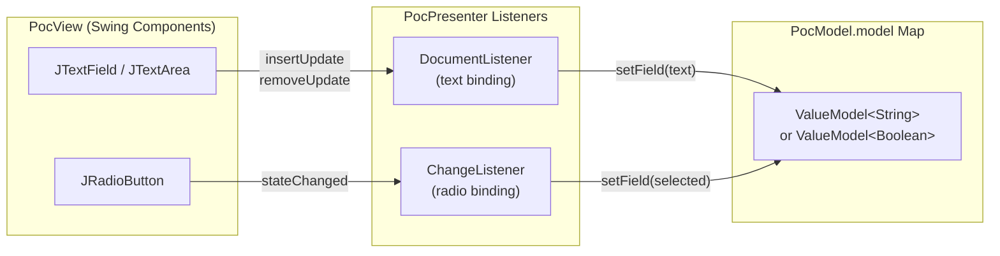

### 8.5 Error Handling

| Component | Strategy |
|-----------|---------|
| **Node.js WS Server** | No explicit error handling; unhandled exceptions will crash the process |
| **Vue.js `Search.vue`** | `socket.onopen` is handled; no `onerror` or `onclose` handlers — silent failure on disconnect |
| **Swing Legacy** | Checked exceptions (`IOException`, `DeploymentException`, `InterruptedException`) at construction; wrapped in `RuntimeException` |
| **Swing Modern / Presenter** | `IOException` and `InterruptedException` from `model.action()` wrapped in `RuntimeException` in the `ActionListener` |
| **HTTP error codes** | `connection.getResponseCode()` is logged but non-2xx responses will throw `IOException` on `getInputStream()` — not caught |

### 8.6 Logging

All logging is via `System.out.println`. No structured logging framework is used anywhere in the codebase.

| Component | Log Events Observed |
|-----------|---------------------|
| Node.js Server | Connection accepted / rejected; message received; peer disconnected |
| Swing Legacy | "opening websocket"; "closing websocket" |
| Swing Modern — HttpBinService | HTTP response code + response body |
| Swing Modern — PocModel | All `ModelProperties` values printed on `action()` |
| Swing Modern — PocPresenter | "I am in insert update" / "I am in remove update" (debug) |

### 8.7 Security Concepts

> ⚠️ **PoC only — not suitable for any network deployment in its current state**

| Concern | Current Status | Production Requirement |
|---------|---------------|----------------------|
| Authentication | ❌ None | JWT / session-based auth |
| Authorisation | ❌ None — all clients receive all messages | Role-based access control |
| Transport security | ❌ Plain `ws://` and `http://` | `wss://` and `https://` (TLS) |
| CORS | ⚠️ Open — accepts any origin | Restrict to known origins |
| Input validation | ❌ None | Sanitise all user inputs |
| Sensitive data (IBAN/BIC) | ⚠️ Transmitted in cleartext | Encrypt in transit and at rest |

### 8.8 Internationalisation

The application is implemented entirely in **German** (UI labels, placeholder text, error messages, test data).
No i18n framework is used. All text is hardcoded in source files.

---

## 9. Architecture Decisions

### ADR-001: Node.js as Technology-Neutral WebSocket Relay

**Status:** Implemented (observed in `node-server/src/WebsocketServer.js`)

**Context:**
The PoC must connect a Vue.js browser application and a Java Swing desktop application in real time.
Direct browser-to-desktop peer connections are not feasible due to browser security model restrictions.

**Decision:**
Use a minimal Node.js WebSocket server as a message broker. All clients connect to `ws://localhost:1337`;
the server broadcasts every inbound message verbatim to all connected clients with no transformation.

**Consequences:**
- ✅ Technology-neutral — Java and JavaScript clients are treated identically
- ✅ Zero business logic in the server — trivially auditable (67 lines)
- ✅ Supports N:M fan-out (multiple desktop clients can receive simultaneously)
- ⚠️ No message filtering or routing by recipient — all clients receive all messages
- ⚠️ No persistence — fire-and-forget; late-connecting clients miss earlier messages
- ⚠️ Single point of failure — process crash disconnects all clients

---

### ADR-002: MVP Pattern for the Modernised Swing Client

**Status:** Implemented (observed in `swing/src/main/java/com/poc/`)

**Context:**
The legacy Swing client (`websocket/Main.java`) packs all concerns (UI layout, WebSocket handling, JSON parsing)
into a single ~450-line class. This approach is hard to test, extend, or maintain.

**Decision:**
Introduce the **Model-View-Presenter (MVP)** pattern with three clearly separated classes:
`PocView` (pure Swing layout), `PocModel` (state + business logic + HTTP), `PocPresenter` (bidirectional binder).
A custom `EventEmitter` further decouples the model's async response from the presenter.

**Consequences:**
- ✅ Each class has a single, well-defined responsibility
- ✅ `PocModel` can be unit-tested independently of the Swing Event Dispatch Thread
- ✅ `PocView` can be replaced (e.g., with a web view) without changing model logic
- ✅ `EventEmitter` is extensible — additional subscribers can be added without modifying the model
- ⚠️ More files and boilerplate compared to the monolithic approach
- ⚠️ `ValueModel<T>` is a simple container; it does not support outward change notifications from model to view

---

### ADR-003: HTTPBin Docker Container as Mock REST Backend

**Status:** Implemented (observed in `HttpBinService.java` and `README.md`)

**Context:**
The modern Swing client must demonstrate a real HTTP POST call and process the response, but building a real
backend is out of scope for the PoC.

**Decision:**
Use the public `kennethreitz/httpbin` Docker image. It accepts any JSON POST body and echoes the received
data back in its response. The client posts to `http://localhost:8080/post` and displays the echo in the textarea.

**Consequences:**
- ✅ Zero backend development; available in seconds via Docker
- ✅ Echo response verifies form data was serialised correctly
- ✅ `api.yml` documents the intended contract against this endpoint
- ⚠️ HTTPBin echo response structure differs from any real Allegro backend response
- ⚠️ Requires Docker to be running; adds to demo setup complexity

---

### ADR-004: In-Memory Mock Person Data in Vue.js Client

**Status:** Implemented (observed in `Search.vue` `search_space` data property)

**Context:**
Person search typically requires a database or external API. For the PoC, adding real data infrastructure
would increase complexity without contributing to the core integration demonstration.

**Decision:**
Embed a hardcoded array of 5 German test persons (complete with addresses and IBAN/BIC records) directly
in the Vue.js component's `data()` function. Search is implemented as a client-side in-memory filter.

**Consequences:**
- ✅ No database or API required; instantly available
- ✅ Realistic German test data (plausible IBANs, addresses, BIC codes)
- ⚠️ Not scalable beyond a handful of records
- ⚠️ Adding or changing data requires redeployment of the frontend

---

### ADR-005: Dual Swing Client Coexistence in One Maven Project

**Status:** Implemented (packages `websocket.*` and `com.poc.*` in the same `pom.xml`)

**Context:**
The PoC must demonstrate both the legacy approach and the modernised approach, ideally allowing
side-by-side comparison.

**Decision:**
Keep both `websocket/Main.java` (legacy monolith) and `com/Main.java` (MVP) within the same Maven project
under different Java packages. Each has its own `main()` method and can be run independently.

**Consequences:**
- ✅ Direct architectural comparison is possible within one repository
- ✅ Legacy code serves as the baseline reference
- ⚠️ The two clients are not feature-equivalent (legacy = WS receiver; modern = REST submitter)
- ⚠️ Non-standard Maven project structure (two unrelated `Main` classes)

---

## 10. Quality Requirements

### 10.1 Quality Tree

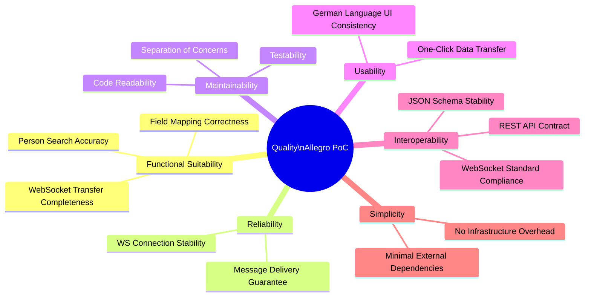

### 10.2 Quality Scenarios

| ID | Attribute | Scenario | Stimulus | Expected Response |
|----|-----------|---------|---------|------------------|
| QS-01 | **Correctness** | Transfer person to Allegro | Click "Nach ALLEGRO übernehmen" with "Hans Mayer" + IBAN selected | All 10 Swing form fields populated with correct values within 1 second |
| QS-02 | **Correctness** | Textarea sync | Type "Hello" in Vue textarea | Desktop textarea shows "Hello" within 500ms |
| QS-03 | **Reliability** | WS server restart | Node.js process restarts | Vue client shows no reconnect (known gap); manual page reload required |
| QS-04 | **Maintainability** | Add new model field | Add `NATIONALITY` to `ModelProperties` enum | Only `PocView`, `PocPresenter.initializeBindings()`, and `PocModel` constructor need changes; no impact on EventEmitter or HttpBinService |
| QS-05 | **Interoperability** | Replace mock backend | Change `HttpBinService.URL` to point at a real Allegro endpoint | No structural code change required — only URL/path configuration |
| QS-06 | **Demonstrability** | Cold-start demo | Follow README; execute 5 startup steps | Full end-to-end workflow working within 2 minutes |
| QS-07 | **Simplicity** | Dependency audit | Count runtime dependencies | Java: 5 JARs; Vue: 2 runtime packages; Node: 1 package |

---

## 11. Risks and Technical Debt

### 11.1 Technical Risks

| ID | Risk | Probability | Impact | Mitigation |
|----|------|-------------|--------|-----------|
| R-01 | **WS Server is a Single Point of Failure** — Node.js crash disconnects all clients with no recovery | Medium | High | Use `nodemon` or `pm2` process manager for demo stability; add WS reconnect in clients |
| R-02 | **No error recovery in Vue.js WS client** — missing `onerror`/`onclose` handlers; user gets no feedback on disconnect | Medium | Medium | Implement reconnect logic with exponential backoff and a connection-status indicator |
| R-03 | **HTTPBin is not a real Allegro backend** — echo response structure is structurally different from any real service | High (by design) | Medium | Replace with a stub matching the real Allegro service contract when available |
| R-04 | **Sensitive financial data (IBAN/BIC) transmitted unencrypted** — acceptable for localhost demo only | Low (localhost) | Critical (network) | Require `wss://` + `https://` before any deployment outside localhost |
| R-05 | **Java 22 unnamed variable** `var _ = new PocPresenter(...)` — limits compatibility with JDK < 22 | Low | Low | Clearly pin Java version in CI configuration; document SDK requirement in README |
| R-06 | **Vue 2 End-of-Life** — Vue 2 reached end of life on 31 December 2023 | High | Medium | Migrate to Vue 3 in any production follow-on project |

### 11.2 Technical Debt

| ID | Type | Location | Description | Priority | Est. Effort |
|----|------|---------|-------------|----------|------------|
| TD-01 | **Design Debt** | `websocket/Main.java` | ~450-line monolithic class mixes UI layout, WebSocket lifecycle, and JSON parsing in one place | High | 2–3 days (MVP refactor shown in `com/poc/`) |
| TD-02 | **Code Debt** | `websocket/Main.java` | Manual streaming JSON parser using boolean flag state machine — error-prone and verbose | High | 1 day (replace with Jackson `ObjectMapper`) |
| TD-03 | **Code Debt** | `HttpBinService.java` | Uses raw legacy `HttpURLConnection` instead of modern `java.net.http.HttpClient` (available since Java 11) | Medium | 2 hours |
| TD-04 | **Design Debt** | `Search.vue` | All concerns (form state, search logic, WebSocket management) in one 250-line component | Medium | 1 day (split into composables or sub-components) |
| TD-05 | **Test Debt** | Entire codebase | Zero automated tests (unit, integration, or end-to-end) | High | 2–4 days for meaningful coverage |
| TD-06 | **Code Debt** | `PocPresenter.java` | Debug `System.out.println` statements left in `DocumentListener` callbacks | Low | 30 minutes |
| TD-07 | **Design Debt** | `ViewData.java` | Empty placeholder class with no content and no documented purpose | Low | Remove or implement |
| TD-08 | **Infrastructure Debt** | `node-server/package.json` | No `main` entry, no `start` script, no Node.js version pinning | Medium | 1 hour |
| TD-09 | **Security Debt** | `WebsocketServer.js` | `request.accept(null, request.origin)` accepts any origin — comment notes this was deferred ("later we maybe allow...") | High (any real deploy) | 1 hour |
| TD-10 | **Dependency Debt** | `pom.xml` | Mixes `tyrus-websocket-core 1.2.1` with `tyrus-standalone-client 1.15` — inconsistent Tyrus versions | Medium | 2 hours |

### 11.3 Improvement Recommendations

1. **Add WebSocket reconnect logic** to the Vue.js `Search.vue` component with exponential backoff and a
   visible connection-status badge.
2. **Migrate legacy Swing client** to the MVP architecture demonstrated in `com/poc/` as the next
   modernisation step.
3. **Replace manual JSON streaming parser** in `websocket/Main.java` with Jackson `ObjectMapper` for
   robustness and readability.
4. **Add unit tests** for: `PocModel.action()`, `Search.vue` search/filter logic, and `websocket/Main.java`'s
   `extract()` and `toSearchResult()` helper methods.
5. **Introduce structured logging**: SLF4J + Logback for Java; `winston` or `pino` for Node.js.
6. **Formalise the WebSocket message schema** as JSON Schema (or OpenAPI webhooks) to document the
   `{target, content}` contract between Vue.js and the Swing receiver.
7. **Upgrade Vue 2 → Vue 3** for any production follow-on development; the `Search` component logic
   maps well to the Vue 3 Composition API.
8. **Add a `docker-compose.yml`** to enable one-command environment startup covering both HTTPBin and
   the Node.js WebSocket server.
9. **Align Tyrus dependency versions** in `pom.xml` — use `tyrus-standalone-client 1.15` consistently
   and remove the conflicting `tyrus-websocket-core 1.2.1`.

---

## 12. Glossary

### 12.1 Domain Terms

| Term | German Original | Definition |
|------|----------------|-----------|
| **Allegro** | Allegro | The name of the target legacy desktop application being modernised; an administrative case-management system used in the German social-insurance domain |
| **Zahlungsempfänger** | Zahlungsempfänger | Payment recipient; a bank account record (IBAN + BIC + validity period) associated with a person |
| **Sachbearbeiter / Clerk** | Sachbearbeiter | The end user; an administrative clerk who searches for persons and manages their data in Allegro |
| **Versicherter** | Versicherter | Insured person / policy holder; the natural person whose data is managed |
| **Vorname** | Vorname | First name / given name |
| **Nachname / Name** | Nachname | Last name / surname / family name |
| **Geburtsdatum (dob)** | Geburtsdatum | Date of birth |
| **PLZ** | Postleitzahl | Postal code / ZIP code |
| **Ort** | Ort | City / town / locality |
| **Strasse** | Straße | Street name |
| **Hausnummer** | Hausnummer | House number / building number |
| **IBAN** | IBAN | International Bank Account Number — standardised account identifier |
| **BIC** | BIC | Bank Identifier Code (SWIFT code) — identifies the bank of an account |
| **Gültig ab / valid_from** | Gültig ab | "Valid from" — the date from which a Zahlungsempfänger record is effective |
| **Kundennummer (knr)** | Kundennummer | Customer number; unique identifier for the person in the Allegro system |
| **Anordnen** | Anordnen | "Arrange" / "Submit" — label on the Swing form's submit button |
| **Nach ALLEGRO übernehmen** | — | "Transfer to ALLEGRO" — Vue.js button that triggers the WebSocket push to all desktop clients |
| **Geschlecht** | Geschlecht | Gender; represented by three radio buttons: Weiblich (female), Männlich (male), Divers (diverse/non-binary) |
| **Betriebsbez.** | Betriebsbezeichnung | Business / employer designation |
| **RV-Nummer** | Rentenversicherungsnummer | Pension insurance number |
| **BG-Nummer** | Berufsgenossenschaftsnummer | Employers' liability insurance association number |

### 12.2 Technical Terms

| Term | Definition |
|------|-----------|
| **WebSocket** | Bidirectional, full-duplex communication protocol over a persistent TCP connection, standardised in RFC 6455 |
| **JSR-356** | Java API for WebSocket (Jakarta WebSocket); the standard Java EE/Jakarta EE specification for WebSocket endpoints |
| **Tyrus** | GlassFish reference implementation of JSR-356; used here as a standalone client library |
| **MVP (Model-View-Presenter)** | Architectural pattern separating UI (View), business state (Model), and coordination logic (Presenter) |
| **EventEmitter** | A lightweight Observer/Publish-Subscribe component; holds a list of `EventListener` instances and notifies them on `emit()` |
| **ValueModel\<T\>** | Generic typed wrapper providing `getField()` / `setField()` accessors for a single typed value |
| **ModelProperties** | Java `enum` enumerating all 13 form field identifiers; used as keys in `PocModel`'s `EnumMap` |
| **HTTPBin** | An open-source HTTP request/response testing service (`kennethreitz/httpbin` Docker image); echoes any posted JSON body |
| **OpenAPI** | Specification format (formerly Swagger) for describing REST APIs; used in `api.yml` at version 3.0.1 |
| **SPA (Single Page Application)** | A web application that loads a single HTML page and updates content dynamically without full page reloads |
| **Vue CLI** | Official command-line toolchain for Vue.js project scaffolding, building, and development server |
| **CountDownLatch** | Java `java.util.concurrent` synchronisation primitive; used in both Swing clients to keep the JVM process alive |
| **GridBagLayout** | A flexible Java Swing layout manager that positions components in a grid with independently sized cells |
| **DocumentListener** | Swing listener interface for monitoring text changes in `Document` objects (underlying model of `JTextComponent`) |
| **CORS** | Cross-Origin Resource Sharing; a browser security mechanism controlling which origins may access a resource |

---

## Appendix

### A. Source File Inventory

| File | Module | Language | Approx. Lines | Architectural Role |
|------|--------|---------|--------------|-------------------|
| `swing/src/main/java/websocket/Main.java` | Java Legacy | Java 22 | ~460 | Legacy Swing WS client (monolithic design) |
| `swing/src/main/java/com/Main.java` | Java Modern | Java 22 | ~23 | Modern Swing entry point (MVP bootstrap) |
| `swing/src/main/java/com/poc/presentation/PocView.java` | Java Modern | Java 22 | ~203 | Swing UI layout (View layer) |
| `swing/src/main/java/com/poc/presentation/PocPresenter.java` | Java Modern | Java 22 | ~113 | MVP Presenter / bidirectional binder |
| `swing/src/main/java/com/poc/model/PocModel.java` | Java Modern | Java 22 | ~49 | Model state container + HTTP action trigger |
| `swing/src/main/java/com/poc/model/HttpBinService.java` | Java Modern | Java 22 | ~38 | REST HTTP client (HttpURLConnection) |
| `swing/src/main/java/com/poc/model/EventEmitter.java` | Java Modern | Java 22 | ~21 | Observer pattern — event publisher |
| `swing/src/main/java/com/poc/model/EventListener.java` | Java Modern | Java 22 | ~5 | Observer pattern — subscriber interface |
| `swing/src/main/java/com/poc/model/ModelProperties.java` | Java Modern | Java 22 | ~18 | Enum of 13 form field identifiers |
| `swing/src/main/java/com/poc/ValueModel.java` | Java Modern | Java 22 | ~18 | Generic typed field wrapper |
| `node-server/src/WebsocketServer.js` | Node.js Server | JavaScript | ~67 | WebSocket relay/broadcast server |
| `node-vue-client/src/App.vue` | Vue.js Client | Vue 2 SFC | ~46 | Root application shell + header |
| `node-vue-client/src/components/Search.vue` | Vue.js Client | Vue 2 SFC | ~258 | Core search UI + WebSocket producer |
| `node-vue-client/src/main.js` | Vue.js Client | JavaScript | ~8 | Vue application bootstrap |
| `api.yml` | API Spec | YAML (OpenAPI 3.0.1) | ~97 | REST API contract definition |
| `pom.xml` | Build | XML (Maven) | ~65 | Java build + dependency descriptor |

### B. Dependency Overview

**Java (Maven `pom.xml`):**

| Dependency | Version | Purpose |
|-----------|---------|---------|
| `org.glassfish.websocket:websocket-api` | 0.2 | GlassFish WebSocket API bundle |
| `org.glassfish.tyrus.bundles:tyrus-standalone-client` | 1.15 | Tyrus WS client runtime |
| `org.glassfish.tyrus:tyrus-websocket-core` | 1.2.1 | ⚠️ Inconsistent version — should align with 1.15 |
| `org.glassfish.tyrus:tyrus-spi` | 1.15 | Tyrus SPI layer |
| `javax.json:javax.json-api` | 1.1.4 | JSON-P API |
| `org.glassfish:javax.json` | 1.0.4 | JSON-P reference implementation |

**Node.js (`node-server/package.json`):**

| Dependency | Version | Purpose |
|-----------|---------|---------|
| `websocket` | ^1.0.35 | WebSocket server + client implementation (node-websocket) |

**Vue.js (`node-vue-client/package.json`):**

| Dependency | Version | Purpose |
|-----------|---------|---------|
| `vue` | ^2.6.10 | Vue.js framework (⚠️ EOL since Dec 2023) |
| `core-js` | ^3.1.2 | ES2015+ polyfills for browser compatibility |

### C. Architecture Evolution Roadmap

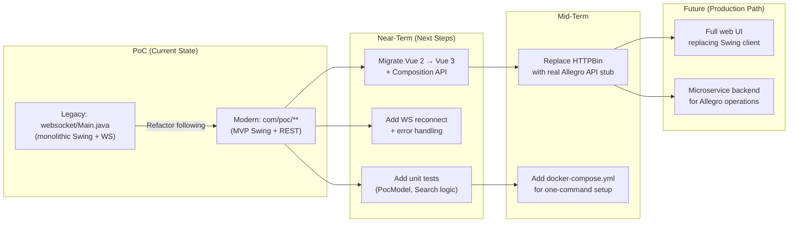

---

*This document was generated by direct source code analysis of the repository.*  
*All architectural observations are derived from reading the actual implementation files:*  
*`websocket/Main.java`, `com/poc/**`, `WebsocketServer.js`, `Search.vue`, `App.vue`, `api.yml`, `pom.xml`.*
