# Allegro PoC — Architecture Documentation (arc42)

**Version:** 1.0  
**Date:** 2025-01-30  
**Status:** Generated from code analysis  
**Project:** `websocket_swing` — Allegro Modernization Proof of Concept

> 📁 **Intended location:** `docs/arc42-architecture.md`  
> This file was generated at the repository root because the `docs/` directory did not yet exist.  
> To move it to the intended location, run:  
> ```bash
> mkdir -p docs && mv arc42-architecture.md docs/arc42-architecture.md
> ```

---

## Table of Contents

1. [Introduction and Goals](#1-introduction-and-goals)
2. [Architecture Constraints](#2-architecture-constraints)
3. [System Scope and Context](#3-system-scope-and-context)
4. [Solution Strategy](#4-solution-strategy)
5. [Building Block View](#5-building-block-view)
6. [Runtime View](#6-runtime-view)
7. [Deployment View](#7-deployment-view)
8. [Crosscutting Concepts](#8-crosscutting-concepts)
9. [Architecture Decisions](#9-architecture-decisions)
10. [Quality Requirements](#10-quality-requirements)
11. [Risks and Technical Debt](#11-risks-and-technical-debt)
12. [Glossary](#12-glossary)

---

## 1. Introduction and Goals

### 1.1 Requirements Overview

The **Allegro PoC** (Proof of Concept) demonstrates a modernization strategy for a legacy enterprise desktop application — **Allegro** — used in the context of German social-security and/or statutory accident insurance administration. The project explores a hybrid architecture in which a new, browser-based frontend communicates in real time with an existing Java Swing desktop application through a WebSocket message bus.

**Primary Goal:**  
Prove that a modern web-based search UI can locate customer records and push selected data directly into the legacy Allegro desktop application with zero manual data re-entry, using WebSocket as the integration channel.

**Key Features:**

| # | Feature | Description |
|---|---------|-------------|
| 1 | Customer Search | Full-text/field-level search over mock customer data in the Vue.js frontend |
| 2 | Payment Recipient Selection | Display and select a customer's Zahlungsempfänger (bank details — IBAN/BIC) |
| 3 | Real-time Data Transfer | Push selected customer record to the Allegro desktop via WebSocket broadcast |
| 4 | Allegro Desktop Reception | Java Swing form automatically populates fields with incoming WebSocket data |
| 5 | HTTP Backend Integration | Allegro submits collected form data to an HTTP backend (HTTPBin mock) |
| 6 | Event-Driven UI Refresh | After successful HTTP submission, the Allegro UI resets form fields via events |

### 1.2 Quality Goals

| Priority | Quality Goal | Scenario / Measure |
|----------|--------------|--------------------|
| 1 | **Demonstrability** | The PoC must clearly illustrate the integration path; a demo must run with a single local `npm` + `java` command pair |
| 2 | **Low Integration Latency** | WebSocket message from the browser must appear in the Swing form within < 1 second on a local network |
| 3 | **Maintainability** | The Swing client uses MVP pattern, keeping UI, logic, and data clearly separated |
| 4 | **Extensibility** | The WebSocket server is stateless and protocol-agnostic; additional clients can be added without changing server code |
| 5 | **Correctness** | Data fields transferred over WebSocket must match exactly those rendered in the Swing form |

### 1.3 Stakeholders

| Role | Description | Expectations |
|------|-------------|--------------|
| Solution Architect | Evaluates feasibility of the modernization approach | Clear demonstration that web ↔ desktop integration via WebSocket is viable |
| Legacy Application Team | Maintains the Allegro desktop | Non-invasive integration; Swing code receives data without restructuring core logic |
| Frontend Developer | Builds the new web UI | Standard Vue.js development workflow; no exotic runtime dependencies |
| IT Operations | Runs the infrastructure | Simple startup procedure; Docker + Node.js + JVM only |
| Business Analyst | Validates domain coverage | All relevant customer and payment fields are transferred correctly |

---

## 2. Architecture Constraints

### 2.1 Technical Constraints

| Constraint | Detail |
|------------|--------|
| **Java Version** | Java SDK ≥ 22.0.1 (language level 22 enforced by `maven-compiler-plugin`) |
| **Build Tool (Java)** | Apache Maven (`pom.xml`, artifact `websocket_swing:0.0.1-SNAPSHOT`) |
| **WebSocket Library (Java)** | GlassFish Tyrus standalone client (`tyrus-standalone-client:1.15`), JSR-356 API (`websocket-api:0.2`) |
| **JSON Library (Java)** | `javax.json-api:1.1.4` + `org.glassfish:javax.json:1.0.4` |
| **Node.js Runtime** | Node.js (version unspecified); uses `websocket:^1.0.35` npm package |
| **Vue.js Version** | Vue 2.6.10 (Options API, single-file components) |
| **Vue Build Tooling** | `@vue/cli-service:^4.0.0`, Babel, ESLint |
| **Mock Backend** | Docker image `kennethreitz/httpbin` exposed on port 8080 |
| **WebSocket Port** | 1337 (hard-coded in server and client) |
| **HTTP Backend Port** | 8080 (hard-coded in `HttpBinService.java` and `api.yml`) |
| **IDE** | IntelliJ IDEA (recommended; `.launch` file included) |

### 2.2 Organizational Constraints

| Constraint | Detail |
|------------|--------|
| **Scope** | Proof of Concept only — not production-ready; mock data, no persistence |
| **Single Developer Setup** | All three components run on one developer machine (localhost) |
| **No Authentication** | WebSocket server accepts all origins; no auth tokens or session management |
| **No Persistent Storage** | In-memory client list in the Node.js server; no database |

### 2.3 Conventions

| Convention | Detail |
|------------|--------|
| **Java Package Structure** | `com.poc.model` (domain/data), `com.poc.presentation` (UI layer), `com` (entry point) |
| **Vue Component Naming** | PascalCase single-file components (`Search.vue`, `App.vue`) |
| **API Contract** | OpenAPI 3.0.1 specification (`api.yml`) documents the HTTPBin POST endpoint |
| **Message Format** | WebSocket messages are UTF-8 JSON strings with `{ target, content }` envelope |
| **Coding Language** | UI labels and field names are in German (domain language of the target system) |

---

## 3. System Scope and Context

### 3.1 Business Context

The system bridges a modern browser-based search tool with a legacy enterprise desktop application. Operators use the new Search Mock to find customers and bank details, then transfer selections directly into the Allegro desktop, replacing manual data entry.

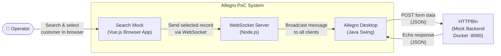

**External Interfaces:**

| Partner / External System | Direction | Data Exchanged |
|---------------------------|-----------|----------------|
| **Operator (User)** | Input | Search criteria; person/bank-detail selection; textarea input |
| **HTTPBin (Docker mock)** | Outbound from Desktop | Customer form data (POST); echoed response body displayed in textarea |

### 3.2 Technical Context

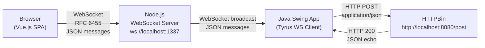

**Technical Interface Summary:**

| Interface | Protocol | Format | Port |
|-----------|----------|--------|------|
| Browser → WS Server | WebSocket (RFC 6455) | UTF-8 JSON | 1337 |
| WS Server → Swing Client | WebSocket (RFC 6455) | UTF-8 JSON | 1337 |
| Swing Client → HTTPBin | HTTP POST | `application/json` | 8080 |
| HTTPBin → Swing Client | HTTP 200 | `application/json` echo | 8080 |

**WebSocket Message Envelope (Browser → Server → Desktop):**

```json
{
  "target": "textfield",
  "content": {
    "first": "Hans",
    "name": "Mayer",
    "dob": "1981-01-08",
    "zip": "95183",
    "ort": "Trogen",
    "street": "Isaaer Str.",
    "hausnr": "23",
    "knr": "79423984",
    "zahlungsempfaenger": {
      "iban": "DE27100777770209299700",
      "bic": "ERFBDE8E759",
      "valid_from": "2020-01-04"
    }
  }
}
```

---

## 4. Solution Strategy

### 4.1 Technology Decisions

| Decision | Technology Chosen | Rationale |
|----------|-------------------|-----------|
| **Integration channel** | WebSocket (RFC 6455) | Full-duplex, low-latency; allows push from browser to desktop without polling; browser-native API |
| **WebSocket server** | Node.js + `websocket` npm package | Minimal footprint; straightforward broadcast hub; no business logic needed on the server |
| **Legacy client language** | Java 22 + Swing | Existing Allegro codebase constraint; Swing provides mature desktop UI toolkit |
| **WebSocket client library (Java)** | GlassFish Tyrus | JSR-356 reference implementation; works standalone without a Java EE container |
| **New frontend framework** | Vue.js 2 | Progressive framework; single-file components enable rapid PoC development |
| **HTTP mock backend** | HTTPBin (Docker) | Zero-code backend that echoes any JSON POST body back; ideal for validating data serialization |
| **API contract** | OpenAPI 3.0.1 (`api.yml`) | Documents the expected request/response structure for the backend integration |

### 4.2 Architecture Approach

The overall approach is a **Hub-and-Spoke integration pattern** centred on the WebSocket server:

- The **Node.js WebSocket server** acts as a **message broadcast hub** — all messages sent by any client are forwarded to all connected clients.
- The **Vue.js SPA** is the "spoke" that produces customer-selection messages.
- The **Java Swing application** is the "spoke" that consumes those messages and populates its form.
- A separate **HTTP channel** is used for the Swing application to submit data to the backend, independent of the WebSocket channel.

The Java Swing client follows the **Model-View-Presenter (MVP)** pattern:

```
PocView (Swing widgets) ←→ PocPresenter (glue/binding) ←→ PocModel (state + HTTP)
                                     ↕
                              EventEmitter/EventListener
                              (custom observer pattern)
```

### 4.3 Key Design Decisions

| Decision | Context | Consequences |
|----------|---------|--------------|
| **Broadcast-all WebSocket server** | Simplest possible relay; no routing logic needed for PoC | ✅ Zero server-side complexity; ⚠️ all clients receive all messages — not suitable for multi-user production |
| **In-memory mock data in Vue.js** | No backend search service available during PoC | ✅ Zero infrastructure for search; ⚠️ data is hard-coded JavaScript array |
| **MVP pattern in Swing** | Enables testability and separation of concerns in the desktop client | ✅ Clear separation of UI and logic; data-binding via `DocumentListener` |
| **Custom `EventEmitter`** | Decouples `PocModel` from `PocPresenter` for async HTTP response handling | ✅ Loose coupling; ⚠️ custom implementation, not using standard Java event bus |
| **`CountDownLatch` in `main()`** | Keeps JVM alive indefinitely for a desktop app | ✅ Simple; ⚠️ does not use `SwingUtilities.invokeLater` best practice |

---

## 5. Building Block View

### 5.1 Level 1: System Overview

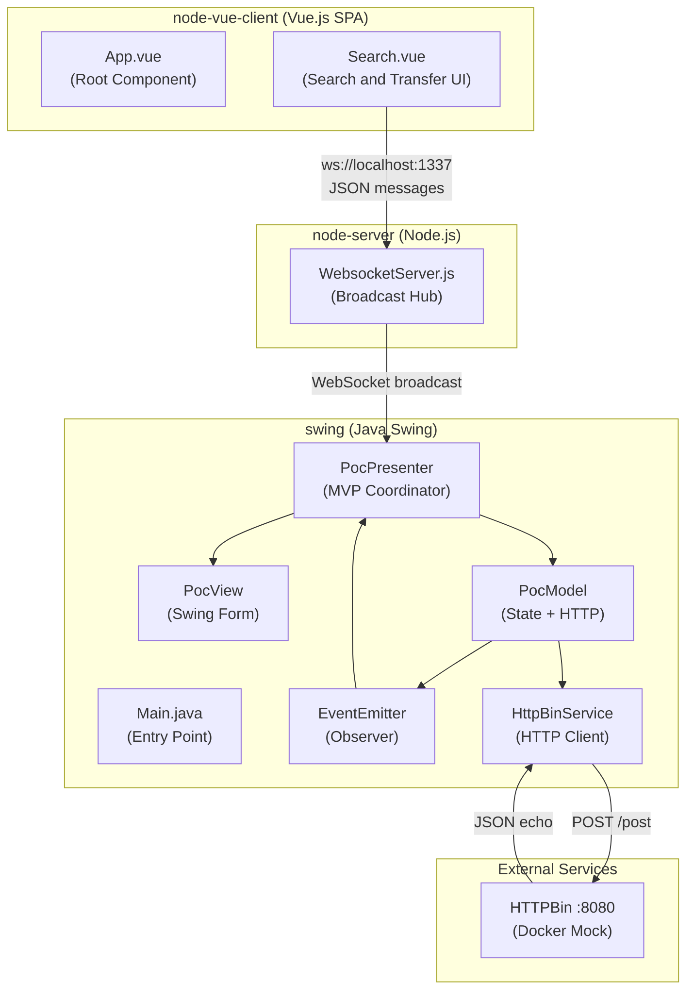

**Building Block Descriptions:**

| Building Block | Module | Responsibility |
|----------------|--------|----------------|
| `App.vue` | node-vue-client | Root Vue component; application shell with header and Search mount |
| `Search.vue` | node-vue-client | Person search form, result tables, Zahlungsempfänger selection, WebSocket send |
| `WebsocketServer.js` | node-server | HTTP+WS server; accepts connections, broadcasts every message to all clients |
| `Main.java` | swing | Application entry point; wires MVP components; keeps JVM alive |
| `PocView` | swing | Swing form with all input widgets (text fields, radio buttons, button) |
| `PocPresenter` | swing | Bi-directional binding; listens to View events; subscribes to EventEmitter |
| `PocModel` | swing | Holds application state via `ValueModel` map; invokes `HttpBinService` |
| `EventEmitter` | swing | Custom observable; notifies registered `EventListener` instances |
| `HttpBinService` | swing | Sends HTTP POST with form data as JSON; returns response body string |
| `ValueModel<T>` | swing | Generic typed container for a single bindable field value |

### 5.2 Level 2: Vue.js Client (node-vue-client)

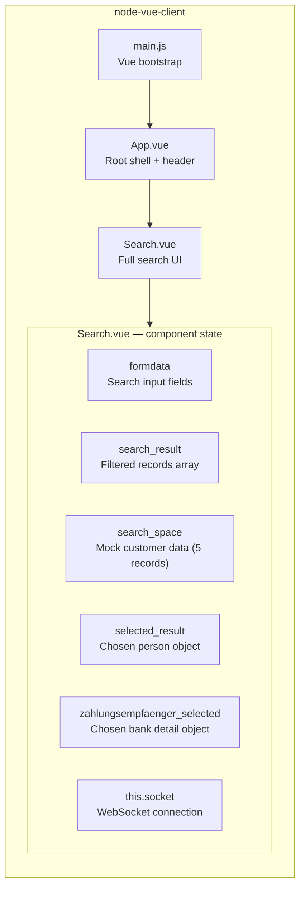

**Search.vue Methods:**

| Method | Description |
|--------|-------------|
| `connect()` | Opens WebSocket connection to `ws://localhost:1337/` on component mount |
| `disconnect()` | Closes the WebSocket connection and resets state |
| `searchPerson()` | Filters `search_space` by any formdata field (case-insensitive substring match) |
| `selectResult(item)` | Sets `selected_result` to clicked table row; triggers Zahlungsempfänger display |
| `zahlungsempfaengerSelected(ze)` | Sets `zahlungsempfaenger_selected` to the chosen bank record |
| `sendMessage(content, target)` | Serializes and sends `{ target, content }` JSON envelope via WebSocket |

### 5.3 Level 2: Node.js WebSocket Server (node-server)

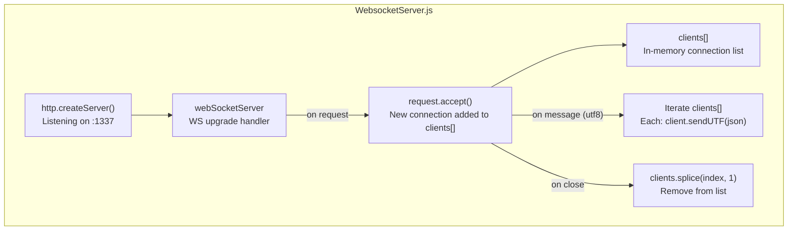

**Server State:**

| Variable | Type | Description |
|----------|------|-------------|
| `webSocketsServerPort` | `number` | Port constant: `1337` |
| `messages` | `Array` | Declared but **unused** in current implementation |
| `clients` | `Array` | Active WebSocket connection objects |

### 5.4 Level 2: Java Swing Desktop Client (swing)

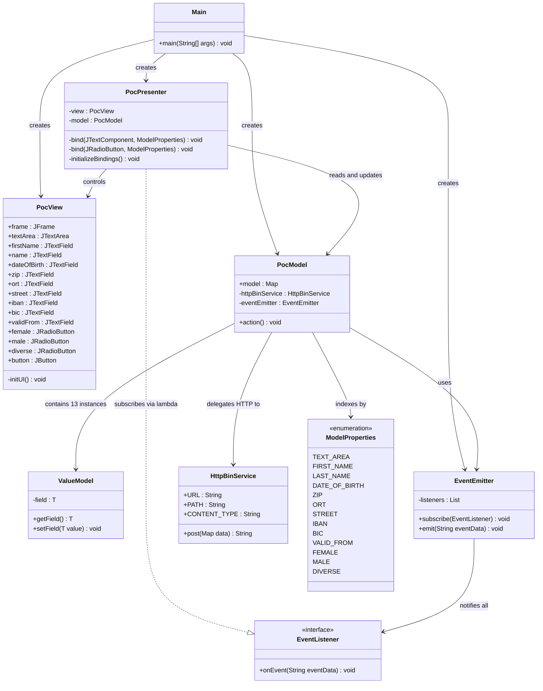

---

## 6. Runtime View

### 6.1 Scenario 1: Application Startup

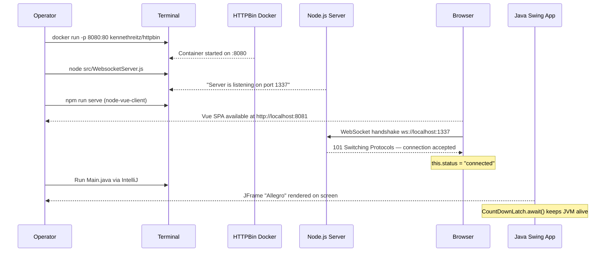

### 6.2 Scenario 2: Customer Search and Transfer to Allegro

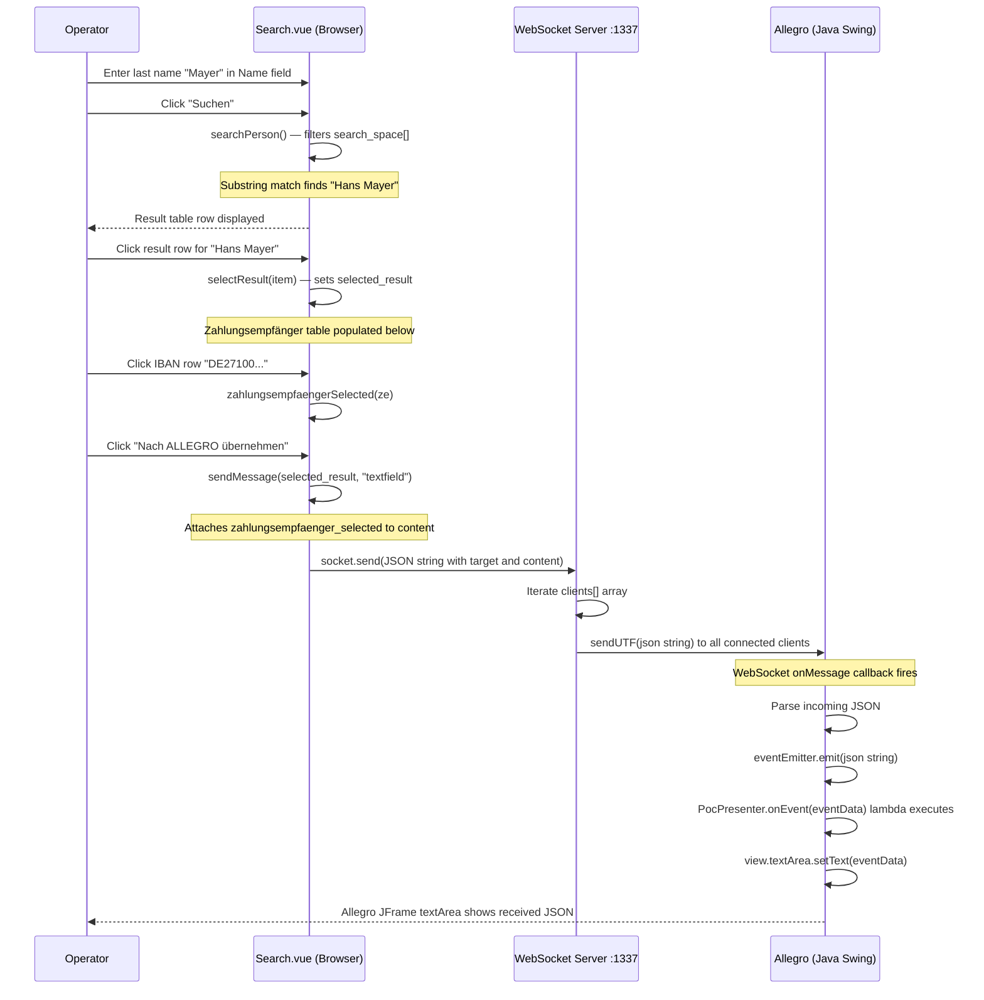

### 6.3 Scenario 3: Allegro Form Submission to HTTPBin

```mermaid
sequenceDiagram
    participant Op as Operator
    participant View as PocView (JFrame)
    participant Pres as PocPresenter
    participant Model as PocModel
    participant HTTP as HttpBinService
    participant Bin as HTTPBin :8080/post

    Note over View,Pres: All fields pre-populated from Scenario 2

    Op->>View: Click "Anordnen" button
    View->>Pres: ActionListener fires (button.addActionListener)
    Pres->>Model: model.action()

    Model->>Model: Iterate ModelProperties enum values
    Model->>Model: Build HashMap from ValueModel fields
    Model->>HTTP: httpBinService.post(data)

    HTTP->>HTTP: Open HttpURLConnection to http://localhost:8080/post
    HTTP->>HTTP: Serialize data map to JSON via javax.json generator
    HTTP->>Bin: POST /post   Content-Type: application/json   Body: {...}
    Bin-->>HTTP: HTTP 200 + full JSON echo response body

    HTTP-->>Model: return responseBody (String)

    alt responseBody is not empty
        Model->>Model: eventEmitter.emit(responseBody)
        Model->>Pres: onEvent(responseBody) lambda callback
        Pres->>View: view.textArea.setText(responseBody)
        Pres->>View: Clear all text fields (firstName, name, dob, ...)
        Pres->>View: Reset gender — female.setSelected(true)
        View-->>Op: Form cleared; textArea shows HTTP echo response
    else responseBody is empty
        Model->>Model: eventEmitter.emit("Failed operation")
        Pres->>View: view.textArea.setText("Failed operation")
        View-->>Op: textArea shows "Failed operation"
    end
```

### 6.4 Scenario 4: Textarea Real-Time Sync

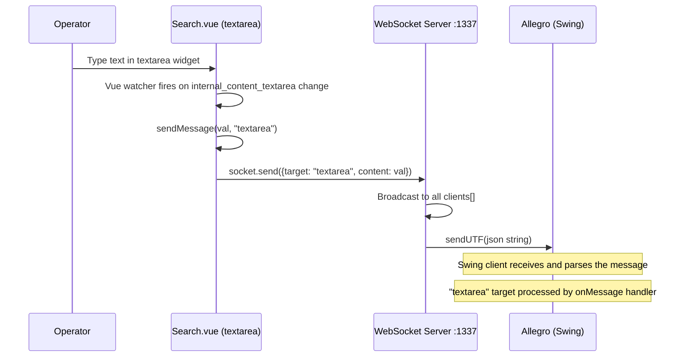

### 6.5 WebSocket Connection Lifecycle

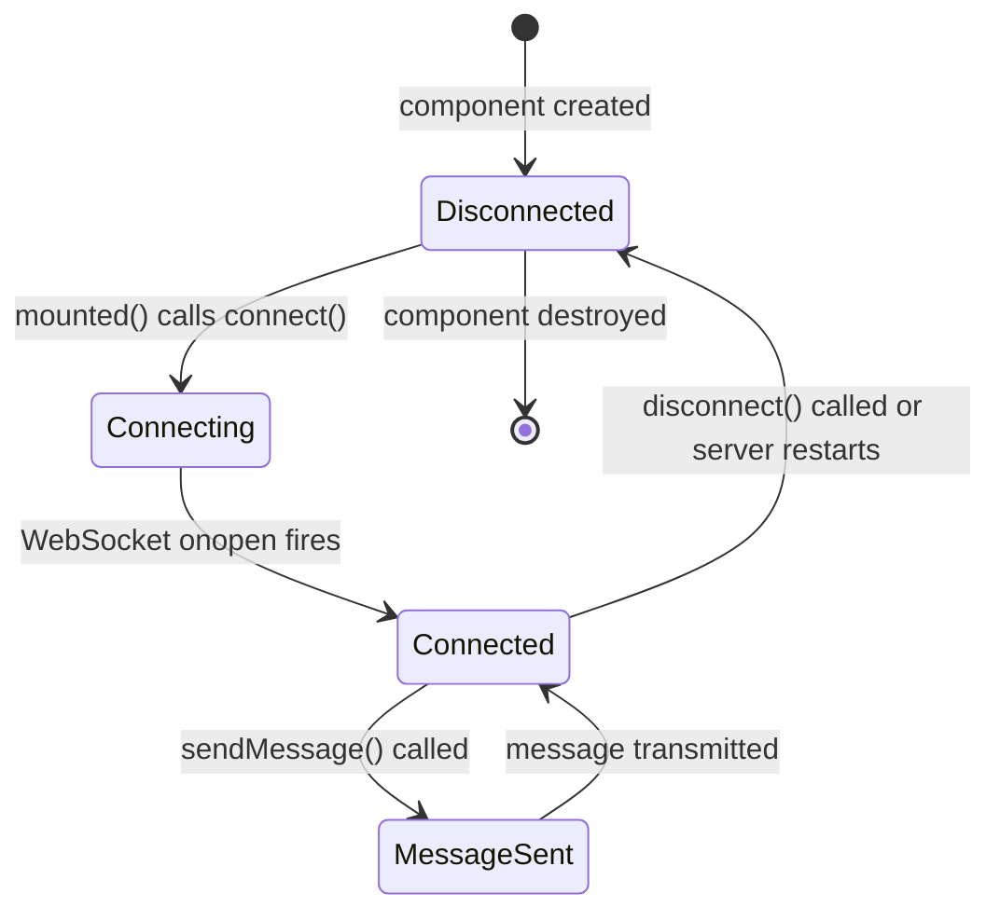

---

## 7. Deployment View

### 7.1 Local Development Deployment (PoC Environment)

All components run on a **single developer machine** (localhost). There is no production deployment topology defined for this PoC.

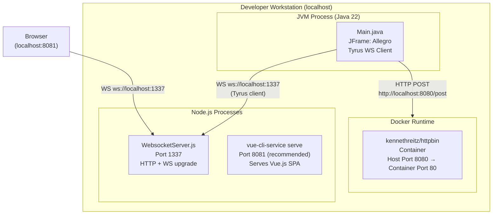

> ⚠️ **Port Conflict Note:** Both `vue-cli-service serve` (default port 8080) and HTTPBin (mapped to host port 8080) cannot simultaneously occupy port 8080. Configure the Vue dev server to port 8081 by adding `vue.config.js` with `devServer: { port: 8081 }`, or via the `--port 8081` CLI flag.

### 7.2 Startup Sequence

| Step | Command | Component Started | Port |
|------|---------|-------------------|------|
| 1 | `docker run -p 8080:80 kennethreitz/httpbin` | HTTPBin mock backend | 8080 |
| 2 | `cd node-server && npm install` | Install WS server dependencies | — |
| 3 | `node src/WebsocketServer.js` | WebSocket broadcast server | 1337 |
| 4 | `cd node-vue-client && npm run serve -- --port 8081` | Vue.js dev server | 8081 |
| 5 | Run `Main.java` in IntelliJ IDEA | Java Swing Allegro form | — |

### 7.3 Deployment Mapping

| Component | Technology | Process Type | Ports |
|-----------|-----------|--------------|-------|
| Vue.js Search Mock | `vue-cli-service serve` | Node.js (webpack dev server) | 8081 (recommended) |
| WebSocket Server | `node WebsocketServer.js` | Node.js process | 1337 (HTTP + WS) |
| Allegro Desktop | JVM Java 22 + Swing | Native JVM process | — (WS client outbound only) |
| HTTPBin | Docker `kennethreitz/httpbin` | Docker container | 8080 → 80 |

### 7.4 Network Communication Map

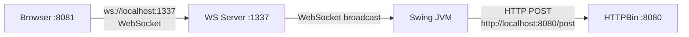

---

## 8. Crosscutting Concepts

### 8.1 Domain Model

The system operates on German social-security / accident-insurance domain entities:

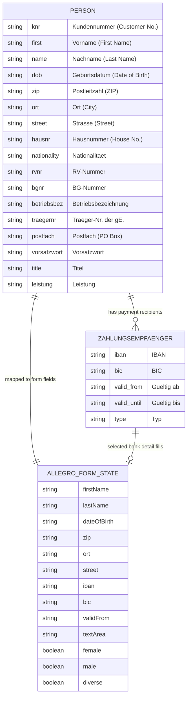

### 8.2 Event-Driven Communication Pattern

The Swing application uses a **custom Observer (Publish-Subscribe) pattern** implemented through `EventEmitter` and `EventListener`:

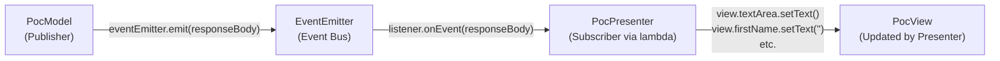

- **`EventEmitter`** maintains a `List<EventListener>` and fans out event strings to all subscribers synchronously.
- **`PocPresenter`** subscribes via a Java lambda satisfying the `EventListener` functional interface.
- This pattern decouples the async HTTP response in `PocModel` from the UI update in `PocPresenter`.

### 8.3 Data Binding Pattern (MVP Two-Way Binding)

`PocPresenter` implements live two-way binding between Swing widgets and `ValueModel` entries:

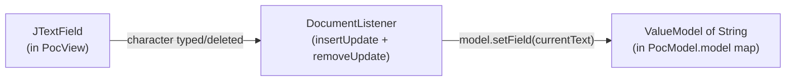

**Binding initialization in `PocPresenter.initializeBindings()`:**

| Widget type | Listener used | Direction |
|-------------|---------------|-----------|
| `JTextField`, `JTextArea` | `DocumentListener` (`insertUpdate`, `removeUpdate`) | View → Model |
| `JRadioButton` | `ChangeListener` | View → Model |
| All bindings | EventEmitter callback | Model → View (reset) |

### 8.4 WebSocket Message Protocol

All inter-component communication via WebSocket uses a consistent JSON envelope:

```json
{
  "target": "<string>",
  "content": "<object or string>"
}
```

| `target` value | Sender | `content` type | Description |
|----------------|--------|----------------|-------------|
| `"textfield"` | Search.vue | Person object + selected Zahlungsempfänger | Full record for Allegro form population |
| `"textarea"` | Search.vue watcher | String | Raw textarea string content sync |

The Node.js server performs **no parsing** — it broadcasts the raw UTF-8 JSON string as-is to every connected client.

### 8.5 Error Handling

| Layer | Mechanism | Behaviour |
|-------|-----------|-----------|
| **Java HTTP** | Try/catch `IOException`, `InterruptedException` in `PocPresenter` button listener | Wrapped as `RuntimeException` and re-thrown; no graceful UI feedback |
| **Java — empty HTTP response** | `if(!responseBody.isEmpty())` in `PocModel.action()` | Emits string `"Failed operation"` to all EventEmitter subscribers |
| **Node.js WS disconnect** | `connection.on('close', ...)` callback | Removes closed connection from `clients[]` via `splice()` |
| **Vue.js WS error** | None implemented | No `onerror` or `onclose` handler — failures are silent to the operator |

### 8.6 Logging

| Component | Mechanism | Events Logged |
|-----------|-----------|---------------|
| Node.js Server | `console.log()` with `new Date()` timestamp | Server start, new connection origins, received messages, disconnections |
| Java Swing | `System.out.println()` | DocumentListener change events, button action trigger, HTTP status code, HTTP response body |
| Vue.js | None | No application-level logging; browser console only for uncaught exceptions |

### 8.7 Security Concepts

| Area | Current State | Risk Level | Production Requirement |
|------|---------------|------------|------------------------|
| WebSocket origin validation | Accepts all origins (`request.accept(null, request.origin)`) | ⚠️ High | Enforce origin whitelist |
| Authentication | None | ⚠️ High | OAuth2 / JWT token validation |
| Transport encryption | Plain WS / HTTP only | ⚠️ High | WSS + HTTPS (TLS) |
| Input sanitization | None | ⚠️ High | Server-side validation |
| Data at rest | No persistence | N/A | Database encryption at rest |

> All security gaps are intentional and acceptable for this **localhost-only PoC**. None of the above should be carried forward into production.

---

## 9. Architecture Decisions

### ADR-001: WebSocket as the Integration Channel Between Browser and Desktop

**Status:** Implemented (observed in code)  
**Date:** PoC development phase

**Context:**  
The PoC must demonstrate that a new web UI can push data into a legacy Java Swing desktop application in real time without the operator performing manual data entry. A polling-based or REST-only approach would require the desktop application to act as an HTTP server, adding significant complexity.

**Decision:**  
Use WebSocket (RFC 6455) as the bidirectional, persistent communication channel. A lightweight Node.js broadcast server relays messages from the browser to all connected desktop clients.

**Consequences:**
- ✅ Browser-native WebSocket API — no plugins or browser extensions required
- ✅ Real-time push without polling or periodic refresh
- ✅ Node.js WS server is approximately 65 lines of code
- ⚠️ Broadcast-all topology means every connected desktop receives every message — requires per-session routing logic in production
- ⚠️ No message acknowledgement or delivery guarantee in the current implementation

---

### ADR-002: Model-View-Presenter (MVP) Pattern for the Swing Application

**Status:** Implemented (observed in code)

**Context:**  
The Swing desktop needs to be maintainable and at least partially testable, with clear separation between the UI widgets (`PocView`), application state (`PocModel`), and coordination logic (`PocPresenter`).

**Decision:**  
Adopt MVP: `PocView` holds only Swing widgets with layout code; `PocModel` holds all state in a typed `ValueModel` map indexed by a `ModelProperties` enum; `PocPresenter` mediates between the two using `DocumentListener` data binding and EventEmitter subscriptions.

**Consequences:**
- ✅ View is a pure "dumb" form with no business logic
- ✅ Model is independently testable without a Swing context
- ✅ Presenter is the single point of change for binding and event-routing logic
- ⚠️ Verbose boilerplate — 13 explicit `bind()` calls for 13 model properties
- ⚠️ Current implementation has potential Swing EDT thread-safety issues in the EventEmitter callback

---

### ADR-003: HTTPBin Docker Container as Backend Mock

**Status:** Implemented (observed in code)

**Context:**  
A real Allegro backend service is not available during the PoC phase. The team needs to verify that JSON serialization and HTTP communication work correctly end-to-end.

**Decision:**  
Use the `kennethreitz/httpbin` Docker image, which echoes any JSON POST body back in its response, confirming data integrity without any custom server code.

**Consequences:**
- ✅ Zero backend development effort
- ✅ Response body echo is shown in `textArea`, proving end-to-end data serialization is correct
- ⚠️ Must be replaced with the actual Allegro backend API in production
- ⚠️ Creates a port 8080 conflict with the Vue.js development server

---

### ADR-004: In-Memory Mock Data in Vue.js Search Component

**Status:** Implemented (observed in code)

**Context:**  
No real customer database or search API exists during the PoC. Five representative German customers with realistic addresses, IBAN, and BIC data are needed to demonstrate the search and transfer workflow.

**Decision:**  
Hard-code five representative customer records (with German names, addresses, RV-Nummern, BG-Nummern, and bank details) directly in `Search.vue`'s `data()` function as `search_space[]`.

**Consequences:**
- ✅ Search functionality works immediately with no additional infrastructure
- ✅ Realistic German domain data validates that all field mappings are correct
- ⚠️ Data is static — no real-time database queries, no pagination, no backend API
- ⚠️ Must be replaced with actual customer search API call in production migration

---

### ADR-005: Custom EventEmitter vs. Java Standard Mechanisms

**Status:** Implemented (observed in code)

**Context:**  
`PocModel` needs to notify `PocPresenter` after an HTTP response is received. The Swing `ActionListener` mechanism is one-directional and not appropriate here.

**Decision:**  
Implement a minimal custom `EventEmitter` / `EventListener` pair rather than using `java.beans.PropertyChangeSupport` or a third-party event bus (e.g., Guava EventBus).

**Consequences:**
- ✅ Simple and self-contained — no additional dependencies beyond the JDK
- ✅ Functional interface `EventListener` enables clean lambda-based subscription
- ⚠️ Does not handle multi-threading: HTTP response may arrive on a non-EDT thread, but `PocPresenter`'s event handler directly updates Swing widgets — a latent EDT thread-safety bug

---

## 10. Quality Requirements

### 10.1 Quality Tree

```mermaid
flowchart TD
    Q["Quality\nAllegro PoC"]

    Q --> Func["Functional\nSuitability"]
    Q --> Perf["Performance\nEfficiency"]
    Q --> Main["Maintainability"]
    Q --> Use["Usability"]
    Q --> Comp["Compatibility"]
    Q --> Demo["Demonstrability"]

    Func --> F1["Customer search finds\ncorrect records from mock data"]
    Func --> F2["All selected fields transferred\ncompletely to Allegro form"]
    Func --> F3["HTTP POST delivers correct\nJSON payload to HTTPBin"]

    Perf --> P1["WS message delivered\nunder 1s on localhost"]
    Perf --> P2["In-memory search\ninstant response"]

    Main --> M1["MVP: View, Presenter, Model\nclearly separated"]
    Main --> M2["New fields via ModelProperties enum\nextension plus one bind() call"]

    Use --> U1["German UI labels match\ndomain language exactly"]
    Use --> U2["Disabled fields clearly\nindicate non-editable data"]

    Comp --> C1["Vue.js SPA runs in any\nmodern evergreen browser"]
    Comp --> C2["Swing runs on Java 22 JVM\ncross-platform"]

    Demo --> D1["Full end-to-end flow\nrunnable in under 5 minutes"]
    Demo --> D2["All 5 startup steps\ndocumented in README"]
```

### 10.2 Quality Scenarios

| ID | Quality Attribute | Stimulus | Expected Measure |
|----|-------------------|----------|------------------|
| QS-1 | Functional Suitability | Operator selects "Hans Mayer" + IBAN and clicks "Nach ALLEGRO übernehmen" | All 9 mapped person fields populated in Allegro JFrame; no data loss |
| QS-2 | Functional Suitability | Operator clicks "Anordnen" after form population | HTTP POST body contains all 13 `ModelProperties` fields; HTTPBin echo confirms |
| QS-3 | Performance | In-memory search over 5 mock records | Result appears < 50ms after "Suchen" click |
| QS-4 | Performance | Local WebSocket message relay (browser → server → Swing) | Message received by Swing JFrame < 500ms on localhost |
| QS-5 | Maintainability | Add a new domain field (e.g., `HAUSNUMMER`) | ≤ 30 minutes: one enum value + one JTextField + one `bind()` call |
| QS-6 | Reliability | HTTPBin returns empty response body | `PocModel.action()` emits `"Failed operation"`; textArea shows error string |
| QS-7 | Demonstrability | Stakeholder demo run from scratch | Full end-to-end flow (startup through data transfer) visible in < 5 minutes |

---

## 11. Risks and Technical Debt

### 11.1 Technical Risks

| ID | Risk | Probability | Impact | Mitigation |
|----|------|-------------|--------|------------|
| R-01 | **Swing EDT thread-safety violation**: `PocPresenter.onEvent()` updates Swing widgets from a potentially non-EDT thread (HTTP response thread) | Medium | Medium | Wrap all UI updates in `SwingUtilities.invokeLater(Runnable)` |
| R-02 | **Port 8080 collision**: HTTPBin and Vue.js dev server both default to port 8080 on the same machine | High | Medium | Configure Vue dev server to port 8081 via `vue.config.js` or `--port 8081` flag |
| R-03 | **No WebSocket auto-reconnect**: If the Node.js server restarts, Vue.js and Swing clients lose connection with no recovery | Medium | High (demo impact) | Add `socket.onclose` retry logic with exponential backoff in `Search.vue` |
| R-04 | **`NullPointerException` in `PocModel.action()`**: Calling `.toString()` on a `ValueModel.getField()` that is `null` (field never typed by user) | High | Medium | Add null guard: `model.get(val).getField() != null ? ... : ""` |
| R-05 | **`messages[]` memory accumulation**: Array declared in server but unused; if wired in future without bounding, memory leak risk | Low | Low | Remove the unused variable or implement with bounded `splice` |
| R-06 | **`CountDownLatch(1)` never counted down**: JVM can only exit via `JFrame.EXIT_ON_CLOSE`; latch is decorative | Low | Low | Replace with `SwingUtilities.invokeLater` + Window listener lifecycle |
| R-07 | **No WS origin validation**: Any local process can connect to port 1337 and receive all broadcast messages | Low (localhost only) | High (if promoted to network) | Enforce `request.origin` allowlist before any multi-host scenario |

### 11.2 Technical Debt

| ID | Type | Location | Description | Priority | Estimated Effort |
|----|------|----------|-------------|----------|-----------------|
| TD-01 | **Design Debt** | `PocPresenter.java` lines 23–38 | EventEmitter `onEvent` lambda updates Swing widgets without `SwingUtilities.invokeLater` — EDT safety violation | 🔴 High | 1 hour |
| TD-02 | **Code Debt** | `PocModel.java` line 39 | `model.get(val).getField().toString()` throws NPE when any field is null on first "Anordnen" click | 🔴 High | 1 hour |
| TD-03 | **Code Debt** | `Search.vue` line 135 | `socket.onmessage` handler commented out — incoming WS messages from server are silently discarded in the browser | 🟡 Medium | 2 hours |
| TD-04 | **Code Debt** | `Search.vue` `connect()` | No `onerror` or `onclose` handler on `this.socket` — connection failures are invisible to the operator | 🟡 Medium | 1 hour |
| TD-05 | **Code Debt** | `WebsocketServer.js` line 5 | `messages` array declared but never read or written — dead variable | 🟢 Low | 15 minutes |
| TD-06 | **Architecture Debt** | `WebsocketServer.js` | Broadcast-all topology unsuitable for multi-user or multi-session production scenarios | 🔴 High | 1–2 days |
| TD-07 | **Code Debt** | `Search.vue` template lines 2–4 | Form fields `formdata.knr`, `formdata.iban`, `formdata.betriebsbez`, etc. bound to disabled inputs but never set — misleading UI state | 🟢 Low | 1 hour |
| TD-08 | **Infrastructure Debt** | `README.md` | Port 8080 collision between HTTPBin and Vue dev server not documented; will block first-time developers | 🟡 Medium | 30 minutes |
| TD-09 | **Test Debt** | All modules | Zero automated tests (unit, integration, or end-to-end) in the entire project | 🟡 Medium | 1–3 days |
| TD-10 | **Code Debt** | `ViewData.java` | Empty class body with no fields or methods — dead code | 🟢 Low | 5 minutes |

### 11.3 Improvement Recommendations

| Priority | Recommendation | Rationale |
|----------|----------------|-----------|
| 🔴 High | Wrap all Swing widget updates in `SwingUtilities.invokeLater()` in `PocPresenter` | Prevents intermittent UI corruption or hang during demo |
| 🔴 High | Add null-safe guards in `PocModel.action()` before calling `.toString()` | Prevents `NullPointerException` when form is partially or not yet filled |
| 🟡 Medium | Implement `socket.onerror` and `socket.onclose` with auto-reconnect in `Search.vue` | Prevents silent WS failures that break the demo mid-presentation |
| 🟡 Medium | Implement `socket.onmessage` in `Search.vue` to receive and display server broadcasts | Enables full bidirectional data flow and future reverse-update scenarios |
| 🟡 Medium | Document and resolve port 8080 conflict in `README.md` | Removes the single most likely first-time setup blocker |
| 🟢 Low | Delete `messages[]` array in `WebsocketServer.js` and `ViewData.java` | Code hygiene; reduces confusion |
| 🟢 Low | Add at least one integration test per module | Builds confidence and regression safety for future migration work |

---

## 12. Glossary

### 12.1 Domain Terms (German Social Security / Insurance Context)

| Term | Definition |
|------|------------|
| **Allegro** | Name of the legacy enterprise desktop application being modernized in this PoC |
| **Anordnen** | German: "Arrange" / "Order" — label of the submit button in the Allegro form |
| **BG-Nummer** | Berufsgenossenschaftsnummer — statutory accident insurance identifier |
| **BIC** | Bank Identifier Code — international bank routing identifier used alongside IBAN |
| **Geburtsdatum** | Date of birth |
| **Hausnummer** | House number |
| **IBAN** | International Bank Account Number — standardized format for bank account identifiers |
| **Knr / Kundennummer** | Customer number — unique identifier for a person in the Allegro system |
| **Leistung** | Benefit or service entitlement |
| **Nach ALLEGRO übernehmen** | German: "Transfer to ALLEGRO" — the action button in the Vue.js search client |
| **Nationalität** | Nationality |
| **Ort** | City or locality |
| **PLZ / Postleitzahl** | German postal (ZIP) code |
| **Postfach** | PO Box |
| **RV-Nummer** | Rentenversicherungsnummer — German statutory pension insurance number |
| **Strasse** | Street name |
| **Suchen** | German: "Search" |
| **Träger-Nr. der gE.** | Carrier number of the Gemeinsame Einrichtung (joint enterprise) |
| **Vorname** | First name |
| **Vorsatzwort** | Noble particle or name prefix (e.g., "von", "van", "de") |
| **Zahlungsempfänger** | Payment recipient — a bank account record (IBAN + BIC + validity period) associated with a person |

### 12.2 Technical Terms

| Term | Definition |
|------|------------|
| **ADR** | Architecture Decision Record — a structured document capturing an important architectural decision with its context, rationale, and consequences |
| **arc42** | A pragmatic, lightweight template for software architecture documentation, comprising 12 standardized sections |
| **Broadcast Hub** | A server pattern that forwards each received message to all currently connected clients without routing or filtering |
| **DocumentListener** | `javax.swing.event.DocumentListener` — Swing interface for receiving notifications when the content of a text document changes |
| **EDT** | Event Dispatch Thread — the single dedicated thread in Java Swing on which all UI creation and modification must occur to ensure thread safety |
| **EventEmitter** | Custom publish-subscribe implementation in this project; structurally analogous to Node.js's built-in `EventEmitter` class |
| **GlassFish Tyrus** | The JSR-356 (Java WebSocket API) reference implementation; `tyrus-standalone-client` enables WebSocket client use outside a Java EE container |
| **HTTPBin** | An open-source, zero-configuration HTTP request/response service; the Docker image `kennethreitz/httpbin` echoes all request data in the response |
| **Hub-and-Spoke** | An integration topology where a central hub (WebSocket server) mediates communication between multiple spoke components (browser client, desktop client) |
| **MVP** | Model-View-Presenter — an architectural UI pattern that separates the display (`View`), state (`Model`), and coordination logic (`Presenter`) |
| **OpenAPI** | A specification standard (formerly Swagger) for describing REST APIs in a machine-readable YAML/JSON format; `api.yml` uses OpenAPI 3.0.1 |
| **PoC** | Proof of Concept — a time-boxed prototype demonstrating the feasibility of a technical approach, not intended for production use |
| **RFC 6455** | The IETF standard defining the WebSocket protocol |
| **SPA** | Single-Page Application — a web app that loads once and dynamically renders content without full page reloads |
| **Tyrus** | See GlassFish Tyrus |
| **ValueModel\<T\>** | A generic typed wrapper class (part of this project) used as a container for each bindable form-field value in `PocModel` |
| **Vue.js** | A progressive JavaScript framework for building reactive user interfaces; version 2.6.10 (Options API) is used in this project |
| **WebSocket** | A network protocol providing full-duplex communication over a single persistent TCP connection; standardized in RFC 6455 |
| **WSS** | WebSocket Secure — the TLS-encrypted variant of the WebSocket protocol, analogous to HTTPS over HTTP |

---

## Appendix

### A. File Inventory

| Module | File | Language | Purpose |
|--------|------|----------|---------|
| swing | `swing/src/main/java/com/Main.java` | Java | Application entry point; MVP wiring |
| swing | `swing/src/main/java/com/poc/ValueModel.java` | Java | Generic bindable field wrapper |
| swing | `swing/src/main/java/com/poc/model/PocModel.java` | Java | Application state + HTTP action orchestrator |
| swing | `swing/src/main/java/com/poc/model/ModelProperties.java` | Java | Enum of all 13 form field keys |
| swing | `swing/src/main/java/com/poc/model/EventEmitter.java` | Java | Custom publish-subscribe event bus |
| swing | `swing/src/main/java/com/poc/model/EventListener.java` | Java | Functional interface for event subscribers |
| swing | `swing/src/main/java/com/poc/model/HttpBinService.java` | Java | HTTP POST client to HTTPBin using `java.net` |
| swing | `swing/src/main/java/com/poc/model/ViewData.java` | Java | Empty placeholder class (dead code) |
| swing | `swing/src/main/java/com/poc/presentation/PocView.java` | Java | Swing form layout, widgets, and initialization |
| swing | `swing/src/main/java/com/poc/presentation/PocPresenter.java` | Java | MVP coordinator, data binding, event routing |
| swing | `pom.xml` | XML | Maven build configuration and dependency management |
| node-server | `node-server/src/WebsocketServer.js` | JavaScript | WebSocket broadcast hub (Node.js) |
| node-server | `node-server/package.json` | JSON | npm dependency declaration |
| node-server | `node-server/doc/Readme.txt` | Text | Developer setup notes |
| node-vue-client | `node-vue-client/src/main.js` | JavaScript | Vue.js application bootstrap |
| node-vue-client | `node-vue-client/src/App.vue` | Vue SFC | Root component with application header |
| node-vue-client | `node-vue-client/src/components/Search.vue` | Vue SFC | Search UI, result tables, WS integration |
| node-vue-client | `node-vue-client/package.json` | JSON | npm dependencies and Vue CLI configuration |
| node-vue-client | `node-vue-client/doc/Readme.txt` | Text | Developer setup notes |
| root | `api.yml` | YAML | OpenAPI 3.0.1 specification for the HTTPBin POST endpoint |
| root | `README.md` | Markdown | Java Swing module setup and run instructions |
| root | `WebsocketSwingClient.launch` | XML | IntelliJ IDEA run configuration |

### B. Dependency Summary

| Component | Dependency | Version | Purpose |
|-----------|-----------|---------|---------|
| swing | `tyrus-standalone-client` | 1.15 | JSR-356 WebSocket client runtime (no container needed) |
| swing | `websocket-api` | 0.2 | JSR-356 WebSocket API interfaces |
| swing | `javax.json-api` | 1.1.4 | JSON Processing API (JSR-374) |
| swing | `org.glassfish:javax.json` | 1.0.4 | JSON Processing reference implementation |
| swing | `tyrus-spi` | 1.15 | Tyrus service provider interface |
| swing | `tyrus-websocket-core` | 1.2.1 | Tyrus WebSocket core (legacy artifact) |
| node-server | `websocket` | ^1.0.35 | Node.js WebSocket client and server implementation |
| node-vue-client | `vue` | ^2.6.10 | Vue.js reactive UI framework |
| node-vue-client | `core-js` | ^3.1.2 | ES6+ polyfills for browser compatibility |

### C. OpenAPI Specification Summary (`api.yml`)

| Field | Value |
|-------|-------|
| **Title** | Allegro PoC |
| **Version** | 1.0.0 |
| **Base URL** | `http://localhost:8080` |
| **Endpoint** | `POST /post` |
| **Request Content-Type** | `application/json` |
| **Request Fields** | `FIRST_NAME`, `LAST_NAME`, `DATE_OF_BIRTH`, `STREET`, `ZIP`, `ORT`, `IBAN`, `BIC`, `VALID_FROM`, `FEMALE`, `MALE`, `DIVERSE`, `TEXT_AREA` |
| **Response** | JSON echo object: `args`, `data`, `files`, `form`, `headers`, `json` (mirrors `PostObject`), `origin`, `url` |

---

*This document was generated through comprehensive static code analysis of the `websocket_swing` repository. All architectural observations are grounded in actual source code found in the `swing/`, `node-server/`, and `node-vue-client/` modules, the `pom.xml` Maven build descriptor, the `api.yml` OpenAPI specification, and associated `README.md` and `Readme.txt` documentation files.*
