# Allegro PoC — Architecture Documentation (arc42)

**Version:** 1.0  
**Date:** 2025-01-01  
**Status:** Generated from source-code analysis  
**Template:** arc42 (https://arc42.org)

> **Note:** This file was created at the repository root because the `docs/` directory did not yet exist.  
> To place it at the intended location run: `mkdir -p docs && mv arc42.md docs/arc42.md`

---

## Table of Contents

1. [Introduction and Goals](#1-introduction-and-goals)
2. [Constraints](#2-constraints)
3. [Context and Scope](#3-context-and-scope)
4. [Solution Strategy](#4-solution-strategy)
5. [Building Block View](#5-building-block-view)
6. [Runtime View](#6-runtime-view)
7. [Deployment View](#7-deployment-view)
8. [Concepts](#8-concepts)
9. [Architecture Decisions](#9-architecture-decisions)
10. [Quality Requirements](#10-quality-requirements)
11. [Risks and Technical Debt](#11-risks-and-technical-debt)
12. [Glossary](#12-glossary)

---

## 1. Introduction and Goals

### 1.1 Requirements Overview

**Allegro PoC** is a proof-of-concept system built to demonstrate a **modernisation path** for a legacy Java Swing desktop application ("ALLEGRO") used in a German social-insurance / public-administration context. The PoC shows how a browser-based Vue.js front-end can co-exist with and eventually replace the legacy Swing client, with both clients communicating in real time through a shared WebSocket relay server.

The core functional requirements demonstrated by the PoC are:

| ID   | Capability                     | Description                                                                                                                                  |
|------|-------------------------------|----------------------------------------------------------------------------------------------------------------------------------------------|
| R-01 | Person Search                  | Search for insured persons by name, first name, postal code, city, or street address from within the web client.                           |
| R-02 | Person Selection               | Select a person from a result list and view their associated Zahlungsempfänger (payment-recipient / bank account) records.                  |
| R-03 | Data Transfer to ALLEGRO       | Push the selected person and payment-recipient data from the web client into the legacy Swing client via WebSocket relay.                   |
| R-04 | Form Data Editing (Swing)      | Fill or edit personal data (name, address, gender, IBAN, BIC, valid-from date) directly in the Swing UI.                                   |
| R-05 | Backend Submission             | Submit the Swing form data to an HTTP backend ("Anordnen") and receive a confirmation response displayed in the text area.                  |
| R-06 | Real-time Broadcast            | The WebSocket relay server delivers messages from any connected client to **all** connected clients simultaneously.                          |

### 1.2 Quality Goals

The following quality goals are most relevant for this PoC, ranked by priority:

| Priority | Quality Goal         | Rationale                                                                                                       |
|----------|---------------------|-----------------------------------------------------------------------------------------------------------------|
| 1        | **Demonstrability**  | As a PoC, the primary goal is to show that the modern and legacy clients can co-exist and exchange data in real time. |
| 2        | **Simplicity**       | Minimal infrastructure; easy for evaluators to set up and understand on a single developer workstation.          |
| 3        | **Replaceability**   | The web client must be able to replace the Swing client over time. Loose coupling via WebSocket protocol supports this. |
| 4        | **Maintainability**  | MVP pattern in the Swing client separates UI from logic, enabling independent modification of the view layer.   |
| 5        | **Extensibility**    | The data model (`ModelProperties` enum, `PostObject` OpenAPI schema) is structured to accept additional fields with minimal change. |

### 1.3 Stakeholders

| Role                          | Group / Person              | Expectations                                                                                              |
|-------------------------------|-----------------------------|-----------------------------------------------------------------------------------------------------------|
| Product Owner / Decision Maker | Allegro Modernisation Team | Sees a working demo showing the viability of a web-based replacement for the Swing client.                |
| Legacy Application Developer  | Java / Swing team           | Understands how the existing Swing MVP architecture is preserved and how the WebSocket channel integrates. |
| Web Developer                 | Vue.js / Node.js team       | Has a clear reference for the web-client architecture and the WebSocket communication protocol.           |
| Solution Architect            | Architecture guild          | Evaluates the modernisation approach and assesses migration risk and long-term path.                      |
| Operations / DevOps           | Infrastructure team         | Understands what is needed to run the system (JDK, Node.js, Docker).                                     |

---

## 2. Constraints

### 2.1 Technical Constraints

| Constraint                  | Value / Description                                                                                        |
|-----------------------------|------------------------------------------------------------------------------------------------------------|
| JDK Version                 | Java **≥ 22.0.1** (source and target configured to Java 22 in `pom.xml`)                                  |
| Java Build Tool             | Apache **Maven** (managed via `pom.xml`)                                                                   |
| Java UI Toolkit             | **Java Swing** (part of JDK; no external UI framework)                                                    |
| Java WebSocket Library      | **Tyrus Standalone Client 1.15** (GlassFish / Eclipse reference implementation of JSR-356)                |
| Java JSON Library           | **javax.json-api 1.1.4** + GlassFish `javax.json` 1.0.4 implementation                                   |
| Node.js Runtime             | **Node.js** (version not pinned in package.json; LTS recommended)                                         |
| Node.js WebSocket Library   | `websocket` npm package **^1.0.35**                                                                        |
| Vue.js Version              | **Vue 2.6.10** (⚠️ EOL December 2023)                                                                    |
| Vue CLI / Build             | **@vue/cli-service ^4.0.0** with Babel and ESLint                                                          |
| HTTP Backend                | **HTTPBin** Docker image (`kennethreitz/httpbin`) running on port 8080; acts as an HTTP echo service       |
| Recommended IDE             | **IntelliJ IDEA** for Java; any editor for Node/Vue                                                        |
| Container Runtime           | **Docker** (Docker Desktop or Rancher Desktop) required for HTTPBin                                        |
| WebSocket Server Port       | Fixed at **1337** (hard-coded in `WebsocketServer.js` and `Search.vue`)                                    |
| HTTP Backend Port           | Fixed at **8080** (hard-coded in `HttpBinService.java`)                                                    |
| Vue Dev-Server Port         | Default **8080** (Vue CLI) — conflicts with HTTPBin; must be overridden to e.g. **8081**                  |

### 2.2 Organisational Constraints

| Constraint              | Description                                                                                      |
|-------------------------|--------------------------------------------------------------------------------------------------|
| PoC Scope               | Proof-of-concept only; production hardening (authentication, TLS, persistence) is out of scope. |
| No Automated Tests      | No test files or test-framework configuration are present in any sub-project.                    |
| No CI/CD Pipeline       | No GitHub Actions workflows targeting builds, tests, or deployments exist in the repository.     |
| Mock Data Only          | The Vue.js client uses a hard-coded in-memory dataset; no real database is connected.            |
| Single-Machine Setup    | All processes are designed to run on a single developer workstation using `localhost`.           |

### 2.3 Coding Conventions

| Convention                  | Description                                                                                                        |
|-----------------------------|--------------------------------------------------------------------------------------------------------------------|
| Java package naming         | `com.poc.*` — domain model in `com.poc.model`, presentation layer in `com.poc.presentation`                       |
| German UI labels            | All user-visible strings are in **German** (`Vorname`, `Geburtsdatum`, `PLZ`, `Ort`…) reflecting the target domain. |
| JSON field names (API)      | UPPER_SNAKE_CASE in the OpenAPI schema (`FIRST_NAME`, `LAST_NAME`, `DATE_OF_BIRTH`) — matching the `ModelProperties` enum values. |
| WebSocket message envelope  | `{ "target": "<textfield\|textarea>", "content": { … } }` — all WS messages use this two-field wrapper.         |
| Vue component naming        | PascalCase single-file components (`Search.vue`, `App.vue`)                                                        |

---

## 3. Context and Scope

### 3.1 Business Context

The system sits at the intersection of a **legacy desktop application** and a **modern web client** in a German social-insurance domain. Both clients share real-time state through a central relay server, enabling a phased migration strategy.

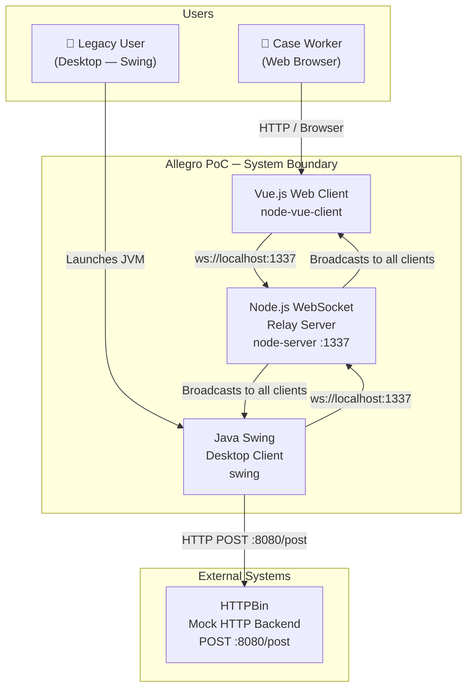

**External Interfaces:**

| Partner / System     | Protocol    | Direction                  | Description                                                                                   |
|----------------------|-------------|----------------------------|-----------------------------------------------------------------------------------------------|
| Case Worker (Browser)| HTTP        | Inbound                    | Uses the Vue.js SPA to search for persons and transfer data to the Swing client.              |
| Legacy User (Desktop)| OS / JVM    | Inbound                    | Launches and interacts with the Java Swing application directly.                              |
| HTTPBin (Docker)     | HTTP / JSON | Outbound (Swing → Backend) | Receives form data POSTed by the Swing client; echoes the body back as a JSON response.       |

### 3.2 Technical Context

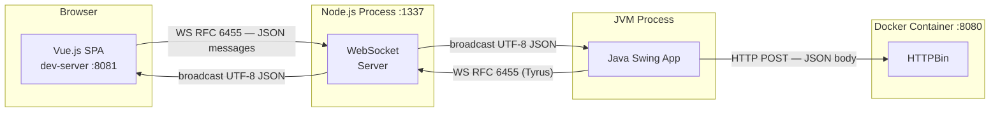

| Channel                          | Technology                          | Message Format                                              |
|----------------------------------|-------------------------------------|-------------------------------------------------------------|
| Vue.js ↔ WebSocket Server        | Native browser `WebSocket` API       | JSON string: `{ target, content }`                          |
| Swing ↔ WebSocket Server         | Tyrus Standalone Client (JSR-356)   | Connection established; receive path not yet implemented    |
| Swing → HTTP Backend             | `java.net.HttpURLConnection`         | JSON object matching `PostObject` OpenAPI schema            |

---

## 4. Solution Strategy

### 4.1 Core Strategic Decisions

| Decision Area           | Choice                                      | Rationale                                                                                                             |
|-------------------------|---------------------------------------------|-----------------------------------------------------------------------------------------------------------------------|
| Modernisation Approach  | **Strangler-Fig / Side-by-Side**            | The new web client co-exists with the legacy Swing client via shared relay, allowing gradual feature migration.       |
| Real-time Integration   | **WebSocket relay (Node.js)**               | WebSocket provides bidirectional, low-latency messaging without polling; Node.js is lightweight for a relay role.     |
| Legacy Client Pattern   | **MVP (Model-View-Presenter)**              | Separates Swing UI from business logic; the view is replaceable without touching the model or presenter.             |
| Web Front-End Framework | **Vue.js 2**                                | Approachable, component-based, well-suited for rapid PoC development by a small team.                               |
| HTTP Backend Simulation | **HTTPBin (Docker)**                        | Zero-code backend stub that echoes POST requests; ideal for a PoC without a real service.                           |
| Form State Model        | **`EnumMap<ModelProperties, ValueModel<?>>`** | Type-safe, exhaustive field enumeration; easy to iterate for serialisation and to extend with new fields.         |

### 4.2 Top-Level Decomposition

The system is decomposed into **three independently startable processes** plus one external Docker dependency:

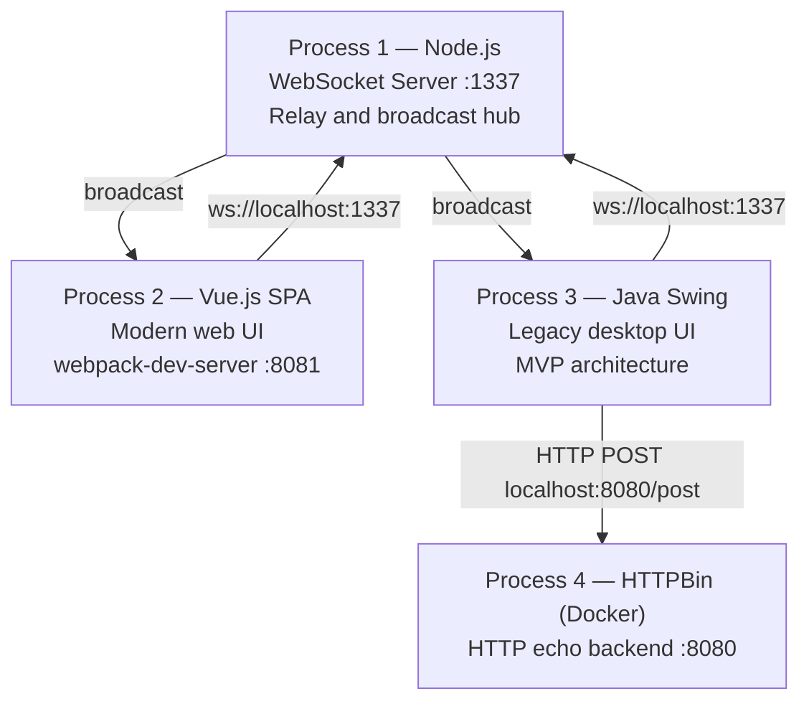

### 4.3 Quality Strategy

| Quality Goal       | Architectural Approach                                                                              |
|--------------------|-----------------------------------------------------------------------------------------------------|
| Demonstrability    | Three independent processes, each startable with a single command; no complex orchestration needed. |
| Simplicity         | No authentication, no TLS, no database — pure in-memory state throughout.                          |
| Replaceability     | Swing and Vue clients are interchangeable WebSocket peers; the relay is client-type-agnostic.       |
| Maintainability    | MVP in Swing: view and model never reference each other directly; only through the presenter.       |
| Extensibility      | New form field = 1 enum value + 1 `ValueModel` entry + 1 `bind()` call + 1 UI widget.              |

---

## 5. Building Block View

### 5.1 Level 1 — System Overview

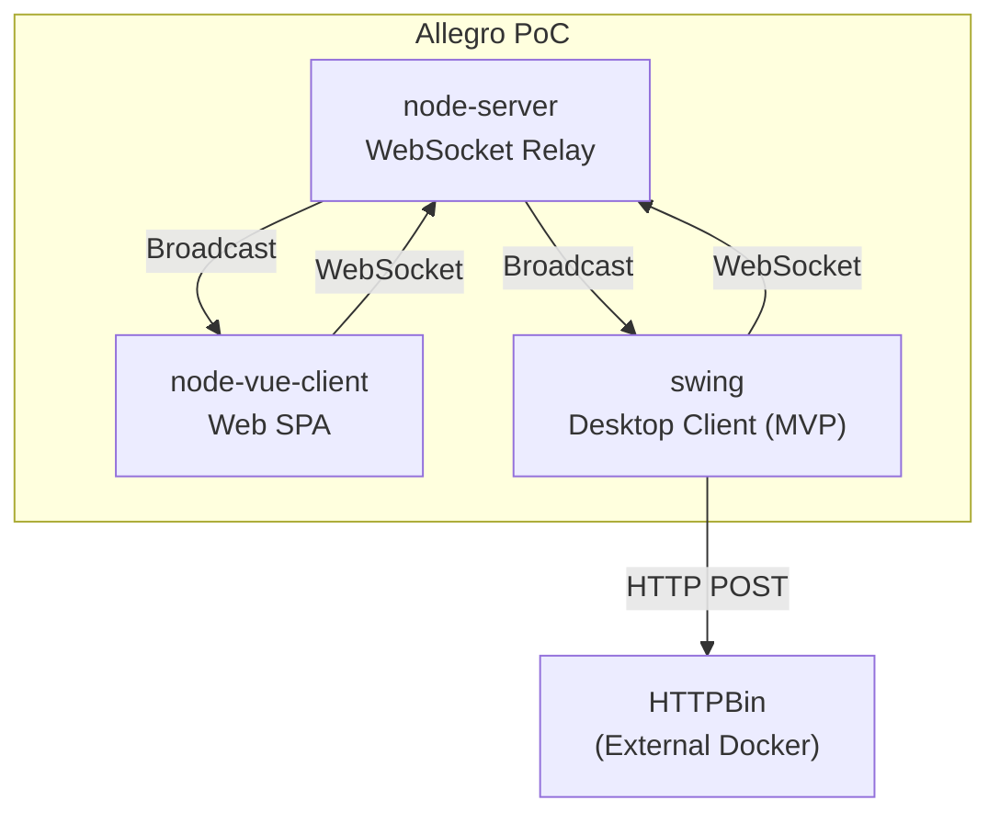

### 5.2 Level 2 — Container Decomposition

#### 5.2.1 node-server

| Building Block        | Type           | Responsibility                                                                                                                          |
|-----------------------|----------------|-----------------------------------------------------------------------------------------------------------------------------------------|
| `WebsocketServer.js`  | Node.js module | Creates an HTTP server, attaches a WebSocket server to it, maintains the connected-client list, and broadcasts every received UTF-8 message to all clients. |

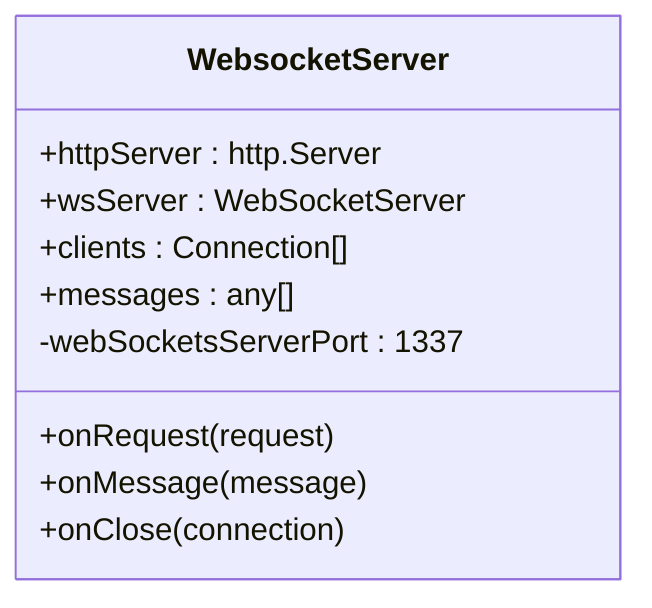

#### 5.2.2 node-vue-client

| Building Block | Type             | Responsibility                                                                                   |
|----------------|------------------|--------------------------------------------------------------------------------------------------|
| `main.js`      | Vue entry point  | Bootstraps the Vue 2 application; mounts the root component to `#app`.                         |
| `App.vue`      | Root component   | Application shell; renders the branded header (`#header`) and hosts the `Search` component.     |
| `Search.vue`   | Feature component| All search, result selection, payment-recipient selection, WebSocket connection, and send logic. |

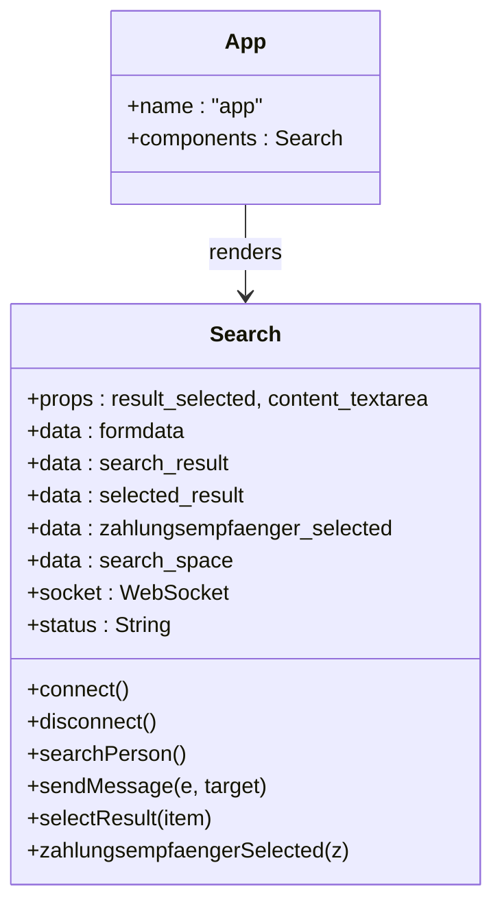

#### 5.2.3 swing

| Building Block      | Type                    | Responsibility                                                                                                           |
|---------------------|-------------------------|--------------------------------------------------------------------------------------------------------------------------|
| `Main`              | Entry point             | Wires up all MVP components; blocks on a `CountDownLatch(1)` to keep the JVM alive while the Swing window is open.      |
| `PocView`           | View (Swing UI)         | Declares and lays out all Swing widgets in a `GridBagLayout`. Pure UI — no business logic.                              |
| `PocPresenter`      | Presenter               | Binds `PocView` widgets to `PocModel` fields via listeners; handles the submit button; subscribes to `EventEmitter` to update the view after a response. |
| `PocModel`          | Model                   | Holds current form state as an `EnumMap<ModelProperties, ValueModel<?>>`. Orchestrates the HTTP call via `HttpBinService`. |
| `HttpBinService`    | Service                 | Sends the model fields as a flat JSON POST to `http://localhost:8080/post` using `java.net.HttpURLConnection`.           |
| `EventEmitter`      | Event bus               | Simple publish-subscribe list; decouples the async HTTP response in `PocModel` from the `PocPresenter`.                 |
| `EventListener`     | Interface               | Single-method contract: `onEvent(String eventData)`.                                                                    |
| `ModelProperties`   | Enum                    | Canonical set of all 13 named form fields (see below).                                                                  |
| `ValueModel<T>`     | Generic wrapper         | Type-safe container for a single field value; supports `getField()` / `setField(T)`.                                    |
| `ViewData`          | Placeholder DTO         | Empty class; reserved for a future structured view-data transfer object.                                                 |

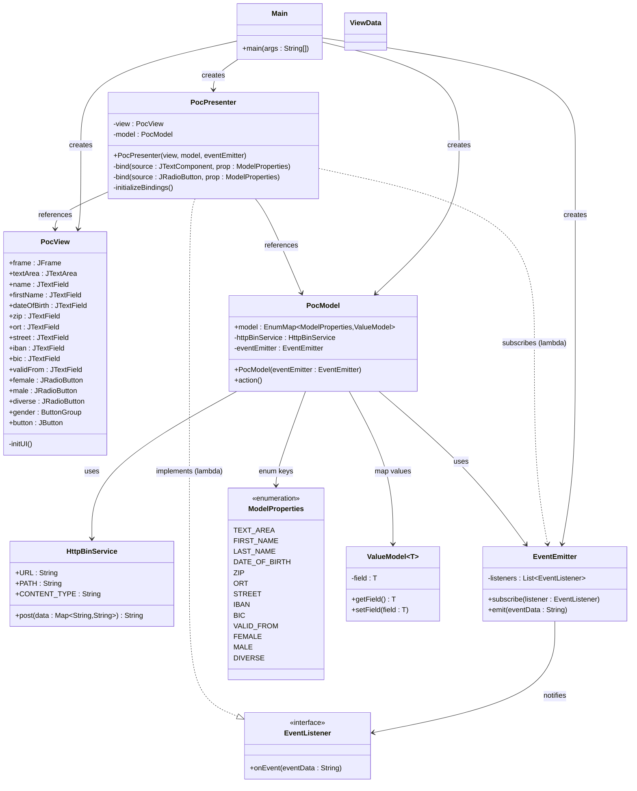

### 5.3 Level 3 — OpenAPI Data Contract

The `api.yml` (OpenAPI 3.0.1) specifies the `POST /post` endpoint that the Swing client targets at `http://localhost:8080`:

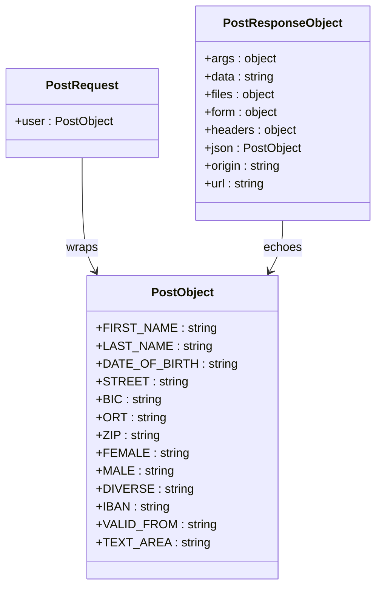

> **Note:** The `HttpBinService` sends the JSON body as a **flat object** (key-value pairs from the enum map) rather than inside a `user` wrapper as defined in the OpenAPI spec. This is a deviation between the spec and the current implementation.

---

## 6. Runtime View

### 6.1 Scenario 1 — System Start-up Sequence

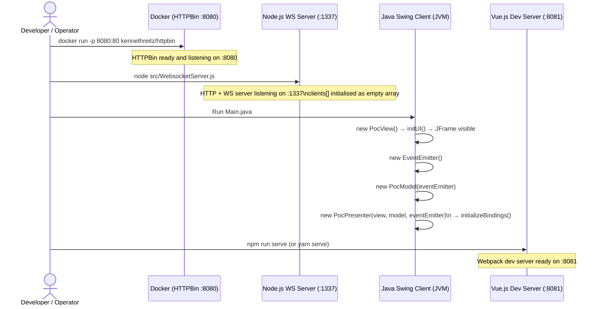

### 6.2 Scenario 2 — Vue Client Connects to WebSocket Server

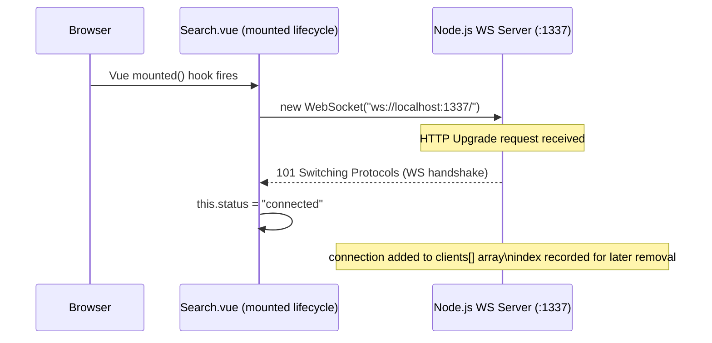

### 6.3 Scenario 3 — Person Search in the Web Client

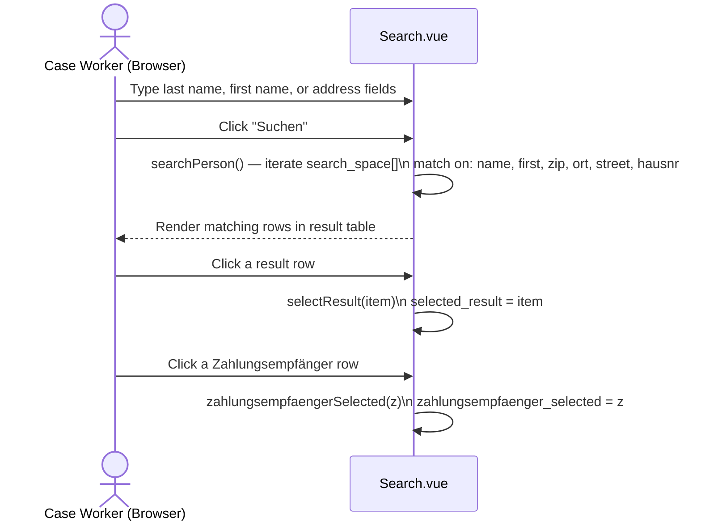

### 6.4 Scenario 4 — Data Transfer: Vue → WebSocket Relay → Swing

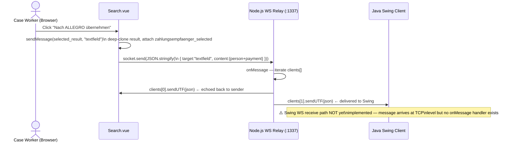

### 6.5 Scenario 5 — Swing Form Submission ("Anordnen")

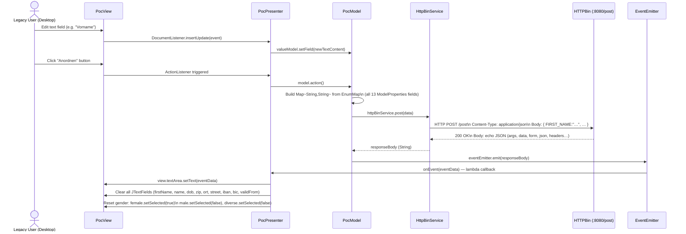

### 6.6 Scenario 6 — Live Textarea Sync (Vue → Relay → All Clients)

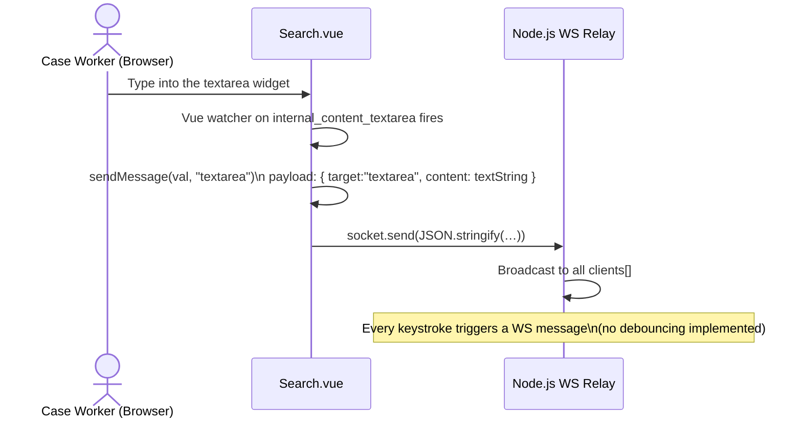

---

## 7. Deployment View

### 7.1 Single-Machine (Developer) Deployment

All components run on a single developer workstation. This is the only deployment topology described by the project documentation.

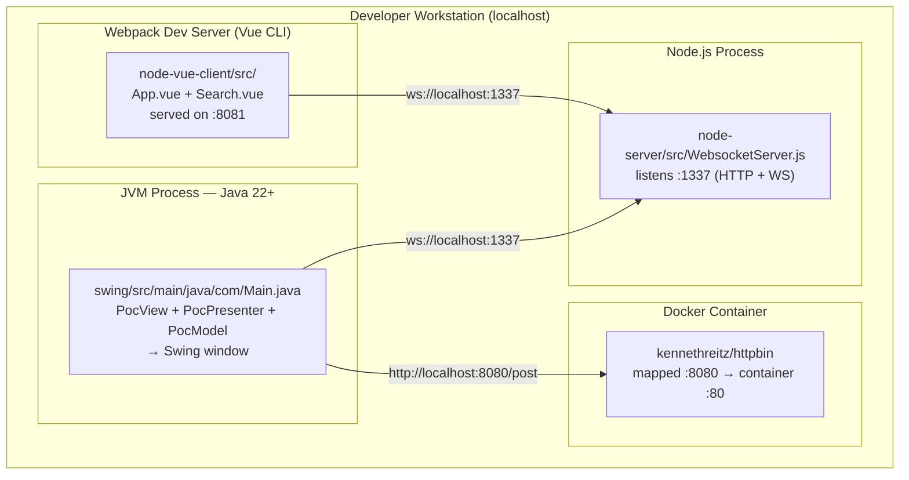

### 7.2 Required Start-up Order

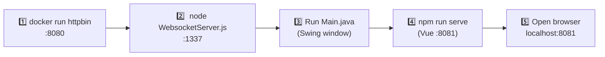

> The Node.js WS server must be running **before** either client starts, otherwise the clients' connection attempts will fail (Vue silently, Swing with a connection error).

### 7.3 Port Assignments

| Port     | Process                    | Protocol              | Notes                                                              |
|----------|----------------------------|-----------------------|--------------------------------------------------------------------|
| **1337** | Node.js WebSocket Server   | HTTP (Upgrade) / WS   | All WS clients connect here                                        |
| **8080** | HTTPBin (Docker)           | HTTP                  | Receives JSON POST from Swing                                      |
| **8081** | Vue webpack-dev-server     | HTTP                  | Serves the SPA in development; default is 8080 — must be changed  |

> ⚠️ **Port conflict:** Vue CLI's default dev-server port is **8080**, which collides with HTTPBin. Always start Vue CLI with `--port 8081` or set `devServer.port: 8081` in `vue.config.js`.

### 7.4 Build Artefacts

| Module             | Build Tool               | Build Command         | Output Artefact                         |
|--------------------|--------------------------|-----------------------|-----------------------------------------|
| `swing`            | Maven                    | `mvn package`         | Executable JAR in `target/`             |
| `node-server`      | npm (no compile step)    | —                     | Run directly: `node src/WebsocketServer.js` |
| `node-vue-client`  | Vue CLI / Webpack        | `yarn build`          | Static bundle in `node-vue-client/dist/` |

---

## 8. Concepts

### 8.1 Domain Model

The system operates on a **person-with-payment-data** domain typical of a German social-insurance registry:

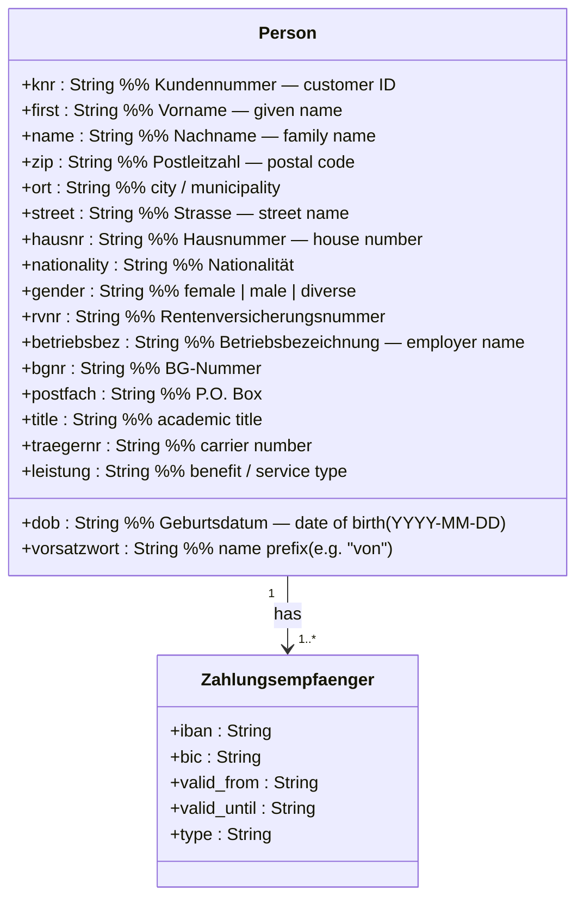

### 8.2 MVP (Model-View-Presenter) Architecture

The Java Swing client implements the **MVP** pattern:

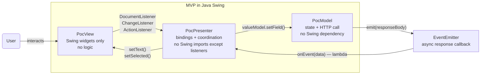

**Separation of concerns:**

| Layer        | Class          | Has Swing dependency? | Has HTTP dependency? |
|--------------|----------------|-----------------------|----------------------|
| View         | `PocView`      | ✅ Yes                | ❌ No                |
| Presenter    | `PocPresenter` | ✅ Yes (listeners)    | ❌ No                |
| Model        | `PocModel`     | ❌ No                 | ✅ Yes               |
| Service      | `HttpBinService`| ❌ No                | ✅ Yes               |

### 8.3 WebSocket Relay (Fan-Out) Pattern

The Node.js server acts as a **stateless message fan-out hub**:

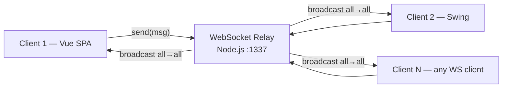

Key characteristics of this relay:
- **Protocol-agnostic:** the relay never parses or inspects the JSON payload.
- **Echo behaviour:** the sender receives its own message back (no exclusion of origin client).
- **No persistence:** messages are not stored; late-joining clients see no history.
- **No topics / channels:** every message goes to every connected client.

### 8.4 Two-Way Data Binding (Swing)

Data binding between the Swing view widgets and the `PocModel` is implemented manually in `PocPresenter` using standard Swing listener interfaces:

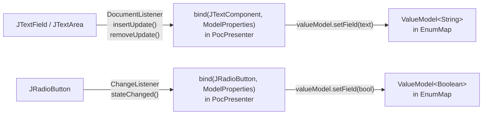

The presenter also **writes to the view** (reverse binding) in the `EventEmitter` callback, resetting all fields after a successful backend submission.

### 8.5 WebSocket Message Protocol

All WebSocket messages exchanged between the Vue client and the relay server (and subsequently broadcast to Swing) use this JSON envelope:

```json
{
  "target": "textfield | textarea",
  "content": { /* see below */ }
}
```

| Target value  | `content` type              | Triggered by                                      |
|---------------|-----------------------------|---------------------------------------------------|
| `"textfield"` | Person + Zahlungsempfänger object | Click "Nach ALLEGRO übernehmen" button       |
| `"textarea"`  | Raw string (textarea value) | Any keystroke in the textarea (`watch` listener) |

Example `textfield` payload:
```json
{
  "target": "textfield",
  "content": {
    "first": "Hans",
    "name": "Mayer",
    "dob": "1981-01-08",
    "zip": "95183",
    "ort": "Trogen",
    "street": "Isaaer Str.",
    "hausnr": "23",
    "knr": "79423984",
    "zahlungsempfaenger": {
      "iban": "DE27100777770209299700",
      "bic": "ERFBDE8E759",
      "valid_from": "2020-01-04",
      "valid_until": "",
      "type": ""
    }
  }
}
```

### 8.6 Error Handling

| Layer               | Mechanism                                                             | User Feedback                                     |
|---------------------|-----------------------------------------------------------------------|---------------------------------------------------|
| Swing — HTTP call   | `IOException` / `InterruptedException` caught; re-thrown as `RuntimeException` | None — application may crash silently      |
| Swing — JSON write  | `BadLocationException` caught; re-thrown as `RuntimeException`        | None                                              |
| Swing — empty response | `eventEmitter.emit("Failed operation")` if `responseBody.isEmpty()` | "Failed operation" string shown in `textArea`   |
| Node.js relay       | Console-only logging; no retry, no error propagation                  | None visible to clients                           |
| Vue.js — WebSocket  | No `onerror` / `onclose` handlers defined                             | Silent failure; form remains editable             |

### 8.7 Logging and Observability

No structured logging framework is used. All output is via `console.log` (Node.js) or `System.out.println` (Java).

| Component          | What is logged                                                                           |
|--------------------|------------------------------------------------------------------------------------------|
| Node.js Server     | Connection origin, "Connection accepted", received message content (full JSON), peer disconnect |
| `PocModel`         | All 13 field values before HTTP call; HTTP response code and response body              |
| `PocPresenter`     | DocumentListener insert/remove events (with full document text); EventEmitter callback data; radio button state changes |

### 8.8 Security Posture

> ⚠️ **No security controls are implemented. This system must never handle real personal data.**

| Concern                  | Status                                                                                          |
|--------------------------|-------------------------------------------------------------------------------------------------|
| Transport encryption     | ❌ Plain `ws://` and `http://` — no TLS                                                        |
| Authentication           | ❌ None                                                                                         |
| Authorisation            | ❌ None                                                                                         |
| Input validation         | ❌ None in any layer                                                                            |
| CORS                     | The relay accepts **any** origin: `request.accept(null, request.origin)`                       |
| Sensitive data exposure  | IBAN, BIC, personal data transmitted and logged in plain text                                   |

### 8.9 Persistence

**No persistence layer exists.** All data is ephemeral and lives only in process memory:

| Layer             | State storage                                              |
|-------------------|------------------------------------------------------------|
| Vue.js client     | Hard-coded JavaScript array in `Search.vue`; lost on page reload |
| Swing model       | `EnumMap` in the JVM heap; lost when the process exits    |
| WebSocket relay   | In-memory `clients[]` array; no message history           |
| HTTPBin backend   | Stateless echo; no data is stored                         |

---

## 9. Architecture Decisions

### ADR-001 — WebSocket as the Cross-Client Integration Channel

**Status:** Implemented (observed in code)

**Context:**  
The PoC must synchronise data between a legacy Swing client and a new web client in real time, without modifying the Swing client's existing HTTP submission flow to the backend.

**Decision:**  
Use a Node.js WebSocket server as a **message relay** between all clients. Both the Swing client and the Vue client connect as WebSocket peers; the relay broadcasts every received message to all connected clients.

**Consequences:**
- ✅ Decouples the two clients; neither needs to know about the other's type or address.
- ✅ Bidirectional, low-latency communication without polling.
- ✅ Minimal relay code (~60 lines of Node.js).
- ✅ Any future client (mobile app, another web client) can join without modifying existing clients.
- ⚠️ Every client receives every message — no channel or topic filtering.
- ⚠️ The Swing client's WebSocket *receive* path is not yet implemented in the current code.

---

### ADR-002 — Model-View-Presenter for the Java Swing Client

**Status:** Implemented (observed in code)

**Context:**  
The Swing client must be maintainable and its non-UI logic testable independently of Swing internals. Standard Swing programming tends to mix UI and logic in a single class.

**Decision:**  
Implement the **MVP** pattern with `PocView` (pure Swing UI widgets), `PocPresenter` (two-way bindings and orchestration), and `PocModel` (state and services). Use a custom `EventEmitter` for the asynchronous HTTP-response callback from model to presenter.

**Consequences:**
- ✅ View and model have no direct dependency on each other.
- ✅ `PocModel` and `HttpBinService` are independently unit-testable (no Swing imports).
- ✅ The event-emitter pattern cleanly handles the async HTTP response.
- ⚠️ View fields are package-accessible (not encapsulated behind an interface), creating a structural coupling between `PocView` and `PocPresenter`.
- ⚠️ No formal `IView` interface is defined, limiting mockability of the view in tests.

---

### ADR-003 — HTTPBin as the Mock HTTP Backend

**Status:** Implemented (observed in code)

**Context:**  
The PoC needs a realistic HTTP endpoint to receive form submissions and return a structured response, without building a real backend service.

**Decision:**  
Use the `kennethreitz/httpbin` Docker image, which echoes any POST request back as a JSON response including the parsed body, headers, and origin. The Swing client POSTs to `http://localhost:8080/post`.

**Consequences:**
- ✅ Zero backend development required for the PoC.
- ✅ Realistic HTTP round-trip including status codes, headers, and latency.
- ✅ Reproducible environment via a single `docker run` command.
- ⚠️ Not suitable beyond the PoC — must be replaced with a real backend.
- ⚠️ The echo response body is displayed verbatim in `textArea`; a real backend response will need a proper response parser.
- ⚠️ `kennethreitz/httpbin` is no longer actively maintained; consider `mccutchen/go-httpbin` as an alternative.

---

### ADR-004 — Vue 2 with Hard-Coded In-Memory Mock Data

**Status:** Implemented (observed in code)

**Context:**  
A working demo needs realistic-looking person and payment data without a real database or API backend.

**Decision:**  
Embed a static JavaScript array of five persons (each with 1–3 payment records) directly in `Search.vue`. The `searchPerson()` method performs client-side substring filtering over this array.

**Consequences:**
- ✅ Zero backend dependency for search — fully offline-capable demo.
- ✅ Deterministic, reproducible demo data with known IBANs and BICs.
- ⚠️ Not editable without changing source code.
- ⚠️ Vue 2 reached End-of-Life in **December 2023**; must be upgraded to Vue 3 for any continued development.

---

### ADR-005 — `EnumMap<ModelProperties, ValueModel<?>>` for Swing Form State

**Status:** Implemented (observed in code)

**Context:**  
The Swing form has 13 named fields of mixed type (String for text inputs, Boolean for radio buttons). A uniform structure is needed to bind, iterate, and serialise all fields.

**Decision:**  
Use `EnumMap<ModelProperties, ValueModel<?>>` where `ModelProperties` is an exhaustive enum of all field names and `ValueModel<T>` is a generic single-field wrapper.

**Consequences:**
- ✅ Compile-time guarantee that every enum member is addressable.
- ✅ Easy iteration for serialisation (`for(var val : ModelProperties.values())`).
- ✅ Type-safe at the enum key level; adding a field is a three-line change.
- ⚠️ Wildcard generic `ValueModel<?>` forces unchecked casts in the presenter.
- ⚠️ `ViewData.java` is empty; a structured DTO would improve decoupling.

---

## 10. Quality Requirements

### 10.1 Quality Attribute Tree

```mermaid
mindmap
    root((Quality\nAllegro PoC))
        Functional Suitability
            Person search correctness
            Data transfer completeness to Swing
            HTTP submission round-trip
        Reliability
            WebSocket connection stability
            Error recovery / reconnect
        Usability
            German-language UI
            Immediate search feedback
            Clear row-highlight on selection
            Form auto-reset after submit
        Maintainability
            MVP separation in Swing
            Vue single-file component isolation
            Enum-driven model extensibility
        Portability
            Cross-platform JVM
            Any modern browser
        Security
            Deferred (PoC only)
```

### 10.2 Quality Scenarios

| ID     | Attribute                | Stimulus                                           | Expected Response                                              | Acceptance Measure                                      |
|--------|--------------------------|----------------------------------------------------|----------------------------------------------------------------|---------------------------------------------------------|
| QS-01  | Functional Suitability   | Search by last name "May"                          | Exactly matching persons shown in result table                 | 100 % precision and recall on mock dataset              |
| QS-02  | Functional Suitability   | Click "Nach ALLEGRO übernehmen"                    | Swing client receives person + payment data                    | Message delivered within < 200 ms on localhost          |
| QS-03  | Functional Suitability   | Click "Anordnen" in Swing                          | HTTPBin echoes data; textArea shows response; all fields reset | Visible state reset within 1 s on localhost             |
| QS-04  | Maintainability          | Developer adds a new form field                    | Change is isolated to enum + model + presenter + view          | ≤ 4 files changed, ≤ 10 lines added                     |
| QS-05  | Reliability              | WebSocket server is not running at Vue load time   | No unhandled exception; form renders and is usable             | No JavaScript error thrown; `status` reflects disconnected state |
| QS-06  | Usability                | Legacy user submits form                           | TextArea populated with response; all input fields cleared     | Visually verified within one demo cycle                 |
| QS-07  | Portability              | Application runs on Windows, macOS, Linux          | All three processes start without OS-specific changes          | Zero platform-specific code paths in source             |

---

## 11. Risks and Technical Debt

### 11.1 Technical Risks

| ID    | Risk                                                                               | Probability | Impact   | Mitigation                                                                                     |
|-------|------------------------------------------------------------------------------------|-------------|----------|-----------------------------------------------------------------------------------------------|
| RK-01 | Swing WS receive path not implemented — relay broadcasts never populate Swing UI   | **High**    | **High** | Implement `@OnMessage` / Tyrus `onMessage` handler in the Swing client (see TD-01).           |
| RK-02 | Port collision between Vue dev server and HTTPBin (both default to :8080)          | **High**    | **Medium**| Configure Vue CLI to serve on :8081; document in README.                                     |
| RK-03 | WS relay echoes messages back to the sender — Vue receives its own sends           | **High**    | **Low**  | Add sender-exclusion logic in `WebsocketServer.js` (`clients.splice(index, 1)` before broadcast). |
| RK-04 | No WebSocket error/reconnect handling in `Search.vue`                              | **Medium**  | **Medium**| Add `socket.onerror` and `socket.onclose` with exponential-backoff reconnect.                |
| RK-05 | Java 22 unnamed-variable syntax (`var _ = …`) may break on older JDKs              | **Low**     | **High** | Enforce JDK ≥ 22 in `pom.xml` maven-enforcer-plugin and CI.                                  |
| RK-06 | `kennethreitz/httpbin` Docker image is unmaintained                                | **Low**     | **Medium**| Switch to `mccutchen/go-httpbin` or a minimal custom echo server.                           |
| RK-07 | Vue 2 EOL (Dec 2023) — known security CVEs may go unpatched                        | **Medium**  | **Medium**| Migrate to Vue 3 (see TD-07).                                                                |

### 11.2 Technical Debt Backlog

| ID    | Type             | Location              | Description                                                                                        | Priority   | Est. Effort |
|-------|------------------|-----------------------|----------------------------------------------------------------------------------------------------|------------|-------------|
| TD-01 | Missing Feature  | `swing/`              | No WebSocket *receive* handler — the relay message never reaches the Swing UI. Core PoC goal incomplete. | **Critical** | 4–8 h    |
| TD-02 | Missing Feature  | `swing/`              | `ViewData.java` is empty — no structured view-data transfer object implemented.                   | Medium     | 2 h         |
| TD-03 | Error Handling   | `Search.vue`          | No `onerror` / `onclose` WebSocket handlers; connection failures are silent.                      | High       | 1 h         |
| TD-04 | Error Handling   | `PocPresenter.java`   | `IOException` and `InterruptedException` wrapped in `RuntimeException` with no user notification. | Medium     | 2 h         |
| TD-05 | Security         | All                   | No TLS, no auth, no CORS restriction; IBAN / BIC transmitted and logged in plain text.             | **Critical (production)** | Large (architectural) |
| TD-06 | Test Coverage    | All                   | Zero automated tests across all three sub-projects.                                               | High       | 8–16 h      |
| TD-07 | Dependency       | `node-vue-client/`    | Vue 2 is EOL (December 2023). Upgrade to Vue 3 + Composition API.                                | High       | 8–16 h      |
| TD-08 | Design           | `swing/`              | `PocView` fields are package-accessible; no `IView` interface. Blocks presenter unit testing.     | Medium     | 4 h         |
| TD-09 | Configuration    | `HttpBinService.java`, `Search.vue` | Hard-coded `localhost` URLs; not environment-configurable.                               | Medium     | 2 h         |
| TD-10 | Protocol         | `node-server/`        | Relay broadcasts to the originating client — potential echo loop if Vue ever handles `onmessage`. | Low        | 1 h         |
| TD-11 | CI/CD            | Repository root       | No automated build, lint, or test pipeline.                                                       | Medium     | 4 h         |
| TD-12 | Observability    | `swing/`              | `System.out.println` throughout; no structured logging (SLF4J / Logback).                        | Low        | 2 h         |
| TD-13 | API Alignment    | `HttpBinService.java` | POST body is a flat JSON object, not wrapped in `{ "user": … }` as the OpenAPI spec defines.     | Low        | 1 h         |
| TD-14 | Debouncing       | `Search.vue`          | Textarea watcher fires on every keystroke, sending a WebSocket message per character.             | Low        | 1 h         |

### 11.3 Prioritised Improvement Recommendations

1. **Implement Swing WS receive path (TD-01):** This is the single most important gap — the central PoC use case (data flowing from the web client into the Swing form) is incomplete without it.
2. **Add Vue WebSocket resilience (TD-03):** Wrap the socket in a small reconnecting WebSocket utility (e.g., `reconnecting-websocket` npm package).
3. **Resolve port conflict (RK-02):** Add a `vue.config.js` with `devServer: { port: 8081 }` and update the README.
4. **Externalise configuration (TD-09):** Use `.env` files for Vue and JVM system properties (`-D`) for Java URLs.
5. **Add baseline tests (TD-06):** Unit-test `PocModel` with a mock `HttpBinService`; write a Jest test for `Search.vue`'s `searchPerson()`.
6. **Upgrade Vue 2 → Vue 3 (TD-07):** Migrate the `Search` component to the Composition API with `<script setup>`.
7. **Define IView interface (TD-08):** Extract `IPocView` from `PocView` to enable mocking in presenter tests.

---

## 12. Glossary

### 12.1 Domain Terms (German–English)

| English                  | German                         | Definition                                                                                          |
|--------------------------|-------------------------------|------------------------------------------------------------------------------------------------------|
| Customer Number          | Kundennummer (KNR)             | Unique identifier for an insured person in the ALLEGRO system.                                      |
| Payment Recipient        | Zahlungsempfänger              | Bank-account details (IBAN, BIC) to which benefit payments are disbursed for an insured person.     |
| IBAN                     | IBAN                           | International Bank Account Number — identifies a bank account in the SEPA payment area.             |
| BIC                      | BIC                            | Bank Identifier Code (SWIFT code) — identifies a bank or branch.                                    |
| Valid From               | Gültig ab                      | Start date from which a set of payment-recipient details is active.                                 |
| First Name               | Vorname                        | Given name of a person.                                                                             |
| Last Name / Surname      | Nachname / Name                | Family name of a person.                                                                            |
| Date of Birth            | Geburtsdatum                   | A person's date of birth (format `YYYY-MM-DD` in the system).                                      |
| Street                   | Strasse                        | Street name (without house number).                                                                  |
| House Number             | Hausnummer                     | Numeric part of a street address.                                                                   |
| Postal Code              | Postleitzahl (PLZ)             | German 5-digit postal code.                                                                         |
| City / Municipality      | Ort                            | City or municipality name.                                                                          |
| Nationality              | Nationalität                   | Person's nationality.                                                                               |
| Gender — Female          | Weiblich                       | Female gender option (radio button).                                                                |
| Gender — Male            | Männlich                       | Male gender option (radio button).                                                                  |
| Gender — Diverse         | Divers                         | Third gender option, mandated by German law since 2018.                                             |
| Arrange / Order          | Anordnen                       | The Swing submit button label; triggers data submission to the backend.                             |
| Transfer to ALLEGRO      | Nach ALLEGRO übernehmen        | The Vue button label; sends selected person data to the Swing client via WebSocket.                 |
| Search                   | Suchen                         | Button that triggers the client-side person filter in the Vue component.                            |
| Pension Insurance Number | Rentenversicherungsnummer (RVNR) | German statutory pension insurance ID number.                                                     |
| BG Number                | BG-Nummer                      | Berufsgenossenschaft (occupational accident insurance) ID number.                                   |
| Carrier Number           | Träger-Nummer der gE.          | Identification number of the responsible benefit carrier (gemeinsame Einrichtung).                  |
| Service / Benefit        | Leistung                       | Type of social-insurance benefit or service rendered.                                               |
| P.O. Box                 | Postfach                       | Postal delivery box (alternative address).                                                          |
| Name Prefix              | Vorsatzwort                    | Name prefix such as "von", "van", "de" etc.                                                         |

### 12.2 Technical Terms

| Term                  | Definition                                                                                                                                   |
|-----------------------|----------------------------------------------------------------------------------------------------------------------------------------------|
| **ALLEGRO**           | The legacy Java Swing desktop application being modernised. The name appears as the `JFrame` title and in the Vue transfer button label.    |
| **PoC**               | Proof of Concept — a limited implementation demonstrating technical feasibility, not production-readiness.                                  |
| **WebSocket**         | A bidirectional, full-duplex communications protocol over a single TCP connection, defined in RFC 6455.                                     |
| **Tyrus**             | The GlassFish / Eclipse Foundation reference implementation of JSR-356 (Java API for WebSocket). Used as the WS client in the Swing app.   |
| **JSR-356**           | Java Specification Request defining the standard Java API for WebSocket (`javax.websocket`).                                                |
| **MVP**               | Model-View-Presenter — an architectural pattern derived from MVC; the Presenter mediates between View (Swing UI) and Model (state/services). |
| **EventEmitter**      | A custom lightweight publish-subscribe class in `com.poc.model`. Unrelated to Node.js's built-in `EventEmitter`.                           |
| **EventListener**     | A functional interface (single method `onEvent(String)`) defining the callback contract for `EventEmitter` subscribers.                    |
| **ValueModel\<T\>**   | A generic single-field wrapper providing typed `get`/`set` access; represents one form field in the `PocModel` state map.                  |
| **ModelProperties**   | A Java `enum` enumerating all 13 form field names; used as the key type of the `EnumMap` in `PocModel`.                                    |
| **EnumMap**           | A `java.util.Map` implementation backed by a dense array, keyed by enum constants; O(1) access, exhaustive coverage guaranteed.            |
| **HTTPBin**           | An open-source HTTP service (`httpbin.org`) that echoes request details as JSON. Used here via Docker to simulate a backend.               |
| **Relay Server**      | A server that forwards messages from each connected client to all other connected clients without inspecting content.                       |
| **SPA**               | Single-Page Application — a web app that loads once and updates content dynamically (here: Vue.js).                                        |
| **Vue CLI**           | The official Vue.js command-line toolchain for scaffolding, developing (webpack-dev-server), and building Vue applications.                 |
| **Webpack**           | A JavaScript module bundler used by Vue CLI to bundle, transform, and serve the SPA.                                                       |
| **OpenAPI / OAS**     | OpenAPI Specification 3.0 — a standard for describing REST APIs in YAML or JSON (`api.yml`).                                               |
| **RFC 6455**          | The IETF standard that defines the WebSocket protocol.                                                                                     |
| **DocumentListener**  | `javax.swing.event.DocumentListener` — fires when a Swing text-component's document is inserted or deleted; used for real-time data binding.|
| **ChangeListener**    | `javax.swing.event.ChangeListener` — fires on `JRadioButton` state changes; used for gender-field binding.                                |
| **CountDownLatch**    | A `java.util.concurrent.CountDownLatch(1)` in `Main.java`; blocks the main thread indefinitely, keeping the JVM alive while the Swing window is displayed. |
| **Strangler Fig**     | A software modernisation pattern (from Martin Fowler) where a new system is built incrementally around the legacy system until the legacy can be retired. |
| **EOL**               | End of Life — a product or version no longer receiving security patches or updates. Vue 2 reached EOL in December 2023.                     |
| **Fan-out**           | A messaging pattern where one incoming message is delivered to multiple consumers; how the Node.js relay operates.                          |
| **GridBagLayout**     | A flexible Swing layout manager that places components in a grid with variable row/column sizes; used in `PocView.initUI()`.               |

---

## Appendix A — Complete File Inventory

| Path                                                                     | Language / Format  | Role                                               |
|--------------------------------------------------------------------------|--------------------|----------------------------------------------------|
| `pom.xml`                                                                | XML / Maven        | Java project build descriptor and dependency list  |
| `api.yml`                                                                | YAML / OpenAPI 3.0 | REST API contract for `POST /post`                 |
| `README.md`                                                              | Markdown           | Java Swing project setup guide                     |
| `WebsocketSwingClient.launch`                                            | XML / Eclipse      | Eclipse IDE run configuration                      |
| `swing/src/main/java/com/Main.java`                                      | Java               | Application entry point; wires MVP components      |
| `swing/src/main/java/com/poc/ValueModel.java`                            | Java               | Generic single-field value wrapper                 |
| `swing/src/main/java/com/poc/model/EventEmitter.java`                    | Java               | Custom pub/sub event bus                           |
| `swing/src/main/java/com/poc/model/EventListener.java`                   | Java               | Event callback interface                           |
| `swing/src/main/java/com/poc/model/HttpBinService.java`                  | Java               | HTTP POST client targeting HTTPBin                 |
| `swing/src/main/java/com/poc/model/ModelProperties.java`                 | Java               | Enum of all 13 form field names                    |
| `swing/src/main/java/com/poc/model/PocModel.java`                        | Java               | Form state model; orchestrates HTTP call           |
| `swing/src/main/java/com/poc/model/ViewData.java`                        | Java               | Empty placeholder DTO (stub)                       |
| `swing/src/main/java/com/poc/presentation/PocPresenter.java`             | Java               | MVP Presenter; binds view ↔ model                  |
| `swing/src/main/java/com/poc/presentation/PocView.java`                  | Java               | Swing widgets and GridBagLayout UI                 |
| `node-server/src/WebsocketServer.js`                                     | JavaScript / Node  | WebSocket relay server; manages clients[], broadcasts |
| `node-server/package.json`                                               | JSON / npm         | Node.js dependency manifest                        |
| `node-server/doc/Readme.txt`                                             | Plain text         | Start-up instructions for the WS server            |
| `node-vue-client/src/main.js`                                            | JavaScript / Vue   | Vue 2 app bootstrap                                |
| `node-vue-client/src/App.vue`                                            | Vue SFC            | Root component with branded header                 |
| `node-vue-client/src/components/Search.vue`                              | Vue SFC            | Person search, selection, and WS-send component    |
| `node-vue-client/package.json`                                           | JSON / npm         | Vue project dependencies and build scripts         |
| `node-vue-client/README.md`                                              | Markdown           | Vue project setup, build, and lint commands        |
| `node-vue-client/doc/Readme.txt`                                         | Plain text         | Start-up instructions for the Vue client           |

**Summary:** 23 source / configuration files across 3 sub-projects, 3 primary languages (Java, JavaScript, Vue SFC), 1 OpenAPI specification.

---

## Appendix B — Analysis Metadata

| Item                  | Value                                                                     |
|-----------------------|---------------------------------------------------------------------------|
| Document version      | 1.0                                                                       |
| Generated date        | 2025-01-01                                                                |
| Source repository     | `/home/runner/work/test-custom-agents-2/test-custom-agents-2`             |
| Sub-projects analysed | `swing` (Java/Maven), `node-server` (Node.js), `node-vue-client` (Vue.js) |
| API specification     | `api.yml` (OpenAPI 3.0.1)                                                 |
| Arc42 sections        | 12 / 12 complete                                                          |
| Mermaid diagrams      | 18                                                                        |
| ADRs documented       | 5 (ADR-001 through ADR-005)                                               |
| Technical debt items  | 14 (TD-01 through TD-14)                                                  |
| Risk items            | 7 (RK-01 through RK-07)                                                   |
| Glossary entries      | 23 domain terms + 22 technical terms = 45 total                           |

---

*This document was produced by direct source-code analysis of all files in the Allegro PoC repository.*  
*It should be maintained alongside the codebase and updated whenever a significant architectural change is made.*
