# Architecture Documentation (Arc42)

**Project**: Allegro PoC — WebSocket-Based Multi-Client Modernization  
**Version**: 0.0.1-SNAPSHOT  
**Date**: 2025-01-30  
**Generated by**: Arc42 Documentation Generator  

---

## Table of Contents

1. [Introduction and Goals](#1-introduction-and-goals)
2. [Constraints](#2-constraints)
3. [Context and Scope](#3-context-and-scope)
4. [Solution Strategy](#4-solution-strategy)
5. [Building Block View](#5-building-block-view)
6. [Runtime View](#6-runtime-view)
7. [Deployment View](#7-deployment-view)
8. [Crosscutting Concepts](#8-crosscutting-concepts)
9. [Architecture Decisions](#9-architecture-decisions)
10. [Quality Requirements](#10-quality-requirements)
11. [Risks and Technical Debt](#11-risks-and-technical-debt)
12. [Glossary](#12-glossary)

---

## 1. Introduction and Goals

### 1.1 Requirements Overview

The **Allegro PoC** (Proof of Concept) is a modernization prototype designed to demonstrate a bridge between a modern web-based user interface and a legacy Java Swing desktop application named **ALLEGRO**. The system operates in the domain of German social insurance customer management (*Kundenverwaltung*).

The core use case is:

> A caseworker uses a modern browser-based search UI to look up a customer (*Kunde*) by name, address, or other personal details, selects a payment recipient (*Zahlungsempfänger*), and transfers the selected data in real time into the legacy ALLEGRO desktop application — without any manual copy-paste.

**Key functional requirements identified from source code:**

| ID   | Requirement                                                                                      |
|------|--------------------------------------------------------------------------------------------------|
| FR-1 | Search for persons (Kunden) by name, first name, ZIP code, city, street, and house number        |
| FR-2 | Display a list of matching search results                                                         |
| FR-3 | Select a payment recipient (Zahlungsempfänger) with IBAN, BIC, and validity date                |
| FR-4 | Transfer selected person and payment data to the ALLEGRO desktop application via WebSocket        |
| FR-5 | Receive and display transferred data inside the ALLEGRO Swing client form fields                  |
| FR-6 | Support free-text textarea synchronisation between clients                                        |
| FR-7 | Submit collected form data via HTTP POST to a backend service (MVP variant)                      |

### 1.2 Quality Goals

The following top quality goals were identified from the system design and PoC context:

| Priority | Quality Goal                    | Description                                                                                          |
|----------|---------------------------------|------------------------------------------------------------------------------------------------------|
| 1        | **Real-Time Responsiveness**    | Data selected in the browser must appear instantly in the Swing client via WebSocket push            |
| 2        | **Interoperability**            | Modern web client and legacy Swing desktop client must seamlessly exchange structured JSON data      |
| 3        | **Simplicity / PoC Fitness**    | The architecture must be lightweight enough to demonstrate the concept with minimal infrastructure   |
| 4        | **Extensibility**               | The MVP pattern in the Java client supports future replacement of UI or backend without full rewrite |

### 1.3 Stakeholders

| Stakeholder                  | Role / Interest                                                                                    |
|------------------------------|----------------------------------------------------------------------------------------------------|
| Caseworker (Sachbearbeiter)  | End user of both ALLEGRO desktop and the modern search UI; benefits from faster data entry         |
| ALLEGRO Product Owner        | Interested in modernization feasibility without full rewrite of the legacy desktop application      |
| Development Team             | Implements and maintains the PoC; needs clean architecture for future extension                     |
| Architect / Reviewer         | Evaluates modernization approach; reviews PoC for production readiness assessment                   |
| IT Operations                | Responsible for deployment of Node.js server and Docker-based HTTPBin service                      |

---

## 2. Constraints

### 2.1 Technical Constraints

| Constraint                    | Description                                                                                              |
|-------------------------------|----------------------------------------------------------------------------------------------------------|
| **Java SDK ≥ 22.0.1**        | The Java Swing application requires Java 22 or higher (configured in `pom.xml` compiler plugin)          |
| **WebSocket Protocol**        | Communication between clients is exclusively via WebSocket (RFC 6455) on port `1337`                     |
| **Node.js Runtime**           | The message broker server requires a Node.js runtime environment                                         |
| **Localhost-only networking** | All services are hardcoded to `localhost`; no distributed deployment is supported in the PoC             |
| **No Persistence**            | No database; the Vue.js client uses hardcoded in-memory test data                                        |
| **HTTP on port 8080**         | The HTTP backend endpoint (HTTPBin/mock) must listen on `http://localhost:8080`                           |
| **Maven Build (Java)**        | The Java component uses Apache Maven as its build system                                                  |
| **Vue CLI 4.x**               | The Vue.js client is scaffolded with Vue CLI 4 and requires Node.js + Yarn for build and dev server       |
| **Docker required**           | The HTTPBin mock service (`kennethreitz/httpbin`) runs in Docker on port 8080                            |

### 2.2 Organisational Constraints

| Constraint               | Description                                                                                          |
|--------------------------|------------------------------------------------------------------------------------------------------|
| **PoC Scope**            | This is explicitly a Proof of Concept; production hardening (auth, persistence, scaling) is out of scope |
| **Hardcoded Test Data**  | Person/customer data is hardcoded in the Vue component; no integration with real backend              |
| **Single Developer Context** | Directory paths in doc files contain personal developer paths (e.g., `/c/Users/esultano/`)       |
| **No Test Coverage**     | No automated tests exist in any component                                                             |

### 2.3 Conventions

| Convention               | Description                                                                                |
|--------------------------|--------------------------------------------------------------------------------------------|
| **JSON messaging**       | All WebSocket messages are JSON-encoded with `target` and `content` fields                 |
| **German UI language**   | All UI labels are in German (Vorname, Name, Geburtsdatum, PLZ, Ort, Strasse, etc.)          |
| **MVP pattern**          | The Java PoC variant follows Model-View-Presenter for UI/logic separation                  |
| **OpenAPI 3.0.1**        | The REST API is documented in `api.yml` following OpenAPI specification                    |

---

## 3. Context and Scope

### 3.1 Business Context

The Allegro PoC sits at the intersection of a modern browser-based client and a legacy desktop application. The system acts as a real-time data bridge: data entered or searched in the new Vue.js UI flows immediately into the ALLEGRO legacy Swing forms, eliminating manual data re-entry.

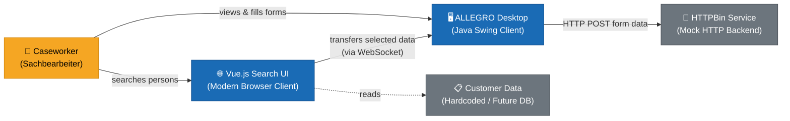

**External interfaces:**

| Interface              | Direction     | Protocol        | Description                                           |
|------------------------|---------------|-----------------|-------------------------------------------------------|
| Caseworker → Vue UI    | Inbound       | HTTP/Browser    | User searches and selects customer data               |
| Vue UI → ALLEGRO       | Internal      | WebSocket/JSON  | Data transfer via Node.js broker                      |
| ALLEGRO → HTTPBin      | Outbound      | HTTP REST/JSON  | Form data submission to mock backend service          |
| Caseworker → ALLEGRO   | Inbound       | Desktop UI      | Direct form interaction in Swing application          |

### 3.2 Technical Context

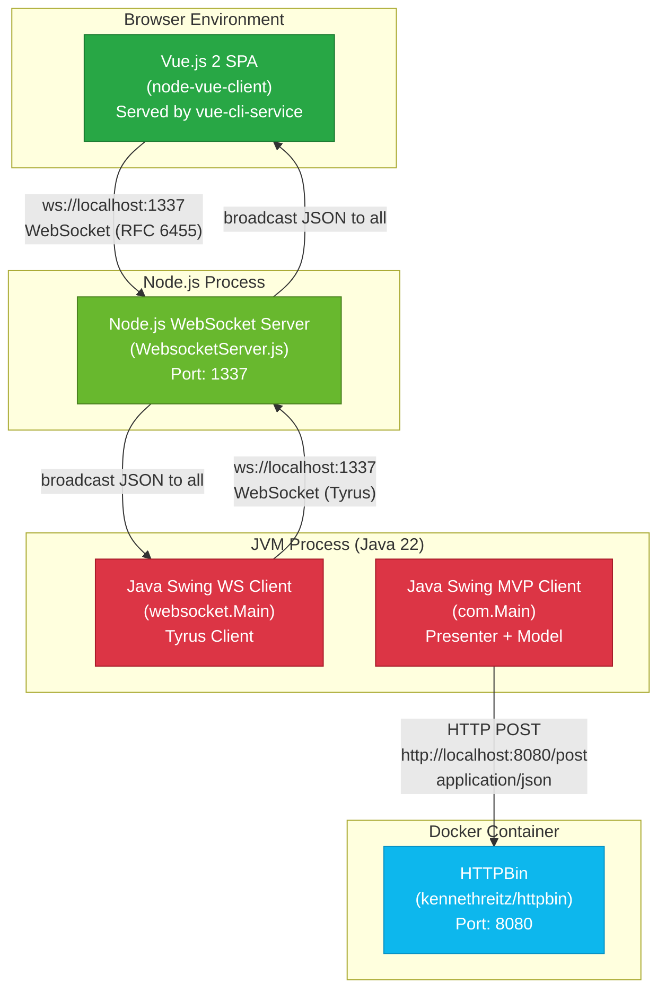

**Technical interfaces:**

| Interface                    | Technology             | Port  | Message Format                          |
|------------------------------|------------------------|-------|-----------------------------------------|
| Vue.js ↔ WS Server          | WebSocket (native API) | 1337  | JSON: `{ target, content }`             |
| Swing WS Client ↔ WS Server | WebSocket (Tyrus 1.15) | 1337  | JSON: `{ target, content }`             |
| Swing MVP → HTTPBin          | HTTP POST (JDK)        | 8080  | JSON: flat key/value (ModelProperties)  |
| WS Server broadcast          | Node.js `websocket`    | 1337  | Broadcast to all connected clients      |

---

## 4. Solution Strategy

### 4.1 Fundamental Technology Decisions

| Decision                          | Technology Chosen                            | Rationale                                                                               |
|-----------------------------------|----------------------------------------------|-----------------------------------------------------------------------------------------|
| **Real-time data bridge**         | WebSocket (RFC 6455)                         | Enables push-based, bidirectional communication; avoids polling; supported natively in browsers and via Tyrus in Java |
| **Message broker / hub**          | Node.js with `websocket` npm package         | Lightweight, event-driven; simple broadcast server requires minimal code                |
| **Legacy client UI**              | Java Swing                                   | Existing ALLEGRO system uses Swing; PoC retains this to demonstrate non-invasive integration |
| **Modern search UI**              | Vue.js 2.x SPA                               | Lightweight, component-based; Vue CLI enables rapid prototyping                          |
| **Java WebSocket client library** | Tyrus Standalone Client 1.15                 | Reference implementation of JSR-356 (javax.websocket); self-contained, no app server needed |
| **Java JSON processing**          | javax.json-api + Glassfish javax.json        | Standard Java EE JSON processing API; streaming parser for low-overhead JSON parsing    |
| **HTTP mock backend**             | HTTPBin (Docker)                             | Zero-effort HTTP echo service for validating HTTP POST from Swing MVP client            |
| **UI architecture (Java)**        | MVP (Model-View-Presenter)                   | Separates UI (Swing widgets) from business logic; improves testability and maintainability |
| **Build system (Java)**           | Maven                                        | Standard Java build tool; manages Tyrus and javax.json dependencies                     |

### 4.2 Top-Level Decomposition Strategy

The system follows a **Hub-and-Spoke** topology for WebSocket messaging:

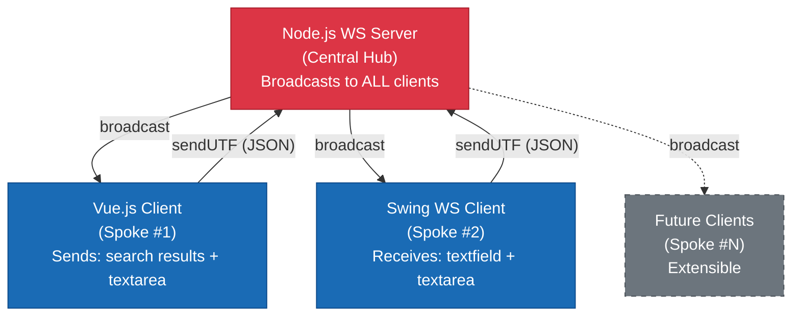

### 4.3 Approach to Quality Goals

| Quality Goal                | Architectural Approach                                                                              |
|-----------------------------|-----------------------------------------------------------------------------------------------------|
| Real-Time Responsiveness    | WebSocket push eliminates polling latency; server broadcasts synchronously to all clients           |
| Interoperability            | All messages are JSON-serialized with a `target` + `content` envelope; clients dispatch by target  |
| Simplicity                  | No framework overhead on server side; single-file Node.js server; Vue CLI scaffolding for client    |
| Extensibility               | MVP pattern decouples Swing UI from model; new clients can connect to WS server without server changes |

---

## 5. Building Block View

### 5.1 Level 1: System Overview

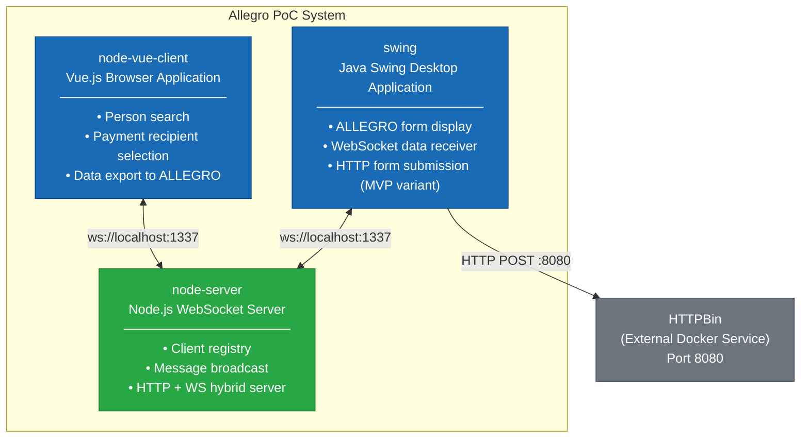

### 5.2 Level 2: Module Structure

#### 5.2.1 node-vue-client (Vue.js SPA)

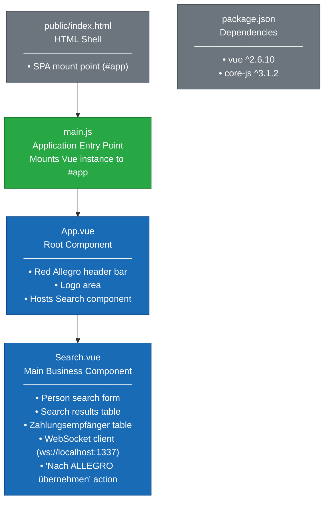

#### 5.2.2 node-server (Node.js WebSocket Server)

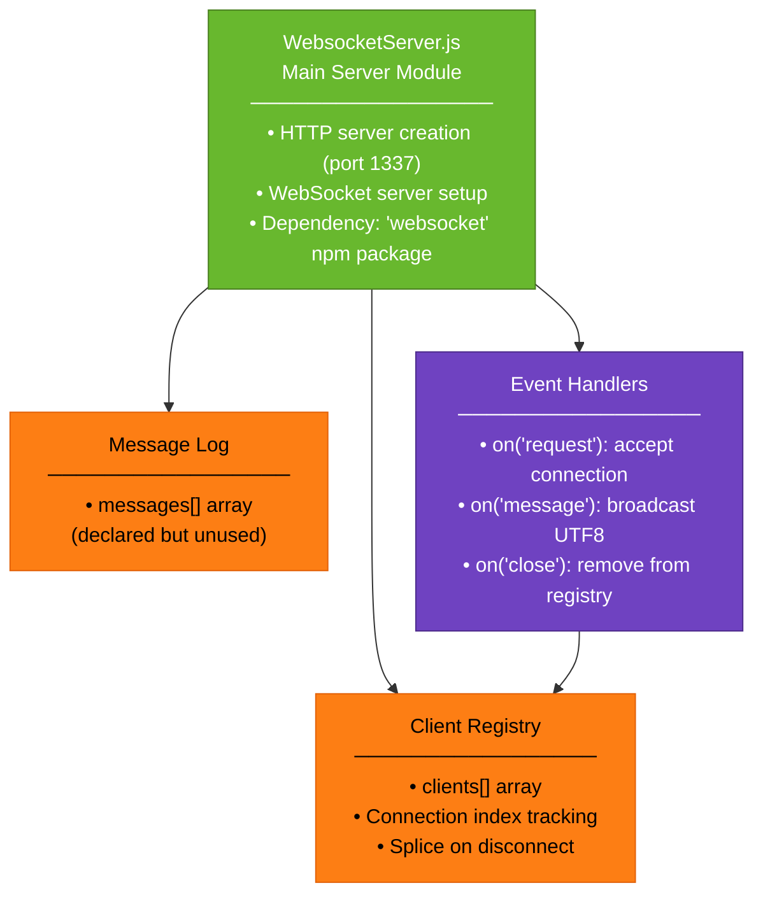

#### 5.2.3 swing (Java Application — Two Parallel Variants)

```mermaid
graph TB
    classDef variantHeader fill:#343a40,stroke:#1a1e21,color:#fff
    classDef class fill:#17a2b8,stroke:#0d7a8a,color:#fff
    classDef inner fill:#6f42c1,stroke:#4e2d8c,color:#fff

    subgraph WSVariant["WebSocket Variant — package: websocket"]
        WSMain["websocket.Main\n─────────────────\n• Swing UI setup (GridBagLayout)\n• WS client integration\n• JSON streaming parser\n• Message dispatch (target switch)"]:::class
        WSEndpoint["WebsocketClientEndpoint\n(inner class)\n─────────────────\n• @OnOpen / @OnClose / @OnMessage\n• sendMessage() via AsyncRemote"]:::inner
        WSMessage["Message\n(inner class)\n─────────────────\n• target: String\n• content: String"]:::inner
        WSSearchResult["SearchResult\n(inner class)\n─────────────────\n• name, first, dob\n• zip, ort, street, hausnr\n• ze_iban, ze_bic, ze_valid_from"]:::inner
        WSMain --> WSEndpoint
        WSMain --> WSMessage
        WSMain --> WSSearchResult
    end

    subgraph MVPVariant["MVP Variant — package: com.poc"]
        ComMain["com.Main\n─────────────────\n• Wires MVP triad\n• CountDownLatch lifecycle"]:::class
        PocView["PocView\n─────────────────\n• JFrame, JTextArea\n• JTextField × 9\n• JRadioButton × 3 (gender)\n• JButton (Anordnen)"]:::class
        PocPresenter["PocPresenter\n─────────────────\n• DocumentListener bindings\n• Button action handler\n• EventEmitter subscriber"]:::class
        PocModel["PocModel\n─────────────────\n• EnumMap model state\n• action() → HTTP POST"]:::class
        HttpBinSvc["HttpBinService\n─────────────────\n• POST http://localhost:8080/post\n• javax.json generator\n• Scanner response reader"]:::class
        EventEmitter["EventEmitter\n─────────────────\n• subscribe(listener)\n• emit(eventData)"]:::class
        ValueModel["ValueModel T\n─────────────────\n• Generic field wrapper\n• getField() / setField()"]:::class
        ModelProps["ModelProperties (enum)\n─────────────────\n• TEXT_AREA, FIRST_NAME,\n  LAST_NAME, DATE_OF_BIRTH,\n  ZIP, ORT, STREET, IBAN,\n  BIC, VALID_FROM,\n  FEMALE, MALE, DIVERSE"]:::class

        ComMain --> PocView
        ComMain --> PocModel
        ComMain --> PocPresenter
        ComMain --> EventEmitter
        PocPresenter --> PocView
        PocPresenter --> PocModel
        PocPresenter --> EventEmitter
        PocModel --> HttpBinSvc
        PocModel --> EventEmitter
        PocModel --> ValueModel
        PocModel --> ModelProps
    end
```

### 5.3 Level 3: Java MVP Class Diagram

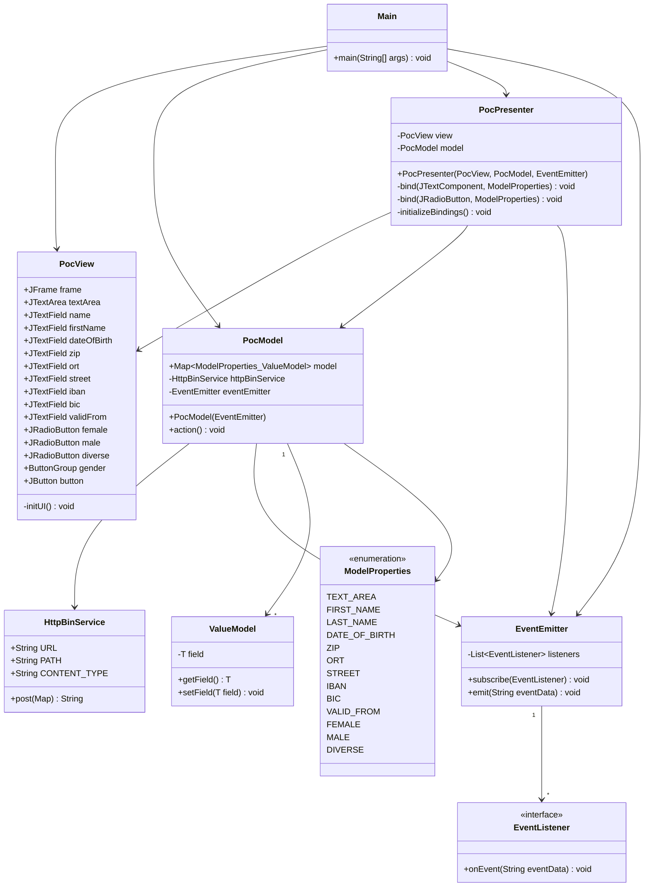

### 5.4 Level 3: Java WebSocket Variant Class Diagram

```mermaid
classDiagram
    class Main {
        -CountDownLatch latch$
        -JFrame frame$
        -JTextArea textArea$
        -JTextField tf_name$
        -JTextField tf_first$
        -JTextField tf_dob$
        -JTextField tf_zip$
        -JTextField tf_ort$
        -JTextField tf_street$
        -JTextField tf_hausnr$
        -JTextField tf_ze_iban$
        -JTextField tf_ze_bic$
        -JTextField tf_ze_valid_from$
        -JsonParserFactory jsonParserFactory$
        +main(String[]) void$
        -initUI() void$
        +toSearchResult(String) SearchResult$
        +extract(String) Message$
    }
    class WebsocketClientEndpoint {
        +Session userSession
        +WebsocketClientEndpoint(URI endpointURI)
        +onOpen(Session) void
        +onClose(Session, CloseReason) void
        +onMessage(String json) void
        +sendMessage(String message) void
    }
    class Message {
        +String target
        +String content
        +Message(String target, String message)
    }
    class SearchResult {
        +String name
        +String first
        +String dob
        +String zip
        +String ort
        +String street
        +String hausnr
        +String ze_iban
        +String ze_bic
        +String ze_valid_from
    }

    Main +-- WebsocketClientEndpoint : inner class
    Main +-- Message : inner class
    Main +-- SearchResult : inner class
    Main --> WebsocketClientEndpoint : creates
```

---

## 6. Runtime View

### 6.1 Scenario: Person Search and Transfer to ALLEGRO

This is the primary use case of the system — a caseworker finds a customer in the Vue.js UI and sends the data to the ALLEGRO desktop application.

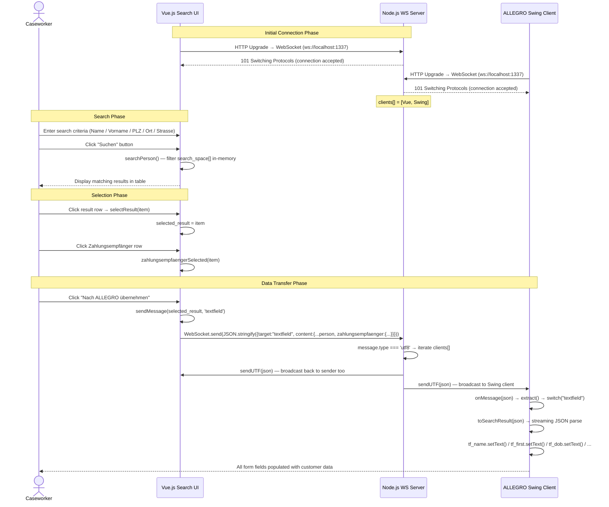

### 6.2 Scenario: Textarea Real-Time Synchronisation

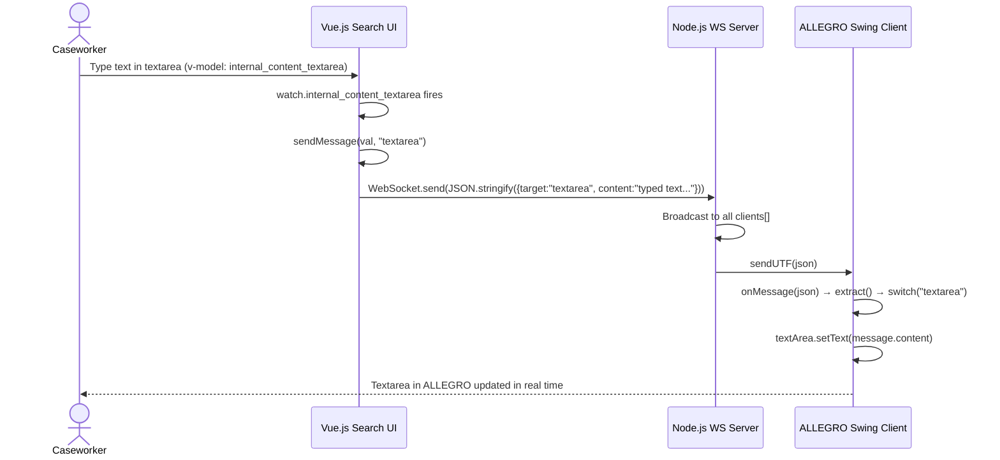

### 6.3 Scenario: HTTP Form Submission (MVP Variant — com.poc)

```mermaid
sequenceDiagram
    actor CW as Caseworker
    participant View as PocView (Swing)
    participant Presenter as PocPresenter
    participant Model as PocModel
    participant SVC as HttpBinService
    participant HTTPBin as HTTPBin Docker :8080
    participant EE as EventEmitter

    CW->>View: Fill in form fields (Vorname, Name, IBAN, BIC ...)
    View->>Presenter: DocumentListener → insertUpdate/removeUpdate
    Presenter->>Model: model.get(prop).setField(content)
    Note over Model: ValueModel updated per ModelProperty key

    CW->>View: Click "Anordnen" button
    View->>Presenter: ActionListener fires
    Presenter->>Model: model.action()
    Model->>Model: Build HashMap from all ModelProperties values
    Model->>SVC: httpBinService.post(data)
    SVC->>HTTPBin: HTTP POST /post\nContent-Type: application/json\n{FIRST_NAME:..., IBAN:..., ...}
    HTTPBin-->>SVC: 200 OK — JSON echo of request
    SVC-->>Model: responseBody (String)
    Model->>EE: eventEmitter.emit(responseBody)
    EE->>Presenter: listener.onEvent(eventData) [lambda]
    Presenter->>View: view.textArea.setText(eventData)
    Presenter->>View: Clear all input fields (setText(""))
    Presenter->>View: view.female.setSelected(true)
    View-->>CW: Response shown in textarea; form cleared
```

### 6.4 WebSocket Server Connection Lifecycle (State View)

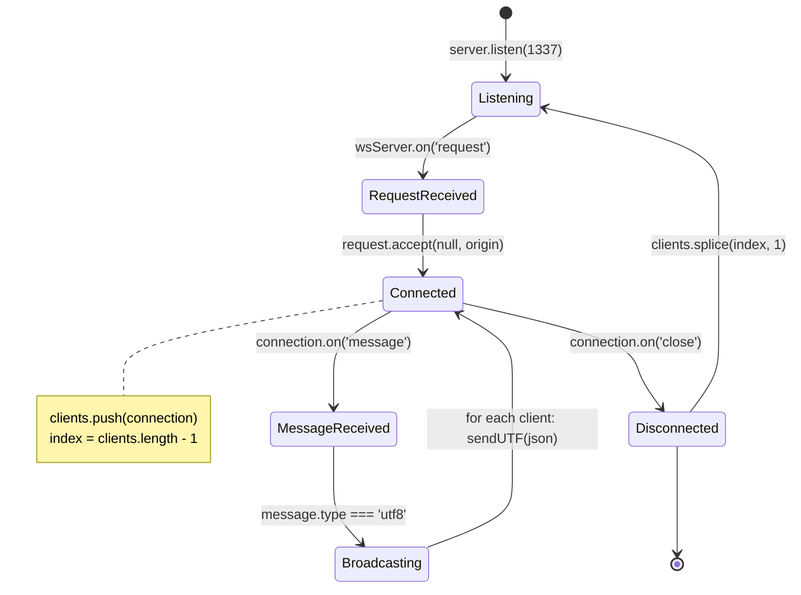

---

## 7. Deployment View

### 7.1 Local Development Deployment Topology

All components are designed to run on a single developer workstation. This is the only supported deployment topology for the PoC.

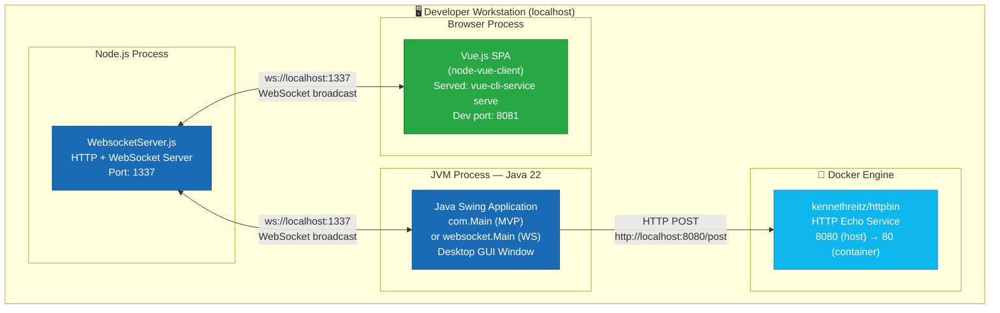

### 7.2 Infrastructure Requirements

| Component                | Runtime           | Version   | Port       | Start Command                                          |
|--------------------------|-------------------|-----------|------------|--------------------------------------------------------|
| Node.js WS Server        | Node.js           | Any LTS   | **1337**   | `node node-server/src/WebsocketServer.js`              |
| Vue.js Dev Server        | Node.js + Vue CLI | CLI 4.x   | **8081**   | `cd node-vue-client && yarn run serve`                 |
| Java Swing App (MVP)     | JVM 22+           | ≥ 22.0.1  | —          | Run `com.Main` via IntelliJ or `mvn exec:java`         |
| Java Swing App (WS)      | JVM 22+           | ≥ 22.0.1  | —          | Run `websocket.Main` via IntelliJ                      |
| HTTPBin (Docker)         | Docker            | Any       | **8080**   | `docker run -p 8080:80 kennethreitz/httpbin`           |

### 7.3 Required Startup Sequence

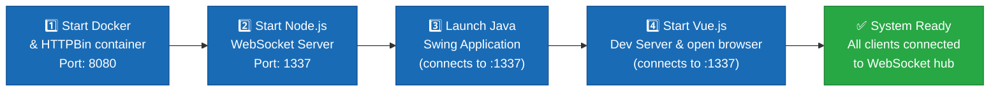

### 7.4 Maven Build Configuration

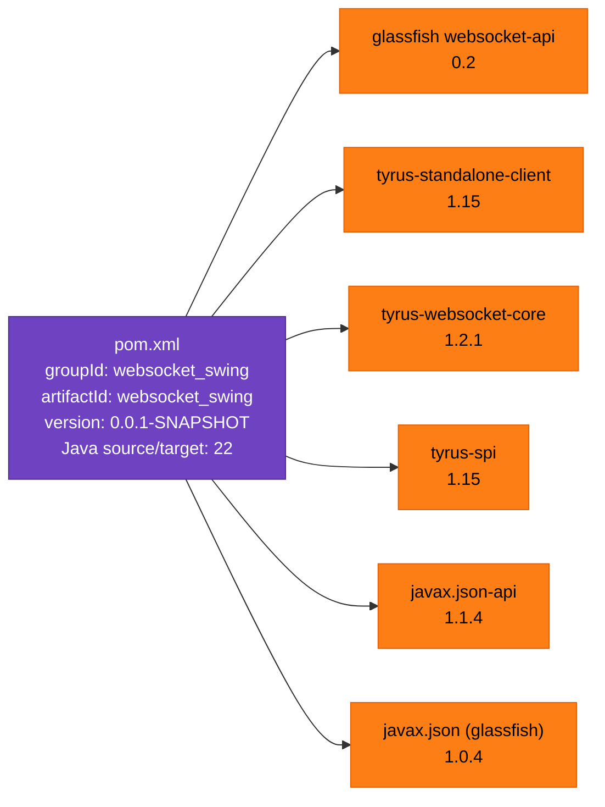

---

## 8. Crosscutting Concepts

### 8.1 Domain Model

The core domain revolves around German social insurance customer management (*Kundenverwaltung*). The entities identified from source code analysis:

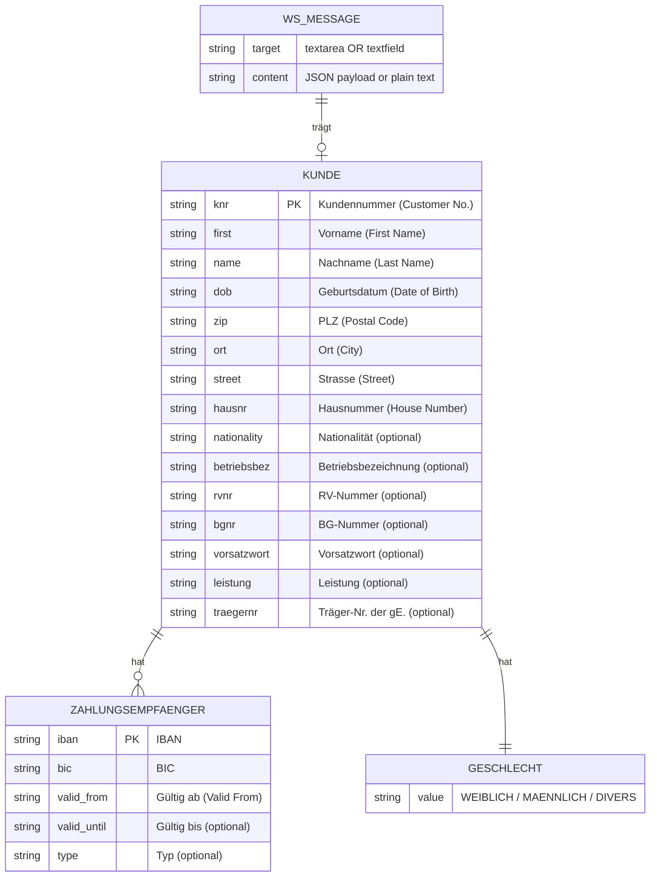

### 8.2 WebSocket Messaging Architecture

**Message Envelope Format:**  
All messages exchanged via WebSocket conform to a simple JSON envelope:

```json
{
  "target": "textfield | textarea",
  "content": "<string or JSON-serialized object>"
}
```

| Target      | Content Type             | Description                                      |
|-------------|--------------------------|--------------------------------------------------|
| `textfield` | JSON Object (serialized) | Serialized `Kunde` + `Zahlungsempfänger` data    |
| `textarea`  | Plain String             | Free-text content for textarea synchronisation   |

**Broadcast Topology:**  
The Node.js server does **not** implement selective routing. Every message received from any client is broadcast to **all connected clients** including the sender. Clients are responsible for handling their own echoed messages.

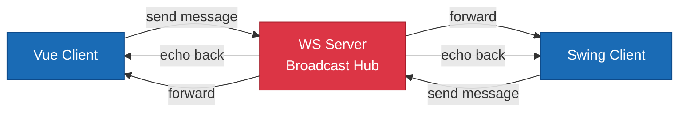

### 8.3 Design Patterns Applied

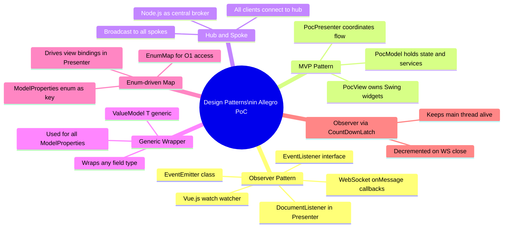

### 8.4 Error Handling Assessment

| Component              | Error Handling Approach                                                                  |
|------------------------|------------------------------------------------------------------------------------------|
| Node.js WS Server      | **None** — no `connection.on('error')` handler; unhandled exceptions crash the process  |
| Vue.js Client          | **None** — `socket.onerror` not implemented; no reconnection logic                      |
| Swing WS Client        | `DeploymentException`, `IOException`, `InterruptedException` wrapped in `RuntimeException`; no recovery |
| Swing MVP Client       | `IOException` and `InterruptedException` wrapped in `RuntimeException`; no fallback     |
| HttpBinService         | **No HTTP status validation** — assumes 200 OK; any error throws unchecked exception    |

### 8.5 JSON Processing Strategy

Two different JSON processing approaches are used across the system:

| Component             | Library                    | Strategy               | Notes                                              |
|-----------------------|----------------------------|------------------------|----------------------------------------------------|
| Vue.js Client         | Native browser JSON        | `JSON.stringify()`     | Simple object serialization                        |
| Swing WS Client       | javax.json Streaming API   | Event-driven parser    | Manual boolean-flag field extraction (verbose)     |
| Swing MVP Client      | javax.json Generator API   | Streaming generator    | Writes JSON to HTTP connection output stream       |
| Node.js Server        | None (raw passthrough)     | UTF-8 string relay     | No parsing/deserialization; pure message broker    |

### 8.6 UI Field Mapping

Both GUI clients share the same form field layout representing the same domain entities:

| Domain Field    | Vue.js `v-model`              | Swing (WS variant)    | Swing (MVP variant)  | ModelProperty    |
|-----------------|-------------------------------|-----------------------|----------------------|------------------|
| Vorname         | `formdata.first`              | `tf_first`            | `firstName`          | `FIRST_NAME`     |
| Name            | `formdata.last`               | `tf_name`             | `name`               | `LAST_NAME`      |
| Geburtsdatum    | `formdata.dob`                | `tf_dob`              | `dateOfBirth`        | `DATE_OF_BIRTH`  |
| Strasse         | `formdata.street`             | `tf_street`           | `street`             | `STREET`         |
| PLZ             | `formdata.zip`                | `tf_zip`              | `zip`                | `ZIP`            |
| Ort             | `formdata.ort`                | `tf_ort`              | `ort`                | `ORT`            |
| IBAN            | `zahlungsempfaenger.iban`     | `tf_ze_iban`          | `iban`               | `IBAN`           |
| BIC             | `zahlungsempfaenger.bic`      | `tf_ze_bic`           | `bic`                | `BIC`            |
| Gültig ab       | `zahlungsempfaenger.valid_from` | `tf_ze_valid_from`  | `validFrom`          | `VALID_FROM`     |
| Geschlecht      | *(not in Vue search form)*    | `rb_female/male/diverse` | `female/male/diverse` | `FEMALE/MALE/DIVERSE` |
| Textbereich     | `internal_content_textarea`   | `textArea`            | `textArea`           | `TEXT_AREA`      |

---

## 9. Architecture Decisions

### ADR-001: WebSocket as the Primary Communication Protocol

| | |
|---|---|
| **Status** | Accepted |
| **Date** | PoC initial design |
| **Context** | The ALLEGRO legacy system is a Java Swing desktop application. The new interface is a browser-based SPA. Bridging these two in real time across language and runtime boundaries requires a communication mechanism that works for both without heavyweight middleware. |
| **Decision** | Use WebSocket (RFC 6455) as the transport protocol. The browser's native `WebSocket` API and the Java Tyrus standalone client both support the same protocol without requiring an application server. |
| **Consequences** | ✅ No polling needed; push-based real-time communication. ✅ Bi-directional channel supports future Swing→Browser flows. ✅ Both browser and Java have first-class WebSocket support. ⚠️ All clients receive all messages (broadcast). ⚠️ No message persistence — offline clients miss messages. |

---

### ADR-002: Node.js as Central Message Broker

| | |
|---|---|
| **Status** | Accepted |
| **Date** | PoC initial design |
| **Context** | A central relay is needed between the Vue.js browser client and the Java Swing desktop client. Browser clients cannot initiate connections to desktop apps directly; a server-side hub is required. |
| **Decision** | Use a lightweight Node.js server with the `websocket` npm package as the hub. It accepts WebSocket connections and broadcasts every received message to all connected clients. |
| **Consequences** | ✅ Single-file implementation; minimal complexity. ✅ Node.js event loop naturally handles concurrent connections. ⚠️ Broadcast-to-all topology is not suitable for multi-user production. ⚠️ No CORS restriction — any origin is accepted (`request.accept(null, request.origin)`). |

---

### ADR-003: MVP Pattern for the Java Client

| | |
|---|---|
| **Status** | Accepted (in `com.poc` variant) |
| **Date** | PoC second iteration |
| **Context** | The `websocket.Main` variant monolithically combines UI setup, WebSocket handling, and JSON parsing in a single class with inner types. This is difficult to test and extend. |
| **Decision** | Refactor into Model-View-Presenter: `PocView` owns all Swing widgets; `PocModel` holds form state and HTTP service calls; `PocPresenter` wires them with `DocumentListener` bindings and event subscriptions. |
| **Consequences** | ✅ Clear separation of concerns across three classes. ✅ `PocModel` can be unit-tested without Swing. ✅ View is replaceable without changing business logic. ⚠️ `PocPresenter` still has direct references to Swing-specific `JTextComponent` and `JRadioButton`. ⚠️ Duplicates the UI layout defined in the WS variant. |

---

### ADR-004: JSON Message Envelope with `target` Dispatch Field

| | |
|---|---|
| **Status** | Accepted |
| **Date** | PoC initial design |
| **Context** | Two types of payload need to flow through the same WebSocket channel: structured person/payment data (for form fields) and free text (for textarea sync). |
| **Decision** | Wrap all messages in `{ "target": "<destination>", "content": <payload> }`. Receiving clients dispatch to the correct UI element based on the `target` string value. |
| **Consequences** | ✅ Extensible — new target types can be added without protocol changes. ✅ Consistent across both Java and JavaScript clients. ⚠️ Java implements a verbose flag-based streaming parser for extraction. ⚠️ No message schema validation — malformed JSON causes runtime exceptions. |

---

### ADR-005: In-Memory Hardcoded Person Data in Vue.js

| | |
|---|---|
| **Status** | Accepted (PoC scope only) |
| **Date** | PoC initial design |
| **Context** | The PoC needs realistic German customer data to demonstrate search and transfer flow without a live backend or database. |
| **Decision** | Embed a hardcoded `search_space` array of 5 fictional customers with addresses and IBAN/BIC data directly in `Search.vue`. |
| **Consequences** | ✅ Zero infrastructure needed for search/display features. ✅ Immediately runnable without database setup. ⚠️ Not representative of production scale or query complexity. ⚠️ Data changes require code modification and Vue rebuild. |

---

### ADR-006: Two Parallel Java Implementation Variants

| | |
|---|---|
| **Status** | Accepted (for experimentation) |
| **Date** | PoC second iteration |
| **Context** | Two distinct integration patterns exist: WebSocket-based push reception (`websocket.Main`) and HTTP-based form submission (`com.Main`). |
| **Decision** | Maintain both as parallel exploratory implementations within the same Maven project. |
| **Consequences** | ✅ Each variant isolates a specific architectural concern. ✅ Teams can independently evaluate WebSocket vs. HTTP approaches. ⚠️ Significant UI code duplication (GridBagLayout setup is nearly identical). ⚠️ No clear production path — both are PoC-quality prototypes. |

---

## 10. Quality Requirements

### 10.1 Quality Tree

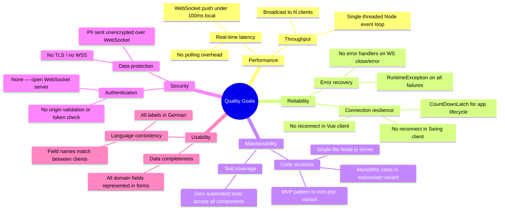

### 10.2 Quality Scenarios

| ID    | Quality Attribute     | Scenario                                                                    | Expected Response                                  | Current Status          |
|-------|-----------------------|-----------------------------------------------------------------------------|-----------------------------------------------------|-------------------------|
| QS-01 | Performance           | Caseworker clicks "Nach ALLEGRO übernehmen"; Swing updates                  | < 200 ms on localhost                               | ✅ Met (local WS)        |
| QS-02 | Reliability           | Node.js WS server restarts; clients recover automatically                   | Auto-reconnect with backoff                         | ❌ Not implemented       |
| QS-03 | Security              | Unknown client connects to ws://localhost:1337 and injects messages         | Connection rejected or authenticated                | ❌ Not implemented       |
| QS-04 | Maintainability       | Developer adds a new form field; change propagates to all layers            | Single-point change in `ModelProperties` enum       | ⚠️ Partial (MVP only)   |
| QS-05 | Testability           | Developer unit-tests `searchPerson()` without a browser                     | Isolated Jest test passes                           | ❌ No tests exist        |
| QS-06 | Usability             | Caseworker searches by partial name; results appear immediately              | In-memory filter, instant response                  | ✅ Met                   |
| QS-07 | Correctness           | JSON message with unknown `target` arrives at Swing client                  | Silently ignored — falls through switch statement   | ⚠️ Falls through, no log |
| QS-08 | Portability           | System runs on Windows 10/11 and Linux                                      | All runtimes are cross-platform                     | ✅ Met                   |
| QS-09 | Security              | IBAN/personal data transmitted over WebSocket                               | Encrypted with TLS (WSS)                            | ❌ Not encrypted         |
| QS-10 | Scalability           | 10 concurrent caseworkers use the search UI simultaneously                  | Isolated sessions; no data cross-contamination       | ❌ Broadcast leaks data  |

### 10.3 Code Metrics Summary

| Component               | Lines of Code (approx.) | Test Coverage | Key Complexity Issues                                     |
|-------------------------|------------------------|---------------|-----------------------------------------------------------|
| `WebsocketServer.js`    | ~68                    | 0%            | Simple callbacks; complexity in broadcast loop            |
| `Search.vue`            | ~250                   | 0%            | High cyclomatic in `searchPerson()`; hardcoded data       |
| `websocket/Main.java`   | ~458                   | 0%            | Very high — monolithic; manual streaming JSON parse       |
| `PocView.java`          | ~203                   | 0%            | Low — layout-only; no business logic                      |
| `PocPresenter.java`     | ~113                   | 0%            | Medium — `DocumentListener` boilerplate for each field    |
| `PocModel.java`         | ~49                    | 0%            | Low-medium — clean delegation pattern                     |
| `HttpBinService.java`   | ~38                    | 0%            | Low — straightforward HTTP POST with no error handling    |

---

## 11. Risks and Technical Debt

### 11.1 Risk Matrix

```mermaid
quadrantChart
    title Risk Matrix — Likelihood vs. Impact
    x-axis Low Likelihood --> High Likelihood
    y-axis Low Impact --> High Impact
    quadrant-1 Critical — Act Now
    quadrant-2 Monitor
    quadrant-3 Accept
    quadrant-4 Mitigate
    No Authentication: [0.85, 0.90]
    No TLS/WSS: [0.80, 0.85]
    Zero Test Coverage: [0.95, 0.70]
    No Error Handling: [0.70, 0.65]
    Broadcast Data Leak: [0.70, 0.60]
    No Reconnect Logic: [0.75, 0.55]
    Hardcoded localhost URLs: [0.90, 0.50]
    Monolithic WS Main: [0.60, 0.45]
    Hardcoded Test Data: [0.95, 0.30]
    CORS Not Enforced: [0.80, 0.60]
```

### 11.2 Risk Register

| ID    | Risk                               | Likelihood | Impact | Description                                                                                  | Mitigation Strategy                                                         |
|-------|------------------------------------|------------|--------|----------------------------------------------------------------------------------------------|-----------------------------------------------------------------------------|
| R-01  | **No Authentication**              | High       | High   | Any client on the local network can connect to port 1337 and receive/inject all broadcast data | Implement token-based auth (JWT in WS handshake header) before production   |
| R-02  | **No Transport Encryption (TLS)**  | High       | High   | IBAN, DOB, personal addresses transmitted in plaintext; GDPR-relevant PII at risk            | Switch to `wss://` with a valid TLS certificate; enforce HTTPS on Vue server |
| R-03  | **Zero Automated Tests**           | Certain    | High   | No unit, integration, or E2E tests across any component; regressions are invisible           | Add Jest (Vue), JUnit 5 (Java), Mocha/Jest (Node.js)                        |
| R-04  | **No Error Handling**              | High       | Medium | WS server crash, HTTP 4xx/5xx, or malformed JSON causes unhandled exceptions across all layers | Add `try/catch`, WS `onerror` handlers, HTTP status validation              |
| R-05  | **Broadcast Data Leakage**         | High       | Medium | All clients receive all messages; multi-user deployment leaks data between sessions           | Implement session/room-based routing in the WS server                       |
| R-06  | **Hardcoded localhost URLs**       | Certain    | Medium | `ws://localhost:1337` and `http://localhost:8080` prevent deployment outside a local machine  | Externalize via `.env` (Vue), `application.properties`, or env variables    |
| R-07  | **No WebSocket Reconnection**      | High       | Medium | Server restart leaves all clients disconnected with no recovery; application appears frozen   | Implement exponential backoff reconnection in Vue and Swing clients          |
| R-08  | **CORS Not Validated**             | High       | Medium | `request.accept(null, request.origin)` accepts connections from any origin                   | Validate `request.origin` against an allowlist of permitted origins         |
| R-09  | **Monolithic `websocket/Main.java`** | Medium   | Low    | All concerns (UI, WS, JSON) in one class makes testing and maintenance difficult              | Refactor using MVP pattern from the `com.poc` variant                       |
| R-10  | **Hardcoded Test Data in Vue**     | Certain    | Low    | Search data in `Search.vue` requires code change and rebuild for any data update              | Replace with REST API call using `api.yml` contract                         |

### 11.3 Technical Debt Backlog

| ID    | Debt Item                                           | Effort  | Priority | Recommendation                                                    |
|-------|-----------------------------------------------------|---------|----------|-------------------------------------------------------------------|
| TD-01 | Add WebSocket reconnection to Vue.js client          | Low     | High     | Add `socket.onclose` with exponential backoff timer               |
| TD-02 | Add WebSocket reconnection to Swing client           | Low     | High     | Implement reconnect in `onClose` with `CountDownLatch` reset      |
| TD-03 | Add test suite for Vue.js `searchPerson()` logic     | Low     | High     | Pure function — trivially testable with Jest                      |
| TD-04 | Add unit tests for `PocModel.action()`               | Low     | High     | Inject `HttpBinService` mock; verify state transitions            |
| TD-05 | Externalize configuration (all hardcoded URLs)       | Low     | High     | `.env` for Vue, env vars or properties file for Java              |
| TD-06 | Replace streaming JSON parser in `websocket.Main`   | Medium  | Medium   | Use Jackson or Gson for simpler, less error-prone deserialization |
| TD-07 | Merge duplicate Swing UI layout code                 | Medium  | Medium   | Both variants have identical `GridBagLayout` — extract to shared `PocView` |
| TD-08 | Add WS server error handling and structured logging  | Low     | Medium   | Add `connection.on('error')` handler; replace `console.log` with a logger |
| TD-09 | Implement HTTP status validation in `HttpBinService` | Low     | Medium   | Check `responseCode` before reading body; throw typed exceptions  |
| TD-10 | Add HTTPS/WSS support                               | Medium  | High     | Required for any non-local environment; PII data requires encryption |
| TD-11 | Replace hardcoded person data with REST API call    | High    | Low (PoC)| Implement `GET /search?q=...` endpoint backed by real data store  |

---

## 12. Glossary

| Term                              | Definition                                                                                         |
|-----------------------------------|----------------------------------------------------------------------------------------------------|
| **ALLEGRO**                       | Legacy Java Swing desktop application used by caseworkers for customer and insurance data management |
| **Anordnen**                      | German: "Arrange/Order" — button label in Swing UI triggering HTTP form submission                  |
| **BG-Nummer**                     | Berufsgenossenschaftsnummer — employer's liability insurance association number                     |
| **BIC**                           | Bank Identifier Code — standardised code identifying a financial institution                        |
| **Betriebsbezeichnung**           | German: Company / employer designation                                                              |
| **CountDownLatch**                | Java concurrency primitive used in both Swing variants to keep the main thread alive until WS close |
| **DocumentListener**              | Java Swing event interface; `PocPresenter` uses it to detect field text changes in real time        |
| **EventEmitter**                  | Observer pattern component in `com.poc.model`; maintains a list of `EventListener` subscribers     |
| **EventListener**                 | Interface in `com.poc.model`; implementors receive string events via `onEvent(String)`              |
| **Geburtsdatum**                  | German: Date of birth                                                                               |
| **Geschlecht**                    | German: Gender (Weiblich = Female, Männlich = Male, Divers = Diverse)                              |
| **IBAN**                          | International Bank Account Number — standardised identifier for bank accounts                       |
| **javax.websocket (JSR-356)**     | Java EE standard API for WebSocket clients and servers; implemented by Tyrus                        |
| **Kunde / Kunden**                | German: Customer(s) — the person records managed in the system                                     |
| **Kundennummer (knr)**            | German: Customer number — unique identifier for a Kunde                                             |
| **Leistung**                      | German: Benefit or service entitlement in a social insurance context                                |
| **ModelProperties**               | Java enum in `com.poc.model` defining all form field keys; drives the `EnumMap` in `PocModel`      |
| **MVP**                           | Model-View-Presenter — UI pattern separating visual components (View) from business logic (Model) with a coordinating Presenter |
| **Nach ALLEGRO übernehmen**       | German: "Transfer to ALLEGRO" — the key action button in the Vue.js UI                             |
| **Node.js WS Server**             | The central Node.js WebSocket hub at `node-server/src/WebsocketServer.js`                           |
| **Ort**                           | German: City / town                                                                                 |
| **PLZ**                           | Postleitzahl — German postal code (ZIP code)                                                        |
| **PoC**                           | Proof of Concept — a prototype demonstrating technical and architectural feasibility                 |
| **PocModel**                      | The M in MVP; holds all form field state as `EnumMap<ModelProperties, ValueModel<?>>`              |
| **PocPresenter**                  | The P in MVP; wires PocView events to PocModel and triggers the `action()` workflow                 |
| **PocView**                       | The V in MVP; owns and lays out all Java Swing UI widgets                                           |
| **RFC 6455**                      | IETF standard defining the WebSocket protocol                                                       |
| **RV-Nummer**                     | Rentenversicherungsnummer — German pension insurance number                                         |
| **Sachbearbeiter**                | German: Caseworker — the primary human user of both client applications                             |
| **Search Mock**                   | The title of the Vue.js application — a simulated search interface                                  |
| **Strasse**                       | German: Street                                                                                      |
| **Suchen**                        | German: "Search" — button label in the Vue.js search form                                           |
| **Träger-Nr. der gE.**            | Träger-Nummer der gemeinsamen Einrichtung — joint employment agency carrier number                  |
| **Tyrus**                         | GlassFish Tyrus — the reference implementation of JSR-356 (javax.websocket) for Java               |
| **ValueModel\<T\>**               | Generic wrapper class in `com.poc`; holds a single typed value with get/set accessor                |
| **Vorname**                       | German: First name                                                                                  |
| **Vorsatzwort**                   | German name particle (e.g., "von", "van") — nobility/particle prefix in a surname                  |
| **Vue.js**                        | Progressive JavaScript framework (v2.x) used for the browser-based search client                   |
| **WebSocket**                     | Full-duplex, persistent communication protocol over a single TCP connection (RFC 6455)              |
| **Zahlungsempfänger**             | German: Payment recipient — entity with IBAN/BIC receiving payments on behalf of a Kunde           |

---

*End of Arc42 Architecture Documentation — Allegro PoC*

---

> **Document Generation Notes:**  
> This documentation was generated by automated source code analysis of the following files:
> - `node-server/src/WebsocketServer.js` — Node.js WebSocket hub server  
> - `node-vue-client/src/App.vue`, `Search.vue`, `main.js` — Vue.js SPA  
> - `swing/src/main/java/websocket/Main.java` — Java Swing WebSocket client  
> - `swing/src/main/java/com/Main.java` — MVP variant entry point  
> - `swing/src/main/java/com/poc/model/*` — MVP model layer  
> - `swing/src/main/java/com/poc/presentation/*` — MVP presentation layer  
> - `pom.xml` — Maven build configuration (Java 22, Tyrus 1.15, javax.json)  
> - `api.yml` — OpenAPI 3.0.1 specification  
> - `README.md`, `node-vue-client/README.md`, `node-server/doc/Readme.txt` — Project setup documentation
