# Allegro PoC — Arc42 Architecture Documentation

**Project:** `websocket_swing` — Allegro Modernization Proof of Concept  
**Version:** 1.0  
**Date:** 2025-07-04  
**Status:** Generated from full source-code analysis  
**Scope:** All source files in `/swing`, `/node-server`, `/node-vue-client`, `api.yml`, `pom.xml`  
**Intended path:** `docs/arc42/arc42-architecture.md`

---

## Table of Contents

1. [Introduction and Goals](#1-introduction-and-goals)
2. [Architecture Constraints](#2-architecture-constraints)
3. [Context and Scope](#3-context-and-scope)
4. [Solution Strategy](#4-solution-strategy)
5. [Building Block View](#5-building-block-view)
6. [Runtime View](#6-runtime-view)
7. [Deployment View](#7-deployment-view)
8. [Cross-cutting Concepts](#8-cross-cutting-concepts)
9. [Architecture Decisions](#9-architecture-decisions)
10. [Quality Requirements](#10-quality-requirements)
11. [Risks and Technical Debt](#11-risks-and-technical-debt)
12. [Glossary](#12-glossary)

---

## 1. Introduction and Goals

### 1.1 Purpose

This repository is an **Allegro Modernization Proof-of-Concept (PoC)**. "Allegro" is a legacy desktop application used for social-insurance / benefits administration (German: Sozialversicherungs- und Leistungsverwaltung). The PoC investigates whether a **browser-based search and selection UI** can push structured person data in real time into the existing Allegro Java Swing desktop client, without modifying Allegro's internal persistence layer directly.

The integration path is:

```
Web Browser (Vue.js Search UI)
        ↓  WebSocket  ws://localhost:1337
Node.js WebSocket Relay Server
        ↓  WebSocket  ws://localhost:1337
Java Swing Desktop Client (Allegro)
        ↓  HTTP POST  http://localhost:8080
HTTPBin Mock REST API (Docker)
```

### 1.2 Key Use Cases

| ID | Use Case | Description |
|----|----------|-------------|
| UC-1 | Person Search | The web client searches a local in-memory dataset by name, first name, ZIP, city, street, or house number |
| UC-2 | Person Selection | The user selects a matching record from the search results table |
| UC-3 | Payment Account Selection | The user selects one of the person's IBAN/BIC payment entries (*Zahlungsempfänger*) |
| UC-4 | Transfer to Allegro | One click sends the selected record over WebSocket to all connected Swing clients |
| UC-5 | Form Prefill in Swing | The Swing client receives the JSON payload and populates its form fields automatically |
| UC-6 | Submit to Backend | The user presses "Anordnen" in the Swing client to POST the form data to the REST backend |
| UC-7 | Textarea Live Sync | Any text typed in the Vue textarea is broadcast live to the Swing client's text area |

### 1.3 Quality Goals

| Priority | Quality Goal | Motivation |
|----------|--------------|------------|
| 1 | **Demonstrability** | The PoC must visibly show bidirectional data flow to stakeholders |
| 2 | **Simplicity** | Minimal infrastructure — runs entirely on localhost without databases or auth |
| 3 | **Separation of Concerns** | The refactored Swing module uses MVP; business logic is isolated from UI |
| 4 | **Extensibility** | The WebSocket message envelope (`target` + `content`) is generic enough to carry any payload type |
| 5 | **Low Coupling** | The Node.js server is a pure relay; clients are independent of each other |

### 1.4 Stakeholders

| Role | Interest |
|------|----------|
| Solution Architect | Validates the WebSocket-based integration approach as a migration path for the Allegro system |
| Developer | Understands how MVP pattern is applied to Swing and how WebSocket communication works |
| Business Analyst | Confirms that the data model (person + payment) matches the Allegro domain |
| Operations | Needs to know how to start and stop all three runtime components |

---

## 2. Architecture Constraints

### 2.1 Technical Constraints

| Constraint | Detail |
|-----------|--------|
| **Java Version** | Java SDK ≥ 22.0.1 (Maven compiler source/target `22`; unnamed variable `_` syntax used in `PocPresenter`) |
| **Swing UI Framework** | Legacy Java Swing (AWT/Swing) — dictated by the existing Allegro desktop technology |
| **WebSocket Client (Java)** | GlassFish Tyrus Standalone Client 1.15 (`tyrus-standalone-client`) — JSR-356 reference implementation |
| **JSON Processing (Java)** | `javax.json-api` 1.1.4 / `javax.json` 1.0.4 — streaming `JsonParser` (pull-parser pattern) |
| **WebSocket Server** | Node.js with `websocket` npm package v1.0.35 — pure JavaScript relay |
| **Vue.js Version** | Vue 2.x (v2.6.10) — component-based, no Vuex, no Vue Router |
| **Build Tool (Java)** | Apache Maven (no version pinned in pom.xml); IntelliJ IDEA or Eclipse IDE |
| **Build Tool (JS)** | npm / yarn with `@vue/cli-service` for Vue; plain `npm install` for node-server |
| **Target Environment** | Localhost development only — all ports hardcoded in source |
| **Mock Backend** | Docker image `kennethreitz/httpbin` mapped to port 8080 |
| **No Database** | All search data is a hardcoded in-memory JavaScript array in `Search.vue` |
| **No Authentication** | No auth, no HTTPS/WSS; plain HTTP and `ws://` only |

### 2.2 Organisational Constraints

| Constraint | Detail |
|-----------|--------|
| **PoC Scope** | Not intended for production deployment; no SLA, no security hardening required |
| **IDE** | IntelliJ IDEA recommended; Eclipse launch config `WebsocketSwingClient.launch` also present |
| **Language Mix** | Polyglot: Java + JavaScript/Vue.js; no shared build orchestration tool |
| **No Test Coverage** | No unit tests, no integration tests in any module |

### 2.3 Fixed Port Assignments

| Port | Assigned To | Hardcoded In |
|------|------------|-------------|
| `1337` | Node.js WebSocket Server | `WebsocketServer.js`, `Search.vue`, `websocket/Main.java` |
| `8080` | HTTPBin Docker mock REST API | `HttpBinService.java`, `api.yml` |
| `8081` (default) | Vue.js dev server (`vue-cli-service serve`) | Framework default |

---

## 3. Context and Scope

### 3.1 System Boundary

The **Allegro PoC system** consists of three self-contained runtime processes communicating over local network sockets. The system has one external dependency: the HTTPBin Docker container acting as a mock REST API.

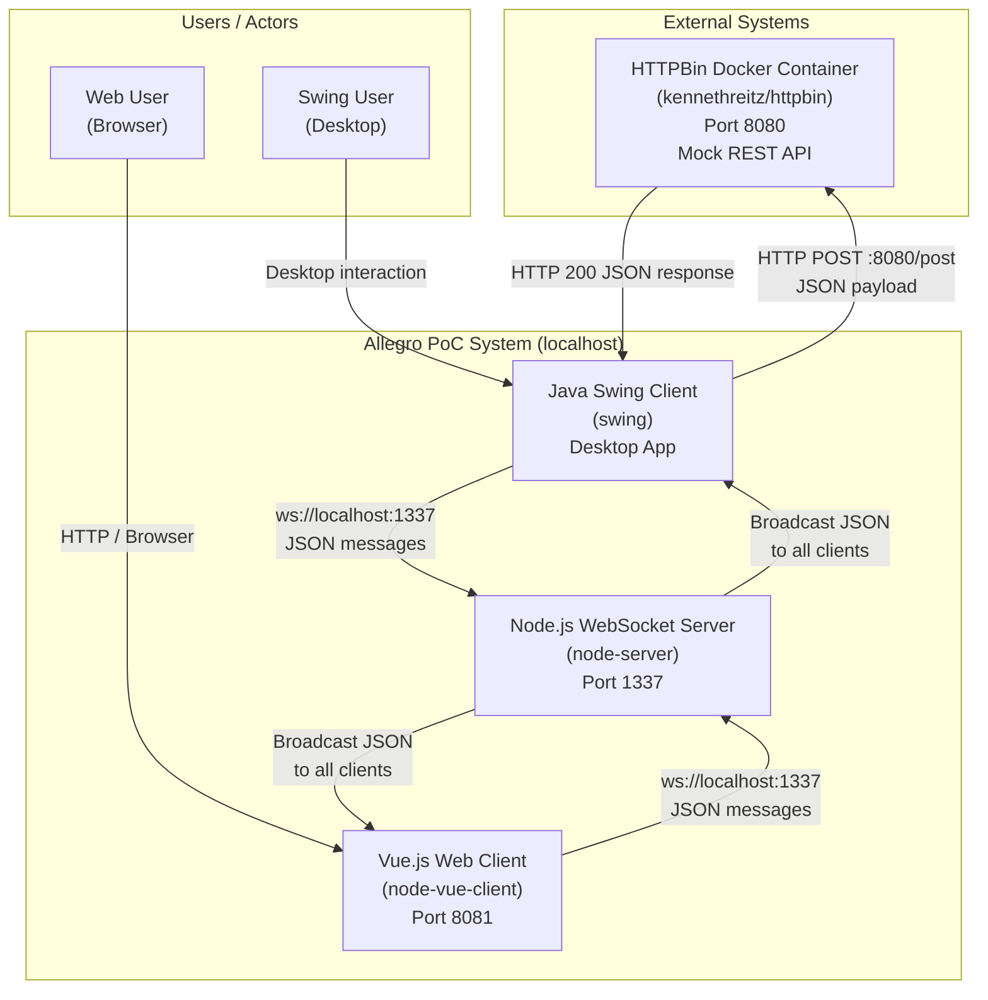

### 3.2 External Interfaces

| Interface | Direction | Protocol | Endpoint | Description |
|-----------|-----------|----------|----------|-------------|
| WebSocket Connect | Vue → Server | WS (RFC 6455) | `ws://localhost:1337/` | Vue client establishes persistent connection on component mount |
| WebSocket Connect | Swing → Server | WS (JSR-356) | `ws://localhost:1337/` | Swing client connects on application startup |
| WebSocket Message (outbound) | Vue → Server → Swing | JSON over WS | — | `{target, content}` envelope; target = `"textfield"` or `"textarea"` |
| WebSocket Message (inbound) | Any → Server → All | JSON over WS | — | Server broadcasts every received message to all registered clients |
| REST POST | Swing → HTTPBin | HTTP/1.1 POST | `http://localhost:8080/post` | Submits form data as JSON; returns echoed payload |

### 3.3 JSON Message Envelope

All WebSocket messages use this two-field envelope structure:

```json
{
  "target": "textfield | textarea",
  "content": "<string or nested object>"
}
```

| `target` value | `content` type | Consumer action |
|----------------|----------------|-----------------|
| `"textfield"` | Person object (JSON object) | Swing parses and populates all text fields |
| `"textarea"` | Plain string | Swing sets text area content verbatim |

---

## 4. Solution Strategy

### 4.1 Architectural Approach

The PoC is built around a **WebSocket broadcast hub** pattern:

- A lightweight Node.js server acts as a **stateless relay** — it maintains a list of active connections and forwards any received message to every other connected client.
- This decouples the Vue.js frontend from the Swing backend completely: neither client knows about the other's existence.
- The message envelope (`target` + `content`) acts as a **discriminated union**, enabling a single channel to carry different payload types to different UI targets.

### 4.2 Client-Side Architectural Styles

#### Java Swing Client — Model-View-Presenter (MVP)

The refactored Swing client (`com/` package) follows the MVP pattern:

| Layer | Class | Responsibility |
|-------|-------|---------------|
| View | `PocView` | Declares and lays out all Swing widgets; exposes fields as `protected` — no logic |
| Model | `PocModel` | Holds `ValueModel<T>` per form field; orchestrates HTTP POST via `HttpBinService`; fires events via `EventEmitter` |
| Presenter | `PocPresenter` | Wires view events (button, document changes) to model updates; subscribes to `EventEmitter` for async response |
| Infrastructure | `EventEmitter` / `EventListener` | Lightweight observer pattern for model-to-presenter async notification |
| Value Holder | `ValueModel<T>` | Generic typed wrapper for a single field value |
| Service | `HttpBinService` | Isolated HTTP client; builds JSON payload via `JsonGenerator`, sends POST, returns response body string |

#### Vue.js Client — Single-File Component (SFC) Architecture

| Component | Responsibility |
|-----------|---------------|
| `App.vue` | Shell: renders branded header and embeds `<Search>` component |
| `Search.vue` | All business logic: two-way form binding (`v-model`), local client-side search, two results tables, WebSocket management, send to Allegro action |

### 4.3 Technology Decision Summary

| Decision | Technology | Rationale |
|----------|------------|-----------|
| Real-time client–client messaging | WebSocket (RFC 6455) | Persistent bi-directional channel; no polling overhead |
| Server-side relay | Node.js + `websocket` npm | Minimal footprint; non-blocking I/O; zero business logic needed |
| Desktop client | Java Swing | Represents the existing Allegro technology stack |
| Web client | Vue.js 2 | Lightweight SPA framework; fast prototyping with SFCs |
| Backend mock | HTTPBin Docker | Zero-code REST echo endpoint for payload validation |
| API contract | OpenAPI 3.0 (`api.yml`) | Documents the person data schema formally |
| Java WebSocket impl | GlassFish Tyrus 1.15 | Reference JSR-356 implementation; works standalone without app server |

---

## 5. Building Block View

### 5.1 Level 1 — System Decomposition

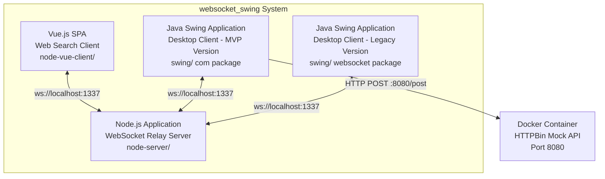

> **Note:** `websocket/Main.java` is the original monolithic Swing client. `com/Main.java` is the refactored MVP version. Both are entry points in the same Maven project.

### 5.2 Level 2 — Node.js WebSocket Relay Server

**Source:** `node-server/src/WebsocketServer.js`

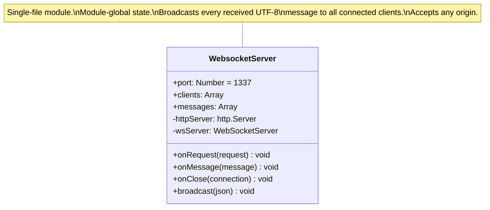

**Event table:**

| Event | Trigger | Action |
|-------|---------|--------|
| `request` | New WS connection attempt | Accept any origin; push to `clients[]`; log origin |
| `message` (utf8) | Client sends text frame | Log JSON; broadcast raw string to all `clients[i].sendUTF(json)` |
| `close` | Client disconnects | `clients.splice(index, 1)`; log remote address |

### 5.3 Level 2 — Vue.js Web Search Client

**Source:** `node-vue-client/src/`

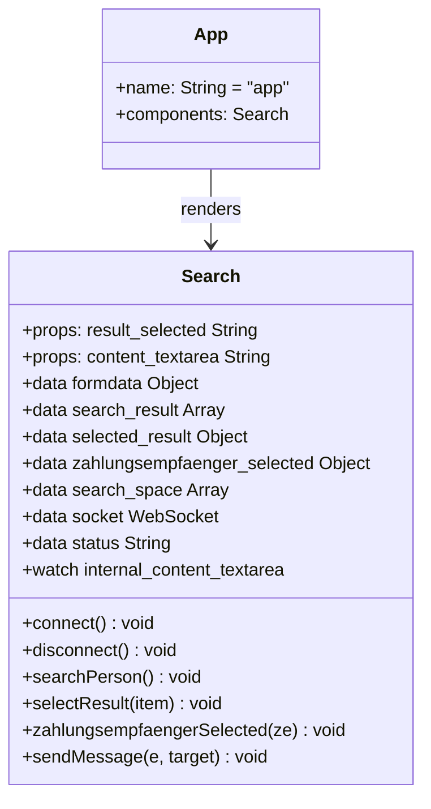

**Hardcoded search dataset** (5 persons in `search_space[]`):

| Field | Description |
|-------|-------------|
| `first`, `name` | First and last name |
| `dob` | Date of birth (ISO format) |
| `zip`, `ort`, `street`, `hausnr` | Address |
| `knr` | Kundennummer (customer number) |
| `zahlungsempfaenger[]` | Array of IBAN/BIC/valid_from payment accounts |

**Search algorithm** — case-insensitive substring OR match across: `name`, `first`, `zip` (exact equality), `ort`, `street`, `hausnr`.

### 5.4 Level 2 — Refactored Java Swing Client (MVP)

**Source:** `swing/src/main/java/com/`

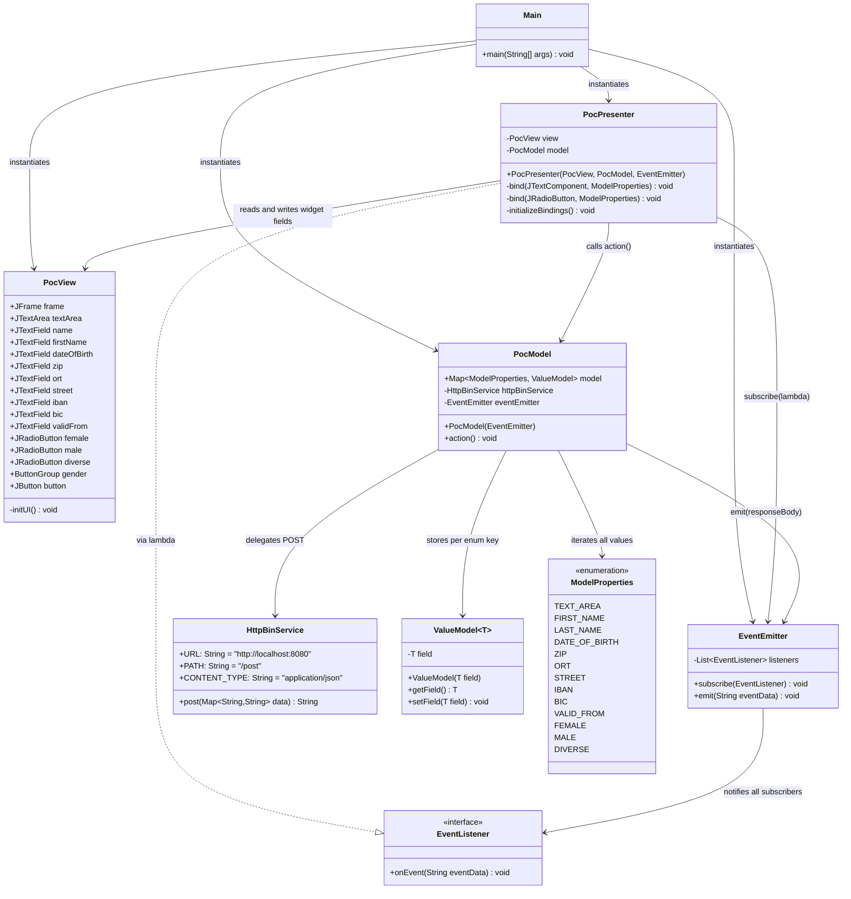

### 5.5 Level 2 — Legacy Monolithic Java Swing Client

**Source:** `swing/src/main/java/websocket/Main.java`

The original pre-refactoring version. All concerns are collapsed into a single class with static fields.

```mermaid
classDiagram
    class Main {
        -latch CountDownLatch$
        -frame JFrame$
        -textArea JTextArea$
        -tf_name JTextField$
        -tf_first JTextField$
        -tf_dob JTextField$
        -tf_zip JTextField$
        -tf_ort JTextField$
        -tf_street JTextField$
        -tf_hausnr JTextField$
        -tf_ze_iban JTextField$
        -tf_ze_bic JTextField$
        -tf_ze_valid_from JTextField$
        -rb_female JRadioButton$
        -rb_male JRadioButton$
        -rb_diverse JRadioButton$
        -bg_gender ButtonGroup$
        -jsonParserFactory JsonParserFactory$
        +main(String[] args)$
        -initUI()$
        +toSearchResult(String json) SearchResult$
    }

    class WebsocketClientEndpoint {
        <<ClientEndpoint>>
        +userSession Session
        +WebsocketClientEndpoint(URI)
        +onOpen(Session) void
        +onClose(Session, CloseReason) void
        +onMessage(String json) void
        +sendMessage(String) void
        +extract(String json) Message$
    }

    class Message {
        +target String
        +content String
    }

    class SearchResult {
        +name String
        +first String
        +dob String
        +zip String
        +ort String
        +street String
        +hausnr String
        +ze_iban String
        +ze_bic String
        +ze_valid_from String
    }

    Main +-- WebsocketClientEndpoint : static inner class
    Main +-- Message : static inner class
    Main +-- SearchResult : static inner class
    WebsocketClientEndpoint --> Message : creates via extract()
    WebsocketClientEndpoint --> SearchResult : creates via toSearchResult()
```

---

## 6. Runtime View

### 6.1 Scenario: System Startup

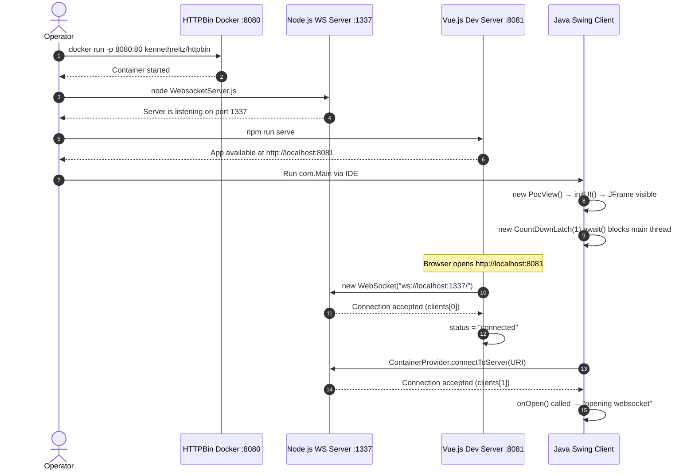

### 6.2 Scenario: Person Search and Transfer to Allegro

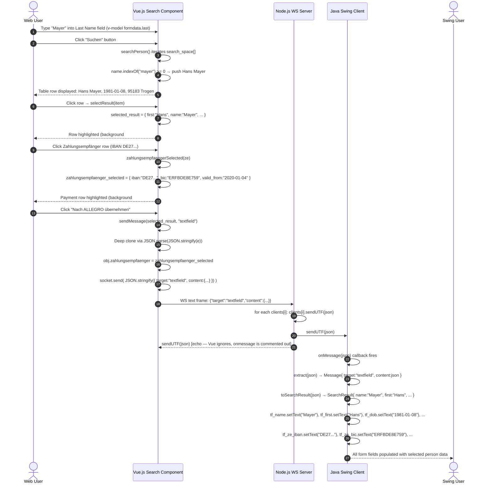

### 6.3 Scenario: Textarea Live Sync (Vue → Swing)

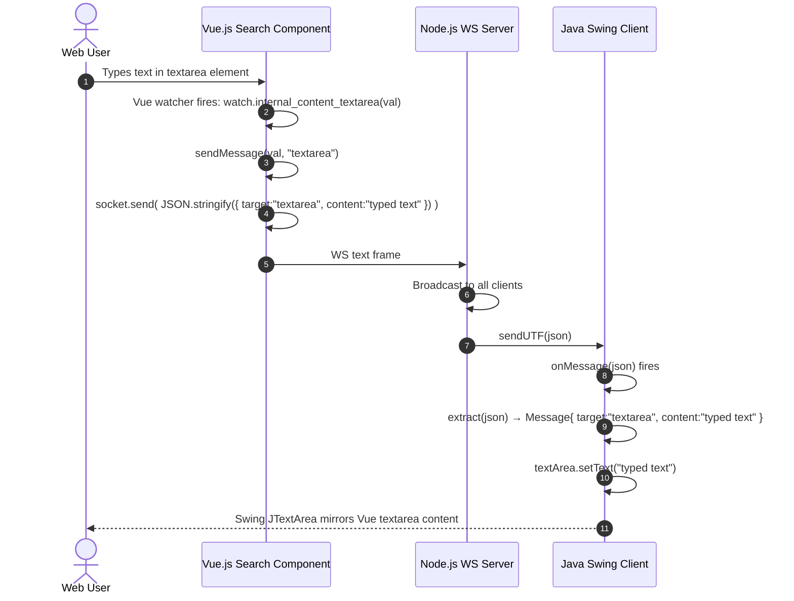

### 6.4 Scenario: Form Submission to Backend (MVP Swing Client)

```mermaid
sequenceDiagram
    autonumber
    actor SU as Swing User
    participant PV as PocView (Swing UI)
    participant PP as PocPresenter
    participant PM as PocModel
    participant HS as HttpBinService
    participant HB as HTTPBin :8080

    SU->>PV: Edit fields (firstName, name, dateOfBirth, etc.)
    PV->>PP: DocumentListener.insertUpdate / removeUpdate fires
    PP->>PM: ValueModel.setField(newContent) per ModelProperties

    SU->>PV: Click "Anordnen" button
    PV->>PP: ActionListener fires (button.addActionListener)
    PP->>PM: model.action()

    PM->>PM: Print all ModelProperties values to stdout
    PM->>PM: Build HashMap: { "FIRST_NAME":"Hans", "LAST_NAME":"Mayer", ... }
    PM->>HS: httpBinService.post(data)

    HS->>HS: Open HttpURLConnection to http://localhost:8080/post
    HS->>HS: JsonGenerator writes all key-value pairs as JSON object
    HS->>HB: HTTP POST /post Content-Type:application/json { "FIRST_NAME":"Hans", ... }
    HB-->>HS: HTTP 200 {"json":{"FIRST_NAME":"Hans",...},"origin":"...","url":"..."}
    HS-->>PM: responseBody String

    PM->>PM: eventEmitter.emit(responseBody)
    PP->>PV: view.textArea.setText(responseBody)
    PP->>PV: Clear firstName, name, dateOfBirth, zip, ort, street, iban, bic, validFrom
    PP->>PV: female.setSelected(true), male/diverse.setSelected(false)
    PV-->>SU: TextArea shows full HTTPBin JSON echo; all form fields reset
```

### 6.5 WebSocket Connection Lifecycle

```mermaid
stateDiagram-v2
    [*] --> Disconnected : Client initialises

    Disconnected --> Connecting : new WebSocket() or ContainerProvider.connectToServer()
    Connecting --> Connected : onOpen() fired
    Connecting --> Crashed : DeploymentException or connection refused → RuntimeException thrown

    Connected --> MessageReceived : onMessage() event
    MessageReceived --> Connected : JSON parsed and UI updated

    Connected --> MessageSent : sendMessage() / socket.send()
    MessageSent --> Connected : Frame dispatched asynchronously

    Connected --> Disconnected : onClose() fired
    Disconnected --> [*] : latch.countDown() releases main thread; JVM exits
```

---

## 7. Deployment View

### 7.1 Developer Workstation Deployment

All components run on a **single developer workstation** in separate processes. No containerisation is used for the application itself — only HTTPBin runs in Docker.

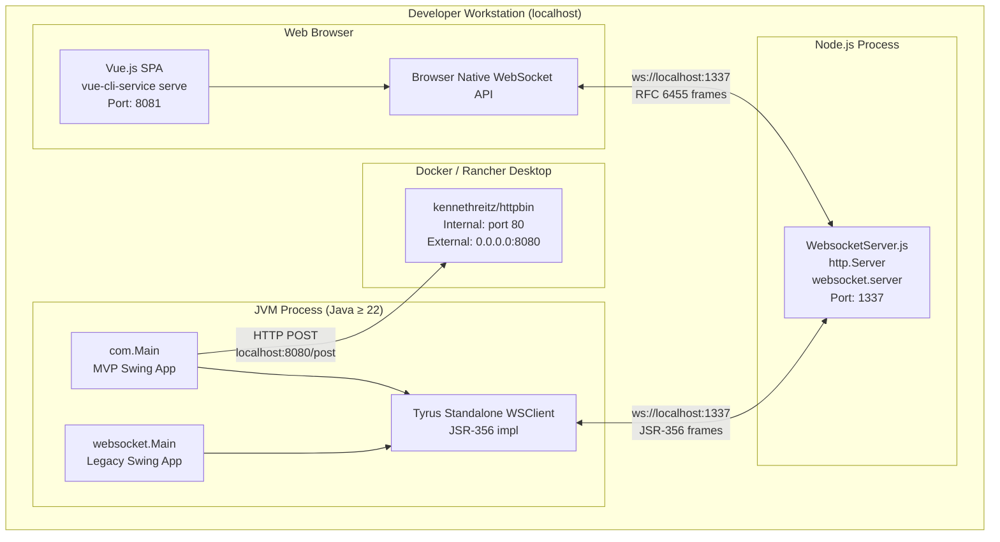

### 7.2 Mandatory Startup Sequence

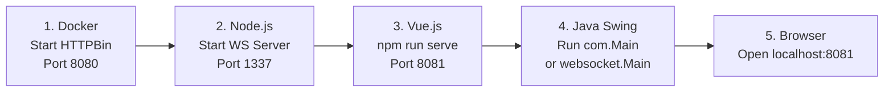

> **Why this order:** The Node.js WS server must be running before any client connects. HTTPBin must be running before the Swing client submits a form (step 6). If the server is unavailable when Swing starts, Tyrus throws `DeploymentException` wrapped in `RuntimeException` and the app crashes.

### 7.3 Startup Commands Reference

```bash
# 1. HTTPBin mock backend (Docker required)
docker run -p 8080:80 kennethreitz/httpbin

# 2. Node.js WebSocket relay
cd node-server/src
npm install          # install websocket package (first time only)
node WebsocketServer.js

# 3. Vue.js web client
cd node-vue-client
npm install          # first time only
npm run serve        # starts on http://localhost:8081

# 4. Java Swing client
# Set Java SDK >= 22 in IDE Project Structure
# Run: com.Main  (or websocket.Main for legacy version)
# Via Maven: mvn compile exec:java -Dexec.mainClass=com.Main
```

### 7.4 Build Artefacts

| Module | Build Tool | Command | Artefact |
|--------|-----------|---------|----------|
| `swing/` | Maven | `mvn package` | `target/websocket_swing-0.0.1-SNAPSHOT.jar` |
| `node-server/` | npm | `npm install` | `node_modules/` |
| `node-vue-client/` | Vue CLI | `npm run build` | `dist/` static assets |

---

## 8. Cross-cutting Concepts

### 8.1 JSON Message Protocol

All inter-process communication uses **plain JSON text over WebSocket frames**. No schema validation is applied at runtime in any component.

**Person transfer payload (Vue → Swing, target = "textfield"):**

```json
{
  "target": "textfield",
  "content": {
    "name": "Mayer",
    "first": "Hans",
    "dob": "1981-01-08",
    "zip": "95183",
    "ort": "Trogen",
    "street": "Isaaer Str.",
    "hausnr": "23",
    "knr": "79423984",
    "zahlungsempfaenger": {
      "iban": "DE27100777770209299700",
      "bic": "ERFBDE8E759",
      "valid_from": "2020-01-04",
      "valid_until": "",
      "type": ""
    }
  }
}
```

**Textarea sync payload (Vue → Swing, target = "textarea"):**

```json
{
  "target": "textarea",
  "content": "some text typed in the Vue textarea"
}
```

**HTTP POST payload (Swing → HTTPBin, from `ModelProperties` enum):**

```json
{
  "TEXT_AREA":     "...",
  "FIRST_NAME":    "Hans",
  "LAST_NAME":     "Mayer",
  "DATE_OF_BIRTH": "1981-01-08",
  "ZIP":           "95183",
  "ORT":           "Trogen",
  "STREET":        "Isaaer Str.",
  "IBAN":          "DE27100777770209299700",
  "BIC":           "ERFBDE8E759",
  "VALID_FROM":    "2020-01-04",
  "FEMALE":        "true",
  "MALE":          "false",
  "DIVERSE":       "false"
}
```

### 8.2 Observer / Event-Emitter Pattern

A custom lightweight observer pattern is used in the `com` package to decouple the asynchronous HTTP response from the presenter:

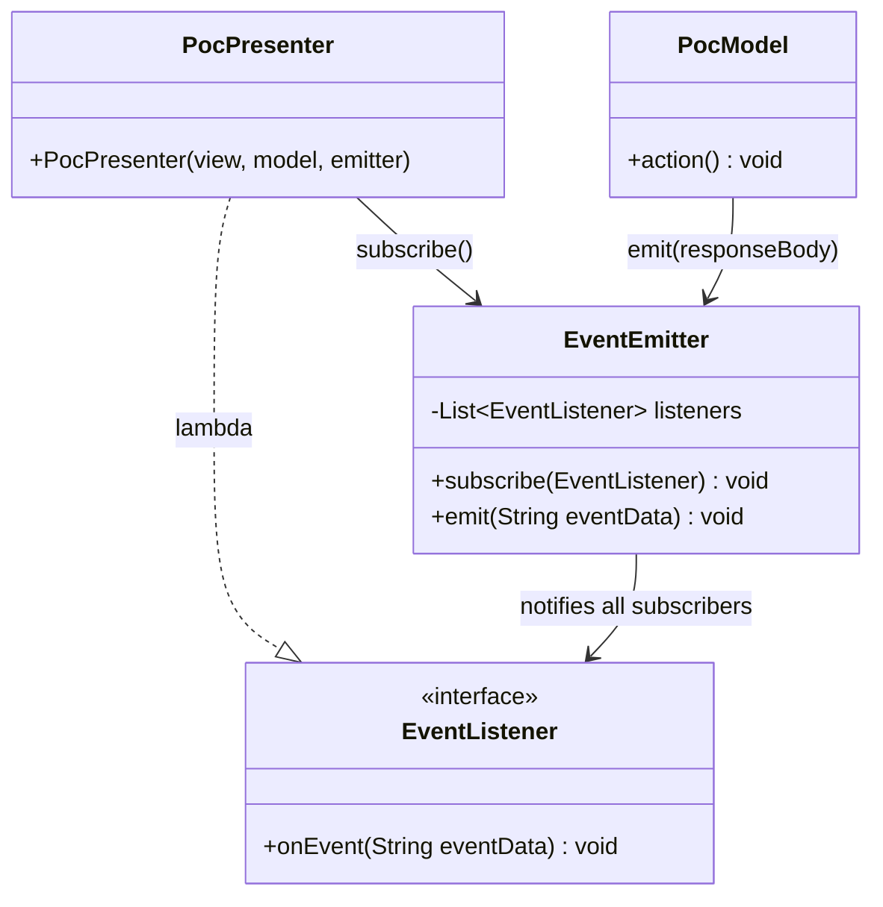

After `PocModel.action()` receives the HTTP response body, `EventEmitter.emit(responseBody)` is called. The `PocPresenter`'s lambda subscription reacts by updating the `PocView` — setting the text area and resetting all fields.

### 8.3 Model-View-Presenter (MVP) Binding

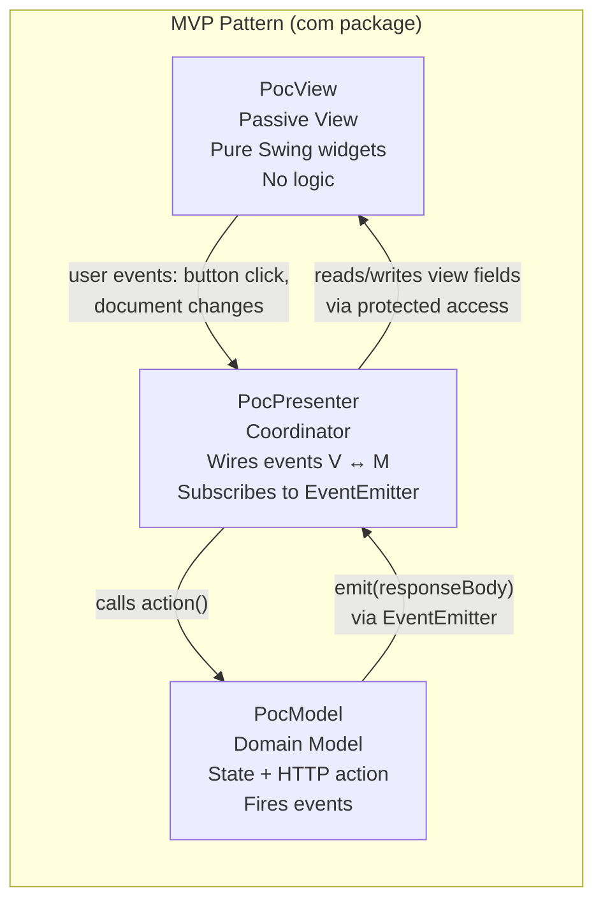

**Binding mechanism in `PocPresenter.bind(JTextComponent, ModelProperties)`:**

1. Initial sync: `model.setField(source.getText())` at construction time
2. `source.getDocument().addDocumentListener(...)` — fires `insertUpdate` and `removeUpdate` on every keystroke
3. Each callback reads `e.getDocument().getText(0, length)` and calls `model.setField(content)`

**Radio button binding in `PocPresenter.bind(JRadioButton, ModelProperties)`:**

1. `source.addChangeListener(evt -> model.setField(source.isSelected()))`

### 8.4 JSON Parsing Strategy

Two separate JSON parsing strategies are used in the Java modules:

| Location | Strategy | API Used |
|----------|----------|----------|
| `websocket/Main.java` — `extract()` | Flag-based streaming pull parser | `javax.json.stream.JsonParser` |
| `websocket/Main.java` — `toSearchResult()` | Flag-based streaming pull parser | `javax.json.stream.JsonParser` |
| `HttpBinService.java` | JSON generation (output only) | `javax.json.stream.JsonGenerator` |

The flag-based parser works by iterating events (`KEY_NAME`, `VALUE_STRING`) and toggling boolean flags (`boolean name = false`, `boolean first = false`, …). This is verbose but avoids additional dependencies.

### 8.5 Error Handling

| Location | Pattern | User Impact |
|----------|---------|-------------|
| `PocPresenter` button `ActionListener` | `IOException` / `InterruptedException` wrapped in `RuntimeException` | App crashes with stack trace |
| `WebsocketClientEndpoint` constructor | `DeploymentException` / `IOException` wrapped in `RuntimeException` | App crashes if server unavailable at startup |
| `PocModel.action()` | `eventEmitter.emit("Failed operation")` on empty response | Text area shows "Failed operation" string |
| Node.js server | No `on('error')` handlers | Process crashes on unhandled network error |
| Vue `connect()` | No `onerror` / `onclose` handlers | Silent failure; status stays "connected" |

### 8.6 Logging and Observability

All logging is **console-only** (stdout/stderr). No structured logging framework is used anywhere.

| Component | What is logged |
|-----------|---------------|
| Node.js Server | Timestamp + "listening on port 1337", connection origin, "Connection accepted.", received message JSON, peer disconnect + remote address |
| `websocket/Main.java` | "Connecting to ws://...", "opening websocket", "closing websocket" |
| `com/poc/PocPresenter.java` | All `DocumentListener` events with field content; event data received; radio button state changes |
| `com/poc/PocModel.java` | All `ModelProperties` values pre-submit |
| `com/poc/HttpBinService.java` | HTTP response code and full response body |

### 8.7 Concurrency Model

| Mechanism | Where Used | Notes |
|-----------|------------|-------|
| `CountDownLatch(1)` | Both `Main.java` entry points | Keeps JVM alive; `countDown()` called in `onClose()` |
| Swing EDT | All PocPresenter event callbacks | Button actions and `DocumentListener` events run on EDT |
| Tyrus worker thread | `WebsocketClientEndpoint.onMessage()` | Tyrus delivers callbacks on its own thread pool — **Swing components are updated without `SwingUtilities.invokeLater()`** — potential threading bug |
| Node.js event loop | All server operations | Single-threaded; non-blocking by design |
| Vue.js microtask queue | Watchers and computed | Vue 2 watchers fire synchronously after each `data` mutation |

---

## 9. Architecture Decisions

### ADR-001: WebSocket as the Integration Channel

| | |
|--|--|
| **Status** | Implemented |
| **Date** | Project inception |

**Context:**  
The PoC requires data to flow from a web browser into a running Java desktop application in real time. Traditional approaches (clipboard, shared file system, polling REST API) are either too slow, too fragile, require file system access from the browser, or require modification of Allegro's codebase.

**Decision:**  
Use WebSocket (RFC 6455) as a persistent, bidirectional TCP channel. A Node.js relay server bridges the two heterogeneous runtimes (browser JS engine and JVM).

**Consequences:**
- ✅ Sub-millisecond latency on localhost — real-time demo experience
- ✅ Both clients remain independent — neither references the other
- ✅ No Allegro file-based persistence modification needed
- ✅ Browser native WebSocket API requires no additional library in Vue
- ⚠️ Both clients must be connected before data flows (no message persistence)
- ⚠️ Node.js relay becomes a single point of failure
- ⚠️ No authentication or authorisation on the channel

---

### ADR-002: Node.js as the WebSocket Relay

| | |
|--|--|
| **Status** | Implemented |

**Context:**  
A relay that can accept connections from both a browser (native WebSocket API) and a JVM client (Tyrus JSR-356) is needed.

**Decision:**  
Use Node.js with the `websocket` npm package. The server's only logic: broadcast every received message to all connected clients.

**Consequences:**
- ✅ Under 70 lines of code; zero business logic in server
- ✅ Single npm dependency (`websocket` package)
- ✅ Fast startup; no compilation; no framework overhead
- ⚠️ Messages echoed back to sender — Vue receives its own sends (currently harmless: `onmessage` is commented out in `Search.vue`)
- ⚠️ No origin validation; no authentication

---

### ADR-003: MVP Pattern for the Refactored Swing Client

| | |
|--|--|
| **Status** | Implemented (`com` package); legacy monolith coexists (`websocket` package) |

**Context:**  
`websocket/Main.java` concentrated UI layout, WebSocket lifecycle, JSON parsing, and UI update logic into one 457-line static class. This is untestable and hard to extend.

**Decision:**  
Refactor to MVP with `PocView` (pure Swing layout), `PocModel` (state + HTTP), `PocPresenter` (event wiring), and a generic `ValueModel<T>` property container. An `EventEmitter`/`EventListener` observer pair handles async model-to-presenter notifications.

**Consequences:**
- ✅ Clear separation: view has zero logic; model has zero Swing imports
- ✅ `PocModel` and `HttpBinService` are testable without Swing
- ✅ `EventEmitter` is reusable and framework-agnostic
- ⚠️ More boilerplate than the monolith for a PoC
- ⚠️ Two parallel entry points confuse contributors; no clear deprecation signal on the monolith

---

### ADR-004: HTTPBin Docker Container as Mock REST Backend

| | |
|--|--|
| **Status** | Implemented |

**Context:**  
A real Allegro backend is unavailable during the PoC. A POST endpoint that echoes the submitted JSON is sufficient to prove the HTTP path works.

**Decision:**  
Use `kennethreitz/httpbin` via Docker on port 8080. The `api.yml` OpenAPI spec documents the intended production-style contract.

**Consequences:**
- ✅ Zero-code backend; instant availability
- ✅ Echoes the POST body, confirming payload construction correctness
- ✅ HTTPBin response also exercises the full event-emitter response cycle
- ⚠️ No persistence, no business validation — not representative of production
- ⚠️ Docker must be running before Swing client submits

---

### ADR-005: Hardcoded In-Memory Dataset in Vue.js

| | |
|--|--|
| **Status** | Implemented (pragmatic PoC choice) |

**Context:**  
No real Allegro search backend is available. A mock is needed that provides realistic-looking data for stakeholder demonstrations.

**Decision:**  
Embed 5 hardcoded person records (with realistic IBAN/BIC values and German cities) as a JavaScript array in `Search.vue`'s `data()` function.

**Consequences:**
- ✅ No backend dependency for search functionality
- ✅ Realistic German social-insurance data for demos
- ✅ Zero latency for search — all client-side
- ⚠️ Only 5 records; not representative of production scale or performance
- ⚠️ Data is visible in client-side JS bundle — unsuitable for sensitive data

---

### ADR-006: Vue.js 2 Without State Management Library

| | |
|--|--|
| **Status** | Implemented |

**Context:**  
The web client is a single screen with one significant component. No navigation and no shared state between components.

**Decision:**  
Use Vue 2 SFC with all state in `Search.vue`'s local `data()`. No Vuex, no Pinia, no Vue Router.

**Consequences:**
- ✅ Minimal dependency footprint
- ✅ All logic readable in one file
- ⚠️ Vue 2 reached end of life (December 2023); production use requires migration to Vue 3

---

## 10. Quality Requirements

### 10.1 Quality Tree

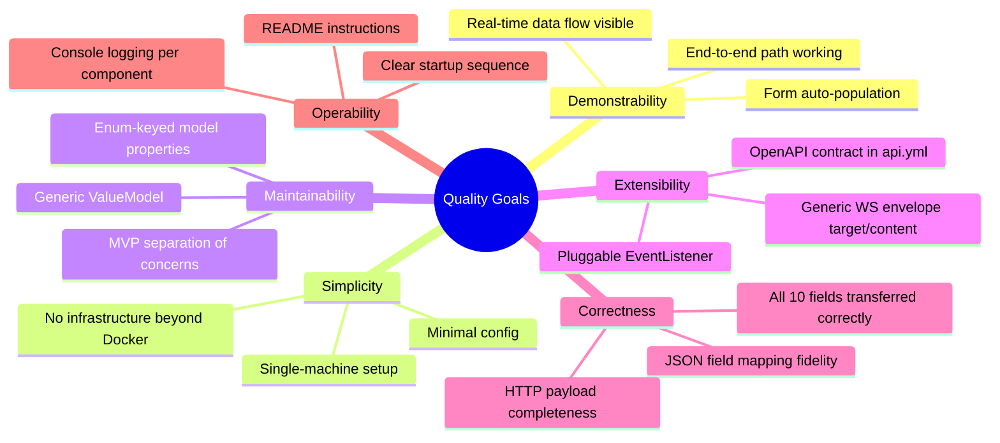

### 10.2 Quality Scenarios

| ID | Attribute | Scenario | Stimulus | Expected Response |
|----|-----------|----------|----------|-------------------|
| QS-1 | **Demonstrability** | Stakeholder live demo | User clicks "Nach ALLEGRO übernehmen" with a person selected | Swing form fields populate within 200ms |
| QS-2 | **Correctness** | Full person transfer | Person with 3 Zahlungsempfänger records; user selects second one | Exactly the selected IBAN/BIC transferred; other fields correct |
| QS-3 | **Correctness** | Textarea sync | User types 50 characters in Vue textarea quickly | All characters appear in Swing text area without loss |
| QS-4 | **Reliability** | Server restart | Node.js server crashes mid-session | Clients show disconnected; manual reconnect required |
| QS-5 | **Maintainability** | Add new form field | Developer adds a new field (e.g., nationality) | Changes required in 4 places: `ModelProperties`, `PocModel` init, `PocView`, `PocPresenter.initializeBindings()` |
| QS-6 | **Simplicity** | First-time developer setup | New developer follows README | System runnable in under 15 minutes on a machine with JDK 22 + Node.js + Docker |
| QS-7 | **Extensibility** | New message target | A new `target` type needs handling | Only `onMessage()` switch dispatch in Swing needs a new `case` |
| QS-8 | **Operability** | Debugging a transfer | Transfer appears to fail | Console logs in Node.js show whether message was received and broadcast |

---

## 11. Risks and Technical Debt

### 11.1 Technical Risks

| ID | Risk | Probability | Impact | Mitigation |
|----|------|-------------|--------|------------|
| R-1 | **No WebSocket auto-reconnect** — if Node.js crashes, both clients lose connection permanently until manually restarted | High | High | Add `socket.onclose` + exponential-backoff reconnect in Vue; add reconnect loop in Tyrus client |
| R-2 | **Swing EDT thread safety violation** — `onMessage()` in both Swing clients updates Swing components directly from the Tyrus callback thread, not the EDT | Medium | Medium | Wrap all Swing mutations in `SwingUtilities.invokeLater(Runnable)` |
| R-3 | **No origin validation on WS server** — `request.accept(null, request.origin)` accepts any origin unconditionally | Medium (local only) | Medium (production) | In production, validate origin against a whitelist; add token-based auth |
| R-4 | **Vue 2 EOL** — Vue 2 reached end of life December 2023; no further security patches | Low (PoC) | High (production) | Migrate to Vue 3 before any production use |
| R-5 | **RuntimeException crashes app** — `DeploymentException` in Swing constructor (server unavailable) causes immediate JVM crash with no user dialog | High (if server not started first) | Medium | Catch at startup; show `JOptionPane` error dialog; implement retry |
| R-6 | **Manual streaming JSON parser** — flag-based state machine in `websocket/Main.java` (`extract()`, `toSearchResult()`) is fragile and error-prone for nested or reordered JSON | Medium | Medium | Replace with `ObjectMapper` (Jackson) or `Gson` for robust deserialisation |

### 11.2 Technical Debt

| ID | Type | Description | Affected File(s) | Priority | Est. Effort |
|----|------|-------------|-----------------|----------|-------------|
| TD-001 | **Code Duplication** | Two parallel Swing client implementations exist (`websocket/Main.java` and `com/Main.java`). Both render the same form, same fields. Decision on canonical version has not been made. | `websocket/Main.java`, `com/Main.java` | 🔴 High | 2h to choose and delete |
| TD-002 | **No Tests** | Zero unit or integration tests across all three modules. `PocModel`, `HttpBinService`, `extract()`, `toSearchResult()`, and `searchPerson()` are all testable. | All modules | 🔴 High | 8–16h for basic coverage |
| TD-003 | **Hardcoded URLs and Ports** | `ws://localhost:1337/` hardcoded in 3 files; `http://localhost:8080` hardcoded in `HttpBinService.java` and `api.yml`; port `1337` in `WebsocketServer.js` | `WebsocketServer.js`, `Search.vue`, `websocket/Main.java`, `HttpBinService.java` | 🟡 Medium | 2h to externalise to env vars |
| TD-004 | **Static Fields in Monolith** | `websocket/Main.java` uses static fields for all Swing components — prevents multiple instances, not thread-safe | `websocket/Main.java` | 🟡 Medium | Resolved by adopting MVP; delete monolith |
| TD-005 | **No User Error Dialogs** | All `IOException` / `InterruptedException` in `PocPresenter` are re-thrown as `RuntimeException` with no user feedback | `PocPresenter.java` | 🟡 Medium | 1h to add `JOptionPane.showErrorDialog` |
| TD-006 | **Empty `ViewData` Class** | `ViewData.java` is an empty placeholder class — was never implemented | `ViewData.java` | 🟢 Low | 30min to implement or delete |
| TD-007 | **Echo to Sender** | Node.js broadcasts to ALL clients including the sender; Vue client receives its own messages (currently harmless: `socket.onmessage` is commented out) | `WebsocketServer.js`, `Search.vue` | 🟢 Low | 1h to exclude sender from broadcast |
| TD-008 | **Data Co-located with UI** | 5 hardcoded persons in `Search.vue`'s `data()` mixes UI component with data layer; inhibits real API integration | `Search.vue` | 🟢 Low | 2h to extract to separate mock data module |
| TD-009 | **Duplicate `panel.add(textArea)`** | Both `PocView.java` and `websocket/Main.java` call `panel.add(textArea)` twice — first call has no constraints; second has `GridBagConstraints`. First call is redundant and may cause layout issues. | `PocView.java`, `websocket/Main.java` | 🟢 Low | 15min to remove redundant call |
| TD-010 | **No CI Pipeline** | No GitHub Actions workflow, no lint gate, no build validation on push | All modules | 🟢 Low | 4h to add Maven + Node.js + ESLint CI |

### 11.3 Improvement Recommendations for Production Readiness

1. **Consolidate the Swing client**: Remove `websocket/Main.java` and retain only the MVP version (`com/Main.java`) as the single entry point.
2. **Add WebSocket auto-reconnect**: Both Vue.js and Swing clients should implement exponential-backoff reconnection with visual feedback.
3. **Wrap Swing updates in `SwingUtilities.invokeLater()`**: All WebSocket `onMessage` handlers must dispatch to the EDT.
4. **Replace manual JSON parsing**: Adopt `Jackson` or `Gson` in the Java clients for robust, maintainable JSON processing.
5. **Externalise all configuration**: Move ports, URLs, and hostnames to environment variables or a properties file.
6. **Replace HTTPBin mock with a real service stub**: Implement a proper REST stub (e.g., WireMock) that models the real Allegro API contract.
7. **Migrate to Vue 3**: Vue 2 is end-of-life; production use requires Vue 3 + Composition API.
8. **Secure the channel**: Add WSS (TLS), origin validation, and token-based authentication before any non-localhost deployment.

---

## 12. Glossary

### 12.1 Domain Terms (German / Allegro Domain)

| Term | Definition |
|------|------------|
| **Allegro** | Legacy German social-insurance and benefits administration desktop system; the target of this modernisation PoC |
| **Anordnen** | "To order/arrange" — the action button in the Swing form that submits collected data to the backend |
| **Betriebsbez.** | Betriebsbezeichnung — Company/establishment name |
| **BG-Nummer** | Berufsgenossenschaftsnummer — Employers' liability insurance association number |
| **BIC** | Bank Identifier Code — international bank routing code |
| **Geburtsdatum** | Date of birth |
| **Geschlecht** | Gender. Values: Weiblich (female), Männlich (male), Divers (diverse/non-binary) |
| **Gültig ab** | "Valid from" — effective start date of a payment account |
| **Hausnummer** | House number / street number |
| **IBAN** | International Bank Account Number |
| **knr / Kundennummer** | Customer number — unique person identifier in the system |
| **Leistung** | "Benefit/service" — type of social insurance benefit |
| **Nach ALLEGRO übernehmen** | "Transfer to ALLEGRO" — button that sends selected person data via WebSocket to the Swing client |
| **Nationalität** | Nationality |
| **Ort** | City / town |
| **PLZ / ZIP** | Postleitzahl — postal code |
| **Postfach** | Post office box |
| **RT** | Likely "Rücktext" (return text) — label for the response display text area in Swing |
| **RV-Nummer** | Rentenversicherungsnummer — pension/social insurance number |
| **Strasse** | Street |
| **Träger-Nr.** | Trägernummer — carrier/provider number (social insurance institution) |
| **Vorname** | First name |
| **Vorsatzwort** | Name prefix (e.g., "von", "de") |
| **Zahlungsempfänger** | Payment recipient / beneficiary — holds IBAN/BIC payment account data |

### 12.2 Technical Terms

| Term | Definition |
|------|------------|
| **ADR** | Architecture Decision Record — a document capturing a significant architectural choice, its context, and consequences |
| **Broadcast** | Sending a message to all connected clients simultaneously without discrimination |
| **CountDownLatch** | Java concurrency class; `await()` blocks the calling thread until `countDown()` is called the required number of times |
| **DocumentListener** | Swing interface for observing text component changes: `insertUpdate`, `removeUpdate`, `changedUpdate` |
| **EDT** | Event Dispatch Thread — Swing's dedicated single thread for UI rendering and event processing |
| **EnumMap** | Java `Map` optimised for enum keys using an array internally; guarantees iteration order of the enum declaration |
| **EventEmitter** | Custom observer implementation in `com.poc.model`; manages subscriber list and dispatches events |
| **HTTPBin** | `kennethreitz/httpbin` — a Docker-based HTTP test service that echoes back received request data |
| **JSR-356** | Java Specification Request 356 — Java API for WebSocket; defines `@ClientEndpoint`, `@OnOpen`, `@OnMessage`, `@OnClose` |
| **MVP** | Model-View-Presenter — architectural pattern: View (passive UI), Model (state + logic), Presenter (coordination, event wiring) |
| **OpenAPI** | OpenAPI Specification (OAS) 3.0 — YAML/JSON standard for describing REST APIs; `api.yml` uses this format |
| **PoC** | Proof of Concept — a prototype demonstrating feasibility, not intended for production |
| **RFC 6455** | The WebSocket Protocol specification — defines framing, handshake, and connection lifecycle |
| **SFC** | Single-File Component — Vue.js format combining `<template>`, `<script>`, `<style>` in one `.vue` file |
| **Tyrus** | GlassFish Tyrus — the reference implementation of JSR-356 (Java WebSocket API), used standalone without an app server |
| **ValueModel\<T\>** | Generic typed field wrapper in `com.poc` — holds a single value of type `T` with getter/setter |
| **Vue CLI** | Vue.js toolchain (`@vue/cli-service`) — provides `serve`, `build`, `lint` commands for Vue 2/3 projects |
| **WebSocket** | Full-duplex communication protocol over a single TCP connection (RFC 6455); enables real-time server-push and client-send |
| **WS / WSS** | `ws://` — plain WebSocket; `wss://` — WebSocket over TLS (encrypted) |

---

## Appendix

### A. Complete File Inventory

| Path | Language | Role |
|------|----------|------|
| `swing/src/main/java/com/Main.java` | Java 22 | Entry point — MVP Swing application |
| `swing/src/main/java/com/poc/ValueModel.java` | Java | Generic typed property wrapper |
| `swing/src/main/java/com/poc/model/EventEmitter.java` | Java | Observable event bus implementation |
| `swing/src/main/java/com/poc/model/EventListener.java` | Java | Observer interface |
| `swing/src/main/java/com/poc/model/HttpBinService.java` | Java | HTTP client — POST to HTTPBin mock |
| `swing/src/main/java/com/poc/model/ModelProperties.java` | Java | Enum of 13 form field identifiers |
| `swing/src/main/java/com/poc/model/PocModel.java` | Java | Domain model — holds state, calls HTTP |
| `swing/src/main/java/com/poc/model/ViewData.java` | Java | Empty placeholder (unused) |
| `swing/src/main/java/com/poc/presentation/PocPresenter.java` | Java | MVP Presenter — event wiring and data binding |
| `swing/src/main/java/com/poc/presentation/PocView.java` | Java | MVP View — Swing UI layout |
| `swing/src/main/java/websocket/Main.java` | Java 22 | Legacy monolithic Swing client + inner WebSocket endpoint |
| `node-server/src/WebsocketServer.js` | JavaScript (Node.js) | WebSocket broadcast relay server |
| `node-server/package.json` | JSON | Node.js manifest — single dep: `websocket` |
| `node-server/doc/Readme.txt` | Text | Server startup instructions |
| `node-vue-client/src/main.js` | JavaScript | Vue.js application bootstrap |
| `node-vue-client/src/App.vue` | Vue 2 SFC | Root component — header shell + Search |
| `node-vue-client/src/components/Search.vue` | Vue 2 SFC | Search form, results tables, WS send logic |
| `node-vue-client/public/index.html` | HTML | SPA entry point |
| `node-vue-client/package.json` | JSON | Vue CLI + Vue 2 deps manifest |
| `node-vue-client/babel.config.js` | JavaScript | Babel preset config for Vue CLI |
| `node-vue-client/doc/Readme.txt` | Text | Vue CLI setup notes |
| `pom.xml` | XML | Maven build — Java 22, Tyrus 1.15, javax.json |
| `api.yml` | YAML | OpenAPI 3.0 spec for POST /post endpoint |
| `WebsocketSwingClient.launch` | XML | Eclipse launch config for `websocket.Main` |
| `websocket_swing.iml` | XML | IntelliJ IDEA module file |
| `README.md` | Markdown | Developer setup guide |
| `swing/src/main/java/com/README.md` | Markdown | Docker prerequisite reminder |

### B. Module Dependency Map

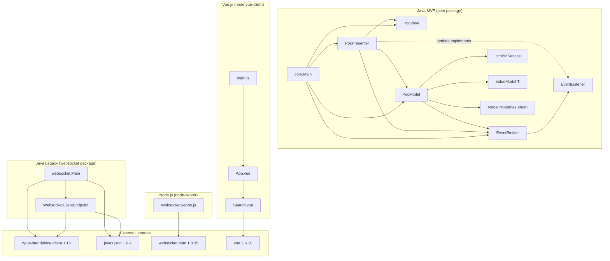

### C. OpenAPI to ModelProperties Mapping

The `api.yml` `PostObject` schema fields correspond 1-to-1 with the `ModelProperties` enum:

| OpenAPI field | `ModelProperties` | Java type in `ValueModel` |
|---------------|-------------------|--------------------------|
| `FIRST_NAME` | `FIRST_NAME` | `String` |
| `LAST_NAME` | `LAST_NAME` | `String` |
| `DATE_OF_BIRTH` | `DATE_OF_BIRTH` | `String` |
| `STREET` | `STREET` | `String` |
| `BIC` | `BIC` | `String` |
| `ORT` | `ORT` | `String` |
| `ZIP` | `ZIP` | `String` |
| `FEMALE` | `FEMALE` | `Boolean` → `Boolean.toString()` in HTTP payload |
| `MALE` | `MALE` | `Boolean` → `Boolean.toString()` |
| `DIVERSE` | `DIVERSE` | `Boolean` → `Boolean.toString()` |
| `IBAN` | `IBAN` | `String` |
| `VALID_FROM` | `VALID_FROM` | `String` |
| `TEXT_AREA` | `TEXT_AREA` | `String` |

> **Note:** The `api.yml` also defines `PostResponseObject` mirroring the HTTPBin echo structure: `args`, `data`, `files`, `form`, `headers`, `json`, `origin`, `url`.

### D. Analysis Metadata

| Field | Value |
|-------|-------|
| **Analysis Date** | 2025-07-04 |
| **Repository** | `websocket_swing` (Allegro Modernization PoC) |
| **Source files analysed** | 27 files (Java, JavaScript, Vue SFC, YAML, XML, Markdown, text) |
| **Modules covered** | `swing` (MVP + legacy), `node-server`, `node-vue-client`, root config |
| **Arc42 sections** | 12 / 12 completed |
| **Mermaid diagrams** | 16 |
| **Architecture patterns identified** | WebSocket broadcast hub, MVP (Model-View-Presenter), Observer/EventEmitter, Discriminated-union message envelope |

---

*This document was generated from a complete manual source-code analysis of all 27 files in the `websocket_swing` repository. All architectural insights are derived directly from observed source code — no speculative content is included.*
