# Allegro Modernization PoC — Arc42 Architecture Documentation

**Version:** 1.0  
**Date:** 2025-01-30  
**Status:** Generated from source-code analysis  
**Project Codename:** Allegro WebSocket PoC  

---

## Table of Contents

1. [Introduction and Goals](#1-introduction-and-goals)
2. [Constraints](#2-constraints)
3. [Context and Scope](#3-context-and-scope)
4. [Solution Strategy](#4-solution-strategy)
5. [Building Block View](#5-building-block-view)
6. [Runtime View](#6-runtime-view)
7. [Deployment View](#7-deployment-view)
8. [Concepts](#8-concepts)
9. [Architecture Decisions](#9-architecture-decisions)
10. [Quality Requirements](#10-quality-requirements)
11. [Risks and Technical Debt](#11-risks-and-technical-debt)
12. [Glossary](#12-glossary)

---

## 1. Introduction and Goals

### 1.1 Requirements Overview

This system is a **Proof-of-Concept (PoC)** for modernizing the legacy **Allegro** desktop application — a German social-insurance / benefits-administration system — by providing a modern browser-based front-end that communicates with the existing Java Swing desktop client in real time over WebSocket.

The central challenge being solved is:  
> *"How can a modern web UI feed data into an existing, non-HTTP-capable desktop application without rewriting the full back-end?"*

The answer demonstrated here is a lightweight WebSocket relay pattern: a Node.js message broker sits between the new Vue.js web client and the legacy Swing client, enabling bidirectional, real-time data transfer with minimal changes to the desktop application.

#### Key Capabilities

| # | Capability | Description |
|---|------------|-------------|
| C-1 | Person Search | The web client allows case-workers to search a customer/person register by name, first name, date of birth, postal code, city, or street address |
| C-2 | Payment Recipient Selection | Once a person is found, one of their *Zahlungsempfänger* (payment recipients, identified by IBAN/BIC) can be selected |
| C-3 | Data Transfer to Allegro | The selected person record and payment data are pushed in real time to the legacy Allegro Swing application via WebSocket, auto-filling its form fields |
| C-4 | Allegro Form Submission | The Swing application collects personal and payment data and submits it as a structured HTTP POST to a back-end API |
| C-5 | Free-Text Relay | A textarea in the web client can relay arbitrary text content to the Swing application's rich-text area in real time |
| C-6 | WebSocket Broadcasting | The Node.js server broadcasts any incoming message to all connected clients, enabling multi-client scenarios |

### 1.2 Quality Goals

| Priority | Quality Goal | Motivation |
|----------|--------------|------------|
| 1 | **Interoperability** | The web and desktop clients must communicate seamlessly without direct coupling |
| 2 | **Maintainability** | The PoC must demonstrate clean architectural patterns (MVP, event-driven) so a production system can be built on the same principles |
| 3 | **Usability** | The Vue.js search UI must allow quick, multi-criteria person lookup with a results table and a secondary banking-details table |
| 4 | **Reliability** | The WebSocket connection must handle open/close lifecycle events gracefully so clients reconnect or signal loss of connection |
| 5 | **Extensibility** | The architecture must allow new message types and new target fields to be added without architectural changes |

### 1.3 Stakeholders

| Role | Interest / Expectation |
|------|------------------------|
| **Case Worker (End User)** | Fast person lookup; one-click transfer of data to Allegro; no manual re-keying |
| **Desktop Developer (Java)** | Clean MVP structure in Swing; well-defined data model; WebSocket callback handling |
| **Front-End Developer** | Clear Vue.js component structure; WebSocket integration; searchable mock data |
| **Solution Architect** | Demonstrates feasibility of web-to-desktop bridging; clear documentation; pattern reuse |
| **Operations / DevOps** | Simple startup procedure (Docker for back-end, Node for relay, Vue CLI for front-end) |

---

## 2. Constraints

### 2.1 Technical Constraints

| Constraint | Detail |
|------------|--------|
| **Java version** | JDK ≥ 22.0.1 (uses unnamed-variable pattern `var _ = …` from JDK 22) |
| **Java WebSocket stack** | GlassFish Tyrus standalone client v1.15 + `javax.websocket` API; ties the project to the Jakarta EE 8 / `javax.*` namespace |
| **JavaScript runtime** | Node.js (version not pinned; driven by npm ecosystem) |
| **Front-end framework** | Vue.js 2.6.x (Vue 2, not Vue 3); Vue CLI v4 toolchain |
| **WebSocket protocol** | Plain `ws://` (no TLS); all traffic is unencrypted on localhost |
| **API mock** | `httpbin` Docker image (`kennethreitz/httpbin`) on port 8080; the real Allegro back-end is not in scope for this PoC |
| **Build tool (Java)** | Apache Maven; compiler source/target Java 22 |
| **Build tool (Vue)** | Vue CLI service (`vue-cli-service`); Yarn or npm |
| **Message format** | JSON over WebSocket; hand-rolled parsing in the Swing client using `javax.json` streaming parser |
| **Data storage** | No persistence; all customer data is hard-coded in-memory mock data in the Vue component |

### 2.2 Organizational Constraints

| Constraint | Detail |
|------------|--------|
| **PoC scope** | This is explicitly a proof-of-concept; production hardening (auth, TLS, real DB) is intentionally out of scope |
| **No automated tests** | No test framework is configured in any of the three sub-projects |
| **IDE dependency** | README requires IntelliJ IDEA for the Java project; no Maven wrapper is provided |
| **Localhost-only** | All services bind to `localhost`; cross-host deployment requires additional network configuration |
| **Domain language** | UI labels and field names are in German, reflecting the target user base (German social insurance administration) |

### 2.3 Conventions

| Convention | Description |
|------------|-------------|
| **JSON message envelope** | Every WebSocket message uses `{ "target": "<target>", "content": <payload> }` |
| **Target routing** | `"textarea"` routes content to the Swing text area; `"textfield"` routes a full person object to individual text fields |
| **German field naming** | Domain fields use German abbreviations (`ort`, `hausnr`, `ze_iban`, `ze_bic`) consistent with the Allegro domain model |
| **MVP pattern** | The Swing PoC follows Model-View-Presenter with `PocModel`, `PocView`, and `PocPresenter` as distinct classes |
| **Event-driven model updates** | `EventEmitter` / `EventListener` interfaces decouple the model layer from the presentation layer |

---

## 3. Context and Scope

### 3.1 Business Context

The PoC sits between **case workers** using a modern browser and the **legacy Allegro desktop application** already running on their workstation. The system does not replace Allegro; it augments it by allowing data to be entered and searched in a modern web UI and then injected into Allegro's form fields in real time.

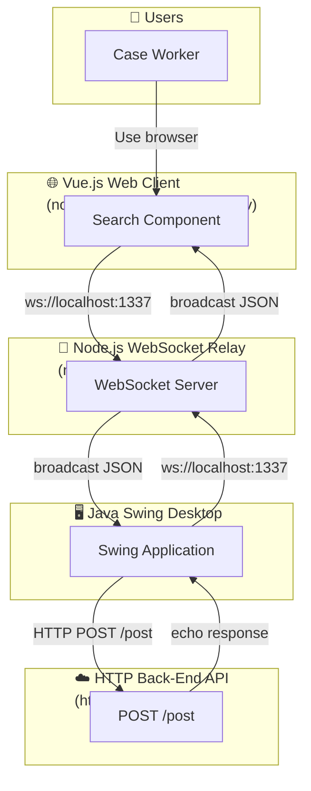

**External Interfaces:**

| Partner | Protocol | Direction | Description |
|---------|----------|-----------|-------------|
| Case Worker | HTTP / Browser | → Web Client | User interacts with the Vue.js search UI |
| Node.js WebSocket Server | WebSocket (`ws://`) | ↔ Vue Client | Sends person/payment data; receives broadcasts |
| Node.js WebSocket Server | WebSocket (`ws://`) | ↔ Swing Client | Receives person/payment data; could send confirmations |
| httpbin Docker container | HTTP POST (`application/json`) | → Swing Client | Receives submitted form data; echoes it back |

### 3.2 Technical Context

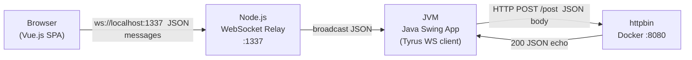

All three runtime processes (`node WebsocketServer.js`, `vue-cli-service serve`, `java Main`) run on the **same developer workstation**. The httpbin back-end runs in a Docker container accessible on the loopback interface.

---

## 4. Solution Strategy

### 4.1 Key Technology Decisions

| Decision | Choice | Rationale |
|----------|--------|-----------|
| **Desktop client language** | Java / Swing | The existing Allegro application is Java Swing; no migration of the back-end is in scope for this PoC |
| **WebSocket relay** | Node.js + `websocket` npm package | Lightweight, trivial to start, supports broadcast semantics natively |
| **New web front-end** | Vue.js 2 | Approachable SPA framework; clear component model; no heavy dependency chain |
| **Message broker style** | Stateless broadcast relay | Simplest possible message passing; no message persistence, no routing logic |
| **Desktop WS client library** | Tyrus standalone (`tyrus-standalone-client`) | Standard JSR-356 implementation, runnable without a full application server |
| **Desktop JSON parsing** | `javax.json` streaming API | Avoids a third-party binding library; keeps the PoC dependency-light |
| **Back-end mock** | httpbin Docker container | Zero custom back-end code; standard HTTP echo service sufficient for PoC |
| **MVP pattern in Swing** | `PocModel` / `PocView` / `PocPresenter` | Separates GUI construction, data, and interaction logic; improves testability |
| **Event bus in Swing** | Custom `EventEmitter` / `EventListener` | Decouples model layer from presenter; enables multiple subscribers |

### 4.2 Architectural Approach

The system is composed of **three independent processes** communicating via standard protocols:

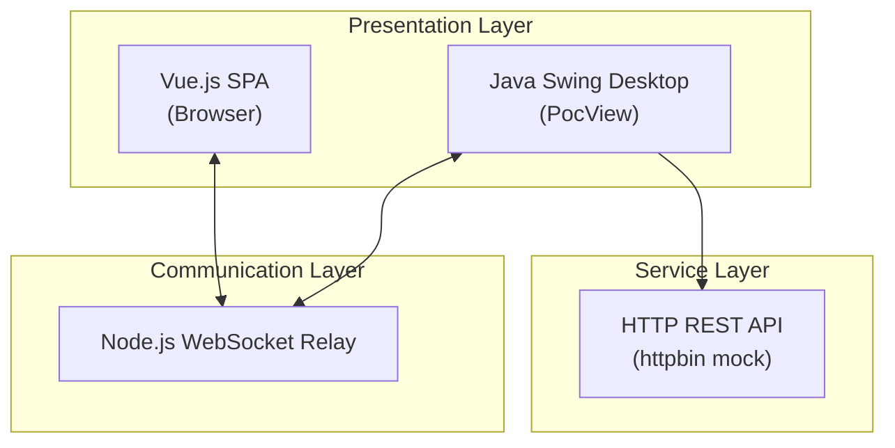

The **Vue client** and the **Swing client** are peers connected through a central message relay. Neither knows about the other directly — all coupling is mediated by the JSON message format and the `target` routing field.

### 4.3 Quality Approach

| Quality Goal | Approach |
|--------------|----------|
| **Interoperability** | JSON-over-WebSocket protocol with a well-defined message envelope; any future client can join the relay by implementing the same JSON contract |
| **Maintainability** | MVP pattern in Swing separates view, logic, and state; `EventEmitter` allows new listeners without modifying existing code |
| **Usability** | Vue component uses client-side search with multiple search criteria; results table and payment-recipient table both have click-to-select interaction |
| **Reliability** | Swing client uses `CountDownLatch` to prevent JVM shutdown before WebSocket session ends; Vue client establishes the WebSocket in `mounted()` lifecycle hook |
| **Extensibility** | New `target` values in the JSON message can trigger new UI updates in the Swing client's `onMessage` handler; new Vue components can send new message types |

---

## 5. Building Block View

### 5.1 Level 1 — System Overview

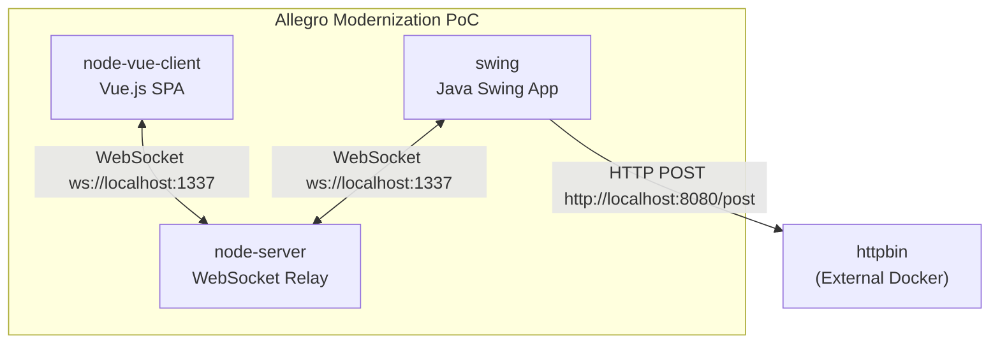

### 5.2 Level 2 — Container View

#### 5.2.1 node-server (WebSocket Relay)

| Element | Technology | Responsibility |
|---------|------------|----------------|
| `WebsocketServer.js` | Node.js, `websocket` npm | Manages client list; broadcasts every UTF-8 message to all connected clients |
| HTTP base server | Node.js built-in `http` | Provides the HTTP upgrade endpoint required by the WebSocket handshake |

#### 5.2.2 node-vue-client (Vue.js SPA)

| Element | Technology | Responsibility |
|---------|------------|----------------|
| `main.js` | Vue.js 2 bootstrap | Mounts the root Vue instance into `#app` |
| `App.vue` | Vue.js SFA | Root component; renders the branded header and hosts `<Search>` |
| `Search.vue` | Vue.js SFA | All business logic: search form, results tables, WebSocket management, message send |

#### 5.2.3 swing (Java Swing MVP Application)

| Element | Package | Responsibility |
|---------|---------|----------------|
| `Main.java` (`com`) | `com` | Entry point; wires `PocView`, `PocModel`, `PocPresenter`, `EventEmitter` |
| `PocView` | `com.poc.presentation` | Constructs all Swing widgets; exposes them as `protected` fields |
| `PocPresenter` | `com.poc.presentation` | Binds view widgets to model properties; handles button action; receives events |
| `PocModel` | `com.poc.model` | Holds `ValueModel` map keyed by `ModelProperties`; calls `HttpBinService.post()` |
| `HttpBinService` | `com.poc.model` | Makes HTTP POST to the back-end API; emits response via `EventEmitter` |
| `EventEmitter` | `com.poc.model` | Maintains subscriber list; distributes event strings |
| `EventListener` | `com.poc.model` | Interface for event callbacks |
| `ValueModel<T>` | `com.poc` | Generic mutable value container |
| `ModelProperties` | `com.poc.model` | Enum of all bindable field names |

> **Note:** A second, older Swing entry point exists at `swing/src/main/java/websocket/Main.java`. This variant contains its own WebSocket client endpoint (`WebsocketClientEndpoint`) with `onMessage` routing to the Swing text fields. It represents an earlier iteration of the PoC before the MVP refactoring.

### 5.3 Level 3 — Component Detail

#### 5.3.1 Search.vue — Vue.js Search Component

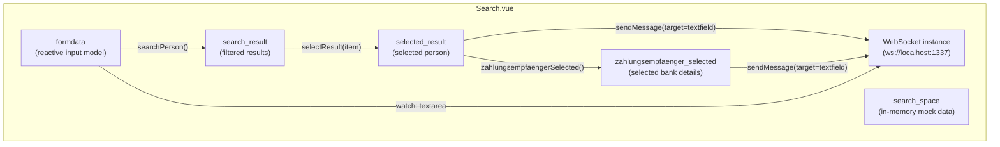

**Person data model (in-memory mock):**

| Field | Type | Description |
|-------|------|-------------|
| `first` | String | First name (Vorname) |
| `name` | String | Last name (Nachname) |
| `dob` | String | Date of birth (Geburtsdatum, ISO-8601) |
| `zip` | String | Postal code (PLZ) |
| `ort` | String | City |
| `street` | String | Street name |
| `hausnr` | String | House number |
| `knr` | String | Customer number (Kundennummer) |
| `zahlungsempfaenger` | Array | List of payment-recipient records |

Each `zahlungsempfaenger` entry:

| Field | Type | Description |
|-------|------|-------------|
| `iban` | String | IBAN |
| `bic` | String | BIC |
| `valid_from` | String | Valid-from date |
| `valid_until` | String | Valid-until date |
| `type` | String | Record type |

#### 5.3.2 PocModel — Java Domain Model

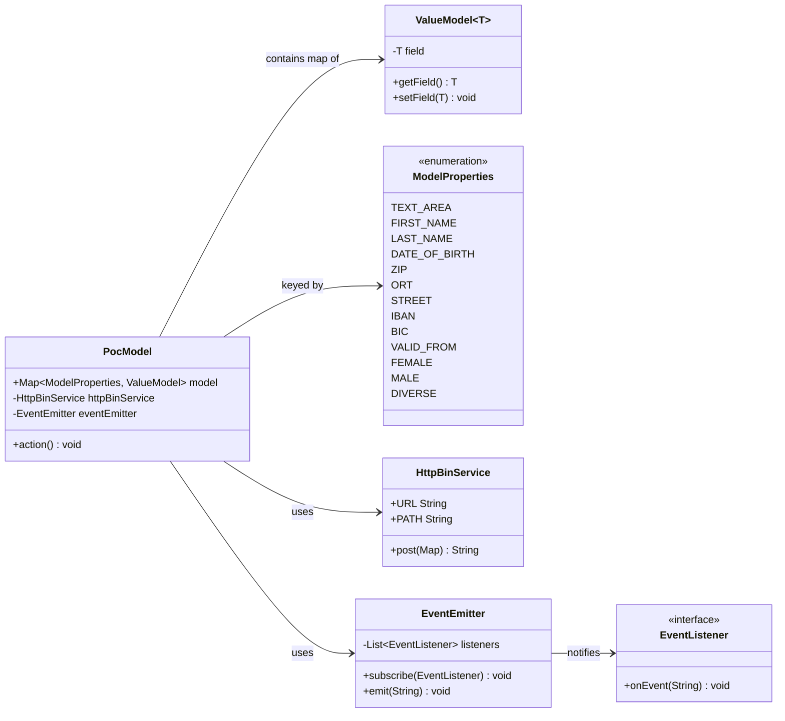

#### 5.3.3 PocPresenter — MVP Wiring

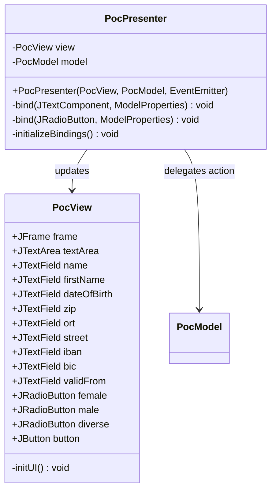

#### 5.3.4 WebSocket Client Endpoint (Legacy Swing)

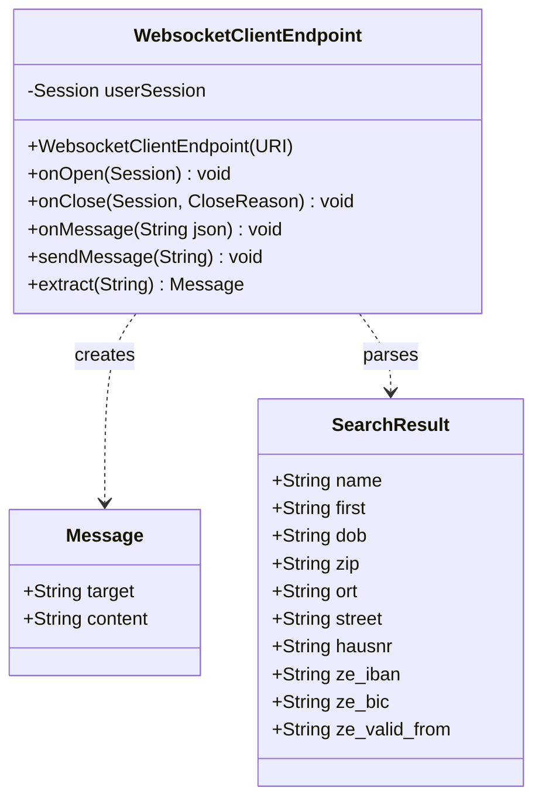

---

## 6. Runtime View

### 6.1 Scenario 1 — Startup Sequence

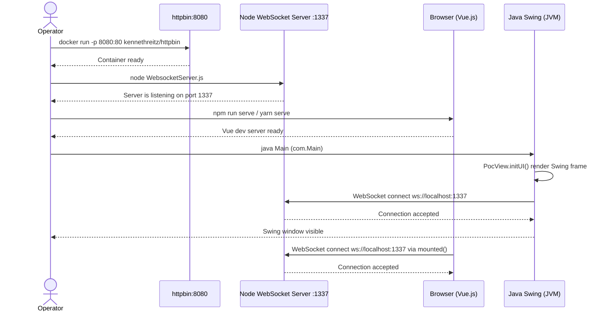

### 6.2 Scenario 2 — Person Search and Data Transfer to Allegro

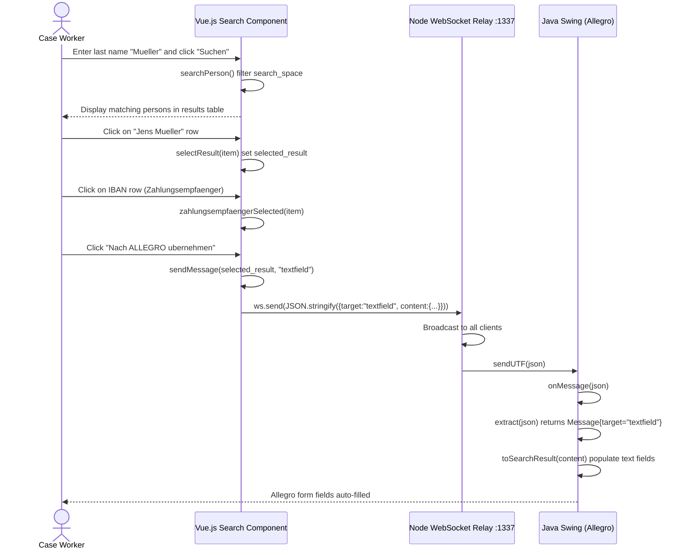

### 6.3 Scenario 3 — Textarea Live Sync

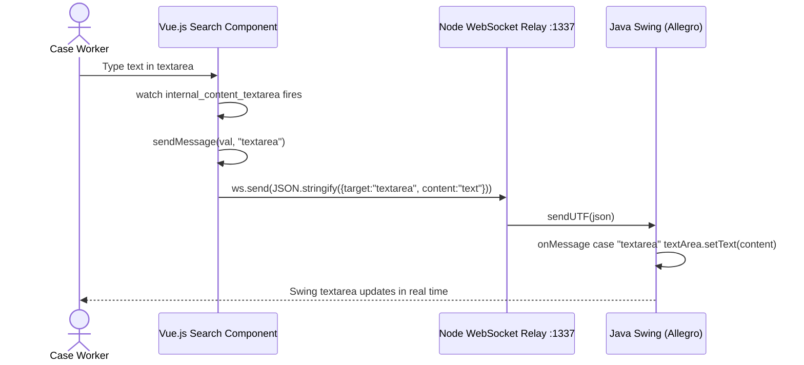

### 6.4 Scenario 4 — Allegro Form Submission (HTTP POST)

```mermaid
sequenceDiagram
    actor CW as Case Worker
    participant Swing as Java Swing (PocView)
    participant Presenter as PocPresenter
    participant Model as PocModel
    participant HttpSvc as HttpBinService
    participant API as httpbin :8080

    CW->>Swing: Click "Anordnen" button
    Swing->>Presenter: ActionListener fires
    Presenter->>Model: model.action()
    Model->>Model: Collect all ModelProperties values
    Model->>HttpSvc: post(data map)
    HttpSvc->>API: HTTP POST /post  application/json  {FIRST_NAME... }
    API-->>HttpSvc: 200 OK  JSON echo response
    HttpSvc-->>Model: responseBody string
    Model->>Model: eventEmitter.emit(responseBody)
    Model->>Presenter: EventListener.onEvent(responseBody)
    Presenter->>Swing: textArea.setText(responseBody) + clear all fields
    Swing-->>CW: Form cleared; API response shown in textArea
```

### 6.5 Scenario 5 — WebSocket Client Disconnect

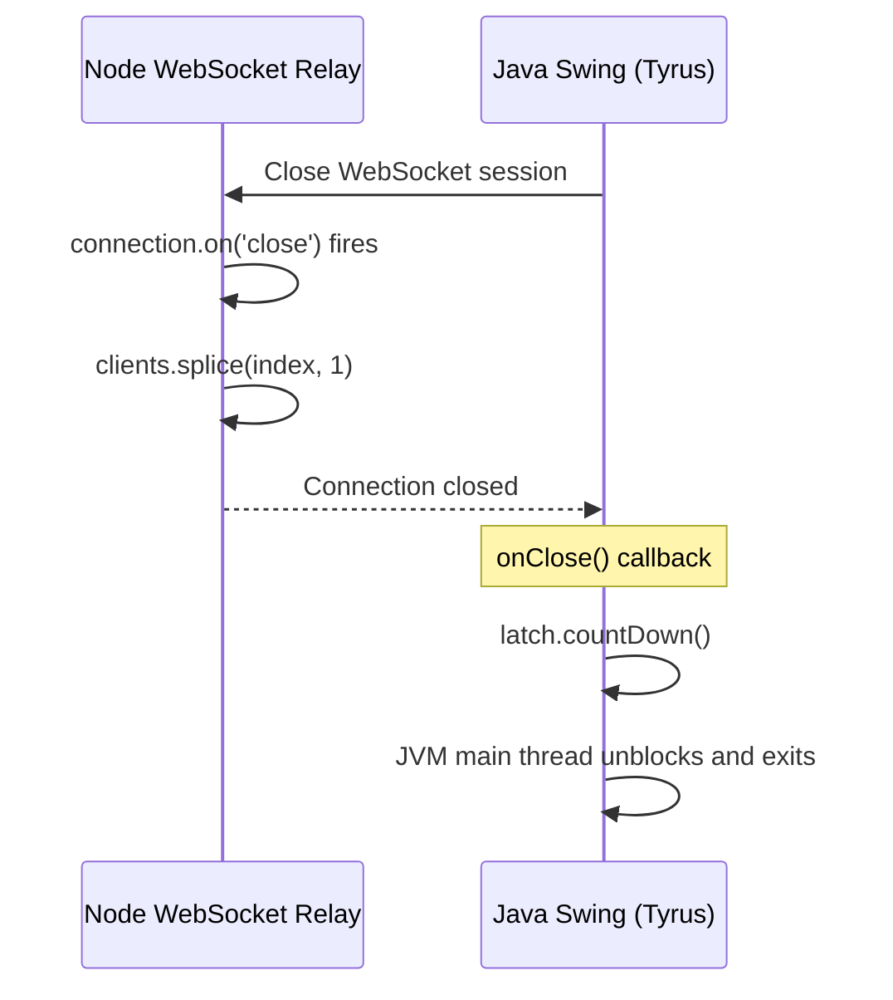

---

## 7. Deployment View

### 7.1 Development / PoC Deployment

All components run on a **single developer workstation**. There is no staging or production environment defined in this PoC.

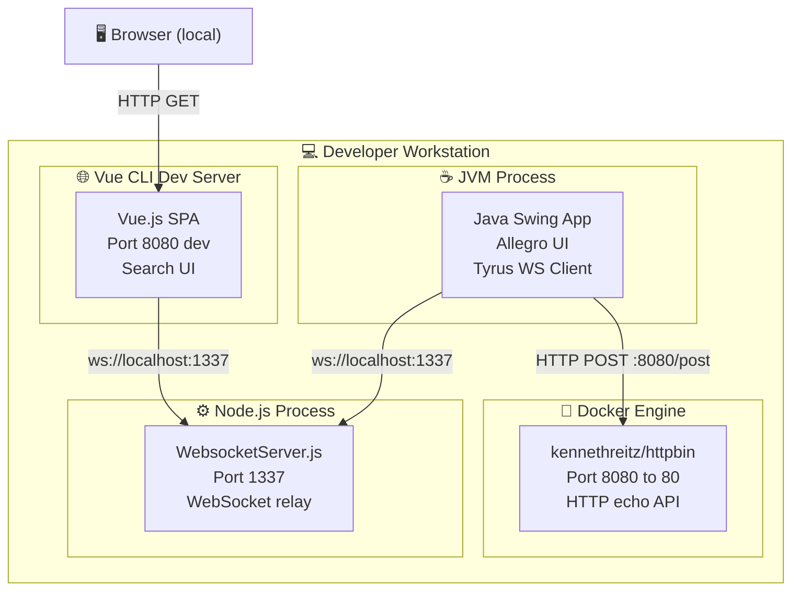

### 7.2 Component Startup Order

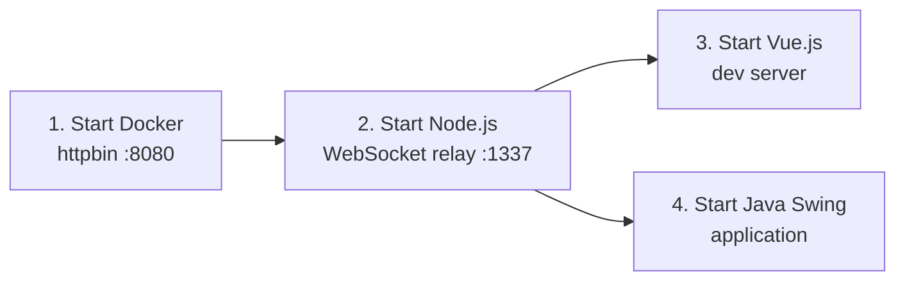

The Node.js relay **must** be started before either the Vue client or the Swing application, as both attempt a WebSocket connection at startup.

### 7.3 Port Allocation

| Port | Process | Protocol | Notes |
|------|---------|----------|-------|
| 1337 | Node.js WebSocket Relay | WebSocket (`ws://`) | Central message bus; must be available before clients start |
| 8080 | httpbin Docker container | HTTP | Target for `HttpBinService` |
| 8080 | Vue CLI dev server | HTTP | **Port conflict** with httpbin — needs `vue.config.js` override |

> ⚠️ **Port Conflict:** Both httpbin and the Vue CLI dev server default to port 8080 on the same host. The Vue dev server must be reconfigured to use a different port (e.g. 8081).

---

## 8. Concepts

### 8.1 Domain Model

The core domain is **person records with associated payment recipients** in a German social-insurance context.

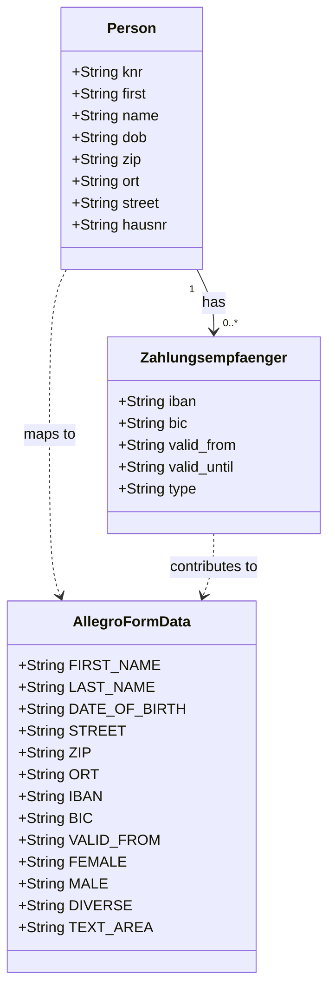

### 8.2 WebSocket Message Protocol

All messages exchanged on the WebSocket relay use the following JSON envelope:

```json
{
  "target": "<routing-key>",
  "content": "<payload>"
}
```

| `target` value | `content` type | Consumer | Description |
|----------------|----------------|----------|-------------|
| `"textfield"` | JSON object (Person + Zahlungsempfaenger) | Swing `onMessage` | Auto-fills named text fields in Allegro |
| `"textarea"` | Plain string | Swing `onMessage` | Sets the raw-text area content in Allegro |

**Example `textfield` message:**
```json
{
  "target": "textfield",
  "content": {
    "first": "Jens",
    "name": "Mueller",
    "dob": "1999-04-21",
    "zip": "14489",
    "ort": "Potsdam",
    "street": "August-Bebel-Str.",
    "hausnr": "79",
    "knr": "41125291",
    "zahlungsempfaenger": {
      "iban": "DE02200505501015871393",
      "bic": "HASPDEHH",
      "valid_from": "2020-08-15"
    }
  }
}
```

### 8.3 Model-View-Presenter (MVP) Pattern

The Swing PoC (`com.*` packages) implements the classic MVP pattern:

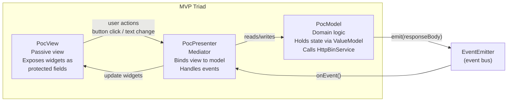

Key properties:
- **PocView** is a passive view — it only contains Swing widget construction; no business logic
- **PocPresenter** wires `DocumentListener` and `ChangeListener` onto every widget to propagate changes to the model
- **PocModel** has no reference to the view; it communicates results back through `EventEmitter`

### 8.4 Event-Driven Communication

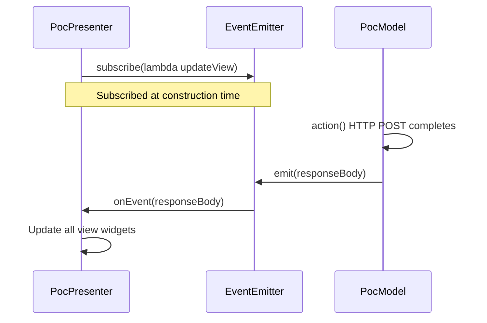

### 8.5 Data Binding (Swing)

`PocPresenter.bind()` uses Swing's `DocumentListener` to propagate every keypress into the corresponding `ValueModel` entry:

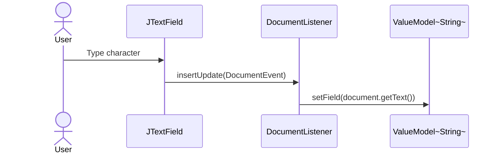

### 8.6 Error Handling

| Scenario | Current Handling | Risk |
|----------|-----------------|------|
| WebSocket connection failure (Swing, legacy) | `RuntimeException` wraps `DeploymentException` — app terminates | Hard crash |
| WebSocket connection failure (Vue) | Not handled; no reconnect logic | Silent failure |
| HTTP POST failure | Exception propagates → `RuntimeException` | Hard crash |
| Empty HTTP response | `eventEmitter.emit("Failed operation")` shown in text area | User-visible but recoverable |
| JSON parse error (Swing) | Not caught; streaming parser may silently produce empty fields | Silent data corruption |
| Port 8080 conflict | Not documented | Dev environment fails silently |

### 8.7 Logging and Monitoring

No structured logging framework is used. All observability is via `System.out.println()`:

| Location | Logged Events |
|----------|---------------|
| `WebsocketServer.js` | Connection origin, accepted, message received, disconnect |
| `websocket.Main` | "Connecting to …", "opening websocket", "closing websocket" |
| `PocPresenter.bind()` | "I am in insert update / remove update …" |
| `PocPresenter` (event handler) | "Event data is : …" |
| `PocModel.action()` | All model property values before POST |
| `HttpBinService.post()` | HTTP response code and response body |

### 8.8 Security Considerations

| Aspect | Current State | Risk Level |
|--------|---------------|------------|
| Transport encryption | None — `ws://` and `http://` | 🔴 High (for any non-localhost use) |
| Authentication | None | 🔴 High |
| Input validation | None | 🟡 Medium |
| CORS / Origin check | `request.accept(null, origin)` — accepts all origins | 🟡 Medium |
| Sensitive data in mock | Real-format IBAN/BIC in `Search.vue` source code | 🟢 Low (PoC only) |

---

## 9. Architecture Decisions

### ADR-001: WebSocket Relay as Integration Point

**Status:** Implemented  
**Context:** The legacy Allegro Swing application cannot expose a REST API or consume a message queue without significant rework. A lightweight integration bridge was needed.  
**Decision:** Use a lightweight Node.js WebSocket server as a message relay. Both clients connect as WebSocket peers; any message from one is broadcast to all others.  
**Consequences:**  
- ✅ No deep changes to the existing Swing application  
- ✅ Extremely simple relay implementation (< 70 lines of JavaScript)  
- ✅ Extensible to multiple simultaneous clients  
- ⚠️ No message routing beyond the `target` field; all clients receive all messages  
- ⚠️ No persistence; if the Swing client is disconnected, messages are lost  
- ⚠️ Single point of failure; no relay redundancy  

---

### ADR-002: MVP Pattern for Swing PoC

**Status:** Implemented (in `com.poc.*` packages)  
**Context:** The earlier prototype (`websocket.Main`) mixed UI construction, WebSocket handling, and JSON parsing in one class, making it hard to test and extend.  
**Decision:** Refactor the Swing application to follow MVP with three dedicated classes and a custom `EventEmitter`.  
**Consequences:**  
- ✅ View logic is isolated and independently testable  
- ✅ Model has no Swing dependency  
- ✅ `EventEmitter` decouples model from presenter  
- ⚠️ `PocView` exposes all widgets as `protected` fields — a `IView` interface would be cleaner  
- ⚠️ `PocModel.model` map is `public` — breaks encapsulation  

---

### ADR-003: In-Memory Mock Data in Vue Component

**Status:** Implemented  
**Context:** A real customer database back-end was out of scope for the PoC. Search functionality needed to be demonstrable without any API calls.  
**Decision:** Embed a static array of 5 test persons directly inside `Search.vue`'s `data()` function. Client-side filtering simulates database queries.  
**Consequences:**  
- ✅ Zero back-end dependencies for the search feature  
- ✅ Instant response; no network latency  
- ⚠️ Not scalable; must be replaced with an API call in production  
- ⚠️ Real-looking IBAN/BIC values embedded in source code  

---

### ADR-004: javax.json Streaming Parser for JSON in Swing

**Status:** Implemented (in `websocket.Main`)  
**Context:** The Swing client needed to parse JSON messages. Options included binding libraries (Jackson, Gson) or the `javax.json` API.  
**Decision:** Use the `javax.json` streaming parser to extract fields by key name, avoiding an additional dependency.  
**Consequences:**  
- ✅ No additional dependency  
- ⚠️ Verbose, flag-based state-machine parsing is error-prone  
- ⚠️ No schema validation; malformed messages silently produce empty fields  

---

### ADR-005: Two Parallel Swing Entry Points (Design Smell)

**Status:** Observed — requires resolution  
**Context:** The repository contains `websocket/Main.java` (legacy, monolithic, with WS receive) and `com/Main.java` (newer MVP version without WS receive). Both exist simultaneously.  
**Decision:** Neither has been formally deprecated.  
**Consequences:**  
- ⚠️ Feature split between two entry points creates confusion  
- ⚠️ MVP version lacks the WebSocket receive capability of the legacy version  
- **Recommendation:** Merge WebSocket client functionality into the MVP version; remove `websocket.Main`  

---

## 10. Quality Requirements

### 10.1 Quality Tree

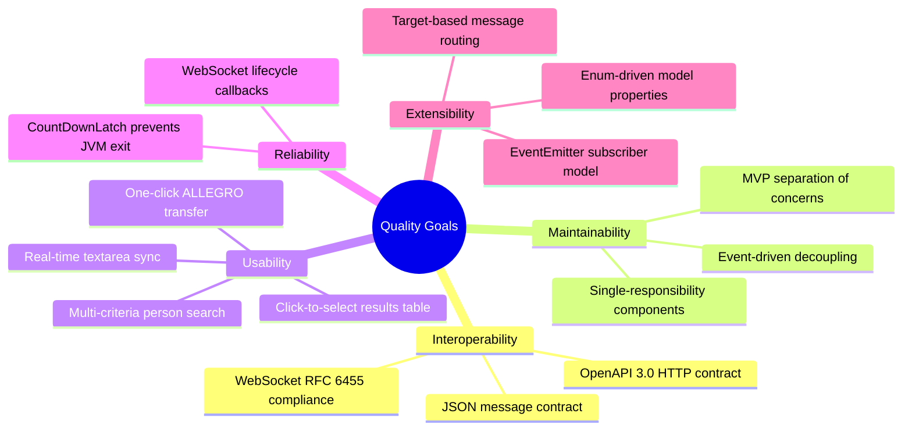

### 10.2 Quality Scenarios

| ID | Quality Attribute | Stimulus | Response | Measure |
|----|-------------------|----------|----------|---------|
| QS-1 | Interoperability | Case worker clicks "Nach ALLEGRO übernehmen" | Person data appears in all connected Swing clients | Round-trip < 1 s on localhost |
| QS-2 | Usability | Case worker types partial last name | Matching persons appear immediately | Client-side filter < 10 ms for ≤ 1 000 records |
| QS-3 | Maintainability | Developer adds a new Allegro form field | New `ModelProperties` value + `bind()` call + view widget | Code change confined to 3 classes |
| QS-4 | Reliability | WebSocket server restarts | Swing client calls `onClose()` and `latch.countDown()` | No JVM hang; orderly shutdown |
| QS-5 | Extensibility | New message target type needed | Add `case "newtarget":` in `onMessage()` | Single-file change |
| QS-6 | Correctness | "Anordnen" clicked with all fields filled | All 13 model properties posted; echo shown in text area | 100% field round-trip fidelity |

---

## 11. Risks and Technical Debt

### 11.1 Technical Risks

| ID | Risk | Probability | Impact | Mitigation |
|----|------|-------------|--------|------------|
| R-1 | **Port 8080 conflict** between httpbin Docker and Vue dev server | High | Medium | Re-map Vue dev server to port 8081 in `vue.config.js` |
| R-2 | **Unencrypted WebSocket** (`ws://`) exposes personal/financial data | High (for non-localhost) | High | Use `wss://` with TLS in any non-localhost environment |
| R-3 | **No authentication** on WebSocket relay | High | Medium | Add token-based auth or origin validation in production |
| R-4 | **Lost messages** if Swing client is disconnected | Medium | High | Add message queuing / acknowledgement in the relay |
| R-5 | **`websocket` npm package** (v1.0.35) is relatively unmaintained | Medium | Low | Consider migrating to the `ws` package |
| R-6 | **Java 22 unnamed-variable** (`var _ = …`) may not compile in earlier JDK | Low | Low | Pin JDK version in `.mvn/jvm.config` or Maven Wrapper |

### 11.2 Technical Debt

| ID | Type | Description | Priority | Estimated Effort |
|----|------|-------------|----------|------------------|
| TD-001 | Design Debt | `PocModel.model` is `public`; should be private with accessor methods | Medium | 1 h |
| TD-002 | Design Debt | `PocView` exposes all widgets as `protected` fields; should use `IView` interface | Medium | 2 h |
| TD-003 | Code Debt | Two parallel Swing entry points; MVP version lacks WebSocket receive | High | 4 h |
| TD-004 | Code Debt | Flag-based JSON parsing in `websocket.Main` is verbose and fragile | High | 2 h |
| TD-005 | Code Debt | No reconnect logic in Vue WebSocket client | High | 2 h |
| TD-006 | Code Debt | No graceful error handling in `HttpBinService.post()` | Medium | 1 h |
| TD-007 | Test Debt | No unit or integration tests in any sub-project | Critical | 16 h |
| TD-008 | Infra Debt | No `vue.config.js` to remap Vue dev port away from 8080 | High | 30 min |
| TD-009 | Architecture Debt | Mock data hard-coded in `Search.vue`; must be replaced by API call | High | 4 h |
| TD-010 | Security Debt | Plain `ws://` and `http://`; no TLS, auth, or input validation | Critical (production) | 8 h |
| TD-011 | Code Debt | `PocPresenter` re-throws checked exceptions as `RuntimeException` | Low | 1 h |
| TD-012 | Documentation Debt | No Javadoc or JSDoc on any class or method | Low | 4 h |

### 11.3 Improvement Roadmap

**Short-term (PoC stabilization):**
- Fix port conflict (TD-008)
- Merge Swing WebSocket reception into MVP entry point (TD-003)
- Add Vue WebSocket reconnect logic (TD-005)

**Medium-term (production readiness):**
- Replace hard-coded mock data with a REST API call (TD-009)
- Add `IView` interface to decouple `PocPresenter` from `PocView` (TD-002)
- Introduce Jackson/Gson in the Swing client (TD-004)
- Add unit tests for all layers (TD-007)

**Long-term (production hardening):**
- TLS on all connections (`wss://`, `https://`) (TD-010)
- Authentication and authorization layer
- Message queuing and delivery confirmation in relay
- Replace httpbin mock with a real Allegro back-end API

---

## 12. Glossary

### 12.1 Domain Terms

| Term | Definition |
|------|------------|
| **Allegro** | The legacy Java Swing desktop application used in German social insurance / benefits administration; the system being modernized |
| **Zahlungsempfänger** | Literally "payment recipient"; represents a person's bank account details (IBAN, BIC, validity dates) |
| **Kundennummer (KNR)** | Customer number; unique identifier for a person in the Allegro system |
| **IBAN** | International Bank Account Number; standardized bank account identifier |
| **BIC** | Bank Identifier Code (SWIFT code); identifies the bank |
| **Gültig ab** | "Valid from" — the date from which a payment-recipient record is valid |
| **PLZ** | Postleitzahl — German postal code |
| **Ort** | City or locality |
| **Strasse / Hausnummer** | Street name / house number |
| **Vorname / Name** | First name / surname |
| **Geburtsdatum** | Date of birth |
| **Geschlecht** | Gender (Weiblich = female, Männlich = male, Divers = non-binary/other) |
| **Anordnen** | "To arrange/order" — the submit/confirm action button in the Allegro Swing UI |
| **Nach ALLEGRO übernehmen** | "Transfer to ALLEGRO" — the action button in the Vue web UI |
| **RV-Nummer** | Rentenversicherungsnummer — German pension insurance number (displayed, not transferred) |
| **BG-Nummer** | Berufsgenossenschaft number — German accident insurance number (displayed, not transferred) |

### 12.2 Technical Terms

| Term | Definition |
|------|------------|
| **WebSocket** | Full-duplex TCP-based communication protocol (RFC 6455) enabling real-time bidirectional messaging |
| **ws://** | Unencrypted WebSocket URL scheme; `wss://` is the TLS-encrypted variant |
| **Tyrus** | GlassFish reference implementation of the JSR-356 Java WebSocket API |
| **JSR-356** | Java Specification Request for the Java WebSocket API (`javax.websocket.*`) |
| **MVP** | Model-View-Presenter architectural pattern; the View is passive; the Presenter mediates between View and Model |
| **EventEmitter** | Custom publish/subscribe mechanism allowing multiple listeners to react to a single event |
| **ValueModel<T>** | Generic wrapper class holding a single typed value; used as a cell in the domain model map |
| **ModelProperties** | Java enum listing all bindable field names in the Allegro form data model |
| **DocumentListener** | Swing interface for observing changes to a `JTextComponent`'s document |
| **CountDownLatch** | Java concurrency utility that blocks a thread until a count reaches zero; keeps JVM alive until WS session closes |
| **httpbin** | Open-source HTTP request/response service; echoes request data in the response; used as a mock API |
| **Vue.js** | Progressive JavaScript framework for building UIs; uses Single File Components (SFC) |
| **SFC** | Single File Component — Vue.js `.vue` file combining `<template>`, `<script>`, and `<style>` |
| **Vue CLI** | Official Vue.js tooling (`vue-cli-service`) for scaffolding, serving, and building Vue apps |
| **SPA** | Single Page Application — loads once and updates the DOM dynamically |
| **OpenAPI 3.0** | Specification format (`api.yml`) for describing RESTful APIs in a machine-readable way |
| **PoC** | Proof of Concept — a minimal implementation to validate the feasibility of an approach |
| **Broadcast** | Relay pattern where every incoming message is forwarded to every connected client |
| **GridBagLayout** | The most flexible Swing layout manager; used in both Swing UIs to arrange form fields |

---

## Appendix

### A. Source File Inventory

| Module | File | Language | Role |
|--------|------|----------|------|
| `swing` | `src/main/java/com/Main.java` | Java 22 | MVP application entry point |
| `swing` | `src/main/java/com/poc/ValueModel.java` | Java | Generic value container |
| `swing` | `src/main/java/com/poc/model/EventEmitter.java` | Java | Event bus |
| `swing` | `src/main/java/com/poc/model/EventListener.java` | Java | Event listener interface |
| `swing` | `src/main/java/com/poc/model/HttpBinService.java` | Java | HTTP client service |
| `swing` | `src/main/java/com/poc/model/ModelProperties.java` | Java | Field name enum |
| `swing` | `src/main/java/com/poc/model/PocModel.java` | Java | Domain model |
| `swing` | `src/main/java/com/poc/model/ViewData.java` | Java | Placeholder (empty) |
| `swing` | `src/main/java/com/poc/presentation/PocPresenter.java` | Java | MVP presenter |
| `swing` | `src/main/java/com/poc/presentation/PocView.java` | Java | MVP passive view |
| `swing` | `src/main/java/websocket/Main.java` | Java | Legacy WebSocket Swing client |
| `node-server` | `src/WebsocketServer.js` | JavaScript (Node.js) | WebSocket relay server |
| `node-vue-client` | `src/main.js` | JavaScript (Vue.js) | SPA entry point |
| `node-vue-client` | `src/App.vue` | Vue SFC | Root component |
| `node-vue-client` | `src/components/Search.vue` | Vue SFC | Search + data transfer |
| Root | `api.yml` | YAML (OpenAPI 3.0) | HTTP API specification |
| Root | `pom.xml` | XML (Maven) | Java build descriptor |
| Root | `README.md` | Markdown | Setup instructions |

### B. External Dependencies

| Dependency | Version | Used By | Purpose |
|------------|---------|---------|---------|
| `tyrus-standalone-client` | 1.15 | Swing | JSR-356 WebSocket client runtime |
| `tyrus-websocket-core` | 1.2.1 | Swing | WebSocket core |
| `tyrus-spi` | 1.15 | Swing | Service provider interface |
| `javax.json-api` | 1.1.4 | Swing | JSON processing API |
| `javax.json` (GlassFish) | 1.0.4 | Swing | JSON processing implementation |
| `websocket` npm | ^1.0.35 | node-server | WebSocket server |
| `vue` | ^2.6.10 | node-vue-client | SPA framework |
| `core-js` | ^3.1.2 | node-vue-client | Browser polyfills |
| `@vue/cli-service` | ^4.0.0 | node-vue-client | Build tooling |
| `kennethreitz/httpbin` | latest | Docker | Mock HTTP API |

### C. API Specification Summary (api.yml)

| Field | Value |
|-------|-------|
| Title | Allegro PoC |
| Base URL | `http://localhost:8080` |
| Endpoint | `POST /post` |
| Request Content-Type | `application/json` |
| Request Schema | `PostObject` (13 string fields) |
| Response Code | `200` |
| Response Schema | `PostResponseObject` (echo wrapper with `json: PostObject`) |

**PostObject fields:** `FIRST_NAME`, `LAST_NAME`, `DATE_OF_BIRTH`, `STREET`, `BIC`, `ORT`, `ZIP`, `FEMALE`, `MALE`, `DIVERSE`, `IBAN`, `VALID_FROM`, `TEXT_AREA`

---

*This document was generated by analysing the full source code of the repository.*  
*All architectural insights are derived directly from the code; no external requirements documents were consulted.*
