# Allegro WebSocket PoC – Architecture Documentation

**Version:** 1.0  
**Date:** 2025-07-05  
**Status:** Generated from source-code analysis  
**Authors:** GenInsights arc42-agent (automated)  
**Target path:** `docs/arc42/arc42-architecture.md`

> **Note:** Run `mkdir -p docs/arc42 && mv arc42-architecture.md docs/arc42/` to move this file to its intended location.

---

## Table of Contents

1. [Introduction and Goals](#1-introduction-and-goals)
2. [Constraints](#2-constraints)
3. [Context and Scope](#3-context-and-scope)
4. [Solution Strategy](#4-solution-strategy)
5. [Building Block View](#5-building-block-view)
6. [Runtime View](#6-runtime-view)
7. [Deployment View](#7-deployment-view)
8. [Crosscutting Concepts](#8-crosscutting-concepts)
9. [Architectural Decisions](#9-architectural-decisions)
10. [Quality Requirements](#10-quality-requirements)
11. [Risks and Technical Debt](#11-risks-and-technical-debt)
12. [Glossary](#12-glossary)
13. [Appendix](#appendix)

---

## 1. Introduction and Goals

### 1.1 Requirements Overview

This repository is a **Proof of Concept (PoC)** for modernising the **Allegro** legacy application, which operates in the German social-insurance / public-administration domain. The central motivation is to demonstrate that a modern web front-end (Vue.js SPA) can seamlessly communicate with a legacy Java Swing desktop application in real time — without modifying core Allegro business logic — by routing messages through a lightweight WebSocket relay server.

The PoC covers five functional areas:

| # | Capability | Description |
|---|------------|-------------|
| 1 | **Person Search** | Search a person master-data store by last name, first name, postal code, city, street, or house number (client-side, mock data) |
| 2 | **Payment-Recipient Selection** | For a found person, view and select a bank payment recipient (Zahlungsempfänger) with IBAN, BIC, and validity date |
| 3 | **Real-time Transfer to Allegro** | Transfer the selected person data and payment-recipient info to the legacy Allegro Swing GUI over a live WebSocket channel ("Nach ALLEGRO übernehmen") |
| 4 | **Free-text Relay** | Relay free-text content typed in the Vue textarea to the Allegro text-area widget in real time (watch-triggered) |
| 5 | **HTTP POST to Backend** | Submit the complete Allegro form data to a backend REST endpoint (HTTPBin mock / future Allegro backend) |

The system explicitly supports **two concurrent client types**: the modern Vue.js browser client and the legacy Java Swing desktop client, both connected to the same WebSocket server simultaneously.

### 1.2 Quality Goals

| Priority | Quality Goal | Description |
|----------|--------------|-------------|
| 1 | **Interoperability** | The modern web UI and the legacy Swing client must exchange data in real time without modification of legacy internals |
| 2 | **Simplicity / Demonstrability** | The PoC must be easy to start locally and demonstrate the concept in a single session with minimal setup |
| 3 | **Maintainability** | The Swing client follows the MVP pattern; code is separated into View, Presenter, Model, and Service layers |
| 4 | **Extensibility** | The message protocol (`target` / `content` envelope) allows adding new target fields without changing the server |
| 5 | **Correctness** | All form fields populated by incoming WebSocket messages must accurately reflect the data sent by the web client |

### 1.3 Stakeholders

| Role | Expectation |
|------|-------------|
| **Developer / PoC team** | Runnable example with clear component boundaries and documented setup steps |
| **Allegro Product Owner** | Demonstration that web-to-desktop real-time integration is technically feasible |
| **Architect** | Evidence of clean layering, technology choices, and a viable migration path |
| **Operations / Tester** | Simple start-up procedure: one Docker container, two Node processes, one JVM process |

---

## 2. Constraints

### 2.1 Technical Constraints

| Constraint | Detail |
|------------|--------|
| **Java Version** | Java SDK ≥ 22.0.1 (uses `var` type inference and unnamed pattern variables `_` from JEP 443/445) |
| **WebSocket Server** | Node.js with the `websocket` npm package (≥ 1.0.35); port hard-coded to **1337** |
| **Vue.js Version** | Vue **2.x** (^2.6.10); Vue 3 is not used |
| **Build System (Java)** | Apache Maven (`pom.xml`); compiler source/target Java 22 |
| **Build System (Vue)** | Yarn / npm with `@vue/cli-service` 4.x |
| **WebSocket client (Swing)** | Tyrus standalone client 1.15 (GlassFish/Jakarta reference implementation of JSR-356) |
| **JSON processing (Swing)** | `javax.json` 1.1.4 streaming API |
| **Backend Mock** | HTTPBin Docker image `kennethreitz/httpbin` running on port **8080** |
| **Network** | All components communicate over `localhost`; no TLS in the PoC |
| **IDE** | IntelliJ IDEA recommended; content root must be configured manually (see README) |

### 2.2 Organisational Constraints

| Constraint | Detail |
|------------|--------|
| **PoC scope** | Explicitly a Proof of Concept; production hardening is out of scope |
| **Domain language** | German UI labels and field names throughout (Vorname, PLZ, Zahlungsempfänger, etc.) |
| **No authentication** | The WebSocket server accepts connections from any origin (`request.accept(null, request.origin)`) |
| **Mock data** | Person search data is hard-coded in the Vue component; no real database is connected |

### 2.3 Conventions

| Convention | Detail |
|------------|--------|
| **Message envelope** | All WebSocket messages are JSON objects with exactly two keys: `target` (string) and `content` (payload) |
| **Target identifiers** | `"textfield"` → populate all person/payment fields; `"textarea"` → populate the free-text area |
| **Field naming (Vue)** | camelCase German abbreviations (`knr`, `rvnr`, `bgnr`, `betriebsbez`) |
| **Field naming (Java)** | `SCREAMING_SNAKE_CASE` enum constants in `ModelProperties` (`FIRST_NAME`, `LAST_NAME`, …) |
| **MVP pattern** | The newer Swing implementation (`com/` package) strictly separates `PocView`, `PocModel`, `PocPresenter` |

---

## 3. Context and Scope

### 3.1 Business Context

The Allegro PoC sits at the boundary between a **modern web front-end** (browser-based) and a **legacy desktop application** (Java Swing). It relays structured person/payment data between those two worlds in real time.

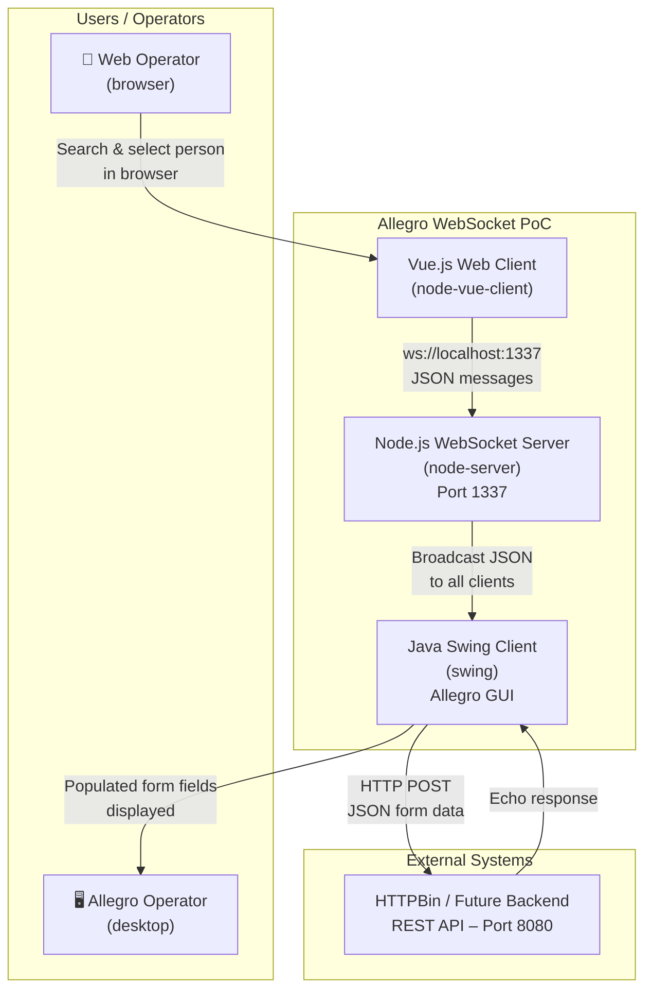

**External Interfaces:**

| Partner | Protocol | Direction | Description |
|---------|----------|-----------|-------------|
| Browser / Web Operator | WebSocket (`ws://`) | Vue → WS Server | Person search result and textarea content |
| Java Swing Client | WebSocket (`ws://`) | WS Server → Swing | Broadcast of all messages to all connected clients |
| HTTPBin / Allegro Backend | HTTP/REST POST | Swing → HTTPBin | Form submission containing all field values |

### 3.2 Technical Context

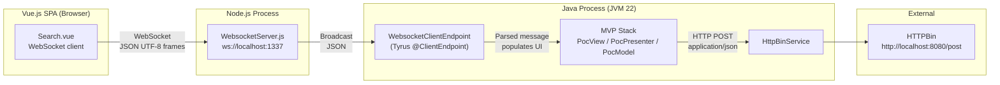

**Technical interfaces in detail:**

| Interface | Technology | Message format | Port |
|-----------|------------|----------------|------|
| Vue.js ↔ WS Server | WebSocket RFC 6455, UTF-8 text frames | JSON `{ target, content }` | 1337 |
| WS Server ↔ Swing | WebSocket RFC 6455, UTF-8 text frames | JSON `{ target, content }` | 1337 |
| Swing ↔ HTTPBin | HTTP/1.1 POST, `application/json` | Flat JSON object (keys = `ModelProperties` enum names) | 8080 |

---

## 4. Solution Strategy

### 4.1 Technology Decisions

| Decision | Technology Chosen | Rationale |
|----------|-------------------|-----------|
| **Real-time communication** | WebSocket (RFC 6455) | Full-duplex, low-overhead, browser-native; enables server-push to desktop |
| **WebSocket server** | Node.js + `websocket` npm package | Minimal dependency, trivial broadcast implementation, fast to prototype |
| **Web front-end** | Vue.js 2.x SPA | Component model, reactive data binding, low learning curve |
| **Desktop client** | Java Swing + Tyrus | Represents the existing Allegro technology stack; no rewrite required |
| **JSON library (Java)** | `javax.json` streaming API | Lightweight, no object-mapping overhead; parses the WebSocket payload field-by-field |
| **Backend mock** | HTTPBin Docker container | Echo service validates HTTP submission without a real Allegro backend |
| **Build (Java)** | Maven | Standard Java build tool; dependency management via Maven Central |
| **Build (Vue)** | Vue CLI / Yarn | Standard Vue.js scaffolding and dev server |

### 4.2 Top-Level Decomposition

The system consists of **three independent processes** communicating via two protocols:

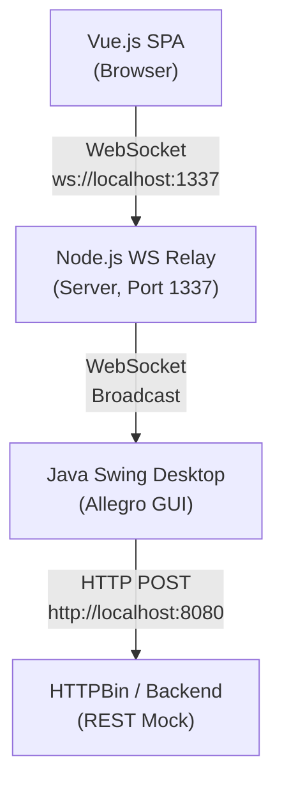

The architecture follows a **hub-and-spoke relay pattern**:

- The **Node.js WebSocket server** is the central hub; it maintains a flat array of all connected clients and broadcasts every received message to all of them without any routing logic.
- The **Vue.js client** acts as the **publisher**: it initiates all messages carrying person/payment data.
- The **Java Swing client** acts as the **subscriber**: it receives broadcast messages and uses the `target` field to decide which UI widget to update.

### 4.3 Swing Client Internal Architecture — MVP Pattern

The newer Swing implementation (`com/` package) follows the **Model-View-Presenter (MVP)** pattern:

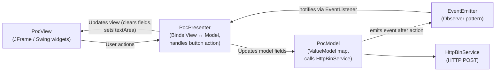

### 4.4 Quality Approach

| Quality Goal | Approach |
|--------------|----------|
| Interoperability | Shared JSON message envelope `{ target, content }` understood by both Vue and Java clients |
| Simplicity | Three independent processes; single-file Node server; all on localhost |
| Maintainability | MVP pattern in Swing client; `ModelProperties` enum centralises all field names |
| Extensibility | Adding a new target field requires: one new enum value + one UI binding + one case in `onMessage`; server unchanged |
| Correctness | Streaming JSON parser validates field presence before populating Swing text fields |

---

## 5. Building Block View

### 5.1 Level 1 – System Overview

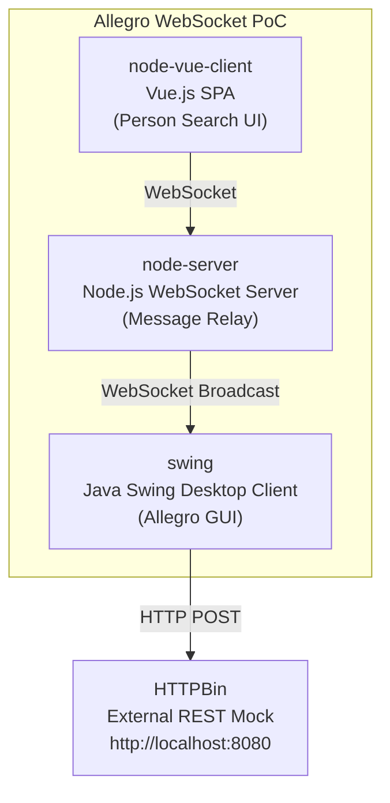

| Building Block | Technology | Responsibility |
|----------------|------------|----------------|
| `node-vue-client` | Vue.js 2, Vue CLI 4, Yarn | Person search UI, WebSocket publisher, data selection |
| `node-server` | Node.js 18+, `websocket` 1.0.35 | WebSocket server, connection management, message broadcast |
| `swing` | Java 22, Swing, Tyrus 1.15, Maven | Allegro desktop GUI, WebSocket subscriber, HTTP form submission |

### 5.2 Level 2 – Component View

#### 5.2.1 node-vue-client (Vue.js SPA)

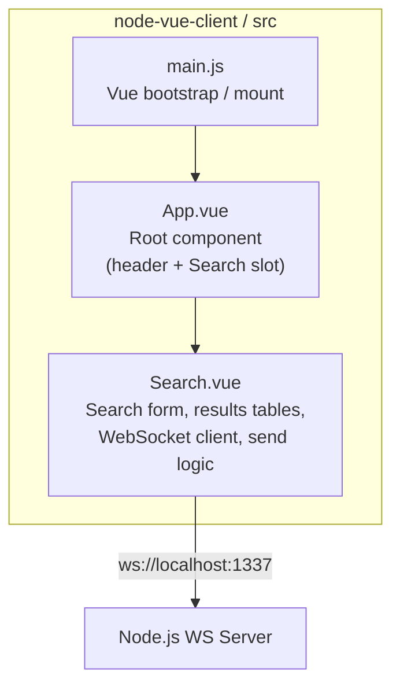

**Search.vue responsibilities:**

| Responsibility | Implementation |
|----------------|----------------|
| Maintain in-memory person dataset | `search_space[]` array (5 mock persons) |
| Filter persons by form criteria | `searchPerson()` — case-insensitive partial match across 6 fields |
| Track selected person | `selected_result` reactive property |
| Track selected Zahlungsempfänger | `zahlungsempfaenger_selected` reactive property |
| Connect WebSocket on mount | `connect()` called from `mounted()` hook |
| Disconnect WebSocket | `disconnect()` method |
| Send message to server | `sendMessage(content, target)` — deep-clones payload, serialises to JSON |
| Real-time textarea relay | `watch: internal_content_textarea` — sends on every change |

#### 5.2.2 node-server (Node.js WebSocket Server)

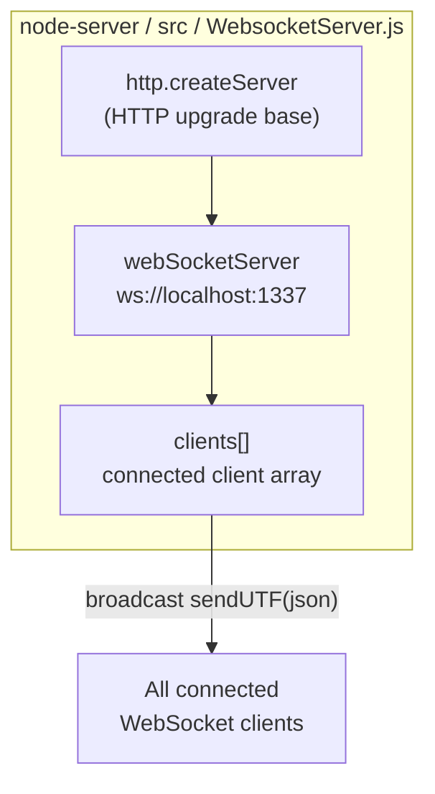

**WebsocketServer.js responsibilities:**

| Responsibility | Implementation |
|----------------|----------------|
| HTTP server as WS upgrade base | `http.createServer()` listening on port 1337 |
| Accept WebSocket connections | `wsServer.on('request', ...)` — accepts any origin |
| Track connected clients | `clients.push(connection)` on connect; `clients.splice(index, 1)` on close |
| Broadcast messages | On every UTF-8 message: iterate `clients[]`, call `sendUTF(json)` on each |
| Log lifecycle events | `console.log` with timestamps for connect, disconnect, and message events |

#### 5.2.3 swing (Java Swing Desktop Client)

The `swing` module contains **two parallel implementations**:

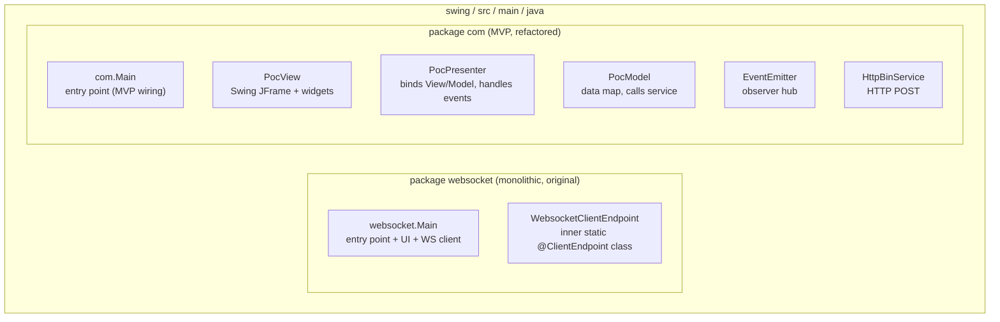

**`websocket.Main`** — monolithic (original) implementation:

| Class / Method | Responsibility |
|----------------|----------------|
| `websocket.Main` | Application entry point; builds `JFrame`; creates `WebsocketClientEndpoint` |
| `WebsocketClientEndpoint` | `@ClientEndpoint` — Tyrus WS client; handles `@OnOpen`, `@OnClose`, `@OnMessage` |
| `onOpen(Session)` | Stores `userSession` reference |
| `onClose(Session, CloseReason)` | Clears session; releases `CountDownLatch` |
| `onMessage(String json)` | Routes message by `target`; populates text fields or text area |
| `extract(String json)` | Streaming JSON parse → `Message(target, content)` |
| `toSearchResult(String json)` | Streaming JSON parse → `SearchResult` POJO |
| `initUI()` | Builds `JFrame` with `GridBagLayout`: 6 text fields, 3 radio buttons, 1 text area, 1 button |

**`com` package** — MVP implementation:

| Class | Pattern Role | Responsibility |
|-------|-------------|----------------|
| `com.Main` | Bootstrap | Wires `PocView`, `PocModel`, `PocPresenter`, `EventEmitter`; parks main thread on `CountDownLatch` |
| `PocView` | View | `JFrame` with all form widgets (name, address, payment fields, gender, text area, button); exposes protected fields |
| `PocPresenter` | Presenter | Wires `DocumentListener`/`ChangeListener` on all view widgets; handles button click; subscribes to `EventEmitter` to reset view |
| `PocModel` | Model | `EnumMap<ModelProperties, ValueModel<?>>` stores current form state; calls `HttpBinService.post()` on `action()` |
| `EventEmitter` | Observable | `List<EventListener>`; `emit(String)` notifies all subscribers |
| `EventListener` | Observer | Functional interface `onEvent(String eventData)` |
| `ValueModel<T>` | Value Object | Generic typed wrapper for a single form-field value; get/set accessors |
| `ModelProperties` | Enum | 13-item canonical list of all form field names |
| `HttpBinService` | Service | Issues `HTTP POST` to `http://localhost:8080/post` with JSON body built from model map |

### 5.3 Level 3 – Key Class Diagrams

#### 5.3.1 Swing MVP Stack

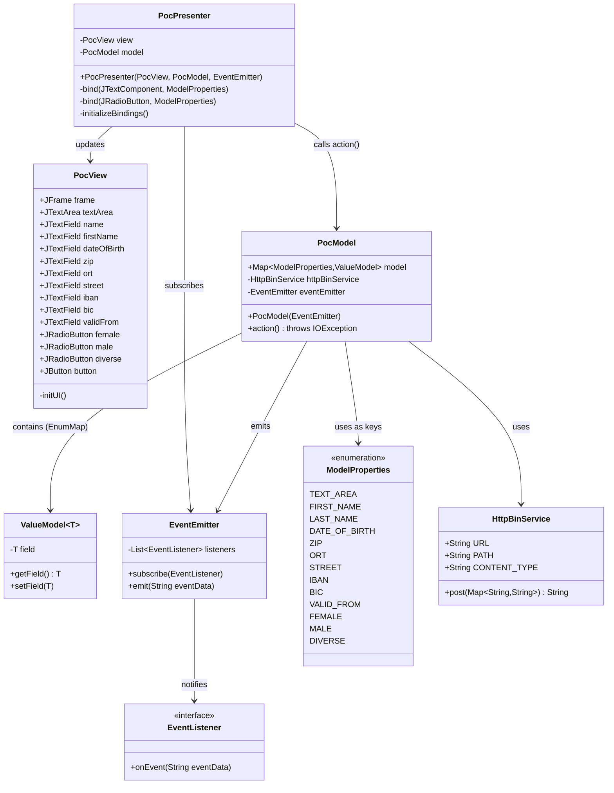

#### 5.3.2 WebSocket Monolithic Client

```mermaid
classDiagram
    class Main {
        -CountDownLatch latch$
        -JFrame frame$
        -JTextArea textArea$
        -JTextField tf_name$
        -JTextField tf_first$
        -JTextField tf_dob$
        -JTextField tf_zip$
        -JTextField tf_ort$
        -JTextField tf_street$
        -JTextField tf_hausnr$
        -JTextField tf_ze_iban$
        -JTextField tf_ze_bic$
        -JTextField tf_ze_valid_from$
        -JRadioButton rb_female$
        -JRadioButton rb_male$
        -JRadioButton rb_diverse$
        +main(String[])$
        -initUI()$
        +toSearchResult(String json)$ SearchResult
    }

    class WebsocketClientEndpoint {
        <<ClientEndpoint>>
        +Session userSession
        +WebsocketClientEndpoint(URI)
        +onOpen(Session)
        +onClose(Session, CloseReason)
        +onMessage(String json)
        +sendMessage(String)
        +extract(String json) Message
    }

    class Message {
        +String target
        +String content
    }

    class SearchResult {
        +String name
        +String first
        +String dob
        +String zip
        +String ort
        +String street
        +String hausnr
        +String ze_iban
        +String ze_bic
        +String ze_valid_from
    }

    Main +-- WebsocketClientEndpoint : inner static class
    Main +-- Message : inner static class
    Main +-- SearchResult : inner static class
    WebsocketClientEndpoint --> Message : creates via extract()
    Main --> SearchResult : populates UI from
```

---

## 6. Runtime View

### 6.1 Scenario 1 – System Startup Sequence

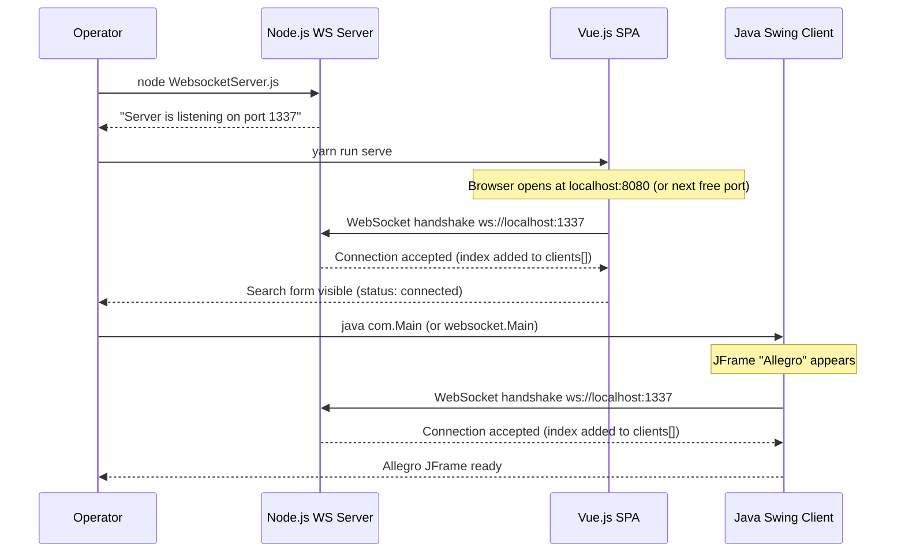

### 6.2 Scenario 2 – Person Search and Transfer to Allegro

```mermaid
sequenceDiagram
    participant OPW as Web Operator
    participant VUE as Vue.js (Search.vue)
    participant NODE as Node.js WS Server
    participant SWING as Java Swing (websocket.Main)
    participant OPA as Allegro Operator

    OPW->>VUE: Enter "Mayer" in Name field, click "Suchen"
    VUE->>VUE: searchPerson() — filter search_space[]
    VUE-->>OPW: Display matching row (Hans Mayer, knr: 79423984)

    OPW->>VUE: Click result row
    VUE->>VUE: selectResult(item) — selected_result = Hans Mayer
    VUE-->>OPW: Row highlighted (blue); zahlungsempfaenger table populated

    OPW->>VUE: Click IBAN row (DE27...)
    VUE->>VUE: zahlungsempfaengerSelected(ze)
    VUE-->>OPW: IBAN row highlighted (green)

    OPW->>VUE: Click "Nach ALLEGRO übernehmen"
    VUE->>VUE: sendMessage(selected_result, 'textfield')
    Note over VUE: deep clone of selected_result<br/>replace zahlungsempfaenger with selected ze<br/>JSON.stringify({target:"textfield", content: obj})
    VUE->>NODE: socket.send(json)

    NODE->>NODE: Iterate clients[] (length = 2)
    NODE->>VUE: sendUTF(json)   [echo back to self]
    NODE->>SWING: sendUTF(json)

    SWING->>SWING: onMessage(json)
    SWING->>SWING: extract(json) → Message{target:"textfield", content:fullJson}
    SWING->>SWING: toSearchResult(fullJson)
    SWING->>SWING: Populate: tf_name, tf_first, tf_dob, tf_zip,<br/>tf_ort, tf_street, tf_hausnr,<br/>tf_ze_iban, tf_ze_bic, tf_ze_valid_from
    SWING-->>OPA: All 10 Allegro text fields populated
```

### 6.3 Scenario 3 – Free-text Textarea Relay

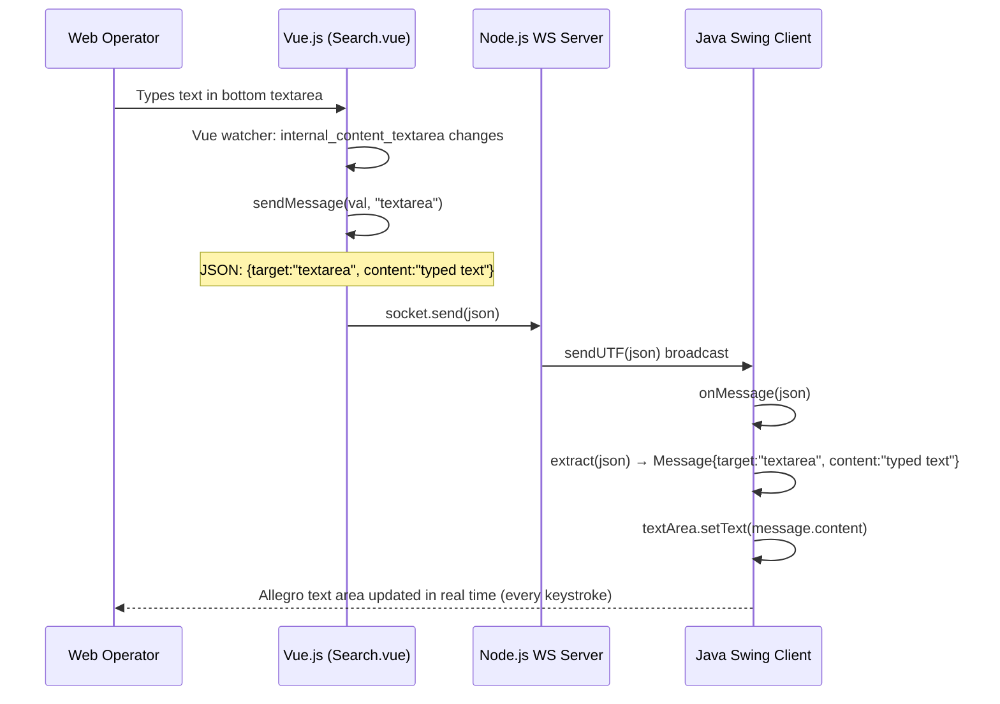

### 6.4 Scenario 4 – Allegro Form Submission (MVP Path)

```mermaid
sequenceDiagram
    participant OPA as Allegro Operator
    participant VIEW as PocView (JFrame)
    participant PRES as PocPresenter
    participant MODEL as PocModel
    participant SVC as HttpBinService
    participant HB as HTTPBin :8080/post

    OPA->>VIEW: Click "Anordnen" button
    VIEW->>PRES: ActionListener.actionPerformed()
    PRES->>MODEL: model.action()
    MODEL->>MODEL: Iterate ModelProperties enum<br/>build Map from EnumMap<ModelProperties,ValueModel>
    MODEL->>SVC: httpBinService.post(data)
    SVC->>SVC: Open HttpURLConnection to http://localhost:8080/post<br/>Set Content-Type: application/json<br/>Stream JSON body via javax.json generator
    SVC->>HB: POST /post  body: {FIRST_NAME:..., LAST_NAME:..., ...13 fields...}
    HB-->>SVC: 200 OK  body: echo JSON with all fields
    SVC-->>MODEL: responseBody (String)
    MODEL->>MODEL: eventEmitter.emit(responseBody)
    MODEL-->>PRES: EventListener.onEvent(responseBody)
    PRES->>VIEW: textArea.setText(responseBody)
    PRES->>VIEW: Clear all 9 text fields
    PRES->>VIEW: Reset radio buttons (female selected)
    VIEW-->>OPA: Text area shows server response; all input fields cleared
```

### 6.5 Scenario 5 – Client Disconnection

```mermaid
sequenceDiagram
    participant SWING as Java Swing Client
    participant NODE as Node.js WS Server

    SWING->>SWING: JFrame closed (EXIT_ON_CLOSE) or process killed
    SWING->>NODE: WebSocket close frame sent
    NODE->>NODE: connection 'close' event fires
    NODE->>NODE: console.log "Peer X disconnected"
    NODE->>NODE: clients.splice(index, 1)
    Note over NODE: Subsequent broadcasts skip this client

    Note over SWING: onClose(session, reason) fires
    SWING->>SWING: this.userSession = null
    SWING->>SWING: latch.countDown()
    Note over SWING: Main thread unblocks; JVM may exit
```

---

## 7. Deployment View

### 7.1 Local Development Deployment

All three application processes run on a single developer machine (or CI runner). Only the HTTPBin backend mock requires Docker.

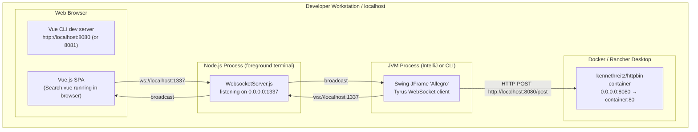

### 7.2 Start-up Procedure

| Step | Command | Notes |
|------|---------|-------|
| 1 | `docker run -p 8080:80 kennethreitz/httpbin` | Start HTTPBin mock (required only for MVP Swing path — `com.Main`) |
| 2 | `cd node-server/src && node WebsocketServer.js` | Start WebSocket relay on port 1337 |
| 3 | `cd node-vue-client && yarn run serve` | Start Vue.js dev server (default port 8080, or 8081 if 8080 is taken by HTTPBin) |
| 4 | Run `websocket.Main` or `com.Main` in IntelliJ | Requires Java SDK ≥ 22.0.1; configure content root per README |

> **Port conflict note:** HTTPBin occupies port 8080. Vue CLI dev server also defaults to 8080. The dev server auto-increments; verify the actual port in the console output.

### 7.3 Deployment Constraints

| Constraint | Impact |
|------------|--------|
| All components on `localhost` | No network configuration; no TLS; not suitable for multi-machine deployment without URL changes |
| Port 1337 hard-coded | Both clients and server must agree on this port; changing requires touching `Search.vue` and `websocket/Main.java` |
| Port 8080 for HTTPBin | Potential conflict with Vue CLI dev server; verify port assignments at startup |
| Java 22 required | JVM must support unnamed variable patterns (`_`) and `var`; older JDKs will fail to compile |

---

## 8. Crosscutting Concepts

### 8.1 Domain Model

The system operates on the following core domain entities, derived from field names across both the Vue.js and Swing components:

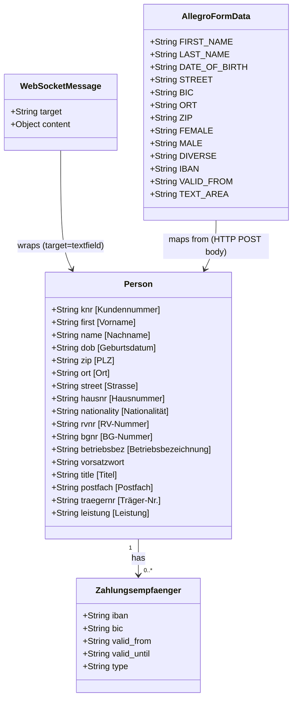

### 8.2 WebSocket Message Protocol

All messages across all components share a common JSON envelope:

```json
{
  "target": "<destination-identifier>",
  "content": <payload>
}
```

| Target value | Content type | Consumer action |
|--------------|-------------|-----------------|
| `"textfield"` | JSON object (person + zahlungsempfaenger merged) | Java Swing: parse with `toSearchResult()`, populate all 10 text fields |
| `"textarea"` | Plain string | Java Swing: call `textArea.setText(content)` |

> **Design note:** The server performs **no message inspection or routing**. Every message is broadcast verbatim to all connected clients. Client-side routing is entirely based on the `target` field value.

### 8.3 Error Handling

| Location | Error / Exception | Current Handling |
|----------|------------------|------------------|
| `WebsocketClientEndpoint` constructor | `DeploymentException`, `IOException`, `InterruptedException` | Caught; rethrown as `RuntimeException` — terminates the JVM |
| `PocPresenter` button `ActionListener` | `IOException`, `InterruptedException` from `model.action()` | Caught; rethrown as `RuntimeException` |
| `PocPresenter.bind()` `DocumentListener` | `BadLocationException` | Caught; rethrown as `RuntimeException` |
| `HttpBinService.post()` | `IOException`, `InterruptedException` | Propagated to `PocModel.action()` → `PocPresenter` |
| `WebsocketServer.js` — connection close | N/A | `clients.splice(index, 1)` removes disconnected client gracefully |
| `Search.vue` `connect()` | WebSocket connection failure | **No error handling** — silent failure if server is unreachable |

> **Known gap:** The Vue.js WebSocket client has no `onerror` or `onclose` reconnect handler. If the Node.js server restarts, the browser must be manually reloaded.

### 8.4 Logging and Monitoring

| Component | Logging approach |
|-----------|-----------------|
| Node.js server | `console.log` with timestamps: connection open/close events, received message content |
| Java `websocket.Main` | `System.out.println` for WebSocket lifecycle (`opening websocket`, `closing websocket`) |
| Java `com` MVP | `System.out.println` for field binding updates (`insertUpdate`, `removeUpdate`) and event emissions |
| Vue.js client | No application-level logging; browser DevTools WebSocket inspector is the primary debugging tool |

There is no structured logging, log levels, log rotation, or monitoring infrastructure in this PoC.

### 8.5 Security Concepts

| Aspect | Current State | Risk |
|--------|--------------|------|
| **Origin validation** | Disabled — `request.accept(null, request.origin)` accepts any origin | Any process on the network can connect to the WS server |
| **Authentication** | None | No identity verification for any client |
| **Transport security** | Plain `ws://` and `http://` — no TLS anywhere | All data visible in transit |
| **Input validation** | None on server; basic field presence only in Java parser | JSON injection or malformed messages could crash the Swing client |
| **CORS** | Not configured on HTTP server | Low direct risk; WebSocket origin policy is separate from HTTP CORS |

> These are acceptable limitations for a `localhost` PoC but must all be addressed before any production deployment.

### 8.6 Data Persistence

There is **no persistence layer** in this PoC:

- Person master data is a hard-coded JavaScript array in `Search.vue` (`search_space[]`).
- No database, file system, or cache is used.
- All state is ephemeral (in-memory) and lives only for the duration of the browser session or JVM process.

### 8.7 Reactive Bindings — Vue.js

`Search.vue` leverages Vue 2's reactivity system:

| Reactive Property | Type | Bound To | Purpose |
|------------------|------|----------|---------|
| `formdata` | Object | All search `input` fields via `v-model` | Two-way binding for search criteria |
| `search_result` | Array | `v-for` in results table | Filtered list of matching persons |
| `selected_result` | Object | `v-for` in zahlungsempfaenger table; row highlight | Currently selected person |
| `zahlungsempfaenger_selected` | Object/String | Row highlight; sent in `sendMessage` | Currently selected payment recipient |
| `internal_content_textarea` | String | `<textarea>` via `v-model`; Vue `watch` | Free-text relay trigger |

### 8.8 Two-way Data Binding — Java MVP

The `PocPresenter` implements manual two-way binding between Swing widgets and `PocModel`:

| Widget Type | Event Mechanism | `ValueModel<T>` Type | Trigger |
|-------------|----------------|----------------------|---------|
| `JTextField`, `JTextArea` | `javax.swing.event.DocumentListener` (`insertUpdate`, `removeUpdate`) | `ValueModel<String>` | Every text insertion or deletion |
| `JRadioButton` | `javax.swing.event.ChangeListener` | `ValueModel<Boolean>` | Every selection state change |

All 13 `ModelProperties` are bound at construction time via `initializeBindings()`.

---

## 9. Architectural Decisions

### ADR-001: WebSocket as Integration Protocol

**Status:** Implemented (observed in code)

**Context:** The PoC needs to push data from a browser-based Vue.js application to a Java Swing desktop application in near real-time. Traditional HTTP request-response polling would introduce latency; the legacy Swing app cannot act as an HTTP server.

**Decision:** Use WebSocket (RFC 6455) as the bidirectional communication channel, mediated by a Node.js relay server. Both the browser (native `WebSocket` API) and Java (Tyrus JSR-356 client library) have first-class WebSocket support.

**Consequences:**  
✅ Low-latency, full-duplex communication  
✅ Browser-native API; no additional Vue.js WebSocket library needed  
✅ Simple Node.js server with < 70 lines of code  
⚠️ All clients receive all messages (broadcast model); filtering is client-side only  
⚠️ No message persistence; if Swing client is not connected when a message is sent, it is lost  

---

### ADR-002: Node.js as WebSocket Relay (Hub-and-Spoke Broadcast)

**Status:** Implemented (observed in code)

**Context:** A relay server is needed that can accept WebSocket connections from both the browser and the JVM. The simplest possible implementation that broadcasts messages is preferred for the PoC.

**Decision:** Use Node.js with the `websocket` npm package. Implement a single-file server that maintains a flat `clients[]` array and broadcasts every incoming UTF-8 message to all elements.

**Consequences:**  
✅ Minimal implementation (~65 lines)  
✅ Zero routing logic; transparent relay  
⚠️ The Vue.js client receives its own messages echoed back (no sender exclusion)  
⚠️ Not scalable to targeted delivery, rooms, or subscriptions without significant refactoring  

---

### ADR-003: MVP Pattern for Swing GUI (`com` package)

**Status:** Implemented (observed in code)

**Context:** The original monolithic `websocket.Main` mixed UI construction, WebSocket handling, JSON parsing, and HTTP submission in a single 450-line class. This made testing and extension difficult.

**Decision:** Introduce `PocView`, `PocPresenter`, `PocModel`, `EventEmitter`, `ValueModel<T>`, and `ModelProperties` enum. The presenter binds view events to model updates; the model notifies the presenter via `EventEmitter` after completing an action.

**Consequences:**  
✅ Clear separation of concerns; view replaceable without touching model  
✅ `ModelProperties` enum is the single source of truth for all field names  
✅ `EventEmitter` decouples model from presenter (no circular reference)  
⚠️ The MVP Swing client (`com.Main`) does not include WebSocket integration (only HTTP POST); that remains in `websocket.Main`  
⚠️ Both implementations exist in parallel; one is superseded  

---

### ADR-004: Hard-coded `localhost` URLs

**Status:** Implemented (observed in code)

**Context:** PoC on a single developer machine; external configuration is not needed.

**Decision:** Hard-code all URLs: `ws://localhost:1337/` in both Swing clients and `Search.vue`; `http://localhost:8080` in `HttpBinService`.

**Consequences:**  
✅ Zero configuration needed for local development  
⚠️ Cannot run in a multi-machine or containerised environment without source changes  
⚠️ No environment-variable or properties-file support  

---

### ADR-005: Stateless WebSocket Server (No Message History)

**Status:** Implemented (observed in code)

**Context:** For a PoC demonstrating real-time relay, message persistence is not required.

**Decision:** The server does not store or replay messages. A `messages = []` array is declared but never populated (dead code). The server is purely a broadcast relay.

**Consequences:**  
✅ No memory growth; no stale data issues  
⚠️ Late-connecting Swing client will have empty form fields until the next message  
⚠️ The `messages` array is dead code  

---

### ADR-006: `javax.json` Streaming Parser for JSON Parsing

**Status:** Implemented (observed in code)

**Context:** The Swing client must parse incoming JSON messages. Adding Jackson or Gson would increase the dependency footprint.

**Decision:** Use the `javax.json` pull-parser, iterating `Event` tokens with boolean flags to capture field values.

**Consequences:**  
✅ No additional Maven dependency  
⚠️ Verbose, fragile implementation — relies on sequential key ordering  
⚠️ Bug: for `"textfield"` target, `extract()` returns the full original JSON string as `content` (because the nested `content` object's value token is not a `VALUE_STRING`); `toSearchResult()` is designed to cope with this by parsing the full JSON again, but the logic is unclear  

---

## 10. Quality Requirements

### 10.1 Quality Tree

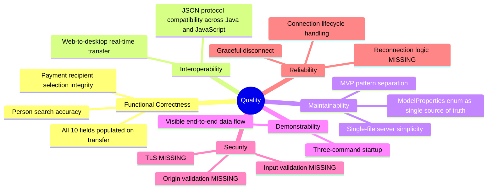

### 10.2 Quality Scenarios

| ID | Quality Attribute | Scenario | Acceptance Criterion |
|----|-------------------|----------|----------------------|
| QS-01 | **Functional Correctness** | Web operator selects Hans Mayer and clicks "Nach ALLEGRO übernehmen" | All 10 Allegro text fields (name, first, dob, zip, ort, street, hausnr, iban, bic, valid_from) populated correctly within 500 ms |
| QS-02 | **Functional Correctness** | Web operator types in textarea | Allegro text area updates on every keystroke with no visible delay |
| QS-03 | **Interoperability** | A second Swing client connects after session start | It receives all subsequent broadcasts; first client unaffected |
| QS-04 | **Maintainability** | Developer adds a new form field | Requires: 1 enum value, 1 `ValueModel` binding, 1 widget in `PocView`, 1 case in `onMessage`; server unchanged |
| QS-05 | **Demonstrability** | Fresh machine with Docker, Node.js, Java 22, Yarn | System fully running in < 5 minutes following README |
| QS-06 | **Reliability** | Node.js server restarts while Swing client is connected | `onClose` fires; `latch.countDown()` called; JVM exits gracefully without hanging |
| QS-07 | **Reliability** | Node.js server restarts while Vue.js client is open | Vue.js loses connection silently; no automatic reconnect; user must reload page manually |
| QS-08 | **Security** | Malicious client connects from external origin | PoC: connection accepted. **Production requirement:** reject unauthorised origins; enforce TLS |

---

## 11. Risks and Technical Debt

### 11.1 Technical Risks

| ID | Risk | Probability | Impact | Mitigation |
|----|------|-------------|--------|------------|
| R-01 | **Port conflict** — HTTPBin (8080) vs Vue CLI dev server (default 8080) | High | Medium | Set `devServer.port` in `vue.config.js`; or start HTTPBin on port 8090 |
| R-02 | **WebSocket echo loop** — Vue.js client receives its own sent messages | High | Low | `onmessage` handler is commented out; safe for PoC but confusing in future |
| R-03 | **Message loss** — Swing client not connected when Vue sends | High | High | No mitigation in PoC; production requires message queuing (Redis, etc.) |
| R-04 | **Java version** — unnamed variable pattern `_` requires Java 22 preview | Medium | High | Pin JDK version in CI/CD pipeline; document prerequisite prominently |
| R-05 | **No reconnect** — Vue.js WebSocket has no `onerror`/`onclose` recovery | Medium | Medium | Add reconnect logic with exponential back-off in next iteration |
| R-06 | **JSON parser fragility** — streaming parser in `extract()` has edge-case bugs | Medium | Medium | Replace with `ObjectMapper` (Jackson) or Gson |
| R-07 | **No authentication** — server accepts any origin | High | Critical (production) | Implement session tokens and WebSocket sub-protocol authentication |

### 11.2 Technical Debt

| ID | Type | Location | Description | Priority | Est. Effort |
|----|------|----------|-------------|----------|-------------|
| TD-01 | Dead code | `WebsocketServer.js:6` | `var messages = []` declared but never used | Low | 15 min |
| TD-02 | Dead code | `websocket/Main.java` `sendMessage()` | `sendMessage` method exists but is never called | Low | 15 min |
| TD-03 | Commented-out code | `WebsocketServer.js:41–44` | Test echo `connection.sendUTF(...)` | Low | 10 min |
| TD-04 | Commented-out code | `Search.vue:135` | `this.socket.onmessage = ({data}) => {}` | Low | 10 min |
| TD-05 | Commented-out code | `websocket/Main.java:60` | `clientEndPoint.sendMessage(...)` | Low | 10 min |
| TD-06 | Hard-coded test data | `Search.vue:104–124` | 5 mock persons with realistic IBAN/BIC values hard-coded in Vue component | Medium | 4 h |
| TD-07 | Hard-coded URLs | `Search.vue`, `websocket/Main.java`, `HttpBinService.java` | All URLs are `localhost` literals without configuration | Medium | 2 h |
| TD-08 | Duplicate implementation | `websocket/` and `com/` packages | Two parallel Swing implementations; `websocket.Main` is superseded by the MVP but not deleted | Medium | 2 h |
| TD-09 | Missing error handling | `Search.vue:connect()` | No `onerror` / `onclose` / reconnect logic on browser WebSocket | High | 3 h |
| TD-10 | Stub class | `com/poc/model/ViewData.java` | Empty `class ViewData {}` — placeholder never implemented | Low | 30 min |
| TD-11 | Logic bug | `websocket/Main.java:extract()` | For `"textfield"` target the `content` key's value is an object, not a string — `strContent` is never set from JSON value token; fallback passes the full `json` to `toSearchResult()` (works but by accident) | High | 4 h |
| TD-12 | No input validation | `Search.vue` + `onMessage` | No sanitisation of received JSON before UI population | High | 4 h |
| TD-13 | No security | `WebsocketServer.js` | All origins accepted; no auth; plain-text transport | Critical | 2+ days |
| TD-14 | Vue 2 EOL | `node-vue-client` | Vue 2 reached End of Life in December 2023; should migrate to Vue 3 | High | 3–5 days |

### 11.3 Improvement Recommendations

**Short-term (PoC hardening):**
- Add `onerror` / `onclose` with reconnect logic in `Search.vue`
- Fix JSON parsing in `websocket/Main.java` `extract()` (TD-11) to correctly handle nested `content` objects
- Remove all dead code and commented-out blocks (TD-01 through TD-05)
- Delete the superseded `websocket.Main` once `com.Main` is feature-complete

**Medium-term (production readiness):**
- Replace hard-coded mock data with a real search API (REST or GraphQL backend)
- Extract all URLs and port numbers to environment-variable configuration
- Add WebSocket authentication (JWT tokens in sub-protocol header or session cookies)
- Enable WSS (WebSocket Secure) with TLS certificates
- Replace `javax.json` streaming parser with Jackson `ObjectMapper` or Gson
- Migrate Vue.js from version 2 to version 3

**Long-term (architecture evolution):**
- Replace broadcast relay with targeted message routing (session-based or room-based)
- Introduce a proper persistence layer (relational or document database) for person master data
- Add structured logging: SLF4J + Logback for Java; Winston or Pino for Node.js
- Implement comprehensive test suites: JUnit 5 + Mockito for Java; Jest + Vue Test Utils for Vue
- Consider containerising all components (Docker Compose) for reproducible environments

---

## 12. Glossary

### 12.1 Domain Terms (German / English)

| Term | German | Definition in Context |
|------|--------|-----------------------|
| **Allegro** | Allegro | Legacy Java Swing desktop application in the German social-insurance domain; the target system this PoC integrates with |
| **Kundennummer (knr)** | Kundennummer | Unique customer / insured-person identifier |
| **Zahlungsempfänger** | Zahlungsempfänger | Payment recipient: the bank account (IBAN/BIC) to which benefits are disbursed |
| **IBAN** | IBAN | International Bank Account Number |
| **BIC** | BIC | Bank Identifier Code (SWIFT code) |
| **PLZ** | Postleitzahl | German postal code |
| **Ort** | Ort | City / municipality |
| **Vorname** | Vorname | First name / given name |
| **Nachname / Name** | Nachname | Last name / surname |
| **Geburtsdatum (dob)** | Geburtsdatum | Date of birth |
| **Hausnummer (hausnr)** | Hausnummer | House / building number |
| **RV-Nummer (rvnr)** | Rentenversicherungsnummer | German statutory pension insurance number |
| **BG-Nummer (bgnr)** | Berufsgenossenschaftsnummer | Trade association (employers' liability insurance) number |
| **Betriebsbezeichnung** | Betriebsbezeichnung | Business / employer name |
| **Träger-Nummer** | Trägernummer | Social-insurance carrier / agency number |
| **Leistung** | Leistung | Benefit type or social-insurance service |
| **Vorsatzwort** | Vorsatzwort | Name prefix (nobility particle, e.g. "von", "de") |
| **Gültig ab** | Gültig ab | Valid from (start date for IBAN/BIC) |
| **Anordnen** | Anordnen | "Submit / Arrange" — action button in Swing GUI that posts form data to backend |
| **Suchen** | Suchen | "Search" — action button in Vue.js UI that triggers person lookup |
| **Nach ALLEGRO übernehmen** | Nach ALLEGRO übernehmen | "Transfer to Allegro" — sends selected data via WebSocket to the Swing client |
| **Geschlecht** | Geschlecht | Gender selection (Weiblich / Männlich / Divers) |
| **RT** | RT | Label for the Swing text area widget (likely "Rücktext" = response text) |
| **Nationalität** | Nationalität | Nationality |
| **Postfach** | Postfach | P.O. box |

### 12.2 Technical Terms

| Term | Definition |
|------|------------|
| **WebSocket (RFC 6455)** | Full-duplex TCP-based communication protocol; enables real-time bidirectional messaging between browser and server |
| **Tyrus** | GlassFish/Jakarta reference implementation of JSR-356 (Java WebSocket API); used here as a standalone client library |
| **JSR-356** | Java API for WebSocket — the Java EE standard defining `@ClientEndpoint`, `@OnOpen`, `@OnMessage`, `@OnClose` |
| **MVP (Model-View-Presenter)** | Architectural pattern: View renders UI and passes events to Presenter; Presenter updates Model; Model notifies Presenter via Observer |
| **EventEmitter** | Observer pattern implementation — decouples the event source (Model) from the event consumer (Presenter) |
| **ValueModel\<T\>** | Generic typed wrapper for a single form-field value; enables type-safe read/write in the model map |
| **ModelProperties** | Java enum serving as the canonical registry of all 13 form field names; used as keys in `EnumMap` |
| **HTTPBin** | Open-source HTTP echo service (`kennethreitz/httpbin`) used as a backend mock; returns whatever JSON was posted |
| **Hub-and-spoke relay** | Topology where a central hub (Node.js WS server) receives from any spoke (client) and forwards to all other spokes |
| **Broadcast** | Server sends the same message to all connected clients regardless of who sent it |
| **Vue CLI** | Vue.js scaffolding and development toolchain (`@vue/cli-service`); provides `serve`, `build`, `lint` scripts |
| **CountDownLatch** | Java concurrency primitive; used here to park the main thread until the WebSocket session closes and the JVM can exit |
| **GridBagLayout** | Java Swing layout manager for flexible grid-based placement of widgets with column/row spanning |
| **DocumentListener** | Java Swing interface for receiving text change notifications (`insertUpdate`, `removeUpdate`, `changedUpdate`) |
| **javax.json streaming API** | Pull-parser (event-based) JSON processing API (part of Jakarta EE) that tokenises JSON without building an object tree |
| **PoC (Proof of Concept)** | A demonstration implementation that validates technical feasibility; explicitly not production-ready |
| **SPA (Single Page Application)** | Web app architecture that loads one HTML page and dynamically renders all content via JavaScript |
| **SFC (Single File Component)** | Vue.js file format (`.vue`) combining `<template>`, `<script>`, and `<style>` in one file |

---

## Appendix

### A. File Inventory

| Path | Language | Role |
|------|----------|------|
| `node-server/src/WebsocketServer.js` | JavaScript (Node.js) | WebSocket relay server — single-file implementation |
| `node-server/package.json` | JSON | Node.js dependency manifest |
| `node-server/doc/Readme.txt` | Text | Developer setup notes |
| `node-vue-client/src/main.js` | JavaScript | Vue app bootstrap; mounts `App.vue` to `#app` |
| `node-vue-client/src/App.vue` | Vue SFC | Root component; renders header + `<Search>` |
| `node-vue-client/src/components/Search.vue` | Vue SFC | Person search form, result tables, WebSocket client |
| `node-vue-client/package.json` | JSON | Vue.js dependency manifest |
| `node-vue-client/babel.config.js` | JavaScript | Babel transpiler configuration |
| `node-vue-client/doc/Readme.txt` | Text | Developer setup notes |
| `swing/src/main/java/websocket/Main.java` | Java 22 | Monolithic Swing + WebSocket client (original) |
| `swing/src/main/java/com/Main.java` | Java 22 | MVP entry point |
| `swing/src/main/java/com/poc/presentation/PocView.java` | Java 22 | MVP View — Swing form |
| `swing/src/main/java/com/poc/presentation/PocPresenter.java` | Java 22 | MVP Presenter — binds view/model |
| `swing/src/main/java/com/poc/model/PocModel.java` | Java 22 | MVP Model — form state + HTTP service |
| `swing/src/main/java/com/poc/model/EventEmitter.java` | Java 22 | Observer hub |
| `swing/src/main/java/com/poc/model/EventListener.java` | Java 22 | Observer interface |
| `swing/src/main/java/com/poc/model/HttpBinService.java` | Java 22 | HTTP POST to HTTPBin |
| `swing/src/main/java/com/poc/model/ModelProperties.java` | Java 22 | Form field name enum |
| `swing/src/main/java/com/poc/model/ViewData.java` | Java 22 | Empty stub (never implemented) |
| `swing/src/main/java/com/poc/ValueModel.java` | Java 22 | Generic form-field wrapper |
| `pom.xml` | XML | Maven build descriptor + dependencies |
| `api.yml` | YAML (OpenAPI 3.0.1) | REST API spec for Allegro PoC POST endpoint |
| `README.md` | Markdown | Project setup and run guide |
| `WebsocketSwingClient.launch` | XML | IntelliJ IDEA run configuration |

### B. Dependency Summary

**Node.js (`node-server`):**

| Package | Version | Purpose |
|---------|---------|---------|
| `websocket` | ^1.0.35 | WebSocket server + client implementation |

**Vue.js (`node-vue-client`):**

| Package | Version | Purpose |
|---------|---------|---------|
| `vue` | ^2.6.10 | UI framework |
| `core-js` | ^3.1.2 | ES2015+ polyfills |
| `@vue/cli-service` | ^4.0.0 | Dev server, build toolchain |
| `@vue/cli-plugin-babel` | ^4.0.0 | Babel transpiler integration |
| `@vue/cli-plugin-eslint` | ^4.0.0 | ESLint integration |
| `eslint` | ^5.16.0 | JavaScript/Vue linter |
| `eslint-plugin-vue` | ^5.0.0 | Vue-specific lint rules |
| `vue-template-compiler` | ^2.6.10 | Compiles Vue SFCs |
| `babel-eslint` | ^10.0.1 | ESLint parser for Babel syntax |

**Java (`swing` via Maven):**

| GroupId : ArtifactId | Version | Purpose |
|----------------------|---------|---------|
| `org.glassfish.websocket:websocket-api` | 0.2 | WebSocket API (early GlassFish edition) |
| `org.glassfish.tyrus.bundles:tyrus-standalone-client` | 1.15 | Tyrus standalone WS client |
| `org.glassfish.tyrus:tyrus-websocket-core` | 1.2.1 | Tyrus WS core |
| `org.glassfish.tyrus:tyrus-spi` | 1.15 | Tyrus SPI |
| `javax.json:javax.json-api` | 1.1.4 | JSON processing API |
| `org.glassfish:javax.json` | 1.0.4 | JSON processing implementation |

### C. OpenAPI Specification Summary (`api.yml`)

| Property | Value |
|----------|-------|
| **Title** | Allegro PoC |
| **API Version** | 1.0.0 |
| **Server** | `http://localhost:8080` |
| **Endpoint** | `POST /post` |
| **Request content-type** | `application/json` |
| **Request body key** | `user` (wraps a `PostObject`) |
| **Response** | Echo of `PostObject` under key `postObject` |
| **Fields in PostObject** | FIRST_NAME, LAST_NAME, DATE_OF_BIRTH, STREET, BIC, ORT, ZIP, FEMALE, MALE, DIVERSE, IBAN, VALID_FROM, TEXT_AREA |

### D. Analysis Metadata

| Item | Value |
|------|-------|
| **Documentation generated** | 2025-07-05 |
| **Components analysed** | `node-server` (1 JS file), `node-vue-client` (3 Vue/JS files), `swing` (9 Java source files) |
| **Total source files** | ~22 (excluding `target/`, `node_modules/`, `.git/`) |
| **Languages** | JavaScript (Node.js), JavaScript/HTML/CSS (Vue.js SFC), Java 22 |
| **Frameworks / Runtimes** | Vue.js 2.x, Tyrus 1.15 (JSR-356), Maven, Vue CLI 4, Node.js |
| **Arc42 sections** | 12 / 12 completed |
| **Mermaid diagrams** | 18 |
| **Architectural decisions documented** | 6 (ADR-001 through ADR-006) |
| **Technical debt items** | 14 (TD-01 through TD-14) |

---

*This document was automatically generated from source-code analysis by the GenInsights arc42-agent.*  
*Arc42 template: https://arc42.org*
