# Allegro PoC — WebSocket Swing Client Architecture Documentation

**Version:** 1.0  
**Date:** 2025-01-30  
**Status:** Generated from source-code analysis  
**Project ID:** `websocket_swing` (Maven artifact `websocket_swing:0.0.1-SNAPSHOT`)

> **File location note:** This file should reside at `docs/arc42/arc42-architecture.md`.  
> To move it: `mkdir -p docs/arc42 && mv arc42-architecture.md docs/arc42/arc42-architecture.md`

---

## Table of Contents

1. [Introduction and Goals](#1-introduction-and-goals)
2. [Constraints](#2-constraints)
3. [Context and Scope](#3-context-and-scope)
4. [Solution Strategy](#4-solution-strategy)
5. [Building Block View](#5-building-block-view)
6. [Runtime View](#6-runtime-view)
7. [Deployment View](#7-deployment-view)
8. [Crosscutting Concepts](#8-crosscutting-concepts)
9. [Architectural Decisions](#9-architectural-decisions)
10. [Quality Requirements](#10-quality-requirements)
11. [Risks and Technical Debt](#11-risks-and-technical-debt)
12. [Glossary](#12-glossary)

---

## 1. Introduction and Goals

### 1.1 Requirements Overview

The **Allegro PoC** (Proof-of-Concept) is a modernisation demonstrator for a legacy system called *Allegro*. It explores how a desktop-based data-entry workflow can be bridged to a modern, browser-based search interface through a real-time WebSocket communication layer. The system proves the concept of replacing legacy screen interaction with a loosely-coupled, event-driven architecture.

The core capability the PoC delivers is:

> A user searches for a person in a Vue.js web application, selects the person and their payment details (Zahlungsempfänger), and the result is automatically populated into the legacy Java Swing form — transmitted in real time via a WebSocket relay server.

Key functional capabilities:

| # | Capability | Description |
|---|-----------|-------------|
| C-01 | Person search | The Vue.js web client allows searching a local mock data set by name, first name, ZIP, city, street, and house number |
| C-02 | Payment account (Zahlungsempfänger) selection | After selecting a person the user selects the associated IBAN/BIC/valid-from record |
| C-03 | Data transfer to legacy Swing form | The selected person and payment data is sent over WebSocket and populated into the Swing GUI fields |
| C-04 | Free-text relay | Arbitrary text typed in the Vue.js textarea is relayed in real time to the Swing `JTextArea` |
| C-05 | HTTP form submission | The Swing form can submit its fields as a JSON POST to an HTTPBin endpoint for echo/testing |
| C-06 | Two entry-point architectures | Two independent Swing entry points coexist: a *raw* WebSocket client (`websocket.Main`) and a structured MVP client (`com.Main`) |

### 1.2 Quality Goals

| Priority | Quality Goal | Rationale |
|----------|-------------|-----------|
| 1 | **Demonstrability** | The primary purpose is to act as a working proof-of-concept; it must be runnable with minimal setup |
| 2 | **Maintainability** | The MVP structure in `com.poc` separates concerns to make future iterations easy |
| 3 | **Extensibility** | The event-emitter pattern and model-properties enum allow new fields to be added without restructuring |
| 4 | **Decoupling** | WebSocket as transport decouples the Vue.js search UI from the legacy Swing form |
| 5 | **Simplicity** | The Node.js relay server is intentionally minimal — pure broadcast, no persistence |

### 1.3 Stakeholders

| Role | Description | Primary Expectations |
|------|-------------|----------------------|
| Java Swing Developer | Maintains the desktop GUI and MVP wiring | Clear separation of view, presenter, and model; type-safe field bindings |
| Frontend Developer | Maintains the Vue.js search client | Simple WebSocket API contract, easy search mock extension |
| Modernisation Architect | Evaluates feasibility of Allegro replacement | Evidence that legacy Swing and modern web UI can co-exist and exchange data |
| DevOps / Operator | Sets up the local development environment | Documented startup sequence (Docker → Node server → Vue dev server → Swing) |
| End User (analyst / clerk) | Searches for insured persons and transfers data to Allegro | Fast, reliable data population in the Swing form without manual re-entry |

---

## 2. Constraints

### 2.1 Technical Constraints

| Constraint | Detail |
|-----------|--------|
| **Java Version** | Java SDK ≥ 22.0.1 (set explicitly as Maven compiler source/target `22`) |
| **Build System** | Apache Maven (`pom.xml` at repository root); no Gradle alternative present |
| **WebSocket Client Library** | GlassFish Tyrus standalone client 1.15 (`tyrus-standalone-client`) |
| **WebSocket API** | `javax.websocket` (Jakarta EE, `websocket-api 0.2` + `tyrus-websocket-core 1.2.1`) |
| **JSON Library** | `javax.json-api 1.1.4` + `org.glassfish:javax.json 1.0.4` (streaming parser; no Jackson/Gson) |
| **Node.js Server** | Node.js runtime required; `websocket ^1.0.35` npm package |
| **Vue.js Client** | Vue 2.6.x; built with `@vue/cli-service 4.x`; no Vue Router or Vuex |
| **Mock HTTP Backend** | HTTPBin Docker image `kennethreitz/httpbin` mapped to `localhost:8080` |
| **IDE** | IntelliJ IDEA recommended; Eclipse launch config (`WebsocketSwingClient.launch`) also present |
| **OS** | Cross-platform (Linux/macOS/Windows); Windows path references in docs are developer-specific |

### 2.2 Organisational Constraints

| Constraint | Detail |
|-----------|--------|
| **PoC scope** | The repository is explicitly a proof-of-concept; production hardening (auth, persistence, error recovery) is out of scope |
| **No automated tests** | No test sources or test frameworks are present in the Maven build or npm configs |
| **Single developer history** | Path references in docs (`C:/Users/esultano/…`) indicate solo development origin |
| **No CI pipeline** | No `.github/workflows` or similar pipeline definitions found |

### 2.3 Conventions

| Convention | Detail |
|-----------|--------|
| **Package naming** | Two parallel namespaces: `websocket.*` (legacy prototype) and `com.poc.*` (MVP refactor) |
| **German field labels** | All UI labels and some field keys are in German (Vorname, Name, Geburtsdatum, etc.) — matching the Allegro legacy system |
| **EnumMap for model** | Form fields are keyed by the `ModelProperties` enum rather than string literals |
| **Functional event listener** | `EventListener` is a `@FunctionalInterface`-compatible single-method interface |
| **Vue single-file components** | Vue components use `.vue` SFC format with co-located template, script, and scoped styles |

---

## 3. Context and Scope

### 3.1 Business Context

The system sits between a legacy Allegro desktop application (represented by the Swing form) and modern web tooling. The Vue.js client replaces or augments whatever legacy search screen existed in the original Allegro system.

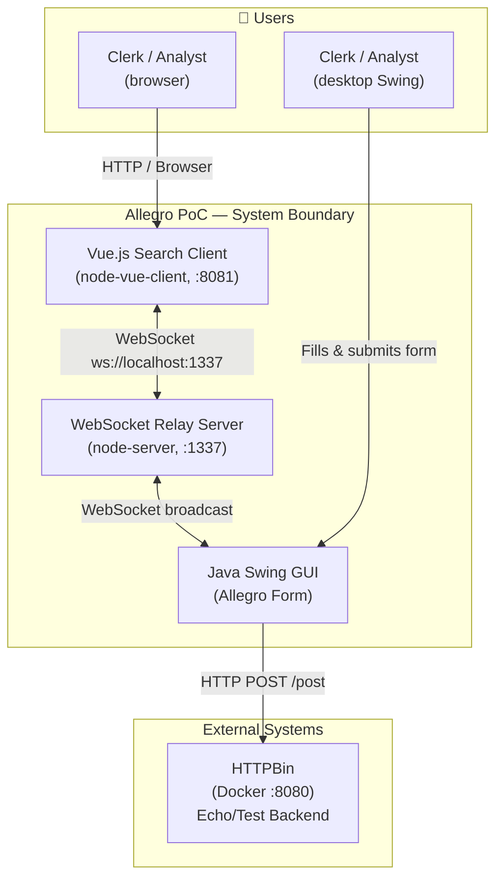

**External Interface Summary:**

| Partner | Protocol | Direction | Description |
|---------|----------|-----------|-------------|
| Browser (Vue.js client) | HTTP/HTTPS | Inbound | User interface for person search |
| WebSocket Server | WS (`ws://localhost:1337/`) | Bi-directional | Real-time message relay between Vue.js and Swing |
| HTTPBin (`localhost:8080`) | HTTP POST | Outbound from Swing | Echo service used to test form submission |

### 3.2 Technical Context

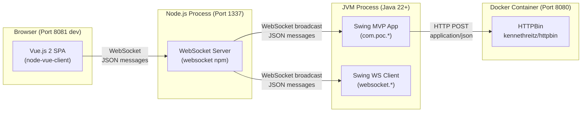

**WebSocket JSON Message Envelope:**

```json
{
  "target": "textfield | textarea",
  "content": "<string or nested person/payment object>"
}
```

| `target` value | `content` type | Consumer action |
|---------------|----------------|-----------------|
| `"textarea"` | `String` (free text) | Set `JTextArea` text |
| `"textfield"` | `Object` (person + Zahlungsempfänger) | Deserialise fields and populate individual text fields |

---

## 4. Solution Strategy

### 4.1 Technology Decisions

| Decision | Technology Chosen | Rationale |
|----------|------------------|-----------|
| Desktop UI | Java Swing + Java 22 | Matches the existing Allegro legacy platform; no heavy framework required |
| UI Pattern | MVP (Model-View-Presenter) | Separates testable business logic from Swing widget code; enables future migration |
| WebSocket Client (Java) | GlassFish Tyrus (standalone) | Standard `javax.websocket` JSR-356 implementation running outside an application server |
| JSON Processing | `javax.json` streaming parser | Lightweight streaming; avoids object-mapping overhead for simple structures |
| WebSocket Server | Node.js `websocket` package | Minimal pure relay — no framework overhead; easy to understand and extend |
| Web UI | Vue.js 2 SPA | Modern reactive UI; rapid prototyping of search forms; familiar to frontend teams |
| Mock Backend | HTTPBin (Docker) | Zero-config echo server; validates HTTP POST payload without implementing a real backend |
| API Specification | OpenAPI 3.0.1 (`api.yml`) | Documents the POST contract for the form-submission endpoint |

### 4.2 Architectural Style

The overall system follows a **Multi-Tier Event-Driven Broadcast** architecture:

```
[ Vue.js SPA  (Tier 1 — Browser) ]
         ↕  WebSocket (JSON envelope)
[ Node.js Relay  (Tier 2 — Relay Server) ]
         ↕  WebSocket (JSON envelope)
[ Java Swing MVP  (Tier 3 — Desktop App) ]
         ↕  HTTP POST (JSON body)
[ HTTPBin Echo  (Tier 4 — Mock Backend) ]
```

Within the Swing application, the **MVP (Model-View-Presenter)** pattern governs the internal structure:

- **View** (`PocView`) — pure Swing widget composition; contains zero business logic.
- **Presenter** (`PocPresenter`) — wires document/change listeners and action listeners; mediates between View and Model; subscribes to async events from `EventEmitter`.
- **Model** (`PocModel`) — holds `ValueModel<T>` state keyed by the `ModelProperties` enum; delegates HTTP POST to `HttpBinService`; publishes responses via `EventEmitter`.

### 4.3 Quality Approach

| Quality Goal | Architectural Measure |
|-------------|----------------------|
| Demonstrability | Single-command startup per component; minimal dependencies; HTTPBin for instant backend |
| Maintainability | MVP pattern isolates Swing coupling; `ModelProperties` enum is the single source of field truth |
| Extensibility | Adding a new field = add enum constant + `ValueModel` entry + one `bind()` call |
| Decoupling | WebSocket transport means Vue.js and Swing share no compile-time dependency |
| Simplicity | Node.js server is 68 lines; no state beyond in-memory client list; no database or broker |

---

## 5. Building Block View

### 5.1 Level 1 — System Overview

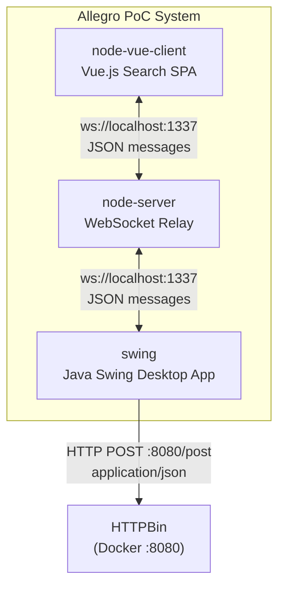

### 5.2 Level 2 — Container View

#### 5.2.1 `node-vue-client` — Vue.js Search SPA

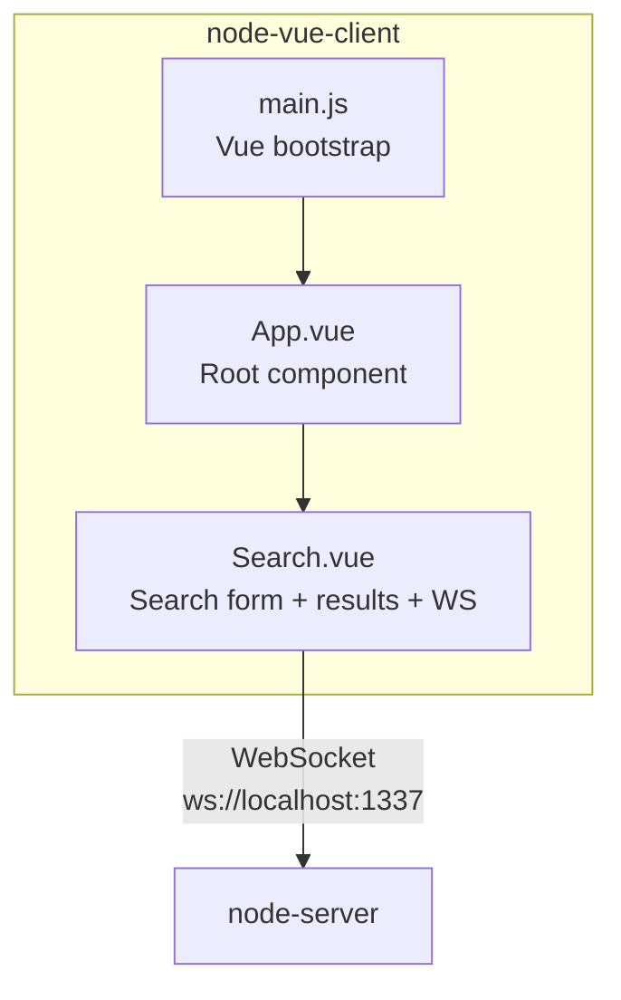

| Component | Responsibility |
|-----------|---------------|
| `main.js` | Bootstraps Vue 2 application; mounts root instance to `#app` |
| `App.vue` | Root layout component; renders branded header and `<Search>` |
| `Search.vue` | All interactive logic: form data binding, in-memory search, result selection, Zahlungsempfänger selection, WebSocket connect/send |

#### 5.2.2 `node-server` — WebSocket Relay

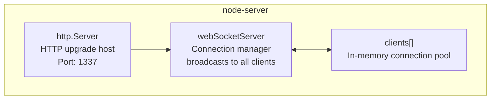

| Component | Responsibility |
|-----------|---------------|
| `http.Server` | Plain HTTP server (no routes); provides the socket for the WebSocket upgrade handshake |
| `webSocketServer` | Accepts connections; listens for `message` and `close` events; broadcasts each received UTF-8 message to **all** connected clients |
| `clients[]` | Global in-memory array of active WebSocket connections; updated on connect/disconnect |

#### 5.2.3 `swing` — Java Swing Desktop Application

The Swing module contains **two independent entry points** that coexist in the repository:

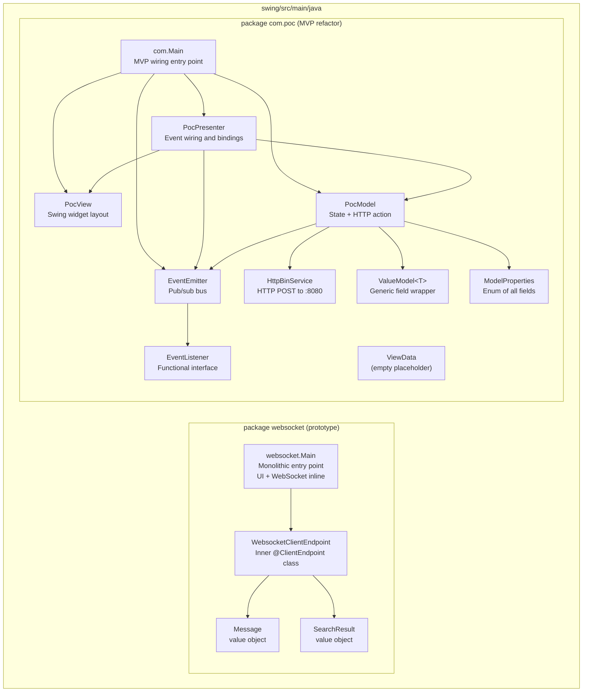

**MVP Package Responsibilities:**

| Class | Layer | Responsibility |
|-------|-------|---------------|
| `com.Main` | Bootstrap | Instantiates `PocView`, `EventEmitter`, `PocModel`, `PocPresenter`; holds `CountDownLatch` to keep JVM alive |
| `PocView` | View | Declares and lays out all Swing widgets using `GridBagLayout`; exposes widgets as `protected` fields |
| `PocPresenter` | Presenter | Subscribes to `EventEmitter`; adds `ActionListener` to submit button; calls `initializeBindings()` to wire each component to its `ValueModel` |
| `PocModel` | Model | Maintains `EnumMap<ModelProperties, ValueModel<?>>` state; `action()` serialises state to JSON and delegates to `HttpBinService`; emits response via `EventEmitter` |
| `HttpBinService` | Service | Opens `HttpURLConnection` to `http://localhost:8080/post`; writes JSON body using `javax.json` generator; reads and returns response body |
| `EventEmitter` | Infrastructure | Simple pub/sub with `List<EventListener>`; `subscribe()` registers; `emit(String)` fans out to all listeners |
| `EventListener` | Infrastructure | Single-method interface `onEvent(String)` — functionally equivalent to `Consumer<String>` |
| `ValueModel<T>` | Domain | Generic single-field wrapper with typed `getField()`/`setField()` |
| `ModelProperties` | Domain | Enum listing all form fields (see Section 8.1 for full mapping) |
| `ViewData` | Domain | Empty placeholder class — not yet used |

**Prototype Package (`websocket.Main`):**

| Class | Responsibility |
|-------|---------------|
| `websocket.Main` | Monolithic entry point: builds full Swing UI inline; connects to `ws://localhost:1337/` via Tyrus; deserialises incoming JSON and routes to UI fields or textarea |
| `WebsocketClientEndpoint` | Inner static `@ClientEndpoint` class; handles `@OnOpen`, `@OnClose`, `@OnMessage`; `onMessage` dispatches on `target` field |
| `Message` | Simple value object holding `target` and `content` strings |
| `SearchResult` | Value object with all person/payment fields; populated by `toSearchResult()` via streaming `javax.json` parser |

### 5.3 Level 3 — MVP Class Structure

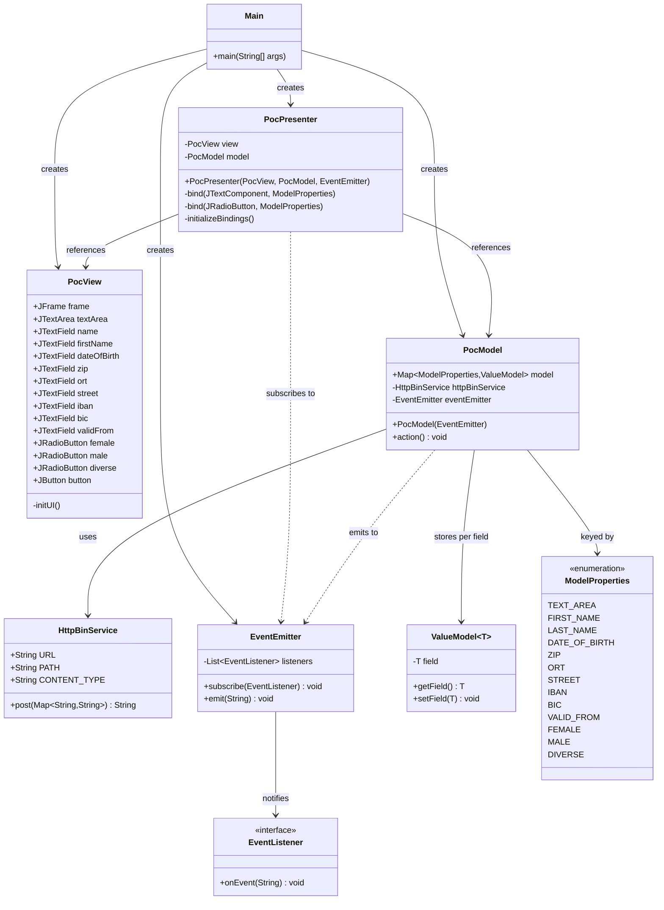

---

## 6. Runtime View

### 6.1 Scenario A — Person Search and Data Transfer to Swing (Primary Flow)

This is the primary end-to-end business workflow.

```mermaid
sequenceDiagram
    actor Clerk as Clerk (Browser)
    participant Vue as Search.vue
    participant WS as WebSocket Server (Node.js :1337)
    participant Swing as Swing App (websocket.Main)

    Clerk->>Vue: Types search criteria (name, ZIP, etc.)
    Vue->>Vue: searchPerson() — filters search_space[]
    Vue-->>Clerk: Displays matching persons in results table

    Clerk->>Vue: Clicks table row
    Vue->>Vue: selectResult(item)
    Vue-->>Clerk: Row highlighted; Zahlungsempfänger table populated

    Clerk->>Vue: Clicks Zahlungsempfänger row
    Vue->>Vue: zahlungsempfaengerSelected(item)
    Vue-->>Clerk: Payment row highlighted

    Clerk->>Vue: Clicks "Nach ALLEGRO übernehmen"
    Vue->>Vue: sendMessage(selected_result, 'textfield')
    Note over Vue: JSON: { target:"textfield",<br/>content:{person + zahlungsempfaenger} }
    Vue->>WS: socket.send(JSON)

    WS->>WS: Broadcast to all clients[]
    WS->>Swing: sendUTF(JSON)

    Swing->>Swing: @OnMessage onMessage(json)
    Swing->>Swing: extract(json) → Message{target:"textfield", content}
    Swing->>Swing: toSearchResult(content)
    Swing-->>Clerk: All form fields populated<br/>(name, first, DOB, ZIP, IBAN, BIC, …)
```

### 6.2 Scenario B — Free-Text Relay to Swing TextArea

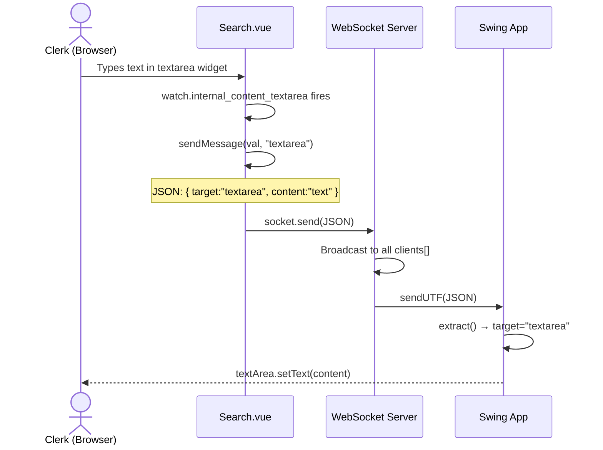

### 6.3 Scenario C — Form Submission from Swing MVP

```mermaid
sequenceDiagram
    actor User as User (Desktop)
    participant View as PocView
    participant Presenter as PocPresenter
    participant Model as PocModel
    participant HTTP as HttpBinService
    participant HTTPBin as HTTPBin (:8080)
    participant Emitter as EventEmitter

    User->>View: Fills form fields
    View->>Presenter: DocumentListener.insertUpdate / removeUpdate
    Presenter->>Model: model.get(prop).setField(content)

    User->>View: Clicks "Anordnen" button
    View->>Presenter: ActionListener fires
    Presenter->>Model: model.action()
    Model->>HTTP: post(data map)
    HTTP->>HTTPBin: HTTP POST /post  application/json
    HTTPBin-->>HTTP: 200 OK + echo JSON body
    HTTP-->>Model: responseBody (String)
    Model->>Emitter: eventEmitter.emit(responseBody)
    Emitter->>Presenter: EventListener.onEvent(responseBody)
    Presenter->>View: view.textArea.setText(responseBody)
    Presenter->>View: Clear all text fields; reset gender to Female
```

### 6.4 Scenario D — WebSocket Connection Lifecycle

```mermaid
sequenceDiagram
    participant VueClient as Search.vue
    participant SwingClient as Swing WebSocket Client
    participant Server as Node.js WS Server

    Note over VueClient: Vue mounted() lifecycle hook
    VueClient->>Server: new WebSocket("ws://localhost:1337/")
    Server-->>VueClient: Connection accepted; added to clients[]

    Note over SwingClient: Constructor invoked
    SwingClient->>Server: ContainerProvider.getWebSocketContainer().connectToServer()
    Server-->>SwingClient: @OnOpen callback fires
    SwingClient->>SwingClient: Store Session reference

    Note over Server: Both clients now in clients[]

    VueClient->>Server: socket.send(JSON)
    Server->>VueClient: sendUTF(JSON)  [broadcast]
    Server->>SwingClient: sendUTF(JSON)  [broadcast]

    Note over SwingClient: User closes Swing window (EXIT_ON_CLOSE)
    SwingClient->>Server: TCP close
    Server->>SwingClient: @OnClose callback
    SwingClient->>SwingClient: latch.countDown() → JVM may exit
    Server->>Server: clients.splice(index, 1)
```

---

## 7. Deployment View

### 7.1 Local Development Deployment

All components run on a single developer machine. The required startup order is:

```
1. Docker  (HTTPBin)
2. Node.js WS Server
3. Vue.js Dev Server
4. Java Swing Application
```

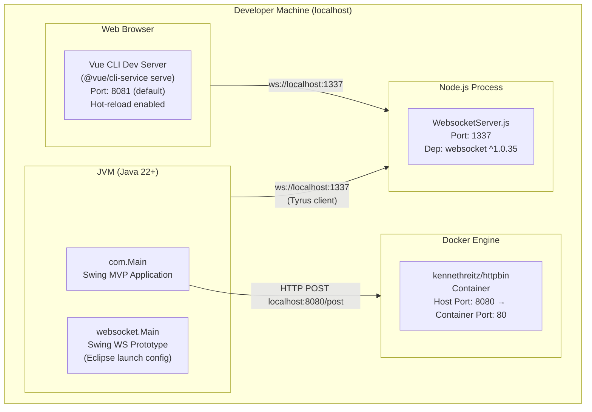

### 7.2 Component Startup Checklist

| Step | Command | Notes |
|------|---------|-------|
| 1 | `docker run -p 8080:80 kennethreitz/httpbin` | Must be running before Swing MVP performs an HTTP POST action |
| 2 | `cd node-server/src && node WebsocketServer.js` | Must be running before any WebSocket client attempts to connect |
| 3 | `cd node-vue-client && npm run serve` | Vue dev server; browser-accessible at `localhost:8081` |
| 4a | Run `com.Main` in IntelliJ | MVP Swing window; does **not** auto-connect to WebSocket in current state |
| 4b | Run `websocket.Main` in IntelliJ / Eclipse | Prototype Swing window; connects to WS server on startup |

### 7.3 Port Map

| Port | Protocol | Service |
|------|----------|---------|
| 1337 | WebSocket (WS) | Node.js WebSocket relay server |
| 8080 | HTTP | HTTPBin Docker container |
| 8081 | HTTP | Vue.js CLI development server (default) |

### 7.4 Deployment Constraints

- All ports are **localhost-only** — no TLS/WSS; suitable for local development only.
- The Vue.js client hardcodes `ws://localhost:1337/` — must be parameterised for any network deployment.
- `HttpBinService.java` hardcodes `http://localhost:8080` — same issue.
- No containerisation is provided for the Node.js server or the Swing app.
- No reverse proxy, load balancer, or service discovery is in scope.

---

## 8. Crosscutting Concepts

### 8.1 Domain Model

The implicit domain model captures an insured person with associated payment records. This model is distributed across Vue.js (mock data), the WebSocket JSON envelope, and the Swing form fields.

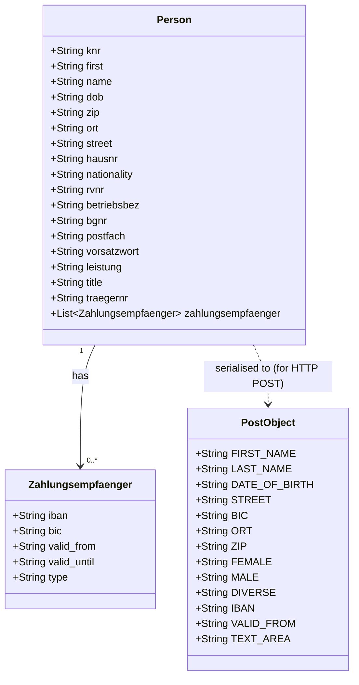

**Field alignment across components:**

| Vue.js key | `ModelProperties` enum | OpenAPI `PostObject` field |
|-----------|----------------------|--------------------------|
| `first` | `FIRST_NAME` | `FIRST_NAME` |
| `name` | `LAST_NAME` | `LAST_NAME` |
| `dob` | `DATE_OF_BIRTH` | `DATE_OF_BIRTH` |
| `zip` | `ZIP` | `ZIP` |
| `ort` | `ORT` | `ORT` |
| `street` | `STREET` | `STREET` |
| `iban` | `IBAN` | `IBAN` |
| `bic` | `BIC` | `BIC` |
| `valid_from` | `VALID_FROM` | `VALID_FROM` |
| *(radio buttons)* | `FEMALE` / `MALE` / `DIVERSE` | `FEMALE` / `MALE` / `DIVERSE` |
| *(textarea)* | `TEXT_AREA` | `TEXT_AREA` |

### 8.2 Communication Protocol

All WebSocket messages use the following JSON envelope:

```json
{
  "target": "<string>",
  "content": "<string or object>"
}
```

The HTTP API contract is specified in `api.yml` (OpenAPI 3.0.1):

```
POST http://localhost:8080/post
Content-Type: application/json

Request body:  { "user": { <PostObject fields> } }
Response 200:  { "postObject": { <PostObject fields> } }
```

### 8.3 Error Handling

| Location | Strategy | Status |
|----------|----------|--------|
| `PocPresenter` button listener | Wraps `IOException`/`InterruptedException` in `RuntimeException` | Crashes silently; no user feedback |
| `PocPresenter.bind()` DocumentListener | Wraps `BadLocationException` in `RuntimeException` | Very unlikely; no recovery |
| `HttpBinService.post()` | `throws IOException, InterruptedException` — propagated | Caller wraps; no retry |
| `websocket.Main` WebsocketClientEndpoint constructor | Throws `RuntimeException` wrapping Tyrus exceptions | Crashes on connection failure |
| `websocket.Main.onMessage()` | No exception handling on JSON parse | Malformed messages silently fail |
| `Search.vue connect()` | No `onerror` / `onclose` handler | Disconnects go undetected by the UI |
| `WebsocketServer.js` | Console logging only; no reconnect | Server failures require manual restart |

### 8.4 Logging and Monitoring

The system uses **`System.out.println`** (Java) and **`console.log`** (Node.js) exclusively — no structured logging framework is present.

| Component | Key Log Points |
|-----------|---------------|
| `WebsocketServer.js` | Server start, new connections (with origin), messages received, disconnections |
| `websocket.Main` | Button click, `@OnOpen` / `@OnClose` callbacks |
| `PocPresenter` | Every field insert/remove update with full document content |
| `PocModel` | HTTP response code and response body |

### 8.5 Concurrency

| Concern | Current Approach | Notes |
|---------|-----------------|-------|
| Keep JVM alive | `CountDownLatch(1)` with `latch.await()` on main thread | Both `com.Main` and `websocket.Main` use this pattern |
| JVM exit | `latch.countDown()` in `@OnClose` | JVM exits when the WebSocket connection closes |
| **Swing thread safety** | **Not implemented** | WebSocket `@OnMessage` callbacks update Swing components directly without `SwingUtilities.invokeLater()` — **this is a known defect** (see Section 11) |
| Node.js concurrency | Single-threaded event loop | No explicit concurrency handling needed |

### 8.6 Data Binding (MVP Architecture)

The `PocPresenter` implements a **push-based one-way binding** from View to Model using Swing's document/change listener APIs:

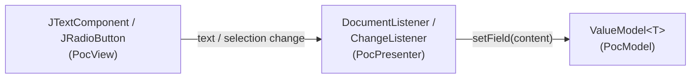

On `EventEmitter` callback (after HTTP POST response), the Presenter pushes data back into the View, clearing all fields:

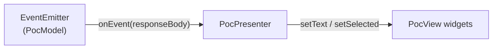

### 8.7 Security Concepts

| Concern | Current State | Production Requirement |
|---------|--------------|------------------------|
| Transport security | No TLS/WSS — all plaintext | WSS with TLS certificate |
| Authentication | None — all origins accepted (`request.accept(null, request.origin)`) | WebSocket handshake token validation |
| Input validation | None on received JSON or HTTP POST data | Schema validation before processing |
| CORS | No policy on Node.js HTTP server | Restrict to known origins |
| Sensitive data in transit | IBAN and BIC transmitted in plaintext JSON | Encryption in transit |

> All security gaps are acceptable for a local PoC but are blocking issues before any production deployment.

---

## 9. Architectural Decisions

### ADR-001: MVP Pattern for Swing GUI

**Status:** Implemented (observed in `com.poc.*`)

**Context:**  
The original prototype (`websocket.Main`) mixed UI layout, WebSocket connection management, JSON parsing, and domain logic in a single 450-line class. This makes testing, extension, and maintenance difficult.

**Decision:**  
A separate MVP-structured implementation was created in `com.poc.*`. `PocView` contains only Swing widget declarations, `PocPresenter` handles all event wiring, and `PocModel` owns state and side effects.

**Positive Consequences:**
- Clear separation of concerns; `PocModel` and `PocPresenter` are individually testable
- New fields can be added by extending `ModelProperties` enum and calling `bind()`

**Negative Consequences:**
- Two entry points (`websocket.Main` and `com.Main`) coexist, creating confusion
- `PocView` exposes widgets as `protected` fields rather than through an interface, limiting mockability

---

### ADR-002: Generic `ValueModel<T>` for Field State

**Status:** Implemented

**Context:**  
Form fields include both `String` typed text inputs and `Boolean` typed radio buttons. A uniform container is needed to store both in the same map.

**Decision:**  
`ValueModel<T>` is a generic single-field wrapper. `PocModel` stores `ValueModel<String>` and `ValueModel<Boolean>` in an `EnumMap<ModelProperties, ValueModel<?>>`. Unchecked casts are used at binding sites in `PocPresenter`.

**Consequences:**
- (+) Single consistent API for all field types; `EnumMap` gives fast, type-safe key access
- (-) Unchecked casts `(ValueModel<String>)` and `(ValueModel<Boolean>)` eliminate compile-time type safety at binding sites

---

### ADR-003: Node.js as Stateless Broadcast Relay

**Status:** Implemented

**Context:**  
Vue.js (browser) and Java Swing (JVM) cannot communicate directly. A relay is needed.

**Decision:**  
A minimal Node.js WebSocket server acts as a pure broadcast relay. Every received message is forwarded to **all** connected clients without filtering, routing, or persistence.

**Consequences:**
- (+) Zero configuration; no database or message broker required
- (+) 68 lines; trivial to understand and modify
- (-) All clients receive every message — they must inspect `target` to decide whether to act
- (-) A Swing client would receive its own messages if it ever sent any
- (-) Not scalable beyond single-host demonstration

---

### ADR-004: Dual Entry Points (Prototype + MVP)

**Status:** Implemented (by omission — original prototype not deleted)

**Context:**  
During PoC evolution the monolithic `websocket.Main` was not deleted when the MVP refactor was introduced.

**Decision:**  
Both entry points are retained. `websocket.Main` is the runnable WebSocket client targeted by the Eclipse launch configuration; `com.Main` demonstrates the MVP pattern.

**Consequences:**
- (+) Both approaches available for comparison and reference
- (-) `PocView.initUI()` duplicates `websocket.Main.initUI()` — two UI layout implementations to maintain
- (-) Risk of confusion over which entry point to use
- (-) `com.Main` does **not** connect to the WebSocket server — the MVP refactor is incomplete

---

### ADR-005: `javax.json` Streaming Parser for JSON

**Status:** Implemented

**Context:**  
The project uses `javax.json-api`; the choice is between object binding (`JsonObject`) or streaming (`JsonParser`).

**Decision:**  
Manual streaming parser loops with boolean flag state machines are used in `websocket.Main.extract()` and `toSearchResult()`.

**Consequences:**
- (+) No additional runtime dependency
- (-) ~80 lines of verbose, fragile code for a task that `JsonObject.getString("key")` handles in one line
- (-) Boolean flag state machine does not handle out-of-order keys or nested objects correctly

---

### ADR-006: HTTPBin as Mock Backend

**Status:** Implemented

**Context:**  
The PoC needs an HTTP endpoint to test form submission without implementing a real backend.

**Decision:**  
The `kennethreitz/httpbin` Docker image is used as an echo server. The `POST /post` endpoint returns submitted JSON verbatim, allowing the Swing form to display echoed data in the textarea.

**Consequences:**
- (+) Zero backend code; response is predictable (echo) — easy to verify correct serialisation
- (-) Docker must be running; adds a startup prerequisite
- (-) Not representative of a real Allegro backend; response shape differs from OpenAPI spec

---

## 10. Quality Requirements

### 10.1 Quality Tree

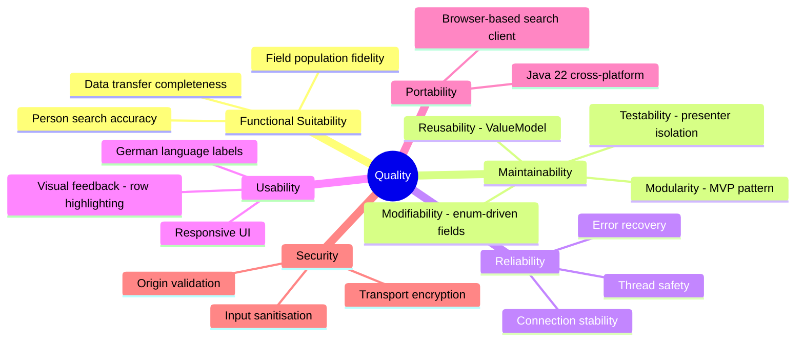

### 10.2 Quality Scenarios

| ID | Quality Attribute | Stimulus | Response | Measure |
|----|------------------|----------|----------|---------|
| QS-01 | Functional Suitability | Clerk searches by last name "Mayer" | Matching persons appear in results table | All matching records returned within 100 ms (client-side filter) |
| QS-02 | Functional Suitability | Clerk clicks "Nach ALLEGRO übernehmen" | All 10 person/payment fields populated in Swing | 100% field population; no data loss |
| QS-03 | Maintainability | Developer adds a new form field | Add `ModelProperties` constant + `ValueModel` + `bind()` call | Change isolated to 3 files; no structural refactoring required |
| QS-04 | Reliability | WebSocket connection drops mid-session | UI indicates disconnected state; user can reconnect | **Not currently implemented** — reconnect logic must be added |
| QS-05 | Thread Safety | WebSocket message arrives on non-EDT thread | Swing components updated safely | **Not currently addressed** — `SwingUtilities.invokeLater()` required |
| QS-06 | Usability | Clerk selects row in results table | Row highlighted blue; Zahlungsempfänger table updates | Visual feedback immediate (Vue reactive binding) |
| QS-07 | Security | External client connects to WS server | Connection accepted only after authentication | **Not implemented** — all origins currently accepted |
| QS-08 | Portability | Application run on macOS vs Windows | Identical behaviour | Java + Node.js cross-platform; no OS-specific code detected |

---

## 11. Risks and Technical Debt

### 11.1 Technical Risks

| ID | Risk | Probability | Impact | Mitigation |
|----|------|-------------|--------|------------|
| R-01 | **Swing EDT thread safety violation** | High | High | WebSocket `@OnMessage` callbacks run on Tyrus threads and directly mutate Swing components. Can cause intermittent UI corruption or deadlocks | Wrap all Swing mutations in `SwingUtilities.invokeLater()` |
| R-02 | **Hardcoded localhost URLs** | High | Medium | `ws://localhost:1337` and `http://localhost:8080` are hardcoded; deployment to any other host fails silently | Externalise to config file or environment variables |
| R-03 | **No WebSocket error/reconnect handling in Vue client** | High | Medium | `Search.vue.connect()` has no `onerror` or `onclose` handler; user is unaware of disconnection | Add `socket.onerror` and `socket.onclose` with visible status indicator |
| R-04 | **Fragile boolean-flag JSON parser** | Medium | Medium | `websocket.Main.extract()` / `toSearchResult()` are brittle boolean state machines; silently misparsing re-ordered or nested JSON | Replace with `JsonObject`-based or Jackson parsing |
| R-05 | **No automated tests** | High | High | Zero test coverage across all components; regressions undetectable | Introduce JUnit 5 for presenter/model; Vue Test Utils for components |
| R-06 | **MVP entry point (`com.Main`) not WebSocket-connected** | High | Medium | The MVP refactor has no Tyrus integration — it cannot receive data from Vue.js via WebSocket | Integrate `WebsocketClientEndpoint` into the MVP architecture |
| R-07 | **Universal broadcast** | Low | Low | Node.js server broadcasts to all clients including sender; Swing receiving its own messages if it sends any | Add target-based routing if needed |

### 11.2 Technical Debt

| ID | Type | Location | Description | Priority | Est. Effort |
|----|------|----------|-------------|----------|------------|
| TD-01 | Design debt | `websocket.Main` | Monolithic class mixing UI, WebSocket, and JSON — superseded by MVP but not removed | Medium | 2 h |
| TD-02 | Code debt | `websocket.Main.extract()` / `toSearchResult()` | Boolean-flag streaming JSON parser — verbose and fragile | High | 4 h |
| TD-03 | Code debt | `PocPresenter.bind()` | Unchecked casts `(ValueModel<String>)` / `(ValueModel<Boolean>)` — no compile-time safety | Low | 1 h |
| TD-04 | Design debt | `PocView` | Widgets exposed as `protected` fields; no `IPocView` interface; prevents mocking in unit tests | Medium | 3 h |
| TD-05 | Code debt | `ViewData.java` | Empty placeholder class with no purpose | Low | 0.5 h |
| TD-06 | Code debt | `PocView.initUI()` | `panel.add(textArea)` called twice (duplicate widget add) | Low | 0.25 h |
| TD-07 | Code debt | `websocket.Main.initUI()` | Exact duplicate of `PocView.initUI()` — two diverging UI layout implementations | Medium | 2 h |
| TD-08 | Infrastructure debt | All components | Zero automated tests (unit, integration, e2e) | Critical | 16 h+ |
| TD-09 | Infrastructure debt | All components | No CI/CD pipeline (no GitHub Actions workflow) | High | 4 h |
| TD-10 | Configuration debt | `HttpBinService.java`, `Search.vue`, `websocket.Main` | Hardcoded `localhost` URLs and ports | High | 2 h |
| TD-11 | Code debt | `Search.vue` | In-memory mock `search_space` array hardcoded inside Vue component data | Medium | 4 h |

### 11.3 Improvement Recommendations

1. **Complete the MVP WebSocket integration** — Wire a `WebsocketClientEndpoint` (or equivalent) into `PocPresenter` so incoming WS messages trigger `EventEmitter.emit()`, making `com.Main` the single canonical entry point.

2. **Fix Swing EDT safety** — Replace all direct Swing mutations in async callbacks with `SwingUtilities.invokeLater(() -> { … })`.

3. **Establish a test suite** — `PocModel.action()` and `PocPresenter` binding logic are prime JUnit 5 candidates with a mocked `HttpBinService` and an `IPocView` interface.

4. **Externalise configuration** — Use `application.properties` (loaded via `Properties.load()`) or environment variables for all hardcoded URLs and ports.

5. **Improve error UX** — Show WebSocket connection status in the Vue.js header; show a `JOptionPane` dialog in Swing on HTTP POST failure instead of a silent `RuntimeException`.

6. **Replace streaming JSON parser** — Use `JsonObject obj = Json.createReader(new StringReader(json)).readObject(); obj.getString("target")` for far simpler, robust field extraction.

7. **Add Vue reconnect logic** — Implement `socket.onclose = () => { setTimeout(connect, 3000); }` and a visible connection status badge.

8. **Delete dead code** — Remove `ViewData.java`; merge or delete `websocket.Main` once the MVP path covers all its functionality.

---

## 12. Glossary

### 12.1 Domain Terms (German / Allegro context)

| Term | Definition |
|------|------------|
| **Allegro** | The legacy desktop application this PoC modernises or interfaces with (name used as the Swing window title) |
| **Vorname** | German: First name (`FIRST_NAME`) |
| **Name** | German: Last / family name (`LAST_NAME`) |
| **Geburtsdatum** | German: Date of birth (`DATE_OF_BIRTH`) |
| **Geschlecht** | German: Gender; options are Weiblich (female), Männlich (male), Divers (non-binary) |
| **Strasse** | German: Street name |
| **PLZ** | Postleitzahl — German postal/ZIP code |
| **Ort** | German: City / town |
| **Hausnummer** | German: House number |
| **IBAN** | International Bank Account Number |
| **BIC** | Bank Identifier Code (SWIFT code) |
| **Gültig ab** | German: Valid from — payment record validity start date |
| **Zahlungsempfänger / Zahlungsempfaenger** | German: Payee / payment recipient; a bank account record linked to a person |
| **Kundennummer (knr)** | German: Customer number — unique person identifier in the Allegro system |
| **RV-Nummer** | Rentenversicherungsnummer — German pension insurance number |
| **Betriebsbez.** | Betriebsbezeichnung — company or operation name |
| **BG-Nummer** | Berufsgenossenschaft-Nummer — occupational association number |
| **Träger-Nr.** | Carrier number of the shared employment agency (gemeinsame Einrichtung) |
| **Postfach** | PO Box |
| **Vorsatzwort** | Name prefix (e.g. "von", "van") |
| **Leistung** | German: Benefit or service type |
| **RT** | Label for `JTextArea` in the Swing form; likely "Rückmeldung" (feedback/response) |
| **Anordnen** | German: "Arrange / Submit" — the button that triggers the HTTP POST to HTTPBin |
| **Nach ALLEGRO übernehmen** | German: "Transfer to ALLEGRO" — the Vue.js button that sends selected data via WebSocket to the Swing form |
| **Suchen** | German: "Search" — the Vue.js button that triggers client-side person filtering |

### 12.2 Technical Terms

| Term | Definition |
|------|------------|
| **MVP** | Model-View-Presenter — UI architectural pattern where the Presenter mediates between View and Model; used in `com.poc.*` |
| **WebSocket** | Full-duplex communication protocol over a single TCP connection (RFC 6455); used for real-time messaging between Vue.js, Node.js server, and Java Swing |
| **Tyrus** | GlassFish reference implementation of JSR-356 (`javax.websocket`); the Java WebSocket client library |
| **javax.websocket** | Java API for WebSocket (JSR-356); standard Java EE / Jakarta EE specification |
| **javax.json** | Java API for JSON Processing (JSR-374); used for streaming JSON parsing and generation |
| **EventEmitter** | Custom pub/sub component in `com.poc.model`; decouples `PocModel` response handling from `PocPresenter` |
| **EventListener** | Functional interface in `com.poc.model`; the `onEvent(String)` callback contract |
| **ValueModel\<T\>** | Generic wrapper class holding a single typed field value; the value type in `PocModel`'s `EnumMap` |
| **ModelProperties** | Java `enum` listing all form fields; canonical registry shared across View, Presenter, and Model |
| **EnumMap** | `java.util.EnumMap` — high-performance map implementation optimised for enum keys |
| **CountDownLatch** | `java.util.concurrent.CountDownLatch` — synchronisation primitive keeping the Swing main thread alive until WebSocket closes |
| **SFC** | Single-File Component — Vue.js `.vue` file format combining `<template>`, `<script>`, and `<style>` |
| **GridBagLayout** | Java Swing layout manager used in `PocView` and `websocket.Main` for multi-column form field placement |
| **HTTPBin** | Open-source HTTP testing service (`kennethreitz/httpbin`); used as a mock echo backend |
| **OpenAPI** | Specification format (formerly Swagger) for describing REST APIs; `api.yml` uses version 3.0.1 |
| **EDT** | Event Dispatch Thread — the single Swing thread responsible for all UI updates; direct mutation from other threads is unsafe |
| **PoC** | Proof of Concept — a prototype to validate technical feasibility |
| **Vue CLI** | Command-line toolchain for Vue.js scaffolding and builds (`@vue/cli-service`) |
| **v-model** | Vue.js directive for two-way data binding between form inputs and component data properties |
| **DocumentListener** | Swing interface (`javax.swing.event.DocumentListener`) notified on text document changes; used in `PocPresenter` to keep `ValueModel` in sync |
| **@ClientEndpoint** | `javax.websocket` annotation marking a POJO as a WebSocket client endpoint class |
| **@OnOpen / @OnClose / @OnMessage** | `javax.websocket` lifecycle annotations on callback methods in a `@ClientEndpoint` |

---

## Appendix

### A. Repository File Inventory

| Module | File Path | Language | Purpose |
|--------|-----------|----------|---------|
| Swing MVP | `swing/src/main/java/com/Main.java` | Java | MVP bootstrap entry point |
| Swing MVP | `swing/src/main/java/com/poc/ValueModel.java` | Java | Generic field wrapper |
| Swing MVP | `swing/src/main/java/com/poc/model/PocModel.java` | Java | Application model + HTTP action |
| Swing MVP | `swing/src/main/java/com/poc/model/HttpBinService.java` | Java | HTTP POST service |
| Swing MVP | `swing/src/main/java/com/poc/model/EventEmitter.java` | Java | Pub/sub event bus |
| Swing MVP | `swing/src/main/java/com/poc/model/EventListener.java` | Java | Event callback interface |
| Swing MVP | `swing/src/main/java/com/poc/model/ModelProperties.java` | Java | Field key enum |
| Swing MVP | `swing/src/main/java/com/poc/model/ViewData.java` | Java | Placeholder (unused) |
| Swing MVP | `swing/src/main/java/com/poc/presentation/PocView.java` | Java | Swing widget layout |
| Swing MVP | `swing/src/main/java/com/poc/presentation/PocPresenter.java` | Java | Presenter + bindings |
| Swing WS | `swing/src/main/java/websocket/Main.java` | Java | Monolithic WS + UI entry point |
| WebSocket Server | `node-server/src/WebsocketServer.js` | JavaScript | Broadcast relay server |
| WebSocket Server | `node-server/package.json` | JSON | npm dependency declaration |
| Vue.js Client | `node-vue-client/src/main.js` | JavaScript | Vue 2 bootstrap |
| Vue.js Client | `node-vue-client/src/App.vue` | Vue SFC | Root layout component |
| Vue.js Client | `node-vue-client/src/components/Search.vue` | Vue SFC | Search form + WebSocket integration |
| Vue.js Client | `node-vue-client/package.json` | JSON | npm dependencies + ESLint config |
| Vue.js Client | `node-vue-client/babel.config.js` | JavaScript | Babel preset |
| Vue.js Client | `node-vue-client/public/index.html` | HTML | SPA entry HTML |
| Build | `pom.xml` | XML | Maven build configuration |
| API Spec | `api.yml` | YAML | OpenAPI 3.0.1 spec for `/post` endpoint |
| IDE Config | `WebsocketSwingClient.launch` | XML | Eclipse launch config for `websocket.Main` |
| Docs | `README.md` | Markdown | Project setup guide |
| Docs | `swing/src/main/java/com/README.md` | Markdown | HTTPBin Docker startup reminder |
| Docs | `node-vue-client/doc/Readme.txt` | Text | Vue CLI setup notes |
| Docs | `node-server/doc/Readme.txt` | Text | Node.js WS server startup notes |

### B. Technology Version Summary

| Technology | Version | Role |
|-----------|---------|------|
| Java | ≥ 22.0.1 | Swing desktop application runtime |
| Maven | (any) | Java build and dependency management |
| GlassFish Tyrus standalone | 1.15 | Java WebSocket client implementation |
| javax.websocket API | 0.2 | WebSocket annotation API |
| javax.json API | 1.1.4 | JSON processing API |
| org.glassfish javax.json | 1.0.4 | JSON processing implementation |
| Node.js | (any LTS) | WebSocket relay server runtime |
| websocket (npm) | ^1.0.35 | Node.js WebSocket protocol implementation |
| Vue.js | ^2.6.10 | Frontend SPA framework |
| @vue/cli-service | ^4.0.0 | Vue build toolchain |
| core-js | ^3.1.2 | JavaScript polyfills |
| Docker | (any) | HTTPBin container runtime |
| HTTPBin (`kennethreitz/httpbin`) | latest | Mock HTTP echo backend |

### C. OpenAPI Specification Summary (`api.yml`)

| Property | Value |
|---------|-------|
| Title | Allegro PoC |
| Spec Version | OpenAPI 3.0.1 |
| API Version | 1.0.0 |
| Base URL | `http://localhost:8080` |
| Endpoint | `POST /post` |
| Operation ID | `Post` |
| Tag | Post |
| Request Content-Type | `application/json` |
| Request Body Schema | `{ "user": { <PostObject> } }` |
| Response 200 Schema | `{ "postObject": { <PostObject> } }` |
| PostObject fields | `FIRST_NAME`, `LAST_NAME`, `DATE_OF_BIRTH`, `STREET`, `BIC`, `ORT`, `ZIP`, `FEMALE`, `MALE`, `DIVERSE`, `IBAN`, `VALID_FROM`, `TEXT_AREA` |

### D. Startup Dependency Graph

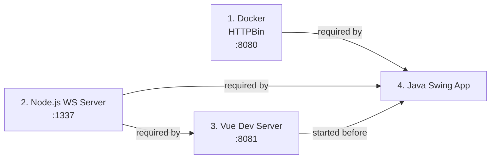

---

*This document was automatically generated from direct source-code analysis.*  
*Files analysed: 10 Java source files, 3 Vue/JavaScript source files, 1 OpenAPI YAML specification, 1 Maven POM, 4 documentation files.*  
*Arc42 sections completed: 12/12 | Mermaid diagrams included: 17*
