# Architecture Documentation: ERPApp — Allegro Modernization PoC

**Version:** 1.0  
**Date:** 2025-07-14  
**Status:** Final  
**Prepared by:** GenInsights All-in-One Analysis Agent  
**Repository:** `test-custom-agents-2` / `websocket_swing`

---

## Table of Contents

1. [Introduction and Goals](#1-introduction-and-goals)
2. [Architecture Constraints](#2-architecture-constraints)
3. [System Scope and Context](#3-system-scope-and-context)
4. [Solution Strategy](#4-solution-strategy)
5. [Building Block View](#5-building-block-view)
6. [Runtime View](#6-runtime-view)
7. [Deployment View](#7-deployment-view)
8. [Crosscutting Concepts](#8-crosscutting-concepts)
9. [Architecture Decisions](#9-architecture-decisions)
10. [Quality Requirements](#10-quality-requirements)
11. [Risks and Technical Debt](#11-risks-and-technical-debt)
12. [Glossary](#12-glossary)

---

## 1. Introduction and Goals

### 1.1 Requirements Overview

The **ERPApp / Allegro Modernization PoC** is a proof-of-concept project that demonstrates a multi-client integration architecture for modernizing the **Allegro ERP system**. The system enables a modern Vue.js web browser client to search for customer records and transmit selected data to a legacy Java Swing desktop client (Allegro) in real-time through a WebSocket relay server.

The project also contains a separate, more architecturally refined MVP variant of the Swing client (`com.poc`) that demonstrates how the Swing UI can submit structured form data to a REST API backend.

**Primary Goal:**  
Enable seamless real-time data transfer between a modern web-based search interface and the legacy Allegro ERP desktop application, bridging new and old client technologies without modifying the legacy system directly.

**Key Features:**
- Person/customer search with multi-field partial text matching (name, first name, ZIP code, city, street, house number)
- Payment recipient (Zahlungsempfänger) selection displaying IBAN/BIC/validity date
- One-click data transfer from the web client to the Allegro Swing client via WebSocket
- Dual-target WebSocket messaging: `textfield` (structured person data) and `textarea` (free text)
- Real-time broadcast relay — all connected clients receive every message
- Structured form data submission from the MVP Swing client to a REST API endpoint
- MVP (Model-View-Presenter) pattern implementation in the refined Swing client
- Event-driven architecture within the MVP Swing client (EventEmitter/EventListener)
- OpenAPI 3.0.1 specification for the REST API (`/post` endpoint)

### 1.2 Quality Goals

| Priority | Quality Goal | Scenario / Measure |
|----------|--------------|--------------------|
| 1 | **Interoperability** | Vue.js web client and Java Swing desktop client communicate transparently via WebSocket; data transfers in < 200 ms on local network |
| 2 | **Demonstrability** | PoC can be launched with 3 simple commands (npm start, node server, java Main); zero external cloud dependencies for the demo |
| 3 | **Maintainability** | MVP Swing client follows clean separation (Model/View/Presenter) so UI and business logic can evolve independently |
| 4 | **Simplicity** | Minimal dependencies; single-file server; in-memory mock data enables demo without a real database |
| 5 | **Extensibility** | OpenAPI spec and WebSocket protocol enable future replacement of any tier without changing others |

### 1.3 Stakeholders

| Role | Name / Group | Expectations |
|------|--------------|--------------|
| ERP Modernization Architect | Architecture team | See feasibility of a bridge between legacy Allegro Swing and modern web UI; assess migration path |
| Allegro ERP Developer | Development team | Understand how the existing Swing client can receive external data pushes without code changes to Allegro itself |
| Frontend Developer | Web team | Working example of Vue.js WebSocket integration with a real-time data transfer pattern |
| Product Owner | Business / PO | Demo of customer search and data-population use case to validate the concept before full investment |
| DevOps / Operations | Ops team | Understand deployment topology, port requirements, and startup procedure |

---

## 2. Architecture Constraints

### 2.1 Technical Constraints

| Constraint | Description |
|------------|-------------|
| **Java SDK ≥ 22.0.1** | The Maven Swing project (`pom.xml`) targets Java 22 source/target. Java 21 or lower will not compile due to use of unnamed variables (`var _`) introduced in Java 22. |
| **Node.js (LTS)** | The WebSocket server uses CommonJS `require()` and the `websocket` npm package v1.0.35. Any Node.js LTS ≥ 14 is compatible. |
| **Vue.js 2.x** | The web client uses Vue 2.6.10 with `vue-cli-service`. Migrating to Vue 3 requires component API changes. |
| **WebSocket Protocol (RFC 6455)** | All real-time communication between the three tiers uses raw WebSocket (`ws://`) over port 1337. No TLS in the PoC. |
| **HTTP REST on port 8080** | The MVP Swing client's `HttpBinService` and the `api.yml` spec both target `http://localhost:8080`. The PoC uses the `kennethreitz/httpbin` Docker container as a mock REST backend. |
| **Maven Build System** | The Swing project is managed by Maven (`pom.xml`). GlassFish Tyrus 1.15 is the WebSocket client runtime. |
| **In-Memory Mock Data** | The Vue.js `Search.vue` component stores 5 hardcoded customer records in the component's `data()`. No database or external API is consulted during search. |
| **Single-machine / localhost** | All three components communicate via `localhost`. No network topology or hostname resolution is required for the PoC. |

### 2.2 Organizational Constraints

| Constraint | Description |
|------------|-------------|
| **PoC Scope** | This is a proof-of-concept, not a production system. Features are intentionally incomplete (no authentication, no persistence, no error recovery). |
| **Docker Required** | The HTTPBin mock REST backend requires Docker Desktop or Rancher Desktop (`docker run -p 8080:80 kennethreitz/httpbin`). |
| **IntelliJ IDEA Recommended** | Project setup instructions in `README.md` are IntelliJ-specific (Module Content Root configuration, launch configurations in `WebsocketSwingClient.launch`). |
| **German Language Domain** | Field labels, variable names, and UI text are in German (Vorname, Ort, PLZ, Zahlungsempfänger). Domain knowledge requires German ERP context. |

### 2.3 Conventions

| Convention | Description |
|------------|-------------|
| **JSON Message Protocol** | WebSocket messages are JSON objects with two required fields: `{ target: "textfield" \| "textarea", content: <object\|string> }`. |
| **OpenAPI 3.0.1** | The REST API contract is documented in `api.yml` following the OpenAPI standard. |
| **MVP Pattern** | The `com.poc` Swing client strictly follows Model-View-Presenter: no business logic in `PocView`, no UI code in `PocModel`. |
| **EventEmitter Pattern** | Inter-layer communication in `com.poc` uses a custom `EventEmitter`/`EventListener` pair rather than Java's `PropertyChangeListener`. |
| **Package Naming** | `com.poc.model.*` — domain model; `com.poc.presentation.*` — UI layer; `websocket.*` — legacy WebSocket client. |

---

## 3. System Scope and Context

### 3.1 Business Context

The Allegro ERP system is a legacy Java Swing application. Business users need to look up customer records using modern, browser-based tooling but must populate the Allegro application fields — the authoritative system of record. This PoC validates that a lightweight WebSocket bridge can relay data from any modern client to the existing Allegro Swing desktop without modifying the Allegro source.

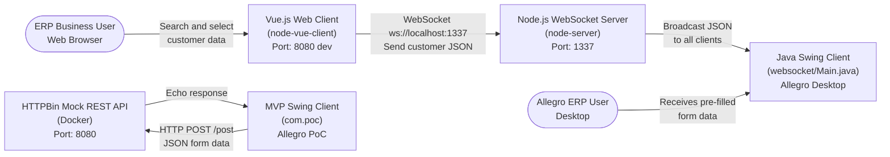

| Partner / Actor | Business Role | Data Exchanged |
|-----------------|---------------|----------------|
| **ERP Business User (Web)** | Searches for customers in the web browser | Person search criteria → selected customer record |
| **Allegro ERP User (Desktop)** | Receives populated form data in Allegro | Customer name, address, gender, IBAN/BIC |
| **HTTPBin Mock REST API** | Stands in for the real ERP REST backend | Form field key-value pairs (POST body), echoed response |

### 3.2 Technical Context

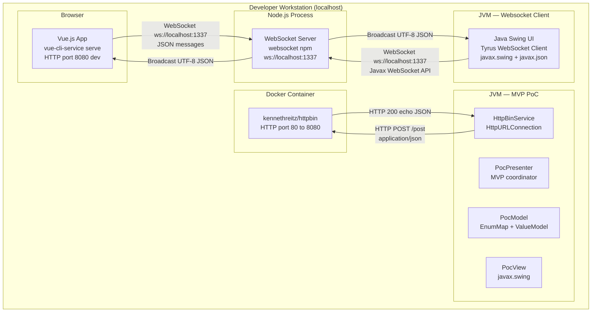

| Interface | Protocol | Transport | Port | Direction |
|-----------|----------|-----------|------|-----------|
| Vue.js ↔ WS Server | WebSocket (RFC 6455) | TCP | 1337 | Bidirectional |
| Swing ↔ WS Server | WebSocket (RFC 6455) | TCP | 1337 | Bidirectional (primarily receive) |
| MVP Swing → HTTPBin | HTTP/1.1 REST | TCP | 8080 | Outbound POST |
| Browser → Vue CLI Dev Server | HTTP/1.1 | TCP | 8080 | Inbound GET (dev) |

---

## 4. Solution Strategy

### 4.1 Technology Decisions

| Decision | Technology | Rationale |
|----------|------------|-----------|
| **Real-time communication bus** | Node.js WebSocket server (`websocket` npm) | Minimal footprint; single file; language-agnostic protocol; any client with WebSocket support can connect |
| **Web frontend** | Vue.js 2.x with vue-cli | Rapid PoC development; reactive data binding reduces boilerplate; widely known |
| **Legacy client** | Java Swing + Tyrus WebSocket | Allegro is already a Swing application; Tyrus provides JSR-356 (`javax.websocket`) compliance without a server container |
| **MVP pattern for PoC Swing** | Model-View-Presenter (custom) | Separates UI from domain logic; event-driven bindings allow the model to be replaced independently |
| **REST API mock** | HTTPBin Docker container | Zero backend code required; validates HTTP POST integration; OpenAPI spec documents the real API contract |
| **JSON processing** | javax.json (streaming parser) | No additional library dependency beyond what is available in GlassFish Tyrus; works on Java SE |

### 4.2 Architecture Approach

The PoC uses a **Hub-and-Spoke WebSocket broadcast architecture**:

- A single Node.js WebSocket server acts as the central hub
- Multiple heterogeneous clients (Vue.js browser, Java Swing desktop) connect as spokes
- Every message sent by any client is broadcast to **all** connected clients
- The receiving client filters messages by `target` field to decide how to process them

This approach enables **zero coupling between sender and receiver**: the Vue.js client does not know about the Swing client's existence, and vice versa. The WebSocket server is a pure relay with no business logic.

Alongside this, the `com.poc` module demonstrates a target **MVP architecture** for the refined Swing client, separating concerns into Model (data + service), View (Swing UI), and Presenter (binding + event handling).

### 4.3 Key Design Decisions

| Decision | Context | Consequence |
|----------|---------|-------------|
| **Broadcast all messages to all clients** | Simplest relay implementation; PoC only has 2-3 clients | ✅ Trivially simple server code. ❌ Scales poorly; requires client-side filtering by `target` field |
| **In-memory mock data in Vue.js** | No backend search API in scope for PoC | ✅ Zero infrastructure, instant demo. ❌ Data is hardcoded; must be replaced before production |
| **Two separate Swing client implementations** | `websocket/Main.java` (prototype) and `com.poc` (MVP refactor) coexist | ✅ Shows before/after architecture. ❌ Code duplication; `websocket/Main.java` should be retired |
| **Manual JSON streaming parser** | `websocket/Main.java` uses `javax.json.stream.JsonParser` with boolean flags | ✅ No extra library. ❌ Verbose, brittle, error-prone state machine |
| **Static Swing component fields** | `websocket/Main.java` uses `static` JTextField, JFrame etc. | ✅ Quick to write. ❌ Untestable, not thread-safe; `com.poc.PocView` corrects this |
| **CountDownLatch for lifecycle** | Both entry points use `CountDownLatch(1)` to prevent JVM exit | Functional but semantically incorrect; a proper lifecycle manager would be cleaner |

---

## 5. Building Block View

### 5.1 Level 1: System Overview

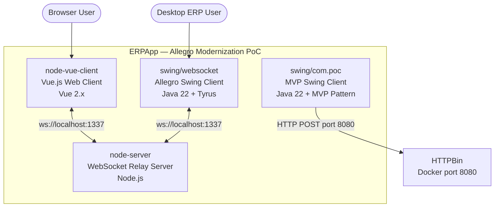

| Building Block | Language | Description |
|----------------|----------|-------------|
| **node-server** | Node.js / JavaScript | Central WebSocket broadcast server. Accepts all connections, relays all messages to all connected clients. Single file (`WebsocketServer.js`). |
| **node-vue-client** | Vue.js 2.x / JavaScript | Web-based customer search and selection UI. Connects to WS server. Sends selected customer data to Allegro. |
| **swing/websocket** | Java 22 / Swing | Original Allegro Swing prototype. Connects to WS server, receives JSON messages, populates form fields. |
| **swing/com.poc** | Java 22 / Swing + MVP | Architecturally clean MVP Swing client. Reads form fields, POSTs to REST API, displays response. |

### 5.2 Level 2: Component Details

#### node-server (WebSocket Relay Server)

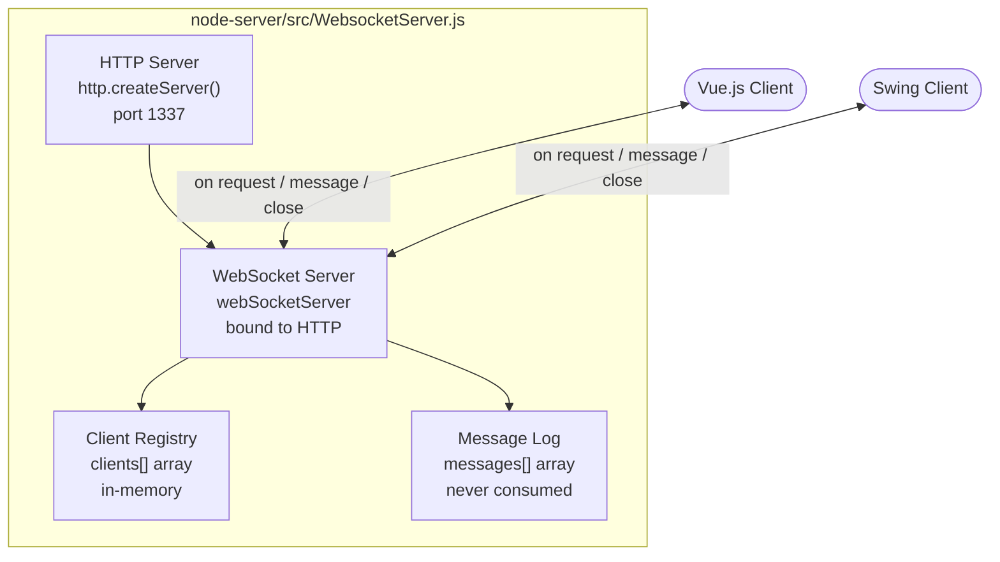

| Sub-component | Responsibility |
|---------------|----------------|
| HTTP Server | Underlying transport for WebSocket upgrade. Listens on port 1337. No HTTP routes implemented. |
| WebSocket Server | Manages connection lifecycle: `on('request')`, `on('message')`, `on('close')`. Broadcasts all UTF-8 messages. |
| Client Registry (`clients[]`) | In-memory array of active connections. Used for broadcast iteration. Index tracked for clean removal on disconnect. |
| Message Log (`messages[]`) | In-memory array of received messages. Populated but never consumed or cleared — memory leak for long-running sessions. |

#### node-vue-client (Vue.js Web Client)

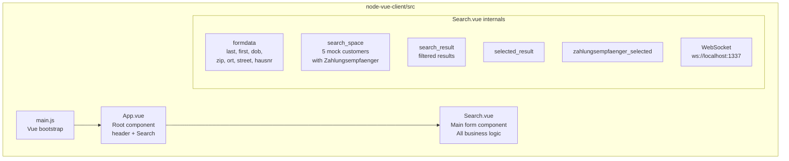

| Sub-component | Responsibility |
|---------------|----------------|
| `main.js` | Vue application bootstrap. Mounts `App` component to `#app` DOM element. |
| `App.vue` | Root layout. Renders the branded header (red, "Search Mock") and hosts the `<Search>` component. |
| `Search.vue` | All business logic: form rendering, client-side search, result tables, payment recipient selection, WebSocket management, data transmission. |
| `search_space[]` | In-memory mock dataset: 5 customers (Hans Mayer, Linda Reitmayr, Karl May, Jens Mueller, Steffi Ruckmueller) with nested Zahlungsempfänger arrays. |
| `selected_result{}` | The customer row clicked in the results table. Drives the Zahlungsempfänger sub-table. |
| `zahlungsempfaenger_selected` | The IBAN/BIC record selected from the payment recipients table. |

#### swing/websocket — Original Swing Client

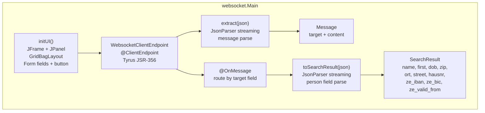

| Sub-component | Responsibility |
|---------------|----------------|
| `initUI()` | Builds the Swing JFrame with GridBagLayout: Vorname, Name, Geburtsdatum, Geschlecht (radio), Strasse, PLZ, Ort, IBAN, BIC, Gültig ab, textarea, Anordnen button. |
| `WebsocketClientEndpoint` | JSR-356 `@ClientEndpoint`. Connects to `ws://localhost:1337`. Handles `@OnOpen`, `@OnClose`, `@OnMessage` lifecycle. |
| `extract(json)` | Streaming JSON parser extracting `target` and `content` fields from a WebSocket message envelope. |
| `toSearchResult(json)` | Streaming JSON parser extracting all person and payment fields from the `content` payload. |
| `onMessage(json)` | Routes message: `textarea` → `textArea.setText()`, `textfield` → populate all form fields. |

#### swing/com.poc — MVP Swing Client

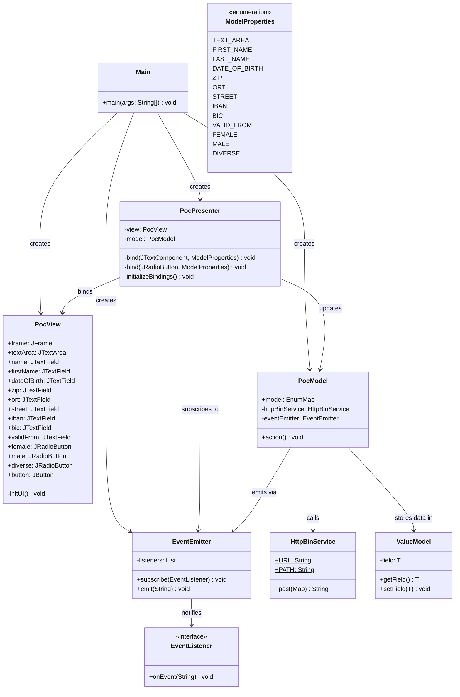

| Class | Layer | Responsibility |
|-------|-------|----------------|
| `Main` | Bootstrap | Creates and wires PocView, EventEmitter, PocModel, PocPresenter. Keeps JVM alive with CountDownLatch. |
| `PocView` | Presentation / View | Pure Swing UI. No business logic. Exposes all form components as `protected` fields for Presenter binding. |
| `PocModel` | Model | Holds all form field values as `ValueModel<T>` in an `EnumMap`. Triggers HTTP POST on `action()`. Emits result via EventEmitter. |
| `PocPresenter` | Presentation / Presenter | Wires DocumentListeners and ChangeListeners from View fields to Model ValueModels. Handles button action. Subscribes to EventEmitter to update View on response. |
| `EventEmitter` | Infrastructure | Publish-subscribe broker. Holds list of EventListeners. Calls `onEvent()` on each subscriber when `emit()` is called. |
| `EventListener` | Infrastructure | Functional interface for event subscribers. Single method: `onEvent(String eventData)`. |
| `HttpBinService` | Service / Infrastructure | HTTP client. POSTs a `Map<String,String>` as JSON to `http://localhost:8080/post`. Returns response body string. |
| `ValueModel<T>` | Model | Generic wrapper for a single typed field value. Decouples the Presenter binding from concrete field types. |
| `ModelProperties` | Model | Enum of all 13 form field keys. Used as type-safe keys in the PocModel `EnumMap`. |
| `ViewData` | Model | Empty stub — placeholder for a future DTO/view-model class (not yet implemented). |

### 5.3 Level 3: WebSocket Message Protocol

```mermaid
classDiagram
    class WebSocketMessage {
        +target: String
        +content: Object
    }
    class TextfieldContent {
        +name: String
        +first: String
        +dob: String
        +zip: String
        +ort: String
        +street: String
        +hausnr: String
        +knr: String
        +zahlungsempfaenger: ZahlungsempfaengerRecord
    }
    class ZahlungsempfaengerRecord {
        +iban: String
        +bic: String
        +valid_from: String
        +valid_until: String
        +type: String
    }
    WebSocketMessage --> TextfieldContent : target equals textfield
    WebSocketMessage --> "String (plain text)" : target equals textarea
    TextfieldContent --> ZahlungsempfaengerRecord : nested object
```

**Message format:**

```json
{
  "target": "textfield | textarea",
  "content": "<object for textfield, string for textarea>"
}
```

---

## 6. Runtime View

### 6.1 Scenario: Customer Search and Data Transfer to Allegro

The primary PoC use case — user searches for a customer in the browser and transfers the selected data to Allegro:

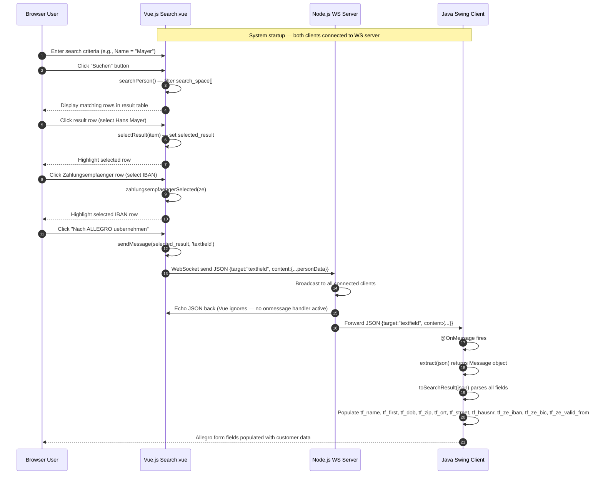

### 6.2 Scenario: Textarea Synchronization (Real-Time Text Push)

Free text typed in the Vue.js textarea is pushed to the Allegro text area in real time via the Vue.js `watch` mechanism:

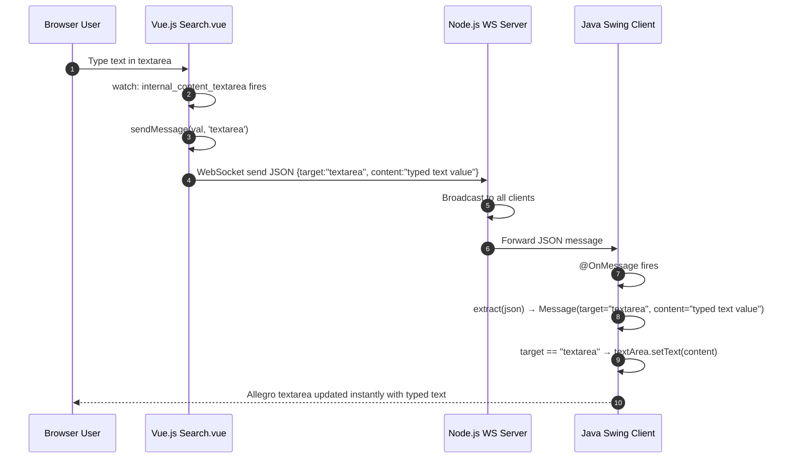

### 6.3 Scenario: MVP Swing Client — Form Submission

The MVP Swing client (`com.poc`) submits form data to the REST API and displays the response:

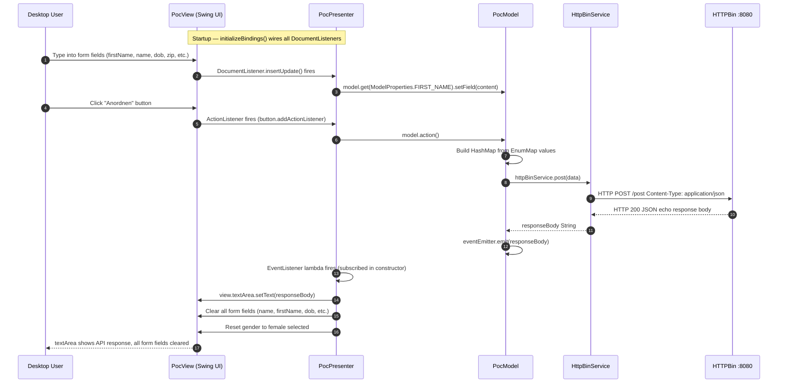

### 6.4 Scenario: WebSocket Connection Lifecycle

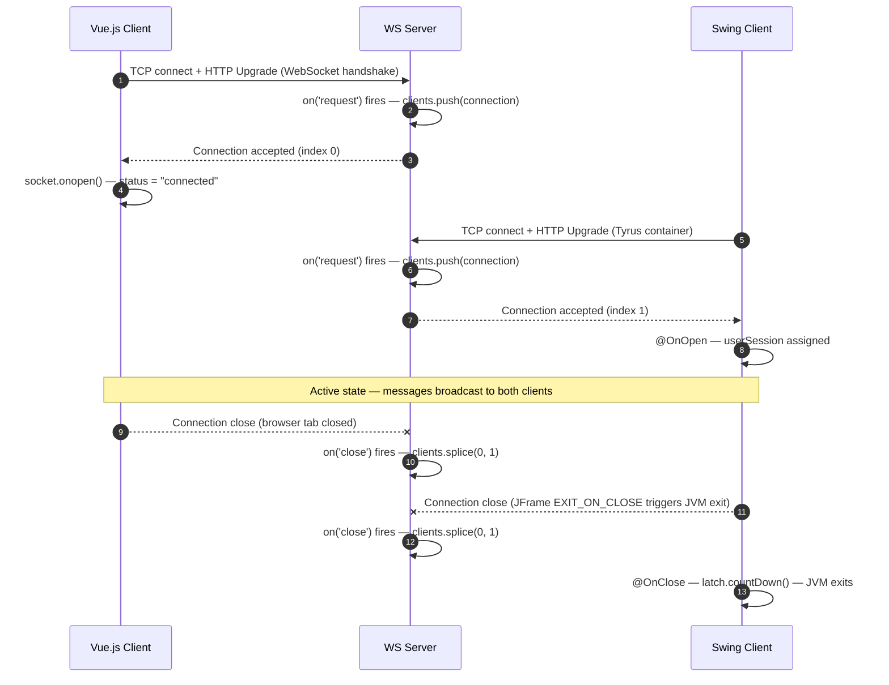

---

## 7. Deployment View

### 7.1 Local Development Infrastructure (PoC)

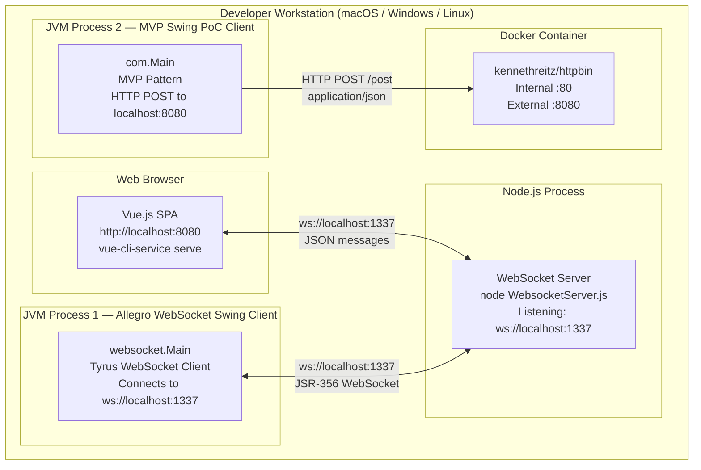

### 7.2 Startup Sequence

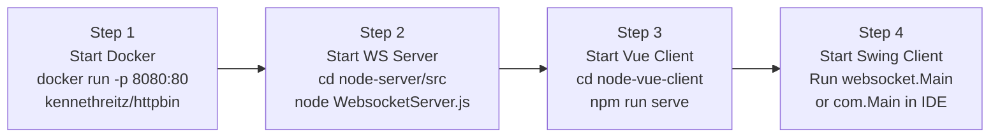

### 7.3 Deployment Mapping

| Component | Runtime | Host | Port | Start Command |
|-----------|---------|------|------|---------------|
| HTTPBin mock REST | Docker (`kennethreitz/httpbin`) | localhost | 8080 | `docker run -p 8080:80 kennethreitz/httpbin` |
| WebSocket Relay Server | Node.js (any LTS) | localhost | 1337 | `node WebsocketServer.js` |
| Vue.js Web Client | vue-cli-service (webpack dev) | localhost | 8080 | `npm run serve` (node-vue-client) |
| Allegro Swing Client | JVM ≥ 22 | localhost | — (WS client) | Run `websocket.Main` |
| MVP Swing Client | JVM ≥ 22 | localhost | — (HTTP client) | Run `com.Main` |

> ⚠️ **Port conflict note:** The Vue.js dev server and the HTTPBin Docker container both default to port 8080. They cannot run simultaneously unless the dev server port is changed (`vue.config.js` devServer port override).

### 7.4 Build Artifacts

| Artifact | Build Tool | Command | Output |
|----------|------------|---------|--------|
| Swing JAR | Maven 3.x + Java 22 | `mvn package` | `target/websocket_swing-0.0.1-SNAPSHOT.jar` |
| Vue.js production bundle | vue-cli / webpack | `npm run build` | `node-vue-client/dist/` |
| Node.js server | None (interpreted) | — | `node-server/src/WebsocketServer.js` run directly |

### 7.5 Dependencies

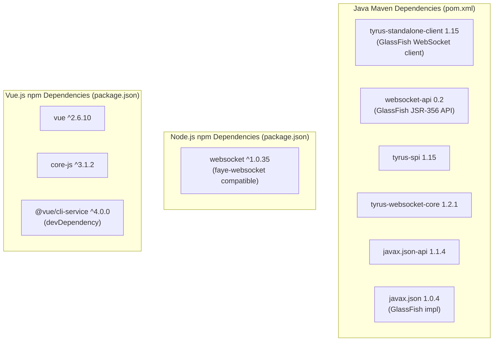

---

## 8. Crosscutting Concepts

### 8.1 Communication Protocol

**WebSocket Message Format (JSON)**

All WebSocket communication uses a consistent JSON envelope:

```json
{
  "target": "textfield | textarea",
  "content": "<string or object>"
}
```

- **`target = "textfield"`**: content is a JSON object with person and Zahlungsempfänger data
- **`target = "textarea"`**: content is a plain string value

**Broadcast Semantics:** Every message is delivered to every connected client, including the sender. Each client must handle messages targeted at itself and silently ignore others (the Vue.js client currently has `socket.onmessage` commented out; the Swing client routes by `target` field).

### 8.2 Data Model

The person/customer data model is consistent across all three tiers:

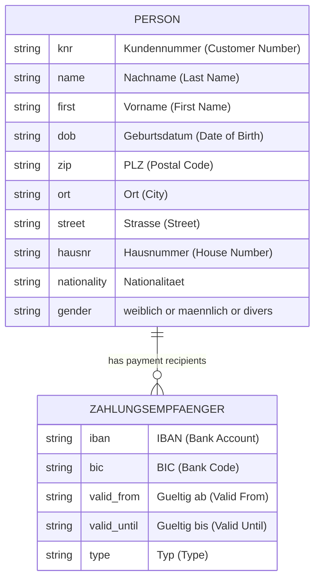

**REST API Schema (api.yml / OpenAPI 3.0.1):**

The `PostObject` schema in `api.yml` maps directly to the `ModelProperties` enum:

| OpenAPI Field | ModelProperties Enum | Java Type |
|---------------|---------------------|-----------|
| FIRST_NAME | FIRST_NAME | String |
| LAST_NAME | LAST_NAME | String |
| DATE_OF_BIRTH | DATE_OF_BIRTH | String |
| STREET | STREET | String |
| BIC | BIC | String |
| ORT | ORT | String |
| ZIP | ZIP | String |
| FEMALE | FEMALE | String (Boolean serialized) |
| MALE | MALE | String |
| DIVERSE | DIVERSE | String |
| IBAN | IBAN | String |
| VALID_FROM | VALID_FROM | String |
| TEXT_AREA | TEXT_AREA | String |

### 8.3 Error Handling

| Component | Error Handling Approach |
|-----------|------------------------|
| `WebsocketServer.js` | No explicit error handling. Unhandled exceptions crash the Node.js process. |
| `Search.vue` | No try/catch around WebSocket operations. `socket.onmessage` is commented out. |
| `websocket.Main` | Constructor wraps Tyrus exceptions in `RuntimeException`. `@OnClose` decrements latch. |
| `PocModel.action()` | Declares `throws IOException, InterruptedException`. `PocPresenter` re-throws as `RuntimeException`. No user-visible error feedback. |
| `HttpBinService.post()` | No retry logic. No timeout on `HttpURLConnection`. No error status code handling. |

**Assessment:** Error handling is minimal, appropriate for a PoC. Production needs: connection retry logic, user-visible error messages, server-side structured error logging, and circuit breakers.

### 8.4 Logging

| Component | Logging Approach |
|-----------|-----------------|
| `WebsocketServer.js` | `console.log()` with timestamps: server start, connection origin, accepted, message received, client disconnected. |
| `Search.vue` | No logging. |
| `websocket.Main` | `System.out.println()`: connect attempt, WebSocket open, close. |
| `PocPresenter` | `System.out.println()`: each DocumentListener insert/remove event and button click. |
| `HttpBinService` | `System.out.println()`: HTTP response code and body. |

**Assessment:** Console/stdout only. No structured logging, no log levels, no log aggregation. Must be replaced with SLF4J/Logback (Java) and a structured logger (Node.js) for production.

### 8.5 Security

| Concern | Current State | PoC Justification |
|---------|--------------|-------------------|
| **Authentication** | None. Any process connecting to port 1337 is accepted. | Localhost-only PoC |
| **Authorization** | None. All clients send any message. | Single-user demo |
| **Transport Encryption** | Plain `ws://`, no TLS. | Localhost; no sensitive data |
| **Input Validation** | None. Raw JSON forwarded without validation. | Mock data only |
| **CORS** | WS server accepts any `origin` (`request.accept(null, request.origin)`). | Localhost |

### 8.6 Configuration Management

All configuration is hardcoded:

| Parameter | Value | Location |
|-----------|-------|----------|
| WebSocket server port | `1337` | `WebsocketServer.js:5`, `Search.vue:connect()`, `websocket.Main:55` |
| REST API URL | `http://localhost:8080` | `HttpBinService.java:11`, `api.yml` servers |
| REST API path | `/post` | `HttpBinService.java:12`, `api.yml` paths |
| Vue.js WS endpoint | `ws://localhost:1337/` | `Search.vue:connect()` |
| Swing WS endpoint | `ws://localhost:1337/` | `websocket.Main:55` |

**Assessment:** No externalized configuration. All URLs are hardcoded for localhost — a critical gap for any production deployment.

### 8.7 Concurrency and Threading

| Component | Threading Model | Issues |
|-----------|----------------|--------|
| `WebsocketServer.js` | Single-threaded Node.js event loop. Safe for small client counts. | None for PoC |
| `Search.vue` | Single-threaded JavaScript browser event model. | None |
| `websocket.Main` | Main thread on `CountDownLatch.await()`. WebSocket callbacks on Tyrus worker thread calling `setText()` directly. | **EDT violation** — Swing updates not on EDT |
| `com.poc` | Main thread on `CountDownLatch.await()`. EDT handles UI events. `HttpBinService.post()` called synchronously from button ActionListener. | **EDT blocking** — HTTP call on UI thread freezes UI |

---

## 9. Architecture Decisions

### ADR-001: WebSocket as Real-Time Communication Bus

**Status:** Accepted  
**Date:** PoC inception

**Context:**  
The PoC must enable a modern web UI to push data to a legacy Java Swing desktop application in real time, without modifying the legacy application significantly.

**Decision:**  
Use WebSocket (RFC 6455) as the transport protocol with a central Node.js relay server. The Swing client acts as a WebSocket consumer. The Vue.js web client acts as the WebSocket producer.

**Consequences:**
- ✅ Language-agnostic protocol: any WebSocket-capable client can integrate
- ✅ Real-time bidirectional capability even if only one direction is used
- ✅ Minimal server implementation (~60 lines of Node.js)
- ✅ No polling overhead
- ❌ No message persistence: if Swing client is disconnected, messages are lost
- ❌ No authentication built into the protocol by default
- ❌ Broadcast to all clients requires client-side routing by `target` field

---

### ADR-002: Node.js for the WebSocket Relay Server

**Status:** Accepted  
**Date:** PoC inception

**Context:**  
A relay server is needed to bridge Vue.js (browser) and Java Swing (desktop) clients.

**Decision:**  
Use Node.js with the `websocket` npm package. Implement as a single file with no framework.

**Consequences:**
- ✅ Minimal code (~70 lines): rapid PoC development
- ✅ Node.js event loop handles concurrent connections efficiently for small numbers
- ✅ No compilation step; easy to restart
- ❌ In-memory `clients[]` array cannot scale horizontally without a message broker (Redis pub/sub etc.)
- ❌ No modularization: difficult to extend

---

### ADR-003: In-Memory Mock Data in Vue.js Component

**Status:** Accepted (PoC only)  
**Date:** PoC inception

**Context:**  
The PoC needs realistic customer data to demonstrate search and transfer without requiring a live ERP database.

**Decision:**  
Embed 5 hardcoded German customer records (with nested Zahlungsempfänger) directly in `Search.vue`'s `data()` function.

**Consequences:**
- ✅ Zero infrastructure dependencies for the web client
- ✅ Instant demo with realistic IBAN/BIC values and German field names
- ❌ Data is static; business data in the presentation component violates SoC
- ❌ Must be replaced with a real search API before production use

---

### ADR-004: Two Swing Client Implementations (Legacy Prototype + MVP Refactor)

**Status:** Accepted (intentional PoC design)  
**Date:** PoC refactoring phase

**Context:**  
The original `websocket/Main.java` was a quick prototype. A cleaner implementation was needed to demonstrate the target architecture.

**Decision:**  
Create a second `com.poc` package implementing MVP pattern, while keeping the original `websocket/Main.java` for WebSocket data reception demonstration.

**Consequences:**
- ✅ Clear before/after demonstration of architectural improvement
- ✅ `com.poc` shows the target MVP architecture for full modernization
- ❌ Code duplication: both have similar GridBagLayout Swing UI
- ❌ Two entry points creates confusion about which to run
- ❌ `websocket/Main.java` should be retired once `com.poc` is feature-complete

---

### ADR-005: Manual Streaming JSON Parser in websocket/Main.java

**Status:** Accepted (PoC expediency)  
**Date:** PoC inception

**Context:**  
`websocket/Main.java` needs JSON parsing using only `javax.json` (already on the classpath via Tyrus).

**Decision:**  
Use `javax.json.stream.JsonParser` with boolean flag state machine to extract specific fields.

**Consequences:**
- ✅ No additional library dependency
- ❌ Extremely verbose (10+ boolean flags for 10 fields)
- ❌ Fragile: does not correctly handle the nested `zahlungsempfaenger` array
- ❌ No type safety; all fields parsed as Strings
- 🔄 Should be replaced with Jackson or Gson in any production implementation

---

## 10. Quality Requirements

### 10.1 Quality Tree

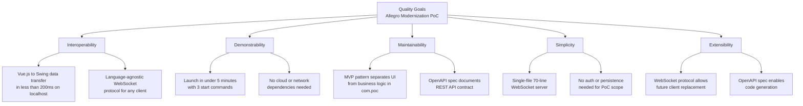

### 10.2 Quality Scenarios

| ID | Quality Goal | Stimulus | Response | Measure |
|----|-------------|----------|----------|---------|
| QS-1 | Interoperability | User clicks "Nach ALLEGRO übernehmen" | Customer data appears in Swing form fields | < 200ms on localhost |
| QS-2 | Interoperability | Textarea content changes in Vue.js | Same text appears in Swing textArea | < 200ms on localhost |
| QS-3 | Demonstrability | Developer follows README.md setup | All three tiers running and communicating | < 10 minutes from clone to working demo |
| QS-4 | Demonstrability | Vue.js client disconnects and reconnects | WS server continues serving remaining clients | No server restart required |
| QS-5 | Maintainability | New form field added to data model | Change isolated to: 1 enum + 1 model entry + 1 view field + 1 presenter binding | Maximum 4 file changes |
| QS-6 | Extensibility | Replace mock search with real REST API | Only `Search.vue` `searchPerson()` method changes | No WS server or Swing changes needed |
| QS-7 | Simplicity | Run the WS server | Single command: `node WebsocketServer.js` | Zero configuration required |

---

## 11. Risks and Technical Debt

### 11.1 Risks

| Risk ID | Risk | Probability | Impact | Mitigation Strategy |
|---------|------|-------------|--------|---------------------|
| R-001 | **No authentication on WebSocket server** — any process on the same machine can inject messages into Allegro | High (PoC has no auth) | Critical in production | Implement token-based WebSocket auth (JWT in URL param or first-message handshake) |
| R-002 | **Port 8080 conflict** — Vue.js dev server and HTTPBin Docker container both need port 8080 | High | Medium | Use different ports; externalize port configuration |
| R-003 | **Swing EDT thread-safety violation** in `websocket/Main.java` — `@OnMessage` directly calls `setText()` outside EDT | High | Medium (UI corruption possible) | Wrap all Swing updates in `SwingUtilities.invokeLater()` |
| R-004 | **HTTP call blocks Swing EDT** in `com.poc` — `HttpBinService.post()` runs synchronously on ActionListener thread | High | Medium (UI freezes during HTTP call) | Execute HTTP call on background thread using `SwingWorker` |
| R-005 | **WS messages lost if Swing client disconnected** — server broadcasts only to currently connected clients | High | Medium | Add message queue/persistence or implement reconnect with replay |
| R-006 | **Java 22 dependency** — `var _` (unnamed variable) requires Java 22; many enterprise environments on Java 11/17 | Medium | High | Refactor to remove unnamed variables; target Java 17 LTS |
| R-007 | **Vue.js 2.x EOL** — Vue 2 reached end-of-life December 2023 | High | Medium (no security patches) | Migrate to Vue 3; update Composition API usage |
| R-008 | **No WS reconnection logic** in `Search.vue` — if server restarts, browser client stays disconnected | Medium | Medium | Implement exponential backoff reconnection in `connect()` |

### 11.2 Technical Debt

| ID | Item | Debt Type | Impact | Priority | Estimated Effort |
|----|------|-----------|--------|----------|-----------------|
| TD-001 | **Hardcoded `localhost` URLs** in all components | Code | High — prevents deployment to any non-localhost environment | High | 1 day |
| TD-002 | **Mock data embedded in `Search.vue`** component `data()` | Design | High — no way to test with real data without source change | High | 2 days (requires search API implementation) |
| TD-003 | **Verbose boolean-flag JSON streaming parser** in `websocket/Main.java` (~100 lines for 10 fields) | Code | Medium — brittle, hard to maintain, doesn't handle nested arrays | Medium | 0.5 days (replace with Jackson) |
| TD-004 | **Static Swing component fields** in `websocket/Main.java` | Code | Medium — prevents unit testing, violates OOP design | Medium | 1 day (refactor to instance fields) |
| TD-005 | **`ViewData.java` is empty** — dead code stub | Code | Low — misleading | Low | 0.5 days (remove or implement) |
| TD-006 | **No unit tests** anywhere in the project | Test | High — no regression safety net for refactoring | High | 5 days (minimum coverage for core logic) |
| TD-007 | **Duplicate Swing UI code** — `websocket/Main.java` and `PocView.java` have nearly identical GridBagLayout code | Code | Medium — changes must be made twice | Medium | 1 day (merge, retire websocket/Main.java) |
| TD-008 | **`console.log` / `System.out.println` as logging** — no log levels, no structured output | Code | Medium — cannot control verbosity in production | Medium | 1 day (SLF4J/Logback + Winston/Pino) |
| TD-009 | **`CountDownLatch` as application lifecycle** — semantically incorrect | Design | Low — works but intention unclear | Low | 0.5 days |
| TD-010 | **No CORS configuration** on WS server — accepts any origin | Design | High in production | High | 0.5 days |
| TD-011 | **Vue.js 2.x EOL** (December 2023) | Design | Medium — no future security patches | Medium | 3 days (migrate to Vue 3) |
| TD-012 | **Swing EDT violations** in both WebSocket clients | Code | Medium — can cause UI glitches or deadlocks under load | Medium | 1 day (`SwingUtilities.invokeLater` wrapping) |

---

## 12. Glossary

| Term | Definition |
|------|------------|
| **Allegro** | The legacy Java Swing ERP desktop application this PoC integrates with. Name used as JFrame title and project reference throughout. |
| **Anordnen** | German for "Arrange/Submit". The button label in the MVP Swing client that triggers the HTTP POST submission. |
| **BIC** | Bank Identifier Code — international bank identifier used in SEPA transactions. Part of the Zahlungsempfänger data. |
| **BG-Nummer** | Berufsgenossenschaft-Nummer — professional trade association reference number in German ERP context. |
| **EDT** | Event Dispatch Thread — the single Swing thread responsible for all UI rendering and event handling. All Swing component modifications must occur on this thread. |
| **EnumMap** | `java.util.EnumMap<K extends Enum<K>, V>` — a Map implementation optimized for enum keys. Used in `PocModel` to store form field values keyed by `ModelProperties`. |
| **ERP** | Enterprise Resource Planning — business software managing core processes such as HR, finance, customer management, and operations. |
| **EventEmitter** | Custom publish-subscribe class (`com.poc.model.EventEmitter`) holding a list of `EventListener` subscribers. `emit(String)` calls `onEvent()` on each listener. |
| **EventListener** | Functional interface (`com.poc.model.EventListener`) with `onEvent(String eventData)`. Implemented as a lambda in `PocPresenter`. |
| **Geburtsdatum** | German for "date of birth". Vue.js field: `dob`; Java enum: `DATE_OF_BIRTH`. |
| **GridBagLayout** | Java Swing layout manager providing precise grid-based positioning with weights, fills, and anchors. Used in both Swing UI implementations. |
| **HTTPBin** | Open-source HTTP testing service (`kennethreitz/httpbin`). Used via Docker as a mock REST backend that echoes POST request bodies. |
| **Hub-and-Spoke** | Architectural pattern where a central node (hub) relays messages between peripheral nodes (spokes) without direct peer-to-peer communication. The Node.js WS server is the hub. |
| **IBAN** | International Bank Account Number — standardized format for bank accounts used in SEPA transactions. Key field in Zahlungsempfänger. |
| **JSR-356** | Java API for WebSocket specification (javax.websocket). Implemented by GlassFish Tyrus, used as the WebSocket client library in the Swing project. |
| **Kundennummer (KNR)** | Customer number — primary identifier for a customer record in the ERP system. |
| **ModelProperties** | Java enum in `com.poc.model.ModelProperties` defining all 13 form field keys used as keys in the PocModel EnumMap. |
| **MVP** | Model-View-Presenter — architectural pattern separating data (Model), UI (View), and binding/coordination logic (Presenter). Implemented in `com.poc` package. |
| **Nach ALLEGRO übernehmen** | German for "Transfer to ALLEGRO". Button label in `Search.vue` that triggers WebSocket data transfer. |
| **OpenAPI** | OpenAPI Specification (formerly Swagger) standard for describing REST APIs in YAML or JSON. Project uses OpenAPI 3.0.1 in `api.yml`. |
| **Ort** | German for "city/town". Form field and search criterion in both clients. |
| **PLZ** | Postleitzahl — German postal/ZIP code. |
| **PocModel** | `com.poc.model.PocModel` — Model layer in MVP Swing client. Stores form data as `EnumMap<ModelProperties, ValueModel<?>>`. Calls `HttpBinService.post()` on `action()`. |
| **PocPresenter** | `com.poc.presentation.PocPresenter` — Presenter layer. Wires Swing event listeners to PocModel ValueModels. Handles button action. Subscribes to EventEmitter for response handling. |
| **PocView** | `com.poc.presentation.PocView` — View layer. Pure Swing UI. No business logic. All components exposed as `protected` fields. |
| **PoC** | Proof of Concept — a prototype designed to validate technical feasibility, not production-readiness. |
| **RFC 6455** | IETF standard defining the WebSocket protocol for full-duplex communication over TCP. |
| **RV-Nummer** | Rentenversicherungsnummer — German pension insurance number. ERP-specific customer identifier (displayed as disabled input in `Search.vue`). |
| **Suchen** | German for "Search". Button label in `Search.vue`. |
| **Swing** | Java's GUI widget toolkit for desktop application development. Part of Java SE standard library since Java 1.2. |
| **Tyrus** | GlassFish Tyrus — the reference implementation of JSR-356 (Java API for WebSocket). Used as a standalone WebSocket client library (not requiring a Jakarta EE container). |
| **ValueModel\<T\>** | Generic wrapper class `com.poc.ValueModel<T>` providing `getField()` / `setField(T)`. Used as observable property holders in PocModel's EnumMap. |
| **Vorname** | German for "first name". Vue.js field: `first`; Java enum: `FIRST_NAME`. |
| **Vue.js** | Progressive JavaScript framework for building web UIs. Version 2.6.10 used in `node-vue-client`. |
| **WebSocket** | Full-duplex communication protocol over TCP, defined by RFC 6455. Used as the messaging backbone of this system. |
| **Zahlungsempfänger** | German for "payment recipient". In this system: a bank account record (IBAN, BIC, Gültig ab) associated with a customer. Multiple Zahlungsempfänger per customer are supported. |

---

*Document generated by GenInsights All-in-One Analysis Agent*  
*Skills used: arc42-template, mermaid-diagrams, geninsights-logging, json-output-schemas, discover-files*  
*Analysis timestamp: 2025-07-14*  
*Files analyzed: 19 source files across 4 components (node-server, node-vue-client, swing/websocket, swing/com.poc)*
