# Allegro PoC — Arc42 Architecture Documentation

**Version:** 1.0  
**Date:** 2025-01-30  
**Status:** Generated from source code analysis  
**Project:** `websocket_swing` — Allegro Modernization Proof of Concept

---

## Table of Contents

1. [Introduction and Goals](#1-introduction-and-goals)
2. [Architecture Constraints](#2-architecture-constraints)
3. [System Scope and Context](#3-system-scope-and-context)
4. [Solution Strategy](#4-solution-strategy)
5. [Building Block View](#5-building-block-view)
6. [Runtime View](#6-runtime-view)
7. [Deployment View](#7-deployment-view)
8. [Cross-cutting Concepts](#8-cross-cutting-concepts)
9. [Architecture Decisions](#9-architecture-decisions)
10. [Quality Requirements](#10-quality-requirements)
11. [Risks and Technical Debt](#11-risks-and-technical-debt)
12. [Glossary](#12-glossary)

---

## 1. Introduction and Goals

### 1.1 System Purpose and Background

The **Allegro PoC** (Proof of Concept) is a modernization experiment for a legacy ERP/CRM system named *Allegro*. Its primary objective is to demonstrate that a tightly coupled legacy desktop ERP application can be incrementally modernized by introducing:

- A **web-based frontend** (Vue.js) running alongside the existing desktop client
- A **real-time WebSocket communication bus** (Node.js server) connecting multiple frontends
- A **clean architectural pattern** (Model–View–Presenter) applied to the Swing client layer
- An **OpenAPI-specified HTTP backend** for data submission

The system handles core ERP domain data including customer master data, address information, gender classification, and banking/payment details (Zahlungsempfänger).

### 1.2 Key Requirements Overview

The following capabilities were identified from source code analysis:

| ID  | Capability | Description |
|-----|------------|-------------|
| C-01 | Customer Search | Search customers by name, first name, ZIP code, city, street, and house number |
| C-02 | Customer Master Data Display | Display full person record including address and demographic data |
| C-03 | Payment Recipient Management | View and select IBAN/BIC bank records (Zahlungsempfänger) with validity dates |
| C-04 | Data Transfer to Allegro | Push selected customer and payment data to the legacy Allegro system via WebSocket |
| C-05 | Real-time Synchronization | Broadcast messages between connected clients (Vue web client ↔ Swing desktop client) |
| C-06 | Form Submission | Submit structured ERP form data to an HTTP backend service (httpbin / Allegro API) |
| C-07 | Free-text Entry | Allow free-text input via a text area, synchronized in real time across clients |

### 1.3 Quality Goals

The following quality goals were identified as primary objectives of the PoC, in order of priority:

| Priority | Quality Goal | Rationale |
|----------|--------------|-----------|
| 1 | **Interoperability** | Vue.js web client and Java Swing desktop client must communicate seamlessly |
| 2 | **Maintainability** | MVP pattern in Swing PoC separates concerns to ease future modifications |
| 3 | **Evolvability** | PoC architecture allows the legacy Swing client to be replaced incrementally |
| 4 | **Usability** | Form layout mirrors the existing Allegro UI to minimize retraining effort |
| 5 | **Simplicity** | Minimal dependencies and infrastructure — suitable for a rapid PoC delivery |

### 1.4 Stakeholders

| Role | Concern | Expectation |
|------|---------|-------------|
| ERP Product Owner | Business continuity during modernization | Web and desktop clients behave identically |
| Allegro End Users | Familiar UX and German-language interface | Same field layout, labels in German |
| Frontend Developer | Vue.js web client development | Clear WebSocket message schema |
| Backend Developer | API contract and integration | OpenAPI spec (`api.yml`) to implement against |
| Java/Swing Developer | Desktop client modernization | MVP pattern to isolate UI from business logic |
| DevOps / Ops | Deployment simplicity | Minimal runtime dependencies; Docker for backend mock |

---

## 2. Architecture Constraints

### 2.1 Technical Constraints

| Constraint | Value | Source |
|------------|-------|--------|
| Java Version | ≥ 22.0.1 | `pom.xml` (`<source>22</source>`), `README.md` |
| Java UI Framework | Java Swing (`javax.swing`) | `swing/src/main/java/…/PocView.java`, `websocket/Main.java` |
| WebSocket Client Library (Java) | Tyrus Standalone Client 1.15 + GlassFish WebSocket API 0.2 | `pom.xml` dependencies |
| JSON Library (Java) | `javax.json-api` 1.1.4 / GlassFish `javax.json` 1.0.4 | `pom.xml` |
| Build Tool (Java) | Apache Maven | `pom.xml` |
| Node.js WebSocket Library | `websocket` ^1.0.35 | `node-server/package.json` |
| Vue.js Version | Vue 2.6.x | `node-vue-client/package.json` |
| Vue CLI | @vue/cli-service ^4.0.0 | `node-vue-client/package.json` |
| API Specification | OpenAPI 3.0.1 | `api.yml` |
| HTTP Mock Backend | kennethreitz/httpbin (Docker) | `swing/src/main/java/com/README.md`, top-level `README.md` |

### 2.2 Network Port Constraints

| Port | Service | Protocol |
|------|---------|----------|
| 1337 | Node.js WebSocket Server | WebSocket (WS) over HTTP |
| 8080 | HTTP Backend (httpbin mock / future Allegro API) | HTTP/REST |
| 8080 (Vue dev server) | Vue.js development server | HTTP (typically 8081 if 8080 is occupied) |

### 2.3 Organizational Constraints

| Constraint | Description |
|------------|-------------|
| PoC Scope | This is a Proof of Concept — not all production concerns (auth, persistence, error handling) are fully addressed |
| IDE Support | IntelliJ IDEA is recommended for Java; Eclipse launch configuration (`WebsocketSwingClient.launch`) also present |
| Language Localization | UI labels are in German (domain-specific ERP terminology) |
| No Automated Tests | No test classes or test frameworks are present in the codebase |

### 2.4 Conventions

- Java package structure follows `com.poc.{layer}` naming convention
- Vue.js component naming uses PascalCase (`Search.vue`)
- JSON message exchange uses a `{ target, content }` envelope schema
- German UI terminology is retained from the legacy Allegro system (Vorname, PLZ, Ort, etc.)

---

## 3. System Scope and Context

### 3.1 Business Context

The Allegro PoC sits at the intersection of a legacy ERP desktop environment and a new web-based front end. External actors interact with the system through two user interfaces, while the system itself integrates with an HTTP backend service.

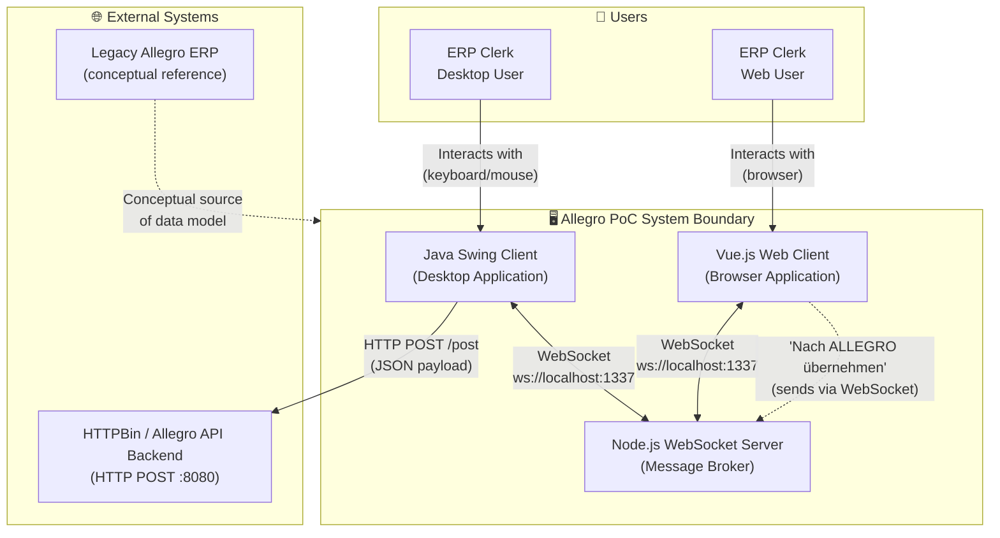

**External Interfaces:**

| Partner System | Interface Type | Direction | Description |
|----------------|----------------|-----------|-------------|
| HTTPBin (mock) / Allegro API | REST HTTP POST `http://localhost:8080/post` | Outbound (Swing PoC) | Submits ERP form data as JSON; receives echo response |
| Legacy Allegro ERP | Conceptual | Inbound reference | Data model and field names are derived from the legacy system |
| Browser (End User) | HTTP/WebSocket | Inbound | Serves Vue.js SPA, establishes WebSocket connection |

### 3.2 Technical Context

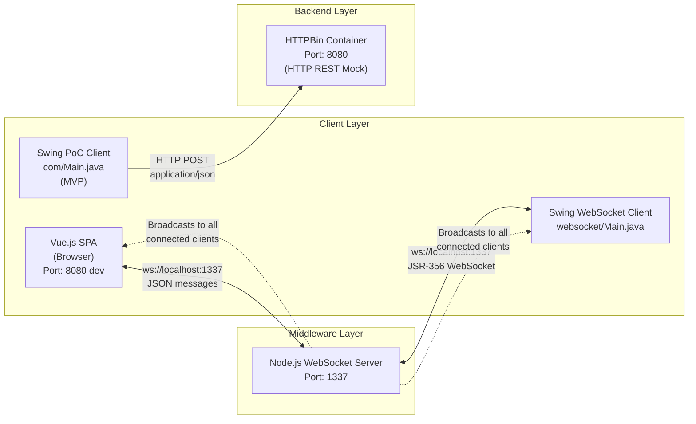

**Technical Interfaces Summary:**

| Interface | Protocol | Port | Message Format | Direction |
|-----------|----------|------|----------------|-----------|
| Vue.js ↔ WS Server | WebSocket (RFC 6455) | 1337 | JSON `{target, content}` | Bidirectional |
| Swing WebSocket ↔ WS Server | WebSocket (JSR-356/Tyrus) | 1337 | JSON `{target, content}` | Bidirectional |
| Swing PoC → HTTPBin | HTTP POST | 8080 | JSON flat object (key=ModelProperty, value=string) | Outbound |
| HTTPBin → Swing PoC | HTTP 200 Response | 8080 | JSON echo object | Inbound |

---

## 4. Solution Strategy

### 4.1 Core Architectural Strategy

The PoC addresses the modernization challenge through a **strangler fig** approach: new components (Vue.js web frontend) are introduced alongside the legacy Swing client, connected via a thin WebSocket relay layer. The legacy client is not replaced immediately but is extended to support the same communication channel.

### 4.2 Technology Decisions

| Decision Area | Choice | Rationale |
|---------------|--------|-----------|
| Frontend (Web) | Vue.js 2.x SPA | Lightweight, rapid UI development; familiar component model |
| Frontend (Desktop) | Java Swing + MVP pattern | Retain existing desktop client; refactor with clean architecture |
| Middleware / Message Bus | Node.js + `websocket` library | Ultra-simple WebSocket relay with zero framework overhead |
| Inter-client Communication | WebSocket (JSON) | Real-time bidirectional push; works with both browser and JVM |
| Backend API | REST HTTP (OpenAPI 3.0.1 specified) | Standard, toolable, mock-friendly (httpbin) |
| JSON Processing (Java) | `javax.json` (streaming API) | Available in Java SE; no additional ORM/serialization library needed |
| Build System (Java) | Apache Maven | Standard Java build tool; dependency management |
| Containerization (Backend) | Docker (kennethreitz/httpbin) | Instant mock backend with no custom code |

### 4.3 Architectural Pattern Decisions

| Pattern | Applied Where | Purpose |
|---------|--------------|---------|
| **Model–View–Presenter (MVP)** | `com.poc` Swing PoC | Decouples UI rendering (`PocView`) from business logic (`PocModel`) via `PocPresenter` |
| **Observer / EventEmitter** | `com.poc.model.EventEmitter` | Decoupled event propagation from model layer to presenter |
| **Value Object** | `com.poc.ValueModel<T>` | Generic typed container for form field data |
| **Message Envelope** | WebSocket JSON `{target, content}` | Uniform routing of messages to named UI targets |
| **Single-Page Application** | Vue.js with component hierarchy | `App.vue` → `Search.vue` component composition |

### 4.4 Quality Strategy

| Quality Goal | Approach |
|--------------|----------|
| Interoperability | Shared WebSocket server as neutral message bus; JSON as lingua franca |
| Maintainability | MVP pattern isolates change; OpenAPI spec drives API contract |
| Evolvability | Vue.js client is self-contained and can replace Swing client independently |
| Simplicity | Minimal dependencies; no database, no authentication layer, no ORM |

---

## 5. Building Block View

### 5.1 Level 1 — Top-Level System Decomposition

The system consists of three independently deployable subsystems:

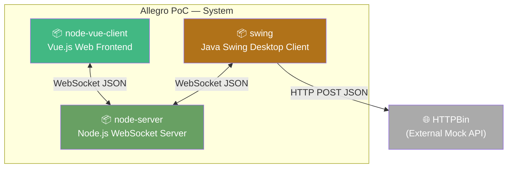

**Subsystem Responsibilities:**

| Subsystem | Technology | Responsibility |
|-----------|------------|----------------|
| `node-vue-client` | Vue.js 2.x, Node.js (dev) | User-facing web SPA for customer search, selection, and data push |
| `node-server` | Node.js, `websocket` library | Stateless WebSocket message relay — broadcasts messages to all connected clients |
| `swing` | Java 22, Swing, Tyrus/JSR-356, MVP | Desktop ERP form client; two implementations (legacy-style WS client and MVP PoC) |

---

### 5.2 Level 2 — Node-Vue-Client (Web Frontend)

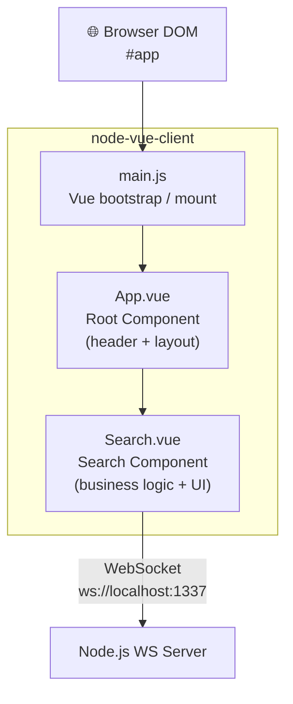

**Component Descriptions:**

| Component | File | Responsibility |
|-----------|------|----------------|
| `main.js` | `src/main.js` | Bootstraps Vue application, mounts to `#app` DOM element |
| `App.vue` | `src/App.vue` | Root shell component: renders branded header and hosts `<Search>` |
| `Search.vue` | `src/components/Search.vue` | Core business component: person search form, results table, Zahlungsempfänger table, WebSocket send |

**Search.vue — Internal State Model:**

| Property | Type | Description |
|----------|------|-------------|
| `formdata` | Object | Bound form fields (last, first, dob, zip, ort, street, hausnr, etc.) |
| `search_result` | Array | Filtered results from in-memory `search_space` |
| `selected_result` | Object | Currently highlighted customer row |
| `zahlungsempfaenger_selected` | Object/String | Selected IBAN/BIC payment record |
| `search_space` | Array (static) | Hard-coded in-memory customer dataset (5 records) |
| `socket` | WebSocket | Native browser WebSocket connection to WS server |

---

### 5.3 Level 2 — Node-Server (WebSocket Relay)

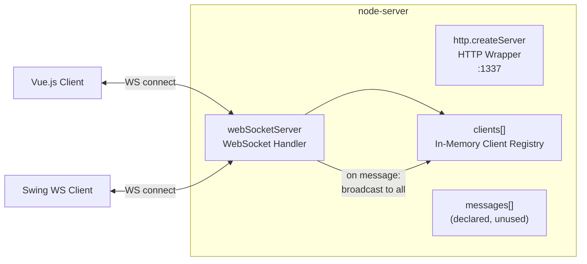

**WebSocket Server Behaviour:**

| Event | Handler Logic |
|-------|--------------|
| `request` | Accept connection regardless of origin; register client in `clients[]` array |
| `message` (utf8) | Log JSON payload; broadcast raw JSON to **all** connected clients (including sender) |
| `close` | Remove client from `clients[]` array; log disconnect |

> **Note:** The `messages[]` array is declared but never populated — message history is not implemented.

---

### 5.4 Level 2 — Swing Module (Desktop Client)

The `swing` module contains **two separate implementations** of the desktop client:

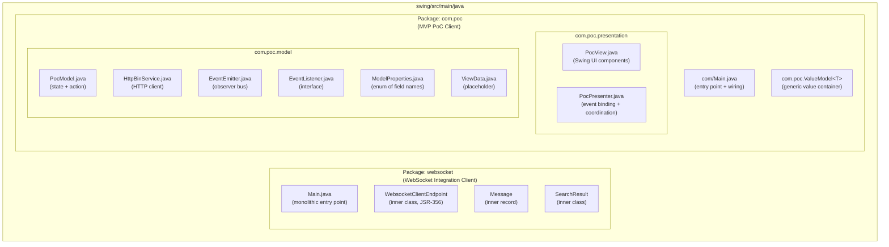

#### 5.4.1 Package: `websocket` — WebSocket Integration Client

| Class | Role |
|-------|------|
| `Main` | Application entry point; builds Swing UI, connects to WebSocket server, parses and dispatches incoming JSON messages to form fields |
| `WebsocketClientEndpoint` | JSR-356 annotated endpoint; handles `@OnOpen`, `@OnClose`, `@OnMessage` lifecycle |
| `Message` | Immutable inner class holding `target` (routing key) and `content` (payload string) |
| `SearchResult` | Plain data holder for deserialized customer fields from WebSocket JSON |

#### 5.4.2 Package: `com.poc` — MVP Proof of Concept Client

| Class | Layer | Role |
|-------|-------|------|
| `com.Main` | Bootstrap | Wires together View, Model, Presenter, and EventEmitter; keeps process alive with `CountDownLatch` |
| `PocView` | View | Pure UI — creates and lays out all Swing widgets; no business logic |
| `PocPresenter` | Presenter | Binds view components to model properties; handles button action; updates view on model events |
| `PocModel` | Model | Holds form state as `Map<ModelProperties, ValueModel<?>>`;  triggers HTTP call via `HttpBinService`; emits events on response |
| `HttpBinService` | Service | HTTP client: POSTs JSON to `http://localhost:8080/post`; returns response body |
| `EventEmitter` | Infrastructure | Observer pattern implementation; manages subscriber list and broadcasts events |
| `EventListener` | Infrastructure | Functional interface for event callbacks |
| `ModelProperties` | Domain | Enum of 13 named form fields (TEXT_AREA, FIRST_NAME, LAST_NAME, DATE_OF_BIRTH, ZIP, ORT, STREET, IBAN, BIC, VALID_FROM, FEMALE, MALE, DIVERSE) |
| `ValueModel<T>` | Shared | Generic typed value wrapper for model field values |
| `ViewData` | Placeholder | Empty class — reserved for future view-to-model DTO |

---

### 5.5 Level 3 — MVP Component Class Diagram (com.poc)

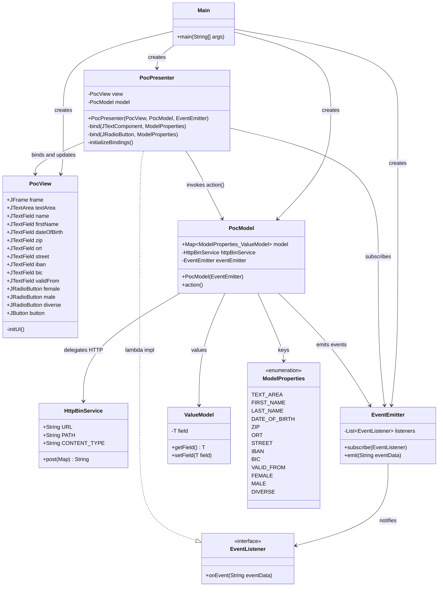

---

## 6. Runtime View

### 6.1 Scenario 1 — System Startup Sequence

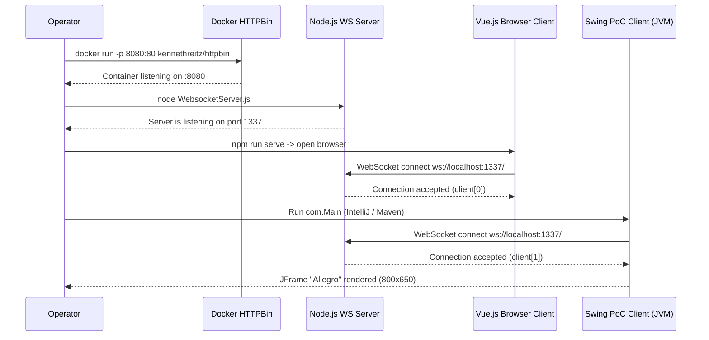

---

### 6.2 Scenario 2 — Customer Search in Web Client

```mermaid
sequenceDiagram
    actor USER as Web User
    participant VUE as Search.vue (Browser)

    USER->>VUE: Types last name (e.g. "Mayer") in Nachname field
    USER->>VUE: Clicks "Suchen" button
    VUE->>VUE: searchPerson() -- filters search_space[]
    VUE-->>USER: Renders matching rows in search_result table
    USER->>VUE: Clicks result row (Hans Mayer)
    VUE->>VUE: selectResult(item) -- selected_result = item
    VUE-->>USER: Row highlighted (blue); Zahlungsempfaenger table populated
    USER->>VUE: Clicks IBAN row
    VUE->>VUE: zahlungsempfaengerSelected(item)
    VUE-->>USER: IBAN row highlighted (green)
```

---

### 6.3 Scenario 3 — "Nach ALLEGRO übernehmen" (Push Data to Allegro Desktop)

This is the core integration scenario: the web user selects a customer and pushes data to the Swing desktop client via the WebSocket relay.

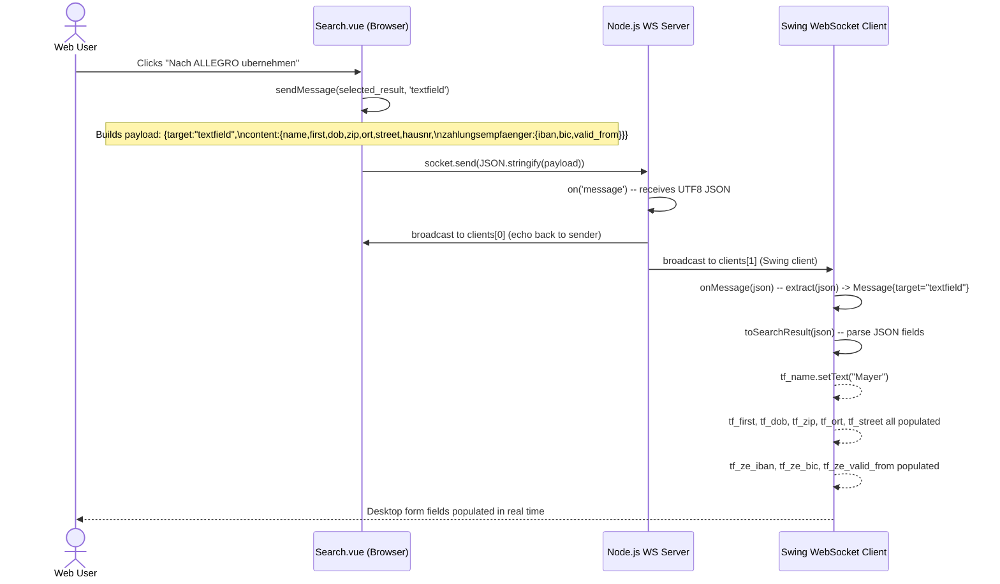

---

### 6.4 Scenario 4 — Text Area Real-time Synchronization

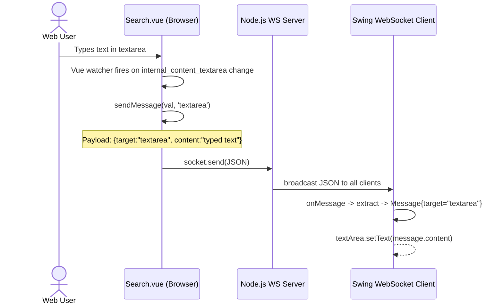

---

### 6.5 Scenario 5 — Form Submission via Swing MVP PoC Client

```mermaid
sequenceDiagram
    actor DESKTOP_USER as Desktop User
    participant VIEW as PocView (Swing UI)
    participant PRESENTER as PocPresenter
    participant MODEL as PocModel
    participant HTTP as HttpBinService
    participant HTTPBIN as HTTPBin :8080

    DESKTOP_USER->>VIEW: Fills in form fields (Vorname, Name, etc.)
    VIEW->>PRESENTER: DocumentListener fires insertUpdate / removeUpdate
    PRESENTER->>MODEL: ValueModel.setField(content) for each field

    DESKTOP_USER->>VIEW: Clicks "Anordnen" button
    VIEW->>PRESENTER: ActionListener fires
    PRESENTER->>MODEL: model.action()
    MODEL->>MODEL: Collect ModelProperties -> HashMap<String,String>
    MODEL->>HTTP: httpBinService.post(data)
    HTTP->>HTTPBIN: POST http://localhost:8080/post (application/json)
    HTTPBIN-->>HTTP: 200 OK JSON echo response
    HTTP-->>MODEL: responseBody string
    MODEL->>MODEL: eventEmitter.emit(responseBody)
    MODEL->>PRESENTER: EventListener.onEvent(eventData) callback
    PRESENTER->>VIEW: view.textArea.setText(eventData)
    PRESENTER->>VIEW: Clear all input fields
    VIEW-->>DESKTOP_USER: Text area shows response; form reset
```

---

## 7. Deployment View

### 7.1 Development / PoC Deployment

All components run on a single developer workstation. There is no production deployment defined.

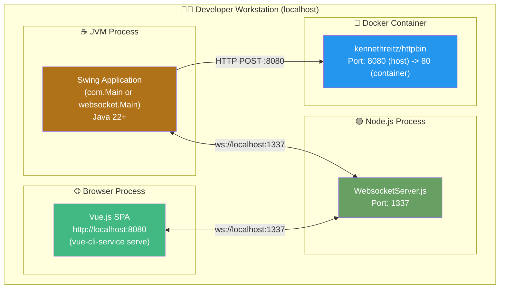

### 7.2 Component Startup Order

The following startup sequence must be respected due to hard-coded connection targets:

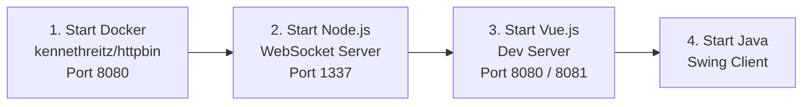

> **Important:** The Vue.js dev server and HTTPBin both target port 8080. If running simultaneously, a port conflict occurs. The Vue.js CLI will automatically reassign to port 8081.

### 7.3 Build Procedures

| Component | Build Command | Output |
|-----------|--------------|--------|
| Swing Module | `mvn package` (from project root) | JAR in `target/` |
| Node.js WS Server | `npm install` then `node src/WebsocketServer.js` | Runtime process |
| Vue.js Web Client | `npm run serve` (dev) or `npm run build` (prod) | Dev server or `dist/` folder |

### 7.4 Deployment Considerations

| Concern | Current State | Recommendation for Production |
|---------|--------------|-------------------------------|
| Port conflicts (8080) | Vue CLI auto-reassigns; Docker uses 8080 | Use distinct ports; introduce reverse proxy |
| Static file serving | Vue CLI dev server only | Build SPA to `dist/`; serve via Nginx / Node.js static |
| WebSocket host | Hard-coded `ws://localhost:1337` | Externalize to environment variable / config file |
| HTTP backend URL | Hard-coded `http://localhost:8080` in `HttpBinService.java` | Externalize; replace httpbin with real Allegro API |
| Process management | Manual startup | Use Docker Compose or PM2 (Node.js) |

---

## 8. Cross-cutting Concepts

### 8.1 Domain Model

The system's domain model centres on **Person/Customer master data** and **Payment Recipient (Zahlungsempfänger)** records, reflecting typical German social insurance or ERP data structures.

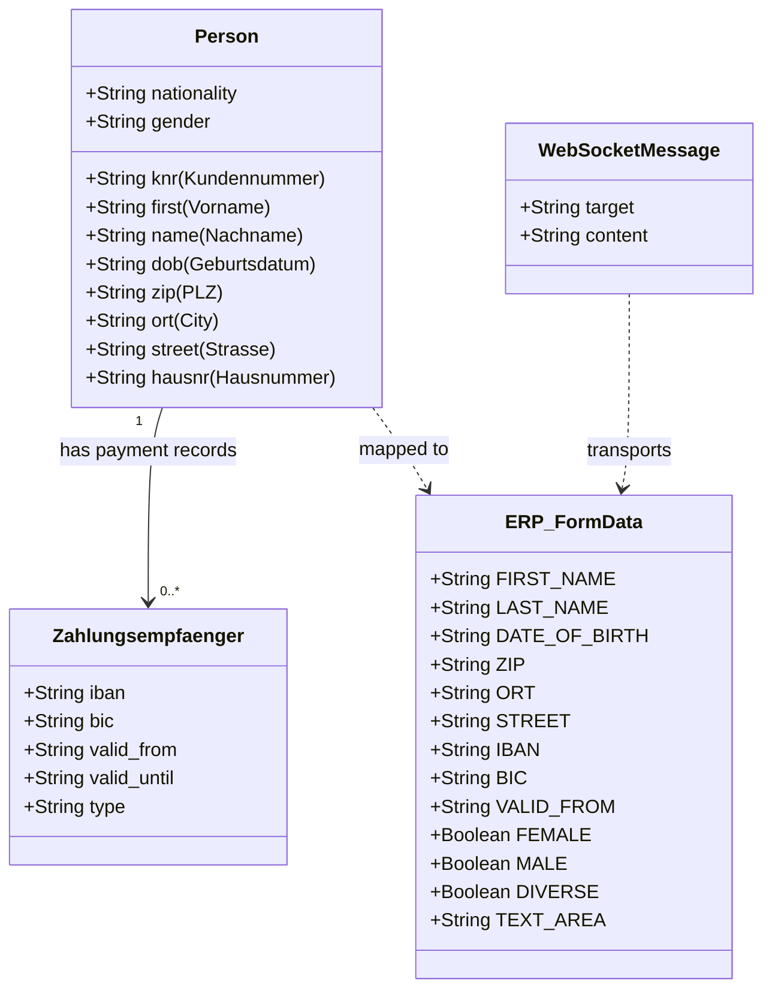

### 8.2 WebSocket Message Protocol

All inter-client communication uses a uniform JSON message envelope:

```json
{
  "target": "textfield" | "textarea",
  "content": "<string or nested object>"
}
```

| Target Value | Content Type | Consumer Action |
|-------------|-------------|----------------|
| `"textfield"` | Serialized customer + Zahlungsempfänger JSON object | Parse and populate individual text fields in Swing client |
| `"textarea"` | Plain string | Set JTextArea / Vue textarea content directly |

**Example — textfield message payload:**
```json
{
  "target": "textfield",
  "content": {
    "knr": "79423984",
    "name": "Mayer",
    "first": "Hans",
    "dob": "1981-01-08",
    "zip": "95183",
    "ort": "Trogen",
    "street": "Isaaer Str.",
    "hausnr": "23",
    "zahlungsempfaenger": {
      "iban": "DE27100777770209299700",
      "bic": "ERFBDE8E759",
      "valid_from": "2020-01-04"
    }
  }
}
```

### 8.3 JSON Handling Strategy

| Component | Approach | Library |
|-----------|----------|---------|
| Vue.js (outgoing) | `JSON.stringify()` (native browser) | Built-in |
| Vue.js (incoming) | Not implemented (socket.onmessage commented out) | N/A |
| Swing WebSocket Client | Manual streaming parse with `javax.json.stream.JsonParser` | GlassFish `javax.json` |
| Swing PoC Model | `javax.json.stream.JsonGenerator` for outgoing POST payload | GlassFish `javax.json` |
| Node.js server | Raw string pass-through (no parsing/validation) | N/A |

### 8.4 Error Handling

| Layer | Current State | Known Issues |
|-------|--------------|--------|
| Vue.js WebSocket | `connect()` called on `mounted()` — no reconnect, no `onerror` handler | Connection failures are silent |
| Swing WebSocket | `RuntimeException` wraps checked exceptions | No graceful degradation |
| Swing PoC HTTP | `IOException` wrapped in `RuntimeException` by presenter | Application crash on HTTP failure |
| Node.js server | No error handling on accept or broadcast | Server continues; individual send failures may throw |
| JSON Parsing (Swing) | Manual boolean-flag approach — fragile with nested JSON | May produce incorrect results if key appears multiple times |

### 8.5 Logging

| Component | Mechanism | Coverage |
|-----------|-----------|-------------|
| Node.js Server | `console.log` with timestamps | Connection open, message received, disconnection |
| Swing MVP | `System.out.println` | Field change events, HTTP response, event bus |
| Swing WebSocket | `System.out.println` | WebSocket lifecycle |

No structured logging, no log levels, no log aggregation framework. Suitable for PoC only.

### 8.6 Security

> **⚠️ PoC-only:** No security mechanisms are implemented. This is expected for a proof of concept but **must** be addressed before any production use.

| Security Concern | Current State |
|-----------------|--------------|
| Authentication | None |
| Authorization | None |
| WebSocket Origin Validation | Explicitly disabled — `request.accept(null, request.origin)` accepts all origins |
| Transport Security | Plain WebSocket (`ws://`) — no TLS/WSS |
| Input Validation | None in server or clients |
| CORS | Not configured |
| Sensitive Data in Transit | IBAN/BIC transmitted as plain text over unencrypted WebSocket |

### 8.7 Testability

No automated tests exist in any module. The MVP pattern in `com.poc` significantly improves testability over the monolithic `websocket/Main.java` by isolating `PocModel` and `PocPresenter` as independently instantiable classes with clear interfaces.

### 8.8 Internationalisation (i18n)

The UI is exclusively in German (`de`). All field labels, placeholders, and button texts use German ERP terminology. No i18n framework is used; strings are hard-coded in both Vue templates and Swing layout code.

---

## 9. Architecture Decisions

### ADR-001: WebSocket as Inter-Client Communication Mechanism

**Status:** Implemented (observed in codebase)

**Context:** The legacy Allegro desktop client (Swing) and the new web client (Vue.js) need to exchange customer data in real time.

**Decision:** Use WebSocket (RFC 6455) as the communication mechanism, mediated by a Node.js relay server.

**Rationale:** WebSocket provides persistent, bidirectional, low-latency communication supported natively by modern browsers and available via the Tyrus library for Java. The relay model allows N clients to communicate without peer-to-peer connections.

**Consequences:**

| Type | Detail |
|------|--------|
| ✅ Positive | Real-time data push to desktop client when web user clicks "Nach ALLEGRO übernehmen" |
| ✅ Positive | Symmetric protocol: both clients use same message format |
| ⚠️ Negative | Node.js server is a single point of failure |
| ⚠️ Negative | All messages broadcast to all clients — no server-side routing |

---

### ADR-002: Node.js as Minimal WebSocket Relay

**Status:** Implemented (observed in codebase)

**Context:** A message relay is needed. Options include a full Java EE application server, Spring Boot, or a lightweight Node.js server.

**Decision:** Use a minimal Node.js process with only the `websocket` npm package — no framework, no routing, no persistence.

**Consequences:**

| Type | Detail |
|------|--------|
| ✅ Positive | ~70 lines of code for a fully functional relay |
| ✅ Positive | Zero configuration; starts immediately |
| ⚠️ Negative | No authentication, no message filtering, no persistence |
| ⚠️ Negative | `messages[]` array declared but never used — history not implemented |

---

### ADR-003: MVP Pattern for Swing PoC (com.poc package)

**Status:** Implemented (observed in `com.poc`)

**Context:** The original `websocket/Main.java` is monolithic — UI layout, WebSocket handling, and JSON parsing combined in one file.

**Decision:** Apply Model–View–Presenter (MVP) pattern in the new `com.poc` implementation.

**Consequences:**

| Type | Detail |
|------|--------|
| ✅ Positive | `PocView` contains zero business logic |
| ✅ Positive | `PocModel` is testable without Swing |
| ✅ Positive | `PocPresenter` manages all data bindings declaratively |
| ⚠️ Negative | `PocModel.model` is `public` — not fully encapsulated |
| ⚠️ Negative | `ViewData.java` is an empty placeholder — DTO pattern incomplete |

---

### ADR-004: In-Memory Customer Data in Vue.js

**Status:** Implemented (observed in `Search.vue`)

**Context:** Customer search requires a data source. A real ERP backend with database was not in PoC scope.

**Decision:** Embed a static hard-coded dataset of 5 customer records directly in `Search.vue` as `search_space[]`.

**Consequences:**

| Type | Detail |
|------|--------|
| ✅ Positive | No backend dependency for search; instant client-side filtering |
| ⚠️ Negative | Data visible in browser developer tools |
| ⚠️ Negative | Not representative of production search performance |

---

### ADR-005: HTTPBin as Backend API Mock

**Status:** Implemented (observed in `HttpBinService.java` and README)

**Context:** The Swing PoC needs to submit form data to a backend service. The real Allegro API was not available.

**Decision:** Use `kennethreitz/httpbin` Docker container as an HTTP mock that echoes back the request body.

**Consequences:**

| Type | Detail |
|------|--------|
| ✅ Positive | No custom backend code needed for PoC |
| ✅ Positive | Echo response enables end-to-end validation |
| ⚠️ Negative | HTTPBin and Vue.js dev server both target port 8080 — conflict risk |
| ⚠️ Negative | Must be replaced with real Allegro API for production |

---

### ADR-006: Two Parallel Swing Implementations in Same Maven Module

**Status:** Implemented (observed in both `websocket/` and `com/poc/` packages)

**Context:** The project demonstrates architectural improvement alongside the existing implementation.

**Decision:** Keep both Swing implementations in parallel during PoC to allow side-by-side comparison.

**Consequences:**

| Type | Detail |
|------|--------|
| ✅ Positive | Clearly demonstrates architectural improvement |
| ⚠️ Negative | UI layout code duplicated between `websocket/Main.java` and `PocView.java` |
| ⚠️ Negative | Two distinct entry points in the same Maven module |

---

## 10. Quality Requirements

### 10.1 Quality Attribute Overview

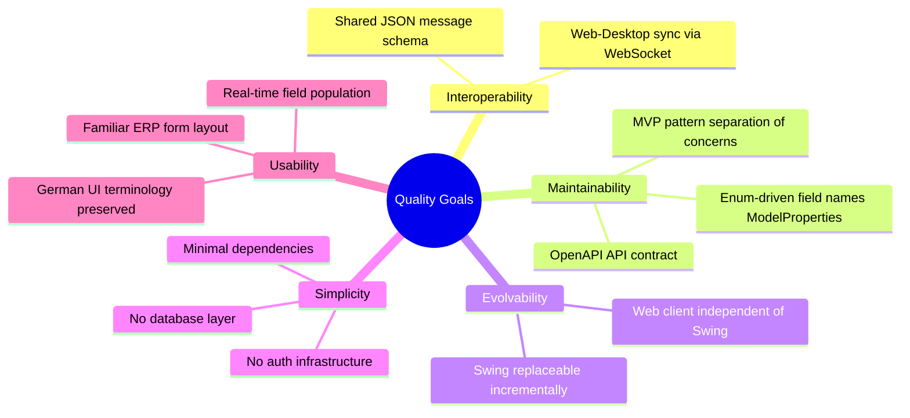

### 10.2 Quality Scenarios

| ID | Quality Attribute | Stimulus | Response | Measure |
|----|-------------------|---------|---------|---------|
| QS-01 | Interoperability | Web user clicks "Nach ALLEGRO übernehmen" | Swing client fields populated with correct data | < 500ms on local network |
| QS-02 | Maintainability | Developer adds a new form field | Field added to `ModelProperties` enum, `PocView`, and `PocPresenter` | Change confined to ≤ 4 files |
| QS-03 | Evolvability | Swing client is decommissioned | Vue.js client and Node.js server continue independently | Swing removal requires no changes to other components |
| QS-04 | Simplicity | New developer joins PoC | Able to start all components and run a full data-push scenario | Setup time < 30 minutes with README |
| QS-05 | Usability | ERP clerk uses Vue.js search form | Finds correct customer and payment record | Task completion without training, given Allegro familiarity |
| QS-06 | Reliability | Node.js WebSocket server crashes | Clients detect disconnection | Browser console error; Swing throws `RuntimeException`; no auto-reconnect |

---

## 11. Risks and Technical Debt

### 11.1 Technical Risks

| ID | Risk | Probability | Impact | Mitigation |
|----|------|-------------|--------|------------|
| R-01 | Port 8080 conflict between HTTPBin and Vue dev server | High | Medium | Configure Vue CLI `devServer.port` in `vue.config.js`; use distinct ports |
| R-02 | Single-point-of-failure: Node.js WS server | Medium | High | Add process supervision (PM2), health checks, restart policies |
| R-03 | WebSocket message broadcast to all clients | High | Medium | Implement client identity and targeted message delivery for production |
| R-04 | Hard-coded `localhost` connection strings | High | Medium | Externalize to environment variables or config files |
| R-05 | No WebSocket reconnect logic in any client | High | High | Implement exponential back-off reconnect in both Vue.js and Swing |
| R-06 | IBAN/BIC transmitted over unencrypted WebSocket | High | Critical | Enforce WSS (TLS) in any non-PoC deployment |

### 11.2 Technical Debt Inventory

| ID | Type | Location | Description | Severity | Est. Effort |
|----|------|----------|-------------|----------|-------------|
| TD-01 | Code Debt | `websocket/Main.java` | Monolithic class mixing UI layout, WS handling, and JSON parsing | High | 2–3 days |
| TD-02 | Design Debt | `com.poc.model.PocModel` | `model` field is `public` — breaks encapsulation | Medium | 1–2 hours |
| TD-03 | Incomplete Feature | `WebsocketServer.js` | `messages[]` array declared but never populated | Low | 2–4 hours |
| TD-04 | Incomplete Feature | `com.poc.model.ViewData` | Empty placeholder class — never implemented | Low | Remove or implement |
| TD-05 | Missing Tests | All modules | Zero automated test coverage across all components | High | 1+ sprint |
| TD-06 | Missing Error Handling | `Search.vue` | WebSocket `onerror`/`onclose` not implemented; `onmessage` commented out | High | 4–8 hours |
| TD-07 | Hard-coded Data | `Search.vue` | 5 static customer records embedded in component | High | Replace with API call |
| TD-08 | Hard-coded URLs | `HttpBinService.java`, `Search.vue`, `websocket/Main.java` | `localhost` URLs embedded in source code | High | 2–4 hours |
| TD-09 | Duplicate UI Code | `websocket/Main.java` vs `PocView.java` | Near-identical Swing layout duplicated | Medium | 1 day |
| TD-10 | Security Debt | Entire system | No authentication, no TLS, open WebSocket origin | Critical (prod) | Architecture change |
| TD-11 | Dependency Currency | `pom.xml` | Tyrus 1.15 (2018), `websocket-api` 0.2 — both outdated | Medium | Dependency upgrade sprint |
| TD-12 | Missing i18n | `Search.vue`, `PocView.java` | UI strings hard-coded in German; no i18n framework | Low | Sprint for i18n |

### 11.3 Improvement Recommendations (Prioritized)

| Priority | Recommendation |
|----------|---------------|
| 🔴 Critical | Implement WSS (TLS) for WebSocket if any real customer data is used |
| 🔴 Critical | Replace all hard-coded `localhost` endpoints with configurable values |
| 🔴 Critical | Add WebSocket reconnection logic with exponential back-off in both clients |
| 🟠 High | Replace static `search_space[]` with a real API call against the Allegro backend |
| 🟠 High | Add automated tests: unit tests for `PocModel`, `PocPresenter`; WS integration tests |
| 🟠 High | Implement `socket.onmessage`, `socket.onerror`, `socket.onclose` in Vue.js `Search.vue` |
| 🟡 Medium | Encapsulate `PocModel.model` behind getter methods |
| 🟡 Medium | Add Docker Compose to orchestrate all services with correct port assignments |
| 🟡 Medium | Consolidate the two Swing implementations — remove `websocket/Main.java` post-validation |
| 🟢 Low | Implement `ViewData` DTO or remove the empty class |
| 🟢 Low | Add structured logging (SLF4J for Java; Winston/pino for Node.js) |

---

## 12. Glossary

### 12.1 Domain Terms (German ERP Context)

| Term | German / Code Key | Definition |
|------|-------------------|------------|
| Allegro | Allegro | The name of the legacy ERP/CRM system being modernized |
| Kundennummer | `knr` | Unique customer identifier in the ERP system |
| Vorname | `first` | First name |
| Nachname | `name` | Last name / surname |
| Geburtsdatum | `dob` | Date of birth |
| PLZ | `zip` | Postal / ZIP code (German format, e.g., 95183) |
| Ort | `ort` | City / place of residence |
| Strasse | `street` | Street name |
| Hausnummer | `hausnr` | House number |
| Zahlungsempfänger | `zahlungsempfaenger` | Payment recipient — entity holding IBAN/BIC banking details |
| IBAN | `iban` | International Bank Account Number (DE-format in test data) |
| BIC | `bic` | Bank Identifier Code (SWIFT code) |
| Gültig ab | `valid_from` | Start date of a bank record's validity |
| Gültig bis | `valid_until` | End date of a bank record's validity (not populated in PoC) |
| Geschlecht | gender | Gender selection (Weiblich / Männlich / Divers) |
| Weiblich | `FEMALE` | Female |
| Männlich | `MALE` | Male |
| Divers | `DIVERSE` | Diverse / non-binary gender option |
| Betriebsbez. | betriebsbez | Business / employer name |
| RV-Nummer | rvnr | Rentenversicherungsnummer — pension insurance number |
| BG-Nummer | bgnr | Berufsgenossenschaftsnummer — trade association accident insurance number |
| Träger-Nr. | traegernr | Carrier/administrator number of the employment agency |
| Postfach | postfach | P.O. Box |
| Vorsatzwort | vorsatzwort | Name prefix (e.g., "von", "van", "de") |
| Leistung | leistung | Benefit or service type |
| Titel | title | Academic or professional title |
| Suchen | — | "Search" — the search action button |
| Anordnen | — | "Arrange / Order" — the submit button in the Swing PoC |
| Nach ALLEGRO übernehmen | — | "Transfer to Allegro" — button to push selected data to the legacy system |
| RT | — | "Rückgabe-Text" / response text — label for the text area showing server response |

### 12.2 Technical Terms

| Term | Definition |
|------|------------|
| Arc42 | A pragmatic software architecture documentation template consisting of 12 sections; see arc42.org |
| MVP (Model–View–Presenter) | An architectural UI pattern separating data (Model), rendering (View), and coordination (Presenter) |
| WebSocket | A full-duplex bidirectional communication protocol over a persistent TCP connection (RFC 6455) |
| JSR-356 | Java API for WebSocket — the Java EE standard for defining WebSocket endpoints |
| Tyrus | GlassFish reference implementation of JSR-356; used as standalone WebSocket client in this project |
| Vue.js | A progressive JavaScript framework for building reactive Single-Page Applications |
| SPA (Single-Page Application) | A web application loading a single HTML page and dynamically updating DOM content |
| Vue SFC | Vue Single File Component — a `.vue` file combining template, script, and style sections |
| OpenAPI 3.0 | A standard specification format for describing RESTful HTTP APIs (formerly Swagger) |
| HTTPBin | An open-source HTTP testing/echo service (kennethreitz/httpbin); echoes request data in response |
| Maven | Apache Maven — Java build automation and dependency management tool |
| EventEmitter | A custom observer pattern class managing subscriber lists and broadcasting events to listeners |
| ValueModel | A generic typed wrapper class (`ValueModel<T>`) holding a single mutable field value |
| ModelProperties | Java `enum` defining all 13 named form fields used as keys in the model map |
| CountDownLatch | Java concurrency primitive used to keep the application main thread alive until `latch.countDown()` |
| GridBagLayout | Java Swing layout manager for precise grid-based UI component placement |
| ws:// | URI scheme for unencrypted WebSocket connections |
| wss:// | URI scheme for TLS-encrypted secure WebSocket connections |
| PoC (Proof of Concept) | A preliminary demonstration to verify that a proposed architectural approach is technically feasible |
| Strangler Fig Pattern | A modernization strategy where new system components replace legacy ones incrementally without a big-bang rewrite |

---

## Appendix

### A. Project File Inventory

| Module | Path | Technology | Key Files |
|--------|------|------------|-----------|
| Java Swing MVP PoC | `swing/src/main/java/com/poc/` | Java 22, Swing | `Main.java`, `PocView.java`, `PocPresenter.java`, `PocModel.java`, `HttpBinService.java`, `EventEmitter.java`, `ModelProperties.java` |
| Java Swing WS Client | `swing/src/main/java/websocket/` | Java 22, Tyrus, Swing | `Main.java` (monolithic ~460 LOC) |
| Node.js WS Server | `node-server/src/` | Node.js, websocket@1.0.35 | `WebsocketServer.js` |
| Vue.js Web Client | `node-vue-client/src/` | Vue.js 2.6, Vue CLI 4 | `App.vue`, `components/Search.vue`, `main.js` |
| API Specification | `/` | OpenAPI 3.0.1 | `api.yml` |
| Maven Build | `/` | Apache Maven | `pom.xml` |
| IDE Configurations | `/` | Eclipse, IntelliJ | `WebsocketSwingClient.launch`, `websocket_swing.iml` |

### B. Source Code Statistics

| Component | Language | Approx. LOC | Complexity |
|-----------|----------|-------------|------------|
| `swing/.../websocket/Main.java` | Java | ~460 | High (monolithic) |
| `swing/.../com/poc/` (8 files) | Java | ~380 | Low–Medium (separated concerns) |
| `node-server/src/WebsocketServer.js` | JavaScript (Node) | ~68 | Low |
| `node-vue-client/src/components/Search.vue` | Vue SFC | ~260 | Medium |
| `node-vue-client/src/App.vue` | Vue SFC | ~48 | Low |
| `api.yml` | YAML (OpenAPI) | ~97 | Low |
| **Total** | — | **~1,313** | — |

### C. External Dependencies

| Dependency | Version | Module | Notes |
|------------|---------|--------|-------|
| tyrus-standalone-client | 1.15 | swing (Maven) | JSR-356 WS client impl; from 2018 |
| websocket-api (GlassFish) | 0.2 | swing (Maven) | Outdated; consider Jakarta EE replacement |
| javax.json-api | 1.1.4 | swing (Maven) | JSON-P streaming API |
| javax.json (GlassFish) | 1.0.4 | swing (Maven) | JSON-P reference impl |
| websocket (npm) | ^1.0.35 | node-server | Node WebSocket server/client |
| vue | ^2.6.10 | node-vue-client | Vue 2.x (EOL Dec 2023) |
| @vue/cli-service | ^4.0.0 | node-vue-client (dev) | Vue CLI build toolchain |
| core-js | ^3.1.2 | node-vue-client | Browser polyfills |
| kennethreitz/httpbin | latest | Docker (external) | HTTP echo service mock |

### D. Suggested Architecture Evolution Roadmap

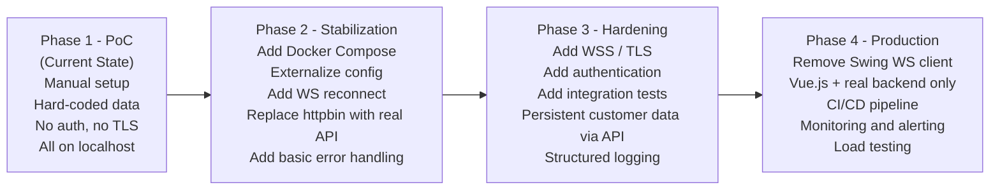

---

*This document was automatically generated from source code analysis of the `websocket_swing` repository.*  
*All architectural insights are derived directly from observed code structure, dependencies, and runtime behaviour.*  
*Analysis date: 2025-01-30*
