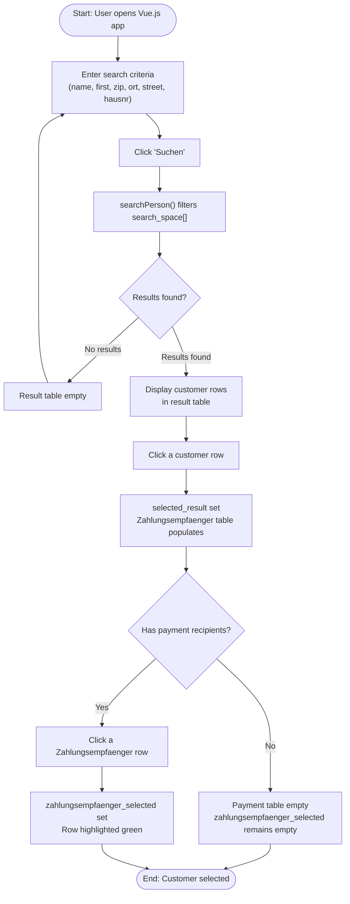
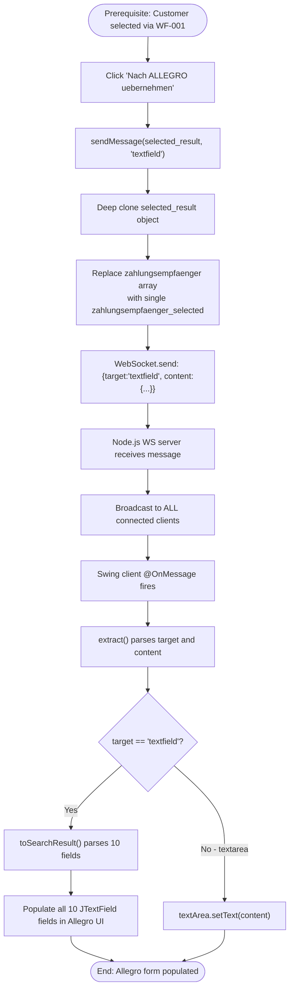
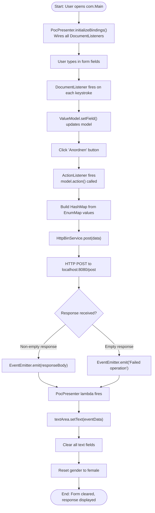

# ERPApp — Business Rules Documentation

**Generated by:** GenInsights All-in-One Analysis Agent  
**Date:** 2025-07-14  
**System:** Allegro Modernization PoC (`websocket_swing`)

---

## Summary

| Metric | Value |
|--------|-------|
| Total Business Rules | 8 |
| Critical Priority | 2 (BR-004, BR-005) |
| High Priority | 2 (BR-001, BR-002, BR-003) |
| Medium Priority | 3 (BR-006, BR-007, BR-008) |
| Business Workflows | 3 |
| Business Capabilities | 5 |

---

## Business Rules

### BR-001: Multi-Field Customer Search

**Type:** Decision / Filtering  
**Priority:** High  
**Domain:** Customer Management  
**Source:** `Search.vue → searchPerson()`

A customer record is included in search results if **ANY** of the following conditions are true (OR logic, case-insensitive):

| Field | Matching Rule |
|-------|--------------|
| `formdata.last` | Customer `name` contains the entered value (partial match) |
| `formdata.first` | Customer `first` contains the entered value (partial match) |
| `formdata.zip` | Customer `zip` equals the entered value (exact match) |
| `formdata.ort` | Customer `ort` contains the entered value (partial match) |
| `formdata.street` | Customer `street` contains the entered value (partial match) |
| `formdata.hausnr` | Customer `hausnr` contains the entered value (partial match) |

If no criteria are entered (all empty), no results are returned.

**Example:** Searching `last="May"` returns both "Mayer" (Hans) and "May" (Karl).

---

### BR-002: Payment Recipient (Zahlungsempfänger) Selection

**Type:** Process  
**Priority:** High  
**Domain:** Payment Data Management  
**Source:** `Search.vue → zahlungsempfaengerSelected()`, `sendMessage()`

When a customer is selected, their associated **Zahlungsempfänger** records are displayed in a secondary table (IBAN, BIC, Gültig ab). Rules:

- A customer may have **0 to N** Zahlungsempfänger records
- The user selects exactly **one** by clicking a row
- Only the **selected** Zahlungsempfänger (not the full array) is transferred to Allegro
- If no Zahlungsempfänger is selected, the `zahlungsempfaenger` field in the sent message contains the empty string `""`

---

### BR-003: WebSocket Broadcast (All Clients Receive All Messages)

**Type:** Process  
**Priority:** High  
**Domain:** Real-Time Communication  
**Source:** `WebsocketServer.js → connection.on('message')`

Every UTF-8 message received by the Node.js WebSocket server is **broadcast to ALL connected clients**, including the sender. This means:
- The Vue.js client receives its own messages back (currently ignores them — `onmessage` is commented out)
- All Swing clients (if multiple are connected) receive every message
- Client-side routing by `target` field is required

---

### BR-004: Message Target Routing (Critical)

**Type:** Decision  
**Priority:** Critical  
**Domain:** Real-Time ERP Integration  
**Source:** `websocket/Main.java → @OnMessage`, `extract()`

```
WebSocket JSON message format:
{
  "target": "textfield" | "textarea",
  "content": <object | string>
}
```

| Target Value | Action in Swing Client |
|-------------|----------------------|
| `"textfield"` | Parse `content` as person JSON → populate all 10 JTextField components |
| `"textarea"` | Set `content` string into JTextArea |

For `target="textfield"`, the following fields are extracted and populated:

| JSON Field | Swing JTextField |
|-----------|-----------------|
| `name` | `tf_name` |
| `first` | `tf_first` |
| `dob` | `tf_dob` |
| `zip` | `tf_zip` |
| `ort` | `tf_ort` |
| `street` | `tf_street` |
| `hausnr` | `tf_hausnr` |
| `iban` (from zahlungsempfaenger) | `tf_ze_iban` |
| `bic` (from zahlungsempfaenger) | `tf_ze_bic` |
| `valid_from` (from zahlungsempfaenger) | `tf_ze_valid_from` |

---

### BR-005: Data Transfer to Allegro ERP (Critical)

**Type:** Process  
**Priority:** Critical  
**Domain:** Real-Time ERP Integration  
**Source:** `Search.vue → sendMessage(selected_result, 'textfield')`

When "Nach ALLEGRO übernehmen" is clicked:

1. `selected_result` object is **deep-cloned** (`JSON.parse(JSON.stringify(e))`)
2. The `zahlungsempfaenger` array field is **replaced** with `zahlungsempfaenger_selected` (single record or empty string)
3. The modified object is sent as `content` in `{ target: "textfield", content: <obj> }`
4. Message transmitted via `WebSocket.send()`

This ensures only the **selected** payment recipient is transferred, not the full array.

---

### BR-006: Gender Selection

**Type:** Validation  
**Priority:** Medium  
**Domain:** Person Data Management  
**Source:** `PocView.java`, `PocPresenter.java`, `websocket/Main.java`

Gender is represented as three mutually exclusive radio buttons: **Weiblich** (female), **Männlich** (male), **Divers** (diverse). Rules:
- Exactly one of the three may be selected at a time (ButtonGroup enforcement)
- **Default**: female is pre-selected on form initialization
- **Reset**: After successful API submission, female is re-selected (male=false, diverse=false)
- In the REST API schema (`api.yml`), gender is represented as three separate string fields: `FEMALE`, `MALE`, `DIVERSE`

---

### BR-007: Live Form Data Binding (MVP)

**Type:** Process  
**Priority:** Medium  
**Domain:** Form Data Collection  
**Source:** `PocPresenter.java → initializeBindings()`, `bind()`

In the MVP Swing client, all form components are **live-bound** to model properties:
- **JTextField**: `DocumentListener` (insert/remove events) → `ValueModel.setField(document.getText())`
- **JRadioButton**: `ChangeListener` → `ValueModel.setField(source.isSelected())`
- The model is **always in sync** with the current UI state
- No "read form on submit" required — `model.action()` directly uses the already-current model values

All 13 properties are bound: TEXT_AREA, FIRST_NAME, LAST_NAME, DATE_OF_BIRTH, ZIP, ORT, STREET, IBAN, BIC, VALID_FROM, FEMALE, MALE, DIVERSE.

---

### BR-008: Event-Driven Form Reset on API Response

**Type:** Process  
**Priority:** Medium  
**Domain:** Form Data Submission  
**Source:** `PocModel.action()`, `PocPresenter constructor (EventEmitter subscriber)`

After the HTTP POST to the REST API:

| Condition | EventEmitter payload | PocPresenter action |
|-----------|---------------------|---------------------|
| Response body is non-empty | Full response body string | Display in textArea; clear all fields; reset gender to female |
| Response body is empty | `"Failed operation"` | Display in textArea; clear all fields; reset gender to female |

Form reset clears: firstName, name, dateOfBirth, zip, ort, street, iban, bic, validFrom text fields and the textArea (then sets it to the response). Gender: `female.setSelected(true)`, `male.setSelected(false)`, `diverse.setSelected(false)`.

---

## Business Workflows

### WF-001: Person Search and Selection



### WF-002: Data Transfer to Allegro ERP



### WF-003: Form Submission via REST API (MVP Client)



---

## Business Capabilities

| Capability | Description | Primary Files | Maturity |
|------------|-------------|---------------|----------|
| **CAP-001: Customer Search** | Multi-field search and retrieval of customer records | `Search.vue` | PoC (mock data only) |
| **CAP-002: Payment Data Management** | View and select customer IBAN/BIC bank records | `Search.vue`, `api.yml` | PoC |
| **CAP-003: Real-Time ERP Integration** | Transfer customer data from web UI to Allegro desktop | `WebsocketServer.js`, `Search.vue`, `websocket/Main.java` | PoC |
| **CAP-004: ERP Form Data Collection** | Collect and bind form field data reactively | `PocPresenter.java`, `PocModel.java`, `PocView.java` | PoC (MVP pattern) |
| **CAP-005: REST API Integration** | Submit collected ERP data to backend REST service | `HttpBinService.java`, `api.yml` | PoC (mock HTTPBin) |
