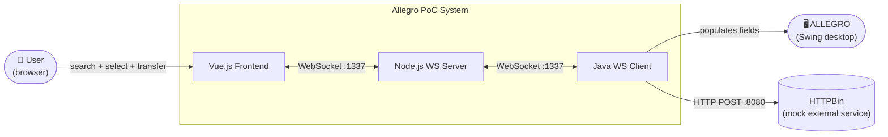
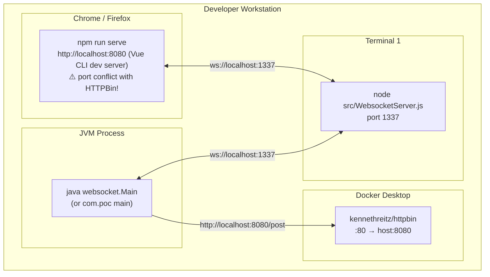

# GenInsights — Architecture Documentation (arc42)

**System:** Allegro PoC — WebSocket-based Person Data Transfer  
**Version:** 1.0  
**Date:** 2025-01-01  
**Generated by:** GenInsights All-in-One Agent

---

## Table of Contents

1. [Introduction and Goals](#1-introduction-and-goals)
2. [Architecture Constraints](#2-architecture-constraints)
3. [System Scope and Context](#3-system-scope-and-context)
4. [Solution Strategy](#4-solution-strategy)
5. [Building Block View](#5-building-block-view)
6. [Runtime View](#6-runtime-view)
7. [Deployment View](#7-deployment-view)
8. [Cross-cutting Concepts](#8-cross-cutting-concepts)
9. [Architecture Decisions](#9-architecture-decisions)
10. [Quality Requirements](#10-quality-requirements)
11. [Risks and Technical Debt](#11-risks-and-technical-debt)
12. [Glossary](#12-glossary)

---

## 1. Introduction and Goals

### 1.1 Purpose

This system is a **Proof-of-Concept (PoC)** demonstrating real-time data transfer between a modern web browser frontend (Vue.js) and a legacy Java Swing desktop application ("ALLEGRO"), mediated by a Node.js WebSocket relay server.

The core use case is: a user searches for a person (by name, address, etc.) in the browser, selects the relevant result and payment recipient, and clicks "Nach ALLEGRO übernehmen" (Transfer to ALLEGRO) — which instantly populates the corresponding fields in the ALLEGRO Swing application running on the same workstation.

### 1.2 Quality Goals

| Priority | Quality Goal | Motivation |
|---|---|---|
| 1 | **Functional correctness** | The data transfer must reliably populate the correct Swing fields |
| 2 | **Real-time responsiveness** | Sub-second latency from browser action to Swing update |
| 3 | **Developer usability** | PoC must be runnable locally with minimal setup |

### 1.3 Stakeholders

| Role | Expectation |
|---|---|
| Developer / Demonstrator | Runnable PoC, clear code structure |
| ALLEGRO Legacy Team | Minimal changes to the Swing application |
| End Users | Seamless data entry — search in browser, auto-fill in ALLEGRO |

---

## 2. Architecture Constraints

| Constraint | Description |
|---|---|
| **Legacy Swing integration** | The ALLEGRO target application is a Java Swing desktop app that cannot be easily modified; a WebSocket client is added as the integration bridge |
| **PoC scope** | This is not a production system; security, scalability, and HA are explicitly out of scope for this iteration |
| **Local execution** | All components run on the same developer workstation (localhost) |
| **Java 22** | The Maven project targets Java 22 (source/target = 22) |
| **Vue 2 (current)** | The frontend is built on Vue 2; the EOL date (Dec 2023) is a known constraint requiring migration |

---

## 3. System Scope and Context

### 3.1 Business Context



### 3.2 Technical Context

| Interface | Protocol | Port | Direction | Notes |
|---|---|---|---|---|
| Browser ↔ Node server | WebSocket (`ws://`) | 1337 | Bidirectional | Plain text, no auth |
| Java Swing ↔ Node server | WebSocket (`ws://`) | 1337 | Bidirectional | javax.websocket / Tyrus |
| Java Swing → HTTPBin | HTTP (`http://`) | 8080 | Outbound | Via Docker container |
| HTTPBin ← Docker | HTTP | 80→8080 | Internal | `kennethreitz/httpbin` |

---

## 4. Solution Strategy

The PoC uses a **hub-and-spoke WebSocket broadcast** pattern:

1. The Node.js server acts as a **message bus** — it broadcasts every message it receives to all connected clients.
2. Messages carry a `target` field that tells the receiver how to process the payload (`"textfield"` or `"textarea"`).
3. The Vue frontend acts as the **input producer** (user triggers sends).
4. The Java Swing client acts as the **output consumer** (auto-fills Swing fields on receipt).

This decouples the browser and desktop application: neither knows about the other; they both only communicate with the server.

The Java Swing module (`com.poc`) additionally implements the **Model-View-Presenter (MVP)** pattern for its internal UI:
- `PocView` owns all Swing widgets
- `PocModel` holds the current field state and drives HTTP calls
- `PocPresenter` wires the two together via `DocumentListener` bindings

---

## 5. Building Block View

### 5.1 Level 1 — System

| Block | Technology | Responsibility |
|---|---|---|
| `node-vue-client` | Vue 2 + @vue/cli | Search UI, result selection, WebSocket message producer |
| `node-server` | Node.js + `websocket` lib | WS relay hub, HTTP server wrapper |
| `swing/websocket` | Java 22 + Tyrus 1.15 | Swing UI with integrated WS client, JSON receiver |
| `swing/com.poc` | Java 22 + MVP | Structured Swing form with presenter/model architecture |

### 5.2 Level 2 — node-vue-client

| Component | File | Role |
|---|---|---|
| `App` | `src/App.vue` | Root layout, page header |
| `Search` | `src/components/Search.vue` | Search form, results table, payment selection, WS send |
| Vue bootstrap | `src/main.js` | Creates and mounts Vue instance |

### 5.3 Level 2 — swing/websocket

| Component | File | Role |
|---|---|---|
| `Main` | `websocket/Main.java` | Swing frame construction, WS client, JSON parsing |
| `WebsocketClientEndpoint` | (inner class) | JSR-356 annotated WS endpoint |
| `Message` / `SearchResult` | (inner classes) | DTO containers for parsed messages |

### 5.4 Level 2 — swing/com.poc

| Component | File | Role |
|---|---|---|
| `PocView` | `presentation/PocView.java` | All Swing widgets and layout |
| `PocPresenter` | `presentation/PocPresenter.java` | Binds view ↔ model, handles user actions |
| `PocModel` | `model/PocModel.java` | Field state, HTTP submission |
| `HttpBinService` | `model/HttpBinService.java` | HTTP POST abstraction |
| `EventEmitter` | `model/EventEmitter.java` | Pub/sub event bus |
| `ValueModel<T>` | `ValueModel.java` | Generic typed field wrapper |
| `ModelProperties` | `model/ModelProperties.java` | Enum of all form field keys |

---

## 6. Runtime View

### 6.1 Happy Path: Transfer Person to ALLEGRO

1. User enters search criteria in browser, clicks **Suchen**
2. `Search.vue::searchPerson()` filters the in-memory `search_space` array
3. Matching persons are displayed in the results table
4. User clicks a row → `selectResult()` captures `selected_result`
5. User optionally clicks a Zahlungsempfänger row → `zahlungsempfaengerSelected()` captures it
6. User clicks **Nach ALLEGRO übernehmen**
7. `sendMessage()` serialises selected data and sends via `socket.send()`
8. Node server receives the message and iterates `clients[]`, calling `sendUTF()` on each
9. Java Swing `onMessage()` fires → `extract()` parses target → `toSearchResult()` parses content
10. Swing `JTextField` components are populated with the person's data

### 6.2 Error Path: Server Unavailable

**Current behaviour (buggy):** The Vue component silently fails to connect (no `onerror` handler). When a user tries to send, a JavaScript exception is thrown with no user feedback.

**Expected behaviour:** Show a connection status indicator and block send actions when disconnected.

---

## 7. Deployment View



> **⚠️ Port Conflict:** Vue CLI dev server defaults to port 8080. HTTPBin Docker container is also mapped to port 8080. One of these must be reconfigured.

---

## 8. Cross-cutting Concepts

### 8.1 Message Protocol

All WebSocket messages use a shared JSON envelope:
```json
{
  "target": "textfield | textarea",
  "content": "<string or object>"
}
```
- `target = "textfield"`: `content` is a serialised JSON object matching the `SearchResult` structure
- `target = "textarea"`: `content` is a plain string

### 8.2 Data Model (Person / SearchResult)

```json
{
  "first": "string",
  "name": "string",
  "dob": "YYYY-MM-DD",
  "zip": "string",
  "ort": "string",
  "street": "string",
  "hausnr": "string",
  "knr": "string",
  "zahlungsempfaenger": {
    "iban": "string",
    "bic": "string",
    "valid_from": "YYYY-MM-DD"
  }
}
```

### 8.3 Logging

Currently: `System.out.println` throughout Java code, `console.log` in Node.js.  
Recommendation: SLF4J + Logback for Java; `winston` or Node.js built-in structured logging for the server.

### 8.4 Error Handling

Currently: Largely absent. Exceptions in Java presenters are wrapped in `RuntimeException`; WebSocket errors in Vue are unhandled.  
Recommendation: Centralised error handling per layer; UI feedback for all failure states.

---

## 9. Architecture Decisions

### ADR-001 — WebSocket for Real-time Communication
**Status:** Accepted  
**Decision:** Use WebSocket over HTTP polling for instant, bidirectional data transfer  
**Rationale:** The use case requires sub-second latency from browser action to desktop update, which rules out polling.  
**Consequences:** Requires persistent connections; adds reconnect complexity.

### ADR-002 — Node.js as Message Relay (not peer-to-peer)
**Status:** Accepted  
**Decision:** Route all messages through the Node server rather than direct Java ↔ browser communication  
**Rationale:** Simplifies both endpoints; all routing logic lives in one place; enables multiple connected clients.  
**Consequences:** Node server is a single point of failure; adds one network hop.

### ADR-003 — MVP Pattern for Java Swing UI (com.poc)
**Status:** Accepted  
**Decision:** Use Model-View-Presenter pattern for the Swing form  
**Rationale:** Separates UI layout (PocView) from business logic (PocModel) and binding/event logic (PocPresenter), enabling future testability.  
**Consequences:** More files/classes than a monolithic approach; currently under-used (ViewData is empty).

### ADR-004 — In-memory Search Data (PoC)
**Status:** Accepted for PoC / **Needs revision for production**  
**Decision:** Hardcode test person data directly in `Search.vue`  
**Rationale:** Avoids backend dependency for demo purposes.  
**Consequences:** Test data ships in production build; data cannot be updated without code change; real person data must never be committed.

---

## 10. Quality Requirements

### 10.1 Quality Scenarios

| ID | Quality | Scenario | Current State | Target State |
|---|---|---|---|---|
| QS-01 | Reliability | User sends message; server briefly restarts | Frontend permanently loses connection, no feedback | Auto-reconnect within 30s |
| QS-02 | Security | Attacker connects to ws://localhost:1337 from a different origin | ✅ Accepted (all origins) | Allowlist-based origin check |
| QS-03 | Maintainability | Developer updates Vue version | Major migration required (Vue 2 EOL) | Vue 3 migration complete |
| QS-04 | Correctness | User clicks Suchen without selecting payment recipient | Empty string sent as payment data | Block "Übernehmen" until recipient selected |
| QS-05 | Robustness | User clicks Anordnen with empty form fields | NPE crashes the app | Validate required fields, show error dialog |

---

## 11. Risks and Technical Debt

### 11.1 Top Risks

| Risk | Likelihood | Impact | Mitigation |
|---|---|---|---|
| Vue 2 EOL security vulnerability exploited | HIGH | HIGH | Migrate to Vue 3 immediately |
| `javax.websocket` incompatible with future JDK | HIGH | HIGH | Migrate to `jakarta.websocket` |
| Production data committed to source control (copying the hardcoded test data pattern) | MEDIUM | CRITICAL | Remove `search_space` from component, add `.gitignore` for data files |
| Node server crashes and takes down all client connections | HIGH | HIGH | Add process manager (PM2), health endpoint, client reconnect logic |
| NPE crash on form submit | HIGH | HIGH | Add null guards in PocModel |

### 11.2 Technical Debt Overview

See [geninsights-code-assessment-report.md](./geninsights-code-assessment-report.md) — Section 6 for the full technical debt register.

**Estimated effort to address all critical/high items:** 8–12 developer-days

---

## 12. Glossary

| Term | Definition |
|---|---|
| **ALLEGRO** | The target Java Swing legacy desktop application that this PoC integrates with |
| **Zahlungsempfänger** | German: "payment recipient" — the entity (IBAN/BIC) that receives payments for a person |
| **KNR (Kundennummer)** | Customer number — unique identifier for a person |
| **IBAN** | International Bank Account Number |
| **BIC** | Bank Identifier Code (SWIFT code) |
| **Nach ALLEGRO übernehmen** | "Transfer to ALLEGRO" — the action button that sends selected data via WebSocket |
| **MVP** | Model-View-Presenter — architectural pattern used in `com.poc` |
| **WebSocket hub-and-spoke** | Pattern where a central server relays messages to all connected clients |
| **JSR-356** | Java specification for the WebSocket API (`javax.websocket`) |
| **Jakarta EE 9** | Jakarta EE version that renamed `javax.*` packages to `jakarta.*` |
| **Tyrus** | The GlassFish/Eclipse reference implementation of the Jakarta WebSocket specification |
| **HTTPBin** | A public HTTP request/response service used as a mock backend in this PoC |
