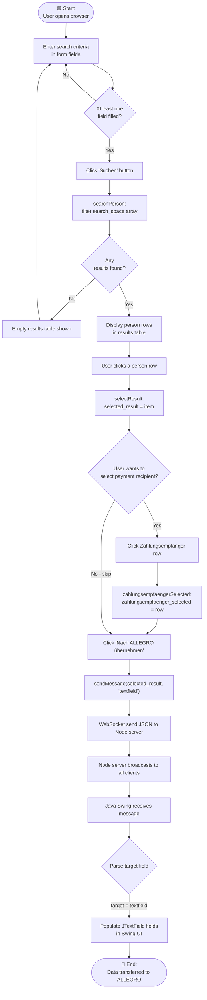
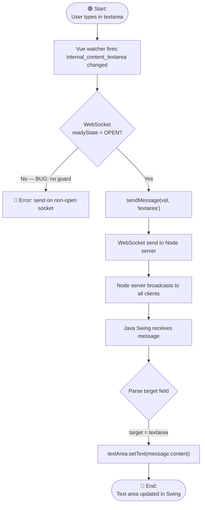
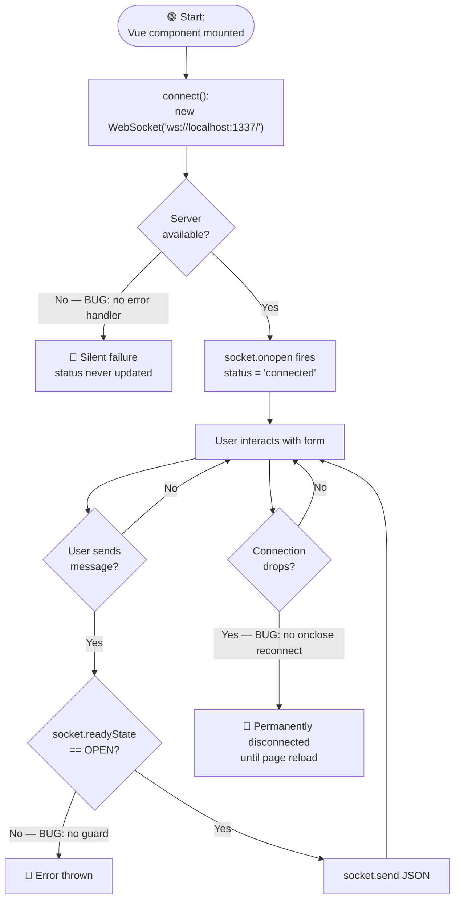

# GenInsights — Business Rules & BPMN Workflows

**Repository:** test-custom-agents-2  
**Generated by:** GenInsights All-in-One Agent

---

## Business Rules

### BR-001 — Person Search Matching Rule
**Type:** Decision / Filter  
**Priority:** High  
**Source:** `node-vue-client/src/components/Search.vue:143–156`

A person record from the local data set is included in search results if **any one** of the following conditions is true:
- The `last` name field is non-empty AND the record's `name` contains the input (case-insensitive substring)
- The `first` name field is non-empty AND the record's `first` contains the input (case-insensitive substring)
- The `zip` field is non-empty AND the record's `zip` equals the input (exact match)
- The `ort` field is non-empty AND the record's `ort` contains the input (case-insensitive substring)
- The `street` field is non-empty AND the record's `street` contains the input (case-insensitive substring)
- The `hausnr` field is non-empty AND the record's `hausnr` contains the input (case-insensitive substring)

**⚠️ Risk:** Empty search form (all fields blank) returns zero results (no match is triggered). Users cannot list all records.

---

### BR-002 — Payment Recipient Selection Rule
**Type:** Process  
**Priority:** High  
**Source:** `Search.vue:168–170`, `sendMessage():161`

When a user selects a payment recipient (Zahlungsempfänger), the selected IBAN/BIC/valid-from row is attached to the transfer payload. When "Nach ALLEGRO übernehmen" is clicked, the payload sent via WebSocket replaces the `zahlungsempfaenger` field in the selected person object with **only** the currently selected payment recipient (not the full list).

**Rule:** If no payment recipient has been selected, `zahlungsempfaenger_selected` remains `""` (empty string), and that empty value is sent — there is no validation guard preventing submission without a payment recipient selected.

---

### BR-003 — WebSocket Message Routing Rule
**Type:** Decision  
**Priority:** Critical  
**Source:** `websocket/Main.java:288–305`

The Node server broadcasts all messages to **all connected clients**. The Java client receives the message and routes it based on the `target` field:
- `target === "textarea"` → content is written to the free-text area (`textArea.setText()`)
- `target === "textfield"` → content is parsed as a full person JSON object and each field is mapped to individual `JTextField` components
- Any other target value → silently ignored (no default/fallback)

---

### BR-004 — Form Submission Validation Rule
**Type:** Validation (absent)  
**Priority:** High  
**Source:** `com/poc/model/PocModel.java:33–48`

When "Anordnen" is clicked, **all** model fields are included in the HTTP POST regardless of whether they have been filled in. Fields initialised to `null` will cause a `NullPointerException` before the HTTP call even executes (`model.get(val).getField().toString()` on null). There is no "required field" validation.

---

### BR-005 — Gender Selection Rule
**Type:** Process  
**Priority:** Low  
**Source:** `PocView.java:75–78`, `websocket/Main.java:108–111`

Gender selection defaults to "Weiblich" (female) on form initialisation. The user can change to "Männlich" or "Divers". The selected state is bound via `ChangeListener` to the model's `FEMALE`, `MALE`, and `DIVERSE` boolean properties. All three boolean flags are included independently in the HTTP POST payload.

---

## BPMN Workflows

### WF-001 — Person Search & Transfer to ALLEGRO



---

### WF-002 — Free-Text Area Sync



---

### WF-003 — PoC Presenter: Anordnen Submission

```mermaid
flowchart TD
    A([🟢 Start:\nUser clicks 'Anordnen']) --> B["PocPresenter ActionListener fires"]
    B --> C["PocModel.action() called"]
    C --> D[Iterate all ModelProperties]
    D --> E{model.get val\n.getField() == null?}
    E -->|Yes — BUG| F[🔴 NullPointerException thrown\nApp crashes]
    E -->|No| G[Build data HashMap\nfrom all field values]
    G --> H["HttpBinService.post(data)"]
    H --> I["Open HttpURLConnection to\nhttp://localhost:8080/post"]
    I --> J[Write JSON body via\nJsonGenerator to OutputStream]
    J --> K[Read response via Scanner]
    K --> L{responseBody\nempty?}
    L -->|No| M["EventEmitter.emit(responseBody)"]
    L -->|Yes| N["EventEmitter.emit('Failed operation')"]
    M --> O[PocPresenter listener receives event]
    N --> O
    O --> P["PocView.textArea.setText(eventData)"]
    P --> Q[Clear all form fields]
    Q --> R([🔴 End:\nForm reset, response shown])
```

---

### WF-004 — WebSocket Connection Lifecycle


