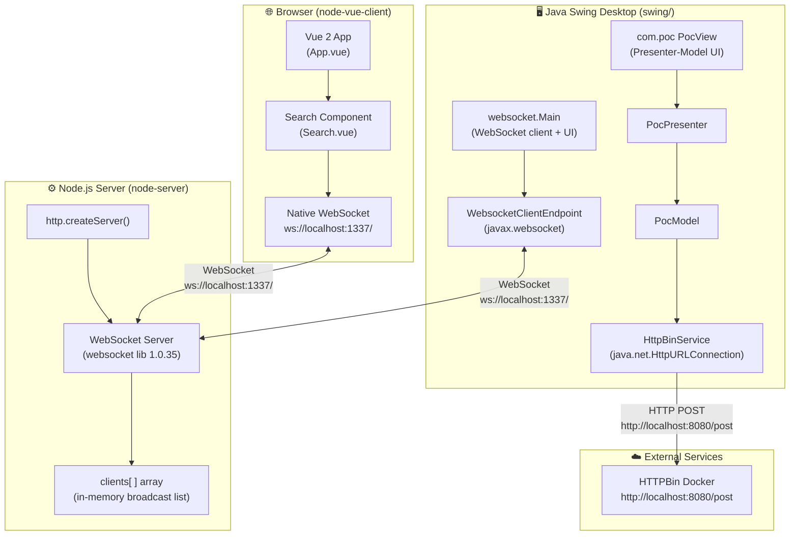
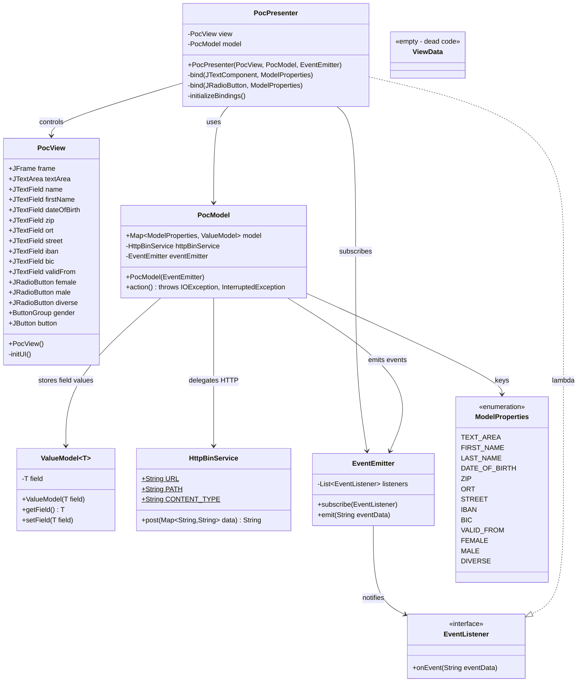
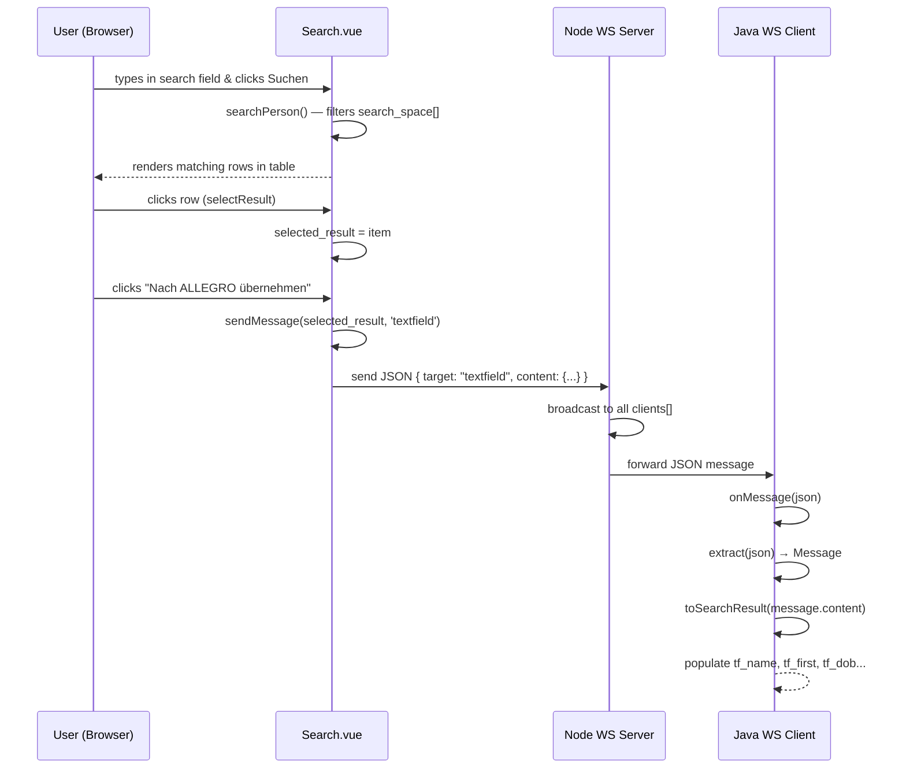
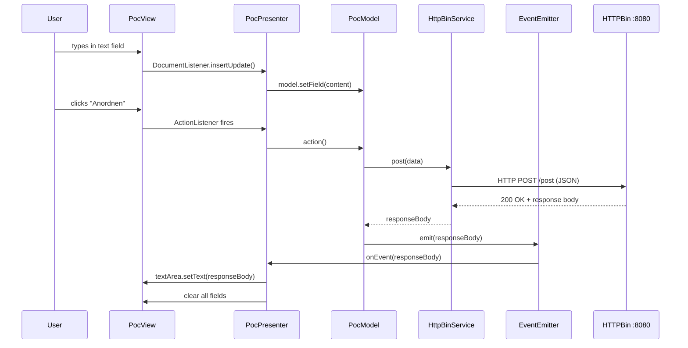
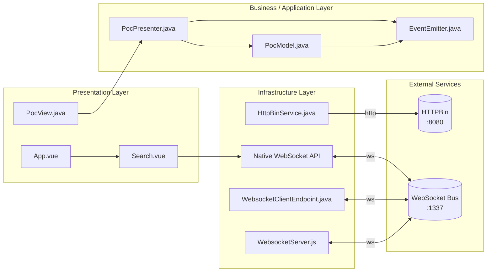
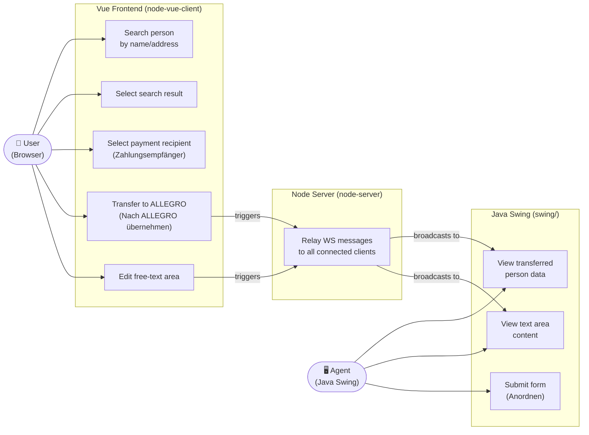
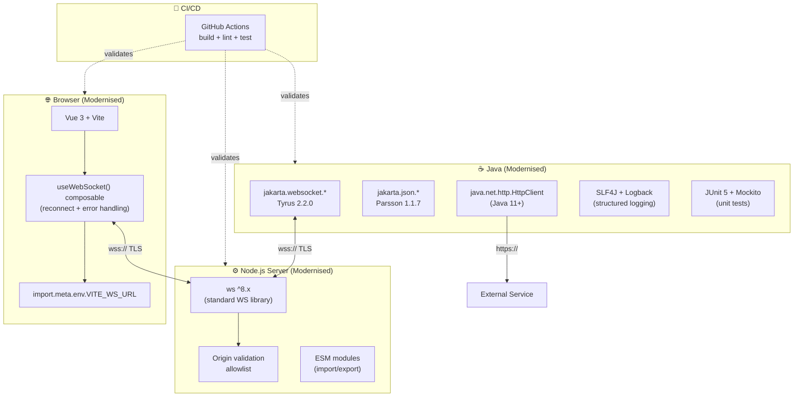

# GenInsights — UML & Architecture Diagrams

**Repository:** test-custom-agents-2  
**Generated by:** GenInsights All-in-One Agent

---

## 1. System Architecture Overview



---

## 2. Class Diagram — Java Swing (websocket package)

```mermaid
classDiagram
    class Main {
        -CountDownLatch latch$
        -JFrame frame$
        -JTextArea textArea$
        -JTextField tf_name$
        -JTextField tf_first$
        -JTextField tf_dob$
        -JTextField tf_zip$
        -JTextField tf_ort$
        -JTextField tf_street$
        -JTextField tf_hausnr$
        -JTextField tf_ze_iban$
        -JTextField tf_ze_bic$
        -JTextField tf_ze_valid_from$
        -JRadioButton rb_female$
        -JRadioButton rb_male$
        -JRadioButton rb_diverse$
        -JsonParserFactory jsonParserFactory$
        +main(String[] args)$
        -initUI()$
        +extract(String json)$ Message
        +toSearchResult(String json)$ SearchResult
    }

    class WebsocketClientEndpoint {
        +Session userSession
        +WebsocketClientEndpoint(URI endpointURI)
        +onOpen(Session)
        +onClose(Session, CloseReason)
        +onMessage(String json)
        +sendMessage(String message)
    }

    class Message {
        +String target
        +String content
        +Message(String target, String message)
    }

    class SearchResult {
        +String name
        +String first
        +String dob
        +String zip
        +String ort
        +String street
        +String hausnr
        +String ze_iban
        +String ze_bic
        +String ze_valid_from
    }

    Main +-- WebsocketClientEndpoint : inner class
    Main +-- Message : inner class
    Main +-- SearchResult : inner class
    WebsocketClientEndpoint ..> Message : creates
    WebsocketClientEndpoint ..> SearchResult : calls toSearchResult()
```

---

## 3. Class Diagram — Java Swing (com.poc package)



---

## 4. Sequence Diagram — Person Search & WebSocket Broadcast Flow



---

## 5. Sequence Diagram — PoC Presenter Action Flow



---

## 6. Component Diagram — Layer View



---

## 7. Use Case Diagram



---

## 8. Modernisation Target Architecture (Recommended)


