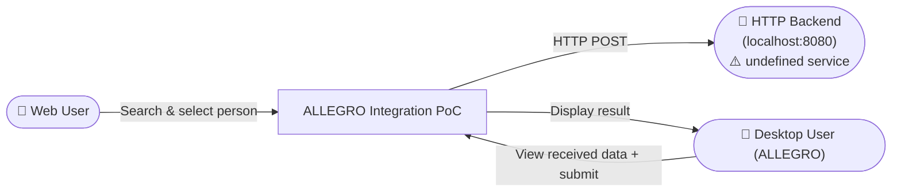
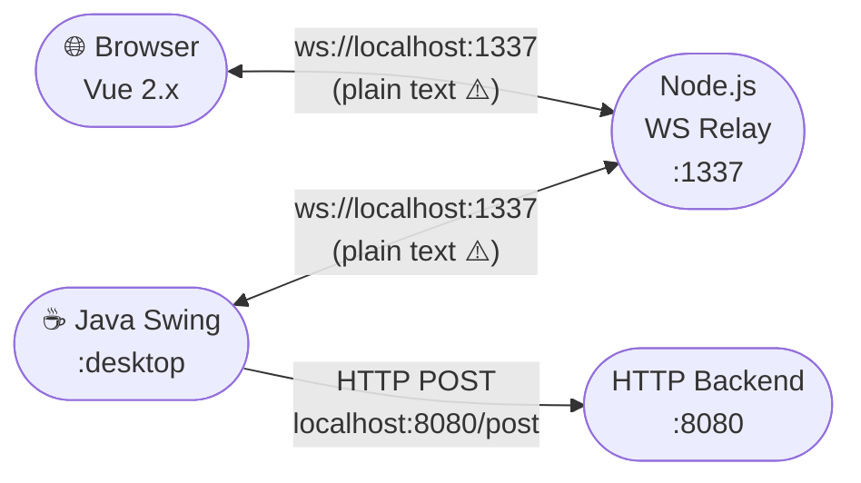
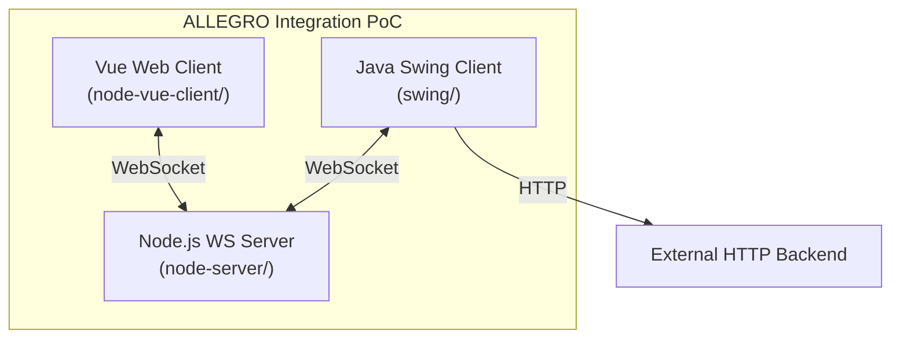
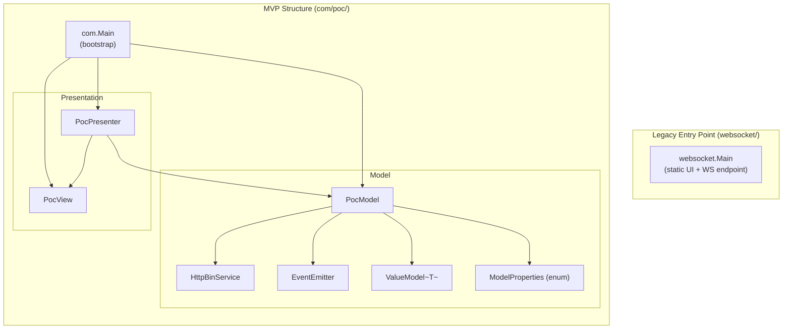
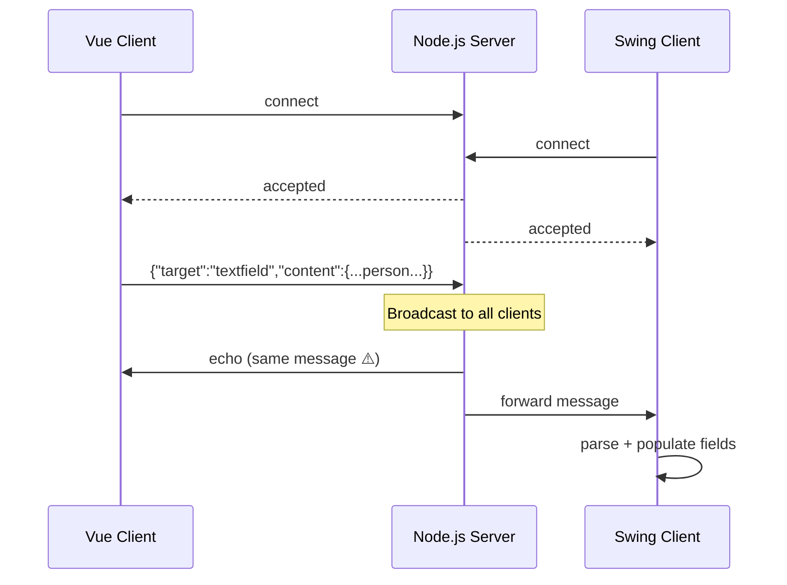
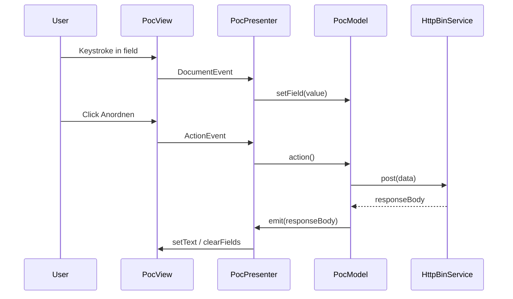
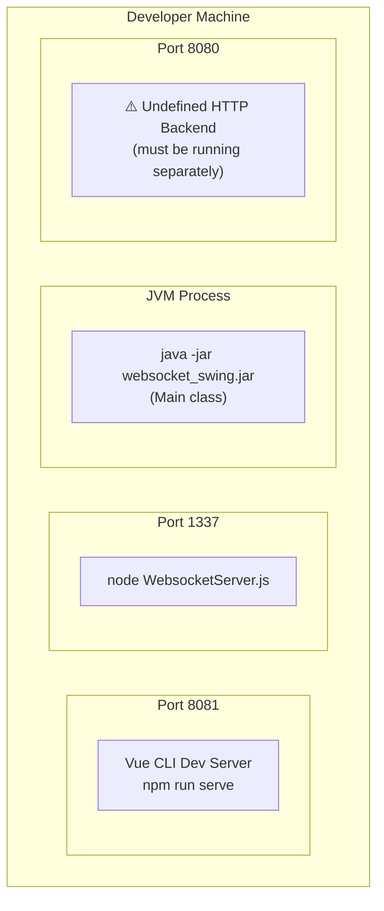
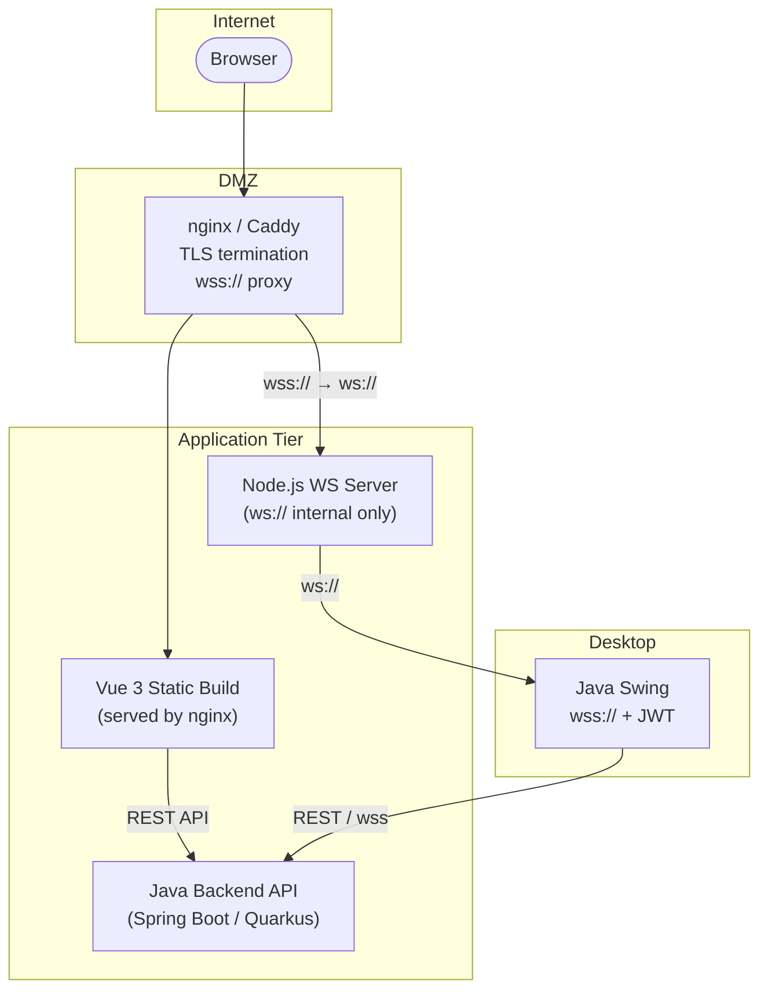

# Architecture Documentation (arc42) — WebSocket Swing Application

> **Standard:** arc42 v8
> Generated by **GenInsights All-in-One Agent**
> Skills Used: arc42-template, mermaid-diagrams, json-output-schemas

---

## Table of Contents

1. [Introduction and Goals](#1-introduction-and-goals)
2. [Constraints](#2-constraints)
3. [Context and Scope](#3-context-and-scope)
4. [Solution Strategy](#4-solution-strategy)
5. [Building Block View](#5-building-block-view)
6. [Runtime View](#6-runtime-view)
7. [Deployment View](#7-deployment-view)
8. [Cross-Cutting Concepts](#8-cross-cutting-concepts)
9. [Architectural Decisions](#9-architectural-decisions)
10. [Quality Requirements](#10-quality-requirements)
11. [Risks and Technical Debt](#11-risks-and-technical-debt)
12. [Glossary](#12-glossary)

---

## 1. Introduction and Goals

### 1.1 Purpose

This system is a **WebSocket-bridged data-entry proof-of-concept** (referred to as "ALLEGRO Integration PoC"). It allows a web user to search for persons and payment data and transfer the selected record into a Java Swing desktop application — simulating an integration between a modern web UI and a legacy desktop system.

### 1.2 Quality Goals

| Priority | Quality Goal | Motivation |
|----------|-------------|------------|
| 1 | **Security** | Financial data (IBAN, BIC) must not be exposed. All traffic must be encrypted. Origin and authentication controls are required. |
| 2 | **Reliability** | WebSocket connections must reconnect automatically. Swing UI must remain responsive on the EDT at all times. |
| 3 | **Maintainability** | MVP pattern should enforce clean separation. JSON parsing must not be duplicated in hand-rolled parsers. |
| 4 | **Modernizability** | All three tiers must be migratable to current LTS versions (Node.js 22, Vue 3, Jakarta EE 10). |

### 1.3 Stakeholders

| Role | Expectations |
|------|-------------|
| End User (Web) | Responsive search UI; clear feedback on connection state |
| End User (Desktop) | Accurate data population in Swing form; no crashes |
| Developer | Maintainable, testable code with clear layer boundaries |
| Security Officer | Encrypted transport, no PII in source code, access control |

---

## 2. Constraints

### 2.1 Technical Constraints

| Constraint | Description |
|-----------|-------------|
| Java 22 | Swing desktop client compiled with `--source 22 --target 22` |
| Vue 2.x | Web client currently on Vue 2.6 (EOL Dec 2023) |
| Node.js | Server uses CommonJS `var` syntax (ES5 targeting) |
| WebSocket protocol | Unencrypted `ws://` on port 1337 |
| No test framework | Zero test files in all three tiers |
| localhost-only | All URLs hardcoded to localhost — no environment config |

### 2.2 Organizational Constraints

| Constraint | Description |
|-----------|-------------|
| PoC scope | System described as a proof-of-concept; mock data replaces real backend |
| No authentication | The system assumes trusted local-network operation only |
| Single developer artifact | No CI/CD pipeline; no build server configuration found |

---

## 3. Context and Scope

### 3.1 Business Context

### 3.2 Technical Context

---

## 4. Solution Strategy

### 4.1 Current Strategy (PoC)

| Decision | Rationale | Risk |
|----------|-----------|------|
| Node.js as WebSocket relay | Language-agnostic relay; decouples Vue from Java | No auth, no TLS, no persistence |
| Vue.js for search UI | Rapid prototyping; reactive data binding | EOL framework, no API layer |
| Java Swing for desktop | Existing ALLEGRO desktop paradigm | Legacy patterns, no EDT discipline |
| MVP pattern in Swing | Improves testability vs. monolithic Main | Partially implemented; encapsulation broken |
| Hardcoded mock data | Avoids backend dependency for PoC | PII risk if promoted to production |

### 4.2 Recommended Target Strategy

| Area | Recommendation |
|------|----------------|
| Transport | Migrate to `wss://` with TLS; add JWT auth on WS upgrade |
| Frontend | Migrate Vue 2 → Vue 3 + Vite + TypeScript |
| Data | Replace hardcoded array with REST API calls |
| Java | Complete MVP migration; merge websocket.Main into com.poc |
| JSON parsing | Replace low-level parser with Jackson ObjectMapper |
| HTTP client | Replace HttpURLConnection with java.net.http.HttpClient |
| Testing | JUnit 5 + Mockito for Java; Vitest + Vue Test Utils for frontend |

---

## 5. Building Block View

### 5.1 Level 1 — System Overview

### 5.2 Level 2 — Vue Web Client

| Component | Responsibility |
|-----------|---------------|
| `main.js` | Bootstrap Vue 2 instance |
| `App.vue` | Root layout; header bar |
| `Search.vue` | Search form, result tables, WebSocket send/receive, textarea relay |

### 5.3 Level 2 — Node.js Server

| Component | Responsibility |
|-----------|---------------|
| `WebsocketServer.js` | HTTP server (empty), WebSocket accept/broadcast/close |
| `clients[]` array | In-memory registry of connected sockets |

### 5.4 Level 2 — Java Swing Client

**Note:** The two entry points (`websocket.Main` and `com.Main`) are parallel implementations with overlapping responsibilities. The `websocket.Main` is the original prototype; `com.Main` introduces the MVP pattern. They should be merged.

---

## 6. Runtime View

### 6.1 WebSocket Message Flow

### 6.2 Form Submit Flow

---

## 7. Deployment View

### 7.1 Current (localhost PoC)

### 7.2 Recommended Production Deployment

---

## 8. Cross-Cutting Concepts

### 8.1 Security

| Concern | Current State | Required State |
|---------|--------------|----------------|
| Transport encryption | ❌ ws:// plain text | ✅ wss:// with TLS |
| Origin validation | ❌ All origins accepted | ✅ Allowlist of permitted origins |
| Authentication | ❌ None | ✅ JWT on WebSocket upgrade |
| PII in source code | ❌ IBAN/BIC in Search.vue | ✅ Backend API only |
| Input validation | ❌ None | ✅ Schema validation on WS messages |

### 8.2 Threading (Java Swing)

**Rule:** All Swing component creation and mutation **must** occur on the Event Dispatch Thread (EDT). All I/O and long-running operations **must** occur on background threads.

| Location | Current | Required |
|----------|---------|----------|
| `websocket.Main.initUI()` | Main thread ❌ | `SwingUtilities.invokeLater()` ✅ |
| `WebsocketClientEndpoint.onMessage()` | WebSocket thread ❌ | `SwingUtilities.invokeLater()` ✅ |
| `com.Main` — `new PocView()` | Main thread ❌ | `SwingUtilities.invokeLater()` ✅ |
| `PocPresenter` EventEmitter lambda | EventEmitter thread ❌ | `SwingUtilities.invokeLater()` ✅ |

### 8.3 Error Handling Strategy

| Tier | Current | Required |
|------|---------|----------|
| Node.js | No error handlers — process crashes | `error` events on server and connections |
| Vue | No WS error/close handlers | `onerror`, `onclose`, reconnect logic |
| Java | IOException → RuntimeException | User-visible dialog + proper logging |
| Java | InterruptedException swallowed | `Thread.currentThread().interrupt()` |

### 8.4 JSON Serialization

| Tier | Current | Required |
|------|---------|----------|
| Java (recv) | 140-line hand-rolled parser | Jackson `ObjectMapper` with records |
| Java (send) | `javax.json.JsonGenerator` | Jackson / `jakarta.json` |
| Node.js | Native `JSON.parse/stringify` | No change needed |
| Vue | Native `JSON.parse/stringify` | No change needed |

---

## 9. Architectural Decisions

### ADR-001: MVP Pattern in Swing Layer

**Decision:** Adopt Model-View-Presenter pattern for the Swing client.
**Status:** Partially implemented (com.poc package). Not yet applied to websocket.Main.
**Rationale:** Enables unit testing of presenter logic without a real Swing display. Separates UI concerns.
**Consequence:** Presenter must communicate with View through an interface (IPocView), not via direct field access. Currently violated — see ISS-030.

---

### ADR-002: Node.js WebSocket Relay

**Decision:** Use a separate Node.js process as WebSocket broker between the Vue client and Swing client.
**Status:** Implemented.
**Rationale:** Decouples the two UI technologies. The Java client does not need to run a web server.
**Consequence:** A third process must be running. Security of the relay is critical — currently it is an open relay with no authentication.

---

### ADR-003: Vue.js 2.x for Web Client

**Decision:** Use Vue 2.x for the web search form.
**Status:** Implemented. **Obsolete** — Vue 2 reached EOL December 31, 2023.
**Consequence:** Must migrate to Vue 3. No security patches will be issued for Vue 2 post-EOL.

---

### ADR-004 (Proposed): Replace Manual JSON Parser with Jackson

**Decision:** Replace the 140-line streaming JSON parser in `websocket.Main` with Jackson `ObjectMapper`.
**Status:** Proposed.
**Rationale:** The current implementation is fragile, verbose, and impossible to unit test. Nested objects in the JSON structure would cause silent parsing failures.
**Consequence:** Add `jackson-databind` to `pom.xml`. Define `record` or `@JsonProperty`-annotated DTO classes.

---

### ADR-005 (Proposed): Migrate to wss:// with JWT Authentication

**Decision:** All WebSocket traffic must use TLS. The upgrade request must carry a signed JWT.
**Status:** Proposed.
**Rationale:** Current plain-text broadcast of IBAN and personal data is a security violation.
**Consequence:** Requires a reverse proxy (nginx/Caddy) for TLS termination, or direct TLS in Node.js. Vue client must obtain a token before connecting.

---

## 10. Quality Requirements

### 10.1 Quality Scenarios

| ID | Quality Attribute | Scenario | Current | Target |
|----|------------------|----------|---------|--------|
| QS-001 | Security | Attacker on local network intercepts WebSocket traffic | ❌ All data visible in plain text | ✅ All data encrypted with TLS |
| QS-002 | Security | Third-party website connects to WebSocket server | ❌ Connection accepted | ✅ Connection rejected (origin check) |
| QS-003 | Reliability | WebSocket server restarts | ❌ Vue client shows nothing, remains broken | ✅ Exponential backoff reconnect |
| QS-004 | Reliability | User clicks "Anordnen" with empty fields | ❌ NullPointerException crashes process | ✅ Validation message shown |
| QS-005 | Maintainability | New person field needs to be added | ❌ Changes in 5+ places including manual parser | ✅ Changes in 2 places (DTO + UI) with Jackson |
| QS-006 | Performance | 100 concurrent browser connections | ❌ Unknown — no load tests | ✅ Verified with ws benchmarks |

---

## 11. Risks and Technical Debt

### 11.1 Top Risks

| Risk ID | Risk | Probability | Impact | Mitigation |
|---------|------|-------------|--------|------------|
| R-001 | IBAN/PII data exposed via plain-text WebSocket | High (localhost PoC) | Critical | Add wss:// + remove hardcoded data |
| R-002 | Application crash due to EDT violations on any message | High | High | Wrap all UI updates in `invokeLater` |
| R-003 | NPE in `PocModel.action()` on first button click | Certain (fields start null) | High | Null-safe field collection |
| R-004 | Stale-index crash removes wrong WebSocket client | Medium | Medium | Use Set + filter instead of array index |
| R-005 | Vue 2 security vulnerability post-EOL | Low (no patches) | Medium | Migrate to Vue 3 |

### 11.2 Technical Debt Summary

| ID | Type | Impact | Effort | Description |
|----|------|--------|--------|-------------|
| TD-001 | Design | HIGH | Medium | Two parallel Swing entry points with duplicated UI layout |
| TD-002 | Test | HIGH | High | Zero test coverage across all three tiers |
| TD-003 | Design | HIGH | High | Hardcoded mock data instead of real API integration |
| TD-004 | Code | MEDIUM | Low | 140-line manual JSON parser replaceable with Jackson |
| TD-005 | Documentation | MEDIUM | Low | No WebSocket protocol documentation |
| TD-006 | Design | MEDIUM | High | No authentication anywhere in the stack |

---

## 12. Glossary

| Term | Definition |
|------|-----------|
| **ALLEGRO** | The legacy Java Swing desktop application being integrated with the web UI |
| **EDT** | Event Dispatch Thread — the single thread in Java Swing on which all UI operations must occur |
| **Zahlungsempfänger** | German: "payment recipient" — the entity (IBAN/BIC) associated with a person record |
| **ws://** | Plain-text WebSocket protocol (insecure) |
| **wss://** | WebSocket Secure — WebSocket over TLS |
| **MVP** | Model-View-Presenter — architectural pattern separating UI (View), state (Model), and logic (Presenter) |
| **PoC** | Proof of Concept — exploratory implementation not yet production-ready |
| **PII** | Personally Identifiable Information — data such as name, address, date of birth |
| **IBAN** | International Bank Account Number |
| **BIC** | Bank Identifier Code (also known as SWIFT code) |
| **SFC** | Vue Single File Component (`.vue` file combining template, script, style) |
| **EOL** | End of Life — software no longer receiving security updates |

---

*Generated by GenInsights All-in-One Agent | arc42 v8 template | Skills: arc42-template, mermaid-diagrams, geninsights-logging, json-output-schemas*
