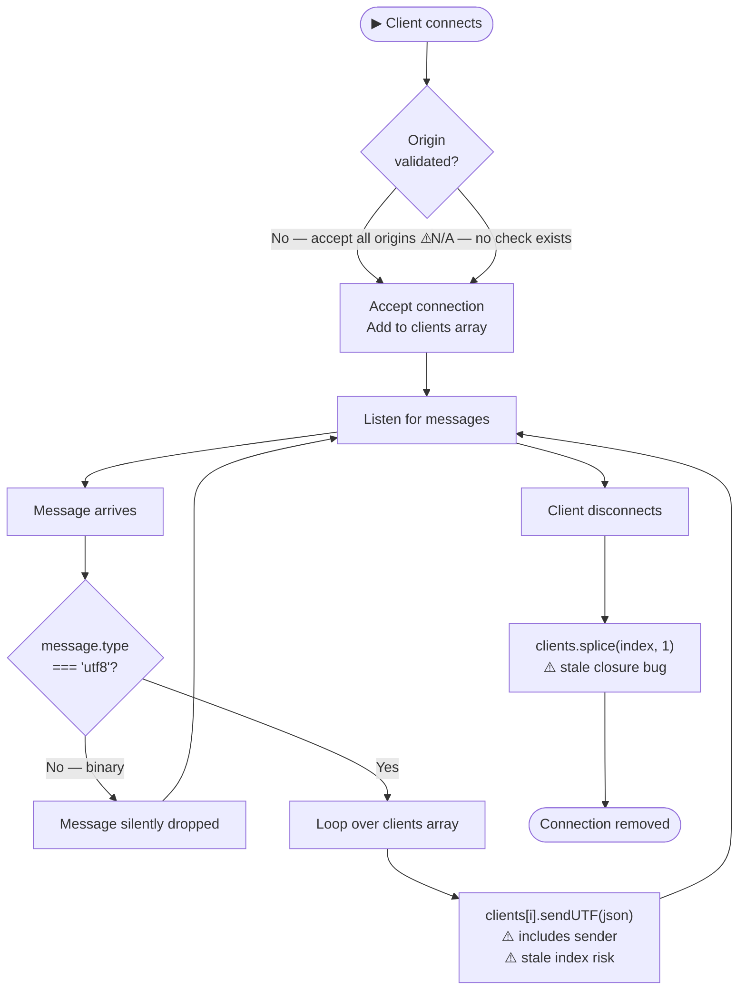
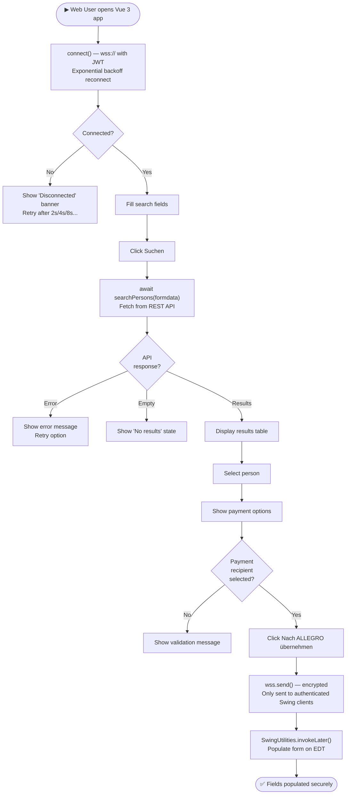

# BPMN Workflow Diagrams — WebSocket Swing Application

> Generated by **GenInsights All-in-One Agent** | Skills: mermaid-diagrams

---

## WF-001: Person Search and Transfer to ALLEGRO (Current State — As-Is)

```mermaid
flowchart TD
    Start([▶ Web User opens application]) --> CheckWS{WebSocket\nconnected?}
    CheckWS -->|No — no feedback shown ⚠️| Broken([❌ Silent failure\nForm unusable])
    CheckWS -->|Yes| FillForm[Fill search fields\nName / ZIP / Street etc.]

    FillForm --> ClickSearch[Click 'Suchen']
    ClickSearch --> FilterLocal["searchPerson()\nFilter hardcoded local array ⚠️"]
    FilterLocal --> ResultCount{Results\nfound?}

    ResultCount -->|0 results| NoFeedback[No empty-state message ⚠️\nTable stays blank]
    NoFeedback --> FillForm

    ResultCount -->|≥1 result| ShowResults[Display results table]
    ShowResults --> SelectPerson[Click person row\nselectResult(item)]
    SelectPerson --> ShowPayments[Display Zahlungsempfaenger sub-table]

    ShowPayments --> SelectPayment{Select IBAN\nrow?}
    SelectPayment -->|No selection| SendNoPayment[Send with empty\nzahlungsempfaenger ⚠️]
    SelectPayment -->|Yes| SelectZE[zahlungsempfaengerSelected(item)]
    SelectZE --> ClickSend[Click 'Nach ALLEGRO übernehmen']
    SendNoPayment --> ClickSend

    ClickSend --> SendWS["sendMessage(selected_result, 'textfield')\nserialize + ws.send()"]
    SendWS --> ServerReceive[WS Server receives message]
    ServerReceive --> BroadcastAll["Broadcast to ALL clients\n(including sender ⚠️)"]
    BroadcastAll --> SwingReceive[Swing client onMessage()]

    SwingReceive --> ParseJSON["toSearchResult(json)\n140-line manual parser ⚠️"]
    ParseJSON --> UpdateSwing[Populate Swing text fields\n⚠️ Off EDT — threading bug]
    UpdateSwing --> Done([✅ Fields populated in ALLEGRO])
```

---

## WF-002: MVP Form Submission (com.poc package — As-Is)

```mermaid
flowchart TD
    Start([▶ Application starts]) --> CreateUI[new PocView()\n⚠️ Main thread — EDT violation]
    CreateUI --> WireBindings["PocPresenter.initializeBindings()\nAttach DocumentListeners"]

    WireBindings --> UserEdit[User edits form field]
    UserEdit --> DocEvent[DocumentEvent fired\n(insertUpdate / removeUpdate)]
    DocEvent --> SyncModel[model.get(prop).setField(content)\n⚠️ changedUpdate empty]
    SyncModel --> UserEdit

    UserEdit --> ClickAnordnen[User clicks 'Anordnen']
    ClickAnordnen --> ActionEvent[ActionListener fires]
    ActionEvent --> CallAction["model.action()"]

    CallAction --> CollectFields[Iterate ModelProperties enum\nBuild HashMap]
    CollectFields --> NullCheck{Any field\nvalue null?}
    NullCheck -->|Yes — NPE thrown ⚠️| RuntimeEx[RuntimeException\nUnhandled crash]
    NullCheck -->|No| PostHTTP["httpBinService.post(data)\nHttpURLConnection ⚠️ legacy API"]

    PostHTTP --> HTTPResponse{HTTP\nresponse code?}
    HTTPResponse -->|4xx/5xx with body — treated as success ⚠️| CheckBody
    HTTPResponse -->|network error| IOExCatch["catch(IOException)\n→ RuntimeException ⚠️"]

    CheckBody{Response\nbody empty?}
    CheckBody -->|Non-empty| EmitSuccess["eventEmitter.emit(responseBody)"]
    CheckBody -->|Empty| EmitFail["eventEmitter.emit('Failed operation')"]

    EmitSuccess --> PresenterLambda[PocPresenter onEvent lambda\n⚠️ Off EDT — threading bug]
    EmitFail --> PresenterLambda

    PresenterLambda --> ResetForm[Clear all fields\nReset radio to 'female']
    PresenterLambda --> ShowResponse[textArea.setText(eventData)]
    ResetForm --> Done([✅ Form reset — data lost even on failure ⚠️])
    ShowResponse --> Done
```

---

## WF-003: WebSocket Message Routing (Node.js Server)



---

## WF-004: Textarea Relay Workflow

```mermaid
flowchart TD
    Start([▶ User types in Vue textarea]) --> WatchFires["Vue watch:\ninternal_content_textarea"]
    WatchFires --> CheckReady{socket.readyState\n=== OPEN?}
    CheckReady -->|Not checked — no guard ⚠️| SendMsg["socket.send()\nMay throw if not open ⚠️"]
    CheckReady -->|Should be| SendMsg

    SendMsg --> ServerReceive[Server receives message]
    ServerReceive --> BroadcastAll["Broadcast to all clients\n(incl. sender ⚠️)"]
    BroadcastAll --> SwingReceive[Swing onMessage()]

    SwingReceive --> TargetCheck{"message.target\n=== 'textarea'?"}
    TargetCheck -->|Yes| SetTextArea["SwingUtilities NOT used ⚠️\ntextArea.setText(content)"]
    TargetCheck -->|No| Ignore[Message ignored / routed elsewhere]

    SetTextArea --> Done([✅ Textarea content appears in Swing])
```

---

## WF-005: To-Be Modernized Flow (Recommended Future State)


