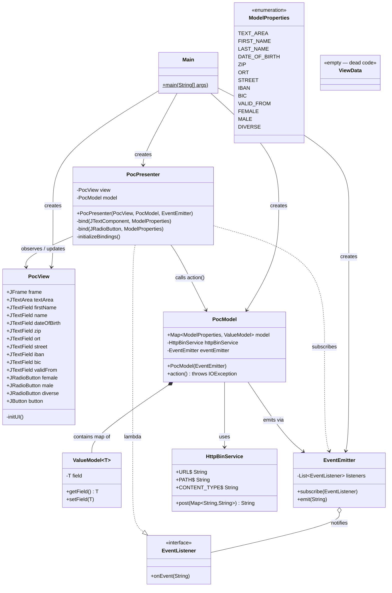
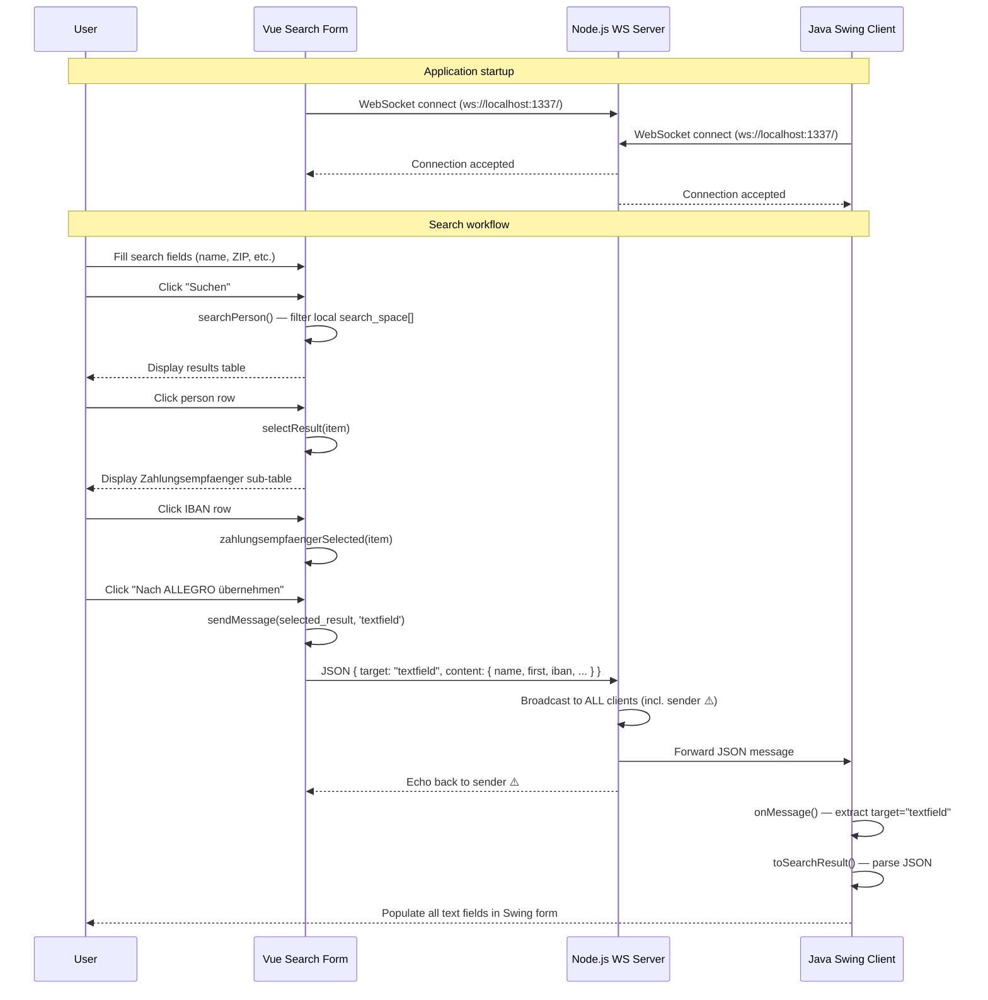
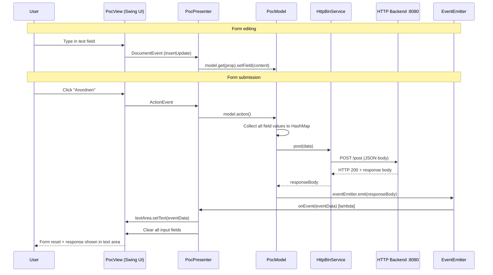
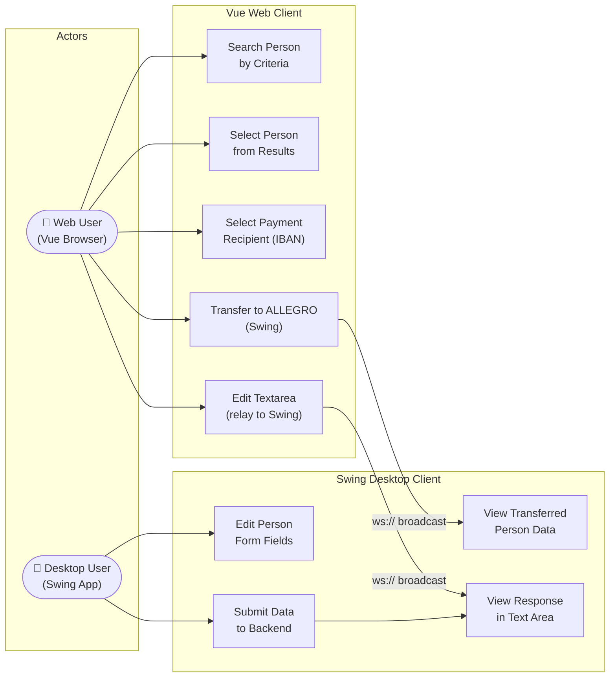
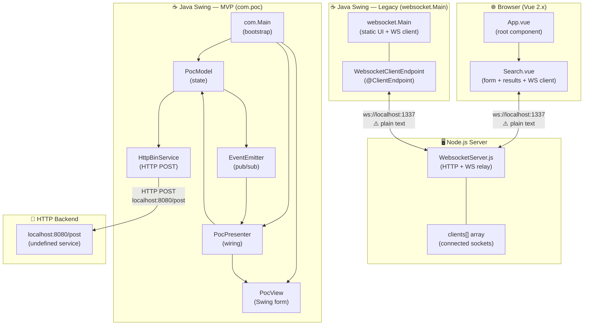
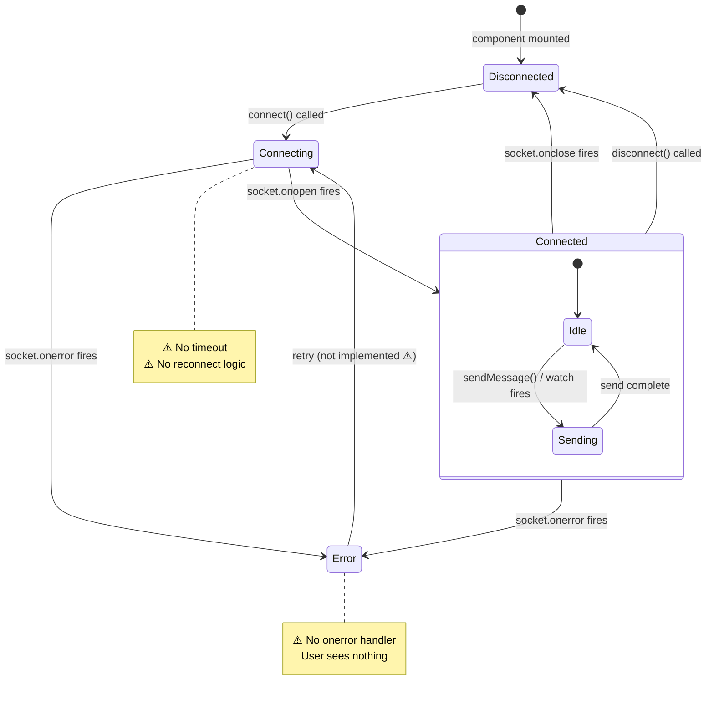

# UML Diagrams — WebSocket Swing / Vue / Node.js Application

> Generated by **GenInsights All-in-One Agent** | Skills: mermaid-diagrams

---

## 1. Class Diagram — Java Swing MVP Layer



---

## 2. Class Diagram — Legacy WebSocket Entry Point (websocket.Main)

```mermaid
classDiagram
    direction TB

    class LegacyMain {
        <<websocket.Main>>
        -CountDownLatch latch$
        -JFrame frame$
        -JTextArea textArea$
        -JTextField tf_name$
        -JTextField tf_first$
        -JTextField tf_ze_iban$
        -JsonParserFactory jsonParserFactory$
        +main(String[])$
        -initUI()$
        +toSearchResult(String)$ SearchResult
    }

    class WebsocketClientEndpoint {
        <<static inner — @ClientEndpoint>>
        +Session userSession
        +WebsocketClientEndpoint(URI)
        +onOpen(Session)
        +onClose(Session, CloseReason)
        +onMessage(String json)
        +sendMessage(String)
        +extract(String)$ Message
    }

    class Message {
        <<static final inner record>>
        +String target
        +String content
    }

    class SearchResult {
        <<static final inner>>
        +String name
        +String first
        +String dob
        +String zip
        +String iban
        +String bic
        +String ze_valid_from
    }

    LegacyMain +-- WebsocketClientEndpoint
    LegacyMain +-- Message
    LegacyMain +-- SearchResult
    WebsocketClientEndpoint ..> Message : produces
    WebsocketClientEndpoint ..> SearchResult : produces
    WebsocketClientEndpoint ..> LegacyMain : updates static UI fields
```

---

## 3. Sequence Diagram — Person Search & ALLEGRO Transfer



---

## 4. Sequence Diagram — MVP Form Submission



---

## 5. Use Case Diagram



---

## 6. Architecture / Component Diagram



---

## 7. State Diagram — WebSocket Connection (Vue Client)


